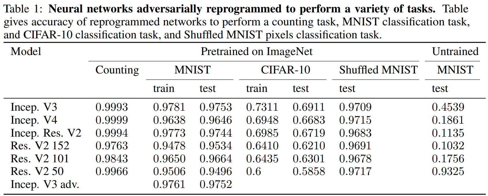
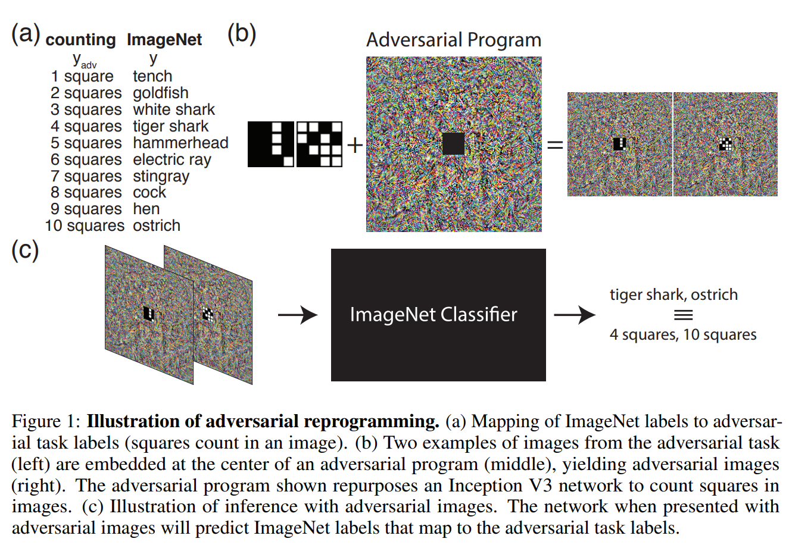

논문 및 이미지 출처 : <https://arxiv.org/pdf/1806.11146>

# Abstract

DNN 은 _adbersarial_ attack 에 취약하다.

computer vision 분야에 image 에 well-crafted perturbation 를 추가하면 고양이를 컴퓨터로 혼동하는 실수를 유발할 수 있다.

이전 adversarial attack 은 model 의 성능을 저하시키거나 attacker 가 미리 정한 specific outputs 을 모델이 생성하도록 하는 것이 목적이었다.

저자는 대신 attacker 가 원하는 task 를 수행하도록 target model 을 _reprogram_ 하는 attacks 를 소개한다.

- 이는 test-time 에 input 마다 원하는 output 을 지정하거나 계산할 필요 없이, all test-time 에 input 에 추가할 수 있는 single adversarial perturbation 을 찾아낸다.
- 이를 통해 model 이 훈련되지 않은 task 를 수행하도록 한다.
- 이러한 perturbations 는 new task 를 위한 reprogram 으로 간주될 수 있다.

저자는 6 ImageNet classification model 에 대해 adversarial reprogramming 을 수행하며, 이 모델들이 counting task 뿐 아니라 MNIST 와 CIFAR-10 examples 를 input 으로 제공받아 classification task 를 수행하도록 repurposing 하였다.

# 1. Introduction

adversarial examples 연구는 종종 model input 에 small changes 로 model prediction error 를 유발하는 것을 목표로 하는 attacker 의 위험성 측면에서 동기부여한다. 예로, sticker (small $L_0$ perturbation) 을 통해 자율 주행 자동차가 phantom stop sign 에 반응하게 하거나, photo 를 미묘하게 조작 (small $L_\infty$ perturbation) 하여 보험 회사의 손해 모델이 사고로 인한 청구를 과대평가하게 만들 수 있다.

이 맥락에서, 다양한 방법들이 adversarial attack 을 구성하고, 방어하기 위해 제안되었다.

지금까지 대부분의 adversarial attack 은 specific output 을 요구하지 않고 모델 성능을 저하시키는 _untargeted_ attacks 이거나, attacker 가 input 에 대해 specific output 을 생성하도록 설계된 adversarial perturbation 을 사용하는 _targeted_ attacks 로 구성되었다.

예로, classifier 를 대상으로 한 공격은 각 input image 에 대해 specific output class 를 target 하도록 할 수 있으며, reinforcement learning agent 를 대상으로 한 공격은 그 agent 가 specific state 로 들어가게 할 수 있다.

실제로, adversarial attacks 가 이 프레임워크를 준수해야 한다는 제한은 없으니, 따라서, 머신러닝 시스템을 더 안전하게 만들기 위해 다른 탐구되지 않은 adversarial goals 를 적극적으로 예측하는 것이 중요하다.

이 연구에서는 attacker 가 specific output 을 계산할 필요 없이, attacker 가 선택한 task 를 수행하도록 model 을 reprogramming 하는 새로운 도전적인 adversarial goals 를 고려한다.

- _original task_ 를 수행하는 trained model 을 생각해보자: input $x$ 에 대해 output $f(x)$ 를 생성
- _adversarial task_ 를 수행하고자 하는 attacker 를 생각해보자: input $\tilde{x}$ (x 와 동일한 domain 에 있지 않을 수 있음) 에 대해 function $g(\tilde{x})$ 를 계산하고자 한다.
- 저자는 attacker 가 두 task 간의 mapping 을 학습하는 _adversarial reprogramming functions_ $h_f(·; θ)$ 와 $h_g(·; θ)$ 를 통해 이를 달성할 수 있음을 보여줌.
  - $h_f$ 는 $\tilde{x}$ domain 을 input $x$ domain 으로 변환하며 (i.e., $h_f(x˜; θ)$ 는 function $f$ 의 valid input), 
  - $h_g$ 는 $f(h(\tilde{x}; θ))$ 의 output 을 $g(\tilde{x})$ 의 output 으로 mapping
  - adversarial program 의 parameter $θ$ 는 $h_g(f(h_f(\tilde{x}))) = g(\tilde{x})$ 을 달성하도록 조정

---

저자의 연구는 

- $\tilde{x}$ 를 small image 로 정의하고, $g$ 는 small images 를 처리하는 function 으로 정의하며, $x$ 는 large image, $f$ 는 large image 를 처리하는 function 으로 정의.
- 저자의 $h_f$ function 은 large image 의 center 에 $x$ 를 그리고 borders 에 $θ$ 를 그리는 것으로 구성 (다른 방식도 탐구)
- $h_g$ 는 단순히 output class label 간의 hard coded mapping 이다.
- 더 일반적인 아이디어는; $h_f(h_g)$ 는 두 tasks 간의 input (output) format 을 변환하고 model 이 adversarial task 를 수행하게 하는 일관된 변환일 수 있다

저자는 model 이 new task 를 수행하도록 repurpose 하는 attack class 를 _adversarial reprogramming_ 이라 부른다.

$θ$ 는 adversarial program 이라 부른다.

대부분의 이전 adversarial 연구와 달리, adversarial reprogramming 이 작동하기 위해 이 perturbation 의 크기를 제한할 필요는 없다.

그러나 여전히 imperceptible reprogramming attack 을 구성하는 것이 가능하다. adversarial reprogramming 의 잠재적 결과로는 public facing services 의 계산 자원 도용, AI 기반 비서의 스파이 또는 스팸 봇으로의 전환, 시스템 제공자의 윤리적 원칙을 위반하는 task 에 대한 머신 러닝 서비스의 악용 등이 등이 있습니다.

신경망의 input 에 대한 additive offset 만으로 network 를 new task 에 repurpose 하는 것이 가능할 것 같지 않지만, input 의 changes 만으로 오는 이러한 flexible 은 DNN 의 representation 에 대한 결과와 일치한다. 예로, Raghu et al.(2016) 에서는 network 의 hyperparameter 에 따른 input space 에서 one-dimensional trajectory 를 따라 이동하면서 달성 가능한 unique output patterns 수가 network depth 에 따라 기하급수적으로 증가한다고 보여준다.

---

이 연구는 adversarial reprogramming 의 첫 번째 사례를 제시.

- 이러한 adversarial reprogramming 은 network function 을 ImageNet classification 에서 counting sqares, MNIST digits classification, CIFAR-10 image classification 으로 변경.
- 다음으로, trained 및 untrained network 가 adversarial reprogramming 에 얼마나 취약한지 검사.
- 그 후, original data 와 유사성이 전혀 없는 adversarial data 를 사용하여 adversarial task 를 reprogramming 하는 가능성을 시연하여 transfer learning 의 결과가 adversarial reprogramming 을 완전히 설명하지 못함을 보여준다.
- 더 나아가, adversarial reprogramming 과 data 를 숨기는 가능성을 시연한다.

# 2. Background and Related Work

## 2.1 Adversarial Examples

adversarial examples 의 정의는 "model 이 실수를 하도록 attacker 가 의도적으로 설계한 model input" 이다. 이는 자연적인 이미지를 시작으로 gradient-based optimizer 를 사용해 실수를 유발하는 nearby image 를 찾는 방식으로 형성된다.

이러한 attacks 는 _untargeted_ (attacker 가 어떤 실수든 유발하는데 성공하면 성공하면 성공한 것)일 수도 있고, _targeted_ (attacker 가 model 이 specific incorrect class 를 예측하도록 유도할 때 성공한 것)일 수도 있다.

adversarial attack 은 또한 악성 코드 탐지, 생성 모델, 강화 학습 작업의 network policies, network interpretations 등 다른 분야에서도 제안됨. 

이들 분야에서는 attack 이 여전히 _untargeted_ (일반적으로 성능 저하)이나 _targeted_(specific output 을 생성)으로 남아 있음. 저자는 specific hardcoded output 을 생성하는 대신 specific _funtionality_ 를 생성하는 reprogramming 을 개발하여 이 연구의 범위를 확장.

여러 저자들이 동일한 수정이 많은 다른 input 에 적용될 수 있다는 것을 관찰했다. 예로, Brown et al.(2017) 은 많은 model 의 prediction 을 specific class (e.g., toaster)로 전환할 수 있는 "adversarial patch" 를 설계했다.

저자는 이러한 연구를 이어가며, model 이 adversarial program 에 따라 각 image 를 처리하도록 하기 위해 많은 input image 를 제공할 수 있는 single adversarial program 을 찾는다.

## 2.2 Parastic Computing and Weird Machines

parastic computing 은 network communication protocols 의 이점을 이용하여 원래 설계되지 않은 complex computational task 를 target system 이 수행하도록 강제하는 것을 포함한다. 반면, weird machines 은 targeted computer 에서 arbitrary code 를 실행하는 데 사용될 수 있는 carefully crafted inputs 을 사용하는 computational exploit 의 한 종류다.

adversarial reprogramming 은 parasitic computing 의 한 형태로 볼 수 있지만, 계산을 수행하기 위해 communication protocol 자체를 활용하는 데 중점을 두지 않는다. 유사하게, adversarial reprogramming 은 신경망이 weird machines 처럼 행동하는 예로 볼 수 있지만, adversarial reprogramming function 은 신경망 패러다임 내에서만 작동하며, host computer 에 대한 접근 권한을 얻지 않는다.

## 2.3 Transfer Learning

transfer learning 및 adversarial reprogramming 은 network 를 new task 를 수행하도록 repurposing goal 을 공유한다.

transfer learning 방법은 one task 에서 얻은 knowledge 를 기반으로 other 을 수행하는 방법을 배우는 데 사용한다.

신경망은 many tasks 에 유용할 수 있는 특성을 가지고 있다. 예로, image 를 훈련할 때 신경망은 서로 다른 dataset 이나 supervised image classification, unsupervised density learning, 또는 sparse representations unsupervised learning 과 같은 다른 training objective 로 훈련되어도 early layer 에서 Gabor filters 와 유사한 특징을 개발한다.

경험적 연구는 one task 를 수행하도록 훈련된 CNN 을 가져와 단순히 linear SVM classifier 를 훈련하여 network 가 other tasks 를 수행하도록 하는 것이 가능하다는 것을 보여준다.

그러나 transfer learning 은 new task 를 위해 model parameters 를 변경할 수 있다는 점에서 adversarial reprogramming 과 매우 다르다.

typical adversarial setting 에선, attacker 가 model 을 변경할 수 없으며 input manipulation 을 통해서만 목표를 달성해야 한다.

또한, 매우 다른 dataset 간의 task 에서 adversarial reprogramming 을 원할 수도 있다. 이는 adversarial reprogramming task 를 transfer learning 보다 훨씬 더 어려운 것으로 만든다

# 3. Methods

이 연구에서 저자는 specific task 를 수행하는 neural network 의 parameter 에 접근할 수 있는 attacker 를 고려한다.

adversary 의 objective 는 adversarial program 을 neural input 에 포함시켜 model 을 new task 를 수행하도록 reprogram 하는 것이다. 여기서 network 는 원래 ImageNet classification 을 수행하도록 설계되었지만, 다른 설정으로 직접 확장할 수 있다.

저자의 adversarial program 은 network input 에 대한 additive contribution 으로 공식화된다. 대부분의 adversarial perturbation 과는 달리, adversarial program 은 single image 에 특화되지 않는다. 동일한 adversarial program 이 all images 에 적용된다. 저자는 adversarial program 을 다음과 같이 정의한다:

$$
\begin{equation}
    P = \tanh (W \odot M)
\end{equation}
$$

- $W \in \mathbb{R}^{n \times n \times 3}$ : 학습해야 할 adversarial program parameters
  - $n$ : ImageNet image width
  - $M$ : new task 에 대한 adversarial data 를 나타내는 image locations 가 0 이며, 그렇지 않으면 1 인 masking matrix
  - mask $M$ 은 반드시 필요하지는 않으며, adversarial program 의 동작을 시각적으로 개선하기 위해 central region 을 masking 하는 것이다.
- 또한, 저자는 adversarial perturbation 을 $(-1, 1)$ 범위로 제한하기 위해 $\tanh(\cdot)$ 을 사용하며, 이는 target networks 가 분류하도록 훈련된 (재조정된) ImageNet image 와 동일한 범위이다.

다음으로, 저자는 adversarial task 를 적용하고자 하는 dataset 의 sample $\tilde{x} \in \mathbb{R}^{k \times k \times 3}$ 을 정의하자.

- ImageNet size 와 동등한 image 는 mask $M$ 에 의해 정의된 적절한 영역에 $\tilde{x}$ 를 배치하여 $\tilde{X} \in \mathbb{R}^{n \times n \times 3}$ 로 정의된다.
  - $k < n$
- 해당 adversarial image 는 다음과 같다:

$$
\begin{equation}
  X_{adv} = h_f(\tilde{x}; W) = \tilde{X} + P
\end{equation}
$$

- ImageNet classifier 가 input image $X$ 에 대해 ImageNet label $y \in \{ 1, \ldots, 1000 \}$ 을 부여할 확률 $P(y|X)$ 을 정의한다.
- 저자는adversarial task $y_{adv}$ 를 ImageNet label set 으로 mapping 하는 hard-coded mapping function $h_g(y_{adv})$ 을 정의한다.
  - 예로, adversarial task 에 10 different classes ($y_{adv} \in \{ 1, \dots, 10 \}$) 가 있는 경우, $h_g(\cdot)$ 은 ImageNet 의 first 10 classes, any other 10 classes, 또는 multiple ImageNet classes 를 adversarial label 에 할당하도록 정의될 수 있다.
- 저자는 adversarial goal 은 $P(h_g(y_{adv})|X_{adv})$ 의 확률을 maximizing 하는 것이다.
- 우리의 최적화 문제는 다음과 같이 설정됩니다:

$$
\begin{equation}
  \hat{W} = \argmin_W \left( - \log P(h_g(y_{adv})|X_{adv}) + \lambda \|W\|_F^2 \right),
\end{equation}
$$

- $\lambda$ : overfitting 을 줄이기 위한 weight norm penalty
- 저자는 learning rate 를 exponentially decaying 하며 Adam 으로 이 loss 를 optimizing
- optimization 후, adversarial program 은 adversary 의 측면에서 minimal computation cost 를 가지며, $X_{adv}$ (Eq. 2) 를 계산하고, 결과 ImageNet label 을 correct class 에 mapping 하는 것만 필요하다.
- 즉, inference 중에 adversary 는 program 을 저장하고 있는 data 에 추가하는 것만 필요하며, 대부분의 계산은 target network 에 맡겨진다.

---

adversarial reprogramming 의 흥미로운 특성 중 하나는 target model 의 nonlinear behavior 을 이용해야 한다는 점이다.

이는 traditional adversarial examples 와 대조적이며, 여기선 DNN 의 linear approximation 에 기반한 attack algorithms 을 high error rate 를 유발하는 데 충분하다.

- input $\tilde{x}$ 와 program $\theta$ 가 single vector 로 연결된 linear model 을 고려해보자: $x = [\tilde{x}, \theta]^\top$.
- linear model 의 weight 가 two set 으로 분할되었다고 가정하자: $v = [v_{\tilde{x}}, v_{\theta}]^\top$.
- model output : $v^\top x = v_{\tilde{x}}^\top \tilde{x} + v_{\theta}^\top \theta$

adversarial program $\theta$ 는 effective biases $v_{\theta}^T \theta$ 로 조정할 수 있지만, input $\tilde{x}$ 에 적용되는 weight 는 조정할 수 없다.

따라서, adversarial program $\theta$ 는 model 이 일관되게 one class 를 출력하도록 bias 할 수는 있지만, input 을 처리하는 방식을 변경할 수는 없다.

adversarial reprogramming 이 작동하려면, model 이 $\tilde{x}$ 와 $\theta$ 의 nonlinear interactions 를 포함해야 한다.

nonlinear DNN 은 이 요구 사항을 만족한다.

# 4. Results

adversarial reprogramming 의 실현 가능성을 입증하기 위해, 6 architectures trained on ImageNet 에 대해 실험 수행

각 경우 network 를 세 가지 adversarial task 를 수행하도록 reprogramming: counting squares, MNIST classification, 및 CIFAR-10 classification.

all trained models 의 weight 는 TensorFlow-Slim 에서 얻었으며, top-1 ImageNet accuracy 는 Tab Supp. 1 에 있다.

추가적으로, adversarial training 이 adversarial reprogramming 에 대한 저항성을 제공하는지 여부를 조사했고, trained network 와 random networks 의 취약성을 비교한다.

또한, adversarial data 가 original data 와 전혀 유사하지 않을 때 network 를 reprogramming 할 가능성을 조사했다.

마지막으로, adversarial program 과 adervsarial data 를 은폐할 가능성을 입증한다.

## 4.1 Counting Squares

adversarial reprogramming 설명을 위해, 저자는 simple adversarial task 인 image 내의 square counting task 부터 시작한다.

- 저자는 36 × 36 × 3 size 의 image $\tilde{x}$ 를 생성했으며, 이 image 는 black frames 가 있는 9 × 9 white squares 를 포함한다.
- 각 square 는 image 내에서 16 positions 에 나타날 수 있으며, square 의 개수는 1 to 10 로 다양하다. 

1. square 는 grid point 에 무작위로 배치 (Fig. 1b left)
2. 저자는 이러한 image 르 adversarial program 에 포함시킨다 (Fig. 1b middle). 
3. resilting images ($X_{adv}$) 299 × 299 × 3 size , center 에 36 × 36 × 3 size 의 square image 가 있습니다 (Fig, 1b right).

따라서 adversarial program 은 단순히 counting task 의 image around frame 이다.

- 저자는 각 ImageNet model 마다 one adversarial program 을 훈련시켰고, first 10 ImageNet label 이 각 image 에서 square 개수를 나타내도록 했다.(Fig. 1c). 
- 저자가 사용한 ImageNet label 은 new adversarial task 의 label 과는 전혀 관련이 없다.
  - 예로, 'White Shark' 는 image 에서 counting 3 squares 와 아무 관련이 없으며, 
  - 'Ostrich' 는 10 squares 와 전혀 유사하지 않다.
- 저자는 100,000 images 를 sampling 하고 network 의 prediction 을 image 내 squares 의 개수와 비교하여 task 의 accuracy 를 평가했다.

ImageNet label 과 adversarial label 의 유사성이 없음에도 불구하고, adversarial program 은 input 에 대한 단순한 first layer bias 와 동일하며, adversarial program 은 all network 에서 이 counting task 를 마스터한다 (Tab. 1).

이러한 결과는 input 에 대한 additive contributions 만으로도 simple task 에 대해 neural network 가 reprogramming 될 수 있는 취약성을 입증한다.

## 4.2 MNIST Classification

MNIST digits 의 classification 인 more complex task 에서 adversarial repgrogramming 시연

저자는 test 및 train accuracy 를 측정하여 adversarial program 이 all training examples 를 단순히 암기했을 가능성을 배제한다.

counting task 와 유사하게, 28 × 28 × 3 size 의 MNIST digit 을 adversarial program 을 나타내는 frame 내에 포함시켰고, first 10 ImageNet labels 를 MNIST digits 에 할당했으며, 각 ImageNet model 에 대해 adversarial program 을 training.

Fig. 2a 는 Inception V3 에 적용된 adversarial program 의 예를 보여준다.

- ImageNet network 가 additive adversarial program 을 제시함으로써 성공적으로 MNIST classifier 로 repgrogramming 될 수 있음을 보여줌
- adversarial program 은 또한 training set 에서 testing set 으로 잘 일반화되어, reprogramming 이 training example 을 단순히 암기함으로써 기능하는 것이 아님을 시사하며, input 의 small changes 에도 쉽게 부서지지 않음을 나타냄.

## 4.3 CIFAR-10 Classification

더 어려운 adversarial task 를 구현. 즉, ImageNet model 을 repurpose 하여 CIFAR-10 image 를 classify 하도록 adversarial program 을 제작하는 것.

결과로서 생성된 adversarial image 의 example 은 Fig. 2b 에 나와 있다.

- 이 결과는 adversarial program 이 CIFAR-10 의 accuracy 를 중간 정도의 accuracy 로 증가시킬 수 있음을 보여줌 (Tab. 1)
- 이 accuracy 는 typical fully connected networks 에서 기대되는 수준과 비슷하지만, inference 시, adversary 측면에서 최소한의 계산 비용이 든다.
- 하나의 관찰로, CIFAR-10 을 classify 하도록 훈련된 adversarial program 이 MNIST 를 classify 하거나 couning task 를 수행하는 program 과 다르지만, ResNet architecture 의 adversarial program 은 low spatial frequency texture 를 갖는 등 유사한 부분을 보여준다는 것이다. (Fig. 1a)

## 4.4 Investigation of the Effect of the Trained Model Details and Original Data

adversarial reprogramming 에 대한 취약성이 공격 대상 모델의 세부 사항에 얼마나 의존하는지에 대한 중요한 질문이 있다. 

이를 해결하기 위해, 저자는 Inception V3 model trained on ImageNet data 에 adversarial training 을 사용하여 공격 성공 여부를 조사했다.

Adversarial training 은 training 중 adversarial example 을 data 에 추가하는 것으로, adversarial example 을 방어하는 가장 일반적인 방법 중 하나다.

Sec. 4.2 같이, 이 network 를 adversarially reprogramming 하여 MNIST digits 을 분류하도록 했다.

results (Tab. 1) 에 따르면, adversarial training 으로 훈련된 model 도 여전히 reprogramming 에 취약하며, 공격 성공률이 약간만 감소했다.

- 이 발견은 standard adversarial defense 가 adversarial reprogramming 에 대해 거의 효력이 없음을 보여준다.
- 이는 adversarial reprogramming 과 standard adversarial attack 간의 차이로 설명될 수 있다.
  1. 목표는 network 를 특정 실수를 하도록 만드는 것이 아니라 network 를 repurpose 하는 것
  2. adversarial program 의 size 가 클 수 있으며, traditional adversarial attacks 는 small perturbations 를 가진다.
  3. adversarial defense 는 original data 에 특화되어 있을 수 있으며, adversarial task 의 data 에 일반화되지 않을 수 있음.

model 의 세부 사항에 대한 의존성을 더 탐구하기 위해, 저자는 random weight 를 가진 model 에서 adversarial reprogramming attacks 를 수행했다.

- Sec 4.2 와 동일한 실험 설정과 MNIST reprogramming task 를 사용했으며, 단지 trained weight 대신 randomly initialized 를 가진 ImageNet model 을 사용했다.
- MNIST classification task 는 pre-trained network on ImageNet 에는 쉬웠다 (Tab. 1)
- 하지만 random networks 의 경우, training 이 어려웠으며 일반적으로 훨씬 낮은 accuracy 로 수렴했다. (ResNet V2 50 만이 trained model on ImageNet 와 유사한 accuracy 로 훈련될 수 있었음; Tab. 1)
- 또한 adversarial program 의 appearance 는 pre-trained network on ImageNet 에서 얻은 adversarial program 과 질적으로 달랐다. (Fig. 1b)
  - 이 발견은 neural netowkrs 가 수행하는 original task 가 adversarial reprogramming 에 중요함을 보여준다.
  - 이 결과는 random network 가 풍부한 구조를 가지고 있어 adversarial program 이 이를 이용할 수 있을 것이라 예상과는 다르다.
  - 예로, 이론적인 결과는 wide neural networks 가 Gaussian process 와 동일해지며, intermediate layers 의 specific weights 를 training 하는 것이 task 수행에 필요하지 않음을 보여준다.
  - 다른 연구는 random network 를 image generative model 로 사용할 수 있음을 보여주어 그 잠재적 풍부함을 더욱 뒷받침한다.
- 한 가지 설명은 randonly initialized network 가 단순한 이유로 성능이 낮을 수 있으며, trained weights 는 더 잘 조정되었다는 것이다.

---

transfer learning 으로 동기부여 받은 adversarial reprogramming 의 한 설명은 network 가 original data 와 adversarial data 간의 유사성에 의존할 수 있다는 것이다.

- 이 가설을 해결하기 위해, 저자는 MNIST digits 의 pixel 을 무작위로 배치하여 adversarial data (MNIST)와 original data (ImageNet) image 간의 유사성을 제거했다 (Fig. 2). 
- 이후 pre-trained ImageNet network 를 reprogramming 하여 shuffled MNIST digits 을 분류하도록 시도했다.
- shuffled MNIST 가 image 와 어떠한 공간적 구조도 공유하지 않음에도 불구하고, 저자는 이 task 을 위해 ImageNet network 를 reprogramming 하는데 성공했다. (Tab. 1)
  - 이는 standard MNIST 와 거의 동일한 accuracy 를 보였으며, 경우에 따라 shuffled MNIST 가 더 높은 accuracy 를 달성하기도 했다.
- 이러한 결과는 original data 와 adversarial data 간의 transferring knowledge 가 adversarial reprogramming 의 취약성을 설명하지 못함을 시사한다.
- 더 흥미롭게도, 이러한 결과는 관련 없는 dataset 과 domain 간의 task 를 reprogramming 할 가능성을 시사

## 4.5 Concealing Adversarial Programs

이전 실험에선 program 의 size (program pixel 수)와 scale (perturbations magnitude) 에 대한 제약이 없었다.

여기서 program size, scale 을 제한하거나 whole adversarial task 를 숨김으로써 adversarial perturbation 의 가시성을 제한할 가능성을 보여준다.

이 실험에선 ImageNet 을 분류하도록 pre-training 된 Inception V3 model 을 사용했다.

1. program size 를 제한하면서 network 를 MNIST digit 을 분류하도록 adversarial reprogramming (Fig .3a).
   - 결과는 적대적 프로그램을 매우 작게 사용해도 적대적 재프로그래밍이 성공적이었지만 정확도는 낮아졌음을 보여준다. 
2. $L_{\inf}$ norm 을 사용해 adversarial perturbation 크기를 pixel 값의 작은 비율로 제한하여 adversarial program 을 거의 감지할 수 없도록 만들었다.
   - 결과는 거의 감지할 수 없는 program 을 사용해도 adversarial reprogramming 이 성공적임을 보여준다 (Fig. 3b).

또한, 저자는 정상적인 ImageNet image 내에 adversarial data 와 program 을 숨김으로써 whole adversarial task 를 은폐할 가능성을 테스트했다.

- 이를 위해, adversarial data (MNIST) 의 pixel 을 shuffle 하여 adversarial data 구조를 숨겼다.
- 이후, adversarial program 과 data 를 가능한 pixel 값의 작은 부분으로 제한
- resulting image 를 ImageNet 의 random image 에 추가한다.
- 구체적으로, 다음과 같이 reprogramming 으로 확장:

$$
\begin{align}
  P_X &= \alpha \tanh \left ( \text{shuffle}_{ix} (\tilde{X}) + (W \odot \text{shuffle}_ix (M)) \right ) \\
  X_{adv} &= \text{clip} (X_{ImageNet} + P_X, [0, 1]), 
\end{align}
$$

- $\tilde{X}, M, W$ : Sec 3 의 설명과 같음
- $P_X$ : adversarial data 가 결합된 것
- $ix$ : shuffle sequence ($M$ 및 $∀X$ 에 동일)
- $\alpha$ : perturbation scale 을 제한하는 scalar
- $X_{ImageNet}$ : ImageNet 에서 임의로 선택한 image 로 모든 MNIST example 에 동일

저자는 network 가 MNIST digit 을 분류하도록 adversarial program 을 optimizing(Eq. 3). 

- 결과 adversarial image 는 정상적인 ImageNet image 와 매우 유사하지만 (Fig. 3c 참), network 는 성공적으로 reprogramming 되어 MNIST digit 을 분류할 수 있었다.
- 그러나 accuracy 는 낮아졌다(Fig. 3c). 
- 이 결과는 adversarial task 를 숨길 가능성을 보여준다.
- 여기서는 simple shuffling 을 사용하고 adversarial task 를 숨기기 위해 ImageNet 에서 image 를 선택했지만, 더 복잡한 hiding 기법을 사용하고 ImageNet 에서 최적의 이미지를 선택하면 adversarial reprogramming 을 더욱 탐지하기 어렵게 만들 수 있다.

# 5. Discussion

## 5.1 Flexibility of Trained Neural Networks

- 저자는 trained network 가 random network 보다 adversarial reprogramming 에 더 취약하다는 것을 발견했다.
- 또한, 데이터 구조가 original task 의 데이터 구조와 매우 다를 때도 reprogramming 이 여전히 성공적이라는 것을 발견했다.

이는 trained weight 를 new task 에 재사용하는 유연성이 크다는 것을 보여준다.

저자의 결과는 현대 neural network 에서 신경 회로의 동적 재사용이 실용적일 수 있음을 시사한다.

이는 더 쉽게 재사용 가능하고 유연하며 shared computing 을 통해 더 효율적인 머신러닝 시스템을 가능하게 할 잠재력을 지니고 있다.

실제로 최근 머신러닝 연구는 재사용 가능한 구성 요소를 가진 대형 동적 연결 네트워크를 구축하는 데 중점을 두고 있다

random network 를 대상으로 할 때와 CIFAR-10 classification 을 수행하도록 reprogramming 할 때 성능이 감소하는 이유가 adversarial perturbation 의 representation 한계 때문인지, 아니면 이러한 상황에서 optimization task (Eq. 3) 이 더 어려워서인지는 불분명하다.

## 5.2 Adversarial Goals Beyond the Image Domain

저자는 image domain 에서 classification task 에 대한 adversarial reprogramming 을 시연했다.

유사한 attack 이 audio, video, text 또는 기타 domain 과 task 에서도 성공할 수 있을지 여부는 미래 연구의 흥미로운 영역입니다. 

trained network 가 image 와 아무런 유사성이 없는 shuffled MNIST example 을 분류하도록 reprogramming 할 수 있다는 저자의 발견은 domain 간 reprogramming 이 가능하다는 것을 시사한다.

---

RNN 의 adversarial reprogramming 은 특히 흥미로울 것이다.

RNN (특히 attention 또는 memory 가 있는 RNN) 은 Turing complete 할 수 있기 때문이다.

attacker 는 카운터 증가, 카운터 감소, 카운터가 0인 경우 input attention location 변경 등의 간단한 task 를 수행하도록 RNN 을 유도하는 input 만 찾으면 됩니다.

이러한 simple task 에 대한 adversarial program 을 찾을 수 있다면, 이를 구성하여 다양한 task 을 수행하도록 RNN 을 reprogramming 할 수 있다.

---

특별히 제작된 input 에 의해 머신러닝 시스템이 reprogramming 될 수 있다면, 다양한 악의적인 목적을 달성할 수 있습니다.

가장 직접적인 예는 계산 자원의 도용이다.

예로, attacker 는 cloud hosting image service 의 computer vision classifier 가 image capture 를 해결하고 스팸 계정을 생성할 수 있도록 하는 adversarial program 을 개발할 수 있다.

위에서 언급한 것처럼 RNN 이 유연하게 reprogramming 될 수 있다면, 이러한 계산 자원 도용은 더 임의적인 작업으로 확장될 수 있다.

계산 자원 도용 외에도, adversary 는 시스템 제공자의 윤리 강령을 위반하는 작업을 수행하도록 계산 자원을 repurposing 할 수 있다.

이는 ML service 가 주로 서비스 사용을 규제하는 윤리 원칙과 지침을 보호하는 데 관심이 있기 때문에 특히 중요하다.

# 6. Conclusion

이 연구에선 neural network 를 new adversarial task 를 수행하도록 reprogramming 하는 새로운 종류의 adversarial attack 을 제안했다.

저자의 결과는 이러한 attacks 의 가능성을 처음으로 입증했다.

이는 DNN 의 놀라운 유연성과 취약성을 보여준다.