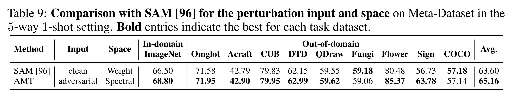

논문 및 이미지 출처 : <https://proceedings.neurips.cc/paper_files/paper/2024/file/d085b2d2d6dee1dd596bc3b8ecd5aaa6-Paper-Conference.pdf>

# Abstract

이 논문은 **OOD** (out-of-domain) few-shot learning 에서 pre-trained model 의 robust generalization 을 향상시키기 위한 Adversarial Meta-Tuning 방법론인 **AMT** 를 소개한다. 

* Source domain 에서 unseen target domain 으로 knowledge 를 전이하는 데 따르는 어려움을 해결하기 위해, 저자는 다양한 robustness 수준에서 input 뿐만 아니라 weight matrix 의 singular values 와 vectors 에 dual perturbation 을 적용하여 LoRA 를 meta-tuning 한 **robust LoRAPool** 을 구축한다. 
* 더 나아가, test-time task customization 을 위해 discriminative LoRA 들을 동적으로 merge 하는 간단하지만 효과적인 **test-time merging mechanism** 을 도입한다. 

광범위한 평가 결과, AMT 는 세 가지 benchmark 상의 다양한 OOD few-shot image classification task 에서 기존 SOTA 방법 대비 clean generalization 은 최대 12.92%, adversarial generalization 은 최대 49.72% 의 성능 향상을 달성하며, pre-trained model 의 robust generalization 을 향상시키는 저자의 접근법의 효과성을 입증한다.

# 1 Introduction

Few-shot learning (FSL) 은 최근 large-scale pre-trained vision transformer model 들에 의해 혁신이 이루어졌다. 이러한 model 들은 소수의 annotated example 만으로도 generalization capability 가 더욱 강화되어, 광범위한 downstream task 에서 인상적인 성능을 달성한다. 이러한 기반 위에서 meta-tuning 은 pre-trained prior knowledge 의 broad generalization capability 와 meta-learning 의 adaptive flexibility 를 통합하는 강력한 전략으로 부상하였으며, few-shot 시나리오에서 새로운 task 에 빠르게 적응할 수 있도록 한다.

그러나 adversarial attack 에 대한 방어와 out-of-distribution (OOD) downstream task 로의 적응이라는 측면에서 meta-tuning 의 robust generalization 은 여전히 해결되지 않은 도전 과제로 남아 있다. 이는 의료 영상 진단이나 자율 주행과 같은 다양한 real-world application 에서 adversarial example 이나 OOD data 에서 동시에 경쟁력 있는 성능을 확보하는 것이 필수적이기 때문이다. 배포된 model 은 종종 training 과 test data 사이의 distribution shift 가 존재하는 새로운 환경에 직면하는데, 예를 들어 병원 장비 및 protocol 의 차이, 혹은 다양한 도시 도로 환경이 존재한다. 게다가 이러한 model 은 adversarial attack 에 취약하여 잘못된 진단이나 위험한 주행 결정을 유발할 수 있다. 예를 들어 adversary 는 2D 혹은 3D 의료 영상 model 을 속이기 위해 sensor signal 을 교란하거나, 교통 표지판에 악의적인 sticker 를 부착하거나, autopilot 을 속여 위험한 주행 경로를 따르게 만들 수 있다.

이 논문에서는 adversarial training 과 meta-tuning 을 활용하여 pre-trained vision transformer 의 robust generalization 을 다양한 domain 에 걸쳐 향상시키는 방법을 탐구한다. 기존 meta-tuning 접근법과 비교했을 때, 저자의 방법은 두 가지 독창적인 측면을 가진다.

1. adversarial example 을 포함할 때, model 은 worst-case task 에 적응하는 동시에 original generalization capability 를 보존해야 한다. 
   * Fine-tuning 과정에서 weight parameter 의 singular value distribution 이 크게 변화한다는 관찰에서 영감을 받아, 저자는 meta-tuning 과정에서 pre-trained model weight matrix 의 principal component 를 명시적으로 강화하고자 한다.
   * 이를 위해 frozen pre-trained parameter 위에 Low-rank Adapter (LoRA) 의 incremental meta-update 를 통해 input 과 principal singular value 및 vector 모두에 perturbation 을 주입한다.
2. adversarial perturbation 은 training environment 로부터의 광범위한 distribution variation 을 모사해야 하며, 여러 종류의 perturbation 을 동시에 training 할 때 간섭이 발생하지 않도록 주의해야 한다. 
   * 이를 위해 저자는 다양한 attack strength 에 대해 병렬적으로 meta-tuning 된 LoRA 들로 구성된 adaptive robust **LoRAPool** 을 제안한다. 
   * 그리고 unseen distribution 으로부터의 novel task 에 적응하기 위해 robust LoRAPool 을 기반으로 하여, test-time merging mechanism 을 통해 meta-update 된 principal component 를 pre-trained model 에 통합함으로써 downstream task customization 을 가능하게 한다.

저자의 주요 기여는 다음과 같이 요약된다.

* 저자는 AMT 라는 새로운 adversarial meta-tuning 접근법을 제안하여, 다양한 domain 에 걸쳐 pre-trained vision transformer 의 robust generalization 을 향상시킨다.
* Input, singular value, weight matrix 의 vector 에 adversarial perturbation 을 주입함으로써, pre-trained model weight 의 core component 가 worst-case task 에 대해 강화된다. 이 접근법은 perturbation budget 이 다른 환경에서 meta-tuning 된 adaptive robust LoRAPool 과 결합되어, pre-trained model 의 original capability 를 손상시키지 않는다.
* 저자는 discriminative principal component 를 pre-trained model 에 통합하기 위해 간단하지만 효과적인 test-time merging mechanism 을 도입하였으며, 이는 task-specific feature extractor 를 customization 하도록 하고 다른 test-time fine-tuning 방법과도 호환된다.
* 저자의 방법은 Meta-Dataset (9 개 OOD dataset 포함), BSCD-FSL, fine-grained dataset (추가 8 개 OOD dataset 포함) 등과 같은 challenging large-scale OOD few-shot image classification benchmark 에서 실험적으로 평가되었다. 제안한 방법은 domain 전반에 걸쳐 인상적인 few-shot 성능을 달성하였으며, clean generalization 은 최대 12.92%, adversarial generalization 은 최대 49.72% 개선되어 기존 SOTA 방법을 크게 능가하였다.

# 2 Related work

#### Out-of-Domain Few-shot Learning and Meta-Learning

Out-of-Domain Few-Shot Learning (OOD-FSL) 은 source domain 에서 학습한 prior knowledge 를 unseen target domain 으로 전이하여 few-shot learning 문제를 해결하는 것을 목표로 한다. Meta-learning 은 episodic training 을 통해 parameter initialization, optimization rule, transferable metric space 를 prior knowledge 로 학습하여 새로운 task 에 빠르게 적응할 수 있도록 한다. Distribution shift 를 다루기 위해, 여러 feature extractor 를 활용하여 universal feature representation 을 구축하거나, batch normalization parameter 를 조건화하거나, test-time gradient-based fine-tuning 을 적용하는 다양한 방법들이 제안되었다.

저자의 연구와 가장 밀접한 관련이 있는 것은 FLUTE 로, 이는 여러 training dataset 에 대해 feature extractor 와 여러 set 의 Feature-wise Linear Modulation (FiLM) parameter 를 함께 학습하고, 이를 test-time gradient descent 의 initialization 으로 결합하는 방법이다. 반면 저자의 방법 AMT 는 single source domain 설정에서 adversarial meta-tuning 을 수행하되 pre-trained model 을 손상시키지 않으며, robust LoRAPool 의 adaptive merging mechanism 을 통해 gradient descent 없이 non-parametric 방식으로 task customization 을 수행한다. 이는 pool 에 새로 추가되는 component 에 대해 확장성을 보장한다.

#### Vision Transformers in Few-shot Learning

Vision Transformer (ViT) 는 data 내 장기 의존성을 포착하는 능력 덕분에 foundation model 로 부상하였다. Self-supervised pre-training 은 특히 few-shot learning task 에서 vision transformer 에 data-driven 이면서 well-generalized prior 를 부여한다. Transfer learning 의 맥락에서, meta-training 없이도 universal feature representation 을 탐색하기 위해 self-distillation framework 를 활용하거나, support set 위에서 gradient descent 를 통해 auxiliary visual prompt 와 attention scaling matrix 를 직접 학습하는 방법이 연구되었다. 또 다른 중요한 연구 방향은 input-conditioned prompt 와 task-specific mask 를 활용하여 pre-trained model 을 강화하는 meta-learning 기법을 개발하는 것이다. PMF 는 full model 을 meta-tuning 하여 강력한 baseline 을 제시하였다.

저자의 연구 역시 pre-trained vision transformer 를 기반으로 하며, adversarial meta-tuning 이 downstream task 전반에서 robust generalization 을 추가적으로 향상시킬 수 있음을 보여준다. 또한 저자의 기여는 기존의 다른 test-time fine-tuning 방법과는 독립적이며, 이들의 test-time 성능 향상을 위한 더 나은 출발점을 제공한다.

#### Adversarial Training for Out-of-Distribution Generalization

Adversarial training 은 input 혹은 model parameter 에 adversarial perturbation 을 가하여 locally maximized loss function 을 최소화함으로써 model 의 adversarial robustness 를 강화하는 가장 효과적인 defense 기법 중 하나이다. 일반적으로 adversarial robustness 와 clean accuracy, in-distribution (ID) generalization 과 out-of-distribution (OOD) generalization 사이에는 trade-off 가 존재하지만, 이를 균형 있게 달성하기 위한 다양한 전략이 연구되어 왔다. 예를 들어, 수정된 adversarial training regime, dual parameter set, model ensemble, multi-scale patch perturbation, partial fine-tuning 전략 등이 있다.

또한 adversarial perturbation 이 적용된 input data 는 OOD data 의 특수한 형태로 볼 수 있기 때문에, 최근 연구에서는 adversarial pre-training 이 downstream dataset 의 generalization 성능을 향상시키고 distribution shift 에 대한 robustness 를 개선할 수 있음을 보여주었다. 특히 sample-wise adversarial attack 과 달리, low-rank 구조에서의 distributional attack 은 더 큰 크기의 adversarial perturbation 에 대해서도 model 을 견고하게 만들 수 있음을 보여준다. 저자의 방법은 이러한 기존 공격 기법과 영감을 공유하면서도 차별화되는데, meta-tuning 에 최적화된 adversarial low-rank adaptor 의 혼합을 활용하여 clean pre-trained model 의 robust generalization 을 향상시킨다.

#### Adversarial Meta-Learning

Adversarial training 을 few-shot learner 의 adversarial robustness 를 강화하기 위해 활용한 연구들이 존재한다. 그러나 adversarial training 을 적용한 model 은 표준 few-shot learning 대비 clean accuracy 가 저하되는 문제가 있다. 또 다른 연구에서는 adversarial training 을 개별 image pixel 이나 feature 에 perturbation 을 가하는 방식으로 cross-domain few-shot learning 성능을 개선하였다. 예를 들어 StyleAdv 는 AdaIN 의 통계 정보를 공격하여 각 sample 의 style 을 교란하고 모든 parameter 를 업데이트한다.

저자의 접근법은 이러한 기존 방법들과 달리, large-scale pre-trained model 의 generalization 성능을 더욱 향상시키는 것을 목표로 한다. 이를 위해 저자는 meta-tuning 과정에서 query set 전체에 대해 input 뿐 아니라 singular value 와 vector 에도 이중 perturbation 을 주입하면서 pre-trained parameter 는 모두 고정하여 prior knowledge 를 보존한다.

#### Parameter-Efficient Few-Shot Learning

Full-model fine-tuning 에 따른 계산 비용을 줄이기 위해, parameter-efficient fine-tuning (PEFT) 기법들이 제안되었다. 이들은 small parameter 만 업데이트하는 방식으로, soft prompt 삽입, adapter module 추가, low-rank matrix 도입 등을 포함한다. 최근 연구는 PEFT 가 large language model 의 few-shot setting 에서 standard fine-tuning 과 동등하거나 더 우수한 성능을 달성할 수 있음을 보여주었다.

저자의 연구에서는 pre-trained vision transformer 의 robust generalization 을 강화하기 위해 meta-tuning 을 통해 소규모 parameter set 을 구성하는 방법을 탐구한다. 구체적으로, 저자는 adaptive robust pool 을 구축하기 위한 핵심 parameter-efficient component 로 LoRA 를 활용한다. LoRA 는 inference 중 추가적인 computation 이나 memory 비용 없이 network weight 에 low-rank update 를 merge 할 수 있게 한다.

# 3 Problem Formulation

이 연구에서는 **out-of-domain few-shot image classification** 에 초점을 맞추며, 목표는 single-source training domain 으로부터 unseen target domain 에서도 잘 generalize 할 수 있는 parameter $\theta$ 를 찾는 것이다. 이 맥락에서 model 은 limited data 로부터 novel concept 을 학습해야 할 뿐만 아니라, 다양한 domain 에서도 잘 generalize 해야 한다.

각 domain 에는 해당 환경에서 수집된 dataset 이 존재한다. Training 과정에서는 single source training dataset $\mathcal{D}_{tr}^{seen}$ 만 사용할 수 있으며, 여기서 각 task $\mathcal{T} = (\mathcal{S}, \mathcal{Q})$ 가 input 으로 무작위 샘플링된다. Support set $\mathcal{S}$ 는 각 $N$ categories 에 대해 $K$ annotated images 를 포함하며, $\mathcal{S} = \{(x_s, y_s)\}_{s=1}^{N K}$ 로 정의된다. Query set $\mathcal{Q}$ 는 $M$ images 를 포함하며 $\mathcal{Q} = \{(x_q, y_q)\}_{q=1}^{M}$ 로 정의된다. Evaluation 시점에서의 목표는 이전에 보지 못한 dataset $\mathcal{D}_{test}^{unseen}$ 으로부터 sampled novel class 를 포함하는 task 를 해결하는 것이다.

# 4 Methods

저자의 접근법은 Fig. 1 에 요약되어 있으며, 전체 framework 은 두 가지 주요 component 로 구성된다:

1. **Adversarial singular value and vector perturbation**: worst-case task 에서 principal component 를 강조하기 위해 singular value 와 vector 를 명시적으로 perturbation 한다.
2. **Adaptive robust LoRAPool**: 여러 adversarially meta-tuned LoRA module 로 구성되며, test-time merging mechanism 을 통해 이를 adaptive 하게 merge 하여 task customization 을 수행한다.

## 4.1 Preliminaries

#### Adversarial Meta-Tuning

저자의 방법은 large-scale pre-trained Vision Transformer 를 기반으로 하며, PMF 를 따르는 episodic 방식으로 model 을 meta-tuning 한다.  meta-knowledge 를 robust 하게 만들기 위해 adversarial meta-tuning 은 query image $x_q$ 에 adversarial perturbation $\delta$ 를 주입하여 worst-case optimization 을 수행한다. 그 직관은 meta-tuned model 이 worst-case task 에서도 동일한 prediction 을 하도록 만드는 것이다.

이 연구에서는 $l_\infty$ norm 으로 bounded 된 perturbation 을 고려하며, 대응되는 optimization 문제는 다음과 같이 정의된다:

$\min_\theta \max_{\|\delta\|_\infty \leq \epsilon} \mathcal{L}(f_\theta(\mathcal{S}, x_q + \delta), y_q)$. 여기서 $f_\theta$ 는 parameter $\theta$ 를 가진 model 이 query example 에 대해 예측한 logit 을 나타내며, $\mathcal{L}$ 은 meta-task loss 로 일반적으로 image classification 에서 cross-entropy loss 를 사용한다.

내부의 maximization 문제는 gradient 기반 방법으로 효율적으로 풀 수 있으며, 실제로는 Projected Gradient Descent (PGD) 가 adversarial perturbation $\delta$ 를 생성하는 데 가장 널리 사용된다. Step size 가 $\alpha$ 일 때, PGD 는 여러 iteration 에 걸쳐 다음의 update rule 을 수행한다. 여기서 $\Pi$ 는 $|\delta|_\infty \leq \epsilon$ 을 만족하도록 $\delta$ 를 clip 하는 projection operator 이다.

$$
\delta \leftarrow \Pi_\epsilon \left(\delta + \alpha \cdot \text{sign}\left(\nabla_\delta \mathcal{L}(f_\theta(\mathcal{S}, x_q + \delta), y_q)\right)\right). \tag{1}
$$

#### Low Rank Adaptation

LoRA 는 transformer model 을 위한 대표적인 parameter-efficient fine-tuning 방법 중 하나이다. Pre-trained weight matrix $W \in \mathbb{R}^{d_{in} \times d_{out}}$ 가 주어졌을 때, LoRA 는 parameter matrix 의 incremental update 를 low-rank decomposition $\Delta W = AB$ 로 근사한다. 여기서 $A \in \mathbb{R}^{d_{in} \times r}$, $B \in \mathbb{R}^{r \times d_{out}}$ 이며, rank $r \ll \min(d_{in}, d_{out})$ 이다.

LoRA 는 vision transformer 의 모든 linear layer 에 적용될 수 있다. Input $x$ 와 hidden state $h = Wx$ 가 주어졌을 때, LoRA 는 forward process 를 다음과 같이 수정한다: $h = (W + \Delta W)x = Wx + ABx$

* Fine-tuning 과정에서 $W$ 는 frozen 되며, $A$ 와 $B$ 만 학습 가능하다. 
* 또한 $A$ 는 Gaussian initialization 으로 무작위 초기화되며, 
* $B$ 는 0 으로 초기화된다. 따라서 학습 시작 시점에서 incremental update $AB = 0$ 이 된다.

## 4.2 Adversarial Singular Value and Vector Perturbation

Fine-tuning 과정에서 singular value distribution 이 크게 변화한다는 관찰에서 영감을 받아, 저자는 pre-trained model 의 weight matrix 의 principal component 를 명시적으로 강화하여 다양한 target domain 에서의 generalization capability 를 향상시키고자 한다. 

* 이를 위해 on-the-fly 로 생성된 adversarial query sample 을 활용하여 query set 전체에 대해 singular value 와 vector 에 worst-case perturbation 을 주입한다. 
* 그러나 full model 을 meta-tuning 하거나 training 중 여러 번의 singular value decomposition (SVD) 를 수행하는 것은 계산 비용이 매우 크다. 
* 따라서 저자는 meta-tuning 시 LoRA formulation 을 채택하여 model parameter 를 업데이트하며, vision transformer 의 multi-head self-attention (MHA) layer 와 feed-forward network (FFN) layer 의 weight matrix 에 대해 SVD 결과를 이용해 LoRA 의 incremental update 를 초기화한다.

공식적으로, weight matrix $W \in \mathbb{R}^{d_{in} \times d_{out}}$ 와 그 singular value decomposition (SVD) $W = U \text{diag}(S) , V^T$ 가 주어졌다고 하자. 여기서 $U \in \mathbb{R}^{d_{in} \times \min(d_{in}, d_{out})}$, $V \in \mathbb{R}^{d_{out} \times \min(d_{in}, d_{out})}$, $S \in \mathbb{R}^{\min(d_{in}, d_{out})}$ 는 각각 left/right singular vector 와 내림차순 singular value 를 나타낸다.

LoRA formulation 에서 $\Delta W = AB$ (rank $r$) 일 때, top $r$ singular values 와 그에 대응하는 vector 들을 사용하여 $A \in \mathbb{R}^{d_{in} \times r}$ 와 $B \in \mathbb{R}^{r \times d_{out}}$ 를 초기화하고, 나머지 singular value 와 vector 는 residual matrix $W^{res} \in \mathbb{R}^{d_{in} \times d_{out}}$ 계산에 활용하여 error correction 을 수행한다:

$$
\begin{align}
    \begin{split}
        A &= U_{[:r]} \, \text{diag}\!\left(S^{1/2}_{[:r]}\right) \in \mathbb{R}^{d_{in} \times r} \\
        B &= \text{diag}\!\left(S^{1/2}_{[:r]}\right) V^T_{[:r]} \in \mathbb{R}^{r \times d_{out}} \\
        W^{res} &= U_{[r:]} \, \text{diag}(S[r:]) \, V^T_{[r:]} \in \mathbb{R}^{d_{in} \times d_{out}}
    \end{split}
\end{align}
$$

따라서, $W = W^{res} + AB$ 를 가진다. Training 동안 $W^{res}$ 는 frozen 상태로 유지되며, $A$ 와 $B$ 의 subspace 업데이트는 principal singular value 와 vector 의 수정 효과를 근사한다.

모델의 generalization 성능을 강화하기 위해, 저자는 sharpness-aware minimization (SAM) 을 활용하여 $A$ 와 $B$ 를 업데이트한다. 구체적으로, gradient ascent 를 통해 $A$ 와 $B$ 의 neighborhood 에서 worst-case perturbation $\delta_A$, $\delta_B$ 를 찾는다. $M$ 이 query set 의 크기이고, $\eta_1$ 이 neighborhood 의 크기를 나타낼 때, $\delta_A$ 는 다음과 같이 계산된다 ($\delta_B$ 역시 유사하게 계산된다):

$$
\delta_A = \eta_1 \cdot \frac{1}{M} \sum_{q=1}^{M} \nabla_A \mathcal{L}\!\left(f_{W^{res}+AB}(\mathcal{S}, x^{adv}_q), y_q\right) \tag{3}
$$

* 여기서 $\theta$ 의 다른 parameter 는 표기 단순화를 위해 생략하였다. 
* 이후 worst-case neighborhood 기반 gradient 를 활용하여 $A$ 와 $B$ 를 업데이트한다. 
* Learning rate 를 $\eta_2$ 라 할 때, $A$ 의 update rule 은 다음과 같다 ($B$ 역시 동일한 learning rate 로 유사하게 업데이트된다):

$$
A \leftarrow A - \eta_2 \cdot \frac{1}{M} \sum_{q=1}^{M} \nabla_A \mathcal{L}\!\left(f_{W^{res}+(A+\delta_A)B}(\mathcal{S}, x^{adv}_q), y_q\right) \tag{4}
$$

저자의 접근법은 기존 adversarial meta-learning 연구와 달리, few-shot learning 에서 **clean accuracy 와 cross-domain robustness 를 동시에 향상**시키는 데 초점을 둔다. AMT 의 meta-objective function 은 두 측면을 결합한 형태로 정의된다:

$$
\mathcal{L} = \mathcal{L}_{CE}\!\left(f_{W^{res}+AB}(S, x_q), y_q\right) + \lambda_{adv} \, D_{KL}\!\Big(f_{W^{res}+AB}(\mathcal{S}, x^{adv}_q) \,\|\, f_{W^{res}+AB}(\mathcal{S}, x_q)\Big) \tag{5}
$$

* 여기서 $\mathcal{L}_{CE}$ 는 original cross-entropy loss, 
* $D_{KL}$ 은 Kullback-Leibler divergence, 
* $\lambda_{adv}$ 는 trade-off 계수이다. 

주목할 점은, 저자의 방법에서는 adversarial attack 을 생성할 때 global classification loss 대신 **few-shot task loss** 를 사용한다는 것이다. 이를 통해 label randomness 를 활용하여 true label leaking effect 로 인한 성능 저하 가능성을 회피한다.

## 4.3 Adaptive Robust LoRAPool

#### Robust LoRAPool Construction

Unseen task 에 대한 다양한 distribution shift 를 모사하기 위해, 저자는 Eq. (4) 를 통해 $P$ 개의 LoRA module 을 병렬적으로 adversarial meta-tuning 한다. 각 LoRA module 은 adversarial budget 의 크기 (i.e., Eq. (1) 의 $\epsilon$) 에 의해 제어되는 서로 다른 robustness level 에 대응한다. 따라서 최종적으로는 $P$ 개의 LoRA module 로 구성된 robust LoRAPool $\phi = [A_1B_1, \dots, A_PB_P]$ 를 얻게 된다. Algorithm 1 은 저자의 adversarial meta-tuning pipeline 을 보여준다.

#### Test-time Merging

여러 개의 LoRA module 이 주어졌을 때, evaluation 단계에서의 과제는 robust LoRAPool 의 module 들을 pre-trained model 과 adaptive 하게 merge 하여 새로운 task 에 맞추는 것이다. Domain generalization 에서는 unseen distribution 이 training environment 의 convex hull 안에 포함된다고 일반적으로 가정하므로, 저자는 pool 안의 LoRA 들을 basis 로 보고 task 에 적응된 convex combination 을 학습한다.

이 결합 계수를 추정하기 위해, 저자는 support set 상에서 **intra-class compactness** 와 **inter-class divergence** 를 동시에 고려하여 classification 에 가장 유리한 discriminative feature 를 추출하는 기준으로 삼는다. 모든 support sample 사이의 pair-wise similarity 계산에 드는 계산 비용을 줄이기 위해, 각 class 의 cluster center 를 근사하기 위해 class prototype 을 활용하고, sample-prototype 거리만을 계산한다.

공식적으로, pool 내 $i$번째 LoRA 와 총 $N$ 개 class 중 $c$번째 class 에 대해, class prototype $p_{i,c}$ 는 해당 class 의 support feature 평균으로 정의된다: $p_{i,c} = \frac{1}{K} \sum_{y_s = c} f_{W^{res} + A_iB_i}(x_s)$. 이때 intra-class compactness $C_i$ 와 inter-class divergence $V_i$ 는 각각 다음과 같이 정의된다:

$$
\begin{align*}
    \begin{split}
        C_i = \frac{1}{N K} \sum_{s=1}^{N K} \gamma \big(f_{W^{res} + A_iB_i}(x_s), \, p_{i, y_s}\big),\\
        V_i = \frac{1}{N K} \sum_{s=1}^{K} \sum_{\substack{c=1 \\ c \neq y_s}}^{N} \gamma \big(f_{W^{res} + A_iB_i}(x_s), \, p_{i,c}\big)
    \end{split}\tag{6}
\end{align*}
$$

여기서 $\gamma(\cdot, \cdot)$ 는 두 feature vector 간 cosine similarity 를 나타낸다.

각 LoRA 에 대한 intra-class compactness 와 inter-class divergence 를 계산한 후, 각 LoRA module 의 merging coefficient $\zeta_i$ 는 다음과 같이 추정된다:

$$
\zeta_i = \frac{\text{Top}_k\!\left(\exp \left(-\beta \big(1 - (\lambda C - (1-\lambda) V)\big)\right)\right)_i}{\sum_{i=1}^k \text{Top}_k\!\left(\exp \left(-\beta \big(1 - (\lambda C_i - (1-\lambda) V)\big)\right)\right)_i} \tag{7}
$$

* 여기서 $\beta$ 와 $\lambda$ 는 각각 smooth factor 와 balance factor 를 나타낸다. 
* Softmax 이전의 **Topk 연산** 은 가장 높은 점수를 가진 top $k$ 개의 LoRA module 을 선택하며, 나머지는 현재 task 에 대해 비활성화된다. 
* 그 후, merge 된 weight matrix 는 다음과 같이 계산된다:

$$
W' = W^{res} + \sum_{i=1}^{P} \zeta_i A_i B_i
$$

Merge 과정에서 불필요한 component 로 인해 간섭이 발생하는 문제를 해결하기 위해, 저자는 **singular value trimming** 을 도입한다. 즉, 가장 큰 상위 $\rho%$ singular value 만 유지하고 나머지는 0 으로 설정하여 최종 task-specific weight $W_c$ 를 얻는다:

$$
\widehat{W} = \text{trim}(W') \tag{8}
$$

이러한 설계는 novel task 에 대해 적절한 LoRA 를 지정함으로써 높은 표현력과 유연성을 제공하며, unseen domain 전반에 걸쳐 model 의 적응 능력을 크게 향상시킨다. Algorithm 2 는 test-time merging algorithm pipeline 을 보여준다.

#### Network Inference

Test-time merging 을 통해 task-specific feature extractor 를 얻은 후, 이를 inference 에 직접 활용하여 nearest-centroid classification 을 수행할 수 있다. 또한 각 novel task 에서 few-shot 성능을 추가적으로 향상시키기 위해, 저자의 AMT 는 다른 최신 test-time fine-tuning 방법들과도 호환된다. 이에 따라, 저자는 추가적인 full fine-tuning 혹은 efficient fine-tuning 을 허용하는 변형 모델 **AMT-FT** 를 도입한다.

# 5 Experiments

저자는 제안한 AMT 의 효과성을 Sec. 5.1 에서 세 가지 cross-domain few-shot image classification benchmark 를 통해 평가한다. 또한 Sec. 5.2 에서는 ablation study 를, Sec. 5.3 에서는 더 광범위한 분석을, Sec. 5.4 에서는 다른 PEFT 방법과의 비교를 제시한다.

#### Experimental setup

저자는 AMT 를 large-scale cross-domain few-shot classification benchmark 인 Meta-Dataset, BSCD-FSL, 그리고 fine-grained dataset 에 대해 평가한다. 주요 실험에서 모든 방법은 robustness 와 generalization 간 trade-off 를 분석하기 위해 ImageNet source domain 에서 학습된 단일 model 을 사용한다.

#### Baselines

* PMF: meta-tuning baseline 방법으로 최신 SOTA 인 PMF 를 채택하였다.
* ATTNSCALE: efficient test-time fine-tuning baseline 으로 ATTNSCALE 을 사용하였다.
* StyleAdv: 기존 adversarial few-shot learning 방법과 비교하기 위해 StyleAdv 를 대표적인 baseline 으로 선택하였다.

모든 방법은 main experiment 에서 Vision Transformer 를 backbone 으로 사용하며, 이는 ImageNet-1K 에 대해 DINO-pretrained 된 모델을 기반으로 한다.

## 5.1 Comparison with State-Of-The-Art Methods

#### Clean OOD-FSL

Tab. 1 에서 저자는 Meta-Dataset 상에서 AMT 를 평가하여 5-way 1-shot 및 5-shot setting 모두에서 OOD few-shot learning 문제에 대한 generalization 성능을 조사하였다. 접근법은 두 가지 setting 으로 나누어 비교한다.

* Tuning-free setting: support set 에 대해 additional training 을 수행하지 않는다. 저자는 pre-trained model 에 meta-tuned LoRA 를 adaptive 하게 merge 하는 non-paramatric test-time merging mechanism 을 적용하고, prototype-based classification 을 수행한다.
* Test-time fine-tuning setting: support set 에 대해 full parameter fine-tuning 혹은 partial parameter fine-tuning 등 다양한 fine-tuning 방법을 적용한다.

---

* 제안한 AMT 는 tuning-free setting 에서도 모든 domain 에 걸쳐 기존 SOTA 방법을 일관되게 능가하며, Omniglot 에서 최대 **12.92%** 의 성능 향상을 달성하였다. 
* 또한 LoRAPool 의 유연한 설계와 pre-trained model 을 위한 meta-learned initialization 덕분에, AMT 는 최신 fine-tuning 접근법과의 호환성이 뛰어나 few-shot learning 성능을 추가적으로 향상시켰다. 구체적으로 PMF 대비 **3.92%**, ATTNSCALE 대비 **4.3%** 의 개선을 보였다.

특히, 기존 StyleAdv 와 달리 저자의 방법은 in-domain clean accuracy 를 희생하지 않고 robust generalization 을 개선한다. 이는 pre-trained knowledge 를 완전히 보존하면서 unseen task 에 대해 discriminative information 을 주입하여 customization 을 수행하는 **adaptive robust LoRAPool 설계** 덕분이라고 할 수 있다.

추가적으로, 저자는 BSCD-FSL 및 fine-grained dataset (Tab. 2), 그리고 variable-way-variable-shot setting (Appendix K, Tab. 18) 에서 비교 분석을 수행하였다. 전반적인 성능 향상은 저자의 방법의 효과성을 뒷받침한다.

#### Adversarial OOD-FSL

저자는 distribution shift 하에서 adversarial robustness 를 평가하기 위해 PGD-10 attack 을 적용하여 기존 SOTA 방법과 비교하였다 (Tab. 3).

* 자연 학습된 meta-tuning 방법인 PMF 는 adversarial robustness 가 전혀 확보되지 않았다.
* StyleAdv 역시 대부분의 domain 에서 adversarial attack 에 매우 취약하며, in-domain 성능이 약 7%p 하락하였다.
* 반면, AMT 는 in-domain 및 out-of-domain robust accuracy 모두에서 기존 방법들을 큰 격차로 능가하며, Omniglot 에서 최대 49.72% 의 성능을 달성하였다.
* 또한 AMT-FT 는 adversarial test-time fine-tuning 전략과 결합할 경우 시너지를 발휘하여, in-domain 및 out-of-domain few-shot adversarial robustness 를 추가적으로 향상시켰다.
* 더 나아가, 저자는 AutoAttack 및 distribution shift 하에서 unseen attack 에 대한 adversarial robustness 를 평가하였다. 
* 결과적으로 AMT 는 domain 전반에서 adversarial generalization 을 일관되게 향상시켰다. 흥미롭게도, Fig. 4 에서 보여지듯 AMT 는 distribution shift 하의 자연적 corruption 또한 잘 처리할 수 있었다.

종합적으로 AMT 는 **adversarial robustness 와 clean accuracy 사이의 trade-off**, 그리고 **ID 와 OOD generalization 사이의 trade-off** 를 개선하였다.

## 5.2 Ablation Study

#### Component Analysis

Tab. 4 에서 저자는 제안한 방법의 다양한 component 들의 효과성을 검증하였다. 분석 대상은 다음과 같다:

* query image 에 대한 adversarial perturbation
* singular value 및 vector 에 대한 adversarial perturbation
* robust LoRAPool
* test-time merging
* singular value trimming

---

* query image 에 adversarial perturbation 을 적용하는 경우, training 시 robust LoRAPool 학습에 사용된 attack configuration 후보 중 하나를 무작위로 선택하여 attack budget 을 샘플링한다. 
  * 이 전략은 OOD generalization 을 개선하지만, in-domain accuracy 는 희생되는 것으로 나타났다.
* test-time merging 이 없는 경우, support set 에서 관찰된 최소 cross-entropy loss 를 기준으로 pool 내 적합한 LoRA 를 adaptive 하게 선택한다. 
  * 그러나 support set 상에서 cross-entropy loss 최소화에만 의존하면 overfitting 이 발생할 수 있으며, 특히 source domain 과의 domain gap 이 큰 Omniglot 과 Traffic Sign 에서 그 현상이 두드러졌다.
* 또한 singular value 와 vector 에 대한 adversarial perturbation 을 제거하면, test-time merging 전략을 사용하더라도 전반적인 성능이 저하되었다. 
  * 이는 **double-perturbation mechanism** 이 robust generalization 을 효과적으로 강화하는 데 중요한 역할을 함을 입증한다.

#### Effectiveness of Adversarial Perturbation on Singular Value and Vectors

저자는 adversarial attack 전략의 이점을 검증하기 위해, singular value 및 vector 에 adversarial perturbation 을 제거한 변형 모델과 AMT 를 비교하였다 (Fig. 2). 

결과적으로 AMT 는 FFN layer 의 상위 singular value 의 크기를 유의미하게 증폭시킬 수 있음을 확인하였다 (MHA layer 의 경우 Fig. 3 참고).

저자는 이러한 **double adversarial perturbation** 이 model 이 가장 중요한 component 에 더 집중하도록 명시적으로 강제하여, meta-tuning 과정에서 worst-case scenario 에 대한 저항성을 높인다고 주장한다. 따라서 이는 model 의 robust generalization capability 를 향상시켜, 다양한 domain 전반에서 novel downstream task 에 더욱 효과적으로 적응할 수 있도록 한다.

### Different Pool Designs and Adversarial Perturbation Strategies

Tab. 8 에서 보이듯, 제안한 **perturbation-specific parameter** 를 갖는 robust LoRAPool 은 서로 다른 attack 간 간섭을 효과적으로 방지하고, in-domain 성능을 희생하지 않으면서 out-of-domain generalization 을 크게 향상시킨다.

또한 Tab. 9 와 Tab. 10 에서 저자는 SAM 과 original LoRA initialization 과 비교하였으며, 결과적으로 저자의 adversarial singular value 및 vector perturbation 이 model 의 generalization capability 를 향상시키는 데 효과적임을 입증하였다.

더 나아가 Tab. 16 에서는 단순한 pixel-level adversarial attack 이 static data augmentation 보다 더 큰 domain shift 를 효과적으로 모사할 수 있으며, learnable adversarial transformation 방법과 비교했을 때 동등하거나 더 우수한 generalization 향상을 달성함을 확인하였다.

## 5.3 More Analysis

#### Alternative Test-time Merging Strategies

저자가 제안한 test-time merging mechanism 을 확정하기 전, 다양한 설계 선택지를 실험하였다.

* 첫 번째 아이디어는 **parametric linear classifier** 를 활용하여 novel task 와 LoRA 의 적합성을 평가하는 것이다. FLUTE \[33] 와 유사하게, pool 내 각 robust LoRA 를 공격하여 생성된 adversarial sample batch 를 classifier 에 입력하여 어떤 LoRA 가 해당 sample 을 생성했는지 추정한다. 이후 support set 에서의 평균 출력을 novel task 의 merging coefficient 로 사용한다.
* 또 다른 방법으로는 LoRA weight 혹은 logit 을 단순히 평균내는 **model soup 방식** 을 시도하였다.

Tab. 6 은 이러한 대안 전략과 robust LoRAPool 을 비교한다. 

* 결과적으로, intra-class compactness 와 inter-class divergence 기준을 활용한 저자의 AMT 가 전반적으로 더 우수한 generalization 을 달성하였다. 
* 반면, linear classifier 는 semantic 특성에 기반하여 adversarial perturbation 의 robustness level 을 정확히 반영하지 못했다. 
* Logit averaging 은 유사한 성능을 보였으나, 각 task 에 대해 query feature 를 추출할 때 모든 LoRA parameter 를 저장해야 하는 단점이 있었다.

저자의 방법은 support set 상에서 pre-trained model 에 LoRAPool 을 merge 하여 적응시키며, query feature extraction 시 baseline 과 동일한 parameter 양을 유지한다.

#### Compatibility with Other Pre-training Methods

저자는 Meta-Dataset 상에서 다양한 pre-training regime 에 대해 AMT 의 효과성을 평가하였다. 기존 SOTA 방법은 ImageNet 에 대해 DINO pre-training 을 사용하며, 이는 class token 기반 self-distillation 학습 방식을 따른다.

저자는 다음과 같은 pre-training 접근법을 추가로 고려하였다:

* **iBOT**: patch reconstruction 을 proxy task 로 사용하는 self-supervised pre-training
* **DeiT**: strong regularization 을 적용한 supervised pre-training
* **AdvPre**: adversarial pre-training

* Tab. 7 결과에 따르면, AMT 는 DINO, iBOT, DeiT, AdvPre 대비 각각 평균 **5.97%, 4.58%, 6.41%, 6.36%** 의 성능 향상을 달성하였다. 이는 AMT 가 supervised, self-supervised, robust pre-training 방법 전반에 걸쳐 효과적임을 보여준다.
* 흥미로운 점은, AMT 가 adversarially robust model 의 **in-domain clean accuracy 저하 문제를 크게 개선**할 수 있으며, 경우에 따라 clean pre-trained model 보다도 더 우수한 성능을 달성한다는 것이다.

## 5.4 Comparison with Other Parameter-Efficient Fine-Tuning Methods

Tab. 17 에서 저자는 AMT 를 다른 parameter-efficient fine-tuning 방법과 비교하였다.

* **Adapter 기반 및 LoRA 기반 방법**은 adversarial meta-tuning 상황에서 유사한 성능을 보였으며, full-model 및 FiLM 기반 meta-tuning 을 능가하였다.
* **FiLM/Adapter Pool** 이 단일 FiLM/Adapter 보다 우수한 것은, 저자의 adversarial pool 설계가 in-domain accuracy 를 희생하지 않고 OOD 성능을 개선함을 의미한다.
* 저자의 방법은 singular value/vector perturbation 과, LoRAPool 을 pre-trained weight 에 adaptive 하게 통합하는 비매개변수적 test-time merging mechanism (즉, Algorithm 2) 을 결합함으로써, FiLM/Adapter Pool 대비 유의미한 성능 향상을 달성하였다.
* 또한 FLUTE 방식의 test-time fine-tuning 전략은 pool component 의 추가 tuning 을 요구하는 반면, 저자의 framework 은 LoRA tuning, full fine-tuning, attention scaling 등 다양한 test-time fine-tuning 접근법과의 호환성이 뛰어나다.

# 6 Conclusions and Limitations

본 논문은 pre-trained vision transformer 의 robust generalization 을 강화하기 위해 **adversarial meta-tuning** 을 적용한 AMT 를 제안하였다. 다양한 robustness level 의 adversarial query image 가 생성되면, singular value 와 vector 에 perturbation 을 주입하여 principal component 를 명시적으로 강화하고, perturbation-specific low-rank update 를 포함하는 robust LoRAPool 을 유지한다. Pool 내 discriminative meta-update component 는 비매개변수적 test-time merging mechanism 을 통해 adaptive 하게 선택 및 결합되어, model 이 novel task 에 맞게 customization 될 수 있도록 한다.

광범위한 실험을 통해, AMT 가 robust generalization 에서 상당한 개선을 달성하여 OOD few-shot image classification task 에서 새로운 benchmark 를 제시함을 확인하였다. 또한 분석을 통해 few-shot setting 에서 adversarial training 의 발전에 대한 깊은 이해를 제공하였다.

그러나 LoRAPool 은 다양한 dataset 및 task 에서 효과적임이 입증되었음에도 몇 가지 한계가 존재한다.

* 각 module 에 대해 adversarial budget, 특히 $\epsilon$ 의 크기를 수동으로 설정해야 한다.
* 저자의 탐구는 $l_\infty$ bounded perturbation 을 포함한 adversarial budget 에 국한되어 있어, 다양한 유형의 distributional shift 를 모사하는 능력이 제한될 수 있다.

향후 연구에서는 이러한 한계를 극복하기 위해 다양한 adversarial perturbation 유형으로 탐구를 확장하고, meta-tuning 에 사용된 특정 dataset 기반으로 저자의 방법의 적응성을 강화할 계획이다.
