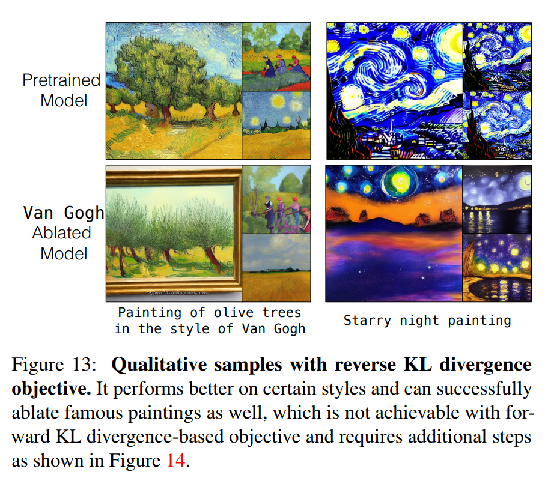

논문 및 이미지 출처 : <https://openaccess.thecvf.com/content/ICCV2023/papers/Kumari_Ablating_Concepts_in_Text-to-Image_Diffusion_Models_ICCV_2023_paper.pdf>

# Abstract

large-scale text-to-image diffusion model 은 고품질의 이미지를 생성할 수 있는 강력한 compositional ability 를 가지고 있다. 하지만 이런 model 은 대량의 인터넷 데이터로 training 되는데, 여기에는 종종 copyrighted material, licensed image, 그리고 개인 사진이 포함된다. 게다가 이런 model 은 다양한 살아있는 예술가의 스타일을 복제하거나 정확한 training sample 을 memorization 하는 것으로 알려져 있다. 

이런 copyrighted concept 이나 image 를 model 을 scratch training 하지 않고 어떻게 제거할 수 있을까? 이 목표를 달성하기 위해, 

- 저자는 pretrained model 에서 concept 을 제거하는, 즉 target concept 의 생성을 막는 효율적인 방법을 제안한다. 
- 저자의 알고리즘은 target concept 의 image distribution 을 anchor concept 에 맞게 변경하도록 학습한다. 
  - 예를 들어, Van Gogh painting → painting (첫 번째 행), 또는 Grumpy Cat → Cat (두 번째 행) 같은 식이다. 
  - 더 나아가, 저자는 이 방법을 확장해서 memorized image 의 생성을 방지한다 (세 번째 행). 
- 광범위한 실험을 통해 저자의 방법이 ablated concept 의 생성을 성공적으로 막으면서도 model 에서 밀접하게 관련된 concept 을 보존하는 것을 보여준다.

# 1. Introduction

large-scale text-to-image model 은 놀라운 photorealistic image 를 합성하는 능력을 보여줬다. 이런 기술 발전은 알고리즘과 compute resource 뿐만 아니라 웹에서 수집한 large-scale dataset 의 사용으로 가능해졌다. 하지만 불행히도, 이런 dataset 은 종종 copyrighted material, 창작자의 artistic oeuvre, 그리고 개인 사진으로 구성된다. 저자는 모든 창작자가 언제든지 자신이 만든 image 에 대해 large-scale model 에서 opt-out 할 권리가 있다고 믿는다. 하지만 이런 요청을 이행하는 건 새로운 computational challenge 를 가져온다. 왜냐하면 사용자 요청마다 model 을 scratch training 하는 건 computationally intensive 하기 때문이다. 여기서 저자는 다음 질문을 던진다:

- 어떻게 model 이 이런 content 를 생성하지 못하게 할 수 있을까?
- 어떻게 model 을 처음부터 다시 training 하지 않고 효율적으로 이를 달성할 수 있을까?
- 어떻게 model 이 관련된 concept 을 여전히 보존하도록 할 수 있을까?

이 질문들은 text-conditioned diffusion model 에서 concept 을 ablation (removal) 하는 저자의 작업의 동기를 부여한다. 저자는 target concept ($\mathbf{c}^*$) 에 대해 생성된 image 를 broader anchor concept ($\mathbf{c}$) 에 맞추도록 수정함으로써 concept ablation 을 수행한다. 

- 예를 들어, `Grumpy Cat` 을 `cat` 으로, `Van Gogh painting` 을 `painting` 으로 overwrite 한다 (Fig. 1 참조). 
- 따라서 `painting of olive trees in the style of Van Gogh` 같은 text prompt 가 주어졌을 때, `Van Gogh` 가 포함된 prompt 임에도 불구하고 일반적인 olive tree painting 을 생성한다. 
- 마찬가지로, `Grumpy Cat` 같은 특정 instance/object 의 생성을 막고, prompt 에 대해 random cat 을 생성한다.

저자의 method 는 target concept 에 주어진 model 의 conditional distribution $p_{\Phi}(\mathbf{x} \mid \mathbf{c}^*)$ 를 anchor concept $\mathbf{c}$ 에 의해 정의된 distribution $p(\mathbf{x} \mid \mathbf{c})$ 에 맞추는 것을 목표로 한다. 이는 두 distribution 간의 Kullback-Leibler divergence 를 최소화함으로써 달성된다. 저자는 서로 다른 training objective 를 이끄는 두 가지 target distribution 을 제안한다. 

- 첫 번째 경우, 저자는 target concept 과 해당 anchor concept 을 포함하는 두 text prompt (e.g., `A cute little Grumpy Cat` 과 `A cute little cat`) 간의 model prediction 을 맞추도록 model 을 fine-tune 한다. 
- 두 번째 objective 에서는 conditional distribution $p(\mathbf{x} \mid \mathbf{c})$ 를 수정된 text-image pair 로 정의한다. 즉, target concept prompt 와 anchor concept 의 image 를 짝지은 것 (e.g., `a cute little Grumpy Cat` prompt 와 random cat image) 이다. 

저자는 두 objective 모두 concept 을 효과적으로 ablate 할 수 있음을 보여준다.

저자는 16 개 concept ablation task (specific object instance, artistic style, memorized image 포함) 에 대해 다양한 evaluation metric 을 사용해 저자의 method 를 평가한다. 저자의 method 는 target concept 을 성공적으로 ablate 하면서, 보존되어야 할 밀접하게 관련된 surrounding concept (e.g., `Grumpy Cat` 을 ablating 할 때 다른 cat breed) 에 최소한의 영향을 미친다. 저자의 method 는 concept 당 약 5 분이 걸린다. 또한, 저자는 다양한 algorithmic design choice 에 대한 extensive ablation study 를 수행한다:

- Objective function variant
- Fine-tune 할 parameter subset 선택
- Anchor concept 선택
- Fine-tuning step 수
- Text prompt 에서 misspelling 에 대한 method 의 robustness

마지막으로, 저자의 method 가 여러 concept 을 한 번에 ablate 할 수 있음을 보여주고, 현재 한계에 대해 논의한다. 

# 2. Related Work

#### Text-to-image synthesis

Text-to-image synthesis 는 model architecture, generative modeling technique, 그리고 large-scale dataset 의 가용성 덕분에 획기적으로 발전했다. 현재 방법들은 고품질 이미지를 합성할 수 있으며, unseen context 에서 다양한 instance, style, 그리고 concept 을 composing 할 수 있는 놀라운 generalization ability 를 가지고 있다. 

하지만 이런 model 은 종종 copyright image 로 training 되기 때문에 다양한 artist style 을 모방하거나 다른 copyrighted content 를 학습한다. 이 연구에서 저자는 pretrained model 을 수정해서 이런 image 의 생성을 막으려 한다. GAN 에서 데이터를 제거하기 위해, 일부 연구는 redacted data 를 fake data 에 추가하고 standard adversarial loss 를 적용해 MNIST 와 CIFAR 에서 결과를 보여줬다. 

하지만 이 방법은 전체 dataset 에서 시간이 많이 걸리는 model retraining 이 필요하다. 반면, 저자의 방법은 original training set 을 거치지 않고 concept 을 효율적으로 제거할 수 있다. 게다가 저자는 large-scale text-based diffusion model 에 초점을 맞춘다. 

최근 연구는 inference process 를 수정해서 특정 concept 의 생성을 막으려 했지만, 저자는 model weight 에서 concept 을 ablate 하는 것을 목표로 한다. 동시에 진행된 다른 연구는 score-based formulation 을 사용해 concept 을 제거하려 했다.

#### Training data memorization and unlearning

여러 연구에서 training data leaking 이 연구되었는데, 이는 특히 web-scale uncurated dataset 을 사용하는 deep learning 에서 larger security 와 privacy risk 를 초래한다. 

최근 연구는 text-to-image model 이 specific text condition 에 대해 training dataset 의 정확하거나 비슷한 복사본을 생성할 수 있음을 보여줬다. Machine unlearning 연구는 model training 후 사용자의 요청에 따라 data deletion 을 탐구한다. 하지만 기존 unlearning method 는 Fisher Information Matrix 같은 정보를 계산해야 해서, billions of parameter 와 billions of image 로 training 된 large-scale model 에는 computationally infeasible 하다. 반면, 저자의 방법은 model weight 를 직접 업데이트해서 target concept 을 5분 만에 ablate 할 수 있다.

#### Generative model fine-tuning and editing

Fine-tuning 은 pretrained generative model 의 weight 를 new domain, downstream task, 그리고 test image 에 적응시키는 것을 목표로 한다. 최근 연구들은 몇 개의 exemplar image 를 사용해 text-to-image model 을 fine-tuning 해서 personalized 또는 unseen concept 을 학습하려 했다. 

마찬가지로, model editing 은 사용자의 지시에 따라 특정 model weight 를 수정해서 새로운 computational rule 이나 새로운 visual effect 를 추가하려 한다. 위 접근법들과 달리, 저자의 방법은 pretrained model 에서 특정 concept 을 ablate 함으로써 가능한 공간을 줄인다.

# 3. Method

여기서 저자는 먼저 text-to-image diffusion model 에 대한 간단한 개요를 제공한다 (Sec. 3.1). 

그리고 concept ablation formulation 을 제안하고 두 가지 variant 를 탐구한다 (Sec. 3.2). 

마지막으로, 각 ablation task 에 대한 training detail 을 논의한다 (Sec. 3.3).

## 3.1. Diffusion Models

Diffusion model 은 forward Markov chain process 를 역전시키도록 학습한다. 이 과정에서 input image 에 multiple timestep $t \in [0, T]$ 동안 점진적으로 noise 를 추가한다. 특정 timestep $t$ 에서 noisy image $\mathbf{x}_t$ 는 $\sqrt{\alpha_t} \mathbf{x}_0 + \sqrt{1-\alpha_t} \epsilon$ 로 주어진다. 

- 여기서 $\mathbf{x}_0$ 는 random real image 이고, 
- $\alpha_t$ 는 gaussian noise $\epsilon$ 의 강도를 결정하며 timestep 에 따라 점진적으로 감소해서 $\mathbf{x}_T \sim N(0, I)$ 가 된다. 

Denoising network $\Phi(\mathbf{x}_t, \mathbf{c}, t)$ 는 noisy image 를 denoising 해서 $\mathbf{x}_{t-1}$ 을 얻도록 training 되며, text $\mathbf{c}$ 같은 다른 modality 로도 condition 될 수 있다. Training objective 는 noise $\epsilon$ 를 예측하는 것으로 단순화된다:

$$
\begin{equation}
    \mathcal{L}(\mathbf{x}, \mathbf{c}) = \mathbb{E}_{c, \mathbf{x}, \epsilon, t} \left[ w_t \left\| \epsilon - \Phi(\mathbf{x}_t, \mathbf{c}, t) \right\| \right],
\end{equation}
$$

- 여기서 $w_t$ 는 loss 에 대한 time-dependent weight 이다. 
- Inference 중에 text condition $\mathbf{c}$ 가 주어지면, Gaussian noise image $\mathbf{x}_T \sim N(0, I)$ 를 fixed timestep 수만큼 iteratively denoising 해서 이미지를 합성한다.

## 3.2. Concept Ablation

Concept ablation 은 주어진 target concept 에 해당하는 원하는 image 의 생성을 막는 작업으로 정의된다. Concept 이 제거된 새 dataset 으로 model 을 retraining 하는 건 비현실적이므로, 이는 도전적인 작업이 된다. 저자는 특정 concept 을 ablate 하기 위해 model 을 editing 해도 다른 밀접 관련된 concept 에 대한 model performance 에 영향을 주지 않도록 해야 한다.

#### A naïve approach

첫 번째 시도는 target concept 에 대한 text-image pair 에 대해 diffusion model training loss 를 단순히 최대화하면서 weight 에 regularization 을 부과하는 것이었다. 하지만 이 방법은 target concept 의 close surrounding concept 에 대해 더 나쁜 결과를 초래한다. 

Sec. 4.2 (Fig. 3) 에서 이 baseline 과 저자의 방법을 비교하며, 이 방법이 sub-optimally 수행됨을 보여준다.

#### Our formulation

Concept ablation 은 target concept 의 생성을 막으므로, 대신 무엇이 생성되어야 하는지에 대한 질문이 생긴다. 이 작업에서 저자는 사용자가 원하는 anchor concept 을 제공한다고 가정한다. 예를 들어, `Grumpy Cat` 에 대해 `Cat` 이다. 

Anchor concept 은 target concept 을 overwrite 하며, target concept 의 superset 이거나 비슷해야 한다. 따라서 target concept 를 설명하는 text prompt set $\{\mathbf{c}^*\}$ 가 주어졌을 때, 저자는 다음 두 distribution 을 Kullback-Leibler (KL) divergence 를 통해 맞추려 한다:

$$
\begin{equation}
    \underset{\Phi}{\arg \min} \mathcal{D}_{\mathcal{KL}} \left( p(\mathbf{x}_{(0, \ldots T)} \mid \mathbf{c}) \| p_{\Phi}(\mathbf{x}_{(0, \ldots T)} \mid \mathbf{c}^*) \right),
\end{equation}
$$

- 여기서 $p(\mathbf{x}_{(0, \ldots T)} \mid \mathbf{c})$ 는 anchor concept $\mathbf{c}$ 에 의해 정의된 target distribution 이고, 
- $p_{\Phi}(\mathbf{x}_{(0, \ldots T)} \mid \mathbf{c}^*)$ 는 target concept 에 대한 model 의 distribution 이다. 
- 직관적으로, 저자는 text prompt $\{\mathbf{c}^*\}$ 를 anchor prompt $\{\mathbf{c}\}$ 에 해당하는 image 와 연관시키려 한다. 
- 서로 다른 anchor concept distribution 을 정의하면 서로 다른 objective function 이 도출된다.

이 objective 를 달성하기 위해, 먼저 $(\mathbf{x}, \mathbf{c}, \mathbf{c}^*)$ tuple 로 구성된 작은 dataset 을 만든다. 

- 여기서 $\mathbf{c}$ 는 anchor concept 에 대한 random prompt 이고, 
- $\mathbf{x}$ 는 그 condition 으로 생성된 image 이며, 
- $\mathbf{c}^*$ 는 $\mathbf{c}$ 를 target concept 을 포함하도록 수정한 것이다. 
- 예를 들어, $\mathbf{c}$ 가 `photo of a cat` 이면, $\mathbf{c}^*$ 는 `photo of a Grumpy Cat` 이고, $\mathbf{x}$ 는 text prompt $\mathbf{c}$ 로 생성된 image 이다. 

간결함을 위해, 저자는 이런 생성된 image 를 나타내기 위해 같은 표기 $\mathbf{x}$ 를 사용한다.

#### Model-based concept ablation

여기서 저자는 target concept 의 distribution $p_{\Phi}(\mathbf{x}_{(0, \ldots T)} \mid \mathbf{c}^*)$ 를 pretrained model 의 anchor concept 에 대한 distribution $p_{\Phi}(\mathbf{x}_{(0, \ldots T)} \mid \mathbf{c})$ 에 맞춘다. 

Fine-tuned network 는 $\mathbf{c}^*$ 가 주어졌을 때 $\mathbf{c}$ 와 유사한 generated image 의 distribution 을 가져야 하며, 이는 두 distribution 간의 KL divergence 를 최소화하는 것으로 표현된다. 이는 standard diffusion model training objective 와 유사하지만, target distribution 이 training data 대신 pretrained model 에 의해 정의된다. Eqn. 2 는 다음과 같이 확장된다:

$$
\begin{equation}
    \arg \min \sum_{t=1}^T \underset{p_{\Phi}(\mathbf{x}_0, \ldots, \mathbf{x}_t \mid \mathbf{c})}{\mathbb{E}} \left[ \log \frac{p_{\Phi}(\mathbf{x}_{t-1} \mid \mathbf{x}_t, \mathbf{c})}{p_{\hat{\Phi}}(\mathbf{x}_{t-1} \mid \mathbf{x}_t, \mathbf{c}^*)} \right]
\end{equation}
$$

- 여기서 noisy intermediate latent $\mathbf{x}_t \sim p_{\Phi}(\mathbf{x}_t \mid \mathbf{c})$ 이고, 
- $\Phi$ 는 original network 이고, 
- $\hat{\Phi}$ 는 저자가 학습하려는 new network 이다. 
- KL divergence 를 최적화하기 위해 다음 equivalent objective 를 최소화할 수 있다:

$$
\begin{equation}
    \arg \min_{\hat{\Phi}} \mathbb{E}_{c, \mathbf{x}_t, \mathbf{c}^*, \epsilon, t} \left[ w_t \left\| \Phi(\mathbf{x}_t, \mathbf{c}, t) - \hat{\Phi}(\mathbf{x}_t, \mathbf{c}^*, t) \right\| \right].
\end{equation}
$$

전체 derivation 은 arXiv 버전에서 보여준다. 저자는 $\hat{\Phi}$ 를 pretrained model 로 초기화한다. 하지만 위 objective 를 최적화하려면 $p_{\Phi}(\mathbf{x}_t \mid \mathbf{c})$ 에서 sampling 해야 하고, 두 개의 large network $\Phi$ 와 $\hat{\Phi}$ 의 copy 를 유지해야 해서 time 과 memory-intensive 하다. 

이를 우회하기 위해, forward diffusion process 를 사용해 $\mathbf{x}_t$ 를 sampling 하고, fine-tuning 동안 anchor concept 에 대해 model 이 비슷하게 유지된다고 가정한다. 따라서 저자는 stopgrad 를 사용해 network $\hat{\Phi}$ 로 anchor concept prediction 을 얻는다. 

final training objective 는 다음과 같다:

$$
\begin{equation}
    \mathcal{L}_{\text{model}}(\mathbf{x}, \mathbf{c}, \mathbf{c}^*) = \mathbb{E}_{c, \mathbf{x}, \mathbf{c}^*, \epsilon, t} \left[ w_t \left\| \hat{\Phi}(\mathbf{x}_t, \mathbf{c}, t) \cdot \text{sg}() - \hat{\Phi}(\mathbf{x}_t, \mathbf{c}^*, t) \right\| \right],
\end{equation}
$$

- 여기서 $\mathbf{x}_t = \sqrt{\alpha_t} \mathbf{x} + \sqrt{1-\alpha_t} \epsilon$ 이다. 

Fig. 2 (left) 에서 보듯이, 이 objective 는 target prompt 와 anchor prompt 에 대해 model 의 prediction 차이를 최소화한다. Reverse KL divergence 를 최적화하는 것도 가능하며, Sec. 4.3 에서 논의한다.

#### Noise-based concept ablation

대안으로, ground truth text-image pair 를 \<a target concept text prompt, the generated image of the corresponding anchor concept text prompt\> 로 재정의할 수 있다. 예를 들어, \<photo of Grumpy Cat, random cat image\> 같은 식이다. 

Standard diffusion training loss 로 model 을 fine-tune 한다:

$$
\begin{equation}
    \mathcal{L}_{\text{noise}}(\mathbf{x}, \mathbf{c}, \mathbf{c}^*) = \mathbb{E}_{c, \mathbf{x}, \mathbf{c}^*, t} \left[ w_t \left\| \epsilon - \hat{\Phi}(\mathbf{x}_t, \mathbf{c}^*, t) \right\| \right],
\end{equation}
$$

- 여기서 생성된 image $\mathbf{x}$ 는 conditional distribution $p_{\Phi}(\mathbf{x} \mid \mathbf{c})$ 에서 sampling 된다. 
- 그리고 noisy version $\mathbf{x}_t = \sqrt{\alpha_t} \mathbf{x} + \sqrt{1-\alpha_t} \epsilon$ 를 만든다. 

Fig. 2 에서 보듯이, 첫 번째 objective (Eqn. 5) 는 model 의 predicted noise 를 맞추려 하고, 두 번째 objective (Eqn. 6) 는 Gaussian noise $\epsilon$ 를 맞추려 한다. Sec. 4 에서 위 두 objective 를 평가한다.

#### Regularization loss

저자는 anchor concept pair $(\mathbf{x}, \mathbf{c})$ 에 standard diffusion loss 를 regularization 으로 추가한다. 따라서 final objective 는 $\lambda \mathcal{L}(\mathbf{x}, \mathbf{c}) + \mathcal{L}(\mathbf{x}, \mathbf{c}, \mathbf{c}^*)$ 이다. 

여기서 loss 는 Eqn. 1 과 5 (또는 6) 에서 정의된 대로다. Target text prompt 가 anchor concept 을 포함할 수 있으므로 regularization loss 가 필요하다. 예를 들어, Grumpy Cat 에서 cat 이다.

#### Parameter subset to update

저자는 세 가지 variation 을 실험한다:

- **Cross-Attention**: diffusion model 의 U-Net 에서 key 와 value projection matrix 를 fine-tune 한다.
- **Embedding**: text transformer 에서 text embedding 을 fine-tune 한다.
- **Full Weights**: U-Net 의 모든 parameter 를 fine-tune 한다.

## 3.3. Training Details

#### Instance

Target concept 과 anchor concept 이 주어졌을 때, 예를 들어 `Grumpy Cat` 과 `Cat`, 저자는 먼저 ChatGPT 를 사용해 anchor concept 을 포함한 200 개의 random prompt $\{\mathbf{c}\}$ 를 생성한다. Pretrained diffusion model 을 사용해 200 개 prompt 로 1,000 개 image 를 생성하고, `Cat` 을 `Grumpy Cat` 으로 바꿔 target text prompt $\{\mathbf{c}^*\}$ 를 얻는다.

#### Style

Style 을 제거할 때, generic painting style 을 anchor concept 으로 사용한다. CLIP feature space 에서 painting 이라는 단어와 유사한 text prompt $\mathbf{c}$ set 을 얻기 위해 clip-retrieval 을 사용한다. 그리고 pretrained model 로 200 개 prompt 를 사용해 1,000 개 image 를 생성한다. Target prompt $\{\mathbf{c}^*\}$ 를 얻기 위해, anchor prompt $\mathbf{c}$ 에 `in the style of` \{`target style`\} 과 유사한 variation 을 추가한다.

#### Memorized images

Training set memorization 을 감지하는 최근 방법은 memorized image 와 corresponding text prompt $\mathbf{c}^*$ 를 식별할 수 있다. 

- 저자는 ChatGPT 를 사용해 memorized image 와 유사한 content 를 생성할 수 있는 5 개의 anchor prompt $\{\mathbf{c}\}$ 를 생성한다. 
- 많은 경우, 이런 anchor prompt 는 여전히 memorized image 를 생성한다. 따라서 저자는 ChatGPT 를 사용해 anchor prompt 의 여러 paraphrase 를 추가로 생성하고, memorized image 를 자주 생성하는 3 개 prompt 를 target prompt 에 포함하고, memorized image 를 가장 적게 생성하는 10 개 prompt 를 anchor prompt 로 사용한다. 
- 따라서 target memorized image 를 ablate 하기 위해 $\mathbf{c}^*$ 와 $\mathbf{c}$ 는 각각 4 개와 10 개의 prompt 로 구성된다. 
- 그리고 anchor prompt 를 사용해 1,000 개 image 를 생성하고, image similarity metric 을 사용해 memorized image 를 필터링한 후 나머지를 training 에 사용한다.

# 4. Experiments

## 4.1. Evaluation Metrics and Baselines

#### Baseline

저자는 Tanno et al. 에서 영감을 받은 loss maximization baseline 과 저자의 method 를 비교한다:

$$
\begin{equation}
    \arg \min _\phi \max \left(1-\mathcal{L}\left(\mathbf{x}^*, \mathbf{c}^*\right), 0\right)+\lambda\|\hat{\Phi}-\Phi\|_2
\end{equation}
$$

- 여기서 $\mathbf{x}^*$ 는 condition $\mathbf{c}^*$ 로 생성된 image set 이고, $\mathcal{L}$ 은 Eqn. 1 에 정의된 diffusion training loss 다. 
- 저자는 instance 를 ablating 할 때 이 baseline 과 저자의 method 를 비교한다.

#### Evaluation metrics

저자는 model 이 target concept 을 ablate 할 수 있는지 평가하기 위해 CLIP Score 와 CLIP accuracy 를 사용한다. CLIP Score 는 generated image 와 target concept text (e.g., Grumpy Cat) 간의 CLIP feature space 에서의 similarity 를 측정한다. 

마찬가지로, CLIP accuracy 는 generated image 에 대해 ablated concept 과 anchor concept 간의 binary classification task 의 accuracy 를 CLIP feature space 에서 cosine distance 를 사용해 측정한다. 두 metric 모두 낮을수록 ablation 이 성공적임을 나타낸다. 

저자는 ablated text prompt 에서 작은 spelling mistake 에 대한 성능도 추가로 평가한다. 관련된 surrounding concept (e.g., `Grumpy Cat` 을 ablating 할 때 다른 `cat breed`) 에 대한 model 성능도 같은 metric 으로 평가하며, 이는 보존되어야 한다. 

이전과 마찬가지로, surrounding concept 과 anchor concept 간의 CLIP accuracy 는 높을수록 좋다. 마찬가지로, CLIP Score 는 generated image 와 surrounding concept text 간의 similarity 를 측정하며, 높을수록 좋다.

또한, fine-tuned model 이 기존 concept 을 유지할 수 있는지 확인하기 위해, fine-tuned model 과 pretrained model 에서 생성된 image set 간의 $KID$ 를 계산한다. Target concept 에 대해서는 $KID$ 가 높을수록 좋고, anchor concept 과 surrounding concept 에 대해서는 낮을수록 좋다. 

저자는 ablated concept, anchor concept, surrounding concept 각각에 대해 10 개 prompt 를 사용해 200 개 image 를 생성하며, DDPM sampler 를 50 step 으로 사용한다. Prompt 는 object instance 에 대해 ChatGPT 로 생성하고, style 에 대해서는 각 style 에 해당하는 real image 를 captioning 해서 수동으로 만든다.

Memorized image 를 ablating 하는 저자의 method 의 효과를 측정하기 위해, 이전 연구를 따라 SSCD model 을 사용해 generated image 중 memorized image 와 similarity 가 threshold 이상인 image 의 비율을 측정한다.

## 4.2. Comparisons and Main Results

#### Instances

저자는 4 개 concept 에 대해 결과를 보여주며, 이를 anchor concept 으로 대체한다:

- Grumpy Cat → Cat
- Snoopy → Dog
- Nemo → Fish
- R2D2 → Robot

Fig. 3 에서 Cross-Attention fine-tuning 을 사용한 저자의 두 가지 method 와 loss maximization baseline 을 비교한다.

- Baseline method 는 ground truth 와 predicted noise 간의 norm 을 최대화하므로, 오래 training 하면 noisy image 를 생성한다. 이는 Fig. 3 의 quantitative metric 에서 보듯이 surrounding concept 에서 저자의 method 보다 성능이 나쁘다.

Target concept R2D2 와 surrounding concept BB8 에 대한 qualitative sample 도 Fig. 7 에서 보여준다. 

- 저자의 두 method 중 model-based variant, 즉 pretrained model 의 anchor concept 과 prediction 차이를 최소화하는 방법이 더 빠르게 converge 하며, noise-based variant 와 비슷하거나 더 나은 성능을 보인다. 
- Fig. 5 의 qualitative comparison 에서도 특히 Nemo instance 에서 이를 확인할 수 있다. 따라서 이후 모든 실험에서 model-based variant 를 사용한다. 

Fig. 4 에서 model weight 의 다른 subset 을 fine-tuning 했을 때의 성능 비교를 보여준다.

- Fig. 5 에서 보듯이, fine-tuned model 은 target concept 을 anchor concept 으로 성공적으로 mapping 한다. 
- Text embedding 만 fine-tuning 하는 것은 cross-attention layer 를 fine-tuning 하는 것과 비슷한 성능을 보인다. 
- 하지만 Fig. 4 (세 번째 column) 와 Fig. 6 에서 보듯이, 작은 spelling mistake 에 대해 덜 robust 하다. Ablated target 과 surrounding concept 에 대한 더 많은 결과는 arXiv 버전의 appendix 에서 확인할 수 있다.

#### Style

Style 을 ablating 할 때는 4 명의 artist 를 고려한다:

- Van Gogh
- Salvador Dali
- Claude Monet
- Greg Rutkowski

Anchor concept 은 generic painting style 이다. Fig. 4 와 Fig. 8 에서 parameter 의 다른 subset 을 fine-tuning 했을 때의 quantitative 및 qualitative 성능을 보여준다. 저자는 specific style 을 성공적으로 ablate 하면서 관련된 surrounding style 에 최소한의 영향을 미친다.

#### Memorized images

저자는 최근 연구에서 8 개 memorized image 예시를 선택했고, 그중 4 개를 Fig. 9 에서 보여준다. 

Fine-tuning 전후의 sample generation 도 함께 보여준다. Fine-tuned model 은 같은 text prompt 에 대해 memorized sample 대신 다양한 output 을 생성한다. 여러 parameter setting 중에서 Full Weights 를 fine-tuning 하는 것이 가장 좋은 결과를 준다. 

Table 1 에서 memorized image 와 similarity 가 0.5 이상인 sample 의 비율을 보여준다. 더 많은 sample generation 과 각 경우에 대한 초기 anchor prompt set 은 arXiv 버전의 appendix 에서 확인할 수 있다.

## 4.3. Additional Analysis

#### Single model with multiple concepts ablated

저자의 method 는 여러 concept 을 dataset 의 union 에 대해 longer training step 으로 training 해서 제거할 수 있다. Fig. 10 에서 모든 instance 를 ablate 한 model 하나와 모든 style 을 ablate 한 model 하나의 결과를 보여준다. 

- 저자는 model-based variant 와 cross-attention fine-tuning 을 사용한다. 
- Ablated concept 에 대한 accuracy 감소는 Fig. 5 와 비슷하며, surrounding concept 에 대한 accuracy 는 유지된다.

#### The role of anchor category

위 모든 실험에서 저자는 anchor category $\mathbf{c}^*$ 가 target concept 을 overwrite 하기 위해 주어진다고 가정했다. 여기서는 Grumpy Cat 을 ablating 할 때 다른 anchor category 를 선택하는 역할에 대해 조사하고, anchor concept 로 British Shorthair Cat 과 Felidae 를 사용한 결과를 Fig. 11 에서 보여준다. 

두 anchor concept 모두 잘 작동한다.

#### Reverse KL divergence

저자의 model-based concept ablation 에서는 anchor concept 와 target concept distribution 간의 KL divergence 를 optimize 한다. 여기서는 이를 reverse KL divergence 의 approximation 을 optimize 하는 것과 비교한다:

$$
\mathbb{E}_{\epsilon, \mathbf{x}^*, \mathbf{c}^*, \mathbf{c}, t} \left[ w_t \left\| \Phi(\hat{\mathbf{x}}^*_t, \mathbf{c}, t) \cdot \text{sg}() - \Phi(\hat{\mathbf{x}}^*_t, \mathbf{c}^*, t) \right\| \right].
$$

따라서 loss 의 expectation 은 target concept image 에 대해 계산된다. Fig. 12 에서 instance 와 style concept 를 ablating 할 때의 quantitative comparison 을 보여준다. 

보듯이, style concept 을 ablating 할 때는 약간 더 나은 성능을 보이지만, instance 에서는 더 나쁜 성능을 보인다. 

Fig. 13 에서 reverse KL divergence 기반 objective 가 Van Gogh 를 ablating 할 때 forward KL divergence 기반 objective 를 qualitative 하게 능가하는 경우의 sample generation 을 보여준다.

# 5. Discussion and Limitations

저자는 다양한 object instance, style, memorized image 를 효율적으로 ablate 할 수 있지만, 저자의 method 는 몇 가지 한계가 있다. 

- 첫째, 저자의 method 는 target concept 을 overwrite 하지만, 다른 distant text prompt 를 통해 target concept 이 생성되지 않는다고 보장하지 않는다. Fig. 14 (a) 에서 Van Gogh 를 ablate 한 후에도 model 이 starry night painting 을 생성할 수 있는 예를 보여준다. 하지만 발견 시, starry night painting 을 명시적으로 ablating 해서 이를 해결할 수 있다.
- 둘째, target concept 을 ablating 할 때 surrounding concept 에 약간의 성능 저하가 관찰되기도 한다. Fig. 14 (c) 에서 이를 보여준다.

저자의 method 는 model weight 에 완전한 접근 권한이 있는 downstream user 가 ablated concept 을 다시 도입하는 것을 막지 못한다. Model weight 에 접근하지 못하더라도, 특정 target concept 에 대해 text prompt 를 반복적으로 optimize 하면 가능할 수도 있다. 이는 model weight 를 optimize 하는 것보다 훨씬 어렵지만, 저자의 작업은 이를 불가능하다고 보장하지 않는다.

그럼에도 불구하고, 저자는 모든 creator 가 "opt-out" 할 수 있는 권리가 있다고 믿는다. 저자는 large-scale image generative model 에서 copyrighted image 와 artwork 를 제거하는 computational tool 을 만드는 작은 발걸음을 내디뎠다.