논문 및 이미지 출처 : <https://openaccess.thecvf.com/content/ICCV2023/papers/Orgad_Editing_Implicit_Assumptions_in_Text-to-Image_Diffusion_Models_ICCV_2023_paper.pdf>

# Abstract

Text-to-image diffusion model 은 사용자들이 간단한 text prompt 로 고해상도 이미지를 만들 수 있게 해주는 강력한 도구가 됐다. 하지만 이런 model 은 종종 편향적이거나 잘못된 implicit assumptions 를 기반으로 이미지를 생성한다. 

이 논문에서 저자는 **Text-to-Image Model Editing (TIME)** 이라는 알고리즘을 제안한다. 이는 text-to-image diffusion model 의 implicit assumptions 를 효과적으로 바꿀 수 있는 방법이다. 

- TIME 은 cross-attention layer 에서 text embedding 을 key 와 value 로 바꾸는 projection weight 를 조정한다. 
- 그러면 under-specified prompt (e.g., "a pack of roses") 가 더 구체적인 prompt (e.g., "a pack of blue roses") 의 시각적 연상을 따르게 된다. 
- 이 접근법은 특정한 layer 만 바꿔서 빠르고 효율적이다. 또 관련된 prompt 에 일반화되고, 관련 없는 prompt 에는 영향을 주지 않도록 설계됐다. 
- 저자는 TIME 을 Stable Diffusion 에 적용해서 광범위한 실험을 했다. 결과는 이 방법이 implicit assumptions 를 효과적으로 바꾸고, gender bias 같은 사회적 편향도 줄일 수 있다는 걸 보여준다.

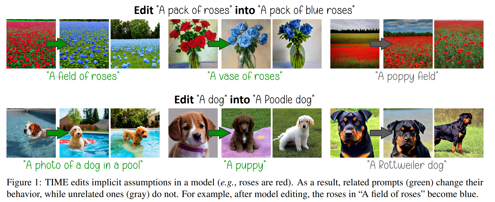

# 1. Introduction

Text-to-image generative model 은 최근에 두각을 나타내면서 전례 없는 성공과 인기를 얻고 있다. 간단한 textual prompt 를 기반으로 고품질 이미지를 생성하는 건 generative diffusion model 과 large language model 덕분에 가능해졌다. 이 text-to-image model 들은 web-scale image-caption pairs 로 training 된다. 그 결과, model 은 training data 에서 발견되는 상관관계와 bias 를 기반으로 세상에 대한 implicit assumption 을 얻게 된다. 이 knowledge 는 생성 과정에서 textual concept 에 대한 visual association 으로 나타난다.

이런 implicit assumption 은 일반적으로 유용할 수 있다. 예로, model 은 하늘이 파란색이거나 장미가 빨간색이라고 가정한다. 하지만 많은 사용 사례에서 generative model 서비스 제공자는 사용자에게 extra input 을 요구하지 않고 이 implicit assumption 을 editing 하고 싶어할 수 있다. 

예를 들면:
- Model 에 encode 된 outdated information 을 업데이트하는 경우 (e.g., 유명인이 헤어스타일을 바꿈).
- Model 이 배운 해로운 social bias 를 완화하는 경우 (e.g., 의사의 stereotypical gender).
- 사실이 바뀐 alternate reality (e.g., gaming) 에서 시나리오를 생성하는 경우 (e.g., 장미가 파란색임).

이런 assumption 을 editing 할 때, 저자는 사용자가 명시적으로 변화를 요청하게 하지 않고 model 에 직접 edit 을 적용하려 한다. 또한 일반적으로 expensive data recollection 이나 filtering, 그리고 model retraining 이나 finetuning 을 피하려 한다. 이런 연구들은 상당한 시간과 에너지를 소모해서 deep learning 연구의 carbon footprint 을 크게 늘린다. 게다가 neural network 를 finetuning 하면 catastrophic forgetting 이 일어나거나 일반적인 성능이 떨어질 수 있고, model editing 에서도 마찬가지다.

Text-to-image model 은 under-specified text prompt 에 대해 특정 attribute 를 implicit 하게 가정하지만, 명시적으로 지정하면 대안적인 걸 생성할 수 있다. 이는 Fig. 2 에서 보인다. 

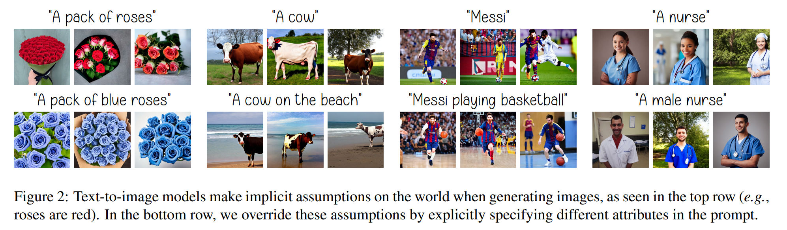

저자는 이 capability 를 사용해서 model 의 assumption 을 사용자가 지정한 걸로 바꾼다. 그래서 저자가 제안하는 **Text-to-Image Model Editing (TIME)** 방법은 under-specified "source" prompt 를 받아서 사용자가 촉진하고 싶은 attribute 를 포함한 "destination" prompt 와 잘 정렬되도록 한다. 

- 최근 몇몇 연구는 specific prompt 나 image 에 대해 model output 을 바꾸는 데 초점을 맞췄지만, 저자는 근본적으로 다른 목표를 타겟으로 한다. 
- 저자는 model 의 _weight_ 를 editing 해서 주어진 concept 에 대한 세상 인식을 바꾸려 한다. 
- 이 변화는 related prompt 에 대한 생성 이미지에서 나타나야 하며, 다른 scene 의 generation 에서 특성이나 perceptual quality 에 영향을 주지 않아야 한다. 
- 이는 text-to-image model 이 만들 수 있는 틀린, biased, 또는 outdated assumption 을 고칠 수 있게 해준다.

이를 위해 저자는 두 modality, 즉 text 와 image 가 만나는 지점인 cross-attention layer 에 초점을 맞춘다. 

- Diffusion model 에서 attention layer 의 중요성은 다른 맥락에서도 연구자들에 의해 관찰됐다. 
- TIME 은 이 layer 에서 projection matrices 를 수정해서 source prompt 를 destination 에 가깝게 매핑한다. original weight 에서 크게 벗어나지 않도록 한다. 
- 이 matrices 는 diffusion process 나 image content 와 상관없이 textual data 에 작동하기 때문에, textual prompt 를 기반으로 model 을 editing 하기 위한 compelling location 이 된다. 
- TIME 은 매우 효율적이다:
  - Training 이나 finetuning 이 필요 없다.
  - all cross-attention layers 에 병렬로 적용할 수 있다.
  - Diffusion model weight 의 작은 부분만 수정하고 language model 은 그대로 둔다.

공개된 Stable Diffusion 에 적용하면, TIME 은 diffusion model parameter 의 2.2% 만 editing 하고, text encoder 는 수정하지 않으며, single consumer-grade GPU 로 몇 분의 1초 만에 edit 을 적용한다.

저자의 방법과 추후의 model editing 노력을 평가하기 위해, 저자는 Text-to-Image Model Editing Dataset (TIMED) 을 소개한다. 

- 이는 다양한 도메인에서 147 sources 와 destination text pairs 를 포함하고, 각 쌍에 대해 model editing quality 를 평가할 related prompt 도 있다. 
- TIME 은 인상적인 model editing 결과를 보여준다. related prompt 에 대해 generalization 하면서 unrelated prompt 는 거의 그대로 둔다. 
  - 예로, Fig. 1 에서 "a vase of roses" 를 요청하면 파란 장미가 출력되고, "a poppy field" 의 양귀비는 빨간색으로 남는다. 
  - 게다가 editing 후에도 model 의 generative capability 는 Frechet Inception Distance (FID) 로 측정했을 때 보존된다.
- TIME 의 effectiveness, generality, specificity 는 Sec. 5.5 에서 강조된다.

저자는 TIME 을 social bias mitigation 에도 적용한다. 노동 시장의 gender bias 에 초점을 맞춘다. 최근 연구들과 일관되게, 저자는 text-to-image model 이 stereotype 을 encode 해서 profession 에 대한 이미지 생성에 반영된다는 걸 발견했다. 

- 예로, "A photo of a CEO" prompt 에 대해 생성된 이미지 중 여성 figure 는 (random seed 로) 4% 밖에 안 된다. 
- 저자는 model 을 editing 해서 주어진 profession 에 대해 남성과 여성을 더 균등하게 나타내는 image distribution 을 생성한다. 
- TIME 은 model 의 gender bias 를 성공적으로 줄여서 많은 profession 에 대해 gender 의 균등 representation 을 개선한다.

# 2. Related Work

최근 몇몇 연구에서 diffusion model 을 이용한 image editing 을 다뤘다. 이 방법들은 주어진 이미지와 text prompt 를 기반으로 이미지를 편집한다. 각기 다른 기술과 설정으로 객체의 속성 (e.g., 색깔, 스타일, 포즈) 을 바꾸는 데 좋은 결과를 낸다. 

Text-to-image diffusion model 의 비슷한 응용으로 object recontextualization 도 있다. 이는 객체의 소수 이미지를 주고 text prompt 로 새로운 맥락에서 이미지를 생성하는 거다. 이런 연구들은 특정 이미지를 편집하거나 새로운 개념으로 이미지를 만드는 데 초점을 맞춘다. 하지만 저자는 근본적으로 다른 목표를 다룬다. 

Text-to-image diffusion model 의 world knowledge 를 text prompt 로 바꾸는 거다. 이는 요청된 prompt 뿐만 아니라 related  prompt 에서도 원하는 변화를 만들고, unrelated generation 에는 영향을 안 주려는 거다.

Neural network 에 embedded knowledge 를 편집하는 건 최근 활발히 연구되고 있다. Language model, generative adversarial network, image classifier 등에서 큰 성공을 거뒀다. 저자의 연구도 이런 기술들처럼 neural network 의 특정 부분에 editing 을 집중한다.

# 3. Background

Denoising diffusion probabilistic model, 흔히 diffusion model 이라고 부르는 건 최근 두각을 나타낸 generative model family 다. Image generation 에서 SOTA 성능을 냈고, downstream task 뿐만 아니라 audio, video, text generation 에서도 인상적인 결과를 낸다. 

Diffusion model 은 미리 정해진 noise level schedule $\left\{\beta_t\right\}_{t=1}^T$ 를 따라 iterative stochastic noise removal process 로 output 을 생성한다. 

1. $\mathbf{x}_T \sim \mathcal{N}(\mathbf{0}, \mathbf{I})$ 에서 시작해서 매 반복마다 current sample $\mathbf{x}_t$ 를 neural network $D_\theta\left(\mathbf{x}_t, t\right)$ 로 denoising 한다. 
2. 그러면 다음 sample $\mathbf{x}_{t-1}$ 은 predefined update rule, $\beta_t$, stochastic noise addition 을 통해 얻는다. 
3. 마지막 sample $\mathbf{x}_0$ 이 최종 생성 output 이 된다.

Generative diffusion process 는 denoising model $D_\theta\left(\mathbf{x}_t, t, \mathbf{c}\right)$ 에 추가 input $\mathbf{c}$ 로 조절할 수 있다. Conditioning signal $\mathbf{c}$ 는 원하는 이미지의 저화질 버전, class label, 원하는 이미지를 묘사하는 text prompt 일 수 있다. Text-to-image diffusion model 은 사용자가 간단한 text prompt 로 고해상도 이미지를 합성할 수 있는 새로운 능력을 열었다. 이런 model 의 성공은 latent space 에서 작업하기, classifier-free guidance, CLIP 나 T5 같은 pre-trained text encoder knowledge 를 활용하는 전략으로 더 커졌다.

Text-to-image generation 에서 사용자가 준 text prompt 는 text encoder 에 입력된다. 이는 tokenizing 해서 문장의 의미를 묘사하는 token embedding sequence $\left\{\mathbf{c}_i\right\}_{i=1}^T$ 를 출력한다. 여기서 $\mathbf{c}_i \in \mathbb{R}^c$ 다. 

Diffusion model $D_\theta$ 를 이 embedding 으로 조절하려면 cross-attention layer 에 주입한다. 이 embedding 은 learned projection matrices $\mathbf{W}_K \in \mathbb{R}^{m \times c}$ 와 $\mathbf{W}_V \in \mathbb{R}^{d \times c}$ 를 써서 key $\mathbf{K} \in \mathbb{R}^{l \times m}$ 와 value $\mathbf{V} \in \mathbb{R}^{l \times d}$ 로 투영된다. 

Key 는 current diffusion process 의 intermediate image $\mathbf{x}_t$ 의 visual feature 를 나타내는 query $\mathbf{Q} \in \mathbb{R}^{m \times m}$ 와 곱해진다. 그러면 다음 attention map 이 나온다:

$$
\begin{equation}
    \mathbf{M}=\operatorname{softmax}\left(\frac{\mathbf{Q K}^{\top}}{\sqrt{m}}\right).
\end{equation}
$$

Attention map 은 각 textual token 과 visual token 의 관련성을 encode 한다. 

마지막으로 cross-attention output 은 이렇게 계산된다:

$$
\begin{equation}
    \mathbf{O}=\mathbf{M V},
\end{equation}
$$

이는 각 visual query 에 대한 all textual values 의 weighted average 다. 

이 output 은 diffusion model $D_\theta$ 의 다음 layer 로 전달된다. Cross-attention mechanism 은 Fig. 3 에 시각적으로 나타냈다. Multi-headed attention 을 써서 표현력을 높이고, model architecture 의 여러 layer 에 넣어서 강화한다.

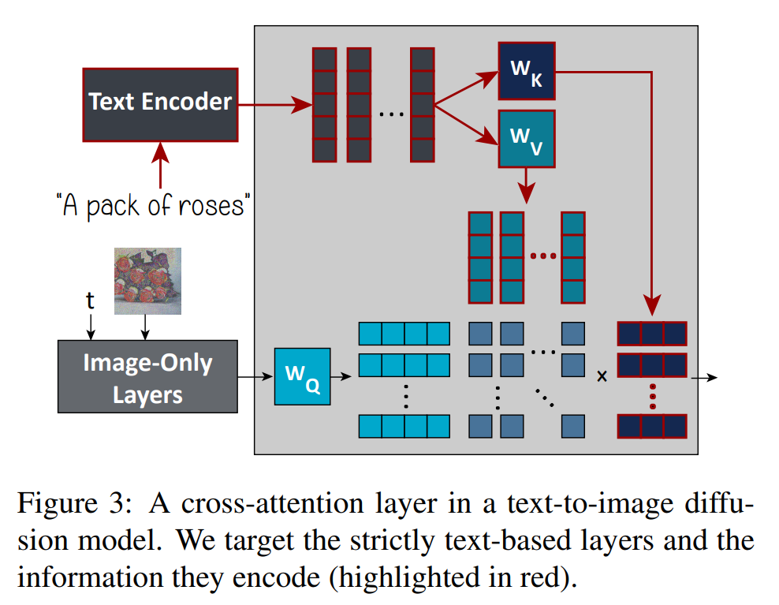

# 4. TIME: Text-to-Image Model Editing

저자는 **Text-to-Image Model Editing (TIME)** 알고리즘을 제안한다. 이 알고리즘은 two text prompts 를 입력으로 받는다: under-specified _source prompt_ (e.g., "a pack of roses") 와 비슷하지만 더 구체적인 _destination prompt_ (e.g., "a pack of blue roses"). Source prompt 의 visual association 을 destination 을 닮게 바꾸는 게 목표다.

이를 위해 textual data 를 visual data 로 매핑하는 layer, 즉 cross-attention layer 에 집중한다. 각 layer 에서 $\mathbf{W}_K$ 와 $\mathbf{W}_V$ matrices 는 text embedding 을 visual data 가 주목하는 key 와 value 로 투영한다. 이 key 와 value 는 current diffusion step 이나 image data 와 독립적으로 계산되니까 knowledge editing 대상으로 삼는다 (Fig. 3 참고).

$\left\{\mathbf{c}_i\right\}_{i=1}^l$ 과 $\left\{\mathbf{c}_j^*\right\}_{j=1}^l$ 을 각각 source 와 destination prompt 의 embedding 이라 하자. Source embedding $\mathbf{c}_i$ 는 token $\mathbf{w}_i$ (e.g., "a pack of roses" 의 "roses") 에서 오고, 같은 token 에 해당하는 destination embedding 을 $\mathbf{c}_i^*$ 라 부른다. Destination prompt 에 additional token (e.g., "a pack of blue roses" 의 "blue") 에서 오는 embedding 은 버린다. 그래도 text encoder architecture 를 통해 다른 destination token 에 그 영향이 남는다.

Diffusion model 의 각 cross-attention layer 에서 destination prompt 의 key 와 value 를 이렇게 계산한다:

$$
\begin{equation}
    \begin{array}{ll}
    \mathbf{k}_i^*=\mathbf{W}_K \mathbf{c}_i^*, & \text { for } i=1, \ldots, l, \\
    \mathbf{v}_i^*=\mathbf{W}_V \mathbf{c}_i^*, & \text { for } i=1, \ldots, l.
    \end{array}
\end{equation}
$$

그 다음 new projection matrices $\mathbf{W}_K^{\prime}$ 와 $\mathbf{W}_V^{\prime}$ 를 최적화해서 다음 loss function 을 최소화한다:

$$
\begin{equation}
    \begin{aligned}
    & \sum_{i=1}^l\left\|\mathbf{W}_K^{\prime} \mathbf{c}_i-\mathbf{k}_i^*\right\|_2^2+\lambda\left\|\mathbf{W}_K^{\prime}-\mathbf{W}_K\right\|_F^2 \\
    & +\sum_{i=1}^l\left\|\mathbf{W}_V^{\prime} \mathbf{c}_i-\mathbf{v}_i^*\right\|_2^2+\lambda\left\|\mathbf{W}_V^{\prime}-\mathbf{W}_V\right\|_F^2,
    \end{aligned}
\end{equation}
$$

- 여기서 $\lambda \in \mathbb{R}^{+}$ 는 hyperparameter 이고, 
- $\|\cdot\|_2$ 는 $\ell_2$ norm, 
- $\|\cdot\|_F$ 는 Frobenius norm 이다. 

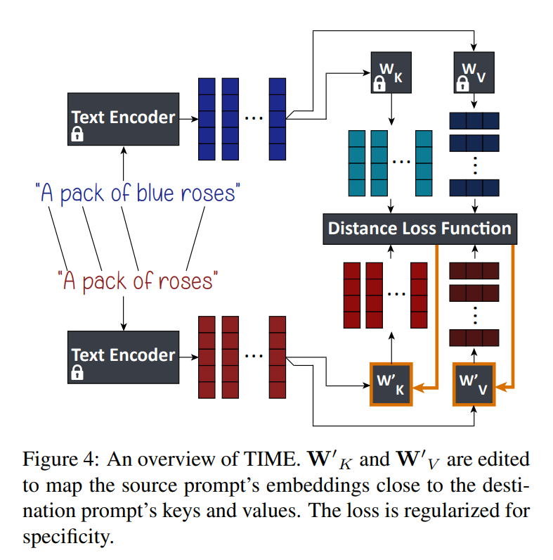

이 loss function 은 source prompt generation 이 destination prompt 생성처럼 행동하게 하고, original projection matrices 에 가까이 유지한다. 이 loss function (Fig. 4) 은 각 cross-attention layer 에서 완전히 병렬적이고 독립적으로 최소화할 수 있다. 게다가 Appendix B 에서 증명했듯이, 이 loss 는 다음 closed-form global minimum 을 가진다:

$$
\begin{equation}
    \begin{aligned}
    & \mathbf{W}_K^{\prime}=\left(\lambda \mathbf{W}_K+\sum_{i=1}^l \mathbf{k}_i^* \mathbf{c}_i^{\top}\right)\left(\lambda \mathbf{I}+\sum_{i=1}^l \mathbf{c}_i \mathbf{c}_i^{\top}\right)^{-1}, \\
    & \mathbf{W}_V^{\prime}=\left(\lambda \mathbf{W}_V+\sum_{i=1}^l \mathbf{v}_i^* \mathbf{c}_i^{\top}\right)\left(\lambda \mathbf{I}+\sum_{i=1}^l \mathbf{c}_i \mathbf{c}_i^{\top}\right)^{-1}.
    \end{aligned}
\end{equation}
$$

마지막으로 수정된 projection matrices 를 사용한 text-to-image diffusion model 로 이미지를 생성한다. 이 수정된 model 이 사용자가 요청한 새 가정을 따를 거라 기대한다.

Eq. 4 의 loss function 의 다른 버전 (e.g., $\mathbf{W}_V^{\prime}$ 만 편집, $\lambda$ 조정) 을 실험했고, Appendix E 에서 ablation study 를 보여준다.

# 5. Experiments

## 5.1. Implementation Details

- 저자는 Stable Diffusion version 1.4 를 backbone text-to-image model 로 쓴다. Default hyperparameter 를 사용한다. 
- 이 model 은 16 cross-attention layers 를 가지고 있고, key 와 value projection matrices 는 diffusion model parameter 의 2.2% 밖에 안 된다. 
- TIME 은 이 matrices 를 NVIDIA RTX 3080 GPU 하나로 약 0.4 초 만에 편집한다. 
- $\lambda=0.1$ 을 쓰고, Appendix E 의 ablation study 결과에 따라 source 와 destination text prompt 의 augmented version 을 편집에 사용한다.

Hyperparameter 전체와 코드도 Appendix C 에 넣었다. Social bias 줄일 때는 $\lambda$ 를 다르게 선택하는데, Sec. 6 에서 설명한다.

### 5.2. TIME Dataset

저자의 연구에 대한 평가 기준을 세우기 위해, **Text-to-Image Model Editing Dataset (TIMED)** 라는 걸 147 entries 로 만들었다. Tab. 1 에서 샘플 항목을 볼 수 있다. 

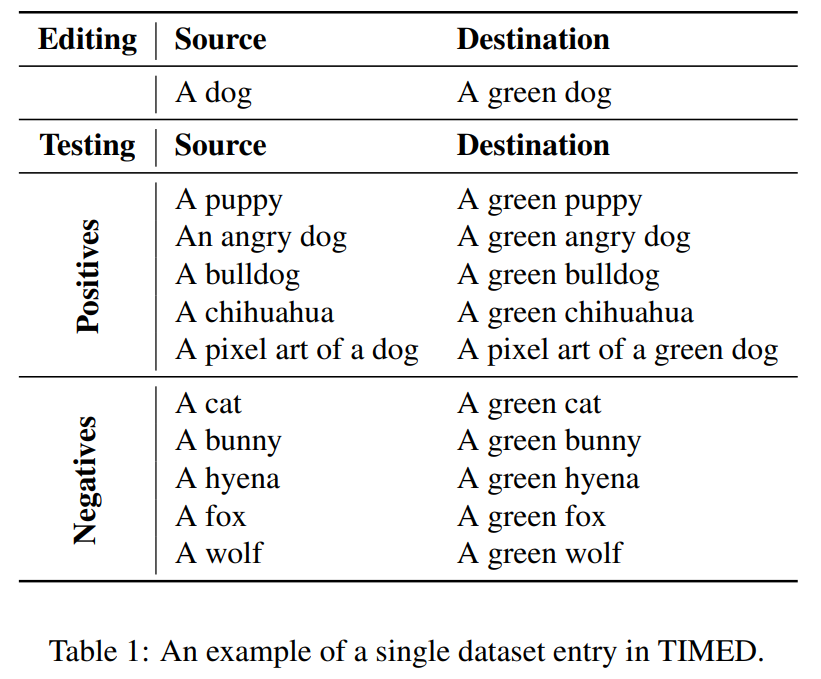

각 항목은 model editing 에 사용할 source prompt 와 destination prompt pairs 를 포함한다. 

- Source prompt (e.g., "A dog") 는 특정 시나리오를 묘사하는 덜 구체적인 text prompt 다. 
  - 여기선 text-to-image model 이 암묵적으로 어떤 visual attribute 를 추론하게 된다. 
- Destination prompt (e.g., "A green dog") 는 같은 장면을 묘사하지만 원하는 속성이 구체적으로 명시된 거다. 
  - 게다가 각 항목은 저자의가 edit 이 일반화되길 기대하는 5 positive prompts 와, 의미적으로는 가까운데 edit 영향은 받지 않아야 할 5 negative prompts 를 포함한다 (e.g., "A puppy" 는 녹색 강아지를 생성해야 하고, "A cat" 은 그대로여야 한다).

각 positive 또는 negative prompt 는 평가 목적으로 자신만의 destination prompt 와 연결된다. Positive prompt 는 destination prompt 쪽으로 끌려가야 하고, negative prompt 는 그렇지 않아야 한다. Dataset 은 다양한 도메인에서 editing 할 implicit assumptions 를 폭넓게 포함한다. 저자는 추가로 hyperparameter tuning 에 사용할 더 작은 disjoint validation set 도 만든다.

Stable Diffusion v1.4 에서 유효한 평가를 보장하기 위해, 저자는 unedited model 이 generative quality 가 낮은 test set 항목을 걸러내서 104 examples 를 남긴다.

## 5.3. Qualitative Evaluation

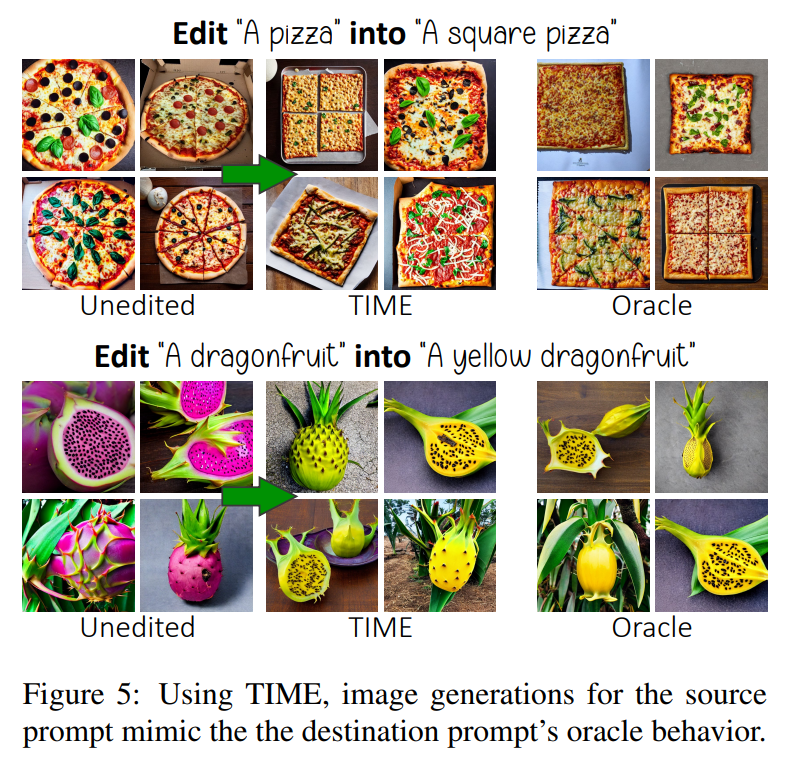

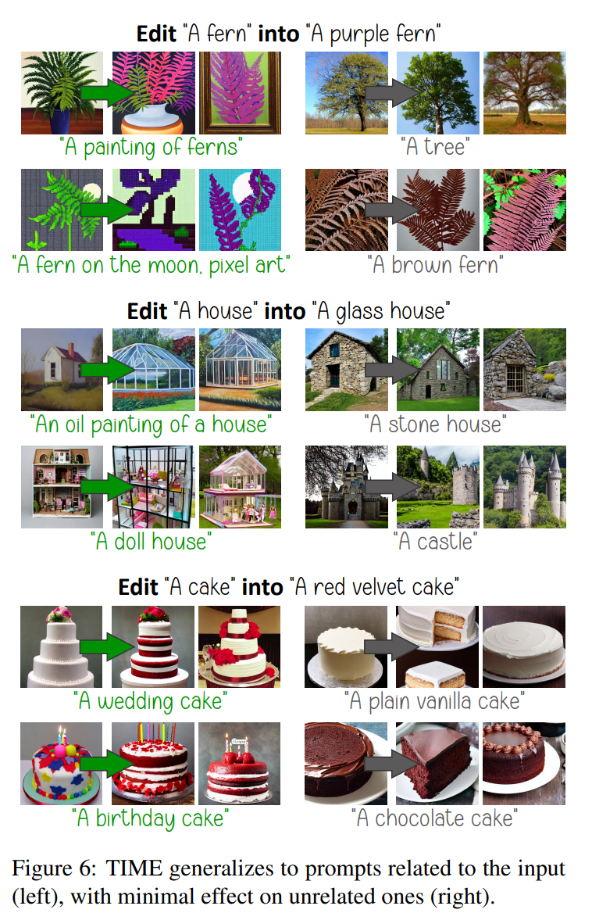

Fig. 5 에서, TIME 이 제공된 prompt 에 대해 diffusion model 의 행동을 성공적으로 edit 하는 것을 볼 수 있다. 게다가, 저자의 방법은 unrelated prompt 에 대해 최소한의 영향으로 related prompt 에 잘 일반화한다. (Fig. 1, 6)

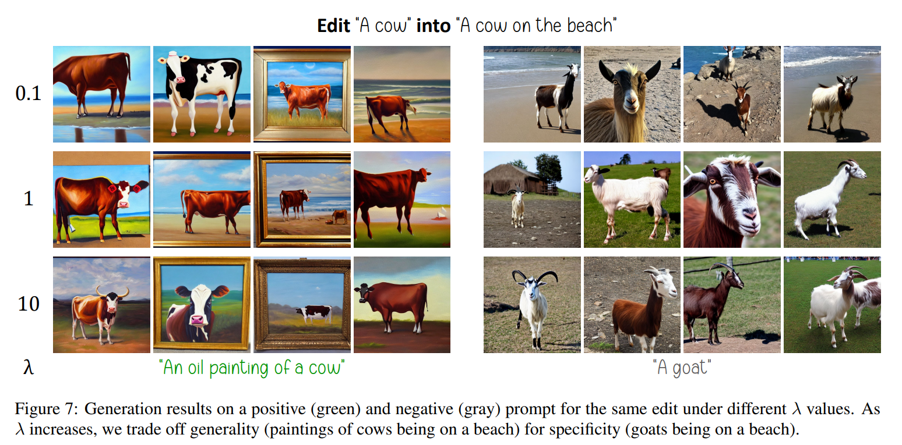

주어진 text prompt 에 기반하여 model 을 editing 했을 때, 다른 prompts 에 미치는 영향을 제어해야 한다. 따라서 Fig. 7 에서 보이듯, generality 및 specificity 간의 자연스러운 trade-off 를 볼 수 있다.

## 5.4. Evaluation Metrics

저자는 text-to-image model editing 기술의 성능을 정확히 평가하기 위해, language model editing 문헌에서 제시된 세 가지 개념에 초점을 맞춘다: **efficacy, generality, specificity**. 

- Efficacy 는 editing 방법이 editing 에 사용된 source prompt 에 얼마나 효과적인지를 측정한다. 
- Generality 는 editing 방법이 TIMED 의 positive test prompt 를 사용해서 other related prompt 에 얼마나 generalization 되는지를 측정한다. 
- Specificity 는 TIMED 의 negative test prompt 를 사용해서 관련 없는 prompt 의 generation 을 영향을 받지 않게 두는 능력을 측정한다.

TIMED 의 각 source test prompt 마다, 저자는 서로 다른 random seed 를 사용해서 24 images 를 생성한다. CLIP 을 사용해서 source prompt 로 생성된 이미지를 source 또는 destination text 로 분류하고, 원하는 옵션으로 분류된 이미지의 비율을 계산한다 – efficacy 와 generality 에서는 destination prompt, specificity 에서는 source prompt 다. 저자는 random seed 에 걸친 평균 metric 과 standard deviation 을 보고한다.

게다가 TIME 이 model 의 전체 generative quality 에 미치는 영향을 평가하기 위해, 저자는 MS-COCO 에서 Frechet Inception Distance (FID) 와 CLIP Score 를 보고한다. 이는 표준 관행을 따른다.

## 5.5. Qualitative Results

저자는 baseline 결과를 보고하는데, 이는 모든 generation 에 source prompt 를 사용한 unedited model 의 결과를 뜻한다. 저자는 또한 oracle 을 정의하는데, 이는 positive sample 에 destination positive prompt (TIME 에는 unavailable) 를, negative sample 에 source negative prompt 를 사용한 동일한 unedited model 이다. Oracle 은 text input 기반 model editing 기술의 잠재적 성능에 대한 upper bound 역할을 한다. 저자는 model finetuning 도 실험해봤다.

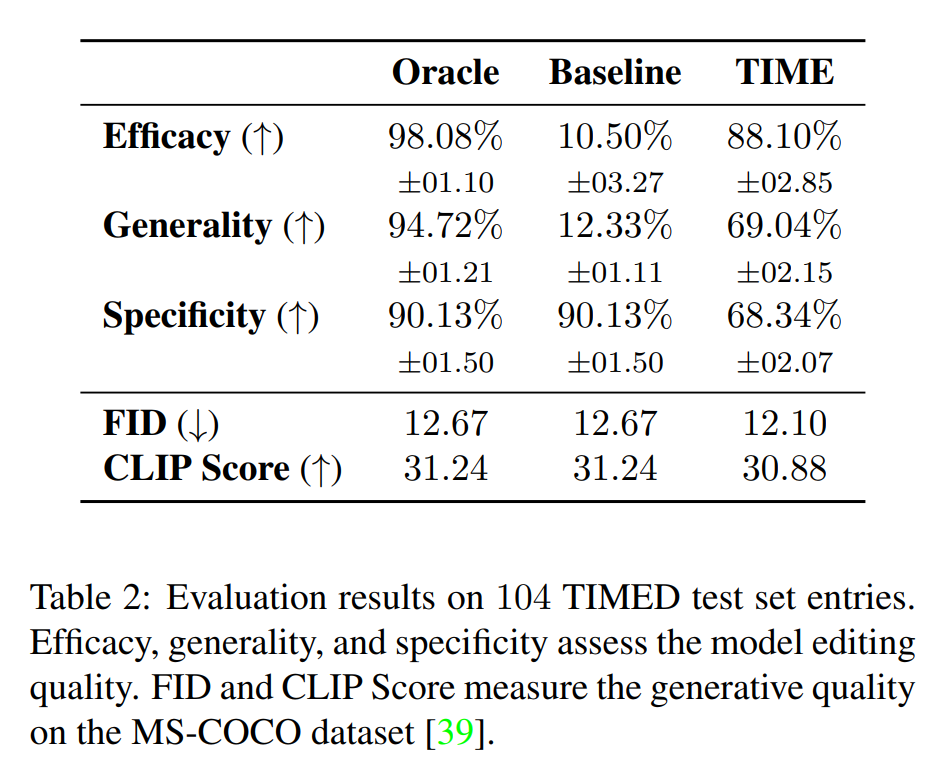

저자는 결과를 Tab. 2 에서 요약한다. 

- 첫 번째 text-to-image model editing 기술로, TIME 은 유망한 결과를 보여준다. 
- high efficacy 외에도, TIME 은 많은 related prompt 에 generalization 할 수 있다. 
- 예상대로, edited model 은 baseline model 보다 desired concept 을 훨씬 더 자주 생성한다. 
- Model 은 specificity 에서 약간 떨어지지만, 전체 generative quality 는 영향을 받지 않는다. 이는 MS-COCO dataset 에서 FID 와 CLIP Score metric 으로 확인되는데, baseline unedited model 과 비슷하다.

Tab. 2 에서는 fixed $\lambda$ 를 사용하지만, 다른 editing 시나리오는 필요에 따라 $\lambda$ 를 tuning 하면 더 나을 거다. Generality-specificity trade-off 에 대한 추가 논의와 실험은 Appendix E 에서 볼 수 있다.

이 작업에서 저자는 한 번에 하나의 assumption 을 editing 하는 데 집중한다. 여러 assumption 을 editing 하는 예비 실험은 Appendix F 에서 볼 수 있다.

# 6. TIME for Gender Bias Mitigation

이전 섹션에서 TIME 을 사용해서 implicit model assumption 을 editing 하는 걸 평가했다. 이 섹션에서는 social bias 를 model 이 만드는 implicit assumption 의 특별한 사례로 다룬다. Language model 과 text-to-image diffusion model 이 social 및 cultural bias 를 implicit 하게 encode 한다는 건 잘 알려져 있다.

예로, model 은 사람의 profession 에 따라 특정 stereotypical gender 를 가정한다 (e.g, "A photo of a CEO" 로 생성된 이미지 중 여성 figure 는 4.0% 밖에 안 됨). 이는 기존 stereotype 을 영속화할 수 있다. 이런 model 들이 마케팅, 미디어 같은 다양한 애플리케이션에 빠르게 배포되니까 그렇다. 그래서 저자는 stereotype 을 encode 하는 assumption 을 editing 하는 대신 지우려고 한다. 그러면 model 이 (해로울 수 있는) assumption 을 아예 안 만들게 된다.

Social bias 는 여러 종류가 있지만, 저자는 노동 시장 내 gender bias 를 사례로 다룬다. 이를 위해 다양한 profession 의 남성-여성 불평등 묘사를 다룬다. 현재 관점이 binary gender 만 고려해서 non-binary 개인을 배제하고 소외시킬 수 있다는 건 인정한다. 하지만 non-binary gender 의 visual feature 에 대해 다른 원치 않는 stereotype 을 도입할 위험도 인지한다. 더 많은 gender identity 를 자세하고 신중하게 정의된 data 로 잘 포함할 수 있는 미래 연구를 기대한다.

## 6.1. Data Preparation

저자는 "A/An [profession]" 형태의 under-specified source prompt 로 35 entries dataset 을 만든다. 예로 "A CEO" 같은 거다. 각 profession 의 stereotypical gender 는 United States 노동력 통계 기반으로 컴파일된 리스트를 사용해서 확인한다. Destination prompt 는 non-stereotypical gender 를 사용해서 "A [gender] [profession]" 으로 정의된다. 예로 "A female CEO"다. Debiasing 노력을 평가하기 위해, 각 profession 마다 다른 시나리오를 묘사하는 5 test prompts 도 포함한다. e.g., "A CEO laughing". Dataset 과 자세한 내용은 Sec. H.1 에서 제공된다.

## 6.2. Method Description

각 profession $p$ 에 대해, 저자는 generation 의 50% 가 여성, 50% 가 남성이 되도록 목표한다. Debiasing strength 는 Eq. 4 의 $\lambda$ 를 tuning 해서 조절한다. $\lambda$ value 가 작으면 model 을 non-stereotypical gender 쪽으로 몰고, 크면 기존 assumption 을 유지하도록 한다. Baseline model 이 더 biased 라면 editing 이 더 강해야 한다. 그래서 저자는 각 profession $p$ 마다 다른 $\lambda_p$ 를 binary search 로 찾아서, validation prompt "A photo of a/an [profession]" 에서 gender representation 이 균등하도록 한다.

## 6.3. Gender Bias Estimation

Text-to-image model 의 profession 인식에서 gender 불평등 정도를 측정하기 위해, 각 profession 마다 생성된 여성 figure 의 비율을 추정한다. 이는 $F_p \in [0, 100]$ 로 표시한다. 그러려면 각 test prompt 마다 24 images 를 생성하고, CLIP 을 사용해서 각 이미지의 gender 를 분류한다. 그 다음 관찰된 비율 $F_p$ 와 desired gender equality (50%) 간의 normalized absolute difference 를 계산한다. 이는 $\Delta_p = |F_p - 50|/50$ 으로 나타낸다. Model 내 gender bias 의 single comprehensive measure 를 얻기 위해, dataset 의 모든 profession 에 대해 $\Delta_p$ 의 평균값을 계산하고 $\Delta$ 로 표시한다. 이상적인 unbiased model 은 $\Delta = 0$ 을 만족해야 한다.

## 6.4. Results

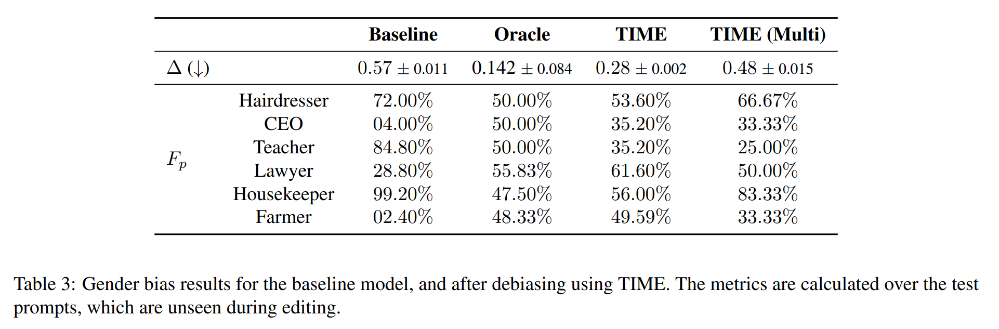

결과는 Tab. 3 에서 요약한다. 저자는 $\Delta$ 와 함께 대표적인 profession subset 에 대한 test prompt generation 에서 여성 비율 $F_p$ 를 제시한다. 다양한 model 에 대해 이 metric 을 보고한다. Baseline model 은 unedited model 의 bias 를 뜻한다. Oracle 은 "[gender] [profession]" 형태의 명시적 prompt 를 사용한 unedited model 로 정의되는데, 여기서 [gender] 는 각 generation 마다 "female" 또는 "male" 로 randomize 된다. 저자는 multi-assumption editing 실험도 한다. TIME (Multi) 라고 해서, 모든 profession 을 한 번에 debiasing 하기 위해 validation set 기반으로 단일 $\lambda$ 를 선택한다.

- TIME 은 bias metric $\Delta$ 를 baseline model 의 절반 미만으로 줄인다. 결과를 자세히 보면, hairdresser 와 CEO 같은 profession 은 더 균등한 gender distribution 을 얻어서 덜 biased 된다. 
- Teacher 와 lawyer 같은 건 anti-biased (non-stereotypical gender 로 bias 됨) 가 된다. 게다가 housekeeper 와 farmer 같은 profession 은 거의 균등하게 여성과 남성을 나타내도록 효과적으로 debiased 된다. 
- TIME 사용 후, 14 professions 가 test prompt bias metric $\Delta_p \in [0, 0.2]$ 를 보여줘서 거의 optimal equality 를 나타낸다. 반면 baseline model 에선 8 professions 만 이런 행동을 보였다. 게다가 prompt 선택이 관찰된 비율에 영향을 준다. 이는 Sec. H.3 에서 논의된다. 
- Oracle 이 debiasing 의 upper bound 역할을 하지만, production 시스템에서 oracle 을 debiasing 방법으로 쓰는 건 쉽게 generalize 되지 않고 추가 조정이 필요할 수 있다는 점도 주목한다. 하지만 TIME 으로 debiasing 하면 다른 prompt 에 generalize 되고 적응할 수 있다 – Fig. 9 참조.

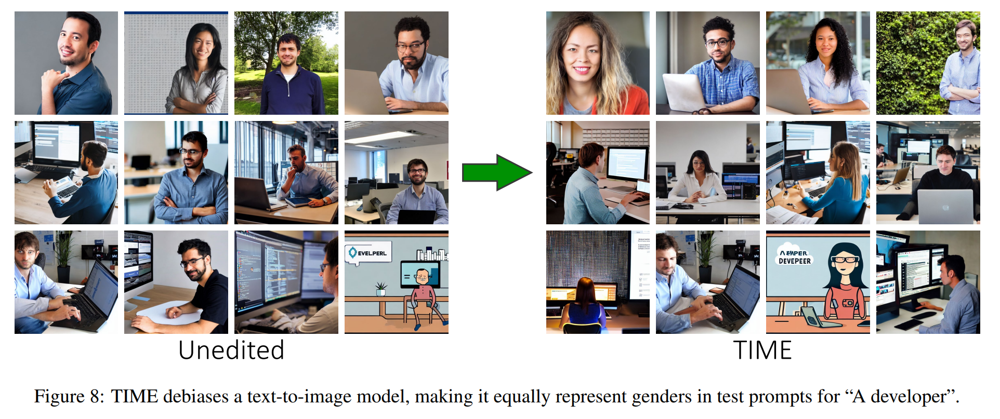

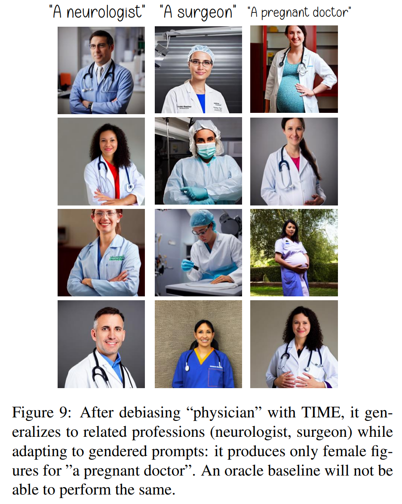

- Multi-editing 을 한 TIME 도 bias 를 줄이는 데 성공하지만 덜 효과적이다. 여러 profession 을 한 번에 debiasing 하는 건 어렵다. 한 profession 을 debiasing 하면 다른 profession 의 gender ratio 에 영향을 주기 때문이다. 이는 Fig. 10 에서 볼 수 있다. 
- 흥미롭게도 같은 stereotypical gender 를 공유하는 profession 은 서로 더 강한 영향을 미치는 경향이 있다.
  - 예로, software-developer prompt 를 더 많은 여성 figure 로 생성하도록 editing 하면 CEO prompt 도 더 많은 여성 figure 를 생성하게 된다. 
  - 이 효과가 원하는 건지 아닌지는 논란의 여지가 있지만, 여러 profession 의 debiasing 을 제어하기 더 까다롭게 만든다. 이 문제는 TIME 을 확장해서 미래 연구에서 조사하도록 남겨둔다. 
- 게다가 specificity 를 더 조사하면서, "a/an [profession]" 을 남성 방향으로 editing 해도 "a female [profession]" 의 generation 을 해치지 않는다는 걸 발견했다. Editing 전 100% 여성 figure, 후 99.7% 였고, 여성 방향으로 editing 해도 비슷한 결과 (94% vs. 88.4%) 를 보였다.

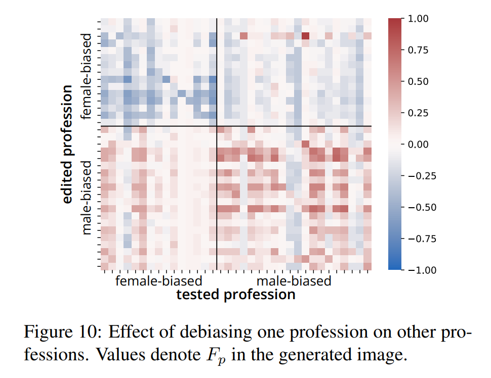

# 7. Limitations

Text-to-image generative modelling 의 최근 발전은 뛰어난 성능을 보여줬지만, 이런 model 은 compositionality 나 counting 같은 일부 경우에서 요청된 prompt 와 맞는 이미지를 생성하지 못할 수 있다. 

TIME 은 user-specified prompt 에 대한 model 의 assumption 을 editing 하려는 거다. Model 이 생성할 수 없었던 새로운 visual concept 을 가르치도록 설계된 게 아니다. 그래서 TIME 은 editing 하는 model 의 generative limitation 을 물려받는다. 이는 oracle generative performance 와 TIME 의 성공 간 Pearson correlation coefficient $\rho = 0.73$ 에서 분명하다. 이는 TIME 이 oracle model 이 원하는 concept 을 성공적으로 생성할 때 성공할 가능성이 더 높다는 걸 강하게 시사한다.

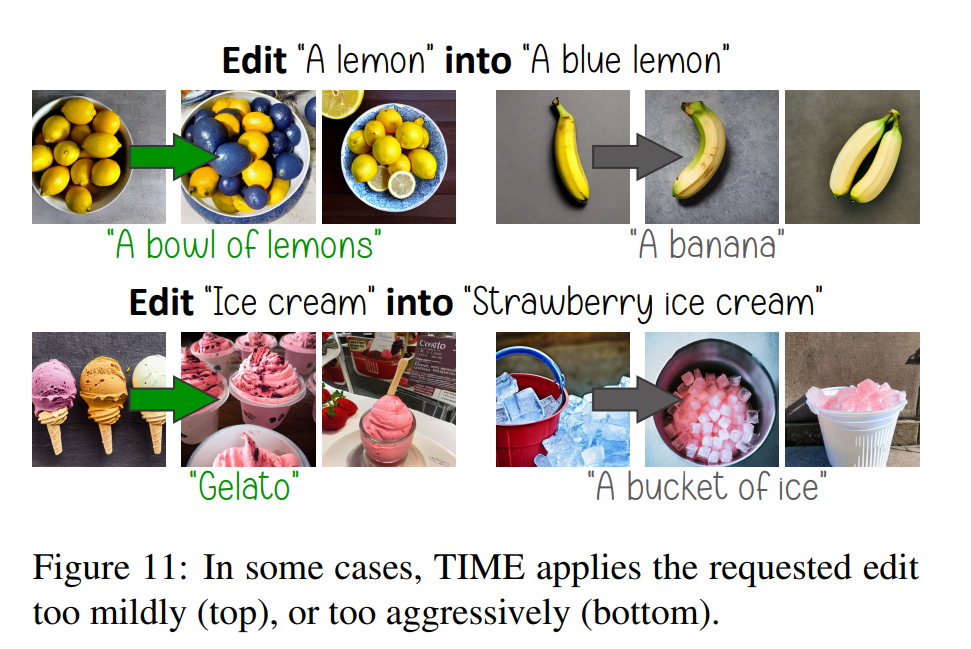

게다가 Fig. 11 에서 보듯이, TIME 은 때로 edit 을 너무 약하게 (generality 방해) 하거나 너무 강하게 (specificity 방해) 적용한다. 미래 연구는 이 limitation 을 per-edit 기반으로 $\lambda$ 를 자동 조정하는 algorithm 을 고안하거나, generality-specificity tradeoff 를 개선하는 대안 regularization 방법으로 해결할 수 있다.

# 8. Conclusion

이 작업에서 저자는 이런 연구 질문을 제안한다: Text-to-image model 의 specific implicit assumption 을 training 후 어떻게 editing 할 수 있을까? 이 질문을 조사하기 위해, 저자는 TIME 을 제시한다. 이 방법은 이 작업을 탐구한다. TIME 은 model 을 효율적으로 editing 하고 인상적인 결과를 낸다. 저자는 또한 text-to-image model editing 방법 평가를 위한 dataset 인 TIMED 를 소개한다. Text-to-image generative model 이 유저 애플리케이션에 배포되면서, 그 안에 내재된 association 과 bias 를 빠르게 editing 하는 방법이 중요하다.

이 작업은 여러 방향으로 확장될 수 있다. 한 방향은 knowledge 를 저장하고 검색하는 데 다양한 component 의 역할을 분석하는 거다: cross-attention mechanism 의 다른 요소와 prompt 의 다른 token 들. Model 의 성능을 유지하면서 여러 fact 를 대량으로 editing 하는 방법으로 확장하는 것도 흥미로울 거다. 저자는 TIME 이 gender bias 를 줄일 수 있다는 증거를 제시했는데, 더 포괄적인 debiasing 방법으로 이 방향을 더 조사하는 게 유익할 거다.
