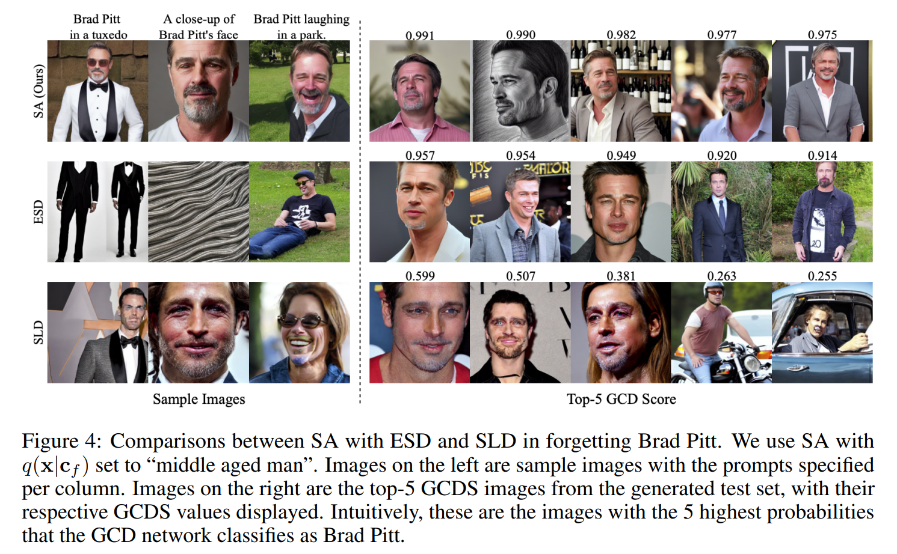

논문 및 이미지 출처 : <https://proceedings.neurips.cc/paper_files/paper/2023/file/376276a95781fa17c177b1ccdd0a03ac-Paper-Conference.pdf>

# Abstract

최근 large-scale text-to-image model 의 급증은 harmful, misleading, inappropriate content 를 생성할 가능성에 대한 우려를 불러일으켰다. 이런 문제를 해결하기 위해 저자는 continual learning 에서 영감을 받은 기술을 개발했다. 

- 이 기술은 pretrained deep generative model 에서 특정 concept 를 선택적으로 잊게 만든다. 
- **Selective Amnesia** 라고 이름 붙인 이 방법은 사용자가 concept 를 어떻게 잊을지 지정할 수 있게 해준다. 
- Selective Amnesia 는 conditional variational likelihood model 에 적용할 수 있는데, 이 model 은 variational autoencoder 와 large-scale text-to-image diffusion model 을 포함한 다양한 deep generative framework 를 포괄한다. 
- 여러 model 에 대한 실험에서 저자의 방법은 standard dataset 의 entire class 에서부터 text-to-image model 의 celebrity 와 nudity prompt 까지 다양한 concept 에 대해 forgetting 을 유도한다는 것을 보여준다.

# 1 Introduction

Deep generative model 은 최근 몇 년 동안 큰 진전을 이루었고, 특히 large-scale text-to-image model 은 뛰어난 생성 능력으로 많은 관심을 끌었다. 하지만 이 model 은 harmful, discriminatory, inappropriate content 의 realistic-looking image 를 생성하는 데 오용될 수 있다. 예를 들어, Deepfake, 즉 실제 인물이 포함된 convincing fake image 와 inappropriate content (e.g., nude celebrity) 를 만들어낼 수 있다. 이 문제를 해결하기 위한 naive approach 는 training dataset 에서 specific concept 나 개인을 제외하는 것이다. 하지만 수십억 개의 image 로 구성된 dataset 을 필터링하는 것은 그 자체로 큰 도전이다. 게다가 새로운 concept 를 잊기 위해 매번 model 을 처음부터 retrain 해야 하므로 compute 와 time 측면에서 비용이 많이 든다. 이 연구에서 저자의 목표는 model 이 특정 concept 만 잊도록 retrain 하는 것, 즉 selective amnesia 를 유도하는 것이다.

Data forgetting 분야와 text-to-image diffusion model 의 context 에서 concept erasure 와 관련된 여러 시도가 있었다. 하지만 이전 연구는 discriminative model 에 초점을 맞추거나, training 중에 data 와 model 을 특별히 분할해야 했다. 여기서 저자는 pretrained generative model 에 적용할 수 있는 general framework 를 개발하고자 하며, original training data 에 접근하지 않아도 된다.

저자의 핵심 insight 는 selective forgetting 을 continual learning 관점에서 framing 할 수 있다는 것이다. 아이러니하게도 continual learning 은 forgetting 을 방지하는 데 초점을 맞춘다. 일반적으로 task $A$ 에 대한 parameter 가 주어졌을 때, task $B$ 를 수행하도록 model 을 train 하면서 task $A$ 를 잊지 않도록 한다. 즉, $\theta_A \rightarrow \theta_{A, B}$ 로 진행된다. 하지만 저자의 경우, model 이 $A$ 와 $B$ 를 생성하도록 train 되어 있고, $B$ 만 생성하고 $A$ 를 잊도록 하고 싶다. 즉, $\theta_{A, B} \rightarrow \theta_B$ 로 만드는 것이다.

이 연구에서 저자는 continual learning 의 잘 알려진 method 를 single objective function 으로 통합하여 model 이 forgetting 을 배우도록 할 수 있음을 보여준다. 이전 연구와 달리 저자의 method 는 controllable forgetting 을 가능하게 하며, 잊고자 하는 concept 를 사용자가 더 적절하다고 판단한 concept 로 remap 할 수 있다. 

- 저자는 conditional variational likelihood model 에 초점을 맞추었으며, 이는 Variational Autoencoder (VAE) 와 Denoising Diffusion Probabilistic Model (DDPM) 같은 popular deep generative framework 를 포함한다. 
- 이 method 의 generality 를 보여주기 위해, 저자는 **Selective Amnesia (SA)** 를 다양한 complexity 의 dataset 과 model 에 적용했다. 
- 예를 들어, MNIST 에서 train 된 simple VAE, CIFAR10 과 STL10 에서 train 된 DDPM, 그리고 internet data 의 large corpus 로 train 된 open-source Stable Diffusion text-to-image model 이 있다. 
- 결과는 SA 가 discrete class 부터 celebrity, nudity 같은 다양한 concept 를 사용자 맞춤 방식으로 잊게 만든다는 것을 보여준다.

# 2 Background and Related Work

## 2.1 Variational Generative Models

#### Conditional Variational Autoencoders

Conditional Variational Autoencoder 는 $p(\mathbf{x}, \mathbf{z} \mid \theta, \mathbf{c})=p(\mathbf{x} \mid \theta, \mathbf{c}, \mathbf{z}) p(\mathbf{z} \mid \theta, \mathbf{c})$ 형태의 generative model 이다. 

- 여기서 $\mathbf{x}$ 는 data (e.g., image), 
- $\mathbf{c}$ 는 concept/class, 
- $p(\mathbf{z} \mid \theta, \mathbf{c})$ 는 latent variable $\mathbf{z}$ 에 대한 prior 이다. 
- Posterior $p(\mathbf{z} \mid \theta, \mathbf{x}, \mathbf{c})$ 가 intractable 하기 때문에, VAE 는 approximate posterior $q(\mathbf{z} \mid \phi, \mathbf{x}, \mathbf{c})$ 를 사용하고 evidence lower bound (ELBO) 를 최대화한다.

$$
\log p(\mathbf{x} \mid \theta, \mathbf{c}) \geq \log p(\mathbf{x} \mid \theta, \mathbf{z}, \mathbf{c})+D_{K L}(q(\mathbf{z} \mid \phi, \mathbf{x}, \mathbf{c}) \| p(\mathbf{z} \mid \theta, \mathbf{c}))=\operatorname{ELBO}(\mathbf{x} \mid \theta, \mathbf{c}) .
$$

#### Conditional Diffusion Models

Diffusion model 은 iterative Markov denoising process 를 통해 distribution 에서 sampling 하는 generative model 의 한 종류다. Sample $\mathbf{x}_T$ 는 보통 Gaussian distribution 에서 sampling 되며, $T$ time step 동안 점진적으로 denoising 되어 clean sample $\mathbf{x}_0$ 를 복원한다. 실제로 model 은 noise $\epsilon\left(\mathbf{x}_t, t, \mathbf{c} \mid \theta\right)$ 를 예측하도록 train 되며, 아래의 reweighted variational bound 를 사용한다:

$$
\operatorname{ELBO}(\mathbf{x} \mid \theta, \mathbf{c})=\sum_{t=1}^T \| \epsilon\left(\mathbf{x}_t, t, \mathbf{c} \mid \theta\right)- \epsilon \|^2,
$$

- 여기서 $\mathbf{x}_t=\sqrt{\alpha}_t \mathbf{x}_0+\sqrt{1-\alpha_t} \epsilon$, $\epsilon \sim \mathcal{N}(\mathbf{0}, \mathbb{I})$, 
- $\bar{\alpha}_t$ 는 noise schedule 과 관련된 상수다. 
- Conditional diffusion model 에서 sampling 은 classifier-free guidance 를 사용해 수행할 수 있다.

## 2.2 Continual Learning

Continual learning 은 deep neural network 에서 task 를 sequential 하게 학습하면서 catastrophic forgetting 을 피하는 데 초점을 맞춘다. 이를 해결하기 위해 여러 method 가 제안되었다.

- Regularization approach
- Architectural modification
- Data replay

저자는 여기서 두 가지 popular approach 인 Elastic Weight Consolidation 과 Generative Replay 를 다룬다.

#### Elastic Weight Consolidation

Elastic Weight Consolidation (EWC) 는 Bayesian approach 를 사용해 두 task $D_A$ 와 $D_B$ 를 수행하기 위한 weight 의 posterior 를 modeling 한다. $D_A$ 를 학습한 model $\theta^*$ 가 주어졌을 때, initial task $D_A$ 에 대한 posterior 에 Laplace approximation 을 적용해 quadratic penalty 를 생성한다. 이는 initial task 에 가장 relevant 한 weight 의 학습을 느리게 한다. 구체적으로, posterior 는 다음과 같다:

$$
\log p\left(\theta \mid D_A, D_B\right)=\log p\left(D_B \mid \theta\right)- \lambda \sum_i \frac{F_i}{2}\left(\theta_i-\theta_i^*\right)^2,
$$

- 여기서 $F$ 는 Fisher information matrix (FIM), 
- $\lambda$ 는 weighting parameter 다. 

실제로 computational efficiency 를 위해 diagonal approximation $F_i=\left[\mathbb{E}_{p(D \mid \theta-)}\left[\left(\frac{\partial}{\partial \theta_j} \log p(D \mid \theta)\right)^2\right]\right.$ 를 사용한다. 

$F_i$ 는 weight $\theta_i$ 가 model 의 output 에 미치는 sensitivity measure 로 볼 수 있다. Variational model 에서 저자는 $F_i$ 를 ELBO 에 대한 $\theta_i$ 의 sensitivity 를 측정하도록 수정한다:

$$
F_i= \mathbb{E}_{p\left(\mathbf{x} \mid \theta^*, c\right) p(c)}\left[\left(\frac{\partial}{\partial \theta_i} \operatorname{ELBO}(\mathbf{x} \mid \theta, \mathbf{c})\right)^2\right].
$$

#### Generative Replay

Generative Replay (GR) 는 generative model 을 활용해 previous task 의 data 를 생성하고, 이를 current task 의 data 와 함께 discriminative model 의 training 에 사용하도록 제안되었다. 더 일반적으로, GR 은 generative model 을 continual learning 에 활용하도록 동기를 부여한다. 이를 통해 previous dataset 을 저장할 필요 없이 model 이 모든 task 를 동시에 학습할 수 있으며, 이는 catastrophic forgetting 을 방지한다.

저자의 연구는 EWC 와 GR 을 활용해 특정 classes 와 concepts 를 sequential 하게 잊도록 model 을 train 한다. GAN 과 VAE 에서 이러한 technique 을 사용한 여러 연구가 있었지만, 이는 traditional continual learning 문제, 즉 forgetting 을 방지하는 데 초점을 맞췄다.

## 2.3 Data Forgetting

최근 machine learning model 의 privacy 에 대한 관심 증가와 EU 의 General Data Protection Regulation 같은 data privacy regulation 으로 인해 data forgetting 분야에서 큰 발전이 있었다. Data forgetting 은 statistical query learning problem 으로 처음 제안되었다. 이후 dataset sharding approach 를 통해 특정 shard 만 삭제함으로써 efficient data deletion 을 가능하게 하는 방법이 제안되었다. 

또 다른 method 는 model weight 에서 직접 접근 가능한 information 을 통해 unlearning 을 정의하며, variational unlearning method 는 model weight 에 대한 posterior belief 에 의존한다. 특정 datapoint 의 influence 를 제거하기 위해 training 중 model gradient 를 caching 하는 방법도 제안되었다. 저자의 method 는 trained model 에만 접근하면 되고 initial training process 나 original dataset 을 제어할 필요가 없으며, 이는 이전 방법들과 다르다. 또한 이전 방법들은 classification 과 regression 같은 discriminative task 를 위해 설계되었지만, 저자는 deep generative model 에 초점을 맞춘다.

## 2.4 Editing and Unlearning in Generative Models

Generative model 의 post-hoc editing 과 retraining 을 조사한 여러 연구가 있었다. GAN 과 Normalizing Flow 에 대해 data redaction 과 unlearning 이 제안되었다. 하지만 이 method 들은 discriminator 와 exact likelihood 같은 model 의 specific property 를 활용하며, 이는 variational model 에는 적용되지 않으므로 저자의 연구와 비교할 수 없다. 

특정 연구는 generator 의 latent space 가 concept 에 대해 disentangled feature 를 가진다고 가정하지만, 이는 conditional model 에는 적용되지 않는다 (주어진 latent $z$ 는 conditioning signal $c$ 를 변경함으로써 모든 classes 를 생성할 수 있다). 또 다른 연구는 generator 의 single layer 의 weight 를 직접 수정하여 semantic rule (e.g., watermark 제거) 를 변경한다. 이 연구는 GAN 에 초점을 맞췄으며, forgetting 에 필요한 drastic change 에 대한 preliminary experiment 는 severe visual artifact 를 초래했다.

## 2.5 Concept Erasure in Text-to-Image Models

Large-scale text-to-image model 은 biased, unsafe, inappropriate content 를 생성하는 데 오용될 수 있다. 이 문제를 해결하기 위해 Safe Latent Diffusion (SLD) 는 latent code 를 특정 concept 에서 멀어지도록 유도하는 inference scheme 을 제안하고, Erasing Stable Diffusion (ESD) 는 model 에서 concept 를 지우는 training scheme 을 제안한다. 

두 방법 모두 classifier-free guidance mechanism 의 energy-based composition 을 활용한다. 저자는 다른 접근법을 취한다. 즉, 다양한 model type 과 conditioning scheme 에 걸쳐 작동하는 continual learning framework 를 concept erasure 에 적용한다. 저자의 method 는 controlled erasure 를 가능하게 하며, erased concept 를 사용자가 정의한 concept 로 mapping 할 수 있다.

# 3 Proposed Method: Selective Amnesia

#### Problem Statement

- 데이터셋 $D$ 는 잊어야 할 데이터 $D_f = \{(\mathbf{x}_f^{(n)}, \mathbf{c}_f^{(n)})\}_{n=1}^{N_f}$ 와 기억해야 할 데이터 $D_r = \{(\mathbf{x}_r^{(m)}, \mathbf{c}_r^{(m)})\}_{m=1}^{N_r}$ 로 나뉜다 ($D = D_f \cup D_r$). 
- $D$ 의 distribution 은 joint distribution $p(\mathbf{x}, \mathbf{c}) = p(\mathbf{x}|\mathbf{c})p(\mathbf{c})$ 로 주어진다. 
- Concept/class label 의 distribution 은 $p(\mathbf{c}) = \sum_{i \in \{f,r\}} \phi_i p_i(\mathbf{c})$ 로 정의되며, 
  - 여기서 $\sum_{i \in \{f,r\}} \phi_i = 1$ 이고, 
  - 두 분포는 서로 배타적이어서 $p_f(\mathbf{c}_r) = 0$ ($\mathbf{c}_r \sim p_r(\mathbf{c})$) 이고 그 반대도 마찬가지다. 
- Notation 간소화를 위해 $p_f(\mathbf{c})$ 와 $p(\mathbf{c}_f)$ 를 같은 의미로 사용한다.

저자는 trained conditional generative model 을 가정한다. 이 model 은 파라미터 $\theta^* = \arg \max_\theta \mathbb{E}_{p(\mathbf{x},\mathbf{c})} \log p(\mathbf{x}|\theta, \mathbf{c})$ 로 dataset 의 maximum likelihood estimate (MLE) 을 통해 얻어진 것이다. 목표는 이 model 이 $D_f | \mathbf{c}_f$ 를 생성하는 능력을 잊고, $D_r | \mathbf{c}_r$ 는 기억하도록 훈련시키는 것이다. 중요한 제약은 훈련 과정에서 $D$ 에 접근할 수 없다는 점이다. 이는 model 만 있고 training set 에 접근할 수 없는 일반적인 시나리오를 고려한 것이다.

#### A Bayesian Continual Learning Approach to Forgetting

저자는 Elastic Weight Consolidation (EWC) 에서 영감을 받은 Bayesian continual learning 관점에서 접근한다. Bayesian posterior 는 다음과 같이 표현된다:

$$
\begin{aligned}
    \log p(\theta | D_f, D_r) &= \log p(D_f | \theta, D_r) + \log p(\theta | D_r) - \log p(D_f | D_r) \\
    &= \log p(D_f | \theta) + \log p(\theta | D_r) + C.
\end{aligned}
$$

잊기를 위해 관심 있는 posterior 는 $\log p(\theta | D_r)$ 로, 이는 다음과 같이 변형된다:

$$
\begin{equation}
    \begin{aligned}
        \log p(\theta | D_r) &= -\log p(D_f | \theta) + \log p(\theta | D_f, D_r) + C \\ 
        &= -\log p(\mathbf{x}_f | \theta, \mathbf{c}_f) - \lambda \sum_i \frac{F_i}{2} (\theta_i - \theta^*_i)^2 + C,
    \end{aligned}
\end{equation}
$$

- 여기서 $\log p(D_f | \theta) = \log p(\mathbf{x}_f, \mathbf{c}_f | \theta) = \log p(\mathbf{x}_f | \theta, \mathbf{c}_f) + \log p(\mathbf{c}_f)$ 를 사용해 conditional likelihood 를 명시적으로 나타내고, 
- $\log p(\theta | D_f, D_r)$ 는 EWC 의 Laplace approximation 으로 대체한다. 
- 목표는 $\log p(\theta | D_r)$ 를 최대화하여 maximum a posteriori (MAP) 추정을 얻는 것이다. 
- 직관적으로, 이 식을 최대화하면 $\log p(\mathbf{x}_f | \theta, \mathbf{c}_f)$ 는 낮아지고, $\theta$ 는 $\theta^*$ 에 가깝게 유지된다.

그러나 직접 최적화에는 두 가지 문제가 있다:  
- 최적화 목표(Eq. 1)에 $D_r$ 의 샘플이 포함되지 않아, $D_r$ 생성 능력이 시간이 지남에 따라 감소한다.  
- Variational model 에서는 log-likelihood 가 계산 불가능하며, ELBO 를 최소화한다고 해서 log-likelihood 가 반드시 감소하지 않는다.  

이 문제를 해결하기 위해 generative replay 와 surrogate objective 를 도입한다.

## 3.1 Generative Replay Over $D_r$

저자의 접근법은 continual learning 의 두 paradigm 인 EWC 와 GR 을 단일 목표 아래 통합하는 것이다. $D_r$ 에 대한 추가 likelihood term 을 도입해 generative replay term 으로 사용하며, $D_r$ 의 posterior 에 대한 최적화는 그대로 유지한다:

$$
\begin{equation}
    \log p(\theta | D_r) = \frac{1}{2} \left[ -\log p(\mathbf{x}_f | \theta, \mathbf{c}_f) - \lambda \sum_i \frac{F_i}{2} (\theta_i - \theta^*_i)^2 + \log p(\mathbf{x}_r | \theta, \mathbf{c}_r) + \log p(\theta) \right] + C.
\end{equation}
$$

자세한 유도는 Appendix A.1 에 있다. $\log p(\theta)$ 는 parameter $\theta$ 에 대한 prior 로, uniform prior 를 사용하면 optimization 에서 constant 가 되어 실질적으로 영향을 주지 않는다. 기대값을 명시적으로 쓰면 최적화 목표는 다음과 같다:

$$
\begin{equation}
    \mathcal{L} = -\mathbb{E}_{p(\mathbf{x}|\mathbf{c})p_f(\mathbf{c})} \left[ \log p(\mathbf{x}|\theta, \mathbf{c}) \right] - \lambda \sum_i \frac{F_i}{2} (\theta_i - \theta^*_i)^2 + \mathbb{E}_{p(\mathbf{x}|\mathbf{c})p_r(\mathbf{c})} \left[ \log p(\mathbf{x}|\theta, \mathbf{c}) \right].
\end{equation}
$$

이 작업은 conditional generative model 에 초점을 맞추므로, $p(\mathbf{x}|\mathbf{c})p_f(\mathbf{c})$ 와 $p(\mathbf{x}|\mathbf{c})p_r(\mathbf{c})$ 에 대한 기대값은 훈련 전 model 에서 생성된 조건부 샘플로 근사할 수 있다. 마찬가지로, Fisher Information Matrix (FIM) 는 model 에서 생성한 샘플로 계산된다. 따라서 Eq. 3 은 원본 데이터셋 $D$ 없이 최적화할 수 있다. 실험적으로, GR term 을 추가하면 $D_f$ 를 잊도록 훈련한 후 $D_r$ 생성 성능이 향상된다 (Sec. 4.1 의 ablation 참조).

## 3.2 Surrogate Objective

Eq. 1 과 비슷하게, Eq. 3 은 잊어야 할 데이터의 log-likelihood $\mathbb{E}_{\mathbf{x}, \mathbf{c} \sim p(\mathbf{x}|\mathbf{c})p_f(\mathbf{c})} \left[ \log p(\mathbf{x}|\theta, \mathbf{c}) \right]$ 를 최소화해야 함을 시사한다. Variational model 에서는 log-likelihood 의 lower bound 인 ELBO 만 접근 가능하지만, Eq. 3 의 likelihood term 을 standard ELBO 로 대체해 최적화하면 결과가 좋지 않다. 

Fig. 2 는 MNIST digit '0' 을 잊도록 훈련된 VAE 의 샘플을 보여주는데, VAE 가 잊는 데 실패했을 뿐 아니라 다른 class 의 샘플 품질도 크게 떨어졌다 (GR term 을 추가했음에도).

저자는 $D_f$ 의 log-likelihood 를 original model ($\theta^*$) 에 비해 확실히 낮추는 대체 objective 를 제안한다. Log-likelihood 나 ELBO 를 직접 최소화하려는 대신, 잊어야 할 class 의 surrogate distribution $q(\mathbf{x}|\mathbf{c}_f) \neq p(\mathbf{x}|\mathbf{c}_f)$ 의 log-likelihood 를 최대화한다. 이 아이디어는 다음 theorem 으로 정식화된다.

#### Theorem 1

Surrogate distribution $q(\mathbf{x}|\mathbf{c})$ 를 고려하되, $q(\mathbf{x}|\mathbf{c}_f) \neq p(\mathbf{x}|\mathbf{c}_f)$ 라 가정한다. full dataset 대한 MLE optimum $\theta^* = \arg \max_\theta \left[ \mathbb{E}_{p(\mathbf{x},\mathbf{c})} \left[ \log p(\mathbf{x}|\theta, \mathbf{c}) \right] \right]$ 에 접근 가능하며, $\mathbb{E}_{p(\mathbf{c})} \left[ D_{KL} \left( p(\mathbf{x}|\mathbf{c}) \| p(\mathbf{x}|\theta^*, \mathbf{c}) \right) \right] = 0$ 를 만족한다고 가정한다. 

Surrogate dataset 에 대한 MLE optimum 을 $\theta^q = \arg \max_\theta \mathbb{E}_{q(\mathbf{x}|\mathbf{c})p_f(\mathbf{c})} \left[ \log p(\mathbf{x}|\theta, \mathbf{c}) \right]$ 로 정의한다. 그러면 잊어야 할 데이터에 대한 optimal model 의 기대값에 대해 다음 부등식이 성립한다:

$$
\mathbb{E}_{p(\mathbf{x}|\mathbf{c})p_f(\mathbf{c})} \left[ \log p(\mathbf{x}|\theta^q, \mathbf{c}) \right] \leq \mathbb{E}_{p(\mathbf{x}|\mathbf{c})p_f(\mathbf{c})} \left[ \log p(\mathbf{x}|\theta^*, \mathbf{c}) \right].
$$

---

Theorem 1 은 surrogate objective $\arg \max_\theta \left[ \mathbb{E}_{q(\mathbf{x}|\mathbf{c})p_f(\mathbf{c})} \left[ \log p(\mathbf{x}|\theta, \mathbf{c}) \right] \right]$ 를 최적화하면 시작점 $\theta^*$ 에 비해 $D_f$ 의 log-likelihood 를 낮춘다는 것을 알려준다.

#### Corollary 1

Surrogate 에 대한 MLE optimum $\theta^q = \arg \max_\theta \left[ \mathbb{E}_{q(\mathbf{x}|\mathbf{c})p_f(\mathbf{c})} \left[ \log p(\mathbf{x}|\theta, \mathbf{c}) \right] \right]$ 가 $\mathbb{E}_{p_f(\mathbf{c})} \left[ D_{KL} \left( q(\mathbf{x}|\mathbf{c}) \| p(\mathbf{x}|\theta^q, \mathbf{c}) \right) \right] = 0$ 를 만족한다고 가정한다. 그러면 Theorem 1 에서 제시된 gap 은 다음과 같다:

$$
\mathbb{E}_{p(\mathbf{x}|\mathbf{c})p_f(\mathbf{c})} \left[ \log p(\mathbf{x}|\theta^q, \mathbf{c}) - \log p(\mathbf{x}|\theta^*, \mathbf{c}) \right] = -\mathbb{E}_{p_f(\mathbf{c})} \left[ D_{KL} \left( p(\mathbf{x}|\mathbf{c}) \| q(\mathbf{x}|\mathbf{c}) \right) \right].
$$

---

Corollary 1 은 $q(\mathbf{x}|\mathbf{c}_f)$ 와 $p(\mathbf{x}|\mathbf{c}_f)$ 의 차이가 클수록 $D_f$ 에 대한 log-likelihood 를 더 낮출 수 있음을 알려준다. 예를 들어, uniform distribution 을 선택할 수 있는데, 이는 sampling 이 쉽고 자연 이미지의 분포(구조화되고 entropy 가 낮음) 와 직관적으로 멀다. 그럼에도 사용자는 $q(\mathbf{x}|\mathbf{c}_f)$ 를 자유롭게 선택할 수 있으며, 예를 들어 realistic 하지만 수용 가능한 이미지를 유도할 수 있다. 저자는 Stable Diffusion 실험(Sec. 4.2) 에서 다양한 선택을 실험한다.

위 요소들을 종합해 Selective Amnesia (SA) objective 는 다음과 같다:

$$
\begin{equation}
    \begin{aligned}
        \mathcal{L} &= \mathbb{E}_{q(\mathbf{x}|\mathbf{c})p_f(\mathbf{c})} \left[ \log p(\mathbf{x}|\theta, \mathbf{c}) \right] - \lambda \sum_i \frac{F_i}{2} (\theta_i - \theta^*_i)^2 + \mathbb{E}_{p(\mathbf{x}|\mathbf{c})p_r(\mathbf{c})} \left[ \log p(\mathbf{x}|\theta, \mathbf{c}) \right] \\
        &\geq \mathbb{E}_{q(\mathbf{x}|\mathbf{c})p_f(\mathbf{c})} \left[ \operatorname{ELBO}(\mathbf{x}|\theta, \mathbf{c}) \right] - \lambda \sum_i \frac{F_i}{2} (\theta_i - \theta^*_i)^2 + \mathbb{E}_{p(\mathbf{x}|\mathbf{c})p_r(\mathbf{c})} \left[ \operatorname{ELBO}(\mathbf{x}|\theta, \mathbf{c}) \right],
    \end{aligned}
\end{equation}
$$

- 여기서 likelihood term 을 각각의 evidence lower bound 로 대체한다. 
- Variational model 에서 ELBO 를 최대화하면 likelihood 가 증가하며, 저자는 수정된 objective 가 실험적으로 훨씬 나은 성능을 보임을 확인했다. 
- Fig. 2 (오른쪽) 는 수정된 objective 를 MNIST 예제에 적용한 결과를 보여주며, 여기서 $q(\mathbf{x}|\mathbf{c}_f)$ 를 pixel 값에 대한 uniform distribution $U[0,1]$ 로 설정했다. 
- Model 은 이제 '0' 을 생성하는 법을 잊었고, 다른 digit 을 생성하는 능력은 유지했다.

# 4 Experiments

이 섹션에서 저자는 Selective Amnesia (SA) 가 discrete class 부터 language prompt 까지 다양한 concept 을 잊을 수 있다는 걸 보여준다. Model 의 complexity 도 다양하다. Discrete class 에 대해서는 MNIST, CIFAR10, STL10 에서 SA 를 평가한다. 

- MNIST 는 simple MLP architecture 를 가진 conditional VAE 로 modeling 한다. 이건 one-hot encoding vector 를 input 에 붙여서 conditioning 한다. 
- CIFAR10 과 STL10 은 UNet architecture 를 가진 conditional DDPM 으로 modeling 한다. 
  - 이는 각 residual block 안에 FiLM transformation 을 사용해 conditioning 한다. Class-conditional sample 은 classifier-free guidance 로 생성한다. 
- 또 open-source text-to-image model 인 Stable Diffusion v1.4 에서도 실험한다. 이 model 은 CLIP text embedding 을 cross-attention mechanism 으로 conditioning 한다.

Qualitative comparison 외에도 discrete class 에 대해 세 가지 metric 으로 quantitative analysis 를 했다:

- **Image Quality Metric**: 먼저, 기억해야 할 class 의 image quality 를 Fréchet Inception Distance (FID), Precision, Recall 같은 standard metric 으로 평가한다. 이상적으로 SA 는 기억해야 할 class 의 image quality 에 최소한의 영향만 줘야 한다.
- **Probability of Class to Forget**: 두 번째로, external classifier 를 사용해 잊어야 할 class 의 생성된 sample 을 평가해 class 가 성공적으로 지워졌는지 확인한다. 
  - 잊어야 할 class 의 probability 는 $\mathbb{E}_{p(\mathbf{x} \mid \theta, \mathbf{c}_f)}\left[P_S\left(\mathbf{y}=\mathbf{c}_f \mid \mathbf{x}\right)\right]$ 로 정의한다. 
  - 여기서 expectation 은 저자의 trained model 에서 생성된 sample 에 대한 거다. 
  - $P_S(\mathbf{y} \mid \mathbf{x})$ 는 pretrained classifier 다. 
  - $q(\mathbf{x} \mid \mathbf{c}_f)$ 를 uniform distribution 같은 uninformative distribution 으로 선택하면, classifier 가 완전히 불확실해지면서 이 값은 $1 / N_{\text{classes}}$ (= 여기서 dataset 은 1/10) 에 가까워져야 한다.
- **Classifier Entropy**: 이는 $\mathbf{x}_f$ 가 주어졌을 때 classifier output distribution 의 평균 entropy 다. 
  - $H\left(P_S\left(\mathbf{y} \mid \mathbf{x}_f\right)\right)=-\mathbb{E}_{p(\mathbf{x} \mid \theta, \mathbf{c}_f)} \left[ \sum_i P_S\left(\mathbf{y}=\mathbf{c}_i \mid \mathbf{x}\right) \log P_S\left(\mathbf{y}=\mathbf{c}_i \mid \mathbf{x}\right) \right]$ 로 정의한다. 
  - $q(\mathbf{x} \mid \mathbf{c}_f)$ 를 uniform distribution 으로 선택하면, 생성된 $\mathbf{x}_f$ 의 모든 class 정보가 지워져야 한다. 그러면 entropy 는 classifier 가 최대한 불확실해져서 모든 outcome 에 1/10 의 probability 를 줄 때 이론적 최대값인 $-\sum_{i=1}^{10} \log \frac{1}{10}=2.30$ 에 가까워져야 한다.

## 4.1 MNIST, CIFAR10 and STL10 Results

MNIST, CIFAR10, STL10 실험에서 저자는 MNIST 의 digit ‘0’ 과 CIFAR10, STL10 의 ‘airplane’ class 를 잊으려 한다. $q(\mathbf{x} \mid \mathbf{c}_f)$ 는 pixel 값에 대한 uniform distribution 으로 선택한다. 간단히 말해, 결과는 SA 가 관련 class 를 성공적으로 잊게 했고, 기억해야 할 class 의 image diversity 는 약간만 저하됐음을 보여준다. 

Qualitative sample 은 Fig. 1 에 나와 있는데, 잊어야 할 class 는 noise 로 지워졌고, 기억해야 할 class 의 quality 는 original model 과 시각적으로 거의 구분이 안 된다.

아래에서 Tab. 1 의 metric 을 사용해 quantitative comparison 을 한다.

- 먼저, 생성된 $\mathbf{x}_f$ 에 남은 정보의 양을 Tab. 1 의 파란색으로 highlight 된 row 를 보고 평가한다. 
- MNIST 에서 original model 의 ‘0’ class sample 은 96.7% probability 로 올바르게 분류되고, distribution 의 entropy 도 낮다. 하지만 $\lambda=100$ 으로 training 후에는 probability 가 5.8% 로 떨어지고, entropy 는 이론적 최대값 2.30 에 거의 근접한다. 
- 즉, 생성된 $\mathbf{x}_f$ 에 digit ‘0’ 에 대한 정보가 지워졌다는 뜻이다. 
- CIFAR10 과 STL10 diffusion model 에서도 training 후 entropy 가 크게 증가하지만, VAE 만큼 최대값에 가깝게는 안 간다.

다음으로, CIFAR10 과 STL10 에서 기억해야 할 class 의 image quality 를 평가한다. 두 가지 baseline 과 비교한다: original model 과 기억해야 할 9개 class 만으로 훈련된 버전이다. 

- 놀랍게도 CIFAR10 에서 $\lambda = 10$ 으로 training 하면 FID 가 약간 향상된다. 이는 baseline 이 image quality 의 자연스러운 upper-bound 여야 하므로 직관적으로 이상하다. 
- 하지만 자세히 보면 precision (fidelity) 은 개선됐지만 recall (diversity) 은 약간 떨어졌다. 즉, 약간의 overfitting 효과가 있다. 
- STL10 에서도 비슷하게 precision 은 약간 향상됐지만 recall 은 떨어져서 전체적으로 FID score 가 더 높아졌다. 
- 이는 저자가 GR sample 수를 diffusion model 의 sampling 이 비싸기 때문에 상대적으로 적은 5000 개로 선택했기 때문으로 보인다. 
- 저자는 GR sample 크기를 늘리면 이 문제가 완화될 거라 가정하지만, 이건 future investigation 으로 남겨둔다.

#### Ablations

저자는 $\lambda$ parameter 와 objective function 의 generative replay term 에 대해 ablation 을 진행한다. CIFAR10 에서 훈련된 DDPM 을 사용한다. Ablation 대상이 아닌 hyperparameter 는 모든 run 에서 고정된다. 결과는 Tab. 1 에서 주황색으로 highlight 된다. 

- 먼저 $\lambda$ 에 대한 ablation 을 보면, $\lambda = 1$ 일 때 FID 와 precision 으로 측정한 image fidelity 가 larger $\lambda$ 값에 비해 현저히 떨어진다. 즉, FIM term 이 저자의 training scheme 에서 중요하다는 걸 보여준다. 
- $\lambda$ 를 늘리면 fidelity 가 크게 향상되지만, recall 로 측정한 diversity 는 약간 떨어진다. 하지만 $\lambda \in [10, 100]$ 범위에서 변화는 상대적으로 작다. 이는 FIM 이 주로 생성된 이미지의 fidelity 를 보존한다는 걸 시사한다. 
- Classifier entropy 를 비교하면, $\lambda = 10$ 이상으로 늘리면 entropy 가 upper-bound 에서 더 멀어진다. 이는 잊혀진 sample 이 생성될 때 약간의 정보 leakage 가 있음을 나타낸다. 
- Generative replay 로 넘어가면, 이 term 을 빼면 모든 metric 이 크게 나빠진다. 요약하자면, ablation study 는 generative replay 가 저자의 방법에서 중요하며, $\lambda \in [10, 100]$ 의 중간 값이 좋은 performance 에 충분하다는 걸 보여준다.

## 4.2 Case Study: Stable Diffusion

#### Forget Famous Persons

Large-scale generative model 이 impersonation 과 deepfake 에 오용될 가능성이 있으므로, 저자는 SD v1.4 에 SA 를 적용해 famous person 을 잊게 한다. Language conditioning 을 활용해 $q(\mathbf{x} \mid \mathbf{c}_f)$ 를 잊어야 할 concept 의 적절한 대체 이미지로 설정할 수 있다. 예를 들어, Brad Pitt 와 Angelina Jolie 를 잊기 위해 $\mathbf{c}_f = \{\text{“Brad Pitt”}\}$ 와 $\mathbf{c}_f = \{\text{“Angelina Jolie”}\}$ 로 설정하고, $q(\mathbf{x} \mid \mathbf{c}_f)$ 를 각각 SD v1.4 에서 “middle-aged man”과 “middle-aged woman” prompt 로 생성한 이미지로 나타낸다. 즉, model 이 “Brad Pitt”나 “Angelina Jolie”가 포함된 text 로 conditioning 될 때 평범하고 식별 불가능한 사람의 사진을 생성하도록 훈련시킨다. 이렇게 하면 이전 섹션에서 $q(\mathbf{x} \mid \mathbf{c}_f)$ 를 uniform noise 로 설정했을 때와 달리 semantically relevant 한 사람 이미지를 생성한다.

SA의 control 과 versatility 를 보여주기 위해, 저자는 celebrity 를 clown 으로 매핑하는 두 번째 실험을 한다. $q(\mathbf{x} \mid \mathbf{c}_f)$ 를 SD v1.4 에서 생성한 “male clown” 또는 “female clown” 이미지로 설정한다. SD 실험에서는 latent space 에서 작동하는 diffusion model 만 훈련시키고, encoder 와 decoder 는 freeze 한다. Qualitative 결과는 Fig. 3 에 나와 있는데, 다양한 prompt 에 잘 generalize 되며, 일반 사람과 clown 의 realistic 한 이미지를 여러 설정에서 생성한다.

저자는 다음 baseline 과 비교한다:

- Original SD v1.4
- SLD Medium
- ESD-x (cross-attention layer 만 훈련)

“Brad Pitt”와 “Angelina Jolie”가 포함된 50개 random prompt 로 각각 20개 이미지를 생성하고, open-source GIPHY Celebrity Detector (GCD) 로 평가한다. 두 가지 metric 을 계산한다: 얼굴이 감지되지 않은 이미지의 비율과 얼굴이 감지된 경우 celebrity 의 평균 probability (GCD Score, GCDS). 

Tab. 2 는 SA 가 얼굴이 있는 이미지를 가장 많이 생성하며, SD v1.4 에 비해 GCDS 가 훨씬 낮음을 보여준다. 

SLD 와 ESD 는 GCDS 가 더 낮지만, 얼굴 없는 이미지 비율이 더 높다 (특히 ESD). Fig. 4 와 Fig. 5 의 qualitative sample 을 보면, ESD 는 uncontrollable training process 때문에 얼굴 없는 이미지나 semantically unrelated 이미지를 생성하기도 한다. SLD 가 생성한 얼굴은 왜곡되고 low-quality 인 경우가 많다. 이는 GCDS 가 낮은 이유로 보인다. 

Fig. 4 의 GCDS 기준 top-5 이미지를 보면, SA 가 생성한 이미지는 높은 score 임에도 Brad Pitt 로 오인되지 않는다 (중간 이미지는 예외일 수 있음). 

Fig. 5 의 Angelina Jolie sample 에서도 비슷한 관찰이 가능하다. SA 는 비슷한 attribute 를 가진 다른 celebrity 에 약간의 변화가 생기는 “concept leakage” 를 보인다. 이는 SA 가 관련 concept 으로 generalize 할 수 있다는 양날의 검이다. 이 효과는 SD 의 cross-attention layer 만 tuning 하면 완화할 수 있다.

#### Forget Nudity

저자는 부적절한 concept 생성 문제를 다루기 위해 SD v1.4 를 nudity concept 을 잊도록 훈련시킨다. Celebrity 설정과 달리, nudity 는 여러 text prompt (e.g., nude imagery 를 그리는 artist 의 style) 을 통해 간접적으로 참조될 수 있는 “global” concept 다. 그래서 저자는 cross-attention layer 가 아닌 unconditional layer 만 훈련시킨다. 이 설정에서 $q(\mathbf{x} \mid \mathbf{c}_f)$ 는 SD v1.4 에서 “a person wearing clothes” prompt 로 생성한 이미지로, nudity concept 의 semantically relevant 한 반대말로 나타낸다. 잊어야 할 prompt 는 $\mathbf{c}_f = \{\text{“nudity”, “naked”, “erotic”, “sexual”}\}$ 로 설정하고, training 중 균일하게 sampling 한다.

I2P dataset (4703 개 부적절한 prompt) 에서 평가한다. 결과는 Appendix 의 Tab. 3 에 있다. 

- SD v1.4, SLD, ESD-u (unconditional layer 만 훈련), 그리고 nudity 를 필터링한 dataset 으로 훈련된 SD v2.1 과 비교한다. 
- Nudity content 는 NudeNet classifier (default detection threshold 0.6, 약간의 false positive 발생) 로 감지한다. 
- 저자의 model 은 SD v1.4 와 SD v2.1 에 비해 nudity content 를 크게 줄인다. 
- SLD 와 ESD 는 더 나은 score 를 얻는데, 아마 Stable Diffusion 의 inductive bias, 특히 score-function composition 을 활용했기 때문이다. 

세 가지 접근법의 qualitative sample 은 Fig. 6 에 있다. 

- Celebrity 실험과 비슷하게, ESD 는 uncontrollable training process 때문에 test prompt 와 semantically 관련 없는 임의의 이미지를 생성하는 경향이 있다. 
- 반면 SA 는 semantically related 이미지를 생성하지만, nudity 이미지를 완전히 잊지는 못했다. 
- I2P prompt 중 nudity term 을 명시적으로 포함하지 않고 특정 artistic style 이나 figure 를 언급한 경우가 많았다. 

추가 평가에서 SA 는 명시적인 nudity term 이 있는 prompt 에서 더 잘 수행한다 (Tab. 4). SA 의 controlled forgetting 같은 긍정적 특성과 ESD 의 global erasure 능력을 결합하는 건 흥미로운 future work 가 될 거다.

# 5 Conclusion, Limitations, and Future Work

이 paper 에서 저자는 conditional variational model 에서 concept 을 controlled forgetting 하는 continual learning 접근법인 Selective Amnesia (SA) 를 제안한다. 

기존 방법과 달리 SA 는 일반적인 formulation 이라 다양한 conditional generative model 에 적용할 수 있다. 저자는 EWC 와 GR 을 결합한 unified training loss 를 제시했다. 여기에 surrogate distribution 을 추가하면 특정 concept 을 targeted forgetting 할 수 있다. 저자의 방법은 사용자가 잊고 싶은 concept 을 어떻게 매핑할지 지정할 수 있게 해준다. 실험에서 SA 는 semantically relevant 한 이미지를 생성하면서 target concept 을 지웠다.

#### Limitations and Broader Impacts

저자는 SA 가 deep generative model 을 더 잘 control 하는 단계라고 믿는다. 제약 없는 model 은 deepfake 같은 유해하고 오해를 불러일으키는 content 를 생성할 수 있다. 앞으로의 future work 로 몇 가지 방향이 있다:

- FIM 계산은 특히 diffusion model 에서 ELBO 가 sample 당 $T$ timestep 에 대한 sum 을 필요로 하므로 비싸다. 더 efficient 하고 정확한 FIM 계산 방법을 찾는 게 필요하다.
- SA 는 “local” specific concept 을 제거하는 데 더 효과적이고, “global” concept (e.g., nudity) 에는 덜 효과적이다. 둘 다 잘 작동하는 general method 가 더 연구돼야 한다.
- SA 는 적절한 surrogate distribution 을 수동으로 선택해야 한다. 이 과정을 자동화하는 방법이 흥미로운 future direction 이 될 거다.
- Human assessment 를 통해 SA 의 forgetting 능력을 더 holistic 하게 평가하는 것도 탐구할 만하다.

더 넓은 관점에서 SA 는 부적절하거나 악의적으로 concept 을 변경하는 데 (e.g., historical event 지우기) 사용될 가능성이 있다. 저자는 community 가 SA 같은 tool 을 generative model 을 개선하는 데 사용하고, 추가적인 해를 끼치지 않도록 주의해야 한다고 믿는다.
