논문 및 이미지 출처 : <https://openaccess.thecvf.com/content/ICCV2023/papers/Gandikota_Erasing_Concepts_from_Diffusion_Models_ICCV_2023_paper.pdf>

# Abstract

large-scale diffusion model 이 성적으로 노골적인 내용이나 저작권이 있는 artistic style 같은 바람직하지 않은 output 을 생성할 수 있다는 우려 때문에, 저자는 diffusion model weights 에서 specific concepts 를 지우는 방법을 연구한다. 

- 저자는 style 의 이름만 주어지고 추가 데이터 없이 negative guidance 를 teacher 로 사용하여 pre-trained diffusion model 에서 visual concept 를 지우는 fine-tuning method 를 제안한다. 
- 저자는 sexually explicit content 를 제거하는 이전 접근법과 비교하여 저자의 method 가 효과적이며, Safe Latent Diffusion 과 censored training 에 준하는 성능을 보인다는 것을 보여준다. 
- artistic style 제거를 평가하기 위해, 저자는 네트워크에서 5 modern artists 를 지우는 실험을 진행하고, 제거된 style 에 대한 인간의 인식을 평가하기 위해 user study 를 수행한다. 
- 이전 method 와 달리, 저자의 접근법은 inference time 에 output 을 수정하는 대신 diffusion model 에서 concept 를 영구적으로 제거하므로, 사용자가 model weights 에 접근하더라도 이를 우회할 수 없다.

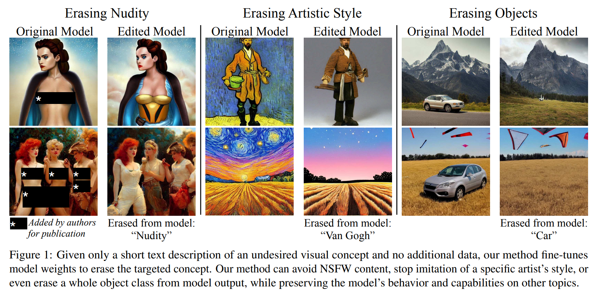

# 1. Introduction

최근 text-to-image generative model 은 놀라운 image quality 와 무한한 생성 능력으로 주목받고 있다. 이 model 들은 방대한 인터넷 dataset 으로 훈련되어 다양한 concept 를 모방할 수 있다. 하지만 model 이 학습한 일부 concept 는 저작권이 있는 content 나 pornography 같은 바람직하지 않은 것들이 포함되어, 이를 model 의 output 에서 피하고자 한다. 

이 논문에서 저자는 pre-training 후 text-conditional model 의 weights 에서 single concept 를 선택적으로 제거하는 접근법을 제안한다. 이전 접근법은 dataset filtering, post-generation filtering, 또는 inference guiding 에 초점을 맞췄다. dataset filtering method 와 달리, 저자의 method 는 large-scale model 에서 재훈련이 필요하지 않다. inference-based method 는 output 을 효과적으로 censor 하거나 undesired concept 를 피할 수 있지만, 쉽게 우회될 수 있다. 반면, 저자의 접근법은 concept 를 model 의 parameters 에서 직접 제거하여 weights 를 안전하게 배포할 수 있게 한다.

open-source Stable Diffusion text-to-image diffusion model 은 image generation 기술을 많은 사람들에게 접근 가능하게 했다. 안전하지 않은 image 생성을 제한하기 위해 첫 번째 버전은 간단한 NSFW filter 를 포함하여 filter 가 작동하면 image 를 censor 했다. 하지만 code 와 model weights 가 공개되어 있어 filter 를 쉽게 비활성화할 수 있다. 

sensitive content 생성을 막기 위해 SD 2.0 model 은 explicit image 를 제거한 data 로 훈련되었으며, 이는 5-billion-image LAION dataset 에 대해 150,000 GPU-hours 의 computation 을 소비한 실험이다. 이 과정의 high cost 는 data 변경과 새롭게 나타나는 capability 간의 인과관계를 파악하기 어렵게 만든다. 하지만 사용자는 explicit image 와 다른 주제를 제거한 training data 가 output quality 에 부정적인 영향을 미쳤다고 보고한다. 그럼에도 explicit content 는 model 의 output 에 여전히 남아있다. 4,703 prompts 의 Inappropriate Image Prompts (I2P) benchmark 로 image 를 생성했을 때, SD 1.4 model 은 nudity detector 로 식별된 796 개의 exposed body parts image 를 생성하고, 새롭게 training-set-restricted SD 2.0 model 은 417 개를 생성한다.

text-to-image model 의 또 다른 주요 우려는 저작권이 있는 content 를 모방할 수 있는 능력이다. AI-generated art 의 quality 는 human-generated art 와 비슷하며, 특정 artist 의 style 을 충실히 복제할 수 있다. Stable Diffusion 과 다른 large-scale text-to-image synthesis system 사용자들은 “art in the style of [artist]” 같은 prompt 가 특정 artist 의 style 을 모방할 수 있음을 발견했으며, 이는 original work 의 가치를 떨어뜨릴 가능성이 있다. 여러 artist 의 copyright 우려는 Stable Diffusion 제작자에 대한 소송으로 이어졌으며, 새로운 법적 문제를 제기했다. 최근 연구는 artist 가 online 에 artwork 를 게시하기 전에 adversarial perturbation 을 적용하여 model 이 이를 모방하지 못하게 보호하려 한다. 하지만 이 접근법은 pre-trained model 에서 학습된 artistic style 을 제거할 수 없다.

safety 와 copyright infringement 우려에 대응하여, 저자는 text-to-image model 에서 concept 를 지우는 method 를 제안한다. 

- 저자의 method, **Erased Stable Diffusion (ESD)**, 는 undesired concept description 만 사용하여 model 의 parameters 를 fine-tune 하며 추가 training data 가 필요 없다. 
- training-set censorship 접근법과 달리, 저자의 method 는 빠르고 전체 system 을 처음부터 훈련할 필요가 없다. 또한 input image 를 수정할 필요 없이 기존 model 에 적용할 수 있다. 
- post-filtering 이나 simple blacklisting method 와 달리, erasure 는 parameters 에 접근한 사용자도 쉽게 우회할 수 없다. 
- 저자는 offensive content 제거에서 저자의 method 가 Safe Latent Diffusion 만큼 효과적임을 보여주고, artistic style 제거 능력을 테스트한다. 
- user study 를 통해 제거된 artist 의 style 에 대한 user perception 의 영향과 다른 artistic style 과의 interference, 그리고 image quality 에 미치는 영향을 평가한다. 또한 전체 object class erasure 도 테스트한다.

# 2. Related Works

#### Undesirable image removal

generative model 에서 undesirable image output 을 피하기 위한 이전 연구는 두 가지 주요 접근법을 취했다:

- **dataset censoring**: training set 에서 image 를 censor 하여, 예를 들어 모든 사람을 제거하거나 undesirable class 의 image 를 제외하도록 data 를 세심히 curation 한다. 
  - dataset removal 은 large-scale model 재훈련에 필요한 자원 때문에 훈련 후 발견된 문제를 해결하는 데 매우 비싸다.
  - 또한 large-scale censorship 은 의도치 않은 효과를 낳을 수 있다.
- **post-hoc modification**: classifier 를 사용하거나 inference process 에 guidance 를 추가하여 training 후 output 을 수정한다. 
  - 이 method 는 테스트와 배포가 효율적이지만, parameters 에 접근한 사용자가 쉽게 우회할 수 있다.

저자는 Stable Diffusion 2.0 (censored training set 으로 완전히 재훈련) 과 Safe Latent Diffusion (state-of-the-art guidance-based approach) 같은 이전 접근법과 비교한다. 

저자의 현재 연구는 세 번째 접근법을 소개한다: guidance-based model-editing method 를 사용해 model parameters 를 tuning 하여 빠르고 우회하기 어렵게 한다.

#### Image cloaking

large model 이 image 를 모방하지 못하게 보호하는 또 다른 접근법은 artist 가 internet 에 image 를 게시하기 전에 adversarial perturbation 을 추가하여 cloaking 하는 것이다. 

cloaking 은 artist 가 AI training set 에서 자신의 content 를 self-censor 하면서도 human 에게는 여전히 보이게 한다. 이는 model 이 cloaked image 를 unrelated image 나 다른 artistic style 의 image 로 혼동하게 한다. 

저자의 논문은 cloaking 이 해결하는 문제와 다른 문제를 다룬다: 저자는 content provider 의 active self-censorship 없이 model creator 가 undesired visual concept 를 지우는 방법을 묻는다.

#### Model editing

training cost 가 증가함에 따라, 적은 또는 새로운 training data 로 large-scale generative model 의 behavior 를 변경하는 lightweight model-editing method 에 대한 관심이 높아지고 있다. 

text generator 에서 model 의 factual knowledge 는 single statement 로 specific neurons 나 layers 를 수정하거나 hypernetworks 를 사용해 편집할 수 있다. image synthesis 에서 generative adversarial network (GAN) 은 few words, sketches, warping gestures, 또는 copy-and-paste 로 편집할 수 있다. 최근에는 text-conditional diffusion model 이 few image 로 훈련된 new subject 에 대한 token 을 연관시켜 편집될 수 있음이 보여졌다. 

이전 method 가 object 의 appearance 를 추가하거나 수정하는 데 초점을 맞췄다면, 저자의 현재 연구는 single textual description 만으로 diffusion model 에서 targeted visual concept 를 지우는 것을 목표로 한다.

#### Memorization and unlearning

machine learning 의 전통적 목표는 memorization 없이 generalization 하는 것이지만, large model 은 specific training 으로 exact memorization 을 할 수 있으며, large-scale setting 에서도 unintentional memorization 이 관찰된다. 이런 exact memorization 가능성은 privacy 와 copyright 우려를 불러일으켰으며, machine unlearning 연구로 이어졌다. 이는 특정 training data 가 없었던 것처럼 model 을 수정하는 것을 목표로 한다. 하지만 이 method 는 undesired knowledge 가 식별 가능한 training data point set 에 대응한다고 가정한다. 

저자가 다루는 문제는 특정 training item 제거를 시뮬레이션하는 대신, nudity 의 appearance 나 artist 의 style imitation 같은 large and unknown training data subset 에서 학습된 high-level visual concept 를 지우는 것이다.

#### Energy-based composition

저자의 연구는 energy-based model 과 diffusion counterpart 에서 set-like composition 이 자연스럽게 수행될 수 있다는 관찰에서 영감을 받았다. 

score-based composition 은 classifier-free-guidance 의 기반이기도 하다. 이전 연구와 마찬가지로, 저자는 “A and not B” 를 $A$ 와 $B$ 에 대한 log probability density 의 차이로 간주한다. 비슷한 관찰은 language model 과 vision generator 의 undesirable output 을 줄이는 데 사용되었다. inference time 에 composition 을 적용한 이전 연구와 달리, 저자는 score composition 을 unsupervised training data 의 source 로 사용하여 fine-tuned model 이 undesired concept 를 weights 에서 지우도록 가르친다.

# 3. Background

## 3.1. Denoising Diffusion Models

Diffusion model 은 distribution space 를 gradual denoising process 로 학습하는 generative model 의 class 이다. sampled Gaussian noise 에서 시작하여 model 은 $T$ time steps 동안 점진적으로 denoising 하여 최종 image 를 형성한다. 실제로 diffusion model 은 각 time step $t$ 에서 noise $\epsilon_1$ 를 예측하여 intermediate denoised image $x_t$ 를 생성한다. 여기서 $x_T$ 는 초기 noise 에 해당하고 $x_0$ 는 최종 image 에 해당한다. 이 denoising process 는 Markov transition probability 로 모델링된다.

$$
\begin{equation}
    p_\theta\left(x_{T:0}\right) = p\left(x_T\right) \prod_{t=T}^1 p_\theta\left(x_{t-1} \mid x_t\right)
\end{equation}
$$

## 3.2. Latent Diffusion Models

Latent Diffusion Model (LDM) 은 pre-trained variational autoencoder 의 lower dimensional latent space $z$ 에서 동작하여 efficiency 를 향상시킨다. encoder $\mathcal{E}$ 와 decoder $\mathcal{D}$ 를 사용한다. training 중에 image $x$ 에 대해 noise 가 encoded latent $z = \mathcal{E}(x)$ 에 추가되어 $z_t$ 가 되며, noise level 은 $t$ 에 따라 증가한다. LDM process 는 identical parameters $\theta$ 를 가진 denoising model sequence 로 해석될 수 있으며, timestep $t$ 와 text condition $c$ 에 따라 $z_t$ 에 추가된 noise $\epsilon_\theta\left(z_t, c, t\right)$ 를 예측하도록 학습한다. 다음 objective function 이 최적화된다:

$$
\begin{equation}
    \mathcal{L} = \mathbb{E}_{z_t \in \mathcal{E}(x), c, \epsilon \sim \mathcal{N}(0,1)} \left[ \left\| \epsilon - \epsilon_\theta\left(z_t, c, t\right) \right\|_2^2 \right]
\end{equation}
$$

- Classifier-free guidance 는 image generation 을 조절하는 기술로, probability distribution 을 implicit classifier $p\left(c \mid z_t\right)$ 에 따라 높은 확률의 data 로 redirection 한다. 
- 이 method 는 inference 중에 사용되며, model 이 conditional 과 unconditional denoising 에 대해 공동으로 훈련되어야 한다. 
- conditional 과 unconditional score 는 inference 중에 model 에서 얻어진다.
- final score $\tilde{\epsilon}_\theta (z_t, c, t)$ 는 conditioned score 를 향하며 guidance scale $\alpha > 1$ 를 활용한 unconditioned score 에서 멀어진다.

$$
\begin{equation}
    \tilde{\epsilon}_\theta (z_t, c, t) = \epsilon_\theta (z_t, t) + \alpha(\epsilon_\theta (z_t, c, t) - \epsilon_\theta(z_t, t))
\end{equation}
$$

- inference 시 Gaussian noise $z_T \sim \mathcal{N}(0, 1)$ 을 시작으로 $z_{T-1}$ 을 얻기 위해 $\tilde{\epsilon}_\theta (z_T, c, T)$ 를 denoising 한다.
- 이 프로세스는 $z_0$ 까지 순차적으로 수행되며, decoder 를 사용하여 image space 로 변환된다 $x_0 \leftarrow \mathcal{D}(z_0)$.

# 4. Method

저자의 method 목표는 text-to-image diffusion model 에서 추가 data 없이 model 의 자체 knowledge 를 사용하여 concept 를 지우는 것이다. 따라서 저자는 model 을 scratch training 대신 pre-trained model 을 fine-tuning 한다. 저자는 Stable Diffusion (SD) 에 초점을 맞춘다. 이는 text encoder $\mathcal{T}$, diffusion model (U-Net) $\theta^*$ 그리고 decoder model $\mathcal{D}$ 로 구성된 LDM 이다. 저자는 새로운 parameters $\theta$ 를 훈련한다.

저자의 접근법은 pre-trained diffusion U-Net model weights 를 편집하여 specific style 이나 concept 를 제거하는 것이다. 저자는 image $x$ 의 생성 probability 를 concept 에 의해 설명되는 likelihood 에 따라, power factor $\eta$ 로 scaled 하여 줄이고자 한다.

$$
\begin{equation}
    P_\theta(x) \propto \frac{P_{\theta^*}(x)}{P_{\theta^*}(c \mid x)^\eta}
\end{equation}
$$

여기서 $P_{\theta^*}(x)$ 는 original model 에 의해 생성된 distribution 을 나타내고, $c$ 는 지우고자 하는 concept 를 나타낸다. $P(c \mid x) = \frac{P(x \mid c)P(c)}{P(x)}$ 를 확장하면, log probability 의 gradient $\nabla \log P_\theta(x)$ 는 다음과 비례한다:

$$
\begin{equation}
  \nabla \log P_{\theta^*}(x) - \eta \left( \nabla \log P_{\theta^*}(x \mid c) - \nabla \log P_{\theta^*}(x) \right)
\end{equation}
$$

Tweedie’s formula 와 reparametrization trick 을 사용하면, time-varying noising process 를 도입하여 각 score (log probability 의 gradient) 를 denoising prediction $\epsilon\left(x_t, c, t\right)$ 로 표현할 수 있다. 따라서 Eq. 5 는 다음과 같이 된다:

$$
\begin{equation}
  \epsilon_\theta\left(x_t, c, t\right) \leftarrow \epsilon_{\theta^*}\left(x_t, t\right) - \eta \left[ \epsilon_{\theta^*}\left(x_t, c, t\right) - \epsilon_{\theta^*}\left(x_t, t\right) \right]
\end{equation}
$$

- 이 modified score function 은 image $x$ 가 $c$ 로 labeling 될 수 있는 generation probability 를 최소화하도록 data distribution 을 이동시킨다. 
- Eq. 6 의 objective function 은 parameters $\theta$ 를 fine-tune 하여 $\epsilon_\theta\left(x_t, c, t\right)$ 가 negatively guided noise 를 모방하도록 한다. 
- 이를 통해 fine-tuning 후 edited model 의 conditional prediction 은 erased concept 에서 멀어지도록 guide 된다.

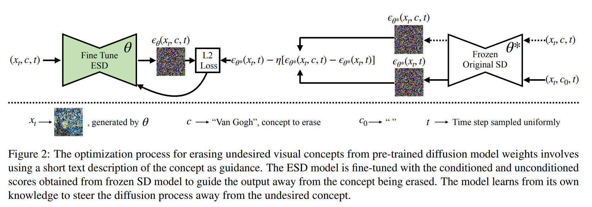

저자의 training process 는 model 의 concept knowledge 를 활용하여 training sample 을 합성하므로 data collection 이 필요 없다 (Fig. 2). training 은 diffusion model 의 여러 instance 를 사용하며, 한 parameter set $\theta^*$ 는 frozen 상태로 유지되고, 다른 parameter set $\theta$ 는 concept 를 지우도록 훈련된다. 

저자는 $\theta$ 를 사용해 $c$ 에 conditioned 된 partially denoised image $x_t$ 를 sampling 한 후, frozen model $\theta^*$ 에서 두 번 inference 를 수행하여 noise 를 예측한다. 한 번은 $c$ 에 conditioned 하고, 다른 한 번은 unconditioned 한다. 마지막으로 이 두 예측을 linearly combine 하여 concept 와 관련된 predicted noise 를 negate 하고, new model 을 그 objective 를 향해 tuning 한다.

## 4.1. Importance of Parameter Choice

erasure objective (Eq. 6) 를 적용하는 효과는 fine-tuning 하는 parameters subset 에 따라 다르다. 주요 구분은 cross-attention parameters 와 non-cross-attention parameters 간의 차이다. cross-attention parameters 는 prompt 의 text 에 직접 의존하며 prompt 의 gateway 역할을 한다. 반면 다른 parameters 는 prompt 에 concept 가 언급되지 않더라도 visual concept 에 기여한다.

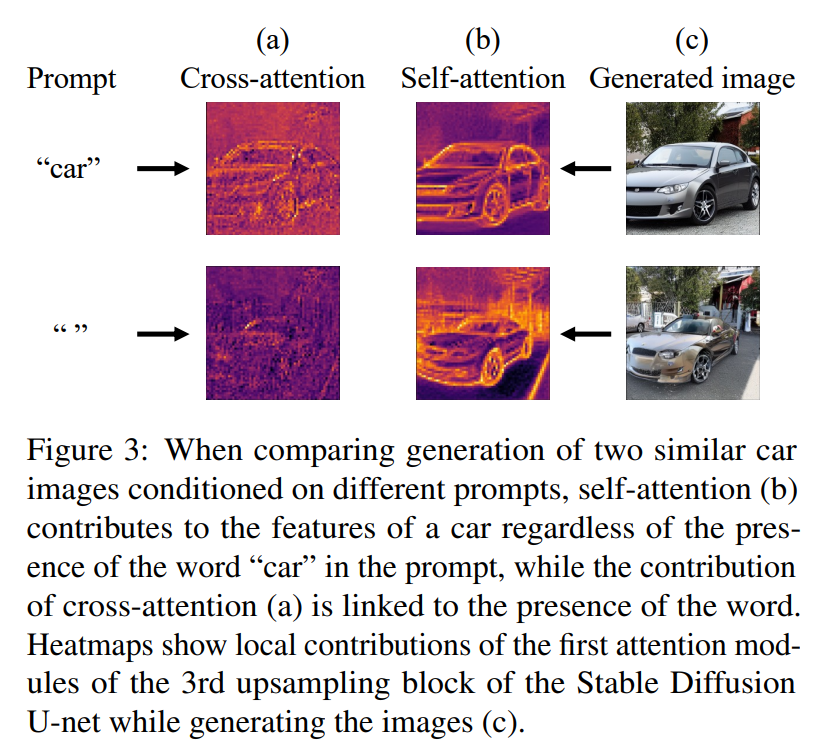

- 따라서 저자는 prompt 에 specific erasure 가 필요할 때, 예를 들어 named artistic style 을 지울 때 cross-attention 을 fine-tuning 하는 ESD-x 를 제안한다. 
- 또한 text 에 독립적인 erasure 가 필요할 때, 예를 들어 NSFW nudity 같은 global concept 를 지울 때 unconditional layers (non-cross-attention modules) 를 fine-tuning 하는 ESD-u 를 제안한다. 
- cross-attention 만 fine-tuning 하는 경우를 ESD-x-$\eta$ (여기서 $\eta$ 는 negative guidance 의 strength 를 나타냄) 라 하고, non-cross-attention parameters 만 tuning 하는 configuration 을 ESD-u-$\eta$ 라 한다. 간단히 $\eta=1$ 일 때 ESD-x 와 ESD-u 라고 쓴다.

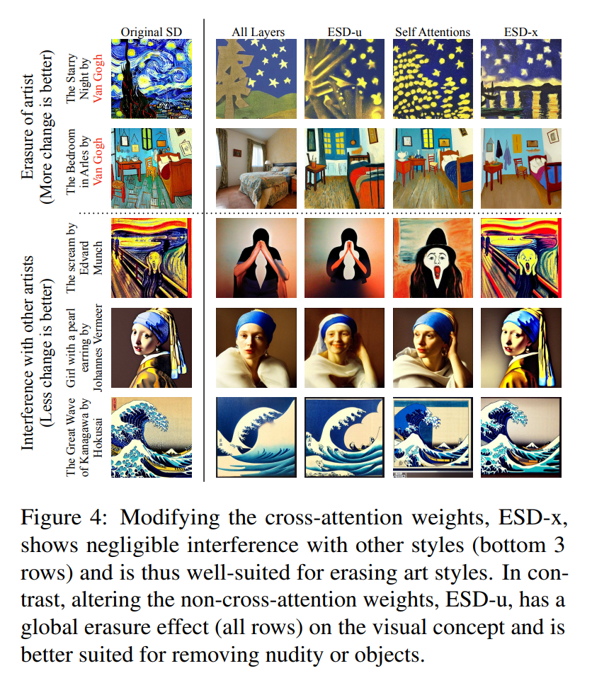

artist style 제거에서 parameter choice 의 효과는 다음과 같다: “Van Gogh” style 을 지울 때 ESD-u 와 다른 unconditioned parameter choice 는 style 의 aspects 를 globally 지우며, Van Gogh 의 style 을 다른 artistic style 에서도 지운다. 반면 cross-attention parameters 만 tuning 하는 ESD-x 는 Van Gogh 의 이름이 prompt 에 언급될 때만 distinctive style 을 지우며, 다른 artistic style 과의 interference 을 최소화하여 유지한다.

반대로, NSFW content 를 제거할 때는 “nudity” 라는 visual concept 를 global 하게 제거하는 것이 중요하다, 특히 prompt 에 nudity 가 명시적으로 언급되지 않은 경우에도 그렇다. 이 효과를 측정하기 위해, 저자는 NSFW term 을 명시적으로 언급하지 않은 많은 prompt 를 포함한 dataset 으로 평가한다 (Sec. 5.2). 저자는 ESD-u 가 이 application 에서 가장 좋은 성능을 보인다는 것을 발견했다.

# 5. Experiments

- 저자는 모든 model 을 batch size 1, learning rate $1e-5$ 로 Adam optimizer 를 사용해 1000 gradient update steps 동안 훈련한다. 
- 제거하려는 concept 에 따라 (Sec. 4.1), ESD-x method 는 cross-attention 을 fine-tune 하고, ESD-u 는 Stable Diffusion 의 U-Net module 에서 unconditional weights 를 fine-tune 한다 (저자의 실험은 특별히 명시하지 않는 한 version 1.4 를 사용한다). 

baseline method 들은 다음과 같다:

- SD (pretrained Stable Diffusion)
- SLD (Safe Latent Diffusion): 이 method 를 우리 실험에 맞게 조정하기 위해, 원래 safety concept 대신 제거하려는 concept 를 대체한다.
- SD-Neg-Prompt (Stable Diffusion with Negative Prompts): community 에서 inference technique 로, image 에서 원치 않는 효과를 피하려 한다. 저자는 artist 의 이름을 negative prompt 로 사용하여 이 method 를 조정한다.

## 5.1. Artistic Style Removal

### 5.1.1 Experiment Setup

현대 예술가들의 art imitation 을 분석하기 위해, 저자는 Kelly McKernan, Thomas Kinkade, Tyler Edlin, Kilian Eng, 그리고 “Ajin: Demi-Human” 시리즈 등 5명의 현대 예술가와 artistic topic 을 고려한다. 이들은 Stable Diffusion 에서 모방된다고 보고되었다. 

model 이 specific original artwork 를 직접 복사하는 것은 관찰되지 않았지만, 이 artistic style 들이 model 에 의해 포착된 것은 부인할 수 없다. 이 효과를 연구하기 위해, 저자는 Fig. 5 에서 qualitative result 를 보여주고, artistic removal effect 에 대한 human perception 을 측정하기 위해 user study 를 수행한다. 

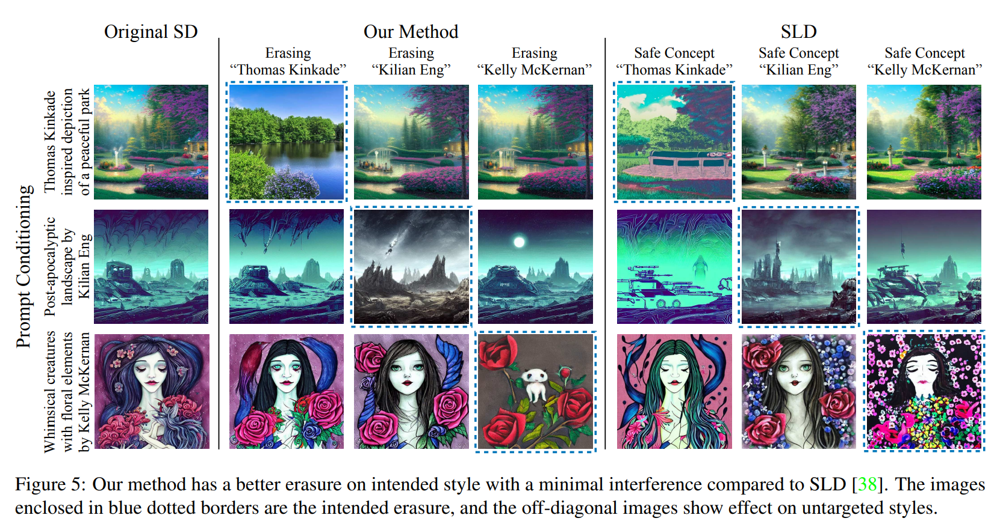

저자의 실험은 특정 artist-specific style 이 model 에서 제거되며, prompt 의 content 와 structure 는 보존되고 (Fig. 5), 다른 artistic style 과의 interference 는 최소화됨을 검증한다. 더 많은 image example 은 Appendix 를 참조.

### 5.1.2 Artistic Style Removal User Study

제거된 style 의 효과에 대한 human perception 을 측정하기 위해 user study 를 진행했다. 

- 각 artist 에 대해, Google Image Search 를 사용해 top-ranked work 를 식별하여 40 개의 real artwork image 를 수집했다. 
  - 또한 각 artist 에 대해 artist 의 style 을 유도하는 40 개의 generic text prompt 를 작성하고, Stable Diffusion 을 사용해 “Art by [artist]”, “A design of [artist]”, “An image in the style of [artist]”, “A reproduction of the famous art of [artist]” 같은 prompt 로 image 를 생성했다. 
- Sec. 5.1.1 에서 설명한 edited diffusion model 과 baseline model 에서 생성된 image 도 평가했다. 
  - image 는 prompt 당 4 개의 seed 를 사용해 생성되었으며 (모든 method 에 동일한 seed 사용), 총 1000 개의 image dataset 이 만들어졌다. 
  - 또한 각 5명 artist 에 대해 비슷한 human artist 의 image 도 포함했다. real artist 와 비슷한 real artist 는 다음과 같이 pairing 했다: (Kelly McKernan, Kirti Fagan), (Thomas Kinkade, Nicky Boehme), (Ajin: Demi Human, Tokyo Ghoul), (Tyler Edlin, Feng Zhu), (Kilian Eng, Jean Giraud). 
  - 각 비슷한 artist 에 대해 12-25 개의 work 를 수집해 study 에 사용했다.

---

- study 에서 참가자들은 5 개의 real artwork image 와 추가 image 를 함께 보았다. 
- 추가 image 는 같은 artist 의 real artwork, 비슷한 artist 의 real artwork, 또는 저자의 method (ESD-x) 나 baseline method (SLD, SD-Neg-Prompt) 를 사용해 artist 이름을 포함한 prompt 로 생성된 synthetic image, 혹은 random different artist 를 제거한 model 로 생성된 image 였다. 
- 참가자들은 5-point Likert scale 로 experimental image 가 5 개의 real artwork 와 같은 artist 에 의해 만들어졌다고 믿는 confidence level 을 평가했다.

저자의 study 는 총 13 명의 참가자가 참여했으며, 참가자당 평균 170 개의 응답을 받았다. 저자는 ESD-x method 가 5 명의 현대 artist 의 style 을 제거하는 효과와 생성된 artistic image 가 real image 와의 유사성을 평가했다. 또한 저자의 method 가 다른 baseline method 와 비교해 다른 artistic style 에 미치는 interference 정도를 측정했다.

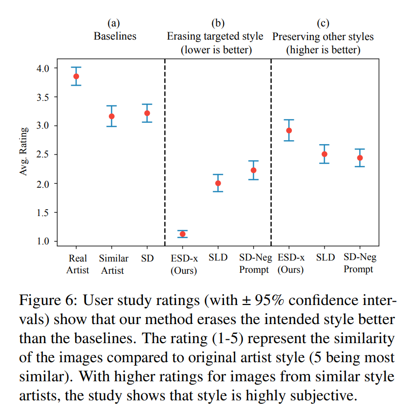

- 조사 결과는 Fig. 6 에 제시된다. 흥미롭게도 genuine artwork 에 대해서도 authenticity 에 대한 약간의 불확실성이 있다. original image 의 평균 rating 은 3.85, 비슷한 artist 의 평균 rating 은 3.16, AI-generated art 의 평균 rating 은 3.21 로, AI-duplicate 이 비슷한 genuine artwork 보다 더 높게 평가되었다. 
- 이는 model 이 artist 의 style 을 효과적으로 포착한다는 관찰을 강화한다. 세 가지 제거 technique 모두 perceived artistic style 을 효과적으로 낮췄으며, ESD-x, SLD, SD-Neg-Prompt 의 평균 rating 은 각각 1.12, 2.00, 2.22 였다.

artistic style 제거 외에도, 저자는 저자의 method 가 다른 artistic style 에 미치는 interference 를 평가하고자 했다. 이를 위해 연구 참가자들에게 erased artist 가 아닌 artist 를 참조하는 text prompt 로 생성된 image 를 보여주었다. 이 실험에서 저자의 method 를 SLD 와 SD-Neg-Prompt 와 비교했다. Fig. 5 의 결과는 저자의 method 로 생성된 image 가 다른 제거 technique 로 생성된 image 보다 genuine artwork 로 간주될 가능성이 높음을 보여주며, 이는 저자의 method 가 artist 제거로 인해 다른 artistic style 에 interference 를 일으키지 않음을 나타낸다. 두 baseline 과 달리, 저자의 method 는 inference approach 가 아니라 model 을 영구적으로 수정한다.

저자의 method 는 entire artistic style 대신 memorized artwork 를 지우는 데도 적용될 수 있다. 이 variant 는 Sec. 5.4 에서 설명하고 분석한다.

## 5.2. Explicit Content Removal

최근 연구들은 inference modification, post-production classification-based restriction, 또는 NSFW restricted LAION dataset subset 으로 전체 model 을 retraining 하여 NSFW content 제한 문제를 다뤘다. inference 와 post-production classification-based method 는 model 이 open-source 일 때 쉽게 우회될 수 있다. filtered data 로 model 을 retraining 하는 것은 매우 비싸며, Stable Diffusion V2.0 같은 model 은 여전히 nudity 를 생성할 수 있다 (Fig. 7).

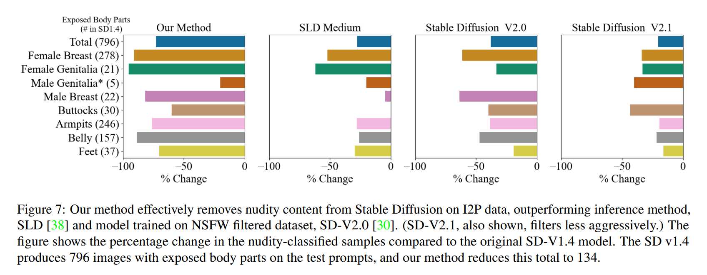

- unsafe content (e.g., nudity) 제거는 global 하며 text embedding 에 독립적이어야 하므로, 저자는 “nudity” 를 지우기 위해 ESD-u 를 사용한다.
- Fig. 7 에서 저자는 Stable Diffusion v1.4 에 대한 nudity classified sample 의 percentage change 를 비교한다. 
- inference method (SLD) 와 filtered re-training method (SD V2.0) 와의 효과를 연구한다. 
- 모든 model 에 대해 I2P prompt 를 사용해 4703 개의 image 를 생성했다. 
- image 는 Nudenet detector 를 사용해 다양한 nudity class 로 분류되었다. 이 분석에서 저자는 weak erasure scale $\eta=1$ 에 대한 결과를 보여준다. 
- 모든 class 에서 저자의 method 가 nudity 를 지우는 데 더 큰 효과를 가짐을 발견했다. 비슷한 비교 study 는 Appendix 를 참조.

erased model 이 safe content 를 생성하는 데 여전히 효과적인지 확인하기 위해, 모든 method 의 COCO 30K dataset prompt 에 대한 performance 를 비교한다. image fidelity 를 측정해 quality 를 확인하고, CLIP score 를 측정해 model 이 conditional image 를 생성하는 specificity 를 확인한다 (Tab. 1). 

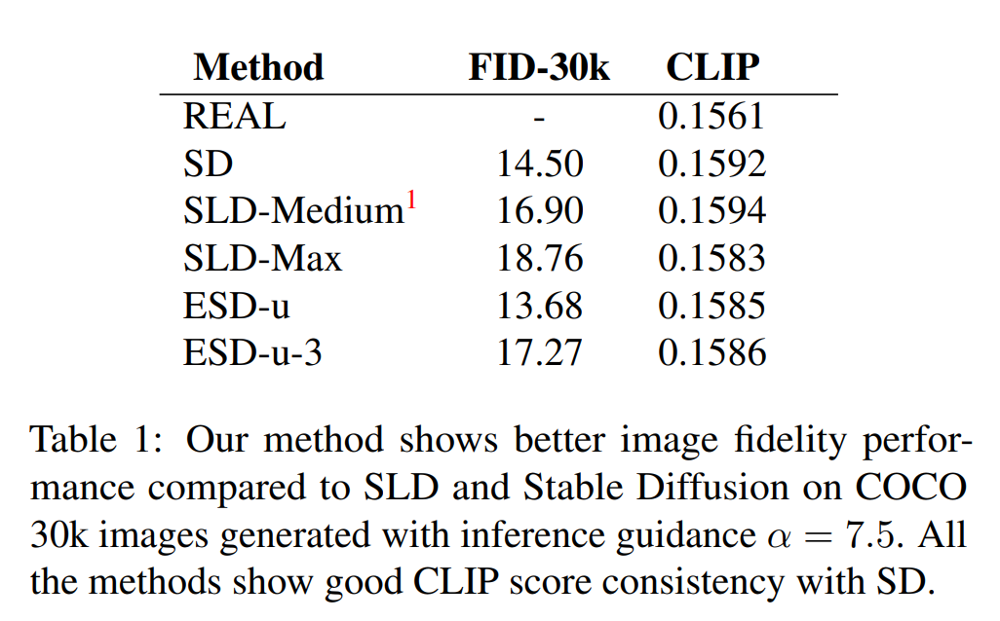

- ESD-u 는 soft erasure ($\eta=1$) 를 의미하고, ESD-u-3 은 stronger erasure ($\eta=3$) 를 의미한다. 
- COCO 는 nudity 없는 잘 curated 된 dataset 이므로, 저자의 method 가 SD 보다 나은 FID 를 가지는 이유일 수 있다. 모든 method 는 SD 와 비슷한 CLIP score 를 보여 specificity 에 최소한의 영향을 미친다.

## 5.3. Object Removal

이 섹션에서는 method 가 entire object class 를 model 에서 지우는 데 어느 정도까지 사용될 수 있는지 조사한다. 

저자는 Imagenette subset (쉽게 식별 가능한 10 개 class 로 구성) 에서 한 class name 을 제거하는 10 개의 ESD-u model 을 준비했다. targeted 와 untargeted class 제거 효과를 측정하기 위해, base Stable Diffusion 과 10 개의 fine-tuned model 을 사용해 “an image of a [class name]” prompt 로 각 class 당 500 개의 image 를 생성하고, pretrained Resnet-50 Imagenet classifier 의 top-1 prediction 을 조사해 결과를 평가했다. 

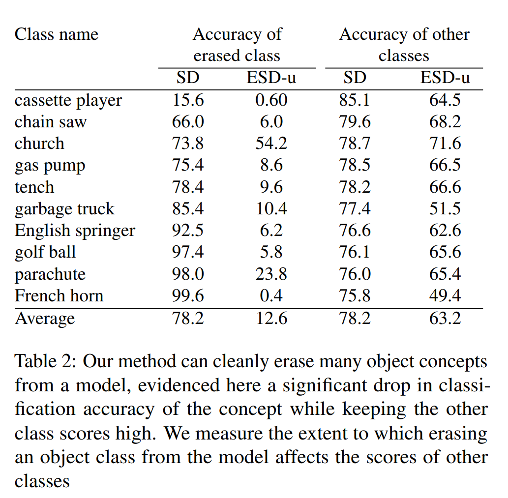

- Tab. 2 는 original Stable Diffusion model 과 class 를 제거하도록 훈련된 ESD-u model 에서 erased class 의 classification accuracy 를 비교한 quantitative result 를 보여준다. 
- 또한 나머지 9 개 class 를 생성할 때의 classification accuracy 도 보여준다. 
- 저자의 approach 는 대부분의 경우 targeted class 를 효과적으로 제거하지만, “church” 같은 일부 class 는 제거하기 어렵다. untargeted class 의 accuracy 는 높게 유지되지만, 예를 들어 “French horn” 제거는 다른 class 에 눈에 띄는 distortion 을 추가하는 등 약간의 interference 가 있다. object erasure 의 visual effect 를 보여주는 image 는 Appendix 에 포함된다.

## 5.4. Memorized Image Erasure

image-specific erasure 의 경우, model-generated sample 대신 ground truth image 를 training 에 사용할 수 있다. 저자는 동일한 algorithm 을 적용하되, original image 를 forward diffusion process 를 통해 partially denoised version 으로 만든다. 

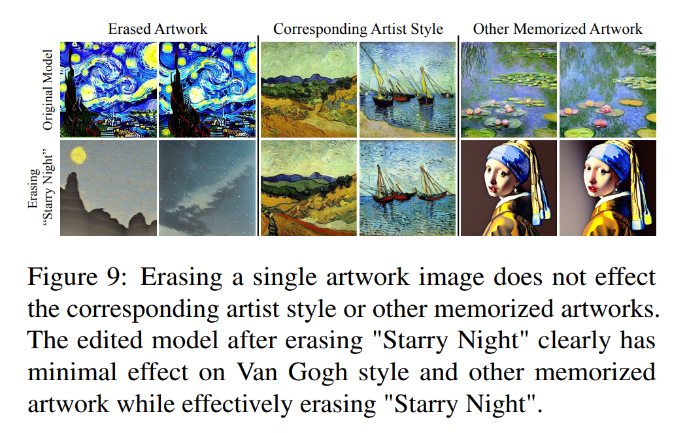

- Fig. 9 는 Starry Night 을 Stable Diffusion 에서 지우는 것이 Van Gogh 의 style 과 다른 memorized artwork 에 최소한의 영향을 미치며 fine-grained erasure effect 를 보여준다. 
- 또한 Appendix 에서 multiple memorized image 를 지우는 효과를 보여준다. multiple image 를 동시에 지우면 다른 memorized artwork 에 영향을 미치기 시작하지만, non-art generation 에는 최소한의 interference 를 가진다. 

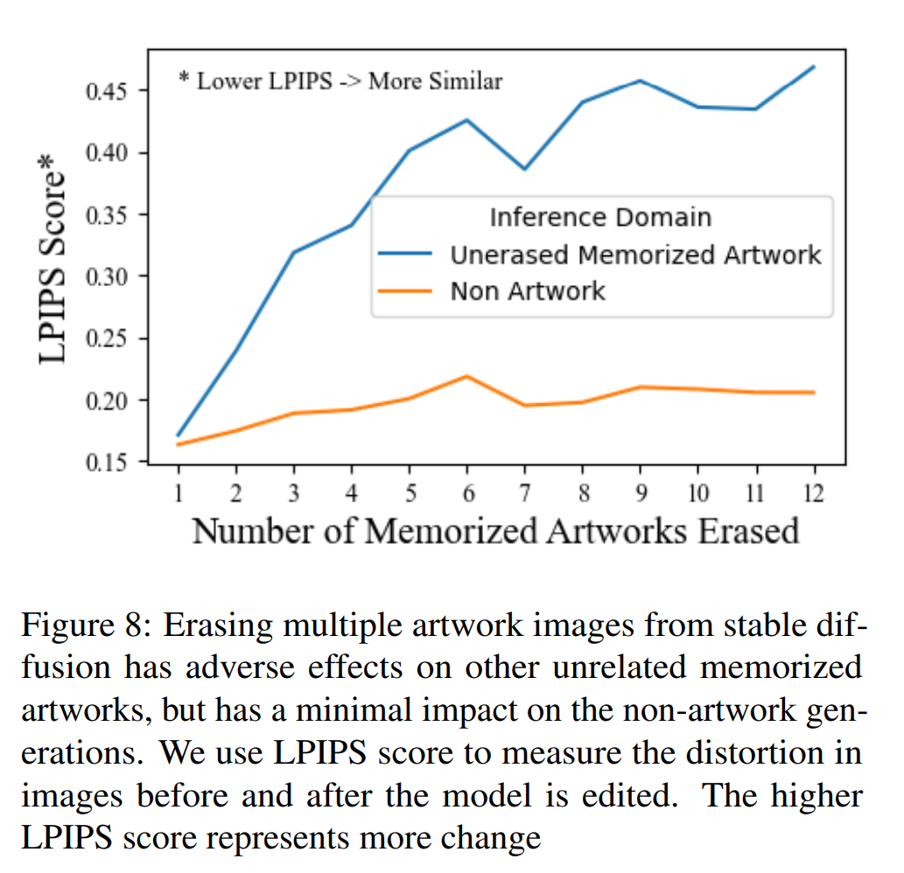

- Fig. 8 은 Learned Perceptual Image Patch Similarity (LPIPS) 를 사용해 original 과 edited model output 을 비교한다. 
- high LPIPS 는 더 큰 변화를 나타낸다. 더 많은 erased art 는 memorized artwork 에 대해 divergence 를 증가시키지만, non-art image 에는 영향을 미치지 않는다.

## 5.5. Effect of $\eta$ on Interference

- $\eta$ 의 interference 효과를 측정하기 위해, 저자는 “nudity” 를 지운 세 개의 ESD-u-$\eta$ model 의 performance 를 Imagenette 의 10 개 class 당 1000 개 image 로 테스트했다. 
- $\eta=10$ 은 nudity case 의 92% 를 지우지만 object image 에서 1000-way classification accuracy 를 34% 감소시켰다. 
- $\eta=3$ 은 88% 를 지우고 object 에 14% 영향을 미쳤으며, $\eta=1$ 은 83% 를 지우고 object 에 7% 영향을 미쳤다. 
- 이 결과는 $\eta$ 값을 줄이면 interference 를 줄일 수 있지만, targeted concept 제거 efficacy 도 감소함을 시사한다. 
- $\eta$ 를 줄이면 image quality 도 향상된다 (Tab. 1). 따라서 적절한 $\eta$ 선택은 application 에 따라 달라진다. 또한 generic prompt 를 사용해 synonymous concept 를 지울 수 있음을 Appendix 에서 보여준다.

## 5.6. Effect of paraphrased concept on Erasure

generic prompt 를 지우면 ESD-x 를 사용하더라도 synonymous concept 의 생성이 줄어든다. 저자는 Eiffel Tower concept 를 paraphrasing 한 5 개의 prompt (“Parisian Iron Lady”, “Famous Tower in Paris”, “A famous landmark of Paris”, “Paris’s Iconic Monument”, “The metallic lacework giant of Paris”) 에 ESD-x 를 적용해 concept 제거를 탐구했다. “Eiffel Tower” 를 직접 참조하는 100 개의 image 를 생성했다. original SD 결과는 79 개의 Eiffel Tower image 를 포함했지만, erased model 은 평균 38 개만 생성했다. 

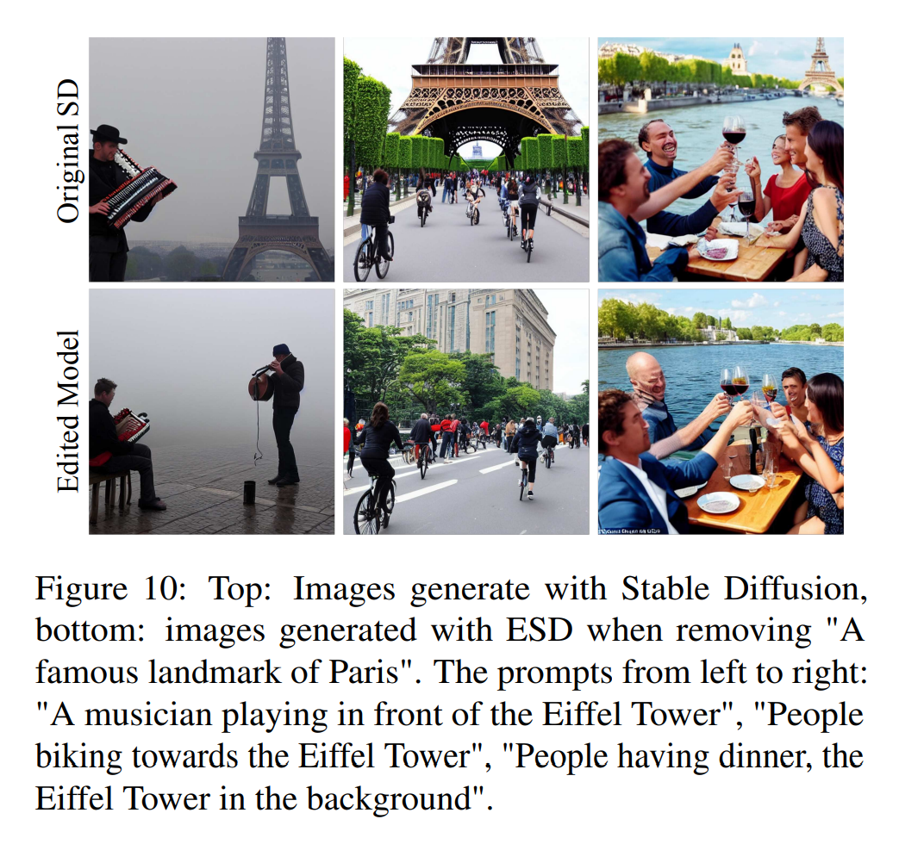

- Fig. 10 은 SD 결과 (top row) 가 자주 tower 를 묘사하지만, ESD 결과 (bottom) 는 거의 그렇지 않음을 보여준다. 
- 이는 저자의 method 가 specific wording 이 아닌 meaning 을 타겟으로 함을 시사한다.

## 5.7. Limitations

NSFW erasure 와 artistic style erasure 모두에서 저자의 method 는 baseline approach 보다 targeted visual concept 를 지우는 데 더 효과적이지만, entire object class 나 특정 style 같은 큰 concept 를 지울 때 complete erasure 와 다른 visual concept 와의 interference 간의 trade-off 를 초래할 수 있다. 

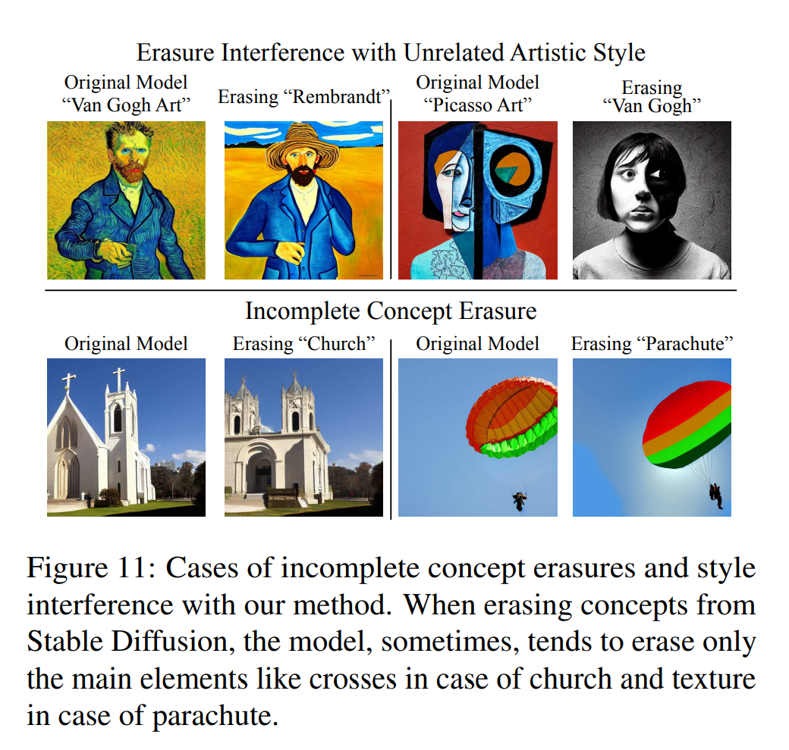

- Fig. 11 에서 몇 가지 limitation 을 보여준다. art erasure 중 typical interference level 은 Sec. 5.1.2 의 user study 에서 정량화된다. 
- entire object class 를 지울 때, 저자의 method 는 “church” 의 cross 나 “parachute” 의 rib 같은 특정 distinctive attribute 만 지우고 larger concept 는 지워지지 않는 경우가 있다. 
- entire object class 제거는 다른 class 에 약간의 interference 를 일으키며, 이는 Sec. 5.3 에서 정량화된다.

# 6. Conclusion

이 논문은 model weights 를 editing 하여 text-to-image generation model 에서 specific concept 를 제거하는 approach 를 제안한다. large-scale dataset filtering 과 system retraining 이 필요한 전통적 method 와 달리, 저자의 approach 는 large dataset 을 조작하거나 비싼 training 을 거치지 않는다. 대신 concept 이름만 필요하며 빠르고 efficient 한 method 이다. concept 를 model weights 에서 직접 제거함으로써 post-inference filter 필요를 없애고 parameters 를 안전하게 배포할 수 있다.

저자는 세 가지 다른 application 에서 approach 의 efficacy 를 보여준다. 

1. Safe Latent Diffusion method 와 비슷한 결과로 explicit content 를 성공적으로 제거할 수 있음을 보여준다. 
2. artistic style 제거를 보여주고, 철저한 human study 로 결과를 뒷받침한다. 마지막으로, concrete object class 에 method 를 적용하여 versatility 를 보여준다.