논문 및 이미지 출처 : <https://openaccess.thecvf.com/content/WACV2024/papers/Gandikota_Unified_Concept_Editing_in_Diffusion_Models_WACV_2024_paper.pdf>

# Abstract

Text-to-image model 은 여러 안전 문제로 인해 배포에 적합하지 않을 수 있다. 이전 방법들은 text-to-image model 의 bias, copyright, offensive content 같은 개별 문제를 따로 다루었다. 하지만 현실에서는 이런 문제들이 모두 같은 model 에서 동시에 나타난다. 저자는 단일 접근법으로 모든 문제를 해결하는 방법을 제시한다. 

저자의 방법인 **Unified Concept Editing (UCE)** 은 **closed-form solution** 을 사용해서 training 없이 model 을 editing 하고, text-conditional diffusion model 에서 동시에 여러 editing 을 원활하게 확장한다.

저자는 text-to-image projection 을 editing 해서 scalable simultaneous debiasing, style erasure, content moderation 을 제시하고, 이전 연구보다 효율성과 확장성이 향상되었음을 보여주는 광범위한 experiment 를 수행했다.

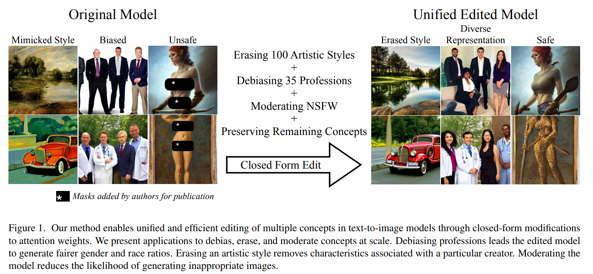

# 1. Introduction

Text-to-image diffusion model 은 복잡한 사회적 문제를 일으켰다. Generative image model 은 artist 의 style 을 복제하고, stereotype 을 증폭시켜 bias 를 강화하며, offensive image 를 생성하기 쉽게 만든다. 이런 문제들을 개별적으로 완화하는 방법들이 제안되었지만, 실제 generative image model 배포에서는 이 문제들이 모두 동시에 나타난다. Generative model 에서 안전을 보장하는 첫 단계는 training data 를 신중히 curation 해서 복제하면 안 되는 content 를 제외하는 거다. 하지만 large model 을 training 하는 건 비용이 많이 들고, data curation 의 영향은 직관적이지 않고 예측하기 어렵다. 예를 들어, undesired content 를 제거하면 다른 undesired content 가 드러날 수 있고, toxic content 를 제거하면 새로운 bias 가 생길 수 있으며, offensive content 를 줄이면 불완전한 제거로 이어질 수 있다. 이런 예들은 data curation 에만 의존하는 한계를 보여준다.

이 논문에서 저자는 single formulation 으로 다양한 안전 문제를 해결할 수 있는 unified model-editing 접근법을 소개한다. 

- 저자의 방법인 Unified Concept Editing (UCE) 은 training 후 model behavior 를 빠르고 실용적으로 제어할 수 있게 해주며, data curation 이 부족한 부분을 채워준다. 
- UCE 는 closed-form parameter-editing 방법으로, single text-to-image synthesis model 내에서 수백 개의 editorial modification 을 적용할 수 있게 해주면서도 unedited concept 에 대한 generative quality 를 유지한다.

UCE 방법은 이전 model editing 연구을 기반으로 TIME 과 MEMIT 방법을 일반화한다. TIME 같은 이전 diffusion model editing 방법과 달리, UCE 는 여러 simultaneous edit 을 한 번에 적용할 수 있게 설계되었다. 이런 edit 은 concept 를 erasing, moderating, debiasing 하는 tasks 를 포함하는데, 전통적으로는 별개의 문제로 다뤄져 각기 다른 해결책이 필요했다. UCE 는 MEMIT 를 넘어선다.  
- Text-to-image model 을 language model 대신 editing 한다.  
- Editor 가 수정하지 말아야 할 concept 의 distribution 을 명시적으로 지정할 수 있게 한다.  
- Scalable debiasing 접근법을 새롭게 도입한다.  

저자는 UCE 를 다양한 이전 model-editing 방법과 비교했는데, UCE 가 뛰어난 성능을 보여주며 다른 방법들을 큰 차이로 앞선다. UCE 는 각 editing 카테고리에서 single edit 에서도 뛰어난 성능을 보이고, unedited concept 에 대한 간섭을 최소화하면서 여러 edit 을 동시에 확장할 수 있는 능력도 뛰어나다.

# 2. Related Work

Text-to-image diffusion model 은 commercial art 와 graphic design 에서 점점 인기가 많아지고 있지만, 여러 문제를 겪는다. 이런 문제들은 이전에 개별적으로 다뤄졌다.

#### Copyright issues

최근 소송에서 Stable Diffusion 같은 model 이 많은 artistic style 을 침해한다고 주장했고, 연구자들은 model 이 일부 copyrighted training data 를 거의 그대로 기억할 수 있음을 발견했다. 이런 memorization 을 줄이기 위해 이전 연구에서는 training image caption 을 randomizing 하고 augmenting 하는 방법을 제안했다. 또 다른 연구에서는 image cloaking 기법을 탐구했는데, artist 가 large generative model 에 의해 모방되지 않도록 online 에 올리기 전에 image 에 특수한 adversarial perturbation 을 추가해서 content 를 보호한다. 

이 두 접근법 모두 training corpus 를 철저히 준비해야 한다. 또 다른 접근법은 training 이 끝난 후 model 을 조정해서, model weight 를 수정함으로써 undesired concept 을 삭제한다. 저자의 방법은 concept-erasure 접근법을 채택하고, 이전 SOTA 와 비교한다. 저자의 방법은 여러 concept 을 한 번에 제거하는 closed-form edit 이라는 점에서 이전 concept erasure 방법과 다르다.

#### Offensive content

Diffusion model 은 때때로 nude 나 violent image 같은 inappropriate image 를 생성한다. Training data 에서 inappropriate image 를 걸러내거나 inference time 에 필터링하는 다양한 방법이 제안되었다. 예를 들어, Stable Diffusion 구현에는 "not safe for work" safety checker 가 포함되어 있어서 unsafe image 가 감지되면 검은 이미지를 반환한다. 다른 연구에서는 inference time 에 image editing 을 통해 문제를 해결했다. Open-source code 와 model weight 가 공개적으로 제공되는 경우, 이런 post-production filter 는 쉽게 비활성화될 수 있다. 우회하기 어려운 접근법은 model weight 에서 unwanted concept 의 knowledge 를 제거하는 거다. 이전 방법들은 fine-tuning 을 통해 attention 을 재조정하거나, attention weight 를 fine-tuning 하거나, continual learning 을 제안했다. 이전 방법들이 모두 model 을 fine-tuning 하는 반면, 저자는 closed-form edit 을 사용해서 offensive concept 을 빠르고 효율적으로 erasing 하는 방법을 제안한다.

#### Social biases

Diffusion image generation model 은 social 및 cultural bias 에 취약한 것으로 밝혀졌고, training data 의 단순한 불균형을 넘어 societal stereotype 을 과장하고 증폭시킨다. 하지만 amplification 을 정량화하는 건 미묘하다. 이전 연구에서는 training 후 model parameter 를 수정해서 이 문제를 해결했다. Text embedding 에서 biased direction 을 projecting out 하거나, representation 을 algebraic manipulation 하는 방식이다. 

저자의 현재 방법을 영감 준 이전 연구은 direct closed-form model editing 방법을 적용했다. 이전 연구들은 여러 concept 을 동시에 debiasing 하는 게 어렵다고 발견했는데, 한 concept 을 debiasing 하면 regularization 방법이 있더라도 다른 concept 에 영향을 미친다. 저자의 방법은 concept 간 상호 영향을 제거하는 새로운 debiasing 절차로 이 한계를 극복한다.

#### Model editing

Model editing 은 최근 training 없이 model behavior 를 제어하는 접근법으로 등장했다. Model editing 에서는 model 의 knowledge 를 찾아내고 그것을 타겟팅해서 model weight 의 일부를 수정한다. 특히 Bau et al. 은 deep generative vision model 에서 특정 rule 을 조작하는 closed-form 접근법을 도입해서, 사용자가 이 rule 을 interactive 하게 수정할 수 있게 했다. 

Generative text model 에서 knowledge 를 editing 하기 위한 closed-form solution 도 제안되었다. Arad et al. 와 TIME 은 cross-attention layer 나 text-encoder layer 를 타겟팅해서 text-to-image diffusion model 의 knowledge 를 editing 했다. 

저자의 방법은 이런 접근법을 채택하고 일반화해서, text-to-image model 에서 여러 concept 을 동시에 removing 하고 debiasing 할 수 있게 한다.

# 3. Background

Diffusion model 은 gradual denoising process 를 통해 distribution 을 근사할 수 있는 generative model 다. Gaussian noise 에서 시작해서, model 은 $T$ time step 에 걸쳐 점진적으로 denoising 해서 final image 를 만든다. 

각 intermediate step $t$ 에서 model 은 original image 에 추가된 noise $\epsilon_t$ 를 예측한다. $x_T$ 는 initial noise 이고, $x_0$ 는 final output 이다. Denoising process 의 parameter 를 학습함으로써 trained model 은 noise 에서 새로운 image 를 생성할 수 있다. 이 denoising 은 Markov transition probability 로 모델링된다.

$$
\begin{equation}
    p_\theta\left(x_{T:0}\right) = p\left(x_T\right) \prod_{t=T}^1 p_\theta\left(x_{t-1} \mid x_t\right)
\end{equation}
$$

Text-to-image latent diffusion model 은 low-dimensional embedding 에서 작동하며, U-Net generation network 로 모델링된다. Text conditioning 은 language model 에서 추출된 text embedding 을 통해 network 에 전달되고, cross-attention layer 에서 처리된다. 구체적으로 diffusion model 내의 attention module 은 QKV (Query-Key-Value) structure 를 따른다. 여기서 query 는 image space 에서 나오고, key 와 value 는 text embedding 에서 나온다. 저자는 text embedding 을 projecting 하는 linear layer $W_k$ 와 $W_v$ 에 초점을 맞춘다.

주어진 text embedding $c_i$ 에 대해 key 와 value 는 각각 $k_i = W_k c_i$ 와 $v_i = W_v c_i$ 로 생성된다. Key 는 current intermediate image 의 visual feature 를 나타내는 query $q_i$ 와 곱해진다. 이는 relevant text 와 image region 을 정렬하는 attention map 을 만든다.

$$
\begin{equation}
    \mathcal{A} \propto \operatorname{softmax}\left(q_i k_i^T\right)
\end{equation}
$$

Attention map 은 각 text token 과 visual feature 간의 relevance 를 나타낸다. 이 alignment 를 사용해서, cross-attention output 은 normalized attention weight 로 value vector $V$ 를 attending 해서 계산된다.

$$
\begin{equation}
    \mathcal{O} = \mathcal{A} v_i
\end{equation}
$$

Cross-attention 은 text 와 image information 을 연결하는 메커니즘이며, text token 에 visual meaning 을 부여하는 역할을 한다. Eq. 3 의 output 은 diffusion U-Net 의 나머지 layer 를 통해 전파된다.

TIME 은 pre-trained diffusion model 의 implicit assumption 을 cross-attention layer 를 업데이트해서 editing 한다. Implicit assumption 은 under-specified prompt 에서 model 이 object 에 대해 가정하는 모든 visual features 가 될 수 있다. 예로, rose 의 색깔은 보통 빨간색이거나, doctor 의 성별은 보통 남성이다. 이런 assumption 을 editing 하려면, model 이 assumption 을 만드는 "source" under-specified prompt (e.g., "a pack of roses") 와 desired attribute 를 지정하는 "destination" prompt (e.g., "a pack of blue roses") 가 필요하다. TIME 은 projection matrices $W_k$ 와 $W_v$ 를 업데이트해서 source prompt embedding 을 destination embedding 에 가깝게 만든다. 이는 textual concept 를 정렬해서 model 이 더 이상 implicit assumption 을 하지 않게 한다.

$c_i$ 를 source prompt 의 token 에서 나온 source embedding 이라 하고, $c_i^*$ 를 destination prompt 의 해당 token 에서 나온 destination embedding 이라 하자. Destination prompt 의 value 는 $v_i^* = W^{\text{old}} c_i^*$ 로 계산된다. 새로운 projection matrices $W$ 는 다음 objective function 을 최소화하도록 최적화된다 (key projection matrices 에 대해서도 비슷한 equation 을 유도할 수 있다).

$$
\begin{equation}
    \min_W \sum_{i=0}^m \| W c_i - \underbrace{v_i^*}_{W^{\text{old}} c_i^*} \|_2^2 + \lambda \left\| W - W^{\text{old}} \right\|_F^2
\end{equation}
$$

- 여기서 $\lambda$ 는 regularization hyper-parameter 다. 

TIME 은 이 loss function 이 closed-form global minimum solution 을 가진다는 걸 증명했다. 이는 text-to-image model 을 효율적으로 editing 할 수 있게 한다.

$$
\begin{equation}
    W = \left( \sum_{i=0}^m v_i^* c_i^T + \lambda W^{\text{old}} \right) \left( \sum_{i=0}^m c_i c_i^T + \lambda \mathbb{I} \right)^{-1}
\end{equation}
$$

Inverse matrix 의 first term $\sum_{i=0}^m c_i c_i^T$ 는 editing 되는 concept text embedding 의 covariance 다. Appendix 에서 논의했듯이, second term 인 identity matrix 는 diffusion model 의 vocabulary 에 있는 large encyclopedia 의 concept embedding 의 covariance 와 매칭된다고 해석한다. 이는 MEMIT 에서 영감을 받았다.

TIME formulation 은 효과적이지만, 특정 concept 을 editing 할 때 주변 concept 와 interference 위험이 있다. 예로, doctor 를 여성으로 editing 하면 teacher 도 여성으로 영향을 받을 수 있다. TIME 은 regularization term 을 통해 edited matrix 가 너무 급격히 변하지 않게 막는다.

하지만, 이는 general term 이므로 all vector representations 에 동일한 영향이 미친다. 본 연구에서는 pre-trained generative model 의 핵심 기능은 유지하면서 parameters 의 targeted editing 이 가능한 대체적인 preservation term 을 제시한다.

# 4. Method

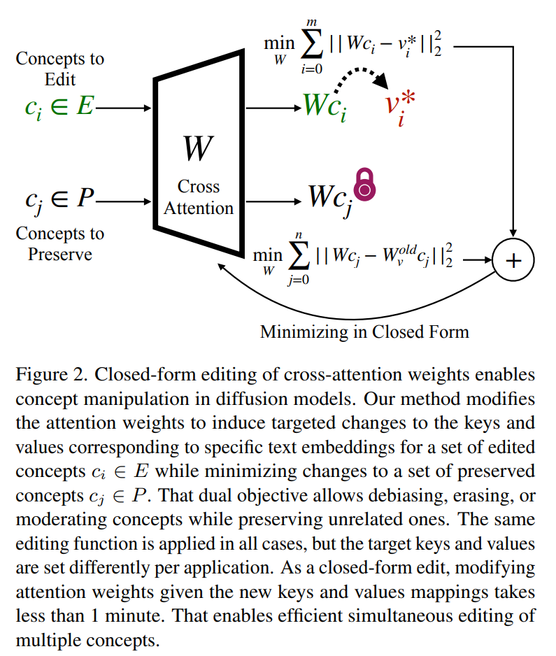

저자는 어떤 linear projection layer 에든 적용할 수 있는 일반적인 model editing 방법론을 소개한다. 주어진 pre-trained layer $W^{\text{old}}$ 가 있을 때, 저자의 목표는 Fig. 2 에서 보듯이 새로운 edited weights $W$ 를 찾아서 set $E$ 에 있는 concepts 를 editing 하면서 set $P$ 에 있는 concept 들을 보존하는 거다. 

구체적으로, 저자는 input $c_i \in E$ 에 대한 output 이 original $W^{\text{old}} c_i$ 대신 target values $v_i^* = W^{\text{old}} c_i$ 로 매핑되도록 weight 를 찾고 싶다. 동시에 input $c_j \in P$ 에 해당하는 output 은 $W^{\text{old}} c_j$ 로 보존하고 싶다. 이걸 위한 formal objective function 은 다음과 같이 만들 수 있다:

$$
\begin{equation}
    \min_W \sum_{c_i \in E} \| W c_i - v_i^* \|_2^2 + \sum_{c_j \in P} \| W c_j - W^{\text{old}} c_j \|_2^2
\end{equation}
$$

Appendix 에서 유도한 대로, Eq. 6 의 objective function 은 updated weights 에 대한 closed-form solution 을 갖는다:

$$
\begin{equation}
    W = \left( \sum_{c_i \in E} v_i^* c_i^\top + \sum_{c_j \in P} W^{\text{old}} c_j c_j^\top \right) \left( \sum_{c_i \in E} c_i c_i^\top + \sum_{c_j \in P} c_j c_j^\top \right)^{-1}
\end{equation}
$$

이 formulation 은 TIME 과 MEMIT editing 방법들을 일반화한다. 만약 input 의 canonical direction 만 preservation term $c_j$ 로 사용하면, 저자의 방법은 TIME 으로 줄어든다. $W$ 를 직접 구하는 대신 weight update $\Delta W$ 를 구하면, 저자의 방법은 MEMIT 의 closed-form update 로 줄어든다. Appendix 에서 저자의 접근법이 이전 editing 기술들을 special case 로 포함하는 unified generalization 을 어떻게 제공하는지 자세히 논의한다.

저자는 linear cross-attention projection ($W_k$ 와 $W_v$) 을 editing 해서 erasure, moderation, debiasing 같은 다양한 concept edit 을 수행한다. 저자의 방법은 editing 할 concept 의 text description 에서 나온 $m$ text embeddings $c_i$ 와 그에 대응하는 수정된 target output $v_i^*$ 를 필요로 한다. Target output 은 edit 유형에 따라 다르게 정의되는데, 아래에서 설명하는 destination concept $c_i^*$ 를 통해 결정된다. 저자는 또한 주변 concept $n$ 개를 그들의 description $c_j$ 를 사용해서 보존한다. 여러 token 을 가진 concept 의 경우, $c_i$ 의 마지막 token 을 $v_i^*$ 의 마지막 token 에 정렬해서 edit 을 한다.

#### Erasing

concept $c_i$ 를 지우려면, model 이 그걸 생성하지 못하게 막아야 한다. 만약 concept 이 "Kelly Mckernan" 같은 artistic style 같은 추상적인 거라면, weight 를 수정해서 target output $v_i$ 가 다른 concept $c_*$ (e.g., "art") 와 정렬되도록 하면 된다:

$$
\begin{equation}
    v_i^* \leftarrow W^{\text{old}} c_*
\end{equation}
$$

이렇게 weight 를 업데이트하면 output 이 더 이상 concept $c_i$ 를 반영하지 않게 돼서, model 의 generation 에서 그 concept 을 효과적으로 지우고 undesired 특성을 없애준다.

#### Debiasing

concept $c_i$ (e.g., "doctor") 를 attribute $a_1, a_2, \ldots, a_p$ (e.g., "white", "asian", "black", ...) 에 걸쳐 debiasing 하려면, model 이 그 concept 을 균등하게 분포된 attribute 로 생성하게 만들기를 원한다. 이는 $v_i$ 의 magnitude 를 $v_{a_1}, v_{a_2}, \ldots, v_{a_p}$ 방향으로 조정해서 달성할 수 있는데, 여기서 $v_{a_i} = W^{\text{old}} a_i$ 는 attribute text prompt 에 대응한다:

$$
\begin{equation}
    v_i^* \leftarrow W^{\text{old}} \left[ c_i + \alpha_1 a_1 + \alpha_2 a_2 + \ldots + \alpha_p a_p \right]
\end{equation}
$$

constants $\alpha_i$ 는 diffusion model 이 각 attribute 에 대해 desired probability 로 concept 을 생성하도록 선택된다. 이는 저자의 방법이 TIME 이나 concept ablation 같은 이전 접근법과 달리 여러 attribute 를 동시에 debiasing 할 수 있게 해준다. 자세한 알고리즘은 Alg. 1 에서 제공한다.

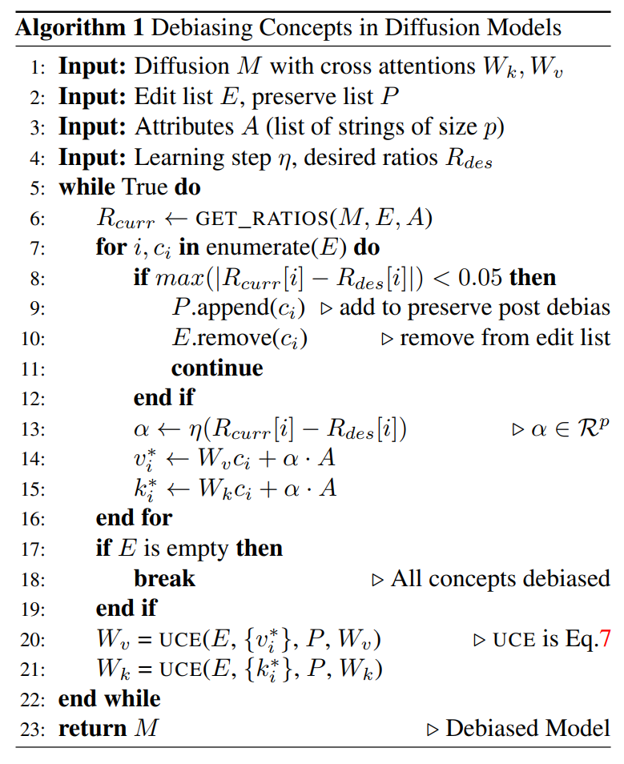

#### Moderation

concept $c_i$ (e.g., "nudity") 를 moderation 하려면, target output $v_i^*$ 가 unconditional prompt $c_0$ (e.g., " ") 와 정렬되도록 edit 을 한다:

$$
\begin{equation}
    v_i^* \leftarrow W^{\text{old}} c_0
\end{equation}
$$

이렇게 하면 $c_i$ 에 대한 output 이 더 일반적이고 unconditional 한 output $c_0$ 로 대체되면서, model 의 응답이 그 concept 의 극단적인 attribute 를 줄여 moderation 이 된다.

# 5. Experiments

## 5.1. Erasing

저자의 erasing 기술은 model 의 key-value mapping 을 직접 수정해서 key 를 undesired concept 대신 다른 concept 와 연결한다. 저자는 이 방법을 사용해서 model 의 weight 에서 artistic style 을 지운다. 저자의 기술은 특정 artist 를 보존하면서 다른 artist 를 제거할 수 있게 해준다. 저자는 이게 보존하거나 지우지 않은 holdout set 의 artist 에 대한 간섭을 상당히 줄인다는 걸 발견했다. 

- 저자는 artistic erasure 방법을 ESD-x, Concept Ablation, SDD 같은 최근 접근법과 비교한다. 
  - 이들은 cross-attention fine-tuning 을 사용해서 controllable image editing 을 한다. 
- 두 번째 실험 세트에서는 object erasure (e.g., "garbage truck" concept 지우기) 를 테스트한다. 
    - 이 실험에서는 implicit interference 를 테스트하기 위해 explicit preservation objective 를 사용하지 않았다. 
    - Object erasure 에서는 주로 ESD-u 와 비교하는데, ESD-u 는 cross-attention 을 제외한 모든 parameter 를 freeze 해서 더 global 한 erasure 를 가능하게 한다.

### 5.1.1 Artist erasure

저자의 방법은 model 의 knowledge 를 보존하면서 여러 concept 을 성공적으로 지울 수 있다. 저자는 artist 이름의 text embedding 을 지울 concept $c_i$ 로 사용하고, 보존할 artist set 을 $c_j$ 로 사용한다. 

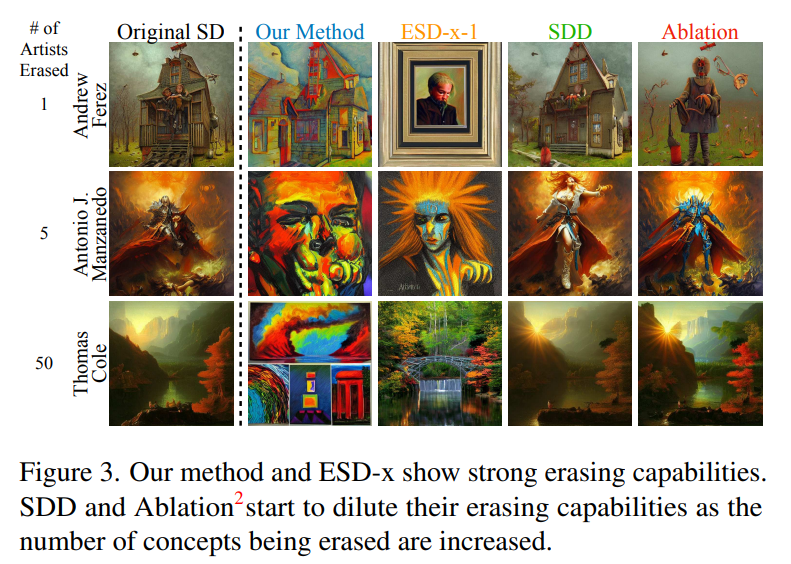

- Fig. 3 에서 보듯이, 저자는 여러 artistic style 을 일관되게 지울 수 있다. 반면 다른 방법들은 artistic style 의 특성을 많이 유지하고, 지우는 concept 수가 늘어날수록 model 의 capability 를 손상시킨다. 
- 저자는 ESD 와 SDD 가 concept 을 순차적으로 지울 때 (concept 당 1000 iteration) model 을 더 손상시키는 경향이 있다는 걸 발견해서, 이 기술들을 1000 iteration 동안 random sampling 기반 erasure 로 제한했다.

---

저자의 방법은 또한 지우지 않은 neighboring concept 에 대한 간섭을 다른 기술보다 줄여준다. 

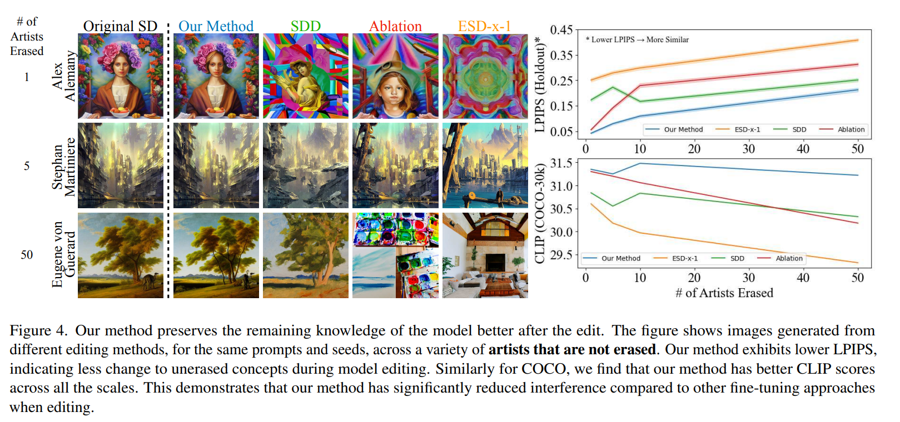

- Fig. 4 에서 보듯이, 저자의 접근법으로 지우면 제거 대상이 아닌 concept 에 미치는 영향이 적다. 
- 위쪽 plot 은 original SD 와 edited model 간의 LPIPS 차이를 보여주는데, 저자의 방법이 unrelated concept 을 가장 적게 수정한다는 걸 나타낸다. 
- 아래쪽 plot 은 COCO-30k prompt 에 대한 CLIP score 를 보여주는데, 저자의 방법이 editing 후에도 더 나은 text-to-image alignment 를 유지한다는 걸 높은 CLIP score 로 증명한다. 
- 이 결과들은 저자의 erasing 접근법의 중요한 장점을 강조한다 - targeted concept 을 제거하면서 model 의 다른 knowledge 영역에 최소한의 disruption 만 주는 능력이다.

---

Diffusion model 은 1800 개 이상의 artistic style 을 모방한다고 알려져 있다. 저자는 $n$ 명의 artist 를 지우고 나머지 $1000-n$ 명을 보존하면서 저자의 방법의 multi-concept erasure 능력을 분석했다. 

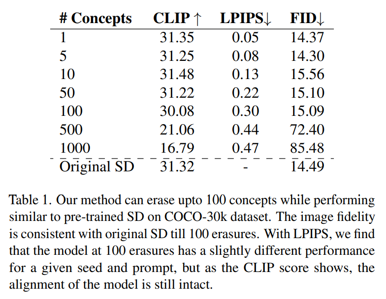

- Tab. 1 에서 보듯이, 저자의 방법은 image fidelity 와 CLIP score 를 손상시키지 않고 최대 100 명의 artist 를 동시에 지울 수 있다. 
- 50 번의 erasure 후에는 주어진 prompt 와 seed 에 대한 model 의 output 이 LPIPS score 로 보듯이 변하기 시작하지만, CLIP score 로 보듯이 전체적으로 alignment 는 유지된다. 
- 이 결과에서 preservation strategy 의 중요성은 Appendix 에서 보여주는데, preservation 이 없으면 TIME formulation 으로 돌아간다.

### 5.1.2 Erasing Objects

diffusion model 의 learned concept 에서 object 를 지우는 저자의 방법의 능력을 보여주기 위해, harmful symbol 과 content 제거에 잠재적 응용 가능성을 가진 실험을 했다. Imagenette class (Imagenet class 의 subset) 를 지우는 실험을 진행했다. 각 지운 object 에 대해 text embedding (e.g., "French Horn") 을 $c_i$ 로 사용하고, 추가 preservation concept $c_j$ 는 사용하지 않았다. 클래스당 500 개 이미지를 생성하고 pre-trained ResNet-50 을 사용해서 top-1 classification accuracy 를 평가했다. 

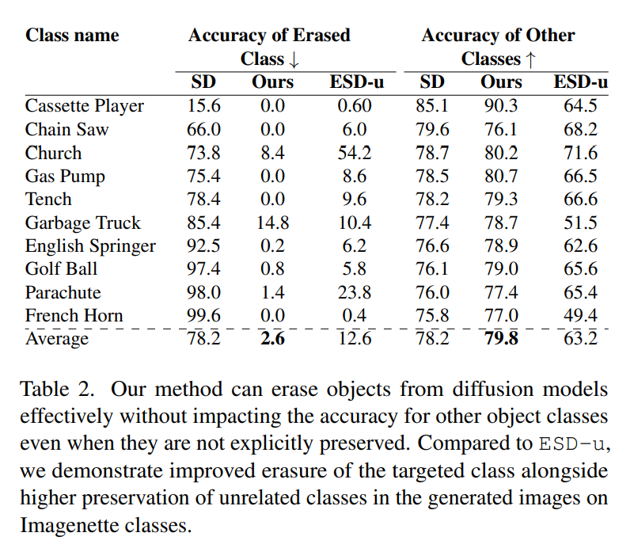

- Tab. 2 에서 ESD-u 와 비교했다. Object 는 개별적으로 지워져서 ESD 와의 non-erased class 간 interference 를 분석했다. 
- Explicit preservation 없이도 저자의 접근법은 우수한 erasure capability 를 보여주면서 non-targeted class 에 대한 간섭을 최소화했다. 추가 erasure 분석은 Appendix 에서 제공한다. 
- Imagenette 의 10 개 class 를 모두 함께 지우면 image generation accuracy 가 4.0% 로 줄어들고 COCO-CLIP score 가 31.02 (original SD 는 31.32) 로 떨어지는데, 이는 single 및 multi-object removal 이 효과적이며 간섭을 제한한다는 걸 정량적으로 보여준다.

## 5.2. Debiasing

Stable Diffusion 은 profession name (e.g., "CEO") 에 대한 이미지 생성에서 gender 와 racial bias 를 보인다. "CEO" prompt 에 대해 여성 비율이 6% 밖에 안 된다. 저자는 Alg. 1 을 사용해서 profession concept 을 debiasing 한다. Profession text embedding $c_i$ 와 attribute embedding $A$ (e.g., "male", "female") 를 사용한다.

Over/under-debiasing 을 막기 위해 Eq. 9 에서 attribute 당 regularization constant $\alpha_i$ 를 설정한다. 한 concept 을 debiasing 하면 다른 concept 에 영향을 줄 수 있어서, 저자는 iterative 접근법을 사용한다. Edit 과 freeze concept list 를 유지해서, debiased concept 을 고정하고 새 concept 을 editing 한다. 

여러 concept 을 병렬로 debiasing 할 때, $\alpha_i$ 값은 training 중 validation sample 을 생성하고 CLIP 으로 분류한 current model 의 generated ratio 에 기반해서 조정한다. Concept 이 충분히 debiased 되면 preservation list 에 추가해서, validation 을 건너뛰고 다른 concept 을 debiasing 할 때 고정한다. 이 iterative $\alpha_i$ tuning 은 이미 debiased 된 concept 의 불필요한 반복 editing 을 피해서 효율적인 debiasing 을 가능하게 한다. 

모든 concept 에 대해 동일한 $\alpha_i$ 를 설정하면 일부는 overdebiasing 되고 일부는 under-debiasing 될 위험이 있다. 저자의 iterative validation 은 concept 당 최적의 constant 를 결정한다.

### 5.2.1 Gender bias

generative model 의 debiasing 을 위한 이전 방법들 (TIME, Concept Algebra, Debiasing-VL) 은 두 개의 discrete attribute 간 bias 완화에 초점을 맞췄다. Gender 를 binary 관점으로 보는 게 non-binary 그룹을 배제한다는 걸 인정하지만, 이런 dual-attribute 기술과의 공정한 비교를 위해, 저자는 diffusion model 에서 occupational gender bias 를 줄이는 걸 평가한다. Non-binary gender 의 visual feature 를 editing 하면 다른 undesired stereotypical behavior 를 도입할 위험이 있다는 것도 인지한다.

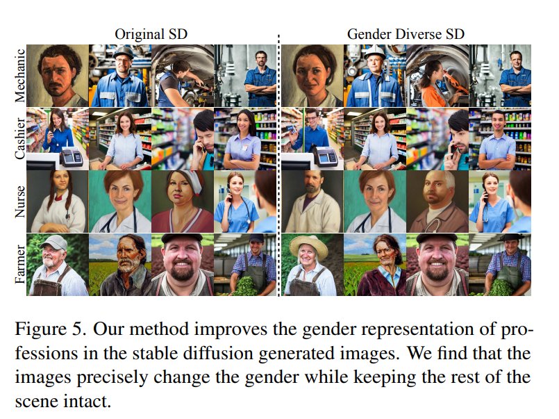

- Fig. 5 는 강한 초기 gender bias 를 가진 profession 에 대해 저자의 debiasing 기술을 적용한 후 생성된 이미지의 다양성이 증가한 qualitative 결과다. 
- Quantitative 평가를 위해, profession 당 250 images 를 합성하고 CLIP classification 을 사용해서 achieved 와 desired (50-50) gender ratio 간 deviation $\Delta = \frac{| P_{\text{male}} - P_{\text{female}} |}{P_{\text{male}} + P_{\text{female}}}$ 를 계산한다. 
  - 여기서 $\Delta = 0$ 은 완벽한 debiasing 을 뜻한다. 

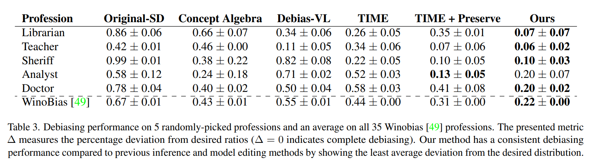

- Tab. 3 에서 보듯이, 저자의 방법은 pre-trained 및 baseline model 에 비해 50-50 비율에 가장 가까운 gender distribution 을 달성한다. 
- TIME 의 original formulation 은 debiased concept 간 interference 를 보여 성능이 더 나쁘다. 
- TIME 에 저자의 preservation term 을 적용해도 저자의 접근법보다 성능이 떨어진다. 
- Qualitative 와 quantitative 결과 모두를 통해, 저자는 저자의 방법이 generative model 의 robust targeted debiasing 을 가능하게 한다는 걸 보여준다.

### 5.2.2 Racial bias

저자의 접근법의 이전 debiasing 기술 대비 핵심 장점은 여러 attribute 관련 bias 를 동시에 완화할 수 있다는 거다. 이 능력을 보여주기 위해, Stable Diffusion 으로 생성된 profession 의 racial diversity 를 개선하는 실험을 한다. 구체적으로, U.S. Office of Management and Budget (OMB) 기준으로 정의된 주요 racial category (White, Black, American Indian, Native American, Asian) 를 타겟으로 한다. 이미지에서 race 를 정확히 분류하는 건 CLIP 같은 정교한 model 이나 인간에게도 복잡하고 문제 있는 연구이다. 그래서 저자는 오류가 생기기 쉬운 quantitative race categorization 대신 qualitative 분석 접근법을 취한다. 

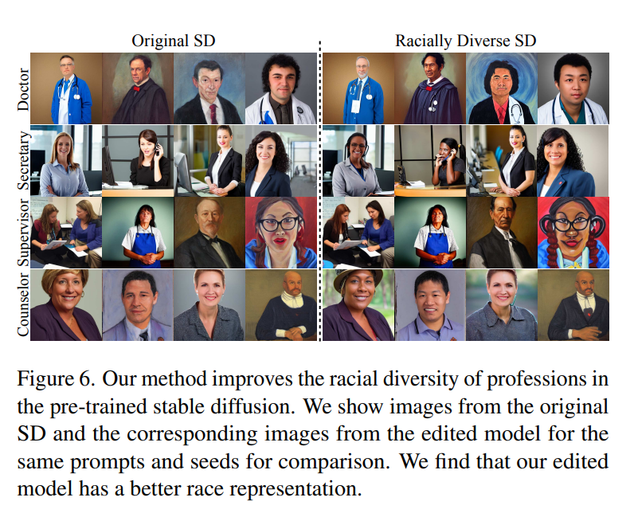

- Fig. 6 에서 보듯이, 저자의 방법은 생성된 professional 이미지에서 이 racial group 의 representation 을 크게 향상시킨다.
- 이는 저자의 기술이 diffusion model 에서 multifaceted bias 를 줄이는 데 강점이 있다는 걸 강조하며, 기존 binary-attribute debiasing 방법 대비 핵심 장점을 보여준다.

#### 5.3. Moderation

저자는 sensitive concept moderation 에 대해 제안된 방법을 정량적으로 평가한다. "nudity" 같은 single concept erasure 작업에서 최근 state-of-the-art 기술 ESD-u 와 ESD-x 와 비교한다. 모든 model 에 대해 I2P benchmark 에서 나온 prompt 로 4703 개 이미지를 생성한다. 

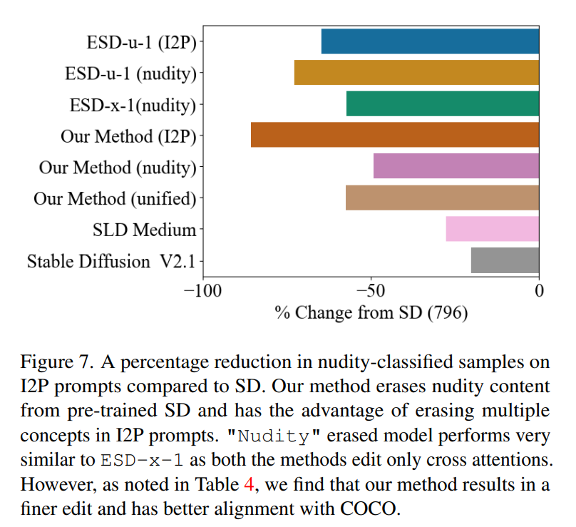

- Fig. 7 에서 NudeNet classifier 를 사용해서 nudity moderation 을 분석한다. 저자의 방법은 ESD-x 와 비슷한 nudity erasure 성능을 보이는데, 두 기술 모두 diffusion model 의 cross-attention 을 editing 하기 때문이다. 
- ESD-u 는 cross-attention 을 제외한 전체 model 을 finetune 해서 예상대로 더 공격적인 erasure 효과를 보인다. 하지만 Tab. 4 에서 저자의 접근법이 ESD-u 와 ESD-x 보다 model generation 에 훨씬 적은 distortion 을 일으키며, original SD generation 에서 LPIPS score 가 크게 줄어든다는 걸 강조한다. 
  - 이는 저자의 방법이 sensitive concept 을 moderation 하면서 image quality 를 더 잘 보존한다는 걸 뜻한다. 
  - 또한 CLIP score 는 저자의 기술이 editing 후에도 text-image alignment 를 더 잘 유지한다는 걸 보여준다.

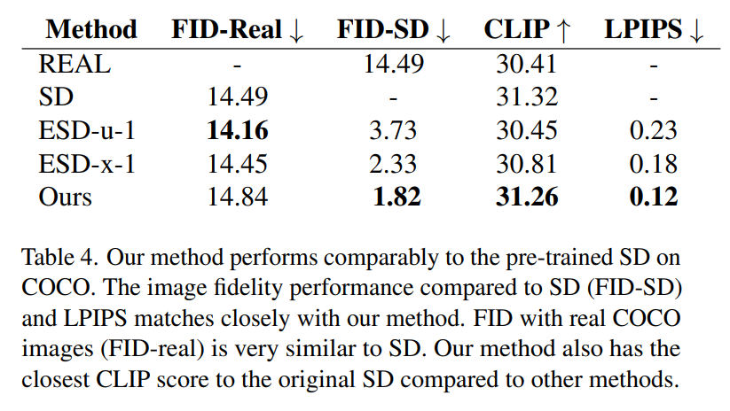

저자는 I2P 에서 여러 sensitive concept 을 지우는 데도 효과를 보여준다. 다시 저자의 접근법은 ESD-u 에 비해 개선된 multi-concept moderation 능력을 보인다 (Fig. 7). 다양한 sensitive concept moderation 에 대한 자세한 분석은 Appendix 에서 제공한다.

#### 5.4. Unified Editing

저자의 formulation 은 style erasure, profession debiasing, nudity moderation 을 동시에 가능하게 한다. Edit vector $v^*$ 의 design 은 각 edit 마다 다르지만, model update 는 unified 다. 실험적으로, jointly finetuned model 은 개별적으로 trained model 과 비슷한 효과를 보인다: Tab. 3 과 비슷하게, gender ratio deviation 이 gender-debiasing model 의 0.22 대 unified model 의 0.27, original Stable Diffusion 의 0.67 이다. Unified model 은 또한 nudity reduction 이 58% 로, nudity erasure 의 49% 와 ESD-u 의 64% 에 비해 좋다 (Fig. 7).

# 6. Limitations

여러 attribute 에 걸쳐 debiasing 할 때, 저자는 compounding bias 를 보이는 interdependency 를 발견한다. 예로, "a black person" 이미지 생성은 gender ratio 가 거의 균등 (100 개 중 48% 남성) 한 반면, "a native american person" 은 강한 남성 bias (100 개 중 96% 남성) 를 보인다. 이렇게 isolation 에서 debiasing 하면 다른 차원에서 bias 를 지속시킬 수 있다. 이는 propagated bias 를 완화하려면 joint attribute consideration 이 필요하다는 걸 보여준다. 

저자는 또한 prompt 에서 word-level bias 가 불리하게 조합되는 걸 발견한다. Non-gendered phrase 인 "successful person" 은 "person" (100 개 중 50% 남성) 의 gender-balanced 결과와 달리 주로 남성 (100 개 중 88%) 이 된다. 이는 미묘한 cue 가 bias 를 가진다는 걸 보여준다. 이런 compositional effect 는 각 word element 가 완화해야 할 bias 를 기여하기 때문에 도전 과제를 낸다.

Artistic style erasure 에서, 500 명 이상의 artist 를 제거하면 preservation term 이 있어도 general image generation 이 저하된다 (Tab. 1). 이는 generative capability 를 유지하려면 일정 수준의 artist 가 필요하다는 걸 뜻한다. 과도한 erasure 는 pretraining 중 배운 핵심 visual prior 를 손상시킨다.

# 7. Conclusion

저자는 diffusion model 을 정밀하게 editing 해서 디자이너가 더 책임감 있고 사회에 유익한 model 을 만들 수 있게 하는 unified algorithm 을 제시했다. 저자의 접근법은 text description 만 사용해서 targeted debiasing, 잠재적 copyrighted content erasure, offensive concept moderation 을 가능하게 한다. 저자의 측정 결과는 이전 방법 대비 세 가지 핵심 이점을 제안한다.  
- gender, racial, 기타 bias 를 동시에 완화하면서 model capability 를 보존할 수 있다.  
- scalable 해서 retraining 없이 한 번에 수백 개 concept 을 수정한다.  
- 실험은 real-world 사용 사례에서 우수한 성능을 보여준다. 