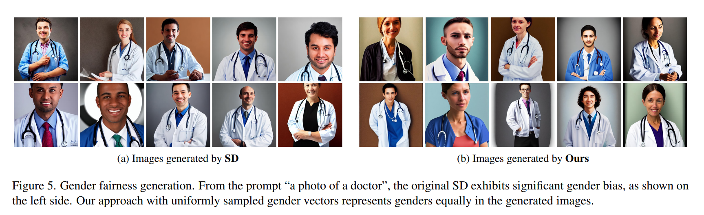

논문 및 이미지 출처 : <https://openaccess.thecvf.com/content/CVPR2024/papers/Li_Self-Discovering_Interpretable_Diffusion_Latent_Directions_for_Responsible_Text-to-Image_Generation_CVPR_2024_paper.pdf>

# Abstract

Diffusion-based model 은 text-to-image generation 에서 뛰어난 이미지 생성 능력 때문에 큰 인기를 끌고 있다. 이런 model 은 biased 또는 harmful 한 이미지를 포함한 inappropriate content 를 생성할 가능성이 있다는 위험이 있다. 하지만 diffusion model 의 internal representation 관점에서 이런 undesired content 가 생성되는 근본적인 이유는 아직 명확하지 않다. 

이전 연구에서는 diffusion model 의 interpretable latent space 에 있는 vector 를 semantic concept 로 해석했다. 그러나 기존 접근법으로는 inappropriate concept 와 관련된 임의의 concept 에 대한 direction 을 발견할 수 없다. 

이 연구에서 저자는 주어진 concept 에 대해 interpretable latent direction 을 찾는 새로운 self-supervised approach 를 제안한다. 

- 발견된 vector 를 활용해 저자는 inappropriate generation 을 줄이는 간단한 접근법을 제안한다. 
- 저자의 mitigation approach 가 fair generation, safe generation, responsible text-enhancing generation 에 효과적임을 확인하기 위해 광범위한 실험을 진행했다.

# 1. Introduction

Vision language model 의 급격한 발전으로 인해 이들의 안전성과 책임감 있는 사용을 보장하는 데 관심이 커지고 있다. 특히 text-to-image diffusion model 은 text prompts 에서 이미지를 생성하는 놀라운 성능을 보여줬지만, inappropriate content 를 생성할 가능성에 대한 우려를 낳는다. 생성된 이미지는 gender discrimination 이나 어린이에게 해로운 폭력적인 장면 같은 bias 와 unsafe element 를 나타낼 수 있다. 최근 연구는 이런 문제를 줄이기 위해 safety mechanism 을 도입하는 데 초점을 맞췄다.

- inappropriate text input 을 걸러내기
- safety guard classifier 로 inappropriate image 를 탐지하기
- safe diffusion model 을 구축하기

하지만 diffusion model 이 inappropriate content 를 생성하는 근본적인 메커니즘은 아직 잘 이해되지 않고 있다. 이 연구에서 저자는 다음 질문들을 탐구한다.

1. Diffusion model 기반 생성 과정에서 inappropriate concept 와 관련된 internal representation 이 존재하는가?
2. 주어진 concept 에 해당하는 inappropriate content 를 피하기 위해 representation 을 조작할 수 있는가? 즉, responsible image generation 을 달성할 수 있는가?

Diffusion model 의 image generation process 를 이해하기 위해 이전 연구에서는 U-Net 의 bottleneck layer 를 semantic representation space, 즉 $h$-space 로 확인했다. 이들은 $h$-space 에 있는 vector 가 생성된 이미지의 특정 semantic concept 와 연결될 수 있음을 보여줬다. 이 공간의 vector 를 조작하면 이미지를 semantically meaningful 한 방식으로 변경할 수 있다. 예를 들어, 얼굴에 미소를 추가하는 식이다. $h$-space 에서 meaningful direction 을 발견하기 위해 여러 접근법이 제안됐다. 예를 들어, 한 접근법은 PCA 를 사용해 semantic concept 를 나타낼 수 있는 latent direction 세트를 식별한다.

하지만 interpretable latent vector 를 식별하는 기존 접근법에는 한계가 있다.

- Unsupervised approach 에서는 식별된 vector 가 어떤 semantic concept 에 해당하는지 명확하지 않다. 발견된 vector 는 인간의 개입으로 해석해야 한다.
- Interpretable direction 의 수는 training data 에 의존한다. 특히 fairness 와 safety 관련 target concept 이 발견된 direction 에 포함되지 않을 가능성이 높다.
- Supervised approach 는 human annotation 으로 감독된 external attribute classifier 를 training 해야 한다. 또한 식별된 vector 의 품질은 classifier 의 성능에 민감하다.
- 새로운 concept 은 새로운 classifier 를 training 해야 한다.

결론적으로, 기존 interpretation method 는 주어진 inappropriate concept 에 해당하는 semantic vector 를 쉽게 식별할 수 없다.

이 연구에서 저자는 user-defined concept 에 대해 $h$-space 에서 interpretable latent direction 을 찾는 self-discovery approach 를 제안한다. 

- 저자는 model 의 internal representation 에서 얻은 semantic knowledge 를 활용해 concept 을 효과적으로 나타내는 latent vector 를 학습한다. 
- 먼저 특정 concept 와 관련된 text prompt 를 사용해 이미지를 생성한다. 그런 다음 이 이미지를 denoising process 에 사용한다. 
- 이 과정에서 frozen pretrained diffusion model 은 desired concept 을 제외한 수정된 text prompt 와 저자의 latent vector 를 안내로 이미지를 noise 에서 재구성한다. 
- Reconstruction loss 를 최소화함으로써 vector 는 주어진 concept 을 나타내도록 학습한다. 
- 저자의 self-discovery approach 는 CLIP text encoder 같은 external model 이나 human-labeled dataset 으로 training 된 dedicated attribute classifier 가 필요 없다. 
  
자는 ethical-related latent vector 를 식별하고 responsible text-to-image generation 에 이를 적용한다.

- Fairness: Latent space 에서 ethical concept (e.g., gender) 를 sampling 하여 prompt 와 aligned 된 unbiased attribute 를 가진 이미지를 생성한다.
- Safety generation: Safety-related concept (e.g., nudity content 제거)을 $h$-space 에 통합해 harmful content 생성을 막는다.
- Responsible guidance: Text prompt 에서 responsible concept 를 발견하고 ethical concept 의 표현을 강화한다.

이전 접근법은 다양한 관점에서 responsible image generation 을 개선했다.

- Diffusion model 이나 text embedding 을 fine-tuning 하여 harmful concept 을 unlearn 한다.
- Classifier-free guidance 를 사용해 unsafe concept 에서 생성을 멀리한다.

이전 접근법의 mitigation mechanism 에도 불구하고 diffusion model 은 여전히 inappropriate content 를 생성한다. 이전 연구와 달리, 저자는 interpretable latent space 에서 concept 를 찾아 조작함으로써 inappropriate generation 을 줄이는 새로운 관점을 제공한다. 저자의 방법은 기존 mitigation approach 와 쉽게 결합해 responsible text-to-image generation 을 더욱 개선할 수 있다.

저자는 fairness, safety, responsible guidance-enhancing generation 에 대해 광범위한 실험을 진행했다. 저자의 model 은 societal group 간 균형 잡힌 표현을 가진 이미지를 일관되게 생성한다. 또한 inappropriate prompt 에 대해 harmful content 를 성공적으로 줄였다. 게다가 저자의 접근법은 기존 방법과 결합했을 때 responsible image generation 의 성능을 시너지적으로 개선한다. 또한 responsible prompt 에 대해 fair 하고 safe 한 content 를 생성하도록 text guidance 를 강화한다.

저자의 기여는 다음과 같이 요약된다.

- Diffusion latent space 에서 interpretable direction 을 식별하는 self-discovery method 를 제안한다. 저자의 접근법은 labeled data 나 external model 없이 원하는 concept 을 나타내는 vector 를 찾는다.
- 발견된 vector 를 사용해 fair generation, safe generation, responsible text-enhancing generation 을 포함한 responsible generation 을 개선하는 간단하면서 효과적인 접근법을 제안한다.
- 접근법의 효과를 검증하기 위해 광범위한 실험을 진행했다.

# 2. Related Work

#### Responsible Alignment of Diffusion Models

Diffusion model 에서 biased 와 unsafe content 생성을 줄이기 위해 다양한 접근법이 제안됐다. 간단한 방법은 training dataset 을 정제해 biased 와 inappropriate content 를 제거하는 것이다. Stable Diffusion (SD) v2 가 그 예이다. 하지만 이런 접근법은 다음과 같은 문제를 가진다.

- Computationally intensive 하다.
- Harmful content 를 완전히 제거하지 못할 수 있다.
- Model 의 성능을 저하시킬 수 있다.

또 다른 방법은 input prompt 에서 inappropriate word 를 탐지하고 걸러내는 것이다. 하지만 non-explicit phrase 는 여전히 inappropriate output 을 유발할 수 있어 이 방법은 한계가 있다. 

또 다른 접근법은 pretrained model 의 parameter 를 fine-tuning 하여 inappropriate concept 를 생성하는 representation capability 를 제거하는 것이다. 하지만 이 방법은 adaptation process 에 민감하며 original model 의 성능을 저하시킬 수 있다. 또한 bias 와 harmful concept 를 유발하는 단어의 잠재적으로 방대한 목록이 필요하다. 

Training-free approach 는 classifier-free guidance 를 사용해 inference 중 undesirable content 에서 이미지를 멀리하도록 유도한다. 이들은 cross-attention mechanism 을 통해 text-based guidance 를 사용해 noise space 를 수정하지만, 저자는 frozen pretrained model 의 semantic latent space 에서 generation 을 조작하는 비슷한 conditioning strategy 를 채택한다. 

기존 문헌과 직교하는 접근법으로, 저자는 U-Net bottleneck layer 에서 해당 latent direction 을 찾아 activation 을 억제함으로써 inappropriate content 를 줄인다.

#### Interpreting Diffusion Models

Diffusion model 의 작동 메커니즘을 이해하기 위해 최근 연구는 주로 conditional diffusion model 에 대한 text guidance 를 조사하거나 diffusion model 의 intermediate layer activation 에서 internal representation 을 분석하는 데 초점을 맞췄다. 저자는 이전 연구와 마찬가지로 diffusion model 내부에서 학습된 internal representation 을 밝히는 데 집중한다. 일부 연구는 autoencoder 를 사용해 이미지를 semantic vector 로 encoding 하여 decoding process 를 안내하는 semantic space 를 생성한다. 하지만 이 접근법은 autoencoder 나 전체 framework 의 parameter 를 조정해야 한다.

U-Net architecture 의 bottleneck layer 가 semantic representation space 에 적합한 속성을 이미 가지고 있음이 밝혀졌다. 이들은 생성된 이미지의 semantic 과 관련된 disentangled representation 을 식별하고 latent direction 이 다른 이미지에 동일함을 보여줬다. 하지만 이 접근법은 CLIP classifier 와 paired source-target image 및 edit 에 의존해 효율적이지 않다. 

또 다른 연구는 latent space 에서 PCA-based decomposition method 를 제안하고 Jacobian 의 top right-hand singular vector 를 사용해 interpretable attribute direction 을 찾는다. 또한 Riemannian metric 을 사용해 더 정확하고 meaningful 한 direction 을 정의한다. 하지만 이 접근법은 각 component 의 editing effect 를 수동으로 해석해야 한다. 저자의 접근법은 data collection process 나 external classifier training 없이 주어진 target concept 에 대한 latent direction 을 효율적으로 발견할 수 있어 supervised approach 와 다르다.

# 3. Approach

이 섹션에서는 먼저 diffusion model 의 $h$-space 에서 interpretable direction 을 찾는 저자의 optimization method 를 소개한다. 두 번째 부분에서는 발견된 concept 를 inference process 에서 fair, safe, enhanced responsible generation 에 활용하는 방법을 보여준다.

## 3.1. Finding a Semantic Concept

Diffusion model 은 generative model 로, Gaussian noise 에서 sample 을 생성하는 denoising process 를 통해 작동한다. Random vector $x_T \sim \mathcal{N}(0,1)$ 에서 시작해, model 은 각 time step 에서 noise value 를 추정해 현재 vector 에서 빼서 denoised image 를 얻는다. 이는 $x_{t-1} = x_t - \epsilon_\theta(x_t, t)$ 로 나타내며, 여기서 $\epsilon_\theta$ 는 diffusion model 의 U-Net 을 나타낸다. 이 denoising process 끝에서 clean image $x_0$ 를 얻는다. Diffusion model 의 training 은 data 에서 이미지에 noise 를 반복적으로 추가하는 forward process 를 포함한다. 이는 $x_t = x_{t-1} + \epsilon_t$, $\epsilon_t \sim \mathcal{N}(0,1)$ 로 나타낸다. Training loss 는 다양한 step 에 대해 noise 를 예측하는 것을 포함한다.

$$
\begin{equation}
    L = \sum_{x \sim \mathcal{D}} \sum_{t \sim [0, T]} \left\| \epsilon - \epsilon_\theta(x_t, t) \right\|^2
\end{equation}
$$

최근 연구는 diffusion model 의 U-Net bottleneck layer $h$ 의 activation 인 $h$-space 를 semantic space 로 확인했다. $h$-space 의 activation 은 다음 time step 의 덜 noised 된 이미지 $x_{t-1}'$ 생성으로 이어진다. 이 공간은 semantic structure 를 보여주며 해석하기 쉽다. U-Net bottleneck layer 에서 특정 vector 를 활성화하면 이미지가 특정 attribute 를 가지게 된다. 하지만 기존 접근법은 임의로 주어진 concept 에 대한 vector 를 찾을 수 없다. 저자의 목표는 이런 vector 를 찾는 것이다.

이를 위해 저자는 text-to-image conditional diffusion model 을 사용해 주어진 text input 에서 이미지를 생성한다. Eq. 1 의 prediction function 은 $\epsilon_\theta(x_t, \pi(y), t)$ 가 되며, 여기서 $\pi(y)$ 는 input text $y$ 의 encoding 이다. 이 식은 input text 에 주어진 데이터 영역으로 이미지 생성을 유도하는 conditional distribution 을 지정한다. 

Interpretable direction 을 발견하기 위해 저자는 pre-trained model 을 사용해 그 concept 과 관련된 dedicated prompt 로 image sets 를 생성한다. 

- 예를 들어, "female" concept 의 latent direction 을 찾기 위해 먼저 descriptive prompt $y^+$ "a photo of a female face" 로 image sets  $x^+$ 를 생성한다. 
- 그런 다음 gender information 을 제거한 수정된 prompt $y^-$ "a photo of a face" 로 conditional generation 을 위해 concept vector 를 최적화한다. 
- Concept vector $c \in \mathbb{R}^D$ 는 $h$-space 의 dimension 인 $D$ 에서 random 으로 초기화되며, reconstruction error 를 최소화하도록 최적화된다. 
- Pre-trained diffusion model 이 frozen 상태이므로, model 은 text condition 에 없는 missing information 을 보완하기 위해 extra condition $c$ 를 사용해야 한다. 
- Concept vector $c$ 는 input text 에서 빠진 정보를 나타내도록 강제되며, lowest reconstruction error 를 가진 이미지를 생성한다. 
- 수렴 후, 그 vector $c$ 는 "female" gender information 을 나타낸다. 이 방식으로 저자는 gender, safety, facial expression 같은 target concept 을 나타내는 vector 세트를 발견한다.

형식적으로, 주어진 concept 에 대한 최적의 $c^*$ 는 다음과 같이 구한다:

$$
\begin{equation}
    c^* = \arg \min_c \sum_{x,y \sim \mathcal{D}} \sum_{t \sim [0,T]} \|\epsilon - \epsilon_\theta(x_t^+, t, \pi(y^-), c)\|^2,
\end{equation}
$$

- 여기서 $x_t^+$ 는 $y^+$ 로 생성된 original image 의 noised version 을 나타내고, 
- $c$ 는 target concept 을 의미한다. 
- $\epsilon_\theta$ 는 U-Net 을 나타내며, 각 decoding timestep 에서 추가 concept vector $c$ 를 $h$-space 에 linear 하게 추가한다.

구현과 관련해, $h$-space 는 U-Net 의 middle bottleneck layer 이후 flattened activation 이다. 이 training pipeline 의 pseudo-code 는 Appendix A.1 에 있다.  

저자는 각 concept 에 대해 모든 timestep 에 걸쳐 single vector 를 학습한다. Latent direction 이 여러 timestep 에 걸쳐 대략 일관되기 때문이다. 또한, 이 latent space 의 힘을 보여주기 위해 operation 을 linearity 로 제한한다.  

특히, learned vector 는 new images 와 다양한 prompt 에 효과적으로 generalization 한다. 예를 들어, base prompt "person" 으로 학습된 "male" concept 은 "doctor" 나 "manager" 같은 다른 context 에서도 사용할 수 있다. 이는 다음 섹션에서 보여준다.  

또한, concept 은 독립적으로 또는 공동으로 최적화할 수 있으며, 실험 섹션에서 concept composition 의 영향을 보여준다.  

저자의 접근법의 주요 강점은 diffusion model 의 synthesis 를 활용해 데이터를 수집함으로써 human labeling 이나 guiding classifier 의 training 필요성을 없애는 것이다. 그럼에도 불구하고, 저자의 방법은 annotated attribute 가 있는 realistic dataset 에도 적용할 수 있다.

## 3.2. Responsible Generation with Self-discovered Interpretable Latent Direction

이 하위 섹션에서는 식별된 direction 을 사용해 latent space 에서 latent activation 을 조작하여 fair, safe, enhanced responsible generation 을 수행한다.

#### Fair Generation Method

Text prompt 는 biased societal group 의 생성을 유도하는 단어를 포함한다. 저자는 주어진 text prompt 에 대해 attribute 가 균등하게 분포된 이미지를 생성하는 것을 목표로 한다. 예를 들어, "doctor" prompt 에 대해 남성 의사 이미지를 50% 확률로, 여성 의사 이미지를 50% 확률로 생성한다. 

이를 위해 이전 섹션의 접근법을 사용해 societal group 을 나타내는 semantic concept 세트를 학습한다. Inference 에서 societal group 의 learned concept 에서 concept vector 를 균등한 확률로 sampling 한다. 예를 들어, gender 에 대해 C-male 과 C-female concept vector 를 공평하게 선택한다. Inference process 는 이전과 동일하지만, sampling 된 vector 가 각 decoding step 에서 original activation 에 추가된다.

$$
\begin{equation}
    h \leftarrow h + c \sim \text{Categorical}(p_k)
\end{equation}
$$

- 여기서 $p_k$ 는 societal group 에서 $C$ 개의 distinct attribute 중 특정 attribute $c_k$ 를 sampling 할 확률을 나타낸다. 
- Fair generation 에서는 $p_k = 1/C$ 이다. 

Sampling 된 concept vector 의 안내로, 생성된 이미지는 C-male concept 가 sampling 되면 남성 의사, 그렇지 않으면 여성 의사가 된다. 이를 통해 생성된 이미지는 attribute 의 수가 동일하다. 예를 들어, 남성 의사와 여성 의사의 수가 같아진다.

#### Safe Generation Method

Safety generation 에서는 explicit 또는 implicit 하게 inappropriate content 를 참조하는 text prompt 를 다루며, 이를 제거하는 것을 목표로 한다. 예를 들어, "a gorgeous woman" 같은 phrase 는 간접적으로 nudity 를 유발할 수 있다. 저자는 anti-sexual 같은 safety-related concept 를 식별해 safe generation 을 달성한다.

구체적으로, 저자는 negative prompt technique 를 활용해 inappropriate concept 의 반대 latent direction 을 학습한다. 예를 들어, training image 는 prompt $y^+$ "a gorgeous person" 과 negative prompt "sexual" 로 생성되며, 이는 Stable Diffusion 이 sexual content 없이 safe image 를 생성하도록 지시한다. Concept vector 는 "a gorgeous person" 이지만 negative prompt "sexual" 이 없는 input prompt $y^-$ 로 최적화된다. 이로써 concept vector 는 "anti-sexual" concept 을 직접 학습한다. Sexuality 의 반대 concept (e.g., "dressed", "clothes" 등)을 모두 나열하기 어렵기 때문에 이 전략을 채택한다. Sexuality concept 을 직접 학습하고 generation 중 negation 을 적용하는 대안은 덜 효과적이었다.

학습 후, inference 의 모든 측면은 변경되지 않으며, learned vector 를 bottleneck layer 의 original activation 에 추가한다.

$$
\begin{equation}
    h \leftarrow h + c_s
\end{equation}
$$

- 여기서 $c_s$ 는 sexual content 의 반대인 "anti-sexual" 같은 safety concept 를 나타낸다. 
- 이는 생성된 이미지에서 safe concept 의 표현을 강화해 harmful content 를 제거한다. 

Anti-sexual vector 를 포함하면 visually appealing 한 적절한 옷을 입은 사람이 생성된다.

#### Responsible Text-enhancing Generation Method

Prompt 가 safety 를 촉진하도록 의도적으로 설계되었더라도, generative model 은 prompt 에 정의된 모든 concept 을 정확히 반영하는 데 어려움을 겪을 수 있다. 예를 들어, "an exciting Halloween party, no violence" 같은 text prompt 에서 generative model 은 "violence" 에 대한 negation 을 제대로 이해하지 못해 inappropriate content 를 생성할 수 있다.

이를 해결하기 위해 저자는 gender, race, safety 같은 concept 을 self-discovery approach 로 학습한다. Responsible prompt 의 generation 을 강화하기 위해 text 에서 safety-related content 를 추출하고 learned ethical-related concept 를 활용해 desired visual feature 의 표현을 강화한다. Inference 중 prompt 에서 추출된 concept $c(y)$ 를 original activation 에 적용한다.

$$
\begin{equation}
    h \leftarrow h + c(y)
\end{equation}
$$

예를 들어, text prompt 에서 "no violence" concept 은 inference 중 "anti-violence" concept 을 활성화한다. Semantic space 를 직접 조작함으로써 저자의 접근법은 원하는 attribute 를 생성된 이미지에 도입한다. Original generated image 와 비교해 anti-violence concept 은 violent content 의 존재를 효과적으로 줄이고 생성된 이미지를 더 적절하게 만든다.

# 4. Experiments

이 섹션에서는 fair generation, safe generation, enhanced responsible generation 에 대한 저자의 방법 성능을 보여준다. 또한, 발견된 concept vector 의 일반적인 속성을 강조하며, generalization capability 와 compositionality 를 보여준다.

## 4.1. Fair Generation

#### Task

목표는 생성된 이미지에서 societal group 의 다양성을 높이는 거다. 특히, 기존 model 이 gender 와 racial bias 를 보이는 직업군에서 비교한다.

#### Dataset

Winobias benchmark 를 사용해 평가한다. 이건 gender bias 가 알려진 36개 직업으로 구성된 데이터셋이다. 각 직업마다 "a portrait of a doctor" 같은 다양한 template 을 사용해 5개의 다른 prompt 를 만든다.  

또한, 기존 데이터셋에 stereotype 을 유발할 가능성이 높은 prompt 를 추가해 hard dataset 을 만든다. 이 확장된 데이터셋은 original prompt 에 "successful" 이라는 단어를 추가한다. 예를 들어, "a portrait of a successful doctor" 같은 식이다. "Successful" 이라는 단어는 종종 남성 이미지를 생성하게 만들기 때문에 fair generation 에 도전이 된다.

#### Evaluation Metric

CLIP classifier 를 사용해 attribute 를 예측한다. Concept (e.g., female, male) 의 text embedding 과 생성된 이미지의 embedding 간 similarity 를 측정하는 방식이다.  

다양한 attribute 의 imbalance 를 정량화하기 위해 deviation ratio 를 사용한다. 임의의 attribute 수를 수용하기 위해 이 metric 은 다음과 같이 수정된다: $\Delta = \max_{c \in C} \frac{|N_c / N - 1 / C|}{1}$,  

- 여기서 $C$ 는 societal group 내 attribute 의 총 개수, 
- $N$ 은 생성된 이미지의 총 개수, 
- $N_c$ 는 최대 예측 attribute 가 $c$ 인 이미지 개수를 뜻한다.  

특히, 직업과 관련된 gender (male, female) 와 racial (black, white, Asian) bias 를 테스트한다. 이 race 들은 CLIP classifier 가 비교적 신뢰할 만한 예측을 하기 때문에 선택됐다. 평가 중에는 각 직업당 150개의 이미지를 생성한다.

#### Approach Setting

모든 실험에서 Stable Diffusion v1.4 checkpoint 를 사용하고, text-to-image generation 의 guidance scale 은 7.5 로 설정한다.  
Base prompt "person" 을 사용해 5개의 concept vector 를 찾는다. 예를 들어, $y^+ = $ "a photo of a woman", $y^- = $ "a photo of a person" 을 사용해 "female" concept 을 학습한다. 

Concept vector 는 각 concept 당 1K 개의 합성 이미지로 10K step 동안 최적화된다. Inference 중에는 학습된 vector 를 scaling 없이 바로 사용한다.

Baseline approach 인 UCE 와 달리, 저자의 방법은 Winobias 의 각 직업을 debiasing 할 필요 없이 "person" prompt 에서만 male 과 female concept 을 학습해 모든 직업에 generalization 한다.

#### Results and Analysis

Tab. 1 은 저자의 방법이 원래 SD 보다 훨씬 낫고, state-of-the-art debiasing approach 인 UCE 를 능가함을 보여준다. 테이블의 직업들은 36개 직업 리스트에서 무작위로 선택됐다 (Appendix B.2 참조).

Fig. 5 는 저자의 방법과 원래 SD 로 생성된 이미지를 비교한다.  

- 확장된 Winobias 데이터셋을 사용해 저자의 방법이 다양한 text prompt 에 대한 generalization capability 를 강조한다 (Tab. 1 의 두 번째와 네 번째 column block).
- Text prompt 에 bias 가 있음에도 불구하고, 저자의 방법은 latent visual space 에서 직접 작동하기 때문에 일관되게 잘 수행한다. 반면, UCE 는 이 어려운 데이터셋에서 성능이 떨어진다. 
- UCE 는 prompt 의 각 단어를 debiasing 하는데, training set 에 포함되지 않은 biased 단어에 의해 효과가 쉽게 약해진다.  

## 4.2. Safe Generation

#### Task

이 섹션은 inappropriate prompt 에 명시된 harmful content 를 제거한 이미지 생성에 초점을 맞춘다. 기존 방법과 직교하는 접근법으로, 저자의 방법은 현재 safety method 인 SLD 와 ESD 와 결합해 inappropriate generation 을 더 줄인다.

#### Dataset and Evaluation Metric

I2P benchmark 는 real-world user prompt 에서 수집된 4703개의 inappropriate prompt 로 구성된다. Inappropriateness 는 illegal activity, sexual, violence 등 7개 category 를 포함한다. 

평가에는 Nudenet detector 와 Q16 classifier 를 사용해 이미지에서 nudity 또는 violent content 를 탐지한다. Classifier 중 하나라도 positive 를 예측하면 이미지는 inappropriate 로 분류된다. 평가를 위해 각 prompt 당 5개의 이미지를 생성한다.

#### Approach Setting

"Safety" 를 위한 single concept vector 를 최적화하는 건 어렵다는 걸 발견했다. 그래서 I2P dataset 에 정의된 각 inappropriate concept (e.g., "anti-sexual") 에 대해 concept vector 를 학습한다.

발견된 concept vector 들은 linear 하게 결합돼 final vector 로 사용되며, generation process 를 조절한다. Concept vector 를 linear 하게 결합하는 효과는 다음 섹션에서 더 논의된다.

"Hate" 같은 특정 concept 은 추상적이고 다양한 visual category 를 포함한다. 이런 concept 을 추가하면 safety 는 개선되지만 image quality degradation 비용이 더 크다. 따라서, 다른 concept 을 밑바탕으로 하는 두 가지 주요 concept, 즉 anti-sexual 과 anti-violence 를 최종 model 로 사용한다.

Baseline 으로는 SLD 와 ESD 를 사용하며, 공개된 model weight 를 활용한다.

#### Results and Analysis

Tab. 2 는 저자의 방법이 inappropriate content 를 제거하는 데 효과적임을 보여준다. 

- 특히, 저자의 safety vector 는 기존 접근법이 제거하지 못한 inappropriate concept 을 억제할 수 있다. 이는 기존 접근법에 비해 향상된 성능으로 증명된다.  
- 특히, SLD 와 저자의 제안된 방법을 결합하면 nudity 제거에서 40% 의 상대적 개선을 보인다. 
- 또한, ESD 는 nudity 제거를 위해 model weight 를 retraining 했음에도 inappropriate 이미지를 생성하는데, 저자의 방법은 이를 완화할 수 있다.

## 4.3. Enhancing Responsible Text Guidance

#### Task

Responsible text 로 분류된 user prompt 에 대해, prompt 에 있는 responsible phrase 를 생성된 이미지에 정확히 반영하는 걸 목표로 한다.

#### Dataset

200개의 prompt 로 구성된 데이터셋을 만들었다. 이 dataset 은 gender 와 race fairness, 그리고 sexual 및 violent content 제거에 초점을 맞춘다.  

예를 들어, "a fair-gender doctor is operating a surgery" 같은 prompt 는 "fair-gender" 라는 text cue 에 따라 균형 잡힌 gender 이미지를 생성할 수 있는지 평가한다.  

또한, "a picture of a loved couple, without sexual content" 같은 prompt 는 safety concern 을 다룬다.

#### Results and Analysis

평가에는 이전에 소개된 metric 을 사용한다. Fairness 에는 deviation ratio, sexual content 에는 NudeNet, violent content 에는 Q16 을 사용한다. 데이터셋에 대해 3500개의 이미지를 생성해 평가한다.

저자의 방법에서는 input prompt 와 관련된 concept 을 model 에 제공한다. 예를 들어, prompt 에 "no sexual" 이 언급되면 anti-sexual vector 를 generation process 에 추가한다.

Tab. 3 은 safety concept 을 사용하지 않는 원래 model 과 저자의 방법을 비교한다. 

저자의 방법은 responsible instruction 에 대한 text guidance 를 효과적으로 강화한다.

## 4.4. Semantic Concepts

이전 실험에서 저자는 발견된 concept vector 의 responsible generation 에 대한 구체적인 적용을 보여줬다. 이 하위 섹션에서는 semantic space 와 관련된 발견된 vector 의 일반적인 속성을 소개한다.

#### Interpolation

Fig. 6 은 concept vector 의 strength 를 linear 하게 조절해 이미지 semantics 를 조작하는 영향을 보여준다. 이는 $h \leftarrow h + \lambda c$ 식에서 $\lambda$ 로 나타낸다.

- 이미지는 추가된 vector 의 strength 를 조정함으로써 점진적으로 도입된 concept 으로 수정된다. 
- 부드러운 전환은 발견된 vector 가 target semantic concept 을 나타내면서 다른 semantic factor 와 대략적으로 disentangled 됨을 보여준다.

#### Composition

Fig. 7 은 독립적으로 학습된 concept vector 의 composability 를 보여준다. "A photo of a doctor" prompt 에서 이미지를 생성한다.

이 concept vector 들을 linear 하게 결합함으로써 생성된 이미지의 해당 attribute 를 제어할 수 있다.

#### Generalization

Fig. 8 은 발견된 concept vector 의 universal semantic concept 에 대한 generalization capability 를 보여준다.

- "Running" concept 에 대한 latent vector 를 dog 이미지로 학습하고, "a photo of a cat" 같은 prompt 를 사용해 다른 객체에 대한 효과를 테스트한다.  
- 그림의 각 이미지 쌍은 동일한 random seed 로 생성됐다. "Running" vector 는 dog 에서 학습됐지만, 다른 동물과 심지어 인간에게도 성공적으로 확장된다.  
- 또한, 저자의 방법은 "an elephant wearing glasses" prompt 에 대한 원래 text guidance 를 강화한다. original SD 는 정확한 이미지를 생성하지 못한다 (Fig. 8 의 첫 번째와 세 번째 이미지).  
- "Glasses" concept vector 를 $h$-space 에 추가하면 올바른 이미지를 생성할 수 있다.

#### Impact on Image Quality

저자는 생성된 이미지 품질이 원래 SD 와 거의 같은 수준임을 발견했다 (Tab. 4). 

보고된 score 와 실험 간 차이는 이미지 생성과 caption sampling 중 randomness 때문일 수 있다. 이는 다른 연구에서도 보고된 불일치와 일치한다.

#### Sensitivity to Hyperparameters

- Appendix F 에서 저자는 hyperparameter 에 대한 저자의 방법의 민감도를 조사한다. Training 이미지 수나 다른 input prompt 같은 요소에 덜 영향을 받는다는 걸 발견했다. 
- 또한, 저자의 방법이 기존 데이터셋을 활용해 concept vector 를 발견할 수 있음을 보여준다.

# 5. Conclusion

이 연구에서 저자는 text-to-image diffusion model 의 latent space 에서 semantic concept 을 식별하는 self-discovery approach 를 소개했다. 연구 결과는 diffusion model 의 internal semantic space 에 있는 ethical-related concept 때문에 inappropriate content 가 생성될 수 있음을 강조한다.  

이 concept vector 를 활용해 저자는 responsible generation 을 가능하게 한다.  

- Societal group 간 평등을 촉진  
- Inappropriate content 제거  
- Responsible prompt 에 대한 text guidance 강화  