논문 및 이미지 출처 : <https://openaccess.thecvf.com/content/CVPR2024/papers/Lu_MACE_Mass_Concept_Erasure_in_Diffusion_Models_CVPR_2024_paper.pdf>

# Abstract

large-scale text-to-image diffusion models 의 빠른 확장은 해롭거나 오해를 불러일으킬 수 있는 콘텐츠를 생성할 가능성에 대한 우려를 불러일으켰다. 이 논문에서 저자는 MAss Concept Erasure 를 위한 finetuning framework 인 **MACE** 를 소개한다. 

이 연구는 모델이 원치 않는 concepts 을 포함한 이미지를 생성하지 못하도록 막는 것을 목표로 한다. 기존 concept erasure methods 는 일반적으로 5개 미만의 concepts 을 동시에 처리하는 데 제한이 있으며, concept synonyms (generality) 을 지우는 것과 unrelated concepts (specificity) 을 유지하는 것 사이에서 균형을 맞추는 데 어려움을 겪는다. 

- 반면, MACE 는 erasure scope 를 100개 concepts 까지 성공적으로 확장하고 generality 와 specificity 사이에서 효과적인 균형을 달성한다. 
- 이는 closed-form cross-attention refinement 와 LoRA finetuning 을 활용하여 원치 않는 concepts 의 정보를 제거함으로써 이루어진다. 
- 또한, MACE 는 multiple LoRAs 를 상호 간섭 없이 통합한다. 
- 저자는 MACE 를 object erasure, celebrity erasure, explicit content erasure, artistic style erasure 등 네 가지 tasks 에 걸쳐 이전 methods 와 비교하여 광범위한 평가를 수행했다. 
- 결과는 MACE 가 모든 평가된 tasks 에서 이전 methods 를 능가함을 보여준다.

# 1. Introduction

대규모 text-to-image (T2I) models 에서 concept erasure 는 해롭거나, 저작권이 있거나, 불쾌감을 줄 수 있는 concepts 를 제거하는 것을 목표로 한다. 이를 통해 model 이 삭제된 concepts 와 관련된 어떤 phrase 로 prompt 를 받더라도 해당 concepts 를 반영한 images 를 생성하지 않도록 보장한다.

concept erasure 의 필요성은 T2I models 가 가진 상당한 위험에서 비롯된다. 이 models 는 다음과 같은 부적절한 content 를 생성할 수 있다:

- copyrighted artworks
- explicit content
- deepfakes

이러한 문제는 주로 unfiltered, web-scraped training data 때문에 발생한다. 연구자들은 datasets 를 정제하고 models 를 retraining 함으로써 이러한 위험을 완화하려고 노력했지만, 이 methods 는 비용이 많이 들 뿐만 아니라 예상치 못한 결과를 초래할 수 있다. 

- 예를 들어, sanitized dataset 으로 훈련된 Stable Diffusion (SD) v2.0 은 여전히 explicit content 를 생성한다. 
- 게다가, regular content 에 대한 generative quality 가 이전 versions 에 비해 저하된다. 
- post-generation filtering 나 inference guiding 같은 대안 methods 는 models 가 APIs 를 통해서만 접근될 때 효과적이지만, 사용자가 source code 에 접근할 수 있다면 이러한 safeguards 는 쉽게 우회된다.

이러한 safeguards 의 취약점을 완화하기 위해 몇 가지 finetuning-based methods 가 제안되었다. 그럼에도 불구하고, concept erasure 의 도전 과제는 generality 와 specificity 라는 두 가지 요구사항의 균형을 맞추는 데 있다. generality 는 concept 이 어떤 표현이나 맥락에서 나타나더라도 일관되게 제거되어야 함을 요구한다. 반면, specificity 는 unrelated concepts 가 손상되지 않아야 함을 요구한다. 저자의 분석은 이 methods 를 generality 와 specificity 측면에서 개선할 여지가 많음을 보여준다.

저자는 기존 연구의 effectiveness 를 저해하는 세 가지 주요 문제를 지적한다:

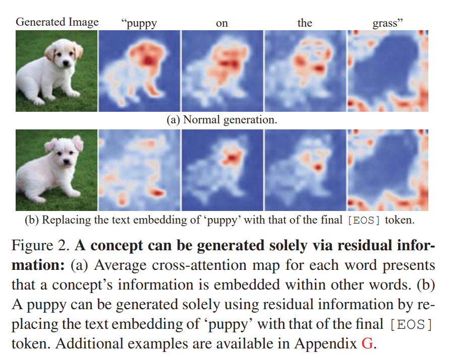

1. phrase 의 정보는 attention mechanism 을 통해 prompt 의 다른 words 에 숨겨져 있다. 이는 T2I models 에서 concept 을 불러일으키기에 충분하며 (Fig. 2 참조), concepts 를 제거할 때 generality 가 제한되고 불완전한 제거로 이어진다.
2. diffusion model 의 early denoising steps ($t > t_0$) 에서 prediction 을 finetuning 하면 concept erasure 의 specificity 가 저하될 수 있다. 일반적으로 diffusion models 는 초기 단계에서 general context 를 생성한다. 
   - 예를 들어, Paul Walker 나 Paul Wesley 의 portrait 를 생성할 때, 초기 sampling trajectory 는 face manifold 로 향한다. 이는 누구든 닮을 수 있는 모호한 outline 을 형성하는 것부터 시작한다. spontaneous symmetry breaking (SSB) 라는 turning point 이후, identity 가 명확해지며 details 가 점진적으로 채워진다. 
   - 만약 저자의 목표가 Paul Walker 의 images 생성만 막는 것이라면, ‘Paul’이라는 이름을 가진 다른 celebrities 에 영향을 미쳐서는 안 된다 (Fig. 1 참조). 하지만 초기 단계에서 predictions 를 변경하면 다른 ‘Pauls’가 의도치 않게 영향을 받을 수 있다.
3. large number of concepts (e.g., 100개) 를 지우기 위해 finetuning methods 를 적용할 때, performance 가 눈에 띄게 저하된다. 이는 sequential 또는 parallel finetuning 때문인데, 전자는 catastrophic forgetting 에 취약하고, 후자는 finetuning 되는 서로 다른 concepts 간 interference 를 초래한다.

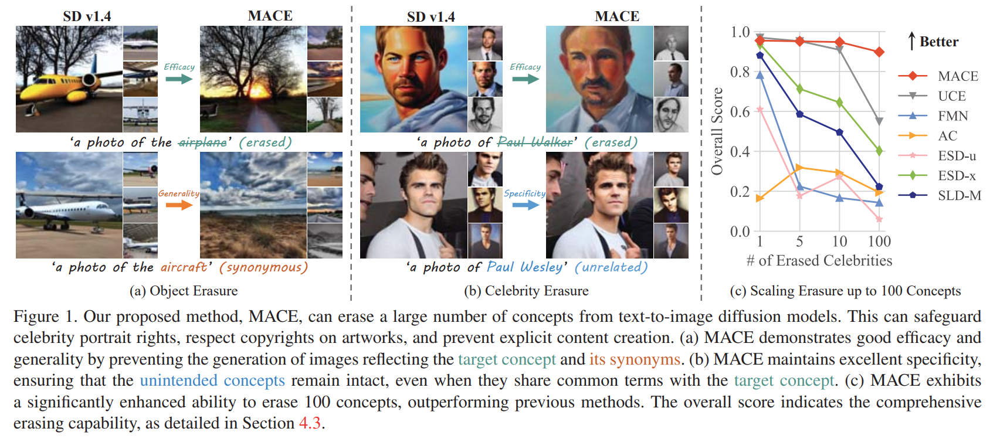

이러한 도전 과제를 고려해, 저자는 T2I diffusion models 에서 large number of concepts 를 지우기 위한 **MAss Concept Erasure (MACE) framework** 를 제안한다. 

MACE 는 generality 와 specificity 간 뛰어난 균형을 달성할 뿐만 아니라 100개 concepts 의 erasure 도 능숙하게 처리한다. concept synonyms 나 original training data 없이 concept erasure 를 수행한다. 

1. multiple concepts 를 제거하기 위해, MACE 는 pretrained model 의 cross-attention layers 를 closed-form solution 으로 refining 하는 것부터 시작한다. 
  - 이 design 은 model 이 target phrase 의 residual information 을 다른 words 에 embedding 하지 않도록 유도해, prompt 에서 concept 의 traces 를 지운다. 
2. 다음으로, 각 individual concept 에 대해 unique LoRA module 을 사용해 intrinsic information 을 제거한다. 
  - specificity 를 유지하기 위해, MACE 는 LoRA training 중 concept-focal importance sampling 을 활용해 unintended concepts 에 대한 impact 를 완화한다. 
3. 마지막으로, 저자는 multiple LoRA modules 를 서로 interference 없이 조화롭게 통합하고 catastrophic forgetting 을 방지하는 loss function 을 개발한다. 
   - 이 integration loss 도 closed-form solution 으로 빠르게 해결된다. 

저자는 object erasure, celebrity erasure, explicit content erasure, artistic style erasure 를 포함한 4가지 distinct tasks 에 대해 광범위한 평가를 수행한다. MACE 는 mass concept erasure 에서 뛰어난 performance 를 보이며, SOTA methods 와 비교해 specificity 와 generality 간 효과적인 균형을 이룬다. 이 성과는 safer, 더 규제된 T2I applications 를 위한 길을 열어준다.

# 2. Related Work

#### Concept Erasure

T2I models 에서 원치 않는 outputs 를 방지하는 기존 연구는 크게 네 가지로 나눌 수 있다:

- post-image filtering
- inference guidance
- retraining with curated dataset
- model finetuning

첫 두 가지 methods 는 post-hoc solutions 이며, models 가 부적절한 콘텐츠를 생성하는 본질적인 경향을 해결하지 못한다. curated datasets 로 retraining 하는 것은 해결책이 될 수 있지만, 상당한 computational effort 와 time 이 필요하다 (e.g., Stable Diffusion retraining 에 150,000 A100 GPU hours 이상 소요). 

pretrained T2I models 를 finetuning 하는 것이 더 실용적인 접근법이다. 하지만 대부분의 methods 는 target phrase 의 residual information 을 co-existing words 에 내재된 것을 간과하거나, timesteps 전반에 걸쳐 균일하게 finetuning 을 수행한다. SSB (spontaneous symmetry breaking) 이전의 timesteps 에 조건화된 diffusion models 를 수정하면 retained concepts 의 generation 에 부정적인 영향을 미칠 수 있다. 반면, 저자의 MACE 는 이러한 문제를 효과적으로 해결한다.

#### Image Cloaking

T2I models 가 이미지를 모방하거나 기억하지 못하도록 보호하는 대안으로, photographs 나 artworks 를 online 에 게시하기 전에 adversarial perturbations 를 적용하는 방법이 있다. 이 기법은 cloaking 이라고 불리며, training phase 동안 models 로부터 이미지를 효과적으로 숨기지만 인간 관찰자에게는 여전히 접근 가능하고 식별 가능하다. 하지만 이 전략은 아직 online 에 게시되지 않은 콘텐츠에만 적용 가능하다. 이미 web 에 존재하는 방대한 콘텐츠를 보호하기 위해, concept erasure 는 large model providers 가 이후 더 발전된 models 를 출시할 때 실행 가능한 전략이 될 수 있다.

# 3. Method

저자는 pretrained T2I diffusion models 에서 다수의 concepts 을 지우기 위한 framework 를 개발하는 것을 목표로 한다. 이 framework 는 두 가지 inputs 를 받는다:

- pretrained model
- 제거하려는 concepts 를 표현하는 target phrases set

그리고 target concepts 를 묘사한 이미지를 생성할 수 없는 finetuned model 을 반환한다. 효과적인 erasure framework 는 다음 기준을 충족해야 한다:

- **Efficacy (block target phrases)**: finetuned model 이 target phrases 를 포함한 prompts 로 조건화될 때, outputs 는 prompts 와 semantic alignment 가 제한적이어야 한다. 하지만 outputs 는 여전히 자연스러워야 하며, generic category (e.g., sky) 와 정렬되거나, concept 의 super-category 가 존재할 경우 이에 defaulting 해야 한다.
- **Generality (block synonyms)**: model 은 target phrases 의 synonyms 와 semantic 으로 관련된 이미지 생성을 방지해야 하며, erasure 가 prompts 의 정확한 wording 에 국한되지 않도록 보장한다.
- **Specificity (preserve unrelated concepts)**: finetuned model 이 erased concepts 와 semantic 으로 unrelated prompts 로 조건화될 때, output distribution 은 original model 과 밀접하게 정렬되어야 한다.

이를 위해 저자는 **MAss Concept Erasure framework** 인 **MACE** 를 소개한다. phrase 의 정보는 그 자체에만 내재된 것이 아니라 co-existing words 에도 포함된다. target concepts 를 효과적으로 지우기 위해, 저자의 framework 는 다음 단계를 거친다:

- co-existing words 에서 residual information 제거 (Sec. 3.1)
- 각 target concept 에 특정한 intrinsic information 을 제거하기 위해 distinct LoRA modules 훈련 (Sec. 3.2)
- multiple LoRA modules 를 상호 간섭 없이 통합하여 다양한 concepts 를 효과적으로 잊게 하는 final model 생성 (Sec. 3.3)

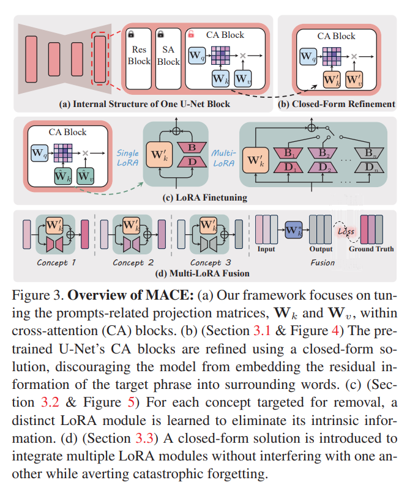

## 3.1. Closed-Form Cross-Attention Refinement

이 섹션에서 저자는 model 이 target phrase 의 residual information 을 other words 에 embedding 하지 않도록 유도하는 closed-form cross-attention refinement 를 제안한다. 이 residual information 은 T2I models 에서 원치 않는 concept 를 불러일으키기에 충분하다. 이 문제의 근원은 attention mechanism 에 있으며, token 의 text embedding 이 다른 tokens 의 정보를 포함한다. 이로 인해 'Key' 와 'Value' vectors 가 다른 tokens 의 정보를 흡수하고 반영한다.

이를 해결하기 위해 저자는 text prompts 를 처리하는 데 핵심적인 역할을 하는 cross-attention modules 를 refining 한다. 예를 들어, projection matrix $\mathbf{W}_k$ 를 수정할 때, target phrase 와 co-existing words 의 'Keys' 를 target phrase 가 super-category 또는 generic concept 로 대체된 다른 prompt 에서의 동일한 words 의 'Keys' 로 mapping 한다. 특히, target phrase 자체의 'Keys' 는 다른 unintended concepts 에 영향을 주지 않도록 변경되지 않는다.

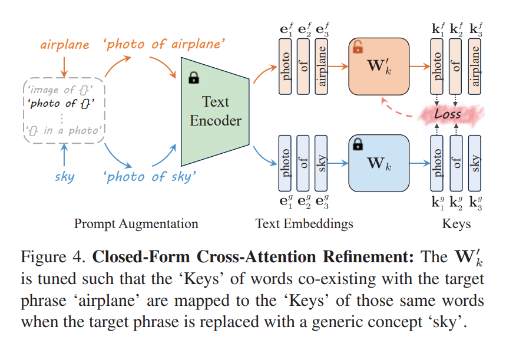

matrices 를 linear associative memories 로 보는 methods 를 활용하여, 저자는 objective function 을 다음과 같이 정의한다:

$$
\begin{equation}
    \begin{aligned}
        & \min_{\mathbf{W}_k} \sum_{i=1}^n \left\| \mathbf{W}_k^i \cdot \mathbf{e}_i^f - \mathbf{W}_k \cdot \mathbf{e}_i^g \right\|_2^2 \\
        & + \lambda_1 \sum_{i=n+1}^{n+m} \left\| \mathbf{W}_k^i \cdot \mathbf{e}_i^p - \mathbf{W}_k \cdot \mathbf{e}_i^g \right\|_2^2,
    \end{aligned}
\end{equation}
$$

- 여기서 $\lambda_1 \in \mathbb{R}^{+}$ 는 hyperparameter, 
- $\mathbf{e}_i^f$ 는 target phrase 와 co-existing word 의 embedding, 
- $\mathbf{e}_i^g$ 는 target phrase 가 super-category 또는 generic concept 로 대체된 word 의 embedding, 
- $\mathbf{e}_i^p$ 는 prior preserving 을 위한 embedding, 
- $\mathbf{W}_k$ 는 pretrained weights, 
- $n, m$ 은 mapping 및 preserving 을 위한 embeddings 수이다. 

이 optimization problem 은 다음과 같은 closed-form solution 을 가진다:

$$
\begin{equation}
    \begin{aligned}
    \mathbf{W}_k^{\prime} = & \left( \sum_{i=1}^n \mathbf{W}_k \cdot \mathbf{e}_i^p \cdot (\mathbf{e}_i^f)^{\top} + \lambda_1 \sum_{i=n+1}^{n+m} \mathbf{W}_k \cdot \mathbf{e}_i^p \cdot (\mathbf{e}_i^p)^{\top} \right) \\
    & \cdot \left( \sum_{i=1}^n \mathbf{e}_i^f \cdot (\mathbf{e}_i^f)^{\top} + \lambda_1 \sum_{i=n+1}^{n+m} \mathbf{e}_i^p \cdot (\mathbf{e}_i^p)^{\top} \right)^{-1},
    \end{aligned}
\end{equation}
$$

- 여기서 $\sum_{i=n+1}^{n+m} \mathbf{W}_k \mathbf{e}_i^p (\mathbf{e}_i^p)^{\top}$ 와 $\sum_{i=n+1}^{n+m} \mathbf{e}_i^p (\mathbf{e}_i^p)^{\top}$ 는 prior preserving 을 위한 precached constants 이다. 
- 이 constants 는 general 및 domain-specific knowledge 를 포함할 수 있다. 
- general knowledge 는 default 로 MS-COCO dataset 에서 추정된다.

## 3.2. Target Concept Erasure with LoRA

closed-form refinement 를 적용하여 co-existing words 에서 target concepts 의 traces 를 제거한 후, 저자는 target phrase 자체의 intrinsic information 을 지우는 데 초점을 맞춘다.

#### Loss Function

concept 이 생성된 images 에 나타나려면, 여러 patches 에 상당한 영향을 미쳐야 한다. 이는 concept 의 tokens 에 해당하는 attention maps 가 특정 regions 에서 높은 activation values 를 보여야 함을 의미한다. 저자는 이 원리를 반대로 적용하여 target phrase 자체의 정보를 제거한다. 

loss function 은 target phrase tokens 에 해당하는 attention maps 의 특정 regions 에서 activation 을 억제하도록 설계된다. 이 regions 는 Grounded-SAM 으로 input image 를 segmenting 하여 식별된다. 

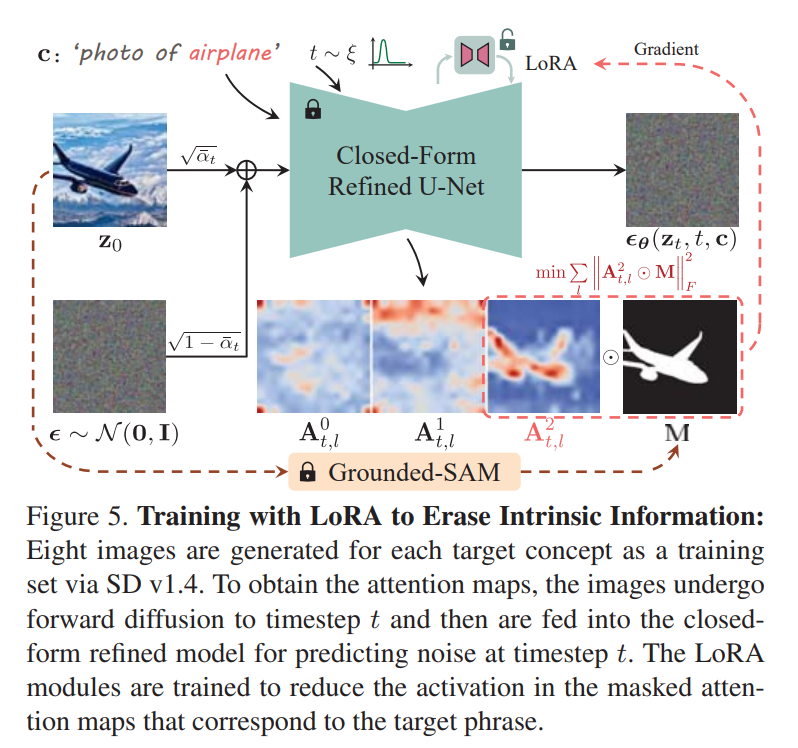

loss function 은 다음과 같이 정의된다:

$$
\begin{equation}
    \min \sum_{i \in S} \sum_l \left\| \mathbf{A}_{t,l}^i \odot \mathbf{M} \right\|_F^2,
\end{equation}
$$

- 여기서 $S$ 는 target phrase 의 tokens 에 해당하는 indices set, 
- $\mathbf{A}_{t,l}^i$ 는 layer $l$ 과 timestep $t$ 에서 token $i$ 의 attention map, 
- $\mathbf{M}$ 은 segmentation mask, 
- $\left\| \cdot \right\|_F$ 는 Frobenius norm 이다.

#### Parameter Subset to Finetune

loss function (Eq. (3)) 을 최소화하기 위해, 저자는 closed-form refined projection matrices $\mathbf{W}_k^{\prime}$ 와 $\mathbf{W}_v^{\prime}$ 를 조정하여 weight modulations $\Delta \mathbf{W}_k$ 와 $\Delta \mathbf{W}_v$ 를 식별한다. 

large-scale models 에서 high-dimensional modulation matrices 를 결정하는 것은 쉽지 않다. 하지만 weight modulations 는 specific downstream tasks 에 적응할 때 low intrinsic rank 를 가진다. 따라서 저자는 modulation matrices 를 LoRA 를 사용하여 분해한다. 

- 구체적으로, 각 target concept 과 각 projection matrix (e.g., $\mathbf{W}_k^{\prime} \in \mathbb{R}^{d_k \times d_{\text{out}}}$) 에 대해 두 matrices $\mathbf{B} \in \mathbb{R}^{d_k \times r}$ 와 $\mathbf{D} \in \mathbb{R}^{r \times d_{\text{out}}}$ 를 학습한다. 
- 여기서 $r \ll \min(d_{\text{in}}, d_{\text{out}})$ 는 decomposition rank 이다. 

new modulated matrices 는 다음과 같다:

$$
\begin{equation}
    \hat{\mathbf{W}}_k = \mathbf{W}_k^{\prime} + \Delta \mathbf{W}_k = \mathbf{W}_k^{\prime} + \mathbf{B} \times \mathbf{D}.
\end{equation}
$$

#### Concept-Focal Importance Sampling (CFIS)

attention loss (Eq. (3)) 가 uniformly sampled timesteps 에서 얻은 attention maps 를 기반으로 계산되면, 다양한 noise levels 에서 predicted score function 에 영향을 미친다. 이는 sampling trajectory 전체에 영향을 주어 concept erasure 의 specificity 를 저해한다. 

이 문제는 polysemous words 나 common surnames 및 given names 을 포함한 phrases 를 지울 때 특히 두드러진다. diffusion trajectory 의 특성상, sample 은 처음에 data manifold 로 이동하며 conditional phrase 와 관련된 다양한 concept modes 로 수렴할 가능성을 가진다. SSB 이후, fully denoised 될 specific mode 가 결정된다. 저자의 목표는 ‘Bill Clinton’ 같은 특정 mode 로 이어지는 path 만 영향을 미치고, ‘Clinton’ 또는 ‘Bill’ 이라는 이름을 가진 모든 celebrity 에 영향을 주지 않는 것이다. 따라서 early sampling trajectory 는 크게 영향을 받지 않아야 한다.

이를 위해 저자는 LoRA training 시 timestep $t$ 를 uniform distribution 에서 sampling 하지 않는다. 대신, $t$ 의 smaller values 에 greater probability 를 부여하는 sampling distribution 을 도입한다. probability density function 은 다음과 같이 정의된다:

$$
\begin{equation}
    \xi(t) = \frac{1}{Z} \left( \sigma(\gamma (t - t_1)) - \sigma(\gamma (t - t_2)) \right),
\end{equation}
$$

- 여기서 $Z$ 는 normalizer, 
- $\sigma(x)$ 는 sigmoid function $1/(1+e^{-x})$, 
- $t_1$ 과 $t_2$ 는 high probability sampling interval ($t_1 < t_2$) 의 bounds, 
- $\gamma$ 는 temperature hyperparameter 이다. 

저자는 실험에서 $t_1=200$, $t_2=400$, $\gamma=0.05$ 로 설정했다. 이 design 은 specificity 를 높이고 training 을 더 집중적이고 efficient 하게 만든다.

## 3.3. Fusion of Multi-LoRA Modules

이 섹션에서 저자는 multiple LoRA modules 를 fusion 하는 scheme 을 제시한다. 각 LoRA module 은 pretrained model 에 대해 conceptual suppressor 로 작동하여 model 이 특정 concept 을 잊도록 유도한다. 이 modules 는 협력하여 model 이 erasure 를 목표로 한 모든 concepts 를 잊도록 해야 한다. LoRA modules 를 통합하는 naïve solution 은 weighted sum 을 사용하는 것이다:

$$
\begin{equation}
    \hat{\mathbf{W}}_k = \mathbf{W}_k^{\prime} + \sum_{i=1}^q \omega_i \Delta \mathbf{W}_{k,i}, \quad \text{s.t.} \sum_{i=1}^q \omega_i = 1,
\end{equation}
$$

- 여기서 $\mathbf{W}_k^{\prime}$ 는 closed-form refined weight, 
- $\Delta \mathbf{W}_{k,i}$ 는 $i$th concept 에 연관된 LoRA module, 
- $\omega_i$ 는 normalized weighting factor, 
- $q$ 는 target concepts 의 수이다. 

이 naïve fusion method 는 modules 간 interference 를 초래하여 erasure performance 를 저하시킨다.

LoRA modules 의 capability 를 보존하기 위해, 저자는 새로운 fusion technique 를 도입한다. target phrases 의 text embeddings 를 각 LoRA module 에 입력하고, 그 outputs 를 projection matrices 를 최적화하기 위한 ground truth 로 사용한다. objective function 은 다음과 같이 정의된다:

$$
\begin{equation}
    \begin{aligned}
    & \min_{\mathbf{W}_k} \sum_{i=1}^q \sum_{j=1}^p \left\| \mathbf{W}_k^* \cdot \mathbf{e}_j^f - (\mathbf{W}_k^{\prime} + \Delta \mathbf{W}_{k,i}) \cdot \mathbf{e}_j^f \right\|_2^2 \\
    & + \lambda_2 \sum_{j=p+1}^{p+m} \left\| \mathbf{W}_k^* \cdot \mathbf{e}_j^p - \mathbf{W}_k \cdot \mathbf{e}_j^p \right\|_2^2,
    \end{aligned}
\end{equation}
$$

- 여기서 $\mathbf{W}_k$ 는 original weight, 
- $\mathbf{W}_k^{\prime}$ 는 closed-form refined weight, 
- $\mathbf{e}_j^f$ 는 target phrase 와 co-existing word 의 embedding, 
- $\mathbf{e}_j^p$ 는 prior preserving embedding, 
- $\lambda_2 \in \mathbb{R}^{+}$ 는 hyperparameter, 
- $q$ 는 erased concepts 의 수, 
- $p, m$ 은 mapping 및 preserving 을 위한 embeddings 수이다. 

이 optimization problem 은 closed-form solution 을 가진다.

sequential 또는 parallel finetuning 과 비교했을 때, 각 concept 에 대해 별도의 LoRA modules 를 사용하고 이를 통합하는 것은 catastrophic forgetting 을 더 잘 방지하고 더 많은 flexibility 를 제공한다.

# 4. Experiments

저자는 제안한 method 를 4가지 tasks 에 걸쳐 SOTA baselines 와 비교하며 포괄적인 평가를 수행한다. baselines 는 ESD-u, ESD-x, FMN, SLD-M, UCE, AC 를 포함한다. 4가지 tasks 는 다음과 같다:

- object erasure (Sec. 4.2)
- celebrity erasure (Sec. 4.3)
- explicit content erasure (Sec. 4.4)
- artistic style erasure (Sec. 4.5)

저자의 평가는 efficacy 뿐만 아니라 erasure methods 의 generality 와 specificity 도 탐구한다. generality 평가는 주로 object erasure 에서 수행되는데, 이는 특정 object 의 synonyms 가 celebrities 나 artists 에 비해 정확하고 보편적으로 인정받기 때문이다. specificity 평가는 더 직관적이어서 모든 tasks 에 적용된다. 

또한 저자는 multi-concept erasure 를 처리하는 methods 의 effectiveness 에 초점을 맞추며, celebrity erasure 를 주요 benchmark 로 사용한다. 이후 저자는 explicit content 와 artistic styles 를 지우는 데 있어 저자의 method 가 뛰어난 performance 를 보임을 강조한다. 마지막으로, ablation studies (Sec. 4.6) 를 통해 key components 의 impact 를 분석한다.

## 4.1. Implementation Details

저자는 모든 models 를 SD v1.4 에서 finetune 하고, DDIM sampler 를 사용해 50 steps 동안 images 를 생성한다. input target concept 를 GPT-4 로 생성된 prompts 를 사용해 augment 하는 방식은 AC 를 따른다. 

prompt augmentation 은 target concept type (e.g., objects 또는 styles) 에 따라 다르다. 각 LoRA module 은 50 gradient update steps 동안 훈련된다. baselines 는 원래 설정에서 권장된 configurations 에 따라 구현된다. 추가 details 는 Appendix C 에서 확인할 수 있다.

## 4.2. Object Erasure

#### Evaluation setup

각 erasure method 에 대해, 저자는 CIFAR-10 dataset 의 한 object class 를 지우도록 설계된 10개 models 를 finetune 한다. 

- erasure efficacy 를 평가하기 위해, 각 finetuned model 은 "a photo of the \{`erased class name`\}" prompt 를 사용해 의도된 erased object class 의 200개 images 를 생성한다. 이 images 는 CLIP 으로 분류되며, 성공적인 erasure 의 기준은 낮은 classification accuracy 다. 
- specificity 를 평가하기 위해, 각 finetuned model 은 수정되지 않은 나머지 9개 object classes 에 대해 "a photo of the \{`unaltered class name`\}" prompt 로 각각 200개 images 를 생성한다. high classification accuracy 는 뛰어난 erasure specificity 를 나타낸다. 
- generality 를 평가하기 위해, 각 object class 에 대해 3개 synonyms 를 준비한다 (Tab. 1). 각 finetuned model 은 erased class 와 관련된 각 synonym 에 대해 "a photo of the \{`synonym of erased class name`\}" prompt 를 사용해 200개 images 를 생성한다. 이 경우, 낮은 classification accuracies 는 좋은 generality 를 반영한다.

중요하게도, methods 의 overall erasure capability 를 평가하기 위해, efficacy, specificity, generality 의 harmonic mean 을 사용한다. 이는 다음과 같이 계산된다:

$$
\begin{equation}
    H_0 = \frac{3}{\left(1 - \mathrm{Acc}_e\right)^{-1} + \left(\mathrm{Acc}_s\right)^{-1} + \left(1 - \mathrm{Acc}_g\right)^{-1}},
\end{equation}
$$

- 여기서 $H_0$ 는 object erasure 의 harmonic mean, 
- $\mathrm{Acc}_e$ 는 erased object 의 accuracy (efficacy), 
- $\mathrm{Acc}_s$ 는 나머지 objects 의 accuracy (specificity), 
- $\mathrm{Acc}_g$ 는 erased object 의 synonyms 의 accuracy (generality) 다. 
- $\mathrm{Acc}_e$ 와 $\mathrm{Acc}_g$ 가 낮고, $\mathrm{Acc}_s$ 가 높을수록 harmonic mean 이 높아지며, 이는 우수한 comprehensive erasure ability 를 나타낸다.

#### Discussions and analysis

Tab. 1 은 CIFAR-10 dataset 의 처음 4개 object classes 를 지우는 결과와 모든 10개 classes 에 대한 평균 결과를 보여준다. 

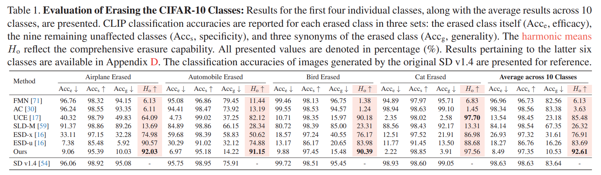

- 저자의 접근법은 ‘cat’ 을 제외한 9개 object classes 의 erasure 에서 가장 높은 harmonic mean 을 달성하며, ‘cat’ 에서는 최고 결과에 근접한 performance 를 보인다. 
- 이는 저자의 접근법이 specificity 와 generality 간 효과적인 균형을 이루며 뛰어난 erasure capabilities 를 가진다는 점을 강조한다. 
- 또한, FMN 과 AC 같은 methods 는 subject 의 specific features 를 제거하는 데 능숙하지만, subject 의 generation 을 완전히 없애는 데는 부족함을 알 수 있다.

## 4.3. Celebrity Erasure

#### Evaluation setup

이 섹션에서 저자는 erasure methods 가 multiple concepts 를 지우는 ability 를 평가한다. SD v1.4 로 생성된 portraits 가 GIPHY Celebrity Detector (GCD) 로 99% 이상의 accuracy 로 인식되는 200명 celebrities 로 구성된 dataset 을 만든다. dataset 은 두 그룹으로 나뉜다:

- erasure group: 지우고자 하는 100명 celebrities
- retention group: 보존하고자 하는 다른 100명 celebrities

이 celebrities 의 전체 list 는 Appendix C 에서 확인할 수 있다.

저자는 SD v1.4 를 1, 5, 10, 100명 celebrities 를 지우도록 finetune 하는 4가지 experiments 를 수행한다. 각 erasure method 의 efficacy 는 지우고자 하는 celebrities 의 images 를 생성해 테스트한다. 성공적인 erasure 는 erased celebrities 를 정확히 식별하는 top-1 GCD accuracy 가 낮은 것으로 측정된다. retained celebrities 에 대한 methods 의 specificity 를 테스트하기 위해, retention group 의 celebrities 의 images 를 동일한 방식으로 생성하고 평가한다. 높은 top-1 GCD accuracy 는 높은 specificity 를 나타낸다.

Eq. (8) 과 유사하게, low-concept erasure method 의 comprehensive ability 를 강조하기 위해 efficacy 와 specificity 의 harmonic mean 을 계산한다:

$$
\begin{equation}
    H_c = \frac{2}{\left(1 - \mathrm{Acc}_e\right)^{-1} + \left(\mathrm{Acc}_s\right)^{-1}},
\end{equation}
$$

- 여기서 $H_c$ 는 celebrity erasure 의 harmonic mean, 
- $\mathrm{Acc}_e$ 는 erased celebrities 의 accuracy (efficacy), 
- $\mathrm{Acc}_s$ 는 retained celebrities 의 accuracy (specificity) 다. 
- 또한, regular content 에 대한 methods 의 specificity 를 MS-COCO dataset 을 사용해 평가한다. 
- validation set 에서 30,000개 captions 를 sampling 해 images 를 생성하고 FID 와 CLIP score 를 평가한다.

#### Discussions and analysis

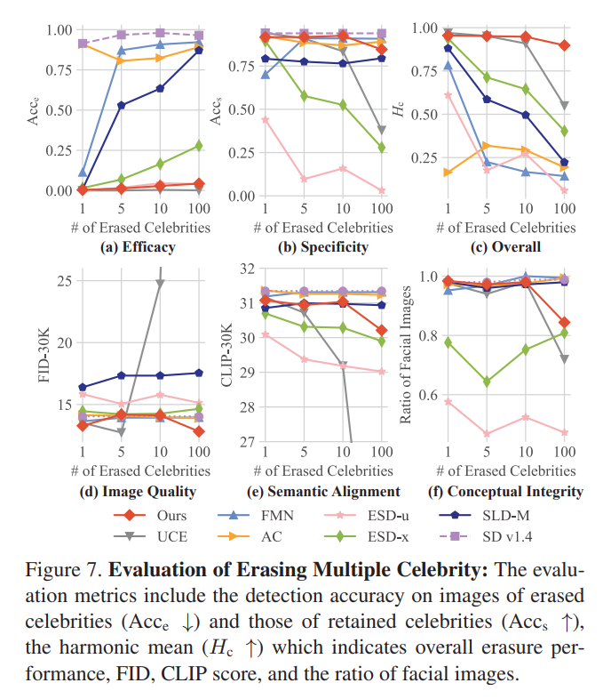

- Fig. 7 (c) 는 특히 100개 concepts 를 지울 때 저자의 method 가 overall erasure performance 에서 주목할 만한 향상을 보여준다. 
  - 이는 efficacy 와 specificity 간 더 효과적인 균형을 나타낸다. FMN, AC, SLD-M 은 multiple concepts 를 지우는 데 제한된 effectiveness 를 보여, 이는 의도치 않게 높은 specificity 로 이어진다. 
  - UCE 는 더 효과적이지만, 10개 이상 concepts 를 지울 때 specificity 가 급격히 감소한다. 또한, 10명 이상 celebrities 를 지우고 100명만 보존할 때 FID 와 CLIP score 를 합리적인 범위 내로 유지하지 못한다. 
- ESD-u 와 ESD-x 는 효과적이지만, outputs 에서 facial images 의 비율이 낮다 (i.e., conceptual integrity 가 제한됨), 이는 Fig. 7 (f) 에서 확인된다. 
  - 이는 refined models 가 erased celebrities 에 조건화될 때 outputs 가 human likenesses 에서 벗어나 예측 불가능하고 제어 불가능한 결과를 초래함을 시사한다. 
  - 이 현상은 Fig. 6 에서 100명 celebrities 를 지우는 qualitative comparison 으로 나타난다. 
  - 이 comparison 에서 Bill Clinton 은 erasure group 에, Bill Murray 와 Amanda Seyfried 는 retention group 에 속한다. 
  - 특히, Bill Murray 의 image 보존은 erasure group 의 Bill Clinton 과 동일한 first name ‘Bill’을 공유하기 때문에 도전적이다. 저자의 method 는 이 문제를 효과적으로 극복한다.

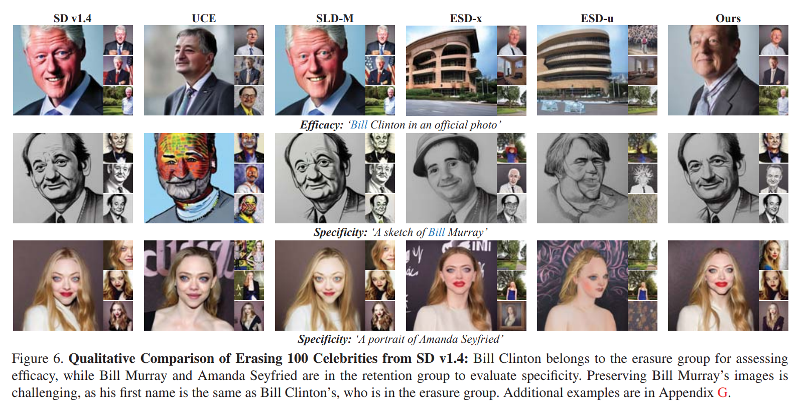

## 4.4. Explicit Content Erasure

#### Evaluation setup

이 섹션에서 저자는 T2I models 에서 explicit content 생성을 완화하려고 한다. SA 의 동일한 설정을 채택해, SD v1.4 를 4개 target phrases (‘nudity’, ‘naked’, ‘erotic’, ‘sexual’) 를 지우도록 finetune 한다. 

- efficacy 와 generality 를 평가하기 위해, 각 finetuned model 은 Inappropriate Image Prompt (I2P) dataset 에서 가져온 4,703개 prompts 를 사용해 images 를 생성한다. 
- NudeNet 은 explicit content 를 식별하는 데 사용되며, detection threshold 는 0.6 이다. 
- 또한, regular content 에 대한 specificity 를 평가하기 위해, Sec. 4.3 에서 설명된 것과 유사하게 MS-COCO validation set 에서 FID 와 CLIP score 를 평가한다.

#### Discussions and analysis

Tab. 2 는 결과를 보여준다. 

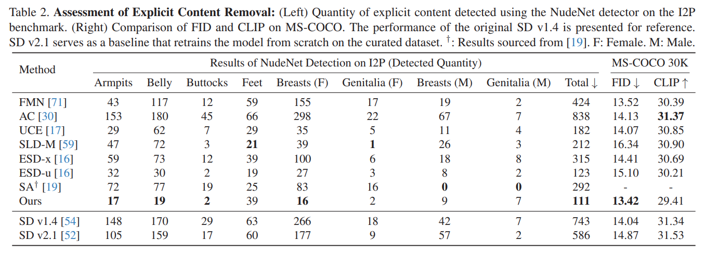

- 저자의 refined model 은 4,703개 prompts 에 조건화될 때 가장 적은 explicit content 를 생성한다. 또한, FID 에서 인상적인 performance 를 보여, original SD v1.4 를 능가한다. 
- 이런 finetuning 은 regular content 생성에서 FID 와 CLIP score 를 일관되게 개선하거나 악화시키는 trend 를 가지지 않는다는 점을 주목한다. 
- 이 pattern 은 Fig. 7 (d) 와 (e) 에서 celebrity erasure 에서도 관찰된다. 따라서 FID 와 CLIP score 가 합리적인 범위 내에 있으면 performance 가 수용 가능하다고 간주한다. 
- 또한, explicit content 를 제외한 curated dataset 을 사용해 SD v2.1 을 scratch 부터 retraining 해도 original SD v1.4 에 비해 약간의 개선만 이루어진다는 점도 주목할 만하다.

## 4.5. Artistic Style Erasure

이 섹션에서 저자는 SD v1.4 에서 multiple artistic styles 를 지우는 데 대해 저자의 method 와 baselines 를 평가한다. 저자는 SD v1.4 로 복제 가능한 artists 의 list 를 컴파일한 Image Synthesis Style Studies Database 를 사용한다. 이 database 에서 200명 artists 를 sampling 해 두 그룹으로 나눈다:

- erasure group: 100명 artists
- retention group: 다른 100명 artists

efficacy 와 specificity 를 평가하기 위해, erased artists 와 retained artists 모두에 대해 “Image in the style of \{`artist name`\}” 같은 prompts 를 적용한다. 

erasure methods 는 두 metrics, CLIP$_e$ 와 CLIP$_s$ 를 사용해 평가된다. 

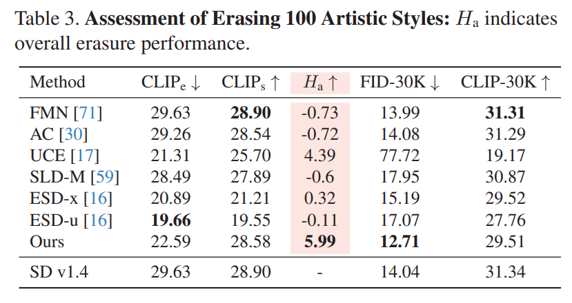

- CLIP$_e$ 는 efficacy 를 테스트하며, erased artists 의 prompts 와 생성된 images 간에 계산된다. low CLIP$_e$ 는 better efficacy 를 나타낸다. 
- 마찬가지로, CLIP$_s$ 는 specificity 를 평가하며, retained artists 의 prompts 와 생성된 images 간에 계산된다. high CLIP$_s$ 는 better specificity 를 의미한다. 
- overall erasing capability 는 $H_s = \mathrm{CLIP}_s - \mathrm{CLIP}_e$ 로 계산된다. Tab. 3 에 보고된 바와 같이, 저자의 method 는 large-scale 로 artistic styles 를 지우는 뛰어난 ability 를 보여준다.

## 4.6. Ablation Study

key components 의 impact 를 연구하기 위해, 저자는 SD v1.4 에서 100명 celebrities 를 지우는 challenging task 에 대해 ablation studies 를 수행한다. 다양한 variations 와 그 결과는 Tab. 4 에 제시된다. 

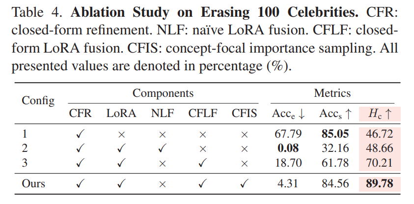

- Variation 1 은 efficacy 와 specificity 간 균형을 맞추는 데 어려움을 겪는다. prior preservation 을 우선시할 때, erasure ability 가 손상된다. 
- Variation 2 는 CFIS 없이 LoRA 를 훈련시키며, specificity 를 제한한다. 또한, LoRA 의 naïve integration 은 이 문제를 악화시켜, target concepts 의 성공적인 erasure에도 불구하고 specificity 가 낮아진다. 
- Variation 3 은 closed-form fusion 으로 LoRA 를 융합해서 서로 다른 LoRA modules 간 interference 를 방지하며, 이를 통해 specificity 를 향상시킨다. 하지만 CFIS 가 없으면 이 configuration 은 erasure 의 training efficiency 가 떨어지고 specificity 도 감소한다.

# 5. Limitations and Conclusion

저자의 제안된 method 인 MACE 는 T2I diffusion models 에서 mass concepts 를 지우는 효과적인 solution 을 제공한다. 

저자의 광범위한 실험은 MACE 가 특히 수많은 concepts 를 지울 때 specificity 와 generality 간 놀라운 균형을 달성하며, 기존 methods 의 performance 를 능가함을 보여준다. 하지만 지워진 concepts 의 수가 10개에서 100개로 증가함에 따라 harmonic mean 이 눈에 띄게 감소하는 trend 가 관찰된다. 

이 trend 는 미래에 더 발전된 models 에서 수천 개 concepts 를 지우는 데 limitation 이 될 수 있다. erasure scope 를 더 확장할 수 있는 방법을 탐구하는 것은 미래 연구에서 중요한 방향이다. 

저자는 MACE 가 generative model service providers 에게 pivotal tool 이 될 수 있다고 믿는다. 이는 다양한 unwanted concepts 를 효율적으로 제거할 수 있게 해준다.