논문 및 이미지 출처 : <https://arxiv.org/pdf/2407.12383>

# Abstract

Text-to-image model 은 safety issue 를 겪고 있는데, 여기에는 copyright 와 Not-Safe-For-Work (NSFW) content 와 관련된 문제가 포함된다. 부적절한 concept 을 diffusion model 에서 지우기 위해 몇 가지 방법이 제안되었지만, 이들은 종종 불완전한 erasure, 많은 computing resource 소모, 그리고 의도치 않은 generation ability 손상을 보인다. 

이 연구에서는 추가적인 fine-tuning 없이 3초 만에 model 을 수정하는 새로운 접근법인 Reliable and Efficient Concept Erasure (RECE) 를 소개한다. 

- 구체적으로, RECE 는 closed-form solution 을 효율적으로 활용하여 새로운 target embedding 을 도출하고, 이를 통해 unlearned model 내에서 erased concept 을 재생성할 수 있다. 
- 도출된 embedding 이 나타낼 수 있는 부적절한 content 를 완화하기 위해, RECE 는 cross-attention layer 에서 이들을 무해한 concept 과 align 한다. 
- 새로운 representation embedding 의 도출과 erasure 는 부적절한 concept 의 철저한 제거를 위해 반복적으로 수행된다. 
- 또한, model 의 generation ability 를 보존하기 위해, RECE 는 derivation 과정에서 추가적인 regularization term 을 도입하여 erasure 과정에서 관련 없는 concept 에 미치는 영향을 최소화한다. 
- 모든 과정은 closed-form 으로 이루어져, 단 3초 만에 매우 efficient erasure 를 보장한다. 

이전 접근법들과 비교했을 때, 저자의 방법은 원래의 generation ability 에 최소한의 손상만 주면서 더 효율적이고 철저한 erasure 를 달성하며, red-teaming tool 에 대한 향상된 robustness 를 보여준다.

# 1 Introduction

최근 몇 년간, large-scale text-to-image (T2I) diffusion model 은 text prompt 에서 photo-realistic image 를 합성하는 놀라운 능력을 보여줬다. T2I diffusion model 의 뛰어난 성능은 주로 인터넷에서 수집된 방대한 training data 덕분인데, 이 데이터는 model 이 다양한 concept 을 모방할 수 있게 한다. 하지만 이런 강력한 model 은 부적절한 text prompt 를 조건으로 했을 때 copyright infringement 와 Not-Safe-For-Work (NSFW) image content 를 생성하는 데 오용될 수도 있다. 특히 Stable Diffusion (SD) T2I model 의 open-source release 는 고급 image generation technology 를 누구나 쉽게 접근할 수 있게 만들었다. 이런 safety concern 을 완화하기 위해, 최근 몇몇 연구는 T2I diffusion model 에 safety mechanism 을 통합하려는 노력을 기울였다. 예로:

- 부적절한 training data 를 필터링하고 model 을 retraining 하는 방법
- NSFW safety checker 로 model output 을 검열하는 방법
- classifier-free guidance 를 적용하여 부적절한 concept 에서 generation 을 멀리하도록 유도하는 방법

하지만 이런 safety mechanism 은 많은 computational resource 와 시간을 요구하거나, open-source scenario 에서 code 와 model parameter 가 공개되어 있어 악의적인 사용자에 의해 쉽게 우회될 수 있다.

위의 단점에 대응하여, T2I diffusion model 에서 부적절한 concept 을 지우는 대안이 있다. 구체적으로, text prompt 로 묘사되거나 visual content 에 나타난 부적절한 concept 이 주어지면, pre-trained T2I diffusion model 의 parameter 를 fine-tuning 해서 해당 concept 을 unlearn 하도록 만들어 관련 image content 가 생성되지 않도록 한다. 이전 security mechanism 과 비교했을 때, concept erasure 는 model 전체를 처음부터 training 할 필요가 없으며 open-source code 로 쉽게 우회될 수도 없다. concept erasure 에서의 유망한 진전에도 불구하고 몇 가지 문제가 있다:

- 대부분의 erasure method 는 많은 iteration 을 통해 상당한 양의 parameter 를 fine-tuning 해야 하며, 이는 필연적으로 generation capability 를 떨어뜨리고 많은 computing resource 를 소모한다.
- 최근 UCE 라는 연구만이 fine-tuning 없이 closed-form solution 을 사용해 model parameter 를 수정하여, concept 을 지우면서 original generation capability 를 유지한다.
- 거의 모든 method 는 부적절한 concept 을 충분히 지우지 못해, T2I diffusion model 의 red-teaming 에 의해 발견된 problematic prompt 에 취약하다. 이로 인해 unlearned model 이 부적절한 image 를 재생성하게 된다.

adversarial fine-tuning 에서 영감을 받아, 저자는 위의 문제를 해결하기 위해 **Reliable and Efficient Concept Erasure (RECE)** method 를 제안한다. 

- 이 방법은 fine-tuning 중에 erased concept 의 새로운 embedding 을 지속적으로 찾아내고, unlearned model 이 이 새로운 concept embedding 을 지우도록 한다. 
- unlearning process 를 가속화하기 위해, RECE method 는 이전의 빠르고 efficient concept erasure method 인 UCE 를 기반으로 하며, closed-form editing 을 사용해 cross-attention layer 의 key 와 value projection matrix 만 수정한다. 
- 마찬가지로, RECE method 는 cross-attention output 을 기반으로 한 closed-form solution 을 통해, erased concept 의 image 를 재생성하도록 model 을 가장 효과적으로 유도하는 새로운 embedding 을 도출한다. 
- 또한, model 의 image generation capability 를 보존하기 위해, modification 전후의 model parameter 의 deviation 을 제한하는 regularization term 을 도입한다. 
- model editing 과 embedding derivation 을 여러 epoch 에 걸쳐 수행함으로써, RECE 는 unlearned model 이 unerased concept 의 image generation ability 를 보존하고, erased concept content 가 포함된 image 생성을 robust 하게 억제한다. 

위의 모든 process 는 closed-form 으로 이루어져, 3초 만에 매우 efficient erasure 를 보장한다. 저자의 주요 contribution 은 다음과 같이 요약된다:

- 저자는 closed-form parameter editing 과 adversarial learning scheme 을 사용해 단 3초 만에 안정적이고 efficient concept erasing 을 수행하는 새로운 concept erasure method 인 RECE 를 제시한다.
- RECE 는 unlearned model 이 erased concept 을 재생성할 수 있도록 새로운 embedding 을 도출함으로써 concept 을 충분히 지운다. 또한 model capability 에 미치는 영향을 최소화하기 위해 regularization term 을 도입한다.
- 저자는 unsafe content, artistic style, object class erasure 에 대한 RECE 의 효과를 검증하기 위해 광범위한 실험을 수행했다. 또한 RECE 의 robustness 를 세 가지 red-teaming tool 에 대해 평가하고, fine-tuning duration 을 기록해 RECE 의 efficiency 를 강조했다.

# 2 Related Work

## T2I Diffusion Models with Safety Mechanisms

부적절한 image 를 생성하는 T2I diffusion model 의 문제를 해결하기 위해 여러 연구가 해결책을 탐구했다. 간단히 말해, 기존 연구는 주로 다음 세 가지 전략으로 나뉜다:

- **Training data filtering 과 model retraining**: curated dataset 으로 retraining 하는 것은 상당한 computational resource 를 요구할 뿐만 아니라 부적절한 content 를 생성하고 performance degradation 을 초래한다.
- **Model output safety checker**: safety checker 를 통해 model output 을 검열하거나, classifier-free guidance 를 활용해 inference 중 부적절한 concept 에서 latent code 를 멀리하도록 유도한다. 하지만 open-source code 에서 pre-trained T2I diffusion model 의 architecture 와 parameter 가 공개되어 있어, 이런 post-hoc intervention 전략은 악의적인 사용자에 의해 쉽게 우회될 수 있다.
- **Parameter fine-tuning**: pre-trained T2I diffusion model 의 일부 parameter 를 fine-tuning 해서 부적절한 concept 의 representation capability 를 지운다. fine-tuning 은 부적절한 content 생성을 막는 효과적인 전략으로 여겨지지만, 현재 method 들은 많은 computing time 을 소모하고 T2I diffusion model 용 red-teaming tool 에 의해 쉽게 우회된다.

## Red-Teaming Tools for T2I Diffusion Models

AI 의 최근 인기로 인해, red-teaming 은 model stability 를 높이기 위해 functional vulnerability 를 탐색하는 데 적용되었다. T2I diffusion model 용 red-teaming tool 도 최근 개발되었으며, 이는 AI red-teaming 에서 드물게 탐구된 분야다. 예로:

- **Prompting4Debugging (P4D)**: prompt engineering technique 와 auxiliary diffusion model 을 활용해 부적절한 content 를 유도하는 problematic prompt 를 자동으로 찾는다.
- **UnlearnDiff**: auxiliary diffusion model 에 의존하지 않고, diffusion model 의 내재된 classification capability 를 활용해 computational efficiency 를 유지하면서 효과를 발휘한다. 두 작업 모두 target model 에 대한 white-box access 를 가정한다는 주요 약점이 있다.
- **Ring-A-Bell**: target model 에 대한 사전 지식 없이 공격을 구성할 수 있는 model-agnostic framework 다. 구체적으로, Ring-A-Bell 은 먼저 concept extraction 을 수행해 부적절한 concept 의 holistic representation 을 얻는다. 이후 추출된 concept 을 활용해 problematic prompt 를 자동으로 생성한다.

# 3 Method

## 3.1 Preliminaries

#### Text-to-Image (T2I) Diffusion Models

현대의 Text-to-Image (T2I) application 에서 diffusion model 은 progressive denoising process 덕분에 뛰어난 image synthesis ability 를 갖추고 있어 선호된다. computational complexity 를 줄이기 위해 T2I 는 종종 pre-trained variational autoencoder (VAE) 의 low-dimensional latent space 에서 작동하는 latent diffusion model 을 채택하고, denoising architecture 로 UNet generative network 를 사용한다. image generation process 에 text conditioning 을 통합하기 위해 T2I 는 CLIP 같은 language model 을 통해 text 를 encode 하고, cross-attention layer 를 통해 text embedding 을 U-Net 에 통합한다. 

구체적으로, 이 layer 들은 Query-Key-Value (QKV) structure 를 사용해 text 와 vision 간의 interaction 을 나타낸다. 주어진 text embedding $c_i$ 에 대해 key 와 value 는 $k_i = W_k c_i$ 와 $v_i = W_v c_i$ 로 생성된다. 이 key 들은 visual feature 를 나타내는 query $q_i$ 와 곱해져 attention map 을 계산하고, cross-attention output 은 value $v_i$ 에 대해 attention 을 수행해 계산된다:

$$
\begin{equation}
    \mathcal{O} \propto \operatorname{softmax}\left(q_i k_i^T\right) v_i.
\end{equation}
$$

#### Concept Erasing with Closed-form Solution

ESD, CA, SA 같은 기존 erasure method 는 fine-tuning 을 요구하며, 이는 수천 번의 fine-tuning step 을 필요로 해 상대적으로 비효율적이다. 반면 UCE 는 closed-form edit 을 통해 attention weight 를 수정하는 efficient method 다. UCE 는 "source" concept (e.g., "nudity") 와 "destination" concept (e.g., empty text " ") 를 필요로 한다. $c_i$ 를 source embedding, $c_i^*$ 를 destination embedding, $E$ 를 지울 concept set, $P$ 를 보존할 concept set 으로 하자. 

K/V projection matrix $W^{\text{old}}$ (이는 $W_k^{\text{old}}$ 와 $W_v^{\text{old}}$ 를 간략히 나타낸 것) 가 주어졌을 때, UCE 는 $E$ 에 있는 concept 을 edit 하면서 $P$ 에 있는 concept 을 보존하는 새로운 weight $W$ 를 찾는다. 

구체적으로, $c_i \in E$ 에 대해 output $W c_i$ 가 original $W^{\text{old}} c_i$ 대신 target value $W^{\text{old}} c_i^*$ 와 align 되도록 weight 를 찾는 것이 목표다. 동시에 parameter change 를 제어하기 위해 $c_j \in P$ 에 대한 output 은 $W^{\text{old}} c_j$ 로 보존되고, L2 regularization term 이 도입된다:

$$
\begin{equation}
    \min_W \sum_{c_i \in E} \left\| W c_i - W^{\text{old}} c_i^* \right\|_2^2 + \lambda_1 \sum_{c_j \in P} \left\| W c_j - W^{\text{old}} c_j \right\|_2^2 + \lambda_2 \left\| W - W^{\text{old}} \right\|_F^2,
\end{equation}
$$

- $\lambda_1$ 과 $\lambda_2$ 는 기존 concept 을 보존하는 scaling factor 다. 
- UCE 는 이 공식이 다음 closed-form solution 을 가진다고 증명한다:

$$
\begin{equation}
    W = W^{\text{old}} \left( \sum_{c_i \in E} c_i^* c_i^T + \lambda_1 \sum_{c_j \in P} c_j c_j^T + \lambda_2 I \right) \left( \sum_{c_i \in E} c_i c_i^T + \lambda_1 \sum_{c_j \in P} c_j c_j^T + \lambda_2 I \right)^{-1}
\end{equation}
$$

UCE 는 closed-form solution 을 사용해 cross-attention KV matrix 를 직접 할당하여 fine-tuning 필요를 없애고, 이를 통해 매우 빠르게 작동한다. 그래서 저자는 method 에 UCE 를 사용한다.

## 3.2 Reliable and Efficient Concept Erasure (RECE)

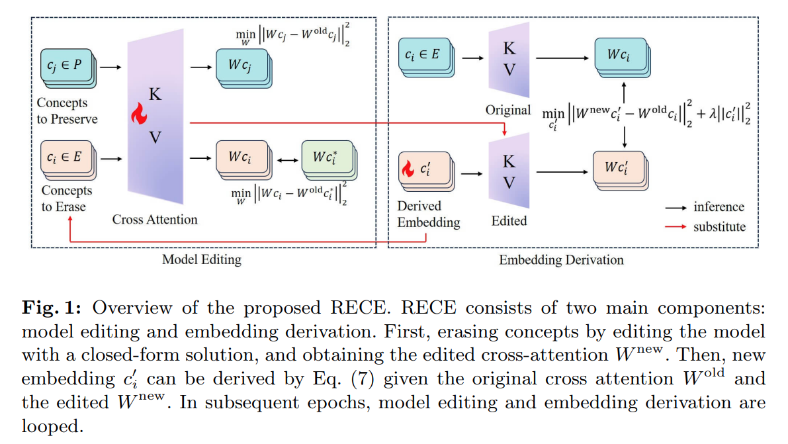

UCE 는 T2I diffusion model 에서 undesired concepts 를 제거하는 빠른 solution 을 제공하지만, Tab. 1 에서 보듯 여전히 undesired content 를 생성할 수 있다. 이는 concept erasure 가 불완전함을 나타낸다. 이런 undesired concept 을 효과적으로 제거하기 위해 저자는 unlearned model 내에서 erased concept 을 재생성할 수 있는 closed-form embedding 를 효율적으로 지운다. embedding 의 derivation 과 erasure 는 부적절한 concept 의 철저한 제거를 위해 반복적으로 수행된다 (Fig. 1 참조).

#### Finding Target Contents

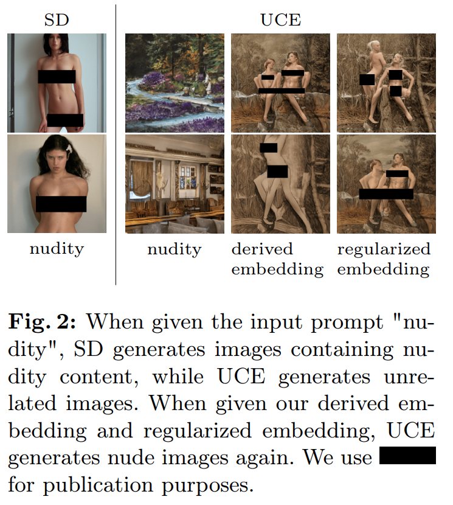

"nudity" 를 예로 들어보자. Fig. 2 의 두 번째 column 에서 보듯, UCE model 에 직접 "nudity" prompt 를 제공하면 landscape 나 관련 없는 image 만 생성된다. 이는 "nudity" 라는 단어가 empty text " " 와 align 되었기 때문이다. 하지만 UCE 의 erasure 는 불완전하다. UCE model 이 nudity content 를 포함한 image 를 다시 생성하도록 유도하는 adversarial prompt 를 생성할 수 있다. 이는 SD 가 "nudity" prompt 로 생성한 image 와 유사하다.

이 섹션에서는 UCE model 에서 nudity image 를 생성하도록 유도하는 새로운 embedding 을 도출하는 method 를 소개한다. Sec. 3.1 에서 설명했듯, T2I 는 cross-attention layer 를 통해 text embedding 을 image generation 에 통합하며, projection matrix $W_k$ 와 $W_v$ 는 text embedding 을 변환하는 데 사용된다. $W^{\text{old}}$ 를 UCE editing 전의 original U-Net 의 projection matrix, $W^{\text{new}}$ 를 UCE editing 후의 projection matrix, $c$ 를 "nudity" 의 embedding, $c^{\prime}$ 를 저자가 도출한 embedding 이라 하자. $W^{\text{new}} c^{\prime}$ 가 $W^{\text{old}} c$ 와 비슷해지도록 $c^{\prime}$ 를 찾으면, $c^{\prime}$ 는 original model 에서 $c$ 가 nudity image 를 생성하도록 유도한 것처럼 edited model 을 nudity image 생성으로 유도할 수 있다. 더 구체적으로, objective function 은 다음과 같이 정의된다:

$$
\begin{equation}
    \min_{c^{\prime}} \sum_i \left\| W_i^{\text{new}} c^{\prime} - W_i^{\text{old}} c \right\|_2^2
\end{equation}
$$

- 여기서 $W_i$ 는 U-Net 의 K/V cross-attention matrix 를 나타낸다. 
- Eq. (4) 에서 도출된 $c^{\prime}$ 는 edited model 내에서 $c$ 의 actual representation 으로 볼 수 있다. 
- 분명히 Eq. (4) 는 $c^{\prime}$ 에 대해 convex function 이며, unique global minimum 을 갖는다. Appendix A 에서 유도했듯, Eq. (4) 는 다음 closed-form solution 을 갖는다:

$$
\begin{equation}
    c^{\prime} = \left( \sum_i W_i^{\text{new}^T} W_i^{\text{new}} \right)^{-1} \left( \sum_i W_i^{\text{new}^T} W_i^{\text{old}} \right) c
\end{equation}
$$

Stable Diffusion (SD) 에서 text conditioning 이 embedding 형태로 작동하므로, 저자는 도출된 embedding 을 text conditioning 으로 사용할 수 있다. Fig. 2 의 세 번째 column 에서 보듯, 이 도출된 embedding 은 UCE edited model 을 다시 nudity image 를 생성하도록 효과적으로 유도하며, 이는 edited model 내에서 "nudity" concept 을 나타낼 수 있음을 보여준다. 따라서 UCE 의 erasure process 가 불완전함을 입증한다. 이 문제를 해결하기 위해 저자는 nude images 를 생성하지 않도록 Eq. (3) 의 UCE 모델에서 우라가 유도한 embedding $c'$ 제거한다.

#### Regularization Term

Eq. (2) 에서 $c$ 를 유도한 embedding $c^{\prime}$ 로 대체해 "nudity" concept 을 추가로 지울 수 있다. 하지만 $c^{\prime}$ 를 직접 지우면 model performance 가 크게 저하된다: Fig. 6 에서 보듯, unrelated concept 에 대해 고품질 image 를 생성하는 데 어려움을 겪는다. 따라서 model performance 를 유지하면서 concept 을 지우는 method 를 고안하는 것이 필수적이다.

$W^{\text{new1}}$ 를 마지막 epoch 의 modification 후 projection matrix, $W^{\text{new2}}$ 를 현재 epoch 의 projection matrix 라 하자. model performance 를 부분적으로 보존하려면 unrelated concept 에 미치는 영향을 최소화해야 한다. 따라서 objective function 을 다음과 같이 정의한다:

$$
\begin{equation}
    \min_W \left\| W^{\text{new2}} d - W^{\text{new1}} d \right\|_2^2
\end{equation}
$$

- 여기서 $d$ 는 unrelated concept 의 embedding 이다. 
- $W^{\text{new2}}$ 는 $c^{\prime}$ 를 $W^{\text{new1}}$ 에서 지운 후 도출되므로 $c^{\prime}$ 에 직접 영향을 받는다. 이에 대한 theorem 은 Appendix B 에서 증명되며:

**Theorem 1.** $c^{\prime}$ 를 0 으로 설정하면 Eq. (6) 은 global minimum 0 을 달성한다.

---

직관적으로, Eq. (3) 에서 $c_i$ 를 0 으로 설정하면 오른쪽 coefficient matrix 는 곱했을 때 identity matrix 가 된다. 결과적으로 $W$ 는 $W^{\text{old}}$ 와 동일해지며, $W$ 에 추가 modification 이 없으므로 unrelated concept 에 최소한의 영향을 미친다. 따라서 $c^{\prime}$ 가 0 에 가까워지도록 보장하기 위해 원래 objective Eq. (4) 에 regularization term 을 도입해 model performance 에 미치는 영향을 최소화한다:

$$
\begin{equation}
    \min_{c^{\prime}} \sum_i \left\| W_i^{\text{new}} c^{\prime} - W_i^{\text{old}} c \right\|_2^2 + \lambda \left\| c^{\prime} \right\|_2^2
\end{equation}
$$

Appendix A 에서 유도했듯, 이 final objective function 도 unique global minimum solution 을 갖는다:

$$
\begin{equation}
    c^{\prime} = \left( \lambda I + \sum_i W_i^{\text{new}^T} W_i^{\text{new}} \right)^{-1} \left( \sum_i W_i^{\text{new}^T} W_i^{\text{old}} \right) c
\end{equation}
$$

Fig. 2 의 네 번째 column 에서 보듯, 이 regularized embedding 도 UCE model 을 다시 nudity image 를 생성하도록 유도하며, 이는 UCE model 내에서 "nudity" concept 을 나타낼 수 있음을 보여준다. regularization term 을 포함함으로써, 저자는 여러 epoch 에 걸쳐 Eq. (3) 을 사용해 refined embedding $c^{\prime}$ 에 erasure process 를 반복적으로 적용한다. 이는 model 의 전체 performance 를 보호하면서 철저한 concept erasure 를 보장한다. 

algorithm detail 은 Algorithm 1 에서 설명된다.

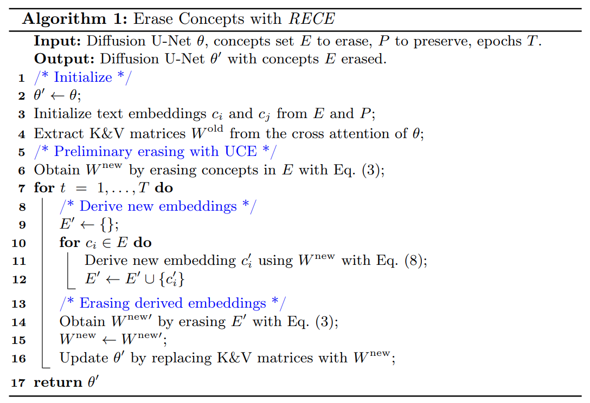

# 4 Experiments

이 섹션에서는 부적절한 concept 과 artistic style 을 지우는 저자의 method 의 결과를 제시한다. object removal 결과는 Appendix 에 포함된다.

- 저자는 SD V1.4 를 base model 로 사용한다. 
- $\lambda_1$ 과 $\lambda_2$ 는 Eq. (2) 에서 0.1 로 설정한다. 
- 부적절한 concept 의 경우 3 epoch 동안 iterative erasure 를 수행하고 Eq. (7) 에서 $\lambda$ 를 $1e-1$ 로 설정한다. 
- artistic style 의 경우 1 epoch 동안 erasure 를 수행하고 $\lambda$ 를 $1e-3$ 로 설정한다.
- 비교 baseline 은 SD V1.4, SD V2.1 (NSFW filtered dataset 에서 pre-trained 된 Stable Diffusion), SLD, ESD, CA, SA, UCE 다. 
- SLD, ESD, SA, UCE 는 각 논문의 권장 configuration 을 따르고, CA 는 unsafe content 를 지우기 위해 U-Net 의 full weight 를 fine-tuning 하고 artistic style 을 지우기 위해 cross-attention module 을 fine-tuning 한다.

## 4.1 Unsafe Content Removal

#### Experimental Setup

이 섹션에서는 unsafe concept erasure 의 효과를 평가한다. 저자는 Inappropriate Image Prompts (I2P) dataset 에서 실험을 수행한다. I2P dataset 은 violence, self-harm, sexual content, shocking content 같은 다양한 부적절한 prompt 를 포함한다. 이 prompt 들은 official SD 를 기반으로 한 real-world, user-generated image 에서 수집된다. 저자의 평가 초점은 nudity erasure 에 있으며, 이는 전형적인 unsafe concept 이다. 

각 model 에 대해 I2P dataset 의 prompt 당 하나의 image 를 생성해 총 4703 개 image 를 만든다. Nude body part 는 Nudenet detector 를 사용해 detection 되며, threshold 는 0.6 으로 설정된다. 이 threshold 는 I2P 의 default setting 을 따른다.

unlearned model 이 정상적인 image 를 여전히 생성할 수 있는지 확인하기 위해, 저자는 unsafe concept 이 없는 COCO-30k dataset 을 caption 과 함께 prompt 로 사용한다. COCO-30k 는 edited model 의 generation capability 를 평가하기에 적합하다. model 의 image-text consistency 는 CLIP-score 를 기반으로 평가하고, SD-generated image 와의 visual similarity 는 FID 를 기반으로 평가한다.

#### Removal Results

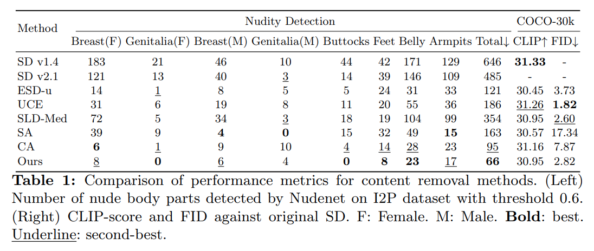

- Tab. 1 에서 보듯, 저자의 method 는 가장 적은 수의 nude body part 를 생성하며, COCO-30k 의 정상 content 를 보존하는 데 탁월한 specificity 를 보여준다. 
- CA 는 두 번째로 적은 nude body part 를 생성하지만 FID 에서 더 낮은 performance 를 보여 generation ability 와 removal effectiveness 간의 trade-off 가 좋지 않다. 
- 반면 CA 는 full weight 를 fine-tuning 하고, 저자의 RECE 는 cross-attention module 만 fine-tuning 한다 (Sec. 4.4 에서 자세히 논의).
- 특히, 저자의 method 는 nude body part 를 상당히 많이 생성하는 top-performing UCE 와 두 번째로 좋은 SLD 와 비슷한 FID score 를 달성한다. 이는 저자의 method 가 정상 content generation 에 최소한의 영향을 미치면서 더 나은 removal effectiveness 를 추구함을 나타낸다. 또한 대부분의 method 는 적절한 범위 내에서 CLIP-score 결과를 보여주므로 CLIP-score performance 는 수용 가능한 것으로 간주한다.

open-source 조건에서 SLD 같은 inference guidance mechanism 은 해당 code 를 삭제함으로써 쉽게 우회될 수 있다. NSFW-filtered dataset 에서 large-scale model retraining 은 상당한 computational resource 를 요구하며, SD v2.1 은 Tab. 1 에서 보듯 여전히 nude image 를 생성할 수 있다.

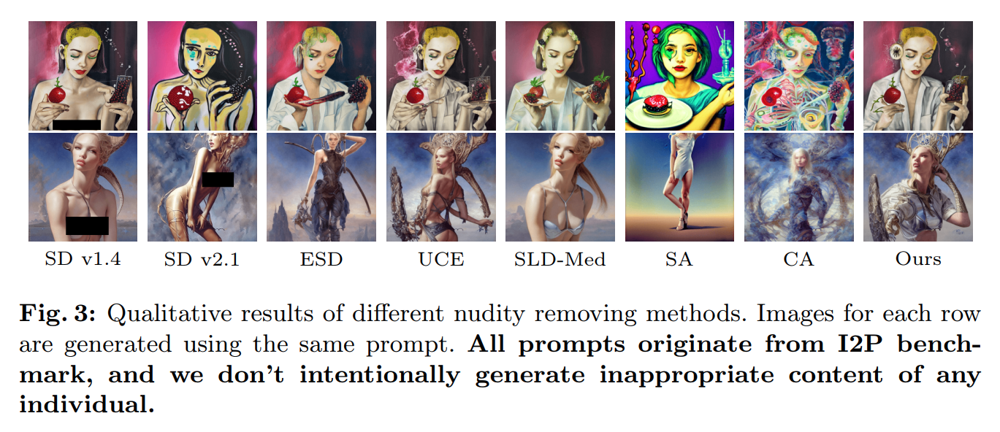

Qualitative result 는 Fig. 3 에서 확인할 수 있다. 

- 첫 번째 row 에서 모든 erasing method 는 non-nude image 를 성공적으로 생성하지만, CA 와 SA 의 결과는 original SD 와 크게 다르다. 
- 두 번째 row 에서 SD v2.1 을 제외한 모든 method 는 nude image 생성을 피한다. 
- 이 중 UCE, SLD, 저자의 method 만이 facial feature 를 효과적으로 포착한다. 이는 저자의 method 가 unrelated concept 을 효과적으로 유지함을 보여준다.

#### Nudity Bias

저자의 RECE 는 nude content 제거에 놀라운 효과를 보이지만, male nudity erasure 에는 한계가 있으며, 다른 method 에서도 유사한 한계가 관찰된다. 

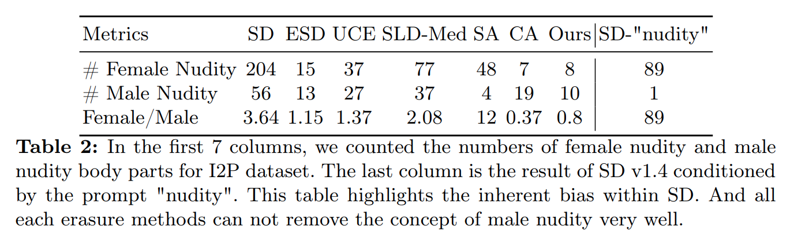

- I2P 4703 개 image 에서 female 과 male nude body part 수를 센 결과 (Tab. 2), 거의 모든 method 에서 female 과 male nudity 비율이 감소하며, female 정보에 대한 erasure bias 를 나타낸다 (SA 제외). 
- 이는 SD 내의 "nudity" concept 이 female-oriented content 를 더 많이 생성하는 내재된 bias 때문이라고 본다. 
- 이 bias 를 조사하기 위해 20 개 seed 를 무작위로 선택하고 SD V1.4 를 사용해 "nudity" prompt 로 seed 당 3 개 image 를 생성해 총 60 개 image 를 만들었다. 
- 놀랍게도 이 image 들은 거의 모두 female body part 를 묘사한다 (Tab. 2 의 마지막 column). 따라서 저자의 도출된 embedding 도 bias 를 갖는다. 추가 개선은 model 의 내재된 bias 를 인식하면서 erasure 를 수행해야 한다.

## 4.2 Artistic Style Removal

#### Experimental Setup

copyright concern 을 해결하기 위해 artistic style 제거의 효능을 평가한다. 

ESD 의 dataset 을 따라, 저자는 Van Gogh, Pablo Picasso, Rembrandt, Andy Warhol, Caravaggio 같은 유명한 5 명의 artist 와 Kelly McKernan, Thomas Kinkade, Tyler Edlin, Kilian Eng, "Ajin: Demi-Human" 시리즈 같은 현대 artist 5 명에 대해 각 20 개 prompt 를 사용한다. 이들은 SD 에 의해 모방된 것으로 보고되었다. 저자의 RECE 와 모든 baseline 을 평가하기 위해 Van Gogh 와 Kelly McKernan 의 style 을 지운다.

#### Removal Results

original SD 와 비교한 LPIPS score 를 기반으로 평가했다 (Tab. 3). 

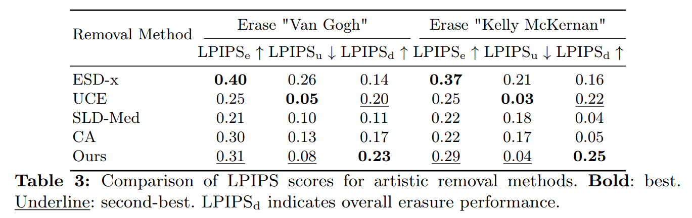

- LPIPS 는 image patch 간 perceptual distance 를 평가하며, 값이 높을수록 차이가 크고, 낮을수록 유사성을 나타낸다. 
- LPIPS$_e$ 는 erased artist 에 대해 계산되며, high value LPIPS$_e$ 는 더 효과적인 style removal 을 나타낸다. ESD 와 저자의 method 는 target style 을 성공적으로 지운다. 
- LPIPS$_u$ 는 unerased artist 에 대해 계산되며, low LPIPS$_u$ 는 unrelated artist 에 미치는 영향이 적음을 나타낸다. 여기서 저자의 method 와 UCE 는 unrelated concept 을 효과적으로 유지한다. 
- 전체 effectiveness 는 LPIPS$_d = \text{LPIPS}_e - \text{LPIPS}_u$ 로 계산되며, 저자의 method 가 이 점에서 가장 우수하다. Qualitative result 는 Appendix 에서 확인할 수 있다.

## 4.3 Robustness Against Red-teaming Tools

#### Experimental Setup

다양한 attack method 에 대한 저자의 RECE 의 robustness 를 입증하기 위해 white-box method 인 P4D 와 UnlearnDiff, black-box method 인 Ring-A-Bell 같은 red-teaming tool 을 사용한다. original code 가 아직 open-source 되지 않았으므로, 저자는 reproduced Ring-A-Bell method 와 UnlearnDiff 에서 reproduced P4D method 를 모든 baseline 에 사용한다. nudity removal 의 경우 UnlearnDiff 를 따라, I2P 에서 선택된 143 개 prompts 를 사용하며, nudity score (NudeNet) 가 0.75 이상이고 부적절한 contents 를 detection 하기 위해 Nudenet detector 의 threshold 0.45 를 설정한다.

#### Results

attack success rate (ASR, %) 는 Tab. 4 에 요약되어 있다.

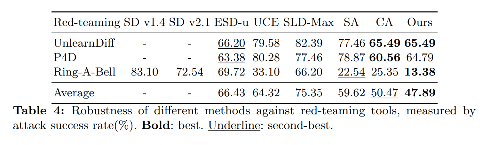

- 저자의 method 는 평균적으로 최고의 robustness 를 달성한다. black-box attack 인 Ring-A-Bell 의 경우, 저자의 method 는 13.38% 로 가장 낮은 ASR 을 달성하며 다른 method 들을 크게 앞선다.
- white-box attack 의 경우, CA 가 최고의 performance 를 달성하지만, 저자의 method 는 최고 또는 두 번째로 가까운 성능을 보인다. 
- SA 는 black-box 결과에서 괜찮은 성능을 보이지만, 5000 개의 준비된 image 를 생성하는 데 상당한 computational resource 를 소모한다. 
- CA 는 U-Net parameter 의 100% 를 수정하지만, 저자의 method 는 K&V projection matrix 만 수정하며, 이는 U-Net 의 단 2.23% 에 불과하다. 
- UCE 도 2.23% parameter 만 수정하지만, 저자의 method 는 UCE 를 크게 앞선다. 이는 Eq. (8) 에서 도출된 embedding 덕분이다.

artistic style removal 의 경우, Fig. 4 에 qualitative example 을 제공한다.

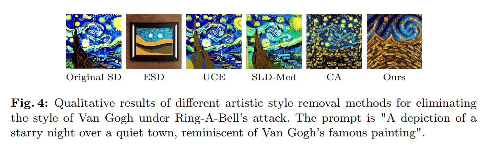

- 첫 번째 image 는 attack 없이 original SD v1.4 로 생성된 것이고, 이후 image 들은 Ring-A-Bell 의 attack 하에서 생성되었다. 
- Tab. 3 에서 보듯 UCE 는 artistic style removal 에서 두 번째로 좋은 method 이지만, red-teaming tool 에 대한 robustness 에서는 부족하다. 
- 저자의 method 는 UCE 와 마찬가지로 closed-form solution 을 사용하지만, robustness 에서 UCE 를 앞선다. 
- ESD, CA, 저자의 method 는 비슷하게 좋은 성능을 보인다. 추가 결과는 appendix 에서 확인할 수 있다.

## 4.4 Model Editing Duration

다양한 method 의 efficiency 를 입증하기 위해, 각 method 에 대해 RTX 3090 에서 parameter modification percentage 와 editing duration 을 측정했다 (Tab. 5). 

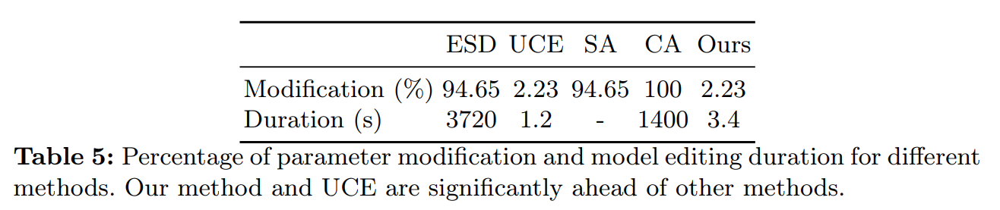

SLD 는 model weight 를 수정하지 않고 inference time 에 작동하므로 분석에서 제외했으며, 이는 open-source 조건에서 쉽게 우회될 수 있다. 또한 SA 의 duration 은 포함하지 않았는데, 이는 5000 개 image 생성, Fisher Information Matrix 계산, fine-tuning 을 포함해 매우 느리다.

Tab. 5 와 Tab. 1 을 기반으로, 저자의 method 는 단 3초 만에 최고의 concept erasure 효과를 달성한다. 저자의 method 와 UCE 는 closed-form solution 으로 가장 적은 percentage 의 parameter 를 수정해 가장 짧은 editing duration 을 기록한다. 비슷한 duration 임에도 저자의 method 는 removal effectiveness 에서 UCE 를 크게 앞선다. 반면, CA, ESD, SA 는 더 많은 parameter 를 수정하고 더 많은 시간을 소모하지만, removal result 는 덜 인상적이다.

## 4.5 Ablation Study

derived embedding 의 epoch 간 영향과 regularization term 의 효과를 밝히기 위해 실험을 수행했다.

#### Effect of Derived Embeddings among Epochs

derived embedding 의 영향을 설명하기 위해 실험을 진행했다. Algorithm 1 을 사용해 5 epoch 동안 "nudity" erasure 를 수행한다. 각 epoch 에서 "nudity" 를 나타내는 고유한 embedding 을 도출한다. 

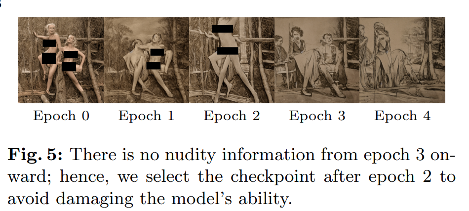

각 epoch 의 erasure 전에 embedding 을 사용해 image 를 생성하여 nudity 정보의 정도를 테스트했다 (Fig. 5). 

- epoch 0 에서 epoch 2 까지의 image 는 nude body part 를 포함하며, 이는 derived embedding 이 model 내 잠재적 nudity 정보 를 성공적으로 드러냄을 나타낸다. 
- 특히 epoch 3 에서 epoch 4 까지의 image 는 nudity 정보가 없으므로 epoch 2 이후 checkpoint 를 선택했다. 
- 실제로 epoch 3-4 에서 이러한 "not so nude" embedding 을 지우는 것은 model 의 정상 generation ability 를 손상시키는 가치 없는 trade-off 다.

#### Effect of Regularization Coefficient

regularization term 의 영향을 평가하기 위해 실험을 진행했다. 구체적으로, Eq. (4) 에서 regularization coefficient $\lambda$ 를 $[0, 1]$ 구간을 5개로 나눠 선택했다. 

결과는 Fig. 6 에서 COCO-30k validation subset 에 대한 CLIP-score 와 LPIPS 를 포함한다. 

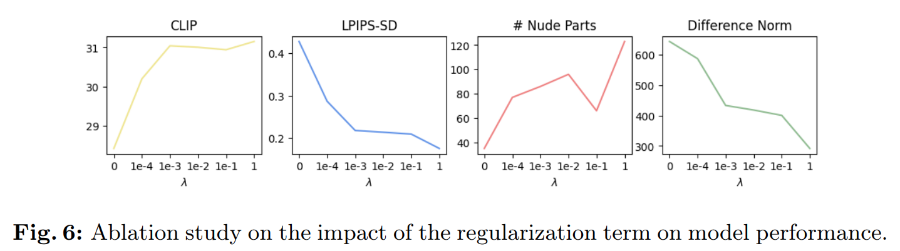

- $\lambda$ 가 증가함에 따라 CLIP-score 는 상승 추세를 보이고, LPIPS 와 new/old parameter 간 차이는 하락 추세를 보인다. 
- 이는 regularization term 이 unerased content 에 대한 model 의 ability 를 보존하는 역할을 나타낸다. 또한 I2P benchmark 에서 nude part 수를 기록했다 (Fig. 6 의 세 번째 column). 
- 하지만 nude part 수는 $\lambda$ 가 증가함에 따라 엄격히 증가하지 않으며, 이는 직관에 반한다. Eq. (6) 의 regularization term 의 목적은 model 의 generation capability 를 보존하는 것이지만, 이 capability 를 유지한다고 해서 항상 erasure effect 에 영향을 미치지는 않는다.

# 5 Conclusion

저자는 Text-to-Image (T2I) diffusion model 에서 특정 concept 을 안정적이고 효율적으로 지우는 새로운 접근법을 제안한다. 

이 접근법은 U-Net 의 cross-attention K&V matrix 만 수정하며, 이는 parameter 의 단 2.23% 에 불과하다. 이전 method 들도 cross-attention module 을 edit 했지만, 여전히 부적절한 image 를 생성할 수 있었다. 

이 문제를 해결하기 위해, 저자는 unlearned model 내에서 target concept 을 나타낼 수 있는 새로운 embedding 을 도출하고 지운다. unrelated concept 에 미치는 영향을 완화하기 위해 erasure process 중 regularization term 을 도입한다. 위의 모든 technique 은 closed-form 으로 구성되어 빠른 editing 을 가능하게 한다. 

이는 여러 epoch 에 걸쳐 "derive-erase" 를 실행하여 철저하고 robust 한 erasure 를 보장한다. 광범위한 실험은 artistic style, unsafe content, object class erasure 에서 저자의 접근법의 효과를 검증한다. 또한 editing duration 을 기록해 저자의 method 의 efficiency 를 강조하고, red-teaming tool 에 대한 robustness 를 평가했다. 저자는 RECE 가 T2I provider 가 원치 않는 concept 을 효과적으로 제거하도록 돕고, 더 안전한 AI community 의 발전을 촉진할 잠재력을 가진다고 믿는다.