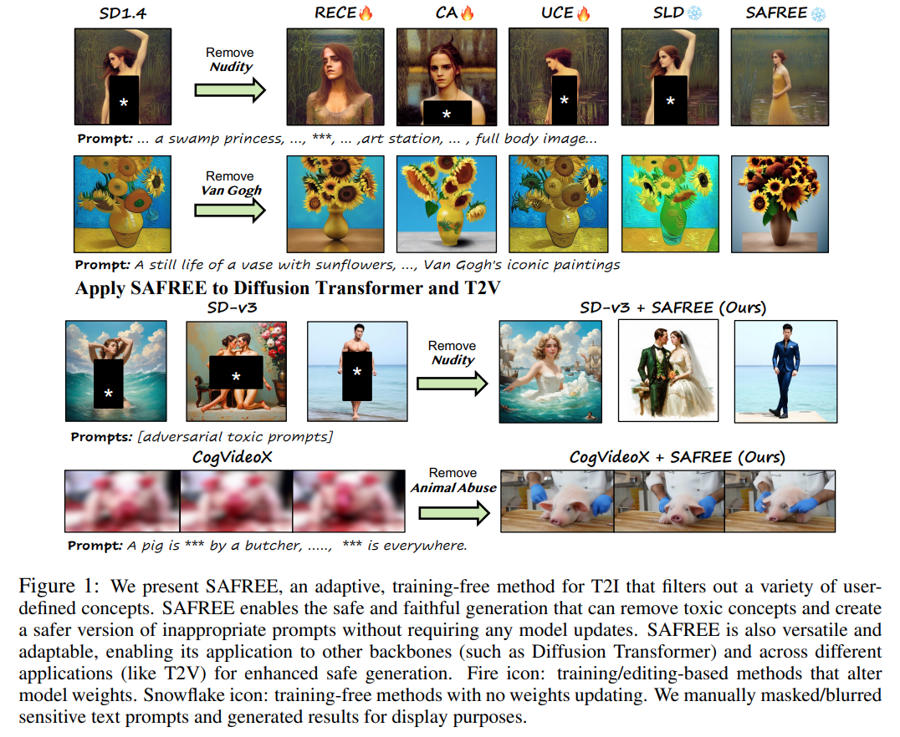
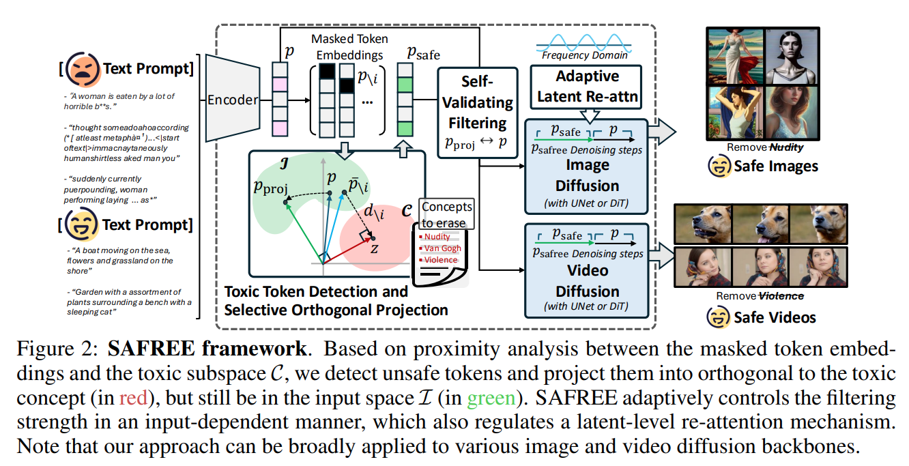
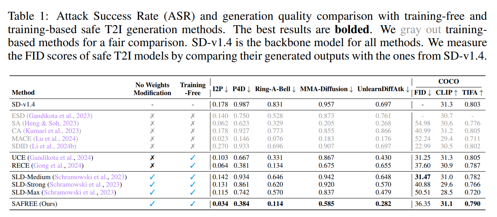
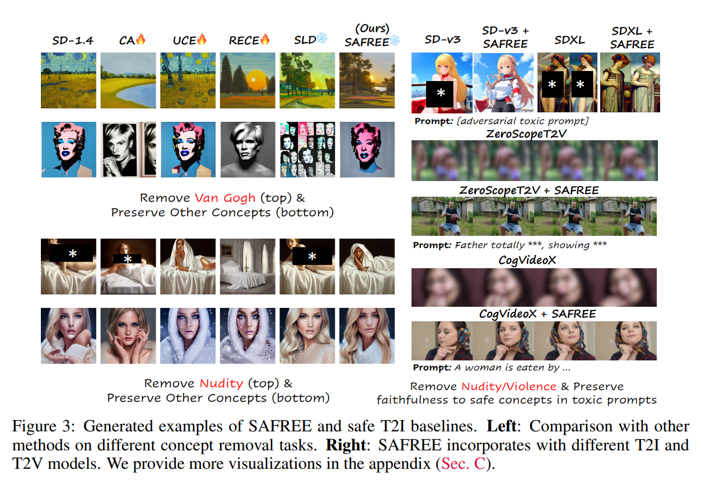
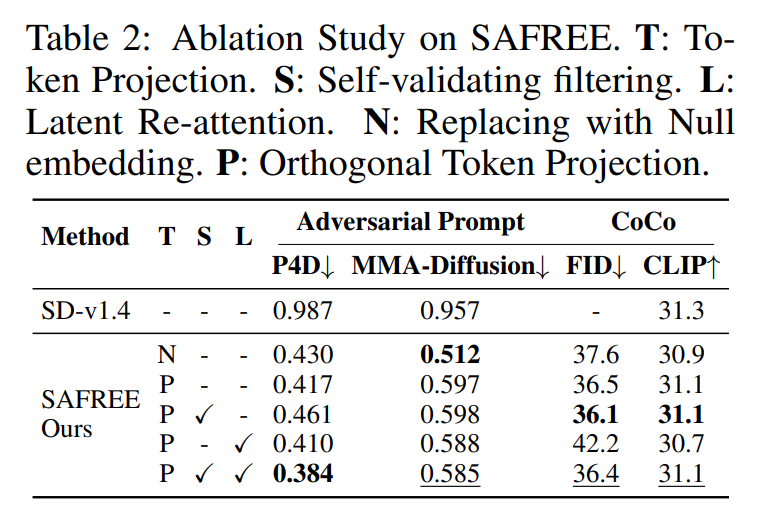
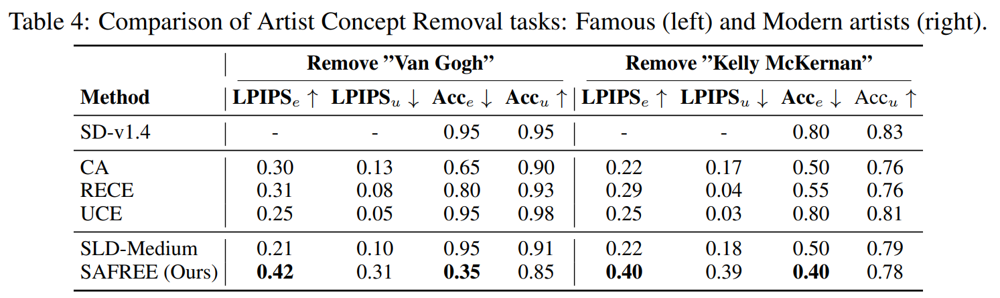
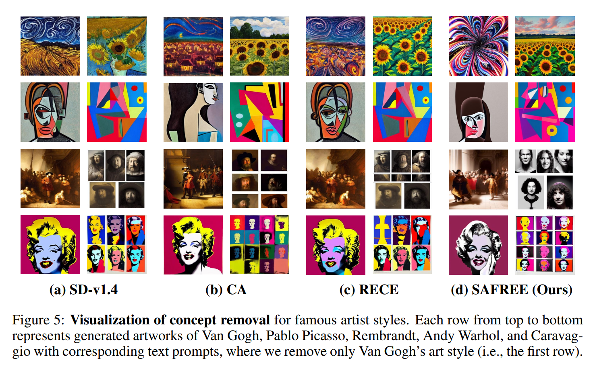
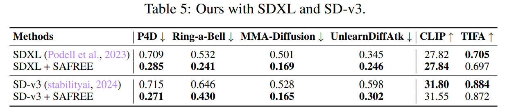
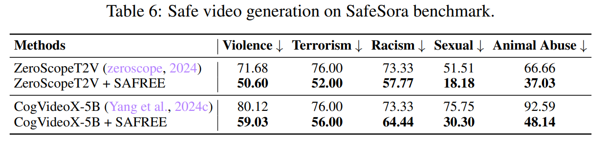

논문 및 이미지 출처 : <https://arxiv.org/pdf/2410.12761>

# Abstract

최근 Generative AI 의 발전으로 text-to-image (T2I) 와 text-to-video (T2V) generation 이 엄청난 잠재력을 보여주고 있지만, 부적절하거나 유해한 콘텐츠를 생성할 가능성 때문에 안전성 문제가 대두되고 있다. 기존의 safety mechanism 은 주로 model weights 를 수정하거나 재학습하는 방식에 의존했는데, 이는 계산 비용이 많이 들고 output quality 를 떨어뜨릴 수 있다. 이 논문에선 **SAFREE** 라는 새로운 training-free 방법론을 제안한다. 

- 이는 adaptive 하게 user-defined concepts 를 필터링해서 T2I 와 T2V generation 을 안전하고 충실하게 만들어준다. 
- SAFREE 는 text embedding space 와 visual latent space 에서 unsafe concepts 를 식별하고 제거하며, novel self-validating filtering mechanism 과 adaptive re-attention mechanism 을 활용해서 output 의 fidelity 와 quality 를 유지한다. 
- 실험적으로 SAFREE 는 5 datasets 에서 unsafe content 를 **22%** 줄이며 training-free 방법들 중 SOTA performance 를 달성했고, training-based 방법들과도 경쟁력 있는 결과를 보여준다. 
- SAFREE 는 다양한 T2I 와 T2V backbone 에 쉽게 적용될 수 있어서 flexibility 와 generalization 이 뛰어나다. 

# 1 Introduction

Generative AI 의 최근 발전은 text, code, audio, image, video generation 같은 다양한 modality 에 큰 영향을 미쳤다. DALL·E 3, Midjourney, Sora, KLING 같은 generation tool 들은 digital art, AR/VR, educational content creation 등 다양한 application 에서 큰 성장을 이뤘다. 하지만 이 tool 이나 model 들은 bias, discrimination, sex, violence 같은 unsafe concept 를 포함한 content 를 생성할 위험도 있다. 게다가 "unsafe content" 의 정의는 societal perception 에 따라 다르다. 예를 들어, Post-Traumatic Stress Disorder (PTSD) 를 가진 사람은 skyscraper 나 deep-sea scene 같은 특정 이미지를 distressing 하게 느낄 수 있다. 이는 individual sensitivity 를 고려하면서 generative AI 의 safety 를 높일 수 있는 adaptable 하고 flexible 한 solution 이 필요하다는 걸 보여준다.

이런 challenge 를 해결하기 위해 최근 연구들은 diffusion model 에 safety mechanism 을 도입했다. Unlearning method 들은 harmful concept 을 제거하기 위해 model 을 fine-tune 하지만, adaptability 가 부족하고 상당한 training resource 가 필요해 실용적이지 않다. Model editing method 들은 safety 를 높이기 위해 model weight 를 수정하지만, output quality 를 떨어뜨리고 consistent model behavior 를 유지하기 어렵다. Promising 한 대안은 training-free, filtering-based method 로, model 의 original capability 를 바꾸지 않고 input prompt 에서 unsafe concept 를 걸러낸다. 하지만 기존 training-free, filtering-based method 는 두 가지 큰 challenge 에 부딪힌다: 

- Implicit 하거나 indirect 한 unsafe content trigger 를 효과적으로 막지 못한다.
- Hard filtering 을 적용한 prompt 는 distribution shift 를 일으켜, model weight 를 수정하지 않아도 quality degradation 이 생긴다. 

따라서 다양한 context 에서 safe visual generation 을 보장할 efficient 하고 adaptable 한 mechanism 이 시급하다.

이 논문은 SAFREE 를 소개한다. 

- 이는 diffusion-based generative model 에서 well-trained model weight 를 바꾸지 않고 safe generation 을 보장하는 training-free, adaptive plug-and-play mechanism 이다. 
- SAFREE 는 textual prompt embedding 과 visual latent space 에서 unsafe concept filtering 을 사용해 safe visual content generation 의 fidelity, quality, efficiency 를 높인다. 
- 구체적으로, SAFREE 는 unsafe keyword 의 column vector 를 concatenate 해서 input text embedding space 안에서 undesirable concept 에 해당하는 unsafe concept subspace 를 먼저 식별한다. 그리고 각 input prompt token 이 unsafe/toxic subspace 와 얼마나 가까운지 측정하기 위해 prompt 에서 각 token 을 mask 하고 masked prompt embedding 의 projected distance 를 계산한다. 
- 이 proximity 를 바탕으로 SAFREE 는 prompt embedding 을 unsafe subspace 로 이끄는 token 을 걸러낸다. 
- Unsafe token 을 직접 제거하거나 대체하면 input prompt 의 coherence 가 깨지고 generation quality 가 떨어질 수 있으므로, SAFREE 는 identified unsafe token 을 unsafe concept subspace 와 orthogonal 한 공간으로 효율적으로 projection 하면서 original input embedding space 를 유지한다. 
  - 이런 **orthogonal projection** design 은 original prompt 의 overall integrity 와 safe content 를 보존하면서 embedding space 에서 harmful content 를 걸러낸다. 
- Toxicity 를 걸러내고 safe concept 를 보존하는 trade-off 를 balance 하기 위해 (Fig. 1 에 예시 있음), SAFREE 는 novel **self-validating filtering scheme** 을 도입한다. 
  - 이는 filtered embedding 을 적용하는 denoising step 수를 동적으로 조절해 필요할 때만 undesirable prompt 를 억제한다.
- 또한, unsafe content 는 보통 regional pixel level 에서 나타난다는 관찰을 바탕으로, SAFREE 는 diffusion latent space 안에서 novel **adaptive latent re-attention** mechanism 을 사용해 pixel space 로 filtering 을 확장한다. 
  - 이는 detected unsafe prompt 와 관련된 frequency domain 의 feature 영향을 선택적으로 줄여, undesirable content 에 주목하지 않고 desirable output 을 보장한다. 
- 결국, SAFREE 는 embedding 과 diffusion latent space 에서 동시에 unsafe content 를 걸러낸다. 이 approach 는 extra training 이나 model weight 수정 없이 다양한 unsafe concept 를 효율적으로 처리하는 flexible 하고 adaptive 한 safe T2I/T2V generation 을 보장하며, safe output 의 quality 를 보존한다.

Empirically, SAFREE 는 I2P, P4D, Ring-A-Bell, MMA-Diffusion, UnlearnDiff 같은 5 popular T2I benchmarks 에서 SOTA performance 를 달성한다. 다른 training-free safeguard method 에 비해 better efficiency, lower resource 사용, better inference-time adaptability 를 보여준다. SAFREE 를 SDXL, SD-v3 같은 다양한 T2I diffusion backbone 과 ZeroScopeT2V, CogVideoX 같은 T2V model 에 적용해, SAFREE 의 strong generalization 과 flexibility 를 입증했다. 이는 다른 model 과 task 에서 unsafe concept output 을 효과적으로 관리한다. Generative AI 가 발전함에 따라, SAFREE 는 image 와 video synthesis 같은 application 에서 ethical practice 를 촉진하며 AI community 의 요구를 충족하는 강력한 safety baseline 을 세운다.

- SAFREE 를 제안한다. 이는 T2I 와 T2V generation 을 위한 강력하고 adaptive 하며 training-free safeguard 이다. Textual embedding 과 visual latent space 에서 unsafe concept 를 conceptual proximity analysis 로 함께 걸러내 더 reliable 하고 responsible 한 visual content creation 을 보장한다.
- SAFREE 는 visual generation 에서 concept removal 에 대해 training-free method 중 SOTA performance 를 달성하며 desirable concept 에 대해 high-quality output 을 유지한다. Training-based method 와 비교해도 competitive 한 결과를 보이며 better visual quality 를 유지한다.
- SAFREE 는 다양한 visual diffusion model architecture 와 application 에서 효과적으로 작동하며 강력한 generalization 과 flexibility 를 보여준다.

# 2 Related Work

## 2.1 T2I Attacks

최근 연구들은 generative model 의 취약점을 다루고 있다. 

LLMs, VLMs, T2I model 들이 포함된다. Cross-modality jailbreaks 는 adversarial images 와 prompts 를 짝지어 VLM 을 방해하며, language model 에 접근하지 않아도 된다. 

Ring-A-Bell 같은 tool 이나 automated frameworks 는 model-agnostic red-teaming 과 adversarial prompt generation 을 통해 safety flaws 를 드러낸다. Text embeddings 와 multimodal inputs 를 활용해 safeguards 를 우회하는 방법들도 있다. 이런 연구들은 T2I model 의 취약점을 보여준다.

## 2.2 Safe T2I Gneration

#### Training-based

Training-based approaches 는 unsafe elements 를 제거하거나 negative guidance 를 사용해서 안전한 T2I generation 을 보장한다. 

- Adversarial training frameworks 는 harmful text embeddings 를 neutralizes 하고, concept removal 이나 preference optimization 을 통해 harmful representations 를 필터링한다. 
- Cross-attention refinement 나 continual learning 같은 fine-tuning methods 도 부적절한 콘텐츠를 제거한다. 
- Latent space manipulation 은 self-supervised learning 을 사용해 safety 를 높인다. 

이런 방법들은 효과적이지만 extensive fine-tuning 이 필요하고, image quality 를 떨어뜨리며 inference-time adaptation 이 부족하다. SAFREE 는 training-free 이고, concepts 에 dynamically adapt 하며, filtering strength 를 조절해서 model weights 를 수정하지 않고 efficient safety 를 제공한다.

#### Training-free

Training-free methods 는 model behavior 를 retraining 없이 조정한다. 여기엔 두 가지가 있다:

1. **Closed-form weight editing**: Model projection editing 이나 target embedding methods 는 harmful content 를 제거하면서 generative capacity 를 유지한다. Diffusion model 에 최소한의 parameter updates 를 적용하는 방법도 있다.
2. **Non-weight editing**: Safe Latent Diffusion 은 classifier-free guidance 를 사용하고, prompt refinement framework 도 있다.

하지만 이런 방법들은 robustness 와 test-time adaptation 이 부족하다. SAFREE 는 prompts 에 따라 filtering 을 dynamically 조정하고, 다른 architectures 와 video tasks 에도 확장 가능하며, weight edits 없이 scalability 와 efficiency 를 개선한다.

# 3 SAFREE: Training-free and Adaptive Guard for Safe Text-to-Image and Video Generation

SAFREE 는 safe T2I 와 T2V generation 을 위한 training-free, adaptive remedy 를 제안한다 (Fig. 2). 

먼저 masked input prompt embeddings 와 toxic concept subspace 간의 proximity 를 기반으로 toxicity 를 유발할 수 있는 trigger tokens 를 식별한다 (Sec. 3.1). 

감지된 trigger token embeddings 는 toxic concept subspace 에 orthogonal 한 subspace 로 projection 되며, input space 안에 유지된다 (Sec. 3.2). 

SAFREE 는 self-validating filtering mechanism 을 통해 text inputs 에 따라 denoising timesteps 수를 자동으로 조정한다 (Sec. 3.3). 

또한 denoising process 중 latent space 에서 adaptive re-attention strategy 를 도입해서 text 와 visual embedding space 에서 robust joint filtering mechanism 을 만든다 (Sec. 3.4). 

마지막으로 SAFREE 를 SDXL, DiT-based image diffusion (SD-v3), ZeroScopeT2V, CogVideoX 같은 high-resolution model 과 T2V generative model 에 확장한다 (Sec. 3.5).

## 3.1 Adaptive Token Selection based on Toxic Concept Subspace Proximity

Gaussian distribution 에서 샘플링한 random noise $\epsilon_0 \sim \mathcal{N}(0, \boldsymbol{I})$ 는 부적절한 semantics 가 text 에 포함되어 있으면 unsafe 이나 undesirable images 를 생성할 수 있다. 이를 줄이기 위해 negative prompts 를 사용하는 방법이 효과적이다. Diffusion model 의 denoising process 는 classifier-free guidance approach 를 따라 timestep $t$ 에서 parameter $\boldsymbol{\theta}$ 로 정의된다:

$$
\begin{equation}
    \epsilon_t = (1 + \omega) \epsilon_\theta(z_1, p) - \omega \epsilon_\theta(z_1, \emptyset),
\end{equation}
$$

- 여기서 $\omega$ 는 guidance scale 을 조절하는 hyperparameter 이다. 
- $\boldsymbol{p}$ 와 $\emptyset$ 는 input prompt 와 null text 의 embedding 을 나타낸다. 
- Negative prompt 는 $\emptyset$ 를 negative prompt embedding 으로 대체해서 적용된다. 
- Adversarial prompts 가 human-readable 하지 않아도 CLIP 같은 text embedding space 에서 encode 된다는 점을 고려하면, feature embedding level 에서 unsafe concepts 를 식별하는 게 중요하다. 
- 이를 위해 SAFREE 는 부적절한 image generation 을 유발하는 token embeddings 를 감지하고, toxic concept subspace $\mathcal{C} = [\boldsymbol{c}_0 ; \boldsymbol{c}_1 ; \ldots ; \boldsymbol{c}_{K-1}] \in \mathbb{R}^{D \times K}$ 에서 멀리 떨어지도록 변환한다. 
- 여기서 각 column vector $\boldsymbol{c}_k$ 는 $k$-번째 user-defined toxic concept #### Detecting Trigger Tokens Driving Toxic Outputs

Input prompt 의 specific token 이 toxic concept subspace 와 얼마나 관련 있는지 평가하기 위해, $i$-th token 을 mask 하고 token embeddings 의 평균을 내는 pooled input embedding $\overline{\boldsymbol{p}}_{\backslash i} \in \mathbb{R}^D$ 를 설계한다. $\overline{\boldsymbol{p}}_{\backslash i}$ 를 $\mathcal{C}$ 에 projection 한 coefficients vector $\boldsymbol{z} \in \mathbb{R}^K$ 는 다음을 만족한다:

$$
\begin{equation}
    \mathcal{C}^{\top} (\overline{\boldsymbol{p}}_{\backslash i} - z \mathcal{C}) = 0, \quad \boldsymbol{z} = (\mathcal{C}^{\top} \mathcal{C})^{-1} \mathcal{C}^{\top} \overline{\boldsymbol{p}}_{\backslash i}.
\end{equation}
$$

Conceptual proximity 는 해당 token 을 mask (i.e. removing) 한 pooled text embedding 과 $\mathcal{C}$ 간의 distance 를 계산해서 측정한다. Subspace $\mathcal{C}$ 에 orthogonal 한 residual vector $\boldsymbol{d}_{\backslash i}$ 는 다음과 같이 정의된다:

$$
\begin{equation}
    \begin{aligned}
        \boldsymbol{d}_{\backslash i} = \overline{\boldsymbol{p}}_{\backslash i} - \mathcal{C} \boldsymbol{z} &= \left( \boldsymbol{I} - \mathcal{C} (\mathcal{C}^{\top} \mathcal{C})^{-1} \mathcal{C}^{\top} \right) \overline{\boldsymbol{p}}_{\backslash i} \\
        &= \left( \boldsymbol{I} - \boldsymbol{P}_{\mathcal{C}} \right) \overline{\boldsymbol{p}}_{\backslash i}, \quad \text{where } \boldsymbol{P}_{\mathcal{C}} = \mathcal{C} (\mathcal{C}^{\top} \mathcal{C})^{-1} \mathcal{C}^{\top},
    \end{aligned}
\end{equation}
$$

- 여기서 $\boldsymbol{I} \in \mathbb{R}^{D \times D}$ 는 identity matrix 이다 (Fig. 2 middle left). 
- Residual vector distance 가 길수록 제거된 token 이 제거하려는 concept 과 더 강하게 연관되어 있음을 나타낸다. 
- 최종적으로 masked vector $\boldsymbol{m} \in \mathbb{R}^N$ ($N$ 은 token length) 를 만들어 target concept 과 관련된 token 을 식별하고, 이를 input token subspace 내에서 subtle 하게 projection 하면서 toxic concept subspace 와 멀리 떨어지도록 한다. 

Masked token embeddings $\overline{\boldsymbol{p}}_{\backslash i}, i \in [0, N-1]$ 와 concept subspace 간의 distance set $D(\boldsymbol{p} \mid \mathcal{C})$ 를 구하고, 각 token 의 distance 와 그 token 을 제외한 평균 distance 간의 차이를 평가해서 masking 할 token 을 선택한다:

$$
\begin{equation}
    \begin{aligned}
        D(\boldsymbol{p} \mid \mathcal{C}) &= \left[ \|\boldsymbol{d}_{\backslash 0}\|_2, \|\boldsymbol{d}_{\backslash 1}\|_2, \ldots, \|\boldsymbol{d}_{\backslash N-1}\|_2 \right], \\
        m_i &= \begin{cases} 
        1 & \text{if } \|\boldsymbol{d}_{\backslash i}\|_2 > (1 + \alpha) \cdot \text{mean}(D(\boldsymbol{p} \mid \mathcal{C}).\text{delete}(i)), \\
        0 & \text{otherwise},
        \end{cases}
    \end{aligned}
\end{equation}
$$

- 여기서 $\alpha$ 는 concept-relevant tokens 를 감지하는 sensitivity 를 조절하는 non-negative hyperparameter 이다. 
- $X$.delete($i$) 는 $i$-th item 을 제거한 list $X$ 를 생성하는 operation 이다.
- 이 논문에선 모든 실험에서 $\alpha = 0.01$ 로 설정했으며, 다양한 T2I generation tasks 에서 $\alpha$ 에 대한 robustness 를 보여준다. 
- 감지된 token embedding ($m_i = 1$) 은 safer embedding space 로 projection 된다 (Sec. 3.2).

## 3.2 Safe Generation via Concept Orthogonal Token Projection

Toxic concept token 들을 safer space 로 projection 해서 model 이 적절한 이미지를 생성하도록 유도하고 싶다. 하지만 이런 token 들을 그냥 제거하거나 random token 이나 null embedding 으로 바꾸면 단어와 문장 간의 coherence 가 깨져서, 특히 toxic concept 와 상관없는 prompt 일 때 생성된 이미지의 quality 가 떨어진다. 

이를 해결하기 위해, detected token embedding 들을 toxic concept subspace 와 orthogonal 한 공간으로 projection 하면서 original input space 안에 유지되도록 한다. 이렇게 하면 original prompt 의 integrity 와 safe content 를 최대한 보존하면서 harmful content 를 embedding space 에서 걸러낼 수 있다. 

먼저 Sec. 3.1 에서 설명한 masked prompt 에서 나온 pooled embedding 을 사용해 input space $\mathcal{I}$ 를 정의한다: $\mathcal{I} = [\overline{\boldsymbol{p}}_{\backslash 0} ; \overline{\boldsymbol{p}}_{\backslash 1} ; \ldots ; \overline{\boldsymbol{p}}_{\backslash N-1}] \in \mathbb{R}^{D \times N}$. 

Input space $\mathcal{I}$ 로의 projection matrix 는 다음처럼 정의된다: $\boldsymbol{P}_{\mathcal{I}} = \mathcal{I} (\mathcal{I}^{\top} \mathcal{I})^{-1} \mathcal{I}^{\top}$ (Eq. (3) 에서 유도). 

이를 바탕으로 token mask 를 사용해 input token embedding 을 선택적으로 detoxification 한다. 즉, token 을 $\boldsymbol{P}_{\mathcal{I}}$ 로 projection 하면서 $\boldsymbol{P}_{\mathcal{C}}$ 와 orthogonal 하도록 만든다:

$$
\begin{equation}
    \begin{aligned}
        \boldsymbol{p}_{\text{proj}} &= \boldsymbol{P}_{\mathcal{I}} (\boldsymbol{I} - \boldsymbol{P}_{\mathcal{C}}) \boldsymbol{p}, \\
        \boldsymbol{p}_{\text{safe}} &= \boldsymbol{m} \odot \boldsymbol{p}_{\text{proj}} + (\mathbf{1} - \boldsymbol{m}) \odot \boldsymbol{p},
    \end{aligned}
\end{equation}
$$

여기서 $\odot$ 는 element-wise multiplication operator 를 뜻한다. 즉, $i$-th token 에 대해, toxic token ($m_i \odot \boldsymbol{p}_{\text{proj},i}, m_i = 1$) 으로 감지된 경우에는 projected safe embedding $\boldsymbol{p}_{\text{proj}, i}$ 를 사용하고, 그렇지 않은 경우 ($(1-m_i) \odot \boldsymbol{p}_i,  m_i = 0$) 에는 original (safe) token embedding $\boldsymbol{p}_i$ 를 유지한다.

## 3.3 Adaptive Control of Safeguard Strengths with Self-Validating Filtering

지금까지의 접근법은 update 할 token embedding 의 수를 adaptive 하게 조절하지만, target concept 와 상관없는 content 에 대해 original generation capability 를 유지하는 데 flexibility 가 부족할 때가 있다. 최근 관찰에 따르면 T2I model 에서 denoising timestep 마다 toxic 이나 undesirable content 를 생성하는 데 기여하는 정도가 다르다. 이를 바탕으로, denoising step 동안 **self-validating filtering mechanism** 을 제안한다. 

이는 input prompt 가 undesirable 할 때 model 의 filtering capability 를 강화하고, safe content 에 대해서는 original backbone model 의 generation 을 최대한 유지한다. 최종적으로, 다른 denoising step $t$ 에서의 updated input text embedding $\boldsymbol{p}_{\text{safree}}$ 는 다음과 같이 결정된다:

$$
\begin{equation}
    t' = \gamma \cdot \operatorname{sigmoid}(1 - \cos(\boldsymbol{p}, \boldsymbol{p}_{\text{proj}})), \quad \boldsymbol{p}_{\text{safree}} = \begin{cases} \boldsymbol{p}_{\text{safe}} & \text{if } t \leq \operatorname{round}(t'), \\ \boldsymbol{p} & \text{otherwise}, \end{cases}
\end{equation}
$$

- 여기서 $\gamma$ 는 hyperparameter (논문 전체에서 $\gamma = 10$ 사용) 이고, 
- $\cos$ 는 cosine similarity 를 뜻한다. 
- $t'$ 는 proposed safeguard approach 를 적용할 denoising step 의 수를 결정하는 self-validating threshold 를 나타낸다. 
- 구체적으로, original input embedding $\boldsymbol{p}$ 와 projected embedding $\boldsymbol{p}_{\text{proj}}$ 간의 cosine distance 를 사용해 $t'$ 를 계산한다. 
- Similarity 가 높을수록 input prompt 가 제거하려는 toxic target concept 와 효과적으로 disentangle 되었다는 뜻이다.

## 3.4 Adaptive Latent Re-Attention in Fourier Domain

최근 문헌에 따르면 Gaussian distribution 에서 샘플링한 initial noise 가 diffusion model 에서 T2I generation 의 fidelity 에 큰 영향을 미친다. 이를 이용해 inappropriate 나 target concept semantics 의 출현을 억제하면서 content 생성을 가이드하기 위해, denoising process 동안 novel visual latent filtering strategy 를 제안한다. 

현재 T2I model 은 denoising process 에서 texture 가 oversmoothing 되는 경우가 많아 생성된 이미지에 distortion 이 생긴다. 이를 바탕으로, Fourier domain 에서 spectral transformation 을 사용한 adaptive re-weighting strategy 를 제안한다. 

각 timestep 에서, 먼저 initial prompt $\boldsymbol{p}$ (unsafe guidance 를 포함할 수 있음) 와 filtered prompt embedding $\boldsymbol{p}_{\text{safree}}$ 에 conditioned 된 latent feature 에 대해 Fourier transform 을 수행한다. Low-frequency component 는 보통 이미지의 global structure 와 attribute (context, style, color 등) 를 캡처한다. 이 context 에서, filtered prompt embedding 에 의해 강조되는 low-frequency feature 의 영향을 줄이고, original prompt 와 더 밀접하게 align 된 visual region 을 보존해 excessive oversmoothing 을 피한다. 

Latent feature 를 $h(\cdot)$ 라 하면, $\boldsymbol{p}$ 에서 나온 low-frequency feature 가 $h(\boldsymbol{p}_{\text{safree}})$ 에서 나온 것보다 magnitude 가 작을 때 scalar $s$ 로 저감시킨다:

$$
\begin{equation}
    \mathcal{F}(\boldsymbol{p}) = \boldsymbol{b} \odot \operatorname{FFT}(h(\boldsymbol{p})), \quad \mathcal{F}(\boldsymbol{p}_{\text{safree}}) = \boldsymbol{b} \odot \operatorname{FFT}(h(\boldsymbol{p}_{\text{safree}})),
\end{equation}
$$

$$
\begin{equation}
    \mathcal{F}_i' = \begin{cases} s \cdot \mathcal{F}(\boldsymbol{p}_{\text{safree}})_i & \text{if } \mathcal{F}(\boldsymbol{p}_{\text{safree}})_i > \mathcal{F}(\boldsymbol{p})_i, \\ \mathcal{F}(\boldsymbol{p}_{\text{safree}})_i & \text{otherwise}, \end{cases}
\end{equation}
$$

- 여기서 $s < 1$ 이고, 
- $\boldsymbol{b}$ 는 low-frequency component 에 해당하는 binary mask (width 와 height dimension 의 middle 부분) 를 나타낸다. 
- $\operatorname{FFT}$ 는 Fast Fourier Transform operation 이다. 
- 먼저 Eq. (7) 에서 $\boldsymbol{p}$ 와 $\boldsymbol{p}_{\text{safree}}$ 에서 low-frequency feature 를 얻는다. 이를 통해 safe visual component 에서 oversmoothing 효과를 줄이고, inappropriate content 를 강조하지 않으면서 safe output 생성을 촉진한다. 
  - 이 과정은 inverse FFT 를 통해 refined feature $h' = \operatorname{IFFT}(\mathcal{F}')$ 를 얻음으로써 가능하다 (Eq. (8)). 
  - 이 equation 은 $t > \operatorname{round}(t')$ 일 때 원래 feature 에 영향을 주지 않는다. 왜냐하면 $\mathcal{F}(\boldsymbol{p}_{\text{safree}})_i == \mathcal{F}(\boldsymbol{p})_i$ 이므로, self-validated filtering 을 통해 filtering capability 를 자동으로 조절할 수 있다.

## 3.5 SAFREE for Advanced T2I Models and Text-to-Video Generation

기존 unlearning-based method 들은 특정 specific model 이나 task 에 국한되지만, SAFREE 는 architecture agnostic 하며 model modification 없이 다양한 backbone model 에 통합될 수 있어 safe generation 에서 뛰어난 versatility 를 제공한다. 이는 concept-orthogonal, selective token projection 과 self-validating adaptive filtering 덕분에 가능하다. 

SAFREE 는 SD v-1.4 를 넘어 SDXL, SD-v3 같은 model 에서 zero-shot, training-free 방식으로 seamless 하게 작동하며, ZeroScopeT2V, CogVideoX 같은 T2V generation model 에도 적용 가능하다. 이를 통해 plug-and-play module 시리즈로 높은 flexibility 를 제공한다. 다양한 model backbone (UNet, DiT) 과 task (T2I, T2V generation) 에서 효과를 보여주는 qualitative 와 quantitative 결과는 Sec. 4.6 에서 제시한다.

# 4 Experimental Results

## 4.1 Experimental Setup

StableDiffusion-v1.4 (SD-v1.4) 를 main T2I backbone 으로 사용한다. 이는 최근 문헌을 따른다. 모든 method 는 I2P, P4D, Ring-A-Bell, MMA-Diffusion, UnlearnDiff 에서 나온 adversarial prompt 로 테스트한다. Artist-style removal task 에서도 model 을 평가한다. 두 dataset 을 사용한다:

- 하나는 Van Gogh, Picasso, Rembrandt, Warhol, Caravaggio 같은 다섯 명의 famous artist 를 포함.
- 다른 하나는 Kelly McKernan, Thomas Kinkade, Tyler Edlin, Kilian Eng, Ajin: Demi-Human 같은 modern artist 다섯 명을 포함. 이들의 style 은 SD 에서 mimic 가능하다.

SAFREE 를 T2V generation 에도 확장한다. 

- ZeroScopeT2V 와 CogVideoX 에 적용하며, 이들은 UNet 과 Diffusion Transformer 같은 다른 model backbone 을 가진다. 
- T2V 에서 unsafe concept filtering 능력을 quantitative 하게 평가하기 위해 SafeSora 를 사용한다. 이는 12 개 toxic concept 에 걸쳐 600 개 toxic prompt 를 포함한다. 
- 12 개 concept 중 5 개 대표 category 를 선택해 296 개 example 로 safe video generation benchmark 를 구성한다. 
- Evaluation metric 으로는 T2VSafetybench 에서 제안된 ChatGPT 기반 automatic evaluation 을 따른다. 16 개 video frame 을 샘플링해 T2VSafetybench 에서 제시된 prompt design 과 함께 GPT-4o 에 입력해 binary safety checking 을 한다.

## 4.2 Baselines and Evaluation Metrics

#### Baselines

SAFREE 를 최근 제안된 training-free approach (SLD, UCE, RECE) 와 비교한다. 이들은 instant weight editing 이나 filtering 을 허용한다. 또한, SAFREE 의 training-free framework 가 decent safeguard capability 를 제공한다는 점을 강조하기 위해 training-based baseline (ESD, SA, CA, MACE, SDID) 과도 비교한다.

#### Evaluation Metrics

Safeguard capability 를 평가하기 위해 nudity 에 대한 adversarial prompt 에서 Attack Success Rate (ASR) 를 측정한다. Safe generation 이나 unlearning method 의 original generation quality 를 평가하기 위해 COCO-30k dataset 에서 FID, CLIP score, TIFA score (fine-grained faithfulness evaluation metric) 를 측정한다. 이 중 1k sample 을 random 하게 선택해 FID 와 TIFA 를 평가한다. 

Artist concept removal task 에서는 LPIPS 를 사용해 SD-v1.4 output 과 filtered image 간의 perceptual difference 를 계산한다. Model 이 characteristic (artist) "style" 을 제거하면서 neighbor 및 interconnected concept 을 보존하는지 더 정확히 평가하기 위해, 이 task 를 Multiple Choice Question Answering (MCQA) problem 으로 구성한다. Generated image 를 주고 GPT-4o 에게 다섯 후보 중 best matching artist name 을 고르게 한다. Safe T2V metric 은 T2VSafetybench 에서의 ChatGPT 기반 evaluation 을 따른다. 16 video frames 를 샘플링해 T2VSafetybench 의 prompt design 을 따라 GPT-4o 에게 binary safety assessment 를 맡긴다.

## 4.3 Evaluating the Effectiveness of SAFREE

#### SAFREE achieves training-free SoTA performance without altering model weights.

다양한 method 를 safe T2I generation 에 대해 비교하며, 각 model 의 adversarial attack 에 대한 취약성 (즉, attack success rate (ASR)) 과 여러 attack scenario 에서의 performance 를 광범위하고 종합적으로 평가한다. 

- Tab. 1 과 Fig. 3 에서 SAFREE 는 모든 attack type 에 걸쳐 모든 training-free baseline 보다 훨씬 낮은 ASR 을 일관되게 보여준다. 
- 특히, best-performing counterpart 인 I2P, MMA-diffusion, UnlearnDiff 에 비해 각각 47%, 13%, 34% 낮은 ASR 을 기록하며 adversarial attack 에 대한 강력한 resilience 를 입증한다.
- SAFREE 는 training-based method 와도 competitive 한 결과를 보여준다. SAFREE 를 training-based method 와 비교했는데, 놀랍게도 competitive performance 를 달성한다. 
- SA 와 MACE 는 강력한 safeguarding capability 를 보여주지만, SD weight 를 과도하게 수정해 image generation 의 overall quality 를 크게 떨어뜨린다. 이는 real-world application 에서 심각한 distortion 을 자주 일으켜 비실용적이다. 
- 반면, SAFREE 는 training-free framework 안에서 comparable safeguarding performance 를 제공하며 COCO-30k dataset 에서 high-quality image 를 생성한다.

SAFREE 는 generation quality 를 유지하면서도 매우 flexible 하고 adaptive 하다. SAFREE 는 추가 training 이나 model weight modification 이 필요 없다 (자세한 비교는 나중에 Tab. 3 에서). 이는 unlearning 이나 stochastic optimization 에 의존해 complexity 를 높이는 ESD, SA, CA 같은 method 에 비해 큰 장점이다. 

SAFREE 는 input 에 따라 filtered denoising step 의 수를 adaptable 하게 dynamic control 할 수 있어 광범위한 retraining 이나 model modification 없이 작동한다. 게다가, 다른 method 와 비교해 SAFREE 는 targeted joint filtering 을 통해 original prompt 의 safe content 를 보존하고 projected embedding 이 input space 안에 유지되도록 해 real-world application 에서 매우 efficient 하고 reliable 하다.

- Fig. 3 left-top 에서 보듯, artist concept (“Van Gogh”) 제거가 필요할 때 SAFREE 는 targeted art style (첫 번째 row) 을 삭제하면서 다른 artist style (두 번째 row) 을 보존한다. 이는 original SD 와 semantically similar output 을 생성함으로써 이루어진다. 
- “Nudity” concept 제거 예시 (Fig. 3 left-bottom) 도 비슷한 결론을 보여준다. 이는 SAFREE 가 untargeted safe concept 을 잘 유지하는 highly adaptive safe generation solution 임을 입증한다.

## 4.4 Evaluating SAFREE on Artist Concept Removal Tasks

- Tab. 4 에서 SAFREE 는 baseline 에 비해 LPIPS$_e$ 와 LPIPS$_u$ score 가 더 높다. 
  - 여기서 LPIPS$_e$ 와 LPIPS$_u$ 는 target erased artist style 과 unerased artist style 로 생성된 이미지의 평균 LPIPS 를 뜻한다. 
- LPIPS$_u$ score 가 높은 건 SAFREE 가 input space 내에서 coherent 하지만 projected conditional embedding 으로 denoising process 를 가이드하기 때문일 가능성이 크다. 
- Fig. 5 에서 SAFREE 는 larger feature distance (즉, 높은 LPIPS$_u$) 에도 다른 artist 의 artistic style 을 명확히 유지한다. 
- Generated art style 이 정확히 제거되거나 보존되었는지 검증하기 위해, 이 task 를 multiple-choice QA problem 으로 구성해 feature-level distance assessment 를 넘어선다. 
  - 여기서 Acc$_e$ 와 Acc$_u$ 는 GPT-4o 가 text prompt 를 기반으로 예측한 erased 및 unerased artist style 의 평균 accuracy 를 나타낸다. 
- Tab. 4 에서 SAFREE 는 target artist concept 을 효과적으로 제거하지만, baseline 은 target artist 의 key representation 을 지우는 데 어려움을 겪는다.

## 4.5 Efficiency of SAFREE

다양한 method 의 efficiency 를 비교한다. Training-based ESD/CA 는 online optimization 과 loss 를 통해 model 을 update 한다. Training-free UCE/RECE 는 closed-form edit 으로 model attention weight 를 수정한다. 

SLD 와 비슷하게, SAFREE 는 training-free 이고 filtering-based 이며 diffusion model weight 를 바꾸지 않는다. Tab. 3 에서 UCE/RECE 는 빠른 model editing 을 제공하지만, 추가 update 시간이 필요하다. 반면, SAFREE 는 model editing 이나 modification 이 필요 없어 다양한 condition 에서 model development 에 flexibility 를 제공하면서 competitive generation speed 를 유지한다. 

Tab. 1 과 Tab. 3 에 따르면, SAFREE 는 concept safeguarding, generation quality, flexibility 에서 최고의 overall performance 를 보여준다.

## 4.6 Generalization and Extensibility of SAFREE

SAFREE 의 robustness 와 generalization 을 더 검증하기 위해 다양한 T2I backbone model 과 T2V application 에 적용한다. SAFREE 를 SD-v1.4 에서 SDXL (scaled UNet-based model) 과 SD-v3 (Diffusion Transformer model) 같은 advanced model 로 확장한다. SAFREE 는 training-free 로 unsafe concept 를 강력히 filtering 하며, 이런 backbone 에 seamless 하게 통합된다. 

Tab. 5 에서 SAFREE 는 SD-XL 과 SD-v3 에서 benchmark/dataset 전반에 걸쳐 unsafe output 을 각각 48% 와 47% 줄인다. 

또한, SAFREE 를 T2V generation 에 확장해 ZeroScopeT2V (UNet-based) 와 CogVideoX-5B (Diffusion Transformer-based) 에 SafeSora benchmark 를 사용해 테스트한다. 

- Tab. 6 에서 SAFREE 는 두 model 에서 다양한 unsafe concept 을 크게 줄인다. 이는 SAFREE 의 architecture 와 application 전반에 걸친 강력한 generalization 을 보여주며, generative AI 에 효율적인 safeguard 를 제공한다. 
- Fig. 3 right 에서도 SAFREE 가 최근 강력한 T2I/T2V generation model 과 함께 safe 하면서도 faithful (예: CogVideoX + SAFREE 에서 'woman' concept 보존) 하고 quality 높은 visual output 을 생성할 수 있음을 보여준다.

# 5 Conclusion

이미지와 비디오 generation model 의 최근 발전은 toxic 하거나 unsafe content 를 생성할 위험을 높였다. 

기존의 model unlearning 이나 editing 에 의존하는 method 들은 pre-trained model weight 를 update 해서 flexibility 와 versatility 를 제한한다. 이를 해결하기 위해, SAFREE 라는 novel training-free approach 를 제안한다. 이는 safe text-to-image 와 video generation 을 위한 방법이다. 

SAFREE 는 먼저 전체 text embedding space 안에서 target concept 의 embedding subspace 를 식별하고, 특정 token 을 masking 한 뒤 projection distance 를 측정해 input text token 이 toxic subspace 와 얼마나 가까운지 평가한다. 이 proximity 를 바탕으로, prompt embedding 을 toxic subspace 로 이끄는 critical token 을 선택적으로 제거한다. 

SAFREE 는 unsafe content 생성을 효과적으로 막으면서 benign textual request 의 quality 를 보존한다. 이 method 는 safe text-to-image 와 video generation 에서 강력한 training-free baseline 이 될 거라 믿는다. 이를 통해 더 안전하고 책임감 있는 generative model 연구를 촉진할 수 있을 거다.