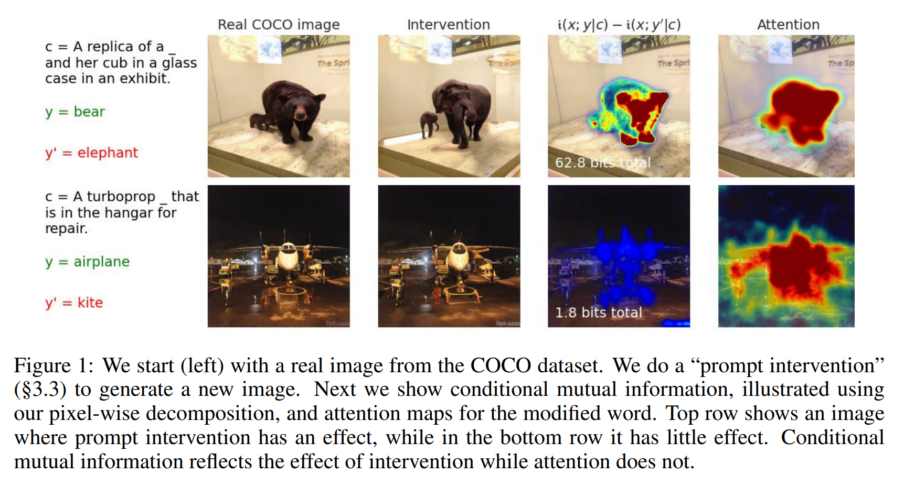
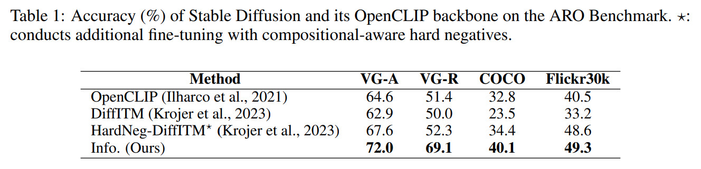
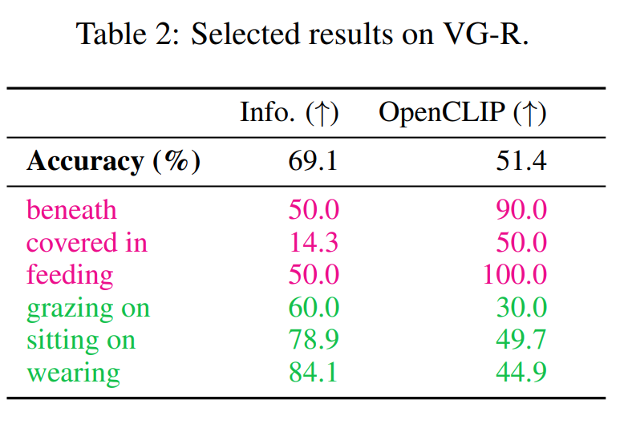
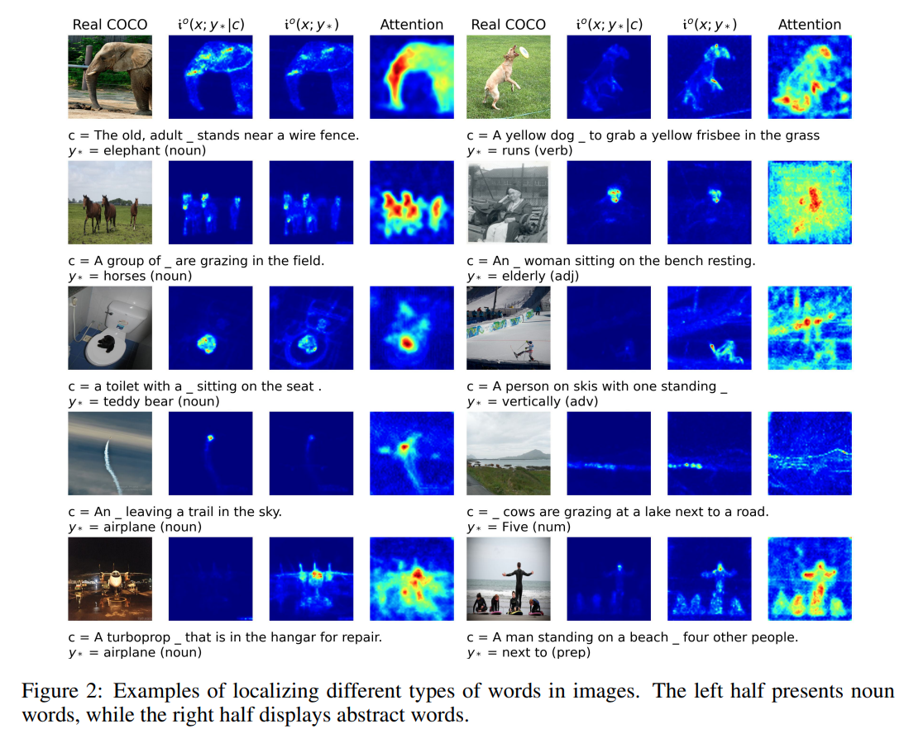
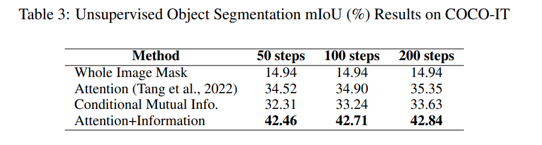
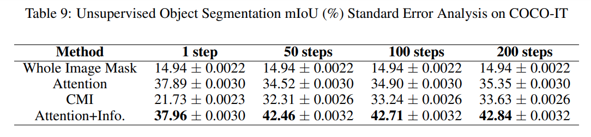
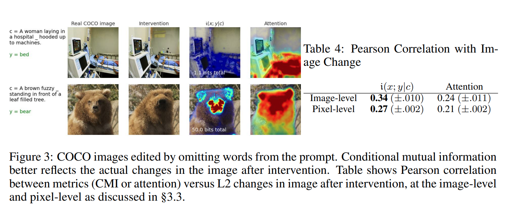

논문 및 이미지 출처 : <https://arxiv.org/pdf/2310.07972>

# Abstract

Denoising diffusion model 은 image 와 text 같은 복잡한 관계를 conditional generation 과 density modeling 할 수 있게 해준다. 하지만 learned relationship 의 특성이 opaque 해서, word 와 image 의 어떤 부분 간의 관계가 포착되는지, 또는 intervention 의 효과를 예측하기가 어렵다. 

저자는 diffusion 과 information decomposition 간의 정확한 관계를 알아차림으로써 diffusion model 이 learned fine-grained relationship 을 밝힌다. 

- Mutual information 과 conditional mutual information 에 대한 정확한 표현은 denoising model 로 작성할 수 있다. 게다가 _pointwise estimate_ 도 쉽게 추정할 수 있어서, 특정 image 와 caption 간의 관계에 대해 질문할 수 있다. 
- High-dimensional space 에서 어떤 variable 이 information 을 담고 있는지 이해하기 위해 information 을 더 세분화하는 건 오랜 문제다. Diffusion model 에서, 저자는 mutual information 의 natural non-negative decomposition 이 나타난다는 걸 보여준다. 

이를 통해 word 와 image 의 pixel 간 informative relationship 을 정량화할 수 있다. 저자는 이 새로운 관계를 활용해서 diffusion model 의 compositional understanding 을 측정하고, image 에서 object 를 unsupervised localization 하며, prompt intervention 을 통해 image 를 선택적으로 editing 할 때의 효과를 측정한다.

# 1 Introduction

Denoising diffusion model 은 image 와 text 같은 복잡한 data 간 관계를 modeling 하는 것이 SOTA 이다. Diffusion model 은 인상적인 generative ability 를 보여주지만, 어떤 관계가 학습됐는지(또는 무시됐는지)에 대한 insight 는 거의 없다. Model 은 그 내용을 dissect 할 수 없으면 가치가 제한적이다. 예로, biology 에서 어떤 variable 이 health outcome 에 영향을 미치는지 특정하는 건 중요하다. AI 가 발전함에 따라, learned relationship 을 probe 하는 더 principled 방식이 필요하다. 이는 human 과 AI 의 관점 간 gap 을 드러내고 수정하기 위해서다.

text 와 image 같은 complex space 에서 학습된 관계는 식별이 어렵다. Information theory 는 input 에서 output 으로 얼마나 많은 information 이 흐르는지 측정하는 black-box 방법이다. 이 연구는 diffusion model 이 simple 하면서도 versatile 한 _information decomposition_ 을 자연스럽게 허용한다는 새로운 관찰에서 시작한다. 이를 통해 information flow 를 fine detail 로 pinpoint 할 수 있어서, model 을 새로운 방식으로 이해하고 활용할 수 있다.

denoising diffusion model 에 대해, 최근 연구는 attention 이 generation 중에 model 이 다른 word 에 어떻게 의존하는지 강조할 수 있는 방법을 탐구했다. 저자의 information-theoretic approach 는 attention-based method 와 세 가지 중요한 점에서 다르다.

- attention 은 white-box access 뿐 아니라 특정 network design 을 요구한다. 저자의 approach 는 architecture detail 을 abstraction 해서, large generative model 에 black-box API access (e.g., DALL-E) 로만 상호작용하는 점점 흔한 시나리오에서도 유용할 수 있다.
- attention 은 segmentation 이나 image-text matching 같은 specific task 를 위해 설계된다. 저자의 information estimator 는 다양한 application 에 적응할 수 있다. 예로, Sec. 3.1 에서 저자는 Stable Diffusion 의 compositional understanding 평가를 automate 한다.
- information flow 는 dependence measure 로서 intervention 의 효과를 더 잘 포착한다. Neural network 내의 attention 은 final output 이 attended input 에 의존한다는 걸 꼭 의미하지 않는다. 저자의 Conditional Mutual Information (CMI) estimator 는 small CMI 를 가진 word 가 output 에 영향을 주지 않는다는 걸 정확히 반영한다 (Fig. 1).

저자의 주요 contribution 은 다음과 같다:

- 저자는 denoising diffusion model 이 per-sample (image) 과 per-variable (pixel) level 에서 relevant information 을 구분하는 fine-grained 방식으로 information 을 decompose 하는 natural 하면서도 tractable 한 방법을 직접 제공한다는 걸 보여준다. Information decomposition 의 utility 는 아래 다양한 task 에서 검증된다.
- 저자는 diffusion model 의 compositional understanding capability 를 더 잘 정량화한다. ARO benchmark 에서, diffusion model 은 sub-optimal alignment score 때문에 상당히 underestimated 된다는 걸 발견한다.
- 저자는 attention 과 information 이 diffusion model 에서 specific text 를 image 에 어떻게 localize 하는지 조사한다. 둘 다 object segmentation 의 목표와 정확히 align 하진 않지만, information measure 는 adjective, adverb, verb 같은 abstract word 를 더 효과적으로 localize 한다.
- Prompt intervention 이 generated image 를 어떻게 수정하는가? Prompt intervention technique 으로 real image 를 surgically modify 하는 건 종종 가능하지만, 때론 이 intervention 이 완전히 무시된다. 저자는 CMI 가 context information 을 고려할 수 있어서 intervention 의 효과를 포착하는 데 더 효과적이라는 걸 보여준다.

# 2 Method: Diffusion is Information Decomposition

## 2.1 Information-Theoretic Perspective on Diffusion Models

Diffusion model 은 data distribution 에서 sample 을 가져오는 noisy channel 로 볼 수 있다. 

$\boldsymbol{x} \sim p(X=\boldsymbol{x})$ 이고, 점진적으로 Gaussian noise 를 추가한다: $\boldsymbol{x}_\alpha = \sqrt{\sigma(\alpha) \boldsymbol{x}} + \sqrt{\sigma(-\alpha) \boldsymbol{\epsilon}}$

- $\epsilon \sim \mathcal{N}(0, \mathbb{I})$ (variance preserving Gaussian channel 로, log SNR $\alpha$ 를 사용하며, standard sigmoid function 을 따른다). 
- 이 noisy channel 을 reverse 하거나 _denoise_ 함으로써 original distribution 에서 sample 을 생성할 수 있다. 

Gaussian noise channel 은 information theory 에서 Shannon et al 이후로 연구됐다. 

- Diffusion model 이 machine learning 에 나타나기 10 년 전, Guo et al 은 이 Gaussian noise channel 에서 information $I(X; X_\alpha)$ 가 optimal signal reconstruction 의 mean square error 와 정확히 관련이 있다는 걸 보여줬다. 이 결과는 information-theoretic quantity 를 optimal denoiser 의 estimation 과 연결할 수 있다는 점에서 영향력이 컸다. 
- 이 논문에서, 저자는 이 결과를 다른 mutual information estimator 와 pointwise estimate 로 확장하는 데 관심이 있다. 저자의 초점은 sample 생성을 위한 reverse 또는 denoising process 학습이 아니라, information theory 를 사용해서 relationship 을 측정하는 데 있다.

저자의 결과에는 각 noise level $\alpha$ 에서 $\epsilon$ 을 예측하는 optimal denoiser, 즉 **Minimum Mean Square Error (MMSE)** denoiser 가 필요하다.

$$
\begin{equation}
    \hat{\epsilon}_\alpha(\boldsymbol{x}) \equiv \arg \min_{\overline{\boldsymbol{\epsilon}}(\cdot)} \mathbb{E}_{p(\boldsymbol{x}), p(\boldsymbol{\epsilon})} \left[ \left\| \boldsymbol{\epsilon} - \overline{\boldsymbol{\epsilon}}(\boldsymbol{x}_\alpha) \right\|^2 \right]
\end{equation}
$$

저자는 noise $\epsilon$ 을 예측하지만, 동일하게 $x$ 를 예측할 수도 있다. 이 optimal denoiser 는 diffusion model 이 정확히 추정하도록 training 된 거다. Denoiser 를 generation 에 사용하는 대신, information-theoretic relationship 을 측정하는 데 어떻게 사용하는지 본다.

Eq. 1 의 denoiser 에 대해, 다음 expression 이 정확히 성립한다.

$$
\begin{equation}
    -\log p(\boldsymbol{x}) = \frac{1}{2} \int \mathbb{E}_{p(\epsilon)} \left[ \|\epsilon - \hat{\epsilon}_\alpha(\boldsymbol{x}_\alpha)\|^2 \right] d\alpha + \text{const}
\end{equation}
$$

- constant value 인 $\text{const}$ 는 Mutual Information (MI) estimator 와 decomposition 을 만드는 과정에서 무시해도 된다. 

이 식은 denoising regression problem 을 푸는 게 (neural network 에게 쉬운) density modeling 과 동등하다는 걸 보여준다. Song et al 이나 McAllester et al 이 쓴 approach 와 달리, 이 exact connection 을 만들기 위해 differential equation 을 참조하거나 풀 필요가 없다.

이 결과의 derivation 은 Kong et al 이 Guo et al 의 original result 를 밀접히 따라갔으며, 완성도를 위해 App. A 에 있다. 이 식은 fine-grained information estimator 를 도출하는 데 매우 강력하고 versatile 하다.

## 2.2 Mutual Information and Pointwise Estimators

Eq. 2 는 arbitrary conditioning 에도 적용된다. $\boldsymbol{x}, \boldsymbol{y} \sim p(X=\boldsymbol{x}, Y=\boldsymbol{y})$ 이고, $\hat{\boldsymbol{\epsilon}}_\alpha(\boldsymbol{x}_\alpha \mid \boldsymbol{y})$ 는 Eq. 1 에서처럼 $p(\boldsymbol{x} \mid \boldsymbol{y})$ 에 대한 optimal denoiser 다. 그러면 conditional density 를 이렇게 쓸 수 있다:

$$
\begin{equation}
    -\log p(\boldsymbol{x} \mid \boldsymbol{y}) = \frac{1}{2} \int \mathbb{E}_{p(\boldsymbol{\epsilon})} \left[ \left\| \boldsymbol{\epsilon} - \hat{\boldsymbol{\epsilon}}_\alpha(\boldsymbol{x}_\alpha \mid \boldsymbol{y}) \right\|^2 \right] d \alpha + \text{const}
\end{equation}
$$

이는 다음의 유용한 Log Likelihood Ratio (LLR) 추정으로 직접 이어진다.

$$
\begin{equation}
    \log p(\boldsymbol{x} \mid \boldsymbol{y}) - \log p(\boldsymbol{x}) = \frac{1}{2} \int \mathbb{E}_{p(\boldsymbol{\epsilon})} \left[ \left\| \boldsymbol{\epsilon} - \hat{\boldsymbol{\epsilon}}_\alpha(\boldsymbol{x}_\alpha) \right\|^2 - \left\| \boldsymbol{\epsilon} - \hat{\boldsymbol{\epsilon}}_\alpha(\boldsymbol{x}_\alpha \mid \boldsymbol{y}) \right\|^2 \right] d \alpha
\end{equation}
$$

- LLR 은 auxiliary variable $\boldsymbol{y}$ 를 conditioning 함으로써 MMSE 가 줄어든 integrated reduction 이다. 
- Mutual information $I(X; Y)$ 는 이 LLR 을 통해 정의된다: $I(X; Y) \equiv \mathbb{E}_{p(\boldsymbol{x}, \boldsymbol{y})} [\log p(\boldsymbol{x} \mid \boldsymbol{y}) - \log p(\boldsymbol{x})]$. 
- 저자는 information theory notation 을 사용해서 MI 를 쓴다. 
- capital $X, Y$ 는 random variable 의 functional 을 나타내고, 
- distribution 은 $p(\boldsymbol{x}, \boldsymbol{y})$ 다. 

MI 는 dependence 의 average measure 이지만, 저자는 종종 single point 에 대한 relationship 의 strength, 즉 pointwise information 에 관심이 있다. 특정 $\boldsymbol{x}, \boldsymbol{y}$ 에 대한 pointwise information 은 lowercase $i(\boldsymbol{x}; \boldsymbol{y})$ 로 쓰이며, 평균이 MI 를 recover 하도록 정의된다. 

Fano et al 은 저자가 "mutual information" 이라 부르는 걸 "average mutual information" 이라 했고, 저자가 pointwise mutual information 이라 부르는 걸 더 fundamental 한 quantity 로 여겼다. Pointwise information 은 NLP 에서 특히 영향력이 컸다.

$$
I(X; Y) = \mathbb{E}_{p(\boldsymbol{x}, \boldsymbol{y})} [i(\boldsymbol{x}; \boldsymbol{y})] \quad \text{Defining property of pointwise information}
$$

Pointwise information 은 unique 하지 않다. 아래 두 quantity 모두 이 property 를 만족한다.

$$
\begin{equation}
    \begin{align*}
        &i^s(\boldsymbol{x}; \boldsymbol{y}) \equiv \frac{1}{2} \int \mathbb{E}_{p(\boldsymbol{\epsilon})} \left[ \left\| \boldsymbol{\epsilon} - \hat{\boldsymbol{\epsilon}}_\alpha(\boldsymbol{x}_\alpha) \right\|^2 - \left\| \boldsymbol{\epsilon} - \hat{\boldsymbol{\epsilon}}_\alpha(\boldsymbol{x}_\alpha \mid \boldsymbol{y}) \right\|^2 \right] d \alpha \\
        &i^o(\boldsymbol{x}; \boldsymbol{y}) \equiv \frac{1}{2} \int \mathbb{E}_{p(\boldsymbol{\epsilon})} \left[ \left\| \hat{\boldsymbol{\epsilon}}_\alpha(\boldsymbol{x}_\alpha) - \hat{\boldsymbol{\epsilon}}_\alpha(\boldsymbol{x}_\alpha \mid \boldsymbol{y}) \right\|^2 \right] d \alpha
    \end{align*}
\end{equation}
$$

- **standard definition** 은 Eq. 4 를 통해 $\log p(\boldsymbol{x} \mid \boldsymbol{y}) - \log p(\boldsymbol{x})$ 를 사용해서 온다. 
- more compact 한 definition 은 Sec. B 에서 **orthogonality principle** 을 사용해서 유도된다. $i^s$ 는 extra $\epsilon$ term 때문에 variance 가 더 높고, $i^o$ 는 variance 가 낮고 항상 non-negative 다. 
- 저자는 두 estimator 를 모두 탐구하지만, orthogonality principle 을 활용하는 lower variance version 이 일반적으로 더 유용하다는 걸 발견한다 (Sec. C.2 참조). 
- (Average) MI 는 항상 non-negative 이지만, pointwise MI 는 $i^s(\boldsymbol{x}; \boldsymbol{y}) = \log p(\boldsymbol{x} \mid \boldsymbol{y}) - \log p(\boldsymbol{x}) < 0$ 일 때 negative 가 될 수 있다. 
- Negative pointwise information 은 "misinformative" observation 을 나타낸다.

이 모든 표현은 random variable $C$ 를 conditioning 하는 conditional variant 를 가질 수 있다. CMI 와 그 pointwise expression 은 $I(X; Y \mid C) = \mathbb{E}_{p(\boldsymbol{x}, \boldsymbol{y}, \boldsymbol{c})} [i(\boldsymbol{x}; \boldsymbol{y} \mid \boldsymbol{c})]$ 로 관련된다. 

Eq. 5 의 pointwise version 은 모든 denoiser 를 $ C $ 에 conditioning 함으로써 얻을 수 있다. 예: $\hat{\boldsymbol{\epsilon}}_\alpha(\boldsymbol{x}_\alpha \mid \boldsymbol{y}) \rightarrow \hat{\boldsymbol{\epsilon}}_\alpha(\boldsymbol{x}_\alpha \mid \boldsymbol{y}, \boldsymbol{c})$.

## 2.3 Pixel-Wise Information Decomposition

Pointwise information $i(\boldsymbol{x}; \boldsymbol{y})$ 는 어떤 variable $x_j$ 가 어떤 variable $y_k$ 에 대해 informative 한지를 알려주지 않는다. $\boldsymbol{x}$ 가 image 이고 $\boldsymbol{y}$ 가 text prompt 를 나타낸다면, 특정 word 가 image 의 어떤 부분에 대해 informative 한지를 알려줄 거다. 

Information decomposition 이 highly nontrivial 한 이유 중 하나는 variable 에서 information 이 synergistic 할 수 있는 시나리오가 생길 수 있기 때문이다. 저자의 decomposition 은 information 과 MMSE 간의 correspondence 가 information 을 각 variable 에 대한 term 의 sum 으로 natural 하게 decompose 한다는 관찰에서 시작한다. $\boldsymbol{x} \in \mathbb{R}^n$ 이면, $i(\boldsymbol{x}; \boldsymbol{y}) = \sum_{j=1}^n i_j(\boldsymbol{x}; \boldsymbol{y})$ 로 쓸 수 있다:

$$
\begin{equation}
    \begin{align*}
        &i_j^s(\boldsymbol{x}; \boldsymbol{y}) \equiv \frac{1}{2} \int \mathbb{E}_{p(\boldsymbol{\epsilon})} \left[ \left( \boldsymbol{\epsilon} - \hat{\boldsymbol{\epsilon}}_\alpha(\boldsymbol{x}_\alpha) \right)_j^2 - \left( \boldsymbol{\epsilon} - \hat{\boldsymbol{\epsilon}}_\alpha(\boldsymbol{x}_\alpha \mid \boldsymbol{y}) \right)_j^2 \right] d \alpha \\
        & i_j^o(\boldsymbol{x}; \boldsymbol{y}) \equiv \frac{1}{2} \int \mathbb{E}_{p(\boldsymbol{\epsilon})} \left[ \left( \hat{\boldsymbol{\epsilon}}_\alpha(\boldsymbol{x}_\alpha) - \hat{\boldsymbol{\epsilon}}_\alpha(\boldsymbol{x}_\alpha \mid \boldsymbol{y}) \right)_j^2 \right] d \alpha
    \end{align*}
\end{equation}
$$

즉, pointwise information 의 두 variation 모두 squared error 로 쓸 수 있고, squared error 를 각 variable 에 대한 error 로 decompose 할 수 있다. Multiple channel 을 가진 image 에 대한 pixel-wise information 은 각 channel 의 contribution 을 sum 한다.

저자는 conditional information 으로 쉽게 확장할 수 있다. 

- $\boldsymbol{x}$ 가 특정 image 를 나타내고, 
- $\boldsymbol{y} = \{y_*, \boldsymbol{c}\} = \{\text{"object"}, \text{"a person holding an \underbar \ "}\}$ 라 하자. 
- 그러면 $i_j(\boldsymbol{x}; y_* \mid \boldsymbol{c})$ 를 추정할 수 있는데, 이는 context $\boldsymbol{c}$ 를 conditioning 했을 때 word $y_*$ 가 variable $ \boldsymbol{x}_j $ 에 대해 가진 information 을 나타낸다. 
- Eq. 6 을 사용해서 추정하려면, 양쪽에 $\boldsymbol{c}$ conditioning 을 추가하면 된다. 

Arbitrary text 에 conditioning 해서 image 를 denoising 하는 건 diffusion model 의 standard task 다. Estimator 의 예는 Fig. 1 에서 보여주는데, highlighted region 은 pixel $j$ 에 대한 $i_j^o(\boldsymbol{x}; y_* \mid \boldsymbol{c})$ 의 pixel-wise value 를 나타낸다.

## 2.4 Numerical Information Estimates

저자가 소개한 모든 information estimator 는 infinite range 의 SNR 에 걸친 one-dimensional integral 을 평가해야 한다. 실제로 추정하기 위해, 저자는 importance sampling 을 사용해서 integral 을 평가한다. $\alpha$ 에 대한 importance sampling distribution 으로 truncated logistic 을 사용한다. 

경험적으로, $\alpha$ 값이 아주 작거나 아주 클 때 integral 에 대한 contribution 은 거의 0 에 가깝다는 걸 발견해서, distribution 을 truncate 해도 영향이 거의 없다. MINE 이나 variational estimator 와 달리, 여기서 제시된 estimator 는 MI 에 대한 direct upper 또는 lower bound 를 optimization 하는 데 의존하지 않는다. 대신, estimator 는 conditional 과 unconditional denoising problem 의 MMSE 를 찾고, Eq. 4 를 사용해서 MI 를 추정하기 위해 이를 결합한다. 

하지만 이 두 MMSE term 은 반대 부호로 나타난다. 일반적으로, MSE 를 최소화하도록 training 된 neural network 는 두 term 중 하나 또는 둘 다에서 global minimum 을 달성하지 않을 수 있어서, 추정치가 upper 또는 lower bound 라고 보장할 수 없다. 실제로, neural network 는 regression problem 에 뛰어나니까, 저자는 합리적인 추정치를 얻을 거라 기대한다. 

모든 결과에서 저자는 Gaussian noise 하에서 mean square 를 최소화하도록 pre-trained 된 diffusion model 을 사용한다. 이는 Eq. 1 에서 요구된다 (논문마다 $\alpha$ term 에 얼마나 많은 weight 를 주는지는 다르지만, 원칙적으로 각 $\alpha$ 에 대한 MMSE 는 독립적이어서, expressive 한 neural network 에는 weighting 이 크게 영향을 주지 않을 거다).

# 3 Results

Sec. 2 는 optimal denoiser 와 information 간의 정확한 연결을 설정한다. 실험을 위해, 저자는 diffusion model 을 optimal denoiser 를 근사하는 것으로 간주하고, 이를 사용해서 information 을 추정한다. 

모든 실험은 Hugging Face 의 pre-trained latent space diffusion model 인 Stable Diffusion v2.1 로 수행된다. Latent diffusion model 은 typical diffusion model training 전에 pre-trained autoencoder 를 사용해서 image 를 lower resolution space 에 embed 한다. 

저자는 항상 $\boldsymbol{x}$ 를 이 lower dimensional space 의 image 로 간주하지만, 표시된 image 에서는 decoding 후의 image 를 보여주고, higher resolution 에서 heat map 을 visualize 할 때는 bilinear interpolation 을 사용한다.

## 3.1 Relation Testing with Pointwise Information

먼저, 저자는 "pointwise" 또는 per-image level 에서 information decomposition 을 고려한다. 저자는 estimator 를 사용해서 image-text pair 의 summary statistic 을 계산하고, sample 간 qualitative difference 를 정량화한다. 

새로운 application scenario 로, 저자는 pointwise estimator 를 사용해서 Stable Diffusion 의 ARO benchmark 에서 compositional understanding 을 분석한다. ARO benchmark 는 discriminative task 의 suite 로, VLM 이 image $\boldsymbol{x}$ 를 groundtruth caption $\boldsymbol{y}$ 와 $\boldsymbol{y}$ 에서 constituent order 를 randomize 해서 만든 perturbation set $\mathcal{P} = \{\tilde{y}_j\}_{j=1}^M$ 에서 align 하도록 한다. VLM 의 compositional understanding capability 는 다음과 같은 accuracy 로 측정된다:

$$
\mathbb{E}_{\boldsymbol{x}, \boldsymbol{y}} \left[ \mathbb{1} \left( \boldsymbol{y} = \arg \max_{\boldsymbol{y}' \in \{\boldsymbol{y}\} \cup \mathcal{P}} s(\boldsymbol{x}, \boldsymbol{y}') \right) \right],
$$

- $s: \mathcal{X} \times \mathcal{Y} \rightarrow \mathbb{R}$ 는 alignment score 다. 
- Contrastive VLM 에서, $s$ 는 encoded image-text representation 간 cosine similarity 로 선택된다. 
- 저자는 diffusion model 에 대해 $s(\boldsymbol{x}, \boldsymbol{y}) \equiv i^o(\boldsymbol{x}; \boldsymbol{y})$ 를 score function 으로 선택한다. 
- 대조적으로, He et al 은 latent attention map 의 aggregate 로 $s$ 를 계산하고, Krojer et al 은 negative MMSE 를 채택한다. 

Tab. 1 에서, 저자는 OpenCLIP 와 Stable Diffusion 2.1 의 ARO benchmark 성능을 보고한다. 공정한 비교를 위해 같은 text encoder 를 가진 model checkpoint 를 control 한다.

- 저자는 Stable Diffusion 이 OpenCLIP 보다 compositional understanding 에서 크게 개선된다는 걸 관찰한다. 
- Text encoder 가 frozen 이므로, 이 개선은 전적으로 denoising objective 와 visual component 에 기인한다고 할 수 있다. 
- 더 중요하게, 저자의 information estimator 는 MMSE 보다 상당히 outperform 해서, 이전 연구들이 diffusion model 의 compositional understanding capability 를 underestimate 했다는 걸 결정적으로 증명한다. 
- 저자의 관찰은 diffusion model 을 discriminative image-text matching 에 적응시키는 데 유리한 증거를 제공한다. 하지만, composition-aware negative sample 을 사용하는 contrastive pre-training approach 에 비하면 이 개선은 작다.

Tab. 2 에서 저자는 relation type 에 걸친 fine-grained performance 의 subset 을 보고한다. 30% 이상 성능 개선은 초록색, 30% 이상 성능 하락은 자홍색으로 highlight 한다. 

- 흥미롭게도, 저자의 highlighted category 는 composition-aware negative training 에서 발생한 성능 변화와 잘 correlate 한다. 이는 다른 CLIP backbone 을 사용했음에도 불구하고 그렇다. 
- 대부분의 개선은 subject 를 conceptually distinctive object 와 연관 짓는 verb 에서 온다 (e.g., "A boy sitting on a chair"). 
- 저자의 관찰은 compositional understanding 의 개선이 주로 이런 "low-hanging fruit" 에서 비롯될 수 있다는 걸 시사하고, Rassin et al 이 제안한 text encoder 가 linguistic structure 를 encode 하지 못해서 entity 와 visual attribute 간 잘못된 association 이 생긴다는 가설을 부분적으로 뒷받침한다. 
- 완전한 fine-grained 결과, implementation detail, error analysis 는 Sec. D.1 에서 볼 수 있다.

## 3.2 Pixel-Wise Information and Word Localization

다음으로, 저자는 caption 의 word 가 image 의 특정 pixel 에 대해 가진 "pixel-wise information" 을 탐구한다. Sec. 2.2 와 Sec. 2.3 에 따르면, 이 nuanced relationship 을 검증하는 두 가지 potential approach 를 자연스럽게 고려하게 된다.

- object word 와 individual pixel 간 mutual information 에만 집중하는 거다.
- caption 의 나머지 context 를 주어졌을 때 이 mutual information 을 조사하는 거다. 즉, conditional mutual information 이다.

실험의 성공은 image 와 text 간 alignment 에 크게 의존하기 때문에, 저자는 MSCOCO validation dataset 에서 COCO-IT 와 COCO-WL 두 dataset 을 신중히 필터링했다. 

저자는 이 두 dataset 에서 image-level information analysis 도 Sec. C.1 에서 제공하고, 10 개 case 에 대해 diffusion process 와 information 간 관계를 Sec. C.2 에서 visualize 한다.

### 3.2.1 Visualize Mutual Information and Conditional Mutual Information

Image-text pair $(\boldsymbol{x}, \boldsymbol{y})$ 에서 $\boldsymbol{y} = \{y_*, \boldsymbol{c}\}$ 일 때, 저자는 pixel-level mutual information 을 $i_j^o(\boldsymbol{x}; y_*)$ 로 계산하고, conditional one 은 Eq. 6 에서 pixel $j$ 에 대해 $i_j^o(\boldsymbol{x}; y_* \mid \boldsymbol{c})$ 로 계산한다. 8 개 case 는 Fig. 2 에 표시되고, 더 많은 예제는 Sec. C.3 과 Sec. C.4 에서 제공된다.

Fig. 2 에서, pixel-level MI 와 CMI 의 visualization 은 common color scale 을 사용해서 제시된다. 

- 비교해보면, CMI 가 object 를 더 강조하면서 background 를 줄이는 더 큰 capacity 를 가진다는 게 분명하다. 이는 MI 가 noun word $y_*$ 와 pixel 간 관계만 계산하는 반면, CMI 는 complete prompt-to-pixel information 에서 context-related information 을 factor out 하기 때문이다. 
- 하지만 반대 효과가 가끔 관찰된다. 예로, $y_* = \text{airplane}$ 인 경우 (Fig. 2 의 왼쪽 아래), CMI 는 'airplane' 과 관련된 pixel 을 highlight 하지 못하지만 MI 는 성공한다. 
  - 이 discrepancy 는 context 에 'turboprop' 단어가 있어서 생긴다. 
  - 따라서 context $\boldsymbol{c}$ 가 image 의 content 를 정확히 묘사하고, 'airplane' 은 추가 information 을 더하지 않는다. 
- Attention 과 비교하면, CMI 와 MI 는 qualitatively elephant 의 눈, 귀, 엄니나 horse 의 얼굴 같은 object 의 fine detail 에 더 초점을 맞추는 것처럼 보인다. 
- Object word 에 대해, 저자는 Sec. 3.2.2 에서 segmentation task 를 사용해서 더 quantitative 한 statement 를 만들 수 있다.

저자는 pixel-level CMI 나 MI 가 다른 type 의 entity 에 대해 흥미로운 insight 를 줄 수 있는지도 탐구한다. Fig. 2 (오른쪽) 는 noun 외에 verb, adjective, adverb, number, preposition 등 네 가지 다른 type 의 entity 를 제시한다. 

- 이 words 는 꽤 abstract 해서, manual annotation 으로도 해당 pixel 을 정확히 결정하기 어려울 수 있다. 
- Visualization 결과는 MI 가 특히 adjective 와 adverb 에 대해 intuitively plausible 한 결과를 준다는 걸 보여준다. 이는 object 의 relevant finer detail 을 attention 보다 더 효과적으로 highlight 한다. 
- 흥미롭게도, MI 가 image 내 abstract word 를 locate 하는 능력은 Sec. 3.1 에서 제시된 relation testing 결과 (Tab. 10) 와 align 한다.

### 3.2.2 Localizing Word Information in Images

위 visualization 은 pixel-wise CMI 가 image 의 부분을 caption 의 부분과 어떻게 연결하는지에 대한 직관적인 보여줌을 준다. 그래서 저자의 호기심은 자연스럽게 이 approach 를 image 안에서 word localization 에 적용할 수 있는지로 넘어간다. 

현재 주류 evaluation 은 Stable Diffusion model 안의 attention layer 를 사용해서 object segmentation 을 하는 거다. 이 methodology 는 attention layer 와 신중히 만든 heuristic heatmap generation 에 크게 의존한다. 

Image generation 중에 multi-scale cross-attention layer 를 사용하면 Diffuse Attention Attribution Map (DAAM) 을 빠르게 계산할 수 있다. 이는 segmentation 뿐만 아니라 word localization analysis 에도 다양한 흥미로운 기회를 준다. 저자는 DAAM 을 versatile applicability 때문에 baseline 으로 선택했고, 자세한 experimental design 은 Sec. D.2 에 기록되어 있다. Pixel-level object segmentation 성능을 평가하기 위해 mean Intersection over Union (mIoU) 를 evaluation metric 으로 사용한다.

- Tab. 3 은 attention-based method 와 비교했을 때 pixel-wise CMI 가 object segmentation 에 덜 효과적이라는 걸 보여준다. Error analysis 는 Tab. 9 에 있다. 
- DAAM 의 attention mechanism 은 multi-scale attention layer 에 걸쳐 high 와 low resolution image feature 를 결합하는데, Feature Pyramid Networks (FPN) 와 비슷하다. 이게 더 나은 feature fusion 을 가능하게 한다. 
- CMI 는 target object 의 전체 context 를 포착하기보다는 그 object 에 unique 한 specific detail 에 더 초점을 맞춘다. 
- Pixel-level CMI 가 object segmentation 에서 엄청 잘하지는 않았지만, 'Attention+Information' 결과는 information-theoretic diffusion process 가 attention layer 의 feature 를 포착하는 능력을 확실히 향상시킨다는 걸 보여준다.

#### Discussion: attention versus information versus segmentation

Heatmap 을 보면, object 의 어떤 부분이 다른 부분보다 더 informative 할 수 있다는 게 분명하다. 예로, 얼굴이나 가장자리 같은 부분 말이다. 반대로, object 의 일부가 아닌 image 의 contextual 부분도 object 에 대해 informative 할 수 있다. 예로, 비행기의 vapor trail 로 비행기를 식별할 수 있다 (Fig. 2). 그래서 attention 과 information 둘 다 segmentation 목표와 완벽히 align 하지는 않는다. 

Attention 과 mutual information 의 한 가지 차이는 pixel 이 prompt 의 word 에 "attention" 을 준다고 해서 그 word 를 수정하면 prompt 가 바뀐다는 걸 의미하지 않는다는 점이다. 이는 conditional mutual information 에서 가장 잘 드러난다. 예로, informative word ("jet") 가 더 큰 context ("turboprop jet") 에서 information 을 거의 안 줄 수 있다. 이 차이를 강조하기 위해, 저자는 word 에 intervention 을 해서 generated image 가 바뀌는지 테스트하는 experiment 를 제안한다. 저자의 가설은 word 의 CMI 가 낮으면 그 word 를 빼도 결과가 안 바뀔 거라는 거다. 반면 attention 은 꼭 그렇지 않다.

## 3.3 Selective Image Editing via Prompt Intervention

Diffusion model 은 non-technical user 에게 natural language interface 를 제공해서 다양하고 realistic 한 image 를 만들 수 있게 해줬다. 지금까지 저자는 diffusion model 이 real image 의 structure 를 얼마나 잘 이해하는지에 초점을 맞췄다. Real image 와 generated image 를 연결하기 위해, real image 를 얼마나 잘 수정할 수 있는지를 보면 된다. 이는 diffusion model 의 인기 있는 use case 다 (Sec. 4). Informative relationship 을 측정하는 저자의 ability 를 prompt intervention 의 효과와 얼마나 잘 align 하는지로 validate 할 수 있다.

이 experiment 에서, 저자는 diffusion model 을 continuous, invertible normalizing flows 로 본다. 이 경우, denoising model 은 score function 으로 해석되고, 이 score function 에 의존하는 ODE 가 data distribution 을 Gaussian 으로 부드럽게 mapping 하거나 그 반대로 한다. 저자가 사용하는 ODE solver 는 100 step 을 가진 2nd order deterministic solver 다. Real image 와 prompt 로 시작해서, (conditional) score model 을 사용해서 image 를 Gaussian latent space 로 mapping 한다. 원칙적으로 이 mapping 은 invertible 하니까, dynamics 를 reverse 하면 original image 를 거의 항상 high fidelity 로 recover 할 수 있다 (Sec. C.5).

다음으로, intervention 을 추가하는 걸 고려한다. Reverse dynamics 를 하는 동안, denoiser prompt 를 어떤 식으로든 바꿔서 (conditional) score 를 수정한다. 저자는 experiment 에서 word 를 빼거나, categorically similar word 로 바꾸는 효과에 초점을 맞췄다 (e.g., "bear" → "elephant"). 보통 original image 의 detail 이 많이 보존되고, 수정된 word 와 관련된 부분만 바뀐다. 흥미롭게도, 어떤 경우에는 word 에 대한 intervention 이 완전히 무시되는 것처럼 보인다 (Fig. 1, 3).

저자는 attention 이나 information measure 가 intervention 의 효과를 예측하는지 탐구를 원한다. Word 를 빼는 intervention 을 할 때, Eq. 5 의 conditional (pointwise) mutual information $i(x; y \mid c)$ 를 고려한다. Word swap 의 경우, swapped word $y, y'$ 를 사용해서 CMI 의 차이를 사용한다 (Fig. 1). Attention 의 경우, generation 중 특정 word 에 해당하는 attention 을 aggregate 한다. 저자는 word 가 attention heatmap 에서 object 를 highlight 해도 무시될 수 있다는 걸 발견했다. 즉, word 에 대한 attention 이 generated outcome 에 영향을 준다는 걸 의미하지 않는다. 한 가지 이유는 word 가 context 에서 추가 information 을 거의 안 줄 수 있기 때문이다. 예로, Fig. 3 에서 병원의 여성이 침대 위에 있다고 가정되니까, 이 word 를 빼도 효과가 없다. 반면 CMI 는 intervention 의 효과와 잘 correlate 하고, 이 예에서 "bed" 는 낮은 CMI 를 가진다.

저자의 observation 을 정량화하기 위해, score (CMI 또는 attention heatmap) 와 intervention 전후 image 간 L2 distance 를 사용해서 intervention 효과 간 Pearson correlation 을 측정한다. 

Image-level correlation 을 얻기 위해, COCO100-IT 에서 example 간 aggregate score 를 correlate 했다. 또한 pixel-level correlation 을 L2 change per pixel 과 metric (CMI 와 attention heatmap) 간에 고려했다. 이 correlation 을 모든 image 에 대해 평균해서 Tab. 4 에 결과를 보고한다. 

- CMI 는 image-level 에서 변화를 훨씬 더 잘 예측하는데, 이는 context 를 고려한 후 word 가 추가로 주는 information 을 직접 정량화하기 때문이다. 
- Per-pixel level 에서, 변화가 localized 될 때 CMI 와 attention 은 보통 아주 잘 correlate 했지만, 작은 prompt 변화가 image 에 global change 를 일으킬 때는 둘 다 성능이 낮았다. 
- 이 효과를 visualize 한 결과와 word swap intervention 에 대한 추가 experiment 는 Sec. C.5 에 있다. 
- Information 으로 측정한 작은 dependence 는 intervention 에서 작은 효과를 정확히 의미했다. 하지만 큰 dependence 는 generative process 의 non-linearity 때문에 복잡하고 global 한 변화로 이어질 수 있다.

# 4 Related Work

#### Visual perception via diffusion models

Diffusion model 의 image generation 성공은 text-image understanding 능력에 대한 관심을 불러일으켰다. 

Visual perception 과 caption comprehension 영역에서 다양한 pipeline design 이 나오고 있으며, 새로운 관점과 복잡성을 제공한다. 특히 ODISE 는 diffusion model 과 discriminative model 을 결합한 pipeline 을 소개해서 open-vocabulary segmentation 에서 훌륭한 결과를 냈다. 비슷하게 OVDiff 는 diffusion model 을 사용해서 특정 textual category 에 대한 support image 를 sampling 하고, 그 후 foreground 와 background feature 를 추출한다. 

그 다음 cosine similarity (종종 CLIP filter 로 알려짐) 를 사용해서 object 를 효과적으로 segment 한다. MaskDiff 와 DiffSS 는 few-shot segmentation 에 맞춘 새로운 conditional diffusion model 을 소개한다. 

- DDP 는 conditional diffusion model 의 concept 를 dense visual prediction task 에 적용한다. 
- VDP 는 semantic segmentation 과 depth estimation 같은 다양한 downstream visual perception task 에 diffusion 을 통합한다. 여러 method 가 diffusion model 의 attention layer 를 사용해서 object segmentation 에서 text-image 관계를 이해하려고 탐구하기 시작했다.

#### Image editing via diffusion

Real image editing 은 학문적으로나 상업적으로 관심이 커지고 있는 분야다. Natural text, similar image, latent space modification 을 사용해서 원하는 효과를 내는 approach 가 있다. Su et al 은 저자의 intervention experiment 에서 사용된 procedure 와 가장 비슷한 approach 를 보여준다. 

이전 연구과 달리, 저자는 edit quality 에 초점을 맞추지 않고, edit 을 사용해서 저자의 information estimator 로 측정한 learned dependency 를 validate 하는 데 집중한다.

#### Interpretable ML

Attention 이 아니라 gradient sensitivity 에 기반한 전통적인 attribution method 는 computer vision 에서 거의 안 쓰인다. Gradient 기반 (adversarial) perturbation 이 human perception 과 correlate 하지 않는다는 잘 알려진 현상 때문이다. 

Information decomposition 에 기반한 information-theoretic approach 는 interpretability 를 위해 거의 탐구되지 않았다. Canonical approach 가 없고, 기존 approach 는 high-dimensional use case 에서 완전히 intractable 하기 때문이다. 하지만 neural network 로 redundant information 을 decompose 하려는 최근 시도가 있다. 저자의 decomposition 은 각 variable 에서 information contribution 을 decompose 하지만, unique 와 redundant component 를 명시적으로 분리하지는 않는다. 

Machine learning 에서 "interpretability" 는 fuzzy concept 로, 조심해서 다뤄야 한다. 저자는 information theory 에서 operational interpretation 을 채택했는데, $ y \rightarrow x $ 를 noisy channel 로 보고, diffusion model 을 사용해서 channel 을 characterize 하면서 얼마나 많은 bit 의 information 이 전달되는지 묻는다.

# 5 Conclusion

Diffusion model 의 화려한 image generation 능력은 그들이 density modeling 에서도 SOTA 로, 똑같이 중요하지만 덜 활용된 사실을 가렸다. Diffusion 과 information 간 tight link 를 사용해서, 저자는 새롭고 tractable 한 information decomposition 을 소개할 수 있었다. 이는 neural information estimator 의 usefulness 를 크게 확장해서, individual sample 과 variable level 에서 fine-grained relationship 의 interpretable measure 를 준다. 

저자는 presentation 과 validation 을 쉽게 하기 위해 vision task 에 초점을 맞췄지만, information decomposition 은 gene expression 같은 biomedical application 에서 특히 가치 있을 수 있다. 또 다른 유망한 application 은 mechanistic interpretability 에 관한 동시대의 작업과 관련이 있다. 이는 neural network 의 특정 behavior 를 담당하는 "circuit" (neural network 의 subgraph) 를 찾아내려고 하며, individual network component 를 ablate 해서 성능 차이를 관찰한다. Language model 에서 차이는 보통 관심 있는 vocabulary 의 total probability 변화로 측정된다. 

반면 diffusion model 에서는 metric design 이 여전히 open question 이다. 저자의 분석은 CMI estimator 가 compositional understanding 을 포착하고 image edit 을 localize 하는 데 적합하다는 걸 보여준다. 미래 작업으로, 저자는 diffusion model 에서 relevant circuit 을 찾기 위한 metric candidate 로서의 잠재력을 탐구하는 데 관심이 있다.