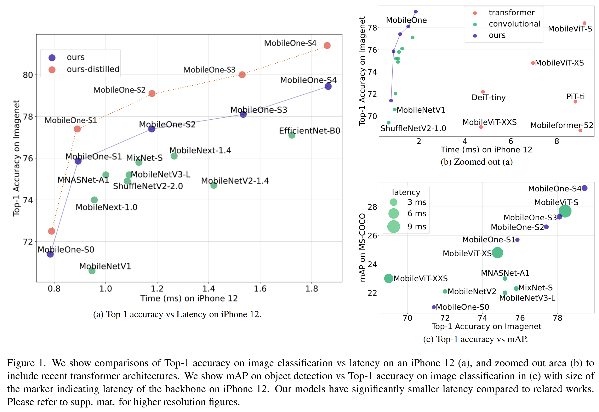
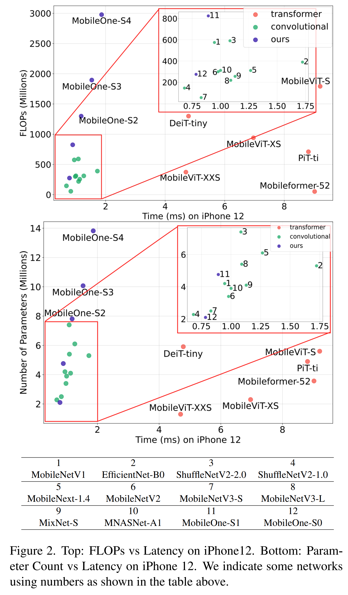
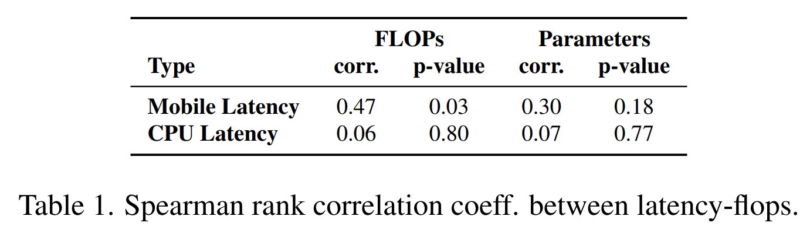
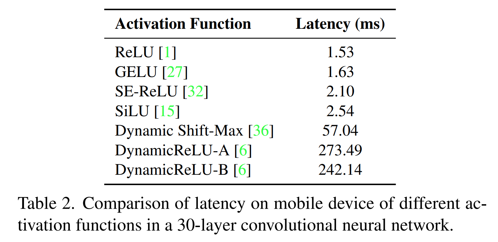
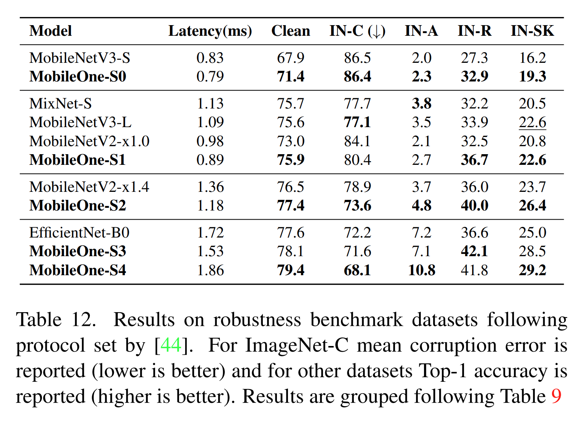
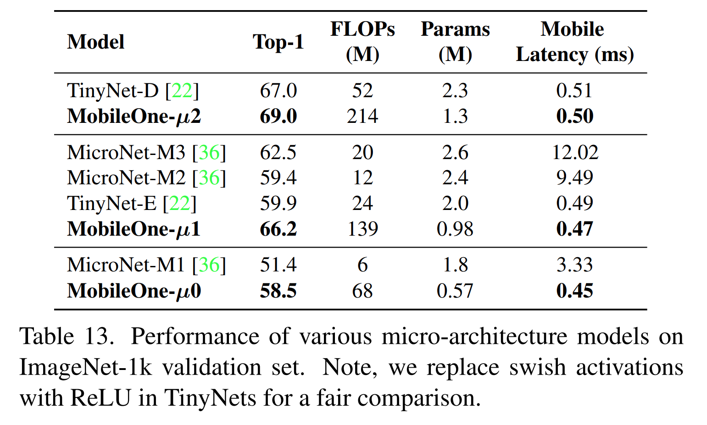

논문 및 이미지 출처 : <https://arxiv.org/pdf/2206.04040>

# Abstract

mobile device 를 위한 efficient neural network backbone 은 종종 FLOPs 나 parameter count 와 같은 metric 에 대해 최적화된다. 그러나 이러한 metric 은 network 가 mobile device 에 배포되었을 때의 latency 와 잘 상관되지 않을 수 있다. 따라서 저자는 여러 mobile-friendly network 를 mobile device 에 배포하여 서로 다른 metric 에 대한 광범위한 분석을 수행한다. 

저자는 최근 efficient neural network 에서 architectural bottleneck 과 optimization bottleneck 을 식별하고 분석하며, 이러한 bottleneck 을 완화하는 방법을 제시한다. 

* 이를 위해 저자는 efficient backbone 인 **MobileOne** 을 설계하며, 그 variant 들은 iPhone12 에서 1 ms 미만의 inference time 으로 ImageNet 에서 75.9% top-1 accuracy 를 달성한다. 
* 저자는 MobileOne 이 efficient architecture 내에서 state-of-the-art performance 를 달성하면서도 mobile 상에서 여러 배 더 빠르다는 것을 보인다. 
* 저자의 최고 model 은 ImageNet 에서 *MobileFormer* 와 유사한 성능을 얻으면서도 38 배 더 빠르다. 
* 저자의 model 은 EfficientNet 과 유사한 latency 에서 ImageNet top-1 accuracy 를 2.3% 더 높게 달성한다. 
* 또한 저자는 저자의 model 이 image classification, object detection, semantic segmentation 이라는 여러 task 로 generalize 되며, mobile device 에 배포되었을 때 기존 efficient architecture 와 비교해 latency 와 accuracy 모두에서 큰 향상을 보인다는 것을 보인다.

# 1. Introduction

mobile device 를 위한 efficient deep learning architecture 의 설계와 배포는 FLOPs 와 parameter count 를 지속적으로 줄이면서 accuracy 를 향상시키는 방향으로 많은 진전을 이루어 왔다. 그러나 이러한 metric 은 latency 측면에서 model 의 efficiency 와 잘 상관되지 않을 수 있다. FLOPs 와 같은 efficiency metric 은 memory access cost 와 degree of parallelism 을 고려하지 않으며, 이들은 inference 중 latency 에 적지 않은 영향을 줄 수 있다. 

Parameter count 역시 latency 와 잘 상관되지 않는다. 예를 들어, parameter sharing 은 더 높은 FLOPs 를 유발하지만 더 작은 model size 를 만든다. 또한 skip-connection 이나 branching 과 같은 parameter-less operation 은 상당한 memory access cost 를 초래할 수 있다. 이러한 괴리는 efficient architecture 영역에서 custom accelerator 를 사용할 수 있을 때 더욱 심해질 수 있다.

저자의 목표는 on-device latency 에 영향을 주는 핵심 architectural bottleneck 과 optimization bottleneck 을 식별함으로써, efficient architecture 의 accuracy 를 향상시키는 동시에 latency cost 를 개선하는 것이다. 

* Architectural bottleneck 을 식별하기 위해 저자는 CoreML 을 사용하여 iPhone12 에 neural network 를 배포하고 그 latency cost 를 benchmark 한다. 
* Optimization bottleneck 을 완화하기 위해 저자는 train-time architecture 와 inference-time architecture 를 decouple 한다. 
  * 즉, train-time 에는 linearly over-parameterized model 을 사용하고, inference 시에는 linear structure 를 re-parameterize 한다. 
* 저자는 또한 training 전반에 걸쳐 regularization 을 동적으로 완화하여, 이미 작은 model 이 과도하게 regularized 되는 것을 방지함으로써 optimization bottleneck 을 추가로 완화한다.

핵심 bottleneck 에 대한 이러한 발견을 바탕으로, 저자는 새로운 architecture 인 **MobileOne** 을 설계한다. 

* 그 variant 들은 iPhone12 에서 1 ms 미만으로 동작하면서 efficient architecture family 내에서 state-of-the-art accuracy 를 달성하고, 동시에 device 상에서 현저히 더 빠르다. 
* Structural re-parameterization 에 관한 기존 연구들과 마찬가지로, MobileOne 은 train-time 에 linear branch 를 도입하고, 이는 inference 시 re-parameterize 된다. 
  * 그러나 저자의 model 과 기존 structural re-parameterization 연구 사이의 핵심 차이는 trivial over-parameterization branch 의 도입이며, 이는 low parameter regime 와 model scaling strategy 에서 추가적인 향상을 제공한다. 
* Inference 시 저자의 model 은 어떠한 branch 나 skip-connection 도 없는 단순한 feed-forward structure 를 가진다. 
  * 이 구조는 더 낮은 memory access cost 를 유발하므로, 저자는 network 에 더 넓은 layer 를 포함할 수 있으며, 이는 Tab. 9 에서 실증적으로 보이듯 representation capacity 를 향상시킨다. 
  * 예를 들어, MobileOne-S1 은 4.8 M parameter 를 가지며 0.89 ms 의 latency 를 가지는 반면, MobileNet-V2 는 3.4 M parameter 를 가져 MobileOne-S1 보다 29.2% 적지만 0.98 ms 의 latency 를 가진다. 
  * 이 operating point 에서 MobileOne 은 MobileNet-V2 보다 3.9% 더 높은 top-1 accuracy 를 달성한다.

MobileOne 은 literature 의 efficient model 과 비교해 latency 에서 큰 향상을 이루면서도 여러 task 에서 accuracy 를 유지한다. image classification, object detection, semantic segmentation 이 그 대상이다. 

* Fig. 6 에서 보이듯, MobileOne 은 image classification 에서 MobileViT-S 보다 더 좋은 성능을 보이면서도 5 배 더 빠르다. 
* EfficientNet-B0 와 비교하면, 저자는 유사한 latency cost 에서 ImageNet 에 대해 2.3% 더 높은 top-1 accuracy 를 달성한다. 
* 또한 Fig. 7 에서 보이듯, MobileOne model 은 ImageNet 에서만 잘 작동하는 것이 아니라 object detection 과 같은 다른 task 에도 generalize 된다. 
* MobileNetV3-L 과 MixNet-S 와 같은 model 은 ImageNet 에서 MobileNetV2 보다 향상되지만, 그러한 향상은 object detection task 로 이어지지 않는다. 
* Fig. 7 에서 보이듯, MobileOne 은 task 전반에 걸쳐 더 나은 generalization 을 보인다. MS-COCO 에 대한 object detection 에서, MobileOne 의 최고 variant 는 MobileViT 의 최고 variant 보다 6.1% 높고 MNASNet 보다 27.8% 높다. 
* Semantic segmentation 에서는 PascalVOC dataset 에서 MobileOne 의 최고 variant 가 MobileViT 의 최고 variant 보다 1.3% 높고, ADE20K dataset 에서는 MobileNetV2 보다 12.0% 높다.

요약하면, 저자의 기여는 다음과 같다.

* 저자는 mobile device 에서 1 ms 이내로 동작하고 efficient model architecture 내에서 image classification 에 대해 state-of-the-art accuracy 를 달성하는 새로운 architecture 인 MobileOne 을 제안한다. 저자의 model 성능은 desktop CPU 와 GPU 에도 generalize 된다.
* 저자는 최근 efficient network 에서 mobile 상의 높은 latency cost 를 유발하는 activation 및 branching 의 performance bottleneck 을 분석한다.
* 저자는 train-time re-parameterizable branch 와 training 중 regularization 의 동적 완화 효과를 분석한다. 이 둘은 결합될 때 작은 model 을 학습할 때 마주치는 optimization bottleneck 을 완화하는 데 도움을 준다.
* 저자는 저자의 model 이 object detection 과 semantic segmentation 이라는 다른 task 에도 잘 generalize 되며, 최근 state-of-the-art efficient model 을 능가함을 보인다.

# 2. Related Work

real-time efficient neural network 를 설계하는 일은 accuracy 와 performance 사이의 trade-off 를 수반한다. 

* 초기 방법인 SqueezeNet 과, 보다 최근의 MobileViT 는 parameter count 를 최적화한다. 
* 그리고 MobileNets, MobileNeXt, ShuffleNet-V1, GhostNet, MixNet 과 같은 대다수의 방법은 floating-point operations (FLOPs) 수를 최적화하는 데 초점을 맞춘다. 
* EfficientNet 과 TinyNet 은 FLOPs 를 최적화하면서 depth, width, resolution 의 compound scaling 을 연구한다. 
* MNASNet, MobileNetV3, ShuffleNet-V2 와 같은 소수의 방법은 latency 를 직접 최적화한다. 
* Dehghani et al 은 FLOPs 와 parameter count 가 latency 와 잘 상관되지 않음을 보인다. 따라서 저자의 연구는 accuracy 를 향상시키는 동시에 on-device latency 를 개선하는 데 초점을 맞춘다.

최근에는 ViT 와 ViT-like architecture 가 ImageNet dataset 에서 state-of-the-art performance 를 보였다. 

* ViT 에 convolution 을 이용한 bias 를 도입하기 위해 ViT-C, CvT, BoTNet, ConViT, PiT 와 같은 다양한 설계가 탐구되었다. 
* 더 최근에는 mobile platform 에서 ViT-like performance 를 얻기 위해 MobileFormer 와 MobileViT 가 도입되었다. 
* MobileViT 는 parameter count 를 최적화하고, MobileFormer 는 FLOPs 를 최적화하며, low FLOP regime 에서 efficient CNN 보다 더 좋은 성능을 보인다. 
* 그러나 저자가 후속 section 에서 보이듯, 낮은 FLOPs 가 반드시 낮은 latency 로 이어지지는 않는다. 저자는 이러한 방법들이 채택한 핵심 design choice 와 그 latency 영향에 대해 연구한다.

최근 방법들은 mobile backbone 의 accuracy 를 향상시키기 위해 새로운 architecture design 과 custom layer 도 도입한다. 

* MobileNet-V3 는 특정 platform 을 위해 최적화된 activation function 인 Hard-Swish 를 도입한다. 
* 그러나 이러한 function 을 서로 다른 platform 으로 확장하는 일은 어려울 수 있다.

따라서 저자의 설계는 이미 여러 platform 에서 사용 가능한 기본 operator 를 사용한다. 

* ExpandNets, ACNet, DBBNet 은 최근 CNN architecture 에서 일반 convolution layer 를 대체할 수 있는 drop-in replacement 를 제안하며 accuracy 향상을 보인다. 
* RepVGG 는 re-parameterizable skip connection 을 도입하며, 이는 VGG-like model 을 더 좋은 performance 로 학습하는 데 유익하다. 
* 이러한 architecture 는 train-time 에 linear branch 를 가지며, inference 시에는 더 단순한 block 으로 re-parameterized 된다. 
* 저자는 이러한 re-parametrization 연구를 바탕으로 trivial over-parameterization branch 를 도입하며, 이를 통해 accuracy 를 추가로 향상시킨다.

# 3. Method

이 section 에서 저자는 FLOPs 와 parameter count 라는 널리 사용되는 metric 이 mobile device 상의 latency 와 어떤 상관을 가지는지 분석한다. 또한 architecture 에서 서로 다른 design choice 가 phone 의 latency 에 어떤 영향을 미치는지 평가한다. 이러한 평가를 바탕으로 저자는 저자의 architecture 와 training algorithm 을 설명한다.

## 3.1. Metric Correlations

두 개 이상의 model 크기를 비교하기 위해 가장 일반적으로 사용되는 cost indicator 는 parameter count 와 FLOPs 이다. 그러나 이들은 실제 mobile application 에서 latency 와 잘 상관되지 않을 수 있다. 따라서 저자는 efficient neural network 를 benchmark 하기 위해 latency 와 FLOPS 및 parameter count 사이의 상관관계를 연구한다. 

저자는 최근 model 을 고려하고, 그들의 Pytorch implementation 을 사용하여 ONNX format 으로 변환한다. 그런 다음 각 model 을 Core ML Tools 를 사용하여 coreml package 로 변환한다. 이후 저자는 iPhone12 에서 model 의 latency 를 측정하기 위한 iOS application 을 개발한다.

저자는 Fig. 2 에서 보이듯 latency 대 FLOPs, 그리고 latency 대 parameter count 를 plot 한다. 

* 저자는 더 높은 parameter count 를 가진 많은 model 이 더 낮은 latency 를 가질 수 있음을 관찰한다. 
* FLOPs 와 latency 사이에서도 유사한 plot 이 관찰된다. 더 나아가, MobileNets 와 같은 convolutional model 은 유사한 FLOPs 와 parameter count 에서도 transformer counterpart 보다 더 낮은 latency 를 가진다는 점을 주목한다. 

* 저자는 또한 Tab. 1a 에서 Spearman rank correlation 을 추정한다. 그 결과, mobile device 의 efficient architecture 에서 latency 는 FLOPs 와는 중간 정도로 상관되고, parameter count 와는 약하게 상관됨을 발견한다. 
* 이 상관은 desktop CPU 에서는 더욱 낮다.

## 3.2. Key Bottlenecks

#### Activation Functions

activation function 이 latency 에 미치는 영향을 분석하기 위해, 저자는 30 layer convolutional neural network 를 구성하고, efficient CNN backbone 에서 흔히 사용되는 서로 다른 activation function 으로 iPhone12 에서 benchmark 한다. 

* Tab. 2 의 모든 model 은 activation 을 제외하면 동일한 architecture 를 가지지만, latency 는 크게 다르다. 
* 이는 주로 SE-ReLU, Dynamic Shift-Max, DynamicReLUs 와 같이 최근 도입된 activation function 이 유발하는 synchronization cost 때문이라고 볼 수 있다. 
* DynamicReLU 와 Dynamic Shift-Max 는 MicroNet 과 같은 극도로 낮은 FLOP model 에서 유의미한 accuracy 향상을 보여주었지만, 이러한 activation 사용에 따른 latency cost 는 상당할 수 있다. 
* 따라서 저자는 MobileOne 에서 ReLU activation 만 사용한다.

#### Architectural Blocks

runtime performance 에 영향을 주는 핵심 요인 두 가지는 memory access cost 와 degree of parallelism 이다. Multi-branch architecture 에서는 graph 의 다음 tensor 를 계산하기 위해 각 branch 의 activation 을 저장해야 하므로 memory access cost 가 크게 증가한다. 이러한 memory bottleneck 은 network 가 더 적은 수의 branch 를 가질 경우 피할 수 있다. 

또한 Squeeze-Excite block 에서 사용되는 global pooling operation 처럼 synchronization 을 강제하는 architectural block 도 synchronization cost 때문에 전체 runtime 에 영향을 미친다. memory access cost 와 synchronization cost 같은 hidden cost 를 보여주기 위해, 저자는 30 layer convolutional neural network 에서 skip connection 과 squeeze-excite block 사용 여부를 ablation 한다. 

Tab. 3b 에서 저자는 이러한 선택 각각이 latency 에 어떻게 기여하는지 보여준다. 

* 따라서 저자는 inference 시 branch 가 없는 architecture 를 채택하며, 이는 더 작은 memory access cost 로 이어진다. 
* 또한 accuracy 향상을 위해 Squeeze-Excite block 사용을 가장 큰 variant 에만 제한한다.

## 3.3. MobileOne Architecture

서로 다른 design choice 에 대한 저자의 평가를 바탕으로, 저자는 MobileOne architecture 를 개발한다. 

Structural re-parameterization 에 관한 기존 연구들과 마찬가지로, MobileOne 의 train-time architecture 와 inference-time architecture 는 서로 다르다. 이 section 에서 저자는 MobileOne 의 basic block 과 network 를 구축하는 데 사용한 model scaling strategy 를 소개한다.

#### MobileOne Block

* MobileOne block 은 기존 연구에서 도입된 block 과 유사하지만, 저자의 block 은 depthwise layer 와 pointwise layer 로 factorized 된 convolutional layer 를 위해 설계되었다는 점이 다르다. 
* 또한 저자는 trivial over-parameterization branch 를 도입하며, 이는 accuracy 를 추가로 향상시킨다. 
* 저자의 basic block 은 3x3 depthwise convolution 뒤에 1x1 pointwise convolution 이 오는 MobileNet-V1 block 을 기반으로 한다. 
* 그런 다음 저자는 batchnorm 이 포함된 re-parameterizable skip connection 과, Fig. 3 에 제시된 구조를 복제하는 branch 를 도입한다. 

Trivial over-parameterization factor $k$ 는 1 에서 5 까지 변화시키는 hyperparameter 이다. 

저자는 Tab. 4 에서 $k$ 선택에 대해 ablation 한다. 

Inference 시 MobileOne model 은 어떤 branch 도 가지지 않는다. 이들은 기존 연구에서 설명된 re-parameterization process 를 사용하여 제거된다.

* Kernel size 가 $K$ 이고, input channel dimension 이 $C_{in}$ 이며, output channel dimension 이 $C_{out}$ 인 convolutional layer 에 대해, weight matrix 는 $W' \in \mathbb{R}^{C_{out} \times C_{in} \times K \times K}$ 로 표기되고, bias 는 $b' \in \mathbb{R}^{D}$ 로 표기된다. 
* Batchnorm layer 는 accumulated mean $\mu$, accumulated standard deviation $\sigma$, scale $\gamma$, bias $\beta$ 를 포함한다. 
* Convolution 과 batchnorm 은 inference 시 linear operation 이므로, 이들은 weight 가 $W_c = W' * \frac{\gamma}{\sigma}$ 이고 bias 가 $b_b = (b' - \mu) * \frac{\gamma}{\sigma} + \beta$ 인 단일 convolution layer 로 fold 될 수 있다. 
* Batchnorm 은 모든 branch 에서 preceding convolutional layer 로 fold 된다. 
* Skip connection 에 대해서는 batchnorm 이 identity 1x1 kernel 을 갖는 convolutional layer 로 fold 되며, 그 뒤 기존 연구에서 설명된 대로 $K - 1$ 개의 zero 로 padding 된다. 
* 각 branch 에서 batchnorm-folded weight 를 얻은 뒤, inference 시 convolution layer 의 weight $W = \sum_{i}^{M} W_{c_i}$ 와 bias $b = \sum_{i}^{M} b_{b_i}$ 를 얻는다. 여기서 $M$ 은 branch 수이다.

Train-time re-parameterizable branch 사용에 따른 향상을 더 잘 이해하기 위해, 저자는 Sec. 4 에서 설명한 다른 모든 training parameter 는 동일하게 유지한 채, train-time re-parameterizable branch 를 제거한 MobileOne model version 에 대해 ablation 한다. 

Re-parameterizable branch 를 사용하면 performance 가 유의미하게 향상된다. Trivial over-parameterization branch 의 중요성을 이해하기 위해, 저자는 Tab. 6 에서 over-parameterization factor $k$ 의 선택에 대해 ablation 한다. 

* 더 큰 MobileOne variant 에서는 trivial over-parameterization 으로 인한 향상이 점차 감소하기 시작한다. 
* 더 작은 variant 인 MobileOne-S0 에서는 trivial over-parameterization branch 를 사용함으로써 0.5% 의 향상을 확인한다. 

Fig. 4 에서 저자는 re-parameterizable branch 를 추가하면 train loss 와 validation loss 모두가 더 낮아져 optimization 이 향상됨을 본다.

#### Model Scaling

최근 연구는 performance 를 향상시키기 위해 width, depth, resolution 과 같은 model dimension 을 scaling 한다. MobileOne 은 MobileNet-V2 와 유사한 depth scaling 을 가진다. 즉, input resolution 이 더 큰 초기 stage 는 더 얕게 사용하는데, 이는 이 layer 들이 더 작은 input resolution 에서 동작하는 후반 stage 보다 현저히 더 느리기 때문이다. 

저자는 Tab. 7 에서 보이듯 5 가지 서로 다른 width scale 을 도입한다. 

* 또한 저자는 input resolution scaling up 은 탐구하지 않는데, 이는 FLOPs 와 memory consumption 이 모두 증가하여 mobile device 의 runtime performance 에 불리하기 때문이다. 
* 저자의 model 은 inference 시 multi-branched architecture 를 가지지 않으므로, 이전 section 에서 논의한 data movement cost 를 유발하지 않는다. 
* 이는 저자가 MobileNet-V2, EfficientNets 등과 같은 경쟁 multi-branched architecture 와 비교해 상당한 latency cost 증가 없이 model parameter 를 공격적으로 scaling 할 수 있게 해준다. 
* 증가한 parameter count 는 저자의 model 이 object detection 과 semantic segmentation 같은 다른 computer vision task 로 잘 generalize 되게 만든다. 이는 Sec. 4 에서 보인다. 

Tab. 4 에서 저자는 최근의 train-time over-parameterization 연구와 비교하며, MobileOne-S1 variant 가 약 3 배 더 큰 RepVGG-B0 보다 더 좋은 성능을 보인다는 것을 보여준다.

## 3.4. Training

큰 model 과 달리, 작은 model 은 overfitting 을 막기 위한 regularization 이 덜 필요하다. 

기존 연구에서 실증적으로 보였듯, training 초기 단계에서 weight decay 를 갖는 것은 중요하다. 기존 연구에서처럼 weight decay regularization 을 완전히 제거하는 대신, 저자는 training 과정 전반에 걸쳐 weight decay regularization 이 유발하는 loss 를 annealing 하는 것이 더 효과적임을 발견한다. 

모든 experiment 에서 저자는 learning rate 에 cosine schedule 을 사용한다. 추가로, 저자는 weight decay coefficient 를 anneal 하는 데에도 동일한 schedule 을 사용한다. 또한 저자는 기존 연구에서 도입된 progressive learning curriculum 을 사용한다. 

* Tab. 8 에서 저자는 다른 모든 parameter 를 고정한 채 여러 training setting 에 대해 ablation 한다. 
* 그 결과, weight decay coefficient 를 annealing 하면 0.5% 향상이 있음을 확인한다.

## 3.5. Benchmarking

* mobile device 에서 정확한 latency 측정을 얻는 일은 어렵다. iPhone 12 에서는 model execution 만을 위해 compute fabric 전체를 예약할 수 있는 command line access 나 기능이 없다. 
* 또한 저자는 round-trip latency 가 network initialization, data movement, network execution 같은 범주로 어떻게 나뉘는지에 대한 breakdown 에 접근할 수 없다. 
* latency 를 측정하기 위해 저자는 swift 를 사용하여 iOS application 을 개발했다. 
  * 이 application 은 Core ML 을 사용하여 model 을 실행한다. 
  * Startup inconsistency 를 제거하기 위해, benchmark 시작 전에 model graph 를 load 하고, input tensor 를 preallocate 하며, model 을 한 번 실행한다. 
* Benchmarking 동안 application 은 model 을 여러 번 실행하며, 기본값은 1000 회이고 statistic 이 누적된다. 
  * 가장 낮은 latency 와 가장 높은 consistency 를 달성하기 위해, phone 의 다른 모든 application 은 종료된다. 

Tab. 9 에 제시된 model latency 에 대해, 저자는 full round-trip latency 를 보고한다. 

* 이 시간의 상당 부분은 model execution 이 아닌 platform process 에서 올 수 있지만, 실제 application 에서는 이러한 지연을 피할 수 없을 수 있다. 따라서 저자는 이를 보고된 latency 에 포함하기로 선택한다. 
* 다른 process 로부터의 interrupt 를 걸러내기 위해, 저자는 모든 model 에 대해 minimum latency 를 보고한다. 
* CPU latency 의 경우, 저자는 2.3 GHz Intel Xeon Gold 5118 processor 를 갖춘 Ubuntu desktop 에서 model 을 실행한다. 
* GPU latency 의 경우, 저자는 NVIDIA TensorRT library (v8.0.1.6) 를 사용하여 model 을 compile 하고, batch size 를 1 로 설정한 단일 RTX-2080Ti GPU 에서 실행한다. 저자는 100 회 실행 중 median latency 값을 보고한다.

# 4. Experiments

#### Image Classification on ImageNet-1K

* 저자는 1,000 개 class 에서 128 만 개의 training image 와 50,000 개의 validation image 로 구성된 ImageNet dataset 에서 MobileOne model 을 평가한다. 
* 모든 model 은 8 개의 NVIDIA GPU 를 가진 machine 에서 PyTorch library 를 사용하여 scratch 부터 학습된다. 
* 모든 model 은 momentum 을 사용하는 SGD optimizer 로 effective batch size 256 에서 300 epoch 동안 학습된다. 
* 저자는 모든 model 에 대해 smoothing factor 를 0.1 로 설정한 cross entropy loss 와 함께 label smoothing regularization 을 사용한다. 
* 초기 learning rate 는 0.1 이고 cosine schedule 을 사용해 annealing 된다. 
* 초기 weight decay coefficient 는 $10^{-4}$ 로 설정되고, 동일한 cosine schedule 을 사용하여 $10^{-5}$ 까지 annealing 된다. 
* 저자는 더 큰 MobileOne variant, 즉 S2, S3, S4 에 대해서만 AutoAugment 를 사용한다. 
  * Autoaugmentation 의 강도와 image resolution 은 기존 연구에서 도입된 방식대로 training 중 점진적으로 증가된다. 
* 더 작은 MobileOne variant, 즉 S0 와 S1 에 대해서는 random resized cropping 과 horizontal flipping 이라는 standard augmentation 을 사용한다. 
* 또한 저자는 MobileOne 의 모든 version 을 학습할 때 decay constant 가 0.9995 인 EMA (Exponential Moving Average) weight averaging 을 사용한다. 
* Test time 에는 모든 MobileOne model 을 resolution $224 \times 224$ 의 image 에서 평가한다. 
* Tab. 9 에서 저자는 resolution $224 \times 224$ 의 image 에서 평가되었고 parameter count 가 2,000 만 미만이며, MobileFormer 나 MobileViT 와 같은 기존 연구에서처럼 distillation 없이 학습된 모든 최근 efficient model 과 비교한다. FLOP count 는 fvcore library 를 사용해 보고된다.

---

* 저자는 transformer architecture 의 가장 작은 variant 조차 mobile device 에서 4 ms 를 넘는 latency 를 가진다는 것을 보인다.
* 현재 state-of-the-art 인 MobileFormer 는 70.76 ms 의 latency 로 top-1 accuracy 79.3% 를 달성하는 반면, MobileOne-S4 는 1.86 ms 의 latency 로 79.4% 를 달성하며 mobile 상에서 약 38 배 더 빠르다.
* MobileOne-S3 는 EfficientNet-B0 보다 top-1 accuracy 가 1% 더 높고 mobile 에서 11% 더 빠르다.
* 저자의 model 은 경쟁 방법과 비교해 CPU 와 GPU 에서도 더 낮은 latency 를 가진다.

#### Knowledge distillation

efficient model 은 성능을 추가로 끌어올리기 위해 더 큰 teacher model 로부터 distillation 되는 경우가 많다. 저자는 state-of-the-art distillation recipe 를 사용하여 MobileOne backbone 의 성능을 제시한다. 

* Tab. 10 에서 저자의 model 은 유사하거나 더 큰 parameter count 를 가진 경쟁 model 보다 더 좋은 성능을 보인다. 
* Train-time overparameterization 은 저자의 model 이 경쟁 model 과 유사하거나 더 작은 parameter count 를 가지더라도 더 나은 성능으로 distill 될 수 있게 한다. 
* 실제로 MobileOne-S4 는 parameter 가 72.9% 더 많은 ResNet-50 model 보다도 더 좋은 성능을 보인다. 
* MobileOne-S0 는 inference 시 MobileNetV3-Small 보다 parameter 가 0.4 M 더 적으면서도 ImageNet-1k dataset 에서 top-1 accuracy 를 2.8% 더 높게 달성한다.

#### Object detection on MS-COCO

MobileOne 의 versatility 를 보여주기 위해, 저자는 single shot object detector SSD 의 backbone feature extractor 로 MobileOne 을 사용한다. 

기존 연구를 따라, 저자는 SSD head 의 standard convolution 을 separable convolution 으로 대체하고, 그 결과 SSDLite 라는 SSD version 을 얻는다. 이 model 은 MS COCO dataset 에서 mmdetection library 를 사용하여 학습된다. Input resolution 은 $320 \times 320$ 으로 설정되고, model 은 MobileViT 와 동일하게 200 epoch 동안 학습된다. 더 자세한 hyperparameter 는 supplementary material 을 참조하라고 밝힌다. 

저자는 Tab. 11 에서 MS COCO validation set 에 대한 $0.50:!0.05:!0.95$ IoU 기준의 mAP 를 보고한다.

* 저자의 최고 model 은 MNASNet 보다 27.8% 높고, MobileViT 의 최고 version 보다 6.1% 높다.
* 정성적 결과는 supplementary material 에 제시된다.

#### Semantic Segmentation on Pascal VOC and ADE 20k

저자는 cvnets library 를 사용한 Deeplab V3 segmentation network 의 backbone 으로 MobileOne 을 사용한다. 

* VOC model 은 MobileViT 의 training procedure 를 따라 augmented Pascal VOC dataset 에서 50 epoch 동안 학습된다. 
* ADE 20k model 은 동일한 hyperparameter 와 augmentation 을 사용하여 학습된다.

저자는 Tab. 11 에서 mean intersection-over-union (mIOU) result 를 보고한다.

* VOC 에서 저자의 model 은 MobileViT 보다 1.3%, MobileNetV2 보다 5.8% 더 높다.
* 더 낮은 latency 를 가진 MobileOne-S1 backbone 을 사용하더라도, MobileNetV2-1.0 backbone 보다 2.1% 더 높다.
* ADE 20k 에서 저자의 최고 variant 는 MobileNetV2 보다 12.0% 더 높다.
* 더 작은 MobileOne-S1 backbone 을 사용하더라도, 여전히 MobileNetV2 보다 2.9% 더 높다.
* 정성적 결과는 supplementary material 에 제시된다.

#### Robustness to corruption

저자는 MobileOne 과 경쟁 model 을 다음 benchmark 에서 평가한다.

* **ImageNet-A:** resnet 이 오분류하는 자연 발생 example 을 포함하는 dataset 이다.
* **ImageNet-R:** 서로 다른 texture 와 local image statistic 을 가진 ImageNet object class 의 자연스러운 rendition 을 포함하는 dataset 이다.
* **ImageNet-Sketch:** google image query 를 사용해 얻은, 모든 ImageNet class 의 흑백 sketch 를 포함하는 dataset 이다.
* **ImageNet-C:** blur 와 noise 같은 algorithmically generated corruption 이 ImageNet test-set 에 적용된 dataset 이다.

저자는 모든 평가에서 기존 연구가 설정한 protocol 을 따른다. 평가에는 Timm Library 가 제공하는 pretrained weight 를 사용한다. 

* Tab. 12 에서 MobileOne 은 ImageNet-R 과 ImageNet-Sketch 같은 out-of-distribution benchmark 에서 다른 efficient architecture 를 유의미하게 능가한다. 
* 저자의 model 은 MobileNetV3-L 과 비교하면 corruption 에 대한 robustness 는 다소 낮지만, out-of-distribution benchmark 에서는 MobileNetV3-L 보다 더 좋은 성능을 보인다. 
* 또한 저자의 model 은 Tab. 12 에서 보이듯 corruption benchmark 와 out-of-distribution benchmark 모두에서 MobileNetV3-S, MobileNetV2 variant, EfficientNet-B0 를 능가한다.

#### Comparison with Micro Architectures

최근에는 FLOPS 와 parameter count 측면에서 극도로 efficient 한 architecture 가 제안되었다. 그러나 이러한 micro architecture 에 도입된 architectural choice 가 항상 더 낮은 latency model 로 이어지는 것은 아니다. 

MicroNet 은 Tab. 2 에서 보이듯 극도로 비효율적인 dynamic activation 을 사용한다. 실제로 MobileOne 의 더 작은 variant 는 기존 state-of-the-art micro architecture 를 쉽게 능가할 수 있다.

* Tab. 13 에서 저자의 model 은 TinyNet 과 유사한 latency 를 가지지만, parameter count 는 유의미하게 더 낮고 top-1 accuracy 는 더 높다. 
* MobileOne-$\mu1$ 은 TinyNet-E 와 유사한 latency 를 가지면서 2 배 더 작고 top-1 accuracy 는 6.3% 더 높다.

# 5. Discussion

저자는 mobile device 를 위한 efficient 한 general-purpose backbone 을 제안했다. 저자의 backbone 은 image classification, object detection, semantic segmentation 과 같은 일반적인 task 에 적합하다. 저자는 efficient regime 에서 latency 가 parameter count 나 FLOPs 와 같은 다른 metric 과 잘 상관되지 않을 수 있음을 보인다.

더 나아가, 저자는 modern efficient CNN 에 사용되는 다양한 architectural component 의 efficiency bottleneck 을 mobile device 에서 직접 latency 를 측정함으로써 분석한다. 또한 저자는 re-parameterizable structure 사용을 통해 optimization bottleneck 이 개선됨을 실증적으로 보인다. Re-parameterizable structure 를 사용하는 저자의 model scaling strategy 는 mobile device 와 desktop CPU 모두에서 efficient 하면서 state-of-the-art performance 를 달성한다.
