논문 및 이미지 출처 : <https://openaccess.thecvf.com/content/ICCV2023/papers/Vasu_FastViT_A_Fast_Hybrid_Vision_Transformer_Using_Structural_Reparameterization_ICCV_2023_paper.pdf>

# Abstract

transformer 와 convolutional design 의 최근 결합은 model 의 accuracy 와 efficiency 를 꾸준히 향상시켰다. 이 연구에서 저자는 state-of-the-art latency-accuracy trade-off 를 달성하는 hybrid vision transformer architecture 인 **FastViT** 를 소개한다. 

* 이를 위해 저자는 **RepMixer** 라는 새로운 *token mixing operator* 를 도입하는데, 이는 FastViT 의 building block 이며 structural reparameterization 을 사용하여 network 에서 skip-connection 을 제거함으로써 memory access cost 를 낮춘다. 
* 저자는 또한 accuracy 를 높이기 위해 train-time overparametrization 과 large kernel convolution 을 추가로 적용하며, 이러한 선택이 latency 에 미치는 영향이 경험적으로 매우 작음을 보인다. 

---

* 저자는 ImageNet dataset 에서 동일한 accuracy 기준으로 mobile device 상에서 저자의 model 이 최근 state-of-the-art hybrid transformer architecture 인 CMT 보다 3.5× 더 빠르고, EfficientNet 보다 4.9× 더 빠르며, ConvNeXt 보다 1.9× 더 빠름을 보인다. 
* 유사한 latency 에서 저자의 model 은 ImageNet 에서 MobileOne 보다 4.2% 더 나은 Top-1 accuracy 를 얻는다. 
* 저자의 model 은 image classification, detection, segmentation, 그리고 3D mesh regression 을 포함한 여러 task 에 걸쳐 경쟁 architecture 들을 일관되게 능가하며, mobile device 와 desktop GPU 모두에서 latency 측면에서 큰 향상을 보인다. 

더 나아가 저자의 model 은 out-of-distribution sample 과 corruption 에 대해 매우 높은 robustness 를 가지며, 경쟁 robust model 들보다 향상된다. Code 와 model 은 제공된다.

# 1. Introduction

Vision Transformers 는 image classification, detection, segmentation 과 같은 여러 task 에서 state-of-the-art performance 를 달성해 왔다. 그러나 이러한 model 들은 전통적으로 computation cost 가 높았다. 

* 최근 연구들은 vision transformer 의 compute 및 memory requirement 를 낮추기 위한 방법들을 제안하였다. 
* 최근 hybrid architecture 들은 convolutional architecture 와 transformer 의 강점을 효과적으로 결합하여 광범위한 computer vision task 에서 매우 경쟁력 있는 architecture 를 구축한다. 

저자의 목표는 state-of-the-art latency-accuracy trade-off 를 달성하는 model 을 구축하는 것이다.

최근 vision 및 hybrid transformer model 들은 Metaformer architecture 를 따르며, 이는 skip connection 이 있는 *token mixer* 와 그 뒤에 또 다른 skip connection 이 있는 *Feed Forward Network (FFN)* 로 구성된다. 

이러한 skip connection 은 증가된 memory access cost 로 인해 latency 에서 상당한 overhead 를 유발한다. 

* 이러한 latency overhead 를 해결하기 위해 저자는 structural reparameterization 을 사용하여 skip-connection 을 제거하는 **fully reparameterizable token mixer** 인 **RepMixer** 를 도입한다. 
* RepMixer block 은 또한 **ConvMixer** 와 유사하게 spatial mixing of information 을 위해 **depthwise convolution** 을 사용한다. 
* 그러나 핵심적인 차이는 저자의 module 이 inference 시 reparameterize 되어 모든 branch 를 제거할 수 있다는 점이다.

latency, FLOPs, 그리고 parameter count 를 더 개선하기 위해 저자는 모든 dense $k \times k$ convolution 을 factorized version, 즉 depthwise convolution 뒤에 **pointwise convolution** 이 오는 형태로 대체한다. 

* 이는 efficient architecture 들이 efficiency metric 을 개선하기 위해 사용하는 일반적인 접근법이지만, Tab. 1 에서 보이듯이 이를 순진하게 적용하면 성능이 저하된다. 
* 이러한 layer 의 capacity 를 높이기 위해 저자는 linear train-time overparameterization 을 사용한다. 
* 이러한 추가 branch 들은 training 동안에만 도입되고 inference 시 reparameterize 된다.

추가로 저자는 network 에 large kernel convolution 을 사용한다. 

* 이는 self-attention 기반 token mixing 이 경쟁력 있는 accuracy 를 달성하는 데 매우 효과적이지만 latency 측면에서는 비효율적이기 때문이다. 
* 따라서 저자는 Feed Forward Network (FFN) layer 와 patch embedding layer 에 large kernel convolution 을 도입한다. 
* 이러한 변경은 model 의 전체 latency 에는 거의 영향을 주지 않으면서 성능을 향상시킨다.

따라서 저자는 세 가지 핵심 design principle 에 기반한 **FastViT** 를 소개한다.

* i) skip connection 을 제거하기 위한 RepMixer block 의 사용
* ii) accuracy 향상을 위한 linear train-time overparameterization 의 사용
* iii) 초기 stage 에서 self-attention layer 를 대체하기 위한 large convolutional kernel 의 사용

FastViT 는 image classification, object detection, semantic segmentation, 그리고 3D hand mesh estimation 과 같은 여러 task 에서 accuracy 를 유지하면서 다른 hybrid vision transformer architecture 와 비교해 latency 측면에서 상당한 향상을 달성한다. 

저자는 최근의 state-of-the-art architecture 를 iPhone 12 Pro device 와 NVIDIA RTX-2080Ti desktop GPU 에 배포하여 포괄적인 분석을 수행한다.

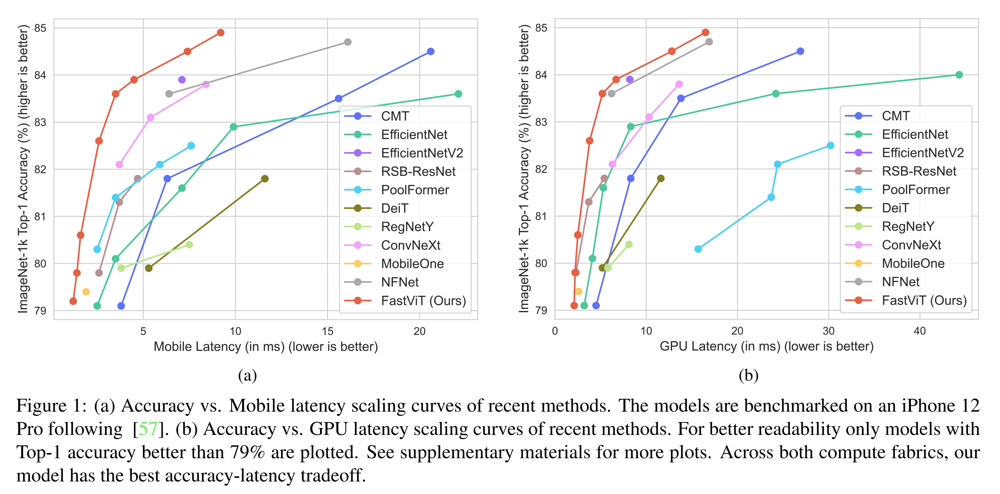

* Fig. 1 에서 저자는 ImageNet Top-1 accuracy 가 83.9% 일 때, 저자의 model 이 iPhone 12 Pro mobile device 에서 EfficientNet-B5 보다 4.9× 더 빠르고, EfficientNetV2-S 보다 1.6× 더 빠르며, CMT-S 보다 3.5× 더 빠르고, ConvNeXt-B 보다 1.9× 더 빠름을 보인다. 
* ImageNet Top-1 accuracy 가 84.9% 일 때 저자의 model 은 desktop GPU 에서 NFNet-F1 과 동일한 속도를 보이면서도 크기는 66.7% 더 작고, FLOPs 는 50.1% 더 적으며, mobile device 에서는 42.8% 더 빠르다. 
* iPhone 12 Pro mobile device 에서 latency 가 0.8 ms 일 때, 저자의 model 은 ImageNet 에서 MobileOne-S0 보다 4.2% 더 높은 Top-1 accuracy 를 얻는다. 
* MS COCO 에서 Mask-RCNN head 를 사용하는 object detection 및 instance segmentation 에 대해, 저자의 model 은 CMT-S 와 비교 가능한 performance 를 달성하면서 backbone latency 는 4.3× 더 낮다. 
* ADE20K 에서 semantic segmentation 에 대해, 저자의 model 은 iPhone 12 Pro mobile device 에서 PoolFormer-M36 보다 5.2% 향상되면서 backbone latency 는 1.5× 더 낮다. 
* 3D hand mesh estimation task 에서 저자의 model 은 GPU benchmark 기준으로 MobileHand 보다 1.9× 더 빠르고 최근 state-of-the-art 인 MobRecon 보다 2.8× 더 빠르다.

accuracy metric 외에도 저자는 corruption 과 out-of-distribution sample 에 대한 model 의 robustness 를 연구하는데, 이는 항상 accuracy 와 잘 상관되는 것은 아니다. 

* 예를 들어, PVT 는 ImageNet dataset 에서 매우 경쟁력 있는 performance 를 달성하지만, corruption 과 out-of-distribution sample 에 대한 robustness 는 매우 낮다고 보고되었다. 
* 실제 응용에서 이러한 상황에서 robust model 을 사용하면 user experience 를 크게 향상시킬 수 있다. 
* 저자는 popular benchmark 에서 저자 architecture 의 robustness 를 입증하고, 저자의 model 이 corruption 과 out-of-distribution sample 에 대해 매우 robust 하면서도 경쟁 robust model 보다 상당히 더 빠름을 보인다. 

요약하면, 저자의 기여는 다음과 같다.

* 저자는 structural reparameterization 을 사용하여 더 낮은 memory access cost 와 더 높은 capacity 를 얻는 hybrid vision transformer 인 FastViT 를 소개하며, state-of-the-art accuracy-latency trade-off 를 달성한다.
* 저자는 저자의 model 이 널리 사용되는 두 platform 인 mobile device 와 desktop GPU 에서 latency 측면에서 가장 빠름을 보인다.
* 저자는 저자의 model 이 image classification, object detection, semantic segmentation, 그리고 3D hand mesh regression 과 같은 많은 task 로 generalize 됨을 보인다.
* 저자는 저자의 model 이 corruption 과 out-of-distribution sample 에 대해 robust 하며, 경쟁 robust model 보다 상당히 더 빠름을 보인다.

# 2. Related Work

지난 10 년 동안 convolutional neural network 는 vision model 의 표준 architecture 였다. 더 최근에는 transformer 가 computer vision task 에서 큰 성공을 보여주었다. 

convolutional layer 와 달리, vision transformer 의 self-attention layer 는 long-range dependency 를 modeling 함으로써 global context 를 제공한다. 

불행히도 이러한 global scope 는 종종 높은 computational cost 를 수반한다. 여러 연구는 self-attention layer 와 관련된 computation cost 를 완화하는 방법을 다룬다. 이 연구에서 저자는 더 낮은 latency 를 위한 self-attention layer 의 efficient alternative 를 탐구한다.

#### Hybrid Vision Transformers

accuracy 를 유지하면서 efficient network 를 설계하기 위해, 최근 연구들은 convolutional 과 transformer design 을 결합한 hybrid architecture 를 도입하여 local information 과 global information 을 효과적으로 포착한다. 

일부 design 은 patchify stem 을 convolutional layer 로 대체하고, 초기 convolutional stage 를 도입하거나, windowed attention 을 통해 암묵적으로 hybridize 한다. 

더 최근의 연구들은 token (또는 patch) 사이의 정보 교환을 더 잘 수행하기 위해 명시적인 hybrid structure 를 구축한다. 대부분의 hybrid architecture 에서 token mixer 는 주로 self-attention 기반이다. 최근 MetaFormer 는 token mixing 을 위한 단순하고 효율적인 후보로 Pooling 을 도입하였다.

#### Structural Reparameterization

최근 연구는 memory access cost 를 낮추기 위해 skip connection 을 reparameterize 하는 이점을 보였다. 저자의 model 에서 저자는 inference 시 reparameterizable 한 새로운 architectural component 인 RepMixer 를 도입한다. 

더 나은 efficiency 를 위해, 여러 연구는 depthwise 또는 grouped convolution 뒤에 $1 \times 1$ pointwise convolution 이 오는 factorized $k \times k$ convolution 을 도입한다. 

이 접근법은 model 의 전체 efficiency 를 향상시키는 데 매우 효과적이지만, 더 낮은 parameter count 는 reduced capacity 로 이어질 수 있다. 최근 linear train-time overparameterization 이 이러한 model 의 capacity 를 향상시키기 위해 도입되었다. 

저자는 저자의 model 에서 factorized $k \times k$ convolution 을 사용하고, linear train-time overparameterization 을 사용하여 이러한 layer 의 capacity 를 높인다. 저자가 아는 한, skip connection 을 제거하기 위한 structural reparameterization 과 linear overparameterization 은 이전의 어떤 hybrid transformer architecture 에서도 시도된 바 없다.

# 3. Architecture

## 3.1. Overview

FastViT 는 hybrid transformer 이며, Fig. 2 에서 보인 바와 같이 서로 다른 scale 에서 동작하는 네 개의 구분된 stage 를 가진다. 저자는 모든 FastViT variant 를 Tab. 2 에 자세히 제시한다. 

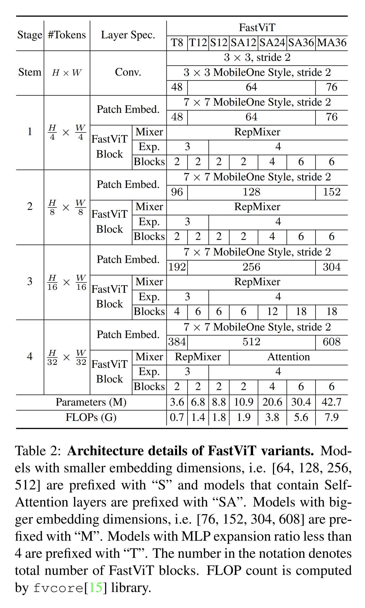

* FastViT 는 skip connection 을 reparameterize 하는 token mixer 인 RepMixer 를 사용하는데, 이는 memory access cost 를 완화하는 데 도움이 된다 (Fig. 2d 참조). 
* efficiency 와 performance 를 추가로 향상시키기 위해, 저자는 stem 및 patch embedding layer 에서 일반적으로 사용되는 dense $k \times k$ convolution 을 train-time overparameterization 을 사용하는 factorized version 으로 대체한다 (Fig. 2a 참조).
* self-attention token mixer 는 계산 비용이 크며, 특히 높은 resolution 에서 더욱 그렇다. 
  * self-attention layer 의 efficient version 이 연구되었지만, 저자는 network architecture 의 초기 stage 에서 receptive field 를 개선하기 위한 efficient alternative 로 large kernel convolution 을 사용한다 (Fig. 2c 참조).

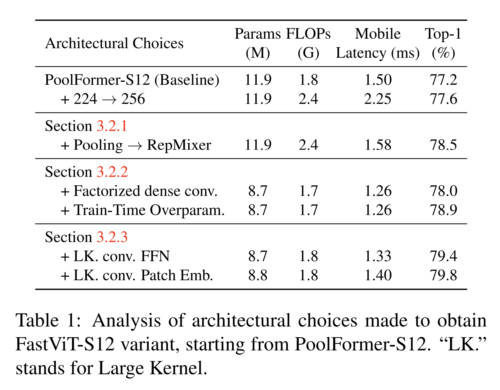

저자는 Tab. 1 에서 PoolFormer baseline 으로부터 FastViT 를 설계할 때의 다양한 architectural choice 를 분석하고, 아래에서 저자의 접근법을 상세히 설명한다.

## 3.2. FastViT

#### 3.2.1 Reparameterizing Skip Connections

RepMixer  Convolutional mixing 은 처음에 ConvMixer 에서 도입되었다. input tensor $X$ 에 대해, 해당 layer 의 mixing block 은 다음과 같이 구현되었다.

$$
Y = \texttt{BN(}\sigma \texttt{(DWConv(}X\texttt{)))} + X \tag{1}
$$

* 여기서 $\sigma$ 는 non-linear activation function 이고, 
* $\texttt{BN}$ 은 Batch Normalization layer 이며, 
* $\texttt{DWConv}$ 는 depthwise convolutional layer 이다. 

이 block 이 효과적임이 보였지만, RepMixer 에서 저자는 아래와 같이 연산을 단순히 재배열하고 non-linear activation function 을 제거한다.

$$
Y = \texttt{DWConv(BN(}X\texttt{)}+ X \tag{2}
$$

저자의 설계의 주요 이점은 inference time 에 아래와 같이 하나의 depthwise convolutional layer 로 reparameterize 될 수 있다는 점이며, 이는 Fig. 2d 에도 제시되어 있다.

$$
Y = \texttt{DWConv(}X\texttt{)} \tag{3}
$$

* Positional Encodings  저자는 input token 의 local neighborhood 에 따라 동적으로 생성되고 conditioned 되는 conditional positional encoding 을 사용한다. 
* 이러한 encoding 은 depth-wise convolution operator 의 결과로 생성되며, patch embedding 에 더해진다. 
* 이 연산 group 에 non-linearity 가 없다는 점에 유의해야 하며, 따라서 이 block 은 Fig. 2a 에서 보인 바와 같이 reparameterize 된다.

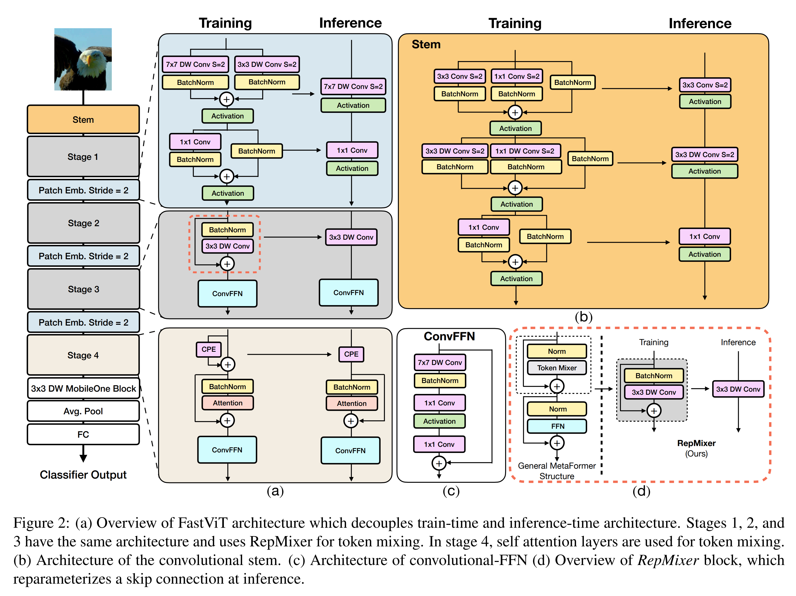

* Empirical Analysis  skip connection reparameterization 의 이점을 검증하기 위해, 저자는 가장 efficient 한 token mixer 중 하나인 Pooling 과 RepMixer 를 MetaFormer S12 architecture 에서 ablation 한다. 
* ablation 되는 두 model 은 모두 약 $1.8$ G FLOPs 를 가진다. 
* 저자는 iPhone 12 Pro mobile device 에서 $224 \times 224$ 부터 $1024 \times 1024$ 까지 다양한 input resolution 에 대해 model 의 시간을 측정한다. 

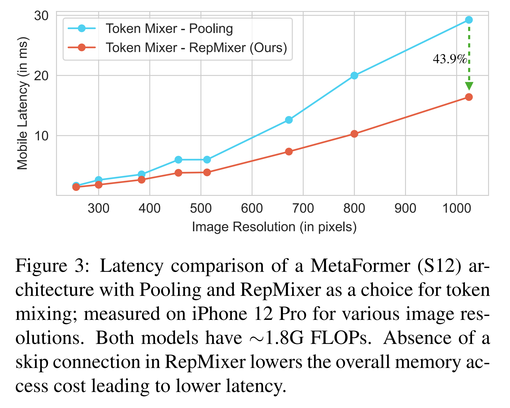

* Fig. 3 에서 볼 수 있듯이, RepMixer 는 특히 더 높은 resolution 에서 Pooling 대비 큰 향상을 보인다. 
* $384 \times 384$ 에서 RepMixer 를 사용하면 latency 가 $25.1%$ 감소하며, $1024 \times 1024$ 와 같은 더 큰 resolution 에서는 latency 가 $43.9%$ 만큼 크게 감소한다.

#### 3.2.2 Linear Train-time Overparameterization

efficiency (parameter count, FLOPs, latency) 를 더 향상시키기 위해, 저자는 모든 dense $k \times k$ convolution 을 factorized version, 즉 $k \times k$ depthwise convolution 다음에 $1 \times 1$ pointwise convolution 이 오는 형태로 대체한다. 그러나 factorization 으로 인한 더 낮은 parameter count 는 model 의 capacity 를 약화시킬 수 있다. 

factorized layer 의 capacity 를 높이기 위해, 저자는 MobileOne 에서 설명된 바와 같은 linear train-time overparameterization 을 수행한다. stem, patch embedding, projection layer 에서의 MobileOne-style overparameterization 은 performance 향상에 도움이 된다. 

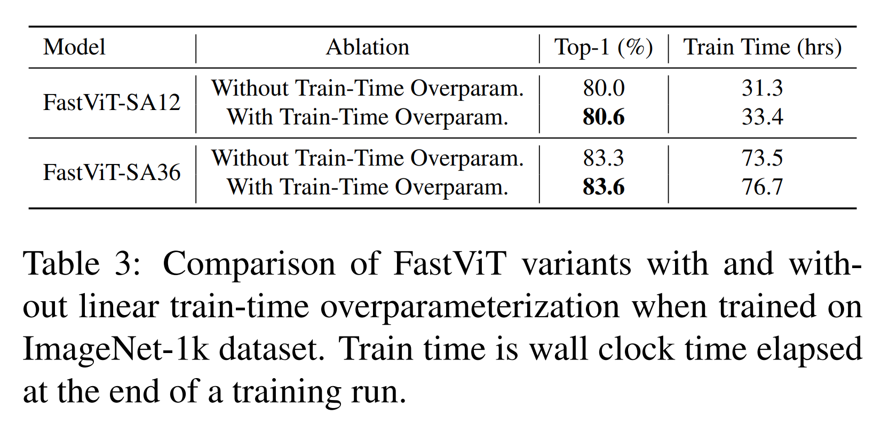

* Tab. 3 에서 train-time overparameterization 이 FastViT-SA12 model 의 ImageNet Top-1 accuracy 를 $0.6%$ 향상시키는 것을 확인할 수 있다. 
* 더 작은 FastViT-S12 variant 에서는 Tab. 1 에서 보인 바와 같이 Top-1 accuracy 가 $0.9%$ 향상된다.

그러나 train-time overparameterization 은 추가된 branch 로부터의 computational overhead 로 인해 training time 증가를 초래한다. 

* 저자의 architecture 에서 저자는 위에서 설명한 것처럼 dense $k \times k$ convolution 을 factorized form 으로 대체하는 layer 에 대해서만 overparameterization 을 적용한다. 
  * 이러한 layer 는 convolutional stem, patch embedding, projection layer 에 존재한다. 
* 이 layer 에서 발생하는 computation cost 는 network 의 나머지 부분보다 낮기 때문에, 이 layer 들을 overparameterize 하더라도 training time 이 크게 증가하지는 않는다. 
  * 예를 들어, Sec. 4.1 에서 설명된 동일한 설정 아래에서 train-time overparameterization 을 사용하면, 이를 사용하지 않고 동일 variant 를 training 하는 경우와 비교해 FastViT-SA12 는 $6.7%$ 더 오래 걸리고 FastViT-SA36 은 $4.4%$ 더 오래 걸린다.

#### 3.2.3 Large Kernel Convolutions

RepMixer 의 receptive field 는 self-attention token mixer 에 비해 local 하다. 그러나 self-attention 기반 token mixer 는 계산 비용이 크다. 

self-attention 을 사용하지 않는 초기 stage 의 receptive field 를 계산 효율적으로 개선하는 한 가지 방법은 depthwise large kernel convolution 을 도입하는 것이다. 

저자는 FFN 및 patch embedding layer 에 depthwise large kernel convolution 을 도입한다. 

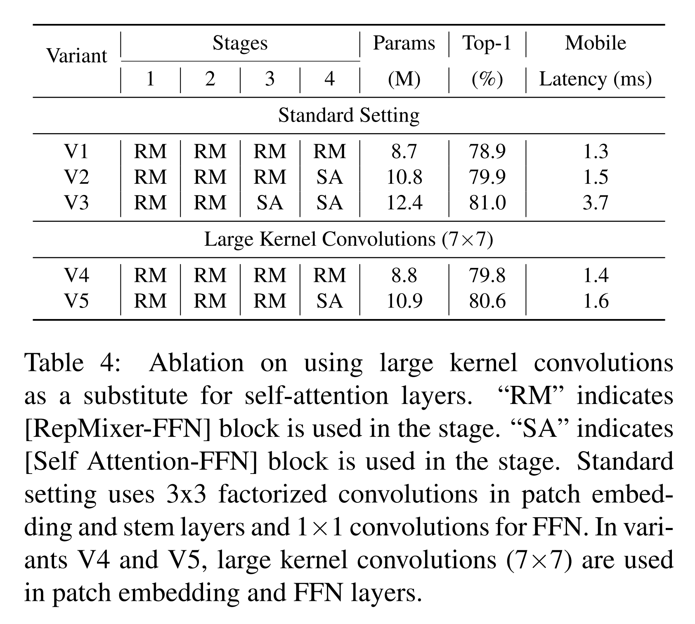

* Tab. 4 에서 depthwise large kernel convolution 을 사용하는 variant 가 latency 의 소폭 증가만을 수반하면서 self-attention layer 를 사용하는 variant 와 매우 경쟁력 있을 수 있음을 확인할 수 있다.
* V5 와 V3 를 비교하면, model size 는 $11.2%$ 증가하고 latency 는 $2.3 \times$ 증가하지만, Top-1 accuracy 향상은 상대적으로 작은 $0.4%$ 이다.
* V2 는 V4 보다 $20%$ 더 크고 latency 는 $7.1%$ 더 높지만, ImageNet 에서 유사한 Top-1 accuracy 를 달성한다.

kernel size 와 latency 에 대한 추가 ablation 은 supplementary materials 에 제공된다. 

* Tab. 1 에서 저자는 FFN 및 patch embedding layer 에서의 large kernel convolution 을 ablation 한다. 
* 전체적으로, large kernel convolution 은 FastViT-S12 에서 Top-1 accuracy 를 $0.9%$ 향상시킨다.

저자의 FFN 및 patch embedding layer architecture 는 Fig. 2 에 제시되어 있다. 

* 저자의 FFN block 은 몇 가지 핵심적인 차이를 제외하면 ConvNeXt block 과 유사한 구조를 가진다 (Fig. 2c 참조).
* 저자는 Layer Normalization 대신 Batch Normalization 을 사용한다. 이는 inference 시 앞선 layer 와 fuse 될 수 있기 때문이다.
* 또한 이는 ConvNeXt block 의 원래 구현에서 수행되는 것처럼 LayerNorm 에 적절한 tensor layout 을 얻기 위한 추가 reshape operation 을 요구하지 않는다.

증가된 receptive field 와 함께, large kernel convolution 은 model robustness 향상에도 도움이 되며, 이는 기존 연구에서 관찰되었다. 또한 convolutional-FFN block 은 vanilla-FFN block 보다 일반적으로 더 robust 한 경향이 있음이 관찰되었다. 따라서 large kernel convolution 을 도입하는 것은 model performance 와 robustness 를 향상시키는 효율적인 방법이다.

# 4. Experiments

## 4.1. Image Classification

저자는 널리 사용되는 ImageNet-1K dataset 에 대한 결과를 보고한다. 

* 이 dataset 은 약 $1.3$ M 개의 training image 와 $50$ K 개의 validation image 를 포함한다. 
* 저자는 기존 연구에서 제시된 training recipe 를 따른다. 즉, model 은 총 batch size 를 $1024$ 로 설정하고, weight decay 를 $0.05$, peak learning rate 를 $10^{-3}$ 로 설정한 AdamW optimizer 를 사용하여 $300$ epochs 동안 training 된다. 
* warmup epoch 수는 $5$ 로 설정하고, learning rate decay 에는 cosine schedule 을 사용한다. 
* 저자의 implementation 은 timm library 를 사용하며, 모든 model 은 $8$ 개의 NVIDIA A100 GPU 에서 training 되었다. 
* 모든 variant 에 사용된 hyper parameter 의 자세한 내용은 supplementary materials 를 참조한다. 
* $384 \times 384$ input size 에 대해서는, 기존 연구를 따라 weight decay 를 $10^{-8}$, learning rate 를 $5 \times 10^{-5}$, batch size 를 $512$ 로 설정하고 $30$ epochs 동안 model 을 fine-tune 한다. 
* latency 측정을 위해, 저자는 각 방법에 해당하는 input size 를 사용한다. 
* iPhone latency 측정을 위해, 저자는 Core ML Tools (v6.0) 를 사용하여 model 을 export 하고, iOS 16 이 설치된 iPhone 12 Pro Max 에서 이를 실행하며, 모든 model 에 대해 batch size 는 $1$ 로 설정한다. 
* 저자는 기존 연구와 동일한 protocol 을 따른다. GPU latency 측정을 위해, 저자는 traced model 을 TensorRT (v8.0.1.6) format 으로 export 하고, batch size 를 $8$ 로 설정하여 NVIDIA RTX-2080Ti 에서 실행한다. 저자는 $100$ 회 실행의 median latency estimate 를 보고한다.

Comparison with SOTA Models  Tab. 5 에서 저자는 저자의 model 을 ImageNet-1K dataset 상의 최근 state-of-the-art model 과 비교한다. 

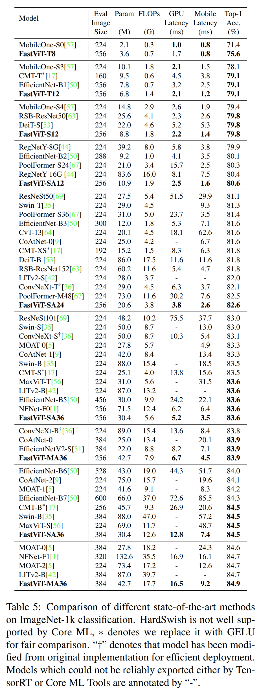

공정한 비교를 위해, 저자는 official implementation 의 ConvNeXt 를 수정하여 비용이 큰 reshape operation 을 피한다. 자세한 내용은 supplementary materials 를 참조한다. 저자는 deformable convolution 에 대한 두 library 의 지원이 좋지 않아 LITv2 를 신뢰성 있게 export 하지 못했다. 

* 저자의 model 은 desktop-grade GPU 와 mobile device 라는 두 가지 서로 다른 compute fabric 에서 최근 state-of-the-art model 과 비교했을 때 가장 우수한 accuracy-latency trade-off 를 달성한다. 
* 저자의 model 은 parameter count 와 FLOPs 모두에서 LITv2 를 능가한다. 
* Top-1 accuracy 가 $84.9%$ 일 때, FastViT-MA36 은 LITv2-B 보다 크기가 $49.3%$ 더 작고 FLOPs 는 $55.4%$ 더 적다. 
* FastViT-S12 는 iPhone 12 Pro 에서 MobileOne-S4 보다 $26.3%$ 더 빠르고, GPU 에서 $26.9%$ 더 빠르다. 
* Top-1 accuracy 가 $83.9%$ 일 때, FastViT-MA36 은 iPhone 12 Pro 에서 최적화된 ConvNeXt-B model 보다 $1.9 \times$ 더 빠르고, GPU 에서 $2.0 \times$ 더 빠르다. 
* Top-1 accuracy 가 $84.9%$ 일 때, FastViT-MA36 은 GPU 에서 NFNet-F1 과 동일한 속도를 보이면서, 크기는 $66.7%$ 더 작고 FLOPs 는 $50.1%$ 더 적으며 mobile device 에서는 $42.8%$ 더 빠르다.

Knowledge distillation  저자는 distillation objective 로 training 된 저자의 model 성능을 Tab. 6 에 보고한다. 

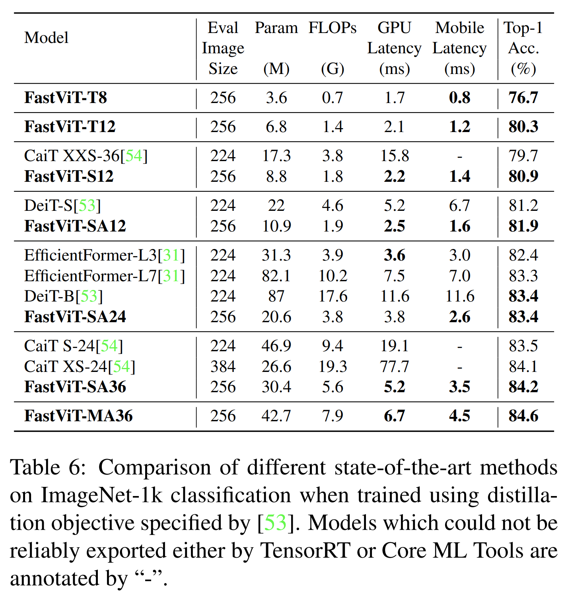

저자는 DeiT 에서 설명된 설정을 따르며, teacher model 로 RegNet16GF 를 사용한다. DeiT 를 따라, 저자는 teacher 의 hard decision 을 true label 로 설정하는 hard distillation 을 사용한다. 저자의 model 은 $300$ epochs 동안 training 된다. 기존 연구들과 달리, 저자는 distillation 을 위해 추가적인 classification head 를 도입하지 않는다. 

* FastViT 는 최근 state-of-the-art model 인 EfficientFormer 를 능가한다. 
* FastViT-SA24 는 EfficientFormer-L7 과 유사한 성능을 달성하면서도, parameter 수는 $3.8 \times$ 더 적고, FLOPs 는 $2.7 \times$ 더 적으며, latency 는 $2.7 \times$ 더 낮다.

## 4.2. Robustness Evaluation

저자는 다음 benchmark 에서 out-of-distribution robustness 에 대해 저자의 model 을 평가한다.

* (i) ImageNet-A: ResNet 이 오분류하는 자연 발생 example 을 포함하는 dataset
* (ii) ImageNet-R: 서로 다른 texture 와 local image statistics 를 가지는 ImageNet object class 의 natural rendition 을 포함하는 dataset
* (iii) ImageNet-Sketch: google image query 를 사용하여 얻은, 모든 ImageNet class 의 흑백 sketch 를 포함하는 dataset
* (iv) ImageNet-C: ImageNet test-set 에 algorithmically generated corruption (blur, noise) 을 적용하여 구성한 dataset

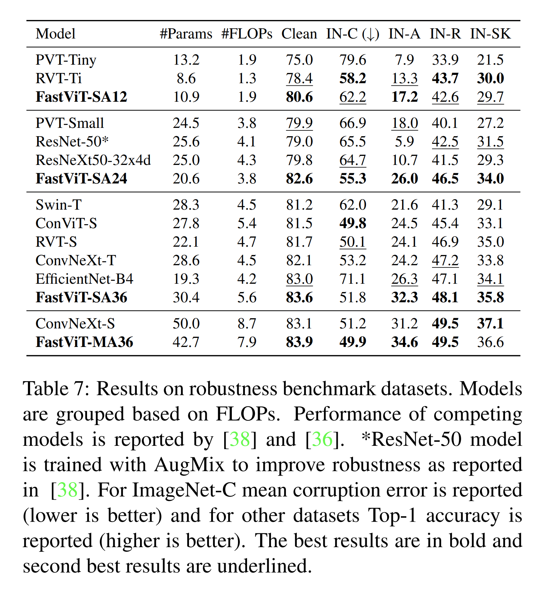

저자는 기존 연구에서 제공한 implementation 을 사용하여 저자의 model 을 평가한다. 저자의 model 은 최근 vision transformer 보다 더 robust 하며, Tab. 7 에서 보이듯이 낮은 robustness 를 보이는 pure-CNN 기반 model 보다 더 빠르다. 

* Sec. 3.2.3 에서 논의한 바와 같이, self-attention layer 와 결합하여 FFN 및 patch-embedding layer 에 large kernel convolution 을 사용하는 architectural choice 는 저자의 model 의 robustness 향상에 도움이 된다. 
* Tab. 7 에서 비교된 모든 model 은 유사한 training recipe 를 사용하여 ImageNet-1K dataset 에서만 training 되었다. 
* Tab. 7 로부터, 저자의 model 은 RVT 및 ConvNeXt 와 매우 경쟁력 있다. 
* 실제로 FastViT-M36 은 저자의 model 보다 parameter 가 $6.1$ M 더 많고 FLOPs 가 $10%$ 더 많은 ConvNeXt-S 와 비교하여 더 나은 clean accuracy, 더 나은 corruption robustness, 그리고 유사한 out-of-distribution robustness 를 가진다.

## 4.3. 3D Hand mesh estimation

최근 real-time 3D hand mesh estimation 연구는 CNN 기반 backbone 위에 복잡한 mesh regression layer 를 도입한다. backbone 은 대개 ResNet 또는 MobileNet 계열 architecture 에 속하며, feature extraction 에 HRNet 을 사용하는 METRO 및 MeshGraphormer 가 예외이다. 대부분의 hardware device 는 2D CNN 으로부터의 feature extraction 에 대해 매우 최적화되어 있지만, 이러한 방법에서 사용되는 복잡한 mesh regression head 에 대해서는 그렇지 않다. 

저자의 방법에서는 복잡한 mesh regression head 를 MANO model 의 weak perspective camera, pose, shape parameter 를 regression 하는 단순한 regression module 로 대체한다. 저자는 underlying image 에 대해 좋은 representation 을 학습하는 feature extraction backbone 을 사용하면 mesh regression 의 학습 어려움을 완화할 수 있다고 주장한다. 다른 real-time 방법들이 약한 feature extraction backbone 을 복잡한 mesh regression layer 로 보완하는 반면, 저자는 더 나은 feature extraction backbone 과 단순한 mesh regression layer 를 사용한다.

저자는 FreiHand dataset 에서 다른 공개된 방법과 저자의 접근법을 비교한다. 공정한 비교를 위해, 일부 방법은 추가적인 pose dataset 으로 pre-train, train, 또는 fine-tune 하므로, 저자는 FreiHand dataset 만을 training 에 사용한 방법의 결과만 인용한다. 저자는 pre-training 에는 ImageNet-1K dataset 만을 사용하고, 이후 기존 연구에서 설명된 experimental setup 을 사용하여 FreiHand dataset 에서만 exclusively training 한다. 자세한 내용은 supplementary materials 를 참조한다. 

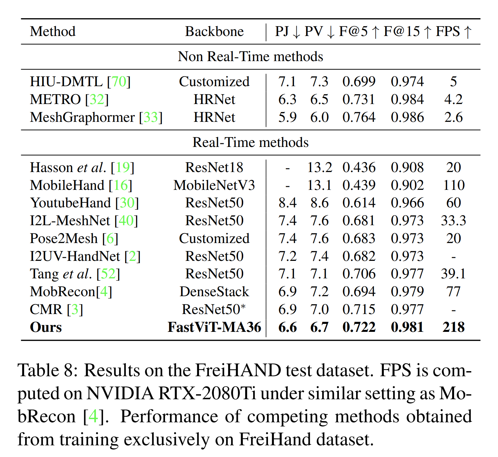

* Tab. 8 로부터, real-time method 가운데 저자의 방법은 모든 joint 및 vertex error 관련 metric 에서 다른 방법을 능가하면서, MobileHand 보다 $1.9 \times$ 더 빠르고 최근 state-of-the-art 인 MobRecon 보다 $2.8 \times$ 더 빠르다.

## 4.4. Semantic Segmentation and Object Detection

* semantic segmentation 에 대해, 저자는 ADE20K 에서 저자의 model 성능을 검증한다. 
  * 이 dataset 은 $150$ 개의 semantic category 와 함께 $20$ K 개의 training image 와 $2$ K 개의 validation image 를 포함한다. 
* 저자는 Semantic FPN decoder 를 사용하여 semantic segmentation model 을 training 한다. 
* Semantic FPN head 를 사용하는 model 은 기존 연구와 동일한 설정을 사용한다. 
* 모든 model 은 대응되는 image classification model 의 pretrained weight 로 initialization 된다. FLOPs 와 backbone latency 는 $512 \times 512$ image crop 에서 추정된다. 
* input image 의 resolution 이 더 높기 때문에, Tab. 9 와 Tab. 10 모두에서 GPU latency 는 batch size $2$ 에 대해 추정된다. 

Tab. 9 에서 저자는 저자의 model 을 최근 연구와 비교한다. 

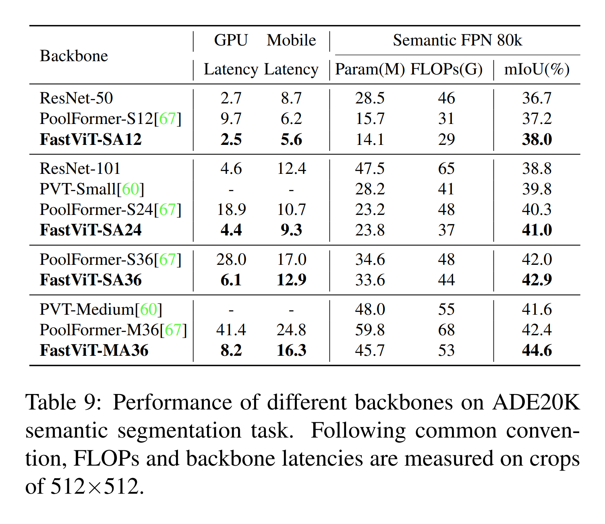

* FastViT-MA36 model 은 desktop GPU 와 mobile device 모두에서 더 높은 FLOPs, parameter count, latency 를 가지는 PoolFormer-M36 보다 $5.2%$ 더 높은 mIoU 를 얻는다.
* 저자는 $80$ 개 class 를 가지며 $118$ K 개의 training image 와 $5$ K 개의 validation image 를 포함하는 MS-COCO dataset 에서 object detection 을 training 한다. 

Tab. 10 에서 저자는 저자의 model 을 최근 연구와 비교한다. 

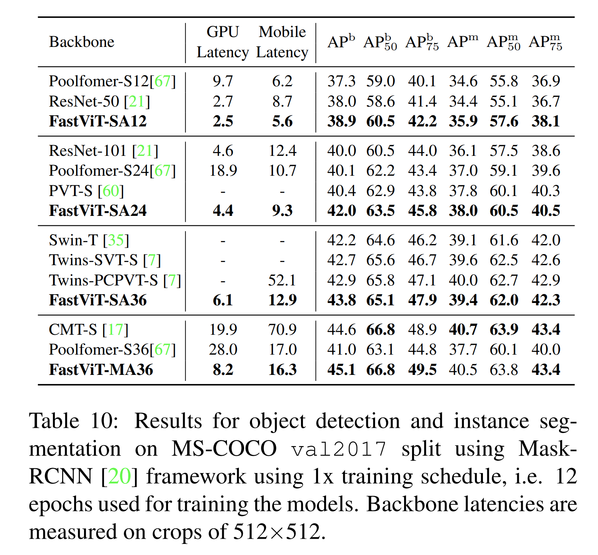

* 모든 model 은 Mask-RCNN head 를 사용하여 기존 연구를 따라 $1 \times$ schedule 로 training 된다. 모든 model 은 대응되는 image classification model 의 pretrained weight 로 initialization 된다. 
* 저자는 저자의 model 이 여러 latency regime 에서 state-of-the-art performance 를 달성함을 보인다. 
* FastViT-MA36 model 은 CMT-S 와 유사한 성능을 가지면서, desktop GPU 에서 $2.4 \times$, mobile device 에서 $4.3 \times$ 더 빠르다.

# 5. Conclusion

저자는 mobile device 와 desktop-grade GPU 라는 여러 compute fabric 에서 매우 efficient 한 범용 hybrid vision transformer 를 제안하였다. 

structural reparameterization 을 통해, 저자의 model 은 감소된 memory access cost 를 가진다. 이는 특히 더 높은 resolution 에서 runtime 의 상당한 향상으로 이어진다. 

또한 저자는 ImageNet classification task 와 object detection, semantic segmentation, 3D hand mesh estimation 과 같은 다른 downstream task 에서 성능을 향상시키는 추가적인 architectural change 를 제안한다. 

저자는 저자의 backbone 이 out-of-distribution sample 에 대해 매우 robust 하면서도, 경쟁하는 robust model 보다 상당히 더 빠르다는 것을 경험적으로 보인다.
