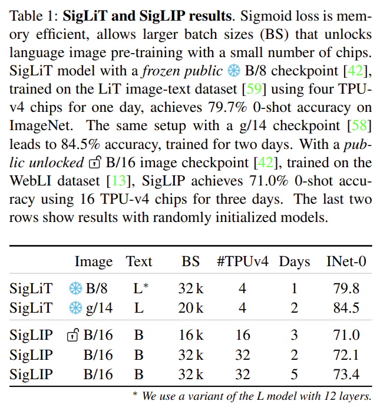
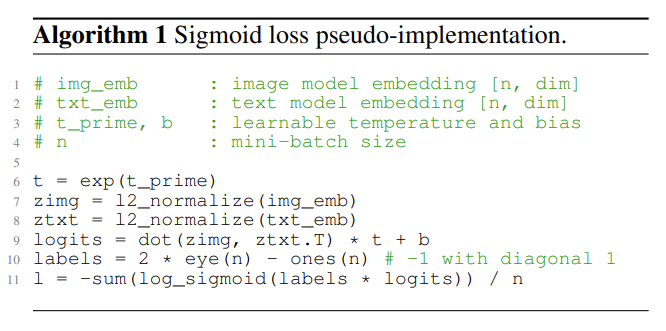
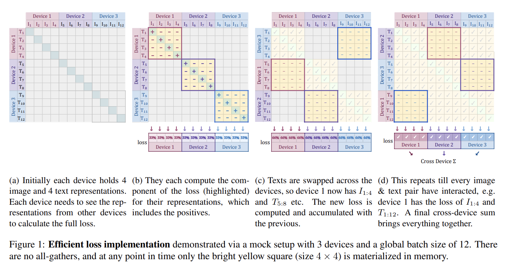
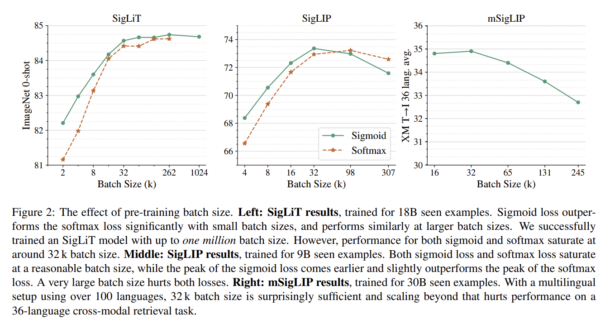
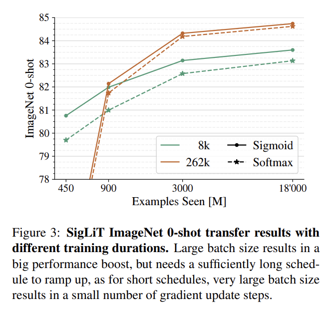
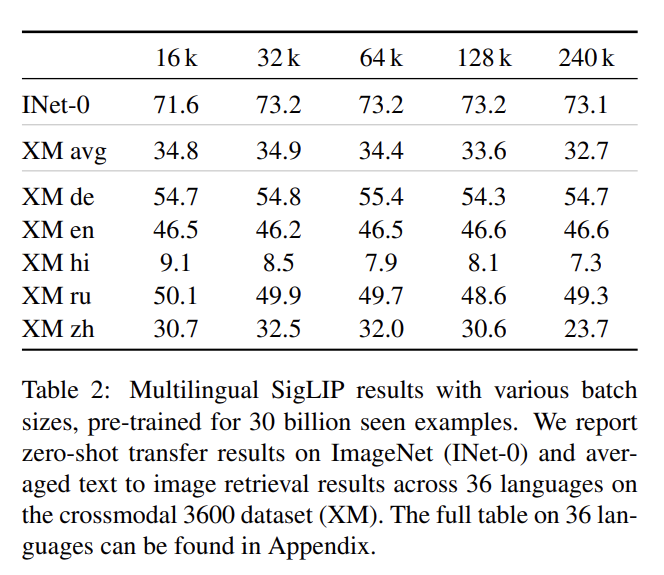
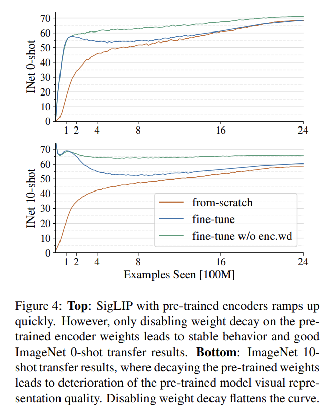
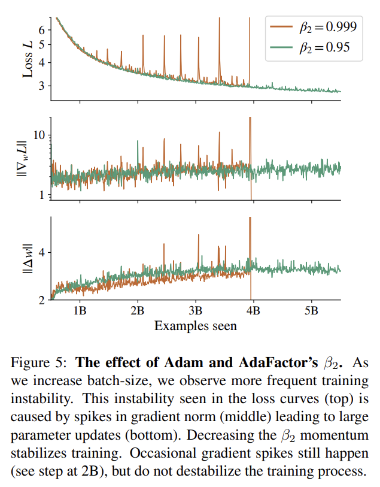

논문 및 이미지 출처 : <https://arxiv.org/pdf/2303.15343>

# Abstract

저자는 **Language-Image Pre-training (SigLIP)** 을 위한 간단한 **pairwise Sigmoid loss** 를 제안한다. 

* standard contrastive learning 이 softmax normalization 을 사용하는 것과 달리, sigmoid loss 는 오직 image-text pair 에 대해서만 작동하며 normalization 을 위해 pairwise similarity 전체에 대한 global view 를 필요로 하지 않는다. 
* sigmoid loss 는 batch size 를 더 크게 scaling up 할 수 있게 하는 동시에, 더 작은 batch size 에서도 더 나은 성능을 보인다. 
* **Locked-image Tuning** 과 결합하면, 단 4 개의 TPUv4 chip 만으로 2 일 안에 84.5% 의 ImageNet zero-shot accuracy 를 달성하는 SigLiT model 을 학습할 수 있다. 
* 또한 loss 에서 batch size 가 disentangle 되므로 examples 대 pairs 의 영향과 negative 대 positive ratio 의 영향을 연구할 수 있다. 
* 마지막으로, 저자는 batch size 를 최대 100 만까지 극단적으로 확장하고, batch size 증가의 이점이 빠르게 감소하며 32 k 정도의 더 합리적인 batch size 로도 충분하다는 것을 발견한다. 

저자는 model 을 공개하며, 저자의 연구가 language-image pre-training 의 quality 와 efficiency 를 개선하기 위한 추가적인 탐구를 촉진하기를 바란다.

# 1. Introduction

web 상에서 수집한 image-text pair 의 weak supervision 을 사용하는 contrastive pre-training 은 generic computer vision backbone 을 얻기 위한 대표적인 방법이 되고 있으며, large labelled multi-class dataset 에 대한 pre-training 을 점차 대체하고 있다. 이 접근의 high-level idea 는 paired data 를 사용하여 image 와 text 를 위한 aligned representation space 를 동시에 학습하는 것이다. 대표적인 연구인 CLIP 과 ALIGN 은 이 접근이 large scale 에서 가능하다는 점을 확립했으며, 그 성공 이후 많은 large image-text dataset 이 private 형태와 public 형태로 이용 가능해졌다.

이러한 model 을 pre-train 하기 위한 standard recipe 는 *image-text contrastive objective* 를 활용한다. 

* 이것은 matching 되는 positive image-text pair 에 대해 image embedding 과 text embedding 을 정렬시키는 동시에, 관련 없는 negative image-text pair 가 embedding space 에서 서로 dissimilar 하도록 만든다. 
* 이는 batch-level softmax-based contrastive loss 를 통해 달성되며, 모든 image 에 대해 한 번, 모든 text 에 대해 한 번 적용되어 pairwise similarity score 를 normalize 한다. 
* softmax 의 naive implementation 은 수치적으로 unstable 하므로, 일반적으로 softmax 를 적용하기 전에 최대 input value 를 빼는 방식으로 안정화되며, 이를 위해 전체 batch 에 대한 추가적인 pass 가 필요하다.

이 논문에서 저자는 더 단순한 대안을 제안한다. 바로 **sigmoid loss** 이다. 

* 이 loss 는 전체 batch 에 걸친 어떤 연산도 필요로 하지 않으므로 distributed loss implementation 을 크게 단순화하고 efficiency 를 높인다. 
* 또한 개념적으로 batch size 를 task 정의로부터 decouple 한다. 

저자는 제안한 sigmoid loss 를 여러 setup 에서 standard softmax loss 와 비교한다. 

* 특히 저자는 image-text learning 을 위한 두 가지 대표적 접근인 CLIP 과 LiT 에 sigmoid-based loss 를 적용하여 각각 sigmoid language image pre-training (SigLIP) 과 sigmoid LiT (SigLiT) 라고 부른다. 
* 저자는 batch size 가 16 k 보다 작을 때 sigmoid loss 가 softmax loss 보다 유의미하게 더 좋은 성능을 보인다는 것을 발견한다. 
  * train batch size 가 커질수록 그 차이는 줄어든다. 
* 중요한 점은 sigmoid loss 가 symmetric 하고, 단 한 번의 pass 만 필요하며, 일반적인 implementation 에서는 softmax loss 보다 적은 memory 를 요구한다는 것이다. 
  * 이로 인해 batch size 가 100 만인 SigLiT model 의 성공적인 training 이 가능해진다. 
* 그러나 저자는 softmax 와 sigmoid 모두에서 batch size 증가에 따라 성능이 saturation 된다는 것을 발견한다. 
  * 다행인 점은 32 k 정도의 합리적인 batch size 로도 image-text pre-training 에 충분하다는 것이다. 

이 결론은 100 개 이상의 language 에 대한 multilingual SigLIP training 에도 그대로 적용된다.

* Tab. 1 에서 저자는 training 에 moderate 한 수의 TPUv4 chip 만 필요한 image-text pre-training setup 을 제시한다. 
* SigLiT 는 놀라울 정도로 efficient 하며, 4 개 chip 에서 단 하루 만에 ImageNet 에서 79.7% 의 zero-shot accuracy 에 도달한다. 
* 더 많은 계산을 요구하는 SigLIP 의 from-scratch training 은 32 개 TPUv4 chip 으로 5 일 만에 73.4% 의 zero-shot accuracy 에 도달한다. 
  * 이는 각각 약 5 일과 10 일이 필요한 FLIP 과 CLIP 과 비교해도 유리하다. 
* 저자는 pre-trained vision backbone 을 SigLIP 에서 fine-tuning 할 때, Tab. 1 에 표시된 설정에서 pre-trained backbone 에 대한 weight decay 를 비활성화하면 더 좋은 결과를 얻는다는 것을 발견했다. 

자세한 내용은 Fig. 4 를 참조한다. 저자는 저자의 연구가 아직 초기 단계인 language-image pre-training 분야를 더 접근 가능하게 만드는 길을 열기를 바란다.

# 2. Related Work

#### Contrastive learning with the sigmoid loss

한 선행 연구는 unsupervised dimensionality reduction task 를 위해 유사한 sigmoid loss 를 제안했다. 

contrastive image-text learning 의 범위에서는 대다수의 연구가 InfoNCE loss 에 기반한 softmax-based loss 를 사용한다. supervised classification 에서는 sigmoid loss 가 softmax loss 보다 약간 더 효과적이고 robust 하다는 것이 이미 보여졌다.

#### Contrastive language-image pre-training

Contrastive language-image pre-training 은 CLIP 과 ALIGN 이 large-scale image-text dataset 에 softmax contrastive learning 을 적용한 이후 대중화되었다. 두 model 모두 classification 과 retrieval 을 포함한 zero-shot transfer task 에서 매우 좋은 성능을 보인다. 

후속 연구들은 contrastively pre-trained model 이 fine-tuning, linear regression, object detection, semantic segmentation, 그리고 video task 를 위한 좋은 representation 을 생성한다는 것을 보여준다.

#### Generative language-image pre-training

softmax contrastive pre-training 외에도 다양한 대안이 제안되었다.

* GIT, SimVLM, LEMON 은 대신 generative text decoder 를 사용하여 model 을 성공적으로 pre-train 한다.
* CoCa 는 이러한 decoder 를 discriminative CLIP/ALIGN setup 에 추가하여, 두 접근의 장단점을 하나의 매우 강력한 model 에 결합한다.
* BLIP 은 더 나아가 generative decoder 를 사용해 더 나은 caption 을 생성하고, model 의 discriminative 부분을 사용해 pair 를 filtering 하는 CapFilt 를 제안한다.

Language-Image pre-training 은 매우 활발한 분야이며, survey 는 빠르게 outdated 된다.

#### Efficient language-image pre-training

반면, language-image pre-training 을 더 efficient 하게 만들려는 연구는 많지 않다. 

* LiT 와 FLIP 은 주목할 만한 시도이며, 전자는 pre-trained 되어 고정된 backbone 을 필요로 하고, 후자는 visual token 을 무작위로 제거함으로써 quality 를 희생한다. 
* BASIC 과 LAION 은 많은 수백 개의 chip 을 사용하여 batch size scaling 을 다루지만, 각각 16 k 와 160 k 까지만 확장한다. 
* 또한 전자의 경우 large private classification dataset 도 함께 섞어 사용한다. 
* 최근의 Lion optimizer 는 유사한 quality 에 도달하기 위한 training cost 를 줄일 수 있다고 주장한다.

# 3. Method

이 section 에서 저자는 먼저 널리 사용되는 softmax-based contrastive loss 를 검토한다. 그런 다음 pairwise sigmoid loss 를 소개하고, 그 efficient implementation 을 논의한다.

mini-batch $B = \{ (I_1, T_1), (I_2, T_2), \ldots \}$ 의 image-text pair 가 주어졌을 때, 

* contrastive learning objective 는 matching pair $(I_i, T_i)$ 의 embedding 이 서로 align 되도록 장려하는 한편, 
* matching 되지 않는 pair $(I_i, T_{j \ne i})$ 의 embedding 은 서로 멀어지도록 만든다. 
* practical 한 목적을 위해, 모든 image $i$ 에 대해 다른 image $j$ 에 연결된 text 는 $i$ 와 관련이 없고, 그 반대도 마찬가지라고 가정한다. 
  * 이 가정은 일반적으로 noisy 하고 imperfect 하다.

## 3.1. Softmax loss for language image pre-training

이 objective 를 formalize 하기 위해 softmax loss 를 사용할 때, image model $f(\cdot)$ 와 text model $g(\cdot)$ 는 다음 objective 를 minimize 하도록 학습된다:

$$
-\frac{1}{2|B|}\sum_{i=1}^{|B|}
\left(
\overbrace{\log \frac{e^{t x_i \cdot y_i}}{\sum_{j=1}^{|B|} e^{t x_i \cdot y_j}}}^{\text{image}\to \text{ text softmax}}
+
\overbrace{\log \frac{e^{t x_i \cdot y_i}}{\sum_{j=1}^{|B|} e^{t x_i \cdot y_j}}}^{\text{text}\to \text{ image softmax}}
\right)
$$

* $x_i = \frac{f(I_i)}{|f(I_i)|_2}$ 및 $y_i = \frac{g(T_i)}{|g(T_i)|_2}$

이 논문에서 저자는 image 에 대해서는 vision transformer architecture 를, text 에 대해서는 transformer architecture 를 채택한다. softmax loss 의 asymmetry 때문에 normalization 은 image 전체에 대해 한 번, text 전체에 대해 한 번, 독립적으로 두 번 수행된다는 점에 주목해야 한다. scalar $t$ 는 $\exp(t')$ 로 parameterize 되며, 여기서 $t'$ 는 global 하게 자유롭게 학습 가능한 parameter 이다.

## 3.2. Sigmoid loss for language image pre-training

softmax-based contrastive loss 대신, 저자는 global normalization factor 를 계산할 필요가 없는 더 단순한 대안을 제안한다. 

sigmoid-based loss 는 각 image-text pair 를 독립적으로 처리하며, 결과적으로 learning problem 을 모든 pair 조합으로 이루어진 dataset 에 대한 standard binary classification 문제로 바꾼다. 여기서 matching pair $(I_i, T_i)$ 에는 positive label 이 부여되고, 나머지 모든 pair $(I_i, T_{j \ne i})$ 에는 negative label 이 부여된다. 

이 loss 는 다음과 같이 정의된다:

$$
-\frac{1}{|B|}\sum_{i=1}^{|B|}\sum_{j=1}^{|B|}
\log \underbrace{\frac{1}{1 + e^{z_{ij}(-t x_i \cdot y_j + b)}}}_{\mathcal{L}_{ij}}
$$

* 여기서 $z_{ij}$ 는 주어진 image 와 text input 에 대한 label 이며, 
* 두 입력이 pair 인 경우 1 이고 그렇지 않으면 $-1$ 이다. 

initialization 시점에는 많은 negative 로부터 오는 심한 imbalance 가 loss 를 지배하게 되어, 이 bias 를 수정하려는 큰 초기 optimization step 이 발생한다. 

* 이를 완화하기 위해, 저자는 temperature $t$ 와 유사한 추가적인 learnable bias term $b$ 를 도입한다. 
* 저자는 $t'$ 와 $b$ 를 각각 $\log 10$ 과 $-10$ 으로 initialize 한다. 이는 training 이 대략 prior 에 가까운 상태에서 시작되도록 하며, massive 한 over-correction 을 필요로 하지 않게 만든다. 
* Algorithm 1 은 language image pre-training 을 위한 제안된 sigmoid loss 의 pseudocode implementation 을 제시한다.

## 3.3. Efficient “chunked” implementation

Contrastive training 은 일반적으로 data parallelism 을 활용한다. data 가 $D$ 개 device 에 나뉘어 있을 때 loss 를 계산하려면, 모든 embedding 을 gather 해야 하며, 이는 expensive 한 all-gather 를 필요로 하고, 더 중요하게는 pairwise similarity 로 이루어진 memory-intensive 한 $|B| \times |B|$ matrix 를 materialize 해야 한다.

하지만 sigmoid loss 는 memory efficient 하고, 빠르며, numerically stable 한 implementation 에 특히 잘 맞으며, 이 implementation 은 이 두 문제를 모두 완화한다. device 당 batch size 를 $b = \frac{|B|}{D}$ 라고 두면, loss 는 다음과 같이 reformulate 된다:

$$
-\frac{1}{|B|}
\underbrace{\sum_{d_i=1}^{D}}_{\textbf{A: } \forall \text{ device } d_i}
\overbrace{\sum_{d_j=1}^{D}}^{\substack{\textbf{B: } \text{swap negs} \\ \text{across devices}}}
\overbrace{
    \underbrace{\sum_{i=b d_i}^{b(d_i+1)}}_{\substack{\text{all local}\\\text{positives}}}
    \underbrace{\sum_{j=b d_j}^{b(d_j+1)}}_{\substack{\text{negs from} \\ \text{next device}}}
L_{ij}}^{\substack{\textbf{C: } \text{per device} \\ \text{loss}}}
$$

원문에서 이 식은 다음과 같은 의미적 구조로 설명된다.

* A: 모든 device $d_i$ 에 대해 합산
* B: negative 를 device 사이에서 swap
* C: 각 device 에서의 loss

이는 sigmoid loss 에서 특히 단순한데, 각 pair 가 loss 에서 독립적인 term 이기 때문이다. Fig. 1 은 이 method 를 설명한다.

* 이를 말로 설명하면, 저자는 먼저 positive pair 와 $b - 1$ 개의 negative pair 에 대응하는 loss component 를 계산한다. 
* 그런 다음 representation 을 device 사이에서 permute 하여, 각 device 가 이웃한 device 로부터 negative 를 가져오도록 한다. 
  * 이는 합 B 의 다음 iteration 에 해당한다. 
* 그다음 이 chunk 에 대해 loss 를 계산한다. 
  * 이는 합 C 에 해당한다. 
  * 이 과정은 각 device 에서 독립적으로 수행되며, 따라서 각 device 는 자신의 local batch $b$ 에 대해서만 loss 를 계산한다. 
* 이후 loss 는 모든 device 에 걸쳐 단순히 합산될 수 있다. 이는 합 A 에 해당한다.

---

* 개별 collective permute 는 빠르며, 실제로 $D$ 개 device 사이의 두 번의 all-gather 보다 $D$ 번의 collective permute 가 일반적으로 더 빠르다. 
* 또한 어떤 순간의 memory cost 도 $|B|^2$ 에서 $b^2$ 로 줄어든다. 
  * 이는 합 C 에 해당한다. 
* 일반적으로 $|B|$ 의 scaling up 은 accelerator 수를 증가시켜 달성되므로, $b$ 는 일정하게 유지된다. 
* vanilla loss computation 은 batch size 에 대해 quadratic 하므로, scaling up 과정에서 빠르게 bottleneck 이 된다. 
* 이 chunked approach 는 비교적 적은 수의 device 에서도 100 만을 넘는 batch size 로 training 하는 것을 가능하게 했다.

# 4. Results

이 section 에서 저자는 제안한 SigLiT 및 SigLIP model 을 매우 넓은 범위의 batch size 에 걸쳐 평가한다. 저자는 SigLiT 및 SigLIP recipe 를 모두 사용하여, 소수의 accelerator chip 으로 무엇을 달성할 수 있는지 논의한다. 또한 multilingual language image pre-training 에서 batch size 가 미치는 영향도 간단히 논의한다. 저자는 large-batch stabilization modification 과 도입한 learned bias term 의 중요성을 ablation 하며, sigmoid loss 에서 positive pair 와 negative pair ratio 의 효과에 대한 연구를 제시한다. 마지막으로 저자는 SigLIP 의 data noise robustness 를 탐구한다.

저자의 model 을 검증하기 위해, 저자는 ImageNet dataset 에서의 zero-shot transfer result 와 XM3600 dataset 에서 36 개 language 에 걸친 zero-shot retrieval result 를 보고한다. 저자는 모든 experiment 에서 기본적으로 ScalingViT-Adafactor optimizer 를 사용한다.

## 4.1. SigLiT: Scaling batch size to the limit

저자는 LiT 를 따라, ViT-g vision model 을 사용해 image 에 대한 동일한 precomputed embedding 을 사용하고, 동일한 hyperparameter 로 LiT image-text dataset 을 사용하여 base size text tower 를 scratch 부터 학습한다.

저자는 512 부터 1 M 까지 매우 넓은 범위의 batch size 에 대한 연구를 수행하며, contrastive learning 에서 batch size 의 영향을 보여준다. 결과는 Fig. 2 의 왼쪽에 제시된다. 

* batch size 가 16 k 보다 작을 때, sigmoid loss 는 softmax loss 보다 큰 폭으로 더 좋은 성능을 보인다. 
* batch size 가 커질수록, 저자는 softmax loss 가 빠르게 따라잡으며, 충분히 큰 batch size 에서는 sigmoid loss 보다 약간 낮은 성능을 보일 가능성도 관찰한다. 
* 전반적으로 저자는 large batch size 에서도 SigLIP recipe 사용을 권장하는데, 이는 단순성, computation 절감, 그리고 straightforward 한 memory efficient implementation 때문이이다.

contrastive learning 이 large batch size 로부터 이점을 얻는다는 점에는 대체로 합의가 있지만, 기존 연구 대부분은 64 k batch size 에서 멈춘다. 

* 저자는 contrastive learning 의 한계를 탐구하기 위해, 100 만 batch size 에서 SigLiT model 을 성공적으로 학습했다. 
* 놀랍게도 성능은 32 k batch size 에서 saturation 되며, 그 이후 batch size 를 더 키워도 작은 향상만 제공하고, model 은 256 k batch size 에서 peak 에 도달한다. 
* B-sized text model 을 사용하는 저자의 최고 SigLiT 는 ImageNet 에서 84.7% zero-shot transfer accuracy 를 달성하는 반면, 원래 LiT 논문은 10 배 더 큰 g-sized text model 로 약간 더 높은 85.2% score 를 보고한다. 

* Fig. 3 은 서로 다른 batch size 에서 training duration 의 영향을 제시한다. 
* 이는 충분히 긴 시간 동안 학습할 경우, 큰 262 k batch size 가 더 작은 8 k batch size 보다 유의미하게 더 좋은 성능을 보인다는 점을 보여준다. 
* 다만, 짧은 training duration 에서는 큰 batch size 가 absolute 한 update step 수를 더 적게 만들므로, 충분히 올라오기까지 더 많은 시간이 필요하다는 점에 유의해야 한다.

## 4.2. SigLIP: Sigmoid loss is beneficial for language-image pre-training

저자는 WebLI dataset 에서 SigLIP model 을 pre-train 하며, English image-text pair 만 사용한다. 

* 저자는 standard softmax loss 로 WebLI 에서 pre-train 한 CLIP baseline 을 나타내기 위해 CLIP (WebLI) 라는 표기를 사용한다. 
* 저자는 moderate size 의 model 을 사용한다. image embedding 에는 B/16 ViT 를, text embedding 에는 B-sized transformer 를 사용한다. 
* input image 는 $224 \times 224$ resolution 으로 resize 된다. 
* text 는 English C4 dataset 에서 학습한 32 k vocabulary sentencepiece tokenizer 로 tokenization 되며, 최대 16 개의 text token 만 유지된다.

Fig. 2 의 가운데 plot 은 SigLIP result 를 보여준다. 

* batch size 가 32 k 보다 작을 때, SigLIP 는 CLIP (WebLI) baseline 보다 더 좋은 성능을 보인다. 
* 반대로 더 큰 scale 쪽에서는, sigmoid loss 의 memory efficiency 가 훨씬 더 큰 batch size 를 가능하게 했다. 
* 예를 들어, 4 개의 TPU-v4 chip 으로는 Base SigLIP 에서 4096 batch size 를 수용할 수 있었지만, 대응되는 CLIP model 에서는 2048 만 수용할 수 있었다. 
* 이 두 가지 장점은 고정된 resource 에서 language-image pre-training 을 위한 sigmoid loss 의 유의미한 이점을 보여주며, 이는 Sec. 4.5 에서 논의된다.

batch size 가 증가함에 따라, sigmoid loss 와 softmax loss 사이의 차이는 감소한다. 

* SigLIP 는 32 k batch size 에서 가장 좋은 성능을 보이는 반면, softmax loss 는 최적 성능을 위해 98 k 가 필요했으며, 그럼에도 sigmoid-based variant 를 넘어서는 성능을 보이지 못했다. 
* 더 크게 scaling 하면, 307 k 와 같은 더 큰 batch size 는 두 loss 모두에 해롭다.

## 4.3. mSigLIP: Multi-lingual pre-training

저자는 WebLI dataset 의 100 개 모든 language 를 유지함으로써 training data 를 더 확장한다. 

* multilingual data 에서는 일반적으로 더 큰 international vocabulary 를 사용해야 한다. 
* 저자는 먼저 두 tokenizer 의 영향을 검증한다. 
  * 하나는 32 k token 의 작은 multilingual vocabulary 이고, 
  * 다른 하나는 250 k token 의 큰 multilingual vocabulary 이다. 
* 저자는 B-sized ViT 및 text model 을 총 900 M examples 를 보도록 학습시키고, 더 큰 vocabulary 를 사용할 때 1% 를 약간 넘는 향상을 관찰한다.

하지만 매우 큰 vocabulary size 에서는 token embedding 이 매우 커진다. 

* standard setup 을 따르면, multilingual model 을 학습하기 위해 $N \times W$ token embedding lookup table 을 저장해야 하는데, 
  * 여기서 $N$ 은 앞서 언급한 vocabulary size 이고 
  * $W$ 는 text model 의 embedding dimension 이다. 
* memory 를 절약하기 위해, 저자는 “bottlenecked” token embedding 을 사용할 것을 제안한다. 
* 저자는 $N \times K$ embedding matrix 와 추가적인 $K \times W$ projection 을 사용하며, 이때 bottleneck $K$ 는 $W$ 보다 훨씬 작다.

저자의 experiment 에서, 저자는 bottleneck 이 있는 큰 multilingual vocabulary 를 사용하는 것이 작은 multilingual vocabulary 를 사용하는 것만큼 효율적으로 scaling up 될 수 있음을 관찰했다. 

* 구체적으로, $W = 768$ 인 Base architecture 에 대해 크기 $K = 96$ 의 bottleneck 을 활성화하면, full 250 k vocabulary 를 사용하는 것과 비교해 ImageNet zero-shot transfer 에서 약 0.5% 의 quality drop 만 관찰된다.

이러한 memory 개선과 함께, 저자는 다양한 batch size 에 대해 총 300 억 examples 를 보도록 mSigLIP model 을 학습한다. Tab. 2 와 Fig. 2 의 오른쪽 plot 이 결과를 보여준다. 

* 저자는 multilingual pre-training 에서 large batch size 가 향상을 가져올 것이라 예상했는데, 이는 model 이 하나의 mini-batch 안에서 같은 language 로부터 더 많은 example 을 hard negative 로 보기 때문이다. 
  * 그러나 저자는 32 k 보다 큰 batch size 에서 뚜렷한 향상을 관찰하지 못했다. 
* multilingual setup 에서도 32 k batch size 로 충분하다. 
* XM3600 cross-modal retrieval task 에서, 저자는 32 k batch size 를 넘어가면 평균적으로 더 나쁜 결과로 이어지는 반면, ImageNet zero-shot transfer 에서는 평평하게 유지된다는 것을 발견했다. 
* mSigLIP 는 Base size model 만으로 XM3600 text-to-image retrieval task 에서 새로운 state-of-the-art 를 세운다. 
* 최고 결과는 34.9% 이며, 이는 훨씬 더 큰 40 억 규모 ViT-e model 을 사용하는 standard LiT model 의 기존 보고 결과 28.5% 보다 6% 이상 높다. 

저자는 Sec. 4.6 에서 mSigLIP training 을 더 scaling up 한다.

## 4.4. SigLiT with four TPU-v4 chips

많은 practitioner 에게 중요한 질문은 대개 “제한된 양의 resource 로 무엇을 학습할 수 있는가?” 이다. 저자는 이 section 에서 memory efficient 한 sigmoid loss 가 이러한 application scenario 에 적합하다는 점을 바탕으로, 단 4 개의 TPU-v4 chip 만 사용하는 SigLiT model 의 활용을 탐구한다.

저자는 Sec. 4.1 과 동일한 setup 을 따른다. 

* 공개적으로 이용 가능한 ViT-AugReg-B/8 model 을 frozen vision tower 로 사용하고, training 을 가속하기 위해 embedding 을 precompute 한다. 
* text model 은 Large Transformer 이지만, depth 는 24 layer 대신 12 layer 만 사용한다. 
  * 이 model 은 decoupled weight decay $1 \times 10^{-7}$ 을 사용하는 LION optimizer 로 학습되며, learning rate 는 6.5 k step 동안 linear warm-up 되어 최대값 $1 \times 10^{-4}$ 에 도달한 뒤, cosine decay 를 통해 0 으로 감소한다. 
* 저자는 총 65,000 step 동안 32 k batch size 로 학습하며, 이는 하루보다 약간 적은 training 시간으로 이어진다. 

---

* Tab. 1 은 4 개 chip 으로 하루 동안 model 을 학습했을 때의 결과를 보여주며, 79.7% 의 0-shot ImageNet classification accuracy 를 달성한다. 
* 이는 제한된 resource 상황에서 매우 경쟁력 있다. vision tower 로 ViT-g/14 model 을, text tower 로 Large model 을 사용하면, 4 개 chip 에서 20 k batch size 로 107 k step 을 2 일 이내에 학습할 수 있다. 
* 이는 0-shot ImageNet classification accuracy 를 84.5% 까지 더 끌어올린다.

## 4.5. SigLIP with a small amount of TPU-v4 chips

일반적으로 scratch 부터 CLIP model 을 학습하는 것은 resource 를 많이 요구하지만, SigLIP 에서는 더 적은 수의 chip 으로도 더 큰 train batch size 를 수용할 수 있다. 이 section 에서 저자는 pre-trained weight 를 사용해 SigLIP model 을 효율적으로 학습하는 방법을 탐구한다. 

저자는 pre-trained weight 를 사용해 image model 을 initialize 하여 pre-training 을 가속하는데, 이는 원래 LiT 에서 논의된 바 있다. 저자는 공개되어 있으며 locked 되어 있지 않은 ViT-AugReg-B/16 model 을 사용해 vision tower 를 initialize 하고, SigLIP 에서 사용한 것과 동일한 WebLI English data 에서 fine-tuning 한다. 모든 experiment 에서, 저자는 fine-tuning 에 적합하게 만들기 위해 pre-trained image tower 에 0.1 learning rate multiplier 를 적용한다.

Fig. 4 는 unlocked fine-tuning result 를 scratch 부터 무작위로 initialize 한 baseline 과 함께 제시한다. 

* 저자는 16 개의 TPU-v4 chip 을 사용하고, 총 2.4 B examples 를 보도록 16 k batch size 에서 학습한다. 
* 저자는 fine-tuning setup 이 별다른 조정 없이 바로는 잘 작동하지 않는다는 것을 발견했으며, 이는 image model 을 fine-tuning 했을 때 visual representation quality 가 저하되었다는 선행 연구와 일치한다. 
* 이는 ImageNet 10-shot linear classification 에서 확인되며, Fig. 4 에서 fine-tuned setup 은 from-scratch baseline 보다 거의 나은 점이 없다.

저자는 pre-trained weight 에 기본적으로 적용되는 weight decay 가 그 효과를 감소시킨다고 가정한다. 

* weight decay 를 사용하지 않는 fine-tuning recipe 에서 동기를 얻어, 저자는 SigLIP training 에서 pre-trained weight 에 대한 weight decay 를 비활성화할 것도 제안한다. 
  * 따라서 weight decay 는 text model 의 randomly initialized weight 에만 적용된다. 
  * 이 단순한 수정은 SigLIP result 를 유의미하게 향상시켰다. 
* Fig. 4 는 개선된 recipe 를 사용하면 SigLIP 가 16 k batch size, 16 개 chip, 3 일 학습으로 ImageNet 에서 71% 의 0-shot accuracy 에 도달함을 보여준다. 
* 저자는 또한 Tab. 1 의 아래쪽 row 에 from-scratch result 를 제시한다. 32 개 TPUv4 chip 으로 단 2 일 동안 학습했을 때, SigLIP 는 72.1% 의 0-shot accuracy 를 달성한다. 
  * 이는 예를 들어 CLIP 과 비교했을 때 training cost 를 크게 줄인 결과이며, FLIP 에서는 72.6% 를 위해 약 2500 TPUv3-days 가 보고되었다.

## 4.6. Scaling up SigLIP and mSigLIP

이 section 에서 저자는 model 을 “overtraining” 함으로써 SigLIP 를 scaling up 한다. 저자는 Tab. 3 에서 vision encoder 로 ViT-B, ViT-L, 또는 So-400m 을 사용하고, 동일한 크기의 text encoder 를 사용한 결과를 제시한다. 

* Sec. 4.2 에서 설명한 recipe 를 따라, 저자는 두 model 모두를 32 k batch size 에서 총 400 억 examples 를 보도록 학습하지만, image patch 는 $(256/16)^2 = 256$ 개를 사용하고 text token 은 64 개를 사용한다. 
* 서로 다른 resolution 의 SigLIP model 을 얻기 위해, 저자는 target resolution 에서 learning rate 를 100 배 더 작게 하고 weight decay 없이 추가로 50 억 examples 를 학습한다. 
* Tab. 3 에서 저자는 ImageNet, ObjectNet, ImageNet-v2, ImageNet ReaL 에 대한 zero-shot classification result 와, MSCOCO 에 대한 zero-shot image-to-text retrieval 및 text-to-image retrieval result 를 보고한다.

저자는 multilingual mSigLIP ViT-B model 도 같은 방식으로 scaling up 한다. 

* 저자는 XM3600 benchmark 에서 36 개 language 에 걸친 image-text retrieval result 를 보고한다. 
* scaling-up 된 mSigLIP ViT-B model 은 Base model 로서 state-of-the-art 인 42.6% image retrieval recall@1 과 54.1% text retrieval recall@1 을 달성한다. 
* 이는 42.96% image retrieval recall@1 을 얻은 다른 Large model 보다 약간 낮다. 자세한 결과는 Appendix Tab. 9 와 Fig. 8 에 제공되며, *32 k 로 표기된다.

## 4.7. Stabilizing large-batch training

큰 batch size 로 이동함에 따라, transformer 를 사용하는 language-image pre-training 은 modest size model 에서조차 점점 더 unstable 해진다. 이러한 instability 의 원인은 gradient norm 에서의 큰 spike 이며, 이것이 weight 에 큰 크기의 변화를 일으켜 training process 를 불안정하게 만들 수 있다. Fig. 5 를 참조한다. 

* 저자는 Adam 과 AdaFactor 에서 $\beta_2$ 를 기본값 0.999 에서 0.95 로 줄이는 것만으로 training 을 안정화하기에 충분하다는 것을 관찰한다. 
* 직관적으로 이는 gradient spike 로부터 더 빠르게 회복할 수 있게 한다. 저자는 모든 experiment 에서 $\beta_2 = 0.95$ 를 설정하는 선택을 한다.

## 4.8. Negative ratio in sigmoid loss

softmax 의 “올바른 class 를 고르는” 관점에서 sigmoid 의 “이 pair 를 평가하는” 관점으로 시각을 전환할 때 제기되는 한 가지 질문은 positive pair 와 negative pair 사이의 imbalance 이다. batch size 가 $|B|$ 일 때, batch 는 $|B|$ 개의 positive pair 를 포함하지만, $|B|^2 - |B|$ 개의 negative example 도 포함한다. 

비교적 크지 않은 16 k batch size 에서도, 실제로는 단지 16 k 개의 positive example 에 대해 268 M 개의 negative example 이 존재한다. 동시에 sigmoid loss 는 per-example loss 의 합으로 분해되므로, 저자는 mini-batch composition 과 방문되는 example 분포의 영향을 연구하기 위한 controlled experiment 를 수행할 수 있다. 

저자는 batch size 16 k 인 SigLiT setup 에서 900 M step 동안 experiment 를 수행하고, target “positive : negative” ratio 에 도달하도록 충분한 수의 negative example 을 masking out, 즉 무시함으로써 batch 의 구성을 변화시킨다. masking 방식은 다음과 같다.

* **Random**: masking 할 negative pair 를 무작위로 선택한다.
* **Hard**: 가장 hard 한 negative pair, 즉 loss 가 가장 높은 negative pair 를 유지한다.
* **Easy**: 가장 easy 한 negative pair, 즉 loss 가 가장 낮은 negative pair 를 유지한다.
* **Hard + matching total pairs seen**: 고정된 step 수로 training 하면서 example 을 masking 하면 training 동안 보게 되는 총 pair 수가 감소한다. 따라서 matched pairs setting 에서는, 보게 되는 pair 수를 일정하게 유지하기 위해 masking ratio 만큼 training step 수를 증가시킨다.

* Fig. 6 은 다양한 masking strategy 의 효과를 보여준다. negative 를 무작위로 제거하여 rebalance 하는 것은 성능을 저하시킨다. 
* 가장 easy 한 example 을 유지하는 것은 전혀 효과가 없으며, 가장 hard 한 negative 를 유지하는 것은 거의 quality 를 유지한다. 
* 이는 예상할 수 있듯이, negative 측의 learning 상당 부분이 더 hard 한 example 로부터 온다는 점을 시사한다. 
* 이는 total pairs seen 을 맞추기 위해 hard example 에 대해 더 오래 학습했을 때 성능이 약간 증가한다는 점으로도 추가 확인된다.

저자는 또한 이러한 setting 전반에서 training 종료 시점의 learned bias 값과 positive 및 negative example 에 대한 평균 logit 값을 살펴본다. 그 결과는 대체로 예상과 일치한다. negative 가 더 적게 존재할수록, bias 와 logit 은 전반적으로 더 positive 해진다. 흥미롭게도, 더 많은 hard negative pair 로 학습할 때 positive pair 의 평균 logit 은 대체로 거의 변하지 않는다. 이 연구는 다음을 확인한다.

* (1) 이 imbalance 는 크게 우려할 만한 주된 이유로 보이지 않는다.
* (2) 동시에, 더 많은 negative example 을 포함하는 efficient 한 방법을 고안하는 것은 유망할 수 있지만 결코 단순하지 않다.

## 4.9. Bias term in sigmoid loss

저자는 loss function 에서 bias term 을 ablation 한다. SigLIP setup 에서 8 k batch size 로, 900 M example 동안 학습한 Base architecture 를 사용한다. zero-shot transfer result 는 ImageNet, Oxford-iiit pet, Cifar100 에 대해 보고된다. Tab. 4 는 sigmoid loss 에서 bias term 이 있는 경우와 없는 경우의 결과를 제시한다.

* $-10$ initialization 으로 bias term 을 활성화하면 모든 task 에서 일관되게 성능이 향상된다. 
* 이는 bias term 이 training 이 prior 에 가까운 상태에서 시작되도록 보장하여, 초기 optimization 에서 dramatic 한 over-correction 을 방지하기 때문이다. 
* 반대로, Tab. 4 의 0 initialization 과 같은 임의의 bias term initialization 은 over-correction 문제를 해결하지 못하며, 그 결과 성능이 유의미하게 더 나빠진다. 
* 이 효과는 특히 작은 temperature $t'$ initialization 을 사용할 때 두드러진다. 
* 저자는 모든 experiment 의 default 로 bias 및 temperature initialization 을 각각 $b = -10$ 및 $t' = \log 10$ (, 따라서 $t = 10$ ,) 으로 설정한다.

## 4.10. Label noise robustness

선행 연구는 classification model 에서 sigmoid loss 를 사용할 때 label noise 에 대한 robustness 가 향상된다는 것을 보여주었다. 이 특성은 대규모 image-text dataset 이 널리 알려진 noisy 특성을 가진다는 점을 고려하면 이 맥락에서 특히 유용하다. 이를 SigLIP 에 대해 연구하기 위해, 저자는 batch size 16384 에서 3.6 billion seen example 동안 M/16 image model 과 M text model 을 함께 학습한다. 저자는 다음 방법들 중 하나를 사용해 training data 를 corrupt 한다.

* **Image**: 확률 $p$ 로 image 를 uniform random noise 로 교체한다.
* **Text**: 확률 $p$ 로 tokenized text 를, 어떤 (, sample 된 ,) sequence length 까지의 무작위 token sequence 로 교체한다.
* **Batch alignment**: batch 의 $p%$ 에 대한 ordering 을 무작위로 shuffle 한다.
* **Image & text**: 각 경우에 대해 확률 $p$ 로 둘 다 적용한다.
* **Image, text & batch**: (4) 와 함께, alignment 의 일부 $p$ 비율도 shuffle 한다.

corruption 확률을 변화시킨 결과는 Fig. 7 에 제시된다. sigmoid loss 로 학습된 model 은 추가된 모든 종류의 noise 에 대해 점점 더 높은 robustness 를 보인다.

# 5. Conclusion

저자는 sigmoid loss 를 사용한 두 가지 language-image pre-training instance, 즉 SigLiT 와 SigLIP 에 대한 연구를 수행했다. 

저자의 결과는 sigmoid loss 가 특히 작은 train batch size 에서 softmax baseline 보다 더 좋은 성능을 보인다는 것을 보여준다. 이 loss function 은 또한 더 memory efficient 하며, 추가 resource 를 요구하지 않고도 더 큰 train batch size 를 가능하게 한다. 

저자는 contrastive learning 에서 batch size 에 대한 철저한 조사를 수행했다. 놀랍게도, 비교적 적당한 32 k batch size 가 거의 최적의 성능을 제공한다는 것을 발견했다. 또한 sigmoid loss 에 도입된 bias term, data noise 에 대한 robustness, 그리고 sigmoid loss 에서 positive 및 negative pair ratio 의 영향을 더 잘 이해하기 위한 추가 연구도 수행되었다. 저자는 이 연구가 제한된 resource 를 가진 환경에서 language-image pre-training 연구를 촉진하기를 바란다.
