논문 및 이미지 출처 : <https://arxiv.org/pdf/2502.14786>

# Abstract

저자는 기존 SigLIP 의 성공을 바탕으로 하는 새로운 multilingual vision-language encoder 계열인 **SigLIP 2** 를 소개한다. 

이 두 번째 iteration 에서 저자는 원래의 image-text training objective 를 여러 선행의, 독립적으로 개발된 기법들과 함께 하나의 통합된 recipe 로 확장한다. 

* 여기에는 captioning 기반 pretraining, self-supervised loss 들 (self-distillation, masked prediction), 그리고 online data curation 이 포함된다. 
* 이러한 변화로 인해 SigLIP 2 model 들은 모든 model scale 에서 zero-shot classification, image-text retrieval, 그리고 Vision-Language Models (VLMs) 를 위한 visual representation 추출 시의 transfer performance 를 포함한 핵심 capability 에서 SigLIP 대응 model 들을 능가한다. 
* 또한 새로운 **training recipe** 는 localization 및 dense prediction task 에서도 상당한 개선을 이끈다. 
* 저자는 또한 multiple resolution 을 지원하고 input 의 native aspect ratio 를 보존하는 variant 들도 학습한다. 
* 마지막으로, **debiasing** 기법을 포함하는 더 diverse 한 data-mixture 로 학습하여, multilingual understanding 과 fairness 를 크게 개선한다. 

사용자가 inference cost 와 performance 사이를 조절할 수 있도록, 저자는 네 가지 크기의 model checkpoint 를 공개한다: ViT-B (86M), L (303M), So400m (400M), 그리고 g (1B).

# 1. Introduction

CLIP 및 ALIGN 이 개척한 billion-scale dataset 에서 학습된 contrastive image-text embedding model 은 visual data 의 high-level, semantic understanding 을 위한 주류 접근법이 되었다. 이러한 model 은 supervised method 의 품질에 필적하는 fine-grained, zero-shot classification 을 가능하게 하고, 효율적인 text-to-image 및 image-to-text retrieval 을 가능하게 한다. 또한 Large Language Models (LLMs) 과 결합되어 Vision-Language Models (VLMs) 를 구축할 때 뛰어난 vision-language understanding capability 를 제공한다.

CLIP 의 성공을 바탕으로, image recaptioning, image-only self-supervised loss 추가, 그리고 captioning 및 localization 과 같은 auxiliary task 를 위한 작은 decoder 와 함께하는 training 등의 여러 개선안이 제안되었다. 동시에, 여러 그룹이 open-source community 를 위해 model checkpoint 를 공개했다. 

* 그러나 이러한 공개물들은 최신 개선 사항의 전체 폭을 하나의 단일 model 에 포함하지는 않는다. 이들 모두가 비교적 CLIP 의 원래 접근법을 가깝게 따르고 있기 때문이다. 
* 여기서 저자는 SigLIP training recipe 를 기반으로, 선행 연구의 여러 개선 사항을 통합하고, CLIP 의 핵심 capability, 즉 zero-shot classification, retrieval, 그리고 VLM 을 위한 feature extraction 에서 뛰어나면서도, vanilla CLIP-style model 이 뒤처지는 영역인 localization 과 dense, semantic representation 추출에서도 향상된 새로운 open model 계열을 공개한다.

요약하면, SigLIP 2 model 은 다음을 제공한다:

* **강력한 multilingual vision-language encoder:** SigLIP 2 는 English 중심 vision-language task 에서 뛰어난 성능을 보이는 동시에, 단일 model 로 multilingual benchmark 에서도 강력한 결과를 제공한다. 이는 다양한 언어와 문화적 맥락에서의 사용을 가능하게 한다.
* **Dense feature:** 저자는 self-supervised loss 와 decoder 기반 loss 를 통합하며, 이는 더 나은 dense feature 를 제공하고 (예: segmentation 및 depth estimation), localization task (예: referring expression comprehension) 를 개선한다.
* **Backward compatibility:** SigLIP 2 는 동일한 architecture 에 의존함으로써 SigLIP 과 backward compatible 하도록 설계되었다. 이를 통해 기존 사용자는 model weight 와 tokenizer (이제 multilingual 임) 만 교체하여 다양한 task 에서 개선을 얻을 수 있다.
* **Native aspect ratio 및 variable resolution:** SigLIP 2 는 또한 multiple resolution 을 지원하고 native image aspect ratio 를 보존하는 NaFlex variant 를 포함한다. 이러한 model 은 document understanding 과 같은 aspect 에 민감한 application 을 개선할 잠재력이 있다.
* **강력한 small model:** SigLIP 2 는 active data curation 을 통한 distillation 기법을 사용하여 더 작은 model (B/16 및 B/32 model) 의 성능을 추가로 최적화한다.

다음 section 에서 저자는 SigLIP 2 training recipe 의 상세한 설명을 제공한다. Sec. 3 은 다양한 task 와 benchmark 전반에 걸친 SigLIP 2 model 및 baseline 의 평가를 제시한다. 마지막으로, 관련 연구에 대한 간단한 개요는 Sec. 4 에 제시되며, 결론은 Sec. 5 에서 확인할 수 있다.

# 2. Training recipe

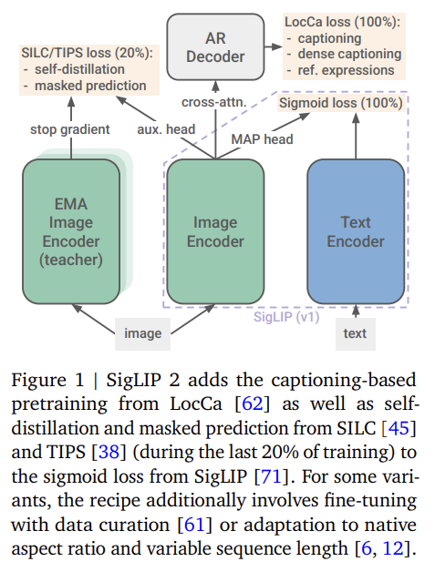

저자는 original SigLIP training recipe 를 decoder 기반 pretraining 에 더해, DINO 계열 연구에서와 같은 self-distillation 및 masked prediction 과 결합한다 (개요는 Fig. 1 참조). 

* Captioning 및 referring expression comprehension 을 위해 language decoder 로 image encoder 를 pretraining 하는 것은 OCR capability 와 localization 을 개선하는 것으로 알려져 있으며, self-distillation 및 masked prediction 은 dense prediction task, zero-shot classification, 그리고 retrieval 을 위한 더 나은 feature 로 이어진다. 
* 저자는 이 모든 기법을 단일 run 에서 결합하는 대신, SigLIP training 대비 computation 및 memory overhead 를 관리하기 위해 아래에 설명하는 staged approach 를 따른다.
* 또한 저자는 여러 model 을 학습하고 각 model 을 aspect ratio 를 왜곡하면서 서로 다른 resolution 에 개별적으로 적응시키는 것에 더해, NaViT 와 같이 native aspect ratio 를 대체로 보존하면서 image 를 처리하고 FlexiViT 와 같이 서로 다른 sequence length 를 지원하는 variant 도 학습한다. 
  * 저자는 이 variant 를 **NaFlex** 라고 부르며, Sec. 2.4.2 에서 설명한다.
* 마지막으로, 가장 작은 model 의 품질을 개선하기 위해 저자는 active sample selection 을 통한 implicit distillation 으로 이들을 fine-tune 하며, 이는 기존 접근을 따른다.

## 2.1. Architecture, training data, optimizer

Architecture 에 대해서는, 기존 사용자가 encoder weight 를 단순히 교체할 수 있도록 저자는 SigLIP 을 따른다. 

* 구체적으로, fixed-resolution variant 는 learned positional embedding 을 갖는 표준 ViT architecture 에 의존한다. 
* 저자는 image 와 text tower 에 동일한 architecture 를 사용하며, 예외적으로 g 크기의 vision encoder 는 So400m 크기의 text encoder 와 짝지어진다. 
* Vision 및 text representation 은 MAP head (attention pooling) 를 사용해 pooling 된다. 
* 저자는 text length 를 64 로 설정하고 vocabulary size 가 256k 인 multilingual Gemma tokenizer 를 사용하며, tokenization 전에 text 를 lower case 로 변환한다.

저자는 109 개 언어를 포괄하는 100 억 개 image 와 120 억 개 alt-text 를 포함하는 WebLI dataset 을 사용한다. 

* English 와 multilingual vision-language benchmark 에서의 품질 사이에서 좋은 균형을 이루기 위해, training image-text pair 의 90% 는 English web page 에서, 나머지 10% 는 non-English web page 에서 오도록 mixture 를 구성한다. 
* 또한 sensitive attribute 와 관련된 representation 및 association 측면의 data bias 를 완화하기 위해 filtering 기법을 추가로 적용한다.

---

* 별도로 언급하지 않는 한, 저자는 learning rate $10^{-3}$, decoupled weight decay $10^{-4}$, 그리고 norm 1 로의 gradient clipping 을 사용하는 Adam optimizer 를 사용한다. 
* Batch size 는 32k 로 설정하고, 20k warmup step 을 갖는 cosine schedule 을 사용하여 총 40B example 에 대해 학습한다. 
* Model 들은 최대 2048 개의 TPUv5e chip 에서 fully-sharded data-parallel strategy (FSDP) 를 사용해 학습된다.

## 2.2. Training with Sigmoid loss and decoder

Pretraining 의 첫 단계에서, 저자는 두 loss 를 동일 가중치로 단순 결합하여 SigLIP 과 LocCa 를 결합한다. Contrastive loss 에 의존하는 CLIP 과 달리, SigLIP 은 mini-batch 내의 모든 image embedding 을 모든 text embedding 과 결합하여 binary classification problem 을 만들고, logistic regression (sigmoid loss) 을 통해 matching pair 와 non-matching pair 를 분류하도록 embedding 을 학습한다. 저자는 original implementation 을 사용하며, 자세한 내용은 원 논문을 따른다.

LocCa 에 대해서는, 저자는 un-pooled vision encoder representation (MAP head 를 적용하기 전) 에 cross-attention 이 있는 표준 transformer decoder 를 부착한다. Decoder 는 text encoder 의 shape 를 따르지만, cross-attention layer 를 추가하고 layer 수는 절반으로 줄인다. Image captioning 외에도, LocCa 는 automatic referring expression prediction 과 grounded captioning 을 위해서도 학습한다.

* 전자는 특정 image region 을 설명하는 caption 에 대해 bounding box coordinate 를 예측하는 것이다.
* 후자는 bounding box coordinate 가 주어졌을 때 region-specific caption 을 예측하는 것이다.

Region-caption pair 는 먼저 alt-text 에서 n-gram 을 추출한 뒤 open-vocabulary detection 을 적용하여 자동으로 annotation 된다. 추가로, 저자는 n-gram 대신 고정된 object category 집합도 사용한다. 

* 각 example 에 대해 decoder 는 세 가지 target 모두를 예측하도록 학습되며, 이는 세 번의 decoder forward-pass 에 해당한다. 
* Captioning target 은 50% 확률로 parallel prediction 으로 예측되며, 즉 causal attention mask 없이 모든 caption token 이 mask token 으로부터 병렬로 예측된다. 자세한 내용은 원 방법을 따른다. 
* 마지막으로, 큰 vocabulary 로 인한 memory consumption 을 줄이기 위해 저자는 decoder loss 의 chunked version 을 구현한다.

---

* 모든 model size 에 대해, 저자는 vision encoder patch size 를 16 으로, image resolution 을 256 으로 설정하며, 그 결과 image representation sequence length 는 256 이 된다. 
* 마지막으로, decoder 는 여기서 representation learning 을 위해서만 사용되며 model release 에는 포함되지 않는다는 점을 언급한다.

## 2.3. Training with self-distillation and masked prediction

SILC 및 TIPS 를 따라, 저자는 Sec. 2.2 에서 설명한 training setup 에 local-to-global correspondence learning 을 self-distillation 및 masked prediction loss 와 함께 추가하여 (un-pooled) feature representation 의 local semantics 를 개선한다. 이 representation 은 일반적으로 segmentation, depth estimation 등의 dense prediction task 에 사용된다. 구체적으로, 저자는 Sec. 2.2 에서 설명한 loss 에 두 개의 항을 추가하며, 다음과 같이 상세히 설명한다.

* 첫 번째 항은 local-to-global consistency loss 이다. 
  * 여기서 vision encoder 는 student network 가 되며, training image 의 partial (local) view 를 입력받고, 전체 image 로부터 얻어진 teacher 의 representation 과 일치하도록 학습된다. 
  * 이 auxiliary matching task 는 별도의 MLP head 로 계산된 high-dimensional feature space 에서 수행된다. 
  * 관련 문헌에서 일반적인 것처럼, teacher parameter 는 이전 iteration 들에 걸친 student parameter 의 exponential moving average (EMA) 로 얻어진다. 
  * 저자는 단일 global (teacher) view 와 8 개의 local (student) view 에 의존하며, 그 외의 augmentation, loss, hyper parameter 는 기존 방법을 따른다.
* 두 번째 loss 항은 masked prediction objective 이다. 
  * 저자는 student network 에서 embedded image patch 의 50% 를 mask token 으로 대체하고, masked location 에서 teacher 의 feature 와 일치하도록 student 를 학습한다. 
  * 이 loss 는 첫 번째 항 (consistency loss) 과 동일하게 정의되지만, pooled 된 image-level representation 이 아니라 per-patch feature 에 적용된다. 
  * 또한 student 와 teacher 모두 동일한 global view 를 보며, 차이는 student 쪽의 masking 뿐이다.

저자는 training 이 80% 진행된 시점에 이들 loss 를 추가하며, teacher 는 student parameter 로 초기화하고 나머지 추가 parameter (head, mask token, 및 해당 optimizer parameter) 는 random 하게 초기화한다. 

이전 section 의 SigLIP 및 LocCa loss 계산에는 original image 를 사용하고, 추가 loss 는 추가적인 augmented view 에 적용한다. 이는 data augmentation 이 image-text alignment 에 부정적 영향을 주지 않도록 하기 위함이다. 

* 첫 번째와 두 번째 loss 항의 가중치는 각각 1 과 0.25 로 설정한다. 
* 또한 global/semantic task 와 dense task 에서의 model 품질 균형을 맞추기 위해, 이 두 loss 항에는 B, L, So400m, g model size 에 대해 각각 추가로 0.25, 0.5, 1.0, 0.5 의 factor 를 곱해 re-weighting 한다.

## 2.4. Adaptation to different resolutions

### 2.4.1. Fixed-resolution variant

* Multiple resolution 에서의 fixed-resolution checkpoint 를 얻기 위해, 저자는 95% training 시점의 checkpoint 를 이어서 사용한다. 
  * 이 checkpoint 는 sequence length 256 과 patch size 16 을 가진다. 
* 이후 positional embedding 을 목표 sequence length 에 맞게 resize 하고, 일부 경우에는 patch embedding 을 patch size 16 에서 14 로 pseudoinverse (PI)-resize strategy 를 사용해 resize 한 뒤, 모든 loss 와 함께 목표 resolution 에서 training 을 재개한다. 
* 저자는 final checkpoint 를 더 작은 learning rate 와 weight decay 없이 fine-tuning 하는 일반적인 전략이 모든 size 와 resolution 에 걸쳐 좋은 결과를 내지 못했기 때문에 이 접근을 선택한다.

### 2.4.2. Variable aspect and resolution (NaFlex)

NaFlex 는 단일 ViT model 로 여러 사전 정의된 sequence length 를 지원하는 FlexiViT 의 아이디어와, image 를 native aspect ratio 로 처리하는 NaViT 의 아이디어를 결합한다. 이는 서로 다른 유형의 image 를 적절한 resolution 에서 처리할 수 있게 하며, 예를 들어 document image 를 처리할 때는 더 큰 resolution 을 사용하면서도, 동시에 OCR 과 같은 특정 inference task 에서 aspect ratio distortion 의 영향을 최소화할 수 있게 한다.

Patch size 와 목표 sequence length 가 주어졌을 때, NaFlex 는 먼저 다음 조건을 만족하도록 input image 를 resize 하여 data 를 preprocess 한다.

* Resize 후의 height 와 width 가 patch size 의 배수가 되도록 한다.
* Aspect ratio distortion 을 가능한 한 작게 유지한다.
* 원하는 목표 sequence length 이하의 sequence length 를 생성한다.

그 결과 width 와 height 에서의 distortion 은 각각 최대 $(\texttt{patch\_size-1/width})$ 와 $(\texttt{patch\_size-1/height})$ 이며, 이는 일반적인 resolution 과 aspect ratio 에서는 대체로 작다. NaViT 역시 동일한 유형의 distortion 을 유발한다는 점에 유의해야 한다. Resize 후 image 는 patch sequence 로 분할되며, 실제 sequence length 가 목표 길이보다 작은 경우를 처리하기 위해 patch coordinate 와 padding information 을 담은 mask 가 추가된다.

서로 다른 sequence length 와 aspect ratio 를 가진 입력을 ViT 로 처리하기 위해, 저자는 learned positional embedding 을 resize 된 input image 의 목표 non-square patch grid 에 bilinear resize (anti-aliasing 포함) 한다. 

* Learned positional embedding 의 길이는 resize 전 $16 \times 16$ patch grid 를 가정하여 256 으로 설정한다. 
* Resize 후 sequence length 가 목표 sequence length 보다 작을 경우, attention layer (MAP head 포함) 는 추가 padding token 을 무시하도록 masking 된다.

Fixed-resolution adapted variant 와 마찬가지로, 저자는 Sec. 2.2 에서 설명한 setup 으로 학습된 기본 checkpoint 에서 시작한다. 즉, aspect preserving 이 아닌 resize 를 통해 256 px 로 맞추며, 결과 sequence length 는 256 이다.

저자는 training 90% 시점의 checkpoint 를 가져온 뒤, aspect preserving resize 로 전환하고 mini-batch 마다 ${128, 256, 576, 784, 1024}$ 에서 sequence length 를 균일하게 sampling 한다. 동시에 마지막 10% 에 해당하는 learning rate schedule 을 3.75 배로 늘려 각 resolution 이 충분한 수의 example 에 대해 학습되도록 한다. 가장 큰 sequence length 에 대해서는 out-of-memory error 를 피하기 위해 batch size 를 절반으로 줄이고 training step 수를 두 배로 늘린다.

구현 및 computation complexity 를 관리 가능한 수준으로 유지하기 위해, 저자는 Sec. 2.3 의 self-distillation 및 masked prediction 은 적용하지 않는다.

## 2.5. Distillation via active data curation

가장 작은 fixed-resolution model (ViT-B/16 및 ViT-B/32) 의 성능을 극대화하기 위해, 저자는 짧은 fine-tuning 단계 동안 teacher (reference) model 로부터 knowledge 를 distill 한다. 

* Learning rate 는 $10^{-5}$ 로 낮추고, weight decay 는 제거하며, sigmoid image-text loss 만 사용하여 이 model 들의 training 을 추가로 4B example 동안 계속한다. 
  * 이 단계에서 저자는 ACID method 를 사용하여 implicit 한 “data 를 통한 distillation” 을 수행한다. 
  * 간단히 말하면, 각 training step 에서 teacher model 과 현재 learner model 이 example 의 “learnability” 를 기준으로 점수를 매긴다. 
  * 그런 다음 이 score 를 사용하여 더 큰 super-batch 로부터 size 32k 의 최적 batch 를 공동 선택한다. 
* 여기서 저자는 curation 으로부터의 이득과 training compute 사이의 균형을 위해 filtering ratio 0.5, 즉 super-batch size 64k 를 사용한다. 
* B/32 model 의 경우에는 filtering ratio 0.75 를 활용하는 것이 추가 cost 를 감수할 가치가 있다고 판단한다.

저자는 기존 저자들이 ACID 와 explicit softmax-distillation 을 결합한 ACED 로 최상의 성능을 얻는다고 제안했다는 점을 언급한다. 그러나 여기서 저자는 explicit distillation 의 필요 없이 이러한 이점을 포착하도록 ACID 를 적응시키는 방법을 제안하며, 이를 통해 상당한 양의 compute 를 절약한다. 

* 구체적으로, 서로 다른 두 개의 teacher model 을 사용하는 대신, diverse data 로 학습된 단일한 강력한 teacher 를 사용한다. 
* 이 경우 SigLIP 2 So400m model 이며, 이를 curated dataset 에서 1B example 동안 fine-tune 한다. 
* 이후 위에서 설명한 대로, 이 fine-tuned teacher model 을 ACID method 에 사용한다. 이 teacher 는 pretraining 에서의 concept 에 대한 diverse knowledge 와 curated dataset 로부터의 high-quality 에 대한 knowledge 를 함께 결합하므로, ACID 만의 implicit distillation 만으로도 ACED 의 이점을 회복하기에 충분하다.

# 3. Experiments and results

## 3.1. Zero-shot classification and retrieval

Tab. 1 에서 저자는 일반적인 zero-shot classification benchmark (ImageNet, ObjectNet, ImageNetv2, ImageNet ReaL) 및 image-text retrieval benchmark 에서의 SigLIP 2 성능을 baseline 과 함께 보고한다. 

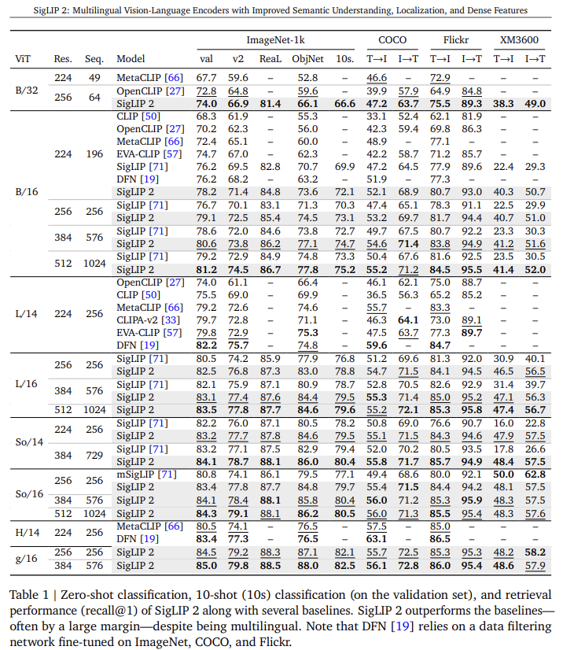

* SigLIP 2 는 baseline 들과 달리 많은 언어를 지원함에도 불구하고, 전반적으로 SigLIP 및 다른 open-weight baseline 보다 더 나은 성능을 보인다. 예외는 mSigLIP 뿐이다. 
* 이러한 benchmark 에서 SigLIP 2 에 가장 근접한 DFN 은 data quality 를 개선하기 위해 ImageNet, COCO, Flickr 에서 fine-tune 된 network 를 filter 로 사용한다는 점에 유의해야 한다. 
* SigLIP 2 가 baseline 대비 보이는 개선은 특히 B 크기 model 에서 두드러지며, 이는 distillation (Sec. 2.5) 에 기인한다. 
* 또한 저자는 image resolution 과 model size 의 함수로서 일반적으로 관찰되는 scaling trend 도 확인한다.

---

* Tab. 1 과 Fig. 2 는 36 개 언어를 포괄하는 Crossmodal-3600 (XM3600) 에서의 multilingual retrieval 성능도 추가로 보여준다. 
* SigLIP 2 의 recall 은 SigLIP 보다 큰 폭으로 높으며, mSigLIP 에는 약간 뒤처질 뿐이다. 
* 반면 mSigLIP 은 English 중심 benchmark 에서는 SigLIP 및 SigLIP 2 보다 상당히 낮은 성능을 보인다.

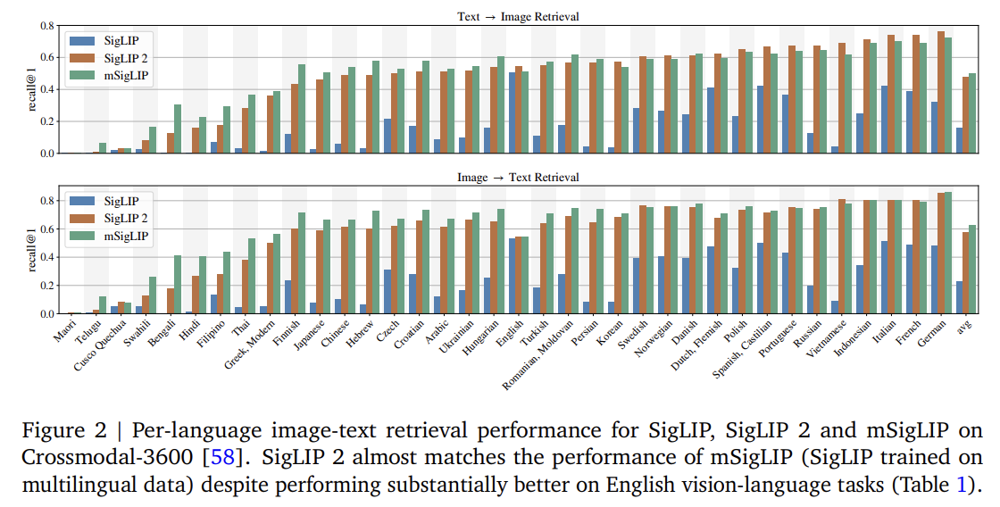

### 3.1.1. NaFlex variant

Fig. 3 은 sequence length 의 함수로, fixed-resolution 의 square-aspect ratio (standard) SigLIP 2 와 aspect-preserving NaFlex variant (모든 sequence length 를 위한 하나의 checkpoint) 를 비교한다. 

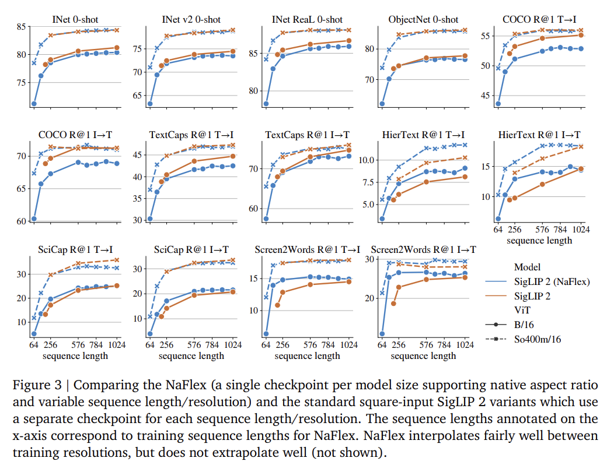

이전 section 에 나열된 retrieval benchmark 에 더해, 저자는 OCR/document/screen 중심의 image-text benchmark 들, 즉 TextCaps, HierText, SciCap, Screen2Words 를 추가한다.

* NaFlex variant 는 이러한 retrieval benchmark 의 대다수에서 standard variant 를 능가하며, 특히 작은 sequence length 에서 그러하다. 
* 작은 sequence length 는 일반적으로 aspect ratio distortion 의 영향을 더 많이 받는다. 
* 주로 natural image 로 구성된 benchmark 에서는 standard B 크기 variant 가 NaFlex 보다 더 좋은 성능을 보이는데, 이는 distillation 단계 덕분으로 해석할 수 있다. 
* 반면 So400m architecture 에서는 두 방법의 성능이 대등하다. 
* 이는 standard variant 가 self-distillation 단계 (Sec. 2.3) 의 이점도 받는다는 점을 고려하면 주목할 만하다.

## 3.2. SigLIP 2 as a vision encoder for VLMs

CLIP 및 SigLIP 과 같은 vision encoder 의 대표적인 사용 사례는 VLM 을 위한 visual representation 추출이다. 일반적인 paradigm 은 pretrained vision encoder 와 pretrained LLM 을 결합하고, 다양한 vision language task 의 풍부한 mixture 에 대해 multimodal training 을 수행하는 것이다.

이 application 에서 SigLIP 2 의 성능을 평가하기 위해, 저자는 PaliGemma 2 와 유사한 recipe 를 개발한다. 

* 구체적으로, 저자는 SigLIP 2 vision encoder 및 baseline 을 Gemma 2 2B LLM 과 결합하고, captioning, OCR, grounded captioning, visual question answering, detection, instance segmentation 을 포함하는 Stage 1 training mix 의 50M example 으로 LLM 을 학습한다. 
  * 마지막 4 개 task 에 대한 annotation 은 machine-generated 이다. 
* 저자는 vision encoder 를 frozen 상태로 유지하며, 이는 품질에 거의 영향을 미치지 않으며, open model 의 전형적인 사용 사례를 반영하기 위해 training duration 을 줄인다. 
* 이렇게 얻어진 VLM 은 이후 transfer setting 을 사용하여 광범위한 downstream task 에 대해 fine-tuning 된다.

Input resolution 의 효과를 이해하기 위해, 저자는 224 또는 256 resolution 에서 실험을 수행한다. 이는 각각 patch size 14 및 16 인 model 에 대해 256 개의 image token 을 추출하기 위함이다. 또한 384 px 에서도 실험을 수행하지만, 기존 방법들과 달리 224 px variant 에서 시작하는 대신 384 px 에서 stage 1 을 다시 수행한다.

Fig. 4 는 각 dataset 에 대해 fine-tuning 후의 결과를 보여준다. 

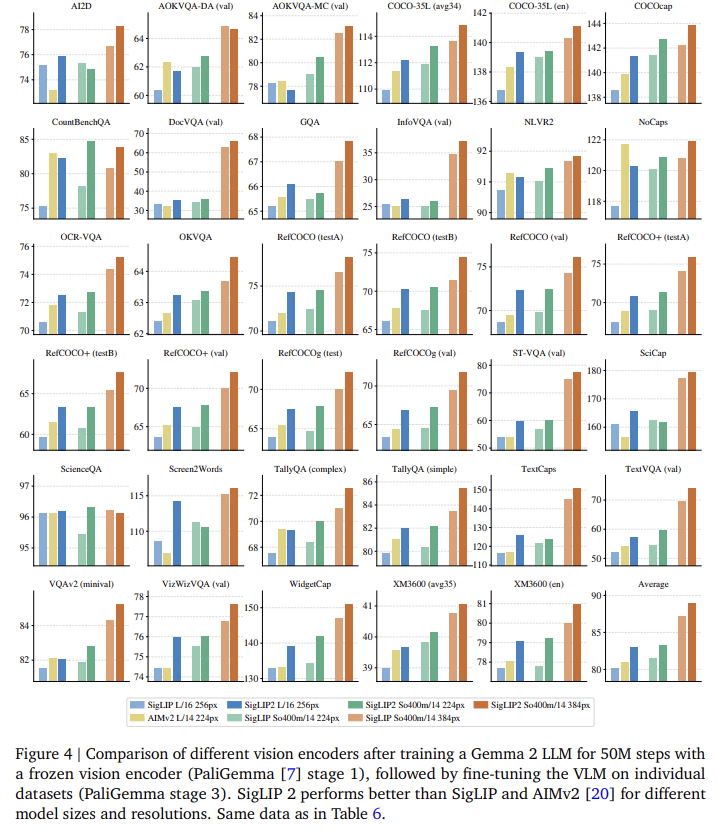

* 전반적으로 SigLIP 2 는 resolution 과 model size 전반에 걸쳐 SigLIP 을 분명하게 능가한다. 
* L 크기의 vision encoder 에 대해서는, SigLIP 2 가 최근 공개된 AIMv2 model 보다도 더 좋은 성능을 보인다. Fig. 4 의 data 는 Tab. 6 에서도 확인할 수 있다.

## 3.3. Dense prediction tasks

### 3.3.1. Semantic segmentation, depth estimation, surface normal estimation

저자는 기존 평가 protocol 을 채택하여, semantic segmentation, monocular depth estimation, surface normal estimation 을 아우르는 여섯 개 benchmark 에서 frozen SigLIP 2 representation 을 linear layer 또는 DPT decoder 와 함께 probe 한다. 

Protocol 및 hyper parameter 의 자세한 내용은 기존 방법을 따른다. 다만 저자는 한 가지 필요한 변경을 가한다. 원래 방법에서는 CLS token 을 각 patch feature vector 에 concatenate 하지만, 저자는 CLS token 대신 MAP head 를 사용하므로 MAP head 의 output embedding 을 대신 concatenate 한다. 

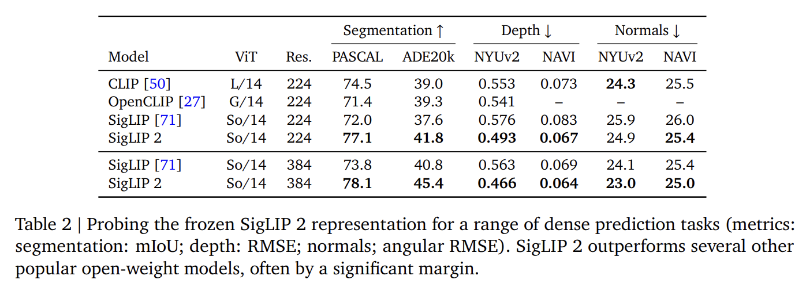

* Tab. 2 의 결과는 SigLIP 2 가 SigLIP 을 포함한 여러 이전의 open, CLIP-style vision encoder 보다 더 좋은 성능을 보이며, 그 차이가 종종 상당함을 나타낸다.

### 3.3.2. Open-vocabulary segmentation

Open-vocabulary segmentation 은 고정된 training vocabulary 를 넘어서는 새로운 class 를 segmentation 할 수 있는 model 을 개발하는 것을 목표로 한다. 여기서 저자는 이 task 에서의 SigLIP 2 성능을 평가한다.

저자는 Cat-Seg 를 framework 로 사용하고, 기존 제안에 따라 서로 다른 model 간의 성능을 비교한다. Cat-Seg 는 172 개 class 를 가진 COCOStuff-164k 에서 학습한 뒤, 서로 다른 vocabulary 를 가진 다양한 대표 dataset 에서 테스트된다.

* ADE20k, 847 또는 150 class (A-847/A-150)
* Pascal Context (PC-459/PC-59)
* Pascal VOC (VOC-20/VOC-21)

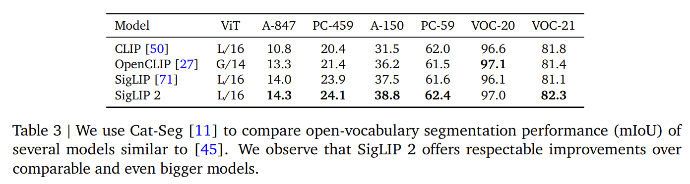

결과는 Tab. 3 에서 확인할 수 있다. 

* 저자는 L/16 크기의 SigLIP 2 가 SigLIP 을 개선하며, 심지어 훨씬 더 큰 OpenCLIP G/14 model 도 능가함을 관찰한다.

## 3.4. Localization tasks

### 3.4.1. Referring expression comprehension

서로 다른 RefCOCO variant 에서의 SigLIP 2 의 referring expression comprehension capability 를 probe 하기 위해, 저자는 기존 평가 protocol 을 적용한다. 저자는 un-pooled 된 frozen vision encoder representation 에 cross-attention 을 통해 6-layer transformer decoder 를 부착하고, 모든 RefCOCO variant 의 mixture 에 대해 이를 scratch 부터 학습한다. 자세한 내용은 기존 방법을 따른다.

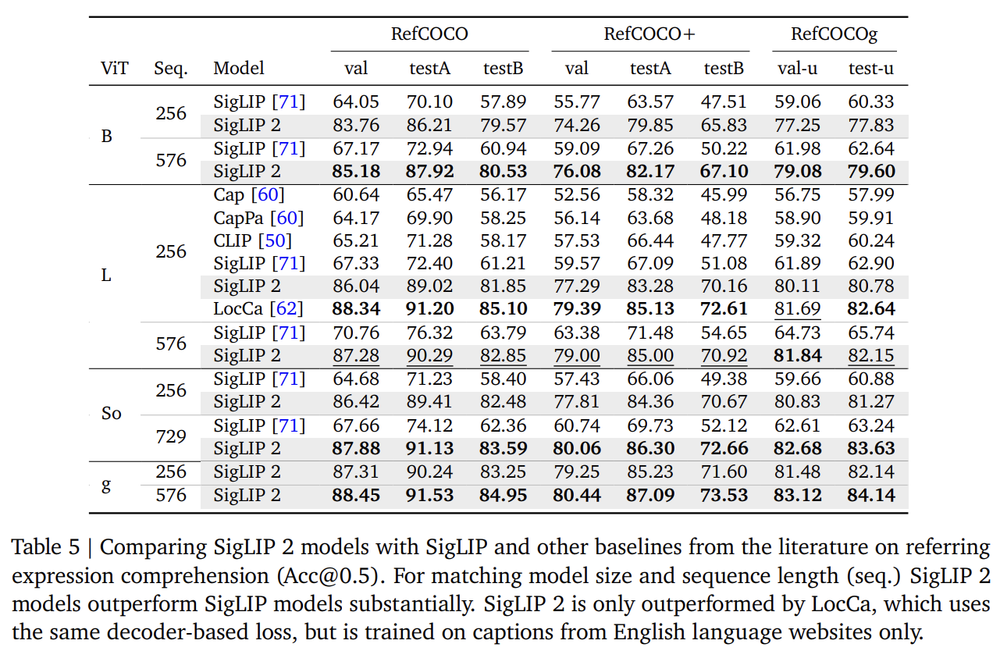

* Tab. 5 의 결과는 SigLIP 2 가 resolution 과 model size 전반에 걸쳐 SigLIP 뿐만 아니라 CLIP 및 image captioning 기반 pretraining (Cap) 보다도 큰 폭으로 더 나은 성능을 보인다는 것을 보여준다. 
  * 이는 Sec. 2.2 에서 설명한 decoder 기반 pretraining 에 기인하는 것으로 볼 수 있다. 
* SigLIP 2 는 LocCa 에게만 뒤처지는데, 저자는 그 이유가 SigLIP 2 가 multilingual data 로 pretraining 되기 때문일 수 있다고 가정한다. 
  * 반면 LocCa 는 English web site 의 text 만으로 학습된다. 
* 마지막으로, 저자는 LocCa 에서 관찰된 것처럼 pretraining 에서 사용한 decoder 를 사용할 경우 상당한 추가 개선이 있을 것으로 기대한다.

### 3.4.2. Open-vocabulary detection

OWL-ViT 는 CLIP-style vision-language model 을 open-vocabulary detection 으로 적응시키기 위한 대표적인 방법이다. 여기서 저자는 이 접근을 SigLIP 및 SigLIP 2 model 에 적용하며, data 와 optimizer configuration 은 기존 방법을 밀접하게 따른다. 

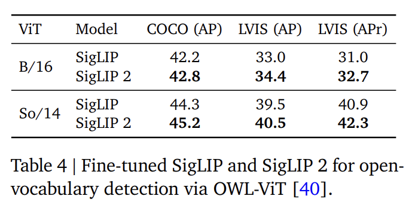

* Tab. 4 의 결과는 SigLIP 2 가 두 개의 널리 사용되는 benchmark 인 COCO 와 LVIS 에서 SigLIP 보다 더 좋은 성능을 달성함을 보여준다. 
* 상대적 개선은 LVIS rare category 에서 가장 두드러진다. 
* 또한 여기의 결과는 기존 방법의 결과보다 더 좋은데, 이는 기존 방법이 SigLIP 이 아니라 CLIP 을 사용했기 때문일 가능성이 크다.

## 3.5. Cultural diversity and fairness

SigLIP 2 는 이전 모델 대비 model quality 가 향상되었을 뿐 아니라, 두 가지 측면에서 더 inclusive 하다. 

* 첫째, 저자는 권고를 따라 English 및 multilingual data 를 모두 포함하는 training mixture 를 사용하여 cultural diversity 를 강화한다. 
* 둘째, training data 에 잠재할 수 있는 societal bias 를 해결하기 위해 data de-biasing 기법을 통합한다. 

이러한 기법은 gender representation 의 불균형과 같은 first-order statistic 의 bias 와, gender 와 occupation 사이의 편향된 association 과 같은 second-order statistic 의 bias 를 모두 완화하기 위해 적용된다. 다음으로 저자는 평가 결과를 제시한다.

#### Cultural Diversity

Cultural diversity 를 평가하기 위해, 저자는 Dollar Street, GeoDE, 그리고 Google Landmarks Dataset v2 를 사용한 zero-shot classification accuracy 결과를 보고한다. 또한 저자는 기존 제안에 따라 Dollar Street 및 GeoDE 를 사용한 10-shot geolocalization 도 포함한다. 

Dollar Street 에 대한 zero-shot 평가를 위해, 저자는 기존 방법론을 구현하여 dataset 내의 96 개 topic 을 대응되는 ImageNet class 로 mapping 한다. 이 과정은 분석을 위한 21K image subset 을 생성한다.

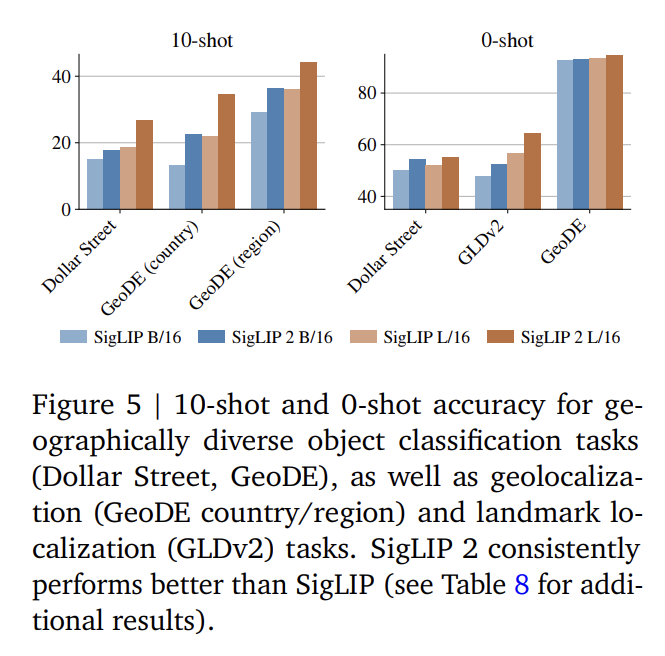

Fig. 5 는 대표적인 결과 집합을 보여주며, 전체 결과는 Appendix C 에 제시된다. 

저자는 동일한 model size 및 resolution 에서 SigLIP 2 가 SigLIP 대비 이러한 metric 들에서 향상됨을 관찰하며, 특히 geolocalization task 에서 개선이 두드러진다.

* 예를 들어, GeoDE (region) 에서의 10-shot geolocalization accuracy 는 256 px 의 SigLIP L/16 에서 36.2% 였던 것이 SigLIP 2 에서는 44.4% 로 향상된다.
* 마찬가지로, Dollar Street 에서의 0-shot accuracy 는 동일한 model 에서 52.1% 에서 55.2% 로 향상된다.

#### Fairness

Fairness 측면에서 저자는 두 가지 metric 을 보고한다. 첫 번째는 representation bias 이며, 이는 model 이 random object (예: car) 를 특정 gender group 과 연관시키는 경향을 측정한다. Fig. 6 에서 보이듯, SigLIP 2 는 SigLIP 보다 상당히 더 우수하다.

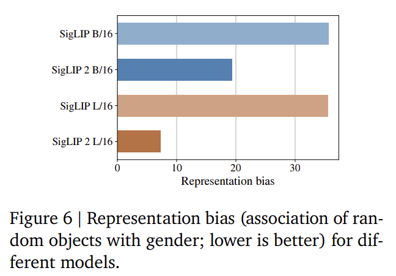

* 예를 들어, 256 px 의 SigLIP L/16 은 약 35.5% 의 representation bias 를 가지며, 이는 random image 를 “women” 보다 “men” 과 연관시키는 것을 85.5% 를 넘는 경우에서 선호한다는 의미이다. 
* 반면 동일한 size 와 resolution 의 SigLIP 2 는 representation bias 가 7.3% 에 불과하다. 
* 또한 기존 연구의 발견과 일치하게, 더 큰 model 은 더 작은 model 보다 representation bias 가 적은 경향을 보인다.

저자는 또한 기존 연구와 같이 Dollar Street 0-shot 결과를 income level 별로, GeoDE 결과를 geographic region 별로 조사한다. 그러나 이 맥락에서는 동일한 size 와 resolution 을 갖는 SigLIP 과 SigLIP 2 model 을 비교할 때 매우 작은 이점만 관찰되거나, 혹은 전혀 이점이 관찰되지 않는다. 일부 결과는 Tab. 9 에 제시된다.

# 4. Related work

CLIP 및 ALIGN 에 의해 대중화된 contrastive pretraining 은 classification 과 retrieval 에서 잘 작동하는 high-level, semantic visual representation 을 학습하는 지배적인 접근이 되었으며, VLM 을 위한 vision encoder 와 detection 및 segmentation 을 포함한 open-vocabulary task 에서도 널리 사용된다. Original CLIP release 외에도, 여러 프로젝트가 open-weight contrastive model 을 공개했다. 높은 수준에서 보면, 이러한 연구들은 원래 CLIP 방법과 비교적 가까운 training 방법을 따른다. 그중 일부는 수정된 loss function 을 제안하고, 일부는 data quality 와 filtering 을 목표로 한다.

보다 일반적으로, contrastive training 에 대한 많은 수정과 개선이 문헌에서 제안되었다.

* 일부 연구는 data quality 를 개선하기 위한 filtering 기법을 연구한다.
* 유사한 동기에서, 일부 연구는 VLM 으로 training image 를 recaption 하여 caption quality 와 따라서 training signal 의 품질을 개선한다.
* 또 다른 유망한 방향은 loss function 을 수정하거나 확장하는 것이다.
* 일부 연구는 CLIP 을 self-supervised loss 와 결합한다.
* 또 다른 대중적인 접근은 captioning 을 auxiliary task 로 사용하기 위해 language decoder 를 추가하는 것이다.

독립적인 representation learning task 로서의 captioning 은 상대적으로 덜 주목받았지만, contrastive training 과 경쟁력 있는 visual representation 을 생성할 수 있다.

# 5. Conclusion

이 연구에서 저자는 SigLIP 의 성공을 바탕으로 하는 open-weight multilingual vision-language encoder 계열인 SigLIP 2 를 소개했다. 

Decoder 기반 pretraining, self-supervised loss, active data curation 과 같은 기법들의 조합을 통합함으로써, SigLIP 2 는 zero-shot classification, VLM 에서 vision encoder 로서의 transfer performance, 그리고 localization 및 dense prediction task 에서 상당한 개선을 달성한다. 

또한 multilingual data 로 학습하고 de-biasing filter 를 적용함으로써, SigLIP 2 는 culturally diverse 한 data 전반에서 더 균형 잡힌 품질을 달성한다. 마지막으로, NaFlex variant 는 native image aspect ratio 를 보존하면서도 단일 model checkpoint 로 multiple resolution 을 지원할 수 있게 한다. 저자는 SigLIP 2 공개가 open-source community 내에서 많은 흥미로운 application 을 가능하게 하기를 기대한다.
