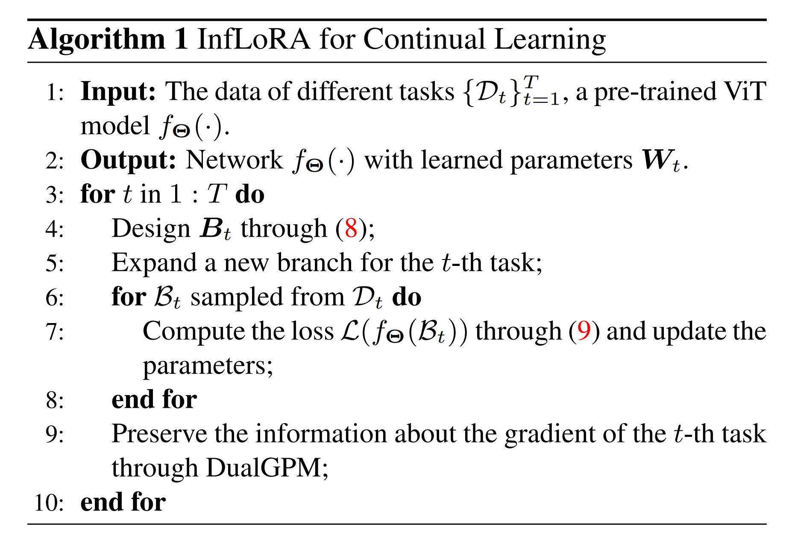
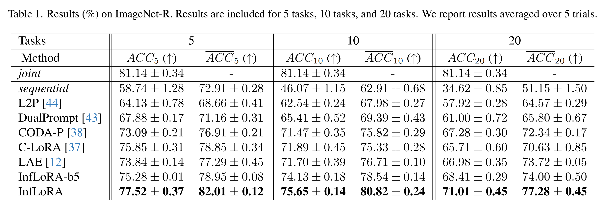
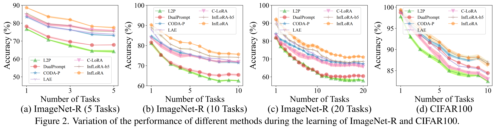
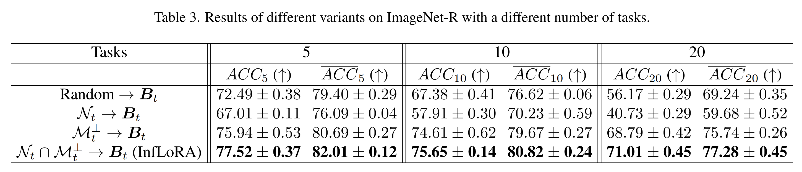
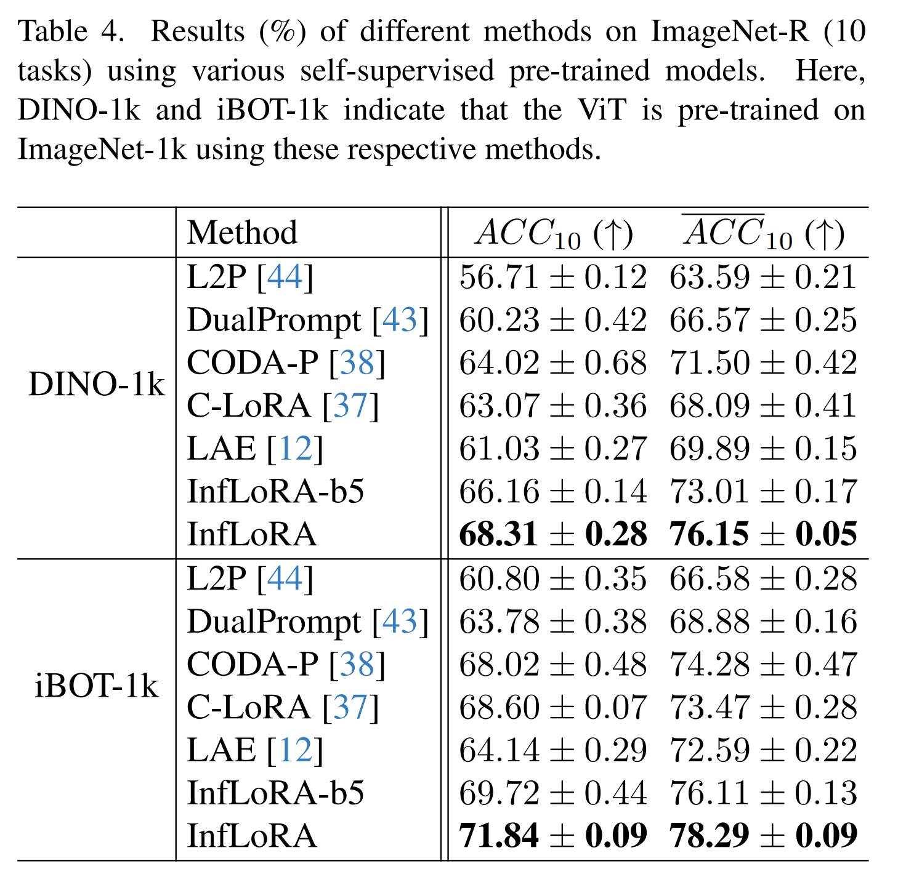
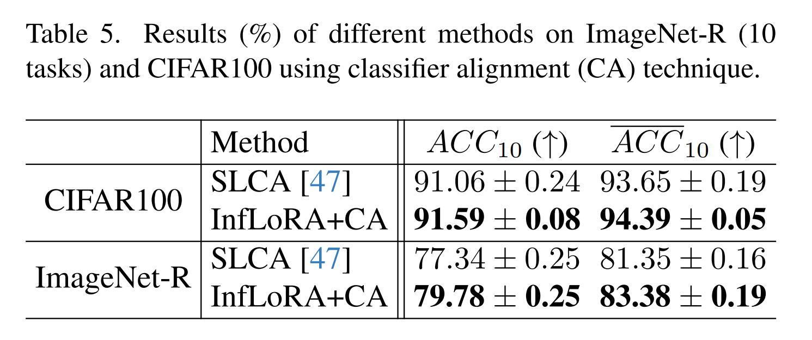

논문 및 이미지 출처 : <https://openaccess.thecvf.com/content/CVPR2024/papers/Liang_InfLoRA_Interference-Free_Low-Rank_Adaptation_for_Continual_Learning_CVPR_2024_paper.pdf>

# Abstract

**Continual learning** 은 모델이 multiple task 를 순차적으로 학습할 수 있어야 한다. 

Continual learning 에서 모델은 old tasks 에 대한 성능을 유지하는 능력(stability)과 new tasks 에 지속적으로 적응하는 능력(plasticity)을 가져야 한다. 

최근, **parameter-efficient fine-tuning (PEFT)**은 pre-trained model 을 freezing 하고 small learnable parameter 를 주입하여 downstream tasks 에 적응시키는 방법으로, Continual learning 에서 인기를 끌고 있다. 

기존의 PEFT-based Continual learning 방법들은 PEFT 를 사용하지 않는 방법들에 비해 우수한 성능을 보여주었지만, 대부분 new tasks 가 old tasks 에 미치는 interference 를 제거하는 방법을 고려하지 않아, stability 과 plasticity 간의 trade-off 을 잘 맞추지 못하게 된다. 

이 연구에서는 Continual learning 을 위한 새로운 PEFT 방법인 **interference-free low-rank adaptation (InfLoRA)** 를 제안한다. 

- 이는 pre-trained weights 를 reparameterize 하기 위해 small parameters 를 주입하며, 이 injected parameters 를 fine-tuning 하는 것이 pre-trained weights 를 subspace 내에서 fine-tuning 하는 것과 동등하다는 것을 보여준다. 
- 또한, InfLoRA 는 이 subspace 를 설계하여 new tasks 가 old tasks 에 미치는 interference 를 제거함으로써 stability 과 plasticity 간의 trade-off 을 잘 맞추도록 한다. 
- 실험 결과, InfLoRA 는 multiple datasets 에서 기존의 SOTA Continual learning 방법들을 능가하는 성능을 보여준다. 

# 1. Introduction

**Continual learning** 은 모델이 multiple task 를 순차적으로 학습할 수 있어야 한다. 이를 위해 모델은 두 가지 필수 능력을 가져야 한다. 1) old tasks 에 대한 성능을 유지하는 능력(stability); 2) new tasks 에 지속적으로 적응하는 능력(plasticity)이다. 

또한, Continual learning 에서는 종종 두 가지 다른 시나리오가 고려되는데, 이에는 1) **task-incremental** 시나리오; 2) **class-incremental** 시나리오가 있다. 

Task-incremental 시나리오에서는 inference 중에 모델이 task identities 를 얻을 수 있다. 반면, Class-incremental 시나리오에서는 inference 중에 task identities 를 얻을 수 없으므로, 모델은 all tasks 의 all classes 를 구별하는 방법을 학습해야 한다.

최근 **parameter-efficient fine-tuning (PEFT)**은 pre-trained model 을 freeze 한 상태에서 small learnable parameter 를 주입하여 downstream tasks 에 적응하도록 하는 방법으로, Continual learning 에서 인기를 끌고 있다. 

특히, class-incremental 시나리오에서 PEFT-based Continual learning 방법들이 주목받고 있다. 

- 구체적으로, 기존의 Continual learning 방법들은 **prompt-tuning** 이나 **low-rank adaptation (LoRA)** 와 같은 인기 있는 PEFT 방법을 사용하여 learnable parameter 를 pre-trained model 에 주입하고, 그 후 pre-trained weights 를 고정한 채 multiple task 에 대해 순차적으로 injected parameters 를 fine-tuning 한다.
- PEFT-based Continual learning 방법들은 PEFT 를 사용하지 않는 방법들에 비해 우수한 성능을 보였지만, 대부분은 new tasks 가 old tasks 에 미치는 interference 를 제거하는 방법에 대해서는 고려하지 않는다. 
  - 이로 인해 모델이 stability 과 plasticity 간의 trade-off 을 잘 맞추기 어렵게 된다. 
- 구체적으로, new tasks 를 학습할 때 기존의 PEFT-based Continual learning 방법들은 이전에 learned parameters 를 재사용하거나, 일부 parameters 를 무작위로 확장한 후 new tasks 에 적응한다. 
  - 이 과정에서 new tasks 과 old tasks 간의 shared parameters 로 인해 interference 이 발생한다. 
  - 즉, new tasks 에 대해 pre-trained model 을 fine-tuning 하면 모델의 old tasks 성능에 interference 이 발생할 수 있다. 결과적으로, 모델이 stability 과 plasticity 간의 trade-off 을 잘 맞추기 어려워진다.

이 연구에서는 Continual learning 을 위한 새로운 PEFT 방법인 **interference-free low-rank adaptation (InfLoRA)**를 제안한다. 이 연구의 기여는 다음과 같다:

- InfLoRA 는 small parameters 를 주입하여 pre-trained weights 를 reparameterize 하며, 이러한 injected parameters 를 fine-tuning 하는 것이 pre-trained weights 를 subspace 내에서 fine-tuning 하는 것과 동등하다는 것을 보여준다.
- InfLoRA 는 이 subspace 를 설계하여 new tasks 가 old tasks 에 미치는 interference 를 제거하고, stability 과 plasticity 간의 trade-off 을 잘 맞출 수 있도록 한다.
- 실험 결과, InfLoRA 는 multiple datasets 에서 기존의 SOTA Continual learning 방법들을 능가하는 성능을 보였다.

# 2. Related Work and Preliminaries

## 2.1. Related Work

#### Parameter-Efficient Fine-Tuning

**Parameter-efficient fine-tuning (PEFT)** 방법은 pre-trained model 을 freeze 하고 small learnable parameter 를 주입하여 downstream tasks 에 적응시킨다. 

이러한 방식으로, PEFT 방법은 pre-trained model 의 all parameters 를 fine-tuning 하여 downstream tasks 를 학습하는 full fine-tuning 방법의 비효율성을 줄인다. 

- **Adapter** 는 Transformer 의 다양한 layers 에 small modules 를 추가하고, 이 modules 만을 tuning 하여 downstream tasks 에 적응시킨다. 
- **Prompt-tuning** 및 **Prefix-tuning** 은 learnable tokens set 을 Transformer layers 의 input 에 삽입하고, 이 tokens 만 tuning 하여 downstream tasks 에 적응시킨다. 
- **Low-rank adaptation (LoRA)** 는 pre-trained weights 를 low-rank branches 로 reparameterize 하고, 이 branches 만 tuning 하여 downstream tasks 에 적응시킨다.

이러한 방법들은 full fine-tuning 에 비해 fewer learnable parameter 를 tuning 하지만, 항상 comparable 하거나 더 나은 성능을 보여준다. 

초기 PEFT 방법들은 주로 NLP 에 초점을 맞추었다. 최근에는 CV 분야에서도 PEFT 방법들이 제안되었다. 

예를 들어, **visual prompt tuning (VPT)** 와 **AdapterFormer** 은 각각 prompt-tuning 과 Adapter 기법을 CV 작업에 적용하며, 이들 모두 full fine-tuning 에 필적하는 성능을 보인다.

#### Continual Learning

초기 Continual learning 은 보통 scratch learning 문맥에서 고려되었다.

세 가지 유형의 Continual learning 방법들이 제안되었는데, 이는 **regularization-based methods**, **memory-based methods**, 그리고 **expansion-based methods** 이다. 

- Regularization-based methods 는 penalty loss (regularization)을 사용하여 old tasks 의 important parameters 가 너무 많이 변경되지 않도록 한다. 
- Memory-based methods 는 old tasks 에 대한 information 을 저장하기 위해 memory buffer 를 유지한다. 
- Expansion-based methods 들은 new tasks 마다 모델의 구조를 동적으로 확장한다.

최근 pre-trained model 발전으로, Continual learning 에 pre-trained model 을 사용하는 것이 점점 인기를 얻고 있다. 

일부 Continual learning 방법들은 pre-trained model 을 fully fine-tuning 하지만, 이는 비효율적임이 증명되었다. 

다른 방법들은 Continual learning 에서 PEFT 방법을 탐구한다. 

- 기존의 일부 Continual learning 방법들은 Continual learning 에 prompt-tuning 을 도입하여, scratch learning 인 이전 방법들보다 훨씬 높은 성능을 달성하였다.
  - 특히, class-incremental scenario 에서 더욱 두드러진다. 
- [A unified continual learning framework with general parameter-efficient tuning.] 는 Continual learning 에서 prompt-tuning, LoRA, Adapter 와 같은 다양한 기존 PEFT 방법들과 결합할 수 있는 프레임워크를 도입하였다. 
- 하지만, 이들 방법 모두는 new tasks 가 old tasks 에 미치는 interference 를 제거하는 방법을 고려하지 않았으며, 이는 모델이 stability 과 plasticity 간의 trade-off 을 잘 맞추지 못하게 한다.

## 2.2. Preliminaries

#### Low-Rank Adaptation

LoRA 는 모델이 downstream tasks 에 fully fine-tuning 될 때 parameters 의 변화가 low-rank space 에 존재한다고 가정한다. 

- 구체적으로, input dimension $d_I$ 와 output dimension $d_O$ 를 가진 linear layer 의 경우, 그 weights 는 $W^{d_O×d_I}$ 로 표현된다. 
- 이후, LoRA 는 pre-trained weights $W$ 를 two matrices $A \in \mathbb{R}^{d_O×r}$ 와 $B \in \mathbb{R}^{r×d_I}$ 로 branches 를 확장하여 reparameterize 한다.
- 일반적으로 $r$ 은 input dimension $d_I$ 및 output dimension $d_O$ 보다 훨씬 작아, $A$ 는 dimensionality increasing matrix, $B$ 는 dimensionality reduction matrix 가 된다. 
- 마지막으로, LoRA 는 이 linear layer 에서 forward propagation 를 $e = W h + ABh$ 로 수정한다. 
  - $h$ 와 $e$ 는 각각 이 layer 의 input 과 output
- LoRA 는 $A$ 를 0 으로, $B$ 는 Gaussian distribution 으로 사용해 초기화한다. 
- downstream tasks learning 동안 LoRA 는 pre-trained weights $W$ 를 고정하고 $A$ 와 $B$ 의 parameters 만 fine-tuning 한다.

#### Problem Definition

Continual learning 에서, 다양한 distribution 을 가진 tasks 의 순서가 있다. 

- 저자는 이 task sequence 를 $\mathcal{D} = \{\mathcal{D}_1, ..., \mathcal{D}_T\}$ 로 정의
  - $t$-th task $\mathcal{D}_t = \{(x_{i,t}, y_{i,t})\}_{i=1}^{n_t}$
  - $x_{i,t}$ : input sample
  - $y_{i,t}$ : 해당 label
- Continual learning 의 objective 는 이러한 tasks 를 순차적으로 학습시키고, 모델이 all tasks 에서 잘 수행되도록 하는 것이다.

저자는 기존의 PEFT-based Continual learning 방법들을 따라, 모델이 pre-trained Vision Transformer (ViT) 이라고 가정한다. 

- 구체적으로, 모델은 $h_\Phi(f_\Theta(\cdot))$ 로 표현되며, 
  - $h_\Phi(\cdot)$ : parameters $\Phi$ 를 가진 classifier
  - $f_\Theta(\cdot)$ : pre-trained parameters $\Theta$ 를 가진 ViT backbone
- 기존 연구와 마찬가지로, 저자의 초점은 주로 class-incremental scenario 에 있으며, 이 경우 inference 중 task identities 는 알 수 없다. 
- 또한, 저자는 **exemplar-free** setting 에 집중하는데, 이 경우 리허설을 위한 기존 data 를 가져올 수 없다.

# 3. Methodology

Fig. 1 (a) 는 linear layer 내에서 InfLoRA 의 아키텍처를 보여준다. 

- $t$-th new tasks 를 학습하기 전에, InfLoRA 는 LoRA-like branch 를 확장하여 dimensionality reduction matrix $B_t \in \mathbb{R}^{r \times d_I}$ 와 dimensionality increasing matrix $A_t \in \mathbb{R}^{d_O \times r}$ 을 포함한다. 
- 그 후, 이 linear layer 의 forward propagation 은 다음과 같이 수정된다:

$$
\begin{equation}
    e = W h + \sum_{j=1}^{t} A_j B_j h = W_{t-1} h + A_t B_t h = W_t h.
\end{equation}
$$

- $W_t = W_{t-1} + A_t B_t = W + \sum_{i=1}^{t} A_i B_i$
- LoRA 와 유사하게, InfLoRA 도 dimensionality increasing matrix $A_t$ 를 0 으로 초기화한다. 
  - 그러나, LoRA 와 달리 InfLoRA 는 $t$-th task 를 학습하기 전에 dimensionality reduction matrix $B_t$ 를 설계한다. 
- $t$-th task 를 학습하는 동안, InfLoRA 는 $A_t$ 를 fine-tuning 하여 new tasks 를 학습하며, pre-trained weight $W$, all old branches 및 matrix $B_t$ 는 고정된다. 
  - $t$-th task 를 학습한 후, learned task 에 속하는 주어진 test sample 에 대해 모델은 $W_t$ 와 Eq. (1) 을 사용하여 해당 label 을 추론한다. 

이 설계는 InfLoRA 가 inference 중 task ID 가 알려지지 않는 class-incremental 시나리오와 호환되도록 한다.

## 3.1. Relationship between InfLoRA and FineTuning the Pre-Trained Weight

$t$-th task 이 도착하고 InfLoRA 가 new branch 를 확장하면, 이 layer 의 forward propagation 은 Eq. (1)에 의해 표현될 수 있다. 

이때, 다음의 Proposition 를 증명할 수 있다:

#### Proposition 1.

$t$-th task 를 학습할 때 Eq. (1) 로 표현된 forward propagation 를 사용하면, $A_t$ 를 fine-tuning 하는 것이 subspace $span\{b^t_1, \dots, b^t_r\}$ 의 pre-trained weight $W$ 를 fine-tuning 하는 것과 동등하다. 여기서 $b^t_i (1 \leq i \leq r)$ 는 $B_t$ 의 $i$-th row vector 이다.

_**Proof.**_

$t$-th task 를 학습하기 위해 pre-trained weight $W$ 를 fine-tuning 할 때, chain rule 을 기반으로 $W$ 의 gradient 를 계산할 수 있다:

$$
\begin{equation}
    \frac{\partial \mathcal{L}}{\partial W} = \frac{\partial \mathcal{L}}{\partial e} h^T. 
\end{equation}
$$

- $\mathcal{L}$ : loss function
- 이때, $W$ 의 변화는 $\Delta W = -\alpha \frac{\partial \mathcal{L}}{\partial W}$ 로 표현될 수 있다
  - $\alpha$ : learning rate
- 그 후, composed matrix $W_t = W + \sum_{j=1}^{t} A_j B_j$ 의 변화를 다음과 같이 계산할 수 있다:
$$
\begin{equation}
    \begin{aligned}
        \Delta_W W_t &= [W + \Delta W + \sum_{j=1}^{t} A_j B_j ] - (W + \sum_{j=1}^{t} A_j B_j ) \\
        &= \Delta W = -\alpha \frac{\partial \mathcal{L}}{\partial W_t} = -\alpha \frac{\partial \mathcal{L}}{\partial e} h^T
    \end{aligned}
\end{equation}
$$

-$\Delta_W W_t$ : $W$ 의 변화에 의해 발생한 composed matrix $W_t$ 의 변화를 나타낸다. 
마찬가지로, expanded weight $A_t$ 를 fine-tuning 할 때, chain rule 을 기반으로 $A_t$ 의 gradient 를 다음과 같이 얻을 수 있다:

$$
\begin{equation}
    \frac{\partial \mathcal{L}}{\partial A_t} = \frac{\partial \mathcal{L}}{\partial e} \frac{\partial e}{\partial A_t} = \frac{\partial \mathcal{L}}{\partial e} h^T B_t^T.
\end{equation}
$$

- $A_t$ 의 변화는 $\Delta A_t = -\alpha \frac{\partial \mathcal{L}}{\partial A_t}$ 로 표현될 수 있다. 
- 그런 다음, composed matrix $W_t = W_{t-1} + A_t B_t$ 의 변화를 다음과 같이 계산할 수 있다:

$$
\begin{equation}
    \begin{aligned}
        \Delta_{A_t} W_t &= [W_{t-1} + (A_t + \Delta A_t)B_t] - (W_{t-1} + A_t B_t) \\
        &= \Delta A_t B_t = -\alpha \frac{\partial \mathcal{L}}{\partial A_t} B_t = -\alpha \frac{\partial \mathcal{L}}{\partial e} h^T B_t^T B_t \\
        &= \Delta_W W_t B_t^T B_t
    \end{aligned}
\end{equation}
$$

- $\Delta_{A_t} W_t$ : $A_t$ 의 변화로 인해 발생한 composed matrix $W_t$ 의 변화를 나타낸다. 
- Eq. (5)의 네 번째 방정식은 Eq. (4) 때문에 성립하며, Eq. (5) 의 다섯 번째 방정식은 Eq. (2) 때문에 성립한다. 
- Eq. (5) 는 $\Delta_{A_t} W_t$ 가 projection matrix $B_t^T B_t$ 를 곱한 $\Delta_W W_t$ 와 같음을 보여준다. 
- $B_t^T B_t$ 는 $\Delta_W W_t$ 의 각 row vector 를 subspace $span\{b^t_1, ..., b^t_r\}$ 으로 투영하므로, Proposition 1 이 성립한다.

---

Proposition 1 은 InfLoRA 를 사용하여 모델을 학습하는 것이 pre-trained weight $W$ 를 subspace $span\{b^t_1, ..., b^t_r\}$ 내에서 직접 fine-tuning 하는 것과 동등하다는 것을 입증했다.

따라서, $t$-th task 를 학습하기 전에, 이 subspace 에서 $t$-th task 를 학습하는 것이 old tasks 에 대한 모델의 성능에 interference 를 일으키지 않도록 $B_t$ 를 설계할 수 있다.

## 3.2. Eliminating the Interference of the New Task on the Old Tasks

InfLoRA 가 subspace $span\{b^t_1, ..., b^t_r\}$ 가 가지게 할 desired characteristics 를 먼저 소개한다. 

이러한 특성을 통해 InfLoRA 는 new tasks 가 old tasks 에 미치는 interference 를 제거하고, stability 과 유연성 사이의 trade-off 을 잘 맞출 수 있다. 

그런 다음, subspace $span\{b^t_1, ..., b^t_r\}$ 가 이러한 특성을 가지도록 dimensionality reduction matrix $B_t$ 를 설계하는 방법을 소개한다.

### 3.2.1 Desired Characteristics

- 먼저 InfLoRA 는 subspace $span\{b^t_1, ..., b^t_r\}$ 를 all old tasks 의 gradient 와 orthofgonal 하게 만든다. 
  - 이렇게 함으로써, Proposition 1 에 따라 InfLoRA 의 업데이트, 즉 $\Delta_{A_t} W_t$ 는 old tasks 의 gradient 와도 orthogonal 하게 된다. 
  - new tasks 의 업데이트를 old tasks 의 gradient 와 orthogonal 하게 만들어 new tasks 가 old tasks 에 미치는 interference 를 제거하는 아이디어는 여러 기존의 continual learning 방법에서 제안된 바 있다. 
  - 그러나, 이들은 모두 all model parameters 를 업데이트하는 continual learning from scratch 에 적합하게 설계된 반면, 저자의 방법은 PEFT 방법으로, $A_t$ parameter 만을 tuning 한다.
- new tasks 가 old tasks 에 미치는 interference 를 제거하는 것 외에도, InfLoRA 는 subspace $span\{b^t_1, ..., b^t_r\}$ 이 new tasks 의 gradient 가 존재하는 subspace 에 위치하도록 하여 stability 과 유연성 사이의 trade-off 을 맞추고자 한다. 
  - 구체적으로, 기존 연구는 fine-tuning 중 pre-trained ViT 의 weight 증가가 weight rank 측면에서 중복성을 보였다.
  - 따라서, new task 의 gradient 는 low-dimensional subspace 에 존재한다.
  - 저자는 subspace $span\{b^t_1, ..., b^t_r\}$ 가 old task 의 gradient 와 orthogonal 할 뿐만 아니라 new task $t$ 의 gradient 에 존재하는 subspace 에 위치하도록 한다.
  - 이를 통해, new task 에 대한 모델의 초점을 맞추면서 old task 에 대한 new task 의 interference 를 제거하여 stability 와 plasticity 간의 good trade-off 를 보여준다.
  - 이는 Sec 4.2 에서 두 특성을 검증한다.

### 3.2.2. Designing Dimensionality Reduction Matrix

InfLoRA 는 먼저 new tasks 와 old tasks 들의 gradient space 를 근사한다. 

- $\mathcal{N}_t$ : InfLoRA 가 근사한 new tasks 의 gradient space 를 나타낸다. 
- 유사하게, $\mathcal{M}_t$ 는 InfLoRA 가 근사한 이전 $t-1$ old task 의 gradient space 를 의미한다. 
- 또한, $\mathcal{M}_t^\perp$ 는 $\mathcal{M}_t$ 와 직교하는 residual gradient space 를 나타낸다. 
- 이후, Sec. 3.2.1 에서 설명한 특성을 만족시키기 위해, InfLoRA 는 $B_t$ 의 각 row 가 $\mathcal{N}_t \cap \mathcal{M}_t^\perp$ 에 위치하도록 한다. 
  - 다시 말해, InfLoRA 는 $span\{b_1^t, ..., b_r^t\} \subseteq \mathcal{N}_t \cap \mathcal{M}_t^\perp$ 가 되도록 설계한다.

기존 연구들은 linear layer 의 gradient 업데이트가 input span 내에 위치함을 보여주었다. 

따라서, InfLoRA 는 new tasks $t$ 의 input matrix 를 사용하여 해당 task 의 gradient space 를 근사한다. 

- 구체적으로, InfLoRA 는 input matrix $H_t = [h_1^t, ..., h_n^t]$ 을 계산하는데, $H_t$ 의 각 column 은 $t$-th task 의 input vector 를 나타낸다. 
- 그런 다음, InfLoRA 는 $\mathcal{N}_t$ 를 $H_t$ matrix 의 columns 로 span 된 subspace 으로 간주한다.

그러나, InfLoRA 는 old tasks 들의 data 가 new tasks 를 학습할 때 사용할 수 없으므로, old tasks 들의 input matrix 를 gradient space 를 근사하는 데 사용할 수 없다. 

대신, Gradient Projection Memory (GPM) 나 Dual Gradient Projection Memory (DualGPM) 같은 기존 방법들이 old tasks 들의 gradient 에 대한 정보를 유지하는 matrix 를 학습할 수 있다. 

InfLoRA 는 DualGPM 을 활용하여 gradient 정보를 보존한다. 

- DualGPM 의 도움을 받아 모델은 $\mathcal{M}_t \in \mathbb{R}^{d_I \times k_t}$ 또는 $\mathcal{M}_t^\perp \in \mathbb{R}^{d_I \times (d_I-k_t)}$ matrix 를 학습할 수 있다. 
  - $k_t$ : $\mathcal{M}_t$ 의 dimension 
- 여기서 $\mathcal{M}_t$ 의 columns 는 $\mathcal{M}_t$ 의 orthogonal bases 에 기여하며, $\mathcal{M}_t^\perp$ 의 columns 는 $\mathcal{M}_t^\perp$ 의 orthogonal bases 에 기여한다.

new tasks 과 old tasks 의 gradient space 를 근사한 후, InfLoRA 는 $\mathcal{M}_t^\perp$ 내에 위치한 $\mathcal{N}_t$ 의 components 를 얻는다. 

구체적으로, 모델이 $\mathcal{M}_t$ 를 유지할 때, InfLoRA 는 다음과 같은 연산을 수행한다:

$$
\begin{equation}
    \hat{H}_t = H_t - \mathcal{M}_t \mathcal{M}_t^T H_t.
\end{equation}
$$

유사하게, 모델이 $\mathcal{M}_t^\perp$ 를 유지할 때, InfLoRA 는 다음과 같은 연산을 수행한다:

$$
\begin{equation}
    \hat{H}_t = \mathcal{M}_t^\perp (\mathcal{M}_t^\perp)^T H_t.
\end{equation}
$$

- $t = 1$ 일 때, $\mathcal{M}_t$ 는 null space 이므로 $\hat{H}_t = H_t$ 가 된다. 
- 분명, $\hat{H}_t$ 의 각 columns 는 $\mathcal{N}_t \cap \mathcal{M}_t^\perp$ 내에 위치한다. 그러나, $\hat{(H_t)}^T \in \mathbb{R}^{n \times d_I}$ 와 $B_t \in \mathbb{R}^{r \times d_I}$ 의 크기가 다르므로, InfLoRA 는 $B_t$ 를 $\hat{(H_t)}^T$ 로 직접 정의할 수 없다. 
- $n \gg r$ 임을 감안할 때, InfLoRA 는 $\hat{(H_t)}^T$ 의 principa components 를 사용하여 $B_t$ 를 설정한다. 
  - 구체적으로, $\hat{(H_t)}^T = V_t \Sigma_t U_t^T$ 에 대해 SVD 를 수행한 후, InfLoRA 는 다음과 같이 $B_t$ 를 설계한다:

$$
\begin{equation}
    B_t = (U_t)_r.
\end{equation}
$$

- $(U_t)_r$ : top-$r$ singular values 에 해당하는 $U_t$ 의 rows 
- Fig. 1 (b) 는 $B_t$ matrix 를 설계하는 절차를 보여준다.

DualGPM 은 task 수가 증가함에 따라 $\mathcal{M}_t$ 를 확장하고 $\mathcal{M}_t^\perp$ 를 축소한다. 

InfLoRA 는 모델의 업데이트를 $\mathcal{N}_t \cap \mathcal{M}_t^\perp \subseteq \mathcal{M}_t^\perp$ 의 subspace 내로 제한하므로, task 수가 증가함에 따라 new tasks 를 학습할 공간이 줄어든다. 

그러나, DualGPM 은 old tasks 들의 gradient 에 대한 approximation error 를 tuning 하여 $\mathcal{M}_t$ 를 천천히 확장하고 $\mathcal{M}_t^\perp$ 를 천천히 축소할 수 있다. 

따라서, InfLoRA 가 부과하는 constraints 가 모델의 new tasks learning 에 과도하게 영향을 미치지 않는다.

## 3.3 Whole Process of InfLoRA

Algorithm 1 은 continual learning 에서 InfLoRA 의 whole process 를 설명한다. 

- $t$-th new task 가 도착하면, InfLoRA 는 먼저 Eq. (8) 을 통해 $B_t$ 를 설계하고 new branch 를 확장한다. 
- 그런 다음, InfLoRA 는 newly expanded branches 를 fine-tuning 하여 $t$-th task 를 학습한다. 
- 기존 연구의 경험적 결과에 따르면, PEFT-based continual learning 방법에서 local cross-entropy (CE) loss 가 global CE loss 보다 더 잘 작동하므로, learning objective 로 local CE loss 를 사용한다. 
  - lccal CE 는 current new tasks 의 classes 에만 제한된 CE loss 로, 다음과 같이 표현된다:

$$
\begin{equation}
    \mathcal{L}(\mathcal{D}_t) = \frac{1}{|\mathcal{D}_t|} \sum_{(x,y) \in \mathcal{D}_t} \mathcal{L}_{ce}(\text{mask}(h_\Phi(f_\Theta(x))), y).
\end{equation}
$$

- $\text{mask}(\cdot)$ : old classes 의 logits 를 필터링하는 함수
- $\mathcal{L}_{ce}$ : standard CE loss
- $t$-th task 를 학습한 후, InfLoRA 는 DualGPM 을 따라 $t$-th task 의 gradient information 을 보존한다.

$t$-th task 를 학습한 후, 해당 task 에 해당하는 branch 는 동결된다. 

expanded branches 가 linear transformation 이므로, expanded parameters 를 줄이기 위해 이전 branches 를 pre-trained weight 에 통합할 수 있다. 

- 구체적으로, first task 를 학습한 후, InfLoRA 는 first branches 를 pre-trained weight 에 통합하여 $W_1 = W + A_1B_1$ 을 얻는다. 
- $t$-th new task ($t > 1$) 를 학습하기 전에, InfLoRA 는 $W_{t-1}$ 을 유지한다. 
- $t$-th task 를 학습한 후, InfLoRA 는 $t$-th branch 를 $W_{t-1}$ 에 통합하여 $W_t = W_{t-1} + A_tB_t$ 을 얻는다. 
  - 이로써, $A_t$ 와 $B_t$ 의 parameters 를 이후 task learning 에서 유지할 필요가 없어진다. 
- 따라서, whole learning process 에서 InfLoRA 가 확장하는 parameters 의 수는 single branch 의 parameters 수와 같다. 
  - single branch 는 $(d_I + d_O)r$ parameters 를 포함하므로, InfLoRA 가 확장하는 parameteres 수는 항상 $(d_I + d_O)r$ 개가 된다.

# 4. Experiments

## 4.1. Experimental Settings

#### Datasets and Evaluation Metric

기존 PEFT-based continual learning 와 유사하게, 저자는 ImageNet-R, CIFAR100, DomainNet 을 사용하여 모델을 학습시키고 평가한다. 

- ImageNet-R 은 ImageNet 의 200 classes 를 예술적으로 처리하여 생성된 dataset 이다. 
  - 이 dataset 은 기존 연구에서 continual learning 에 도입되어 PEFT-based continual learning 방법의 standard benchmark 가 되었다. 
- CIFAR100 은 기존 continual learning task 에서 자주 사용되는 dataset 이다. 
- DomainNet 은 345 classes 를 포함하며, 일부 기존 연구들에 의해 continual learning 에 도입되었다. 
- 기존 continual learning 연구에 따라, ImageNet-R 을 5, 10, 20 tasks 로 나누었으며, 각 task 는 각각 40, 20, 10 classes 를 포함한다. 
- CIFAR100 은 10 tasks 로 나누었으며, 각 task 은 10 classes 를 포함한다. 
- DomainNet 은 5 tasks 로 나누었으며, 각 task 는 69 classes 를 포함한다.

기존 continual learning 방법을 따라, 저자는 모델의 성능을 two metrices 를 통해 평가한다. 

여기엔 final accuracy $ACC_T$ 와 averaged accuracy $\overline{ACC_T} = \frac{1}{T} \sum_{i=1}^{T} ACC_i$ 가 포함되며, 여기서 $T$ 는 total task 수를 나타내며, $ACC_i$ 는 

$$
\begin{equation}
    ACC_i = \frac{1}{i} \sum_{j=1}^{i} a_{i,j}
\end{equation}
$$

- $a_{i,j}$ 는 모델이 $i$-th task 를 학습한 후 $j$-task 에 대한 정확도를 나타낸다.

#### Baselines 

InfLoRA 를 PEFT-based SOTA continual learning 방법들과 비교한다. 

여기에는 Learn to Prompt (L2P), DualPrompt, Continual Decomposed Attention-based Prompt (CODA-P), Learning Accumulation Ensemble (LAE), Continual Low-Rank Adaptation (C-LoRA) 가 포함된다. 

- LAE 의 경우, LoRA 로 구현하였다. 
- 기존 연구에 따라, 저자는 또한 continual learning 을 사용하지 않은 두 가지 방법인 Joint 와 Sequential 을 비교에 포함시킨다. 
  - Joint 는 all tasks 를 joint learning 을 방법을 나타내며, Sequential 은 model forgetting 을 극복하기 위한 어떠한 조작도 없이 all tasks 를 순차적으로 학습하는 방법을 나타낸다. 
  - Joint 의 정확도는 정확도의 상한으로 간주될 수 있으며, Sequential 의 정확도는 정확도의 하한으로 간주될 수 있다.

#### Architecture and Training Details

기존 연구를 따라 실험을 수행한다. 구체적으로, 저자는 ImageNet 21K 에서 pre-trained ViT-B/16 backbone 을 pre-trained model 로 사용한다.

- 기존 연구를 따라, Adam optimizer 를 사용
- gradient 와 그 square 의 running average 를 사용한다($\beta_1 = 0.9$, $\beta_2 = 0.999$). 
- ImageNet-R 에선 각 task 을 50 epochs 동안 학습하고, CIFAR100 에선 20 epochs 동안, DomainNet 에선 5 epochs 동안 학습한다. 
- batch size 는 모든 실험에서 128 로 설정된다. 
- InfLoRA 는 LoRA-like architecture 를 공유하므로, 기존 연구를 따라 InfLoRA 의 architecture 를 attention module 의 key 와 value 에 삽입한다. 
- 또한, 기존 방법 DualPrompt 는 inserted blocks 를 hyper-parameter 로 간주하고 best prompts position 를 탐색한다. 
- 반면, 저자는 search 를 피하기 위해 모든 Transformer blocks 에 InfLoRA 의 architecture 를 삽입한다. 
- 또한, 기존 방법 DualPrompt 와 CODA-P 처럼 bottom 5 Transformer blocks 에만 아키텍처를 삽입하는 저자의 방법의 variants 을 구현한다. 
- 이 variants 를 InfLoRA-b5 라고 한다. 
- hyper-parameter $r$ 의 value 는 validation dataset 을 사용한 search grid 를 통해 결정된다.

## 4.2. Experimental Results

#### Accuracy

Tab. 1 은 서로 다른 task 수를 가진 ImageNet-R 에서 다양한 방법의 결과를 보여준다. 

Tab. 2 는 CIFAR100 과 DomainNet 에서 다양한 방법의 결과를 보여준다. 

저자의 방법인 InfLoRA 와 InfLoRA-b5 가 기존 continual learning 방법보다 우수한 성능을 보임을 알 수 있다. 

Fig. 2 는 ImageNet-R 과 CIFAR100 에서 다양한 continual learning 방법의 정확도 변화를 보여준다. 

- 저자의 방법이 학습 종료 시점뿐만 아니라 학습 과정 전반에 걸쳐 기존 방법보다 우수한 성능을 보인다는 것을 확인할 수 있다. 
- 이는 InfLoRA 가 new tasks 가 old tasks 에 미치는 interference 를 제거하여 다른 방법에 비해 정확도가 더 천천히 감소함을 의미한다.

#### Analysis of Expanded Parameters 

Fig. 3 은 ImageNet-R 과 CIFAR100 에서 다양한 방법의 expanded parameters 수와 정확도를 보여준다. 

- L2P, DualPrompt 및 CODA-P 의 경우, expanded parameters 는 added prompts 와 해당 key 에 포함된다. 
- LAE 의 경우, expanded parameters 는 inserted LoRA module 과 additional copy 다. 
- C-LoRA 의 경우, expanded parameters 는 inserted LoRA module 이다. 
- 저자의 방법의 경우, expanded parameters 는 $B_t$ 와 $A_t$ 이다. 
- CODA-P 와 C-LoRA 는 다른 방법들보다 more parameters 를 확장함을 알 수 있다. 
- 또한, 저자의 방법 InfLoRA 와 InfLoRA-b5 는 L2P, DualPrompt 및 LAE 와 비교하여 expanded parameters 가 비슷하지만, 이러한 방법들보다 더 나은 성능을 보인다.

#### Ablation Study

$B_t$ 를 Eq. (8) 에 의해 설계하는 것의 효과를 검증하기 위해 실험을 수행한다. 

구체적으로, $B_t$ 를 설계하기 위한 3 variants 를 탐색한다. 

1. Gaussian distribution 을 사용하여 $B_t$ 를 무작위로 설계한다. 
   - 이를 'Random → $B_t$' 라고 한다. 
2. Eq. (6) 또는 Eq. (7) 에서의 연산을 생략하고 $\hat{H}_t = H_t$ 로 직접 설정한다. 
   - 이는 $B_t$ 의 각 row 가 $\mathcal{N}_t$ 내에 위치하도록 하지만 $\mathcal{M}_t^\perp$ 를 무시한다. 
   - 이를 ' $\mathcal{N}_t → B_t$' 라고 한다. 
3. input matrix 를 계산하지 않고, Gaussian distribution 을 사용하여 $H_t$ 를 초기화한 후 Eq. (6) 또는 Eq. (7) 의 operation 을 적용한다. 
   - 이는 $B_t$ 의 각 row 가 $\mathcal{M}_t^\perp$ 내에 위치하도록 하지만 $\mathcal{N}_t$ 를 무시한다. 
   - 이를 ' $\mathcal{M}_t^\perp → B_t$' 라고 한다. 
4. 저자의 방법은 $\mathcal{M}_t^\perp$ 와 $\mathcal{N}_t$ 를 모두 고려하므로, $\mathcal{N}_t \cap \mathcal{M}_t^\perp → B_t$ 로 저자의 방법을 나타낸다.

Tab. 3 은 저자의 방법과 그 변형의 결과를 보여준다. 

- all variants 가 저자의 방법만큼 잘 수행되지 못함을 확인할 수 있다. 

- 다양한 variants 의 성능을 추가로 입증하기 위해, all tasks 를 학습한 후 다양한 작업에 대한 relative accuracy 를 Fig. 4 에 나타내었다. 
  - 여기서 relative accuracy 는 다양한 variants 의 정확도에서 InfLoRA 의 정확도를 뺀 값이다. 
- Fig. 4 에서 last task 는 new tasks 이며, 나머지 작업은 old tasks 다. 
- 'Random → $B_t$' 와 '$\mathcal{N}_t → B_t$' 는 new tasks 에서 ' $\mathcal{M}_t^\perp → B_t$' 보다 더 높은 성능을 보이지만, old tasks 에서 ' $\mathcal{M}_t^\perp → B_t$' 및 저자의 InfLoRA 보다 훨씬 낮은 정확도를 보인다. 
- 이는 이 two variants 가 new tasks 가 old tasks 에 미치는 interference 를 제거하지 못하여 모델의 stability 이 낮아짐을 의미한다. 
- 반대로, '$\mathcal{M}_t^\perp → B_t$' 는 new tasks 에서 가장 낮은 성능을 보인다. 
  - 이는 '$\mathcal{M}_t^\perp → B_t$'가 모델의 유연성을 무시함을 의미한다. 
- 저자의 방법은 대부분의 task 에서 all variants 보다 우수한 성능을 보인다. 
  - 이는 저자의 방법이 new tasks 가 old tasks 에 미치는 interference 를 제거하고, stability 과 유연성 사이에서 더 나은 trade-off 을 이룰 수 있음을 보여준다.

#### Varying the Pre-Trained Model

기존 방법을 따라, 저자는 DINO 와 iBOT 을 포함한 two self-supervised learning 방법으로 pre-trained ViT-B/16 을 사용하여 실험을 수행한다. 

pre-trained model 의 선택을 제외한 모든 실험 설정은 Sec 4.1 에서 설명된 세부 사항과 일치시킨다. 

Tab. 4 는 다양한 pre-trained model 을 사용할 때 ImageNet-R 에서의 다양한 방법의 결과를 보여준다. 

- Tab. 1 의 결과와 비교했을 때, self-supervised pre-trained model 을 사용하는 모든 방법의 성능이 supervised pre-trained model 을 사용하는 해당 방법의 성능보다 낮음을 알 수 있다.
- 하지만, 저자의 방법은 여전히 다른 모든 방법보다 우수한 성능을 보인다.

#### Combining with Classifier Alignment

Slow Learner with Classifier Alignment (SLCA) 는 feature statistics 를 사용하여 classifier 를 정렬하고, 정렬되지 않은 classifier 를 사용하는 방법에 비해 뛰어난 성능을 보여준다.

저자의 InfLoRA 는 Classifier Alignment (CA) 과 결합하여 더 나은 성능을 얻을 수 있다. 

구체적으로, $A_t$ 와 $B_t$ 의 parameters 와 loss Eq. (9) 로 $t$-th task 를 학습한 후, 저자는 $t$-th task 의 features $F_t = \{r_{i,t}\}_{i=1}^{n_t}$ 을 수집한다. 

- $r_{i,t} = f(x_{i,t})$ : backbone $f_\Theta(\cdot)$ 에 의해 추출된 특징을 나타낸다. 
- 그런 다음, 각 class 의 특징의 평균과 공분산을 계산하여 저장한다. 
- 이후, continual learning 중에 모델이 보았던 각 class $c$ 에 대해, Gaussian distribution $N(\mu_c, \Sigma_c)$ 에서 $S$ sanples 를 sampling 한다. 
- 여기서 $\mu_c$ 와 공분산 $\Sigma_c$ 는 class $c$ 의 평균과 공분산을 나타낸다. 
- 마지막으로, 저자는 standard cross-entropy 와 이러한 samples 를 사용하여 classifier 를 정렬한다.

- Tab. 5 는 저자의 방법 InfLoRA+CA 가 SLCA 보다 우수한 성능을 보임을 보여준다.
- SLCA 는 모델의 all parameters 를 tuning 하는 반면, 저자의 방법 InfLoRA 는 $A_t$ 의 parameters 만 tuning 하는 점에 유의하라. 
- 따라서 저자의 InfLoRA+CA 는 SLCA 보다 훨씬 효율적이다.

# 5. Conclusion

이 연구에서, 저자는 continual learning 을 위한 새로운 방법인 interference 없는 Interference-Free Low-Rank Adaptation (InfLoRA) 을 제안한다. 

InfLoRA 는 pre-trained weight 를 reparameterization 하기 위해 small parameters 를 주입하며, 이 주입된 parameters 를 fine-tuning 하는 것이 pre-trained weight 를 subspace 내에서 fine-tuning 하는 것과 동등함을 보여준다. 

또한, InfLoRA 는 이 subspace 를 설계하여 new tasks 가 old tasks 에 미치는 interference 를 제거하여 stability 과 plasticity 사이에서 good trade-off 을 이룬다. 

실험 결과는 InfLoRA 가 multiple datasets 에서 SOTA continual learning 방법보다 우수한 성능을 보임을 보여준다.