논문 및 이미지 출처 : <https://arxiv.org/pdf/2210.08823>

# Abstract

기존 fine-tuning method 는 pre-trained model 의 모든 parameter 를 tuning 하거나 (full fine-tuning), 마지막 linear layer 만 tuning 하는 (linear probing) 방식이 있다. Full fine-tuning 은 효율적이지 않고, linear probing 은 full fine-tuning 에 비해 accuracy 가 크게 떨어진다. 

이 논문에서 저자는 **SSF** 라는 새로운 parameter-efficient fine-tuning method 를 제안한다. 

- SSF 는 pre-trained model 에서 추출한 deep feature 를 Scale 하고 Shift 하기만 하면 full fine-tuning 의 성능을 따라잡을 수 있다. 이런 방식으로 SSF 는 tunable parameter 수가 더 적음에도 불구하고 다른 parameter-efficient fine-tuning approach 를 놀랍게도 능가한다. 
- 게다가 Adapter 나 VPT 같은 기존 parameter-efficient fine-tuning method 가 training 과 inference step 에서 추가 parameter 와 computational cost 를 도입하는 것과 달리, SSF 는 training step 에서만 learnable parameter 를 추가하고, inference step 에서는 re-parameterization 을 통해 이 parameter 를 original pre-trained model weight 에 합칠 수 있다. 
- 제안된 SSF 를 사용해 저자의 model 은 FGVC 에서 2.46% (90.72% vs. 88.54%), VTAB-1k 에서 11.48% (73.10% vs. 65.57%) 의 Top-1 accuracy 성능 향상을 얻었지만, 약 0.3M parameter 만 fine-tuning 했다. 
- 저자는 다양한 model family (CNNs, Transformers, MLPs) 와 dataset 에서 많은 실험을 했다. 총 26 개 image classification dataset 과 3 개 robustness & out-of-distribution dataset 에 대한 결과는 SSF 의 효과를 보여준다.

# 1 Introduction

Deep learning community 에서 data-driven method 가 인기를 끌면서 dataset 규모와 model 크기가 엄청나게 커졌다. Large model 을 탐구한 뒤 이 pre-trained model 을 downstream task 에 적용해 더 나은 성능과 빠른 convergence 를 얻는 게 점점 일반적인 방식이 되고 있다.

하지만 현재 절차는 full fine-tuning 에 크게 의존한다. 여기서 model 의 모든 parameter 가 업데이트된다. 이는 필연적으로 model 이 작은 target dataset 에 over-fit 되게 만들어 fine-tuning 후 다른 task 에 사용할 수 없게 한다. 결과적으로 device 는 각 task 마다 dedicated model parameter set 을 저장해야 하고, 특히 오늘날 large model (e.g., ViT-G/14 1.8G, CoAtNet 2.4G) 에서는 엄청난 저장 공간을 차지한다.

위 문제에 대한 간단한 해결책은 linear probing 이다. 여기선 last head layer 만 fine-tuning 한다. 하지만 이 방식은 full fine-tuning proxy 에 비해 성능이 많이 떨어진다. NLP 분야에서 prompt 를 사용한 parameter-efficient fine-tuning strategy 의 성공에 영감을 받아 최근 연구는 vision task 에 비슷한 proxy 를 구현했다. 이를 Visual Prompt Tuning (VPT) 라고 한다. 구체적으로 VPT 는 learnable prompt 를 input 으로 삽입하고 이를 original image token 에 추가한다. 이 prompt 는 self-attention 을 수행하며 image token 과 상호작용하고, fine-tuning 과정에서 업데이트된다. 이런 방식으로 linear probing proxy 에 비해 downstream task 에서 큰 성능 향상을 얻을 수 있다. 하지만 full fine-tuning 과 linear probing 에 비해 추가로 두 가지 문제가 생긴다:

- VPT 는 task 마다 prompt 수를 tuning 해야 해서 task-dependent learnable parameter space 를 도입한다. Fine-tuning 성능은 각 task 의 prompt 수에 민감하고 신중히 설계해야 한다. Prompt 가 너무 적거나 많으면 fine-tuning accuracy 가 떨어지거나 computation redundancy 가 늘어난다 (e.g., Clevr/count 에 200 prompt vs. Flowers 102 에 1 prompt).
- VPT 와 Adapter-based method 는 original pre-trained model 에 비해 inference step 에서 additional parameter 와 computational cost 를 도입한다. 
  - 예로, VPT 는 image token 과 함께 self-attention 을 위한 추가 input 을 도입한다. 
  - Adapter-based method 는 pre-trained model 에 추가 module 을 삽입한다. 
  - 이 methods 는 backbone architecture 나 network 의 input 을 바꾸고, 특히 edge device (e.g., mobile phone) 에 이미 배포된 model 에서 빈번한 구조 수정과 큰 workload 를 초래할 수 있다.

위 문제를 해결하기 위해 저자는 parameter-efficient fine-tuning 을 위한 general proxy 를 찾으려고 한다. 여기서 learnable parameter space 는 unified (task-independent) 하고 additional inference parameter 를 도입하지 않는다. Feature modulation method 에서 영감을 받아 저자는 SSF 라는 새로운 parameter-efficient fine-tuning method 를 제안한다. 

- pre-trained model 에서 추출한 deep feature 를 Scale 하고 Shift 하기만 하면 fine-tuning 할 수 있다. 
- 저자의 직관은 upstream dataset 과 downstream dataset 이 다른 data distribution 을 가진다는 사실에서 온다. 그래서 upstream dataset 에서 training 된 model weight 를 downstream dataset 에 바로 적용하기 어렵다. 
  - 예로, backbone weight 를 frozen 시킨 naive linear probing strategy 는 성능 저하를 일으킨다. 
- 이 문제를 완화하기 위해 SSF 는 scale parameter 와 shift parameter 를 도입한다. 
  - 이는 variance 와 mean 으로 간주할 수 있고, upstream dataset 에서 pre-trained model 로 추출한 downstream dataset 의 feature 를 modulate 해서 discriminative space 에 들어가게 한다. 
  - 이 scale parameter 와 shift parameter 는 input 에 의존하지 않고, 다른 task 에 대해 unified learnable parameter space 를 가진다. 
- SSF 의 또 다른 장점은 추출된 feature 를 scale 하고 shift 하므로 linear transformation 만 도입한다는 점이다. 
  - 이 linear transformation 은 inference step 에서 model re-parameterization 을 통해 original pre-trained weight 에 합쳐질 수 있어 downstream task 에 additional parameter 와 FLOPs 를 피할 수 있다. 
  - Edge device 에 배포된 model 에서는 fine-tuning 후 업데이트된 weight 만 업로드하면 되고 backbone architecture 를 바꿀 필요가 없다. 

Tab. 1 은 SSF 와 다른 fine-tuning method 간의 구체적인 특성 비교를 보여준다. 

SSF 는 간단하고 효과적이며 효율적이고, Occam's Razor 원칙에도 부합한다. 그래서 저자는 이 새로운 baseline 을 탐구했고, SSF 가 다른 parameter-efficient fine-tuning method 를 놀랍게도 능가한다는 걸 발견했다.

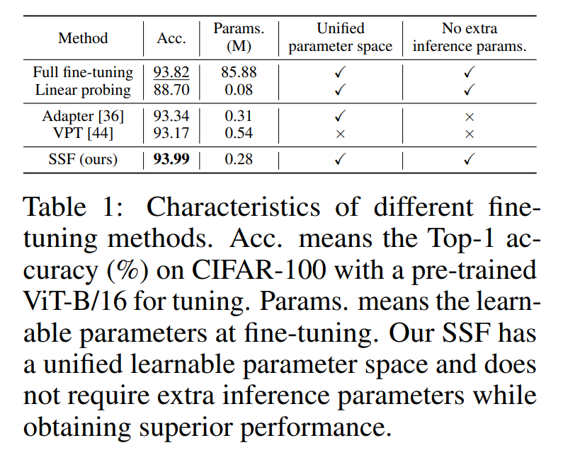

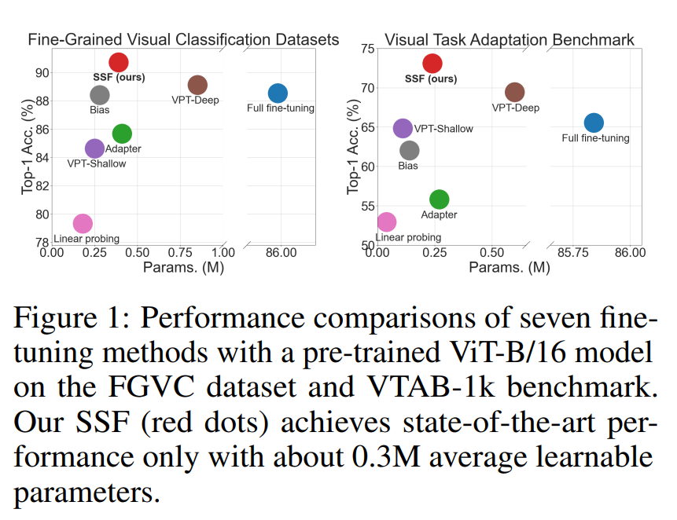

저자는 26 classification datasets 와 3 robustness & out-of-distribution datasets 에서 저자의 method 를 평가했다. 

- SSF 는 trainable parameter 와 accuracy trade-off 에서 다른 parameter-efficient fine-tuning method 에 비해 state-of-the-art 성능을 얻는다 (Tab. 1, Fig. 1). 
- Full fine-tuning 에 비해 저자의 method 는 FGVC 에서 2.46% (90.72% vs. 88.54%), VTAB-1k 에서 11.48% (73.10% vs. 65.57%) 의 Top-1 accuracy 성능 향상을 얻었지만 약 0.3M trainable parameter 만 사용했다. 게다가 SSF 는 inference step 에서 additional parameter 를 필요로 하지 않는다. 
- Plug-and-play 방식이고 CNNs, Transformers, MLPs 같은 다양한 model family 에 쉽게 확장할 수 있다.

# 2 Related Work

## 2.1 Model Families

Convolution 은 오랫동안 computer vision task 에서 image feature 를 추출하는 주요 module 로 사용됐고, CNN-based architecture 도 연구됐다. 최근 Transformer 라는 또 다른 architecture family 가 NLP 에서 큰 성공을 거두며 주목받고 있다. 이 방향을 따라 Dosovitskiy 등은 computer vision 영역에서 transformer 를 처음 적용하고 ViT 라는 새로운 architecture paradigm 을 소개해 유망한 결과를 얻었다. 

이후 DeiT, Swin Transformer 같은 다양한 transformer-based model 이 소개됐고, object detection, semantic segmentation, action recognition 같은 다양한 task 에서 효과적임이 입증됐다. 또 다른 방향에서는 Tolstikhin 등이 pure MLP-based architecture 를 제안했고, 후속 논문들은 MLP-based architecture 가 transformer 를 따라잡을 수 있음을 흥미롭게 보여줬다. 하지만 잘 설계된 module 외에도 이들의 뛰어난 성능은 large-scale model 의 deployment 에도 기인한다. 

Large dataset 에서 pre-trained 된 large-scale model 이 주어졌을 때, downstream task 에서 parameter-efficient fine-tuning 을 어떻게 수행할지는 필수적이지만 현재 덜 탐구되고 있다. 이 논문에서 저자는 SSF 를 새로운 baseline 으로 제안하고, 다양한 task 에서 종합적인 validation 을 통해 유망한 성능을 보여준다.

## 2.2 Pre-training and Fine-tuning

Early model 은 보통 ImageNet-1K dataset 에서 pre-training 된 후 downstream task 에서 fine-tuning 해서 빠른 convergence 나 더 나은 성능을 얻었다. 이런 절차를 pre-training and fine-tuning, 즉 transfer learning 이라고 한다. 최근 연구는 더 나은 성능을 위해 ViT, Swin Transformer V2 같은 larger model 을 사용하고, ImageNet-21K, JFT-300M 같은 larger dataset 에서 training 한다. 

NLP 와 computer vision 영역 모두에서 이 large model 은 small-scale model 에 비해 엄청난 성능 향상을 얻고 downstream task 에 pre-trained weight 를 제공한다. 일부 연구는 pre-trained model 을 target task 에 효율적으로 fine-tuning 하는 방법을 탐구한다. 

- SpotTune 은 어떤 layer 를 fine-tuning 해야 하는지 조사한다. 
- Touvron et al 은 attention layer 의 weight 를 fine-tuning 하고 다른 부분의 weight 를 frozen 시키는 것만으로 vision transformer 를 downstream task 에 적응시키기에 충분하다고 발견했다. 

일부 연구는 network 에 adapter 를 삽입해 parameter-efficient 방식으로 fine-tuning 을 제안한다. 

- 이 adapter 는 small non-linear network, model weight 를 생성하는 hyper-network, 또는 parameter 를 줄이기 위해 low-rank decomposition 을 수행하는 compactor 일 수 있다. 
- 일부 연구는 bias term 만 업데이트하려고 시도했다. 
- 최근 VPT 는 소수의 learnable parameter (prompt) 를 삽입하고 backbone 을 frozen 시킨 채 이를 최적화해 full fine-tuning 에 비해 큰 성능 향상을 얻었다. 

이 논문 제출 중에 adapter module 삽입이나 neural prompt search 같은 parameter-efficient fine-tuning method 도 제안됐다. 위 모든 연구와 달리 저자는 pre-trained model 에서 추출한 deep feature 를 scale 하고 shift 하는 간단하지만 효과적인 방법을 제안하고, 다른 parameter-efficient fine-tuning method 를 능가한다.

## 2.3 Feature Modulation

많은 연구가 더 나은 성능을 얻기 위해 feature 를 modulate 하려고 시도했다. 

저자의 연구와 가장 관련 있는 건 다양한 normalization method 다. Batch Normalization (BN), Layer Normalization (LN), Group Normalization (GN) 은 보통 feature 를 normalize 한 뒤 scale factor 와 shift factor 로 linear transformation 을 수행해 feature distribution 을 modulate 한다. 이는 많은 task 에서 효과적임이 입증됐다. 

Spatial Transformer Network (STN) 은 feature map 을 spatially transform 하는 learnable module 을 도입한다. Image generation 분야에서 Adaptive Instance Normalization (AdaIN) 은 특정 image style 을 characterize 하기 위해 scale factor 와 shift factor 를 생성한다. Self-modulation 은 GAN 이 generator 의 self-modulation layer 에서 이익을 얻는다는 걸 보여준다. 

Vision-language task 에서 Conditional Batch Normalization (Conditional BN) 과 Feature-wise Linear Modulation (FiLM) 은 두 modality 의 feature 를 modulate 하는 데 자주 사용된다. BN 같은 일부 algorithm 과 달리 저자의 SSF 는 normalization layer 의 modulation 에 국한되지 않고, upstream task 와 downstream task 간 distribution mismatch 를 완화하려는 다른 motivation 을 가진다. 

비교를 위해 Sec. 4.3 에서 실험을 했고, SSF 가 normalization layer 만 tuning 하는 것보다 더 효과적임을 보여줬다. STN, AdaIN, FiLM 등과 비교해 저자의 method 는 input-independent 하고, scale parameter 와 shift parameter 는 전체 dataset 의 distribution 을 model 하므로 inference step 에서 original pre-trained model weight 에 흡수될 수 있다.

## 2.4 Model Re-parameterization

Model re-parameterization 은 inference efficiency 를 높이기 위해 흔히 사용되는 방식이다. 

대표적인 기술 중 하나는 model compression algorithm 에서 사용되는 batch normalization folding 이다. Batch normalization layer 에서 도입된 parameter 는 보통 그 앞에 쌓인 convolutional layer 에 합쳐진다. 이 기술은 network 의 다른 branch 를 새로운 branch 로 합치는 데도 사용된다. 마찬가지로 저자의 SSF 는 linear transformation 을 완전히 채택해 training step 의 scale parameter 와 shift parameter 를 inference step 에서 original pre-trained model weight 에 합칠 수 있어 additional parameter 와 computational cost 도입을 피한다.

# 3 Approach

## 3.1 Preliminaries

#### Transformers.

Vision transformer (ViT) 에서 RGB image $I \in \mathbb{R}^{3 \times H \times W}$ 는 $N \times N$ non-overlapping patch 로 나뉜다. 그리고 이 image patch 들에 class token 을 붙인 뒤 embedding layer 를 거쳐 $L$-layer vision transformer block 에 넣는다. 여기서 self-attention 이 핵심 operation 이다. Input $x \in \mathbb{R}^{\left(N^2+1\right) \times d}$ ($d$ 는 embedding dimension) 은 먼저 key $K \in \mathbb{R}^{\left(N^2+1\right) \times d}$, value $V \in \mathbb{R}^{\left(N^2+1\right) \times d}$, query $Q \in \mathbb{R}^{\left(N^2+1\right) \times d}$ 로 변환된다. 그 후 global self-attention 은 다음 식으로 계산된다:

$$
\begin{equation}
  \text{Attention}(Q, K, V) = \operatorname{Softmax}\left(\frac{Q K^T}{\sqrt{d}}\right) V
\end{equation}
$$

Attention layer 의 output 은 channel dimension 에서 정보 추출을 위해 two-layer MLP 에 들어간다.

#### Adapter.

Adapter 는 efficient fine-tuning 을 위해 transformer layer 에 삽입된다. 이는 trainable parameter 수가 적은 bottleneck module 로, feature dimension 을 줄이는 down-projection, non-linear activation function, 원래 dimension 으로 되돌리는 up-projection 을 포함한다. 그래서 input $x \in \mathbb{R}^{\left(N^2+1\right) \times d}$ 가 주어지면 output 은 다음과 같이 계산된다:

$$
\begin{equation}
  \text{out} = \left[W^{\text{up}} \phi\left(W^{\text{down}} x^T\right)\right]^T
\end{equation}
$$

- $W^{\text{down}} \in \mathbb{R}^{d' \times d}$ ($d' \ll d$), $\phi$, $W^{\text{up}} \in \mathbb{R}^{d \times d'}$ 는 각각 down-projection matrix, non-linear function, up-projection matrix

#### VPT.

VPT 는 embedding layer 뒤 input space 에 learnable parameter (prompt) 를 삽입한다. 이 prompt 는 self-attention 을 수행하며 original image token 과 상호작용한다. Fine-tuning 중에는 backbone network 의 weight 를 frozen 시키고 prompt 의 parameter 만 업데이트한다. 

VPT-Shallow 는 first layer 에 prompt 를 삽입하고, VPT-Deep 은 transformer 의 all layers 에 삽입한다. Input 이 $x \in \mathbb{R}^{\left(N^2+1\right) \times d}$ 라고 가정하고, 삽입된 prompt 를 $p \in \mathbb{R}^{n \times d}$ ($n$ 은 prompt 수) 라고 하면, 합쳐진 token $x'$ 는 다음과 같다:

$$
\begin{equation}
  x' = [x; p]
\end{equation}
$$

- $x' \in \mathbb{R}^{\left(N^2+n+1\right) \times d}$ 는 self-attention (Eq. (1)) 을 위해 transformer block 에 들어간다.

## 3.2 Scaling and Shifting Your Features for Fine-tuning

위 방법들과 달리 저자는 scale factor 와 shift factor 를 도입해 pre-trained model 이 추출한 deep feature 를 linear transformation 으로 modulate 해서 target dataset 의 distribution 에 맞춘다. 저자의 method 는 다음 다섯 가지 주요 특성을 가진다:

- SSF 는 full fine-tuning strategy 와 비슷한 성능을 낸다.
- 모든 downstream task 는 다른 task 에 의존하지 않고 독립적으로 model 에 입력될 수 있다.
- Model 은 아주 적은 parameter 만 fine-tuning 하면 된다.
- VPT 와 달리, SSF 에서 fine-tuning 하는 parameter set 은 task 가 바뀌어도 변하지 않아 multi-task learning 이나 continuous learning 을 위해 나중에 parameter 를 추가로 fine-tuning 하는 게 가능하다.
- Linear transformation 덕분에 SSF 는 inference step 에서 추가 parameter 와 computational cost 를 도입하지 않아 zero overhead 를 만든다.

#### The design of SSF.

SSF 는 parameter-efficient fine-tuning 을 위해 linear transformation 을 수행해 feature 를 modulate 한다 (Fig. 2).

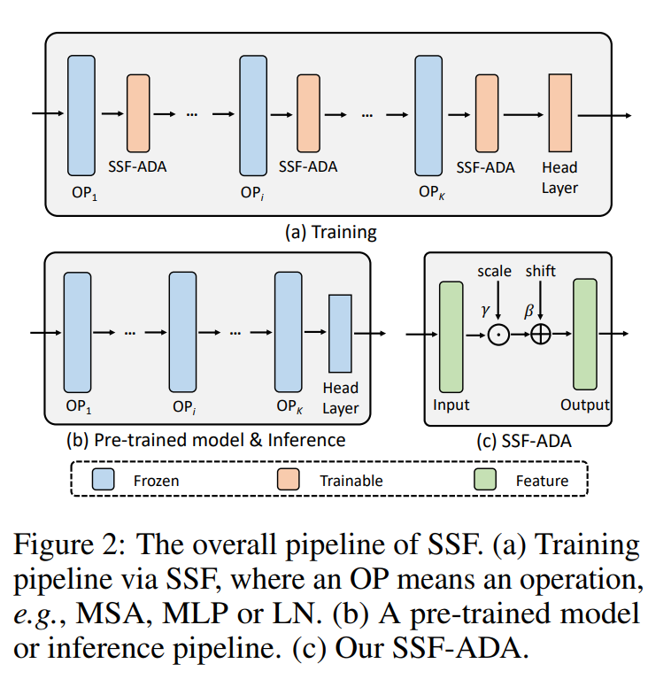

- Fig. 2(a) 에서 upstream task 에서 pre-trained 된 model 이 주어지면, 저자는 network 의 각 operation (OP) 뒤에 SSF-ADA 를 삽입해 feature 를 modulate 한다. 
  - 총 $K$ OP 가 있고, 이 operation 은 multi-head self-attention (MSA), MLP, layer normalization (LN) 등을 포함할 수 있다. 
  - Fine-tuning 중에는 이 operation 의 pre-trained weight 를 frozen 시키고 SSF-ADA parameter 만 업데이트한다. 
- SSF-ADA 의 구체적인 구조는 Fig. 2(c) 에 나와 있다. 
  - 이전 operation 에서 나온 feature 는 scale factor 와 dot product 를 수행한 뒤 shift factor 를 더한다. 이는 input-independent 하다. 
  - 공식적으로, input $x \in \mathbb{R}^{\left(N^2+1\right) \times d}$ 가 주어지면 output $y \in \mathbb{R}^{\left(N^2+1\right) \times d}$ (다음 operation 의 input) 은 다음과 같이 계산된다:

$$
\begin{equation}
  y = \gamma \odot x + \beta
\end{equation}
$$

여기서 $\gamma \in \mathbb{R}^d$, $\beta \in \mathbb{R}^d$ 는 각각 scale factor 와 shift factor 이다. $\odot$ 는 dot product 이다.

#### Re-parameterization.

SSF-ADA 는 완전한 linear transformation 이므로 scale term 과 shift term 을 이전 linear layer 에 흡수해 re-parameterization 할 수 있다:

$$
\begin{equation}
  y = \gamma \odot x + \beta = \gamma \odot (w \ast t + b) + \beta = (\gamma \odot w) \ast t + \gamma \odot b + \beta
\end{equation}
$$

- $w$ 와 $b$ 는 각각 weight 와 bias term 이다. 
- $\ast$ 는 convolutional layer 에서 'convolution' operation 이거나 MLP layer 에서 'multiplication' operation 이다. 
- $t$ 는 이전 linear layer 의 input 이다. 
- $w$ 와 $b$ 는 frozen 상태이고 $\gamma$ 와 $\beta$ 는 fine-tuning 중 업데이트되므로, 위 식을 통해 $\gamma$ 와 $\beta$ 는 inference step 에서 original parameter space ($w$ 와 $b$) 에 합쳐질 수 있다. 

이런 관점에서 SSF-ADA 는 추가 parameter 와 computational cost 없이 downstream task 를 수행할 수 있게 한다 (Fig. 2(b)).

#### Discussion.

첫 번째 질문은 왜 $\gamma$ 와 $\beta$ 를 input-independent 하게 만들었냐는 거다. FiLM 과 AdaIN 이 보여주듯, image sample 에 따라 $\gamma$ 와 $\beta$ 를 얻을 수 있지만, 이는 두 가지 단점을 낳는다:

- 저자는 $\gamma$ 와 $\beta$ 가 input-independent 해서 전체 downstream dataset 의 distribution 을 나타내길 원한다. 그래야 feature 를 modulate 해서 downstream dataset 에 맞게 이전 weight distribution 을 수정할 수 있다.
- Conditional input 은 $\gamma$ 와 $\beta$ 를 생성하기 위해 추가 network (e.g., MLP) 를 도입해야 해서 trainable parameter 를 늘린다. 더 중요한 건, $\gamma$ 와 $\beta$ 를 더 잘 생성하기 위해 non-linear activation function 이 필요할 수 있는데, 이는 re-parameterization 을 어렵게 만든다.

그래서 저자는 완전한 linear transformation 을 수행해 $\gamma$ 와 $\beta$ factor 를 original pre-trained weight 에 합쳐서 edge device 에 backbone architecture 를 수정하지 않고 weight 만 쉽게 업로드할 수 있게 한다.

---

두 번째 질문은 어떤 operation 뒤에 SSF-ADA 를 삽입해야 하냐는 거다. 저자의 경험으로는 ViT 에서 linear coefficient 가 있는 각 operation 뒤에 SSF-ADA 를 삽입하면 된다. Neural Architecture Search (NAS) 를 통해 최적의 layer 나 operation 을 찾을 수도 있지만, trainable parameter 수를 줄이기 위해 저자의 method 는 너무 많은 trainable parameter 를 도입하지 않고도 (NAS 보다 나쁘지 않은) 더 나은 결과를 낼 거라고 믿는다.

## 3.3 Complexity Analysis

Adapter, VPT, SSF 의 complexity 를 비교해보자. 

- ViT 를 예로 들면, token 의 dimension 과 수는 각각 $d$ 와 $N^2$ 이다. Adapter 가 feature 를 $d$-dim 에서 $d'$-dim ($d' \ll d$) 으로 projection 한다고 가정하면, 각 layer 에서 추가 trainable parameter 는 $2dd'$ 이다. 
  - VPT 는 $n$ 개 prompt 를 삽입해 각 layer 에 $nd$ 개 추가 parameter 를 얻는다. 
- SSF 는 linear coefficient 가 있는 각 operation 뒤에 SSF-ADA 를 삽입해 각 layer 에 $md$ 개 추가 parameter 를 얻는다. 
  - 총 layer 수가 $L$ 일 때, Adapter, VPT, SSF 의 complexity 는 Tab. 2 에 나와 있다. 
- Adapter, VPT, SSF 가 사용하는 추가 parameter 의 구체적인 수는 $d'$, $n$, $m$ 값에 따라 다르다. 
  - 하지만 실제로 SSF 는 training step 에서 Adapter 와 VPT-Deep 보다 약간 적은 parameter 로도 더 나은 성능을 낸다 (Sec. 4 에서 확인). 
  - 게다가 inference step 에서 model re-parameterization strategy 를 빌리면 SSF 의 추가 parameter 와 FLOPs 는 0 이 된다. 하지만 Adapter 와 VPT 의 complexity 는 training 때와 동일하게 유지돼 저자의 approach 의 강점을 보여준다.

# 4 Experiments

## 4.1 Experimental Settings

#### Datasets.

저자는 주로 세 가지 유형으로 나눌 수 있는 dataset 에서 실험을 한다:

- _FGVC_ : VPT 를 따라 다섯 개 Fine-Grained Visual Classification (FGVC) dataset 을 사용해 SSF 의 효과를 평가한다. 이는 CUB-200-2011, NABirds, Oxford Flowers, Stanford Dogs, Stanford Cars 로 구성된다.
- _VTAB-1k_ : VTAB-1k benchmark 는 다양한 도메인에서 19 tasks 를 포함한다:
  - Natural image: 표준 camera 로 찍은 이미지
  - Specialized image: 비표준 camera (e.g., remote sensing, medical camera) 로 찍은 이미지
  - Structured image: 시뮬레이션 환경에서 합성된 이미지 이 benchmark 는 object counting, depth estimation 같은 다양한 task 를 포함하며, 각 task 는 1,000 개 training sample 만 있어 매우 어렵다.
- General Image Classification Datasets : SSF 의 효과를 general image classification task 에서도 검증한다. 
  - CIFAR-100 과 ImageNet-1K dataset 을 평가 dataset 으로 선택한다. CIFAR-100 은 100 category 로 60,000 images, ImageNet-1K 는 1,000 category 로 1.28M training 이미지와 50K validation 이미지로, object recognition 에 아주 큰 dataset 이다.

#### Models.

공정한 비교를 위해 VPT 를 따라 주로 ImageNet-21K 에 pre-trained ViT-B/16 model 을 fine-tuning 초기화로 선택한다. 또 저자의 method 를 다른 model family 의 backbone 에도 일반화한다. 

최근 Swin Transformer (Swin-B), ConvNeXt-B, AS-MLP-B 를 포함한다. Swin-B 는 hierarchical transformer-based architecture 를 구축하고, ConvNeXt-B 와 AS-MLP-B 는 각각 CNN-based architecture 와 MLP-based architecture 에 속한다.

#### Baselines.

먼저 두 가지 기본 fine-tuning method 와 비교한다:

- Full fine-tuning: model 의 모든 parameter 를 fine-tuning 때 업데이트
- Linear probing: classification head (MLP layer) 의 parameter 만 업데이트 최근 parameter-efficient fine-tuning method 와도 비교한다:
- Adapter: transformer 에 up-projection, non-linear function, down-projection 으로 새 adapter 구조를 삽입하고 이 module 의 parameter 만 업데이트
- Bias: 모든 parameter 의 bias term 을 업데이트
- VPT: transformer 에 prompt 를 input token 으로 삽입하고 fine-tuning 때 이를 업데이트

#### Implementation Details.

- FGVC dataset 에서는 image 를 224×224 로 randomly resize crop 하고 random horizontal flip 으로 data augmentation 을 한다. 
- VTAB-1k 에서는 VTAB 의 기본 설정을 따라 image 를 224×224 로 직접 resize 한다. 
- CIFAR-100 과 ImageNet-1K 에서는 ViT-B/16 의 fine-tuning 설정을 따라 더 강한 data augmentation strategy 를 사용한다.
- AdamW optimizer 를 사용해 CIFAR-100 은 100 epoch, ImageNet-1K 는 30 epoch 동안 model 을 fine-tuning 한다.
- Learning rate schedule 에는 cosine decay strategy 를 사용하고, CIFAR-100 은 처음 10 epoch, ImageNet-1K 는 처음 5 epoch 동안 linear warm-up 을 적용한다.

## 4.2 Performance Comparisons on Image Classification

저자는 SSF 와 다른 baseline method 의 성능을 26 image classification tasks 에서 비교했다. FGVC 와 VTAB-1k 에 대한 결과는 각각 Tab. 3 과 Tab. 4 에 나와 있고 (Fig. 1 도 참고), CIFAR-100 과 ImageNet-1K 에 대한 결과는 Tab. 5 에 나와 있다. 이는 Top-1 accuracy (%) 로 평가했다. 이 세 표에서 bold font 는 모든 method 중 최고 accuracy 를, underline font 는 두 번째로 높은 accuracy 를 보여준다.

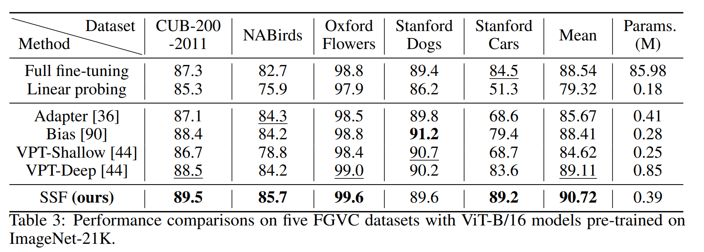

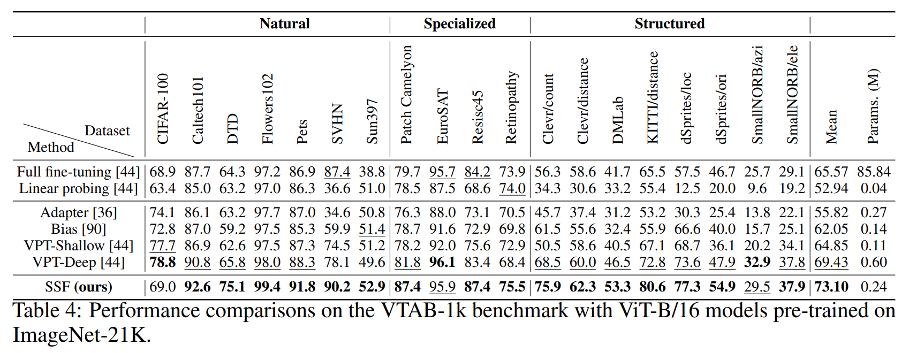

이 표들을 보고 다음을 알 수 있다:

- Tab. 3 과 Tab. 4 에서 마지막 열은 각 method 가 해당 dataset 에서 fine-tuning 한 parameter 의 평균이다. 
- SSF 는 VPT 와 다른 parameter-efficient fine-tuning method 를 능가하고, 심지어 full fine-tuning 보다 더 나은 성능을 낸다. 이는 주로 feature 에 적용한 linear transformation 덕분이다. 
- 구체적으로 SSF 는 5 FGVC datasets 에서 1.81% (90.72% vs. 89.11%) 와 2.46% (90.72% vs. 88.54%), VTAB-1k benchmark 에서 5.29% (73.10% vs. 69.43%) 와 11.48% (73.10% vs. 65.57%) 의 accuracy 향상을 VPT 와 full fine-tuning 에 비해 얻었다. 
- 동시에 SSF 는 두 dataset 에서 VPT-Deep 보다 적은 trainable parameter 를 사용한다 (0.39M vs. 0.85M, 0.24M vs. 0.60M). 
- SSF 는 적은 parameter 로 다른 task 에 대해 unified learnable parameter space 를 유지하지만, VPT 는 각 task 마다 다른 prompt 수를 설계해야 해서 우리 approach 의 간결함을 보여준다.

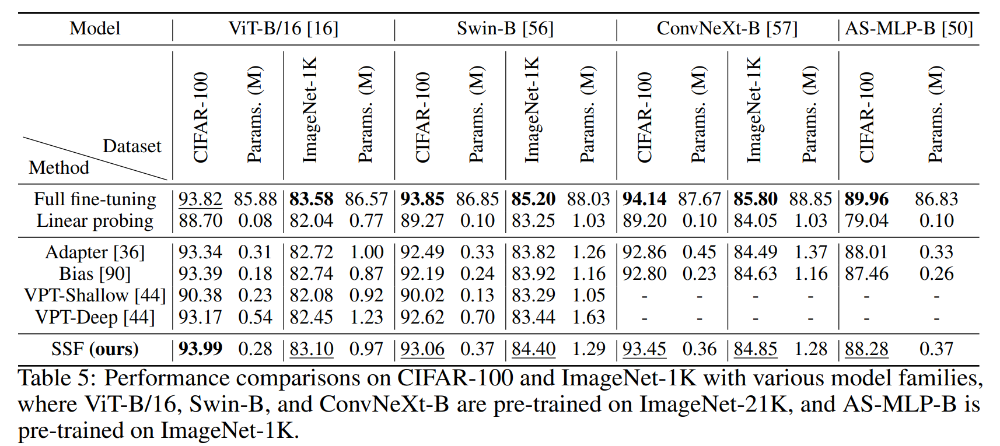

- Tab. 5, 즉 CIFAR-100 과 ImageNet-1K 에서 SSF 와 다른 parameter-efficient fine-tuning method 는 full fine-tuning 과 비슷한 성능을 내기 어렵다. 아마 이 dataset 들은 model 의 over-fitting 을 막을 만큼 충분한 data 를 가지고 있어서, 특히 ImageNet-1K 에서 그렇다. 
- 반면 VTAB-1k benchmark 에서는 data 양이 많지 않아 (e.g., training image 1,000), full fine-tuning 에서 model 이 over-fitting 할 수 있다. 그럼에도 CIFAR-100 과 ImageNet-1K 에서 SSF 는 이전 parameter-efficient fine-tuning method (Adapter, Bias, VPT) 를 능가해서 SSF 의 효과를 보여준다.
- Tab. 5 에서 Swin Transformer, ConvNeXt, AS-MLP model 에서 SSF 의 결과는 다른 parameter-efficient fine-tuning method 를 일관되게 능가한다. 이는 SSF 가 다양한 model 에서 효과적임을 검증한다.

#### Computational cost.

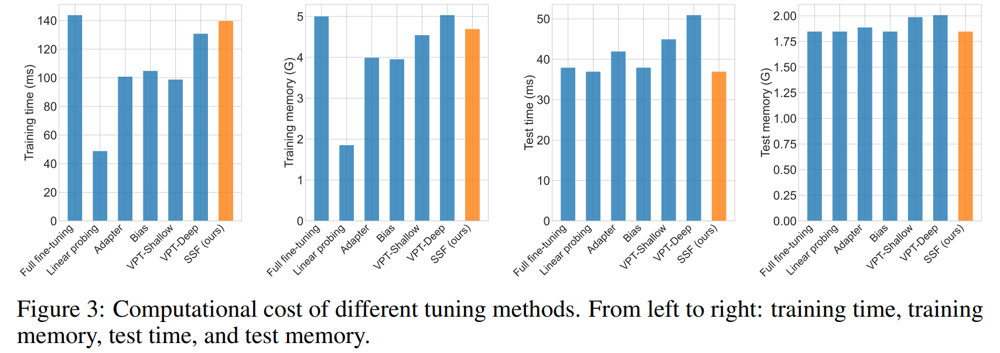

SSF 의 efficiency 를 검증하기 위해 Fig. 3 에 SSF 의 computational cost 를 보여준다. 

- Training stage 와 inference stage 에서 batch size 16 을 사용하고 mixed precision training 을 했다. 
- Fig. 3 의 모든 실행 결과는 single GeForce RTX 2080Ti GPU 에서 측정했다. 
- SSF 는 VPT 와 비슷한 training time 과 training memory 를 가지지만 inference time 과 inference memory 는 더 적다. 
- 여기서 VPT 의 computational cost 는 VPT-Shallow 와 VPT-Deep 에 각각 200/50 prompt (Tab. 5 의 성능을 얻은 prompt 수) 를 사용한 결과다. Prompt 수를 늘리면 time cost 와 memory 가 커지지만, SSF 는 zero-overhead inference 를 달성해서 더 유리하다.

## 4.3 The Impacts of Different Designs

SSF 의 핵심 operation 으로서 SSF-ADA 가 결과에 어떤 영향을 미치는지, 예를 들어 삽입 위치, SSF-ADA 와 그 component 의 initialization 을 철저히 평가했다. Fine-tuning 에서 다른 design 의 영향을 분석하기 위해 실험을 했다. 모든 실험은 CIFAR-100 에서 pre-trained ViT-B/16 model 로 했고, 결과는 Tab. 6 에 나와 있다.

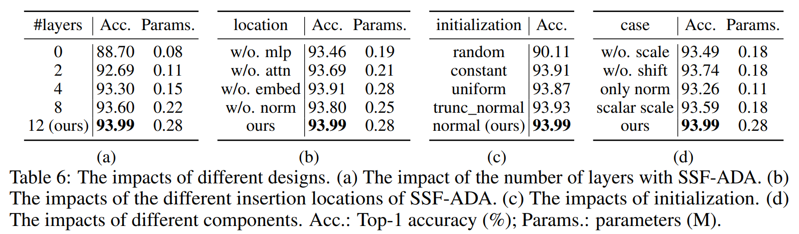

#### The impact of the number of layers.

SSF-ADA 를 다른 layer 에 직접 삽입해 삽입 layer 의 효과를 평가했다. 결과는 Tab. 6a 에 나와 있다. 

- #layers 열의 값은 SSF-ADA 가 있는 layer 수를 나타내고, #layers-0 은 linear probing 을 뜻한다. 
- 첫 번째와 두 번째 행에서 처음 두 layer 에만 SSF-ADA 를 삽입하면 결과가 88.70% 에서 92.69% 로 향상되고 trainable parameter 도 적게 늘어난다 (0.08M vs. 0.11M). 이후 layer 에 SSF-ADA 를 계속 추가하면 결과가 더 좋아진다. 
- 결과의 성장은 삽입된 SSF-ADA layer 수와 거의 선형적이다. 그래서 저자는 vision transformer 의 모든 (12) layer 에 SSF-ADA 를 삽입해 최고 결과 (93.99%) 를 얻었다. 이는 0.28M trainable parameter 를 사용했다.

#### The impact of the different insertion locations.

ViT 의 다른 operation 을 기반으로 SSF-ADA 의 삽입 위치 영향을 평가했다. 이 operation 뒤에서 SSF-ADA 를 따로 제거한 결과는 Tab. 6b 에 나와 있다. 

- MLP operation 에서 SSF-ADA 를 제거하면 Attention operation 에서 제거한 것보다 결과가 더 나쁘다 (93.46% vs. 93.69%), trainable parameter 는 비슷하다 (0.19M vs. 0.21M). 이는 MLP operation 에서 feature modulation 이 더 중요할 수 있음을 시사한다. 
- NAS 를 사용해 다른 operation 의 중요도를 찾아 특정 위치에 SSF-ADA 를 삽입할 수도 있지만, 모든 operation 에 삽입하는 것보다 결과가 나아지지 않을 수 있다. 그래서 뛰어난 성능을 얻기 위해 NAS 를 하지 않고 모든 operation 에 SSF-ADA 를 삽입한다.

#### The impact of initialization.

Scale factor 와 shift factor 를 다르게 초기화하는 방식이 성능에 어떤 영향을 미치는지 Tab. 6c 에서 조사했다. 

- 실험에서 먼저 scale 과 shift parameter 를 모두 평균 0 으로 random initialization 했지만, 성능이 낮았다 (90.11%). 일부 실험에서는 수렴하지 않았다. 
- 그 후 scale factor 를 평균 1 로 random initialization 하니 더 나은 성능을 얻었다. 이는 pre-trained model 의 weight 를 fine-tuning 에서 완전히 망가뜨리지 말고, 이 pre-trained model 에서 시작해 model 을 최적화해야 함을 의미한다. 
- 실험은 normal initialization 이 최고 성능을 낸다는 걸 보여준다. 여기서 scale factor 와 shift factor 의 평균은 각각 1 과 0 이다.

#### The impact of different components.

SSF-ADA 의 다른 component 의 영향을 평가한 결과는 Tab. 6d 에 나와 있다. 

- Scale term 을 제거하면 shift term 을 제거한 것보다 성능이 더 나쁘다. Trainable parameter 는 같다. 이는 scale term 이 shift term 보다 더 중요할 수 있음을 보여준다. 
- 또한 ‘w/o. scale’ 과 Tab. 5 의 ‘Bias’ method 의 차이는 ‘w/o. scale’ 에서 추가 shift term 으로 model 을 fine-tuning 한 반면, ‘Bias’ 는 original bias 를 기반으로 fine-tuning 했다는 점이다. 이는 res-like 방식으로 model 을 fine-tuning 하면 약간 더 나은 성능을 얻을 수 있음을 시사한다 (93.49% vs. 93.39%). 
- 저자는 normalization layer (LN) 에서 모든 scale factor 와 shift factor 만 fine-tuning 하거나, SSF 로 model 을 fine-tuning 하되 scale term 을 scalar 로 설정해보기도 했다. 
- 이 실험들은 SSF 보다 낮은 성능을 냈다 (93.26% vs. 93.99%, 93.59% vs. 93.99%). 하지만 SSF 의 trainable parameter 의 절반 정도만 사용하므로 대안으로 고려될 수 있다.

## 4.4 Performance Comparisons on Robustness and OOD Datasets

저자는 SSF method 의 robustness 와 Out-Of-Distribution (OOD) 능력을 분석하기 위해 ImageNet-A, ImageNet-R, ImageNet-C dataset 에서 실험을 했다. 자세한 내용은 Appendix A.2 를 참고해라. ImageNet-1K 에서 fine-tuning 한 model 로 이 세 dataset 에서 robustness 와 OOD 평가를 했다. 모든 실험 결과는 Tab. 7 에 나와 있다.

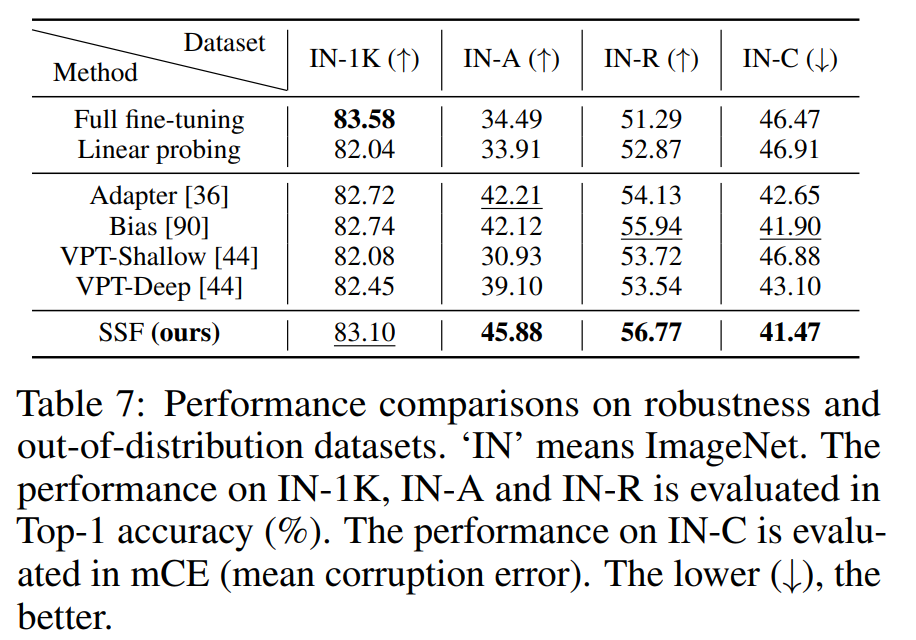

- 이 표에서 SSF 는 세 dataset 에서 VPT 와 다른 parameter-efficient fine-tuning method 보다 더 나은 성능을 낸다. 이는 SSF fine-tuning method 가 더 강한 robustness 와 out-of-distribution generalization 을 가짐을 보여준다. 
- 게다가 SSF 는 ImageNet-1K 에서 full fine-tuning 보다 accuracy 가 낮지만, ImageNet-A, ImageNet-R, ImageNet-C 에서의 성능은 더 낫다. 이는 ImageNet-1K 와 ImageNet-A/R/C 간 성능이 절대적으로 양의 상관관계가 아님을 보여준다. 
- Robustness 와 OOD dataset 에서의 이런 향상은 SSF 가 대부분 pre-trained parameter 를 frozen 시켜 large-scale dataset 에서 배운 지식을 최대한 보존해 더 나은 generalization 능력을 유지하기 때문일 수 있다.

## 4.5 Visualization and Analysis

저자의 목표는 pre-trained model 이 추출한 feature 를 modulate 하는 거지만, scale parameter 와 shift parameter 는 실제로 input-independent 하다. 그래서 이 parameter 는 전체 downstream dataset 의 정보를 encoding 한다고 볼 수 있다. 

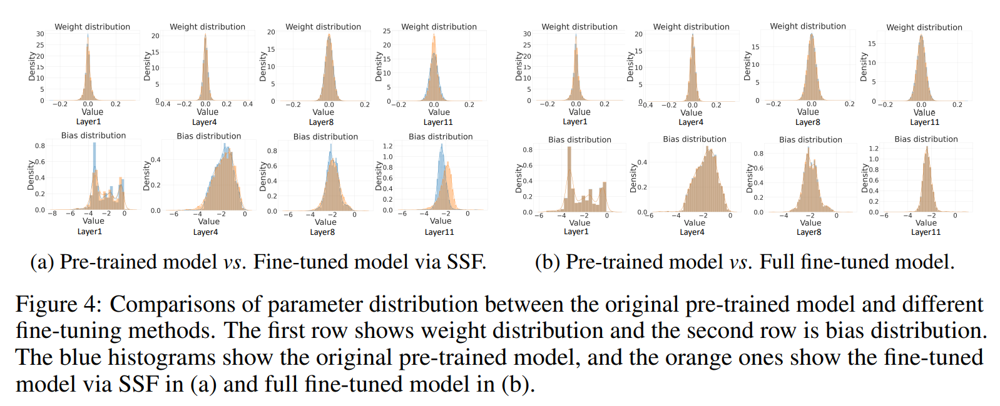

Re-parameterization 후 이 scale parameter 와 shift parameter 는 original model weight 에 흡수된다. SSF 가 배운 정보를 더 잘 이해하기 위해 Fig. 4a 에서 SSF 로 fine-tuning 전후의 weight 와 bias distribution 을 시각화했다. 

- Scale parameter 와 shift parameter 가 original weight 와 bias 를 조정하고, downstream task 에 맞게 weight 와 bias 의 distribution 을 바꾼다. 
- 비교로 Fig. 4b 에서 original weight distribution 과 full fine-tuning 후 weight distribution 을 시각화했다. 여기서 흥미로운 현상을 발견했다. 
- Full fine-tuning 은 weight 와 bias 의 distribution 을 많이 바꾸지 않고, 아마 값의 작은 부분만 바뀐다. SSF 는 full fine-tuning 의 weight distribution 과 맞지 않지만, CIFAR-100 에서 더 나은 성능을 낸다 (Tab. 5 에서 93.99% vs. 93.82%).

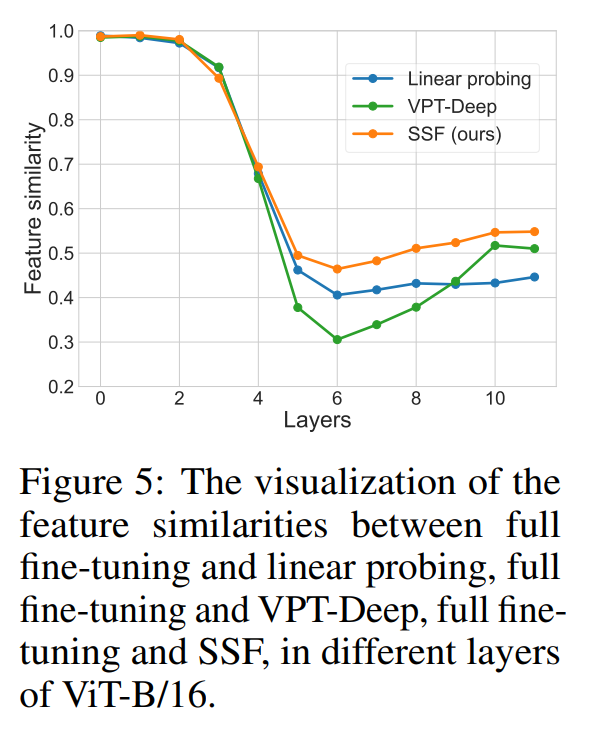

- SSF 가 왜 뛰어난 성능을 낼 수 있는지 더 알아보려고 weight distribution 외에 full fine-tuning 과 linear probing, full fine-tuning 과 VPT-Deep, full fine-tuning 과 SSF 간 feature similarity 를 Fig. 5 에서 시각화했다. 
- last layer 에서 SSF 는 full fine-tuning 과 가장 비슷한 feature 를 가지고 accuracy 도 가장 가깝다. 이는 SSF 가 배운 weight distribution 이 full fine-tuning 과 달라도 downstream task 의 이미지 feature 를 아주 잘 추출할 수 있음을 보여준다.

# 5 Conclusion

이 논문에서 저자는 parameter-efficient fine-tuning 에 초점을 맞추고, pre-trained model 이 추출한 feature 를 scale 하고 shift 하는 SSF method 를 제안했다. 

SSF 의 직관은 upstream task 와 downstream task 간 distribution mismatch 를 feature modulation 으로 완화하는 데서 온다. SSF 는 적은 learnable parameter 로 다른 parameter-efficient fine-tuning approach 를 놀랍게도 능가한다. 게다가 fine-tuning 중 도입된 scale parameter 와 shift parameter 는 inference step 에서 re-parameterization 을 통해 original pre-trained model weight 에 합쳐져 additional parameter 와 FLOPs 를 피한다. 

제안된 SSF method 은 FGVC 에서 2.46% (90.72% vs. 88.54%), VTAB-1k 에서 11.48% (73.10% vs. 65.57%) 의 Top-1 accuracy 성능 향상을 full fine-tuning 에 비해 얻었지만, 약 0.3M parameter 만 fine-tuning 했다. 총 26 개 image classification dataset 과 3 개 robustness & out-of-distribution dataset 에서 다양한 model family (CNNs, Transformers, MLPs) 로 한 실험은 SSF 의 효과를 보여주며, 이는 새로운 baseline 을 세운다.