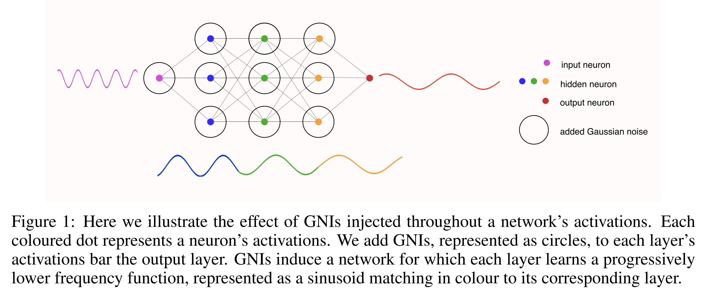
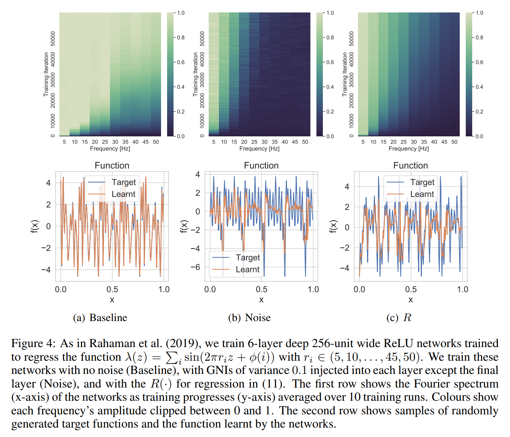
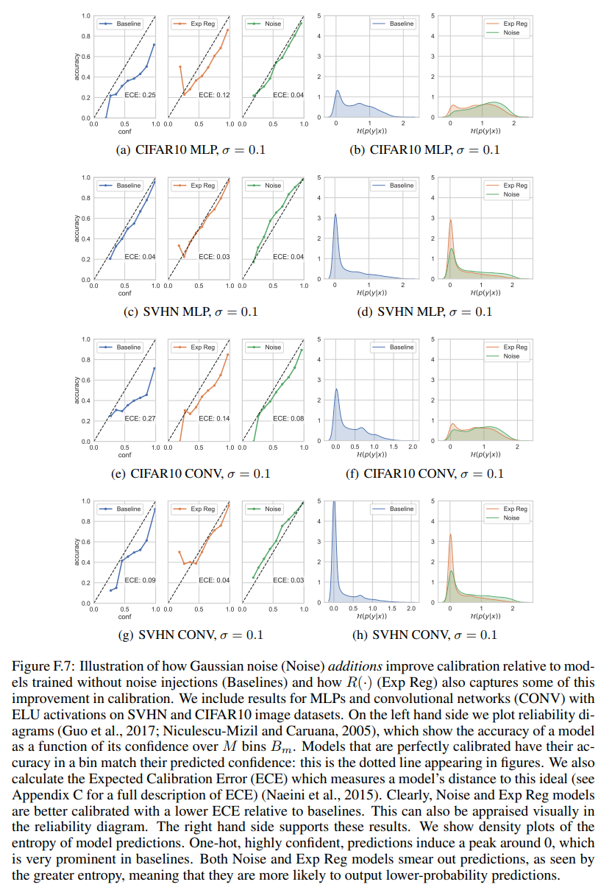
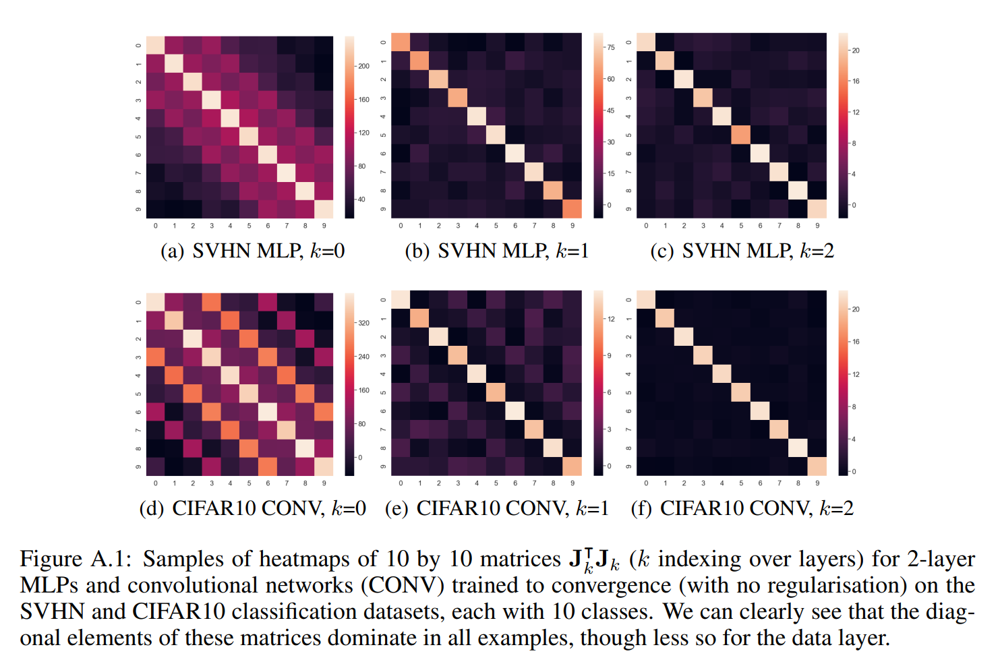

논문 및 이미지 출처 : <https://arxiv.org/pdf/2007.07368>

# Abstract

본 논문에서는 Gaussian noise injections(GNIs)이 neural network 에 유도하는 regularisation 을 연구한다. 

이러한 noise injections 는 데이터에 적용될 때 널리 연구되었지만, network 의 activation 에 적용될 때 유도하는 regularisation 효과에 대한 연구는 거의 이루어지지 않았다. 

- 저자는 injected noise 를 marginalising 하여 GNIs 의 explicit regulariser 를 도출하고, 이는 Fourier domain 에서 high-frequency components 를 가지는 함수를 penalise 함을 보여준다. 
- 특히, network 의 output 에 가까운 layer 에서 이러한 현상이 두드러진다. 
- 또한, 이러한 regularisation 이 larger classification margins 을 유도하고, calibrated classifiers 를 생성함을 이론적, 실험적으로 보인다.

# 1 Introduction

Noise injections 는 neural network training 중에 weights 나 activation 에 noise distribution (일반적으로 isotropic Gaussian)를 더하거나 곱하는 방법이다. 

noise 를 사용하여 학습된 모델은 일반적으로 unseen data 에 better generalise 하며, overfitting 에 덜 취약하다. 

비록 Gaussian noise injections(GNIs)이 유도하는 regularisation 은 실험적으로 관찰될 수 있지만, data 에 noise 를 주입하는 방법의 이점은 이론적으로 잘 이해되었지만, network 전반에 걸쳐 noise 를 주입하는 방법에 대한 연구는 거의 이루어지지 않았다. 

본 논문에서는 injected noise 를 marginalising 할 때 추가되는 positive term 인 _explicit_ regularisation 을 연구한다.

구체적으로, 저자의 기여는 다음과 같다:

- GNIs 의 regularising 효과를 설명하는 explicit regulariser 를 도출하였다.
- 이 regulariser 가 Fourier domain 에서 high-frequency function 을 학습하는 network 를 penalise 하고, output 에 가까운 layer 에서 most heavily regularisation 을 유도함을 보였다. (Fig. 1)
- 마지막으로, 이 regularisation 이 더 큰 classification margins 을 유도하고, 모델의 calibration 을 개선함을 이론적, 실험적으로 보였다.

# 2 Background

## 2.1 Gaussian Noise Injections

neural network 를 학습시키는 것은 주어진 features 에서 label 의 marginal likelihood 를 최대화하기 위한 network parameters 를 최적화하는 것을 의미하며, 이는 gradient descent 로 이루어진다. 

data-label pairs 의 training dataset $\mathcal{D}$ 가 $N$ samples $(x, y) x \in \mathbb{R}^d, y \in \mathbb{R}^m$ 으로 구성되었을 때, feed-forward neural network $M$ parameters 를 $L$ layers 로 나뉜다: $\theta = \{ W_1, \dots, W_L \}, \theta \in \mathbb{R}^M$

저자의 objective 는 label $y$ 가 주어진 data $x$, $-\log p_\theta (y|x)$ 의 expected negative log likelihood 를 최소화하는 것이다. 

그리고 optimal set parameter $\theta^*$ 는 다음을 만족하는 것을 찾는다:

$$
\begin{equation}
    \theta_* = \argmin_{\theta} \mathcal{L}(\mathcal{D}; \theta), \quad \mathcal{L}(\mathcal{D}; \theta) := -\mathbb{E}_{x,y \sim \mathcal{D}} [\log p_{\theta}(y|x)].
\end{equation}
$$

Stochastic Gradient Descent(SGD) 같은 optimisation algorithms 에서는 data-label pairs 의 mini-batch $\mathcal{B} \subset \mathcal{D}$ 를 sampling 하여 $\mathcal{L}$ 을 추정한다:

$$
\begin{equation}
\mathcal{L}(\mathcal{B}; \theta) = -\mathbb{E}_{x,y \sim \mathcal{B}} \log p_{\theta}(y|x) \approx \mathcal{L}(\mathcal{D}; \theta).
\end{equation}
$$

noise 를 주입하지 않고 non-linearity $\phi$ 가 있는 $L$ layer neural network 에서, activation $h = \{h_0, ..., h_L\}$를 얻는다. 여기서 $h_0 = x$ 는 noise 가 주입되기 전의 input data 이다. 

dense layers(MLP)로 구성된 network 에서, 저자는 다음과 같이 쓸 수 있다:

$$
\begin{equation}
    h_k(x) = \phi(W_k h_{k-1}(x)).
\end{equation}
$$

noise 를 주입하면 이 activation 에는 어떤 변화가 생길까? 각 layer 에서 injected noise set 을 $\epsilon = \{\epsilon_0, ..., \epsilon_{L-1}\}$ 라고 하자. 

noise injection procedure 에서 next layer 의 activation value 는 previous layer 의 noised value 에 의존한다. 

저자는 soon-to-be-noised intermediate activation value 를 $\widehat{h}_k$ 로, noised value 를 $\widetilde{h}_k$ 로 나타낸다:

$$
\begin{equation}
    \widehat{h}_k(x) = \phi(W_k \widetilde{h}_{k-1}(x)), \quad \widetilde{h}_k(x) = \widehat{h}_k(x) \circ \epsilon_k,
\end{equation}
$$

여기서 $\circ$ 는 element-wise operation 을 의미한다. 

예로, 각 hidden layer unit 에 Gaussian noise 를 더하거나 곱할 수 있다. 

**additive noise** 의 경우:

$$
\begin{equation}
    \widetilde{h}_k(x) = \widehat{h}_k(x) + \epsilon_k, \quad \epsilon_k \sim \mathcal{N}(0, \sigma_k^2 I).
\end{equation}
$$

**multiplicative noise** 의 경우, activation-scaled addition 으로 다시 쓸 수 있다:

$$
\begin{equation}
    \widetilde{h}_k(x) = \widehat{h}_k(x) + \epsilon_k, \quad \epsilon_k \sim \mathcal{N}(0, \widehat{h}_k^2(x) \sigma_k^2 I).
\end{equation}
$$

본 논문에서는 _additive noise_ 를 중심으로 분석하지만, Eq (6) 을 통해 multiplicative noise 에도 결과를 적용할 수 있다.

## 2.2 Sobolev Spaces

Sobolev Space 를 정의하기 위해 multivariate functions $g : \mathbb{R}^d \to \mathbb{R}$ 에 대한 generalisation dervative 를 사용한다. 

저자는 multi-index notation $\alpha \in \mathbb{R}^d$ 를 사용하여 mixed partial derivatives 를 정의한다. 

$g$ 의 $\alpha^{th}$ derivative 를 input $x$ 에 대해 $D^{\alpha}g(x)$ 로 나타낸다.

$$
D^{\alpha} g = \frac{\partial^{|\alpha|} g}{\partial x_1^{\alpha_1} \dots \partial x_d^{\alpha_d}}
$$

- $|\alpha| = \sum_{i=1}^d |\alpha_i|$
- $x^{\alpha} = [x_1^{\alpha_1}, \dots, x_d^{\alpha_d}]$
- $\alpha! = \alpha_1! \cdot \dots \cdot \alpha_d!$

### Definition 2.1

Sobolev spaces 는 $W^{l,p}(\Omega)$, $\Omega \subset \mathbb{R}^d$ 로 나타내며, 여기서 $l$ 은 space order 로, non-negative integer 이고 $p \geq 1$ 이다.

index $(l, p)$ 인 Sobolev space 는 locally integrable functions $f : \Omega \to \mathbb{R}$ 의 space 이며, every multi-index $\alpha$ 에 대해 $|\alpha| < l$ 일 때 derivative $D^{\alpha}f$ 가 존재하고 $D^{\alpha}f \in L^p(\Omega)$ 이다.

이러한 space 의 norm 은 다음과 같이 주어진다:

$$
\|f\|_{W^{l,p}(\Omega)} = \left( \sum_{|\alpha| \leq l} \int_{\Omega} |D^{\alpha} f(x)|^p \, dx \right)^{\frac{1}{p}}.
$$

- $p = 2$ 일 때, 이 spaces 는 Hilbert spaces 이며, function derivative 의 $L^2$ norm 을 정의하는 dot product 를 가진다. 
- 또한 이러한 Sobolev space 는 _finite_ measure $\mu$ 를 가진 measure space 에서 정의될 수 있다. 
- 이러한 spaces 를 finite measure spaces 이라고 하며, $W^{l,p}_{\mu}(R^d)$ 의 형태로 표현된다.
  - 이는 every $\alpha$ 에 대해 $|\alpha| < l$ 일 때 $D^\alpha f \in L^p_\mu (R^d)$ 인 locally integrable functions 의 spaces 이다.
  - 여기서 $L^p$ space 는 measure $\mu$ 를 갖추고 있다. 
  - 이러한 space 의 norm 은 다음과 같이 주어진다:

$$
\begin{equation}
    \|f\|_{W^{l,p}_{\mu}(\mathbb{R}^d)} = \left( \sum_{|\alpha| \leq l} \int_{\mathbb{R}^d} |D^{\alpha} f(x)|^p \, d\mu(x) \right)^{\frac{1}{p}}, \quad f \in W^{l,p}_{\mu}(\mathbb{R}^d), \, |\mu(x)| < \infty \, \forall x \in \mathbb{R}^d
\end{equation}
$$

- 일반적으로 $\mathbb{R}^d$ 의 compact subset 인 $\Omega$ 위의 Sobolev space 는 compact support 를 가진 measure $\mu$ 와 함께 weighted Sobolev Space 으로 표현될 수 있다.

---

- Hornik (1991) 은 continuous activations (e.g., sigmoid function) 를 사용하는 신경망이 $l$ order 까지 연속적이고 bounded derivatives 를 갖는 경우, weighted Sobolev space 의 $l$ odrder 에서 universal approximators 임을 보여주었다. 
  - 이는 이들이 Sobolev space 의 dense subset 을 형성한다는 것을 의미한다. 
- Czarnecki et al. (2017) 은 ReLU 및 그 variants 같은 piecewise linear activation functions 를 사용하는 network 역시 $R^d$ 의 일부 compact subset $\Omega$ 에서 1 order Sobolev space 의 universal approximators 임을 보여주었다. 
- 위에서 언급한 것처럼, 이는 measure $\mu$ 가 compact support 를 갖는 $R^d$ 상의 weighted Sobolev space 에서 밀집되는 것과 동일하다. 
- 따라서, sigmoid 또는 piecewise linear activations 를 사용하는 network 를 $f_\theta \in W^{1,2}_\mu(R^d)$ 의 weighted Sobolev space 에서 함수에 대한 파라미터로 볼 수 있다.

# 3 The Explicit Effect of Gaussian Noise Injections

여기서 저자는 fianl prediction layer 를 제외한 all layer 에 _isotropic_ noise 를 주입한 경우를 고려한다. 

final layer 에는 activation function 이 없다고 가정한다. 

Gaussian noise injection 의 cost function 에 대한 효과는 added term $\Delta \mathcal{L}$ 로 표현될 수 있으며, 이는 previous hidden layer activations 의 addition noises $\epsilon$ 로부터 final layer $L$ 에까지의 accumulated noise $\mathcal{E}_L$ 에 의존한다:

$$
\begin{equation}
    \widetilde{\mathcal{L}}(\mathcal{B}; \theta, \epsilon) = \mathcal{L}(\mathcal{B}; \theta) + \Delta \mathcal{L}(\mathcal{B}; \theta, \mathcal{E}_L)
\end{equation}
$$

- GNIs 가 유도하는 regularisation 을 이해하기 위해, 저자는 batch 마다 일관되게 나타나는 regularisation 을 연구한다. 
  - 이를 위해, GNI regularisation 의 stochastic component 를 제거하고 consistent sign 을 지닌 regulariser 를 도출한다.
  - bath 마다 sign 이 변하는 Regularisers 는 최적화할 최적화하기에 적합하지 않다. 
- 따라서 저자는 injected noise $\epsilon$ 을 marginalise out 하는 expected regularise $\mathbb{E}_{\epsilon \sim p(\epsilon)}[\Delta \mathcal{L}(\cdot)]$ 으로 유도하여 explicit regularisation 을 연구한다.
  - 이를 $\mathbb{E}_\epsilon [\Delta \mathcal{L}(\cdot)]$ 로 간단히 나타낸다. 
- 저자는 remainder terms 을 특징하며 _consistently positive_ 인 expected regulariser 의 constituent term 인 $R$ 을 도출한다.

---

위 특성을 이유로, $R$ 은 GNIs 의 효과를 연구할 수 있는 중요한 항을 제공한다. 

- 이 term 은 Sobolev norm 과 neural network 의 parameterized function 의 Fourier transform 과도 연결된다. 
  - 이러한 연결을 통해, 저자는 noise injections 가 neural network 에 미치는 regularising effect 를 더 잘 이해할 수 있다. 
- 이 term 을 도출하기 위해, 먼저 accumulated noise $\mathcal{E}_L$ 을 정의해야 한다.
  - 이를 위해 각 noised layer 에 Taylor expansion 을 적용한다. 
  - Sec. 2.2 처럼 multi-index $\alpha$ 를 사용하여 multivariate functions 에 대한 derivative 의 generalisation 을 사용한다.
  - 예로, 저자는 $D^{\alpha} h_{k,i}(h_{k-1}(x))$ 를 $k^{th}$ layer 의 $i^{th}$ activation $(h_{k,i})$ 의 $\alpha^{th}$ derivative 를 나타내며, 이 derivative 는 preceding layer 의 activations $h_{k-1}(x)$ 에 대해 구해진다. 
  - 마찬가지로, $D^{\alpha} \mathcal{L}(h_k(x), y)$ 는 non-noised activations $h_k(x)$ 에 대한 loss 의 $\alpha^{th}$ derivative 를 나타낸다.

#### Proposition 1

$L$ layer neural network 이 dimensionality $d_k$ 인 각 layer $k \in [0, \dots, L-1]$ 에서 isotropic Gaussian Noise Injection (GNI) 을 경험하는 경우를 고려한다.

이 added noise 를 $\epsilon = \{ \epsilon, \dots, \epsilon{L-1} \}$ 로 나타낸다. 

저자는 $h_L$ 이 infinitely differentiable functions 의 class $C^\infty$ 에 속한다고 가정한다. 

각 layer $k$ 에서 accumulated noise 를 multi-index $\alpha_k \in \mathbb{N}^{d_{k-1}}$ 를 사용해 정의할 수 있다:

$$
\begin{aligned}
    &\mathcal{E}_{L,i} = \sum_{|\alpha_L|=1}^{\infty} \frac{1}{\alpha_L!} (D^{\alpha_L} h_{L,i}(h_{L-1}(x))) \mathcal{E}_{L-1}^{\alpha_L}, \quad i = 1, \dots, d_L\\
    &\mathcal{E}_{k,i} = \epsilon_{k,i} + \sum_{|\alpha_k|=1}^{\infty} \frac{1}{\alpha_k!} (D^{\alpha_k} h_{k,i}(h_{k-1}(x))) \mathcal{E}_{k-1}^{\alpha_k}, \quad i = 1, \dots, d_k, \quad k = 1, \dots, L-1\\
    &\mathcal{E}_0 = \epsilon_0
\end{aligned}
$$

- $x$ : dataset $\mathcal{D}$ 에서 추출된 것
- $h_k$ : noise 가 추가되기 전의 activations 로, 이는 Eq. (3) 에서 정의된 것이다.

위에 대한 증명은 Appendix A.1 참고.

이 accumulated noise 에 대한 정의를 바탕으로, 저자는 이제 expected regulariser 를 정의할 수 있다. 

- 각 layer 의 Jacobian 을 $J_k \in \mathbb{R}^{d_L \times d_k}$ ,
- final layer 의 loss 에 대한 Hessian 을 $H_L \in \mathbb{R}^{d_L \times d_L}$ 로 정의한다.
- $J_k$ 의 각 entry 는 $f^\theta_{k,i}$ 에 대한 partial derivative 로, 이는 layer $k$ 에서 $i^{th}$ network output 으로 가는 함수이다. 

$i = 1, \dots, d_L$일 때,

$$
J_k(x) = \begin{bmatrix}
\frac{\partial f^\theta_{k1}}{\partial h_{k,1}} & \frac{\partial f^\theta_{k1}}{\partial h_{k,2}} & \dots \\
\vdots & \ddots & & \\
\frac{\partial f^\theta_{k,d_L}}{\partial h_{k,1}} & & \frac{\partial f^\theta_{k,d_L}}{\partial h_{k,d_k}}
\end{bmatrix}
$$

$$
H_L(x, y) = \begin{bmatrix}
\frac{\partial^2 \mathcal{L}}{\partial h_{L,1}^2} & \frac{\partial^2 \mathcal{L}}{\partial h_{L,1} \partial h_{L,2}} & \dots \\
\vdots & \ddots & \\
\frac{\partial^2 \mathcal{L}}{\partial h_{L,d_L} \partial h_{L,1}} & & \frac{\partial^2 \mathcal{L}}{\partial h_{L,d_L}^2}
\end{bmatrix}
$$

이 표현을 사용해 GNIs 로 인해 유도된 explicit regularisation 을 정의할 수 있다.

#### Theorem 1

$L$ layer neural network 가 각 layer $k \in [0, \dots, L - 1]$ 에서 isotropic GNIs 를 경험할 때, 이 added noise 를 $\epsilon = \{ \epsilon_0, \dots, \epsilon_{L-1} \}$ 으로 나타낸다. 

$\mathcal{L}$ 가 infinitely differentiable functions class 의 class $C^\infty$ 에 속한다고 가정하고, injected noise $\epsilon$ 을 marginalise 하여 added regulariser 를 다음과 같이 얻을 수 있다:

$$
\mathbb{E}_{\epsilon}[\Delta \mathcal{L}(\mathcal{B}; \theta, \mathcal{E}_L)] = \mathbb{E}_{(x, y) \sim \mathcal{B}} \left[ \frac{1}{2} \sum_{k=0}^{L-1} [\sigma_k^2 \text{Tr} \left( J_k^\top(x) H_L(x, y) J_k(x) \right) ] \right] + \mathbb{E}_{\epsilon}[\mathcal{C}(\mathcal{B}, \epsilon)]
$$

- $h_k$ : noise 가 추가되기 전의 activations 이며 Eq. (3) 에서 정의한 바와 같다. 
- $\mathbb{E}_{\epsilon}[\mathcal{C}(\cdot)]$ : higher order derivatives 의 remainder term

증명 및 remainder form 에 대해선 Appendix A.2 참조.

이 정리의 first term 은 다음과 같이 나타낼 수 있다:

$$
\begin{equation}
    R(\mathcal{B}; \theta) = \mathbb{E}_{(x, y) \sim \mathcal{B}} \left[ \frac{1}{2} \sum_{k=0}^{L-1} \sigma_k^2 \text{Tr} \left( J_k^\top(x) H_L(x, y) J_k(x) \right) \right]
\end{equation}
$$

GNIs 의 regularising effect 의 주요 기여를 이해하기위해, explicit effect 를 구성하는 two terms 의 relative importance 를 먼저 확인해야 한다. 

- $R$ 은 neural network 의 Jacobian 으로 정의된 liearised version 의 added regulariser 이다. 
- 이 linearisation 는 _sufficiently wide_ network 에 대해 neural network 의 동작을 잘 근사하며, 이는 training early stages 에서 그렇다. 
- 저자는 $R$ 이 higher order derivatives 로 구성된 remainder term 의 norm 에서 지배적일 것으로 예상한다.
- Fig. 2 에서 저자는 per layer $256$ neurons 의 network 에 대해 다양한 GNI 분산, datasets, activation functions 에서 이러한 현상이 발생하는 것을 보여준다. 

여기서 remainder 는 다음과 같이 추정된다:

$$
\mathbb{E}_{\epsilon} [\mathcal{C}(\mathcal{B}, \epsilon)] \approx \frac{1}{1000} \sum_{i=0}^{1000} \widetilde{\mathcal{L}}(\mathcal{B}; \theta, \epsilon) - R(\mathcal{B}; \theta) - \mathcal{L}(\mathcal{B}; \theta).
$$

- 이 결과들은 $R$ 이 GNI 의 regularisation effect 에서 중요한 구성 요소임을 보여준다. 
- $R$ 은 norm 의 remainder $\mathbb{E}_{\epsilon} [\mathcal{C}(\cdot)]$ 보다 크며, 항상 양수임을 보이므로 SGD 가 최소화할 일관된 objective 를 제공한다.
- $R$ 이 GNIs 의 효과를 이해하는 중요한 후보이므로, regression 및 classification settings 에서 이 term 을 별도로 연구한다.

### Regression 에서의 Regularisation

regression 의 경우, 가장 일반적으로 사용되는 loss functions 가 mean-squared error (MSE)이다. 

이는 data label pair $(x, y)$ 에 대해 다음과 같이 정의된다:

$$
\begin{equation}
    \mathcal{L}(x, y) = \frac{1}{2} (y - h_L(x))^2
\end{equation}
$$

이 loss 에 대해 Theorem 1 의 Hessian 은 단순히 identity matrix 이다.

explicit regularisation term 은 다음과 같이 표현되며, 이는 positive 를 가지는 것이 보장된다:

$$
\begin{equation}
    R(\mathcal{B}; \theta) = \frac{1}{2} \mathbb{E}_{x \sim \mathcal{B}} \left[ \sum_{k=0}^{L-1} \sigma_k^2 \left( \| J_k(x) \|_F^2 \right) \right].
\end{equation}
$$

- $\sigma_k^2$ : layer $k$ 에 injected noise $\epsilon_k$ 의 variance
- $\| \cdot \|_F$ : Frobenius norm

### Classification 에서의 Regularisation

classification 의 경우, cross-entropy(CE) loss 를 고려한다.

final layer 의 pre-softmax output 을 network output 으로 간주한다. 

$p(x) = \text{softmax}(h_L(x))$ 로 정의할 때, pair $(x, y)$ 에 대해 loss 는 다음과 같다:

$$
\begin{equation}
    \mathcal{L}(x, y) = - \sum_{c=0}^{C} y_c \log(p(x)_c),
\end{equation}
$$

- $c$ : $C$ possible classes 의 indexes
- 이때 Hessian $H_L(\cdot)$ 은 더 이상 $y$ 에 의존하지 않으며, 다음과 같이 표현된다:

$$
\begin{equation}
    H_L(x)_{i,j} = \begin{cases}
    p(x)_i(1 - p(x)_j) & i = j \\
    -p(x)_i p(x)_j & i \neq j
    \end{cases}
\end{equation}
$$

- 이 Hessian 은 positive-semi-definite 를 가지며, $R(\cdot)$ 는 다음과 같이 표현된다:

$$
\begin{equation}
    R(\mathcal{B}; \theta) = \frac{1}{2} \mathbb{E}_{x \sim \mathcal{B}} \left[ \sum_{k=0}^{L-1} \sigma_k^2 \sum_{i,j} (\text{diag}(H_L(x))^\top J_k^2(x))_{i,j} \right],
\end{equation}
$$

- $\sigma_k^2$ : layer $k$ 에 injected noise $\epsilon_k$ 의 variance
- 증명은 Appendix A.5 에 있다.

---

유도된 regularisers 를 테스트하기 위해, Fig. 3 에서 $R$ 과 GNIs 로 훈련된 모델들이 유사한 training profiles 를 가지며, training 내내 test set loss 와 parameter Hessians 가 유사하다는 것을 보여준다.

- 이는 이들이 loss landscape 통해 거의 동일한 경로를 가진다는 것을 의미한다. 
- 이는 $R$ 이 GNI 의 효과를 잘 설명하며, 이 term 을 사용하여 GNIs 의 regularisers 효과를 이해하는 메커니즘을 파악할 수 있음을 시사한다. 
- 이제 저자는 이 term 이 Fourier domain 에서 higher frequencies 로 functions 를 parameterize 하는 neural network 에 패널티를 부여한다는 것을 보여주며, GNIs 를 연구하는 새로운 관점을 제공한다. 

# 4 Fourier Domain Regularisation

위에서 언급한 Sobolev Spaces 와 neural networks 의 관계를 이용해 유도된 regularisers 를 Fourier domain 에 연결할 수 있다. 

- Hornik (1991) 에 따르면, 저자는 measure $\mu$ 가 $ \mathbb{R}^d$ 의 subset $\Omega \in \mathbb{R}^d$ 위에서 compact support 를 가질 때, sigmoid 또는 piecewise linear neural network 가 measure $\mu$ 의 weighted Sobolev space 에서 function 을 parameterise 한다고 가정할 수 있다. 
- 따라서, 저자는 _probability_ measure $\mu(x)$ 로 space 를 정의하며, $\mu(\Omega) = 1$ 인 subset $\Omega \subset \mathbb{R}^d$ 에 대해 compact support 를 가진다고 가정한다. 
- 저자는 $d\mu(x) = p(x)dx$, 여기서 $dx$ 는 Lebesgue measure 이고 $p(x)$ 는 data density function 으로 정의한다. 
- 이 measure 를 사용하면 Hilbert-Sobolev Space $W_{1,2}^\mu(\mathbb{R}^d)$ 에 있는 function 의 derivative 를 Fourier domain 으로 연결할 수 있다.

#### Theorem 2.

function $f : \mathbb{R}^d \to \mathbb{R}$ 가 $d$-dimensional input 과 single output 을 가지며 $f \in W^{1,2}_\mu(\mathbb{R}^d)$ 이고 $\mu$ 가 $\Omega \subset \mathbb{R}^d$ 위에서 compact support 를 가진 probability measure 라고 가정한다. 

function $f$ 의 derivative $D^\alpha f$ 가 multi-index $\alpha$ ($|\alpha| = 1$) 에 대해 $L^2(\mathbb{R}^d)$ 에 속한다고 가정하면, 다음과 같이 쓸 수 있다:

$$
\begin{equation}
    \begin{aligned}
        \sum_{|\alpha|=1} \|D^\alpha f\|_{L^2_\mu(\mathbb{R}^d)}^2 &= \int_{\mathbb{R}^d} \sum_{j=1}^d |\mathcal{G}(\omega, j)\overline{\mathcal{G}(\omega, j) * P(\omega)}| d\omega\\
        \mathcal{G}(\omega, j) &= \omega_j \mathcal{F}(\omega)
    \end{aligned}
\end{equation}
$$

- $\mathcal{F}$ : $f$ 의 Fourier tranform
- $\mathcal{P}$ : Fourier transform 또는 probability measure $\mu$ 의 'characteristic function'
- $j$ : $\omega = [\omega_1, \dots, \omega_d]$ 를 indexing
- $\ast$ : convolution operator
- $(\cdot)$ : complex conjugate

증명은 Appendix A.3 참조.

- dataset 이 finitely many points 로 이루어졌을 경우, $\| D^\alpha f_\theta \|^2_{L_2^\mu(\mathbb{R}^d)}$ form 의 norms 에 대한 integrals 는 presumed probability measure $\mu(x)$ 에 따라 분포된 dataset 에서 batch 를 sampling 하여 근사화된다. 
- batch 에 대한 expectations 는 measure $\mu(x)$ 와 $\mathbb{R}^d$ 에 대한 approximate integration 이며, 이 approximation 은 batch size 가 커질수록 개선된다. 
- 이제 저자는 Theorem 2 를 사용해 $R$ 을 Fourier domain 에 연결할 수 있다.

#### Regression

먼저 regression 의 경우를 살펴보자. 

- differentiable 및 continuous activation functions 을 가정하면, $R$ 내의 Jacobians 는 Definition 2.1 의 derivatives 와 동일하다. 
- Theorem 2 는 1-D output functions 를 위한 것이지만, 저자는 Jacobians $J_k$ 를 multiple 1-D output functions 로 분해할 수 있다.
- matrix $J_k$ 의 $i^{th}$ row 가 $f^\theta_{k,i}$ 의 partial derivatives set 인 점을 생각하자.
  - $f^\theta_{k,i}$ : layer $k$ 의 $i^{th}$ network output 의 function 으로, $i = 1...d_L$ 이며, $k^{th}$ layer activations 에 대한 derivatives
- 이러한 관점을 사용하며, 각 $f^\theta_{k,i} \in W^{1,2}_\mu (\mathbb{R}^{d_k})$ ($d_k$ 는 $k^{th}$ layer 의 dimensionality) 임을 고려할 때, space 의 probability measure $\mu(x)$ 가 compact support 를 가진다 가정하면, Theorem 2 를 사용해 다음과 같이 쓸 수 있다:

$$
\begin{equation}
    \begin{aligned}
        R(\mathcal{B}; \theta) &= \frac{1}{2} \mathbb{E}_{x \sim \mathcal{B}} \left[ \sum_{k=0}^{L-1} \sigma_k^2 \sum_i \|J_{k,i}(x)\|_F^2 \right] \\
        &= \frac{1}{2} \sum^{L-1}_{k=0} \sigma^2_k \sum_i \mathbb{E}_{x \sim \mathcal{B}} \left[ \| J_{k,i} (x) \|^2_F \right]\\
        &\approx \frac{1}{2} \sum^{L-1}_{k=0} \sigma^2_k \sum_i \sum_{|\alpha| = 1} \| D^\alpha f^\theta_{k,i} \|^2_{L^2_\mu (\mathbb{R}^{d_k})}\\
        &= \frac{1}{2} \sum^{L-1}_{k=0} \sigma^2_k \int_{\mathbb{R}^{d_k}} \sum^{d_k}_{j=1} \left| \mathcal{G}^\theta_{k,i} (\omega, j) \overline{\mathcal{G}^\theta_{k,i} (\omega, j) \ast \mathcal{P}(\omega)} \right| d\omega
    \end{aligned}
\end{equation}
$$

- $h_0 = x$
- $i$ : output neurons 를 indexing
- $\mathcal{G}^\theta_{k,i}(\omega, j) = \omega_j \mathcal{F}^\theta_{k,i}(\omega)$
- $\mathcal{F}^\theta_{k,i}$ : function $f^\theta_{k,i}$ 의 Fourier transform
- 이 approximation 은 위에서 언급한 STD 에서 dataset 에 통합한 mini-batches $\mathcal{B}$ 를 sampling 하여 근사화된다는 사실에 비롯된다.
- data density function 을 empirical data density 라고 하면, dataset $\mathcal{D}$ 의 $N$ points 에서 support 된다는 것을 의미한다 (i.e., 각 point 를 중심으로 한 $δ$-function set).
- batch $\mathcal{B}$ 의 size $B$ 가 $N$ 이 되면 다음과 같이 쓸 수 있다.

$$
\begin{equation}
    \lim_{B \to N} R(\mathcal{B}; \theta) = \frac{1}{2} \sum_{k=0}^{L-1} \sigma_k^2 \sum_i \int_{\mathbb{R}^{d_k}} \sum_{j=1}^{d_k} \left|\mathcal{G}^\theta_{k,i}(\omega, j)\overline{\mathcal{G}^\theta_{k,i}(\omega, j) \ast \mathcal{P}(\omega)}\right| d\omega
\end{equation}
$$

### Classification

classification 설정은 더 많은 작업이 필요하다. 

- 앞서 언급한 것처럼, 저자의 Jacobians 는 $diag(H_L(x))|$ 로 weighting 되며, 이는 Eq. (13)에 의해 1 보다 작은 positive entries 를 가진다. 
- 저자는 새로운 measures set 을 정의할 수 있다: $d\mu_i(x) = diag(H_L(x))^\top_i p(x)dx$, $i = 1, \dots, d_L$. 
- 이 new measure 은 positive, finite 및 compact support 를 가지기 때문에, Theorem 2 는 $i$ 의 indexed space $W_{1,2}^{\mu_i}(\mathbb{R}^d)$ 에서도 성립한다.

이 new measures 를 사용하고, 각 $f^\theta_{k,i} \in W_{1,2}^{\mu_i}(\mathbb{R}^{d_k})$ 라는 사실을 이용하면, classification model 에 대해 Theorem 2 를 사용해 다음과 같이 쓸 수 있다:

$$
\begin{equation}
    \begin{aligned}
        R(\mathcal{B}; \theta) &= \frac{1}{2} \sum_{k=0}^{L-1} \sigma_k^2 \sum_{i} \mathbb{E}_{x \sim \mathcal{B}} \left[ diag(H_L(x))^\top_i \| J_{k,i}(x) \|_2^2 \right]\\
        &\approx \frac{1}{2} \sum_{k=0}^{L-1} \sigma_k^2 \sum_{i} \sum_{|\alpha|=1} \| D^\alpha f^\theta_{ki} \|_{L_2^{\mu_i}(\mathbb{R}^{d_k})}^2\\
        &= \frac{1}{2} \sum_{k=0}^{L-1} \sigma_k^2 \sum_i \int_{\mathbb{R}^{d_k}} \sum_{j=1}^{d_k} \left|\mathcal{G}^\theta_{k,i}(\omega, j)\overline{\mathcal{G}^\theta_{k,i}(\omega, j) \ast \mathcal{P}(\omega)}\right| d\omega
    \end{aligned}
\end{equation}
$$

- $\mathcal{P}_i$ : $i^{th}$ measure $\mu_i$ 의 Fourier transform
- $\mathcal{G}^\theta_{k,i}(\omega, j) = \omega_j \mathcal{F}^\theta_{k,i}(\omega)$
- $\mathcal{F}^\theta_{k,i}$ : function $f^\theta_{k,i}$ 의 Fourier transform
- 앞서와 같이 batch size 가 dataset size 에 가까워질수록, 이 근사는 더욱 정확해진다.

regression 과 classification 모두에서 GNIs 는 $R$ 을 통해 low-frequency components 를 가진 smooth function 을 선호하는 prior 을 유도한다. 

이러한 prior 는 high-frequency components 를 가진 function 이 있을 때 $\mathcal{G}^\theta_{k,i}(\omega, j)$ term 이 커져 이러한 functions 를 학습하는 neural network 를 페널티화함으로써 시행된다. 

Appendix B 에서 Fourier domain 의 이 regularisation 이 일종의 Tikhonov regularisation 에 해당함을 보여준다.

Fig. 4 에서 GNIs 로 훈련된 network 가 noise 가 없는 network 에 비해 lower-components 를 가진 함수를 학습한다는 것을 실험적으로 입증한다.

#### Layer-wise Regularisation

$R$ 에 의해 유도된 penalisation 는 recursive structure 를 가진다. 

layer $k-1$ 에서 $k$ 로의 layer-to-layer functions $h_k(h_{k-1}(x))$ 을 고려해보자.

약간의 남용을 허용하고, $\nabla_{h_{k-1}} h_k(x)$ 를 다음과 같이 Jacobian 으로 정의한다:

$$
\left(\nabla_{h_{k-1}} h_k(x)\right)_{i,j} = \frac{\partial h_{k,i}}{\partial h_{k-1,j}(x)},
$$

- $h_{k,i}$ : $k$ layer 의 $i^{th}$ activation
- $\| \nabla_{h_{k-1}} h_k(x) \|_2^2$ : $J_0, J_1, \dots, J_{k-1}$ 에서 chain rule 으로 인해 $R$ 에서 $k$ 번 페널티를 받는다. 
- 따라서 GNIs 로 훈련할 때, layer index $k$ 가 증가할수록 (i.e., network output 에 가까워 질수록) $\| \nabla_{h_{k-1}} h_k(x) \|_2^2$ 의 norm 이 감소할 것으로 예상된다. 
- Theorem 2 와 Eq. (16), (18) 에 따르면, larger $\| \nabla_{h_{k-1}} h_k(x) \|_2^2$ 가 higher frequency components 를 가진다. 
- 결과적으로 GNIs 로 훈련하면 layer 간 function $h_k(h_{k-1}(x))$ 는 next layer function $h_{k+1}(h_k(x))$ 보다 higher frequency components 를 가지게 된다.

저자는 ReLU network 에서 layer-wise regularisation 을 측정한다.

- 여기서 $\nabla_{h_{k-1}} h_k(x) = \widetilde{W}_k$. $\widetilde{W}_k$ 는 original weight matrix $W_k$ 에서 $k^{th}$ layer 의 $i$ neuron 이 비활성 상태일 때 해당 $i^{th}$ column 을 zero 로 설정한 값이다. 
- 또한 ReLU network hidden lauers 의 inputs (another ReLU-layer 의 outputs)이 positive 임을 주목해야 한다.
- negative weights 는 ReLU-neuron 을 '비활성화'할 가능성이 있으며, 이는 smaller $\| \widetilde{W}_k \|_2^2$ 을 유도하여 lower frequency function 을 parameterising 한다.
- weight matrix 의 trace 는 negative components 의 '수' 를 나타내는 지표로 사용된다.

- Fig. 5 에서는 GNIs 로 훈련된 ReLU network 에서 $\| \widetilde{W}_k \|_2^2 $ 및 $Tr(W_k)$ 는 $k$ 가 증가할수록 감소한다는 것을 보여준다.
- 이는 이러한 network 의 각 layer 가 past layer 보다 lower frequency components 를 가진 function 을 학습하고 있음을 나타낸다. 
- 이는 GNIs 없이 훈련된 baselines 에선 관찰되지 않는 계층적 구조이다.

### The Benefits of GNIs

Fourier domain 에서의 regularisation 은 무엇을 달성하는가? 

$R$ terms 는 loss 의 second order derivatives 의 Gauss-Newton decompositions 의 trace 이다. 

이를 페널티화함으로써 더 넓고 (smoother) minima 에 도달할 가능성이 높아지며, 이러한 특성은 generalisation properties 를 향상시키는 것으로 알려져 있다. 

GNIs 는 추가적인 이점도 제공한다.

**_Sensitivity_**.

모델의 input perturbations 에 대한 취약성을 "_sensitivity_" 라고 한다. 

- Rahaman et al. (2019)는 Fourier domain 에서 lower frequencies 에 bias 된 classifiers 기가 덜 민감하다는 것을 실증적으로 보여주었으며, noised data 로 훈련된 모델이 less sensitive 한 많은 증거가 있다 (Liu et al., 2019; Li et al., 2018). 
- Fourier domain - sensitivity 의 연결은 model 의 _classification margins_ 를 연구함으로써 확립될 수 있다 (Appendix D 참조).

**_Calibration_**.

network 의 prediction $\widehat{y}(x)$ 가 주어진 point $x$ 에 대한 confidence $\widehat{p}(x)$ 를 가질 때, perfect calibration 은 신뢰하는 만큼 정답일 확률이 같아야 함을 의미한다: $p(\widehat{y} = y | \widehat{p} = r) = r, \forall r \in [0, 1]$ (Dawid, 1982; DeGroot and Fienberg, 1983).

Appendix E 에서는 lower frequency 에 bias 된 모델이 model complexity 를 측정하는 'capacity measures' 가 낮다는 것을 보여준다. 

이러한 lower values 는 better calibrated models 를 유도한다는 것이 실증적으로 입증되었다 (Guo et al., 2017). 

Fig. F.7 에서는 GNI 로 훈련된 모델에서도 이 사실이 적용됨을 보여준다. 

### 5 Related Work

다양한 GNIs variants 가 neural network 의 regularisers 를 위해 제안되었다. 

- Poole et al. (2014) 는 이 과정을 확장하여 neural network layer 의 모든 계산 단계에 noise 를 적용하였다. 
  - noise 는 layer input 뿐만 아니라 layer output 과 pre-activation function logits 에도 적용된다. 
  - 저자들은 explicit regularisers 에 대해 언급하지만, single noise injection 이 있는 single layer auti-encoder 에 대한 결과만 도출하였다.
- 유사하게, Bishop (1995) 는 data 에 대한 noise injection 으로 유도된 explicit regularisers term 의 해석적 형태를 도출하고, 이러한 injection 이 unspecified function space 에서 Tikhonov regularisers 와 동등하다는 것을 보여주었다.
- 최근 Wei et al. (2020) 은 Bernoulli dropout effect 를 _explicit_ effect 와 _implicit_ effect 로 나누는 유사한 분석을 수행하였다. 
  - 이들의 연구는 Mele 와 Altarelli (1993), Helmbold 와 Long (2015), Wager et al. (2013)의 연구를 기반으로 하며, 이들은 linear neural network 를 위한 분석을 수행하였다. 
- Arora et al. (2020) 은 neural network 의 final layer 에 대한 Bernoulli dropout 에 대한 explicit regularisers term 을 도출하였다. 
- 또한, Dieng et al. (2018) 의 최근 연구는 recurrent network 의 hidden state 에 대한 noise additions 가 Bernoulli dropout 보다 성능과 편향 측면에서 더 우수하다는 것을 보여주었다.

### 6 Conclusion

이 연구에서는 Gaussian noise injection 으로 유도된 explicit regularisers term 의 해석적 형태를 도출하였으며, 이 explicit regularisers term 이 Fourier space 에서 high-frequency contents 를 패널티로 부여함을 보여주었다. 

또한 이 regularisers 가 network 내에서 고르게 분포되지 않으며, network output 에 가까운 layer 에서 high-frequency contents 에 불균형적으로 패널티를 부여함을 보여주었다. 

마지막으로, Fourier domain 에서의 이 regularisers 가 여러 가지 유익한 효과를 가져온다는 것을 입증하였다. 

이는 훈련 동적이 더 넓은 minima 에 선호적으로 수렴하게 하고, model 의 noise sensitivity 를 줄이며, 보다 나은 calibration 을 유도한다. 

# Appendix

## A Technical Proofs

### A.1 Proof of Proposition 1

**_Proof of Proposition_**.

- $h$ 는 network 의 vanilla activations 를 나타내며, 이는 noise injection 하지 않았을 때 의 activations 이다.
- 이제 network 의 final 에는 noise 를 주입하지 않기로 하자.
  - 이 경우, 이 layer 의 noise 는 previous layers 의 noise 로부터 누적된다.
- 저자는 $\mathcal{E}_k$ 를 layer $k$ 에서 prevoius layers 의 GNIs 로부터의 accumulated noise 와 layer $k$ 자체에서 발생할 수 있는 GNIs 로 정의한다.
- 또한 $\mathcal{E}_{L,i}$ 는 later $L$ (not add noise) 의 $i^{th}$ element noise 로 정의
  - 이는 previous layer $L - 1$ 의 accumulated noise 에 대한 Taylor expansion 으로 정의할 수 있다.

$$
\mathcal{E}_{L,i} = \sum_{|\alpha_L|=1}^{\infty} \frac{1}{\alpha_L!} (D^{\alpha_L} h_{L,i}(h_{L-1}(x))) \mathcal{E}_{L-1}^{\alpha_L}
\tag{1}
$$

- $\alpha_L$ : derivatives 에 대한 multi-index

일반적으로, penultimate layer $L-1$ 까지의 all layers 에 noise 를 주입하면, layer $k$ 의 accumulated noise $\mathcal{E}_k$ 는 Gaussian 이 finite moments 를 갖기 때문에 재귀적으로 정의할 수 있다:

$$
\mathcal{E}_{k,i} = \epsilon_{k,i} + \sum_{|\alpha_k|=1}^{\infty} \frac{1}{\alpha_k!} (D^{\alpha_k} h_{k,i}(h_{k-1}(x))) \mathcal{E}_{k-1}^{\alpha_k}, \quad i = 1, \dots, d_k, \quad k = 0, \dots, L-1
\tag{2}
$$

- $\mathcal{E}_0 = \epsilon_0$ 는 base case

### A.2 Proof of Theorem 1

**_Proof of Theorem 1_**.

Proposition 1 에서 정의된 accumulated noise 를 가진 loss function 의 Taylor expansion 을 먼저 고려하자. $\epsilon = [\epsilon_{L-1}, \dots, \epsilon_0]$ 으로 표기하면:

$$
\mathbb{E}_{\epsilon} [\mathcal{L}(h_L(x) + \mathcal{E}_L, y)] = \mathcal{L}(x, y) + \mathbb{E}_{\epsilon} \left[ \sum_{|\alpha|=1}^{\infty} \frac{1}{\alpha!} (D^{\alpha}\mathcal{L}(h_L(x), y)) \mathcal{E}_L^{\alpha} \right]
\tag{3}
$$

final layer noise 의 $i^{th}$ element $\mathcal{E}_{L,i}$ 와의 dot product 는 다음과 같이 쓸 수 있다:

$$
\begin{align*}
    &\mathbb{E}_{\epsilon} \left[ \sum_{|\alpha|=1}^{\infty} \frac{1}{\alpha!} (D^{\alpha}\mathcal{L}(h_L(x), y)) \mathcal{E}_{L,i} \right]\\
    &= \mathbb{E}_{\epsilon} \left[ \sum_{|\alpha|=1}^{\infty} \frac{1}{\alpha!} (D^{\alpha}\mathcal{L}(h_L(x), y)) \left( \sum_{|\alpha_L|=1}^{\infty} \frac{1}{\alpha_L!} (D^{\alpha_L} h_{L,i}(h_{L-1}(x))) \mathcal{E}_{L-1}^{\alpha_L} \right) \right]\tag{4}\\
    &= \mathbb{E}_{\epsilon} \left[ \sum_{|\alpha|=1}^{\infty} \frac{1}{\alpha!} (D^{\alpha}\mathcal{L}(h_L(x), y)) \left( \sum_{|\alpha_L|=1}^{\infty} \frac{1}{\alpha_L!} (D^{\alpha_L} h_{L,i}(h_{L-1}(x))) (\epsilon_{L-1} + \dots)^{\alpha_L} \right) \right]\tag{5}
\end{align*}
$$

- dots 는 layer $L-1$ 에서 Gaussian noise $\epsilon_{L-1}$ 을 추가하기 전의 accumulated noise term 을 나타낸다.
- $\mathcal{E}_L^{\alpha}$ all elements 를 살펴보면, 이는 본질적으로 $h_L$ 의 $\epsilon_{L-1}$ 주변 series expansion 으로 $L$ 의 Taylor series expansion 과 같다. 
- function $f \circ g$ 의 Taylor expansion 와 $g$ 의 Taylor expansion 의 곱은 단순히 $f$ 의 $x$ 주변 Taylor expansion 임을 알고 있다 (Constantine and Savits, 1996). 
- 이는 functions $f:\mathbb{R}^m \to \mathbb{R}$, $g:\mathbb{R}^d \to \mathbb{R}^m$ 및 multi-index $\alpha$ 로 구성된 multivariate derivatives 으로 나타나는 약간 복잡한 Faa di Bruno 의 공식에서 유추할 수 있으며, 이는 다음과 같다:

$$
D^{\alpha} (f \circ g)(x) = \sum_{1 \leq |\lambda| \leq |\alpha|} D^{\lambda} f(g(x)) \sum^{|\alpha|}_{s=1} \sum_{p_s(\lambda, \alpha)} (\alpha!) \prod_{j=1}^{s} \frac{(D^{l_j} g(x))^{k_j}}{(k_j!)[l_j!]^{|k_j|}},
$$

- $p_s(\lambda, \alpha) = \{(k_1, \dots, k_s); (l_1, \dots, l_s) : |k_i| > 0, 0 \prec l_1 \cdots \prec l_s, \sum_{i=1}^{s} k_i = \lambda, \sum_{i=1}^{s} |k_i| l_i = \alpha \}$
- $\prec$ : partial order

이를 각 layer $k$ 에 재귀적으로 적용하면 다음을 얻을 수 있다:

$$
\begin{align*}
  &\mathbb{E}_{\epsilon} \left[ \sum_{|\alpha|=1}^{\infty} \frac{1}{\alpha!} (D^{\alpha}\mathcal{L}(h_L(x), y)) \mathcal{E}_L^{\alpha} \right] \\
  &= \mathbb{E}_{\epsilon} \left[ \sum_{k=0}^{L-1} \left[ \sum_{|\alpha|=1}^{\infty} \frac{1}{\alpha_k!} (D^{\alpha_k} \mathcal{L}(h_k(x), y)) \epsilon_k^{\alpha_k} \right] + \mathcal{C}((x, y); \epsilon) \right]
\tag{6}
\end{align*}
$$

- $\mathcal{C}(\epsilon, x, y)$ 는 각 layer $k$ 에서의 noise $\epsilon_k$ 와 preceding layers 의 noise injections 간의 cross-interactions 을 나타낸다. 
- 추가된 항은 더욱 단순화할 수 있다:

$$
\begin{align*}
  &\mathbb{E}_{\epsilon} \left[ \sum_{k=0}^{L-1} \left[ \sum_{|\alpha|=1}^{\infty} \frac{1}{\alpha_k!} (D^{\alpha_k} \mathcal{L}(h_k(x), y)) \epsilon_k^{\alpha_k} \right] + \mathcal{C}((x, y); \epsilon) \right] \\
  &= \sum_{k=0}^{L-1} \left[ \sum_{|\alpha_k|=1}^{\infty} \frac{1}{2\alpha_k!} D^{2\alpha_k} \mathcal{L}(h_k(x), y) \mathbb{E}_{\epsilon} \left[\epsilon_k^{2\alpha_k}\right] \right] + \mathbb{E}_{\epsilon} [\mathcal{C}((x, y); \epsilon)]
\tag{7}
\end{align*}
$$

- second equality 는 $\epsilon_k$ 의 odd-numbered moments 가 0 이라는 사실에서 비롯되며, $\mathcal{L}(x, y) = \mathcal{L}(h_L(x), y)$ 임을 가정한다.
-  final equalit 은 mean 0 Gaussian 의 moments 로부터 유도되며, 여기서 $j$ 는 multi-index 의 values 를 취한다. 
- 주목할 점은 $\left[\epsilon_k^{2\alpha_k}\right]$ 는 zero mean Gaussian 의 even numbered moments 로, 다음과 같이 표현된다:

$$
\mathbb{E}[\epsilon_k^{2\alpha_k}] = [\sigma_k^{2\alpha_k,1} (2\alpha_{k,1} - 1)!, \dots, \sigma_k^{2\alpha_k,d_k} (2\alpha_{k,d_k} - 1)!]^\top
$$

이러한 equalities 는 이미 GNIs 의  regularising mechanism 에 대한 통찰을 제공하지만, 다루기 쉽지 않으며 계산적으로도 복잡할 수 있다. 

여기서 각 $\alpha_k = 1$ 인 first terms set 에 집중하며 이를 $R(x, \theta)$ 라고 부른다:

$$
\begin{align*}
  R(x, \theta) &= \sum_{k=0}^{L-1} \left[ \sum_{|\alpha_k|=1} \frac{1}{2\alpha_k!} \left( D^{2\alpha_k} \mathcal{L}(h_k(x), y) \right) \mathbb{E}_{\epsilon} [\epsilon_k^{2\alpha_k}] \right] \\
  &\approx \sum_{k=0}^{L-1} \left[ \sum_{|\alpha_k|=1} \frac{\sigma_k^2}{2} \left( D^{2\alpha_k} \mathcal{L}(h_L(x), y) \right) J_k^{2\alpha_k}(x) \right]
\tag{8}
\end{align*}
$$

- last approximation 은 second set 의 terms 인 $D \mathcal{L}(h_L)(x) \left( D^2 h_L(h_k(x))\right)$ 를 생략한 상태에서, of composed functi 의 second-order derivatives 에 대한 Gaussian-Newton approximation 에 해당한다.
- 이러한 terms 는 remainder term $\mathcal{C}$ 에 포함시킬 것이다. 
- 표기법의 간결성을 위해 각 layer 의 Jacobian 을 $J_k \in \mathbb{R}^{d_L \times d_k}$ 로 나타낸다.
- $J_k$ 의 각 entry 는 $f^\theta_{k,i}$, 즉 layer $k$ 에서 $i^{th}$ ($i = 1, \dots, d_L$) network output 으로 가는 function 의 partial derivative 이다.

$$
J_k(x) = \begin{bmatrix}
\frac{\partial f^\theta_{{k,1}}}{\partial h_{k,1}} & \frac{\partial f^\theta_{{k,1}}}{\partial h_{k,2}} & \dots \\
\vdots & \ddots & \vdots \\
\frac{\partial f^\theta_{{k,d_L}}}{\partial h_{k,1}} & \dots & \frac{\partial f^\theta_{{k,d_L}}}{\partial h_{k,d_k}}
\end{bmatrix}
$$

- 표기법을 단순화하기 위해 $J_k^{\alpha_k}$ 는 $|\alpha_k|=1$ 로 인덱싱된 column 을 선택한다.
- 또한 $|\alpha_k|=1$ 에 대한 합은 $L^{th}$ layer activations 에 대한 loss 의 Hessian 의 diagonal 에 대해 인덱싱하는 것을 의미한다.
- 이 Hessian 을 $H_L(x, y) \in \mathbb{R}^{d_L \times d_L}$ 로 나타낸다.

$$
H_L(x, y) = \begin{bmatrix}
\frac{\partial^2 \mathcal{L}}{\partial h_{L,1}^2} & \frac{\partial^2 \mathcal{L}}{\partial h_{L,1} \partial h_{L,2}} & \dots \\
\vdots & \ddots & \vdots \\
\frac{\partial^2 \mathcal{L}}{\partial h_{L,d_L} \partial h_{L,1}} & \dots & \frac{\partial^2 \mathcal{L}}{\partial h_{L,d_L}^2}
\end{bmatrix}
$$

다음과 같은 식을 얻는다:

$$
R(x; \theta) = \frac{1}{2} \sum_{k=0}^{L-1} \left[ \sigma_k^2 \text{Tr}(J_k^\top(x) H_L(x, y) J_k(x)) \right]
$$

- 표기법의 단순성을 위해 $R$ 이 포착하지 못한 term 은 remainder $\mathbb{E}_{\epsilon}[\mathcal{C}((x, y); \epsilon)]$ 에 포함시킨다. 
- batch 에 대해 expectations 를 취하면 다음과 같다:

$$
\begin{align*}
  &\mathbb{E}_{(x,y) \sim \mathcal{B}} [\mathbb{E}_{\epsilon} [\mathcal{L}(h_L(x) + \mathcal{E}_L, y)]] = \mathcal{L}(\mathcal{B}; \theta) + R(\mathcal{B}; \theta) + \mathbb{E}_{\epsilon} [\mathcal{C}(\mathcal{B}; \epsilon)] 
\tag{9}\\
  R(\mathcal{B}; \theta) &= \mathcal{E}_{(x,y) \sim \mathcal{B}} \left[\frac{1}{2} \sum_{k=0}^{L-1} \left[ \sigma_k^2 \text{Tr}(J_k^\top(x) H_L(x, y) J_k(x)) \right] \right]
\tag{10}\\
  &\mathbb{E}_{\epsilon}[\mathcal{C}(\mathcal{B}; \epsilon)] = \mathcal{E}_{(x,y) \sim \mathcal{B}} \left[\mathbb{E}_{\epsilon} \left[\sum_{|\alpha|=1}^{\infty} \frac{1}{\alpha!} (D^\alpha \mathcal{L}(h_L(x), y)) \mathcal{E}_L^\alpha \right] \right] - R(\mathcal{B}; \theta)
\tag{11}
\end{align*}
$$

이로써 증명이 끝난다.

### A.3 Proof of Theorem 2

**_Proof of Theorem 2_**.

$f \in W^{1,2}_\mu (\mathbb{R}^d)$ 라는 가정 하에, $|\alpha| = 1$ 일 때 다음을 만족한다:

$$
\|D^\alpha f\|^2_{L^2_\mu(\mathbb{R}^d)} = \int_{\mathbb{R}^d} |D^\alpha f(x) \cdot D^\alpha f(x) \cdot \mu(x)|dx < \infty
$$

- $dx$ : Lebesgue measure
- Minkowski inequality 에 따르면:

$$
\int_{\mathbb{R}^d} |D^\alpha f(x) \cdot D^\alpha f(x) \cdot \mu(x) \cdot \mu(x)|dx < \int_{\mathbb{R}^d} |\mu(x)|dx \int_{\mathbb{R}^d} |D^\alpha f(x) \cdot D^\alpha f(x) \cdot \mu(x)|dx
$$

- $\mu$ 가 probability measure 이므로 $L^1$ 에 적분 가능하다. 따라서:

$$
\int_{\mathbb{R}^d} |D^\alpha f(x) \cdot D^\alpha f(x) \cdot \mu(x) \cdot \mu(x)|dx < \infty
$$

- $m(x) = D^\alpha f(x) \cdot \mu(x)$ 라고 두면, 위의 식에 의해 $m(x) \in L^2 (\mathbb{R}^d)$ 이다.
- $D^\alpha f(x)$ (assumption) 와 $m(x)$ 모두 $\mathbb{R}^d$ 에서 $L^2$ 적분 가능하므로, Fubini Theorem 과 Plancherel Theorem 을 바로 적용할 수 있으며, 그 결과는 다음과 같다:

$$
\sum_{|\alpha|=1} \|D^\alpha f\|^2_{L^2_\mu(\mathbb{R}^d)} = \int_{\mathbb{R}^d} \sum_{j=1}^d \left| i\omega_j \mathcal{F}(\omega) \cdot \overline{\mathcal{M}(\omega, j)} \right| d\omega
$$

- $\mathcal{F}$ : $f$ 의 Fourier transform
- $i^2 = -1$
- $\omega_j \mathcal{F}(\omega)$ : $\alpha$ 로 인덱싱된 derivative 의 Fourier transform
- $\mathcal{M}(\omega, j)$ 는 다음과 같이 주어진다:

$$
\mathcal{M}(\omega, j) = i(\omega_j \mathcal{F}(\omega)) * \mathcal{P}(\omega) \tag{12}
$$

- $\mathcal{P}$ : probability measure $\mu$ 의 Fourier transform
- $*$ : convolution operator
- $\mathcal{G}(\omega, j) = \omega_j \mathcal{F}(\omega)$ 로 대체하면 다음을 얻는다:

$$
\begin{aligned}
  \sum_{|\alpha|=1} \|D^\alpha f\|^2_{L^2_\mu(\mathbb{R}^d)} &= \int_{\mathbb{R}^d} \sum_{j=1}^d \left| (i\overline{i})\mathcal{G}(\omega, j) \overline{\mathcal{G}(\omega, j) * \mathcal{P}(\omega)} \right| d\omega \\
  &= \int_{\mathbb{R}^d} \sum_{j=1}^d \left| \mathcal{G}(\omega, j) \overline{\mathcal{G}(\omega, j) * \mathcal{P}(\omega)} \right| d\omega
\end{aligned}
$$

이로써 증명이 끝난다.

### A.4 Regularisation in Regression Models and Autoencoders

regression 의 경우, 가장 일반적으로 사용되는 loss function 은 mean-square error 이다.

$$
\mathcal{L}(x, y) = \frac{1}{2} (y - h_L(x))^2
$$

이 경우, $H_{L,n}$ 은 항등 행렬 $I$ 가 된다. 따라서:

$$
R(\mathcal{B}; \theta) = \frac{1}{2} \mathbb{E}_{x \sim \mathcal{B}} \left[ \sum_{k=0}^{L} \sigma_k^2 \left( \text{Tr}(J_k^\top(x) J_k(x)) \right) \right]
= \frac{1}{2} \mathbb{E}_{x \sim \mathcal{B}} \left[ \sum_{k=0}^{L-1} \sigma_k^2 \left( \| J_k(x) \|_F^2 \right) \right]
$$

- 이 added term 은 input $h_k$ 에 대한 output $h_L$ 의 covariance matrix 의 trace  에 해당한다.
- 따라서 approximator 의 output variances 의 합을 penalise 하고, 이는 layer $k$ 에서의 output 을 perturbations 할 때 그 sensitivity 를 penalise 하는 것이다.

ReLU-like activations (ELU, Softplus ...)의 경우, 저자의 functions 가 _most_ linear 이므로, equivalent linear network 의 Jacobian 을 사용해 regularisers 를 다음과 같이 bounding 할 수 있다:

$$
\sum_{k=0}^{L} \sigma_k^2 \left( \| J_k(x) \|^2 \right) < \sum_{k=0}^{L} \sigma_k^2 \left( \| J_k^{\text{linear}}(x) \|^2 \right) = \sum_{k=0}^{L} \sigma_k^2 \left( \| W_L \dots W_k \|^2 \right)
$$

- $J_k^{\text{linear}}(x)$ : network 에 non-linear 이 없는 경우의 gradient
- 이 upper bound 는 마치 _rank_-$k$ ridge regression 을 연상시키지만, 여기서는 network 내의 각 sub-network 를 penalise 한다
- regression setting 은 Auto-Encoders 로 직접 변환할 수 있으며, 이때 label 은 input data 가 된다.

### A.5 Regularisation in Classifiers

classification 의 경우, 저자는 cross-entropy loss 를 고려한다. 

저자의 network outputs $h_L$ 는 final layer $L$ 의 pre-softmax 인 logits 이라고 가정하며 $p(x) = \text{softmax}(h_L(x))$ 로 나타낸다. 

loss function 는 다음과 같다:

$$
\mathcal{L}(x, y) = - \sum_{c=0}^{M} y_{n,c} \log(\text{softmax}(h_L(x))_c)
\tag{13}
$$

- $c$ : classification problem 의 possible $M$ classes 를 indexing
- 이 경우 Hessian $H_L$ 은 다음과 같은 형태로 쉽게 계산할 수 있다:

$$
H_L(x)_{i,j} =
\begin{cases}
p(x)_i (1 - p(x)_j) & i = j \\
-p(x)_i p(x)_j & i \neq j
\end{cases}
\tag{14}
$$

위와 같이 $H_L$ 은 PSD(Positive Semi-Definite) 임이 보이며, 이는 $\text{Tr}(J_k H_L J_k^\top)$ positive 라는 것을 의미하므로, valid regulariser 로 작용한다.

$$
\begin{aligned}
  &R(\mathcal{B}; \theta) = \mathbb{E}_{x \sim \mathcal{B}} \left[ \frac{1}{2} \sum_{k=0}^{L} \sigma_k^2 \sum_{i,j} (H_L(x) \circ J_k(x) J_k^\top(x))_{i,j} \right]\\
  &= \mathbb{E}_{x \sim \mathcal{B}} \left[ \frac{1}{2} \sum_{k=0}^{L} \sigma_k^2 \sum_{i,j} (\text{diag}(H_L(x))^\top J^2_k(x))_{i,j} + \frac{1}{2} \sum_{k=0}^{L} \sigma_k^2 \sum_{\forall i,j\ i \neq j} (H_L(x) \circ J_k(x) J_k^\top(x))_{i,j} \right]
\end{aligned}
$$

- $\text{diag}(H_L(x))^\top$ : $H_L(x)$ 의 diagonal 의 row vector
- first equality 은 $H_L$ 이 symmetric 이고 trace oper commutative properties 때문이다.
- final equality 는 matrix product 의 합을 diagonal 및 off-diagonal elements 로 decomposition 한 것이다.
- shallow networks 에선 $J_k J_k^\top$ 의 off-diagonal elements 가 작을 가능성이 높으며, 이를 $J_k^2$ 로 근사할 수 있다(Poole et al., 2016; Hauser and Ray, 2017; Farquhar et al., 2020; Aleksziev, 2019).
- smaller network 의 경우 $J_k^\top J_k$ 의 off-diagonal elements 를 무시할 만하다는 것을 Fig. A.1 에서 확인할 수 있다. 
- 이러한 off-diagonal terms 를 무시하면 다음과 같은 positive term 을 얻게 된다:

$$
R(\mathcal{B}; \theta) \approx \mathbb{E}_{x \sim \mathcal{B}} \left[ \frac{1}{2} \sum_{k=0}^{L} \sigma_k^2 \sum_{i,j} (\text{diag}(H_L(x))^\top J^2_k(x))_{i,j} \right]
\tag{15}
$$

ReLU-like activations (ELU, Softplus ...)의 경우, 저자의 functions 가 _most_ linear 이므로 equivalent linear network 의 Jacobian 을 사용해 저자의 regulariser 를 다음과 같이 bounding 할 수 있다:

$$
\sum_{k=0}^{L} \sigma_k^2 \sum_{i,j} (\text{diag}(H_L(x))^\top J_k(x)^2)_{i,j} < \sum_{k=0}^{L} \sigma_k^2 \sum_{i,j} (\text{diag}(H_L(x))^\top (W_L \dots W_k)^2)_{i,j}
\tag{16}
$$

## B Tikhonov Regularisation

저자는 first-order derivatives 에 관련된 Sobolev norm 의 term 을 penalise 하고 있기 때문에, 이는 Tikhonov regularisation 의 한 형태를 구성한다. 

- Tikhonov regularisation 은 loss function 에 어떤 regulariser 를 추가하여 function $f$ 의 ‘smoothness’ 을 인코딩하는 방식이다. 
- 이러한 형태의 regulariser 는 loss landscape 을 매끄럽게 하여 neural network training objective 에서 beneficial regularisation properties 를 제공하는 것으로 밝혀졌다.
- loss 가 $\mathcal{L}(\mathcal{B}; \theta)$ 의 형태를 가진다면, Tikhonov regularised loss 는 다음과 같다:

$$
\mathcal{L}(\mathcal{B}; \theta) + \lambda \| f_\theta \|_\mathcal{H}^2
\tag{17}
$$

- $f_\theta$ : 우리가 학습하는 parameters $\theta$ 를 가진 function
- $\| \cdot \|_\mathcal{H}$ : Hilbert space $\mathcal{H}$ 에서의 norm 또는 semi-norm
- $\lambda$ : $f_\theta$ 의 elements 를 다르게 (또는 data-dependent (Tikhonov)) penalise 하는 (multidimensional) penalty
- 이 경우, $\mathcal{H}$ 는 Sobolev space $W^{1,2}_\mu (\mathbb{R}^d)$ 이며, norm 은 Eq. (7) 에 의해 결정된다.
- $R(\cdot)$ : 이 space 에서 function 의 semi-norm 을 penalise 한다.

## D Classification Margins

일반적으로, larger classification margins 를 가진 모델은 input perturbations 에 덜 민감하다. 

이러한 margins 는 data-space 에서 point $x$ 와 classifier 의 decision boundary 사이의 distance 로 정의된다. 

larger margins 는 classifier 가 point $x$ 를 중심으로 larger region 을 같은 class 로 연결한다는 의미이다.

이는 $x$ 에 noise 가 추가되더라도 여전히 해당 region 내에 머물 가능성이 높아, classifier 의 prediction 에 변하지 않을 가능성이 크다는 것을 의미한다.

Sokolic 와 Jakubovitz 는 classification margin $M$ 을, classifier 가 true label $y$ 를 할당하는 point $x$ 를 중심으로 하는 largest metric ball 의 radius 로 정의하였다.

**_Proposition 1_**.

classifer 가 point $x$ 에 대해 true class $A$ 를 정확히 예측한다고 하자.

이때 classifier 를 속이는데 필요한 minimal perturbations 인 classification margin $M$ 의 $l2$-norm 에 대한 first-order approximation 은 다음과 같은 식으로 lower bounding 을 가질 수 있다:

$$
M(x) \geq \frac{\left(h^A_L(x) - h^B_L(x)\right)}{\sqrt{2} \| J_0(x) \|_F}
\tag{22}
$$

- $h^A_L (x) \geq h^B_L(x)$
  - $h^A_L(x)$ : true class $A$ 와 관련된 $L^{th}$ layer activation (pre-softmax)
  - $h^B_L(x)$ : second largest $L^{th}$ layer activation

lower-frequency spectryns 를 가지는 network 는 Jacobian 의 smaller norm 을 가지며, 따라서 larger classification margins 를 가지며, input perturbations 에 덜 민감하다. 

이는 Rahaman et al. (2019) 에서 lower frequencies 에 bias 된 functions 가 input perturbations 에 더 강인하다는 경험적 결과를 설명한다.

---

network 의 각 layer 에 적용되는 GNIs 는 무엇을 의미할까?

각 layer $k$ 에 적용된 GNIs 는 각 layer 의 Jacobian norms 를 penalisation 하는 것으로 볼 수 있으며, 이는 $\| J_0(x) \|_F$ 의 unweighted penalisation 으로 해석할 수 있다.

chain rule 에 의해 $J_0$ 는 other network Jacobians $J_0(x) = J_k(x) \frac{\partial h_k}{\partial x} \forall k \in [0 \dots L]$ 로 표현될 수 있다:

따라서 다음과 같이 쓸 수 있다:

$$
\| J_0(x) \|_F = \left\| J_k(x) \frac{\partial h_k}{x} \right\|_F \leq \| J_k(x) \|_F \left\| \frac{\partial h_k}{x} \right\|_F
$$

- minimising $\| J_0(x) \|_F$ 은 $\| J_k(x) \|_F$ 와 $\left\| \frac{\partial h_k}{x} \right\|_F$ minimising 과 동일하다.
- $\| J_k(x) \|_F$ 의 unweighted penalisations 는 $\| J_0(x) \|_F$ 의 shrinkage 로 이어져야 한다.
- 따라서 각 layer noising 은 smaller $\| J_0(x) \|_F$ 을 유도하며, noising data 보다 larger classification margins 를 유도하게 된다.

이를 실험적으로 Fig. D.2 에서 확인한다. 

Fig. F.6 에선 larger classification margins 가 noise 에 대한 sensitivity 를 감소시킨다는 것을 확인하였다.

## E Model Capacity

직관적으로 lower frequency functions 는 ‘less complex’ 로 볼 수 있으며, overfitting 가능성이 낮다. 

model complexity 의 measure 는 ‘capacity’ measures 로, model class $\mathcal{H}$ 가 주어졌을 때, capacity 는 model class $\mathcal{M} : \{\mathcal{H}, \mathcal{D}_{train}\} \to \mathbb{R}^+$ 의 각 hypothesis 에 non-negative number 를 할당한다. 

여기서 $\mathcal{D}_{train}$ 은 training set 이며 lower capacity 는 better model generalisation 의 indicator 이다.

일반적으로, deeper 및 narrower networks 는 large capacity models 를 유도하며, overfitting 및 generalisation 성능이 떨어질 가능성이 높다.

network Jacobian 의 Frobenius norm 은 Fourier domain 에서 network 의 high-frequency components 의 measure 인 Sobolev space 의 norm 에 해당한다.

따라서 Jacobian norms 가 model capacity 의 good measure 인 이유에 대한 첫 번째 이론적 결과를 제시할 수 있다: low-frequency functions 는 smoother functions 에 해당하며 overfitting 할 가능성이 낮기 때문에, Jacobian norms 가 작을수록 ‘less complex’ model 로 간주된다.