논문 및 이미지 출처 : <https://jmlr.org/papers/volume15/srivastava14a/srivastava14a.pdf>

# Abstract

large parameters를 가진 deep neural nets 는 매우 강력한 machine learning system이다. 

하지만, 이러한 network 에서는 overfitting 이 심각한 문제이다. 또한, large network 는 실행 속도가 느려 test 시에 많은 다른 large neural nets 의 예측을 결합하여 overfitting 을 해결하기 어렵게 만든다. 

Dropout 은 이 문제를 해결하기 위한 기법이다. 

- Dropout 의 핵심 아이디어는 training 중에 neural network 에서 unit (및 그와 connection)을 무작위로 제거하는 것이다. 
- 이는 unit 이 과도하게 co-adapting 되는 것을 방지한다. 
- Training 동안 dropout 은 지수적으로 많은 서로 다른 “thinned” network 로부터 sampling 한다. 
- Test 시에는 이러한 모든 thinned network 의 averaging predictions 효과를 single unthinned network 를 사용하여 smaller weight 를 가진 상태로 쉽게 근사할 수 있다. 
- 이는 overfitting 을 크게 줄이고, 다른 regularization 기법보다 주요한 성능 향상을 제공한다. 
- Dropout 이 vision, speech recognition, document classification, computational biology 와 같은 supervised learning 작업에서 neural network 의 성능을 향상시키며, 많은 benchmark data set 에서 SOTA 결과를 얻는다는 것을 보여준다. 

# 1. Introduction

Deep neural networks 는 다수의 non-linear hidden layers 를 포함하며, 이는 input 과 output 간의 매우 복잡한 관계를 학습할 수 있는 매우 표현력 높은 model 이 된다. 

그러나 limited training data 를 사용할 경우, 이러한 복잡한 관계 중 많은 부분이 sampling noise 에 의해 발생하며, training set 에는 존재하지만 동일한 분포에서 추출된 real test data 에는 존재하지 않는다. 

이는 overfitting 을 초래하며, 이를 줄이기 위한 여러 방법이 개발되었다. 

이러한 방법에는 validation set 에서 성능이 나빠지기 시작할 때 training 을 멈추는 방법, L1 및 L2 regularization 같은 다양한 형태의 weight penalty 를 도입하는 방법, soft weight sharing (Nowlan and Hinton, 1992) 등이 포함된다.

---

무한한 계산 자원이 주어진다면, fixed-sized model 을 “regularize” 하는 가장 좋은 방법은 모든 가능한 parameter 설정의 predictions 을 평균화하는 것이다.

이때 각 설정은 training data 가 주어졌을 때의 posterior probability 로 weight 를 부여받는다. 

simple 및 small model 의 경우 이러한 방식은 비교적 잘 근사될 수 있다. 그러나 저자는 훨씬 적은 계산으로 Bayesian gold standard 의 성능에 접근하고자 한다. 

이를 위해 parameter 를 공유하는 지수적으로 많은 학습된 model 의 predictions 에 대한 equally weighted geometric mean 을 근사하려고 한다.

---

Model combination 은 거의 항상 machine learning 방법의 성능을 향상시킨다. 그러나 large neural networks 의 경우, 여러 개의 separately trained nets 의 output 을 평균화하는 명백한 아이디어는 계산 비용이 너무 크다. 

여러 model 을 결합하는 것은 individual model 이 서로 다를 때 가장 효과적이다. Neural net model 을 다르게 만들기 위해서는 different architectures 를 사용하거나 differents data 로 학습해야 한다. 그러나 여러 architectures 를 학습하는 것은 각 architecture 에 optima hyperparameter 를 찾는 것이 어려운 작업이고, 각 large network 를 학습하는 데 많은 계산이 필요하기 때문에 쉽지 않다. 

또한, large networks 는 일반적으로 많은 training data 를 필요로 하며, 데이터를 여러 subset 으로 나누어 각기 다른 network 를 학습할 만큼 충분한 data 가 없을 수도 있다. 설령 많은 large network 를 학습할 수 있다 해도, 모든 network 를 test 시에 사용하는 것은 빠른 응답이 중요한 응용 분야에서는 실행 불가능하다.

**Dropout** 은 이러한 문제를 해결하는 기법이다. 

- 이는 overfitting 을 방지하고, 지수적으로 많은 different neural network architectures 를 효율적으로 결합할 수 있는 방법을 제공한다. 
- Dropout 이라는 용어는 neural network 에서 unit (hidden 및 visible)을 dropout 한다는 것을 의미한다. 
- Dropout 은 unit 을 network 에서 임시로 제거하며, 이에 연결된 모든 incoming 및 outgoing connection 을 제거하는 것을 포함한다(Fig. 1 참고). 
- Dropout 할 unit 을 선택하는 것은 무작위로 이루어진다. 
- 가장 간단한 경우, 각 unit 은 다른 unit 과 독립적인 fixed probability $p$ 로 유지되며, 이 $p$ 는 validation set 을 사용하여 선택하거나, 0.5 로 설정하는 것이 여러 network 와 task 에 대해 거의 최적임이 밝혀졌다. 
- 그러나 input units 의 경우, retention 의 optimal probability 는 보통 0.5 보다 1 에 더 가까운 경향이 있다.

Dropout 을 neural network 에 적용하는 것은 “thinned” network sampling 과 같다. 

- Thinned network 는 dropout 을 통과한 unit 들로 구성된다 (Fig. 1b 참조). 
- $n$ units 의 neural network 는 $2^n$ 개의 possible thinned neural networks set 으로 볼 수 있다. 
- 이러한 network 들은 모두 weight 를 공유하므로, total parameter 수는 여전히 $O(n^2)$ 이거나 그보다 적다.
- Training 의 각 사례에서 new thinned network 가 sampling 되어 학습된다.
- 따라서, dropout 을 사용한 neural network training 은 weight 가 광범위하게 공유된 $2^n$ 개의 thinned networks 를 학습하는 것으로 볼 수 있으며, 각 thinned network 는 드물게 훈련되거나 전혀 훈련되지 않을 수 있다.

Test 시에는 지수적으로 많은 thinned models 의 예측을 명시적으로 평균화하는 것이 실행 가능하지 않다. 하지만, 실제로는 very simple approximate averaging 방법이 잘 작동한다. 

Test 시에는 dropout 을 사용하지 않은 single neural network 를 사용한다. 

- 이 network 의 weight 는 trained weight 의 축소된 버전이다.
- Training 중에 특정 unit 이 probability $p$ 로 유지되었다면, test 시에는 해당 unit 의 outgoing weights 를 $p$ 로 곱한다 (Fig. 2 참조). 
- (이를 통해 training 시 unit 이 dropout 되는 distribution 하에서) _expected_ output 과 test 시 actual output 이 동일하도록 보장한다. 
- 이 scaling 을 통해 weight 를 공유하는 $2^n$ network 를 single neural network 로 결합하여 test 시 사용할 수 있다.
- Dropout 을 사용하여 network 를 학습하고, test 시 이러한 approximate averaging 방법을 사용하는 것이 다른 regularization 방법으로 학습한 것보다 다양한 classification 문제에서 generalization error 를 크게 줄이는 것으로 나타났다.

---

Dropout 의 아이디어는 feed-forward neural nets 에 국한되지 않는다. 

이는 Boltzmann Machines 과 같은 graphical models 에도 더 일반적으로 적용될 수 있다. 

이 논문에서는 dropout Restricted Boltzmann Machine (RBM) model 을 소개하고, 이를 standard Restricted Boltzmann Machines (RBM) 과 비교한다. 

실험 결과 dropout RBM 이 특정 측면에서 standard RBM 보다 우수하다는 것을 보여준다.

---

이 논문의 구조는 다음과 같다. 

- **Sec. 2** 는 이 아이디어의 동기를 설명한다. 
- **Sec. 3** 은 관련된 이전 연구를 다룬다. 
- **Sec. 4** 는 dropout model 을 공식적으로 설명한다. 
- **Sec. 5** 는 dropout networks 를 학습하기 위한 알고리즘을 제시한다. 
- **Sec. 6** 에서는 dropout 을 다양한 domain 문제에 적용한 실험 결과를 제시하고, 이를 다른 형태의 regularization 및 model combination 과 비교한다. 
- **Sec. 7** 은 neural network 의 다양한 속성에 대한 dropout 의 효과를 분석하고, dropout 이 network 의 hyperparameter 와 어떻게 상호작용하는지 설명한다. 
- **Sec. 8** 은 Dropout RBM 모델을 설명한다. 
- **Sec. 9** 에서는 dropout 을 주변화(marginalizing) 하는 아이디어를 탐구한다. 
- **Appendix A** 에는 dropout networks 를 학습하기 위한 실용적인 가이드가 포함되어 있으며, dropout networks training 시 hyperparameter 를 선택하는 데 관련된 실용적 고려 사항에 대한 자세한 분석이 포함되어 있다.

# 2. Motivation

Dropout 의 동기는 진화에서 성의 역할에 대한 이론(Livnat et al., 2010)에서 비롯된다. 

- 유성 생식(sexual reproduction)은 한 부모의 유전자 절반과 다른 부모의 유전자 절반을 가져오고, 여기에 아주 작은 무작위 돌연변이 (mutation) 을 추가하여 자손을 만드는 과정이다. 이에 반해 무성 생식(asexual reproduction)은 부모의 유전자를 약간 변형한 복사본으로 자손 (offspring) 을 만드는 대안적인 방법이다. 
- 직관적으로, 무성 생식은 개별 적합성(individual fitness)을 최적화하는 더 나은 방법으로 보인다. 왜냐하면 잘 조정된 유전자 세트는 그대로 자손에게 전달될 수 있기 때문이다. 
- 반면, 유성 생식은 이러한 공-적응(co-adapted)된 유전자 세트를 깨뜨릴 가능성이 높으며, 특히 이러한 세트가 클수록 직관적으로 복잡한 co-adaptations 을 진화시킨 생물의 적합성을 감소시킬 것처럼 보인다. 그러나, 대부분의 고등 생물들은 유성 생식을 통해 진화했다.

---

유성 생식의 우월성에 대한 한 가지 가능한 설명은, 장기적으로 자연 선택의 기준이 개별 적합성이 아니라 유전자의 혼합 가능성(mix-ability)일 수 있다는 것이다. 

유전자 세트가 무작위 다른 유전자 세트와 잘 작동할 수 있는 능력은 이를 더 강건하게 만든다. 

유전자는 항상 큰 파트너 세트에 의존할 수 없기 때문에, 스스로 유용한 무언가를 배우거나 소수의 다른 유전자와 협력하여 유용한 작업을 수행해야 한다. 

이 이론에 따르면, 유성 생식의 역할은 유용한 새로운 유전자가 전체 집단에 퍼질 수 있게 할 뿐 아니라, 복잡한 co-adapting 을 줄임으로써 새로운 유전자가 개체의 적합성을 향상시킬 가능성을 높이는 과정을 용이하게 한다.

유사하게, dropout 을 사용해 학습된 neural network 의 각 hidden unit 은 무작위로 선택된 다른 unit 들의 samplg 과 협력하는 방법을 배워야 한다. 

이는 각 hidden unit 이 더 강건해지고, 다른 hidden unit 이 실수를 수정해 주는 것에 의존하지 않고 스스로 유용한 feature 를 생성하도록 유도한다. 

그러나 동일한 layer 내의 hidden units 는 여전히 서로 다른 작업을 배우게 된다. network 가 dropout 에 강건해지기 위해 각 hidden unit 을 여러 복사본으로 만드는 방법을 상상할 수도 있다. 하지만 이는 noisy channel 을 처리하기 위해 replica codes 를 사용하는 것이 나쁜 해결책인 것과 같은 이유로 효과적이지 않다.

---

Dropout 의 또 다른 동기는 성공적인 음모(conspiracies)를 생각하는 것에서 비롯된다. 다섯 명이 참여하는 10 conspiracies 는 50명이 각각 자신의 역할을 정확히 수행해야 하는 하나의 large conspiracies 보다 더 효과적으로 혼란을 일으킬 수 있다. 

조건이 변하지 않고 충분한 연습 시간이 있다면, large conspiracies 는 잘 작동할 수 있다. 하지만 비정상적인(non-stationary) 조건에서는 conspiracies 가 작을수록 성공할 가능성이 높아진다. 

complex co-adaptations 은 training set 에서 잘 작동하도록 훈련될 수 있지만, new test data 에서는 동일한 작업을 수행하는 여러 simple co-adaptations 보다 실패할 가능성이 훨씬 더 크다.

# 3. Related Work

Dropout 은 hidden units 에 noise 를 추가하여 neural network 를 regularization 하는 방법으로 해석될 수 있다. 

Unit 의 상태에 noise 를 추가하는 아이디어는 이전에 Vincent et al. (2008, 2010)의 Denoising Autoencoders (DAEs) 문맥에서 사용되었으며, 이 방법에서는 autoencoder 의 input units 에 noise 를 추가하고 network 가 noise-free input 을 재구성하도록 학습된다. 

본 연구는 dropout 이 hidden layers 에 효과적으로 적용될 수 있으며, 이를 model averaging 의 한 형태로 해석할 수 있음을 보여줌으로써 이 아이디어를 확장한다. 또한, noise 를 추가하는 것이 unsupervised feature learning 에만 유용한 것이 아니라 supervised learning 문제로도 확장될 수 있음을 보여준다. 

실제로, 우리의 방법은 Boltzmann Machines 와 같은 다른 neuron-based architectures 에도 적용될 수 있다. 

DAE 에서는 일반적으로 5% 의 noise 가 가장 효과적이지만, 저자는 test 시 weight scaling 절차를 사용함으로써 훨씬 높은 수준의 noise 를 사용할 수 있음을 발견했다. 

Input units 의 20% 와 hidden units 의 50% 를 dropout 하는 것이 종종 최적의 결과를 낳았다.

---

Dropout 을 _stochastic_ regularization 기법으로 볼 수 있으므로, noise 를 marginalizing 하여 얻는 _deterministic_ counterpart 를 고려하는 것은 자연스럽다. 

이 논문에서는 간단한 경우에 dropout 이 분석적으로 주변화될 수 있으며, 이를 통해 deterministic regularization 방법을 얻을 수 있음을 보여준다. 

- 최근 van der Maaten et al. (2013)은 dropout (“blankout noise” 라고 언급함)을 포함한 다양한 exponential-family noise distribution 에 해당하는 deterministic regularizers 를 탐구했다. 
  - 하지만, 이들은 input 에 noise 를 적용하며 hidden layer 가 없는 모델만 탐구했다. 
- Wang and Manning (2013)은 dropout noise 를 marginalizing 하여 dropout 을 가속화하는 방법을 제안했다. 
- Chen et al. (2012)은 denoising autoencoders 문맥에서 주변화를 탐구했다.

---

Dropout 에서는 noise distribution 하에서 loss function 을 확률적으로 minimizing 한다. 

- 이는 expected loss function 을 minimizing 하는 것으로 볼 수 있다. 
- Globerson and Roweis (2006), Dekel et al. (2010)의 이전 연구는 다른 설정을 탐구했는데, 여기서는 adversary 가 어떤 unit 을 dropout 할지 선택할 수 있는 상황에서 loss 를 minimizing 한다. 
- 이 경우 noise distribution 대신, dropout 될 수 있는 unit 의 최대 개수가 고정된다. 그러나 이 연구들 또한 hidden units 를 포함하는 모델을 탐구하지 않았다.

# 4. Model Description

이 섹션에서는 dropout neural network model 을 설명한다. 

$L$ hidden layers 를 가진 neural network 를 고려하자. 

$l \in \{1, \dots, L\}$ 은 network 의 hidden layers 를 indexing 한다. 

$z^{(l)}$ 는 layer $l$ 로 들어가는 입력 벡터를 나타내며, $y^{(l)}$ 는 layer $l$ 에서 나오는 출력 벡터를 나타낸다 ($y^{(0)} = x$ 는 입력). $W^{(l)}$ 와 $b^{(l)}$ 는 layer $l$ 의 weight 와 bias 를 나타낸다. standard neural network 의 feed-forward 연산(Fig. 3a)은 다음과 같이 기술될 수 있다 ($l \in \{0, \dots, L-1\}$, hidden unit $i$ 에 대해):

$$
\begin{align*}
    &z^{(l+1)}_i = W^{(l+1)}_i y^{(l)} + b^{(l+1)}_i, \\
    &y^{(l+1)}_i = f(z^{(l+1)}_i),
\end{align*}
$$

여기서 $f$ 는 activation function 으로, 예로 $f(x) = 1/(1 + \exp(-x))$ 와 같다.

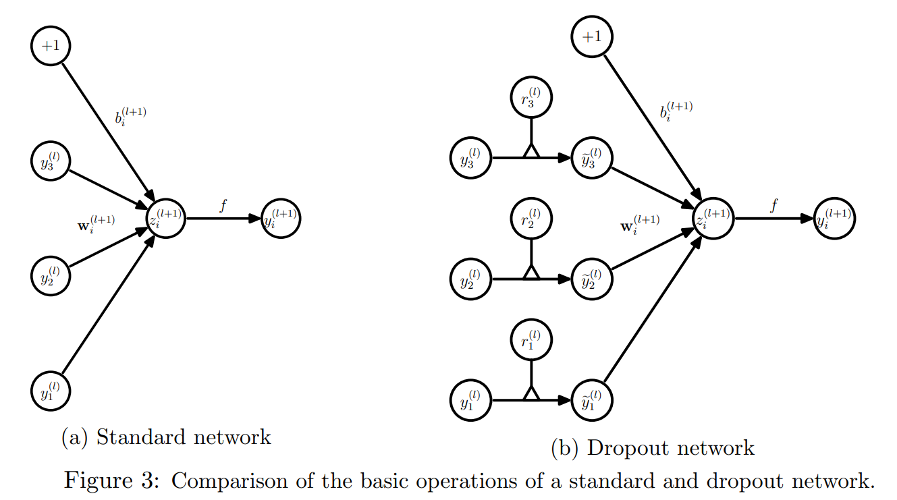

Dropout 을 적용하면, feed-forward 연산은 다음과 같이 바뀐다 (Fig. 3b):

$$
\begin{align*}
    r^{(l)}_j &\sim \text{Bernoulli}(p), \\
    \tilde{y}^{(l)} &= r^{(l)} \ast y^{(l)}, \\
    z^{(l+1)}_i &= W^{(l+1)}_i \tilde{y}^{(l)} + b^{(l+1)}_i, \\
    y^{(l+1)}_i &= f(z^{(l+1)}_i).
\end{align*}
$$

- $\ast$ : element-wise product
- 임의의 layer $l$ 에 대해 $r^{(l)}$ 는 independent Bernoulli random variables 로 이루어진 vector 이며, 각각 probability $p$ 로 1 이 된다. 
- 이 vector 는 sampling 되어 그 layer 의 output $y^{(l)}$ 와 element-wise 로 곱해져 $\tilde{y}^{(l)}$ 라는 thinned 출력이 생성된다. 
- 그런 다음, 이 thinned output 이 다음 layer 의 input 으로 사용된다. 
- 이 과정은 각 layer 에 대해 적용된다. 
- 이는 larger network 에서 sub-network 를 sampling 하는 것과 같다. 
- training 중에는, loss function 의 derivatives 가 sub-network 를 통해 backpropagation 된다.
- Test 시에는, weight 를 Fig. 2 에서와 같이 $W^{(l)}_{\text{test}} = p W^{(l)}$ 로 scaling 한다. 이렇게 변환된 neural network 는 dropout 없이 사용된다.

# 5. Learning Dropout Nets

이 섹션에서는 dropout neural networks 를 학습하는 절차를 설명한다.

## 5.1 Backpropagation

Dropout neural networks 는 stochastic gradient descent (SGD)를 사용하여 standard neural networks 와 유사한 방식으로 학습될 수 있다. 

유일한 차이는 mini-batch 의 각 training case 에 대해, dropout 을 통해 unit 을 제거하여 thinned network 를 sampling 한다는 점이다. 

그 training case 에 대한 forward 와 backpropagation 은 이 thinned network 에서만 수행된다. 

각 parameter 에 대한 gradient 는 mini-batch 의 training cases 에 대해 평균화된다. 

특정 parameter 를 사용하지 않은 training case 는 해당 parameter 에 대해 0 의 gradient 를 제공한다. 

---

SGD 를 개선하기 위해 momentum, annealed learning rates, L2 weight decay 와 같은 방법이 사용되었으며, 이러한 방법은 dropout neural networks 에도 유용하다는 것이 밝혀졌다.

특히 dropout 에 유용한 regularization 형태는 각 hidden unit 에 들어오는 weight vector 의 norm 을 fixed constant $c$ 로 upper bound 하는 것이다. 

즉, $w$ 가 어떤 hidden unit 에 연결된 weight vector 를 나타낼 때, neural network 는 $||w||_2 \leq c$ constraint 하에서 최적화되었다. 

최적화 중에 $w$ 가 이 제약을 벗어날 경우, $w$ 를 radius $c$ 의 구 표면에 투영하여 이 제약을 강제한다. 

이를 max-norm regularization 이라고 하며, 이는 어떤 weight 의 norm 이 가질 수 있는 maximum value 가 $c$ 임을 의미한다. 

$c$ 는 validation set 을 사용해 결정되는 tunable hyperparameter 이다. 

Max-norm regularization 은 collaborative filtering (Srebro and Shraibman, 2005) 문맥에서 사용된 바 있으며, dropout 없이도 deep neural networks 의 SGD 학습 성능을 향상시키는 경우가 많다.

---

Dropout 단독으로도 상당한 성능 향상이 있지만, max-norm regularization, large decaying learning rates, high momentum 과 함께 사용하면 dropout 단독 사용보다 더 큰 성능 향상을 제공한다. 

그 이유는 weight vector 를 fixed radius 의 구 내부에 위치하도록 제한하면, weight 가 폭발하는 위험 없이 huge learning rate 를 사용할 수 있기 때문이다. 

Dropout 에 의해 제공되는 noise 는 optimization process 가 다른 weight space 영역을 탐색할 수 있도록 도와준다. 

Learning rate 가 감소함에 따라, optimization 은 shorter steps 를 수행하여 탐색을 줄이고 결국 minimum 에 수렴한다.

## 5.2 Unsupervised Pretraining

Neural networks 는 RBMs, autoencoders, Deep Boltzmann Machines 스택을 사용해 pretrained 될 수 있다. 

Pretraining 은 unlabeled data 를 효과적으로 활용하는 방법이다. 

Pretraining 후 backpropagation 을 통한 finetuning 은 특정 경우에 random initialization 에서 시작하는 finetuning 보다 성능을 크게 향상시키는 것으로 나타났다.

---

Dropout 은 이러한 기술로 pretrained networks 의 finetuning 에 적용될 수 있다. 

Pretraining 절차는 그대로 유지된다. 

Pretraining 으로 얻어진 weight 는 $1/p$ 만큼 scaling 되어야 한다. 

이는 dropout 에 의해 unit 이 랜덤하게 제거될 경우 해당 unit 의 expected output 이 pretraining 동안의 출력과 동일하게 유지되도록 한다. 

초기에는 dropout 의 확률적 특성이 pretrained weight 의 정보를 제거할 가능성을 우려했다. 

실제로, finetuning 동안 learning rate 이 randomly initialized nets 에서 사용하는 best learning rate 와 비슷할 때 이러한 문제가 발생했다. 그러나 finetuning 시 smaller learning rate 를 선택했을 때, pretrained weight 의 정보가 유지되는 것으로 보였으며, dropout 을 사용하지 않을 때보다 final generalization error 가 감소했다.

# 6. Experimental Results

Dropout neural networks 를 다양한 domain 의 dataset 에서 classification 문제에 대해 학습시켰다. 

Dropout 을 사용하지 않은 neural networks 와 비교했을 때, dropout 은 all dataset 에서 generalization performance 을 향상시키는 것으로 나타났다. 

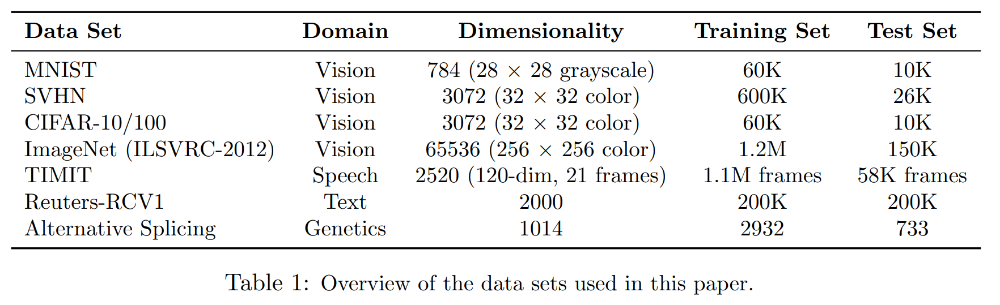

Tab. 1 에 dataset 에 대한 간략한 설명이 나와 있다. dataset 목록은 다음과 같다:

- **MNIST**: 손으로 쓴 숫자(handwritten digits)의 standard toy dataset.
- **TIMIT**: 깨끗한 음성 인식을 위한 standard 음성 벤치마크.
- **CIFAR-10 및 CIFAR-100**: 작은 크기의 자연 이미지 dataset (Krizhevsky, 2009).
- **Street View House Numbers (SVHN)**: Google Street View 에서 수집한 집 번호 이미지 dataset (Netzer et al., 2011).
- **ImageNet**: 대규모 자연 이미지 컬렉션.
- **Reuters-RCV1**: Reuters 뉴스 기사 모음 dataset.
- **Alternative Splicing dataset**: RNA feature 를 사용하여 alternative gene splicing 을 예측하는 dataset (Xiong et al., 2011).

저자는 dropout 이 특정 응용 도메인에 국한되지 않고 neural networks 를 개선하는 일반적인 기술임을 보여주기 위해 다양한 dataset 을 선택했다. 

이 섹션에서는 dropout 의 효과를 보여주는 주요 결과를 제시한다.

## 6.1 Results on Image Data Sets

Dropout 을 평가하기 위해 MNIST, SVHN, CIFAR-10, CIFAR-100, ImageNet 의 5가지 이미지 dataset을 사용했다. 이 dataset들은 서로 다른 이미지 유형과 training set 크기를 포함한다. 

이 dataset 에서 SOTA 성능을 달성  한 모델들은 모두 dropout 을 사용한다.

### 6.1.1 MNIST

**MNIST dataset** 은 $28 \times 28$ pixel handwritten digit images 로 구성되며, 이미지를 10 digit classes 중 하나로 분류하는 것이 과제이다. 

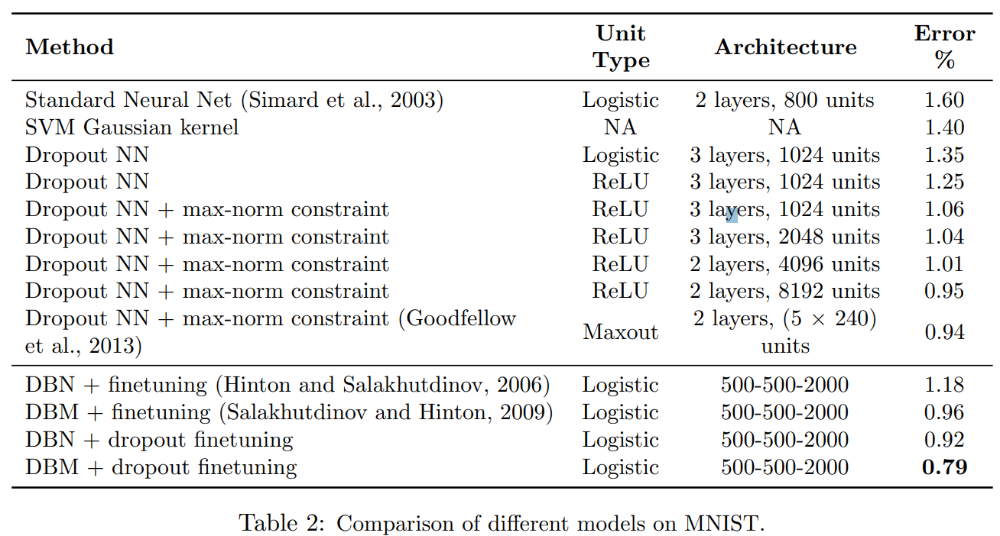

Tab. 2 는 dropout 을 다른 기술들과 비교한 성능을 보여준다. 

- Dropout 이나 unsupervised pretraining 을 사용하지 않는 permutation invariant 환경에서 가장 잘 작동하는 neural networks 는 약 1.60% 의 error rate 를 기록한다 (Simard et al., 2003). 
- Dropout 을 사용하면 이 error 가 1.35% 로 줄어든다. 
- Logistic units 를 ReLU 로 교체하면 error 가 1.25% 로 추가 감소한다. 
- Max-norm regularization 을 추가하면 1.06% 로 더 감소한다. 
- Network 크기를 늘리면 성능이 더 좋아진다. 
  - 예로, 2 hidden layers 에 각각 8192 unit 을 가진 neural network 는 0.95% 의 error 를 달성한다. 
  - 이 network 는 65M parameter 를 가지고 있으며, training set 크기가 60,000 dataset 에서 학습된다. 
- Standard regularization 방법이나 early stopping 으로 이러한 크기의 network 에서 good generalization error 를 얻는 것은 매우 어렵다. 그러나 dropout 은 이러한 경우에도 overfitting 을 방지하며 early stopping 조차 필요 없다.

---

Goodfellow et al. (2013) 은 ReLU units 를 maxout units 로 교체하면 성능이 0.94% 로 더 향상될 수 있음을 보여주었다. 

all dropout nets 는 hidden units 에 대해 $p=0.5$, input units 에 대해 $p=0.8$ 을 사용한다.

- Dropout nets 가 RBMs 와 Deep Boltzmann Machines 의 스택으로 pretrained 되었을 때도 성능 향상이 나타난다. 
- DBM-pretrained dropout nets 는 0.79% 의 test error 를 달성하며, permutation invariant 환경에서 지금까지 보고된 최고의 성능을 기록했다.

2-D spatial 정보를 사용하고, standard training set 의 이미지를 왜곡된 버전으로 확장하는 방식으로 더 나은 결과를 얻을 수 있다. 이러한 설정에서 dropout 의 효과는 더 흥미로운 dataset 에서 보여진다.

Dropout 의 robustness 테스트를 위해, hyperparameters (e.g., $p$)를 고정한 채 다양한 아키텍처에서 classification 실험을 수행했다. 

Fig. 4 는 이러한 다양한 아키텍처에 대해 training 이 진행되면서 얻은 test error rates 를 보여준다. 

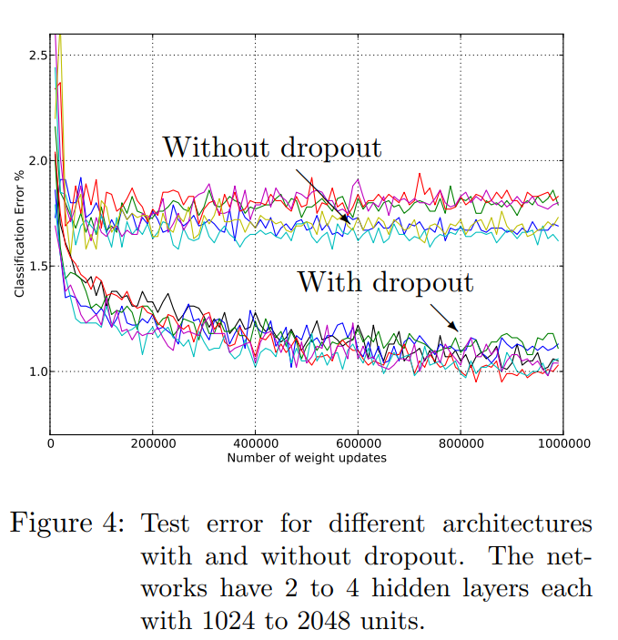

- Dropout 을 사용한 network 와 사용하지 않은 network 는 두 개의 뚜렷한 trajectory cluster 를 형성하며 test error 에서 큰 차이를 보인다. 
- Dropout 은 모든 아키텍처에서 큰 성능 향상을 제공하며, 각 아키텍처에 대해 별도로 조정된 hyperparameter 없이도 효과적이다.

### 6.1.2 Street View House Numbers

**Street View House Numbers (SVHN) dataset** (Netzer et al., 2011) 은 Google Street View 에서 수집한 집 번호의 컬러 이미지로 구성된다. 

Fig. 5a 에 이 dataset의 이미지 예시가 나와 있다. 실험에 사용된 dataset은 대략 집 번호에서 숫자를 중심으로 한 $32 \times 32$ 크기의 컬러 이미지로 구성되어 있다. 이 dataset의 과제는 해당 숫자를 식별하는 것이다.

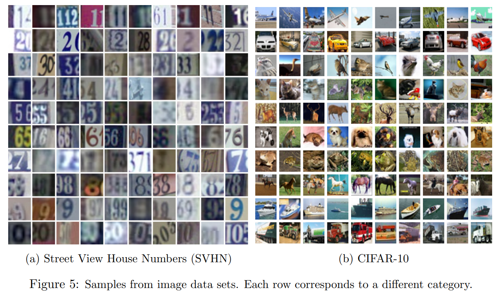

- 이 dataset에 대해 dropout 을 convolutional neural networks (LeCun et al., 1989)에 적용했다. 
- 실험에서 가장 우수한 아키텍처는 3 convolutional layers 와 2 fully connected hidden layers 로 구성되었다. 모든 hidden unit 은 ReLU 로 구성되었다. 각 convolutional layer 뒤에는 max-pooling layer 가 있다.
- Dropout 은 network 의 all layer 에 적용되었으며, hidden unit 이 유지될 확률은 네트워크의 각 layer (input 에서 convolutional layer, fully connected layer 순) 에 대해 $p = (0.9, 0.75, 0.75, 0.5, 0.5, 0.5)$ 로 설정되었다. 
- Convolutional layer 와 fully connected layer 모두에서 max-norm regularization 이 사용되었다. 

Tab. 3 은 다양한 방법으로 얻어진 결과를 비교한 것이다.

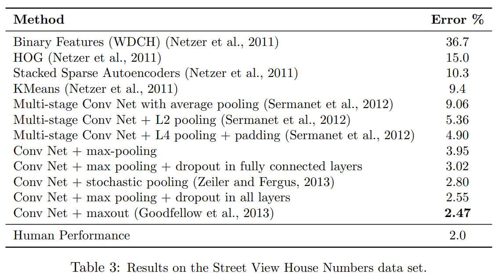

Convolutional nets 은 다른 방법들보다 우수한 성능을 보였다. 

- Dropout 을 사용하지 않은 convolutional nets 는 3.95% 의 error rate 를 달성했다.
- Fully connected layer 에만 dropout 을 추가하면 error 가 3.02% 로 감소했다. 
- Convolutional layer 에도 dropout 을 추가하면 error 가 2.55% 로 더 감소했다. 
- Maxout unit 을 사용하면 추가적인 성능 향상을 얻을 수 있다.

Convolutional layer 에 dropout 을 추가함으로써 얻어진 성능 향상(3.02% 에서 2.55%)은 주목할 만하다. 

Convolutional layer 는 많은 parameter 를 포함하지 않으므로 overfitting 이 문제가 되지 않을 것이며 dropout 의 효과가 크지 않을 것이라고 예상할 수 있다. 그러나 lower layer 에 dropout 을 추가하면 higher fully connected layer 에 noisy input 을 제공하여 overfitting 을 방지하는 데 기여한다.

### 6.1.3 CIFAR-10 and CIFAR-100

**CIFAR-10** 과 **CIFAR-100** dataset은 각각 10개와 100개의 카테고리에서 추출된 $32 \times 32$ 크기의 컬러 이미지로 구성된다. Fig. 5b 는 이 dataset의 이미지 예시를 보여준다. 

Tab. 4 는 이러한 dataset에서 다양한 방법으로 얻어진 error rate 를 보여준다.

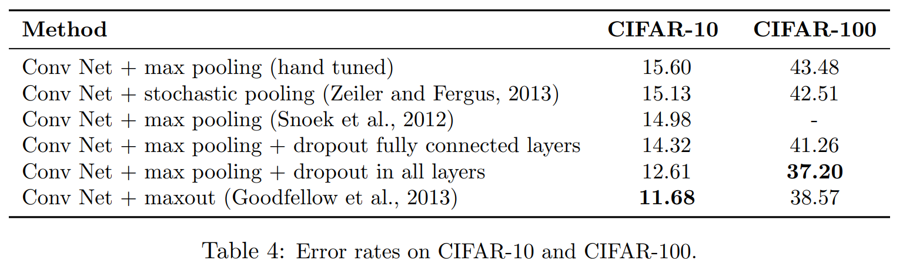

- data augmentation 없이, Snoek et al. (2012)은 Bayesian hyperparameter optimization 을 사용하여 CIFAR-10 에서 14.98% 의 error rate 를 기록했다. 
- Fully connected layer 에 dropout 을 추가하면 error 가 14.32% 로 줄어들고, all layers 에 dropout 을 추가하면 error 가 12.61% 로 감소한다. 
- Goodfellow et al. (2013)은 ReLU unit 을 maxout unit 으로 교체하면 error 가 11.68% 로 더 감소한다고 보여주었다.
- CIFAR-100 에서는 dropout 이 error 를 43.48% 에서 37.20% 로 감소시키며 큰 개선을 보였다. 
- 두 dataset 모두에서 input dropout 을 제외하고는 data augmentation 이 사용되지 않았다.

### 6.1.4 ImageNet

**ImageNet** 은 약 15백만 개의 라벨이 지정된 고해상도 이미지로 구성되며, 약 22,000 categories 를 포함한다. 

2010 Pascal Visual Object Challenge 의 일환으로 **ImageNet Large-Scale Visual Recognition Challenge (ILSVRC)** 가 매년 개최되었다. 이는 약 1,000 categories 마다 약 1,000 images 를 포함하는 ImageNet 의 subset 이 사용된다. 

카테고리 수가 많기 때문에, top-1 과 top-5 라는 두 가지 error rate 를 보고하는 것이 일반적이다. 

Top-5 error rate 는 test images 중 모델이 가장 가능성이 높다고 판단한 5 labels 중 정답이 없는 비율을 나타낸다. 

Fig. 6 은 몇 가지 테스트 이미지에 대한 모델 예측을 보여준다.

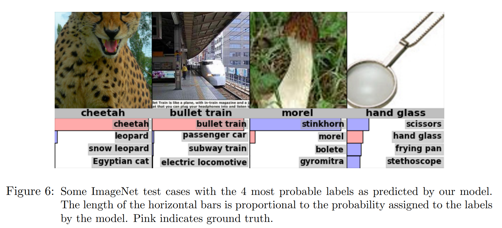

**ILSVRC-2010** 은 test set label 이 공개된 유일한 ILSVRC 버전이므로 대부분의 실험은 이 dataset에서 수행되었다. 

Tab. 5 는 다양한 방법의 성능을 비교한 것이다. 

Dropout 을 사용한 convolutional nets 는 다른 방법들보다 큰 차이로 성능이 우수했다. 아키텍처 및 구현 세부사항은 Krizhevsky et al. (2012) 에 자세히 나와 있다.

- Convolutional nets 와 dropout 을 기반으로 한 모델은 **ILSVRC-2012** 대회에서 우승했다. 
- test set label 이 공개되지 않았기 때문에 최종 제출용 테스트 셋에 대한 결과를 보고하고, 모델의 다양한 변형에 대한 validation 셋 결과를 포함했다. 

Tab. 6 은 대회 결과를 보여준다. 

- standard vision feature 를 기반으로 한 최고 성능의 방법은 약 26% 의 top-5 error rate 를 달성했으나, dropout 을 사용한 convolutional nets 는 약 16% 의 test error 를 달성하여 상당한 차이를 보였다. 
  Fig. 6 은 모델이 예측한 예제를 보여주며, 가장 정확한 추측이 아닐 때에도 모델의 예측이 매우 합리적임을 알 수 있다.

## 6.2 Results on TIMIT

다음으로, dropout 을 음성 인식 과제에 적용했다. **TIMIT dataset** 은 680명의 화자가 8개의 주요 미국 영어 방언으로 구성된 음성을 읽는 녹음으로, 각각 10개의 음소가 풍부한 문장을 포함하며, 제어된 잡음 없는 환경에서 녹음되었다. 

Dropout neural networks 는 21 log-filter bank frame windows 에서 central frame 의 label 을 예측하도록 학습되었다. 화자에 의존한 작업은 수행하지 않았다.

Tab. 7 은 dropout neural nets 와 다른 모델을 비교한 결과를 보여준다.

- 6-layer net 은 23.4% 의 phone error rate 를 달성했다. Dropout 을 추가하면 error rate 가 21.8% 로 개선되었다. 
- Pretrained weights 를 시작으로 dropout nets 를 학습했을 때, RBM stack 으로 pretrained 된 4-layer net 은 22.7% 의 phone error rate 를 기록했다. Dropout 을 추가하면 19.7% 로 감소했다.
- 마찬가지로, 8-layer net 의 경우 error rate 가 20.5% 에서 19.7% 로 감소했다.

## 6.3 Results on a Text Data Set

Dropout 이 text domain 에서 얼마나 유용한지 테스트하기 위해 **Reuters-RCV1 dataset** 을 사용하여 document classification 을 학습했다. 이 dataset은 Reuters 에서 수집된 80 news articles 로 구성되며, 다양한 주제를 포함한다. 

과제는 문서의 bag of words 표현을 기반으로 50개의 서로 다른 주제 중 하나로 분류하는 것이다.

Dropout 을 사용하지 않은 우리의 최선의 neural net 은 31.05% 의 error rate 를 기록했다. Dropout 을 추가하면 error rate 가 29.62% 로 감소했다. 개선폭은 비전 및 음성 dataset에 비해 훨씬 적었다.

## 6.4 Comparison with Bayesian Neural Networks

Dropout 은 shared weights 를 가진 지수적으로 많은 모델의 equally-weighted averaging 을 수행하는 방식으로 볼 수 있다. 

반면, **Bayesian neural networks** (Neal, 1996)는 neural network 구조와 parameter 공간에서 model averaging 를 수행하는 정석적인 방법이다. 

Dropout 에서는 모든 모델에 동일한 가중치를 부여하는 반면, Bayesian neural network 는 prior 와 데이터 적합도를 고려하여 가중치를 부여하며, 이는 보다 정확한 접근 방식이다. 

Bayesian neural networks 는 데이터가 부족한 도메인, 예를 들어 의료 진단, 유전자 연구, 약물 발견 및 기타 계산 생물학 응용 분야에서 매우 유용하다. 하지만, Bayesian neural nets 는 학습이 느리고, 매우 큰 네트워크 크기로 확장하기 어렵다. 또한, testing 시 여러 large networks 에서 예측을 얻는 것은 비용이 많이 든다. 반면, Dropout neural nets 는 학습과 테스트 시 훨씬 빠르게 작동한다.

이 섹션에서는 Bayesian neural nets 와 Dropout neural nets 를 작은 dataset에서 비교한 실험 결과를 보고한다. 이 dataset은 Bayesian neural networks 가 뛰어난 성능을 보이는 것으로 알려진 도메인에서 사용된다. 

실험의 목표는 Dropout 이 Bayesian neural networks 에 비해 어느 정도 성능 손실이 있는지 분석하는 것이다.

실험에 사용된 dataset (Xiong et al., 2011)은 유전학 도메인에서 가져왔다. 과제는 RNA 특징을 기반으로 alternative splicing 발생을 예측하는 것이다. 

Alternative splicing 은 포유류 조직에서 세포 다양성의 중요한 원인이다. 특정 조건에서 alternative splicing 이 발생할 확률을 예측하는 것은 많은 인간 질병을 이해하는 데 중요하다. RNA 특징이 주어지면, 생물학자들이 관심을 가지는 세 가지 splicing 관련 이벤트의 확률을 예측하는 것이 과제이다. 

평가 지표는 **Code Quality** 로, 목표와 예측 확률 분포 사이의 negative KL divergence 를 측정한다(높을수록 좋다).

Tab. 8 은 이 dataset에서 다양한 모델의 성능을 요약한 것이다. 

- Xiong et al. (2011)은 이 과제에서 Bayesian neural nets 를 사용했다. 예상대로, Bayesian neural nets 는 Dropout 보다 더 좋은 성능을 보였다. 그러나 Dropout 은 standard neural nets 의 성능을 크게 개선하며, 다른 모든 방법을 능가했다. 
- 이 dataset 에서의 주요 과제는 training dataset size 가 작기 때문에 overfitting 을 방지하는 것이다. 
- Overfitting 을 방지하는 한 가지 방법은 PCA 를 사용하여 입력 차원을 줄이는 것이다. 그런 다음, SVM 또는 logistic regression 같은 standard 기법을 사용할 수 있다. 그러나 Dropout 을 사용하여 차원 축소 없이도 overfitting 을 방지할 수 있었다. 
- Dropout nets 는 Bayesian network 의 몇 십 개 unit 과 비교해 훨씬 큰(hidden unit 수가 수천 개에 달하는) 네트워크다. 이는 Dropout 이 강력한 regularizing 효과를 가지고 있음을 보여준다.

## 6.5 Comparison with Standard Regularizers

여러 regularization 방법들이 neural networks 의 overfitting 을 방지하기 위해 제안되었다. 이러한 방법에는 **L2 weight decay**(보다 일반적으로 Tikhonov regularization (Tikhonov, 1943)), **lasso** (Tibshirani, 1996), **KL-sparsity**, 그리고 **max-norm regularization** 등이 포함된다. 

Dropout 은 neural networks 를 regularizing 하는 또 다른 방법으로 볼 수 있다. 

본 섹션에서는 MNIST dataset을 사용하여 Dropout 과 이러한 regularization 방법들을 비교한다.

같은 네트워크 구조 (784-1024-1024-2048-10)와 ReLUs 를 사용하여 stochastic gradient descent 로 학습을 수행하며, 각각의 regularization 에 대해 different hyperparameters (decay constants, target sparsity, dropout rate, max-norm upper bound) 은 validation set 을 사용해 결정했다. 

Tab. 9 는 실험 결과를 보여준다. 

Dropout 을 max-norm regularization 과 결합했을 때 가장 낮은 generalization error 를 기록했다.

# 7. Salient Features

이전 섹션에서 설명한 실험들은 Dropout 이 neural networks 를 향상시키는 데 유용한 기술임을 강하게 입증한다. 

본 섹션에서는 Dropout 이 neural network 에 미치는 영향을 더 면밀히 분석한다. 

Dropout 이 학습된 feature 의 품질에 어떤 영향을 미치는지, hidden unit activation 의 sparsity 에 어떻게 영향을 미치는지를 분석한다. 또한 Dropout 으로 얻은 이점이 unit retention probability, network size, 그리고 training dataset size 에 따라 어떻게 달라지는지도 살펴본다. 

이러한 관찰은 Dropout 이 효과적인 이유를 설명하는 데 일부 통찰을 제공한다.

## 7.1 Effect on Features

standard neural network 에서, 각 parameter 가 받는 미분 값은 다른 unit 들이 수행 중인 작업을 기반으로 final loss function 을 줄이기 위해 어떻게 변경되어야 하는지를 나타낸다. 

따라서 unit 들이 서로의 실수를 보완하도록 변경될 수 있다. 이는 복잡한 **co-adaptation** 으로 이어질 수 있으며, 이는 미지의 데이터에 대해 일반화되지 않으므로 overfitting 을 유발한다.

Dropout 은 다른 hidden unit 들의 존재를 신뢰할 수 없게 만들어 각 hidden unit 에 대해 co-adaptation 을 방지한다고 가정한다. 따라서 hidden unit 은 특정 unit 들이 자신의 실수를 수정하도록 의존할 수 없으며, 다른 hidden unit 들이 제공하는 다양한 context 내에서 스스로 잘 수행해야 한다. 

이 효과를 직접 관찰하기 위해 Dropout 을 사용한 neural networks 와 그렇지 않은 neural networks 를 시각적 과제를 사용해 학습한 후 first label 의 feature 를 분석했다.

- Fig. 7a 는 Dropout 없이 단일 hidden layer (256 rectified linear units) 를 가진 autoencoder 가 MNIST dataset에서 학습한 feature 들을 보여준다.
- Fig. 7b 는 Dropout (p = 0.5) 을 사용한 동일한 autoencoder 가 학습한 feature 들을 보여준다.

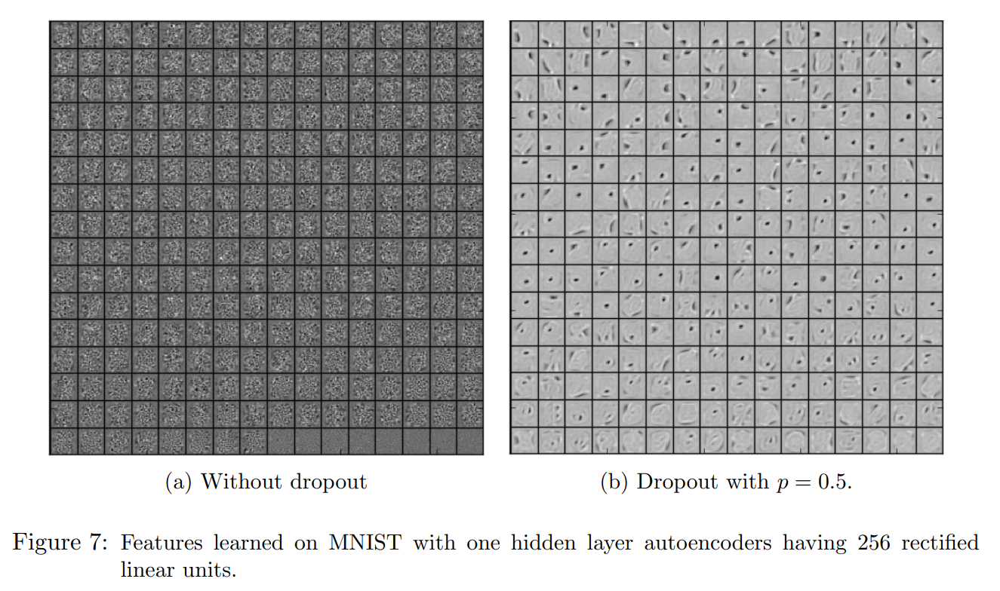

- 두 autoencoder 는 유사한 test reconstruction error 를 가졌지만, Fig. 7a 의 feature 들은 good reconstruction 을 생성하기 위해 co-adapted 되어 있는 반면, Fig. 7b 의 hidden unit 들은 이미지의 서로 다른 부분에서 edge, stroke, spot 을 감지하는 feature 들을 학습한 것으로 보인다. 
- 이는 Dropout 이 co-adaptation 을 분해하며, 이는 low generalization error 로 이어지는 주요 이유임을 시사한다.

## 7.2 Effect on Sparsity

Dropout 을 수행한 부수적인 효과로 hidden unit 의 activation 이 sparse 하게 되는 것을 발견했다. 이는 sparsity 를 유도하는 regularizer 가 없어도 발생했다. 

따라서 Dropout 은 자동으로 sparse representation 을 유도한다. 

이 효과를 관찰하기 위해 이전 섹션에서 학습된 autoencoder 들을 사용해 test set 의 random mini-batch 에 대해 hidden unit activation 의 sparsity 를 분석했다.

Fig. 8a 와 Fig. 8b 는 두 모델의 sparsity 를 비교한 결과를 보여준다. 

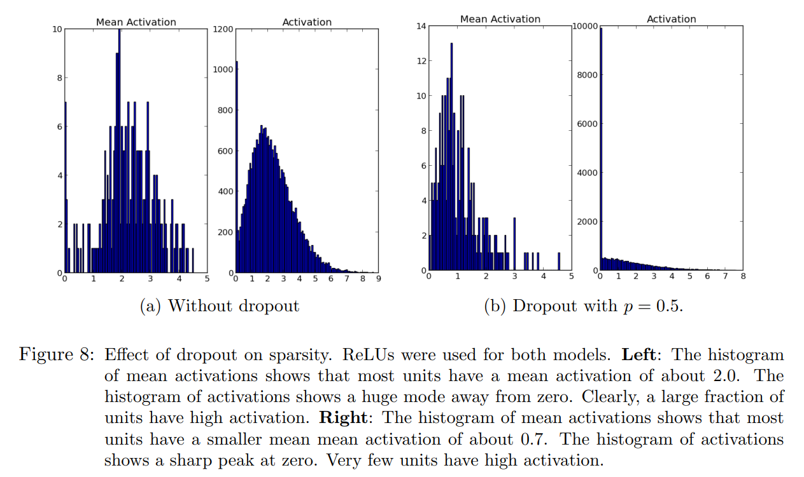

- good sparse model 에서는 어떤 데이터 case 에 대해 극히 일부의 hidden unit 만 높은 activation 값을 가져야 한다. 또한 all data case 에 걸쳐 어떤 unit 의 평균 activation 값도 낮아야 한다. 
- 이러한 두 가지 특성을 평가하기 위해 각 모델에 대해 두 개의 히스토그램을 생성했다. 
- 왼쪽 히스토그램은 mini-batch 에 걸친 hidden unit 평균 activation 의 분포를 보여주며, 오른쪽 히스토그램은 hidden unit activation 의 분포를 나타낸다.
- Activation 히스토그램을 비교해보면 Dropout 을 사용하지 않은 네트워크에 비해 Dropout 을 사용한 네트워크에서 높은 activation 을 가진 hidden unit 수가 적다는 것을 알 수 있다 (Fig. 8b). 
- 또한, Dropout 을 사용한 네트워크의 평균 activation 값이 더 작다. Dropout 을 사용하지 않은 autoencoder 의 hidden unit 평균 activation 값은 약 2.0 인 반면, Dropout 을 사용한 경우 약 0.7 로 감소했다.

## 7.3 Effect of Dropout Rate

Dropout 은 network unit 을 유지할 확률인 tunable hyperparameter $p$ 를 가진다. 

본 섹션에서는 이 hyperparameter 를 변화시켰을 때의 효과를 탐구한다. 비교는 두 가지 상황에서 수행되었다.

1. **Hidden unit 의 수를 고정.**
2. **Dropout 이후 유지될 hidden unit 의 기대값이 고정되도록 hidden unit 의 수를 변경.**

#### Case 1: Hidden Unit 의 수 고정

동일한 네트워크 구조를 사용하여 다양한 Dropout 설정으로 학습했다. 

784-2048-2048-2048-10 구조를 사용했으며, input dropout 은 사용하지 않았다. 

Fig. 9a 는 $p$ 값에 따른 test error 를 보여준다.

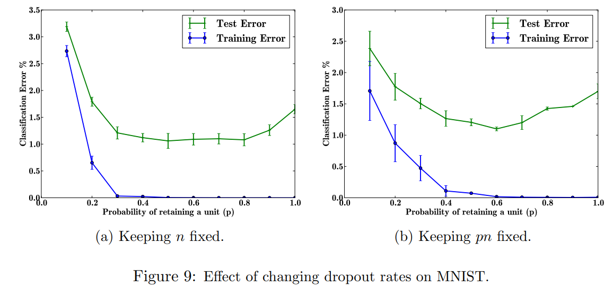

- 네트워크 구조가 고정되었을 때, $p$ 값이 작으면 training 중 활성화되는 unit 이 매우 적어진다. 
- 이는 training error 가 높아지는 underfitting 으로 이어진다. 
- $p$ 값이 증가함에 따라 에러는 감소하며, $0.4 \leq p \leq 0.8$ 일 때 에러가 안정화되고, $p$ 가 1에 가까워지면 다시 증가한다.

#### Case 2: 유지될 Hidden Unit 의 기대값 고정

이번에는 $pn$ 값을 고정하여 $n$ 이 hidden unit 의 수, $p$ 가 유지 확률일 때 각 레이어에서 유지될 unit 의 기대값이 동일하도록 했다. 이는 $p$ 값이 작을수록 더 많은 hidden unit 을 가지는 네트워크를 생성한다. 

Dropout 적용 후 활성화되는 unit 의 기대값은 모든 네트워크에서 동일하지만, test 시 네트워크 크기는 다르다. 

실험에서는 $pn = 256$ (first two hidden layers), $pn = 512$ (last hidden layer) 로 설정했다. 

- Fig. 9b 는 $p$ 값에 따른 test error 를 보여준다. 
- small $p$ 값에서 에러 크기가 Fig. 9a 와 비교해 크게 감소했다($p = 0.1$ 에서 2.7% → 1.7%). 
- $p \approx 0.6$ 에서 최적 성능을 보였으며, $p = 0.5$ 의 기본값이 거의 최적에 가까웠다.

## 7.4 Effect of Data Set Size

good regularizer 는 small dataset 에서 학습된 많은 파라미터를 가진 모델이 good generalization 성능을 갖도록 해야 한다. 

본 섹션에서는 Dropout 을 사용한 feed-forward network 가 dataset 크기를 변화시킬 때 어떤 효과를 보이는지 탐구한다.

MNIST dataset 에서 classification 실험을 수행하며 네트워크에 제공된 데이터 크기를 다양하게 설정했다. 

Fig. 10 은 실험 결과를 보여준다. 

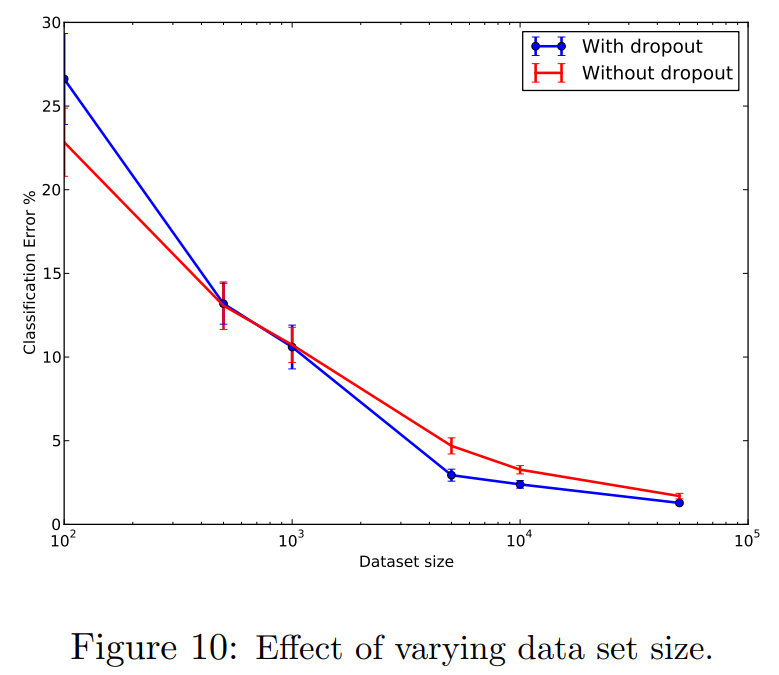

- network 는 MNIST training set 에서 무작위로 선택한 dataset 크기 100, 500, 1K, 5K, 10K, 50K 에 대해 학습되었다. 
- 모든 dataset에 대해 동일한 네트워크 구조(784-1024-1024-2048-10)를 사용했으며, all hidden layers 에 $p = 0.5$, input layer 에 $p = 0.8$ 로 Dropout 을 수행했다.
- **극소량의 dataset(100, 500)**: Dropout 은 개선을 보이지 않는다. 모델이 overfitting 될 만큼 충분한 파라미터를 가지며, Dropout 에서 발생하는 모든 noise 를 포함하고도 training data 를 overfitting 한다.
- **dataset 크기 증가(1K~10K)**: Dropout 의 효과가 증가하다가 일정 크기 이후 감소한다.

이는 주어진 네트워크 구조와 Dropout ratio 에서 noise 로 인해 training data 가 암기되지 않으면서도 overfitting 이 문제가 되지 않을 만큼 충분히 큰 데이터 크기의 "sweet spot" 이 존재함을 시사한다.

## 7.5 Monte-Carlo Model Averaging vs. Weight Scaling

test 시 Dropout model 의 효율적인 절차는 학습된 신경망의 가중치를 축소(scaling down)하여 모델 조합을 근사하는 것이다. 

보다 정확한 모델 평균 방법은 각 테스트 케이스마다 Dropout 을 사용하여 $k$ 개의 신경망을 sampling 하고, 이들의 예측을 평균내는 Monte-Carlo 모델 조합이다. 

$k \to \infty$ 일 때, 이 Monte-Carlo 모델 평균은 실제 모델 평균에 수렴한다.

MNIST dataset 을 사용하여 $k$ 값을 다양하게 설정하며 sampling 된 신경망들의 예측 평균을 계산했다. 

Fig. 11 은 다양한 $k$ 값에 따른 테스트 에러율을 보여주며, weight scaling 방법으로 얻은 에러(수평선)와 비교했다. 

- $k = 50$ 부근에서 Monte-Carlo 방법이 weight scaling 방법만큼 성능이 좋아진다. 
- 그 이후에는 Monte-Carlo 방법이 weight scaling 방법보다 약간 더 좋지만, standard 편차 범위 내에 머문다.
- 이는 weight scaling 방법이 실제 모델 평균에 대한 적절한 근사임을 시사한다.

# 8. Dropout Restricted Boltzmann Machines

Dropout 은 feed-forward neural networks 뿐만 아니라 Restricted Boltzmann Machines (RBM) 에도 적용될 수 있다. 

본 섹션에서는 Dropout RBM 모델을 공식적으로 설명하고, 주요 특성을 설명하기 위한 결과를 제시한다.

## 8.1 Model Description

RBM 은 visible unit $v \in \{0, 1\}^D$ 와 hidden unit $h \in \{0, 1\}^F$ 를 가지며, 다음과 같은 확률 분포를 정의한다:

$$
P(h, v; \theta) = \frac{1}{Z(\theta)} \exp(v^\top Wh + a^\top h + b^\top v).
$$

여기서 $\theta = \{W, a, b\}$ 는 model parameter 를 나타내며, $\mathcal{Z}$ 는 partition function 이다.

---

**Dropout RBM** 은 이 RBM 에 binary random variable $r \in \{0, 1\}^F$ 를 추가로 가지는 모델이다. 

각 random variables $r_j$ 는 서로 독립적으로 probability $p$ 로 1 값을 갖는다. 

$r_j$ 가 1 값을 가지면 hidden unit $h_j$ 가 유지되고, 그렇지 않으면 모델에서 제거된다. 

Dropout RBM 의 joint distribution 은 다음과 같이 표현된다:

$$
\begin{align*}
  P(r, h, v; p, \theta) &= P(r; p)P(h, v|r; \theta),\\
  P(r; p) &= \prod_{j=1}^F p^{r_j} (1 - p)^{1 - r_j},\\
  P(h, v|r; \theta) &= \frac{1}{\mathcal{Z}'(\theta, r)} \exp(v^\top Wh + a^\top h + b^\top v) \prod_{j=1}^F g(h_j, r_j),\\
  g(h_j, r_j) &= 1(r_j = 1) + 1(r_j = 0)1(h_j = 0).
\end{align*}
$$

여기서 $\mathcal{Z}'(\theta, r)$ 은 normalization constant 이며, $g(h_j, r_j)$ 는 $r_j = 0$ 일 때 $h_j$ 가 반드시 0 이 되도록 하는 constraint 를 부여한다.

---

$r$ 와 $v$ 가 주어졌을 때의 hidden unit $h$ 의 conditioned distribution 은 다음과 같은 factorial 형태를 가진다:

$$
\begin{align*}
  P(h|r, v) &= \prod_{j=1}^F P(h_j|r_j, v),\\
  P(h_j = 1|r_j, v) &= 1(r_j = 1)\sigma \left( b_j + \sum_i W_{ij} v_i \right),
\end{align*}
$$

여기서 $\sigma(x)$ 는 sigmoid function $\sigma(x) = \frac{1}{1 + \exp(-x)}$ 이다.

---

$v$ 가 $h$ 를 조건으로 가질 때의 distribution 은 RBM 의 경우와 동일하다:

$$
\begin{align*}
  P(v|h) &= \prod_{i=1}^D P(v_i|h), \\
  P(v_i = 1|h) &= \sigma \left( a_i + \sum_j W_{ij} h_j \right).
\end{align*}
$$

$$
$$

$r$ 를 조건으로 할 때, $\{v, h\}$ 에 대한 distribution 은 RBM 이 부과하는 분포와 동일하지만, $r_j = 0$ 인 unit 들이 $h$ 에서 제거된다. 

따라서 Dropout RBM 모델은 shared weights 를 가지며 different $h$ 의 subset 을 사용하는 지수적으로 많은 RBM 들의 mixture 로 볼 수 있다.

## 8.2 Learning Dropout RBMs

RBM 을 학습하기 위해 개발된 Contrastive Divergence (Hinton et al., 2006) 와 같은 알고리즘은 Dropout RBM 학습에 직접적으로 적용될 수 있다. 

유일한 차이점은 먼저 $r$ 을 sampling하고, 유지된 hidden unit 들만 학습에 사용된다는 점이다. 

Dropout neural networks 와 마찬가지로, 각 mini-batch 의 모든 training case 에 대해 다른 $r$ 이 sampling된다. 

실험에서는 Dropout RBM 학습에 CD-1 을 사용하였다.

## 8.3 Effect on Features

Feed-forward networks 에서 Dropout 은 co-adaptation 을 줄여 feature 의 품질을 개선했다. 

본 섹션에서는 이러한 효과가 Dropout RBM 에서도 동일하게 나타나는지 조사한다.

- **Fig. 12a**: hidden unit 256 개를 가진 binary RBM 이 학습한 feature 들.
- **Fig. 12b**: 동일한 개수의 hidden unit 을 가진 Dropout RBM 이 학습한 feature 들.

Dropout RBM 이 학습한 feature 는 standard RBM 의 선명한 stroke-like feature 와 비교했을 때 상대적으로 더 거친 특성을 포착하는 것으로 보인다. 

Dropout RBM 에서 죽은 unit(dead unit) 은 standard RBM 보다 훨씬 적게 나타난다.

## 8.4 Effect on Sparsity

다음으로, Dropout RBM 학습이 hidden unit activation 의 sparsity 에 미치는 영향을 조사한다.

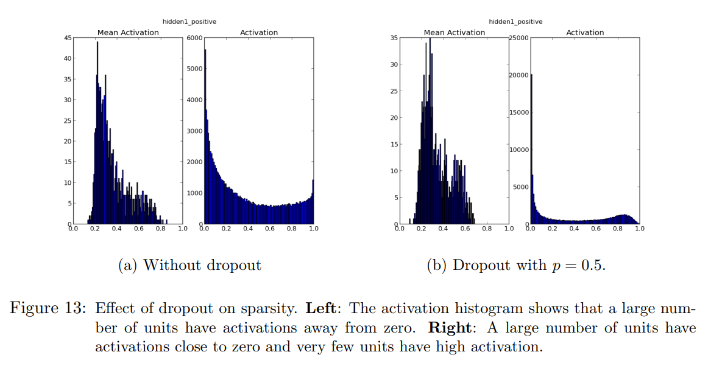

- **Fig. 13a**: RBM 학습 후 test mini-batch 에 대한 hidden unit activation 및 평균값 히스토그램.
- **Fig. 13b**: Dropout RBM 에 대한 동일 히스토그램.

히스토그램은 Dropout RBM 이 추가적인 sparsity inducing regularizer 가 없더라도 standard RBM 보다 훨씬 sparse 한 표현을 학습한다는 것을 명확히 보여준다.

# 9. Marginalizing Dropout

Dropout 은 neural network 의 hidden unit state 에 noise 를 추가하는 방법으로 볼 수 있다. 

본 섹션에서는 이 noise 를 marginalizing 함으로써 생성되는 모델 클래스들을 탐구한다. 

이러한 모델들은 Dropout 의 deterministic 버전으로 간주될 수 있다. 

standard (“Monte-Carlo”) Dropout 과 달리, 이 모델들은 random bit 가 필요하지 않으며, marginalized loss function 에 대한 gradient 를 얻을 수 있다.

- **Deterministic Algorithms**: Globerson and Roweis (2006) 는 test 시 feature 삭제에 강건한 모델을 학습하려는 deterministic 알고리즘을 제안했다.
- **Denoising Autoencoders**: Marginalization 은 denoising autoencoders 문맥에서 Chen et al. (2012) 에 의해 탐구되었다.
- **Linear Regression**: Srivastava (2013) 은 linear regression 문맥에서 Dropout 노이즈 marginalization 을 논의했다.
- **Dropout Speed-Up**: Wang and Manning (2013) 은 Dropout 학습 속도를 높이기 위한 marginalization 아이디어를 탐구했다.
- **Input Noise Distributions**: van der Maaten et al. (2013) 은 다양한 input noise distribution와 marginalization 으로 얻어진 regularizer 를 연구했다.
- **Adaptive Regularizer**: Wager et al. (2013) 은 Dropout 이 adaptive regularizer 로 볼 수 있음을 설명했다.

## 9.1 Linear Regression

먼저 Dropout 을 고전적인 선형 회귀 문제에 적용하는 간단한 경우를 탐구한다. 

data matrix $X \in \mathbb{R}^{N \times D}$ 는 $N$ data points 를 포함하며, $y \in \mathbb{R}^N$ 는 target vector 를 나타낸다. 

linear regression 은 다음 식을 최소화하는 $w \in \mathbb{R}^D$ 를 찾는다:

$$
||y - Xw||^2.
$$

input $X$ 가 Dropout 되어 각 input dimension 이 probability $p$ 로 유지된다면, input 은 $R \ast X$ 로 표현될 수 있다. 

여기서 $R \in \{0, 1\}^{N \times D}$ 는 $R_{ij} \sim \text{Bernoulli}(p)$ 를 따르는 random matrix 이며, $\ast$ 는 element-wise product 를 나타낸다. 

noise 를 marginalizing 하면, objective function 은 다음과 같다:

$$
\min_{w} \mathbb{E}_{R \sim \text{Bernoulli}(p)} \left[||y - (R \ast X)w||\right]^2.
$$

이는 다음과 같이 단순화된다:

$$
\min_{w} ||y - pXw||^2 + p(1 - p)||\Gamma w||^2,
$$

여기서 $\Gamma = (\text{diag}(X^\top X))^{1/2}$ 이다. 

따라서 linear regression 에서 Dropout 은 기대값에서 $\Gamma$ 의 특정 형식을 사용하는 ridge regression 과 동등하다. 

이 $\Gamma$ 는 data 의 $i$th dimension 의 standard deviation 에 따라 $w_i$ 에 대한 가중치 비용을 조정한다. 즉, 특정 data dimension 이 많이 변할 경우 regularizer 는 해당 dimension 의 weight 를 더 줄이려고 한다.

objective function 을 다른 방식으로 보면, $p$ 를 $w$ 에 통합하여 다음과 같은 형식이 된다:

$$
\min_{w} ||y - X\tilde{w}||^2 + \frac{1 - p}{p}||\Gamma \tilde{w}||^2,
$$

여기서 $\tilde{w} = pw$ 이다. 

이를 통해 regularization constant 가 $p$ 에 따라 어떻게 변하는지 명확히 알 수 있다. 

$p$ 가 1 에 가까우면 all inputs 가 유지되며 regularization constant 는 작아진다. 

$p$ 가 감소함에 따라 Dropout 이 더 많이 적용되면서 regularization constant 는 커진다.

## 9.2 Logistic Regression and Deep Networks

Logistic regression 와 deep neural network 의 경우, marginalized model 의 닫힌 형식을 얻는 것은 어렵다. 

그러나 Wang and Manning (2013) 은 Logistic regression 에 Dropout 을 적용한 경우, 해당 marginalized model 을 근사적으로 학습할 수 있음을 보여주었다. 

적절한 가정하에, logistic unit 으로의 input distribution 과 marginalized model 의 gradient distribution 은 Gaussian 을 따른다. 

이들의 평균과 분산은 효율적으로 계산할 수 있다. 이러한 근사 marginalization 은 학습 시간과 일반화 성능 측면에서 Monte-Carlo Dropout 을 능가한다.

그러나 이 기법에서 사용된 가정은 네트워크 층이 추가될수록 점차 약해진다. 따라서 이 결과는 deep network 에 직접 적용되지는 않는다.

# 10. Multiplicative Gaussian Noise

Dropout 은 hidden activation 에 Bernoulli distribution 를 따르는 random variables $r_b$ 를 곱하는 방식으로 이루어진다. 

이 random variables 는 probability $p$ 로 1의 값을 가지며, 그렇지 않으면 0 이 된다. 

이러한 아이디어는 activation 에 다른 distribution 에서 추출된 random variables 를 곱하는 방식으로 일반화할 수 있다. 

최근 실험에서 평균이 1 이고 분산이 1 인 Gaussian distribution $N(1, 1)$ 에서 추출된 random variables 를 곱하는 방식이 Bernoulli noise 를 사용하는 것만큼, 또는 그 이상으로 효과적이라는 점을 발견했다.

Gaussian noise 를 사용하는 새로운 Dropout 형태는 Gaussian distribution 를 따르는 random variables  $r$ 를 추가하는 것과 같다. 즉, 각 hidden activation $h_i$ 가 다음과 같이 변형된다: $h_i + h_i r \quad \text{where} \quad r \sim N(0, 1),$

또는 동등하게 다음과 같이 표현할 수 있다: $h_i r' \quad \text{where} \quad r' \sim N(1, 1).$

이를 더 일반화하면, $r' \sim N(1, \sigma^2)$ 로 설정할 수 있으며, 여기서 $\sigma$ 는 Bernoulli Dropout 에서의 $p$ 와 유사하게 tunable hyperparameter 가 된다. 

Activation 의 기댓값은 변하지 않으므로, test 시 weight scaling 이 필요하지 않다.

본 논문에서는 Dropout 을 training 시 probability $p$ 로 유닛을 유지하고, test 시 weight 를 $p$ 로 스케일 다운하는 방법으로 설명했다. 

동일한 효과를 달성하는 또 다른 방법은 훈련 시 유지된 activation 을 $1/p$ 로 스케일 업하고, test 시 weight 를 수정하지 않는 것이다. 

두 방법은 각 층의 학습률과 weight 초기화를 적절히 조정하면 동등하다.

따라서 Dropout 은 $h_i$ 에 Bernoulli random variables  $r_b$ 를 곱하는 것으로 간주할 수 있다. 여기서 $r_b$ 는 probability $p$ 로 $1/p$ 값을 가지며, 그렇지 않으면 0 이다. 이에 대한 기댓값 $E[r_b] = 1$ 이며 분산 $Var[r_b] = \frac{1 - p}{p}$ 이다.

Gaussian multiplicative noise 의 경우 $\sigma^2 = \frac{1 - p}{p}$ 로 설정하면, $h_i$ 는 random variables  $r_g$ 와 곱해지며, 기댓값 $E[r_g] = 1$ 및 분산 $Var[r_g] = \frac{1 - p}{p}$ 을 가진다. 

따라서 두 Dropout 방식은 동일한 평균과 분산을 가지도록 설정할 수 있다. 그러나 주어진 1차 및 2차 모멘트에서 $r_g$ 는 가장 높은 엔트로피를 가지며 $r_b$ 는 가장 낮은 엔트로피를 가진다. 

초기 실험 결과(Tab. 10)에 따르면, 높은 엔트로피의 경우가 약간 더 나은 성능을 보일 수 있다. Gaussian model 에서 각 층의 $\sigma$ 값은 Bernoulli model 의 $p$ 값을 사용하여 $\sqrt{\frac{1 - p}{p}}$ 로 설정되었다.

# 11. Conclusion

Dropout 은 overfitting 을 줄여 신경망의 성능을 개선하는 기술이다. 

standard backpropagation training 은 training data 에는 적합하지만 unseen data 에는 일반화되지 않는 취약한 co-adaptation 을 형성한다. 

Random Dropout 은 특정 hidden unit 의 존재를 불확실하게 만들어 이러한 공적응을 깨뜨린다. 

이 기법은 object classification, digit recognition, speech recognition, document classification 및 계산 생물학 데이터 분석 등 다양한 응용 도메인에서 신경망의 성능을 향상시키는 것으로 나타났다. 이는 Dropout 이 특정 도메인에 국한되지 않은 일반적인 기술임을 시사한다.

Dropout 을 사용한 방법은 SVHN, ImageNet, CIFAR-100, MNIST 에서 SOTA 결과를 달성했다. Dropout 은 다른 dataset 에서도 standard neural network 의 성능을 상당히 향상시켰다.

이 아이디어는 Restricted Boltzmann Machines (RBMs) 및 기타 graph model 로 확장될 수 있다. Dropout 의 핵심 아이디어는 쉽게 overfitting 되는 large model 을 가져와 그 모델에서 small subset models 를 반복적으로 sampling 하고 학습시키는 것이다. 

RBMs 은 이 프레임워크에 쉽게 적합하며, Dropout RBMs 이 특정 바람직한 특성을 가지고 있음을 실험적으로 보여주었다.

---

Dropout 의 단점 중 하나는 training time 이 증가한다는 점이다. 

Dropout network 는 동일한 아키텍처의 standard neural network 보다 일반적으로 2~3배 더 오래 걸린다. 이는 parameter update 가 매우 noisy 하기 때문이다. 각 training case 는 사실상 서로 다른 random architecture 를 학습시키려고 시도한다. 

따라서 계산되는 gradient 는 test 시 사용할 최종 아키텍처의 gradient 가 아니다. 그러나 이러한 확률성은 overfitting 을 방지할 가능성이 있다. 이는 overfitting 과 training time 사이의 trade-off 를 생성한다. 

더 많은 training time 이 있으면 high dropout 을 사용하여 overfitting 을 줄일 수 있다.

Dropout 의 이점을 stochasticity 없이 얻는 한 가지 방법은 noise 를 marginalizing 하여 Dropout 절차와 같은 작업을 기대값에서 수행하는 regularizer 를 얻는 것이다. 

linear regression 의 경우, 이 regularizer 가 수정된 형태의 $L_2$ regularization 임을 보여주었다. 그러나 더 복잡한 모델의 경우, 동등한 regularizer 를 얻는 방법은 명확하지 않다. 

Dropout 을 가속화하는 것은 미래 연구의 흥미로운 방향이다.