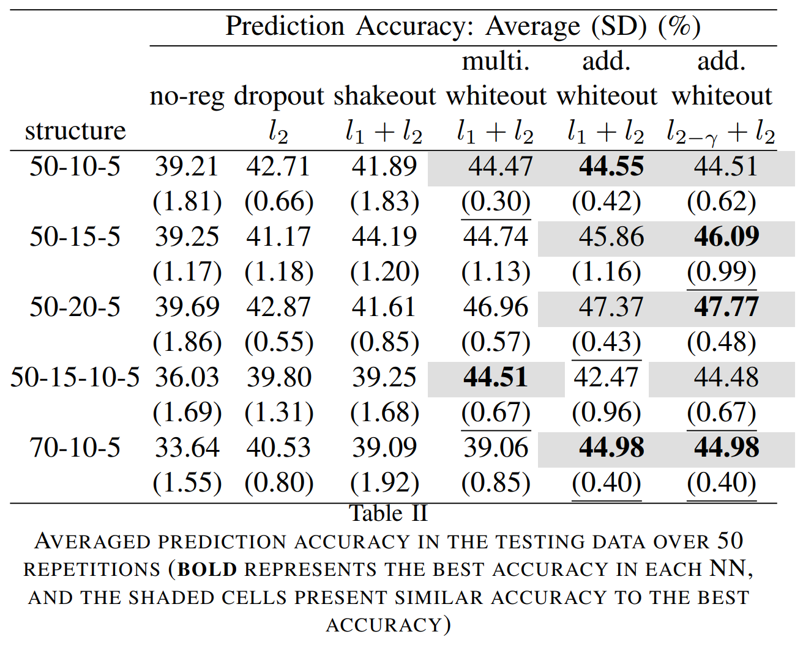
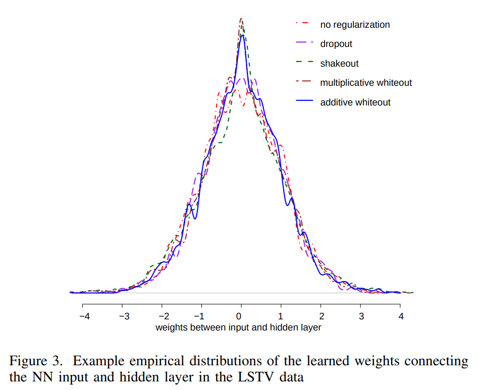
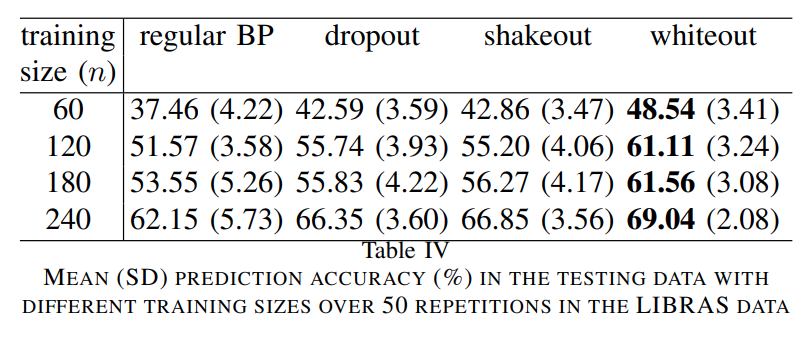
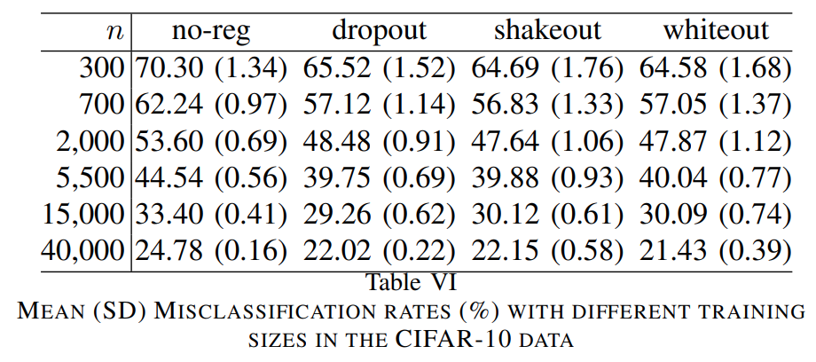

논문 및 이미지 추처 : <https://arxiv.org/pdf/1612.01490>

# Abstract

**Noise Injection** (NI) 은 Neural Networks (NNs) 에서 over-fitting 을 완화하기 위한 효율적인 기법이다. Dropout 및 Shakeout 에서 구현된 Bernoulli NI 절차는 NN model parameters 에 대한 $l_1$ 및 $l_2$ regularization 와 연결되어 있다.

- Whiteout 은 NNs training 중 adaptive Gaussian noise 를 주입하는 **NI regularization techniques** (NIRT) 의 한 유형으로, $l_2$ regularization 을 포함하지 않고도 $l_\gamma$ sparsity regularization ($\gamma \in (0, 2)$) 를 광범위하게 적용할 수 있는 최초의 NIRT 이다. - - Whiteout 은 또한 adaptive lasso 및 group lasso 와 유사한 regularization 을 제공하도록 확장될 수 있다.  
- Whiteout 의 regularization effects 는 generalized linear models 에서 closed-form penalty terms 의 형태로 확립된다. 또한 Whiteout 은 input data 의 small perturbations 에 대한 민감도를 감소시켜 NN training 을 안정화한다.  
- Whiteout 을 이용한 noise-perturbed empirical loss function (pelf) 이 ideal loss function (ilf) 으로 거의 확실히 수렴하며, pelf 의 minimizer 가 ilf 의 minimizer 에 대해 일관적임을 증명한다. 또한, pelf 의 tail bound 를 도출하여 실용적인 최소화 가능성을 보장한다.

시뮬레이션 및 실제 데이터 세트에서 상대적으로 small-sized training sets 의 경우 Bernoulli NIRT (Dropout, Shakeout) 보다 우수한 성능을 보이며, large-sized training sets 에서도 열등하지 않음을 보여준다.  

이 연구는 additive 및 multiplicative Gaussian NI 가 deep NNs 에 미치는 regularization effects 를 이론적, 방법론적, 실용적으로 심도 있게 분석한 최초의 작업이다.

# I. Introduction

Deep NNs 는 레이어의 다양성과 많은 수의 노드로 인해 overfitting 에 취약하다. 

over-fitting 을 완화하기 위한 초기 접근법에는 unit pruning, weight pruning, $l_2$ regularization (weight decay), max-norm, early stopping 등이 있다. 또한, dropout, dropconnect, maxout, shakeout 등을 포함한 noise injection (NI) regularization techniques (NIRT)가 다시 주목받고 있다. 

본 섹션에서는 기존 NIRT 를 간략히 논의한 뒤, whiteout 이라는 NIRT 계열을 제안한다. 

Whiteout 은 기존 NIRT 와 유사한 regularization effects 를 제공할 뿐만 아니라, 일부 설정에서 기존 NIRT 보다 더 효율적으로 over-fitting 을 완화할 수 있는 새로운 regularization 유형을 도입한다.  

## A. Existing work on NIRTs in NNs  

NI 는 특히 fully connected NN layers 에서 학습된 NN 의 generalization ability 를 향상시킨다.

NIRT 에 대한 초기 연구는 1980년대와 1990년대에 등장했다. 

- Plaut et al. 과 Sietsma and Dow 는 back-propagation 을 통한 NN training 중 input 에 noise 를 추가하는 것이 NN 의 generalization capability 를 크게 향상시킨다는 것을 실험적으로 발견했다. 
- Holmstrom and Koistinen 은 feedforward NNs 에서 training samples 에 noise 를 주입하는 것이 true density 의 kernel density estimation 으로부터 샘플을 추출하는 것으로 간주될 수 있다고 제안했다. 
  - 하지만 이들은 NI 가 learned NN 의 generalization error 를 개선한다는 것을 증명하지는 못했다.
- Matsuoka 는 NIRT 를 input nodes 에 적용하여 learned NN 이 small perturbations 에 덜 민감하게 하는 방법을 공식화했다.
- Grandvalet et al. 은 Gaussian NI (고정된 분산)를 input node 에 적용하여, NI 와 heat kernels 를 연결함으로써 improved generalization 을 이론적 근거를 제시했다. 
  - 그러나 기존 연구는 NIRT 가 NN parameters 에 미치는 regularization effects 를 다루지 않았다.  

2006년 이후 딥러닝의 재활성화와 함께, NIRT에 대한 연구와 응용도 증가했다. 

- 최근 NIRT는 dropout, dropconnect, standout, shakeout 등이 있으며, 이는 모두 training 중 NN 에 Bernoulli noise 를 주입하는 방식으로 간주될 수 있다. 
- Dropout 에서는 deep NN training 중 입력 또는 hidden layers 의 노드를 일정 확률로 무작위 제거한다. 
  - Dropout 은 generalized linear models (GLMs) framework 에서 NN parameters 에 대해 $l_2$ regularization 을 제공하는 것으로 나타났다.
- Dropout 의 다양한 확장도 제안되었다. 
  - Maxout 은 새로운 activation function 을 통해 dropout 의 최적화를 촉진하고 정확성을 향상시켰다. 
  - Fast dropout 은 Gaussian approximation 을 통해 dropout 의 계산 속도를 높였다. 
  - Dropconnect 는 노드가 아닌 weight 에 Bernoulli noise 를 적용했다.
  - Partial dropout/dropconnect 는 weight decay, model averaging, network pruning 을 결합하여 restricted Boltzmann machines (RBMs) 를 regularization 했다. 
  - Standout 또는 adaptive dropout 은 binary belief network 를 사용하여 선택적으로 노드를 0 으로 설정하면서 NN 을 공동으로 학습했다. 
  - Shakeout 은 dropout 의 $l_2$ regularization 을 확장하여, training 중 input 과 hidden nodes 에 multiplicative adaptive Bernoulli noise 를 적용함으로써 $l_1$ 및 $l_2$ regularization effects 를 결합했다.  

Gaussian NI 는 Bayesian 관점에서 간략히 논의되었다. 

- Srivastava et al. 은 dropout 의 Bernoulli NI 에서 영감을 받아 평균이 1 이고 constant variance 를 갖는 multiplicative Gaussian noise 를 제안했다. 
  - 이들은 MNIST 및 CIFAR-10 dataset 을 대상으로 Bernoulli NI 와 Gaussian multiplicative NI 의 성능을 비교했으며, two noise variances 를 동일하게 설정했을 때 Gaussian multiplicative NI 가 Bernoulli NI 와 유사하거나 약간 더 나은 성능을 보였다고 결론지었다. 
  - 그러나 이들은 이론적 탐구를 제공하지 않았다. 
- Kang et al. 은  fixed variance 을 가진 Gaussian NI 가 dropout 과 매우 유사한 성능을 보였음을 실험적으로 증명했다.  

결론적으로, Gaussian NIRT 에 대한 기존 연구는 범위와 깊이가 제한적이며, Gaussian NI 가 NN regularization 에 어떻게 기여할 수 있는지, 그리고 Bernoulli NI 와 비교하여 어떤 이점을 제공하는지에 대한 방법론적, 이론적, 경험적 탐구는 부족하다. 

## B. Our Contributions

저자는 _whiteout_ 이라는 NIRT 계열을 제안하고 연구하며, 이는 NN training 중 adaptive Gaussian noises 를 주입한다.

여기서 "adaptive" 는 injected noises 의 variance term 이 weight parameters 의 함수이며, training 중 weight updates 에 따라 변화한다는 것을 의미한다. 

저자의 기여는 아래와 같이 요약된다.  

1. 저자가 아는 한, 이는 Gaussian NIRT 의 regularization effects 를 방법론적, 이론적, 그리고 경험적 관점에서 심층적으로 탐구한 첫 번째 연구이다.  
2. 저자는 whiteout 을 single NIRT 가 아닌 다양한 NIRT 계열로 제안한다. 
   - 세 가지 tuning parameter 를 설정함으로써, whiteout 은 $l_2$ regularization 및 $l_1 + l_2$ regularization 뿐만 아니라, large regression models 의 statistical training 에서 일반적으로 사용되는 lasso, bridge, adaptive lasso, group lasso 와 같은 다양한 regularization 기법과 연결되는 새로운 NIRT 를 제공한다.
   - Whiteout 은 $l_1$ constraint 를 적용할 수 있는 최초의 NIRT 이며, 더 나아가 $l_\gamma$ sparsity constraint ($\gamma \in (0, 2)$) 을 포함하면서 $l_2$ regularization component 를 포함할 필요가 없다 (Bernoulli NIRT dropout 은 $l_2$ regularization 을, shakeout 은 $l_1 + l_2$ regularization 을 도입한다).
3. 저자는 시뮬레이션 및 실제 데이터 실험에서, whiteout 이 training size 가 작을 때 Bernoulli NIRTs (예: dropout, shakeout) 보다 더 우수한 성능을 보이며, NN parameters 에 유연한 sparsity constraints 를 적용하는 효과를 입증했다. 
   - 따라서 whiteout 은 예측에서 불필요하고 관련 없는 input 및 hidden features 를 효과적으로 제거할 수 있다.
4. whiteout 이 effective regularization 기법임을 다음 관점에서 입증한다. 
   1. whiteout 은 generalized linear models (GLMs) 에서 모델 복잡성을 위한 closedfrom penalty term 을 가진 penalized objective function 과 관련이 있다. 
   2. whiteout 은 learned NN model 이 data 의 small perturbations 에 대해 덜 민감하게 만드는 기술로 간주될 수 있다.  
5. 저자는 whiteout noise 가 perturbed empirical loss function (pelf) 의 이론적 속성을 철저히 조사하고, ideal loss function (ilf) 으로의 almost sure (a.s.) convergence 와 pelf 의 minimizers 가 ilf 의 minimizers 와 일치함을 입증한다. 
   - 이 이론적 결론은 동일한 regularity conditions 하에서 다른 NIRT 에도 확장될 수 있다. 
   - 이전 연구 (예: Grandvalet et al., Holmstrom and Koistinen) 가 존재하지만, 이들은 input nodes 에서의 NI 만 다루었고, noise 가 fixed variances 를 가진 분포에서 샘플링될 때를 다루었다. 
   - 저자가 아는 한, 이는 Gaussian noises 의 variances 가 training 중 (즉, "adaptive") 변화하고, NI 가 inputs 및 hidden layers 모두에서 발생할 때, pelf 의 a.s. convergence (ilf 로), minimizers 의 일관성, 그리고 기대값 주위의 변동성 (tail bound) 을 입증한 첫 번째 연구이다.  
6. 저자는 whiteout NI 를 training 중 쉽게 통합할 수 있는 backpropagation (BP) 절차를 개발한다 (App. H).
7. 저자는 whiteout 이 RBMs 및 auto-encoders 와 같은 unsupervised learning 에 적용될 수 있음을 보여준다 (App. K).

이후 섹션에서는 whiteout 을 소개하고 tuning parameters 선택을 시연한다 (Section II). 그런 다음 noise injected optimization 을 penalized likelihood 문제로 공식화하여 whiteout 의 regularization effects 를 확립한다 (Section III-A). whiteout 이 learned NN 을 small external perturbation 에 대해 견고하게 만드는 방법을 보여준다 (Section III-B). 마지막으로, 시뮬레이션 및 실제 데이터 실험에서 whiteout 을 dropout, shakeout, 그리고 no regularization 과 비교하여 prediction accuracy 를 입증한다 (Sections V and VI). 마지막으로 Section VII 에서 결론을 내린다.  

# II. Whiteout  

Gaussian NI 는 additive 또는 multiplicative 형태일 수 있으며, 둘 다 문헌에서 등장하며 둘 다 constant variance 를 가진다고 가정한다. 

완전성을 위해 additive 와 multiplicative whiteout noises 를 모두 제시한다 (Sections II-A and II-C). 예측 성능은 실험(Section V and VI)을 통해 비교하며, 각각의 장단점은 Section VII에서 간략히 논의한다.  

## A. Additive Noise in Whiteout  

Additive noise 를 사용하는 whiteout 의 경우, noise term 이 Gaussian distribution 에서 추출된 후 input 또는 hidden layers 의 original node value 에 추가된다.

layers 의 index 를 $l$ ( $l = 1, \dots, L - 1$ 이며, $L$ 은 output layer), layer $l$ 에 있는 nodes 의 index 를 $j$ ( $j = 1, \dots, m^{(l)}$ ) 라고 하고, layer $l$ 에서 $j$-th node 와 layer $l+1$ 에서 $k$-th node 를 연결하는 weight 를 $w_{jk}^{(l)}$ 로 나타낸다. 

layer $l$ 의 perturb $j$-th node 는 $\tilde{X}_j^{(l)}$ 는 다음과 같이 표현된다.  

$$
\begin{equation}
   \tilde{X}_j^{(l)} = X_j^{(l)} + e_{jk}, \quad \text{where } e_{jk} \overset{\text{iid}}{\sim} \mathcal{N}\left(0, \sigma^2 |w_{jk}^{(l)}|^{-\gamma} + \lambda\right).
\end{equation}
$$

whiteout noise 는 그 variance 가 $w_{jk}^{(l)}$ 의 function 인 점에서 _adaptive_ 하며, 이는 training 중 지속적으로 업데이트된다. 

$\sigma^2 \geq 0$, $\lambda \geq 0$, $\gamma \in (0, 2)$ 는 tuning parameters 이며, 각 parameter 의 해석 및 선택은 Section II-B 에서 다룬다. 

이 tuning parameter 가 선택되면 training process 전체에 걸쳐 고정된다.  

## B. Interpretation and Specification of Tuning Parameters

$\sigma^2$ 와 $\lambda$ 값이 클수록 weight 에 more regularization effects 를 주며 (more weight 값이 0 에 가까워지거나 감소함), $\sigma^2$ 와 $\lambda$ 의 비율이 NN 의 weight parameters 에 대해 sparsity 와 $l_2$ regularization 간의 상대적 효과를 결정한다. 

- $\sigma^2 = 0$ 일 때, weight 는 $l_2$ 방식으로 regularization 된다. 
- $\lambda = 0$ 일 때, weight 에 대해 특정 유형의 $l_2^{-\gamma}$ regularization (sparsity) 가 적용되며, 그 유형은 $\gamma$ 값에 따라 달라진다. 
  - 예로, $\gamma = 1$ 일 때 sparsity regularization 는 $l_1$ 이 되고, 
  - $\gamma \to 2$ 일 때는 sparsity regularization 가 $l_0$ 에 가까워진다.  

whiteout 의 실제 구현에서, all tuning parameter 를 cross validation (CV)으로 선택할 수 있지만, parameter 가 세 개라는 점에서 계산적으로 어려울 수 있다. 

대신, 사용자가 NN 을 학습할 때 달성하고자 하는 regularization effects 의 유형에 따라 먼저 하나 또는 두 개의 parameter 를 특정 값으로 고정한 뒤, 나머지 하나 또는 두 개를 CV 에 의해 선택하도록 권장한다. 

- 예로, $\sigma^2 = \lambda$ 로 설정하면 sparsity 와 $l_2$ 사이 어딘가에 있는 regularization 가 생성되며, 
- 이후 $\gamma$ 와 $\sigma^2 = \lambda$ 를 번갈아 CV 로 선택할 수 있다.
- 추가적으로, Gaussian noises 의 크기는 input 의 변동폭(fluctuation) 이하로 유지해야 한다.
- 그렇지 않으면 under-fitting 이 발생하고 biased predictions 로 이어질 수 있다.

$\gamma$ tuning 은 sparsity regularization $l_{2-\gamma}$ 의 유형을 결정한다. 

- 저자의 경험적 연구에 따르면, $\gamma$ 는 종종 $(0.5, 1.5)$ 범위에서 적절한 값을 찾을 수 있다. 
- $\gamma \to 2$ 는 large injected noise 로 인해 poor predictions 를 초래할 수 있으며, 
- $\gamma \to 0$ 은 $l_2$ 위에 추가되는 sparsity regularization 을 최소화한다.
- 사용자가 계산 비용을 줄이기 위해 $\gamma$ 를 조정하지 않기를 원한다면, $\gamma$ 를 1 로 고정해도 prediction accuracy 에 크게 영향을 미치지 않을 수 있다.  

Table I 에는 특정 값에서 tuning parameter 를 설정하여 whiteout noise 의 몇 가지 예가 나열되어 있다 (표기 간단화를 위해 $w_{jk}$ 를 $w_{jk}^{(l)}$ 대신 사용). 

이러한 예는 각 tuning parameter 의 기능을 더 잘 이해하는 데 도움이 된다. noise type 의 이름은 GLMs (Section III-A 에서 상세히 다룸) 맥락에서 각각이 가져오는 regularization effects 에서 영감을 얻었다. 

이 Table 은 basic whiteout noise type 에 확장을 가해 adaptive lasso 와 group lasso 와 같은 더 많은 유형의 regularization effects 를 생성하는 예도 나열한다.

- adaptive lasso 는 regression setting 에서 도입되었으며, oracle 속성을 가진 lasso 의 개선된 버전이다. 
- group lasso 는 predefined attribute groups 가 regression model 에 함께 선택되거나 제외되도록 허용하기 위해 도입되었다. 
- whiteout noise 설정에서, $\hat{w}_{ij}$ 는 예를 들어 regularization 없이 deep learning 알고리즘에서 학습된 weight estimate 일 수 있다.
- gag whiteout noise 는 predefined input nodes groups 를 패널티화하는 데 적용될 수 있다. 
  - input nodes 에서 groups 수는 $G$ 로 표시되며, groups size $g$ 는 $p_g$ ( $g = 1, \dots, G$ ) 로 표시된다. 
  - $w_g$ 는 group $g$ 의 input nodes $X_j$ ( $j = 1, \dots, p_g$ ) 와 관련된 all weight 를 포함하며, $K_g$ 는 positive-definite matrix
  - $p_1 = \cdots = p_G = 1$ (group 당 one node) 일 때 gag noise 는 gala noise 로 축소된다.  
  - gab, gen, gaala noises 는 input 과 hidden node 모두에 주입될 수 있지만, gag noise 는 input node 를 perturb 하는 데 가장 적합하다. 
  - hidden nodes 는 추상적 특징을 나타내며, 물리적 의미를 반드시 가지는 것은 아니기 때문이다.  

## C. Multiplicative Noise in Whiteout  

Additive noise 외에도, whiteout 은 NN 에 multiplicative noise 를 주입할 수도 있다.

Section II-A 와 동일한 표기를 사용하면,  

$$
\begin{align}
   &\tilde{X}_j^{(l)} = X_j^{(l)} \epsilon_{jk}, \ \text{where } \epsilon_{jk} \overset{\text{iid}}{\sim} \mathcal{N}\left(1, \sigma^2 |w_{jk}^{(l)}|^{-\gamma} + \lambda\right) \\
   &= X_j^{(l)} + e_{jk}^{'}, \ \text{where } e_{jk}^{'} \overset{\text{iid}}{\sim} \mathcal{N}\left(0, \left(X_j^{(l)}\right)^2\left(\sigma^2 |w_{jk}^{(l)}|^{-\gamma} + \lambda\right)\right)
\end{align}
$$

multiplicative noise 는 additive noise 로 재표현될 수 있지만 (Eq. 3), reformulated additive noise 의 dispersion 은 node value $X_j^{(l)}$ 에 의존한다. 이는 $|X_j^{(l)}|$ 이 이미 크다면 극단적인 node values 가 생성될 수 있음을 의미한다 (반대로, additive whiteout noise 의 dispersion 은 node values 에 독립적이다). Large noises 는 large nodes 와 연결된 weight 에 더 강한 패널티를 초래할 수 있다.  

nodes 가 어느 정도 "이상치(outlying)" 인 경우, 이에 연결된 weight 에 harsh 한 패널티가 부과되면 네트워크가 이러한 outlying nodes 에 민감하지 않도록 하는 additional robust 효과를 제공할 가능성이 있다 (이 가설이 사실인지 확인하려면 추가 연구 필요.)

### III. Justification of Whiteout FforModel Regularization with Improved Generalization

이 섹션에서는 whiteout 을 NIRT 로 정당화하며, 이를 통해 learned NN 의 generalization 을 개선하는 두 가지 관점에서 설명한다.

Section III-A 는 whiteout 을 GLMs 환경에서 model parameters 에 대한 다양한 regularization effects 와 연결하고,  
Section III-B 는 whiteout 을 통해 learned NN 이 input data 의 small perturbation 에 대해 low sensitivity 를 제공하여 안정화되고 더욱 robust 해지는 것을 보여준다.  

## A. Regularization Effects of Whiteout

Whiteout 은 independent additive 또는 multiplicative noise 를 NN 의 input noise 와 hidden noise 에 주입한다. 

NI 가 regularization 기술로 확립되는 일반적인 프레임워크는 exponential family 에 기반한 GLMs 이다.

GLM 에서, inputs $X \in \mathcal{R}^p$ 가 주어진 output $Y$ 의 conditional distribution 은 다음과 같이 모델링된다.

$$
\begin{equation}
   f(Y |X, w) = h(Y, \tau ) \exp ((\eta T(Y ) - A(\eta))/d(\tau )),
\end{equation}
$$

- $\eta = Xw$ : natural parameters
- $w$ : $X$ 와 연관된 regression coefficient
- $\tau$ : dispersion parameter
 
$h(\cdot, \cdot)$, $T(\cdot)$, $A(\cdot)$ 의 함수 형식은 $Y$ 의 분포를 가정하면 알려져 있다.

- 예로, $Y$ 가 일정한 분산을 가진 Gaussian 인 경우: $d(\tau) = \sigma^2, \quad T(Y) = Y, \quad A(\eta) = \eta^2/2, \quad h(Y, \tau) = \exp(-Y^2/(2\sigma^2))/\sqrt{2\pi\sigma^2}.$
- $Y$ 가 Bernoulli 인 경우: $d(\tau) = 1, \quad T(Y) = Y, \quad A(\eta) = \log\left(1 - e^\eta/(1 + e^\eta)\right), \quad h(Y, \tau) = 1.$

independent training cases $(x_i, y_i)$ 에 대해 모델의 negative log-likelihood 는 다음과 같다. 

$$
\begin{equation}
   l(w|x, y) = \sum_{i=1}^n (-\eta T(y_i) + A(\eta_i))/d(\tau ) - \log(h(y_i, \tau )). 
\end{equation}
$$

Whiteout 은 Eq. (5) 의 관찰된 $x_i$ 를 Eq. (1) 또는 (2) 에 정의된 noise-perturbed version $\tilde{x}_i$ 로 대체한다.

noise-perturbed negative log-likelihood 는 다음과 같이 나타난다.  

$$ 
\begin{equation}
   l_p(w|\tilde{x}, y) = \sum_{i=1}^n l(w|\tilde{x}_i, y_i).
\end{equation}
$$

Lemma 1 은 injected noises 의 distribution 에 대한 $l_p(w|\tilde{x}, y)$ 의 기대값이 raw data 를 포함한 penalized likelihood 이며, regularization term $R(w)$ 을 포함하고 있음을 보여준다.

#### Lemma 1 (Penalized likelihood in GLMs with whiteout)

Noise distribution 에 대한 Eq. (6) 의 기대값은 다음과 같다. 

$$  
\begin{equation}
   \begin{align*}
      &\mathbb{E}_e ( \sum_{i=1}^n l_p(w|\tilde{x}_i, y_i) ) = \sum_{i=1}^n l(w|x_i, y_i) + \frac{R(w)}{d(\tau)},\\
      &\text{where } R(w) \triangleq \sum_{i=1}^n E_e \left( A(\tilde{x}_i w) \right) - A(\eta_i) \\
      &\approx \frac{1}{2} \sum_{i=1}^n A^{\prime \prime}(\eta_i) \text{Var}(\tilde{x}_i w). 
   \end{align*}
\end{equation}
$$

Lemma 1 의 증명은 Appendix A 에 있다. 

GLM 에서 $A(\eta_i) = A(x_i w)$ 는 convex 하고 $w$ 에 대해 smooth 하며, Jensen’s inequality 에 따라 $R(w)$ 는 항상 양수이다.

Lemma 1 을 바탕으로 Eq. (7) 에서 regularization term $R(w)/d(\tau)$ 가 tuning parameters ($\sigma^2, \lambda, \gamma$) 의 특정 값에 대해 어떤 형태를 갖는지 살펴본다.

Additive noise 의 결과는 Theorem 1 에 주어져 있으며, multiplicative noise 의 경우는 Corollary 1 에 주어진다.

#### Theorem 1 (Regularization on $w$ with additive whiteout noise)

GLM 환경에서 $\Lambda(w) = \text{diag}(A^{\prime \prime}(x_1 w), \cdots, A^{\prime \prime}(x_n w))$ 이라고 하자.  

a) Additive gab noise 를 사용하는 whiteout 의 경우:
$$  
\begin{equation}
   R(w) \approx (\sigma^2/2) \mathbf{1}^T \Lambda(w) \mathbf{1} \||w|^{2-\gamma}\|_1,
\end{equation}  
$$

  - 여기서 $\mathbf{1}_{n \times 1}$ 은 1 로 구성된 column vector
  - $w$ 에 대한 $\||w|^{2-\gamma}\|_1$ penalty 는 bridge penalization 과 유사하며, $\gamma = 1$ 일 때 $l_1$ (lasso) penalty 로, $\gamma = 0$ 일 때 $l_2$ (ridge) penalty 로 축소된다.  

b) Additive gen noise 를 사용하는 whiteout 의 경우:
$$  
\begin{equation}
   R(w) \approx (1/2) \mathbf{1}^T \Lambda(w) \mathbf{1} \left( \sigma^2 \|w\|_1 + \lambda \|w\|_2^2 \right),
\end{equation}
$$

- 이는 EN ($l_1$ 과 $l_2$) regularization 과 유사한 노름을 포함한다.  

c) Additive gaala noise 를 사용하는 whiteout 의 경우:  
$$
\begin{equation}
   R(w) \approx (\sigma^2/) \mathbf{1}^T \Lambda(w) \mathbf{1} \||w||\hat{w}|^\gamma\|_1,
\end{equation}
$$

- 이는 adaptive lasso regularization 과 유사한 노름을 포함한다.  

d) Additive gag noise 를 사용하는 whiteout 의 경우:  
$$  
\begin{equation}
   R(w) \approx \frac{\sigma^2}{2} \mathbf{1}^T \Lambda(w) \mathbf{1}\left( \sum_{g=1}^G \|(w_g' K_g w_g)^{\frac{1}{2}} p_g^{-1}\|\right),
\end{equation}
$$

- 이는 group lasso penalization 과 유사한 노름을 포함한다.

Eq. (8) 부터 (11) 에 나타난 penalty terms 는 다양한 $w$ norm 을 포함할 뿐만 아니라 $\Lambda(w)$ 도 포함하고 있다.

- 만약 $A^{\prime \prime}(\eta_i)$ 가 $\eta_i$ (따라서 $w$) 에 의존하지 않는다면, $R(w)$ 는 nominal regularization 으로 이어진다.
  - 예로, constant variances 를 가지는 Gaussian 결과를 갖는 linear models 에선 $A(\eta_i) = \eta_i^2/2, \quad A^{\prime \prime}(\eta_i) = 1, \quad \Lambda(w) = I_n,$ 그리고 Eq. (8) 에 따라 $R(w) \approx \frac{\sigma^2}{2} \sum_{i=1}^n \sum_{j=1}^p |w_j|^{2-\gamma} = \frac{n \sigma^2}{2} \||w|^{2-\gamma}\|_1.$
- 만약 $A^{\prime \prime}(\eta_i)$ 가 $\eta_i$ (따라서 $w$) 에 의존한다면, $\Lambda(w)$ 가 $w$ norm 에 미치는 scaling 때문에 $R(w)$ 를 통해 얻어지는 regularization effects 는 정확하지 않을 수 있다.
  - 예로, binary outcomes 를 가지는 logistic regression 의 경우 $A(\eta_i) = \ln(1 + e^{\eta_i}), \quad A^{\prime \prime}(\eta_i) = p_i(w)(1 - p_i(w)),$
    - 여기서 $p_i(w) = \Pr(y_i = 1|x_i) = (1 + \exp(-x_i w))^{-1},$
  - $R(w) \approx \frac{\sigma^2}{2} \left( \sum_{i=1}^n p_i(w)(1 - p_i(w)) \right) \||w|^{2-\gamma}\|_1,$
    - 이는 binary outcome 의 전체 분산에 의해 $w$ norm 이 scaling 된다.

#### Corollary 1 (Regularization on $w$ with multiplicative whiteout noise)

GLM 에서 $\Gamma(w) \triangleq \text{diag}(x^T \Lambda(w) x)$ 라고 정의하자.  

a) Multiplicative gab noise 를 사용하는 whiteout 는 penalty term ($l_1$, $l_2$ regularization 을 포함하는) 을 제공한다.
$$  
\begin{equation}
   R(w) \approx (\sigma^2/2) \|\Gamma(w) |w|^{2-\gamma}\|_1.
\end{equation}
$$

b) Multiplicative gen noise 를 사용하는 whiteout 는 $l_1 + l_2$ penalty term 을 제공한다.  
$$  
\begin{equation}
   R(w) \approx (\sigma^2/2) \|\Gamma(w) |w|\|_1 + (\lambda/2) \|\Gamma(w) |w|^2\|_1.
\end{equation}
$$

c) Multiplicative gag noise 를 사용하는 whiteout 는 adaptive lasso penalty term 을 제공한다.
$$
\begin{equation}
   R(w) \approx (\sigma^2/2) \|\Gamma(w) |w||\hat{w}|^{-\gamma}\|_1,
\end{equation}
$$

d) Multiplicative gag noise 를 사용하는 whiteout 는 group lasso penalty term 을 제공한다
$$  
\begin{equation}
   R(w) \approx (\sigma^2/2) \sum_{g=1}^G \|\Gamma_g(w) \| (w_g' K_g w_g)^{\frac{1}{2}} \| p_g^{-1}\|_1,
\end{equation}
$$

- $\Gamma_g(w)$ : $\Gamma(w)$ 의 $w_g$ 에 해당하는 sub-matrix  

Eq. (12) 부터 (15) 에 나타난 penalty term 은 $w$ 가 아닌 $\Gamma(w) w$, 즉 $w$ 의 scaled version 에 대한 노름을 사용한다.

최대 우도 추정값 (MLE) $\hat{w}$ 을 대입하면, $n^{-1} x^T \Lambda(\hat{w}) x = n^{-1} \sum_{i=1}^n \nabla^2 l(w^* | x_i, y_i),$ 이는 GLM 에서 Fisher information matrix 의 estimator 다. 

$\Gamma(w) \triangleq \text{diag}(x^T \Lambda(w) x)$ 의 정의에 따라, multiplicative noise 를 사용하는 whiteout 은 diagonal Fisher information matrix 를 사용해 scaled $w$ 를 regularization 하는 것으로 볼 수 있다.

Dropout 은 Bernoulli NI 에서 유사한 해석을 갖는다.

#### B. Stabilization of Learned NNs via Whiteout  

이 섹션에서는 whiteout procedure 가 learned NN 을 안정화하고 더 강건하게 만드는 방법을 설명한다.

Whiteout 을 사용한 NI 를 통해 learned NN 이 input data 의 small external perturbation 에 대한 민감도를 어떻게 반영하는지 다룬다.

Theorem 2 는 whiteout 이 NN training 에서 generalization ability 를 정당화하는 또 다른 관점을 제공한다.  

- training data 를 $z_i = (x_i, y_i)$ 라고 하자. 여기서 $x_i = (x_{i1}, \cdots, x_{ip})$ ($i = 1, \cdots, n$) 는 $p$ 개의 input nodes, $q$ 개의 output nodes 를 가지고, NN 모델은 $y_i = f(x_i | w, b)$ 라고 하자.
- $d$ 는 input nodes $x_i$ 에 대한 independent small external perturbation 으로, $E(d_{ij}) = 0$, $V(d_{ij}) = \varpi^2$ ($j = 1, \cdots, p$) 를 만족한다고 하자.

Additive whiteout noise ($e_{jk} \sim N(0, \sigma^2 |w_{jk}|^{-\gamma} + \lambda)$, Eqn 1) 를 input 및 hidden nodes 에 주입하여 learned NN 으로부터 unperturbed $x_i$ 에 대해 예측된 결과를 $\hat{y}_i$ 라고 하고, NI 없는 learned NN 으로부터의 결과를 $\bar{y}_i$ 라고 하며, whiteout NI 를 사용한 learned NN 에 externally perturbed input 이 주었을 때의 결과를 $\hat{\hat{y}}_i$ 라고 하자.

#### Theorem 2 (Low sensitivity of leaned NN with whiteout)

injected whiteout noise $e^*$ 의 distribution 에 대한 noise-perturbed loss function 의 expected value $l_p(w, b | e^*, x, y) = \sum_{i=1}^n |y_i - \hat{y}_i|^2$ (여기서 $|\cdot|$ 는 Euclidean norm) 는 original loss function $l(w, b | x, y) = \sum_{i=1}^n |y_i - \bar{y}_i|^2$ 와 NN 의 sensitivity $S(w, b)$ 의 합과 근사적으로 동일하다:  

$$
\begin{equation}
   E_{e^*}(l(w, b | e^*, x, y)) \approx l(w, b | x, y) + a S(w, b).
\end{equation}
$$

- $a > 0$ : tuning parameter
- sensitivity 는 아래와 같이 정의된다:  

$$
\begin{align*}
   S(w, b) &= \sum_{i=1}^n \frac{\text{V}_{e_i, d_i}(|\Delta_i|)}{\text{V}_{d_i}(|d_i|)} \\
   &= p^{-1} \sum_{i=1}^n \sum_{q'=1}^q \Psi_{q', i} \left(
   \begin{bmatrix}
   R + D_1 & 0 \\
   0 & D_{q', 2}
   \end{bmatrix} 
   \right) \Psi_{q', i}^T \\
   &= p^{-1} \sum_{i=1}^n \sum_{q'=1}^q \Psi_{q', i} D \Psi_{q', i}^T,
\end{align*}
$$

- $\Delta_i = \hat{\hat{y}}_i - \hat{y}_i$ 이며, 이는 externally perturbed 을 받은 NN 과 unperturbed input 으로 학습된 NN 간의 예측값 차이를 나타낸다.
- $\Psi_{i, q'}(w, b)$ 는 perturbed 및 injected noises 와 관련된 $q'$-th output 의 gradient 를 나타내며, 다음과 같이 구성된다:  
  $\Psi_{i, q'}(w, b) = \left(
\frac{\partial f_{q'}^{(L-1):1}}{\partial f_{q', 1}^{(1)}} \frac{\partial f_{q', 1}^{(1)}}{\partial x_i}, \dots, \frac{\partial f_{q'}^{(L-1):1}}{\partial f_{q', m(2)}^{(1)}} \frac{\partial f_{q', m(2)}^{(1)}}{\partial x_i}, \dots,
\frac{\partial f_{q'}^{(L-1):2}}{\partial f_{1}^{(2)}} \frac{\partial f_{1}^{(2)}}{\partial h_i^{(2)}}, \dots,
\frac{\partial f_{q'}^{(L-1):2}}{\partial f_{q', m(3)}^{(2)}} \frac{\partial f_{q', m(3)}^{(2)}}{\partial h_i^{(2)}}, \dots, 
\frac{\partial f_{q'}^{(L-1)}}{\partial h_i^{(L-1)}}, \dots, \frac{\partial f_{q'}^{(L-1)}}{\partial h_i^{(L-1)}}
\right).$  
  - 여기서 $f_{q'}^{l_1:l_2}$ : $q'$-th output node 에 대한 layers $l_1$ 에서 $l_2$ 까지의 compound function
  - $m^{(l)}$ : layer $l$ 에 있는 노드의 개수를 나타낸다 ($m^{(1)} = p$).
  - $h^{(l)}_i$ : layer $l$ 의 hidden nodes
  - $\frac{\partial f^{(1)}_{q',j}}{\partial x_i} = \left( \frac{\partial f^{(1)}_{q',j}}{\partial x_{i1}}, \dots, \frac{\partial f^{(1)}_{q',j}}{\partial x_{ip}} \right)^T \quad \text{for} \quad j = 1, \dots, m^{(2)}$
  - $\frac{\partial f^{(1)}_{q',j}}{\partial h_i} = \left( \frac{\partial f^{(1)}_{q',j}}{\partial h_{i1}^{(l)}}, \dots, \frac{\partial f^{(1)}_{q',j}}{\partial h^{(l)}_{i,m^{(l)}}} \right)^T \quad \text{for} \quad j = 1, \dots, m^{(l+1)}$
  - $l = 2, \dots, L - 1$

$R$ 은 shared $d_i$ 및 $R[i, i+p] = 1$ ($i = 1, \dots, p(m-1)$) 를 통해 input nodes 에서 injected noises 와 perturbed noise 간의 상관성을 캡처하는 symmetric band matrix 이며 upper triangle 내의 다른 값은 0 이다.

- $D_1 = \text{diag}\left( \sigma^2 \varpi^{-2} |w_{jk}^{(1)}|^{-\gamma} + \lambda \varpi^{-2} + 1 \right)$ ($j = 1, \dots, p$, $k = 1, \dots, m^{(2)}$).  
- $D_{q', 2} = \text{diag}\left( D^{(2)}, \dots, D^{(L-2)}, D_{q'}^{(L-1)} \right)$,  
   - $D^{(l)} = \text{diag}\left( \sigma^2 \varpi^{-2} |w_{jk}^{(l)}|^{-\gamma} + \lambda \varpi^{-2} \right)$ ($l = 2, \dots, L-2$).  
   - $D_{q'}^{(L-1)} = \text{diag}\left( \sigma^2 \varpi^{-2} |w_{jk}^{(L-1)}|^{-\gamma} + \lambda \varpi^{-2} \right)$.  

injected whiteout noise $e^*$ 는 Eqn (16) 을 다음과 같이 유도한다.

- 입력 노드에서 $e^*_i = e^a_i + e^b_i$  
   - $e^a_{ijk} \sim N(0, \sigma^{*2} |w_{jk}^{(1)}|^{-\gamma} + \lambda^*)$,  
   - $e^b_{ij} \sim N(0, p^{-1})$.  

- layer $l = 2, \dots, L-1$ 의 hidden nodes 에서 $e^b_{ijk} = 0$

여기서 $\sigma^{*2} = a\sigma^2 \varpi^{-2}/p$ 및 $\lambda^* = a\lambda \varpi^{-2}/p$ 이며, 이는 whiteout noise $e^*$ 의 분산이 $a$ 에 비례함을 나타낸다.  

Appendix B 의 Theorem 2 증명에서 Eq. (16) 은 네트워크의 불안정성 (sensitivity) 에 대한 penalty term 을 포함하여 original loss function 을 최소화하는 것이 whiteout noise $e^*$ 를 사용한 perturbation loss function 을 최소화하는 것과 근사적으로 동일함을 나타낸다.

- Eq. (16) 에서 tuning parameter $a \to 0$ (즉, whiteout NI 가 최소화되는 경우), learned NN 의 sensitivity 가 penalty 를 받지 않으므로 지나치게 커질 수 있다.
- $a$ 가 증가함에 따라 (즉, whiteout NI 가 증가할수록), learned NN 은 보다 안정적으로 되어야 하며, 이는 small $S(w, b)$ 값을 유지하여 original loss function 과 $aS(w, b)$ 의 합을 작게 유지하도록 한다.  
- 즉, original loss function 과 NN 의 sensitivity 의 합을 최소화하는 NN 을 찾기 위해 $a$ 를 조정한다.

# IV. Asymptotic Properties of Loss Function and Parameter Estimates in Whiteout

섹션 III-A와 III-B에서 whiteout이 과적합(over-fitting)을 완화하고 학습된 NN 모델의 robustness 및 generalization 을 향상시키는 NIRT 계열임을 보여줬다.  

이 섹션에서는 whiteout 을 사용한 noise-perturbed empirical loss functions 와 perturbed loss function 을 최소화하여 추정된 NN parameters 의 점근적 성질을 살펴본다.

- 목표는 $X$ 와 $Y$ 의 distribution 을 알고 있다고 가정했을 때, $n \to \infty$ 및 epoch 수 $k \to \infty$ 에서 perturbed loss function minimizer 가 loss function minimizer 와 일관성이 있음을 확인하는 것이다. 
- 또한, 유한한 $k$ 를 고려하여 whiteout noise perturbed empirical loss function 이 trainable 함을 보장하기 위해 이 loss function 의 tail bound 도 조사한다. 이는 실질적인 구현 관점에서 중요하다.  

주요 결과를 제시하기 전에 여러 유형의 loss function 을 구분하는 것이 중요하다. 

이러한 loss function간의 차이를 이해하면 NIRT 의 이론적 특성을 조사하는 데 도움이 된다. 

정의는 일반적인 형태(e.g., $l_p$ loss)를 포괄하도록 충분히 일반적이지만, 여기서는 Definition 1 에서 $l_2$ loss 를 사용한다. 

#### Definition 1 (Loss Functions in NIRTs)

$p(X, Y)$ 를 $(X, Y)$ 의 unknown underlying distribution 로 간주하며, 여기서 $(x, y)$ 는 training data sample 이다.

$f(Y|X, w, b)$ 는 NN 의 layers 간에 bias 및 weight parameters $b$ 와 $w$ 를 포함하는 activation functions 의 조합을 나타낸다.

a). **The ideal loss function (ilf):** $l(w, b) = E_{x,y} |f(x|w, b) - y|^2.$.
- $l(w, b)$ : $p(x, y)$ 를 알 수 없기 때문에 계산할 수 없다.

b). **The empirical loss function (elf):**  $l(w, b|x, y) = n^{-1} \sum_{i=1}^{n} |f(x_i|w, b) - y_i|^2.$
- $n \to \infty$ 일 때, $l(w, b|x, y) \to l(w, b)$.

c). **The noise perturbed empirical loss function (pelf):** $l_p(w, b|x, y, e) = (kn)^{-1} \sum_{j=1}^{k} \sum_{i=1}^{n} |f(x_i, e_{ij}|w, b) - y_i|^2,$
- $e_{ij}$ : $j$번째 epoch 동안 case $i$ 에 주입된 collective noise 를 나타낸다.

d). **The noise-marginalized perturbed empirical loss function (nm-pelf)** 은 noise distribution 에 대한 $pelf$ 의 expectation : $l_p(w, b|x, y) = E_e \left( l_p(w, b|x, y, e) \right).$
- nm-pelf : 유한한 $n$ 과 무한한 epoch 수 ($k \to \infty$) 에서 변화된 empirical loss function 를 최소화하여 NN 모델을 학습시키는 것으로 해석될 수 있다.

e). **The fully marginalized perturbed empirical loss function (fm-pelf)** 은 nm-pelf 의 distribution $p(x, y)$ 에 expectation 이다.
- $l_p(w, b) = E_{x,y}\left( l_p(w, b|x, y) \right) = E_{x,y,e} \left( l_p(w, b|x, y, e) \right).$  

이상적인 환경에서는 ilf 를 최소화하여 w 와 b 에 대한 추정을 얻는다. 

- ilf 의 경험적 버전은 elf 이며, 이는 regularization 없이 사용되는 objective funtion 이다.
- NIRT는 pelf 를 최소화하며, noise distribution 에 대한 pelf 의 expectation 은 nm-pelf 이며, 이는 expectation (또는 $k \to \infty$)에서 over-fitting 을 완화하는 penalty term 을 포함한 elf 와 대략적으로 동일하다 (섹션 III-A와 III-B에서 보여준 바와 같다).  
- 또한, $n \to \infty$ 및 $k \to \infty$일 때 pelf 의 minimizer 가 ilf 의 최소화 값과 일관적이라는 점근적 특성도 확립한다(Theorem 4).
- 이를 위해, 먼저 pelf 에서 ilf 로의 a.s. convergence 하며 (Corollary 3). 이는 pelf 에서 nm-pelf 로의 a.s. convergence (Lemma 2), nm-pelf 에서 fm-pelf 로(Lemma 3), 그리고 fm-pelf 에서 ilf 로 (Corollary 2) 이루어진다.

서로 다른 loss functions 와 주요 이론적 결과들 간의 관계는 Fig. 1에 나타나 있다.

아래에 제시된 Lemmas 및 Theorems 는 universal approximation theorem 에 기반하고 있다. 

이는 $f$ 가 mild regularity conditions 에서 $Y$ 와 $X$ 사이의 true underlying relation function 를 보편적으로 근사할 수 있음을 나타낸다.

추가적으로, whiteout 의 이론적 속성을 확립하려면 loss function 의 Lipschitz continuity 와 weight space 의 compactness 이 필요하다.

#### Lemma 2 (Almost sure convergence of pelf to nm-pelf)

hidden nodes 가 제한된 NN 에서 

$| \underset{w,b}{\inf}\ l_p(w, b | x, y, e) - \underset{w,b}{\inf}\ l_p(w, b | x, y) | < \delta \text{ as } k \to \infty \text{ for any } \delta > 0 \text{ with probability 1.}$

증명은 Appendix C 에 제공되어 있다.

Lemma 2 와 유사한 방식으로 Lemma 3 을 도출할 수 있으며, 그 증명은 Appendix D 에 제공되어 있다.

#### Lemma 3 (Almost sure convergence of nm-pelf to fm-pelf)

hidden nodes 가 숨겨진 노드가 균일하게 제한된 NN 에서

$| \underset{w,b}{\inf}\ l_p(w, b | x, y) - \underset{w,b}{\inf}\ l_p(w, b) | < \delta \text{ as } n \to \infty \text{ for any } \delta > 0 \text{ with probability 1.}$

주어진 Lemmas 2 and 3 에 대해, 삼각 부등식을 활용하면 peft 가 fm-peft 에 a.s. convergence 함을 쉽게 증명할 수 있다. (Corollary 2)

$$
\begin{align*}
   &| \underset{w,b}{\inf}\ l_p(w, b | x, y, e) - \underset{w,b}{\inf}\ l_p(w, b) | \\
   \leq &| \underset{w,b}{\inf}\ l_p(w, b | x, y, e) - \underset{w,b}{\inf}\ l_p(w, b | x, y) | + \\
   &| \underset{w,b}{\inf}\ l_p(w, b | x, y) - \underset{w,b}{\inf}\ l_p(w, b) |,
\end{align*}
$$

#### Corollary 2. Almost sure convergence of pelf to fm-pelf

$| \underset{w,b}{\inf}\ l_p(w, b | x, y, e) - \underset{w,b}{\inf}\ l_p(w, b) | < \delta \text{ as } k \to \infty, n \to \infty, \text{ for any } \delta > 0 \text{ with probability 1.}$

Lemma 2 와 Lemma 3, 그리고 Corollary 2 의 결과를 바탕으로 이제 pelf 가 ilf 에 거의 확실히 a.s. convergence 함을 증명할 준비가 되었다. (증명은 Appendix E 에 제공)

#### Theorem 3. Almost sure convergence of pelf to ilf

all injected noises 중 maximum noise variance 를 $\sigma_{\text{max}}(n)$ 이라고 하자. 

만약 $\sigma_{\text{max}}(n) \to 0$ 일 때 $n \to \infty$, 그러면 $| \underset{w,b}{\inf}\ l_p(w, b | x, y, e) - \underset{w,b}{\inf}\ l(w, b) | < \delta \text{ as } k \to \infty, n \to \infty, \text{ for any } \delta > 0 \text{ with probability 1.}$

Theorem 3 은 Theorem 4 의 기초를 형성하며, 이는 특정 regularity conditions 하에서 whiteout 이 신뢰할 수 있는 NN training 방법임을 나타내는 주요 결과이다.

#### Theorem 4. Consistency of the minimizer of pelf to the minimizer of ilf

pelf $l_p(w, b | x, y, e)$ 를 최소화하는 optimal weight vectors 를 $\hat{w}^{r,n}_p$ 라 하고, ilf $l_p(w, b | x, y)$ 를 최소화하는 optimal weight vectors 를 $w_0$ 라 하자. 

iterative weight updating algorithm 에서의 step length 의 역수를 $r$ 로 (e.g. $r$ 은 BP 알고리즘에서 learning rate 역수), $r \to \infty$ (즉, weight training 중 무한한 noises 가 생성 및 삽입됨) 을 정의하자.

- weight space 를 $W$ 라고 하고, 이는 compact 하다 가정한다.
- $ilf$ 의 minimizers 를 포함하는 $\hat{W}^0 = \{ w^0 \in W | l_p (w^0, b) \leq l(w, b) \text{ for all } w \in W \}$ 을 정의하고 이는 $W$ 의 non-empty subset 이다.
- $w$ 가 $\hat{W}^0$ 로부터 떨어진 distance 를 $d(w, \hat{W}^0) = \underset{w^0 \in \hat{W}^0}{\min} \|w - w^0\|$ 로 정의하자. 

$$ 
\begin{align*}
   &\text{if } \Pr \left( \sup_{f \in F_n} | l(w, b) - l_p(w, b | x, y, e) | > t \right) \to 0 \text{ as } r \to \infty, n \to \infty, \\
   &\text{then } \Pr \left( \lim_{n \to \infty} ( \limsup_{r \to \infty} d(\hat{w}^{r,n}_p, \hat{W}^0)) = 0 \right) = 1. 
\end{align*}
$$ 

증명은 Appendix F 에 제공되어 있다. 

Theorem 4 는 $w$ 에만 초점을 맞추고 있으며, $b$ 의 계산 및 추정은 NI 에 영향을 받지 않는다.

- $r \to \infty$ 라는 condition 은 $k \to \infty$ 보다 더 강한 요구 사항이다. 
- $r \to \infty$ 일 때 $k \to \infty$ 가 성립하지만, 그 반대는 성립하지 않는다.

#### Remark 1

Lemma 2, Lemma 3, Corollary 2, Theorem 3, 그리고 Theorem 4 의 증명은 injected noises 가 Gaussian distribution 를 따를 필요가 없다.

따라서, loss function 간의 a.s. convergence conclusions 및 parameter consistency 결과는 whiteout 이외의 all NIRTs 에 대해서도 동일한 regularity conditions 하에서 성립한다.

---

위에서 loss function 와 그 minimizers 에 대해 점근적 속성을 살펴보았다. 

실제로 whiteout 을 구현할 때는 size $n$ 인 training set 에 대해 유한한 횟수의 epoch $k$ 를 사용하여 pelf 를 최소화한다. 

pelf 가 expectation ($k \to \infty$) 주위에서 변동하는 것과 그 tail bound 를 조사하는 것이 중요한데, 이는 이를 학습 가능한 상태로 보장하기 위해 필요하다.

#### Corollary 3 (Tail bound on pelf)

output $y$ 가 bounding 되어 있고, loss function 이 uniformly bounding 되어 있으며, NN 에서 사용된 activation functions 가 Lipschitz continuous 라고 가정하면, $B / \sqrt{kn} > 0$ 인 Lipschitz constant 가 존재한다.

이때 $e$ 가 삽입된 Gaussian whiteout noise 인 $e_{k \times 1}$ function 일 때 $l_p(w, b | x, y, e) : \mathcal{R}^k \to \mathcal{R}$ 는 Euclidean norm 에 대해 $B / \sqrt{kn}$-Lipschitz 이다. 이 경우 $\delta > 0$ 이며 다음이 성립한다:

$$
\begin{equation}
   \Pr\left(\left| lp(w, b | x, y, e) - E_e \left(lp(w, b | x, y, e)\right)\right| > \delta\right) \leq 2 \exp\left(-kn \delta^2/(2B^2)\right).
\end{equation}
$$

Corollary 3 의 증명은 Appendix G 에 나와 있다.

Eqn (17) 은 pelf 가 expectation nm-pelf 주변에서의 변동이 통제된다는 점을 시사한다. 이는 pelf 와 nm-pelf 의 차이에 대한 분포가 $k$ 증가에 따라 tail 이 지수적으로 빠르게 감소함을 의미하며, pelf 를 실질적인 응용에서 최소화할 수 있는 가능성을 보장한다.

---

whiteout 의 이론적 특성 수립 과정에서 1990년대 발표된 여러 논문을 참조했다. 

- Grandvalet et al., Holmstrom 과 Koistinen, 그리고 Lugosi 의 연구가 포함된다.
- 이 중 Lugosi 는 NI (Noise Injection) component 를 포함하지 않지만, NI 를 활용한 loss function minimizer 의 일관성을 증명하기 위해 일부 framework 를 차용했다. 
- Grandvalet et al. 는 Gaussian NI 를 사용했으나, Gaussian noise 가 일정한 분산을 가진다고 가정하며 NI 가 input layer 에서만 발생한다고 설정했다.
- 반면 whiteout 에선 whiteout noise 의 variance 가 parameter estimates 의 function 으로 설정되어 iteration 과정에서 변화한다(이른바 adaptive 방식).
- 또한, whiteout 은 input layer 뿐 아니라 hidden layer 에도 noise 를 삽입할 수 있다.
- 더불어, whiteout noise 는 $l_1$ 또는 $l_\gamma$ ( $0 < \gamma < 2$ )와 같은 sparsity regularization 을 도입할 수 있는 반면, constant-variance Gaussian noise 는 $l_2$ regularization 만 부과할 수 있다. 
- 마지막으로, Holmstrom 과 Koistinen 의 framework 일부를 차용하여 pelf 의 tail bound 속성을 증명했다.
- 그러나 Holmstrom 과 Koistinen 은 NI 를 input layer 에만 적용했으며, training vectors 에 additive noise 를 도입하는 것이 항상 network generalization 을 개선한다는 점을 증명하지는 않았다.

# V. Simulated Experiments

이 섹션에서는 whiteout 을 시뮬레이션된 NN data 에 적용하여 dropout, shakeout, 그리고 regularization 을 사용하지 않은 경우(이하 "no-reg")와의 prediction performance 및 regularization effects 를 비교한다.

whiteout 과 비교하기 위해 dropout 과 shakeout 을 선택한 이유는 dropout 은 실무에서 가장 널리 사용되는 NIRT 이며, shakeout 은 sparsity regularization ($l_1$) 을 제공하기 때문이다.

상대적으로 large NN models 에서 small training data 에 초점을 맞추어 over-fitting 문제가 일반적으로 발생하는 환경을 조사했다. 

특히, 5개의 카테고리로 구성된 결과를 예측하는 데 관심을 두고 다음과 같은 NN 구조를 실험했다: 50-10-5, 50-15-5, 50-20-5, 50-15-10-5, 그리고 70-10-5.

- 여기서 첫 번째 숫자는 input node 수, 마지막 숫자는 output node 수, 중간 숫자(들)는 hidden layer 의 node 수를 나타낸다. 
- input 과 hidden layer 사이의 activation function 은 sigmoid 를 사용했으며, hidden 과 output layer 사이에는 softmax 를 사용했다. 
- 50 input node 를 가진 NN 에서 weight 는 $N(0, 1)$ 에서 샘플링되었으며, 5개의 카테고리가 균형을 이루는 결과를 생성하는 weight set 을 사용했다. 
- NN-70-10-5 에서는 20 redundant node 가 존재했는데, 이들은 200개의 관련 weight 가 모두 0 인 상태였다.
- training set(100개)와 testing data(100,000개)의 input node values 는 $N(0, 1)$ 에서 추출되었으며, output node values 는 실제 NN 을 통해 계산되었고 다수결 규칙을 적용하여 5개의 카테고리 결과를 할당했다.
- 50번 반복으로 시뮬레이션을 실행했다. 
- NN 을 학습할 때 learning rate 를 0.2, momentum 을 0.5, epoch 수를 200,000 으로 설정했다.
- 이러한 설정에서 no-Reg 의 training loss 는 모든 실험된 NN 구조에서 $o(10^{-4})$ 수준이었다.
- NIRTs 는 input node 에 적용되었으며, input 과 hidden layer 사이의 weight 를 regularization 했다.

---

- 각 NIRT 에 대해 4-fold CV 를 사용해 tuning parameters 선택
- dropout 에서 tuning parameters $\tau$ 는 input node 가 dropout 될 확률이다. 
- shakeout 에서는 하나의 tuning parameters 가 dropout 에서 $\tau$ 와 동일한 해석을 가지며, 다른 하나는 $c > 0$ 으로 $l_1$ 과 $l_2$ regularization 의 relative weighting 을 조정한다.
- $c = 0.5$ (즉, $l_1 + l_2$ regularization effects 를 생성하도록) 로 설정하고, CV 를 적용하여 $\tau$ 를 선택했다.
- whiteout 의 경우 additive 와 multiplicative 모두 먼저 $\gamma = 1$ 로 설정하고, $l_2 - \gamma + l_2$ regularization 을 얻기 위해 $\sigma^2 = \lambda$ 를 CV 로 선택했다.
- $\sigma^2$ 와 $\lambda$ 가 선택된 후 CV 를 다시 적용하여 $\gamma \in (0, 2)$ 를 선택했다.
- additive whiteout noise 의 경우 CV 로 선택된 $\gamma$ 가 약 1 에 가까웠으며 prediction accuracy 에 크게 영향을 미치지 않았기 때문에, 계산 시간을 절약하기 위해 multiplicative whiteout 의 경우 $\gamma$ 를 1로 고정하고 $\sigma^2 = \lambda$ 만 튜닝했다.
- 최종적으로, dropout 의 $\tau$ 는 실험 및 NN 구조 전반에서 0.05 에서 0.07 사이, shakeout 의 $\tau$ 는 0.4 에서 0.6 사이, additive whiteout 에서 $\gamma$ 는 0.8 에서 1.0 사이, $\sigma^2$ 는 0.4 에서 1.2 사이였으며, multiplicative whiteout 에서 $\sigma^2$ 는 0.3 에서 0.8 사이였다($\gamma$ 는 고정됨).

---

testing set 의 prediction accuracy 를 50번 반복 실험하여 요약한 결과는 Tab. II 에 제시되어 있다.

1. 모든 NIRT 가 no regularization (no-reg) 보다 prediction accuracy 를 향상시켰다.
2. whiteout 이 dropout 과 shakeout 을 능가했으며 가장 높은 정확도와 가장 낮은 표준편차(SD)를 보였다 (즉, 반복 실험 간에 더 안정적이었다).
3. additive whiteout 이 전반적으로 더 나은 성능을 보였다. 유일하게 multiplicative whiteout 이 더 나은 성능을 보인 경우는 NN-50-15-10-5 이었지만, 해당 경우에서도 $l_2-\gamma + l_2$ regularization 을 사용하는 additive whiteout 과 유사한 정확도를 보였다.
4. 또한 $l_2-\gamma + l_2$ regularization 을 사용하는 additive whiteout 이 $l_1 + l_2$ regularization 을 사용하는 경우보다 약간 더 나은 성능을 보였다.
5. 마지막으로, 일부 weight 가 정확히 0 인 NN-70-10-5 에서 additive whiteout 노이즈가 다른 NIRTs 보다 훨씬 더 나은 예측을 제공했다.

NN-70-10-5 구조에서 input 과 hidden layer 사이에 학습된 weight 의 분포는 Fig. 2 에 나타나 있다.

해당 플롯은 whiteout(additive 와 multiplicative) 이 weight estimation 에서 sparsity 를 도입하는 데 효과적임을 보여준다.

특히, weight 가 정확히 0 인 20개의 "redundant" input node 가 있는 경우에서 이 효과가 두드러졌다.

# VI. Real-Life Data Experiments

이 섹션에서는 MNIST data, CIFAR-10 data, Lee Silverman Voice Treatment (LSVT) 음성 재활 데이터, 그리고 LIBRAS 손 움직임 data 라는 4 real-life data dataset 에서 whiteout 을 적용한다. 

- LSVT 와 LIBRAS dataset 은 비교적 크기가 작으며, whiteout 의 more flexible sparsity regularization 이 shakeout 과 dropout 에 비해 prediction accuracy 를 개선하는지 그리고 그 정도를 검증하는 데 사용되었다. 
- 반면, MNIST 와 CIFAR-10 data 는 크기가 커서 동일한 NN 구조로 whiteout 과 dropout, shakeout, no-reg 의 성능을 벤치마킹하는 데 사용되었다.

각 실험에 대한 상세한 결과는 Sections VI-A 부터 VI-C 에 나열되어 있다. 네 가지 응용에서의 공통적인 발견은 다음과 같다.

1. 실험된 모든 NIRT (dropout, shakeout, whiteout) 가 no-reg 로 학습한 경우보다 higher prediction accuracy 를 보였다.
2. whiteout 은 training size 가 작은 경우(LSVT 와 LIBRAS)에서 shakeout 과 dropout 을 능가했으며, data size 가 큰 경우(MNIST 와 CIFAR-10)에서는 shakeout 과 dropout 과 비교해 유사한 성능을 보였다.
3. MNIST 와 CIFAR-10 의 image classification 에서, SOTA NNs 을 사용했을 때 whiteout 과 shakeout 이 dropout 보다 우위를 보이는 경우는 뚜렷하지 않았다.
4. training loss 가 epoch 을 따라 변화하는 trace plot 에서는 shakeout 이 whiteout 보다 loss curves 에서 더 많은 변동을 보였으며, whiteout 과 shakeout 둘 다 dropout 보다 더 큰 변동을 나타냈다. 이는 shakeout 과 whiteout 에서 injected noise 가 weight updates 에 의존했기 때문이다.

## A. LSVT voice rehabilitation data

LSVT dataset 는 파킨슨병(PD)을 앓고 있는 14명의 참가자로부터 126개의 샘플을 수집했으며, 여기에는 309개의 dysphonia 측정 속성이 포함되어 있다. 

이 참가자들은 음성 장애를 치료하기 위해 LSVT 를 받았으며, 치료 후 발성 상태는 LSVT 전문가에 의해 "acceptable" 또는 "unacceptable" 로 평가되었다. 

목표는 발성 결과를 예측하는 것이다. 원 논문에서 사용된 LOGO/SVM 알고리즘은 약 85% 에서 90% 의 예측 검증 정확도와 약 8% 에서 10% 사이의 표준 편차(SD)를 기록했다.

---

LSVT data 에 적용된 NN 모델은 two fully connected hidden layers 를 포함하며, activation function 은 sigmoid 를 사용했다. 

- first hidden layer 에는 9개의 노드가 있었고, second 에는 6개의 노드가 있었다.
- 309개의 속성은 NN 모델의 input layer 에 전달되기 전에 표준화되었다.
- whiteout 에 대한 tuning parameters 와 관련해 여러 가지 $\sigma$ 값을 실험했으며 (Table III 에 나열), $\sigma$ 값이 클수록 noise 가 더 분산되었다.
- $\lambda = \sigma^2$ 및 $\gamma = 1$로 설정하여 whiteout 에서 EN 유형의 regularization 을 구현했다. 

Gaussian NI 가 constant variance 를 사용할 경우 dropout 의 $l_2$ regularization 과 동일하다는 이전 연구를 기반으로, dropout 과 whiteout 의 $l_2$ regularization 을 비교 가능하게 만들기 위해 dropout 의 $\tau$ 를 $\tau = 2\sigma^2/(1+2\sigma^2)$ 로 설정했다. (2는 $\sigma^2$ 와 $\lambda$ 가 동일하게 설정되어 있고, 모두 $l_2$ regularization 에 기여하기 때문이다.) 

- 마찬가지로, whiteout 과 shakeout 간의 regularization effects 를 비교 가능하게 하기 위해 $c = 0.5$ 로 설정하고, $\tau = 2\sigma^2/(1+2\sigma^2)$ 로 계산했다. 
- 원 논문과 유사하게, 10-fold CV 를 사용하여 100회 반복을 수행했고, 각 반복에서 평균 정확도를 계산했다(validation set 당 약 13 samples). 
- initials weights 는 $N(0, 1)$ 에서 ramdomly sampling
- 각 학습 알고리즘에서 learning rate 0.15, momentum 0.15 로 설정하여 100,000 epochs 를 실행했다.

결과는 Table III 에 나와 있다. 

- 모든 NIRT 는 noises level 에 상관없이 regularization 없이 BP 만 사용했을 때보다 더 나은 prediction accuracy 를 보였다.
- whiteout 은 모든 NI 방법 중에서 가장 높은 prediction accuracy (표에서 볼드체)와 모든 noise variance 시나리오에서 최고 성능을 기록했으며, 이는 원 논문에서 사용된 LOGO+SVM 알고리즘과 비교 가능한 수준이었다.
- $\sigma = 0.4$ 일 때 whiteout 의 $\tau = 4/29$ (dropout) 및 $\tau = 8/33$ (shakeout) 에 따른 정확도가 각 NIRT 에서 가장 높았다. 
- 또한, 정확도 비율의 표준 편차(SD)는 whiteout 또는 shakeout 에서 더 작았는데, 이는 dropout 과 비교해 추가된 $l_1$ regularization 때문으로 보인다($\sigma = 0.7$인 경우는 제외).
- 추가적으로, multiplicative whiteout noise 는 $\sigma$ 값이 작을 경우 additive counterpart 보다 더 나은 성능을 보였지만, $\sigma$ 값이 커질수록 성능이 떨어졌다.

input layer 에서 estimates weight distribution 도 조사했으며(Fig. 3), whiteout 과 shakeout 에 추가된 $l_1$ regularization term 으로 인해 dropout ($l_2$ regularization 만 포함) 및 regularization 없이 학습한 경우에 비해 0 에 가까운 추정 가중치가 더 많았다.

### B. LIBRAS movement data

LIBRAS 는 포르투갈어 “Língua BRAsileira de Sinai” 의 약자로, 브라질의 공식 수화 언어이다.

LIBRAS dataset 은 15개의 가장 일반적인 손 동작 카테고리로 이루어져 있으며, two-dimensional curve 로 표현되고 60 samples 와 90 attributes 를 포함하고 있다.

원 논문에서 사용된 unsupervised Self Organizing Map (SOM) 및 (fuzzy) Learning Vector Quantization (LVQ) 알고리즘은 세 가지 test set 에서 각각 55.56%, 57.78%, 88.79% 의 최대 정확도를 기록했다.

또 다른 연구에서는 k nearest neighborhood (nn) 알고리즘을 사용했으며, 최고 평균 정확도는 39.2% (SD = 12.7)였다.

- 이 연구에서 사용한 NN 모델은 two fully connected hidden layers 를 포함하며, first hidden layer 는 input layer 과 sigmoid activation function 로 연결되고, second hidden layer 와 output layer 는 softmax function 으로 연결되었다.
- training data size 를 60 에서 240 까지 다양하게 설정하고, test set size 는 120 으로 고정했다.
- input data 는 NN 에 전달되기 전에 표준화되었다.
- whiteout 에서는 $\gamma = 1$ 로 설정하고 4-fold CV 를 적용해 $\sigma^2 = \lambda$ 를 선택했다.
- shakeout 에서는 $c = 0.5$ 로 설정하고 4-fold CV 로 $\tau$ 를 선택했다.
- dropout 에서는 4-fold CV 로 $\tau$를 선택했다.
- initials weight 는 $N(0, 1)$ 에서 randomly sampling
- all BP 알고리즘(noise 유무 포함)에서 learning rate 는 0.2, momentum 은 0.2 로 설정해 200,000 epochs 를 실행했다.
- test set 에서의 prediction accuracy 는 50번의 반복을 통해 요약되었으며, Table IV 에 나와 있다.

- whiteout 은 세 가지 NIRT 중 가장 높은 정확도와 가장 낮은 표준 편차(SD)를 기록하며 최고의 성능을 보였다.
- 이 응용에서 shakeout 은 dropout 절차에 비해 개선된 점이 거의 없었으며, 이는 두 절차에서 final weight estimate distributions 가 유사하다는 점에서도 암시되었다 (Fig. 4).
- 반면, whiteout 에서는 0 에 가까운 가중치가 더 많이 추정되었다.
- training data size 가 180 일 때(원 논문과 동일하지만 반드시 동일한 세트는 아님), whiteout 은 61.56% 의 정확도를 기록했으며, 이는 fuzzy LVQ 알고리즘 및 k-nn 방법보다 더 나은 결과였다. 

### C. MNIST and CIFAR-10

MNIST 와 CIFAR-10 data 는 image classification 을 테스트하고 벤치마크하는 데 사용되는 고전적인 데이터이다.

MNIST data 는 0 부터 9까지의 손으로 쓴 숫자로 구성되어 있고, CIFAR-10 은 10 classes 로 이루어진 60,000개의 $32 \times 32$ 컬러 이미지로, 클래스당 6,000개의 이미지를 포함한다. 

이 두 실험의 목표는 최고의 classifier 설계가 아니라, 동일한 NN 을 사용했을 때 whiteout, dropout, shakeout 의 regularization effects 를 비교하는 것이다.

- shakeout 논문에서 사용된 동일한 NN 구조를 사용했다. 
- 3가지 NIRT 는 fully connected layer (layer 3와 4)의 hidden node 에 적용되었으며, 각 NIRT에서 4-fold CV를 통해 tuning parameters를 선택하고 50번의 반복을 진행했다.
- learning rate 는 0.0005 로 설정해 200 epochs를 실행했다. 
- test data 에서의 prediction accuracy 는 50번의 반복에서 요약되었으며, MNIST 실험 결과는 Table V, CIFAR-10 실험 결과는 Table VI에 제시되었다.

결론적으로, 모든 NIRT는 regularization 없이 학습된 모델보다 더 나은 예측 결과를 도출했지만, 3가지 NIRT 간의 정확도와 표준 편차(SD)의 차이는 최소화되었다. 

이는 CV를 통해 선택된 tuning parameters 가 각 NIRT에 주입된 노이즈의 양을 작게 유지했기 때문이다.

특히 $n$ 이 클 때 이러한 차이가 두드러졌다. 

### VII. DISCUSSION

Gaussian NIRT 를 NN 에 적용하기 위해 whiteout 이라는 NIRT 계열을 설계하여 연구했다. 

Whiteout 은 NN training 과정에서 input 및 hidden node에 adaptive Gaussian noise 를 주입하는 방식으로 동작한다. Whiteout 은 GLM 에서 bridge, lasso, ridge, EN penalty 와 연결되며, adaptive lasso 및 group lasso 와 유사한 regularization 을 제공하도록 확장될 수 있다.

Whiteout 의 유연성은 주입된 Gaussian noise의 adaptive 분산에서 비롯되며, 이는 weight parameter의 함수로 작동하며 세 가지 tuning parameter 를 포함한다. 

처음에는 세 가지 파라미터를 튜닝해야 한다는 점이 whiteout을 덜 매력적으로 보이게 할 수 있다. 

- CV 를 사용한 grid search 방식에서는 계산 비용이 높을 수 있다. 하지만 tuning parameter 조정은 계산적으로 병렬 처리가 용이하므로 큰 문제가 되지 않는다. 또한, 모든 파라미터를 튜닝할 필요가 없는 경우가 많다.
- Section II-B 와 실험에서 보여준 바와 같이, 사용자가 NN training 시 얻고자 하는 regularization effects 의 유형을 먼저 결정하면 특정 값으로 한두 개의 파라미터를 고정하고 나머지 하나나 두 개만 튜닝하면 된다. 
  - 예로, bridge-type penalty 를 원한다면 $\lambda = 0$ 으로 설정하고 $\sigma^2$ 와 $\gamma$ 를 튜닝하면 된다.
  - EN-type penalty를 원한다면 $\gamma = 1$ 로 설정하고 $\sigma^2$ 와 $\lambda$ 를 튜닝하면 된다. 
  - 사용자가 결정을 내리기 어렵다면, default 값으로 설정하는 것도 가능하다.

additive whiteout noise 와 multiplicative whiteout noise 를 모두 제시했다.

실험 결과에서는 예측 성능 측면에서 한 가지 방식이 항상 더 우월하다는 결론은 나오지 않았다. Section II-C 에서 간단히 언급했듯이, multiplicative noise 는 "outlying" node 가 예측에 미치는 영향을 약화시키는 추가적인 robustness 효과를 제공할 가능성이 있다.

이 가설이 맞는지 확인하기 위해 미래에 방법론적, 실증적 연구를 계획 중이다.

Whiteout은 또한 dimension reduction 과 deep NN 의 pre-training 과 같은 unsupervised learning 에도 적용될 수 있다.

Appendix K 에선 whiteout 이 RBM 및 auto-encoder 와 같은 널리 사용되는 unsupervised learning 방법에서 regularization effects 를 가지는 것을 보여준다.

두 경우 모두 whiteout noise distribution 과 관련된 perturbed loss function 의 기대값이 원래의 loss function에 penalty term 을 더한 형태로 근사될 수 있다.

# Appendix

## Appendix A

### Proof of Lemma 1

### Translation:

$$
\begin{align*}
   &\sum_{i=1}^{n} E_e \left( l(w | \tilde{x}_i, y_i) \right) \\
   &= - d(\tau)^{-1} \sum_{i=1}^{n} \left( T(y_i) E_e (\tilde{x}_i) w - E_e (A(\tilde{x}_i w)) \right) - \log(h(Y, \tau)) \\
   &= - d(\tau)^{-1} \sum_{i=1}^{n} \left( T(y_i) x_i w - E_e (A(\tilde{x}_i w)) \right) - \log(h(Y, \tau)) \\
   &= \sum_{i=1}^{n} l(w | x_i, y_i) + R(w)/d(\tau),
\end{align*}
$$

- $R(w) \triangleq \sum_{i=1}^{n} E_e (A(\tilde{x}_i w)) - A(x_i w)$
- noises distribution 에 따라 $\tilde{x}_i w$ 주위에서 $A(\tilde{x}_i w)$ 의 second-order Taylor expansion 에 대한 expectation 은 다음과 같이 근사될 수 있다: $E_e \left( A(\tilde{x}_i w) \right) \approx A(x_i w) + A'(x_i w) E_e (\tilde{x}_i w - x_i w) + \frac{1}{2} A''(x_i w) V_e (\tilde{x}_i w - x_i w) = A(x_iw) + \frac{1}{2}A''(x_iw)V_e(\tilde{x}w)$
- 따라서 $R(w) \approx \frac{1}{2} \sum_{i=1}^{n} A''(x_i w) V_e (\tilde{x}_i w).$

## Appendix B

### Proof of Theorem 2

- 신경망(NN)의 layer 수를 $L$ 로 나타낸다. 
- NN 에 추가된 additive whiteout noise 를 $e = \{e_{ijk}\}$ 로 나타내며, 여기서 $e_{ijk}^{(l)} \sim N(0, \sigma^2 |w_{jk}^{(l)}|^{-\gamma} + \lambda)$, $i = 1, \ldots, n; j = 1, \ldots, m^{(l)}; k = 1, \ldots, m^{(l+1)}$, $l = 1, \ldots, L-1$ 이다.
- 또한 input layer 의 nodes 수를 $p$ 로 나타내며, 이는 $p = m^{(1)}$ 이다.

$x_i$가 주어졌을 때, whiteout NI 로 학습된 NN 에서 predicted outputs (dimension 이 $q$)은 다음과 같이 표현된다:

$$
\hat{y}_i = f(x_i, e_i | w, b)
$$

- $f = f^{(L-1)} \circ f^{(L-2)} \circ \cdots \circ f^{(1)} = f^{(L-1):1}$ : layer 1 에서 $L$ 까지를 연결하는 active functions 의 compound functions vector
- NN parameters $w$ 와 $b$ 는 observed 및 predicted outcomes 간의 $l_2$ loss 를 최소화하여 추정된다: $\sum_{i=1}^n |y_i - \hat{y}_i|^2$ ($|\cdot|$ 는 Euclidean norm). 

input node 에 small external perturbation $d_{p \times 1}$ 이 있다고 가정하며, 이 $d$ 는 mean 0 과 covariance $\varpi^2 I_{p \times p}$ 를 가진다.

externally perturbed input 을 사용하여 whiteout NI 로 학습된 NN 에서 predicted outcomes 는 다음과 같다:

$$
\hat{\hat{y}}_i = f(x_i + d_i, e_i | w, b).
$$

externally perturbations $d$ 가 있을 때와 없을 때의 predicted output 변화는 다음과 같이 정의된다:

$$
\Delta_i = \hat{\hat{y}}_i - \hat{y}_i.
$$

---

$\hat{y}_i$ 의 dimension 을 $q$ 로 나타낸다.

$\Delta_i$ 의 $q$ elements 각각은 $x_i$ 를 기준으로 하는 first-order Taylor expansion 을 통해 근사될 수 있다 (Eqn 18) w.r.t $n_{q', i} = (d_i + e_{i1}^{(1)}, \ldots, d_i + e_{ip}^{(1)}, e_i^{(2)}, \ldots, e_i^{(L-2)}, e_{q', i}^{(L-1)})$ 여기서 $q' = 1, \ldots, q$이고, $n_{q', i}$ 는 길이가 $pm^{(1)} + \sum_{l=1}^{L-2} m^{(l)} m^{(l+1)} + m^{(L-1)} q$ 인 column vector 이다.

$$
\begin{equation}
   \Delta_i \approx \Psi_i(w, b) \cdot n_i, \ \text{where}
\end{equation}
$$

$$
\Psi_i(w, b)^T =
\begin{pmatrix}
\frac{\partial f^{(L-1):1}_1}{\partial f^{(1)}_{1,1}} \frac{\partial f^{(1)}_{1,1}}{\partial x_i} & \dots & \frac{\partial f^{(L-1):1}_q}{\partial f^{(1)}_{q,1}} \frac{\partial f^{(1)}_{q,1}}{\partial x_i} \\
\vdots & \ddots & \vdots \\
\frac{\partial f^{(L-1):1}_1}{\partial f^{(1)}_{1,m^{(2)}}} \frac{\partial f^{(1)}_{1,m^{(2)}}}{\partial x_i} & \dots & \frac{\partial f^{(L-1):1}_q}{\partial f^{(1)}_{q,m^{(2)}}} \frac{\partial f^{(1)}_{q,m^{(2)}}}{\partial x_i} \\
\frac{\partial f^{(L-1):2}_1}{\partial f^{(2)}_{1,1}} \frac{\partial f^{(2)}_{1,1}}{\partial h_i^{(1)}} & \dots & \frac{\partial f^{(L-1):2}_q}{\partial f^{(2)}_{q,1}} \frac{\partial f^{(2)}_{q,1}}{\partial h_i^{(1)}} \\
\vdots & \ddots & \vdots \\
\frac{\partial f^{(L-1):2}_1}{\partial f^{(2)}_{1,m^{(3)}}} \frac{\partial f^{(2)}_{1,m^{(3)}}}{\partial h_i^{(1)}} & \dots & \frac{\partial f^{(L-1):2}_q}{\partial f^{(2)}_{q,m^{(3)}}} \frac{\partial f^{(2)}_{q,m^{(3)}}}{\partial h_i^{(1)}} \\
\vdots & \ddots & \vdots \\
\frac{\partial f^{(L-1)}_1}{\partial h_i^{(L-1)}} & \dots & \frac{\partial f^{(L-1)}_q}{\partial h_i^{(L-1)}} \\
\vdots & \ddots & \vdots \\
\frac{\partial f^{(L-1)}_1}{\partial h_i^{(L-1)}} & \dots & \frac{\partial f^{(L-1)}_q}{\partial h_i^{(L-1)}} \\
\end{pmatrix}.
$$

$\frac{\partial f^{(1)}_j}{\partial x_i} =
\begin{pmatrix}
\frac{\partial f^{(1)}_j}{\partial x_{i1}}, \dots, \frac{\partial f^{(1)}_j}{\partial x_{ip}}
\end{pmatrix}^T,$ 여기서 $j = 1, \dots, m^{(2)}$, $h_i^{(l)}$ 는 $l$-th layer 의 hidden node 를 나타낸다.

또한, $\frac{\partial f^{(l)}_j}{\partial h_i^{(l)}} =
\begin{pmatrix}
\frac{\partial f^{(l)}_j}{\partial h_{i1}^{(l)}}, \dots, \frac{\partial f^{(l)}_j}{\partial h_{i,m^{(l)}}^{(l)}}
\end{pmatrix}^T,$ 여기서 $j = 1, \dots, m^{(l)}$, $l = 2, \dots, L-1$ 이다.

표기법 단순화를 위해, $\Psi_i(w, b)$ 를 $\Psi_i$ 로 나타내고, $\Psi_i$의 $q'$-th column 을 $\Psi_{q' i}$ 로 표시한다.

---

Matsuoka 의 sensitivity 정의를 수정하여 whiteout NI 로 학습된 NN 에 맞도록 조정했다.

수정된 sensitivity $S(w, b)$ 는 all cases $i = 1, \dots, n$ 에 대해 $n_i$ 의 joint distribution 에 대한 $|\Delta_i|$ 의 variance 와 case $i$ 에 대한 total input perturbation 의 variance 사이의 summed ratio 이다.

$$
\begin{equation}
   \begin{align*}
      &S(w, b) = \sum_{i=1}^n \frac{V_{n_i}(|\Delta_i|)}{V_d(|d|)} \\
      &\approx \sum_{i=1}^n \frac{\sum_{q'=1}^q E_{n_{q',i}} \left( \Psi_{q',i} n_{q',i} \right)^2}{E_{d_i} |d_i|^2} \\
      &= p^{-1} \sum_{i=1}^n \sum_{q'=1}^q \Psi_{q',i}
      \begin{pmatrix}
      R + D_1 & 0 \\
      0 & D_{q',2}
      \end{pmatrix}
      \Psi_{q',i}^T, \\
      &= p^{-1} \sum_{i=1}^n \sum_{q'=1}^q \Psi_{q',i} D \Psi_{q',i}^T,
   \end{align*}
\end{equation}
$$

- $R$ 은 $d_i$ 로 인해 $n_{q', i}$ 간의 상관 관계를 나타내는 symmetric band matrix 이며, upper triangle 에서 $R[i, i+p] = 1$ $(i = 1, \dots, p(m-1))$, 그 외에는 0 이다.
- $D_1 = \text{diag} \left( \sigma^2\varpi^{-2} |w^{(1)}_{jk}|^{-\gamma} + \lambda \varpi^{-2} + 1 \right)$ $(j = 1, \dots, p$; $k = 1, \dots, m^{(2)})$.
- $D_{q', 2} = \text{diag} \left( D^{(2)}, \dots, D^{(L-2)}, D^{(L-1)}_{q'} \right)$,
- $D^{(l)} = \text{diag} \left( \sigma^2\varpi^{-2} |w^{(l)}_{jk}|^{-\gamma} + \lambda\varpi^{-2} \right)$ $(l = 2, \dots, L-2)$,
- $D^{(L-1)}_{q'} = \text{diag} \left( \sigma^2\varpi^{-2} |w^{(L-1)}_{jq'}|^{-\gamma} + \lambda\varpi^{-2} \right)$.

Matsuoka 의 프레임워크를 따라, 단순히 $l(w, b) = \sum_{i=1}^n |y_i - \bar{y}_i|^2$ (여기서 $\bar{y}_i$ 는 $l(w, b)$ 를 minimizing 하여 얻어진 predicted outcomes)만을 minimizing 하는 대신, loss function 과 network sensitivity 를 합한 값을 minimizing 한다.

단순 $l_2$ loss function 은 이 context 에서 overfitting 이나 instability 에 취약하다.

즉, objective function 은 다음과 같다:

$$
\begin{equation}
   \sum_{i=1}^n |y_i - \bar{y}_i|^2 + a S(w, b),
\end{equation}
$$

- $a$ : tuning parameters

Eqn (19) 에서 $S(w, b)$ 를 대입하면, Eqn (20)은 다음과 같이 변환된다:

$$
\begin{equation}
   \sum_{i=1}^n |y_i - \bar{y}_i|^2 + a \sum_{i=1}^n \sum_{q'=1}^q \Psi_{q', i} D \Psi_{q', i}^T / p
\end{equation}
$$

이제 Eqn (21) 의 objective function 이 whiteout noise $e^*_i = e^a_i + e^b_i$ two sets 의 sum 의 distribution 에 대한 expected loss function $E_{e^*}(l_p(w, b | e^*, x, y))$ 와 근사적으로 동등함을 보인다. 특히, 

input nodes 에 대해:

$$
e^a_{ijk} \sim N(0, \sigma^{*2} |w^{(1)}_{jk}|^{-\gamma} + \lambda^*), \quad e^b_{ij} \sim N(0, a p^{-1});
$$

hidden nodes (layer $l = 2, \dots, L-1$) 에 대해:

$$
e^a_{ijk} \sim N(0, \sigma^{*2} |w^{(l)}_{jk}|^{-\gamma} + \lambda^*), \quad e^b_{ijk} = 0,
$$

- $\sigma^{*2} = a \sigma^2\varpi^{-2} / p$, $\lambda^* = a \lambda\varpi^{-2} / p$
- $V(e^*_i) = D$ 임을 쉽게 보일 수 있다.
- 즉, Eqn (21) 은 $e^*$ 를 사용하여 다음과 같이 표현할 수 있다:

$$
\begin{align*}
   &\sum_{i=1}^n |y_i - \bar{y}_i|^2 + \sum_{i=1}^n \sum_{q'=1}^q \Psi_{q', i} V(e^*_i) \Psi_{q', i}^T \\
   = &\sum_{i=1}^n |y_i - \bar{y}_i|^2 + \sum_{i=1}^n \sum_{q'=1}^q V(\Psi_{q', i} e^*_i) \\
   = &\sum_{i=1}^n |y_i - \bar{y}_i|^2 + \sum_{i=1}^n \sum_{q'=1}^q E(\Psi_{q', i} e^*_i)^2 \\
   ==&E_{e^*} \left( \sum_{i=1}^n \sum_{q'=1}^q ((y_{i, q'} - \bar{y}_{i, q'}) - (\Psi_{q', i}^T e^*_i))^2\right).
\end{align*}
$$

first-order Taylor expansion 으로 다음과 같이 근사

1차 테일러 전개를 통해 다음과 같이 근사된다:

$$
\begin{align*}
   &\approx E_{e^*} \left( \sum_{i=1}^n \sum_{q'=1}^q (y_{i, q'} - \hat{y}_{i, q'} - (\hat{y}_{i, q'} - \bar{y}_{i, q'}))^2 \right) \\
   &= E_{e^*} \left( \sum_{i=1}^n \sum_{q'=1}^q (y_{i, q'} - \hat{y}_{i, q'})^2 \right) \\
   &= E_{e^*} \left( l_p(w, b | e^*, x, y) \right),
\end{align*}
$$

이는 network sensitivity 와 original loss function 의 합을 최소화하는 것이 whiteout perturbed loss function 을 최소화하는 것과 근사적으로 동등함을 의미한다.

## Appendix C

### Proof of Lemma 2

이 lemma 는 single hidden layer 와 single output node 를 가진 NN 에서 성립한다. 

$|\underset{w,b}{\inf}\ l_p(w, b|x, y, e) - \underset{w,b}{\inf}\ l_p(w, b|x, y)| \leq 2\ \underset{w,b}{\sup}\ | l_p(w, b|x, y, e) - l_p(w, b|x, y)|,$  이므로 $\underset{w,b}{\sup}\ | l_p(w, b|x, y, e) - l_p(w, b|x, y)|,$ 의 convergence 를 입증하면, 이는 자동으로 $| \underset{w,b}{\inf}\ l_p(w, b|x, y, e) - \underset{w,b}{\inf}\ l_p(w, b|x, y) |$ 의 convergence 을 의미하게 된다.

Lugosi 의 Lemma 2 에 따르면, 임의의 $t > 0$ 에 대해 다음이 성립한다:

$$
\begin{align*}
   \Pr \left( \underset{w,b}{\sup}\ | l_p(w, b|x, y, e) - l_p(w, b|x, y) | > t \right) \\
   \leq 4 E ( N( t/16, \mathcal{L}(e) ) ) \exp\left(-\frac{kt^2}{128B}\right),
\end{align*}
$$

 Lugosi [33]의 정리 1에 따르면... 

- $\mathcal{L}(e) = \{ (l_p(w, b|x, y, e_1), \dots, l_p(w, b|x, y, e_k)); l_p \in \mathcal{L} \} \subseteq \mathcal{R}^k$ 는 $e_1, \dots, e_k$ 에 제한된 $\mathcal{L}$ 내 function space 이다.
- $B$ 는 $\mathcal{L}(e)$ 에 대한 uniform bound
- $N(t/16, \mathcal{L}(e))$ 는 $\mathcal{L}(e)$ 의 $L_1$ covering 수로 정의되며, 이는 $R^{m(p+1)}$ 내에서 가장 작은 유한 집합의 크기이다. ($p$ 는 input nodes 수, $m$ 은 hidden nodes 수). 
  - 이 집합은 다음 조건을 만족해야 한다: $a \in L(e)$ 인 모든 $a$ 에 대해, 이 유한 집합에 포함된 한 점 $a_0 \in \mathbb{R}^{m(p+1)}$ 이 존재하여 $\frac{1}{m(p+1)} \|a - a_0\|_1 \leq t$ 가 성립한다.
- Lugosi 의 Theorem 1 에 따라, output variable $y$ 의 inverse activation function 과 hidden nodes 에 삽입된 노이즈의 합인 $(f^{(2)})^{-1}(y) + \Sigma e$ 는 상한이 있다고 가정한다 (BP 알고리즘이 사용되는 경우, weights 와 $\Sigma e$ inner products 가 large values 를 가지는 경우는 실질적으로 드물다).

NN model $\mathcal{F}$ 를 다음과 같이 정의한다:

$$
\begin{align*}
   \mathcal{F} = &\left\{ \begin{matrix} \sum_{j=1}^m w^{(2)}_j f^{(1)}(x w^{(1)}_j + b^{(1)}) + b^{(2)}; \end{matrix} \right. \\
   &\left.\begin{matrix}w^{(1)}_j \in \mathcal{R}^p, b^{(1)}, b^{(2)} \in \mathcal{R},  \sum_{j=1}^m |w^{(2)}_j| \leq \beta \end{matrix}\right\}.
\end{align*}
$$

hidden nodes $f^{(1)}(w_j, b_j)$ 가 uniformly bounded 를 가지면, Lugosi 의 Theorem 3 에 따라 다음이 성립한다:

$$
\begin{equation}
   \begin{align*}
      \Pr \left( \sup_{\mathcal{F}} \left| l_p(w, b|x, y) - l_p(w, b|x, y, e) \right| > t \right) \\
      \leq 8 \left(512e\beta^3/t\right)^{2m} \exp\left(-\frac{knt^2}{2048\beta^4}\right),
   \end{align*}
\end{equation}
$$

이는 $k \to \infty$ 일 때 0 으로 수렴하며, 이는 또한 다음도 0 으로 수렴함을 의미한다: $\Pr \left( \left| \underset{w,b}{\inf}\ l_p(w, b|x, y, e) - \underset{w,b}{\inf}\ l_p(w, b|x, y) \right| > t \right).$

Berel-Cantelli Lemma 에 따라, $\underset{w,b}{\inf}\ l_p(w, b|x, y, e)$ 는 $\underset{w,b}{\inf}\ l_p(w, b|x, y)$ 로 거의 확실하게 수렴한다.

## Appendix D

### Proof of Lemma 3

이 lemma 는 single hidden layer 이며 single output node 인 NN 에서 성립한다.

Jensen 부등식에 따르면,

$$
\begin{equation}
   \begin{align*}
      &| \inf_{w,b} l_p(w, b|x, y) - \inf_{w,b} l_p(w, b) | \\
      = &\inf_{w,b} E_e ( n^{-1} \sum_{i=1}^n |f(x_i, e|w, b) - y_i|^2 ) - \\
      &\inf_{w,b} E_e ( E_{x, y} |f(x, e|w, b) - y|^2)| \\
      \leq & E_e | \inf_{w,b} n^{-1} \sum^n_{i=1} | f(x_i, e_i | w,b) -y_i|^2 - \\
      &\inf_{w,b} E_{x,y} | f(x,e|w,b) - y|^2 | \\
      = &E_e \left| \inf_{w,b} l_p (w,b| x,y,e) - \inf_{w,b} l_p (w,b|e) \right| \\
      \leq &E_e \left( 2 \sup_{w,p} | l_p (w,b|x,y,e) - l_p (w,b|x,y,e) | \right).
   \end{align*}
\end{equation}
$$

functions sequence $\mathcal{F}_1, \mathcal{F}_2, \dots$ 를 다음과 같이 정의한다:

$$
\begin{align*}
   \mathcal{F} = &\left\{ \begin{matrix} \sum_{j=1}^{m_n} w^{(2)}_j f^{(1)}(x w^{(1)}_j + b_j^{(1)}) + b^{(2)}; \end{matrix} \right. \\
   &\left.\begin{matrix}w^{(1)}_j \in \mathcal{R}^p, b^{(1)}, b^{(2)} \in \mathcal{R},  \sum_{j=1}^{m_n} |w^{(2)}_j| \leq \beta_n \end{matrix}\right\},
\end{align*}
$$

- hidden nodes 수 $m_n$ 은 $n$ 에 따라 변할 수 있으며, hidden nodes $f^{(1)}(x w_j^{(1)} + b_j^{(1)})$ 는 uniformly bounded 라 가정한다.

Lugosi [33] 의 Theorem 3 에 따르면,

$$
\begin{equation}
   \begin{align*}
      \Pr &\left( \sup_{f \in F_n} | E_{x, y}|f(x, e) - y|^2 - \frac{1}{n} \sum_{i=1}^n |f(x_i, e_i) - y_i|^2 | > t \right) \\
      &= \Pr \left( \sup_{f \in F_n} | l_p(w, b|e) - l_p(w, b|x, y, e) |  > t \right) \\
      &\leq 4 ( 256 e (m_n + 1) \beta_n^2/t )^{m_n(2p+3)+1} \exp \left( -\frac{nt^2}{2048 \beta_n^4} \right),
   \end{align*}
\end{equation}
$$

$n^{-1} m_n \beta_n^4 \log(m_n \beta_n) \to 0$ 이면 위 확률은 0 으로 수렴하며, 따라서 Eqn (23)에 의해 다음도 0 으로 수렴한다:

$$
\Pr \left( |\inf_{w,b} l_p(w, b|x, y) - \inf_{w,b} l_p(w, b) | > t \right)
$$

만약 $\exists\  \delta > 0$ 에 대해 $\beta_n^4 / n^{1-\delta} \to 0$ 이라면, $n \to \infty$ 에서 $\left| \inf_{w,b} l_p(w, b|x, y) - \inf_{w,b} l_p(w, b) \right| < \delta$ 가 probability 1 로 보장된다.

이는 Borel-Cantelli Lemma 에 의해 성립한다.

## Appendix E

### Proof of Theorem 3

$\sigma_{\text{max}}(n)$ 을 all injected noises 중 maximum noise variance 로 두자.

만약 $\sigma_{\text{max}}(n) \to 0$ ($n \to \infty$) 라면, Appendix D 의 Eqn (24)에 의해 다음이 성립한다.

$$
\begin{align*}
   &\Pr \left( \sup_{f \in F_n} \left| l_p(w, b|e) - l_p(w, b|x, y, e) \right| > t \right) \to \\
   &\Pr \left( \sup_{f \in F_n} \left| l(w, b) - l(w, b|x, y) \right| > t \right) \to 0
\end{align*}
$$

Appendix C 의 Eqn (22) 와 결합하면 다음이 성립한다.

$$
\begin{equation}
   \Pr \left( \sup_{f \in F_n} \left| l(w, b) - l_p(w, b|x, y, e) \right| > t \right) \to 0
\end{equation}
$$

이는 $k \to \infty, n \to \infty$ 에서 성립한다.

따라서 $\sigma_{\text{max}}(n) \to 0$ ($n \to \infty$) 라면, 임의의 $\delta > 0$ 에 대해 다음이 성립한다: $| \underset{w,b}{\inf} l_p(w, b|x, y, e) - \underset{w,b}{\inf} l(w, b)| < \delta$.

이는 $k \to \infty, n \to \infty$ 일 때 probability 1 로 성립한다.

## Appendix F

### Proof of Theorem 4

이 정리는 Holmstrom 과 Koistinen 의 Theorem 3 과 유사하게 증명된다.

만약 Theorem 4 가 minimizer $\hat{w}^{r,n}_p$ 에 대해 성립하지 않는다고 가정하면, $\epsilon > 0$ 과 $\{n_i\}$ 의 subsequence 가 존재하며, 각 $i$ 에 대해 $(r_{i,j})_j$ 의 subsequence 가 존재하여, $i, j \in N$ (natural number set)에 대해 $\nu_{i,j} = \hat{w}^{r_{i,j},n_i}_p$ 일 때 $d(\nu_{i,j}, \hat{W}^r_p) \geq \epsilon$ 이 성립한다. 

$\mu_{i,j} = l_p(\nu_{i,j}, b|x, y, e)$ 로 두면, Eqn (25) 에 의해, subsequences $(i_k)_k$ 와 $(j_k)_k$ 가 존재하며, 다음을 만족한다.

$$
\begin{equation}
   \Pr \left( 
   \sup_w |\mu_{i_k, j_k}(w) - l(w, b)| > t 
   \right) \leq k^{-1}, \, k \in N.
\end{equation}
$$

$W$ 가 compact 하므로, subsequence $(\nu_{i_k, j_k})_k$ 는 $W$ 의 한 point $\hat{w}^* \in W$ 로 수렴한다. 그러나 $d(\hat{w}^*, \hat{W}^0) \geq \epsilon$ 이므로 $\hat{w}^* \notin \hat{W}^0$ 이다.

한편, 임의의 $w \in W$ 에 대해 다음이 성립한다.

$$
\begin{align*}
   &l(\hat{w}^*, b) - l(w, b)] = \\
   &\left( l(\hat{w}^*, b) - l(\nu_{i_k, j_k}, b) \right) + \left( l(\nu_{i_k, j_k}, b) - \mu_{i_k, j_k}(\nu_{i_k, j_k}) \right) \\
   &\left( \mu_{i_k, j_k}(\nu_{i_k, j_k}) - \mu_{i_k, j_k}(w) \right) + \left( \mu_{i_k, j_k}(w) - l(w, b) \right)
\end{align*}
$$

$k \to \infty$ 에서 $\lim_{j\to \infin} \nu_{i_k, j_k} = \hat{w}^*$ 이므로, 위 식에서 $l(\hat{w}^*, b) - l(\nu_{i_k, j_k}, b)$ 는 임의로 작아질 수 있다. 

Eqn (26)에 의해 $l(\nu_{i_k, j_k}, b) - \mu_{i_k, j_k}(\nu_{i_k, j_k})$ 와 $(\mu_{i_k, j_k}(w) - l(w, b))$ 도 $k \to \infty$ 에서 임의로 작아질 수 있다. 

또한, $(\mu_{i_k, j_k}(\nu_{i_k, j_k}) - \mu_{i_k, j_k}(w))$ 는 non-positive 이다. 

$w \in W$ 의 임의성으로 인해, 저자는 $\hat{w}^* \in \hat{W}^0$ 임을 얻어야 한다. 

이는 Theorem 4 가 실패한다고 가정한 것과 모순된다.

## Appendix G

### Proof of Corollary 3

### 번역

다음 정리를 활용한 증명이다.

$\epsilon = (\epsilon_1, \ldots, \epsilon_p)$ 는 $p$ 개의 independent standard Gaussian variables 로 이루어진 vector 이고, $g : R^p \to R$ 는 Euclidean norm 에 대해 $L$-Lipschitz continuous 라 하자. 

이 경우, $g(\epsilon) - E[g(\epsilon)]$ 는 parameter 가 최대 $L$ 인 sub-Gaussian 을 따르며, 임의의 $\delta \geq 0$ 에 대해 다음이 성립한다.

$$
\begin{equation}
   \Pr \left( |g(\epsilon) - E[g(\epsilon)]| > \delta \right) \leq 2 \exp \left( -\frac{\delta^2}{2L^2} \right).
\end{equation}
$$

### 번역

Whiteout 의 문맥에서, injected noise $e$ 는 mean 0 이고 covariance $\Sigma = \text{diag}\left\{ \sigma^2 |w|^{-\gamma} + \lambda \right\}$ 를 가진다.

이를 $e = \Sigma^{1/2} \epsilon$ 로 다시 쓸 수 있으며, 여기서 $\epsilon$ 은 mean 0 이고 identity covariance 인 standard Gaussian 이다. 

Eqn (27) 에서 $g(\epsilon)$ 는 pelf $l_p(w, b|x, y, e)$ 를 나타내며, 다음과 같이 정의된다: $l_p(w, b|x, y, e) = (kn)^{-1} \sum_{j=1}^k \sum_{i=1}^n (f(x_i, \Sigma^{1/2}_{ij} \epsilon |w, b) - y_i)^2,$ 그리고 $E(g(\epsilon))$ 는 whiteout setting 에서 nm-pelf $l_p(w, b|x, y)$ 에 해당하며, 여기서 $f$ 는 layers 사이의 continuous 및 bounded activation functions 의 조합이다.

Whiteout 의 문맥에서 $g(\epsilon)$ 의 Lipschitz constant 를 결정하기 위해, $\frac{\partial g}{\partial \epsilon}$ 를 제한해야 한다.

chain rule 을 적용하면 다음과 같다: $\frac{\partial g}{\partial \varepsilon} = 2(kn)^{-1} \sum_{j=1}^k \sum_{i=1}^n \left(f(x_i, \Sigma^{1/2}_{ij} \epsilon |w, b) - y_i\right) f'(x_i, \Sigma^{1/2}_{ij} \epsilon |w, b) w.$

- $f$ 와 $y$ 는 bounded
- $f$ 의 derivative 는 Lipschitz continuity condition 에 따라 bounded
- $w$ 또한 whiteout 에 의해 부과된 regularization constraints 로 인해 자연스럽게 bounded

따라서 $l_p(w, b|x, y, \epsilon)$ 는 Lipschitz continuous 하다.

$e$ 가 $\epsilon$ 의 linear function 이기 때문에, Lipschitz continuity 는 $e$ 에 대해서도 유지된다.

그렇다면 Bounded Differences Inequality Theorem 에 따르면, $l_p(w, b|x, y, e)$ 의 Lipschitz constant 는 $B / \sqrt{kn}$ 이며, 여기서 $B > 0$ 는 constant 이다.

따라서 다음이 성립한다.

$$
\Pr \left( |l_p(w, b|x, y, e) - l_p(w, b|x, y)| > \delta \right) \leq 2 \exp \left( -\frac{kn \delta^2}{2B^2} \right).
$$

## Appendix H

### Backpropagation iith Whiteout

Backpropagation (BP) 알고리즘은 주로 supervised learning 환경에서 NNs 를 훈련하는 데 사용되며, feedforward (FF) 단계와 BP 단계로 구성된다. 

Table VII 에는 feedforward NNs 를 예로 들어 whiteout NI 를 수용하기 위해 수정된 BP 알고리즘을 나열하였다.

간단히 말해서, whiteout 은 FF 단계에서 hidden units 의 계산과 BP 단계에서 loss function의 gradient 계산에 영향을 미치며, 나머지 단계는 일반 BP 알고리즘과 동일하게 유지된다.

$m^{(l)}$ 과 $m^{(l+1)}$ 는 각각 $l$-th layer 와 $l+1$-th layer 의 node 수를 나타내며, 여기서 $l = 1, \ldots, L-1$, $L$ 은 fully-connected layer 의 개수를 나타낸다.

training loss $D$ 는 training data 에서 관찰된 결과와 learned NN 에서 예측된 값 간의 차이를 측정한다. 

Table VII 의 BP 단계는 additive whiteout noise (Eqn 1) 를 사용하여 설명되며, multiplicative noise (Eqn 2) 를 사용하는 단계는 Table VII 의 주석에 나열되어 있다. 

