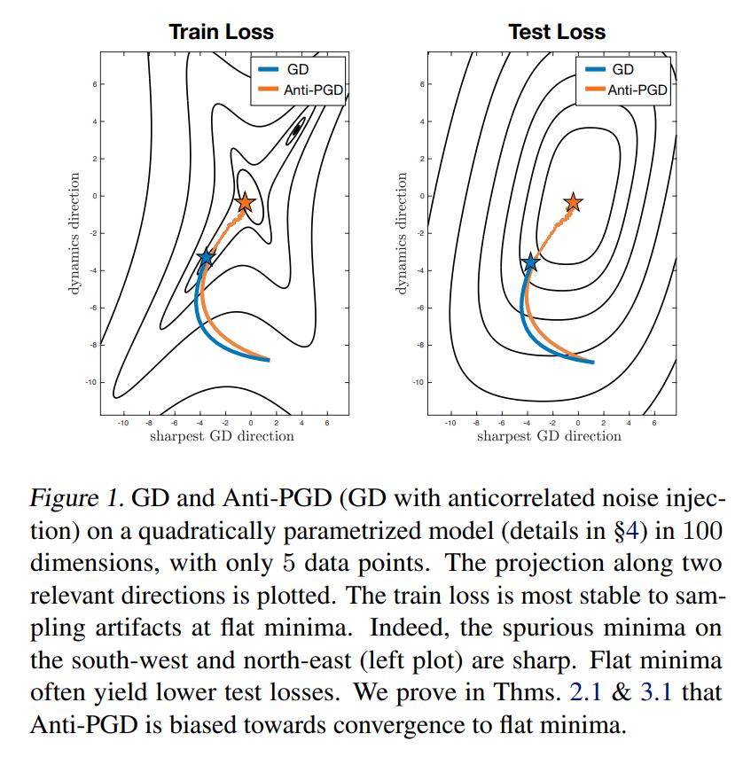
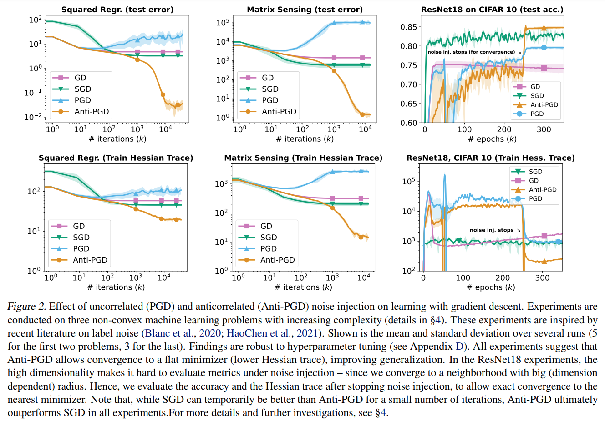
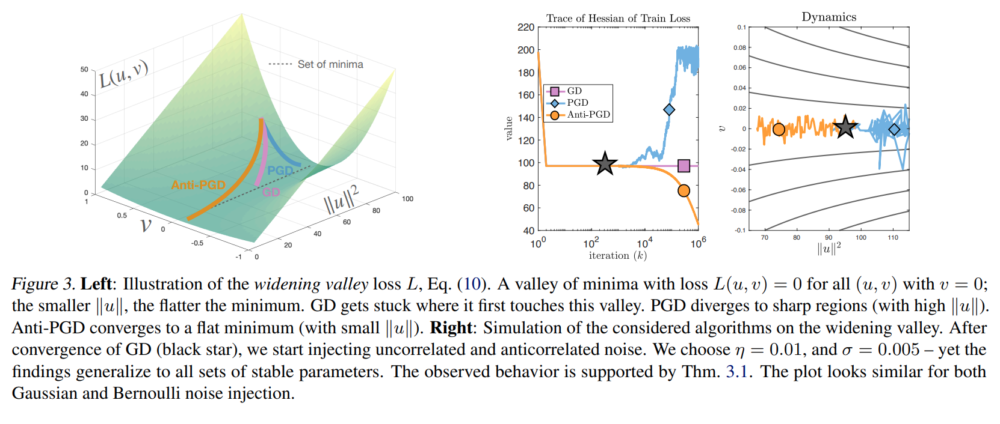
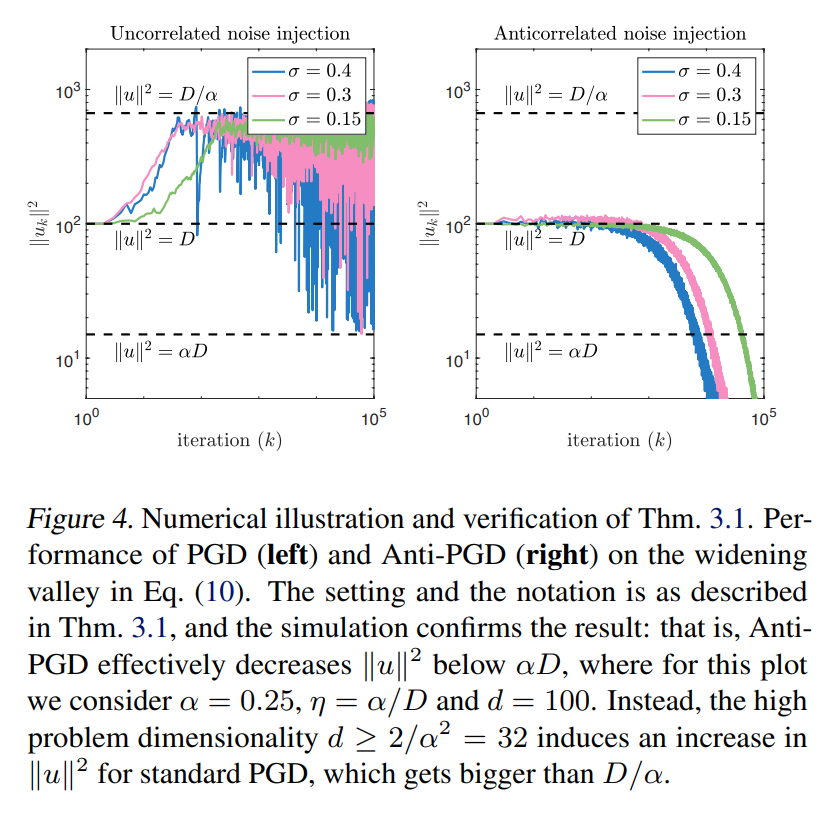
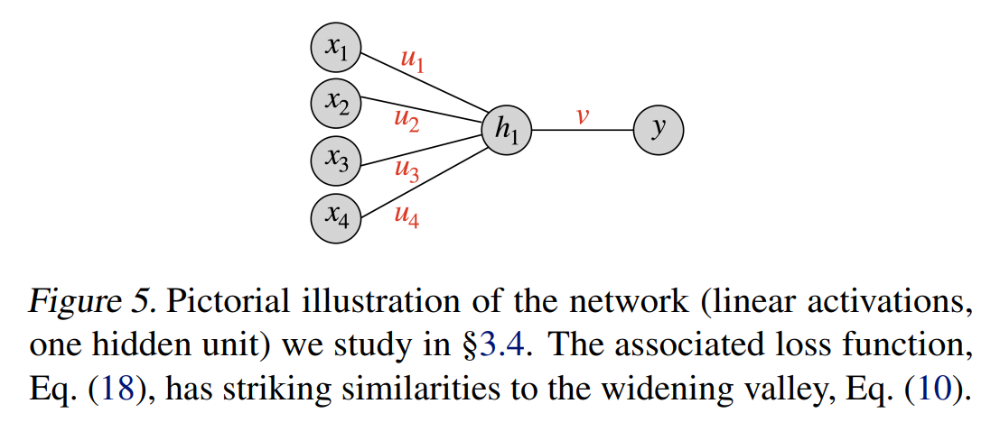
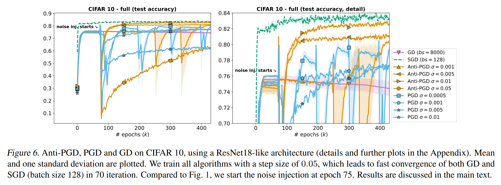

논문 및 이미지 출처 : <https://arxiv.org/pdf/2202.02831>

# Abstract

gradient descent (GD)에 인위적인 noise 를 주입하는 것은 machine learning models 의 성능을 향상시키기 위해 일반적으로 사용된다. 

보통, 이러한 _perturbed gradient descent_ (PGD) 방법에서는 uncorrelated noise 가 사용된다. 하지만 이것이 optimal 인지, 또는 다른 유형의 noise 가 better generalization 성능을 제공할 수 있는지는 알려지지 않았다. 

본 논문에서는 consecutive PGD 단계의 perturbations 을 상관시키는 문제에 초점을 맞춘다. 

저자는 다양한 objective functions 을 고려한 결과, _anti-correlated_ perturbations ("Anti-PGD") 을 사용하는 GD 가 GD 와 standard (uncorrelated) PGD 보다 generalization 성능이 크게 향상됨을 발견했다. 

이러한 실험적 발견을 뒷받침하기 위해, Anti-PGD 가 wider minima 로 이동하는 반면, GD 와 PGD 는 suboptimal regions 에 머물거나 심지어 diverge 하는 것을 보여주는 이론적 분석도 도출했다. 

anticorrelated noise 와 generalization 간의 이 새로운 연결은 machine learning models 를 훈련시키기 위해 noise 를 활용하는 새로운 방법을 열어준다.

# 1. Introduction

deep neural networks (DNN)와 같은 overparameterized model 의 loss _landscape_ 에서, _flat minima_ 가 sharp minima 보다 better generalization 성능을 보인다고 널리 믿어진다. 

이 아이디어는 flat minima 에서는 low precision 으로 weight 를 결정하는 것이 충분하며, 이는 small generalization gap 과 상관관계가 있다고 추측한 Hochreiter & Schmidhuber (1995; 1997) 으로 거슬러 올라간다. 

비록 이것이 결정적으로 증명되지 않았고 논쟁이 계속되고 있지만, 이 가설은 점점 더 많은 경험적 증거에 의해 지지되고 있다.

한편, 많은 연구가 어떤 _optimization algorithms_ 이 test data 에서 좋은 성능을 내는지 분석해왔다. standard stochastic gradient descent (SGD) 에 대해서는, 그 stochastic noise 가 optimizer 를 flat minima 쪽으로 유도하는 경향이 있다는 것이 일반적인 발견이다.

SGD 를 넘어, 여러 논문에서는 인위적인 noise 를 주입하여 stochastic gradient descent 방법을 perturbation 시키는 방안을 제안했다. 

지금까지 이러한 perturbed gradient descent (PGD) 방법은 spurious local minima 와 saddle points 를 빠르게 벗어나는 데 유익한 것으로 입증되었다. 

이전 연구에서의 발견에 기초하여, noise injection 이 model 의 generalization 성능에 어떤 역할을 하는지 질문하는 것이 자연스러워 보인다. 

저자가 조사하는 정확한 질문은 _stochastic noise 가 vanilla SGD 의 유리한 generalization 속성을 맞추거나 심지어 능가할 수 있도록 설계될 수 있는지 여부이다_.

#### Contribution.

저자는 이전 PGD 방법들이 independent (uncorrelated) perturbation 에 의존한다는 관찰에서 출발한다. 

저자는 이 선택이 최적인지 의문을 제기하고, 대신 (anti-)correlated perturbations 가 generalization 측면에서 더 적합한지 연구한다. 

저자는 two consecutive steps 에서 _anticorrelated_ perturbations 를 가지는 새로운 perturbed gradient descent 방법인 “AntiPGD” 를 도입한다. 

저자는 Anti-PGD 가 loss landscape 의 flat 부분으로 평균적으로 drift 함을 보여줌으로써 이 설계를 동기 부여한다. 

저자는 shallow neural networks 부터 real data (e.g., CIFAR 10)를 사용하는 deep architectures 에 이르기까지 광범위한 실험을 수행했고, Anti-PGD 가 실제로 standard GD 나 PGD 보다 더 flat 하고 better generalization 성능을 가진 minima 를 신뢰성 있게 찾는다는 것을 입증했다.

저자는 두 개의 정리로 이 관찰을 설명한다. 

1. Anti-PGD 는 Hessian 의 trace 를 최소화하는데, 이는 Hessian 의 trace 가 추가된 regularized loss 의 최소값으로 (기대값으로) 수렴하는 의미이다.
2. 가장 단순한 toy model 인 “widening valley” 에서 Anti-PGD 가 flattest minimum 으로 수렴하는 반면, GD 는 sharper minima 에 갇히고 standard (uncorrelated) PGD 는 발산함을 보여준다. 

요약하면, 이러한 발견들은 anticorrelated noise 가 generalization 을 향상시키는 데 사용될 수 있음을 제시한다.

## 1.1. Related Work

다음의 연구들은 저자의 연구와 밀접하게 연결되어 있다. 

특히, PAC-Bayes bounds 와 label noise 와의 연관성은 매우 관련성이 높으며, 이후에 더 자세히 논의될 것이다.

#### Generalization measures and flat minima.

Generalization measures 는 model 의 generalization 능력을 단조롭게 포착하는 양들이다. 

예를 들어, Keskar et al. (2016) 과 Chaudhari et al. (2017) 은 loss $\nabla^2 L(w^*)$ 의 Hessian 스펙트럼이 generalization 성능과 관련이 있음을 보여주는 광범위한 실험을 수행했다. 이는 $\nabla^2 L(w^*)$ 의 low eigenvalues 이 good generalization 성능을 나타내는 경향이 있음을 의미한다. 

이러한 현상을 포착하기 위해, 여러 flatness (a.k.a. sharpness) measures 가 generalization measures 로 제안되었다. 

- 특히, Jiang et al. (2019) 은 많은 인기 있는 generalization measures 를 대규모로 비교한 결과, 일부 flatness measures 가 최고의 성능을 보이는 measures 중 하나임을 결론지었다. 
- 최근, Petzka et al. (2021)은 ‘relative flatness’ 라는 개념을 통해 flatness 와 generalization 을 연결했다.

그러나 flat minima 의 우수성은 논란의 여지가 있다. 

- Dinh et al. (2017) 은 sharp minima 도 잘 일반화할 수 있음을 보여주었으며, flatness 가 reparametrization 에 따라 불변하지 않음을 지적했다. 
- 따라서 flatness 와 good generalization 간의 correlation 에 대한 경험적 발견은 반드시 인과 관계로 간주되어서는 안 된다.

#### PAC-Bayes bounds.

model 의 generalization 능력은 이론적으로 generalization gap 을 bounding 으로 잡아 포착할 수 있으며, 이는 classical VC 나 Rademacher bounds 뿐만 아니라 Langford & Caruana (2002), Neyshabur et al. (2017; 2018), Tsuzuku et al. (2020) 와 같은 PAC-Bayes bounds 에 의해서도 수행된다. 

그러나 deep learning model 의 generalization 능력을 특성화하는 것은 도전적인 과제임이 입증되었다.

대부분의 classical bounds 는 현대의 overparameterized network 에서 계산될 때 무의미하다.

- 다행히도, Dziugaite & Roy (2017) 와 후속 연구들은 PAC-Bayes bounds 가 실질적으로 유용한 결과를 도출하도록 최적화될 수 있음을 보여주었다. 
- Yang et al. (2019) 에서 논의된 바와 같이, PAC-Bayes bounds 는 flatness 와도 관련이 있을 수 있으며, 더 정확히는 Hessian 의 trace 와도 관련이 있다. 
- 후자는 저자의 분석에서 핵심적인 역할을 할 것이며, 이에 대한 연결고리를 §2.2에서 자세히 설명할 것이다.

#### The scale of noise in SGD.

SGD 는 overparameterized model 에서 놀라울 정도로 잘 일반화되는 minima 를 찾는 경향이 있다. 

이 현상은 문헌에서 다양한 관점에서 설명되어왔다. 

- SGD 의 intrinsic noise 에 초점을 맞춘 Zhang et al. (2019) 과 Smith et al. (2020) 은 SGD 가 flat minima 로 수렴함으로써 잘 일반화된다는 것을 경험적으로 보여주었다. 
- 반대로, Bradley & Gomez-Uribe (2021)은 SGD 의 stationary distribution 을 특성화하여, noise level 증가 (즉, smaller batch size 또는 larger learning rate)가 flat minima 로의 수렴과의 연관성을 입증했다. 

저자의 연구와 특히 관련이 깊은 Wei & Schwab (2019) 은 일부 설정에서 SGD 가 기대값으로 Hessian 의 trace 를 감소시킨다는 것을 보여주었다.

#### The shape of noise in SGD.

SGD noise 의 distribution 은 문헌에서 종종 논쟁의 주제가 된다. 이와 관련하여, 

- Simsekli et al. (2019) 은 SGD noise 가 Gaussian 이라는 기본 가정을 도전했다. 특정 설정에서, 그들의 연구는 heavy-tailed 분포가 관찰됨을 경험적으로 보여주었다. 
- 이러한 유형의 noise 는 Nguyen et al. (2019)에서 sharp minima 에서 flat minima 로 더 빠르게 벗어나는 데 기여하는 것으로 나타났다. 
- Simsekli et al. (2019) 의 발견의 보편성은 커뮤니티 내에서 논쟁의 여지가 있지만, SGD 의 tail index 는 그 확산 특성에 큰 영향을 미친다. 
  - 예를 들어, heavy-tailed noise 는 _sharp minima_ 에서 더 빠르게 탈출하게 한다. 
  - 또한, heavy-tailed noise 는 simple model (e.g., isotropic data 에 대한 linear regression)과 high learning rate regime 에서 multiplicative noise 의 효과로 인해 증명되었다. 
- 최근, Wang et al. (2022) 은 truncated heavy-tailed noise 가 SGD 에서 sharp minima 를 제거할 수 있음을 입증했다.

#### Perturbed Gradient Descent (PGD).

PGD 는 인위적인 noise 를 각 단계 후에 파라미터에 추가하는 (stochastic) gradient descent 의 변형이다. 

여러 PGD 방법들은 spurious local minima 와 saddle points 를 빠르게 벗어나는 데 도움이 되는 것으로 나타났다. 

이러한 방법들은 uncorrelated perturbations 를 주입한다는 점에서 저자의 Anti-PGD 와 다르다. 

parameter 를 perturbing 하는 대신, gradient 에 noise 를 추가함으로써 very deep network 에서 학습을 향상시킬 수 있다.

#### Label noise and implicit bias.

SGD 에 perturbations 를 추가하는 또 다른 방법은 훈련에 사용되는 data label 에 noise 를 추가하는 것이다. 

최근 연구들은 이러한 perturbations 가 손실을 암묵적으로 regularize 함으로써 generalization 에 유익하다는 것을 보여주었다. 

이 대안적인 noise injection 은 gradient 를 계산하기 _전에_ label 을 perturbing 하며, 이는 PGD 와 저자의 Anti-PGD 와는 반대로, gradient-descent 단계 _후에_ parameter 를 perturbing 하는 것이다.

# 2. Finding Flat Minima by Anti-PGD

이 섹션에서는 문제 설정을 소개한 후, Anti-PGD 의 상세한 설명과 flat minima 를 찾기 위해 어떻게 설계되었는지를 설명한다.

#### Problem setting.

$\{(x^{(i)}, y^{(i)})\}_{i=1}^M$ 을 $x^{(i)} \in \mathbb{R}^{d_{in}}$ 과 $y^{(i)} \in \mathbb{R}$ 을 갖는 $M$ input-output pairs 로 이루어진 dataset 이라 하자. 

저자는 empirical risk minimization 을 사용하여 trained parameters $w \in \mathbb{R}^d$ 를 갖는 machine learning model $f_w : \mathbb{R}^{d_{in}} \rightarrow \mathbb{R}$ 을 고려한다. 

$i$-th data point $(x^{(i)}, y^{(i)})$ 에 대한 loss $L^{(i)} : \mathbb{R}^d \rightarrow \mathbb{R}$ 을 정의한다. 

저자는 (full-batch) training loss 를 $L(w) := \frac{1}{M} \sum_{i=1}^M L^{(i)}(w)$ 로 나타내며, 이를 optimizing 하여 best parameters 를 찾는다.

#### Anti-PGD.

_Gradient descent_ (GD)는 loss $L(w)$ 을 반복적으로 optimizing 하여 $\{w_n\}_{n=0}^N$ 의 weight sequence 를 생성한다. 

여기서 $w_{n+1} = w_n - \eta \nabla L(w_n)$ 이며, $\eta > 0$ 은 step size (a.k.a. learning rate)이다. 

_Perturbed gradient descent_ (PGD) 는 각 step 에 i.i.d perturbations 이며 $\xi_{n+1}$ 를 추가하는 것이다. 즉,

$$
\begin{equation}
    w_{n+1} = w_n - \eta \nabla L(w_n) + \xi_{n+1},
\end{equation}
$$

여기서 $\{\xi_n\}_{n=0}^N$ 는 variance $\sigma^2 I$ 를 갖는 centered i.i.d. random variables 의 집합이다. 

유사하게, _anticorrelated perturbed gradient descent_ (Anti-PGD)는

$$
\begin{equation}
    w_{n+1} = w_n - \eta \nabla L(w_n) + (\xi_{n+1} - \xi_n).
\end{equation}
$$

즉, Anti-PGD 는 PGD (1) 에서 i.i.d. perturbations $\{\xi_n\}_{n=0}^N$ 을 그들의 increments $\{\xi_{n+1} - \xi_n\}_{n=0}^{N-1}$ 으로 대체한다. 

Anti-PGD 라는 이름은 consecutive perturbations 가 anticorrelated 되기 때문이다:

$$
\frac{\mathbb{E}\left[(\xi_{n+1} - \xi_n)(\xi_n - \xi_{n-1})^\top\right]}{2\sigma^2} \overset{\underset{(\mathrm{iid})}{}}{=} -\frac{\text{cov}(\xi_0)}{2\sigma^2} = -\frac{1}{2} I.
$$

## 2.1. Regularization in Anti-PGD

Anti-PGD (2) 는 PGD (1) 의 수정으로 정의되지만, loss landscape $L$ 의 regularization (smoothing) 으로도 볼 수 있다.

이를 보기 위해, 변수 변환 $z_n := w_n - \xi_n$ 후, Anti-PGD step 은 다음과 같이 된다:

$$
\begin{equation}
    z_{n+1} = z_n - \eta \nabla L(z_n + \xi_n).
\end{equation}
$$

해당 loss $L(\cdot + \xi_n)$ 은 기대값으로 original $L$ 의 convolution (또는 smoothing)된 버전으로 간주할 수 있다. 

이 loss 의 gradient (따라서 Anti-PGD)의 direction 을 보기 위해, 저자는 $z_n$ 주변에서 $\partial_i L(\cdot)$ 의 Taylor expansion 을 수행한다:

$$
\begin{equation}
    \begin{aligned}
        z^i_{n+1} = z_n^i &- \eta \partial_i L(z_n) - \eta \sum_j \partial^2_{ij} L(z_n) \xi_n^j \\
        &- \underbrace{\frac{\eta}{2} \sum_{j,k} \partial^3_{ijk} L(z_n) \xi_n^j \xi_n^k}_{= \frac{\eta}{2} \partial_i \sum_{j,k} \partial^2_{jk} L(z_n) \xi_n^j \xi_n^k} + O(\eta \|\xi_n\|^3),
    \end{aligned}
\end{equation}
$$

여기서 중괄호 아래의 항은 Clairaut’s theorem 때문이며, $L$ 이 연속적인 4차 편도함수를 가지고 있다고 가정한다. 

$\xi_n$ 가 zero mean 이고 covariance 가 $\sigma^2 I$ 임을 이용하여, 각 단계의 conditional expectation 을 다음과 같이 표현할 수 있다:

$$
\begin{equation}
    \mathbb{E}[z_{n+1} \mid z_n] = z_n - \eta \nabla \tilde{L}(z_n) + O(\eta \mathbb{E}[\| \xi \|^3]),
\end{equation}
$$

여기서 _modified loss_ $\tilde{L}$ 은 다음과 같이 주어진다:

$$
\begin{equation}
    \tilde{L}(z) := L(z) + \frac{\sigma^2}{2} \text{Tr}(\nabla^2 L(z)),
\end{equation}
$$

여기서 $\text{Tr}(A)$ 는 square matrix $A$ 의 trace 를 의미한다 (Appendix A 에서, 저자는 Anti-PGD 의 conditional variance 를 계산한다)

conditional mean 인 Eq. (5) 는 Anti-PGD 의 _동기_를 강조한다: variable $z_n$ 으로 표현될 때, Anti-PGD 는 expectation 에서 (noise 의 third moment 의 영향을 제외하고) Hessian 의 trace 를 추가한 regularized loss 의 direction 으로 steps 를 취한다. 

noise variance $\sigma^2$ 이 클수록 Anti-PGD 에 대한 Hessian 의 (trace 의) 영향력이 강해진다. 이는 stochastic gradient noise 가 standard SGD 에서 loss 를 smoothing 하는 방식과 관련이 있으며, 여기서는 Hessian 의 trace 를 명시적으로 정규화하는 인위적인 noise 를 주입한다는 점이 다르다. 

smoothing 문헌에 대한 논의는 §2.4로 미룬다.

다음 정리에서는 noise $\xi_n$ 이 symmetric Bernoulli distribution 을 따르는 경우를 분석한다. 

저자는 실제로 Anti-PGD 가 regularized loss $\tilde{L}$ 을 (평균적으로) 최소화함을 발견했는데, 이는 regularized gradient 가 수렴함을 의미한다.

#### Theorem 2.1 (Convergence of the regularized gradients)

$L: \mathbb{R}^d \rightarrow \mathbb{R}$ 가 continuous fourth-order partial derivatives 를 가지며, 어떤 constant $\beta > 0$ 에 대해 $\beta$-Lipschitz continuous third order partial derivatives 를 갖는 하한이 존재한다고 하자. 

Anti-PGD (3) 에 의해 계산된 iterates $\{z_n\}_{n=0}^{N-1}$ 를 고려하자. 여기서 각 $n$ 에 대해 noise coordinate $\xi_n^i$ 는 variance $\sigma^2$ 를 갖는  symmetric centered Bernoulli distributio 을 따른다 (i.e., $\sigma$ 와 $-\sigma$ 가 probability $1/2$ 를 가진다). 

$\epsilon > 0$ 을 충분히 작게 설정하여 $\eta = \Theta(\epsilon/\sigma^2) < 1/\beta$ 이고, $N = \Omega(\sigma^2 \epsilon^{-2})$ 일 때, 다음이 성립한다:

$$
\begin{equation}
    \mathbb{E}\left[ \frac{1}{N} \sum_{n=0}^{N-1} \|\nabla \tilde{L}(z_n)\|^2 \right] \leq O(\epsilon) + O(\sigma^3).
\end{equation}
$$

---

증명은 Appendix $B$ 를 참조.

저자는 Anti-PGD 가 (6) 에 나타난 Hessian 의 trace 를 감소시키는 방법을 정확히 보았으므로, 이 발견을 Hessian 의 trace 로 정규화하는 것과 관련된 이전 연구와 연결한다.

## 2.2. Connection with PAC-Bayes Bounds

PAC-Bayes bounds 는 posterior distribution $Q$ 에 대한 average loss 에 대한 bounds 로 해석할 수 있으며, expected sharpness 개념을 통해 loss curvature 과 연결된다. 

아래 정리는 이러한 연결성을 명확히 보여준다.

#### Theorem 2.2. ((Neyshabur et al., 2017; Tsuzuku et al., 2020))

$Q(w\mid w^*)$ 를 parameters 에 대한 distribution 이라 하고, 이는 어떤 gradient-based method 로 찾은 solution $w^*$ 를 중심으로 한다고 하자. 

임의의 non-negative real number $\lambda$ 에 대해, 확률이 적어도 $1-\delta$ 만큼 있는 이벤트에서 다음이 성립한다:

$$
\begin{aligned}
    L_{\mathrm{true}}(Q(w\mid w^*)) \le L(w^*) + \frac{\lambda}{2M} + \frac{1}{\lambda} \ln (\tfrac{1}{\delta}) \\
    + \underbrace{L(Q(w\mid w^*)) - L(w^*)}_{\text{expected sharpness}} + \frac{1}{\lambda} \mathrm{KL}[Q(w| w^*) \| P(w)],
\end{aligned}
$$

여기서 $L_{\mathrm{true}}$ 는 generalization loss ; $L(Q) := \mathbb{E}_{w\sim Q}L(w)$ 및 $L_{\mathrm{true}}(Q) := \mathbb{E}_{w\sim Q} L_{\mathrm{true}}(w)$ ; $P$ 는 parameters 에 대한 distribution 이며0, $\mathrm{KL}$ 은 Kullback-Leibler divergence 이다.

---

이 정리에 대한 증명은 다른 문헌(e.g., Tsuzuku et al., 2020) 을 참조하자.

해당 정리의 설정에서, 만약 $Q$ 를 variance $s^2$ 인 Gaussian distribution 으로 잡으면, 아래와 같은 expected sharpness 의 근사를 얻는다:

$$
\begin{equation}
    L(Q(w|w^*), w^*) - L(w^*) \approx \frac{s^2}{2} \mathrm{Tr}(\nabla^2 L(w^*)).
\end{equation}
$$

따라서, Hessian 의 trace 를 최소화함으로써, Anti-PGD 는 Thm. 2.2 의 PAC-Bayes bound 역시 줄일 것으로 기대된다. 

실제로, Thm. 2.2 의 bound 에 대한 이 논리는 연구자들이 stochastic gradient noise 와 SGD 로 찾은 solution 에서의 Hessian trace 간의 명시적 연결을 찾도록 유도했다.

실험적으로, 이 양들은 많은 설정에서 high correlation 를 보이는데: 보통 trace 가 낮을수록 (즉, minima 가 더 flat 할수록) test accuracy 는 높다.

Hessian 의 trace 와 관련된 유사한 bounds 들도 다른 문헌들에서 다루어진다.

## 2.3. Comparison with Label Noise

PGD 에서처럼 $w$ 를 perturbations 시키는 대신, label-noise 방법은 data 의 label $y^{(i)}$ 를 perturbations 시킨다. 

만약 저자의 모델에서 input $x$ 에 대한 output 이 $f_w(x)$ 라고 하면, squared loss 를 사용하는 full-batch setting 에서의 label-noise update 는 다음과 같다: $w_{n+1} = w_n - \eta \nabla \bar{L}(w_n),$ 여기서 $\bar{L}(w) = \frac{1}{2M} \sum_{i=1}^M [f_w(x^{(i)}) - y^{(i)} + \xi_{n + 1}]^2,$ 이는 일련의 randgom perturbations $\{\xi_n\}_{n=0}^N$ 에 대해 정의된다. 

label noise loss $\bar{L}$ 과 Eq. (3) 의 Anti-PGD loss $L(\cdot + \xi_n)$ 을 비교하는 것은 유익하다.

위의 공식은 다음과 같이 gradient 를 제공한다:

$$
\begin{equation}
    \nabla \bar{L}(w) = \nabla L(w) + \sum_{i=1}^M \nabla f_w(x^{(i)}) \xi_{n+1}.
\end{equation}
$$

따라서, label noise 는 generalization 측면에서 향상을 가져오는 것으로 관찰되었지만, 그 효과는 일반적으로 model 과 data 에 크게 의존한다. 

대신, 저자가 제안하는 noise injection 은 data 와 model 에 독립적이며, 이는 Eq. (5) 의 regularization 에서 볼 수 있다.

## 2.4. Connection to Smoothing

Eq. (6) 은 Anti-PGD 가 regularized loss 를 optimizing 하는 것과 동일함을 보여주며, 이는 original objective function 을 smoothing 한 것으로 해석할 수 있다. 물론 smoothing 은 optimization 분야에서 새로운 개념이 아니며, 종종 approximate derivatives 를 계산하기 위해 non-differentiable functions 를 regularize 하거나, convergence 의 faster rates 를 얻기 위해 사용된다.

deep learning 의 맥락에서는, noise injection (또는 stochastic gradient noise)과 smoothing 은 종종 연관되어 있다. Eq. (3)에서 보았듯이, anticorrelated noise injection 은 variables 변환 후의 smoothing 과 동일하다 – 이 특성은 trace regularizer 를 도출하는 데 결정적인 역할을 했다. 

저자는 smoothing 문헌에서 유사한 explicit regularization 결과를 알지 못한다 (대부분의 연구는 결과적인 landscape properties 와 convergence guarantees 에 초점을 맞춘다). Anti-PGD 가 smoothing 과 연결되어 있지만, 분석하기 훨씬 더 편리하다: $\nabla f(x + \xi)$ 는 특성화하기 복잡한 data-dependent distribution 을 따른다. 

대신, Anti-PGD 에서는 smoothing effect 가 anticorrelated random variables 를 추가함으로써 발생한다 – 이는 _linear_ 연산이다. 

이는 매우 편리하며, 다음 결과인 Thm. 3.1 의 증명에서 활용될 것이다.

# 3. Convergence in Widening Valleys

저자는 위에서 Anti-PGD 가 Hessian 의 trace 에 대한 regularizer 역할을 한다는 것을 보았다. 

이 섹션에서는 Anti-PGD 의 dynamics 를 “widening valley” 에서 더 자세히 분석할 것이다 – Hessian 의 trace 가 변화하는 simplest possible loss landscape. 

다음 subsections 에서, 저자는 이 모델을 소개하고 (§3.1), 실험을 통해 Anti-PGD 가 이 model 에서 flat minima 를 성공적으로 찾는 것을 입증하며 (§3.2), 이 동작을 이론적으로 증명하고 (§3.3), widening valley 가 sparse regression 과 같은 보다 현실적인 문제와 어떻게 관련되는지를 설명할 것이다 (§3.4).

## 3.1. The Widening Valley Landscape

_widening valley_ 는 다음과 같은 loss function 으로 정의된다:

$$
\begin{equation}
    L(u, v) = \frac{1}{2} v^2 \|u\|^2,
\end{equation}
$$

여기서 $\| \cdot \|$ 는 Euclidean norm, $v \in \mathbb{R}$, 그리고 $u \in \mathbb{R}^d$ 이다; Fig. 3을 참조하자. 

$L$ 의 gradient 와 Hessian 은 다음과 같다:

$$
\begin{equation}
    \nabla L(u, v) = \begin{bmatrix}
        v^2 \cdot u \\
        \|u\|^2v
    \end{bmatrix} , \quad \nabla^2 L(u, v) = \begin{bmatrix}
        v^2I_d & 2vu \\
        2vu^\top & \|u\|
    \end{bmatrix}.
\end{equation}
$$

따라서 Hessian 의 trace 는 다음과 같다:

$$
\begin{equation}
    \text{Tr}(\nabla^2 L(u, v)) = d v^2 + \|u\|^2.
\end{equation}
$$

저자는 GD 와 Anti-PGD 의 dynamics 를 분석하기에 적합한 문제로 $L$ 을 고려한다. 

이는 Hessian 의 trace 에 따라 단조롭게 변화하는 flatness 를 가진 minima 의 valley 로 구성된 비교적 단순한 구조를 가지고 있기 때문이다: $v = 0$ 인 all $(u, v)$ 는 minima 이지만, Hessian 의 trace 를 작게 유지하기 위해 $\|u\|$ 도 최소화해야 한다.

widening valley 는 minimizer 근처의 landscape 를 단순화한 local model 로도 볼 수 있다. 실제로, Draxler et al. (2018) 은 neural networks 의 minimizer 가 종종 loss 가 정확히 0 인 path 로 연결되어 있으며, optimizer 가 solution 의 flatness 를 점진적으로 증가시키기 위해 점프할 필요가 없음을 보여주었다. 

이러한 valley 는 일반적으로 straight 가 아니며 flatness 가 단조롭게 변하지 않을 수 있지만, 저자의 straight valley (10) 는 단조롭게 변화하는 flatness 를 가진 first simplified model 로서 역할을 한다. 

저자는 이를 §3.4의 보다 현실적인 regression 문제와 연결할 것이다.

## 3.2. Empirical Demonstration

widening valley (10) 을 최적화할 때, GD 는 flatness 에 상관없이 global minima $(u, v = 0)$ 에도 정착하게 된다. 

특히 dimension $d \gg 1$ 이면, GD 의 path 는 $v$ 를 작게 만드는 데 치우쳐 있고 $u$ 를 최적화하지 않는다 (왜냐하면 $v$ direction 이 가장 크게 굽어 있기 때문). 

그 결과, final Hessian trace 는 $\|u_0\|^2$ 가 된다. noise 를 주입해 이를 개선하는 것은 쉽지 않은데, stochastic perturbations 를 추가할 때 $v$ 를 zero 에서 멀어지게 하여 $\|u\|$ 를 줄일 수 있는 gradient $(11)$ 를 얻는 동시에, $\|u\|$ 가 너무 크게 증가하지 않도록 균형을 맞춰야 하기 때문이다.

경험적으로, Anti-PGD 는 이를 달성하여 valley 의 flat 한 부분으로 이동하지만, PGD 는 그렇지 못함을 확인했다 (Fig. 3 참조). 

즉, Anti-PGD 는 valley 의 flat 한 부분으로 수렴하는 반면, PGD 는 sharper regions 로 발산한다 (Fig. 4 참조).

## 3.3. Theoretical Analysis

다음 정리는 이전 섹션에서 실험적으로 보인 바를 이론적으로 증명한다.

#### Theorem 3.1 (Widening Valley).

$L : \mathbb{R}^{d+1} \rightarrow \mathbb{R}$ 가 Eq. (10) 의 widening valley loss 라고 하자. 

저자는 $\|u_0\|^2 = D \gg 1$ 인 point $w_0 = (u_0, 0)$ 에서 optimizing 을 시작하며(e.g., gradient descent 로 찾은 solution), fixed $\alpha \in (0, 1)$ 에 대해 $\mathcal{D}_\alpha := \{(u, v) \in \mathbb{R}^{d+1} : \|u\|^2 \in (\alpha D, D/\alpha)\}$ 를 고려한다. 

저자는 Eqs. (1) 및 (2) 에 정의된 PGD 와 Anti-PGD 의 longterm stochastic dynamics 을, 이들이 $\mathcal{D}_\alpha$ 를 벗어나는 방식으로 비교하고자 한다. 

noise model 로서, i.i.d. perturbations $\xi_n$ 이 variance $\sigma^2$ 를 갖는 symmetric centered Bernoulli distribution (i.e., $\sigma$ 와 $-\sigma$ 가 probability 1/2)로부터 온다고 가정하되, $\sigma^2$ 가 $\sigma^2 \in \left(0, \min\left\{\frac{\alpha^3 D}{2}, \frac{D}{8\alpha}\right\}\right]$ uppder bounding 된다. 

step size 로 $\eta = \frac{\alpha}{2D}$ 를 설정하면, 두 방법 모두 $\mathcal{D}_\alpha$ 내부에서 안정적인 dynamics 을 이룬다. 

저자는 (평균적으로) PGD 와 Anti-PGD 가 $\mathcal{D}_\alpha$ 의 서로 다른 측면을 통해 빠져나간다는 사실을 발견했다:

1. **high dimension 에서, PGD 는 zero 에서 멀리 발산한다.** \
   만약 $d \ge \frac{2}{\alpha^2}$ 이라면, 어떠한 $\sigma^2$ 에 대해서도 성립한다:
   $$
   \begin{equation}
        \lim_{n \to \infty} \mathbb{E}[\|u_n\|^2] \ge D/\alpha,
   \end{equation}
   $$
   여기서 $u_n$ 은 Eq. (1) 에 따라 PGD 로 계산된 $w_n$ 의 first $d$ coordinates 이다.

2. **dimension 과 무관하게, Anti-PGD 는 zero 로 간다.** \
   모든 $d \in \mathbb{N}$ 에 대해, $\sigma^2 \le \frac{\alpha D}{2d}$ 를 만족하는 $\sigma^2$ 를 선택하면 다음이 성립한다:
   $$
   \begin{equation}
        \lim_{n \to \infty} \mathbb{E}[\|u_n\|^2] \le \alpha D,
   \end{equation}
   $$
   여기서 $u_n$ 은 (2) 에 따라 Anti-PGD 로 계산된 $w_n$ 의 first $d$ coordinates 이다.

예상대로, 이 정리는 $n \to \infty$ 일 때, Anti-PGD 는 Hessian 의 trace 를 감소시키고 PGD 는 이를 증가시킨다는 것을 의미한다.

증명은 Appendix C 를 참조하자.

#### Corollary 3.1 (The trace of the Hessian in the widening valley).

Thm. 3.1 의 동일한 설정에서 $\eta = \frac{\alpha}{2D}$, $\sigma^2 \in \left(0, \min\left\{\frac{\alpha^3 D}{2}, \frac{D}{8\alpha}, \frac{\alpha D}{2d}\right\}\right], \quad d \ge \frac{2}{\alpha^2},$ 라 하자. 

$\alpha \ll 1$ 이라면,

$$
\begin{aligned}
    &\lim_{n \to \infty} \mathbb{E}[\text{Tr}(\nabla^2 L(w_n^\text{anti}))] \le 16 \alpha D \ll \mathbb{E}[\text{Tr}(\nabla^2 L(w_0))], \\
    &\lim_{n \to \infty} \mathbb{E}[\text{Tr}(\nabla^2 L(w_n^\text{un}))] \ge \frac{D}{\alpha} \gg \mathbb{E}[\text{Tr}(\nabla^2 L(w_0))],
\end{aligned}
$$

여기서 $w_n^\text{un} = (u_n, v_n)$ 와 $w_n^\text{anti} = (u_n, v_n)$ 는 각각 PGD 와 Anti-PGD 에 의해 계산된 weight 이다.

## 3.4. Relation to Linear Networks with One Hidden Unit

이 섹션에서는 Eq. (10) 형태와 유사한 widening valley 가 보다 현실적인 학습 문제에서 어떻게 나타날 수 있는지 설명한다.

이를 위해, 다음과 같은 $M$ input-output pairs $\{(x_i, y_i)\}_{i=1}^M$ 이 주어지는 sparse regression 을 고려하자. 

여기서 all $i \in [M]$ 에 대해 $x_i \in \mathbb{R}^{m+d}$, $d, m > 1$, $y^i \in \mathbb{R}$ 이다. 

저자는 오직 각 $x_i$ 의 first $m$ features i.e., $(x_1^i, x_2^i, \dots, x_m^i)$ 만이 관련된 predictors 라고 가정하며, other features $(x_{m+1}^i, x_{m+2}^i, \dots, x_{m+d}^i)$ 는 target 과 상관되지 않는다고 하자. 추가로, input 이 isotropic standardised distribution 을 가진다고 가정한다.

predictor 로는 one hidden neuron 을 가지는 neural network 를 사용하며, standard square loss 를 사용한다:

$$
\begin{equation}
    L(u, v) = \frac{1}{2M} \sum_{i=1}^M \bigl( y_i - v \cdot u^\top x^i \bigr)^2.
\end{equation}
$$

이러한 loss 는 $v$ 와 $u$ 간의 non-linear interaction 때문에 매우 non-convex 하다. 

식을 전개해보면,

$$
2 L(u, v) = \mathbb{E}_i \bigl[(y_i)^2 \bigr] - 2v \cdot u^\top \mathbb{E}[y^i x^i] + v^2 \mathbb{E}_i \bigl[ (u^\top x^i)^2 \bigr].
$$

first term 은 optimization 에서 상관이 없으므로 생략할 수 있다. 

last term 은 다음과 같이 쓸 수 있다:

$$
\begin{equation}
    v^2 \mathbb{E}_i \bigl[ (u^\top x^i)^2 \bigr] = v^2 \mathbb{E}_i \bigl[ \text{Tr}(u^\top x^i (x^i)^\top u) \bigr].
\end{equation}
$$

Trace 의 cyclic propert 와 $\mathbb{E}_i [x^i (x^i)^\top] = I$ 가정에 따라,

$$
\begin{equation}
    v^2 \mathbb{E}_i \bigl[ (u^\top x)^2 \bigr] = v^2 \text{Tr}(u u^\top) = v^2 \|u\|^2.
\end{equation}
$$

결국, $L(u, v) = \frac{1}{2} v^2 \|u\|^2 - 2v \cdot u^\top \mathbb{E} \bigl[y^i x^i\bigr].$

여기서 sparseness 가정에 따라: features $(x_{m+1}^i, x_{m+2}^i, \dots, x_{m+d}^i)$ 는 target 과 상관이 다음을 얻는다:

$$
\begin{equation}
    L(u, v) = \frac{1}{2}v^2\|u^2\| - 2v\cdot u^\top_{1:m} \mathbb{E}[y^ix^i_{1:m}]
\end{equation}
$$

이 loss, Eq. (18) 은 widening valley Eq. (10) 와 매우 유사하다: good generalization 을 위해서는 쓸모없는 coordinates $(u_{m+1}, u_{m+2}, \dots, u_{m+d})$ 를 zero 로 설정해야 한다. 

그러나 (추가 regularization 없는) gradient descent 의 solution 은 일반적으로 이 속성을 갖지 않너느다 ($3.2).

이 사실은 parameter space $(u_{m+1}, u_{m+2}, \dots, u_{m+d}, v)$ 의 dynamics 를 살펴보게 만드며, space $(u_1, u_2, \dots, u_m)$ 의 dynamics 는 무시한다. 

parameter space 의 spurious subspace 에서, 마지막 식의 last term 은 constant 이므로 effective loss 는 $L(u, v) = \frac{1}{2}  v^2  \|u\|^2$ 가 된다. 

여기서 $u \in \mathbb{R}^d$ 는 $(u_{m+1}, \dots, u_{m+d})$ 로 이루어진다.

# 4. Additional Experiments and Details

저자는 Fig. 2 에서 Anti-PGD 의 성능을 세 가지 다른 문제(다음 세 단락에서 설명)에서 보여줌으로써 이론적 결과의 타당성을 입증했다. 

마지막으로, CIFAR 10 에 대한 또 다른 실험에서 Anti-PGD 가 sharp minimum 에서 회복할 수 있음을 보여줄 것이다.

#### Quadratically-parametrized linear regression.

$X \in \mathbb{R}^{n \times d}$ ($d=100, n=40$) 인 data matrix 와 $y \in \mathbb{R}^d$ 이 주어졌을 때, 해당 loss 는 $L(w) = \frac{1}{4n} \|X(w \odot w) - y\|^2$ 으로 정의된다. 

여기서 $\odot$ 은 element-wise product 를 나타낸다. 

이 모델의 표현 능력은 제한적이지만, HaoChen et al. (2021) 등에서 논의된 것처럼, nonlinear parameterization 으로 인해 loss non-convex 라는 점과, Hessian 을 살펴보면 다른 curvature 을 가진 minima 가 존재한다는 점 등 흥미로운 특징들이 있다. 

이 문제에서 Anti-PGD (Gaussian perturbations 사용)는 flat 한 minimum 을 찾을 수 있었는데, 해당 dynamics 는 Fig. 1 에서 시각적으로 확인할 수 있다. 

실험적으로, hyperparameters 의 다른 선택에 대해서도 성능이 견고했으며, well-tuned PGD (Gaussian perturbations 사용)가 Anti-PGD 를 능가하는 설정은 찾지 못했다(§D.2).

#### Matrix sensing.

이 loss function 은 quadratically-parametrized linear regression 과 몇 가지 유사점이 있으며, label noise 를 연구하기 위해 사용된 문제이다. 

위 단락에서의 모든 결과가 여기에서도 동일하게 적용된다. 

실험 세부 사항과 hyperparameter 설정은 §D.3 에 정리되어 있다.

#### CIFAR10 on ResNet 18.

저자는 batch normalization 이 포함된 ResNet18-like architecture 를 사용한다. 아키텍처 세부 사항은 §D.4 에 수록했다. 

이 networks 의 성능은 hyperparameter, 알고리즘 선택(e.g., adaptive step size), schedyule 등에 크게 의존한다. 여기서는 단순성을 유지하기 위해 momentum 0.9 인 SGD optimizer 를 사용하고, learning rate 을 0.05 로 설정한다. 

full-batch gradient descent 에 가까운 방식을 모사하기 위해 7500 samples (5 GPUs 의 saturation 지점)을 사용하는 very large batch size 를 사용했다. 

noise injection 의 효과만을 고립시키기 위해, mini-batch noise 를 섞지 않고 PGD 와 Anti-PGD (Gaussian perturbations 사용)를 이 high batch regime (dataset 의 1/7) 에서 실행했다. 

SGD 의 경우에는 batch size 를 128 로 두고 learning rate 을 0.05 로 고정했다.

noise injection 을 250 epochs 후에 중지하면(즉, nearest minimum 로 수렴 가능), Anti-PGD 가 PGD 에 비해 더 flat 한 minimum 을 찾고, 그 결과 generalization 도 더 잘 됨을 확인했다. 

더 나아가, §D.4 에서는 어떠한 $\sigma$ (noise injection level) 의 tuning 도 PGD 가 Anti-PGD 의 generalization 성능에 도달하도록 만들지 못함을 확인했다.

#### Recovering from a sharp minimum.

이번 실험은 이전 단락과 동일한 parameter settings 를 유지하지만, noise injection 을 75 epochs 후 (i.e., full-batch gradient descent 로 수렴한 뒤)에만 적용한다. 

그 결과, Anti-PGD 와 PGD 는 noise injection 이 시작되기 전까지는 GD 가 찾은 minimum 에 갇혀 있다. 

이후의 동작( Fig. 6 참조)은 Fig. 3 의 widening valley model 과 유사하게, noise injection 으로 인해 dynamics 이 갑자기 불안정해지며, training 중 알고리즘이 여러 minima 를 오가는 것으로 보인다. 

이는 Fig. 2 에서 관찰된, training 시작부터 noise injection 을 주고 마지막에 주입을 중지했던 경우와는 매우 다른 양상이다. 

이번에는 반대로 처음에 bad minimum 에서 시작한 뒤 noise injection 을 통해 회복한다. 

Anti-PGD 는 PGD 에 비해 훨씬 더 잘 나쁜 초기화 상태에서 회복한다. 

흥미롭게도, 이 경우 Anti-PGD 는 training 마지막에 noise injection 을 중지하지 않고도 test accuracy 가 SGD 에 근접하게 된다. 이는 (a) initialization 근처, (b) local minimizer 근처에서의 landscape 특성이 다름에 기인한다고 추정된다.

두 실험 모두에 대한 추가 figure (e.g., test-train loss) 은 §D.4 에 있다. 

결론적으로, Anti-PGD 는 §2 와 §3 의 이론적 예측대로, flat minima 를 안정적으로 찾아내며 잘 generalize 한다.

#### Anti-SGD.

부록에서는 mini-batch noise 와 anti-correlated noise 를 결합해 성능을 더욱 향상시킬 수 있음을 보여준다 (Fig. 17 참조).

# 5. Conclusion and Future Work

Minima 의 flatness 가 generalization 성능과 상관관계가 있다는 최근 발견에 동기부여되어, 저자는 anticorrelated noise injection 이 모델의 generalization 을 향상시킬 수 있음을 보여주었다 – 이를 통해 optimization 를 flatter minima 쪽으로 편향시켰다. 

이를 위해, 저자는 perturbed gradient descent 에서의 i.i.d. perturbations 를 anticorrelated 방식으로 대체했다. 

그 결과인 Anti-PGD 방법이 Hessian 의 trace (일반적인 flatness 측정치)를 정규화함을 증명했다. 

추가적인 이론적 정당화를 위해 저자는 widening valley 모델을 도입하고, _Anti-PGD_ 가 valley 의 flat 한 부분에 수렴하는 반면 GD 와 standard PGD 는 더 sharp 한 영역에 머무른다는 것을 증명했다. 

CIFAR 10 같은 실제 데이터를 사용하는 실험에서도, Anti-PGD 는 flat minima 에 수렴하고 잘 generalize 한다는 것을 관찰했다(GD 와 standard PGD 에 비해).

---

이 발견들로 인해, anticorrelated noise 가 model 의 generalization 성능을 향상시킬 수 있다는 가설이 제기되며, 이를 토대로 몇 가지 새로운 탐구 방향이 열린다. 

우선, uncorrelated 에서 anticorrelated 로 이어지는 perturbations 의 스펙트럼을 더 깊이 탐색하고, 다양한 noise distribution 과 결합할 필요가 있다. 

uncorrelated noise 는 saddle points 를 빠르게 벗어나는 데 유익할 수 있으므로, uncorrelated 와 anticorrelated 사이의 절충(또는 적응형 스케줄)이 도움이 될 수도 있다.

게다가, 저자의 발견이 standard SGD 에 주는 함의도 탐색할 가치가 있다. 

보통의 noise injection 기법들과 달리, SGD 의 noise 는 data 에 의존하며 크기는 step size 와 batch size 의 비로 결정된다. 하지만, 후속 단계의 stochastic gradient noise 가 (negatively) correlation 을 갖도록 batch 를 선택하는 방식을 수정해볼 수도 있다. 

또한, SGD 에 이미 존재하는 noise 위에 anticorrelated noise 를 추가하거나, SGD (또는 다른 optimizer)의 test loss 가 plateau 에 도달한 뒤에만 이를 주입할 수도 있다. 

이론적, 실험적 결과 모두 최적화에서 noise 의 중요성에 대한 새로운 통찰을 가져다줄 가능성이 높다.

# Appendix

## A. Computation of Conditional Variance

저자는 Eq. (5) 로부터 Anti-PGD step 의 _conditional mean_ 이 다음과 같음을 이미 알고 있다:

$$
\begin{equation}
    \mathbb{E}[z_{n+1} \mid z_n] = z_n - \eta \nabla \tilde{L}(z_n) + O\bigl(\eta \mathbb{E}[\|\xi_n\|^3]\bigr),
\end{equation}
$$

여기서 _modified loss_ $\tilde{L}$ 은

$$
\begin{equation}
    \tilde{L}(z) := L(z) + \frac{\sigma^2}{2} \mathrm{Tr}\bigl(\nabla^2 L(z)\bigr).
\end{equation}
$$

이는 standard PGD step (Eq. (1)) 의 conditional mean 이 gradient descent 와 일치한다는 점 (i.e., implicit bias 가 없음을 의미) 과 대조적이다:

$$
\begin{equation}
    \mathbb{E}[w_{n+1}| w_n] = w_n - \eta \nabla L(w_n).
\end{equation}
$$

본 섹션에서는 추가로 Anti-PGD 와 PGD 의 conditional variance 을 계산한다. 

우선, PGD 를 살펴보자. 여기서 Eq. (1) 에 등장하는 $\partial_i L(\cdot)$ 에 대한 2차 Taylor expansion 를 $w_n$ 주변에서 수행하면,

$$
\begin{equation}
w_{n+1}^i = w_n^i - \eta \partial_i L(w_n) - \eta \sum_{j=1}\partial_{ij}^2 L(w_n) - \frac{\eta^2}{2}\partial_i \sum_{j,k} \partial_{j,k}^2 L(w_n) + \xi_{n+1}^i.
\end{equation}
$$

따라서 PGD 의 conditional variance 는 단순히

$$
\begin{equation}
    \mathrm{var}\bigl[w_{n+1}^{(i)} | w_n\bigr] = \mathrm{var}\bigl[\xi_{n+1}^i\bigr] = \sigma^2.
\end{equation}
$$

반면에 Anti-PGD 의 경우

$$
\begin{aligned}
\mathrm{var}\bigl[z_{n+1}^{(i)} | z_n\bigr] &\overset{\underset{\mathrm{Eq. (4)}}{}}{=} \mathbb{E}\Bigl[\bigl[\eta\partial_i L(z_n) + \eta\sum_j \partial_{ij}^2L(z_n)\xi_n^j + \frac{\eta}{2}\sum_{j,k}\partial_{ijk}^3L(z_n)\xi_n^j\xi_n^k + O(\eta\|\xi_n\|^3)\bigr]^2 | z_n\Bigr]\\
&= \eta^2\bigl[\partial_iL(z_n)\bigr]^2 + \eta^2\sigma^2 \sum_{j=1}^d \bigl[\partial_{ij}^2L(z_n)\bigr]^2 + \frac{\eta^2\sigma^4}{4}\sum_{j\neq k} \partial_{ijk}^3L(z_n) + \frac{\eta^2}{4} \sum^d_{j=1}\partial_{ijj}L(z_n) \mathbb{E}[(\xi_n^j)^4] \\
&+\frac{\eta^4\sigma^4}{4} \sum_{j \neq k} \bigl[\partial_{ijj}L(z_n)\bigl] \cdot \bigl[\partial_{ijj}L(z_n)\bigl] + \eta^2 O(\mathbb{E}[\|\xi_n\|^6]) \\
&+ 2 \left[ \left( 0 + 0 + \frac{\eta^2 \sigma^2}{2} \sum^d_{j=1} \partial_{ijj} L(z_n) + \eta^2 \partial_i L(z_n)O (\mathbb{E}[\|\xi_n\|^3]) \right) + \biggl( 0+0+0+0 \biggl) + \biggl( 0+0 \biggl) \right. \\
&+ \frac{\eta^2 \sigma^2}{2} \left[ \sum^d_{j=1} \partial_{ijj} L(z_n) \right] O(\mathbb{E}[\|\xi\|^3]) \biggl]
\end{aligned}
$$

재정렬하여 요약하면 다음을 얻는다.

$$
\begin{equation}
    \begin{aligned}
        &\mathrm{var}\bigl[z_{n+1}^{(i)} \big\vert z_n\bigr] = \\
        &\eta^2\bigl[\partial_i L(z_n)\bigr]^2 + \eta^2 \sigma^2 \sum_{j=1}^d \bigl[\partial_{ij}^2 L(z_n)\bigr]^2 + \frac{\eta^2\sigma^4}{4} \sum_{j \neq k} \Bigl(\partial_{ijk}^3 L(z_n) + \bigl[\partial_{ijj} L(z_n)\bigr]\cdot\bigl[\partial_{ikk} L(z_n)\bigr]\Bigr) + \eta^2\sigma^2 \sum_{j=1}^d \partial_{ijj} L(z_n) \\
        &+ \Bigl[ \frac{1}{2}\partial_i L(z_n) + \frac{\sigma}{2}\sum_{j=1}^d \partial_{ijj} L(z_n) \Bigr] O\bigl(\mathbb{E}[\eta^2\|\xi_n\|^3]\bigr) + \Bigl[\frac{1}{4}\sum_{j=1}^d \partial_{ijj} L(z_n) \Bigr] O\bigl(\mathbb{E}[\eta^2\|\xi_n\|^4]\bigr) + O\bigl(\eta^2\mathbb{E}[\|\xi_n\|^6]\bigr).
    \end{aligned}
\end{equation}
$$

위 식은 $\sigma \to 0$ 일 때 Anti-PGD 의 conditional variance 의 asymptotic (second order) expansion 이다. 

이는 크게 두 부분으로 나뉜다. 

1. first line 은 $\xi$ distribution 의 first two moments 에서 유도된 항들이고, 
2. second line 은 third, fourth, sixth moments 에서 기인하는 항들이다. 

따라서 noise distribution 에 대한 추가적인 가정이 없다면, conditional variance size 에 대해 더 구체적인 결론을 내리기는 어렵다. 

그러나 Eq. (24) 를 눈여겨보면, 이 distribution 이 PGD 의 경우 (Eq. (23))보다 클 가능성이 높아 보인다.

## B. Proof of Theorem 2.1

#### Theorem 2.1 (Convergence of the regularized gradients).

$L : \mathbb{R}^d \rightarrow \mathbb{R}$ 가 continuous fourth-order partial derivatives 를 갖고, 어떤 constant $\beta > 0$ 에 대해 third-order partial derivatives 가 $\beta$-Lipschitz continuous 이며, $L$ 이 lower bounded 라고 존재한다고 하자. 

Anti-PGD (3) 에 의해 iterates $\{z_n\}_{n=0}^{N-1}$ 이 계산된다고 하자. 

여기서 각 $n$ 에 대해 noise coordinate $\xi_n^i$ 는 distribution 이 $\sigma^2$ 인 symmetric centered Bernoulli distribution (i.e., $\sigma$ 와 $-\sigma$ 가 probability 1/2) 를 따른다. 

이제 $\epsilon > 0$ 을 충분히 작게 잡아 $\eta = \Theta(\epsilon/\sigma^2) < \frac{1}{\beta}$ 가 되도록 하고, $N = \Omega(\sigma^2\epsilon^{-2})$ 로 설정한다. 

그러면 다음이 성립한다:

$$
\mathbb{E}\biggl[
\frac{1}{N} \sum_{n=0}^{N-1} \|\nabla \tilde{L}(z_n)\|^2
\biggr]
\le O(\epsilon) + O(\sigma^3). \tag{7}
$$

_**Proof.**_

First, Eq. (4) 에서, Bernoulli perturbations $\xi_n$ ( $(\xi_n^i)^2 = \sigma^2$ a.s.) 을 고려할 때, 다음이 성립함을 관찰한다:

$$
\begin{equation}
    \begin{aligned}
        z_{n+1}^i - z_n^i = &- \underbrace{\partial_i \eta L(z_n) - \partial_i \eta \frac{\sigma^2}{2} \sum_{j}\partial^2_{jj} L(z_n)}_{\eta \partial_i \tilde{L}(z_n) (\text{Regularized Gradient})} \\
        &- \underbrace{\eta \sum_{j}\partial^2_{ij}L(z_n) \xi_n^j - \frac{\eta}{2} \partial_i \sum_{j \neq k}\partial^2_{jk}L(z_n)\xi_n^j \xi_n^k}_{Mean-zero Perturbation} \\
        &+ \underbrace{O(\eta\sigma^3)}_{\text{Expansion error (small)}}.
    \end{aligned}
\end{equation}
$$

저자는 $L$ 이 $\beta$-Lipschitz continuous third-order partial derivatives 를 가진다고 가정하기 때문에, Nesterov (2018) 의 Theorem 2.1.5 에 따라 $\tilde{L}$  은 $\beta$-smooth 하다. 

어떤 tensor $B$ 가 있다고 하자. 이 tensor $B$ 는 Eq. (25) 의 mean-zero perturbation 모든 항을 담고 있다고 할 때,

$$
\begin{aligned}
    \tilde{L}(z_{n+1}) &\le \tilde{L}(z_n) + \bigl\langle \nabla \tilde{L}(z_n), z_{n+1} - z_n \bigr\rangle + \frac{\beta}{2}\|z_{n+1} - z_n\|^2 \\
    &\overset{\underset{\mathrm{(25)}}{}}{=} \tilde{L}(z_n) - \eta\bigl\langle \nabla \tilde{L}(z_n), \nabla \tilde{L}(z_n) + B(z_n) \odot \xi_n + O(\sigma^3) \bigr\rangle + \frac{\beta\eta^2}{2}\bigl\|\nabla \tilde{L}(z_n) + B(z_n) \odot \xi_n + O(\sigma^3)\bigr\|^2 \\
    &= \tilde{L}(z_n) - \eta\|\nabla \tilde{L}(z_n)\|^2 + \frac{\beta\eta^2}{2}\|\nabla \tilde{L}(z_n)\|^2 \\
    & - \eta\bigl\langle \nabla \tilde{L}(z_n),B(z_n) \odot \xi_n\bigr\rangle + \eta\bigl\langle \nabla \tilde{L}(z_n),O(\sigma^3)\bigr\rangle \\
    &+ \frac{\beta\eta^2}{2}\Bigl[ \|B(z_n) \odot \xi_n\|^2 + O(\sigma^6) + 2\bigl\langle \nabla \tilde{L}(z_n) + O(\sigma^3),B(z_n) \odot \xi_n\bigr\rangle + 2\langle \nabla \tilde{L}(z_n), O(\sigma^3) \rangle \Bigr].
\end{aligned}
$$

expectation 을 고려하면, 대부분의 terms 가 상쇄되어 다음을 얻는다.

$$
\begin{align}
    \mathbb{E}[\tilde{L}(z_{n+1})]\le\mathbb{E}&\Bigl[\tilde{L}(z_n)-\eta \|\nabla \tilde{L}(z_n)\|^2+\frac{\beta \eta^2}{2}\|\nabla \tilde{L}(z_n)\|^2\Bigr] \\
    &+O(\eta\sigma^3) \\
    &+\frac{\beta \eta^2}{2}\Bigl(O(\sigma^2) + O(\sigma^6) + O(\sigma^3)\Bigr) \\
    &=\mathbb{E}[\tilde{L}(z_n)]-\bigl(\eta - \tfrac{\beta\eta^2}{2}\bigr)\mathbb{E}\bigl[\|\nabla \tilde{L}(z_n)\|^2\bigr]+O(\eta^2 \sigma^2)+O(\eta\sigma^3).
\end{align}
$$

positive $\eta$ 를 가정하에, $\Bigl(\eta - \tfrac{\beta\eta^2}{2}\Bigr) > 0$ 는 $0 < \eta \le \frac{2}{\beta}$ 를 의미한다.

나아가 $\Bigl(\eta - \tfrac{\beta\eta^2}{2}\Bigr) \ge \tfrac{\eta}{2}$ 가 요구되면, condition $0 < \eta \le \frac{1}{\beta}$ 을 얻는다.

이 condition 하에, 아래와 같은 upper bound 가 성립한다:

$$
\begin{equation}
    \mathbb{E}\bigl[\tilde{L}(z_{n+1})\bigr] \le \mathbb{E}\bigl[\tilde{L}(z_n)\bigr] - \frac{\eta}{2}\mathbb{E}\bigl[\|\nabla \tilde{L}(z_n)\|^2\bigr] + O(\eta^2 \sigma^2) + O(\eta \sigma^3).
\end{equation}
$$

식의 항들을 재배열하면,

$$
\begin{equation}
    \frac{\eta}{2} \mathbb{E}\bigl[\|\nabla \tilde{L}(z_n)\|^2\bigr] \le \mathbb{E}\bigl[\tilde{L}(z_n)\bigr] - \mathbb{E}\bigl[\tilde{L}(z_{n+1})\bigr] + O(\eta^2 \sigma^2) + O(\eta \sigma^3).
\end{equation}
$$

이를 $\eta/2 > 0$ 로 나누면,

$$
\begin{equation}
    \mathbb{E}\bigl[\|\nabla \tilde{L}(z_n)\|^2\bigr] \le \frac{2}{\eta} \Bigl(\mathbb{E}\bigl[\tilde{L}(z_n)\bigr] - \mathbb{E}\bigl[\tilde{L}(z_{n+1})\bigr] \Bigr) + O(\eta\sigma^2) + O(\sigma^3).
\end{equation}
$$

all terms 를 합산하면

$$
\begin{equation}
    \mathbb{E}\Bigl[\sum_{n=0}^{N-1} \|\nabla \tilde{L}(z_n)\|^2 \Bigr] \le \frac{2}{\eta} \Bigl(\mathbb{E}\bigl[\tilde{L}(z_0)\bigr] - \mathbb{E}\bigl[\tilde{L}(z_N)\bigr] \Bigr) + O(N\eta\sigma^2) + O(N\sigma^3).
\end{equation}
$$

다음을 $N$ 으로 나누면,

$$
\begin{equation}
    \mathbb{E}\Bigl[\frac{1}{N} \sum_{n=0}^{N-1} \|\nabla \tilde{L}(z_n)\|^2 \Bigr] \le \frac{2}{\eta N} \Bigl(\mathbb{E}\bigl[\tilde{L}(z_0)\bigr] - \mathbb{E}\bigl[\tilde{L}(z_N)\bigr]\Bigr) + O(\eta\sigma^2) + O(\sigma^3).
\end{equation}
$$

$\tilde{L}(z_N) \ge \tilde{L}^* = \min_z \tilde{L}(z) > -\infty$ 임을 유의한다. 

이는 $L$ 이 lower bound 를 가지며, 또한 $L$ 에 대해 Lipschitz gradient 를 가정했으므로 $\text{tr}(\nabla^2 L)$ 도 lower bound 를 갖기 때문이다. 

따라서 $\mathbb{E}[\tilde{L}(z_0)] - \mathbb{E}[\tilde{L}(z_N)] = O(1)$ 이고, 다음 결론을 얻는다:

$$
\begin{equation}
    \mathbb{E}\Bigl[\frac{1}{N} \sum_{n=0}^{N-1} \|\nabla \tilde{L}(z_n)\|^2 \Bigr] \le O\bigl(\eta^{-1} N^{-1}\bigr) + O(\eta\sigma^2) + O(\sigma^3).
\end{equation}
$$

만약 $\eta = O(\varepsilon / \sigma^2)$ 로 설정한다면, $O(\eta\sigma^2) = O(\varepsilon)$ 이다. 

또한 $\eta = \Theta(\varepsilon / \sigma^2)$ 일 때, $O(\eta^{-1} N^{-1}) = O(\sigma^2 \varepsilon^{-1} N^{-1})$가 된다.

그리고 $N = \Omega(\sigma^2 \varepsilon^{-2})$ 로 설정하면 $O(\eta^{-1} N^{-1}) = O(\varepsilon)$ 가 성립한다.

결론적으로, $\mathbb{E}\Bigl[\frac{1}{N} \sum_{n=0}^{N-1} \|\nabla \tilde{L}(z_n)\|^2 \Bigr] \le O(\varepsilon) + O(\sigma^3)$ 을 얻는다
