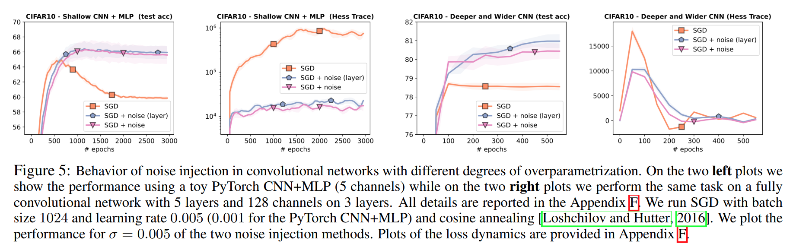
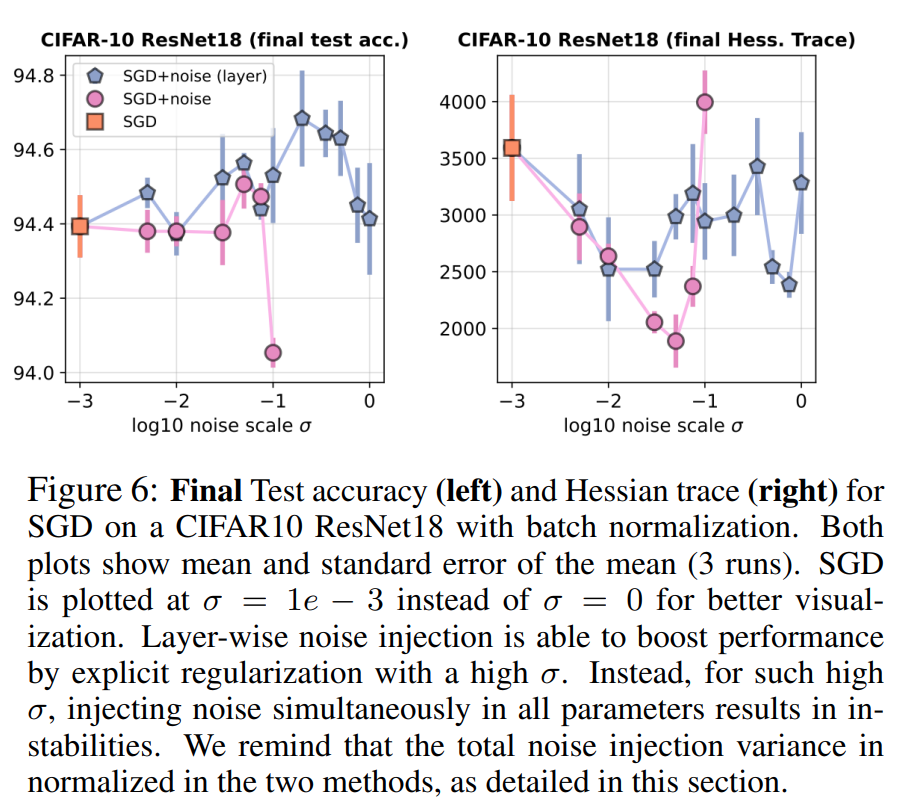

# Abstract

gradient descent 에 noise Injecting 은 smoothing 과 regularizing 특성 등 몇 가지 바람직한 특징을 가지고 있다. 

이 논문에서, gradient step 을 계산하기 전의 noise injecting 효과를 조사한다.

small perturbations 가 $\ell_1$-norm, group $\ell_1$-norms, 또는 nuclear norms 에 기반한 간단한 모델에 대해 explicit regularization 을 유도할 수 있음을 보여준다.

하지만, large width overparametrized neural networks 에 적용할 때, 동일한 perturbations 가 variance explosion 을 일으킬 수 있음을 보여준다. 

이를 극복하기 위해, variance explosion 없이 explicit regularization 을 가능하게 하는 independent layer-wise perturbations 를 사용하는 것을 제안한다.

저자의 실험 결과는 이러한 small perturbations 이 vanilla gradient descent 에 비해 generalization performance 을 향상시킨다는 것을 보여준다.

# 1. Introduction

gradient descent 의 noise injecting 은 몇 가지 바람직한 특성을 가지고 있다.

이전 연구들에서는 gradient step 후에 noise injection 이 non-convex optimization 에서 saddle points 을 효율적으로 벗어나는 데 사용되었다. 

최근 여러 연구에서 gradient descent 의 noise injecting 이 non-convex optimizing 중 local minima 을 벗어나는 데 도움이 된다는 것이 보여졌다.

gradient 내부의 noise adding, labels (stochastic) gradient 을 계산하기 전에 iterate 에 noise adding 은 전통적으로 objective function 을 smooth 하는 데 사용되었다 (종종 convex 경우에). 

그러나 noise injection 이 generalization 에 미치는 영향은 아직 잘 이해되지 않았다.

최근에는 induced noise 가 강제하는 loss landscape 의 geometry 와 이와 generalization 과의 연결을 이해하려는 관심이 있다.

- A recent result [Liu et al., 2021]는 충분한 small noise 의 perturbed gradient descent 가 non-convex matrix factorization tasks 에서 flat minima 에 수렴함을 보여준다.
- Orvieto et al. [2022] 은 noise injection 이 flat minima 를 선호하기 때문에 noise induced gradient descent 의 더 나은 성능에 대한 일부 설명과 실험적 증거를 제공한다.

이 연구에서, 저자는 이 연구의 방향을 따라 여러 가지 길을 탐구한다. 

저자의 목표는 다음과 같은 질문을 다루는 것이다:

1. training 중 모델에 small perturbations 가 machine learning 에서 일반적인 간단한 모델에 대해 explicit regularization 형태를 유도하는가?
2. 동일한 perturbations 가 homogeneous neural networks 와 같은 large (infinite) widths 의 overparametrized model 을 훈련할 때도 explicit regularization 효과를 유도하는가?
3. induced regularization 은 실제로 유용한가, 즉, better generalization 성능을 이끄는가?

위의 질문들에 대한 답변으로, 저자는 다음과 같은 기여를 한다:

1. 저자는 Section 2 에서 small perturbations 이 간단한 모델에 대해 explicit regularization 을 유도함을 보여주고, 이 induced regularization 이 $\ell_1$-norm, group $\ell_1$-norm, 또는 nuclear norms 에 기반함을 보여준다. 
   - 이러한 명시적 공식은 이전에 특정 경우 ($\ell_1$-norm) 또는 special loss function (separable case 의 logistic regression)에 대해서만 사용 가능했다.
2. 저자는 Section 3 에서 동일한 perturbations 이 variance explosion 으로 인해 large widths 를 가진 overparametrized neural networks 에는 효과가 없음을 보여준다. 
   - 그러나, 저자는 또한 independent layer-wise perturbations (gradient step 마다 오직 one layer 만 perturb 되는 경우) 을 사용하면 exploding variance term 을 피할 수 있고, single hidden layer 를 가진 fully connected network 에 대해 explicit regularizer 를 얻을 수 있음을 보여준다. 
   - 이것은 Section 4 에서 deep ReLU networks 에 확장된다.
3. 저자는 Section 5 에서 small layerwise perturbations 이 다양한 shallow 와 deep overparametrized model, fully connected 또는 convolutional model 에 대해, training procedure 에 약간의 조정을 가하여 vanilla (stochastic) gradient descent training 보다 실제로 better generalization 성능을 이끈다는 것을 empirical 하게 보여준다.

## 1.1 Related work

Noise injection 은 statistics, machine learning, signal processing 에서 다양한 작업에 자주 사용되었다. 

이 섹션에서, 저자는 이 연구와 밀접하게 관련된 세 가지 주요 연구 방향과 기존 문헌을 논의한다.

#### Perturbed gradient descent (PGD)

PGD methods 는 (stochastic) gradient descent (GD) 의 버전으로, noise 가 다음 두 가지 방법 중 하나로 주입된다: 

1. perturbations 가 각 GD step 후에 추가된다. 
   - 이러한 버전의 PGD 는 spurious local minima 와 saddle points 에서 탈출하는 속도를 높이는 것으로 보여졌다; 각각 Zhou et al. [2019]과 Jin et al. [2021] 을 참조
   - 이러한 methods 는 perturbations 이 diffusion coefficient 에 추가되는 continuous-time Langevin dynamics 의 discretizations 에 해당한다. 
2. perturbations 이 gradient 가 평가되기 전에 iterate 에 추가된다. 
   - 이런 perturbed gradient 는 unperturbed iterate 를 업데이트 하는 데 사용된다.
   - convex case 에서는, 이것이 typically non-smooth objective function 을 smooth 하는 데 사용된다.
   - non-convex case 에서는, 이러한 버전의 PGD 가 non-convex matrix factorization [Liu et al., 2021] 및 더 일반적인 모델 [Orvieto et al., 2022] 의 flat minima (better generalization) 쪽으로 implicit bias 를 나타내는 것으로 보여졌다. 
   - Flat minima 는 better generalization property 를 가지고 있다고 널리 믿어지며, 저자는 이 연구 방향을 따르며, PAC-Bayesian analysis 에 기반하고 저자의 framework 에도 적용되는 여러 generalization guarantees 를 제공한다. 
   - 두 번째 PGD 는 perturbations 이 대신 anticorrelated 되는 첫 번째 PGD 의 한 instance 로 해석될 수 있다.
   - 이러한 methods 는 따라서 Anti-PGD 라고도 불리며; Orvieto et al. [2022] 의 Section 2 을 참조

현재 논문에서는 두 번째 PGD 에서 (평균적으로) 사용되는 effective loss 를 결정한다.

#### Explicit and implicit regularization in learning

learning model 의 generalization 성능에 regularization 이 중요한 역할을 한다는 것은 잘 알려져 있다.

가장 일반적인 형태의 regularization 은 Tikhonov regularization 이며, 이는 linear 과 non-linear models 의 optimization objective 에 명시적으로 부과된다. 

machine learning models 의 training 중 regularization 을 명시적으로 유도하는 다른 방법들도 있다.

- Explicit regularization methods 외에도, optimization algorithms 은 optimal solution 에 implicit bias 를 유도할 수 있으며, 이는 Soudry et al. [2018], Gunasekar et al. [2018], Kubo et al. [2019] 에 의해 관찰되었다. 
- 밀접하게 관련된 연구에서, Camuto et al. [2020] 는 all network activations 에 Gaussian noise injection 으로 유도된 regularization 을 연구하고, Fourier domain 에서의 regularization 효과를 연구한다. 
- 그들이 우리와 유사한 explicit regularizers 를 얻은 반면, 저자는 network activations 대신 model parameter 에 noise injection 의 효과를 연구하며, 따라서 저자의 분석은 general machine learning models 에 적용 가능하다. 또한, 저자는 layer-wise perturbations 를 통해 infinite widths 를 다룬다.

#### Robustness

regularization 을 유도하고 flatter minima 를 찾는 것 외에도, noise injection 은 robust models 을 얻는 데에도 도움이 된다.

최근 연구들 [Salman et al., 2019, Cohen et al., 2019, Lecuyer et al., 2019, Li et al., 2018] 에서는 randomized smoothing 이 확실히 robust 한 neural network based classifiers 를 구축하는 scalable 한 방법임을 보여주었다.

그러나, 이러한 접근 방식들은 model perturbation 대신 input perturbation 에 의존한다.

- Wu et al. [2020] 는 adversarial weight perturbation 이 weight loss landscape 를 평탄화 하는 데 도움이 되며, 이는 robust generalization gap 을 개선한다고 보여주었다. 
- Zheng et al. [2021] 도 empirical risk 의 flat local minima 를 선호하기 위해 adversarial model perturbation 을 사용한다. 

그러나, model 에 noise injection 의 영향에 대한 체계적인 연구는 부족하다.

# 2 Finite-dimensional models

이 섹션에서는 loss function $L : \mathbb{R}^n \to \mathbb{R}$ 와 predictor $f : \mathbb{R}^m \to \mathbb{R}^n$ 를 고려하며, $w \in \mathbb{R}^m$ 에 대해 다음을 minimizing 하는 것을 목표로 한다. 

$$
\begin{equation}
    R(w) = L(\Phi(w))
\end{equation}
$$

machine learning 문맥에서, $\Phi(w)$ 는 $n$ inputs 에 대한 $n$ real-valued predictions 를 나타내고, $L$ 은 관련된 loss function 으로, 일반적으로 least-squares regression 의 경우 $L(\varphi) = \frac{1}{2n} \sum_{i=1}^{n} (y_i - \varphi_i)^2$, logistic regression 의 경우 $L(\varphi) = \frac{1}{n} \sum_{i=1}^{n} \log(1 + \exp(y_i \varphi_i))$ 로 정의된다.

여기서 $y \in \mathbb{R}^n$ 은 output labels vector

이 framework 는 multi-category classification 과 multinomial loss 같은 multi-dimensional outputs 에도 동일하게 적용되며, 이 경우 $\mathbb{R}^n$ 은 $\mathbb{R}^{n \times k}$ 으로 대체된다 (이는 실제로 neural networks 에서 Section 2.4, 3, 4 에서 고려된다).

이 섹션에서는 parameters 수 $m$ 이 고정된 상태에서 $\sigma$ 에 대한 asymptotics 만 고려한다 (따라서 “finite-dimensional” 이라는 명칭이 붙는다). 

parameters 수가 무한대로 증가하는 strong overparametrization 의 효과는 Section 3 과 4 에서 분석한다.

# 2.1 Gaussian perturbations and Taylor expansions

이전 PGD 연구들을 따르면서 (Section 1.1 참조), standard Gaussian vector $\varepsilon$ (zero mean 이며 identity covariance matrix)을 사용하여 iterate 를 교란시키는 것을 고려하고, function

$$
\begin{equation}
    R_\sigma(w) = \mathbb{E} \left[ L(\Phi(w + \sigma\varepsilon)) \right].
\end{equation}
$$

을 고려한다. 

- $D\Phi(w) \in \mathbb{R}^{n \times m}$ : $\Phi$ 의 Jacobian (first-order derivatives)
- $D^2(w) \in \mathbb{R}^{n \times m \times m}$ : second-order derivatives tensor

#### Taylor expansions

이 섹션 전반에 걸쳐, 저자는 단순한 설명을 위해 $L$ 과 $\Phi$ 가 세 번 미분 가능한 함수이며, third derivatives 가 bound 됨을 가정한다.

Appendix A 에서는 이러한 조건이 부분적으로만 만족되는 함수들 (e.g., ReLU activations)을 다룬다.

$w$ 에서의 $\Phi$ 의 Taylor 전개는 다음과 같이 쓸 수 있다:

$$
\begin{equation}
   \Phi(w + \sigma\varepsilon) = \Phi(w) + \sigma D(w)\varepsilon + \frac{\sigma^2}{2} D^2(w)[\varepsilon \varepsilon^\top] + O(\sigma^3 ||\varepsilon||^3),
\end{equation}
$$

여기서 $D^2\Phi(w)[M] \in \mathbb{R}^n$ 은 $D^2\Phi(w)[M]_j = \sum_{a,b=1}^m D^2\Phi(w)_{jab} M_{ab}$ 로 정의된다.

저자는 또한 $\Phi(w)$ 주위의 $L$ 의 Taylor expansion 가 필요하며, 이는 다음과 같이 쓸 수 있다:

$$
\begin{equation}
   L(\Phi(w) + \Delta) = L(\Phi(w)) + DL(\Phi(w))\Delta + \frac{1}{2} D^2 L(\Phi(w))[\Delta \Delta^\top] + O(||\Delta||^3),
\end{equation}
$$

여기서, $\varphi \in \mathbb{R}^n$ 에 대해, $DL(\Delta) \in \mathbb{R}^{1 \times n}$ 는 first-order partial derivatives 의 row-vector 이며, $D^2 L(\varphi) \in \mathbb{R}^{n \times n}$ 는 second-order partial derivatives 의 matrix, 표기법 $D^2 L(\varphi)[M] = \sum_{a,b=1}^n D^2 L(\varphi)_{ab} M_{ab} \in \mathbb{R}$ 를 사용한다.

Eq. (2) 에 정의된 $R_\sigma$ 의 expansion 을 계산하기 위해, 저자는 two expansions 를 조합하여 $\Delta = \sigma D\Phi(w)\varepsilon + \frac{\sigma^2}{2} D^2(w)[\varepsilon \varepsilon^\top] + O(||\varepsilon||^3)$ 인 경우에

$$
\begin{align*}
   &L(\Phi(w + \sigma\varepsilon)) \\
   &= L(\Phi(w) + \sigma D\Phi(w)\varepsilon + \frac{\sigma^2}{2} D^2\Phi(w)[\varepsilon \varepsilon^\top] + O(\sigma^3||\varepsilon||^3)) \\
   &= L(\Phi(w)) + DL(\Phi(w))(\sigma D\Phi (w)\varepsilon + \frac{\sigma^2}{2}D^2\Phi(w)[\varepsilon\varepsilon^\top] \\
   &\qquad + O(\sigma^3 \|\varepsilon \|^3)) + \frac{1}{2} D^2L(\Phi(w))[\sigma D\Phi(w)\varepsilon(\sigma D\Phi(w)\varepsilon)^\top \\
   &\qquad + O(\sigma^3\|\varepsilon\|^3)] + O(\sigma^3\|\varepsilon\|^3).
\end{align*}
$$

expectations 을 취하면, $\mathbb{E}[\varepsilon] = 0$ 및 $\mathbb{E}[\varepsilon \varepsilon^\top] = I$ 를 사용하여:

$$
\begin{equation}
   R_\sigma(w) = L(\Phi(w)) + \frac{\sigma^2}{2} DL(\Phi(w)) D^2\Phi(w)[I] + \frac{\sigma^2}{2} D^2 L(\Phi(w)) [ D\Phi(w) D\Phi(w)^\top ] + O(\sigma^3).
\end{equation}
$$

(주의 깊은 독자는 우리가 $\Phi$ 가 $C^3$ 에 속한다고 가정했음을 알아챘을 것이다; Appendix A 에서는 $\Phi$ 가 부분적으로만 $C^3$ 인 경우 (e.g., ReLU)에 대한 확장을 제시한다.) 

$R(w) = L(\Phi(w))$ 에 추가된 항들은 Orvieto et al. [2022] 에서 얻은 $R_\sigma$ 의 Hessian 의 trace 로부터 유도될 수 있음을 주목하자.

#### Minimizing $R_\sigma$ with stochastic gradient descent

Orvieto et al. [2022] 에서 논의한 바와 같이, Eq. (2) 에서 expectation 으로 정의된 $R_\sigma$ 을 minimizing 하기 위해 expectation 을 계산할 필요는 없다: 단순히 single perturbation (즉, single Gaussian vector $\varepsilon$) 을 사용하고, 파라미터에 대한 gradient 를 계산하여, 이는 stochastic gradient descent 알고리즘 내에서 사용할 수 있는 편향되지 않은 추정치를 제공한다.

loss function $L$ 이 finite sum structure 을 가지므로, machine learning 에서 전통적으로 수행되는 대로 관측치에 대해 stochastic gradient 를 사용할 수도 있다.

## 2.2 Asymptotically equivalent objective functions

여러 상황에서, 저자는 다음과 같은 “asymptotically equivalent” cost function $R_\sigma^{(\text{eff})}(w)$ 을 얻게 됨을 보여줄 것이다.

이는

$$
\begin{equation}
   R_\sigma^{(\text{eff})}(w) = R(w) + \frac{\sigma^2}{2} D^2L(\Phi(w)) [D\Phi(w)D\Phi(w)^\top],
\end{equation}
$$

로 정의되며, 이는 $R_\sigma(w) = \mathbb{E} \left[ L(\Phi(w + \sigma\varepsilon)) \right]$ 의 global minimizer 를 찾는 것이 $R_\sigma^{(\text{eff})}(w)$ 의 global minimizer 를 찾는 것과 본질적으로 동일함은 $\sigma \to 0$ 일때와 같다.

다시 말해, Eq. (5) 에서의 $\frac{\sigma^2}{2} DL(\Phi(w))D^2\Phi(w)[I]$ term 은 영향을 미치지 않는다.

이는 두 가지 다른 경우에서 $R$ 과 $R_\sigma$ 간의 근사의 차수가 $\sigma^2$ 인 반면, $R_\sigma$ 과 $R_\sigma^{(\text{eff})}$ 간의 차수는 $\sigma^3$ 임을 보여줌으로써 달성될 것이다.

#### Hessians with no cross-products

$\frac{\sigma^2}{2} DL(\Phi(w))D^2\Phi(w)[I]$ term 이 영향을 미치지 않기 위한 단순한 sufficient condition 은 모든 $w \in \mathbb{R}^m$ 에 대해 $D^2\Phi(w)[I] = 0$ 인 것이다.

이는 second-order derivatives 에 cross-product terms 가 없는 neural networks 같은 특정 모델에서 만족되며, 또는 모든 $j = 1,...,m$ 에 대해 $\text{tr}(\Phi_j(w)) = 0$ 일 때도 동일하다; 이는 예로 ReLU activation 을 사용할 때 해당되며, 더 많은 예는 Sections 2.4, 3, 그리고 4 에서 다룬다. 

다음 Theorem 은 충분한 regular functions 에 대해 이를 명확히 한다. 

proof 및 general results 는 Appendix A 에서 확인할 수 있다 (이미 위에서 간략히 언급됨).

#### Theorem 1

가정하자: (a) $\Phi$ 와 $L$ 은 세 번 연속 미분가능하며 third derivatives 가 uniformly bounded, (b) 모든 $w \in \mathbb{R}^m$ 에 대해 $D^2\Phi(w)[I] = 0$ 이다. 

그러면, constants $C$ 및 $C'$ ($w$ 에 independent)가 존재하여 $\forall w \in \mathbb{R}^m$ 에 대해 $|R_\sigma(w) - R(w)| \leq C(1 + \|w\|^2)\sigma^2$ 이며, $|R_\sigma(w) - R_\sigma^{(\text{eff})}(w)| \leq C'\sigma^3$ 이 성립한다. 

#### Overparametrized models

more general condition 은 overparametrization(model 이 충분히 풍부해서 $L$ 의 minimizer 을 이끌어낼 수 있을 때)과 관련이 있다. 

아래에서 간소화된 가정을 바탕으로 formal statement 을 다룬다.

proof 및 more refined conditions 는 Appendix A 에 있다.

#### Theorem 2

다음을 가정한다. 

(a) $\Phi$ 는 세 번 연속으로 미분 가능하고, second 및 third derivatives 가 uniformly bounded, (b) $L$ 은 strongly convex 및 second 와 third derivatives 가 uniformly bounded 이며, unique global minimizer $\varphi^*$ 를 가진다, (c) $w_* \in \mathbb{R}^m$ 에 대해 $\Phi(w_*) = \varphi_*$가 되는 (non-unique) 해가 존재한다, (d) $R_\sigma$ 과 $R_\sigma^{(\text{eff})}$ 의 minimizers 인 $w_*^\sigma$와 $w_*^{\sigma,(\text{eff})}$ 가 compact set $\Omega \subset \mathbb{R}^m$ 에 존재한다.

그러면, 만약 $w_*^\sigma$ 가 $R_\sigma$ 의 minimizer 이고, $w_*^{\sigma,(\text{eff})}$ 가 $R_\sigma^{(\text{eff})}$ 의 minimizer 라면, $\|\Phi(w_*^\sigma) - \varphi_*\|_2^2 = O(\sigma^2)$ 을 가지며, $\|\Phi(w_*^{\sigma, (\text{eff})}) - \Phi(w_*^\sigma)\|_2^2 = O(\sigma^3)$ 이다.

여기서 (a) 는 저자가 다양한 minimizers 에서 취한 prediction function $\Phi$ 가 점근적인 동등성을 특성화한다는 것(하지만 overparametrized 모델에서는 $\Phi$ 가 injective 하지 않기 때문에 parameters 간의 거리를 특성화하는 것은 불가능하다)이고, (b) 는 $\sigma$ 가 zero 에 가까워질 때, minimizer 가 interpolator $\Phi(w) = \varphi_*$ 로 수렴해야 한다는 것이다. 이때 minimal 은 $D^2 L(\Phi(w)) [D\Phi(w) D\Phi(w)^\top]$ 이 된다.

아래에서는 least square loss 와 separable case 에서의 logistic loss에 대해 구체적인 경우를 고려한 후, $\Phi$ 에 대한 간단한 모델들을 고려한다.

#### Least-squares regression

저자는 $L(\varphi) = \frac{1}{2n} \|y - \varphi\|_2^2$ 를 고려하는데, 이는 constant Hessian $\frac{1}{n} I$ 를 가진 quadratic function 이다.

따라서 저자는 $R(w)$ 위에 extra regularization 을 갖게 되며, 그 값은 $\frac{\sigma^2}{n} \text{tr} \left[ DL(\Phi(w)) DL(\Phi(w))^\top \right]$이다.

- 저자는 이 regularizer 가 neural tangent kernel [Jacot et al., 2018]과 관련이 있다는 것을 알 수 있다. 
- 즉, 이는 해당 kernel matrix 의 trace 이다. 
- 이로 인해 흥미로운 추가적인 연결이 발생할 수 있지만, 저자는 저자의 연구가 lazy training regime 을 넘어서 적용될 수 있음을 언급한다 (즉, 저자의 parameters $w$ 는 크게 변할 수 있다) [Chizat et al., 2019].

#### Separable logistic regression

만약 overparametrized model 에서 logistic loss 를 고려한다면, $L$ 의 infimum 은 무한대에서 달성되며, 저자는 $\Phi(w)$ 가 specific direction 으로 발산할 것으로 예상한다. 이는 다른 유사한 모델들에서와 마찬가지이다. 

- Lyu and Li [2019] 가 고려한 homogeneous models 에서는, $w$ 가 some direction 으로 발산할 것으로 예상되며, 즉, $w = \lambda\Delta$ 는 $\lambda \to +\infty$ 일 때 발산한다.
- $D\Phi(w) D(\Phi(w))^\top$ term 은 $\lambda$ 에 따라 증가하는 반면, $D^2 L(\Phi(w))$ 는 지수적으로 빠르게 0 으로 수렴한다.
- 전반적으로 저자는 발산을 얻는다고 추측하고(그리고 경험적으로 관찰하며), 그 direction $\Delta$ 이 $\|D\Phi(\Delta)\|_F^2$ 의 minimizer 에 비례하게 되며, 이는 $y \circ \Phi(\Delta) \geq 1$ 이 되도록 하는 direction 으로 수렴한다. 
  - 여기서 $y \in \{-1, 1\}^n$ 은 labels vector 이다.

더 자세한 내용은 Appendix B 를 참조

## 2.3 Lasso and L1-norm

Woodworth et al. [2020], Vaskevicius et al. [2019], Pesme et al. [2021]을 따르며, 저자는 “diagonal networks” 를 고려한다. 

위에서 언급한 세 가지 연구는 model parameter 의 충분한 small initialization 하에서 implicit sparsity regularization 을 달성한다.

여기서 저자는 model 에 noise injection 이 문제에 $\ell_1$-regularization 을 유도한다는 것을 보여준다. 

우리가 논의된 연구들에 대해 가지는 주요한 장점은 아래에서 보여주듯이 저자의 접근 방식이 더 복잡한 모델에도 적용될 수 있다는 점이다.

저자는 $w = (w_1, w_2) \in \mathbb{R}^{2d}$, $\Phi(w) = X(w_1 \circ w_1 - w_2 \circ w_2)$, 여기서 $X \in \mathbb{R}^{n \times d}$, $L(\varphi) = \frac{1}{2n} \|y - \varphi\|_2^2$ 로, $m = 2d$ 일 때를 고려한다. 

model 이 overparametrized 된 경우, 즉 $X$ 의 랭크가 $n$ 인 경우, 저자는 Theorem 2 를 적용할 수 있고, 그때 equivalent risk 를 얻는다:

$$
\begin{equation}
   R_\sigma^{(\text{eff})} (w) = \frac{1}{2n} \|y - X(w_1 \circ w_1 - w_2 \circ w_2)\|_2^2 + 2\sigma^2 \text{diag}(X^\top X / n)^\top (w_1 \circ w_1 + w_2 \circ w_2),
\end{equation} 
$$

- 이는 $\beta = w_1 \circ w_1 - w_2 \circ w_2$ 일 때 Lasso 와 정확히 일치한다. 
- 즉, 다음을 minimizing 하는 것이다:

$$
\begin{equation}
   \frac{1}{2n} \|y - X\beta\|_2^2 + 2\sigma^2 \text{diag}(X^\top X / n)^\top |\beta|,
\end{equation}
$$

- $\beta = w_1 \circ w_1 + w_2  w_2$ (Eq. (7) 의 explicit derivation 유도는 Appendix C 참조)
- 그러나 $\ell_1$-regularization 을 다루는 많은 효율적인 알고리즘들이 존재하므로 [Bach et al., 2012 및 그곳의 참고문헌들 참조], 아마도 Eq. (8)을 최적화하기 위해 저자의 축소 방법을 사용하는 것은 바람직하지 않다.

## 2.4 Nuclear norm (linear networks)

Baldi and Hornik [1995], Arora et al. [2019], Saxe et al. [2019], Gidel et al. [2019]을 따르며, 저자는 $w = (W_1, W_2)$ 를 고려한다. 

여기서 $W_1 \in \mathbb{R}^{d_1 \times d_0}$ 이고 $W_2 \in \mathbb{R}^{d_2 \times d_1}$ 이며, $\Phi(w) = W_2 W_1 X^\top$ 로 input data $X \in \mathbb{R}^{n \times d_0}$ 가 주어진다.

저자는 간단히 square loss 를 고려하며, 즉 $L(\varphi) = \frac{1}{2n} \|Y^\top - \varphi\|_F^2$ 로, 여기서 $Y \in \mathbb{R}^{n \times d_2}$ 이고, $\varphi \in \mathbb{R}^{d_2 \times n}$ 이다. 

그런 다음, 저자는 Theorem 2 를 적용할 수 있으며, Hessian 에는 diagonal term 이 없고, 그에 따라 (Appendix C 에서 자세한 계산 참조) 다음을 얻는다:

$$
\begin{equation}
   R_\sigma^{(\text{eff})} (W_1, W_2) = \frac{1}{2n} \|Y^\top - W_2 W_1 X^\top\|_F^2 + \frac{\sigma^2}{2n} [d_2 \|W_1 X^\top\|_F^2 + \|W_2\|_F^2 \cdot \|X\|_F^2 ].
\end{equation}
$$

matrix $M = W_2 W_1 \in \mathbb{R}^{d_2 \times d_0}$ 가 주어지면, 저자는 compatible matrices $W_1$ 과 $W_2$ 에 관하여 $\frac{1}{2} \left[ d_2 \|W_1 X^\top\|_F^2 + \|W_2\|_F^2 \cdot \|X\|_F^2 \right]$ 를 optimizing 할 수 있어, penalty 하여 $\sqrt{d_2}\|X\|_F \cdot \|MX^\top\|_*$ 를 초래한다.

여기서 $\|\cdot\|_*$ 는 nuclear norm (singular values 합)이며, 이는 low-rank matrices 를 선호한다. 

따라서 위의 $R_\sigma^{(\text{eff})}$ 을 minimizing 하는 것은 다음을 minimizing 하는 것과 같다:

$$
\begin{equation}
   \frac{1}{2n} \|Y^\top - M X^\top\|_F^2 + \frac{\sigma^2}{n} \sqrt{d_2} \|X\|_F \cdot \|M X^\top\|_*.
\end{equation}
$$

저자는 nuclear norm penalty 를 얻었으며, 따라서 전통적인 diagonal networks 에서 확장되지 않는 상황에서 explicit regularizer 를 제공한다. 

Section 5에서 실험적 예시를 참고.

또한, 여기서 Gunasekar et al. [2017] 의 추측을 언급하고 싶으며, 그들은 small step sizes 및 origin 에 가까운 initialization 이 주어지면, full dimensional factorization 에서의 gradient descent 가 minimum nuclear norm solution 으로 수렴한다고 주장한다. 

저자는 이러한 가정 없이 noise injection 접근 방식을 사용하여 이를 명시적으로 얻을 수 있다. 

Lasso 와 마찬가지로, 저자는 gradient descent 가 위 문제를 해결하는 데 특히 좋은 알고리즘이라고 주장하지 않지만, 자세한 분석은 향후 작업으로 수행하는 것이 가치 있을 것이다.

## 2.5 Extensions

다른 모델들도 고려할 수 있으며, 다른 explicit regularizer 와의 관계가 있을 수 있다.

#### Group Lasso

Group Lasso 를 nuclear norm minimization 의 특수한 경우로 복원하는 것이 전통적이다 [e.g., Bach, 2008]. 

이는 Appendix C 에 자세히 설명되어 있으며, Section 2.3 에서 다룬 다른 형식의 Lasso 에도 적용될 수 있다 (그리고 overparametrization 이 필요하지 않다).

#### Optimizing over the PSD cone

$w \in \mathbb{R}^{d \times r}$, 여기서 $r \geq d$ 이고 $\Phi(w) = w w^\top \in \mathbb{R}^{d \times d}$ 일 때, symmetric matrices 에 대한 cost function $L$ 을 고려하면, 저자는 positive semi-definite matrices 에 대해 trace penalty 를 얻게 된다.

#### Beyond quadratic models

지금까지 저자는 오직 quadratic functions $\Phi$ 만 고려했다. 

이는 linear networks 처럼 higher order polynomials 로 확장할 수 있으며, 위에서 다룬 matrix decomposition 을 넘어서 tensor decomposition 에 대한 적용도 상상할 수 있다 [Kolda, 2001, Kolda and Bader, 2009, Sidiropoulos et al., 2017].

# 3. One-hidden-layer neural networks with infinite widths

지금까지 저자는 간단한 기계 학습 모델에서의 noise injection 효과에 대해 논의했다. 

이 섹션에서는 더 복잡한 모델인, 잠재적으로 큰 크기를 가진 neural networks 를 다룰 것이다(여기서 큰 크기의 한계를 먼저 고려하고, small $\sigma$ 의 한계를 나중에 고려한다). 

이 섹션에서는 single hidden layer 를 시작으로, 섹션 4 에서 deeper networks 로 확장한다. 

먼저 linear networks 부터 시작한 후, 섹션 3.3 에서 ReLU activation functions 를 고려한다. 

분석에서는 간단히 (multivariate) square loss 만을 고려한다.

## 3.1 Exploding variance for linear networks

섹션 2.4 에서 이미 보여졌듯이, 저자는 $W_1 \in \mathbb{R}^{d_1 \times d_0}$ 와 $W_2 \in \mathbb{R}^{d_2 \times d_1}$ 를 고려하고, $\Phi(W_1, W_2) = W_2 W_1 X^\top$ 로 input data $X \in \mathbb{R}^{n \times d_0}$ 가 주어진다. 

저자는 $L(\varphi) = \frac{1}{2n} \|Y^\top - \varphi\|_F^2$ 를 고려하는데, 여기서 $Y \in \mathbb{R}^{n \times d_2}$ 는 label matrix 이다 (multi-dimensional outputs 도 허용).

저자는 모든 $i, j$ 에 대한 order $(W_1)_{ij} \sim \frac{1}{\sqrt{d_1d_0}}$ 및 $(W_2)_{ij} \sim \frac{1}{\sqrt{d_2d_1}}$ 의 random weights 초기화를 사용하는 overparametrized limit 을 고려한다. 즉, $\|W_1\|^2_F$ 는 $d_1$ 에 exploding 하지 않으며, $\|(W_2)_{ij}\|^2_F \sim \frac{1}{\sqrt{d_2d_1}}$ 도 $d_1$ 에 exploding 하지 않는다.

이제 Gaussian perturbations $E_1$ 과 $E_2$ 를 사용하여 linear networks 에 대한 explicit exact expansion 을 얻을 수 있다:

$$
\Phi(w + \sigma\varepsilon) = (W_2 + \sigma E_2)(W_1 + \sigma E_1) X^\top
= W_2 W_1 X^\top + \sigma(W_2 E_1 + E_2 W_1) X^\top + \sigma^2 E_2 E_1 X^\top.
$$

expectations 를 취하고, $E_1$, $E_2$ 가 zero mean 및 independent 이며, $i = 1,2$ 에 대한 $\mathbb{E}[E_i M E_i^\top] = \text{tr}(M) I$ 이며 $M$ 은 compatible size 의 symmetric matrix 일 때, 우리는 $\mathbb{E}[\Phi(w + \sigma\varepsilon)] =  \Phi(w)$ 을 성립한다.

따라서,

$$
\mathbb{E}[\| \Phi(w + \sigma\varepsilon) \|^2_F] = \|\Phi(w)\|^2_F + \sigma^2[\| W \|^2_F \|X\|^2_F + d_2\|W_1X^\top\|^2_F] + \sigma^4d_2d_1\|X\|^2_F.
$$

우리는 이제 $R_\sigma$ 를 다음과 같이 계산할 수 있다:

$$
R_\sigma (W_1, W_2) = R(W_1, W_2) + \frac{\sigma^2}{2n}[\|W_2\|^2_F\|X\|^2_F + d_2\|XW_1^\top\|^2_F] + \frac{\sigma^4}{2n}d_1d_2\|X\|^2_F.
$$

저자는 섹션 2.4 에서 나온 표현을 복원하지만, exter term 으로 $\frac{\sigma^4}{2n} d_2d_1\|X\|^2_F$ 을 가지며, 이는 $\sigma$ 에 대한 superior order 에 해당하는 term 이지만, $d_1 \to +\infty$ 일 때 문제가 된다.

$\frac{\sigma^2}{2n} \text{tr}(W_2^\top W_2) \text{tr}(X^\top X)$ 는 $ \frac{\sigma^2}{n} \| X \|_F^2$ 로 확장되며, $\frac{\sigma^2}{n} d_2 \text{tr}(W_1 X^\top X W_1^\top)$ 는 $d_2 \frac{\sigma^2}{n} \|X\|_F^2$ 로 확장되어 $d_1$ 에서 explosion 되지 않는다.

그러나, $\frac{\sigma^4}{2n} d_2 d_1 \|X\|_F^2$ 는 $d_1$ 이 무한대로 갈 때 exploding 한다.

이는 all layers 를 동시에 perturbing 할 때 발생하는 exploding variance 문제이다 (실험 섹션과 Fig. 2, 4 에서 논의한 내용을 참고).

저자는 한 번에 one layer 만 perturbing 하여 이를 해결하는 방법을 제시할 것이다.

## 3.2 Layer-wise perturbations for linear networks

우리는 two layers 중 one layer $j \in \{1, 2\}$ 를 무작위로 선택하고, 그 후 $\sqrt{2} E_j$ 를 $W_j$ 에 더한 후 gradient 를 계산한다. 

이는 objective function $\tilde{R}(W_1, W_2)$ 를 minimizing 함과 같으며, 이는 $j$ 와 $E_j$ 에 대해 expectation 을 취한 값으로 다음과 같다:

$$
\tilde{R}_\sigma(W_1, W_2) = \frac{1}{2} \mathbb{E} \left[ R(W_1 + \sigma\sqrt{2} E_1, W_2) \right] + \frac{1}{2} \mathbb{E} \left[ R(W_1, W_2 + \sigma\sqrt{2} E_2) \right].
$$

따라서,

$$
\begin{align*}
   \tilde{R}_\sigma (W_1, W_2) = R(W_1, W_2) + \frac{1}{4n} \mathbb{E} \left[ \| \sigma \sqrt{2} W_2 E_1 X^\top \|_F^2 \right] + \frac{1}{4n} \mathbb{E} \left[ \| \sigma\sqrt{2} E_2 W_1 X^\top \|_F^2 \right] \\
   = R(W_1, W_2) + \frac{\sigma^2}{2n}\left[ \text{tr}(W_2^\top W_2) \text{tr}(X^\top X) + d_2 \text{tr}(W_1X^\top XW_1^\top) \right],
\end{align*}
$$

즉, exploding variance 는 더 이상 존재하지 않으며, 저자는 섹션 2.4 에서와 같은 unclear norm 해석에 도달한다. 

이는 non-linear activation functions 에 대해서도 일반화할 수 있다.

## 3.3 One-hidden layer with non-linear activations

이제 저자는 위와 동일한 설정을 고려하지만, ReLU activations 가 포함된 경우를 생각한다. 즉, $\Phi(w) = W_2 (W_1 X^\top)_+$ 로, $X \in \mathbb{R}^{n \times d_0}$ 이고, $L(\varphi) = \frac{1}{2n} \|Y^\top - \varphi\|_F^2$ 를 고려한다. 저자는 간단히 square loss 를 고려하지만, 이는 더 일반적인 경우에도 적용된다. 

또한, 저자는 각각의 scales $1/\sqrt{d_1 d_0}$ 및 $1/\sqrt{d_2 d_1}$ 인 weights $W_1$ 및 $W_2$ 를 초기화한다고 가정한다.

rescaling 후, 이는 representation learning 을 허용하는 mean-field 한계로 정확히 대응되며, optimization 중에 scaling $\|W_2\|_F^2$ 및 $\|W_1\|_F^2$ 가 exploding 되지 않도록 보존된다.

여기서 저자는 (무한대로 가는) $d_1$ 에 대한 점근선(asymptotics) 을 먼저 고려하고, 그 후에 (zero 로 가는) $\sigma$ 에 asymptotics 를 고려한다. 

Appendix D 에서 all layers 를 동시에 perturbing 할 때 발생하는 variance explosion 이 무한한 크기와 non-zero $\sigma$ 한계에서 여전히 발생한다는 것을 보여준다.

따라서 저자는 여기서 layer-wise perturbation 에만 집중한다.

국소적으로, 저자는 다음과 같이 얻을 수 있다: $\Phi (W_1 + \sigma\sqrt{2}E_1, W_2) = \Phi (W_1, W_2) + \sigma\sqrt{2} W_2 [(W_1 X^\top)^0_+ \circ E_1 X^\top]$ 및 $\Phi (W_1, W_2 + \sigma\sqrt{2}E_2) = \Phi (W_1, W_2) + \sigma\sqrt{2} E_2 (W_1X^\top)_+$; (Appendix D 에서 formal derivation 을 참고)

따라서 저자는 $\tilde{R}_\sigma$ 를 다음과 같이 계산할 수 있다:

$$
\begin{align*}
   \tilde{R}_\sigma(W_1, W_2) = R(W_1, W_2) + \frac{\sigma^2}{2n} \|(W_1 X^\top))+\|_F^2 \\
   + \frac{\sigma^2}{2n} \sum_{j=1}^{d_1} \sum_{i=1}^n \|(W_2)_{\cdot j}\|_2^2 \times \left| ((W_1X^\top)^0_+)_{ji} \right|^2.
\end{align*}
$$

여기서 저자의 regularizer 는 Chizat and Bach [2020] 에서 고려한 것처럼 2-homogeneous 이다. 그러나, 이제 이 penalty 는 $W_1$ 과 $W_2$ 에 대해 더 이상 분리 가능하지 않다. 

Chizat and Bach [2020]이 한 것처럼, 저자는 hidden neurons 수 $d_1$ 을 무한대로 두고, 이에 따른 function space norm 에 대한 연구를 할 수 있다.

이 함수 공간은 유사한 adaptivity 특성을 가진다 (Appendix D 참조).

# 4. Deeper networks

이 섹션에서는 각 layer 를 랜덤하게 선택하여 standard deviation $\sigma\sqrt{M}$ 인 perturbation 을 추가하는 explicit effect 를 여전히 얻을 수 있음을 보여준다. 여기서 $M$ 은 layer 수이고, extra $\sqrt{M}$ term 은 layer 선택에 대한 expectation 이 $1/M$ 의 multiplicative factor 를 추가하는 것을 고려하기 위해 추가된 것이다. 

이 섹션의 주요 목적은 섹션 2 에서 finite dimensiojnal model 에 대해 찾은 $R_\sigma^\text{(eff)}$ 표현이 여전히 유효하다는 것을 보여주는 것이다.

즉, 다음과 같은 식이 성립한다:

$$
\begin{equation}
   R_\sigma^\text{(eff)}(w) = R(w) + \frac{\sigma^2}{2} \, \text{tr} \left( \nabla^2 L(\Phi(w)) D\Phi(w) D\Phi(w)^\top \right).
\end{equation}
$$

중요한 점은, full perturbations 및 neurons 수가 무한대로 가면 variance explosion 이 발생한다는 것이다 (Appendix E 참고). 이 발견은 다음 섹션에서의 실험적 결과와도 일치한다.

이 섹션에서는 전개를 단순화하고 기술적인 부분을 피하기 위해 linear networks 만 고려한다(non-linear networks 는 부록 E 에서 다룬다).

#### Linear networks

linear networks 를 고려해보자. 

$w = (W_1, \dots, W_M)$ 으로, 각 $W_i \in \mathbb{R}^{d_i \times d_{i-1}}$ 이며, $\Phi(w) = W_M W_{M-1} \dots W_1 X^\top \in \mathbb{R}^{d_M \times n}$ 이고, input data $X \in \mathbb{R}^{n \times d_0}$, output data $Y \in \mathbb{R}^{n \times d_M}$ 에 대한 $L(\varphi) = \frac{1}{2n} \|Y^\top - \varphi\|_F^2$, $\varphi \in \mathbb{R}^{d_M \times n}$ 을 고려한다.

이제 independent layer-wise perturbations 의 영향을 분석해보자.

저자는 $M$ layers 중 onie layer $j$ 를 랜덤하게 선택하고, 그 layer 에 random Gaussian matrix $\sqrt{M} E_j$ 를 $W_j$ 에 더한다. 그러면 expectation (layer $j$ 와 $E_j$ 에 대해)을 다음과 같이 계산할 수 있다:

$$
\begin{align*}
   \tilde{R}_\sigma (W_1, \dots, W_M) \\
   = \frac{1}{M} \sum^M_{j=1} \mathbb{E} [ R(W_1, \dots ,W_j, W_j + \sqrt{M}\sigma E_j, W_{j+1}, \dots, W_M) ] \\
   = \frac{1}{M} \sum^M_{j=1} \mathbb{E} [ L (W_M W_{M-1} \cdots W_1 X^\top + \sqrt{M}\sigma W_M \cdots W_{j+1}E_jW_{j-1} \cdots W_1X^\top) ].
\end{align*}
$$

그런 다음 expectations 를 계산하고 다음과 같이 얻을 수 있다:

$$
\tilde{R}_\sigma(W_1, \dots, W_M) = L(\Phi(W_1, \dots, W_M)) + \frac{\sigma^2}{2n} \sum_{j=1}^{M} \left\| W_M \dots W_{j+1} \right\|_F^2 \left\| W_{j-1} \dots W_1 X^\top \right\|_F^2,
$$

이는 정확히 Eq. (11) 과 같다. 따라서 저자는 prediction function 의 gradient 를 parameters 에 대해 계산한 non-exploding explicit regularizer 를 가지게 된다.

저자는 섹션 5 에서 이 extra regularization 이 test accuracy 를 향상시키는지 보여줄 것이며, 이 새로운 regularizer 에 대한 자세한 이론적 연구는 향후 작업으로 남겨두기로 한다.

# 5. Experiments

이 섹션의 목표는 이전 섹션들의 결과를 뒷받침하는 실험적 증거를 제공하는 것이다. 특히, 저자는 gradient descent (GD)를 이 논문에서 다룬 perturbation 방식들과 비교한다: (1) 모델의 각 weight 에 각 iteration 마다 noise injection ("GD+noise") (2) 각 iteration 마다 layer-wise perturbations (injection layer 는 랜덤 선택) ("GD + noise (layer)") 이다.  all perturbations 는 gradient computations 전에 수행된다. 

섹션 3.2 에서 보았듯이, 만약 layer-specific weight perturbations 의 variance 가 $\sigma^2$ 이라면, 여기서 $M$ 은 layer 수, two noise injection 방법은 expectation 에서 similar regularized loss 를 minimizing. 

그러나 overparametrization 정도(e.g., parameter 수)가 증가함에 따라 이론적으로 layer-wise perturbation 이 더 나은 성능을 낸다고 한다. 이는 variance explosion 을 극복할 수 있기 때문이다 (섹션 3.1 과 3.2 참조).

#### Minimization of the regularized loss

우선, 저자는 one hidden layer 를 가진 network 를 고려하고, linear activations 와 50 또는 300 hidden neurons 를 사용하여 $\mathbb{R}^10$ 의 inputs $\mathbb{R}$ 의 output 을 갖는 무작위로 생성된 sparse synthetic regression dataset 을 사용한다. 

Figure 2 에서 이 논문에서 유도된 original 및 regularized loss 의 동적 변화를 보여준다.

- 이론이 예측하는 바와 같이, strongly overparametrized setting 에서 regularized loss 를 minimizing 하는 것은 layer-wise perturbation 을 사용했을 때만 가능하다 (섹션 3.2 참조). 
- 앞서 논의했듯이, 동일한 explicit regularization 을 유지하기 위해서는 layer-wise approach 에서의 noise variance 가 기본 접근법에 비해 두 배가 된다. 이 깊이 확장은 모든 추가 실험에서 채택된다.

#### Effect of tuning

마지막 단락에서의 결과는 특정한 값인 $\sigma$ 에 대해 보고되었다. 저자는 조금 더 복잡한 모델에서 $\sigma$ 가 미치는 영향을 테스트한다. 

- 여기서는 2 hidden layers (각각 5000 neurons) 을 가진 MLP 와 ReLU activations 를 사용하여 Fashion MNIST [Xiao et al., 2017] dataset 에 대해 classification task 를 수행 한다.
- 데이터가 비교적 쉽게 fit 될 수 있기 때문에, 저자는 1024 data points 로 훈련하여 heavy overparametrization 을 유도한다.
- 저자는 full-batch gradient descent 를 사용하며 learning rate 는 0.005이고, $\sigma$ 의 different values 에 대해 test accuracy 의 변화를 10K data points 를 사용하여 계산한다. 

- Figure 3 에서 볼 수 있듯이, 이 wide model 에서 layer-wise perturbation 은 효과적인 regularizer 역할을 하여 test accuracy 를 증가시킬 수 있다.
- 이는 standard noise injection 과 대비된다 (섹션 3.1 참조). 
- 유사한 결과는 CIFAR10 에서 ResNet18 을 사용할 때도 동일하게 나타난다 (Figure 6 참조).

#### Deep MLPs

다음으로, 저자는 이 발견들이 deeper networks 로 어떻게 적용되는지 테스트한다. 

마지막 단락과 동일한 data setting 에서, 이제 5 hidden layers 의 ReLU MLP 을 고려하며, 각 layer 에는 1000 (narrow) 또는 5000 (wide) 의 hidden neuron 이 있다.

Figure 4 에서는 narrow setting 에서는 learning rate 0.005, wide setting 에서는 0.001 을 사용하여 full-batch GD 을 저자가 제안한 방법 ($\sigma = 0.05$ ) 과 비교한다.

결과에서 볼 수 있듯이, 다시 한 번 layer-wise perturbation 이 가장 좋은 결과를 낸다. 

이는 또한 regularizer (Hessian trace) 의 크기에서도 반영되는데, 이는 test error 측면에서 가장 성능이 좋은 방법에 의해 최소화된다.

#### Small Convolutional Networks without normalization

Figure 5 에서는 이론적 설정을 조금 넘어서서, full data 와 stochastic gradients (batch-size 1024) 를 사용하는 CIFAR10 에서 convolutional networks 적용을 테스트한다.

- 이 설정에서는 Toy CNN (2 conv layers, 5 channels + MLP) 을 사용하고, moderate width (4 conv layers, 128 channels + one linear layer) 를 가진 wider fully-convolutional network 와 비교한다. 
- 저자가 앞서 논의한 패턴은 이 설정에서도 관찰할 수 있지만, 합리적인 수의 channel 을 가진 CNN 의 narrow nature 으로 인해 덜 두드러진다.
- 주의할 점은, fully convolutional wide network 에서 Hessian trace 가 noise injection setting 에서 약간 감소하긴 하지만 여전히 0 을 중심으로 진동하는 형태를 보인다는 것이다. 이는 MLP 설정과는 상당히 다르다.

#### Deep Residual Networks

결론적으로, 저자는 ResNet18 (약 11M) 에서 batch normalization 을 사용하여 noise injection (layer-wise 또는 all layers 동시에)에 대해 테스트를 진행한다. 

- 이 테스트는 CIFAR 의 기본 SGD setting 을 사용하여 진행한다. 
- 이 기본 설정에서는 약 94.4% 의 테스트 정확도를 얻을 수 있는데, 저자는 각 단계에서 noise injection 을 추가한다. 

Figure 6 에서는 different noise injection standard deviations $\sigma$ 를 테스트하고, 150 epochs 후 최종 테스트 정확도와 Hessian trace 의 mean 및 standard error (3 runs) 를 플로팅한다. 

- 저자는 네트워크가 수렴할 수 있도록 135 epoch 에서 noise injection 을 중지하고, 모든 방법에서 cosine annealing, batch-size 128, learning rate 0.01 을 사용한다.
- 결과는 all parameters 에 noise injection 이 regularization objective 를 수행하고 very small $\sigma$ 값에서 테스트 정확도를 개선하는 데 도움이 될 수 있지만, $\sigma > 0.1$ 에서는 성능이 저하된다는 것을 명확히 보여준다. 
- 대신, layer-wise noise injection 은 훨씬 더 일관된 regularizer 을 제공하며, 성능을 +0.3% 개선할 수 있다.
- 이는 strong SGD baseline 을 고려했을 때 상당한 차이를 보인다. 
- standard noise injection 의 저조한 성능은 섹션 3 의 이론에서 예측된 바이며, 두 번째 패널에서 $\sigma = 0.1$ 에서 관찰되는 Hessian trace 의 급격한 증가를 설명할 수 있다.

# 6. Conclusion

이 논문에서는 간단한 기계 학습 모델과 많은 수의 뉴런을 가진 심층 학습 모델 모두에서 파라미터에 대한 작은 무작위 perturbation 을 통해 어떻게 explicit regularizers 를 얻을 수 있는지 보여주었다. 

regularizers 은 independent layer-wise perturbations 를 통해 얻을 수 있으며, 기존의 훈련 코드에 쉽게 추가할 수 있고, 실험에서 정확도를 개선하는 결과를 가져왔다.

미래 연구의 몇 가지 방향이 자연스럽게 열린다: (a) 섹션 2 에서의 모델에 대해 non-asymptotic optimization convergence 를 얻는 것, (b) deep networks 에 대한 net regularizers 의 regularization properties 에 대한 자세한 이론적 연구, (c) Transformer 같은 다른 아키텍처에서의 성능 분리(ablation) 테스트.

# Appendix A Proofs of equivalences

finite-dimensional models 에선 all norms 가 서로 동등하므로, 특별히 언급하지 않는 한 아무 norm 을 사용한다.

## A.1 Proof of Theorem 1

_Proof._

먼저 Eq. (2) 에서 다음을 관찰한다:

$$
\begin{equation}
   |R_\sigma(w) - R(w)| = \frac{\sigma^2}{2} D L(\Phi(w)) \underbrace{D^2\Phi(w)[I]}_{=0} + \frac{\sigma^2}{2} D^2 L(\Phi(w)) \left[ D\Phi(w) D\Phi(w)^\top \right] + O(\sigma^3).
\end{equation}
$$

($\Phi$ 의 second derivative bounded 로 인한) inequality 를 사용하면

$$
\begin{equation}
   D\Phi(w) \leq D\Phi(0) + C \|w\| \leq C(1 + \|w\|),
\end{equation}
$$

따라서 first desired bound 를 얻을 수 있다:

$$
\begin{equation}
   |R_\sigma(w) - R(w)| = \left| \frac{\sigma^2}{2} \underbrace{D^2 L(\Phi(w))}_\text{uniformly  bounded by Ass.} [D\Phi(w) D\Phi(w)^\top] \right| \leq C(1 + \|w\|^2)\sigma^2.
\end{equation}
$$

second desired bound 에 대해, 저자는 Eqs. (5), (6) 에서 다음을 관찰할 수 있다:

$$
\begin{equation}
   |R_\sigma(w) - R_\sigma^\text{(eff)}(w)| = \left| \frac{\sigma^2}{2} D L(\Phi(w)) \underbrace{D^2\Phi(w)[I]}_{=0} + O(\sigma^3) \right|,
\end{equation}
$$

이로써 증명이 완료된다. (이 증명에서 constant $C > 0$ 의 정확한 값은 각 줄마다 바뀌며, 반드시 정리에서 제시된 $C$ 와 동일하지 않다.)

## A.2 Proof of Theorem 2

_Proof._

Eq. (13) 에서와 동일한 가정하에, 다음을 얻는다:

$$
\begin{equation}
   \left| \frac{\sigma^2}{2} D^2L(\Phi(w))[D\Phi(w)D\Phi(w)^\top] \right| \leq C(1 + \|w\|^2_2)\sigma^2.
\end{equation}
$$

(여기서, 그리고 proof 의 나머지 부분에서도, $C > 0$ 은 $\sigma$ 의 constant independent 이며, 각 줄마다 변경될 수 있다.)

유사하게, $L$ 과 $\Phi$ 의 second derivatives 가 boundedness 이므로 다음이 성립한다:

$$
\begin{equation}
   \left| \frac{\sigma^2}{2} D^2L(\Phi(w))D^2\Phi(w)[I] \right| \leq C(\sigma^2(1 + \|\Phi(w)\|_2)).
\end{equation}
$$

따라서 both bounds 를 합치면, all $w$ 에 대해 다음과 같은 constant $C > 0$ 이 존재한다:

$$
\begin{equation}
   \begin{align*}
      |R_\sigma(w) - R(w)| &\leq \frac{\sigma^2}{2} D^2L(\Phi(w))[D\Phi(w)D\Phi(w)^\top] + \frac{\sigma^2}{2}DL(\Phi(w))D^2\Phi(w)[I] \\
      &\leq C\sigma^2 (1 + \|\Phi(w)\|_2 + \|w\|^2_2).
   \end{align*}
\end{equation}
$$

따라서, 만약 $w^\sigma_*$ 가 $R$ 의 minimizer 라면, 다음과 같은 inequalities chain 이 성립한다:

$$
\begin{align*}
   R(w_*^\sigma) - C \sigma^2 ( 1 + \|\Phi(w_*^\sigma)\|_2 + \|w_*^\sigma\|^2_2) \leq R_\sigma(w_*^\sigma) \leq R_\sigma(w_*) \\
   R_\sigma(w_*) \leq R(w_*) + C \sigma^2 (1 + \|\Phi(w_*)\|_2 + \|w_*\|^2_2).
\end{align*}
$$

이는 다음을 유도한다:

$$
\frac{\mu}{2}\|\Phi(w_*^\sigma) - \varphi_*\|^2_2 \leq R(w_*^\sigma) - R(w_*) \leq 2 C \sigma^2 (2 + \| \Phi(w_*)\|_2 + \|\Phi(w_*^\sigma)\|_2 + \|w_*^\sigma\|^2_2 + \|w_*\|^2_2),
$$

$L$ 의 $\mu$-strong-convexity 에 의해 위 식이 성립한다. 따라서, $w_*$ 와 $w^\sigma_*$ 는 small enough predefined compact set $\Omega$ 에 속하며, $\Phi(w)$ 는 second derivative 의 boundedness 덕분에 $\Omega$ 에서 유한하다. 이로 인해 $\|\Phi(w^\sigma_*) - \varphi_*\|^2_2 = O(\sigma^2)$ 를 얻을 수 있다.

또한, $R_\sigma^\text{(eff)}$ 의 minimizer $w_*^{\sigma, (\text{eff})}$ 를 고려하는데, 이는 위와 동일한 bound 를 만족한다. (정확히 동일한 추론).

즉,

$$
\begin{equation}
   \|\Phi(w_*^{\sigma, (\text{eff})}) - \varphi_* \|^2 \leq C''\sigma^2.
\end{equation}
$$

또한,

$$
\begin{equation}
   \|DL(\Phi(w_*^{\sigma, (\text{eff})}))\| \leq C,
\end{equation}
$$

$w_*^{\sigma, (\text{eff})} \in \Omega$ (compact set) 이고,

$$
\|D^2\Phi(w_*^{\sigma, (\text{eff})})\| = \|D^2\Phi(w_*^{\sigma, (\text{eff})}) - D^2\Phi(\varphi_*)\| \leq C\|\Phi(w_*^{\sigma, (\text{eff})}) - \varphi_*\| \leq C''\sigma^2,
$$

Eq. (19) 덕에, 우리는 다음을 얻을 수 있다.

$$
\frac{\sigma^2}{2}DL(\Phi(w_*^{\sigma, (\text{eff})}))D^2\Phi(w_*^{\sigma, (\text{eff})})[I] \leq C\sigma^3.
$$

이는 또한 다음을 의미한다.

$$
|R_*^{(\text{eff})} (w_*^{\sigma, (\text{eff})}) - R_\sigma(w_*^{\sigma, (\text{eff})}) | \leq C\sigma^3.
$$

게다가, $w_*^\sigma$ 가 $R_\sigma$ 를 minimizing 하므로,  $w_*^\sigma$ 의 $R_\sigma$ 의 미분은 zero 와 동등하게 되고, Theorem 1 에서 유사한 전개를 사용하여 우리는 다음을 얻는다: $0 = DL(\Phi(w_*^\sigma)) + O(\sigma)$. 이로 인해, $DL(\Phi(w^\sigma_*)) \leq C\sigma$ 로 인해 $|R^\text{(eff)}_\sigma(w_*^\sigma) - R(w_*^\sigma)| \leq C\sigma^3$ 이 초래한다.

따라서 다음과 같은 inequalities chain 이 성립한다.

$$
R(w_*^{\sigma, \text{(eff)}}) - C\sigma^3 \leq R_\sigma^\text{(eff)} (w_*^{\sigma, \text{(eff)}}) \leq R_\sigma^\text{(eff)} (w^\sigma_*) \leq R(w^\sigma_*) + C \sigma^3,
$$

위와 같은 추론을 따라, desired bound $\|\Phi(w_*^{\sigma, \text{(eff)}}) - \Phi (w_*^\sigma)\|^2_2 = O(\sigma^3)$ 을 얻을 수 있다.

## A.3 Extension of asymptotic theory from Section 2 to piecewise regularity

이 섹션에서는 $R_\sigma(w)$ 의 derivation, Eq. (5), 그리고 Theorem 1 이 more general predictor $\Phi$ 에 대해 어떻게 확장될 수 있는지 보여준다.좀

더 정확하게 말하면, 이는 globally $\Phi$ 는 continuous 만을 가정하고, $\Phi$ 의 additional regularity 는 _piecewise_ 로 주어지는 경우로 확장한다. 즉, open convex sets $\{\Omega_i, i = 1, \dots, M\}$ 가 유한 개 존재하며, $\bigcup_{i \in I} \bar{\Omega_i} = \mathbb{R}^m$ 이고, 각 $\Omega_i$ 에 제한된 $\Phi$ 은 all $i$ 에 대해 $C^3$ 에 속한다고 가정하는 경우로 확장한다. 이는 ReLU 와 같은 locally non-differentiable activation functions 를 처리할 수 있는 중요한 확장이다.

#### Extension of Eq. (5)

fixed $i = 1, \dots, M$ 에 대해 $w \in \Omega_i$ 일 때, 위의 piecewise assumption 하에, $w$ 에서의 $\Phi$ 의 Taylor expansion 은 이제 다음과 같이 쓸 수 있다:

$$
\begin{align}
   \Phi(w + \sigma\varepsilon) = &\mathbb{1}_{w+\sigma\varepsilon\notin \Omega_i} [\Phi(w + \sigma\varepsilon)] \\
   &+ \mathbb{1}_{w+\sigma\varepsilon\notin \Omega_i} [\Phi(w) + \sigma D\Phi(w)\varepsilon + \frac{\sigma^2}{2}D^2\Phi(w)[\varepsilon\varepsilon^\top] + O(\sigma^3\|\varepsilon\|^3)].
\end{align}
$$

따라서, 본문과 마찬가지로 다음을 얻는다:

$$
\begin{align*}
   L(\Phi(w + \sigma\varepsilon)) = &1_{w + \sigma\varepsilon\notin\Omega_i} \left[ L(\Phi(w + \sigma\varepsilon)) \right] \\
   + &1_{w + \sigma\varepsilon\notin\Omega_i} \left[ L(\Phi(w)) + DL(\Phi(w)) (\sigma D\Phi(w)\varepsilon + \frac{\sigma^2}{2}D^2\Phi(w) [\varepsilon\varepsilon^\top] + O(\sigma^3\|\varepsilon\|^3)) \right. \\
   & \left. + \frac{1}{2}D^2L(\Phi(w))[\sigma D\Phi(w)\varepsilon (\sigma D \Phi(w)\varepsilon)^\top + O(\sigma^3\|\varepsilon\|^3)] + O(\sigma^3\|\varepsilon\|^3) \right].
\end{align*}
$$

이제 expectation 을 취하면,

$$
\begin{align*}
   R_\sigma(w) &= \mathbb{E}[L(\Phi(w + \sigma\varepsilon))] \\
   &= \int_{\{ \varepsilon: w + \sigma\varepsilon\notin\Omega_i \}} L(\Phi(w+\sigma\varepsilon))d N (\varepsilon; 0, I) + \int_{\{ \varepsilon: w + \sigma\varepsilon\in\Omega_i \}}L(\Phi(w + \sigma\varepsilon))dN(\varepsilon;0, I) \\
   &=: J_1(\sigma) + J_2(\sigma),
\end{align*}
$$

여기서 integrands 는 위에서 정의된 $L(\Phi(w + \sigma\varepsilon))$ 의 형태다. 이제,

$$
\lim_{\sigma \to 0} J_2(\sigma) = L(\Phi(w)) + \frac{\sigma^2}{2} D L(\Phi(w)) D^2\Phi(w) [I] + \frac{\sigma^2}{2} D^2 L(\Phi(w)) [ D\Phi(w) D\Phi(w)^\top ] + O(\sigma^3)
$$

본문과 유사하게, 그리고

$$
\lim_{\sigma \to 0} J_1(\sigma) = 0
$$

왜냐하면 $N(\varepsilon; 0, I)$ 하에서 $\{\varepsilon : w + \sigma\varepsilon \notin \Omega_i\}$ 의 probability mass 가 지수적으로 빠르게 0 으로 가고, $L(\Phi)$ 은 most polynomially 으로 발산할 수 있기 때문이다.

따라서, 본문에서의 Eq. (5) 에 도달한다.

#### Extension of Theorems 1 and 2

위에서 Taylor expansions 와 average 가 $\Phi$ 가 $C^3$ 에 piece-wise 로 속하는 경우로 어떻게 확장되는지 보았다. 

이를 염두에 두고, 이제 위에서 제시된 Theorem 1과 Theorem 2 의 증명이 이 경우에도 그대로 성립함을 확인할 수 있다:

- 두 Theorem 은 충분히 작은 $\sigma > 0$ 에 대해서만 성립한다고 제시되었으므로, 이는 쉽게 확인할 수 있다. 
  - Thorem 1의 경우는 자명하다. 
    - 각 step 후에 $\sigma > 0$ 가 충분히 작은지 강조하면 된다.
  - Thorem 2 의 경우, 추가로 $R(w) = L(\Phi(w))$ 및 $R_\sigma^\text{(eff)}$ 의 minimizers $w^\sigma_*$ 와 $w_*^{\sigma,\text{(eff)}}$ 가 $\Omega_i$ 에 포함되어야 한다. 

그러나 이는 충분히 작은 $\sigma$ 에 대해서는 다음과 같은 이유로 성립한다:

- $w_*^\sigma$ 의 경우는 $J_2(\sigma)$ 가 $\sigma \to 0$ 일 때 지수적으로 빠르게 0 으로 가는 사실에서 유래한다. 
  - 따라서, $w \in \Omega_i$ 에 대한 $L(\Phi(w))$ 의 values 만이 minimizer $w_*^\sigma$ 를 결정하는 영향을 미친다. 
  - 그러므로 $w_*^\sigma$ 는 반드시 $\Omega_i$ 에 속하게 된다.
- Theorem 2 의 가정 하에서, $R_sigma$ 와 $R_\sigma^\text{(eff)}$ 의 차이는 $O(\sigma^3)$ 에 속한다. 
  - 따라서, 충분히 작은 $\sigma$ 에서는 $w_*^{\sigma, \text{(eff)}}$ 가 $w_*^\sigma$ 와 같은 open convex $\Omega_i$ 에 속하게 된다.

