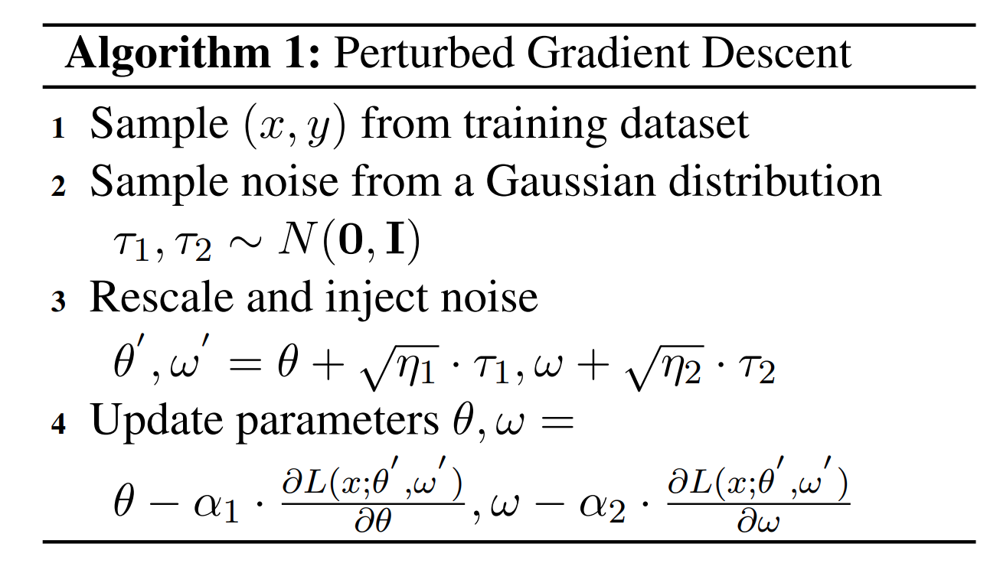
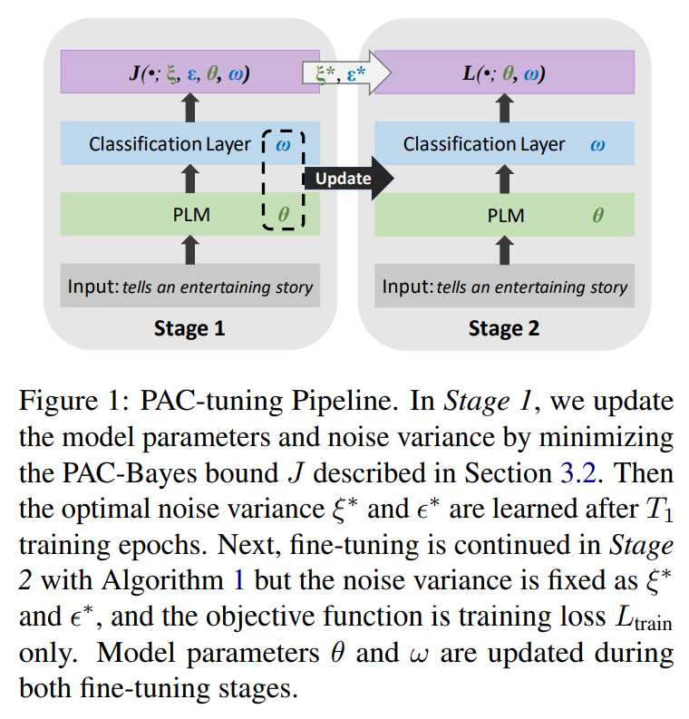
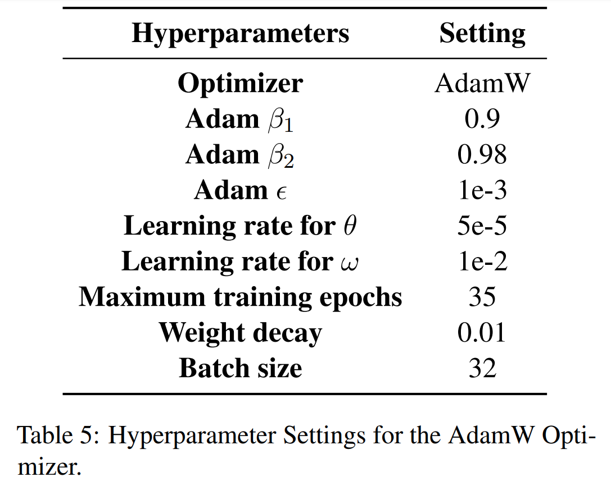
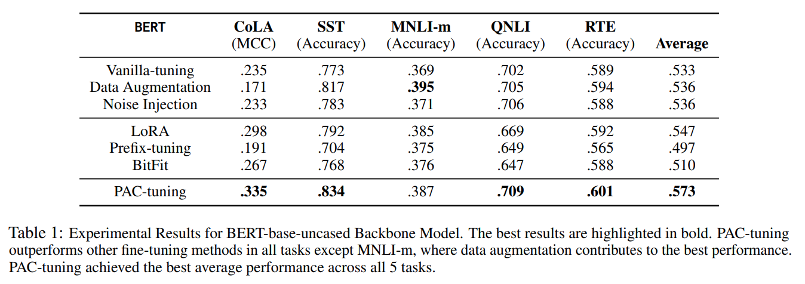
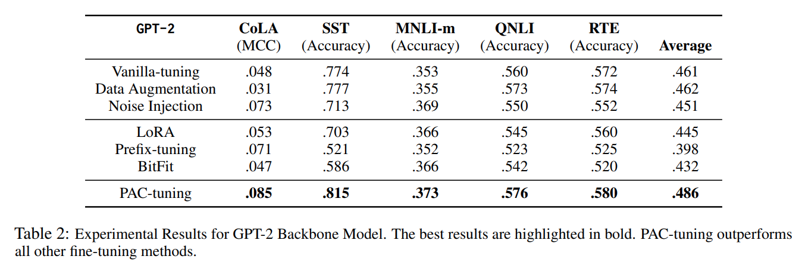
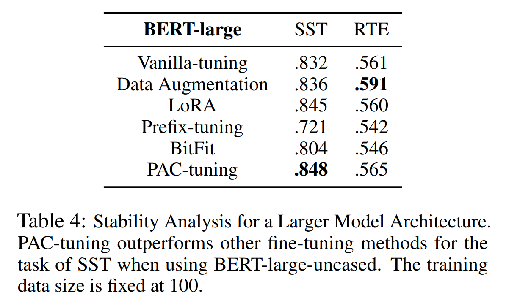
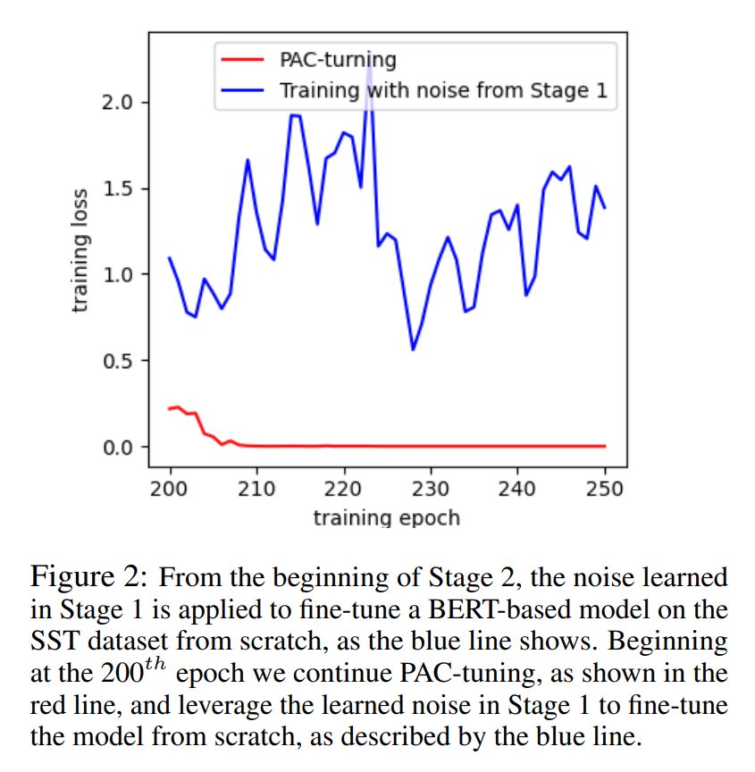
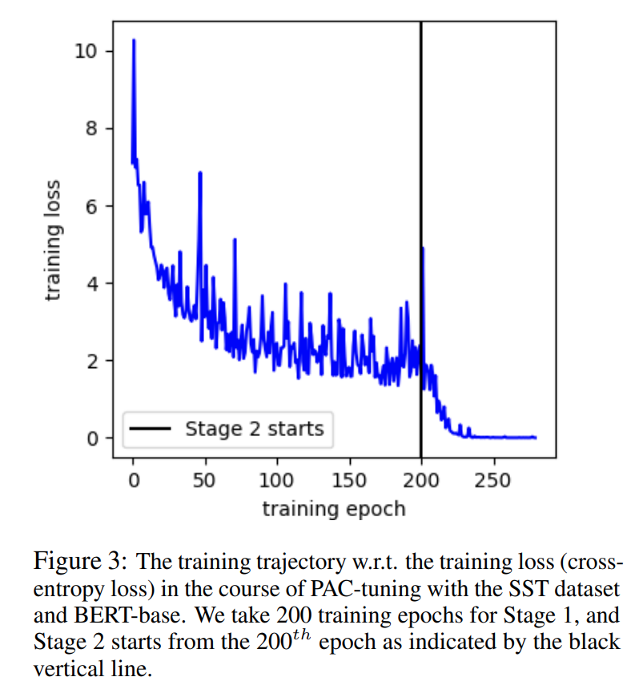

논문 및 이미지 출처 : <https://arxiv.org/pdf/2310.17588>

# Abstract

Pre-trained Language Models (PLMs)를 downstream task 에 맞게 fine-tuning 하는 것은 대규모 최적화 문제이며, 훈련 알고리즘의 선택이 모델이 unseen test data 에 대해 얼마나 잘 generalization 할 수 있는지를 결정하는 데 중요한 역할을 한다. 특히, few-shot learning 맥락에서 더욱 그렇다. 

good generalization performance 을 얻고 over-fitting 을 방지하기 위해 data augmentation 과 pruning 같은 기법이 자주 적용된다. 

그러나 이러한 regularizations 를 추가하면 Adam optimizer 와 같은 최적화 알고리즘의 hyper-parameter 를 세밀하게 조정해야 하는 부담이 따른다. 

본 논문에서는 이러한 optimization 문제를 해결하기 위해 two-stage fine-tuning 방법인 PAC-tuning 을 제안한다. 

- 먼저, PAC-Bayes training 을 기반으로 PAC-tuning 이 PAC-Bayes generalization bound 를 직접 minimizing 하여 적절한 parameter distribution 을 학습한다. 
- 두 번째로, training 중 model parameters 에 first-stage 의 learned variance 를 이용한 noise injecting 으로 gradient 를 수정하고, 결과적으로 perturbed gradient descent (PGD) 의 variant 를 만든다. 

과거에는 few-shot scenario 가 PAC-Bayes training 에 어려움을 주었는데, 이는 limited training data 로 large models 에 PAC-Bayes bound 를 적용하면 충분히 엄격하지 않을 수 있기 때문이다. 

저자의 5 GLUE benchmark task 에 대한 실험 결과는 PAC-tuning 이 fine-tuning task 의 도전 과제를 성공적으로 해결하며, strong baseline 들보다 명확한 차이로 우수한 성능을 보임을 보여준다. 

이는 현재 Adam optimizer 를 사용하는 다른 설정에도 PAC training 을 적용할 가능성을 추가로 확인시켜준다.

# 1. Introduction

Pre-trained Language Models (PLMs)인 BERT 와 GPT-3 의 등장 이후, 이러한 PLMs 의 fine-tuning 은 NLP 에서 사실상의 pipeline 이 되었으며, 다양한 task 에서 SOTA 성과를 달성하고 있다. 

fine-tuning 에는 크게 두 가지 접근법이 있다: parameter-tuning 과 prompt-tuning. 

- Parameter-tuning 은 PLM 을 feature extractor 로 간주하고 small learning step 을 통해 PLM 전체를 업데이트한다.
- 반면, prompt-tuning 은 downstream task 을 language modeling 의 objective 와 align 시키며, original samples 에 prompts 를 삽입하거나 task demonstrations 를 포함하거나 포함하지 않은 상태에서 PLM 이 prompted input context 를 기반으로 next token 을 예측하도록 한다.

few-shot learning 맥락에서, parameter 가 billions 에 이르는 neural model 에 대해 parameter-tuning 을 수행하는 것은 non-trivial task. 주요 도전 과제는 훈련 과정의 unstable 이다.

- Downstream task 에서 few samples 인 경우, PLM 의 overparameterization nature 은 overfitting 및 forgetting 문제를 초래한다. 
- 기존 방법은 주로 data augmentation, regularization, 그리고 network pruning 같은 기법을 적용하여 이러한 문제를 해결한다.
- 기계 학습 이론 관점에서, data augmentation, regularization, network pruning 모두 generalization enhancers 로 training 중 사용되는 기법이다.
- 잘 알려진 다른 generalization enhancers 로는 weight-decay 와 dropout 이 있다. 
- 다소 놀랍게도 learning rate 및 mini-batch size 의 선택 또한 generalization 에 영향을 미친다. 

NLP 커뮤니티에는 덜 알려진 enhancer 로 noise injection 이 있으며, 이는 Perturbed Gradient Descent (PGD) 알고리즘으로 구현된다.

- 이론적으로, PGD 는 spurious local minima 및 saddle points 을 벗어나도록 알고리즘을 효과적으로 돕는 것으로 나타났다.
- 이는 Hessian matrix 의 trace 에 대한 implicit regularization 덕분이다

본 논문에서는 generalization enhancers 의 optimal combination 을 탐색하는 대신, PAC-Bayes training 이라는 alternative training framework 를 따른다. 이 framework 는 generalization 을 개선하는 보다 직접적인 방법을 제공한다. 

- network 가 training loss 만 minimizing 하는 대신, PAC-Bayes bound 로 특징지어진 generalization error 를 직접 minimizing 하도록 훈련된다. 
- PAC-Bayes bound 는 학습 이론에서 classical bounds 로 여겨지지만, 이를 training 에 활용하는 것은 비교적 새로운 접근이다.
- 이는 PAC-Bayes bound 가 curse of dimensionality 를 겪어, 현대의 크고 깊은 neural networks 에 대해 효과적이지 않을 것이라는 우려 때문이다.
- 그러나 최근 연구는 이 관점이 지나치게 비관적일 수 있음을 보여주었으며, PAC-Bayes bound 가 modern convolutional neural networks 를 훈련하는 데 상당히 효과적일 수 있음을 밝혔다.

본 논문은 larger model, 즉 PLMs 에 대해 PAC-Bayes training 의 가능성을 탐구한다. 저자는 PAC-Bayes training 관점에서 가장 어려운 작업, 즉 fine-tuning 작업을 고려한다. 이는 millions parameter 를 가진 PLM 을 small training dataset 으로 tuning 함을 의미한다. 

이러한 설정에서, 저자는 PAC-Bayes training 의 novel efficient PAC-tuning 을 제안한다. 

- PAC-tuning 은 two-stage 로 구성된다. 
  1. PAC-Bayes upper bound 을 minimizing 하여 noise variance 를 학습하고 PLM 의 parameter 를 업데이트한다. 
  2. 이전 단계에서 학습된 noise variance 를 사용해 noise injection training 을 구현한다.
- 저자는 GLUE benchmark 에서 추출한 few-shot text classification task 를 통해 PAC-tuning 의 효과를 검증했다. 
  - PAC-tuning 의 전반적인 우수한 성능은 PAC-Bayes training 을 사용해 larger PLM 을 fine-tuning 하거나 심지어 pre-training 과정에서도 활용할 수 있는 가능성을 제시한다. 
  - PAC-tuning 은 PAC-Bayes training 을 통해 PLM fine-tuning 을 개선한 첫 번째 연구이다.

# 2. Related Works

#### Few-shot learning with PLMs

PLMs 를 활용한 few-shot learning 은 Zhang et al. (2020)에 의해 포괄적으로 연구되었으며, layer-wise learning 및 cross-entropy loss 의 instability 같은 다양한 요소의 영향을 이해하고, final generalization performance 를 개선하기 위한 기법을 추천하는 데 초점이 맞춰져 있다. 

- model parameters 의 업데이트가 필요한 fine-tuning 방법과 달리, 또 다른 연구 방향은 prompting-based methods 를 탐구한다: Prefix-tuning 이 대표적인 예이다. 
- few-shot task 에 대한 간단한 해결책은 data augmentation 을 통해 더 많은 데이터를 생성하는 것이다. 
- PLM 의 fine-tuning 에서 발생하는 forgetting issue 를 해결하기 위해, trust-region-based methods 는 각 업데이트 단계에서 parameter 의 변화를 제한하는 신뢰할 수 있는 영역을 정의한다. 
- PLM 의 lottery-ticket hypothesis 에 기반하여, PLM 의 sub-network 만 업데이트하는 parameter-tuning 방법도 제안되었다.

이러한 모든 방법은 generalization error 를 직접 optimizing 하기보단 training error 를 minimizing 하는 데 초점을 맞추며, 많은 hyper-parameter search  요구한다.

#### PAC-Bayes Training

**PAC-Bayes Training** 은 PAC-Bayes upper bound 를 minimizing 하여 머신 러닝 모델을 훈련하는 것을 의미한다. 

empirical risk minimization 와 달리, PAC-Bayes training 은 generalization error 의 upper bound 를 minimizing 함으로써 generalization 를 개선하는 보다 직접적인 접근법이다.

- McAllester (1998)는 MNIST dataset 에서 non-vacuous PAC-Bayes bound 를 minimizing 하여 stochastic neural network 을 training 했다.
- Rivasplata et al. (2019)가 제안한 BackProp 을 활용한 PAC-Bayes training 은 shallow probabilistic neural networks 를 훈련하고, PAC-Bayes bound 를 통해 MNIST dataset 에서 risk 를 인증했다. 
- Zhang et al. (2023)은 Auto-tune PAC 을 소개하며 ResNet 과 GNN 과 같은 다양한 neural networks 를 parameters 의 prior distribution variance 와 posterior distribution variance 를 optimizing 하여 훈련했다.
- Auto-tune PAC 은 ResNet34, DenseNet121, CIFAR-100 dataset 과 같은 larger dataset 과 large models 를 활용하며, 저자는 class 당 20 nodes 만 포함된 small dataset 에서 GNN 을 테스트했다. 

기존 연구는 pre-trained layers 및 adaptation layers 간의 신뢰도 차이를 간과했으며, 이것이 PLMs 에 적용되지 못하는 주요 이유였다. 

그러나 저자는 pre-trained layers 및 adaptation layers 각각에 대해 연관된 noise level 을 학습함으로써 이 신뢰도 차이를 고려한다.

#### Perturbed Gradient Descent (PGD)

**Perturbed Gradient Descent (PGD)** 는 Hessian matrix 의 trace 를 implicitly regularizing 하여 loss landscape 에서 larger flatness 영역으로 model 을 이동시키며, 이는 generalization 의 척도로 간주된다. 

- Zhou et al. (2019) 는 PGD 가 two-layer convolutional neural networks model 이 spurious local minimum 을 벗어나 global minimum 에 도달하도록 도울 수 있음을 증명했다.
- Jin et al. (2021) 또한 PGD 를 통해 neural networks model 이 second-order stationary points 에 도달하고 saddle points 을 피할 수 있음을 입증하며, 유사한 generalization-enhanced benefit 을 확인했다.

기존 PGD 연구는 모델에 isotropic noise 을 할당하여 training loss explosion 을 유발하지만, PAC-tuning 은 PLMs 에 parameter-wise noises 를 주입하여 이 문제를 회피한다.

# 3. Method

이 섹션에서는 PLM 의 parameter-based fine-tuning 을 위한 PAC-Bayes training 구현인 PAC-tuning 방법을 제안한다. 

- Sec. 3.2 에서는 PAC-Bayes training 과 PAC-Bayes bound 를 소개하며, 
- Sec. 3.3 에서는 perturbed gradient descent (PGD)을 설명한다.
- PAC-Bayes training 을 통해 PGD 를 지원하려는 동기는 Sec. 3.4 에 제시되며, 
- PAC-tuning 의 세부 내용은 Sec. 3.5 에서 설명한다.

## 3.1 Problem Setup and Notations

PLM 의 parameters 를 $\theta$ 로 두고, PLM 의 head layer 를 $\omega$ 로 매개변수화된 one-layer fully-connected neural networks 으로 교체한다. 

PLM classifier 를 $f$ 로 나타내며, 간단히 하기 위해 $\theta$ 와 $\omega$ 를 vector 로 간주한다. 

loss function $\ell(\cdot; \theta, \omega)$ 는 예를 들어 cross-entropy loss 와 같이 정의된다. 

individual sample 은 $(x, y)$ 로 표현되며, 여기서 $x$ 는 input data, $y$ 는 연관된 label 이다.

## 3.2 PAC-Bayes Training and the PAC-Bayes Bound

PAC-Bayes training 은 다음과 같은 형태의 PAC-Bayes bound $J(\theta, \mathcal{Q}, \mathcal{P}) \equiv L_{\text{train}} + L_{\text{PAC}}$ 를 minimizing 하는데 비롯된다:

$$
\underbrace{\mathbb{E}_{\theta \sim \mathcal{Q}} \mathbb{E}_{(x, y) \sim \mathcal{D}} \ell(x, y; \theta)}_{\text{generalization error}} 
\leq 
\underbrace{\frac{1}{m} \sum_{i=1}^m \mathbb{E}_{\theta \sim \mathcal{Q}} \ell(x_i, y_i; \theta)}_{\text{$L_{\text{train}}$}} 
+ 
\underbrace{\sqrt{\frac{\log \frac{1}{\delta} + \text{KL}(\mathcal{Q} || \mathcal{P})}{2m}}}_{\text{$L_{\text{PAC}}$}}.
$$

- PAC-Bayes bounds 는 high probabilities (i.e., $1 - \delta$, 여기서 $\delta$ 는 upper bound 이 성립하지 않을 확률)로 성립하는 probabilistic bounds 이며, 모든 neural networks 유형에 대해 적용 가능하다. 
- 이는 trained model 의 generalization error 를 특성화한다. 
- $\theta$ : neural networks 의 weight
- $m$ : training samples 수
- $\mathcal{Q}$ 와 $\mathcal{P}$ : prior 및 posterior distributions 의 임의의 쌍
- $\text{KL}$ : two sdistributions 간의 distance 를 측정하는 Kullback–Leibler divergence
- $\mathcal{D}$ : training data distribution
- PAC-Bayes bound 가 nonvacuous 할 때, bound 를 minimizing 하면 generalization error 가 효과적으로 감소한다.

최근 연구 에선 $\mathcal{Q}$ 와 $\mathcal{P}$ 를 multivariate Gaussian distributions 로 설정했을 때 $J(\theta, \mathcal{Q}, \mathcal{P})$ 의 minimizer 를 찾는 optimization algorithms 이 제안되었다. 이는 model $\theta$ 의 각 parameter 에 대한 confidence levels 를 반영하는 optimal noise levels ($\mathcal{Q}$ 의 variance)을 학습하는 자동적인 방법을 제공한다.

## 3.3 Noise Injection and Perturbed Gradient Descent (PGD)

$L_{\text{PAC}}$ 의 KL term 은 두 가지 문제를 겪을 수 있다: (1) 계산이 어려울 수 있고, (2) training loss 가 0 에 가까워지지 못하도록 너무 크게 작용할 수 있다. 

따라서 PAC-Bayes bound 에서 $L_{\text{PAC}}$ term 을 무시하고 단순히 $L_{\text{train}}$ 을 minimizing 하는 것이 일반적인 관행이다. 

가장 간단한 경우, mean $\theta$ 와 noise level $\eta$ 를 가지는 isotropic Gaussian noise $N(\theta, \eta I)$ 를 posterior distribution 로 사용하면 $L_{\text{train}}$ 은 다음과 같이 줄어든다:

$$
\begin{equation}
  L_{\text{train}} = \frac{1}{m} \sum_{i=1}^m \mathbb{E}_{\tau \sim N(0, I)} \ell(x_i, y_i, \theta + \eta \tau)
\end{equation}
$$

이는 model parameters 에 noise injection 상태에서의 original training loss 로 해석될 수 있으며, 저자의 목표는 해당 expectation 을 minimizing 하는 것이다.

$L_{\text{train}}$ 을 minimizing 하는 알고리즘은 **Perturbed Gradient Descent (PGD)**라 하며, gradient 계산 전에 model 에 random noise 를 주입하고, gradient update 후 injected noise 를 제거한다.

**Algorithm 1** 은 PLM 에 _Perturbed Gradient Descent_ 를 적용하는 방법을 설명한다. 

- 구체적으로, line 2 에서 $\tau_1$ 과 $\tau_2$ 는 각각 $\theta$ 와 $\omega$ 와 동일한 dimension 을 가진 standard Gaussian distribution 에서 sampling 된다 (confidence difference 에 관한 내용은 Sec 3.5 를 참조). 
- 다음으로 sampled noises 는 $\eta_1$ 과 $\eta_2$ 로 rescale 되어 PLM $f$ 의 parameter 에 주입되어, line 3 에서 $\theta'$ 와 $\omega'$ 라는 noise 가 포함된 parameter 가 생성된다. 
- 이후, line 4 에 나타난 대로 learning rate $\alpha_1$ 과 $\alpha_2$ 를 사용해 perturbed gradient 에 따라 parameter 가 업데이트된다.

## 3.4 The Noise Level

앞서 $L_{\text{train}}$ 이 model 에 noise injection 과 같다고 설명했다. 이제 proposed algorithm 이 noise distribution 을 자동으로 감지할 수 있는 직관을 제공한다.

- 모델에 noise 를 도입하면 training loss $L_{\text{train}}$ 은 증가할 것으로 예상된다. 
- injected noise 양이 클수록 $L_{\text{train}}$ 의 증가량도 커진다. 
  - 즉, $L_{\text{train}}$ 은 일반적으로 noise level 의 increasing function 이다.
  - 따라서 $L_{\text{train}}$ 만 minimizing 하면, optimal noise distribution 은 단순히 0 이 될 것이다. 
- 그러나 proposed algorithm 이 0 이 아닌 의미 있는 noise 를 학습할 수 있는 이유는 loss 의 second term 인 $L_{\text{PAC}}$ 의 존재 때문이다. 
  - $L_{\text{PAC}}$ 는 noise 가 prior distribution 으로 수렴할 때 noise level 의 decreasing function 이다. 
  - 결과적으로 $L_{\text{train}} + L_{\text{PAC}}$ 의 total loss 를 minimizing 하면 optimal noise level 을 찾을 수 있으며, 이를 통해 noise 를 자동으로 학습할 수 있다. 

이것이 제안된 PAC-tuning 알고리즘의 기본 아이디어이다.

- training 완료 후 learned noise levels 는 model interpretation/validation 에 사용할 수 있다. 이는 각 model parameters 가 최종 성능에 얼마나 중요한지를 반영한다. 
  - 예로, trained model parameters 가 $(1, 1, 1)$ 이고 PAC-training 에 의한 learned noise level 이 $(10, 1, 10)$ 이라면, second model parameters 는 first 와 third 보다 더 중요하다는 것을 나타낸다. 
  - 이는 second model parameter 에 연관된 noise injection level 이 낮기 때문이다.

## 3.5 PAC-tuning

기존 PAC-Bayes training  연구는 neural networks 의 one-time training 만을 대상으로 했다. 

그러나 fine-tuning 에서는 model 을 second time training 을 하며, 따라서 pre-trained part 가 second round 에서 less update 되기를 기대한다. 

- 즉, PLM 이 이미 충분히 정확하다고 가정하므로 $\theta$ 는 크게 변하지 않아야 하며, 일반적으로 $\theta$ 를 업데이트하는 데 small learning rate 를 사용한다. 
- 반대로, $\omega$ 는 less confident 이므로 larger learning rate 를 사용해야 한다. 

이를 **confidence difference issue** 라 부른다. 

Sec 3.4 에서 설명했듯이 noise level 은 target parameters 에 대한 confidence 를 반영하므로, $\theta$ 와 $\omega$ 에 대해 different noise level 과 learning rate 를 사용하는 것이 합리적이다. 

결과적으로 $L_{\text{PAC}}$ 의 KL term 은 two parts 로 구성된다:

$$
\text{KL}(\mathcal{Q}_\omega || \mathcal{P}_\omega) + \text{KL}(\mathcal{Q}_\theta || \mathcal{P}_\theta)
$$

extremely large models 경우 이 KL divergences 를 작게 유지하기 위해 Zhang et al. (2023)에서 제안된 PAC-Bayes bound 를 활용한다.

이는 Sec 3.2 에서 설명한 기본 PAC-Bayes bound $J(\theta, \mathcal{P}, \mathcal{Q})$ 의 variants 이다. 

단순화를 위해 prior distribution variance 의 learnable parameters (e.g., $\lambda$ 와 $\beta$)를 생략하고, 우리가 minimizing 하려는 final objective function $J(\cdot; \xi, \epsilon, \theta, \omega)$ 는 다음과 같다:

$$
J(D; \xi, \epsilon, \theta, \omega) = 
\underbrace{\frac{1}{m} \sum_{i}^m \ell(x_i, y_i; \theta, \omega)}_{L_{\text{train}}} + 
\underbrace{\frac{(\ln \frac{1}{\delta} + \text{KL}(\mathcal{Q}^\theta_\xi || \mathcal{P}^\theta_\lambda) + \text{KL}(\mathcal{Q}^\omega_\epsilon || \mathcal{P}^\omega_\beta))}{\gamma m} + \gamma K^2}_{L_{\text{PAC}}}
$$

- $\xi$ 와 $\epsilon$ : 각각 $\theta$ 와 $\omega$ 에 연관된 posterior distribution variance
- $D = \{(x_i, y_i)\}_{i=1}^m$ : training dataset
- $\delta \in (0, 1)$ : failure probability
- $\gamma$ : 사용자가 지정한 bounded $[\gamma_1, \gamma_2]$ 내의 값으로 설정 가능
- $K(\lambda, \beta, \gamma_1, \gamma_2) > 0$ : ($\theta$, $\omega$) 의 prior variances 가 ($\lambda$, $\beta$) 로 설정되었을 때 training loss $\ell$ 의 effective variance
- $\gamma$ 및 $K$ 에 대한 더 자세한 것은 Zhang et al. (2023) 의 Sec. 4 참조

이 objective functions 는 다음 가정을 기반으로 한다:

1. PLM classifier 의 prior distributions : $\mathcal{P}^\theta_\lambda = N(\theta_0, \lambda I)$ 및 $P\mathcal{P}^\omega_\beta = N(\omega_0, \beta I)$ (여기서 $\theta_0$, $\omega_0$ 는 initialized parameter weights).
2. 각 gradient update step $t$ 에서 PLM classifier 의 posterior distribution : $\mathcal{Q}^\theta_\xi = \theta_t + N(0, \text{diag}(\xi))$ 및 $\mathcal{Q}^\omega_\epsilon = \omega_t + N(0, \text{diag}(\epsilon))$ (여기서 $\theta_t 및 $\omega_t$ 는 gradient update step $t$ 에 대한 current parameter weights)

PAC-tuning 기술의 pipeline 은 Fig. 1 에 나타나 있다. 구현은 two-stage 로 구성된다.

1. **Stage 1** : $T_1$ epochs 에 걸쳐 $J$ 를 minimizing 하여 optimal noise distribution $\xi^*$ 와 $\epsilon^*$, 그리고 model parameters $\theta$ 와 $\omega$ 를 업데이트한다.
2. **Stage 2** : $\theta$ 와 $\omega$ 업데이트를 위해 fixed noise levels $\xi^*$ 및 $\epsilon^*$ 을 사용해 PLM 에 PGD 를 적용한다 (Algorithm 1).
- 두 stages 로 구성된 fine-tuning 이 필요한 이유는 $J$ 를 minimizing 만으로는 $L_\text{PAC}$ term 의 존재로 인해 PLM 이 downstream data 를 잘 적합하지 못하기 때문이다.
- Stage 2 는 $L_{\text{PAC}}$ term 이 제거되므로, PLM classifier 가 downstream daata 에 더 잘 적합시킬 수 있음

**Stage 1** 의 목표는 posterior variance $\xi$ 및 $\epsilon$ 을 추정하고 model parameters 를 업데이트하는 것이다:

$$
\xi^*, \epsilon^*, \theta^*, \omega^* = \argmin_{\xi, \epsilon, \theta, \omega} J(D; \xi, \epsilon, \theta, \omega)
$$

- $\theta$ 가 $\omega$ 보다 더 신뢰할 수 있음을 반영하기 위해, $\xi$ 를 $\epsilon$ 보다 작게 초기화한다. 
- 동시에, $\theta$ 에 smaller, $\omega$ 에는 larger learning rate 를 사용하는 관례를 따른다. 
- $\theta$ 의 small learning rate 는 corresponding noise $\xi$ 에 대한 gradient 를 작게 만들므로, 이를 상쇄하기 위해 $\xi$ 에 larger learning rate 가 필요하다.  
- 또한, dropout 은 model parameter 에 extra noise 를 도입하며, 이는 제안된 방법의 noise injection 과 충돌을 일으킨다. PAC-tuning 을 효과적으로 사용하려면 dropout 을 비활성화해야 한다.  

learned posterior variance 를 바탕으로, **Stage 2** 는 PGD 를 통해 $\theta$ 와 $\omega$ 의 fine-tuning 을 계속 진행한다. 

각 gradient update 에서 $\tau_1$ 과 $\tau_2$ 를 standard normal distribution 에서 sampling 하고, 이를 **Stage 1** 에서 학습된 noise variance ($\xi^*$ 와 $\epsilon^*$)으로 곱하여 **Algorithm 1** 의 line 3 을 다음과 같이 대체한다:

$$
\begin{align*}
  \theta' = \theta + \sqrt{\xi^*} \cdot \tau_1, \\
  \omega' = \omega + \sqrt{\epsilon^*} \cdot \tau_2
\end{align*}
$$

# 4. Experiments and Analysis

이 섹션에서는 실험 설정, dataset, 평가에 사용된 기준 모델을 설명한다. 

Sec. 4.4 에서는 실험 결과를 논의하며, Sec. 4.5 에서는 PAC-tuning 접근법의 안정성에 대한 분석으로 결론을 맺는다.

## 4.1 Experimental Settings

저자는 GLUE 벤치마크의 5 text classification task 에서 PAC-tuning 과 기준 PLMs 에 대해 광범위한 실험을 수행한다. 

세부 결과는 Tabs. 1 과 2 에 제시되어 있다. 

- backbone 으로 HuggingFace 의 BERT 와 GPT-2 구현을 사용하며, classification layer 로 one fully-connected layer 를 추가했다.
- few-shot learning scenario 를 시뮬레이션하기 위해, original training set 에서 randomly sampled 100 을 추출하고 whole development set 을 사용해 classification performance 를 평가했다.
- 모든 실험은 5 times 반복되어, original dev set 에 대해 5 seeds 에서 평균 성능을 보고
- 모든 model architecture 는 동일한 hyper-parameter 와 optimizer 를 사용하되, PAC-tuning 에서의 training epochs 는 제외되었다(Appendix A 의 Tab. 5 참조).
- embedding 및 관련 parameters 는 고정하며, fine-tuning 중에 업데이트하지 않는다.

---

- PAC-tuning 구현에서는 PLM 관련 variances $\xi$ 와 $\lambda$ 의 learning rate 를 0.1 로 설정
- classification layer 의 variance $\epsilon$ 과 $\beta$ 의 learning rate 는 0.5 로 초기화하며, 10 gradient updates 마다 90% 로 감소시켜 최소 0.01 에 도달하도록 한다. 
- SST 와 CoLA task 의 경우 loss interval $\gamma$ 를 10 으로 설정하고, 나머지 task 에서는 5 를 사용했다.
- PAC-tuning 의 Stage 1 은 250 epochs 동안 실행되며 maximum training epoch 은 300
- 그러나 Stage 1 의 convergence 는 task 의 난이도에 따라 달라진다. 
  - SST task 의 경우, Stage 1 에서 100 epochs 만으로도 수렴할 수 있지만, 본 논문에서 보고된 모든 실험에는 250 epochs 가 충분하다.

## 4.2 Dataset

제안된 fine-tuning 방법을 검증하기 위해 GLUE 벤치마크의 5 개 task 을 사용했다:

- **Corpus of Linguistic Acceptability (CoLA)**: 문법적 수용성 평가.
- **Stanford Sentiment Treebank (SST)**: 감정 분석.
- **MultiNLI Matched (MNLI-m)와 MultiNLI Mismatched (MNLI-mm)**: 텍스트 간의 자연어 추론.
- **Question NLI (QNLI)**: 질문 응답 관련성.
- **Recognizing Textual Entailment (RTE)**: 텍스트 포함 관계 인식.

## **4.3 Baseline Methods**

다음 기준 방법들은 현재 일반적인 fine-tuning 접근법을 나타낸다:

- **Vanilla-tuning** : add-on regularization 없이 basic parameter-tuning 을 수행하는 방식.
- **Data Augmentation** : BackTranslation 을 사용해 augmented data quality 를 제어하며 구현.
  - BackTranslation 은 model-based augmentation 으로, 먼저 sequence 를 다른 언어로 번역한 후 original language 로 다시 번역한다. 
  - sampled training data 및 augmented data 를 결합해 training set 을 구성한다. 
  - MNLI-m, QNLI, RTE 와 같은 쌍으로 이루어진 입력이 있는 task 에서는 각 training sample 에 대해 two augemnted samples 를 생성한다.
    - 하나는 입력의 첫 번째 부분을, 다른 하나는 두 번째 부분을 사용해 생성한다. 
  - SST 와 CoLA 에서는 BackTranslation 을 사용해 하나의 증강 샘플만 생성한다.
- **Noise Injection** (Orvieto et al., 2023) : gradient update 마다 randomly selected layer ㄹ에 noise 를 주입하여 loss variance 를 방지하고 overparameterized models 에 explicit regularization 을 효과적으로 구현.
- **Low-Rank Adaptation (LoRA)** : model weight matrix 에 대한 low-rank approximations 를 활용해 PLM fine-tuning 의 효율성을 높이고 specific task 또는 domain 에 adapting.
  - low-rank adaptation matrix 는 pre-trained trained model 에서 학습되었지만 강조되지 않은 중요한 특징을 증폭하여 adaptation process 을 효율적으로 만들고 downstream task 에 대한 over-fitting 을 완화한다.
- **Prefix-tuning** : input sequence 시작 부분에 추가된 continuous task-specific vector(prefix)를 최적화하며, PLM parameter 는 고정 상태로 유지.
  - PLM fine-tuning 의 효율적이고 효과적인 접근법을 제공.
- **BitFit** : PLM 의 bias terms 만 최적화하는 subnetwork fine-tuning 방법. 
  - model parameters 의 특정 부분만 타겟팅하여 PLM 전체를 fine-tuning 하는 성능을 제공하며, 특히 smaller training dataset 에 효과적이다.

## 4.4 Experimental Results

Tabs. 1 및 2 는 BERT 와 GPT-2 backbone PLMs 를 사용했을 때, 제안된 PAC-tuning 접근법과 다른 fine-tuning 방법을 비교한 실험 결과를 보여준다. 

- first column 에 fine-tuning 방법이 나열되어 있다.
  - 세 가지 기법 (vanilla-tuning, data augmentation, noise injection) 은 parameter-based fine-tuning (parameter-tuning) 방법의 사례이다. 
  - 다음 두 기법 (LoRA 와 prefix-tuning)은 parameter-efficiqent fine-tuning 의 예이다. 
- 이후 5 columns 는 각각의 GLUE benchmark task 에 해당한다. 각 task 에 대한 결과는 accuracy 로 보고되며, CoLA task 은 Matthew’s correlation coefficient (MCC) 를 사용한다.
- last column 은 all task 에 대한 각 fine-tuning 접근법의 평균 결과를 나타낸다.

전반적으로, PAC-tuning 은 두 PLMs 모두에서 가장 높은 평균 성능을 달성했지만, BERT-base backbone 을 사용하는 MNLI-m task 에서는 가장 좋은 fine-tuning 접근법이 아니다.

parameter-based fine-tuning 방법의 평균 성능이 parameter-efficient fine-tuning 방법보다 우수하지만, LoRA 는 Tab. 1 에서 second best 인 fine-tuning 방법이다.

이 실험 결과는 PAC-tuning 을 활용하여 PLMs 를 downstream task 에 fine-tuning 하는 데 있어 미래 연구의 지원 증거를 제공한다.

- Tab. 1 에서 BERT backbone 을 사용할 경우, CoLA 와 SST task 에서 PAC-tuning 의 성능은 다른 fine-tuning 기준을 크게 초과한다. 
- QNLI 와 RTE task 에서의 성능 향상은 다소 작지만 여전히 유의미하다. 
- 그러나 MNLI-m task 에서는 PAC-tuning 이 data augmentation 과 parameter-efficient fine-tuning 방법보다 성능이 낮다. 
- data augmentation-based fine-tuning 은 MNLI-m task 에서 가장 좋은 방법이며, SST, QNLI, RTE task 에서는 second 및 third best. 
- 그러나 CoLA task 에서는 vanilla-tuning 보다 성능이 떨어진다. 
- data augmentation 은 5 task 전반에 걸쳐 안정적인 성능 면에서 second best 로, low-resource setting 에서 data augmentation 효과를 보여준다.

- Tab. 2 에 따르면, GPT-2 기반 fine-tuning 방법의 전반적인 성능은 특히 CoLA task 에서 BERT 기반 fine-tuning 보다 낮다.
- 이는 이전 연구 결과 와 일치한다. 그러나 PAC-tuning 을 추가하면 fine-tuning 성능이 향상되며, 본 방법은 모든 task 에서 가장 좋은 fine-tuning 접근법이다. all fine-tuning 방법은 BERT backbone 에서와 유사한 성능 추세를 보여준다.

PAC-tuning 의 전반적인 우수한 성능은 PLMs 를 few-shot text classification task 에 fine-tuning 하는 데 있어 실용적이고 유용함을 증명한다. 

이 전형적인 응용 시나리오는 PAC-Bayes training 을 적용하는 데 두 가지 주요 과제를 제시한다: larger model size 와 smaller data size. 이는 일반적으로 vacuous bound 를 초래하여 PAC-Bayes training 을 실용적으로 사용하는 것을 방해한다. 

PAC-tuning 의 결과는 PAC-Bayes training 이 이전에는 고려되지 않았던 PLMs 와 같은 very large model 에서도 사용할 수 있음을 보여준다.

## 4.5 Stability Analysis

PAC-Bayes bound 는 data size 와 관련된 term 을 포함하며, KL-divergence term 은 model size 와 연관되어 있다. 따라서, PAC-tuning 의 성능이 다양한 data size 와 model size 에서 어떻게 변화하는지를 분석하기 위해 철저한 실험을 수행했다. 

Tab. 3 은 SST 와 RTE task 에 대해 BERT 기반 fine-tuning 방법의 성능을 훈련 dataset size 50 과 20 으로 나타낸다. 

- training dataset 은 SST 와 RTE 의 training set 에서 randomly sampling
- training data size 가 20 으로 감소하면 PAC-tuning 의 성능은 prefix-tuning 보다 약간 낮아진다. 
- RTE 의 test data size 가 작은 점을 고려할 때, prefix-tuning 과 PAC-tuning 간의 성능 차이는 두 방법이 매우 유사한 generalization 성능을 가진다는 것을 의미한다.

Tab. 4 는 BERT-large-uncased model 을 backbone 으로 사용하여 SST 와 RTE task 에 대해 fine-tuning 방법을 고려한 분류 결과를 보여준다.

- larger model 을 사용할 경우, all fine-tuning 방법은 두 task 에서 성능이 향상되었다. 
- PAC-tuning 은 SST task 에서 가장 우수한 방법이며, RTE task 에서는 data augmentation 이 모든 방법을 능가하며 PAC-tuning 이 second best 이다.
- Sec. 4.4 의 주요 실험 결과와 함께 보면, 이러한 안정성 테스트는 PAC-Bayes training 을 활용한 PAC-tuning 이 small training data 와 extremly large pre-trained model 이라는 도전적인 환경에서 PLMs 를 fine-tuning 하는 데 유용함을 추가로 검증한다.

# 5. Discussion

## 5.1 The Role of Stage 1

Stage 1 은 Stage 2 에서 사용될 noise distribution 을 학습하고, Stage 2 에 적합한 초기화 상태로 모델을 준비한다. 

Fig. 2 는 Stage 2 를 Stage 1 에서 학습된 모델이 아닌, initial pretrained model 에서 시작하면 Stage 2 의 PGD steps 가 수렴하지 못한다는 것을 보여준다. 

- 이는 noise injection level 과 Stage 1 에서 학습된 initialization 가 Stage 2 의 성공에 중요함을 의미하며, PAC-tuning 접근법에서 Stage 1 의 역할을 잘 보여준다

## 5.2 The Necessity of Stage 2

PAC-tuning 에서 Stage 2 의 필요성을 경험적으로 검증하기 위해, SST dataset 에서 PAC-tuning 을 실행하고 fine-tuning 과정에서 training loss 이 어떻게 변화하는지 검증했다. 

- Fig. 3 에서 볼 수 있듯이, Stage 1 (200 epochs end) 에서 training loss 은 약 1.5 에서 정체되어 데이터에 적합하지 않은 상태로 남아 있음을 나타낸다.
- 이는 objective function 에서 $L_{\text{PAC}}$ term 의 존재가 $L_{\text{train}}$ 을 더 이상 감소시키는 것을 방지하기 때문이다.
- Stage 2 가 시작되면 모델이 데이터를 빠르게 적합시키고 training loss 은 거의 0 에 도달한다. 
- two-stage training schema 에 대한 추가 논의는 **Appendix B** 에서 확인할 수 있다.

# 6. Advice for Applying PAC-tuning

이 섹션에서는 PAC-tuning 을 사용할 때의 권장 사항을 공유한다. 

PAC-tuning 의 training process 는 기존 fine-tuning process 와 다르므로 다음 사항을 참고해야 한다.

- Stage 1 의 목표는 $L_{\text{train}} + L_{\text{PAC}}$ 를 minimizing 하는 것이며, 이는 단순 training loss 보다 더 큰 값이다. 
  - 따라서 사용자는 training loss 에서 large decrease 를 관찰하지 못할 수도 있다. 
  - 그러나 total loss 가 감소하고 있다면 PAC-tuning 이 올바르게 진행되고 있는 것이다.
- noise variances 는 non-negative 이므로, 저자는 $\exp(2p)$ 를 사용해 이를 modeling 하며, 여기서 $p$ 는 trainable parameter 다.
  - 또한, initial weights 를 사용해 standard deviation 을 초기화한다. 
  - 구체적으로, $p$ 는 initial weights 의 log magnitude 로 초기화된다.
- Stage 1 의 상태를 확인하는 효과적인 방법은 posterior variance 의 mean value 를 확인하는 것이다. 
  - mean value 가 변하지 않는다면 learning rate 를 높이거나 PLM 의 learning rate 를 높여야 한다.
- prior variance parameters 는 쉽게 수렴하며, learning rate 에 덜 민감하다. 따라서 초기에는 large learning rate 로 시작하고 점차 줄이는 것이 좋다.
  - posterior variance 의 learning rate 는 gradient 가 매우 작기 때문에, large learning rate 를 사용하는 것이 좋다.

# 7. Conclusions and Future Work

본 논문에서는 few-shot text classification 을 위한 PLM fine-tuning 방법인 PAC-tuning 을 제안했다. PAC-tuning 은 PAC-Bayes training 과 perturbed gradient descent (PGD)을 기반으로 한다. 

- 저자는 larger models 및 smaller training data 를 사용하는 도전적인 환경에서 PAC-tuning 을 활용했으며, 이는 일반적으로 PAC-Bayes training 을 통한 generalization 개선의 두 가지 주요 장애물로 간주된다. 
- 5 GLUE benchmark task 에 대한 광범위한 실험을 통해 PAC-tuning 의 성능이 다른 fine-tuning 방법에 비해 경쟁력 있으며, model size 및 training data size 에 대해 더 안정적임을 관찰했다.
- PAC-tuning 은 여러 측면에서 확장 가능하다. 
- larger model 에서 PAC-tuning 의 효과를 완전히 탐구하기 위해 추가적인 검증이 필요하다. 
- 또한 PAC-tuning 을 data augmentation 같은 다른 fine-tuning 기술과 결합하는 것도 흥미로울 것이다. 
- 마지막으로, PAC-tuning 의 성능은 Stage 1 의 수렴에 크게 좌우되므로 Stage 1 을 빠르고 견고하게 수렴시키는 방법을 탐구하는 추가 연구가 필요하다.

저자의 실험 결과는 PAC-tuning 의 유용성과 generalization 관점에서 NLP 문제를 고려할 잠재력을 보여주며, 이는 NLP 커뮤니티에서 덜 탐구된 PLM 최적화 접근법이다.

# 8. Limitations

본 논문에서는 제안된 PAC-tuning 방법의 효과를 경험적으로 검증했지만, 여전히 개선의 여지가 있다. 

특히, GPU 하드웨어 접근성의 제한으로 인해 full-batch gradient update 를 사용한 PAC-tuning 의 개선 가능성을 검증하지 못했다. 

이와 관련하여 optimal hyper-parameter 를 철저히 탐색하지는 않았으며, 모든 실험에서 공정성을 보장하기 위해 일반적인 learning rate 과 batch size 를 사용했다.

보고된 성능이 최상의 성능이 아닐 가능성도 있다. BERT 와 GPT-2 는 최신 언어 모델이 아니며, 현재 널리 사용되는 large language model 에 비해 작다. 따라서 GPT-4 와 같은 폐쇄적이지만 strong model 을 포함하여 larger models 에서 추가 실험이 필요하다. 

또한, PAC-tuning 과 prompt-based approach 를 비교 검증하기 위해 ChatGPT 와 BARD 와 같은 모델에 대한 실험도 반복적으로 수행해야 한다.

# Appendix B Two-stage Approach

대부분의 PAC-Bayes training 방법은 일반적으로 single-stage approach 에 의존한다. 그러나 이러한 방법은 제한된 적용성을 가지며, 주로 bounded loss functions 와 shallow networks 만 효과적으로 처리할 수 있다. 또한 noise prior 를 최적화하는 데 어려움을 겪어 최종 성능이 최적화되지 않는다.

다른 PAC-Bayes training 연구 중 두 단계를 사용한 사례는 **Dziugaite and Roy (2017b)** 의 연구가 있다. 이 연구는 첫 번째 단계에서 model prior 을 학습하고, 두 번째 단계에서 model posterior 를 학습하는 두 단계 훈련 프로세스를 제안했다. 그러나 Dziugaite and Roy (2017b)의 방법은 두 단계를 사용했음에도 불구하고, text classification task 에서 흔히 사용되는 cross-entropy loss 과 같은 unbounded loss functions 를 처리하는 데 여전히 어려움을 겪는다. 게다가 이 방법은 상당한 훈련 시간이 요구된다.  

현재까지, 이 연구 이전에는 복잡한 아키텍처(e.g., transformers)를 대상으로 하는 경우, 어떤 인기 있는 작업에서도 기준 방법을 능가하는 PAC-Bayes 훈련 방법이 없었다.

PAC-tuning 의 Stage 1 에서 training epochs 가 늘어나는 주된 이유는 모델과 노이즈를 모두 효과적으로 학습할 필요성 때문이다. PAC-Bayes training 방법 중 이러한 측면을 최적화하는 모든 방법은 일반적으로 more training epochs 가 필요하다. 이는 실행 시간이 길어지는 결과를 초래하지만, learned noise 는 모델 보정(calibration)을 향상시키고 pruning 를 지원하는 데 중요한 이점을 제공한다.