이미지 및 논문 출처 : <https://arxiv.org/pdf/2506.05191v1>

# Abstract

이 논문에서는 현재의 대부분의 efficient multimodal fine-tuning 방법들이 하나의 핵심적 한계에 의해 제약을 받고 있음을 밝힌다. 즉, 이러한 방법들은 LLMs 로부터 직접 차용된 경우가 많아, multimodal 시나리오의 본질적 차이를 무시하거나 심지어 모든 modality 의 완전한 활용을 방해하기도 한다. 

저자의 경험적 관찰에 기반하여, 저자는 unimodal adaptation 과 cross-modal adaptation 이 MLLMs 의 효과적인 fine-tuning 을 위해 필수적인 두 가지 요소라고 주장한다. 이러한 관점에서, 저자는 multimodal 특성을 고려한 efficient fine-tuning 전략인 **Multimodal low-rank Adaptation (MokA)** 를 제안한다. MokA 는 modality-specific parameters 를 통해 unimodal information 을 압축하는 동시에 cross-modal interaction 을 명시적으로 강화하여, unimodal 과 cross-modal adaptation 을 모두 보장한다.

광범위한 실험은 세 가지 대표적인 multimodal 시나리오 (audio-visual-text, visual-text, speech-text) 와 여러 LLM backbones (LLaMA2/3, Qwen2, Qwen2.5-VL 등) 을 포함한다. 일관된 성능 향상은 제안된 방법의 효율성과 범용성을 보여준다. 또한 ablation study 와 efficiency evaluation 을 수행하여 방법을 충분히 평가한다. 전체적으로 MokA 는 MLLMs 의 efficient adaptation 을 위한 보다 구체적이고 목표 지향적인 해법을 제공하며, 향후 연구 확장의 가능성을 제시한다.

# 1 Introduction

Large language models (LLMs) 는 뛰어난 이해 및 생성 능력으로 인해 큰 주목을 받고 있다. 이러한 능력을 보다 일반적인 multimodal 시나리오로 확장하기 위해, 최근 Multimodal Large Language Models (MLLMs) 의 발전은 이미지와 같은 다른 modality 를 text token 과 정렬하여 LLMs 이 다른 modality 의 내용을 해석하고 처리할 수 있도록 하는 데 초점을 맞추고 있다. 그러나 LLMs 의 막대한 parameter 규모로 인해 이러한 모델을 downstream task 에 대해 완전히 fine-tuning 하는 것은 대부분의 경우 계산적으로 불가능하며 비효율적이다.

이에 대한 유망한 방향으로, 전체 모델이 아닌 parameter 의 일부만 선택적으로 업데이트하는 LLM fine-tuning 방법이 제안되었다. 이러한 Parameter-Efficient Fine-Tuning (PEFT) 전략은 널리 채택되었으며, MLLMs 의 fine-tuning 에도 성공적으로 확장되었다. 특히, LoRA 와 그 변형들은 over-parameterized model 이 실제로는 low intrinsic dimension 에 존재한다는 가정에 기반하며, 다양한 연구에서 강력한 적응성과 효율성을 보여주었다. 그러나 efficient multimodal LLM fine-tuning 의 발전은 현재 "dark cloud" 로 가려져 있다. 대부분의 방법이 LLMs 으로부터 직접 차용되었으며, multimodal 시나리오의 근본적 차이를 간과하는 경우가 많기 때문이다. 실제로 multimodal learning 의 선행 연구들은 modality 간의 본질적 이질성이 modality-specific 활용 전략을 필요로 하며, 완전히 통합된 방식만으로는 충분하지 않음을 보여주었다.

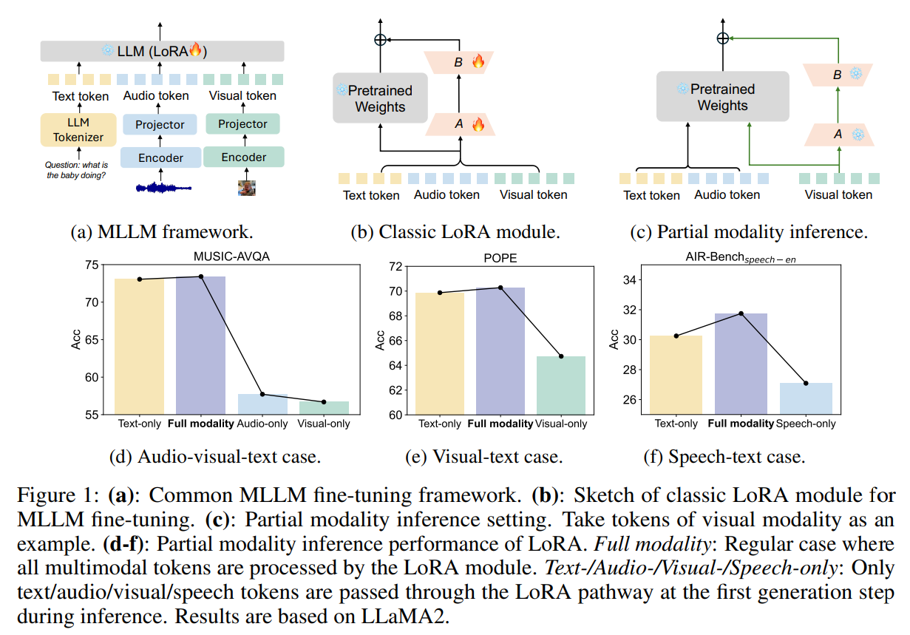

* 이를 위해, 저자는 널리 사용되는 LoRA 전략의 fine-tuning 효율성을 관찰하고자 한다. 일반적인 MLLM fine-tuning framework 는 Fig. 1a 와 같다. 
* non-text modality (e.g., audio, visual) 의 encoded representation 은 먼저 projector (대부분 Q-former 또는 MLP) 를 통해 text embedding space 와 정렬된다. 그 후, 생성된 multimodal token 은 LLM 에 의해 통합적으로 처리된다. 
* efficient fine-tuning 의 경우, LLM backbone 은 고정되고, 추가된 LoRA module 의 parameter 만 최적화된다. 
* Fig. 1b 는 전형적인 LoRA module 의 구조를 보여준다. A 와 B matrix 는 modality 간에 공유된다.

서로 다른 modality 의 token 이 얼마나 잘 활용되는지를 더 관찰하기 위해, 저자는 *partial modality inference* 실험을 수행한다. 학습 단계에서는 원래 설정을 유지하며, 모든 multimodal token 이 LoRA module 을 거친다. 

* 구체적으로는, inference 시 첫 번째 generation 단계에서 선택된 modality 의 token 만 LoRA adaptation 경로를 통과하도록 모델 성능을 평가한다. Fig. 1c 는 visual token inference 예시를 보여준다. 
* 주목할 점은 pre-trained weight 는 여전히 모든 modality 의 full token 을 받는다는 것이다. 
* Fig. 1d–1f 에 제시된 결과는 audio-visual-text, visual-text, speech-text 의 세 가지 대표적 multimodal 시나리오 전반에서 놀라운 현상을 드러낸다. 
* Text token inference 는 full modality 의 경우와 비교해 꽤 유사한 성능을 낼 수 있다. 그러나 non-text token inference (e.g., audio, visual) 는 성능이 뚜렷하게 떨어진다.

이 결과는 all-modality-shared LoRA parameter 의 최적화가 text token 에 지나치게 영향을 받아, non-text token 이 fine-tuning 과정에서 충분히 활용되지 못함을 시사한다. 이러한 all-modality-shared parameter 는 cross-modal interaction 을 암묵적으로 개선하긴 하지만, 이 현상은 fine-tuning 과정에서 individual modality 를 고려할 필요성을 보여준다. 이는 unimodal 과 cross-modal adaptation 이 MLLMs fine-tuning 에서 동일하게 중요하다는 점을 시사하며, 이는 기존 연구에서 대부분 간과된 부분이다.

이를 위해, 저자는 **Multimodal low-rank Adaptation (MokA)** 를 제안한다. 

* MokA 는 unimodal adaptation 을 달성하는 동시에 cross-modal interaction 을 명시적으로 강화하기 위해 설계된 fine-tuning 전략이다. 
* MokA 는 널리 채택된 low-rank decomposition matrix 구조를 유지하지만, multimodal 특성에 더 잘 적합하도록 A 와 B matrix 의 역할을 재정의한다. 
* 구체적으로, matrix A 는 modality-specific 하게 설계되어 각 modality 가 다른 modality 로부터 간섭 없이 독립적으로 정보를 압축할 수 있도록 한다. 
* 이후, cross-attention mechanism 을 도입하여 text token 과 non-text token 간의 상호작용을 강화하고, task-relevant feature 를 강조한다.
* 마지막으로, 공유된 multimodal matrix B 는 unimodal low-rank representation 을 통합된 공간으로 사상하여 modality 간 효과적인 정렬을 가능하게 한다.

이 세 가지 구성 요소는 함께 unimodal 과 cross-modal adaptation 을 모두 보장한다. 다양한 multimodal 시나리오에서 관찰된 뚜렷한 성능 향상은 제안된 방법의 효과성을 입증한다. MokA 는 multimodal-aware adaptation 을 위한 첫 번째 시도라 할 수 있으며, unimodal 과 cross-modal adaptation 을 동시에 고려하는 저자의 기반 위에서 더 많은 확장이 가능하다.

# 2 Method

## 2.1 Rethinking of low-rank adaptation in the multimodal scenario

LoRA 는 fine-tuning 동안 weight update 가 low "intrinsic rank" 의 subspace 에 존재한다는 가정에 기반한다. 전체 pre-trained weight matrix 를 직접 업데이트하는 대신, LoRA 는 low-rank decomposition 방식을 도입한다. 즉, pre-trained matrix $W_0 \in \mathbb{R}^{d \times k}$ 에 대한 update $\Delta W \in \mathbb{R}^{d \times k}$ 는 smaller matrices: $B \in \mathbb{R}^{d \times r}$ 와 $A \in \mathbb{R}^{r \times k}$ 의 product 로 parameterize 된다. 여기서 $r \ll \min(d, k)$ 이다. 따라서 fine-tuned weight matrix $W'$ 는 $W' = W_0 + \Delta W = W_0 + BA$ 로 주어진다. 따라서 $h = W_0x$ 일 때, 수정된 forward pass 는 다음과 같다.

$$
h = W_0x + \Delta Wx = W_0x + BAx \tag{1}
$$

* 여기서 $W_0$ 는 training 동안 고정되며, $A$ 와 $B$ 만 학습된다. 
* stable training 을 위해 $A$ 는 uniform Kaiming distribution 으로 초기화되고, 
* $B$ 는 0 으로 초기화되어 fine-tuning 시작 시 초기 update $\Delta W = BA = 0$ 이 된다. 

LoRA 와 그 변형들은 MLLMs 의 parameter-efficient fine-tuning 에 광범위하게 사용되어 왔다. 이러한 방법들은 일반적으로 modality 전반의 token 을 균일하게 처리하기 위해 shared parameter 를 사용하며, 이로써 adaptation 과정에서 cross-modal interaction 을 암묵적으로 촉진한다. 그러나 저자의 경험적 결과에 따르면, 이러한 shared tuning 은 모든 modality 를 충분히 활용하지 못한다는 한계가 드러났다. 이는 fine-tuning 과정에서 individual modality 를 고려해야 함을 보여준다.

multimodal adaptation 을 더 잘 지원하기 위해, 저자는 fine-tuning 에서 unimodal update 와 cross-modal update 가 모두 고려되어야 한다고 주장한다. 즉, model 은 각 modality 로부터 독립적으로 학습하는 동시에 cross-modal interaction 도 보장해야 한다. 따라서 update mechanism 의 설계는 forward pass 동안 두 종류의 정보가 모두 적절히 포착되도록 해야 한다.

$$
\begin{align*}
    h &= W_0x + \Delta Wx = W_0x + \Delta W [x^{m_1}; x^{m_2}; \cdots ; x^{m_n}] \tag{2} \\
    &= W_0x + \underbrace{[\Delta W_1 x^{m_1}; \Delta W_2 x^{m_2}; \cdots ; \Delta W_n x^{m_n}] }_{\text{unimodal adaptation}} 
+ \underbrace{\Delta W_{\text{cross}} [x^{m_1}; x^{m_2}; \cdots ; x^{m_n}] }_{\text{cross-modal adaptation}} \tag{3}
\end{align*}
$$

* 여기서 $n$ 은 modality 의 개수이며, 
* $x_{m_i}$ 는 modality $i$ 의 token sequence 를 의미한다. 
* $\Delta W_i$ 는 modality $i$ 의 unimodal update parameter, 
* $\Delta W_{\text{cross}}$ 는 cross-modal update parameter 이다.

## 2.2 Multimodal low-rank Adaptation (MokA)

위의 관점을 바탕으로, 저자는 **Multimodal low-rank Adaptation (MokA)** 전략을 제안한다. 

* MokA 는 MLLMs 의 multimodal 특성에 맞추어 설계된 parameter-efficient fine-tuning 방법이다. 
* LoRA 의 효율적 장점을 고려하여, MokA 는 low-rank adaptation 의 핵심 아이디어를 유지하되, projection matrix $A$ 와 $B$ 의 역할을 재정의하여 multimodal 시나리오의 특성을 더 잘 반영하도록 한다. 
* unimodal compression 과 cross-modal interaction 의 명시적 강화를 통해 MokA 는 unimodal adaptation 과 cross-modal adaptation 을 모두 가능하게 하여, MLLMs 의 fine-tuning 을 보다 효과적으로 수행한다. MokA 의 전체 구조는 Fig. 2 에 나타나 있다.

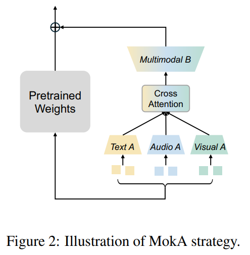

구체적으로, MokA 는 세 가지 핵심 요소로 구성된다: **unimodal matrix $A$**, **task-centric cross-attention**, 그리고 **shared multimodal matrix $B$** 이다. 여기서는 audio-visual-text 사례를 예로 들지만, 다른 경우에도 잘 확장될 수 있다.

### 2.2.1 Unimodal matrix A

LLMs 의 임의의 pre-trained weight $W_0$ 에 대해, 그 입력 sequence $x$ 가 다음과 같다고 가정한다: $x = [x^a_1; x^a_2; \cdots ; x^a_{N_a}; \, x^v_1; x^v_2; \cdots ; x^v_{N_v}; \, x^t_1; x^t_2; \cdots ; x^t_{N_t}]$

여기서 $\{N_i\}_{i \in \{a, v, t\}}$ 는 modality $i$ 의 token 길이를 나타낸다. 예를 들어, $x^a_1$ 은 modality $a$ 의 첫 번째 token 이다. 단순화를 위해, modality $i$ 의 token sequence 를 $x_i$ 로 표기하면 전체 입력 sequence 는 $x = [x^a; x^v; x^t]$ 로 다시 쓸 수 있다.

unique unimodal information 을 잘 압축하고 다른 modality 로부터의 간섭을 피하기 위해, matrix $A$ 는 modality 별로 개별적으로 설계된다. 즉, 서로 다른 modality 의 token 들은 각자의 parameter 를 통해 독립적으로 처리된다. unimodal matrix $A$ 를 거친 후의 압축된 sequence 는 다음과 같다.

$$
Ax = [A^a x^a; \, A^v x^v; \, A^t x^t] \tag{4}
$$

* 여기서 $\{A_i\}_{i \in \{a, v, t\}}$ 는 modality $i$ 의 parameter 이다. 
* unimodal matrix $A$ 로 처리된 후, 각 modality 의 embedding 은 독립적으로 low-rank 공간에 사상되며, 다른 modality 의 잠재적 영향 없이 표현된다.

### 2.2.2 Task-centric cross-attention

MLLMs 의 fine-tuning 과정에서 text token 과 non-text token 은 일반적으로 서로 다른 역할을 수행한다. 구체적으로, supervised instruction tuning 환경에서 text token 은 주로 task description 또는 prompt 의 역할을 하며, non-text token (e.g., audio, visual input) 은 주로 task 가 기반하는 contextual information 을 전달한다.

다음은 전형적인 instruction format 의 예시이다.

```
<audio> <visual> Please answer the question: which clarinet makes the sound first?
```

이 경우 `<audio>` 와 `<visual>` 은 event information 을 제공한다. 반면, *“Please answer the question: which clarinet makes the sound first?”* 는 LLMs 에게 구체적인 task 를 설명한다. 이러한 질문에 올바르게 대답하기 위해서는 text token 이 전달하는 task description 과 non-text token 이 제공하는 event cue 간의 semantic association 을 효과적으로 포착해야 한다. 따라서 정확한 reasoning 을 지원하기 위해 가장 관련성이 높은 cross-modal information 을 명시적으로 강조하는 것이 직관적이며 필요하다.

이미 unimodal matrix $A$ 를 통해 unimodal information 이 modality 별로 독립적으로 추출되었으므로, 이 단계는 cross-modal interaction 을 도입하기에 적합하다. 또한 token embedding 이 low-rank 공간으로 사상된 상태이므로 cross-modal interaction 을 수행하는 계산적 부담이 크게 줄어든다. 따라서 MokA 에서는 cross-attention 부분을 low-rank compression 이후에 배치하여 효과성과 효율성을 동시에 보장한다. 구체적인 attention mechanism 은 Fig. 3 에 나타나 있으며, 다음과 같이 수행된다.

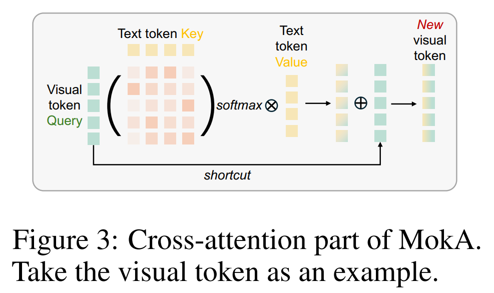

$$
\text{Att}(A^a x^a, A^t x^t, A^t x^t) = \text{softmax}\left(\frac{(A^a x^a)(A^t x^t)^\top}{\sqrt{N_t}}\right) A^t x^t \tag{5}
$$

$$
\text{Att}(A^v x^v, A^t x^t, A^t x^t) = \text{softmax}\left(\frac{(A^v x^v)(A^t x^t)^\top}{\sqrt{N_t}}\right) A^t x^t \tag{6}
$$

그 후 강화된 audio 와 visual token 은 다음과 같이 정의된다.

$$
A^a x^a + \text{Att}(A^a x^a, A_t x_t, A^t x^t) \tag{7}
$$

$$
A^v x^v + \text{Att}(A^v x^v, A_t x_t, A^t x^t) \tag{8}
$$

최종적으로 cross-attention 이후의 sequence 는 다음과 같이 표현된다.

$$
Ax = [A^a x^a + \text{Att}_{a,t,t}; \, A^v x^v + \text{Att}_{v,t,t}; \, A^t x^t] \tag{9}
$$

여기서 $\text{Att}_{i,t,t}$ 는 modality $i$ 와 text 간의 cross-attention 을 단순히 나타내기 위한 표기이다.

주의할 점은, 저자가 cross-attention module 을 사용하여 text 와 non-text token 간의 상호작용을 명시적으로 강화했지만, 유사한 목적을 수행할 수 있는 대체 설계 역시 고려될 수 있다는 것이다. 이에 대한 추가 논의는 Sec. 4.4 에서 제공된다. 또한 MokA 에서는 cross-attention module 내에 일반적으로 포함되는 선형 projection ($W_q$, $W_k$, $W_v$) 을 사용하지 않는다. 이는 각 modality 의 low-rank matrix $A$ 가 이 경우 attention 에서의 선형 projection 으로 간주될 수 있기 때문이다.

### 2.2.3 Shared multimodal matrix $B$

unimodal compression 과 explicit cross-modal interaction 강화가 이루어진 후에는, 결과로 얻어진 unimodal representation 을 shared space 로 사상하여 cross-modal alignment 를 촉진하는 것이 중요하다. 이를 위해 MokA 는 **shared multimodal matrix $B$** 를 사용하여 projection 을 수행한다. MokA 경로의 최종 출력은 다음과 같이 주어진다.

$$
BAx = [B(A^a x^a + \text{Att}_{a,t,t}); \, B(A^v x^v + \text{Att}_{v,t,t}); \, B A^t x^t] \tag{10}
$$

### 2.2.4 Overview

정리하면, MokA 에서 pre-trained weight matrix $W_0 \in \mathbb{R}^{d \times k}$ 의 update $\Delta W \in \mathbb{R}^{d \times k}$ 는 더 작은 matrix 들의 product 로 parameterize 된다. 즉, $B \in \mathbb{R}^{d \times r}$ 와 $\{A_i \in \mathbb{R}^{r \times k}\}_{i \in \{a,v,t\}}$ 이며, 여기서 $r \ll \min(d, k)$ 이다. input sequence $x$ 에 대해 forward pass 는 다음과 같이 전개된다.

$$
\begin{align*}
    h &= W_0x + \Delta Wx = W_0x + \Delta W [x^a; x^v; x^t] \tag{11} \\
    &= W_0x + [B(A^a x^a + \text{Att}_{a,t,t}); \, B(A^v x^v + \text{Att}_{v,t,t}); \, B A^t x^t] \tag{12} \\
    &= W_0x + \underbrace{[B A^a x^a; \, B A^v x^v; \, B A^t x^t]}_{\text{unimodal adaptation}} + \underbrace{[B \text{Att}_{a,t,t}; \, B \text{Att}_{v,t,t}; \, 0_{N_t}]}_{\text{cross-modal adaptation}} \tag{13}
\end{align*}
$$

* 여기서 $0_{N_t}$ 는 dimention $N_t$ 의 zero vector 를 의미하며, 
* text token 은 cross-attention 이후 변하지 않기 때문에 추가항이 0 이 된다.
* fine-tuning 동안 $W_0$ 는 고정되고, $A_i$ 와 $B$ 가 최적화 대상이 된다. 
* 또한 $A^i$ 는 uniform Kaiming distribution 으로 초기화되고, 
* $B$ 는 0 으로 초기화되어 fine-tuning 시작 시 $\Delta W = 0$ 이 된다. 이는 학습 초기의 안정적인 출발점을 제공한다.

Eq. (13) 에 기반하여, MokA 는 unimodal adaptation 과 cross-modal adaptation 을 모두 보장하며, MLLMs 의 fine-tuning 을 위한 더 정밀하게 맞춤화된 해법을 제공한다.

# 3 Training and evaluation details

## 3.1 Implement details

저자의 framework 는 Fig. 1a 에 제시된 일반적인 MLLM framework 를 따르되, MokA 전략을 적용한다. text input 은 해당 LLM tokenizer 로 처리되며, non-text input 은 먼저 encoder 로 인코딩된 뒤 projector 를 통해 text embedding space 와 정렬된다. projector 로는 Q-former 와 2-layer MLP 를 사용한다. 마지막으로 모든 token 은 LLM 에 입력된다.

* audio-visual-text 및 visual-text 시나리오의 visual branch 에서는 CLIP-ViT/L-14 encoder 를 사용하여 각 frame 또는 image 의 마지막 layer patch-level embedding 을 추출한다.
* audio-visual-text 시나리오의 audio branch 에서는 BEATs encoder 를 사용하여 feature 를 추출한다.
* speech-text 시나리오의 speech branch 에서는 OpenAI Whisper model 을 사용한다.
* 모든 branch 의 Q-former query token 수는 32 이다.

## 3.2 Training procedure and benchmarks

저자의 MLLM 실험은 널리 사용되는 2단계 training paradigm 을 따른다: **(1) pre-training 단계** 는 cross-modal alignment 를 목표로 하고, **(2) supervised instruction-tuning 단계** 는 downstream task 를 위한 학습을 수행한다.

#### Pre-training

* LLM backbone 은 고정된다.
* projector 는 cross-modal alignment 를 위해 학습 가능하게 설정된다.
* visual branch (audio-visual-text 및 visual-text) 는 video captioning 과 image captioning task 를 포함하는 video-LLaVA dataset 으로 학습된다.
* audio branch (audio-visual-text) 는 AudioCaps dataset 으로 audio captioning task 를 학습한다.
* speech branch (speech-text) 는 GigaSpeech-M dataset 으로 speech recognition task 를 학습한다.
* pre-training 동안 각 branch 는 1 epoch 학습되며, AdamW optimizer 와 cosine learning rate schedule 이 사용된다. 초기 learning rate 는 $1e^{-4}$, warmup ratio 는 0.03 이다.

#### Instruction-tuning

* 이 단계에서는 각 시나리오의 downstream task 에 대해 학습한다.
* 학습 가능한 parameter 는 모든 projector 와 MokA module 이다.
* audio-visual-text 의 경우, MUSIC-AVQA 와 AVE 의 train set 으로 fine-tuning 한다.
* visual-text 의 경우, LLaVA-Instruct-150K dataset 으로 fine-tuning 한다.
* speech-text 의 경우, LibriSpeech dataset 으로 fine-tuning 하며, annotation 은 기존 연구에서 제공한 것을 사용한다.
* visual-text case 는 1 epoch, 나머지 case 는 3 epoch 동안 학습된다.
* low-rank matrix 의 rank 는 4 로 설정된다.
* 나머지 학습 설정은 pre-training 단계와 동일하다.

#### Inference

fine-tuning 전략의 효과를 잘 평가하기 위해, 학습된 model 은 in-domain test set 또는 public benchmark 에서 평가된다. 세부 사항은 supplementary material 에 제시된다.

* **Audio-visual-text**: MUSIC-AVQA 및 AVE dataset 의 in-domain test set
* **Visual-text**: public benchmark — MME$_\text{percep}$, MMBench, POPE, SEED-Bench
* **Speech-text**: public benchmark — MMAU$_\text{min-speech}$ 및 AIR-Bench$_\text{speech-en}$ 의 foundation subset

#### Large Language Model

세 가지 시나리오 모두에서 LLM base model 로 LLaMA-2-7b-Chat, LLaMA-3-8B-Instruct, Qwen2-7B-Instruct 를 사용한다. audio-visual-text case 에 대해서는 Qwen2.5-VL-7B-Instruct 또한 사용된다. training 전 과정에서 LLM 의 weight 는 고정된다.

# 4 Experiments

## 4.1 Audio-visual-text scenario

저자의 MokA fine-tuning 전략의 효과성을 검증하기 위해, LoRA 와 그 변형들( multiple LoRA, LoRAMoE, DoRA, HydraLoRA, Uni-modal LoRA )과 비교하였다. 추가적으로 Fig. 4 에 제시된 두 가지 baseline 과도 비교하였다. 

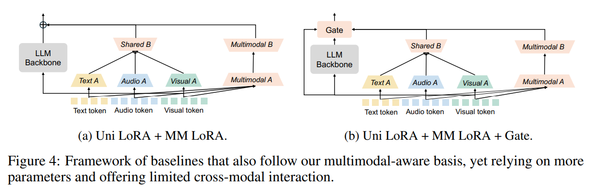

* 구체적으로, **Uni LoRA + MM LoRA** 전략은 unimodal low-rank matrix $A$ 를 사용하여 unimodal information 을 독립적으로 추출하는 동시에, fully shared multimodal LoRA module 을 추가하여 cross-modal interaction 을 암묵적으로 촉진한다. 
* **Uni LoRA + MM LoRA + Gate** 변형은 여기에 gating mechanism 을 도입하여 Uni LoRA 와 MM LoRA branch 의 출력을 동적으로 통합해 fusion 을 개선한다. 
* 이 두 baseline 은 unimodal 과 cross-modal adaptation 을 모두 보장하는 multimodal-aware 기반을 갖추었으나, parameter 가 더 많고 cross-modal interaction 은 제한적이다.

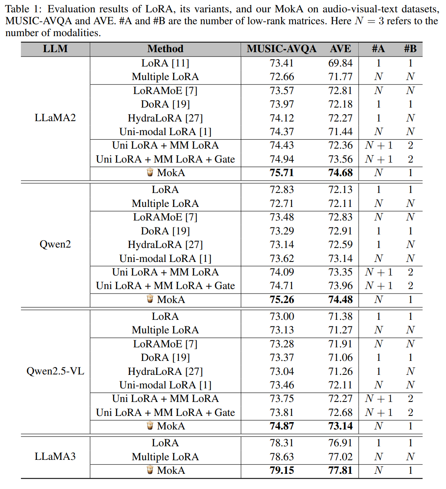

Tab. 1 의 결과에 기반하여 다음과 같은 관찰을 할 수 있다.

* 제안된 MokA 방법은 여러 audio-visual-text dataset 에서 전반적으로 우수한 성능을 달성하며, 다른 baseline 및 비교 방법들을 지속적으로 능가한다. MokA 는 standard LoRA 대비 parameter 규모가 약간 증가하지만, 이러한 증가가 관찰된 성능 향상의 원인은 아니다.
* Tab. 1 에 따르면, $3A$ matrix 와 $B A$ matrix 를 사용하는 multiple LoRA baseline 은 standard LoRA 와 MokA 모두보다 성능이 떨어진다. 즉, 단순히 low-rank matrix 의 개수를 늘리는 것이 fine-tuning 성능 향상으로 이어지지는 않는다. 이는 MokA 의 장점이 parameter 양이 아니라 unimodal 과 multimodal adaptation 을 동시에 보장한다는 점에서 비롯됨을 시사한다.
* 두 baseline (Uni LoRA + MM LoRA, Uni LoRA + MM LoRA + Gate) 은 경쟁력 있는 결과를 달성한다. 이는 MLLMs 의 fine-tuning 에서 unimodal 과 cross-modal adaptation 이 모두 필수적이라는 저자의 multimodal-aware 기반의 타당성을 뒷받침한다. 그러나 MokA 는 더 적은 parameter 로 superior 한 성능을 달성하며, cross-modal interaction 또한 더욱 강화된다.
* 추가적으로, Qwen2.5VL 은 LoRA 기반 fine-tuning 설정에서 LLaMA2 와 Qwen2 를 능가한다. 그러나 MokA 를 적용했을 때 Qwen2.5VL 의 성능은 LLaMA2 와 Qwen2 보다 약간 낮게 나타났다. 가능한 이유는 Qwen2.5VL 의 공식 visual connector 가 다른 LLM variant 에서 사용된 projector 와 유사한 역할을 하지만, fine-tuning 과정에서 고정(frozen) 상태로 남아 있었기 때문이다. 따라서 새로 추가된 audio branch 만 학습 가능하여 저자의 방법의 잠재력을 충분히 발휘하지 못했을 가능성이 있다. 하지만 이 경우에도 MokA 는 다른 방법들에 비해 눈에 띄는 개선을 보여주었다.

요약하면, 저자의 방법은 다양한 LLM backbone 전반에서 상당한 성능 향상을 이루며, 그 범용성을 입증한다.

# 4 Experiments

## 4.2 Visual-text and speech-text scenarios

저자의 방법을 더 넓은 범위의 multimodal 시나리오에서 검증하기 위해, audio-visual-text 의 어려운 경우를 넘어 추가적인 실험을 수행하였다. 구체적으로, **visual-text** 와 **speech-text** 의 두 가지 대표적인 multimodal 시나리오에서 방법을 평가하였다. 이들 task 에 대해 LLaMA2, LLaMA3, Qwen2 의 세 가지 서로 다른 LLM backbone 을 사용하였다. 결과는 Tab. 2 와 Tab. 3 에 제시되어 있다.

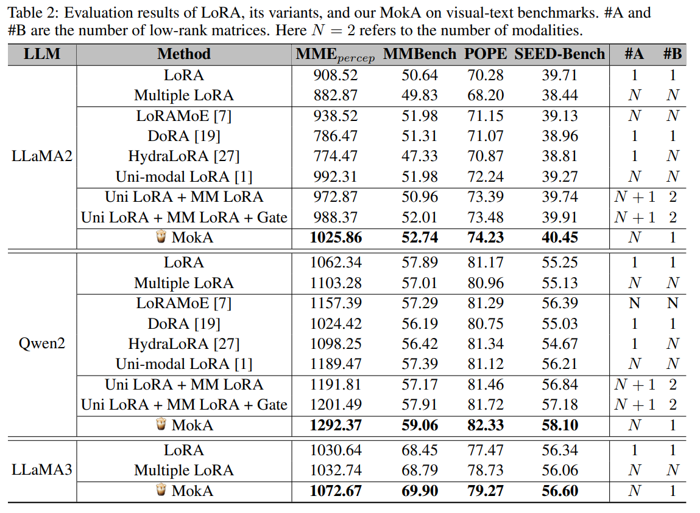

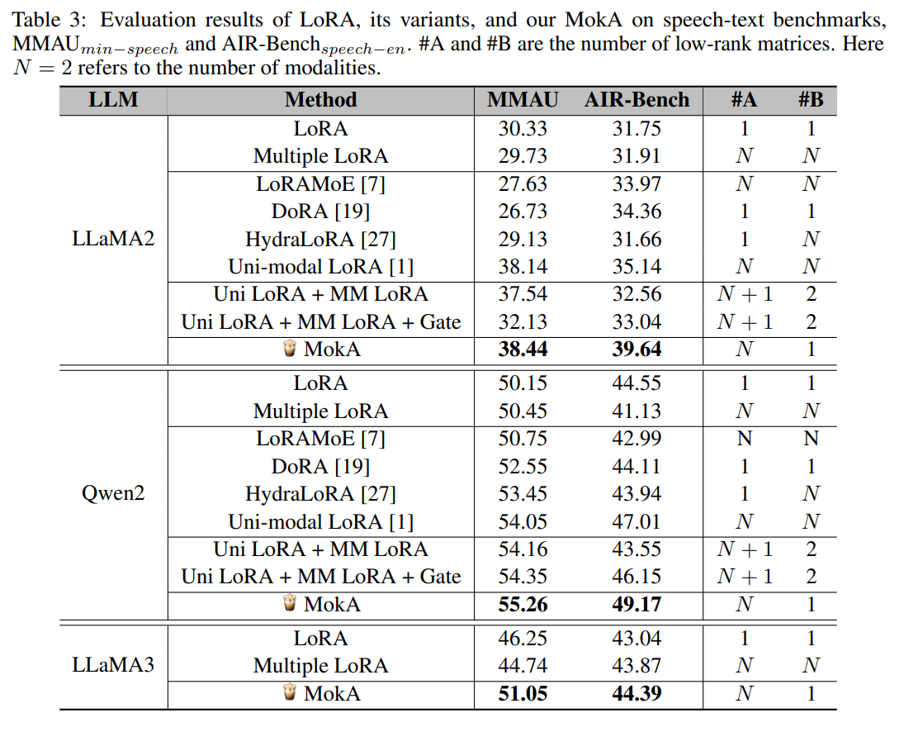

실험 결과, 저자의 방법은 여러 benchmark dataset 에서 안정적이고 일관된 성능 향상을 달성하며, 그 효과성을 다시 한 번 확인시켰다. 이는 MokA 가 다양한 multimodal 조합과 LLM architecture 를 처리하는 데 있어 범용성을 가진다는 것을 의미한다.

## 4.3 Partial modality inference of MokA

MokA 가 modality 별 token 을 얼마나 효과적으로 활용하는지를 더 면밀히 검토하기 위해, partial modality inference 실험을 수행하였다. 여기서는 inference 의 첫 번째 generation 단계에서 선택된 modality 의 token 만 LoRA adaptation 경로를 통과시키도록 하였다. 주의할 점은, cross-attention 연산은 text 와 non-text token 이 모두 존재해야 수행 가능하기 때문에, 평가 대상 모델은 **MokA w/o cross-attention** 이라는 것이다.

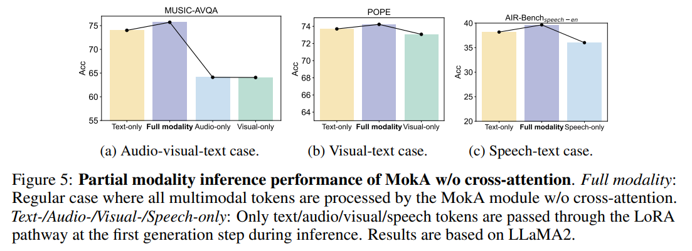

Fig. 5 에 제시된 결과에 따르면, MokA w/o cross-attention 은 Fig. 1d–1f 에서 보여준 LoRA 와 비교해 individual modality 의 활용도를 크게 향상시켰다. 이러한 결과는 MokA 의 multimodal-aware 설계가 모든 modality 를 보다 효과적으로 활용할 수 있게 함을 보여준다.

## 4.4 Cross-modal interaction variants

original MokA framework 에서는 cross-attention 을 사용하여 text token 과 non-text token 간의 상호작용을 명시적으로 강화함으로써 cross-modal adaptation 을 개선하였다. 앞서 논의한 것처럼, 유사한 목적을 달성하는 다른 모듈들도 고려될 수 있다. 본 절에서는 cross-modal interaction module 의 몇 가지 변형을 탐구하였으며, 요약은 Tab. 4 에 제시되어 있다.

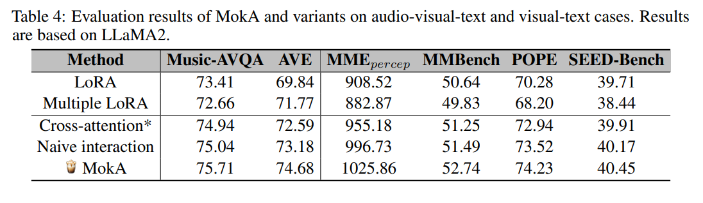

* **cross-attention\*** variant 는 cross-attention mechanism 을 채택하지만, text token 을 query 로 사용한다. 그 결과, 업데이트된 text token 은 관련된 non-text token 의 정보를 통합하게 되며, 이는 원래 MokA 와는 상호작용 방향이 반대가 된다.
* **naive interaction** variant 는 attention mechanism 을 사용하지 않고, 단순하고 균일한 mapping 을 통해 text token 을 non-text token 으로 전달한다.

실험 결과, 제안된 모든 변형은 LoRA baseline 보다 우수한 성능을 보였으며, cross-modal interaction 을 명시적으로 강화하는 것이 전반적으로 효과적임을 입증하였다. 그러나 cross-attention\* variant 는 다른 변형들보다 약간 성능이 떨어졌다. 그 이유 중 하나는, 다른 변형에서는 text token 이 변하지 않는 반면, cross-attention\* variant 에서는 text representation 이 non-text feature 와 결합되어 수정되기 때문이다. cross-modal interaction 은 강화되지만, text 표현의 변경이 language modeling 능력에 부정적 영향을 줄 수 있다.

또한 naive interaction 은 경쟁력 있는 결과를 보였지만, MokA 는 dynamic attention mechanism 을 통해 더 나은 개선을 달성하였다. 이러한 결과는 cross-modal interaction 을 명시적으로 강화하는 핵심 아이디어 자체가 효과적이며, 특정 모듈 설계에 국한되지 않는다는 점을 시사한다.

# 4.5 Ablation study

저자의 방법의 효용성을 철저히 검증하기 위해, 세 가지 multimodal 시나리오 전반에서 ablation study 를 수행하였다. 결과는 Tab. 5 에 제시되어 있다.

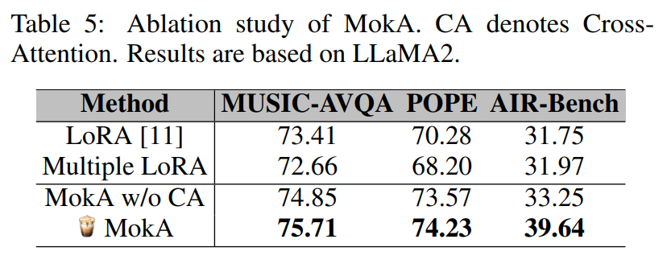

* 결과에 따르면, cross-attention module 이 제거된 경우에도 **MokA w/o CA** 는 LoRA baseline 을 능가하며, unimodal adaptation 을 강화하는 것이 효과적임을 보여준다. 
* 더 나아가 cross-attention module 을 도입하면 추가적인 성능 향상이 나타나며, 이는 cross-modal adaptation 을 명시적으로 강화하는 것이 유리함을 의미한다. 이러한 결과는 MokA 의 각 부분이 모두 필요함을 입증한다.

# 4.6 Efficiency evaluation

보다 포괄적인 비교를 위해, 저자는 MokA 와 LoRA baseline 을 full model 대비 학습 가능한 parameter 비율과 inference latency 측면에서 평가하였다. 

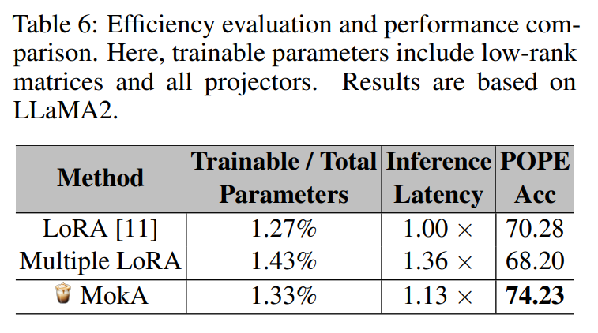

* Tab. 6 의 보고에 따르면, MokA 는 더 많은 low-rank matrix 를 포함하므로 parameter 수가 추가되지만, full LLM 과 비교했을 때 증가는 매우 미미하다. 
* 또한 MokA 는 standard LoRA 대비 inference latency 가 약간 증가하나, POPE benchmark 에서 3.95% 의 뚜렷한 성능 향상을 달성하였다.

이러한 결과는 MokA 가 도입하는 추가적인 계산 비용이 충분히 수용 가능하며, 그 성능 향상이 상당하다는 점을 시사한다.

# 5 Related works

강력한 LLM backbone 에 기반한 MLLMs 은 다양한 downstream task 에서 인상적인 능력을 보여주고 있다. 그러나 이러한 모델을 fine-tuning 하는 것은 여전히 계산적으로 비용이 많이 들며, 이에 따라 adaptation 과정에서 memory 및 storage overhead 를 줄이는 parameter-efficient fine-tuning (PEFT) 기법에 대한 관심이 커지고 있다.

그중 LoRA 는 널리 채택되었으며, 연구자들은 효율성과 유연성을 더욱 개선하기 위해 여러 변형들을 제안하였다. 

* 예를 들어, LoRAMoE 는 여러 LoRA head 를 gating mechanism 으로 결합하고, 
* DoRA 는 gradient 방향 최적화에만 집중하여 보다 효율적인 update 를 가능하게 한다. 
* 그러나 이러한 발전에도 불구하고, 대부분의 PEFT 전략은 LLM 기법을 단순 확장한 것에 불과하며 multimodal learning 의 본질적 특성을 고려하지 못한다.

이러한 간극을 해소하기 위해, 저자는 MokA 를 제안하였다. MokA 는 MLLMs 을 위해 특별히 설계된 fine-tuning 전략으로, unimodal representation 을 보존하면서 cross-modal interaction 을 강화하여, 효율적이고 효과적인 multimodal adaptation 을 위한 목표 지향적 해법을 제공한다.

# 6 Discussion

이 논문에서 저자는 **unimodal adaptation** 과 **cross-modal adaptation** 이 MLLMs 의 효과적인 fine-tuning 을 위해 필수적이지만, 그동안 대부분 간과되어 왔음을 주장한다. 이를 위해, 저자는 efficient multimodal fine-tuning 을 위한 **Multimodal low-rank Adaptation (MokA)** 를 제안하였다. MokA 는 low-rank matrix $A$ 와 $B$ 의 역할을 재정의하여, unimodal information 은 보존하면서 cross-attention 을 통해 cross-modal interaction 을 강화한다.

저자는 MokA 가 multimodal-aware adaptation 을 향한 첫 단계라 생각하며, unimodal 과 cross-modal adaptation 을 동시에 고려하는 향후 확장의 가능성을 강조한다.

