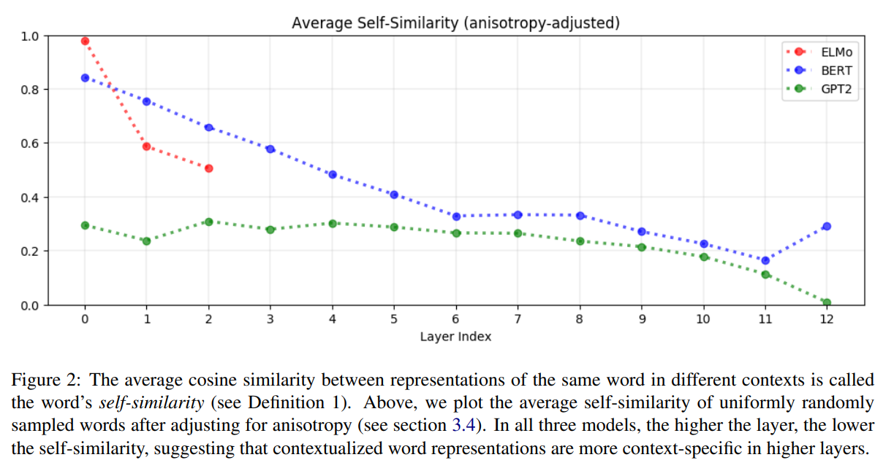
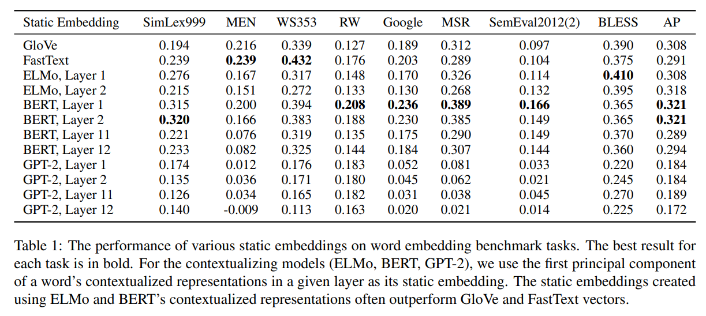

논문 및 이미지 출처 : <https://aclanthology.org/D19-1006.pdf>

# Abstract

static word embeddings 를 contextualized word representations 로 대체함으로써 많은 NLP task 에서 큰 향상을 이루었다. 그러나 ELMo 와 BERT 같은 모델이 생성하는 contextualized representation 은 실제로 얼마나 contextual 할까? 각 단어에 대해 무한히 많은 context-specific representations 가 존재하는 것일까, 아니면 단어가 본질적으로 유한한 수의 word-sense representation 중 하나를 부여받는 것일까?

저자는 contextualized representation 이 어느 레이어에서도 등방적(isotropic)이 아님을 발견했다.

같은 단어의 representation 이 다른 contexts 에서 여전히 다른 단어의 representation 보다 더 높은 cosine similarity 를 가지지만, 이 self-similarity 는 top-layer 에서 훨씬 낮다.

이는 upper layer 의 contextualizing model 이 더 많은 context-specific representation 을 생성한다는 것을 시사한다.

이는 LSTM 의 upper layer 가 더 많은 task-specific representation 을 생성하는 것과 유사하다.

ELMo, BERT, GPT-2 의 모든 layer 에서, 평균적으로 단어의 contextualized representations 에서 5% 미만의 variance 가 그 단어의 static embedding 으로 설명될 수 있으며, 이는 contextualized representation 의 성공을 어느 정도 설명해준다.

# 1. Introduction

DNN 의 NLP 적용은 단어를 low-dimensional continuous space 의 vector 로 표현함으로써 가능해졌다.

전통적으로 이러한 word embedding 은 _static_ 이었다: 각 단어는 context 와 상관없이 single vector 를 가졌다.

이는 polysemous 의 all sense 가 same representation 을 공유해야 한다는 주요 문제를 제기했다. 최근에는 ELMo 와 BERT 와 같은 deep neural language models 가 성공적으로 _contextualized word representation_ 을 생성하였으며, 이들은 단어가 나타나는 context 에 sensitive vector 를 제공합니다. static embedding 을 contextualized representation 으로 교체함으로써 question-answering 해결에 이르기까지 다양한 NLP 연구에서 상당한 개선이 이루어졌다.

contextualized word representation 의 성공은 이러한 represenation 이 language modeling task 만으로 훈련되었음에도 불구하고 language 의 highly transferable 및 task-agnostic 특성을 학습한다는 것을 시사한다.

실제로, frozen contextualized representation 으로 훈련된 linear probing 은 단어의 linguistic 특성을 SOTA model 과 거의 동일하게 예측할 수 있다. 그럼에도 불구하고 이러한 representation 은 여전히 이해되지 않는다.

하나, 이러한 contextualized word representation 이 얼마나 contextual 한지는 명확하지 않습니다. BERT 와 ELMo 는 각 단어에 무한히 많은 context-specific representation 을 할당할 수 있는 것일까, 아니면 단어가 본질적으로 유한한 수의 word-sense representation 중 하나를 할당받는 것일까?

저자는 ELMo, BERT, GPT-2 의 각 layer 에서 representation space 의 기하학을 연구하여 이 질문에 답한다. 저자의 분석은 몇 가지 놀라운 발견을 제공한다:

1. 세 models 의 모든 layer 에서, contextualized word representation 는 _isotropic_ 하지 않음: 방향에 대해 균일하게 분포되어 있지 않는다. 대신, vector space 에서 narrow cone 을 차지하는 _anisotropic_ 함. GPT-2 의 last layer 에서의 anisotropy 는 two random words 가 평균적으로 거의 perfect cosine similarity 를 가질 정도로 극단적이다! isotropy 는 static embeddings 에 대해 이론적 및 실험적 장점이 있으므로,  contextualized representation 에서의 anisotropy 는 놀랍다.
2. 동일한 단어가 다른 context 에서 나타날 때, vector representation 이 동일하지 않음. vector similarity 가 cosine similarity 로 정의될 때, 이러한 representation 은 upper layer 에서 서로 더 다름. 이는 LSTM 의 upper layer 가 더 많은 task-specific representation 을 생성하는 것처럼, contextualizing model 의 upper layer 가 더 많은 context-specific representations 를 생성한다는 것을 시사한다.
3. Context-specificity 은 ELMo, BERT, GPT-2 에서 매우 다른 manifests. ELMo 에서는 같은 문장 내 단어의 representation 이 upper layers 에서 context-specificity 가 증가함에 따라 서로 더 유사해진다; BERT 에서는 upper layer 에서 서로 더 다르게 되지만, 여전히 randomly sampled word 보다 평균적으로 더 유사하다; 반면 GPT-2 에서는 같은 문장 내 단어가 randomly sampled word 보다 더 유사하지 않는다.
4. anisotropy 의 영향을 조정한 후, 평균적으로 단어의 contextualized representation 에서 5% 미만의 variance 가 첫 번째 principal component 로 설명될 수 있있다. 이는 모든 모델의 모든 레이어에서 유지된다. 이는 contextualized representation 이  유한한 수의 word-sense representation 과 일치하지 않으며, 가능한 최상의 경우라도 static embedding 이 contextualized embedding 을 대체하기에 부족하다는 것을 시사한다. 그럼에도 불구하고, 단어의 contextualized representation 의 first principal component 를 사용하여 생성된 static embedding 은 많은 word vector benchmark 에서 GloVe 및 FastText embedding 을 능가한다.

이러한 통찰력은 contextualized representation 의 사용이 많은 NLP 연구에서 왜 그렇게 중요한 개선을 가져왔는지를 정당화하는 데 도움이 된다.

# 2. Related Work

**Static Word Embeddings** 

Skip-gram with negative sampling (SGNS) 과 GloVe 는 static word embedding 을 생성하는 가장 잘 알려진 model 중 일부다.

비록 이들 model 이 실제로 반복적으로 embedding 을 학습하지만, 이론적으로는 둘 다 co-occurrence statistic 가 포함된 word-context matrix 를 암묵적으로 분해한다는 것이 입증되었다.

각 단어에 대해 single representation 을 생성하기 때문에, static word embedding 의 주목할 만한 문제는 polysemous 의 모든 의미가 single vector 를 공유해야 한다는 것이다.

**Contextualized Word Representations**

static word embedding 의 한계로 인해, 최근 연구들은 context-sensitive word representation 을 생성하려고 시도했다. ELMo, BERT, 및 GPT-2 는 다양한 downstream NLP task 를 위한 fine-tuned deep neural language model 이다.

이들의 내부 word representation 은 문장 전체의 함수로서, contextualized word representation 이라 불립니다. 이 접근 방식의 성공은 이러한 representation 들은 언어의 highly trasferable 및 task-agnostic 속성을 캡처한다는 것을 시사한다.

ELMo 는 2-layer biLSTM 을 사용하여 각 token 의 contextualized representation 을 생성하며, 이는 bidirectional language modeling task 에서 훈련된다

반면, BERT 와 GPT-2 는 각각 bi-directional 및 uni-directional transformer-based language models 다.

12-layers BERT (base, cased) 와 12-layers GPT-2 의 각 transformer layer 는 input sentence 의 다양한 부분을 attending 하면서 각 token 의 contextualized representation 을 생성한다.

BERT 와 BERT 의 후속 버전은 question-answering 에서 sentiment ananlysis 까지 다양한 downstream NLP 연구에 SOTA 달성

**Probing Tasks**

contextualized word representation 에 대한 이전 분석은 probing task 로 제한되었다. 이는 단어의 syntactic 및 semantic 속성을 예측하기 위해 linear model 을 훈련하는 연구를 포함한다.

probing model 은 간단한 linear model 이 언어적 속성을 정확하게 예측할 수 있다면, representation 이 본래 이 정보를 암묵적으로 encoding 하고 있다는 전제에 기반한다.

이러한 분석들은 contextualized representation 이 의미적 및 구문적 정보를 encoding 하고 있음을 발견하지만, 이러한 representation 이 얼마나 contextual 되어 있는지, 그리고 static word embedding 으로 대체될 수 있는지에 대해선 답할 수 없다.

본 연구는 contextualized representation 의 해부와는 뚜렷하게 다릅니다. Mimno 와 Thompson 이 static word embedding 의 기하학을 연구한 것과 유사하다.

# 3. Approach

## 3.1 Contextualizing Models

contextualizing model 은 ELMo, BERT, 및 GPT-2. 

저자는 BERT 의 base cased 를 선택하여 GPT-2 와 동일한 layer 및 dimension 에서 비교한다.

저자가 사용하는 모델들은 모두 각각의 language modeling task 에 대해 pre-training 됨.

ELMo, BERT, GPT-2 는 각각 2, 12, 12 hidden layer 을 가지며, 각 contextualizing model 의 input layer 를 0 layer 로 포함시킨다.

이는 0 layer 가 contextualizing 되지 않아, 이후 layer 들이 수행하는 contextualizing 과 비교할 수 있는 유용한 baseline 이 될 수 있기 때문이다.

## 3.2 Data

contextualized word embedding 을 분석하기 위해, pre-trained model 에 주입할 sentence 가 필요하다.

저자의 input data 는 SemEval Semantic Textual Similarity tasks 에서 2012 - 2016년까지의 dataset 을 가져왔다.

이 데이터셋들은 동일한 단어가 다양한 문맥에서 등장하는 문장을 포함하고 있어 유용하다.

예로, 'dog' 라는 단어는 "A panda dog is running on the road."와 "A dog is trying to get bacon off his back." 에서 등장한다.

만약 모델이 두 문장에서 'dog' 에 대해 동일한 representation 을 생성한다면, 이는 contextualizing 이 없다고 추론할 수 있다.

반대로, 두 representation 이 다르다면, 어느 정도 contextualizing 이 이루어졌다고 볼 수 있다.

이러한 dataset 을 사용하여, 이들 단어를 등장하는 sentence list 와 sentence index 로 매핑한다.

분석에서는 5개 이상의 unique contexts 에 등장하는 단어만을 고려한다.

## 3.3 Measures of Contextuality

word representation 의 contextual 정도를 측정하기 위해, 저자는 3 metrics 를 사용: _self-similarity_, _intra-sentence similarity_, 및 maximum explainable variance.

**Definition 1**

word $w$ 가 sentences $\{s_1,...,s_n\}$ 에서 index $\{i_1,...,i_n\}$ 에 각각 등장한다고 하자.

- $w = s_1[i_1] = ... = s_n[i_n]$ 

$f_\ell(s,i)$ 를 model $f$ 의 layer $\ell$ 에서의 representation 으로 mapping 하는 라고 하자.

layer $\ell$ 에서의 $w$ 의 _self similarity_ 은 다음과 같이 정의:

$$
\begin{equation}
    SelfSim_{\ell}(w) = \frac{1}{n^2(n - 1)} \sum_{j} \sum_{k \ne j} \cos(f_\ell(s_j, i_j), f_\ell(s_k, i_k))
\end{equation}
$$

- cos 는 cosine similarity
  - 즉, word $w$ 의 layer $\ell$ 에서의 _self-similarity_ 는 $n$ unique contexts 에서의 contextualized representation 간의 average cosine similarity 이다.
- layer $\ell$ 이 representation 을 전혀 contextualizing 하지 않는다면, $SelfSim_\ell(w) = 1$ 이 된다. (즉, representation 이 all contexts 에서 동일)
- representation 이 contextual 될수록, 저자는 self-similarity 가 낮을 것으로 기대한다

**Definition 2**

sentence $s$ 가 $n$ words $<w_1, ..., w_n>$ 로 이루어졌다 하자.

$f_\ell (s, i)$ 는 $s[i]$ 를 model $f$ 의 layer $\ell$ 에서의 representation 으로 mapping 하는 함수라 하자.

layer $\ell$ 에서 $s$ 의 _intra-sentence similarity_ 는 다음과 같다:

$$
\begin{equation}
  \begin{align*}
      IntraSim_\ell(s) &= \frac{1}{n} \sum_{i} \cos((\vec{s}_\ell, f_\ell(s, i)) \\
      \text{where} \ \vec{s}_\ell &= \frac{1}{n} \sum_i f_\ell (s, i)
  \end{align*}
\end{equation}
$$

_intra-sentence similarity_ 은 sentence vector 와 word representation 간의 cosine similarity 를 측정하며, sentence vector 는 word vector 의 평균이다.

이 measure metric 은 vector space 에서 context 의 양상이 어떻게 나타나는지를 포착한다.

- 예로, $IntraSim_\ell(s)$ 와 $SelfSim_\ell(w)$ 가 모두 낮다면, model 이 그 layer 에서 단어들을 contextualizing 하여 각 단어를 여전히 문장 내 다른 word representation 들과 구별되게 만드는 것을 시사한다. 
- $IntraSim_\ell(s)$ 이 높지만 $SelfSim_\ell(w)$ 이 낮다면, 이는 문장에서 단어들이 단순히 vector space 에서 representation 들이 수렴하도록 contextualizing 되었음을 나타냄

**Definition 3**

word $w$ 가 $w = s_1[i_1] = ... = s_n[i_n]$ 처럼 sentence $\{s_1,...,s_n\}$ 에서 index $\{i_1,...,i_n\}$ 에 각각 등장한다고 하자.

$f_\ell (s, i)$ 는 $s[i]$ 를 model $f$ 의 layer $\ell$ 에서의 representation 으로 mapping 하는 함수라 하자.

- $[f_\ell(s_1,i_1) ... f_\ell(s_n,i_n)]$ 이 word $w$ 의 occurrence matrix 이고, $\sigma_1, \ldots, \sigma_m$ 가 이 matrix 의 first $m$ singular values 라면, _maximum explainable variance_ 는 다음과 같이 정의:

$$
\begin{equation}
  MEV_\ell (w) = \frac{\sigma_1^2}{\sum_i \sigma_i^2}
\end{equation}
$$

- $MEV_\ell(w)$ : 주어진 layer 에서 word $w$ 의 contextualized representation 의 variance 중 얼마나 많은 부분이 first principal component 로 설명될 수 있는지를 나타낸다.
- 이는 static embedding 이 단어의 contextualized representation 을 얼마나 잘 대체할 수 있는지에 대한 상한선을 제공한다.
- $MEV_\ell(w)$ 가 0 에 가까울수록 static embedding 이 대체하기에는 어려우며, $MEV_\ell(w)$ 가 1 이면 static embedding 이 contextualized representation 을 완벽하게 대체할 수 있음을 의미한다.

## 3.4 Adjusting for Anisotropy

contextuality 에 대해 논의할 때 isotropy (또는 그 부족)을 고려하는 것이 중요.

- 예로, word vector 가 perfectly isotropic (즉, 방향적으로 균일), $SelfSim_\ell(w) = 0.95$ 는 $w$ 의 representation 이 잘 contextualizing 되지 않음을 시사할 수 있다.
- 하지만 word vector 가 너무 anisotropic 이라서 두 단어 간의 cosine similarity 가 평균적으로 0.99 인 경우를 생각하자.
- 이 경우, $SelfSim_\ell(w) = 0.95$ 는 오히려 $w$ 의 representation 을 잘 contextualizing 했다고 제시할 수도 있다.
- 이는 다른 context 에서의 $w$ representation 들이 평균적으로 서로 더 비슷해 보이기 때문이다.

---

anisotropy 의 영향을 조정하기 위해, 각 contextuality measures 에 대해 하나씩 세 가지 anisotropy baselines 를 사용한다.

- Self-similarity 과 intra-sentence similarity 의 경우, baseline 은 다른 context 에서 uniformly randomly sampled words 의 representation 간의 평균 cosine similarity 이다.
- 주어진 layer 에서 word representation 이 more anisotropic 일수록, 이 baseline 은 1 에 가까워진다.
- maximum explainable variance (MEV) 의 경우, baseline 은 uniformly randomly sampled word representation 에서 first principal components 로 설명되는 variance 의  비율이다.
- 주어진 layer 의 representation 이 더 more anisotropic 일수록, 이 baseline 은 1에 가까워진다: random assortment word 에서도, principal component 가 상당한 비율의 variance 를 설명할 수 있다.

contextuality measures 는 contextaulizing model 의 각 layer 에 대해 계산되므로, 각 layer 에 대해 별도의 baseline 을 계산한다.

그런 다음 각 measure 에서 해당 baseline 을 빼서 anisotropy-adjusted contextuality measure 를 얻는다.

예로, anisotropy-adjusted self-similarity 는 다음과 같이 정의된다:

$$
\begin{equation}
  \begin{align*}
    Baseline(f_\ell) &= \mathbb{E}_{x, y \sim U(\mathcal{O})}[\cos(f_\ell(x), f_\ell(y))] \\
    SelfSim^*_\ell(w) &= SelfSim_\ell(w) - Baseline(f_\ell)
  \end{align*}
\end{equation}
$$

- $\mathcal{O}$ 는 all word occurrences 의 set
- $f_\ell(\cdot)$ : word occurrence 를 model $f$ 의 layer $\ell$ 에서의 representation 으로 mapping
-  특별히 명시되지 않으면, contextuality measure 는 anisotropic-adjusted measures 를 참조하며, raw measure 와 baseline 은 각각 1K 의 uniformly randomly sampled word representation.

# 4. Findings

## 4.1 (An)Isotropy

**Contextualized representations are anisotropic in all non-input layer**

특정 layer 의 word representation 이 isotropic (즉, 방향적으로 균일) 이라면, uniformly randomly sampled word 간의 cosine similarity 는 0 이 될 것입니다. 이 평균은 1 에 가까울수록 representation 은 more anisotropic 이다.

- anisotropy 의 기하학적 해석은 word representation 들이 vector space 에서 균일하게 모든 방향에 분포하기보다는 narrow cone 을 차지한다는 것이다; anisotropy 가 클수록 이 narrow cone 은 더 좁아진다.
- Fig. 1 에서 볼 수 있듯이, 이는 BERT, ELMo 및 GPT-2 의 거의 all layer 에서 all word representation 이 vector space 에서 narrow cone 을 차지하는 것을 의미한다.
- 유일한 예외는 ELMo 의 input layer 로, 이는 contextual 나 position information 을 사용하지 않고 static character-level embeddings 를 생성한다.
- 그러나 all static embeddings 가 반드시 isotropic 은 아니며, Mimno와 Thompson (2017) 은 static 임에도 불구하고 skipgram embeddings 가 isotropic 이 아님을 발견

**Contextualized representations are generally more anisotropic in higher layers.**

- Fig. 1 에서 볼 수 있듯이, GPT-2의 경우, layer 2 에서 8 까지의 uniformly randomly sampled word 간의 평균 cosine similarity 는 대략 0.6 이지만, layer 8 에서 12 까지 지수적으로 증가한다.
- 실제로, GPT-2 의 last layer 의 word representation 은 너무 anisotropic 이어서 어느 두 단어 간의 cosine similarity 가 평균적으로 거의 완벽에 가깝다!
- BERT 와 ELMo 에서도 이 패턴이 나타나지만, 예외도 있다: 예로, BERT 의 last layer 보다 바로 이전 layer 에서의 anisotropy 가 훨씬 더 높다.

Isotropy 는 static word embedding 에 이론적 및 경험적 이점을 제공한다.

- 이론적으로는 training 중에 더 강력한 “self-normalization” 를 가능하게 하고, 실제로는 static embedding 에서 mean vector 를 빼는 것이 여러 NLP task 에서 개선을 가져온다.
- 따라서 contextualized word representations 에서 특히 higher layer 에서 보이는 극단적인 anisotropy 는 놀라운 일이다.
- Fig. 1 에서 볼 수 있듯이, 모든 세 모델에서 contextualized hidden layer representation 은 context 를 포함하지 않는 input layer representation 보다 거의 모두 더 anisotropic 이다.
- 이는 high anisotropy 가 contextualization 과정에 내재되어 있거나 적어도 그 결과물이라는 것을 시사한다.

## 4.2 Context-Specificity

**Contextualized word representations are more context-specific in higher layers**

Definition 1 을 상기하면, 주어진 모델의 특정 레이어에서 단어의 self-similarity 은 다양한 context 에서의 representation 간의 평균 cosine similarity 로, anisotropy 에 맞춰 조정된다.

self-similarity 가 1 이면 representation 이 전혀 context-specific 이지 않음을 의미하고, self-similarity 가 0 이면 representation 이 최대한 context-specific 임을 의미한다.

Fig. 2 에서는 BERT, ELMo, GPT-2 의 각 layer 에서 uniformly randomly sampled words 의 average self-similarity 를 나타낸다. 

- 예로, ELMo 의 input layer 에서는 representation 이 static character-level embeddings 이기 때문에 self-similarity 가 1.0 이다.
- 세 모델 모두에서, layer 가 높을수록 average self-similarity 가 낮아진다. 즉, layer 가 높을수록 contextualized representation 이 더 context-specific 하다. 이 결과는 직관적으로 이해할 수 있다.
- image classification model 에서는 lower layer 가 더 edges 같은 generic feature 을 인식하는 반면, upper layer 는 더 class-specific features 를 인식. 이와 유사하게, NLP task 에 훈련된 LSTM 의 upper layer 는 더 task-specific representation 을 학습한다
- 따라서 neural language model 의 upper layer 는 주어진 context 에 대해 next word 를 더 정확히 예측하기 위해 more context-specific representations 를 학습한다 할 수 있다.
- 세 모델 중 GPT-2 의 representation 이 가장 context-specifc 하며, GPT-2 의 last layer 에서는 representation 이 maximally context-specific 이다.

**Stopwords (e.g., 'the', 'of', 'to') have among the most context-specific representations**

all layer 에서 stopwords 는 모든 단어들 중 lowest self-similarity 를 가지며, 이는 이들의 contextualized representation 이 가장 context-specific 함을 의미합니다.

- 예로, ELMo 의 layer 에서 average self-similarity 가 가장 낮은 단어는 'and', 'of', ''s', 'the', 'to' 이다. 이러한 단어들이 polysemous 가 아니라는 점에서 상대적으로 놀라운 것이다.
- 이 결과는 단어가 나타나는 context 의 다양성이 본질적인 polysemy 보다 representation 의 변화를 주도한다는 것을 시사한다.
- 이는 도입부에서 제기한 질문 중 하나에 대한 답을 제공한다: ELMo, BERT, GPT-2 는 단순히 각 단어에 대해 유한한 개수의 word-sense representation 을 할당하는 것이 아니다. 그렇지 않으면, 단어의 의미가 거의 없는데도 이렇게 많은 representation 변동이 있을 수 없기 때문이다.

**Context-specificity manifests very differently in ELMo, BERT, and GPT-2.**

앞서 언급한 바와 같이, ELMo, BERT, GPT-2 의 upper layers 에서 contextualized representations 는 more context-specific 하다.

그러나 이러한 증가된 context-specificity 가 vector space 에서 어떻게 나타나는지, 즉 같은 문장에서 word prepresentations 가 하나의 점으로 수렴하는지, 아니면 여전히 서로 다르지만 다른 context 에서의 representation 과는 구별되는지 확인할 필요가 있다.

이 질문에 답하기 위해, 저자는 문장의 intra-sentence similarity 를 측정할 수 있다.

Definition 2 를 상기하면, 문장의 intra-sentence similarity 은 각 word representations 와 이들의 평균 간의 average cosine similarity 로서, anisotropy 에 맞춰 조정된다.

Fig. 3 에서는 500 uniformly randomly sampled sentences 의 average intra-sentence similarity 를 나타낸다.

**In ELMo, words in the same sentence are more similar to one another in upper layers.**

문장에서의 word representation 이 upper layer 에서 more context-specific 될수록 intra-sentence similarity 도 상승한다.

이는 실제로 ELMo 가 Firth(1957)의 distributional hypothesis 을 sentence level 로 확장하는 직관을 따르게 된다: 같은 문장 내 단어들이 같은 context 를 공유하기 때문에 이들의 contextualized representation 도 유사해야 한다는 것이다.

**In BERT, words in the same sentence are more dissimilar to one another in upper layers.**

문장에서의 word representation 이 upper layer 에서 more context-specific 될수록 서로 멀어지지만, 예외도 있다. (Fig. 3 의 layer 12 참조).

그러나 all layer 에서, 같은 문장 내 단어들 간의 average similarity 는 여전히 randomly sampled word 간의 average similarity (즉, anisotropy baseline) 보다 크다.

이는 ELMo 보다 더 세밀한 contextualization 이 이루어짐을 시사한다.

BERT 는 주변 문장이 단어의 의미를 알려주지만, 같은 문장 내의 두 단어가 단순히 context 를 공유한다고 해서 반드시 유사한 의미를 가지는 것은 아니라고 인식한다.

**In GPT-2, word representations in the same sentence are no more similar to each other than randomly sampled words.**

평균적으로, unadjusted intra-sentence similarity 는 anisotropic baseline 과 대략 같으며, Fig. 3 에서 볼 수 있듯이, 대부분의 GPT-2 layer 에서 anisotropy-adjusted intra-sentence similarity 는 0 에 가깝다.

실제로, intra-sentence similarity 는 input layer 에서 가장 높다. 이는 ELMo 와 BERT 와는 대조적이며, 이들 모델에서는 average intra-sentence similarity 가 all layer 에서 0.20 이상이다.

앞서 BERT에 대해 언급했듯이, 이러한 행동은 여전히 직관적이다: 같은 문장 내 두 단어가 같은 ccontext 를 공유한다고 해서 반드시 유사한 의미를 가지는 것은 아니다. GPT-2 의 성공은 anisotropy 처럼 모든 모델에서 context-specificity 와 동반되는 것이 아닌, high intra-sentence similarity 가 contextualization 에 내재된 것이 아님을 시사한다.

같은 문장 내 단어들이 highly contextualized representation 을 가질 수 있으면서도 그 representation 들이 서로 random word representations 나 다를 바 없는 경우가 있을 수 있다.

이러한 intra-sentence similarity 의 차이가 모델 아키텍처의 차이에 기인하는 것인지 여부는 명확하지 않으며, 이 질문은 향후 연구로 남긴다.

## 4.3 Static vs. Contextualized

**On average, less than 5% of the variance in a word’s contextualized representations can be explained by a static embedding.**

Definition 3 을 상기하면, 주어진 모델의 특정 layer 에서 단어의 _maximum explainable variance_ (MEV) 은 contextualized representations 에서 first principal component 로 설명할 수 있는 variance 의 비율이다.

이는 static embedding 이 단어의 contextualized representation 을 대체할 수 있는 정도의 상한을 제공한다.

contextualized representation 이 anisopropic 이기 때문에 (Section 4.1 참조), 모든 단어에서의 variance 의 대부분은 single vector 로 설명될 수 있다.

anisotropy 에 맞추기 위해, uniformly randomly sampled word representation 의 first principal component 가 설명하는 variance 비율을 계산하고 이를 raw MEV 에서 뺀다. Fig. 4 에서는 uniformly randomly sampled word 에 대한 anisotropy-adjusted MEV 의 평균을 나타낸다.

ELMo, BERT, GPT-2 의 어떤 layer 에서도 평균적으로 단어의 contextualized representation 에서 5% 이상의 variance 가 static embedding 으로 설명될 수 없었다.

Fig. 4 에서 보이지 않지만, 많은 단어의 raw MEV 는 실제로 anisotropy baseline 보다 낮다: 즉, single vector 로 설명할 수 있는 variance 의 비율이 single word 의 all representation 의 variance 비율보다 크다는 의미이다.

5% threshold 가 최상의 경우를 나타내며, 예를 들어 GloVe 를 사용하여 얻은 word vector 가 MEV 를 maximizing 하는 static embedding 과 유사할 것이라는 이론적 보장은 없다.

이는 contextualizing model 이 단순히 유한한 수의 word-sense representation 중 하나를 각 단어에 할당하는 것이 아님을 시사한다. 그렇지 않으면 explained variance 비율은 훨씬 더 높았을 것이다.

ELMo 와 BERT 의 all layer 에서 average raw MEV 가 5% 미만인 반면, GPT-2 는 raw MEV 가 2~11 layer 에서 평균적으로 약 30% 로 상당히 높은 anisotropy 로인해 인해 무시할 수 없는 수치이다.

**Principal components of contextualized representations in lower layers outperform GloVe and FastText on many benchmarks.**

앞서 언급한 바와 같이, 특정 layer 에서 contextualized representation 의 first principal component (PC) 를 사용하여 각 단어의 static embedding 을 생성할 수 있다.

Tab. 1 에서는 여러 benchmark task 에서 이러한 _PC static embedding_ 의 성능을 나타낸다. 이 task 들은 의미적 유사성, 유추 해결, 개념 범주화 등을 포함한다: SimLex999, MEN, WS353, RW, SemEval-2012, Google 유추 해결, MSR 유추 해결, BLESS, AP.

Tab. 1 에서는 layer 3 - 10 은 곧 layer 2 와 11 사이의 성능이므로 제외.

best-performing PC static embeddings 는 BERT 의 first layer 에 해당하며, 다른 BERT 및 ELMo 의 layer 에서 생성된 embedding 도 대부분 benchmark 에서 GloVe 와 FastText 보다 우수하다.

세 가지 contextualizing model 모두에서, lower layer 에서 생성된 PC static embedding 이 upper layer 에서 생성된 것보다 효과적이다.

GPT-2 에서 생성된 embedding 은 ELMo 와 BERT 의 것보다 현저히 성능이 떨어진다.

lower layer 가 upper layer 보다 훨씬 더 context-specific 하고, GPT-2 의 representation 이 ELMo 와 BERT 보다 더 context-specific 하기 때문에 (Fig. 2), 이는 highly context-specific representation 의 PC 가 전통적인 벤치마크에서 덜 효과적일 수 있음을 시사한다.

BERT 의 layer 1 과 같은 less context-specific representation 에서 유도된 PC 가 훨씬 더 효과적이다.

# 5. Future Work

저자의 연구 결과는 몇 가지 future work 를 제시한다.

우선, 본 논문에서 언급했듯이 Mu et al. (2018) 은 static embedding 의 평균을 각 embedding 에서 빼는 방식으로 static embedding 을 more isotropic 으로 만드는 것이 downstream task 에서 놀라운 성과 향상을 가져왔다고 보고했다.

isotropy 는 static embedding 에 유리하다는 사실을 고려할 때, contextualized word representation 에서도 유리할 수 있다.

비록 contextualized representation 이 highly anisotropic 임에도 불구하고 이미 상당한 성과를 보였지만, language modeling objective 에 anisotropy penalty 를 추가하여 contextualized representation 이 more isotropic 이 되도록 유도하면 더 좋은 결과를 얻을 수 있을 것이다.

또 다른 연구 방향은 contextualized representation 에서 static word representation 을 생성하는 것이다.

후자는 성능이 우수하지만, BERT 와 같은 large-scale model 을 생산에서 배포하는 데는 메모리와 실행 시간 측면에서 종종 도전 과제가 있다. 반면, static representation 은 배포가 훨씬 쉽다.

Section 4.3 의 연구 결과는 contextulaized model 에서 static representation 을 추출하는 것이 가능할 뿐만 아니라, 이러한 추출된 vector 가 GloVe 와 FastText 와 같은 전통적인 static embedding 보다 다양한 task 에서 훨씬 더 좋은 성과를 낼 수 있음을 시사한다.

이는 contextualizing model 을 완전히 사용하는 비용을 들이지 않고도 일부 유용성을 추출할 수 있는 방법이 될 수 있다.

# 6. Conclusion

본 논문에서는 contextualized word representation 이 실제로 얼마나 contextual 되는지 조사.

- 우선, ELMo, BERT, GPT-2 의 upper layer 가 lower layer 보다 더 context-specific representation 을 생성한다는 것을 발견.
  - 이 context-specific 의 증가는 항상 anisotropy 의 증가와 동반된다.
  - 그러나 context-specificity 는 세 가지 모델에서 다르게 나타난다; 같은 문장에서의 단어 간 anisotropy-adjusted similarity 는 ELMo 에서 가장 높지만, GPT-2 에서는 거의 존재하지 않는다.
- 저자는 궁극적으로 anisotropy 를 조정한 후 평균적으로 단어의 contextualized representation 에서 5% 미만의 variance 가 static embedding 으로 설명될 수 있음을 발견
  - 이는 최상의 경우에도 모든 모델의 모든 layer 에서 static word embedding 이 contextualized embedding 의 좋은 대체물이 될 수 없다는 것을 의미.
  - 이러한 통찰력은 contextualized representation 이 다양한 NLP task 에서 놀라운 성공을 거둔 이유를 설명하는 데 도움이 된다.