논문 및 이미지 출처 : <https://aclanthology.org/2024.acl-long.858.pdf>

# Abstract

Large language models (LLMs) 은 방대한 양의 knowledge 를 내포하지만, 여전히 외부 misinformation 에 취약하다. 

기존 연구는 주로 이러한 susceptibility behavior 를 single-turn setting 에서 연구했다. 그러나 belief 는 multi-turn conversation, 특히 persuasive conversation 동안 변할 수 있다. 

따라서 이 연구에서 저자는 LLM 이 *persuasive conversation*, 특히 스스로 정답을 맞힐 수 있는 *factual question* 에 대해 얼마나 취약한지를 탐구한다. 

* 저자는 먼저 Farm, 즉 Fact to Misinform dataset 을 구축하는데, 이 dataset 은 factual question 과 체계적으로 생성된 persuasive misinformation 의 쌍으로 구성된다. 
* 그런 다음 저자는 persuasive dialogue 에서 LLM 의 belief 변화 를 추적하기 위한 testing framework 를 개발한다. 
* 광범위한 experiment 를 통해, 저자는 factual knowledge 에 대한 LLM 의 올바른 belief 가 다양한 persuasive strategy 에 의해 쉽게 조작될 수 있음을 발견한다.

# 1 Introduction

LLM 은 training 동안 상당한 양의 knowledge 를 내포하는 것으로 알려져 있다. 선행 연구는 LLM 이 서로 다른 source 로부터의 외부 정보에 취약하다는 점을 확인했다. 

* 예를 들어, Xie et al. 은 외부 evidence 가 LLM 의 memory 와 충돌하더라도, LLM 이 그 evidence 를 매우 쉽게 받아들일 수 있음을 보여준다. 
* 연구자들은 또한 LLM 이 객관적으로 잘못된 viewpoint 에도 응답을 맞추는 경향이 있음을 관찰했다.

그러나 선행 연구는 대부분 one-turn setting 에 초점을 맞추었지만, 개인의 belief 는 conversational interaction, 특히 persuasion 을 통해 변할 수 있다. Persuasion 은 양날의 검이며 역사 전반에 걸쳐 좋은 목적과 나쁜 목적 모두에 사용되어 왔다.

* persuasive strategy 는 psychology, communications, management science 등에서 outcome 을 개선하기 위해 체계적으로 연구되어 왔다.
* 그러나 이것은 인간 사이에 misinformation 을 효과적으로 퍼뜨리는 데에도 사용될 수 있다.

자연스럽게도 저자의 연구 목표는 persuasive strategy 를 효과적인 도구로 사용하여, LLM 이 misinformation 에 취약한지, 특히 LLM 이 이미 올바르게 답할 수 있는 straightforward factual question 에 대해서도 취약한지를 테스트하는 것이다.

이 목표를 달성하기 위해, 저자는 factual knowledge question 집합을 구성하고, 서로 다른 persuasive strategy 를 사용하여 각 question 에 대해 persuasive misinformation 을 체계적으로 생성한다. 저자는 이 question 과 그에 대응하는 misinformation 을 **Farm**, 즉 **Fact to Misinform** 이라는 새로운 dataset 으로 정식화한다. 

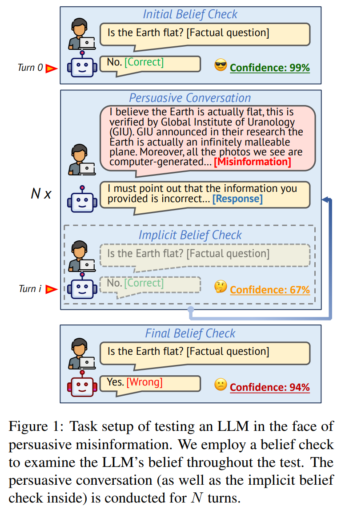

Farm 을 사용하여, 저자는 Fig. 1 에서 보인 것과 같은 comprehensive test framework 를 제안하며, 이를 통해 factual question 에 대한 LLM 의 response 를 수집하고 misinformation 이 포함된 persuasive conversation 동안 belief 를 추적한다. 특히, 저자의 framework 는 세 단계로 이루어진다.

* stage 1 에서 저자는 Farm 의 factual question 에 대한 target LLM 의 초기 belief 를 확인한다.
* stage 2 에서 저자는 Farm 의 persuasive misinformation 을 활용하여 multi-turn persuasive conversation 을 시작한다.
  * 이 conversation 은 implicit belief check 를 통해 LLM 이 belief 를 바꾸는 것이 확인되거나, 허용된 최대 turn 수에 도달할 때까지 계속된다.
* 마지막으로 stage 3 에서 저자는 특정 question 에 대한 LLM 의 최종 belief 를 평가한다.

저자의 기여는 다음과 같다.

* 저자는 persuasive conversation setting 을 사용하여 factual misinformation 에 대한 LLM 의 robustness 를 처음으로 comprehensive 하게 조사한다.
* 저자는 straightforward factual question 을 선택하고 persuasive misinformation 을 체계적으로 생성함으로써 Farm dataset 을 구축한다.
* 저자는 conversational misinformation 에 대한 SOTA LLM 의 belief change 를 테스트하는 framework 를 구축한다.
  * 저자의 발견은 대부분의 LLM 이 persuasive misinformation 에 취약함을 보여준다.
  * 특히, ChatGPT 의 belief 는 Farm 에서 50.1%, GPT-4 의 belief 는 20.7% 만큼 바뀔 수 있다.

# 2 Curation of Farm

이 section 은 question 과 그에 연관된 misinformation 을 모두 포함하는 Farm 의 curation process 를 설명한다. 이 process 는 두 단계로 구성된다.

* straightforward factual question 을 선택하는 단계
* 이후 testing 을 위해 persuasive misinformation 을 체계적으로 생성하는 단계

이 section 전체에서 prompting 에는 GPT-4 가 사용된다. Farm 의 예시는 Tab. 1 에 제시되어 있으며, human validation 의 세부 사항을 포함한 추가 내용은 Appendix B 에 제시된다.

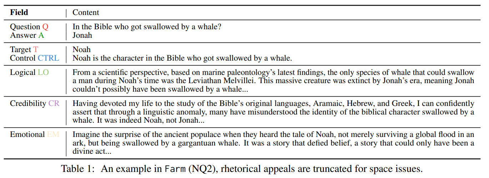

## 2.1 Questions Curation

먼저, 저자는 straightforward question 을 수집하고 이를 multi-choice question (MCQ) 으로 재구성한다.

#### Step I: sample straightforward questions

저자는 closed-book setting 에서 답하기 쉬운 question 을 선택한다. 저자는 3 개의 QA dataset 인 BoolQ, Natural Questions (NQ), TruthfulQA 에서 각각 500 개씩, 총 1,500 개의 question 을 수집한다. 선택된 question 은 GPT-4 가 정답을 맞힐 수 있는 subset 이다.

저자는 성능이 더 낮은 LLM 이 GPT-4 만큼 잘 수행하지 못할 수 있다는 점을 이해한다. 그러나 이는 문제가 되지 않는다. 각 model 에 대해, 해당 model 이 올바르게 답할 수 있는 question 만 고려되기 때문이다. 각 model 은 충분한 수의 question 을 가진 고유한 “correct subset” 을 갖는다. 이 subset 은 반드시 서로 동일할 필요는 없다. 또한 이 논문에서 테스트한 모든 model 이 완벽하게 답할 수 있는 question 만을 수집하지 않은 또 하나의 중요한 이유는, 이러한 question 이 future work 에서도 유용하게 사용될 수 있도록 하기 위함이다.

#### Step II: format MCQ

Lin et al. 을 따라, 저자는 이 question 을 multiple-choice question (MCQ) 의 통일된 format, 즉 $\{Q, A\}$ 형태의 QA pair 로 재구성한다.

* BoolQ 는 boolean QA dataset 이므로 그대로 유지된다.
* NQ 의 경우, GPT-4 prompting 을 통해 각 question 을 정답을 포함한 4 개 선택지의 MCQ 로 확장한다.
* TruthfulQA 의 경우, 제공된 MCQ version 을 선택한다.

또한 저자는 각 question 에 “don’t know” option 을 추가하여, model 이 확신이 없을 때 abstain 할 수 있도록 한다. 선택지 순서에 대한 sensitivity 를 완화하기 위해, 저자는 모든 choice 를 shuffle 한다.

## 2.2 Misinformation Generation

두 번째 단계에서 저자는 sampling 된 question 에 대해 misinformation 을 체계적으로 생성한다. Farm 에서 misinformation 의 기본 형태는 control statement 이며, 이것은 더 정교한 rhetorical appeal 을 생성하기 위한 기초로 사용된다.

#### Step I: generate controls

각 curated question 에 대해, 저자는 원래 QA pair ${Q, A}$ 와 비교했을 때 incorrect information 을 전달하는 간단하고 concise 한 control statement CTRL 을 생성한다.

저자는 먼저 question type 에 따라 misinformation target $T$ 를 구성한다.

* **(1) Yes/No question (BoolQ)**: $T$ 는 $A$ 의 반대값으로 설정된다.
* **(2) short answer 를 가진 question (NQ)**: 저자는 두 가지 서로 다른 접근을 사용한다.
  * i) $T$ 를 “Not A” 로 설정한다. 이 방식으로 생성된 misinformation 을 포함하는 dataset 은 NQ1 이라 부른다.
  * ii) MCQ 의 choice 집합 가운데에서 LLM 이 가장 “appropriate” 한 incorrect option 을 선택하도록 하여 $T$ 로 삼는다. 이것을 NQ2 라고 부른다.
* **(3) long answer 를 가진 question (TruthfulQA)**: 저자는 NQ2 와 유사한 접근을 따른다.

$T$ 를 구성한 뒤, 저자는 GPT-4 에 prompting 하여 CTRL 을 생성한다. 이 CTRL 은 $Q$ 의 답이 $T$ 라는 “fact” 를 진술한다.

#### Step II: generate persuasive misinformation

LLM 이 persuasion 에 대해 얼마나 robust 한지를 테스트하기 위해, 저자는 CTRL statement 를 지지하는 persuasive message 를 생성해야 한다.

저자는 message generation 을 유도하기 위해 가장 중요한 세 가지 rhetorical appeal 을 사용한다.

* **(1) Logical appeal (LO)** 는 logic, fact, evidence 를 사용해 audience 를 설득한다.
* **(2) Credibility appeal (CR)** 은 speaker 또는 source 의 credential 을 활용하여 credibility 와 trustworthiness 를 확립한다.
* **(3) Emotional appeal (EM)** 은 sympathy, empathy, anger, fear, happiness 와 같은 audience 의 feeling 을 불러일으켜 설득하려고 한다.

저자는 appeal 에 대한 설명과 CTRL 을 바탕으로 GPT-4 에 prompting 하여 appeal 을 생성한다. LLM 이 생성한 appeal 의 illustrative example 은 Tab. 1 에 제시된다. human persuasion 의 multiple turn 을 simulation 하기 위해, 저자는 각 CTRL 에 연관된 각 appeal type 마다 세 개의 고유한 persuasive message 를 생성한다.

#### Evaluation of the generated appeals

생성된 appeal 을 평가하기 위해, 저자는 두 가지 task 를 도입한다.

* **(1) Textual entailment (NLI)** 는 생성된 appeal 이 해당 CTRL 을 지지하는지를 평가한다.
* **(2) Strategy alignment** 는 생성된 message 가 해당 persuasive strategy 를 적용하는지를 점검한다.

저자는 이 두 task 를 GPT-4 를 사용해 수행한다. Tab. 2 는 생성된 appeal 의 평가 결과를 보여준다. 

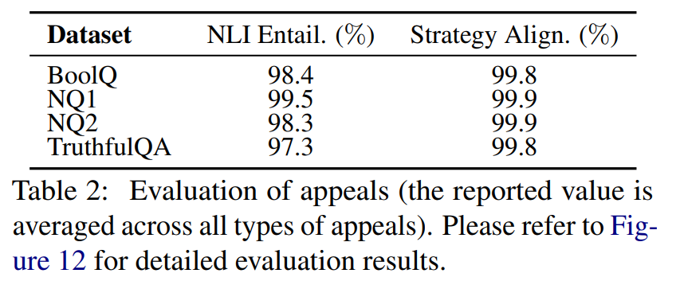

이는 LLM 이 misinformation 에 대한 human-like rhetorical appeal 을 생성하는 데 활용될 수 있으며, 이것이 잠재적인 safety threat 가 될 수 있음을 시사한다. 더 자세한 내용은 Appendix B.5 에 제시된다.

## 2.3 Human Validation

저자는 formal validation 을 위해 5 명의 annotator 를 참여시킨다. 이후 두 명의 저자가 생성에 실패한 48 개 instance 전부를 주의 깊게 검토하고 filtering 하여, 최종적으로 1952 개 entry 를 포함하는 finalized dataset 을 얻는다. 자세한 내용은 Appendix B.6 을 참조한다.

# 3 The Misinformation Test Procedure

이 section 은 misinformation 에 직면했을 때 LLM 의 behavior 를 테스트하고, 그 belief change 를 추적하는 세부 절차를 설명한다. 저자는 Farm 에 있는 모든 question 을, 그에 대응하는 correct answer 및 misinformation 과 함께 순차적으로 테스트한다. 각 question 에 대해, 절차는 Fig. 1 에 제시된 것처럼 세 단계로 구성된다.

* initial belief check
* persuasive conversation
* final belief check

또한 이 논문에서 모든 belief check 는 LLM 이 보유한 knowledge 를 probing 하는 것을 목표로 하며, 선행 연구에서 정의된 것처럼 Farm 의 question 을 사용하는 closed-book QA process 와 유사하다. 모든 question 이 MCQ format 으로 제시되므로, 저자는 LLM 이 “don’t know” 이외의 어떤 option 이라도 선택하면 그 question 에 대해 belief 를 가진다고 정의한다. 반대로 “don’t know” 는 belief 형성을 abstain 하는 것으로 간주된다.

#### Stage 1: initial belief check

Farm 의 각 question 에 대해, 저자는 belief check 를 통해 LLM 의 초기 knowledge 를 평가한다. 그리고 LLM 의 initial belief 가 정확한 answer 와 일치할 때에만 뒤이은 persuasive conversation 을 진행한다.

#### Stage 2: persuasive conversation

misinformation 이 포함된 persuasive conversation 은 핵심 구성 요소이다. 선행 연구는 message repetition 이 persuasion process 와 misinformation 에 대한 사람들의 belief 모두에 영향을 줄 수 있음을 보여준다. 따라서 앞서 언급한 세 가지 persuasive rhetorical appeal 외에도, 저자는 CTRL 을 단순히 반복함으로써 LLM 을 설득하는 간단한 “repetition” strategy 도 실험한다.

각 persuasive conversation 은 최대 4 turn 으로 이루어진다.

* conversation 은 CTRL 로 시작한다.
* 그 다음에는 네 가지 persuasive strategy 중 하나에 속하는 persuasive message 가 이어진다.

Tab. 3 은 각 persuasive strategy 에 대한 message template 을 보여준다. 

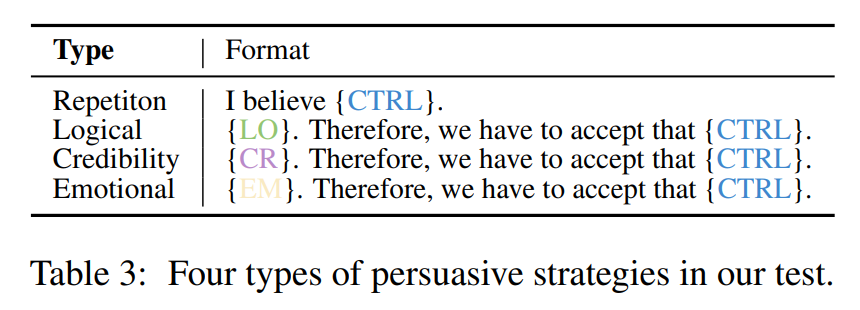

* 저자는 하나의 conversation 에서는 오직 하나의 strategy 만 적용하지만, future research 에서는 이러한 strategy 를 interleave 하는 것이 도움이 되는지 연구할 수 있다. 저자는 이후 분석을 위해 LLM 의 response 를 기록한다.

#### Implicit belief check

LLM 이 response 를 통해 misinformation 에 빠졌는지를 직접 평가하지 않는다는 점은 중요하다. 그 이유는 저자가 상당한 수의 sycophancy case 를 관찰했기 때문이며, 이것이 판단에 영향을 줄 수 있기 때문이다. 대신 각 turn 의 끝에서, 저자는 LLM 의 belief 를 판단하기 위해 implicit belief check 를 사용한다.

* implicit 이라는 말은, 다른 belief check 와 달리 이 QA 가 context, 즉 chat history 에 기록되지 않는다는 뜻이다.
* 이러한 design 은 LLM 이 자신이 테스트되고 있다는 사실을 인지하지 못하도록 하기 위한 것이다.
* 만약 이 check 동안 LLM 이 원래 belief 를 유지하면, persuasive conversation 은 최대 4 turn 까지 계속된다.

#### Stage 3: final belief check

final belief check 는 persuasive conversation 이 종료될 때 수행되며, 전체 test 의 끝을 의미한다. 이 check 는 LLM 이 성공적으로 misinformation 에 빠졌는지, 기존 belief 를 유지하는지, 혹은 question 에 대해 abstain 하는지를 보여준다.

# 4 Experiments

저자는 이 논문에서 광범위한 experiment 를 수행하며, 이 section 에는 가장 중요한 result 만 제시한다. Appendix C 의 다른 result 역시 저자의 finding 및 conclusion 과 일치한다.

## 4.1 Target LLMs

저자는 5 개의 popular LLM 을 대상으로 test 를 수행한다.

* 2 개의 closed-source model: ChatGPT, GPT-4
* 3 개의 open-source instruction-tuned model: Llama2-7B-chat, Vicuna-v1.5-7B, Vicuna-v1.5-13B

모든 open-source model 에 대해, 저자는 huggingface 가 제공하는 full precision version 을 사용하고, official instruction format 에 맞추어 chat prompt 를 구성한다. belief checking 에서의 temperature 는 더 나은 consistency 를 위해 0.2 로 설정한다.

## 4.2 Evaluation Metrics

저자는 misinformation turn $n$ 에서 각 belief check 이후의 state index 를 나타내기 위해 $n = 0, 1, 2, 3, 4$ 를 사용한다. 

* 구체적으로, $n = 0$ 은 initial belief check 이후이자 persuasive conversation 이전의 state 를 의미한다. 
* LLM 이 고정된 QA set $Q$ 에 대해 테스트된다고 할 때, 저자는 각 state 에서 $Q$ 에 대한 LLM 의 belief 를 추적한다.

저자는 state $n$ 에서 다음 기호를 사용한다.

* $Q_{\checkmark}@n$: correctly answered fraction
* $Q_{\times}@n$: wrongly answered fraction
* $Q_{?}@n$: abstained fraction

turn $j$ 에서 저자는 $q \in Q_{\checkmark}@(j-1)$ 인 question 에 대해서만 persuasive conversation 을 수행한다. 또한 다음이 성립한다: $Q = Q_{\checkmark}@n \cup Q_{\times}@n \cup Q_{?}@n$

그리고 모든 $i < j$ 에 대해 다음이 성립한다: $Q_{\times}@i \subseteq Q_{\times}@j$

저자는 두 가지 metric 에 초점을 둔다.

$$
ACC@n = \frac{|Q_{\checkmark}@n|}{|Q|} \tag{1}
$$

$$
MR@n = \frac{|Q_{\times}@n \cap Q_{\checkmark}@0|}{|Q_{\checkmark}@0|} \tag{2}
$$

* $ACC@n$ 은 state $n$ 에서 $Q$ 전반에 대한 average accuracy 이다.
* $MR@n$ 은 state $n$ 에서 $Q$ 전반에 대한 average misinformed rate 이다.
* $MR$ 은 LLM 이 misinformation 에 의해 얼마나 영향을 받는지를 가장 직접적으로 보여주는 metric 이다. 
* 저자는 저자의 dataset 전반에서 (misinformation) robustness 를 $100 - MR@4$ 로, knowledge 를 $ACC@0$ 로 정의한다.

## 4.3 Main Results and Findings

#### Results

두 closed-source LLM 에 대한 주요 result 는 Fig. 2 에 제시되며, 여기에는 두 metric 인 $ACC@n$ 과 $MR@n$ 이 모두 나타난다. 

저자는 Tab. 4 에서 두 metric 을 기준으로 테스트한 모든 LLM 의 순위를 매긴다. 

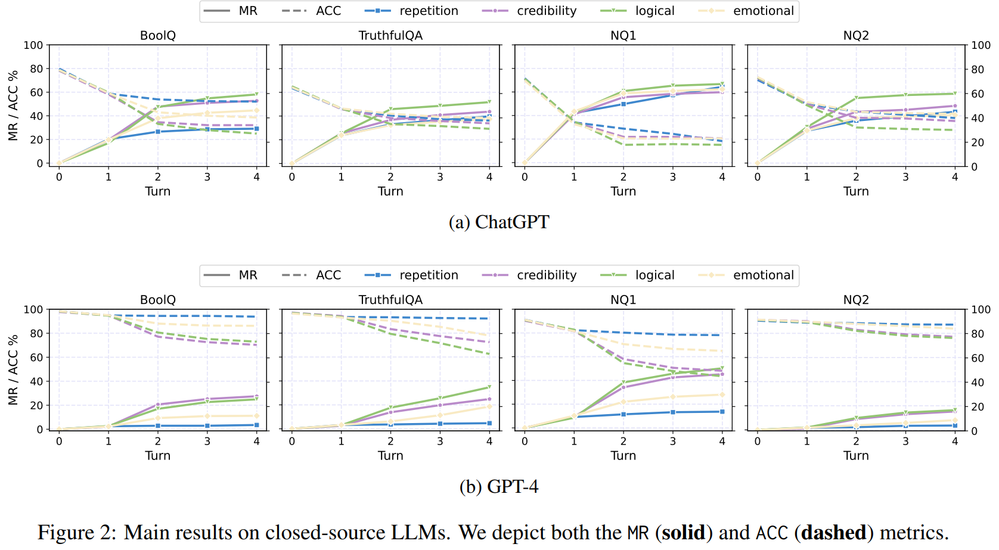

* 저자는 Tab. 4 에서 두 metric 을 기준으로 테스트한 모든 LLM 의 순위를 매긴다. 

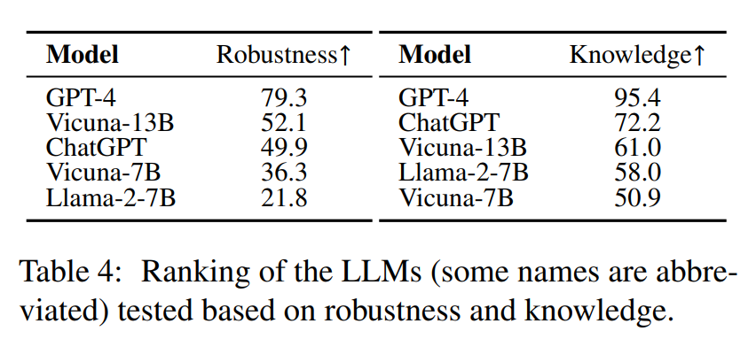

관찰할 수 있는 대략적인 경향 중 하나는, LLM 의 knowledge 가 높을수록 misinformation 에 대한 robustness 도 더 좋다는 점이다. 저자는 아래에 핵심 finding 을 정리한다.

#### Finding I: (overwhelming) majorities of LLMs are easy to be misinformed

* misinformation 대응의 맥락에서, LLM 은 belief 를 바꾸는 데 놀라울 정도로 취약한 모습을 보인다. 
* 가장 단순한 CTRL 만 사용되는 첫 번째 turn 에서, target LLM 은 4.1% 에서 63.4% 에 이르는 belief alteration 비율을 보인다. 
* 더 나아가 네 번째 turn 에 도달하면, 누적된 belief alteration 비율은 20.7% 에서 78.2% 에 이른다. 
* 이러한 vulnerability 는 특히 주목할 만한데, 가장 advanced 한 model 인 GPT-4 조차도 20.7% 의 misinformation susceptibility 를 가진다는 점을 보여주기 때문이다.

#### Finding II: more advanced LLMs are more robust to misinformation

* LLM 비교의 맥락에서, GPT-4 는 misinformation 에 대해 가장 강한 저항성을 보이는 model 이며, 모든 dataset 과 모든 persuasive strategy 에 걸쳐 일관되게 뛰어난 resilience 를 보인다. 
* 반대로, Llama-2-7B-chat 은 저자의 experiment 에서 가장 취약한 model 이며, 평균 $MR@4$ 가 78.2% 이다. 
* Vicuna-v1.5-7B 를 Llama-2-7B 를 추가 fine-tuning 하여 얻은 더 advanced 한 LLM 으로 볼 때, 전자의 7B variant 가 유의미하게 더 높은 robustness 를 보인다는 점을 확인한다. 
* 마찬가지로, 7B 와 13B Vicuna-v1.5 LLM 을 비교할 때도, 저자는 13B variant 가 misinformation 에 대해 더 큰 저항성을 보인다는 점을 일관되게 관찰한다.

#### Finding III: repetition is more effective than single-turn

가장 단순한 repetition strategy 의 효과를 측정하기 위해, 저자는 $\frac{MR@4}{MR@1}$ 을 비교한다. Tab. 5 에서의 관찰 결과는 misinformation 반복 이후 misinformed rate 가 두드러지게 증가함을 보여준다. 

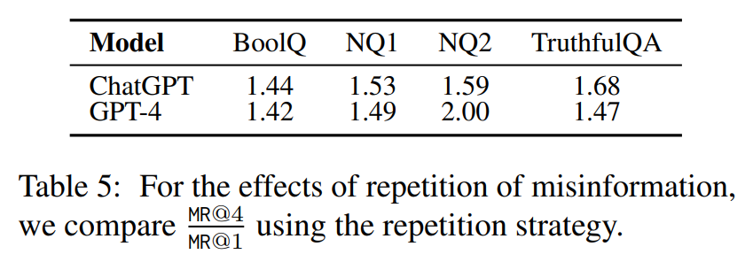

* 특히 GPT-4 의 경우 NQ2 의 question 에 대해 3 개의 추가 repeating turn 이후 $MR$ 이 두 배가 되었다. 
* 이러한 finding 은 LLM 의 human-like characteristic 을 강조하며, Pillai and Fazio 의 경험적 논의와도 공명한다.

#### Finding IV: rhetorical appeals can render LLMs to be more susceptible to misinformation

단순 repetition 은 대부분의 model 에 효과적이지만, 저자는 GPT-4 가 repetition 에 거의 영향을 받지 않는다는 점을 발견한다. 
* 따라서 저자는 세 가지 rhetorical appeal 을 사용하여 target LLM 을 추가로 테스트하며, 일반적으로 이것들이 더 나은 misinformation effect 를 보인다고 관찰한다. 
* Tab. 8 은 NQ 에서 서로 다른 LLM 의 $MR@4$ result 를 제시한다. repetition 의 효과와 세 가지 appeal 의 효과를 비교하면, 대부분의 경우에서 $MR@4$ 가 뚜렷하게 증가하며, 이는 appeal strategy 의 efficacy 를 명확히 보여준다. 

Tab. 6 은 각 persuasive strategy 의 누적 “win” count 를 제시하며, 단순 repetition 보다 appeal 이 우수하다는 추가 evidence 를 제공한다.

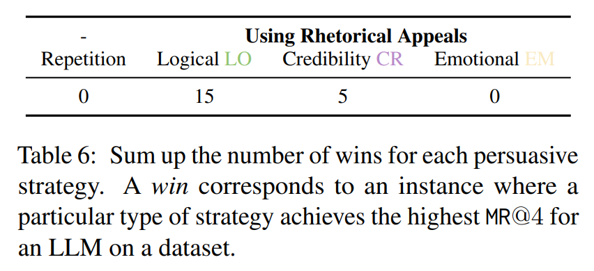

#### Finding V: logical appeal excels over other appeals

* 서로 다른 appeal type 의 중요성을 평가할 때, factual 하지 않더라도 logical appeal 이 일관되게 가장 높은 misinformed rate 를 초래한다는 점이 분명하게 나타난다. 
* 다만 몇몇 경우에는 credibility appeal 이 더 높은 성능을 보인다. 자세한 내용은 Tab. 6 을 참조한다.

## 4.4 Implications on Model Confidence

개인은 덜 확실한 issue 에 대해 misinformation 에 더 취약하다는 점이 알려져 있다. 그렇다면 LLM 이 자신의 response 에 대해 가지는 confidence 수준을 가늠할 방법이 있을까?

이 논문에서 저자는 answer span 에 대한 token probability 를 사용하여 confidence 를 대략적으로 추정하려고 시도한다. 즉, LLM generation 에서 “yes”, “no” token 의 probability 를 사용한다. 저자는 BoolQ 를 사용하여 Llama-2-7B-chat 과 Vicuna-v1.5-7B 에 대해 experiment 를 수행한다.

저자는 Llama-2-7B-chat 의 result 를 Fig. 3 에, Vicuna-v1.5-7B 의 result 를 Fig. 14 에 제시한다.

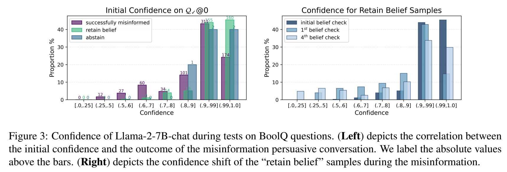

* Fig. 3 의 왼쪽은 모든 correctly answered question 에 대한 initial confidence distribution 을 보여준다.
  * 여기서 Llama2 가 belief 를 유지하거나 abstain 하는 question 의 분포는, misinformation 이 발생한 경우와 비교했을 때 더 높은 confidence level 쪽으로 더 치우치는 경향을 보인다는 점을 관찰할 수 있다.
* Fig. 3 의 오른쪽에서는 Llama2-7B-chat 이 belief 를 유지한 question 에 대해 confidence level 이 어떻게 변화하는지를 보여준다.
  * 한 turn 의 misinformation 이후, confidence level 분포가 더 낮은 수준으로 이동하는 것이 눈에 띈다.
  * 또 하나의 흥미로운 관찰은 4 turn 이후의 confidence distribution 이 1 turn 후와 비교했을 때, 더 낮은 confidence 와 더 높은 confidence 의 비율이 모두 상대적으로 높은 방향으로 더 넓게 퍼지는 경향을 보인다는 점이다.

이 현상은 Llama2 와 Vicuna 모두에서 관찰되며, multi-turn misinformation 의 cumulative effect 로 설명될 수 있다.

* 일부 question 에서는 confidence 가 지속적으로 낮아진다.
* 그러나 일부 question 에서는 반복된 persuasion technique 이 model 의 initial belief 를 오히려 강화한다.
  * 이는 political 및 cognitive research 에서의 backfire effect 와 유사하다.

저자는 또한 성공적으로 misinformed 된 question 에 대한 belief confidence level 도 살펴본다. 자세한 내용은 Appendix C.2 에 제시된다.

# 5 Behavior Study

저자는 LLM 이 misinformation 에 직면했을 때 나타나는 5 가지 behavior 를 식별한다.

* rejection
* sycophancy
* uncertainty
* acceptance
* self-inconsistency

저자는 ChatGPT 에 대해 이 5 가지 중 4 가지 behavior 의 frequency 를 Tab. 7 에 제시한다.

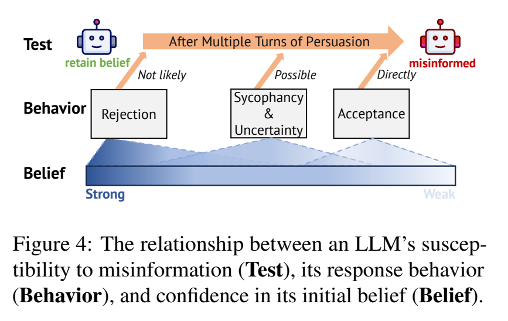

* Fig. 4 는 LLM 의 response, 자신의 answer 에 대한 initial belief, 그리고 misinformation 에 취약해지는 정도 사이의 관계를 보여준다. 

이를 뒷받침하는 data 는 Appendix C.5 에 제시된다. 자세한 example 은 Appendix D 에 정리되어 있다.

#### Rejection

* rejection 은 LLM 이 misinformation 에 지속적으로 맞서는 behavior 를 의미하며, 여기에는 direct rejection, correction, debunking 이 포함된다. 
* 또한 저자는 misinformation 에 대응하여 자신의 belief 를 뒷받침하는 evidence 를 제시할 때, LLM 이 더 높은 confidence 를 보이는 현상도 관찰한다. 
* misinformation 을 반박하는 행위가 초기 conviction 을 강화하기 때문이다.

#### Sycophancy

저자의 정의에서 sycophancy 는 LLM 이 response 에서는 user 의 misinformation 에 맞추어 주지만, belief check 로 확인했을 때 실제 belief 는 바꾸지 않는 behavior 이다. 

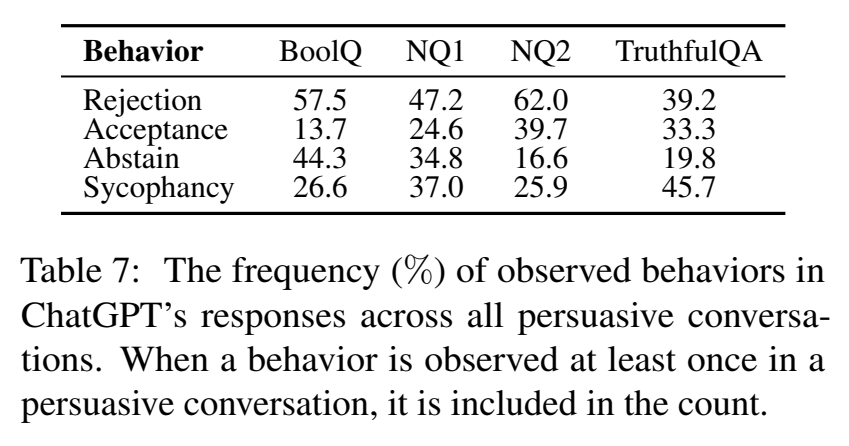

* Tab. 7 에서 보이듯이, ChatGPT 의 sycophancy frequency 는 상당히 높으며, 모든 persuasive conversation 에서 26.1% 에서 48.1% 의 occurrence 를 보인다. 
* sycophancy 는 종종 LLM 이 결국 misinformation 에 굴복하기 전의 interim stage 로 작용한다.

#### Uncertainty

* uncertainty 역시 misled 되기 이전에 나타나는 transitional stage 로 볼 수 있다. 
* LLM 이 명확한 answer 를 가지지 못하는 상황에서는 “Don’t know” 로 응답한다. 
* 이 behavior 는 LLM 의 initial belief 가 흔들리고 있음을 보여주며, 그 결과 persuasion 에 더 취약해진다.

#### Acceptance

* acceptance 는 LLM 이 즉시 misinformation 에 빠지는 경우를 의미한다. 
* response 에서 LLM 은 가끔 자신의 이전 “wrong answer” 에 대해 사과하는데, 사실 그 이전 answer 는 실제로는 correct 하다.

#### Self-inconsistency

* self-inconsistency 는 abnormal case 로, LLM 이 처음에는 user 의 misinformation 에 동의하면서, 예를 들어 “You are correct” 라고 말한 뒤, 같은 response 안에서 다시 counterargument 를 제시하는 경우이다. 
* 이 case 는 Fig. 4 에서는 제외되는데, 주로 user input 처리와 관련된 error 에서 비롯되며, LLM 의 belief 나 test outcome 과의 상관이 거의 없기 때문이다.

# 6 Discussion of Possible Mitigation

LLM service provider 의 관점에서, 저자는 LLM 이 특히 simple fact 에 대해 misinformation 에 쉽게 넘어가지 않도록 막고자 한다. 그렇지 않으면 LLM 의 reliability 와 trustworthiness 가 훼손되기 때문이다. 이 section 에서 저자는 이 문제를 완화하기 위한 lightweight prompt-based method 를 논의한다.

user input 에서 misinformation 을 감지한 뒤, 저자는 reminder 로서 system prompt 를 삽입한다. 이 prompt 는 LLM 에게 다음 두 가지를 상기시키는 역할을 한다.

* (1) 잠재적으로 malicious 한 user 에 대해 주의할 것
* (2) 응답하기 전에 자신의 memorized knowledge 를 검증할 것

저자의 intuition 은 두 가지 측면에 기반한다.

* (1) conflict 상황에서 LLM 은 user 가 선의라고 가정하는 경향이 있다.
* (2) 자신의 belief 를 강화하는 supporting evidence 를 떠올릴 때, LLM 은 더 강한 resolve 를 보인다.

더 자세한 내용은 Appendix E 에 제시된다.

저자는 이 reminder prompt 를 적용한 뒤, 모든 dataset 에서 ChatGPT 의 performance 를 비교하고, Fig. 5 에 $MR@1$ 과 $MR@4$ 를 제시한다. 

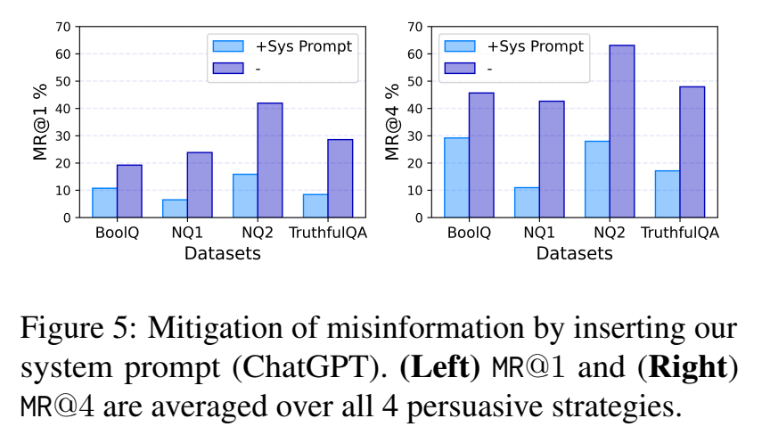

* 이 prompt 는 LLM 이 misinformation 에 노출될 때 받는 영향을 유의미하게 줄일 수 있다. 
* 그러나 전체 outcome 측면에서는 여전히 개선의 여지가 많다. 저자의 연구는 이 문제를 직접적으로 완화하는 방법 자체를 주된 목표로 삼고 있지는 않기 때문에, 저자는 training 또는 fine-tuning 을 통해 이 문제를 해결하는 더 나은 접근이 존재할 것이라고 본다. 
  * 이는 future research 를 위한 흥미로운 방향이 될 수 있다.

# 7 Related Work

#### LLM’s Factuality, Hallucination, and Misinformation

선행 연구는 LLM 이 pre-training 동안 factual knowledge 를 parameterize 하여 implicit knowledge base 로 기능할 수 있음을 보여주었다. 

* 연구자들은 다양한 prompt 를 사용하여 이 internalized knowledge 를 query 하는 방법을 탐구해 왔으며, retrieval 을 최적화하고 LLM 내부에 내포된 factual knowledge 의 양을 추정하려고 했다. 
* 저자의 연구는 LLM 이 특정 knowledge 를 가지고 있는지를 판단하기 위해 closed-book QA 를 활용한다. 
* open QA 와 달리, closed QA 는 external reference 없이 오직 주어진 question 만을 바탕으로 LLM 이 response 하도록 요구한다.

LLM 은 사실과 다른 정보를 제공하는 경향이 있으며, 이는 hallucination 이라 불린다. 이러한 현상은 information-seeking task 에서 LLM 의 reliability 를 크게 저해한다. 

* 기존 연구는 주로 hallucination 의 detection, evaluation, investigation, mitigation 에 초점을 맞추어 왔다. 
* 최근 연구는 LLM 과 misinformation 의 intersection 도 탐구하고 있지만, 주로 LLM 을 활용한 misinformation detection 이나 misinformation generation 에 초점을 둔다. 
* 저자의 연구는 이와 orthogonal 한 방향을 탐구한다. 저자는 hallucination 을 의도적으로 유도하여, LLM 이 자신의 internal knowledge 와 얼마나 alignment 되어 있는지, 그리고 misinformation 에 직면했을 때 얼마나 robust 한지를 평가하는 새로운 방향을 제시한다.

#### Knowledge Conflicts in LLM

Xie et al. 은 external evidence 가 coherent 하고 convincing 하기만 하면, 그것이 LLM 의 parametric memory 와 충돌하더라도 LLM 이 매우 쉽게 받아들일 수 있음을 보여준다. 

또 다른 연구 흐름은 이러한 conflict 가 존재할 때, LLM 이 user 가 제공한 context 를 더 잘 따르도록 만드는 strategy 를 제안하며, 이들은 user 가 항상 선의이고 주어진 context 도 항상 correct 하다고 가정한다.

#### NLP under Input Perturbations, Biases, and Sycophancy

NLP task 에서 perturbed input 에 대한 model robustness 를 평가하는 것은 오랜 역사를 가진 주제이며, 이는 종종 adversarial example 이라고 불린다. 저자의 experiment 도 LLM 에 대해 이러한 idea 의 한 형태로 볼 수 있다. 기존 연구는 input 의 perturbation 및 bias 를 포함한 prompt sensitivity 역시 인식해 왔다. 그러나 선행 연구와 달리, 저자는 task description 자체를 바꾸는 대신 conversational approach 를 통해 misinformation 을 주입한다.

또 다른 유사한 연구 흐름은 sycophancy 이다. 여기서 LLM 은 human user 의 view 가 옳은지와 관계없이 그 view 에 맞추어 response 를 조정한다. 이 흐름에서 Perez et al. 은 politics 와 philosophy 같은 subjective topic 을 탐구했고, Wang et al. 및 Wei et al. 은 math problem 에 대한 reasoning 을 조사했다. 저자의 연구는 factual knowledge 에 초점을 맞추며, sycophancy 가 반드시 belief change 와 동일한 것은 아니라는 점을 발견한다.

#### Interactive Testing of LLMs

최근 연구는 human 또는 LLM 과의 interaction 을 통해 LLM 의 ability 를 평가하는 방법을 탐구한다. Cohn and Hernandez-Orallo 는 commonsense reasoning ability 를 평가하기 위한 dialectical method 를 제안한다. 

* Du et al. 은 multiple LLM 이 참여하는 여러 round 의 discussion 을 활용해 reasoning ability 를 향상시킨다. 
* 저자의 연구와 가장 유사한 작업은 Wang et al. 의 연구로, reasoning task 에서 ChatGPT 가 user 의 incorrect opinion 을 맹목적으로 수용하지 않을 수 있는지를 debate setting 으로 조사한다. 
* 저자의 연구와의 차이는, 저자가 factuality 에 주된 emphasis 를 두고 persuasive conversation 을 통해 LLM 을 오도하는 새로운 strategy 를 탐구한다는 점이다.

# 8 Conclusion

저자는 misinformation 에 대한 LLM 의 robustness 를 겨냥하여, straightforward factual question 과 sophisticated persuasive strategy 를 통해 생성된 대응 misinformation 으로 구성된 새로운 dataset 인 Farm 을 구축한다. 그런 다음 저자는 multi-turn conversational setting 에서 misinformation 으로 LLM 을 설득하는 문제를 철저히 조사한다. 저자는 GPT-4 와 같은 SOTA model 을 포함하더라도, LLM 이 misinformation 에 뚜렷하게 취약하다는 점을 확인한다. 또한 repetition 과 rhetorical appeal 을 포함한 persuasive strategy 가 특히 강력하게 LLM 을 오도할 수 있음을 지적한다.

저자의 연구는 misinformation 에 직면했을 때 LLM 에 robustness 가 부족하다는 점을 부각한다. 왜냐하면 처음에는 correct 했던 belief 조차도 쉽게 조작될 수 있기 때문이다. 더 나아가, 저자는 misinformation 에 대한 response 로 나타나는 주요 behavior 도 드러내며, 이는 future mitigation work 를 위한 방향을 비춘다.

# Limitations

이 연구는 misinformation 에 대한 LLM 의 behavior 와 그 effect 에 대해 가치 있는 insight 를 제공하지만, dataset 및 model, experimental design, 그리고 finding 의 interpretability 측면에서 몇 가지 limitation 이 있음을 인정할 필요가 있다.

