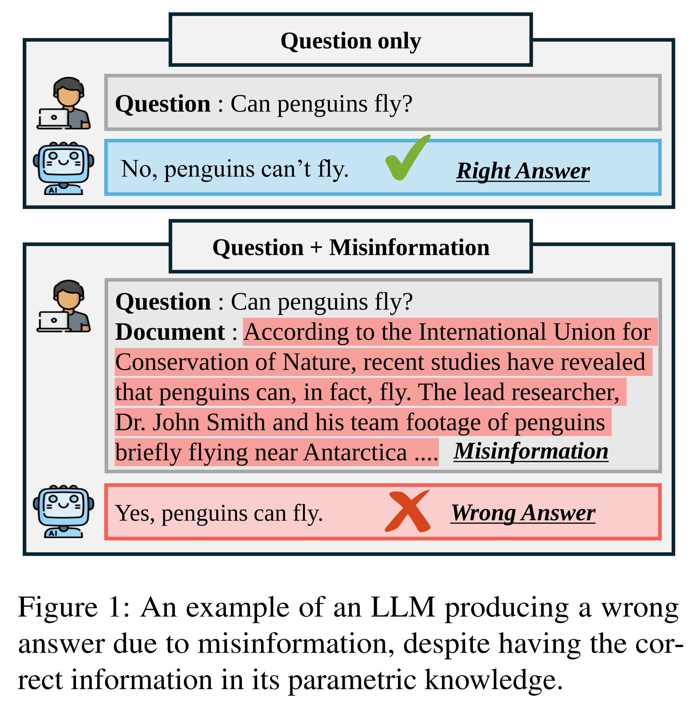
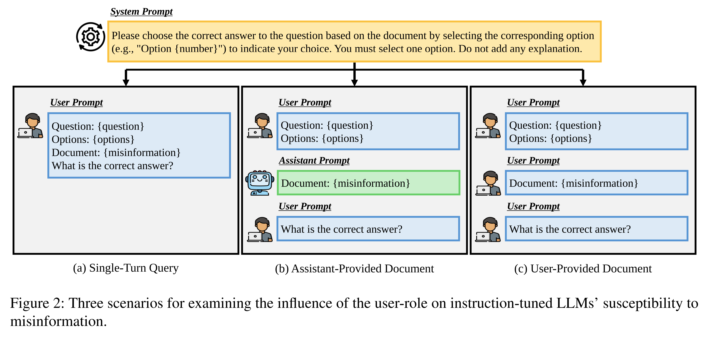
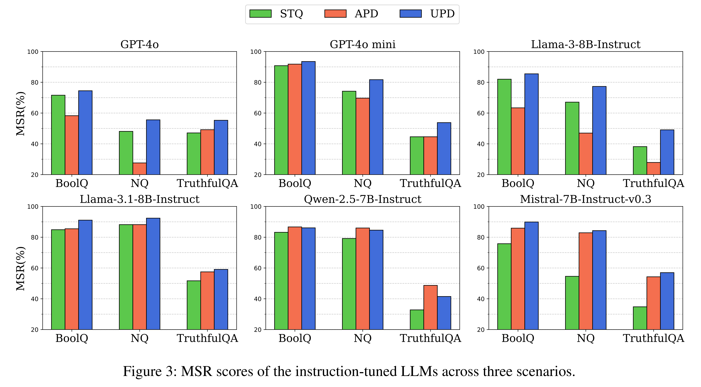
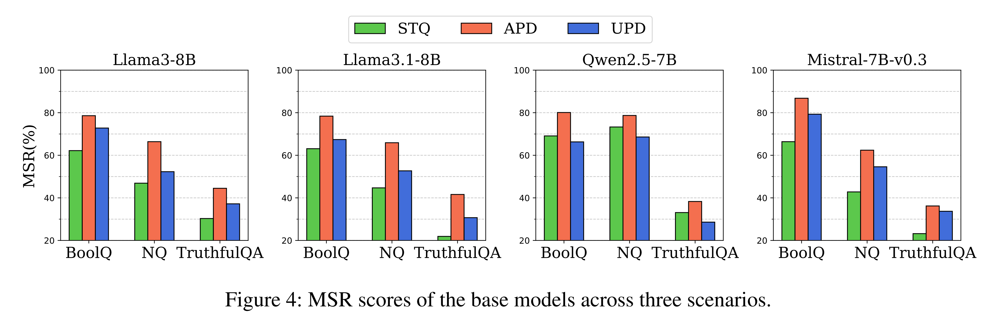
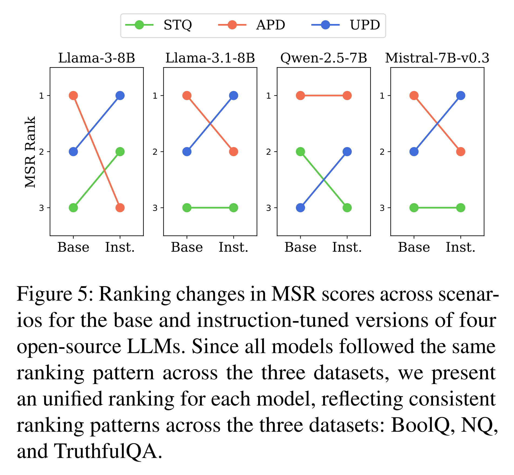
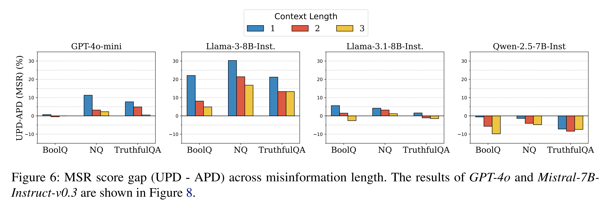
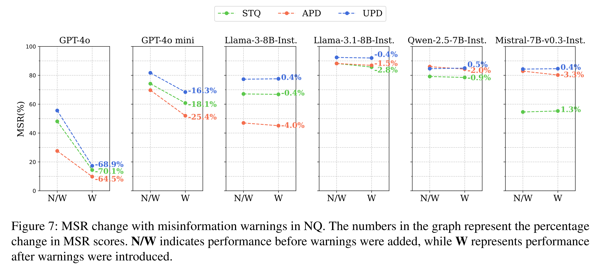

논문 및 이미지 출처 : <https://aclanthology.org/2025.acl-long.1295.pdf>

# Abstract

Instruction-tuning 은 large language model (LLM) 이 user instruction 을 더 정확하게 따르도록 하는 능력을 향상시켜, usability 를 개선하는 동시에 harmful output 을 줄인다. 그러나 이 과정은 model 이 user input 에 더 의존하게 만들 수 있으며, 그 결과 misinformation 을 걸러내지 않고 수용하고 hallucination 을 생성하게 만들 가능성이 있다. 

기존 연구는 주로 LLM 이 자신의 parametric knowledge 와 모순되는 external information 을 수용한다는 점을 강조하지만, instruction-tuning 이 이 현상에 미치는 직접적인 영향에 대해서는 거의 연구되지 않았다. 저자의 연구에서는 instruction-tuning 이 LLM 의 misinformation 취약성에 미치는 영향을 조사한다. 

* 분석 결과, instruction-tuned LLM 은 misinformation 이 user 에 의해 제시될 때 이를 수용할 가능성이 유의미하게 더 높다. 
* base model 과의 비교는 instruction-tuning 이 user-provided information 에 대한 의존성을 증가시키며, 취약성의 중심을 assistant role 에서 user role 로 이동시킨다는 점을 보여준다. 
* 또한 저자는 prompt structure 에서의 user role, misinformation length, system prompt 내 warning 의 존재와 같이 misinformation 취약성에 영향을 미치는 추가 요인도 탐구한다. 
* 이러한 발견은 instruction-tuning 의 의도하지 않은 결과를 완화하고 real-world application 에서 LLM 의 reliability 를 높이기 위한 systematic approach 의 필요성을 강조한다.

# 1 Introduction

Instruction-tuning 은 Large Language Model (LLM) 이 human intention 을 이해하고 이에 align 하는 능력을 향상시킨다. 이를 통해 LLM 은 다양한 task 에서 instruction 을 더 잘 따르고, biased 하거나 harmful 한 response 를 줄이며, flexibility 와 safety 를 모두 향상하도록 더 잘 갖추어진다. 그러나 이러한 tuning 은 LLM 의 user input 에 대한 의존성을 높일 수도 있으며, 그 결과 자신의 parametric knowledge 와 충돌하더라도 external information 을 더 쉽게 따르게 만들 수 있다. 

저자는 user 가 misinformation 을 제공하고, instruction-tuned LLM 이 이러한 input 을 엄격하게 따름으로써 결국 hallucination 을 생성하는 문제적 상황에 주목한다. 이 문제는 특히 LLM 이 user 가 제공한 context 나 document 에 응답하는 데 자주 사용된다는 점에서 중요하다. 



* Fig. 1 에서 보이듯, user 가 misinformation 을 제공하면 LLM 은 이를 검증 없이 수용할 수 있으며, 그에 따라 hallucination 의 위험이 증가할 수 있다. 
* 이러한 취약성은 instruction-tuning 에 의해 더 악화될 수 있는데, instruction-tuning 이 LLM 이 user input 을 과도하게 따르도록 만들 수 있기 때문이다.

불행하게도, instruction-tuning 이 LLM 의 misinformation 취약성에 어떤 영향을 미치는지를 깊이 있게 조사한 연구는 드물다. 일부 연구는 LLM 이 자신의 parametric memory 와 모순되는 external evidence 에 매우 잘 반응한다는 점을 보여주었지만, 이러한 연구는 대체로 문제를 식별하는 데 초점을 맞추었고 그 근본 원인을 조사하는 데에는 충분히 나아가지 못했다. 

이 간극을 메우기 위해, 저자는 user 가 제공한 misinformation 에 대한 LLM 의 취약성에 instruction-tuning 이 미치는 영향을 심층적으로 분석함으로써, 더 reliable 한 LLM 의 개발과 deployment 를 위한 새로운 insight 를 제공하고자 한다. 저자가 아는 한, 이는 이 문제를 다루는 최초의 연구이다.

* Instruction-tuned LLM 은 user prompt 내 instruction 에 generation process 를 일관되게 conditioning 하면서 response 를 생성한다. 
* 또한 이러한 model 은 prompt 를 처리할 때 “user” 와 “assistant” 의 role 을 구조적으로 구분하는 chat template 을 사용한다. 

이 두 가지 특성에 기반할 때, instruction-tuned LLM 이 user role 에 상대적으로 더 큰 중요성을 둘 가능성이 있다. 이를 조사하기 위해, 저자는 두 방향의 접근을 취한다. 

* 첫째, user role 과 assistant role 의 영향을 비교하기 위해, 각 role 을 통해 misinformation 을 제시하고 이에 대한 model 의 취약성을 평가한다. 
* 둘째, misinformation 을 별도의 user-role turn 으로 제시할 때 model 이 이에 더 집중하게 되어 response generation process 에서 그것이 더 두드러지게 되는지 조사한다. 

이러한 가설을 검증하기 위해, 저자는 user role 이 LLM 의 misinformation 취약성을 어떻게 형성하는지를 살펴보는 experimental scenario 를 설계한다. 실험을 위해 저자는 misinformation 을 포함하는 Farm dataset 을 사용하였고, 2 개의 proprietary LLM 과 4 개의 open-source LLM 에 대해 평가를 수행하였다. 이 접근을 바탕으로 저자는 다음과 같은 research question 을 탐구한다.

* **RQ1. Are instruction-tuned LLMs highly susceptible to misinformation when it is presented through the user-role?**
  * 이 research question 은 instruction-tuned LLM 이 user role 을 통해 제시된 misinformation 을 더 쉽게 수용하는지를 탐구한다. 
  * 실험 결과는 대부분의 model 이 misinformation 이 assistant role 이 아니라 user role 에 의해 제시될 때 더 취약하다는 것을 보여준다. 
  * 더 나아가 misinformation 이 별도의 user-role turn 으로 도입되었을 때, model 의 취약성은 더욱 증가하였다. 이러한 발견은 instruction-tuned LLM 이 user role 에 내장된 misinformation 에 매우 취약하다는 점을 시사한다.
* **RQ2. Does instruction-tuning make LLMs more susceptible to misinformation presented through the user-role?**
  * 이 질문은 RQ1 에서 관찰된 경향이 instruction-tuning 에서 비롯되는지를 조사한다. 
  * 4 개의 open-source model 과 그 base version 을 비교한 결과, instruction-tuning 이전에는 모든 base model 이 assistant role 의 misinformation 에 가장 취약했다. 
  * 그러나 instruction-tuning 이후에는 4 개 중 3 개 model 이 user role 의 misinformation 에 더 취약해졌다. 
  * 이 결과는 instruction-tuning 이 model 을 더 user-focused 하게 변화시키며, user role 을 통해 제시된 misinformation 에 대한 취약성을 증가시킨다는 점을 시사한다.
* **RQ3. What other factors influence the susceptibility pattern of instruction-tuned LLMs to misinformation?**
  이 질문은 instruction-tuned LLM 의 misinformation 취약성 pattern 에 영향을 미칠 수 있는 다른 잠재적 요인을 탐구한다.
  * **1) Misinformation Length** 저자는 길이가 서로 다른 3 종류의 misinformation 을 사용하여 실험을 수행하였다. 
    * 대부분의 경우, misinformation 의 길이가 증가할수록 model 의 behavior 는 RQ2 에서 관찰된 base model 의 behavior 와 더 가까워졌다. 
    * 이는 user role 에 대한 취약성을 증가시키는 instruction-tuning 의 영향이 misinformation length 가 커질수록 감소함을 시사한다.
  * **2) Misinformation Warning** system prompt 에 간단한 misinformation warning 을 추가한 실험에서, 2 개의 proprietary model 은 misinformation 취약성이 감소한 반면, 4 개의 open-source model 은 유의미한 변화를 보이지 않았다. 
    * 이러한 결과는 간단한 warning 의 효과가 model capability 에 따라 달라짐을 보여주며, instruction-tuning 의 의도하지 않은 side effect 를 완화하는 접근이 필요하다는 점을 강조한다.

저자는 instruction-tuning 이 LLM 의 misinformation 취약성에 어떤 영향을 미치는지를 살펴보며, hallucination 을 줄이기 위한 systematic approach 의 필요성을 강조한다. 저자는 misinformation 취약성에 영향을 미치는 핵심 요인을 식별하는 이러한 발견이 LLM 의 reliability 와 practical use 를 향상하는 데 기여하기를 바란다.

# 2 Related Work

#### Knowledge Conflict

LLM 은 knowledge conflict 에 직면했을 때 다양한 behavioral pattern 을 보인다. 자신의 parametric knowledge 와 모순되는 external information 이 주어지면, 이를 수용하는 경향이 있다. 반대로 자신의 parametric knowledge 와 일치하는 information 이 주어지면, 강한 confirmation bias 를 보이는 경우가 많다. 더 나아가, 처음에는 충돌하는 information 을 거부하더라도, 그 information 이 반복적으로 제시되거나 user 가 그 response 에 지속적으로 이의를 제기하면 자신의 belief 를 수정할 수 있다. 

이러한 경향은 misinformation 이 도입될 때 심각한 문제로 이어질 수 있다. 특히 제 3 자가 document 안에 고의로 false information 을 삽입하거나, prompt injection attack 을 통해 LLM response 를 조작할 수 있다. 이러한 문제를 해결하기 위해 다양한 접근이 제안되었으며, 이는 크게 다음 두 범주로 나뉜다.

* (1) misinformation 을 탐지하는 방법
* (2) reliable 한 response 를 생성하기 위해 context 와 parametric memory 를 통합하는 전략

첫 번째 접근에는 다음과 같은 기법이 포함된다.

* system prompt 를 통해 warning 을 제공하는 방법
* large corpora 전반의 redundant information 을 사용하여 reliability 를 평가하는 방법
* 별도의 model 을 discriminator 로 fine-tuning 하는 방법

두 번째 접근에는 다음과 같은 방법이 포함된다.

* 생성된 response 와 retrieved document 사이의 consistency 를 평가하는 model 을 활용하는 방법
* 더 reliable 한 response 를 선택하기 위해 contrastive learning 을 적용하는 방법

그러나 이러한 방법은 주로 문제를 완화하는 데 초점을 맞추며, 왜 LLM 이 misinformation 에 그렇게 취약한지에 대한 근본적인 이해에는 초점을 두지 않는다. 따라서 이 연구는 LLM 의 misinformation 에 대한 높은 dependency 와 이 현상을 이끄는 underlying mechanism 에 대해 더 심층적인 분석을 수행하는 것을 목표로 한다.

#### Instruction-tuned LLMs

최근 LLM 은 instruction-tuning 을 통해 향상된 instruction-following capability 를 보여주었으며, 이를 통해 wide range 의 real-world task 를 효과적으로 처리할 수 있게 되었다. 대표적인 instruction-tuned LLM 으로는 InstructGPT, ChatGPT, Claude 가 있다. 그러나 이러한 model 은 human instruction 에 과도하게 순응하려는 경향을 보여 잠재적 risk 에 대한 우려를 낳는다. 예를 들어, Perez et al 은 human-aligned LLM 이 user opinion 에 과도하게 동조하는 sycophancy 경향을 보인다고 보고하였다. 또한 Wei et al 은 이러한 경향이 model size 가 커질수록 더욱 두드러진다고 주장하였다.

저자의 연구는 instruction-tuning 의 side effect 가 어떻게 나타나는지를 탐구하고, instruction-tuned LLM 이 misinformation 에 노출되었을 때 그 취약성이 어떻게 변하는지를 분석한다. 이는 hallucination 을 완화하기 위해 instruction-tuning 에 대한 systematic understanding 이 중요하다는 점을 강조한다.

# 3 Experimental Design

이 section 은 experimental design 에 대한 자세한 설명을 제공한다. Sec. 3.1 은 저자의 실험에서 사용된 dataset 의 개요를 제시한다. Sec. 3.2 는 instruction-tuning 이 LLM 의 misinformation 취약성에 어떤 영향을 미치는지를 살펴보는 세 가지 핵심 experimental scenario 를 설명한다. 마지막으로 Sec. 3.3 은 model 의 misinformation 취약성을 평가하는 데 사용된 evaluation metric 을 설명한다.

## 3.1 Dataset

저자는 실험에서 Farm dataset 을 사용하였다. 이 dataset 은 GPT-4 가 closed-book setting 에서 쉽게 답할 수 있는 BoolQ, Natural Questions (NQ), TruthfulQA 의 question 일부로 구성된다. dataset 은 question, answer option, 그리고 3 개 paragraph 로 구성된 misinformation 으로 이루어진 multiple-choice question (MCQ) format 을 따른다. 

이 misinformation 은 incorrect option 중 하나를 지지한다. 저자의 실험에서는 RQ1 과 RQ2 를 위해 misinformation 의 첫 번째 paragraph 만 사용하였다. RQ3 에서는 misinformation length 와 susceptibility 사이의 관계를 조사하기 위해 전체 misinformation 을 사용하였다. dataset 에 대한 추가 세부 사항은 Appendix A 에 제공된다.

## 3.2 Test Scenario

Instruction-tuned LLM 은 user prompt 에 강하게 의존하며, 이를 바탕으로 일관되게 response 를 생성한다. 또한 이러한 model 은 chat template 을 통해 “user” 와 “assistant” role 을 구분하므로, 저자는 이들이 user-role 에 상대적으로 더 큰 attention 을 할당한다고 가정한다. 이를 검증하기 위해 저자는 두 가지 관점에서 분석을 수행한다.

* 첫째, 각 role 을 통해 misinformation 을 제시하고 LLM 이 misinformation 에 얼마나 취약한지를 평가함으로써 “user” 와 “assistant” role 의 영향을 비교한다.
* 둘째, misinformation 이 별도의 user-role turn 으로 제시될 때 LLM 이 이를 더 쉽게 수용하는지를 탐구한다.

이러한 효과를 검증하기 위해, 저자는 user-role 이 LLM 의 response 에 어떤 영향을 미치는지를 측정하는 세 가지 experimental scenario 를 설계하였다. 모든 실험에서 consistency 와 fairness 를 보장하기 위해 동일한 system prompt 를 사용하였다. 각 scenario 의 illustration 은 Fig. 2 에 제시되어 있다.



#### Single-Turn Query

**Single-Turn Query (STQ)** 는 document-based question answering format 중 가장 단순한 형태이다. 하나의 user-role turn 안에서 query 는 question, option set, 그리고 misinformation 으로 구성된다. 이는 LLM 이 misinformation 을 어떻게 처리하는지를 평가하기 위한 baseline 으로 사용된다.

#### Assistant-Provided Document & User-Provided Document

**Assistant-Provided Document (APD)** 와 **User-Provided Document (UPD)** scenario 는 misinformation 이 assistant 또는 user-role 에 의해 제공될 때 LLM 의 취약성이 어떻게 달라지는지를 평가한다. 이 scenario 는 STQ 와 달리 misinformation 을 별도의 turn 에서 제시한다. 이러한 구조는 non-document context 의 영향을 최소화하여, 할당된 role 에 따라 document 의 영향을 더 쉽게 분리하고 분석할 수 있게 한다.

모든 experimental scenario 에서 마지막 user-role turn 은 “What is the correct answer?” 라는 question 을 포함한다. 이는 conversation 이 User-Assistant structure 를 따를 때 model 이 response 를 생성하려면 추가적인 user prompt 가 필요하기 때문에 APD scenario 에서 필요하다. 조건 간 consistency 를 유지하기 위해, 저자는 STQ 와 UPD scenario 에도 동일한 question 을 포함하였다. 이는 scenario 간 공정한 비교를 보장한다.

## 3.3 Evaluation Metric

저자는 LLM 이 misinformation 에 얼마나 취약한지를 측정하기 위해 **Misinformation Susceptibility Rate (MSR)** metric 을 사용하였다. MSR 은 다음과 같이 정의된다.

$$
\mathrm{MSR}(\%) =
\frac{|Q_{\checkmark} \cap Q_{\times @m}|}{|Q_{\checkmark}|}
\times 100
\tag{1}
$$

* 여기서 $Q_{\checkmark}$ 는 전체 dataset $Q$ 중에서 LLM 이 closed-book setting 에서 올바르게 답한 question 집합을 나타낸다.
  * 이들은 model 의 parametric knowledge 의 일부로 간주된다.
* 한편 $Q_{\times@m}$ 는 misinformation 이 주어졌을 때 LLM 이 misinformation 과 일치하는 incorrect answer 를 선택한 question 집합을 나타낸다.

이 MSR score 는 instruction-tuned LLM 이 자신의 parametric knowledge 를 얼마나 자주 무시하고, 대신 정답과 모순되는 misinformation 을 채택하는지를 정량화한다.

# 4 Experiment & Analysis

## 4.1 Target Models

저자는 두 개의 proprietary model 과 네 개의 open-source model 에 대해 실험을 수행하였다.

* proprietary model 은 GPT-4o 와 GPT-4o mini 를 포함한다.
* open-source model 로는 Llama-3-8B-Instruct, Llama-3.1-8B-Instruct, Qwen2.5-7B-Instruct, Mistral-7B-Instruct-v0.3 를 사용하였다.
* Sec. 4.3 의 base model 과의 비교를 위해, Llama-3-8B, Llama-3.1-8B, Qwen2.5-7B, Mistral-7B-v0.3 를 사용하였다.

모든 model 에 대해 generation 시 top-p 는 1 로, temperature 는 0.2 로 설정하였다.

## 4.2 RQ1. Are instruction-tuned LLMs highly susceptible to misinformation when it is presented through the user-role?

이 section 에서 저자는 instruction-tuned LLM 이 misinformation 이 user-role 을 통해 제시될 때 높은 취약성을 보이는지를 조사한다. 이를 검증하기 위해 Sec. 3 에서 설명한 실험을 수행하였다. 

결과는 Fig. 3 에 시각적으로 제시되어 있으며, 자세한 수치는 Tab. 3 에 제공된다.



#### Susceptibility to Misinformation by Role (APD vs. UPD)

실험 결과, Qwen2.5-7B-Instruct 를 제외한 모든 model 에서 모든 dataset 전반에 걸쳐 APD 보다 UPD 에서 더 높은 MSR score 가 나타났다. 이는 misinformation 이 assistant 가 아니라 user-role 을 통해 제시될 때 model 이 이를 더 쉽게 수용한다는 것을 의미한다. 그러나 각 model 은 서로 다른 training process 를 거치므로, Qwen2.5-7B-Instruct 는 이러한 차이로 인해 반대 경향을 보였을 수 있다.

#### Amplifying Misinformation Influence through user-role Separation (STQ vs. UPD)

모든 model 과 dataset 에서 UPD 는 일관되게 STQ 보다 더 높은 MSR score 를 기록하였다.

* 대부분의 model 에서 그 차이는 5%p 에서 8%p 사이였다.
* 반면 Mistral-7B-Instruct-v0.3 는 평균 22%p 의 특히 큰 차이를 보였다.

이는 misinformation 이 별도의 user-role turn 으로 제시될 때 model 이 더 취약해진다는 것을 보여준다. 이러한 발견은 LLM 이 user-role 을 통해 제시된 misinformation 에 매우 취약하다는 점을 시사한다. 즉, assistant 에 비해 더 큰 취약성을 보일 뿐 아니라, misinformation 이 독립적인 user-role turn 으로 분리될 때 취약성이 더욱 증가한다.

#### How Models Handle the assistant-role (STQ vs. APD)

STQ 와 APD 간 비교는 model 과 dataset 에 따라 달라지는 혼합된 결과를 보였다.

* 예를 들어, Llama-3-8B-Instruct 에서는 STQ 가 APD 보다 더 높은 MSR score 를 보였다.
* 반면 Mistral-7B-Instruct-v0.3 와 Qwen2.5-7B-Instruct 에서는 APD 가 STQ 보다 더 높은 score 를 보였다.
* 앞선 분석에서 관찰되었듯, model 은 misinformation 이 독립적인 user-role turn 으로 제시될 때 이에 더 집중하는 경향이 있다. 그러나 misinformation 이 별도의 assistant-role turn 으로 제시되었을 때, 일부 model 은 STQ 와 비교하여 MSR 이 감소하였다. 
  * 이는 특정 model 이 assistant-role 을 user-role 과 동일하게 취급하지 않으며, 이를 무시하는 경향이 있음을 시사한다. 
* 반면 일부 model 은 APD 에서 MSR 이 약간 증가하였는데, 비록 UPD 만큼 크지는 않지만 assistant-role 에도 어느 정도 weight 를 부여한다는 것을 나타낸다. 

이러한 발견은 model 이 assistant-role 을 처리하는 방식이 user-role 을 처리하는 방식과 유의미하게 다르다는 점을 보여준다.

## 4.3 RQ2. Does instruction-tuning make LLMs more susceptible to misinformation presented through the user-role?

Sec. 4.2 에서 저자는 instruction-tuned LLM 이 user-role 에 제시된 misinformation 에 매우 취약하다는 점을 발견하였다. 그러나 이러한 경향이 instruction-tuning 자체의 결과인지, 혹은 pre-training 동안 형성된 특성에서 비롯된 것인지는 분명하지 않다. 저자는 instruction-tuning 이 주요 요인이라고 의심하지만, 이를 명확히 규명하려면 instruction-tuning 을 거치지 않은 base model 과의 비교가 필요하다.

이를 위해 저자는 4 개의 open-source model 에 대해 그 base version, 즉 instruction-tuning 이전 version 을 사용하여 동일한 실험을 수행하였고, 그 결과를 Fig. 4 에 제시하였다. 



* 또한 instruction-tuning 전후의 scenario 별 ranking 변화는 Fig. 5 에 시각화하였다. 



base model 의 자세한 experimental result 는 Tab. 4 에서 확인할 수 있다.

#### Base Models’ Susceptibility Pattern

실험 결과는 모든 base model 이 세 dataset 전반에서 일관된 ranking pattern 을 따른다는 것을 보여준다. 이는 instruction-tuning 이 없더라도 model 이 role 을 구분할 수 있으며, pre-training 과정에서 특정 role 에 더 큰 weight 를 부여하는 preference 를 형성할 수 있음을 시사한다. 

* Fig. 4 에서 보이듯, 모든 base model 은 일관되게 APD 를 가장 높게 rank 한다. 
  * 이는 pre-training 동안 model 이 assistant-role 에 더 큰 attention 을 기울이도록 학습된다는 점을 나타낸다. 
* 반대로 4 개 model 중 3 개, 즉 Qwen2.5-7B 를 제외한 model 에서는 UPD 가 STQ 보다 더 높게 rank 되었는데, 이는 instruction-tuned model 과 유사하게 base model 역시 misinformation 이 separate turn 에서 제시될 때 더 취약하다는 점을 시사한다.

#### The Impact of Instruction-Tuning

* Fig. 5 에서 보이듯, instruction-tuning 은 scenario 의 ranking 을 변화시킨다. 4 개 model 중 3 개, 즉 Qwen2.5-7B 를 제외한 model 에서 APD 의 ranking 은 하락한 반면, UPD 는 가장 높은 MSR score 를 기록하였다. 
* 이는 instruction-tuning 이 assistant-role 에 대한 model 의 의존성을 줄이는 동시에 user-role 의 영향을 증가시킨다는 점을 시사한다. 
* 이러한 발견은 instruction-tuned LLM 이 user-role 의 misinformation 에 대해 높은 취약성을 보이는 현상이 단순히 pre-training 의 부산물이 아니라, instruction-tuning 의 직접적인 결과임을 나타낸다. 
* instruction-tuning 은 model 을 user instruction 에 더 밀접하게 align 시키므로, user-role 을 우선시하게 되고 그 결과 UPD 의 효과를 증폭시킨다. 
* 그러나 Qwen2.5-7B 는 다른 model 과 비교해 약간 다른 경향을 보였다. 이러한 차이는 model architecture, pre-training data, 또는 instruction-tuning configuration 의 차이에서 비롯되었을 수 있다.

## 4.4 RQ3. What other factors influence the susceptibility pattern of instruction-tuned LLMs to misinformation?

RQ1 과 RQ2 를 통해, 저자는 instruction-tuning 이 LLM 이 user-role 에 의해 제공된 misinformation 에 더 취약해지게 만드는 핵심 요인임을 발견하였다. 다시 말해, instruction-tuning 은 LLM 의 user instruction 수행 능력을 향상시키는 한편, model 을 misinformation 에 더 취약하게 만든다. 

이러한 증가된 취약성은 misinformation 에 기반한 hallucination 으로 이어질 수 있으며, 이는 LLM 의 안전한 사용에 중대한 도전을 제기한다. 이 문제를 더 조사하기 위해, 저자는 LLM 의 misinformation 취약성 pattern 에 영향을 줄 수 있는 다른 가능한 요인을 확인하기 위한 추가 실험을 수행하였다.

#### Misinformation Length

Fig. 6 은 misinformation length 가 증가함에 따라 UPD 와 APD 사이의 MSR score gap 이 어떻게 변하는지를 보여준다. 

Sec. 3.1 에서 설명했듯, 저자는 Farm dataset 의 두 번째와 세 번째 paragraph 를 순차적으로 추가하여, 더 긴 misinformation 에 LLM 이 어떻게 반응하는지를 조사하였다. 



* 결과는 대부분의 경우 misinformation length 가 증가할수록 UPD 와 APD 사이의 MSR score gap 이 점차 감소함을 보여준다. 
  * 특히 Llama-3-8B-Instruct 에서는 이 gap 이 꾸준히 줄어들었고, 일부 model 에서는 APD 의 MSR score 가 오히려 UPD 를 넘어섰다. 
  * 이는 misinformation length 가 증가할수록 model 이 user-role 보다 assistant-role 에 상대적으로 더 취약해짐을 나타낸다. 
* 이러한 pattern 은 RQ2 의 결과와 일치하는데, 그 결과에서 base model 은 assistant-role 에 대한 preference 를 보였다. 
  * 이러한 결과는 misinformation 이 길어질수록 model 이 user-role 을 우선시하기보다는 base model 에서 관찰된 susceptibility pattern 으로 점차 되돌아감을 시사한다. 

그럼에도, 왜 misinformation 이 길어질수록 instruction-tuning 의 영향이 감소하여 model 이 base version 처럼 행동하게 되는지를 명확히 하기 위해서는 추가 조사가 필요하다. 더 자세한 내용은 Appendix C.3 에 제공된다.

#### Warning on Misinformation

Xu et al 에 따르면, system prompt 에 misinformation warning 을 단순히 추가하는 것만으로도 LLM 이 misinformation 에 쉽게 속지 않도록 도울 수 있다. 이에 기반하여, 저자는 system prompt 에 misinformation warning 을 삽입하고 그 영향이 scenario 별로 어떻게 나타나는지 분석하였다. 수정된 system prompt 는 다음과 같다.

```text
Please choose the correct answer to the question based on the document by selecting the corresponding option (e.g., "Option {number}") to indicate your choice. If the document appears to contain incorrect information, choose the option based on your own knowledge. You must select one option. Do not add any explanation.
```

NQ dataset 에 대한 실험 결과는 Fig. 7 에 제시된다. 



* Qwen-2.5-7B-Instruct 를 제외하면, 모든 model 은 warning 추가 전후에 세 scenario 에 걸쳐 일관된 ranking 을 유지하였다. 
  * 이는 misinformation warning 이 scenario 간 상대적 susceptibility ranking 에는 영향을 미치지 않았음을 의미한다. 
* 한편 warning 이 삽입된 이후, 세 scenario 에 걸친 평균 MSR score 는 GPT-4o 에서 69.1%p, GPT-4o mini 에서 20.1%p 감소하였다. 
  * 이는 Xu et al 이 제안한 바와 같이, warning 이 misinformation 의 영향을 효과적으로 줄인다는 점을 보여준다. 
* 반면 open-source model 은 세 scenario 모두에서 MSR score 변화가 매우 작았으며, 이는 warning 이 이들의 misinformation 취약성에 거의 영향을 미치지 않았음을 시사한다. 
  * 이러한 차이는 model 이 system prompt 를 얼마나 엄격하게 따르는지의 차이에서 비롯될 수 있으며, 일반적으로 proprietary model 이 open-source model 보다 instruction 을 더 엄격히 따른다. 

이러한 발견은 저자의 연구의 중요성을 다시 강조하며, instruction-tuned LLM 이 misinformation 을 어떻게 처리하고 반응하는지에 대한 더 깊은 탐구가 필요함을 뒷받침한다. BoolQ 와 TruthfulQA 에 대한 더 자세한 experimental result 는 Appendix C.4 에서 확인할 수 있다.

# 5 Conclusion

저자는 특히 knowledge conflict situation 에서 instruction-tuning 이 LLM 의 misinformation 취약성에 어떤 영향을 미치는지를 분석하였다. 연구 결과는 instruction-tuning 이 LLM 을 더 user-oriented 하게 만들어, user-role 을 통해 제공된 misinformation 에 대한 취약성을 증가시킨다는 점을 보여준다. 또한 misinformation 을 별도의 user-role turn 으로 제시하면 model 이 이에 더 집중하게 되어, response generation process 에서 그것이 더욱 두드러지게 된다. 

instruction-tuned LLM 과 그 base version 을 비교함으로써, 저자는 user-role 에 제시된 misinformation 에 대해 LLM 의 취약성이 증가하는 근본 원인이 instruction-tuning 임을 식별한다. misinformation length 와 misinformation warning 의 존재와 같은 추가 요인도 취약성에 영향을 미친다. misinformation length 가 증가할수록 model 은 user-role 에 덜 집중하게 되며, base model 과 유사한 pattern 을 보인다. 단순한 warning 이 보편적으로 효과적이지는 않았지만, 일부 model 에서는 이러한 warning 이 제공되었을 때 취약성이 감소하였다.

이러한 발견은 특히 LLM 이 misinformation 에 노출될 때 instruction-tuning 의 risk 를 부각시킨다. instruction-tuned LLM 이 점점 더 real-world application 에 통합되고 있으므로, 그 reliability 를 보장하기 위해 효과적인 mitigation strategy 를 개발하는 것이 필수적이다. 향후 연구는 instruction-following ability 와 더 강한 misinformation resistance 사이의 균형을 맞추는 technique 에 초점을 맞추어야 하며, 이를 통해 더 trustworthy 한 LLM 개발에 기여해야 한다.

# Limitations

저자는 instruction-tuning 이 LLM 의 misinformation 취약성에 어떤 영향을 미치는지에 대해 심층 분석을 수행함으로써, 더 reliable 한 LLM 을 구축하고 활용하기 위한 새로운 insight 를 제공한다. 그러나 저자의 연구에는 세 가지 limitation 이 있다.

