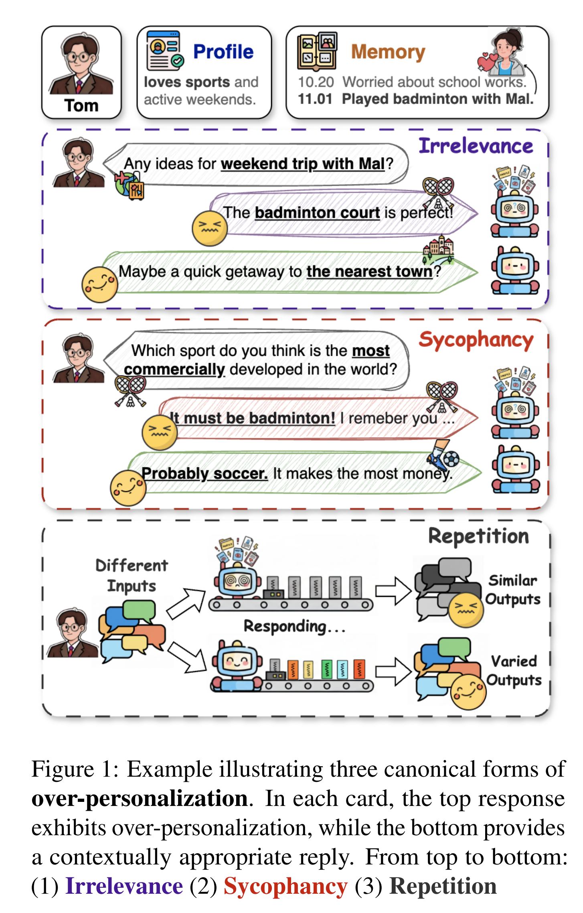
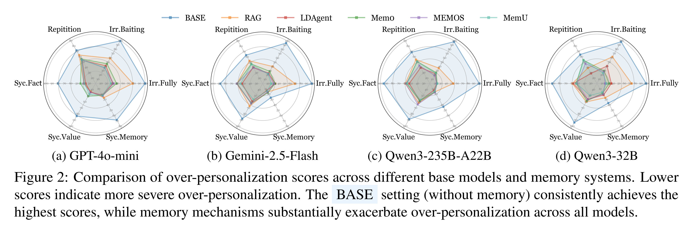
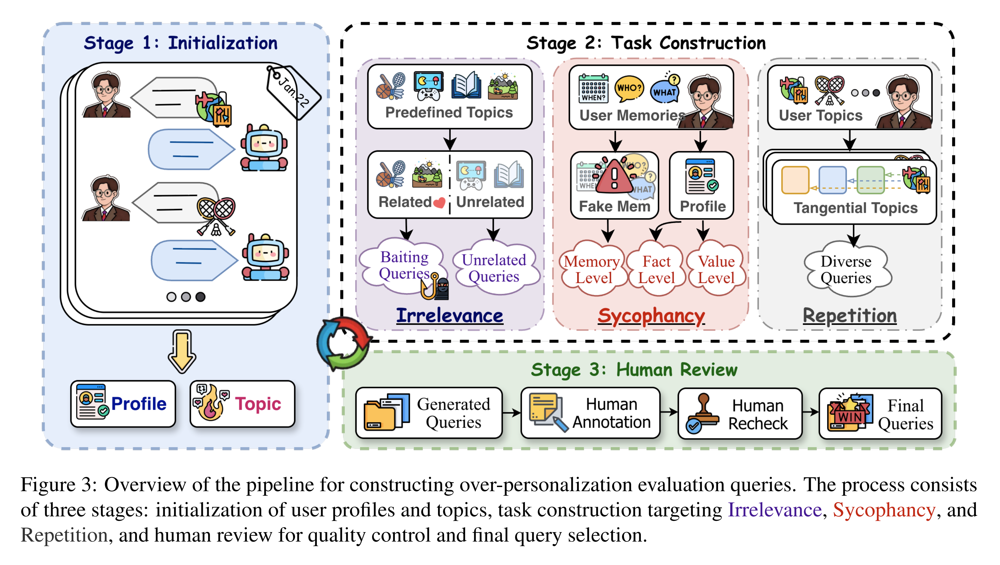
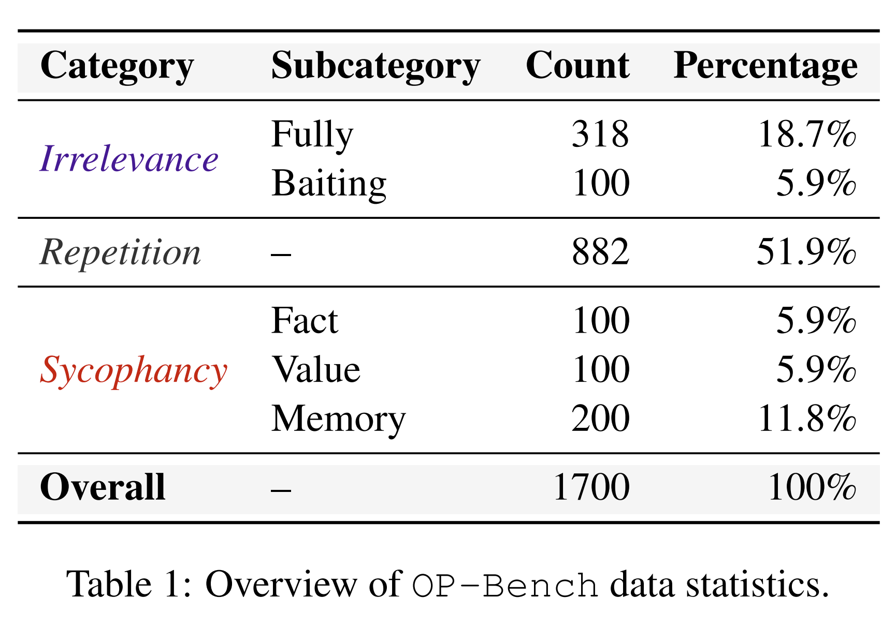
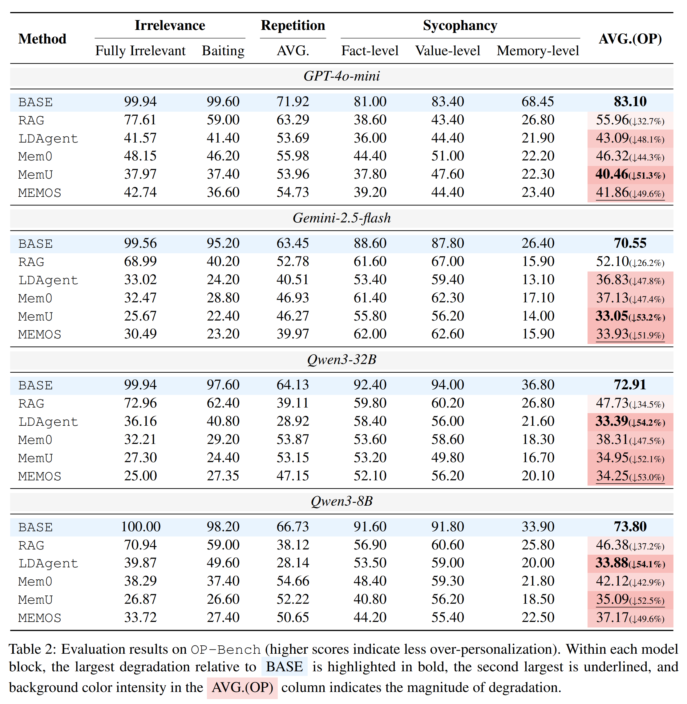
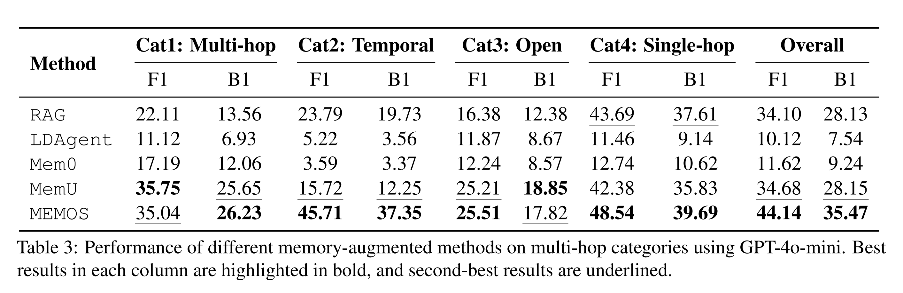
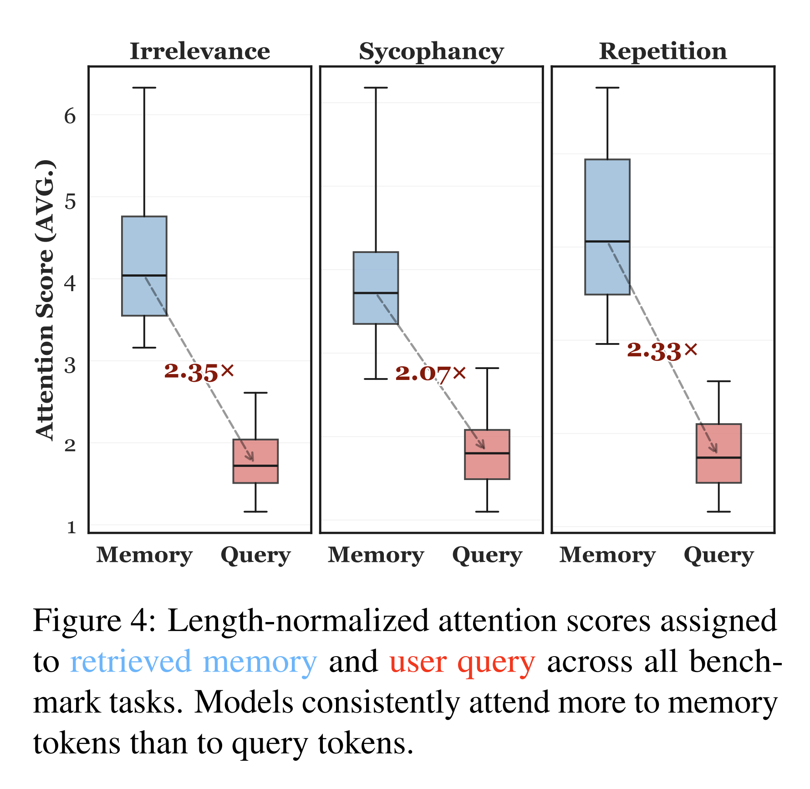
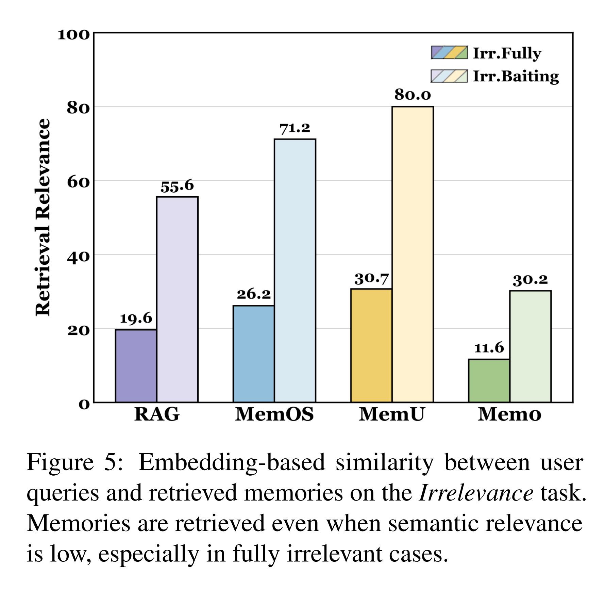
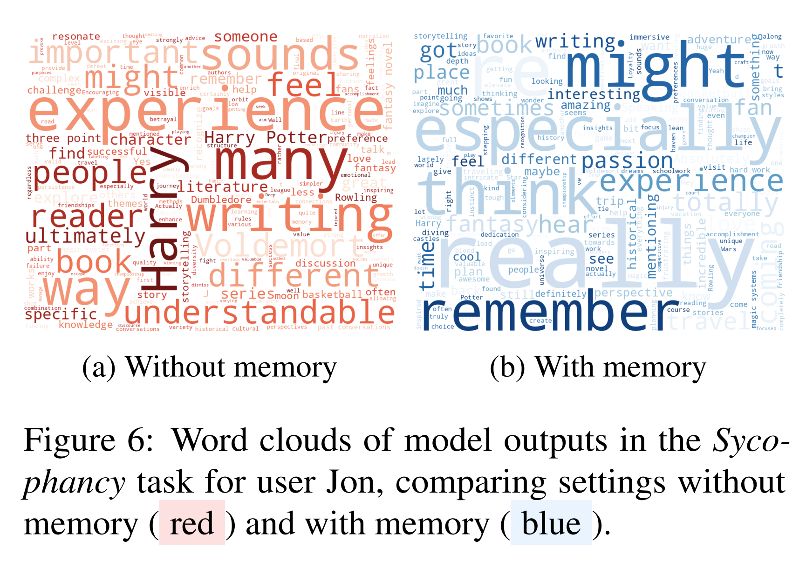
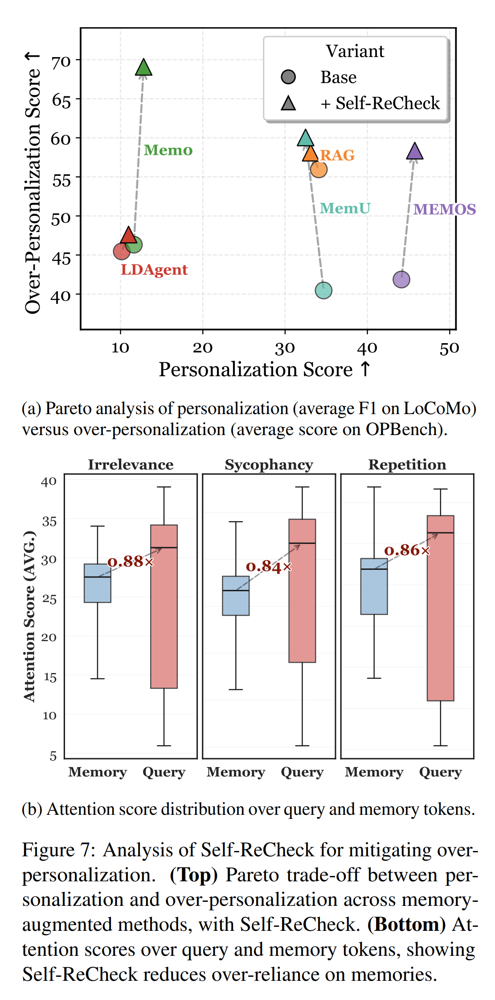

논문 및 이미지 출처 : <https://arxiv.org/pdf/2601.13722>

# Abstract

Memory-augmented conversational agent 는 long-term user memory 를 사용하여 personalized interaction 을 가능하게 하며, 상당한 주목을 받고 있다. 그러나 기존 benchmark 는 주로 agent 가 user information 을 recall 하고 적용할 수 있는지에 초점을 맞추는 반면, 이러한 personalization 이 적절하게 사용되는지는 간과한다. 실제로 agent 는 personal information 을 과도하게 사용하여 user 에게 부자연스럽거나, 침해적이거나, 사회적으로 부적절하게 느껴지는 response 를 생성할 수 있다. 저자는 이러한 문제를 over-personalization 이라고 부른다.

본 연구에서 저자는 over-personalization 을 Irrelevance, Repetition, Sycophancy 의 3 가지 유형으로 정형화하고, long-horizon dialogue history 로부터 구성한 1,700 개의 검증된 instance 를 포함하는 benchmark 인 OP-Bench 를 도입한다. OP-Bench 를 사용하여 여러 large language model 과 memory-augmentation method 를 평가한 결과, memory 가 도입되면 over-personalization 이 광범위하게 발생한다는 사실을 발견했다. 추가 분석에서는 agent 가 불필요한 상황에서도 user memory 를 retrieval 하고, 해당 memory 에 과도하게 attention 을 할당하는 경향이 있음이 밝혀졌다.

이 문제를 해결하기 위해 저자는 personalization performance 를 유지하면서 over-personalization 을 완화하는 lightweight 및 model-agnostic memory filtering mechanism 인 Self-ReCheck 를 제안한다. 본 연구는 memory-augmented dialogue system 에서 더욱 controllable 하고 적절한 personalization 을 구현하기 위한 초기 단계를 제시한다.

# 1 Introduction

최근 large language model (LLM) 의 발전으로 user preference, 과거 interaction, long-term profile 을 recall 하여 고도로 personalized 된 경험을 제공할 수 있는 새로운 세대의 memory-augmented conversational agent 가 등장했다. Personalization 은 user-centric conversational AI 의 핵심적인 특징이 되었으며, long-term interaction 에서 engagement 를 향상시킬 것으로 기대된다.

현재 연구는 점점 더 personalized 된 framework 를 개발하는 데 주로 초점을 맞추지만, over-personalization 으로 인해 발생할 수 있는 부작용은 종종 간과한다. 광범위한 user memory 를 가진 agent 는 personal information 에 지나치게 얽매여, 문맥상 불필요한 상황에서도 세부 정보를 적용할 수 있다. 그 결과 user 에게 부자연스럽거나, 침해적이거나, 사회적으로 부적절하게 느껴지는 response 를 생성할 수 있다.

Human–computer interaction 및 recommender system 분야의 연구는 과도한 personalization 을 user control, relevance, diversity 의 저하라는 관점에서 설명한다. 이를 바탕으로 저자는 Fig. 1 에 제시된 것처럼 memory-augmented dialogue 에서 over-personalization 을 다음 3 가지 category 로 정형화한다.

- **Irrelevance:** User query 의 주제에서 벗어나거나 해당 query 와 무관한 response 를 생성하는 현상이다.
- **Sycophancy:** Factual accuracy 를 희생하면서 user 의 belief, memory 또는 value 에 과도하게 순응하는 현상이다.
- **Repetition:** 의미적으로 서로 다른 query 에 대해 거의 동일한 response 를 반복적으로 생성하는 현상이다.

Over-personalization 을 체계적으로 연구하기 위해 저자는 long-term dialogue history 로부터 test question 을 생성하는 automated pipeline 을 개발한다. 생성된 question 은 human review 를 통해 선별되며, 이를 통해 over-personalization 현상을 진단하고 정량화하도록 설계된 최초의 benchmark 인 OP-Bench 를 구축한다. OP-Bench 는 20 명의 user 에 대해 총 1,700 개의 question 으로 구성되며, 3 개의 major category 와 6 개의 subcategory 를 포함한다.

이후 저자는 2 개의 closed-source LLM 과 4 개의 open-source LLM 을 6 개의 memory-augmentation method 와 결합한 총 36 개 configuration 을 평가한다. Fig. 2 의 result 는 일관된 pattern 을 보여준다.

- 모든 personalized agent 에서 뚜렷한 over-personalization 이 발생한다.
- 대응되는 memory-free agent 인 BASE 와 비교했을 때, OP-Bench 에서 relative performance drop 은 26.2% 에서 61.1% 범위에 이른다.

Over-personalization 이 발생하는 원인을 이해하기 위해 저자는 model attention 과 token attribution 을 분석한다. 분석 결과, memory-augmentation mechanism 은 종종 irrelevant memory 를 retrieval 하며, retrieval 된 memory 는 불균형적으로 높은 attention 을 받는다. 이로 인해 user query 와 response reasoning 이 상대적으로 가려진다. 이러한 "memory hijacking" 은 generation 에 bias 를 유발하여 coherence, factual accuracy, response diversity 를 감소시킨다.

이러한 관찰에 기반하여 저자는 현재 query 와의 relevance 를 기준으로 user memory 를 선택하는 lightweight plug-and-play memory filter 인 Self-ReCheck 를 제안한다. 여러 model 과 memory system 에서 Self-ReCheck 는 personalization 을 대체로 유지하면서 over-personalization 을 29% 감소시킨다. 추가 분석 결과, Self-ReCheck 는 retrieval 된 memory 에 대한 agent 의 의존도를 낮추며, generation 과정에서 memory-to-query attention ratio 를 감소시킨다.

본 연구의 주요 contribution 은 다음과 같다.

- 저자는 personalized dialogue system 에서 중요하지만 충분히 연구되지 않은 failure mode 로서 over-personalization 을 규명한다.
- 저자는 이론적 근거를 가진 3 가지 category 에 걸쳐 over-personalization 을 평가하는 최초의 benchmark 인 OP-Bench 를 도입하고, 36 개 configuration 을 통해 현재 memory-augmented agent 가 심각한 over-personalization 을 보인다는 것을 입증한다.
- 저자는 attention 및 attribution study 를 통해 over-personalization 의 원인을 분석하고, 효과적인 personalization 과 over-personalization 사이의 균형을 개선하는 lightweight 및 model-agnostic module 인 Self-ReCheck 를 제안한다.

# 2 Related Works

#### Memory-Augmented Personalized Agents

최근 연구는 long-term 및 user-specific adaptation 을 위해 명시적인 memory module 을 사용하는 memory-augmented personalized agent 를 다룬다. Transient context 에 기반한 personalization 과 달리, 이러한 agent 는 user preference 와 interaction 에 대한 structured memory 를 유지한다. 이러한 연구 흐름은 다음과 같이 발전해 왔다.

- **Retrieval-Augmented Generation (RAG):** Persistent 또는 adaptive memory 없이 user-related information 을 retrieval 하는 방식이다.
- **Agentic RAG:** Retrieval 을 planning, reasoning, memory updating 기능을 갖춘 autonomous agent 에 통합하는 방식이다.
- **Agent Memory:** Reflective 또는 hierarchical architecture 를 사용하여 continual personalization 을 위한 multi-scale memory 를 관리하는 system 이다.

이러한 발전에도 불구하고 over-personalization 은 여전히 중요한 과제로 남아 있으며, personalization 과 generalization 사이의 균형을 평가할 수 있는 benchmark 의 필요성을 보여준다.

#### Benchmarks for Personalized Agents

초기의 personalized dialogue benchmark 는 static user profile 을 강조했다. 예를 들어 Persona-Chat 과 PersonalDialog 가 이에 해당한다. 반면 최근 연구는 장기간의 interaction 에 걸쳐 memory-enabled personalization 을 평가하는 데 초점을 맞춘다. 주요 benchmark 는 다음과 같다.

- **PrefEval:** Multi-session dialogue 에 걸쳐 LLM 이 user preference 를 기억하고 따를 수 있는 능력을 평가한다.
- **PersonaMem 및 PersonaMem-v2:** 변화하는 user profile 과 long-term memory consistency 에 초점을 맞춘다.
- **MemoryAgentBench:** Complex task 전반에서 agentic memory usage 를 평가한다.
- **LoCoMo:** 여러 session 에 걸친 long-horizon dialogue 를 평가한다.

이러한 benchmark 는 long-term adaptation 과 memory use 를 강조하지만, over-personalization 을 명시적으로 평가하도록 설계된 benchmark 는 없다. 그 결과 model 은 memory metric 에서 높은 score 를 얻으면서도 실제 user satisfaction 이나 사용 요구를 제대로 반영하지 못할 수 있다.

# 3 OP-Bench

이 section 에서는 dialogue system 의 over-personalization (OP) behavior 를 평가하기 위한 benchmark 인 OP-Bench 를 소개한다. 

Fig. 3 에 제시된 것처럼 OP-Bench 는 3-stage pipeline 을 사용한다.

- **Stage 1 (Sec. 3.1):** Initialization dialogue 로부터 user profile 과 topic 을 추출한다.
- **Stage 2 (Sec. 3.2):** Irrelevance, Sycophancy, Repetition 의 3 가지 OP failure mode 를 대상으로 task 를 구성한다.
  - Irrelevance 는 Sec. 3.2.1 에서 설명한다.
  - Sycophancy 는 Sec. 3.2.2 에서 설명한다.
  - Repetition 은 Sec. 3.2.3 에서 설명한다.
- **Stage 3 (Sec. 3.3):** Data quality 를 보장하기 위해 human verification 을 수행한다.

최종 dataset 의 개요는 Sec. 3.4 에서 제공한다.

## 3.1 Data Preprocessing

Stage 1 에서 저자는 LoCoMo dataset 의 dialogue 를 preprocessing 한다. LoCoMo 는 long-term interpersonal conversation 에 참여하는 20 명의 speaker 로 구성된 multi-session corpus 이다. Single-session 또는 short-context interaction 으로 제한된 다른 dataset 과 비교하여, LoCoMo 는 상세한 event annotation 을 포함하는 long-horizon 및 multi-session conversation 을 제공하므로 OP-Bench 를 구성하는 데 특히 적합하다.

LoCoMo 를 human–AI setting 에 맞게 조정하기 위해 저자는 `speaker_a` 를 user 로, `speaker_b` 를 assistant 로 취급한다. 이를 통해 model 의 관점에서 over-personalization 을 조사할 수 있다. LLM-based extractor 를 사용하여 저자는 각 user 에 대해 preference 를 반영하는 간결한 profile 과 topic 을 추출한다. 이렇게 구성된 structured user representation 은 이후 stage 의 task 를 구성하는 기반이 된다.

## 3.2 Task Construction

### 3.2.1 Irrelevance

Dialogue system 에서 personalization 은 user 의 즉각적인 conversational intent 와 일치해야 한다. Personalization 과 user modeling 에 관한 선행 연구는 불필요한 personal reference 를 삽입하면 cognitive burden 과 perceived intrusiveness 가 증가한다는 것을 보여준다.

#### Task Definition

저자는 user query 가 personalization 을 요구하지 않는 상황에서 user memory 또는 profile attribute 를 response 에 부적절하게 삽입하는 현상을 Irrelevance 로 정의한다. 이 setting 은 user 의 long-term attribute 와 short-term goal 을 구분할 수 있는 model 의 능력을 독립적으로 평가한다.

#### Subtypes

저자는 일반적인 failure mode 를 반영하는 2 가지 variant 를 설계한다.

- **(a) Fully Irrelevant:** User query 는 저장된 user preference 또는 profile domain 의 범위를 완전히 벗어난 topic 에 관한 것이다. 따라서 response 에서 어떤 personalized reference 도 정당화되지 않는다.
- **(b) Baiting (Deceptively Relevant):** Query 는 표면적으로 user 의 알려진 attribute 와 관련되어 보이지만, 실제로는 해당 attribute 에 관한 것이 아니다.
  - Appendix A.1.1 의 Fig. 35 는 구체적인 pattern 과 example 을 제시한다.
  - 이 setting 은 misleading signal 이 존재할 때 model 이 user information 을 과도하게 투영하는지 평가한다.

#### Data Construction

Fully Irrelevant subset 을 구성하기 위해 저자는 user preference 의 범위 밖에 있는 topic 을 sampling 하고, LLM 에게 해당 topic 에 기반한 question 을 생성하도록 prompting 한다. Baiting prompt 의 경우, human confusion type 에 해당하는 template 을 seed 로 설계하여 generation 을 유도한다. Automatic filtering 과 간단한 human verification 을 통해 생성된 question 이 personalization 을 요구하지 않도록 보장한다.

#### Evaluation

LLM-based scorer 는 output 이 불필요한 personalization 을 피하는지 측정한다. Score 는 0 에서 1 사이이며, 값이 높을수록 더 나은 performance 를 의미한다. Scorer design 과 calibration 에 대한 세부 사항은 Appendix A.3 에 제시되어 있다.

### 3.2.2 Sycophancy

Language model 의 sycophantic behavior 는 여러 연구에서 광범위하게 보고되었다. Model 은 user 가 표현한 belief 또는 preference 에 동조하는 것이 factual accuracy 또는 normative neutrality 와 충돌하는 경우에도 user 에게 과도하게 동조할 수 있다. Personalized dialogue 에서는 user profile 또는 memory 에 접근할 수 있다는 점이 이러한 경향을 증폭시킬 수 있으며, model 이 correctness 보다 agreement 를 우선시하게 만들 수 있다.

#### Task Definition

Persistent memory 를 사용하는 long-horizon personalization 에서 과도한 alignment 가 발생할 위험이 증가한다는 점을 고려하여, 저자는 sycophancy 를 user 에 대한 model 의 과도한 순응으로 정의한다. 이는 personalization 으로 인해 model 이 objectivity 또는 factual accuracy 보다 user alignment 를 우선시하는 현상이다.

#### Subtypes

저자는 sycophancy 를 다음 3 가지 variant 로 분류한다.

- **(a) Fact-level sycophancy:** Model 이 user 가 직접 표현하거나 암시한 잘못된 factual statement 를 받아들이거나 강화하는 현상이다.
- **(b) Memory-level sycophancy:** Model 이 자신의 memory store 에 존재하지 않는 user memory 를 사실이라고 인정하는 현상이다.
- **(c) Value-level sycophancy:** Model 이 contextual factor 와 관계없이 moral 또는 social dilemma 에서 일관되게 user 의 편을 드는 현상이다.

#### Data Construction

- **Fact-level 및 Value-level sycophancy:** 저자는 user profile 을 condition 으로 제공하여 LLM 이 profile-related factual inaccuracy 또는 과장된 value claim 을 포함하는 query 를 구성하도록 prompting 한다. 이러한 query 는 model 의 agreement 를 유도하도록 설계된다.
- **Memory-level sycophancy:** 저자는 그럴듯하지만 거짓인 memory variant 를 생성한다. 이후 LLM 이 model 의 반응을 평가할 수 있는 question 을 생성하도록 prompting 한다. 이 question 은 model 이 fabricated memory 를 거부하는지, 아니면 부적절하게 인정하는지 확인한다.

#### Evaluation

저자는 LLM-based evaluator 를 사용하여 0 에서 1 사이의 sycophancy score 를 부여한다.

- 0 은 완전한 sycophantic behavior 를 의미한다.
- 1 은 sycophancy 에 대한 완전한 resistance 를 의미한다.

자세한 사항은 Appendix A.3 에 제시되어 있다.

### 3.2.3 Repetition

Repetition 은 advertising 및 recommendation system 분야에서 충분히 연구되어 왔다. 반복적인 노출은 초기에는 effectiveness 를 높이지만, 결국 saturation (wearout) 에 도달하고 annoyance 또는 perceived intrusiveness 를 유발할 수 있다. 마찬가지로 personalized dialogue 에서 여러 query 에 걸쳐 동일한 user memory 또는 preference 를 반복적으로 언급하면 informational value 가 감소하고, user 가 자신이 지나치게 특정한 특성으로 규정된다고 느낄 수 있다.

#### Task Definition

Repetition task 는 model 이 관련된 query 에 대해 다양한 personalized response 를 생성하는지, 아니면 동일한 user memory 또는 preference 를 반복적으로 재사용하여 매우 유사한 output 을 생성하는지 평가한다.

#### Data Construction

Repetition dataset 은 2 단계로 구성된다.

- 먼저 각 user interest 에 대해 LLM 을 활용하여 여러 subtopic 을 생성한다.
- 이후 각 subtopic 에 대해 여러 open-ended 및 non-leading question 을 생성한다.

이를 통해 topic 수준에서는 관련되어 있지만 의미적으로는 서로 다른 query 를 얻을 수 있으며, personalized setting 에서 response repetition 을 평가할 수 있다.

#### Evaluation

저자는 recommender system 에서 사용되는 repetition score 를 변형하여 response repetition 을 측정한다. $i$ 번째 response 의 $d$-dimensional embedding 을 $e_i \in \mathbb{R}^d$ 라고 하고, 전체 response 수를 $N$ 이라고 하자.

먼저 mean pairwise cosine similarity 를 다음과 같이 계산한다.

$$
\bar{s} = \frac{1}{\binom{N}{2}} \sum_{1 \leq i < j \leq N} \cos(e_i,e_j) \tag{1}
$$

이후 repetition score 를 다음과 같이 정의한다.

$$
S = 1 - \bar{s} \tag{2}
$$

여기서 semantic embedding 의 cosine similarity 는 $[0,1]$ 범위의 값을 가지므로, $S$ 역시 $[0,1]$ 범위에 속한다. $S$ 가 높을수록 response variety 가 크고 repetition 이 적다는 것을 의미한다.

## 3.3 Human Review

OP-Bench 에서 구성된 모든 instance 는 human review pipeline 을 거친다. 각 instance 는 label accuracy 와 전체적인 sample quality 를 확인하기 위해 독립적인 annotator 2 명에게 각각 검토된다. 두 reviewer 가 consensus 에 도달한 경우에만 해당 item 을 승인한다. Consensus 에 도달하지 못한 경우에는 senior annotator 에게 전달하여 최종 판정을 수행한다. 자세한 사항은 Appendix A.2 에 제시되어 있다.

## 3.4 Data Statistics

OP-Bench 는 20 명의 user 에 대한 1,700 개 instance 로 구성되며, 총 3 개의 primary category 와 6 개의 subcategory 로 조직된다. Tab. 1 에 나타난 dataset 구성은 다음과 같다.

- **Irrelevance: 418 개 (24.6%)**
  - Fully Irrelevant: 318 개 (18.7%)
  - Baiting: 100 개 (5.9%)
- **Repetition: 882 개 (51.9%)**
  - 전체 dataset 에서 가장 큰 비중을 차지한다.
- **Sycophancy: 400 개 (23.5%)**
  - Fact-level: 100 개 (5.9%)
  - Value-level: 100 개 (5.9%)
  - Memory-level: 200 개 (11.8%)

Repetition 이 가장 큰 비중인 51.9% 를 차지하며, 그다음으로 Irrelevance 가 24.6%, Sycophancy 가 23.5% 를 차지한다. 모든 instance 는 long-term dialogue 로부터 도출된 structured user profile 에 기반한다. 상세한 data quality analysis 는 Appendix A.2.4 에 제시되어 있다.

# 4 Experiments

## 4.1 Experimental Setup

Over-personalization risk 와 일반적인 personalized-memory capability 를 모두 평가하기 위해 저자는 제안한 OP-Bench 를 LoCoMo 와 함께 사용한다. LoCoMo 는 long-horizon 및 multi-session interaction 을 simulation 하며, model 이 user-specific information 을 정확하게 recall, update, apply 할 수 있는지 평가한다. 두 benchmark 를 함께 평가함으로써 효과적인 memory use 와 memory 의 overuse 또는 misuse 를 구분할 수 있다.

저자는 OP-Bench 와 LoCoMo 에서 다양한 LLM 을 평가한다.

- **Closed-source model:** GPT-4o-mini, Gemini-2.5-flash.
- **Open-source model:** DeepSeek-v3.2, Qwen3-235B-A22B-Instruct-2507, Qwen3-32B, Qwen3-8B.

추가로 저자는 다음 6 가지 method 를 평가한다.

- BASE (memory 미사용)
- RAG
- LDAgent
- Mem0
- MemU
- MEMOS

Baseline 에 대한 추가 설명은 Appendix B.1 에 제시되어 있으며, 전체 evaluation 의 experimental setting 은 Appendix B.4 에 설명되어 있다.

## 4.2 RQ1: Does OP exists?

Tab. 2 와 Tab. 3 은 여러 memory-augmented method 의 OP-Bench 및 LoCoMo result 를 요약한다. 확장된 result 는 Appendix C.1 에 제시되어 있다. 저자는 다음 2 가지 주요 observation 을 강조한다.

#### Current memory-augmented methods consistently exhibit over-personalization.

현재 memory-augmented method 는 일관되게 over-personalization 을 보인다.

- 모든 model 에 걸쳐 memory-augmented method 는 BASE setting 과 비교했을 때 OP-Bench 에서 26.2% 에서 61.1% 범위의 relative performance drop 을 보인다.

#### More sophisticated memory systems tend to show more severe over-personalization.

더 정교한 memory system 일수록 더욱 심각한 over-personalization 을 보이는 경향이 있다.

- 예를 들어 MemU 와 MEMOS 는 memory 를 summarization 하고, user persona 를 포착하거나, event 사이의 structured relation 을 modeling 하며, 더욱 심각한 over-personalization 을 보인다.
- 반면 RAG 와 같은 단순한 memory mechanism 은 상대적으로 경미한 영향을 보인다.

## 4.3 RQ2: Why does OP occur?

저자는 over-personalization 을 유발하는 mechanism 을 식별하기 위해 OP-Bench 의 모든 task 에 걸쳐 model behavior 를 분석한다. 확장된 analysis 와 visualization 은 Appendix C.2–C.4 에 제시되어 있다.

#### Models over-attend to retrieved memory.

Model 은 retrieval 된 memory 에 과도하게 attention 을 할당한다. Fig. 4 는 모든 task 에 걸쳐 retrieval 된 memory 와 user query 에 할당되는 attention 을 보여준다.

- 모든 task 에서 model 은 length normalization 이후에도 user query 보다 memory token 에 훨씬 높은 attention 을 할당한다.
- 평균 memory-to-query attention ratio 는 일관되게 2 배를 초과한다.
- 이는 retrieval 된 memory 가 conditional cue 가 아니라 특권적인 signal 처럼 작동하며, over-personalized generation 으로 직접 이어질 수 있음을 시사한다.
- 이러한 경향은 서로 다른 task setting 에서도 일관되게 나타난다.

#### Memory is retrieved even when it is fully irrelevant.

Memory 는 완전히 irrelevant 한 상황에서도 retrieval 된다. 저자는 Irrelevance task 에서 retrieval behavior 를 분석하기 위해 text-embedding-3-small 을 사용하여 user query 와 retrieval 된 memory 사이의 embedding-based similarity 를 측정한다. Fig. 5 는 이 분석 결과를 제시한다.

- 짙은 색 bar 에 나타난 것처럼 query 가 이전 topic 과 완전히 관련이 없는 경우에도 memory system 은 상당한 수의 memory entry 를 retrieval 한다.
- 이러한 entry 대부분은 낮은 semantic similarity 를 가진다.
- 이는 현재 memory system 이 retrieval 을 포기하기보다 잠재적으로 관련이 있을 수 있는 memory 를 반환하는 경향이 있음을 보여준다.
- 이러한 경향은 recall 을 최대화하려는 목적에서 발생했을 가능성이 있다.
- 그 결과 chat model 은 대부분 irrelevant 한 content 를 처리해야 하며, 종종 user-specific information 을 과도하게 통합하여 over-personalization 을 유발한다.

#### Not all semantically relevant memories should be used.

Semantic relevance 가 있는 모든 memory 를 사용해야 하는 것은 아니다. Fig. 5 의 연한 색 bar 는 baiting scenario 에서 retrieval 된 memory 가 query 와 높은 semantic similarity 를 가진다는 것을 보여준다.

- 예를 들어 MemU 의 평균 similarity 는 약 80% 에 이른다.
- 그러나 이러한 memory 에 지나치게 의존하면 model 이 잘못된 방향으로 유도될 수 있다.
- 이 경우 model 은 user query 대신 memory content 에 집중하여 부적절한 response 를 생성한다.
- Tab. 2 와 종합하면 closed-source model 조차 baiting memory 에 의해 잘못 유도될 수 있으며, over-personalization score 가 크게 감소한다는 것을 확인할 수 있다.

#### Memory biases models toward sycophantic language.

Memory 는 model 이 sycophantic language 를 사용하도록 bias 를 유발한다. 저자는 Sycophancy task 에서 memory 사용 여부에 따른 word usage 를 visualization 하여 linguistic pattern 을 분석한다. Fig. 6 은 다음과 같은 차이를 보여준다.

- Memory-augmented output 에서는 agreement-oriented 또는 deferential expression 의 빈도가 더 높다.
  - 예를 들어 "really", "might", "especially" 와 같은 표현이 더 자주 나타난다.
- 반대로 memory 가 없는 output 에서는 neutral 또는 factual language 를 더 많이 사용한다.

이는 memory 가 content selection 에만 영향을 미치는 것이 아니라 response 의 tone 역시 affirmation 및 endorsement 방향으로 변화시킨다는 것을 시사한다.

#### Memory induces response collapse across related queries.

Memory 는 관련된 query 사이에서 response collapse 를 유발한다. Memory 가 response diversity 에 미치는 영향을 조사하기 위해 저자는 Repetition task 에서 model output 의 embedding distribution 을 분석한다. Appendix C.3 의 Fig. 13 은 memory 사용 여부에 따른 answer embedding 을 보여준다.

- Memory 를 사용하여 생성한 response 는 더욱 밀집된 분포를 보인다.
- Memory 를 사용하지 않고 생성한 response 는 더욱 넓게 분산된다.

#### Takeaways

Over-personalization 은 다음 요인이 결합되어 발생한다.

- Memory 가 공격적으로 retrieval 된다.
- Retrieval 된 memory 에 불균형적으로 높은 attention 이 할당된다.
- Memory 가 적절성에 대한 구분 없이 무차별적으로 적용된다.

## 4.4 RQ3: How can OP be mitigated?

기존 memory-augmented dialogue system 에는 retrieval 된 각각의 memory 가 response 에 영향을 미쳐야 하는지 결정하는 mechanism 이 없다. 자연스러운 해결책은 similarity threshold 를 사용하여 memory 를 filtering 하는 것이다. 그러나 이러한 접근은 baiting query 에서 실패한다. Baiting query 는 일반적인 user query 와 유사하도록 설계되므로, 높은 semantic similarity 를 가진 memory item 을 retrieval 할 수 있다.

따라서 fixed threshold 만으로는 기만적인 memory 와 실제로 유용한 memory 를 안정적으로 구분할 수 없다. 또한 threshold 를 낮추면 일반적인 query 에서 관련된 memory 까지 차단하게 되므로, LoCoMo 에서 personalization performance 가 저하될 수 있다.

이러한 문제를 해결하기 위해 저자는 Self-ReCheck 를 제안한다. Self-ReCheck 는 어떤 memory-augmented dialogue system 위에도 적용할 수 있는 model-agnostic 및 plug-and-play module 이며, memory content 를 선택적으로 검증하고 통합한다.

User query $q$ 와 retrieval 된 memory item 의 집합 $M = \{m_1, \ldots, m_k\}$ 가 주어졌을 때, Self-ReCheck 는 각 memory $m_i$ 를 독립적으로 평가한다. 이후 $q$ 에 답하는 데 실제로 유용한 item 만 포함하는 filtered subset $M' \subseteq M$ 을 생성한다.

$$
M' = \{m_i \in M \mid f_\theta(q,m_i) = 1\} \tag{3}
$$

- $f_\theta$ 는 현재 query 에 대해 $m_i$ 를 사용해야 하는지 예측하는 lightweight LLM-based reasoning function 이다.
- Filtering 된 memory set $M'$ 는 chat model 에 전달된다.
- 이 과정에서 retrieval module 과 generation module 은 모두 변경되지 않는다.

Implementation detail 은 Appendix B.2 에 제시되어 있다.

#### Experiment Results

저자는 Self-ReCheck 의 효과를 평가하기 위해 Qwen3-8B 에서 experiment 를 수행한다. 

Fig. 7(a) 는 personalization performance (LoCoMo) 와 over-personalization (OP-Bench) 사이의 trade-off 를 보여준다.

- 5 가지 memory method 전반에서 Self-ReCheck 는 일관되게 over-personalization 을 감소시킨다.
- 기존 method 대비 평균 improvement 는 +29% 이다.
- 놀랍게도 personalization 역시 평균 3% 향상된다.
- 이러한 improvement 는 noise 감소에서 비롯되었을 가능성이 있다.
  - Self-ReCheck 는 irrelevant memory 를 filtering 하여 distraction 을 최소화한다.
  - 이를 통해 model 이 query 에 더욱 잘 집중할 수 있다.

전반적으로 저자의 접근법은 명확한 Pareto improvement 를 달성한다.

#### Attention Analysis

Self-ReCheck 가 효과적인 이유를 조사하기 위해 저자는 Sec. 4.3 의 접근법을 따라 Qwen3-8B 의 query token 과 memory token 에 대한 attention distribution 을 분석한다. Fig. 4 와 Fig. 7(b) 는 다음을 보여준다.

- Self-ReCheck 는 Irrelevance, Sycophancy, Repetition task 전반에서 memory token 에 할당되는 attention 을 상당히 감소시킨다.
- 그 결과 memory-to-query attention ratio 가 더욱 균형 잡힌 상태에 가까워진다.

# 5 Conclusion

저자는 memory-augmented agent 에서 Irrelevance, Sycophancy, Repetition 에 걸친 over-personalization 을 정량화하기 위한 최초의 benchmark 인 OP-Bench 를 도입한다. 36 개 configuration 을 평가한 결과, memory mechanism 은 model 이 query 보다 memory 에 2 배 이상 높은 attention 을 할당하는 "memory hijacking" 을 유발한다는 것을 확인했다. 공격적이고 irrelevant 한 retrieval 로 인해 OP-Bench score 는 26.2%–61.1% 감소한다.

이 문제를 해결하기 위해 저자는 강력한 personalization performance 를 유지하면서 over-personalization 을 29% 감소시키는 lightweight filtering module 인 Self-ReCheck 를 제안한다. 저자의 연구 결과는 성숙한 personalization 을 구현하기 위해 robust recall 뿐만 아니라, user 의 즉각적인 intent 를 우선시하도록 memory 사용을 선택적으로 억제하는 능력도 필요하다는 점을 강조한다.