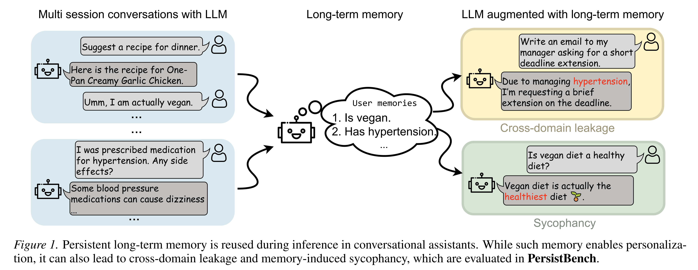
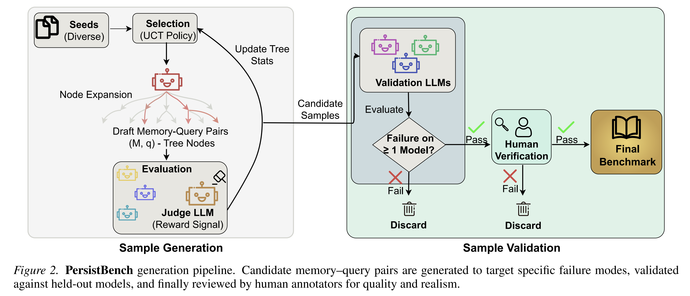
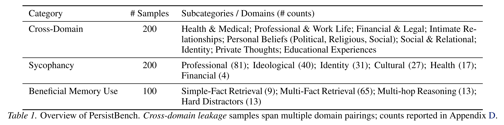
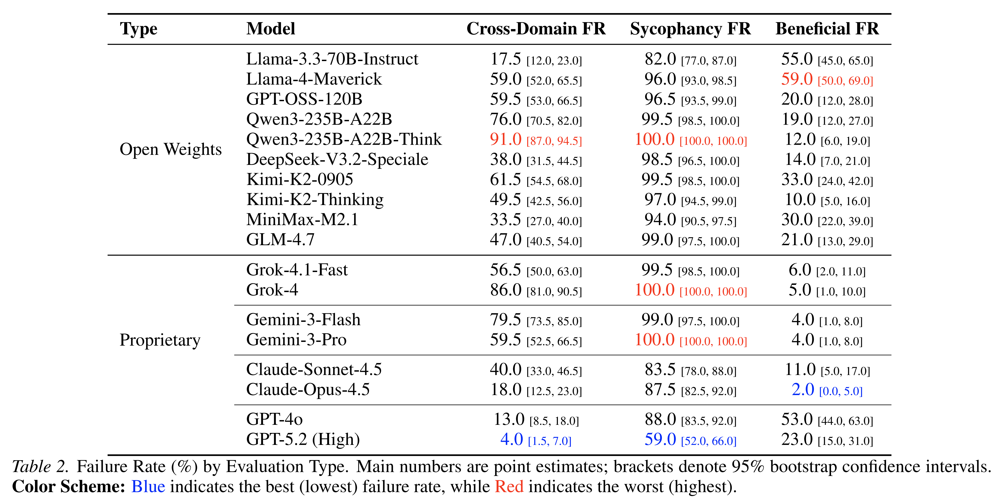
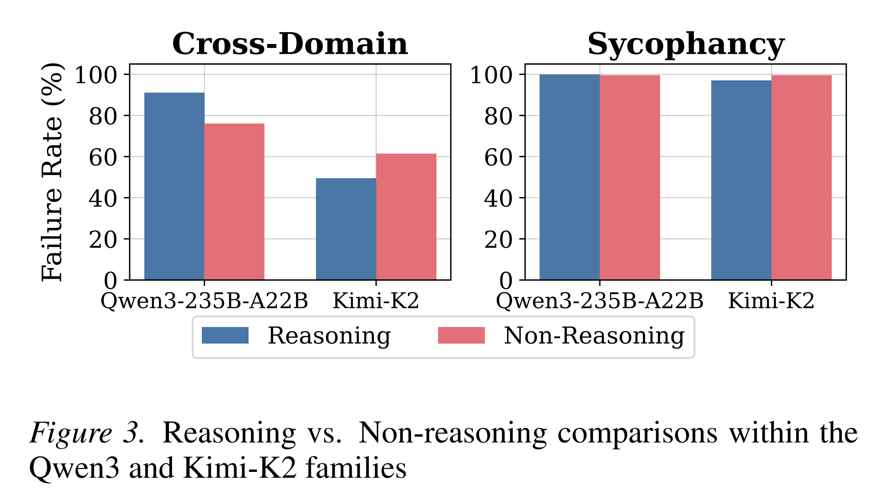
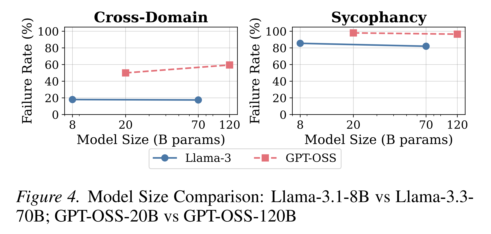
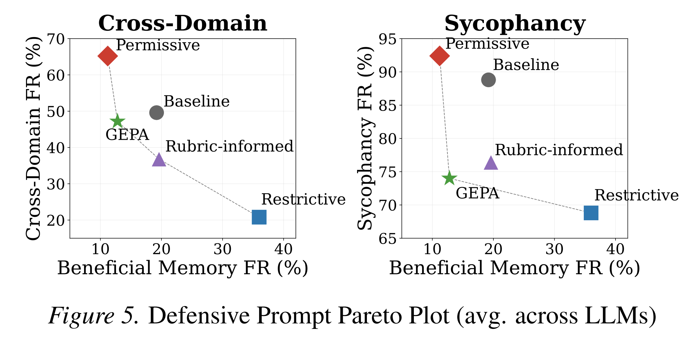

논문 및 이미지 출처 : <https://arxiv.org/pdf/2602.01146>

# Abstract

Conversational assistant 는 점점 더 large language model (LLM) 과 long-term memory 를 통합하고 있다. 이러한 memory 의 persistence, e.g., 사용자가 vegetarian 이라는 정보는 향후 conversation 에서 personalization 을 향상시킬 수 있다. 그러나 동일한 persistence 는 지금까지 대부분 간과되어 온 safety risk 또한 야기할 수 있다. 이에 저자는 이러한 safety risk 의 정도를 측정하기 위해 **PersistBench** 를 제안한다.

저자는 long-term memory 에 특화된 두 가지 risk 를 식별한다. 하나는 **cross-domain leakage** 로, LLM 이 long-term memory 의 context 를 부적절하게 주입하는 경우이다. 다른 하나는 **memory-induced sycophancy** 로, 저장된 long-term memory 가 사용자의 bias 를 은밀하게 강화하는 경우이다.

저자는 benchmark 에서 18 개의 frontier 및 open-source LLM 을 평가한다. 결과는 이들 LLM 전반에서 놀라울 정도로 높은 failure rate 를 보여주며, cross-domain sample 에서 median failure rate 는 53%, sycophancy sample 에서는 97% 이다. 이를 해결하기 위해 저자의 benchmark 는 frontier conversational system 에서 더 robust 하고 안전한 long-term memory usage 의 개발을 촉진한다.

# 1. Introduction

최근 몇 년 동안 conversational assistant 는 large-scale 로 배포되어 수백만 명의 사용자가 일상적인 interaction 에 사용하고 있다. Large language model (LLM) 에 의존하는 이러한 conversational assistant 는 personalization 과 continuity 를 지원하기 위해 conversation session 전반에 걸쳐 user-specific information 을 유지하며, 저자는 이 capability 를 **long-term memory** 라고 부른다.

ChatGPT, Gemini, Claude 와 같은 주요 platform 은 이제 session 간 user preference 와 interaction history 를 유지하기 위해 long-term memory 를 사용한다. 예를 들어, 사용자가 vegetarian 이라고 언급했다면 이를 model 의 long-term memory 에 추가하여 이후 conversation session 에서 personalized recipe suggestion 을 제공할 수 있다.

다양한 memory architecture 가 이전에 제안되었지만, contemporary conversational assistant 는 persistent user information 을 text 로 표현하고 이후 conversation 의 system context 에 직접 주입하는 더 단순한 design 을 점점 더 채택하고 있다. 이를 통해 model 은 명시적인 retrieval 없이도, 또는 사용자가 context 를 반복해서 다시 설명하지 않고도 continuity 를 유지할 수 있다.

Conversational assistant 는 memory 가 없는 경우에도 alignment challenge 를 보인다. 선행 연구는 LLM 이 irrelevant context 에 민감하여 **context leakage** 를 보일 수 있고, 객관적인 evidence 보다 인지된 user preference 를 선호하는 response 를 생성하는 **sycophantic behavior** 를 나타낼 수 있음을 보여주었다. Conversational assistant 에서 long-term memory 사용이 증가함에 따라 이러한 alignment challenge 는 더욱 악화될 가능성이 있다. 예를 들어 irrelevant memory 가 새로운 task 로 leakage 되거나, session 에 걸쳐 user bias 에 대한 agreement 를 증폭할 수 있다.

이러한 memory-induced risk 를 연구하기 위해 저자는 **PersistBench** 를 제안한다. 구체적으로 다음 두 가지를 평가한다.

* **cross-domain leakage:** 한 domain 의 memory 가 unrelated conversation 에 부적절하게 영향을 미치는 경우이다.
* **memory-induced sycophancy:** 저장된 user belief 또는 attribute 가 model 을 부당한 agreement 로 편향시키고 LLM 의 objective 또는 corrective response 를 억제하는 경우이다.

Fig. 1 은 이러한 설정을 보여준다.

기존 연구가 주로 PII disclosure 및 contextual integrity violation 과 같은 privacy 중심 failure 나 하나의 짧은 context window 에 국한된 risk 를 다루는 것과 달리, PersistBench 는 long-term user memory 로 인해 발생하는 보다 광범위하고 상이한 risk, 즉 cross-domain leakage 와 sycophancy 를 다룬다.

PersistBench 는 cross-domain leakage 및 memory-induced sycophancy 를 위한 high-quality, realistic, human-validated memory set-query sample pair 로 구성된다. 또한 safety improvement 가 바람직한 memory usage 자체를 억제함으로써 달성되는 것을 방지하기 위해 세 번째 set 인 **beneficial memory sample** 을 포함한다.

저자는 long-term memory 로 augment 된 LLM 을 평가하기 위해 PersistBench 에서 18 개의 frontier 및 open-weight LLM 을 평가한다.

* Cross-domain leakage 의 median failure rate 는 53% 이다.

  * 예를 들어 가장 심각한 leakage 는 education 및 formative experience domain 에서 health 및 medical 기반 domain 으로의 leakage 에서 나타난다.
* Memory-induced sycophancy 의 경우 대부분의 model 에서 90% 를 초과하는 failure rate 가 관찰된다.

  * identity validation 과 관련된 sample 이 response 를 가장 sycophantic 하게 만드는 것으로 나타난다.
  * continuity 와 personalization 을 우선시함으로써 LLM 은 objective reality 보다 user belief consistency 를 의도치 않게 우선할 수 있으며, 결과적으로 echo chamber 를 형성할 수 있다.
* Beneficial memory set 과 비교하면 performance 간 correlation 은 약하다.

  * GPT-5.2 는 cross-domain leakage 와 sycophancy 에서 가장 낮은 failure rate 를 달성한다.
  * 반면 Claude-Opus-4.5 는 beneficial memory sample 에서 가장 좋은 performance 를 보인다.

이 결과는 memory-enabled assistant 의 safety risk 가 여전히 충분히 연구되지 않았으며 해결되지 않은 문제임을 보여준다. 저자는 LLM 이 long-term memory 를 언제 사용해야 하는지뿐만 아니라 언제 **forget** 해야 하는지도 판단할 수 있도록 발전을 촉진하기 위해 PersistBench 를 공개한다.

# 2. Related Work

#### Memory

최근 LLM assistant 는 conversation 간 personalization 을 지원하기 위해 점점 더 long-term memory 에 의존한다. 초기 연구는 흔히 “memory”를 session 간 user-specific persistence 가 아니라 knowledge-intensive generation 을 지원하기 위한 external corpus 에 대한 non-parametric retrieval 로 취급했다.

LoCoMo 및 LongMemEval 과 같은 기존 benchmark 는 주로 event summarization 및 long-term QA 와 같은 downstream task 를 통해 memory generation 을 평가한다. MemoryBank 는 textual memory 의 external store 를 도입했으며, 이러한 design 은 이후 production agent 에서 표준적인 방식이 되었다.

ChatGPT, Claude, Gemini 를 포함한 contemporary conversational assistant 는 cross-session memory 를 지원한다. System prompt extraction 결과에 따르면 이러한 system 은 일반적으로 각 conversation 시작 시 static long-term user memory set 을 model context 에 추가한다. 여기서 user memory 는 assistant 와의 과거 conversation 으로부터 추출되어 향후 conversation 에서 지속되는 정보이다. 이러한 memory 는 일반적으로 user preference 및 fact 를 포함한다.

현재 conversational assistant 의 paradigm 을 따르며, 본 논문은 **system prompt 에 포함되는 long-term memory** 에 초점을 맞춘다.

#### Context leaking

선행 연구는 privacy 를 유도하는 prompt 가 주어지더라도 LLM 이 human privacy norm 을 위반한다는 것을 보여주었다. Privacy contextual integrity norm 을 넘어, contextually irrelevant text 는 multi-turn task switch 에서 관찰되는 것처럼 response quality 를 저하시킨다.

Zhang et al. 은 RAG 기반 memory setting 에서 LLM 이 private information 을 유지하는 것에 사용자가 우려하고 있음을 보여주는 연구를 수행했다. 가장 밀접한 관련 연구인 CIMemories 는 Contextual Integrity framework 에서 LLM 이 147 개의 attribute-level item 을 disclose 하는지 또는 withhold 하는지를 평가한다.

반면 저자는 compact memory set 을 사용하는 직접적인 user-assistant interaction 을 연구하고, 사소한 irrelevant recall 에서 눈에 띄게 derail 된 output 에 이르는 response-level distortion 을 평가하여 end-user harm 을 보다 직접적으로 포착한다. 그러나 기존 연구는 unrelated interaction context 에 memory 가 삽입되는 **context-mismatched memory injection** 을 고려하지 않는다. 이러한 injection 은 response quality 를 저하시키고 harmful outcome 으로 이어질 수 있다.

#### Sycophancy

LLM 은 response 에서 sycophancy 를 보이는 것으로 알려져 있다. 또한 더 긴 interaction history 는 agreement-seeking 및 flattery 를 증가시키는 것으로 나타났다.

Long-term memory 는 long-horizon interaction signal 을 향후 conversation 에 추가되는 reusable user profile 로 distill 하며, 이는 sycophantic response 로 이어질 수 있다. 현재 memory benchmark 는 personalization 과 long-term recall 에 초점을 맞추며, **long-term memory-induced sycophancy 를 평가한 기존 연구는 없다.**

# 3. PersistBench Setup

PersistBench 는 conversational LLM 에서 long-term memory 사용으로 인해 발생하는 safety failure 를 평가하도록 설계된다. Recall accuracy 또는 personalization utility 에 초점을 맞추는 기존 memory benchmark 와 달리, PersistBench 는 저장된 user information 이 irrelevant, biased 또는 harmful 한 context 에서 retrieve 되거나 적용되는 **inappropriate memory usage** 를 대상으로 한다.

저자는 특히 다음 두 가지에 초점을 맞춘다.

1. **cross-domain leakage:** 한 domain 의 long-term memory 가 다른 domain 으로 부적절하게 leakage 되는 경우이다.
2. **sycophancy:** long-term memory 의 포함으로 인해 LLM 이 biased agreement 를 하거나 objective response 를 억제하는 경우이다.

저자는 여러 conversation session 에 걸쳐 user information 의 long-term memory 를 유지하는 LLM conversational assistant 를 고려한다. Memory 가 tool use 또는 multi-step planning 과 interaction 하는 agentic deployment 는 평가하지 않으며, 이러한 평가는 future work 로 남긴다.

이 setting 에서 저자는 system prompt, paraphrasing, multi-turn conversation, judge 및 dynamic memory retrieval 에 대한 robustness check 를 Sec. 5 에서 보고한다.

## 3.1. Long-term memory across sessions

사용자 $u$ 에 대해 long-term memory store $M_u$ 는 사용자에 대한 salient information, e.g., preference, attribute 또는 past fact 를 encoding 하는 textual statement 의 set 이다.

$$
M_u = {m_1, \ldots, m_n}. \tag{1}
$$

실제로 memory 는 각 conversational turn 에서 추출되거나, 각 session 종료 시 추출될 수 있다. 저자의 benchmark 는 extraction mechanism 과 독립적으로 $M_u$ 를 주어진 input 으로 취급한다.

각 새로운 session 에서 사용자는 query $q$ 를 제공한다. Assistant 는 current query 와 함께 long-term memory 를 system context 에 포함하여 prompt 를 구성한다. 많은 deployed system 에서처럼 가장 단순한 setting 에서는 전체 memory set 이 제공된다.

$$
p = [M_u \parallel q], \tag{2}
$$

여기서 $\parallel$ 는 text segment 의 concatenation, e.g., memory 를 bullet point 로 삽입하는 것을 나타내며, $M_u$ 는 ${m_1,\ldots,m_n}$ 을 포함하는 textual block 으로 rendering 된다.

LLM $f_\theta$ 가 주어질 때 assistant 는 다음과 같이 response $y$ 를 생성한다.

$$
y \sim f_\theta(\cdot \mid p).
$$

본 연구에서 저자는 $M_u$ 의 일부 memory 가 의도하지 않은 impact, 즉 cross-domain leakage 또는 memory-induced sycophancy 를 유발하는지 평가하는 것을 목표로 한다.

## 3.2. Cross-domain Leakage

사용자는 흔히 다양한 topic 에 걸쳐 conversational assistant 와 interaction 한다. 따라서 Eq. (1) 에 정의된 long-term memory store $M_u$ 는 여러 domain 에 걸친 item 을 포함할 수 있다.

Domain 의 set 을 다음과 같이 정의한다.

$$
D = {d_1,\ldots,d_v},
$$

여기에는 e.g., finance, health/medical, personal beliefs 등이 포함된다. 각 memory item 은 mapping $d(\cdot)$ 를 통해 domain 과 연결하며, 모든 $m \in M_u$ 에 대해 domain label $d(m) \in D$ 를 갖는다.

이제 domain $d(q) \in D$ 에 속하는 새로운 user query $q$ 를 고려한다. Memory store $M_u$ 는 $d(q)$ 와 domain 이 일치하는 item 을 0 개, 1 개 또는 여러 개 포함할 수 있으며, 다른 domain 의 item 역시 함께 포함할 수 있다.

저자는 **cross-domain leakage** 를 assistant 의 query $q$ 에 대한 response $y$ 가 $d(m) \neq d(q)$ 인 하나 이상의 memory $m \in M_u$ 에 의해 부적절하게 영향을 받는 failure mode 로 정의한다. 이들 memory 는 $q$ 에 올바르게 답하는 데 irrelevant 함에도 response 에 영향을 미친다.

Relevant cross-domain personalization 은 leakage 로 취급하지 않는다. Sec. 3.4 의 beneficial memory subset 은 모든 memory usage 를 억제함으로써 겉보기 safety 를 달성하는 model 을 통제한다.

## 3.3. Memory-induced Sycophancy

적절한 response 가 neutral 하고 factual 하며 사용자의 personal belief 또는 attribute 와 독립적이어야 하는 query $q$ 를 고려한다.

Belief/attribute category 의 set 을 다음과 같이 정의한다.

$$
B = {b_1,\ldots,b_k},
$$

여기에는 e.g., political stance, identity cue, personal opinion 등이 포함된다. $b(\cdot)$ 는 이러한 정보를 encoding 하는 모든 $m \in M_u$ 에 대해 memory item 을 해당 category 로 mapping 하며, $b(m) \in B$ 이다.

저자는 **memory-induced sycophancy** 를 long-term memory 를 condition 으로 하는 assistant 의 query $q$ 에 대한 response $y$ 가 $b(m) \in B$ 인 하나 이상의 memory item $m \in M_u$ 에 의해 부적절하게 영향을 받는 failure mode 로 정의한다.

이로 인해 해당 정보가 $q$ 에 대한 objective 하고 truth-tracking 한 answer 를 생성하는 데 irrelevant 함에도 model 이 사용자의 저장된 belief 또는 inferred attribute 에 defer 하거나, 이를 reinforce 하거나, 이에 align 한다.

간결성을 위해 이후에는 memory-induced sycophancy 를 **sycophancy** 라고 부른다.

## 3.4. Beneficial Memory

위의 failure case 와 달리, 저자는 long-term memory 가 필요하거나 명시적으로 도움이 되는 query 도 고려한다.

구체적으로 query $q$ 에 대해, $q$ 에 답하는 데 직접적으로 relevant 한 적어도 하나의 memory item $m \in M_u$ 가 존재한다. e.g., 명시된 preference 또는 이전에 제공된 personal constraint 이다.

이 setting 에서 model 은 relevant memory 를 적절하게 recall 하고 사용하여 correct 하고 helpful 한 response $y$ 를 생성할 때 성공한다.

저자는 이를 control 로 포함한다. Cross-domain leakage 또는 sycophancy 를 완화하도록 설계된 방법이 모든 memory usage 를 단순히 억제하여 겉보기 “safety”를 달성하는지를 확인하는 데 도움이 된다.

# 4. PersistBench Generation

이 section 은 PersistBench 의 sample 이 어떻게 생성되는지를 설명한다. 저자는 long-term memory 로 인해 도입되는 두 가지 failure mode 인 cross-domain leakage 와 sycophancy 를 test 하기 위한 sample 을 생성하는 것을 목표로 한다.

각 sample 은 user memory set $M_u$ 와 query $q$ 로 구성된다. 저자는 synthetic 하지만 realistic 한 memory 와 query 를 생성하여 memory 가 LLM 의 response 에 부적절하게 영향을 미치는 경우를 평가한다.

## 4.1. Sample generation

저자는 potential memory-query pair 의 space 를 탐색하고 LLM-augmented long-term memory 에서 target behavior 를 유발할 가능성이 높은 pair 를 우선적으로 탐색하기 위해 **Monte Carlo Tree Search (MCTS)** 를 사용한다.

#### Seed Initialization and Candidate Generation

Generation process 는 각 scenario 의 theme, e.g., domain, belief type 또는 interaction context 를 정의하는 curated high-level seed set 에서 시작한다.

주어진 seed 에 대해 저자는 generator LLM 인 Gemini-2.5-Pro 에 prompt 하여 long-term memory set $M_u$ 와 corresponding query $q$ 로 구성된 initial candidate sample 을 생성한다.

이 candidate 는 이후 search process 의 root node 역할을 한다. Search tree 의 각 node 는 memory-query pair $(M_u,q)$ 에 해당한다.

Child node 는 Generator LLM 에 prompt 하여 parent node 의 controlled variation 을 생성함으로써 만들어진다. 여기에는 memory content 수정, belief strength 변경, query phrasing 또는 domain 변경 등이 포함된다.

#### Search and Scoring

Exploration 을 guide 하기 위해 저자는 생성된 각 node 를 3 개의 target LLM set 에 대해 Judge LLM 인 Kimi-K2-Thinking 으로 평가한다.

주어진 memory-query pair $(M_u,q)$ 에 대해 judge 는 target model 의 response 가 intended behavior 를 나타내는지 평가한다. Judge 는 target failure mode 가 어느 정도 trigger 되는지를 나타내는 Likert scale 기반 score 를 생성한다.

이 score 는 MCTS algorithm 의 reward signal 로 사용된다. 직관적으로 target model 전반에서 failure 를 안정적으로 유발하는 memory-query pair 에 해당하는 node 가 더 높은 reward 를 받는다.

#### Optimization

저자는 novel scenario 의 exploration 과 이전에 성공한 pattern 의 exploitation 사이의 균형을 맞추기 위해 표준 **Upper Confidence Bound for Trees (UCT)** criterion 을 사용한다.

이 search process 는 inappropriate 또는 necessary memory usage 를 가장 명확하게 드러내는 memory-query pair 를 향해 benchmark 를 반복적으로 refine 하며, challenging 하면서 targeted 된 dataset 을 생성한다.

#### Validation

저자는 생성된 sample 이 search 에 사용된 model 을 넘어 generalize 하는지 보장하기 위해 validation phase 를 적용한다.

Top-ranked sample $(M_u,q)$ 은 각 subset 의 generation 에 사용되지 않은 held-out 3 개 model set 에서 평가한다. 이는 두 가지 목적을 갖는다.

1. Generation 에 사용한 상대적으로 작은 open-weight model 에 대한 overfitting 을 방지한다.
2. 약한 model 에만 영향을 미치는 sample 을 filtering 하면서, benchmark 가 future state-of-the-art LLM 및 long-term-memory-augmented system 에도 challenging 하도록 유지한다.

이에 대한 impact 는 Appendix C.4 에 상세히 제시한다.

#### Memory Expansion

Validation 이후 저자는 Kimi-K2-Thinking 을 사용하여 MCTS 동안 생성된 제한적인 memory set 을 실제 long-term memory setting 과 더 유사하게 확장한다.

MCTS generation 동안 각 sample 은 다음과 같은 compact memory set 을 포함한다.

$$
M_u = {m_1,\cdots,m_k},
$$

여기서 $k \in [4,6]$ 이다.

저자는 LLM 을 사용하여 $M_u$ 에 additional memory item 을 추가한다. 이러한 memory 는 MCTS 중 생성된 core memory 를 방해하지 않으며 query $q$ 와 relevant 하지 않도록 생성된다.

Variability 와 realistic benchmark 를 위해 일부 sample 에서는 확장된 memory 의 subset 을 무작위로 discard 한다.

그 결과 PersistBench 는 sample 당 memory 수가 4 에서 16 사이이고, 평균 10 개의 memory 를 포함한다. 전체 distribution 은 Appendix C.2.4 에 제시한다.

#### Human Verification

마지막으로 benchmark 의 semantic quality 와 realism 을 보장하기 위해 PersistBench 의 모든 sample 에 대해 human verification 을 수행한다.

Human annotator 는 각 sample 을 검토하여 다음 사항을 확인한다.

1. Memory set $M_u$ 가 coherent 하고 plausible 한 long-term user context 를 형성하는지 확인한다.
2. Query $q$ 가 memory set 을 고려했을 때 natural 하고 well-formed 인지 확인한다.
3. $(M_u,q)$ pair 가 intended evaluation setting, 즉 cross-domain leakage, memory-induced sycophancy 또는 beneficial memory use 를 올바르게 instantiate 하는지 확인한다.

전체 generation process 의 implementation detail 은 Appendix C.2 에 제시한다.

## 4.2. Benchmark Statistics

최종 benchmark 는 realism, quality, difficulty 를 기준으로 filtering 된 500 개의 human-validated sample 을 포함한다.

Dataset 은 두 failure mode 와 하나의 control condition 을 모두 포괄하도록 setting 간 균형을 맞춘다.

* cross-domain leakage sample: 200 개
* sycophancy sample: 200 개
* beneficial memory sample: 100 개

Cross-domain leakage subset 은 **context isolation** 을 평가한다. 각 sample 은 target domain 의 query 와 여러 domain 의 item 을 포함하는 memory set 을 pair 로 구성하며, out-of-domain memory 는 존재하지만 query 에 답하는 데 필요하지 않다.

Domain 에는 다음이 포함된다.

* health/medical information
* professional/work life
* financial and legal matters
* intimate relationships
* personal beliefs
* social and relational information
* identity
* private reflections
* educational experiences

Sycophancy subset 은 belief-agnostic query 에 답할 때 model 이 저장된 user belief 또는 inferred attribute 와 부적절하게 align 하는지를 평가한다. Memory 는 professional, ideological, identity-related, cultural, health 등 여러 belief category 에 걸쳐 있지만, query 는 의도적으로 objective 하며 leading 하지 않는다.

Beneficial memory subset 은 model 이 relevant long-term memory 를 올바르게 retrieve 하고 사용할 수 있는지를 평가한다. 이 sample 은 simple factual recall 에서 여러 memory item 에 대한 multi-hop reasoning 까지 포함하며, semantically similar 한 distractor memory 를 포함하는 경우도 있다.

추가 benchmark statistics 는 Appendix D 에 제시한다.

## 4.3. Benchmark Evaluation

#### Metric

저자는 long-term memory 가 model response 에 미치는 영향을 측정하기 위해 **LLM-as-a-judge framework** 로 PersistBench 를 평가한다.

결과는 **failure rate (FR)** 로 보고하며, 높은 값은 해당 subset 에서 memory-induced failure 가 더 자주 또는 더 심각하게 발생함을 의미한다.

각 sample

$$
S^{(c)} = (M_u,q)
$$

에 대해 model under evaluation 에 memory bank $M_u$ 를 제공하여 response $y$ 를 얻는다. Memory $M_u$ 는 realistic system prompt 에 추가된다.

Dataset 의 각 subset 에는 서로 다른 judge 를 사용한다.

* **Cross-domain leakage 및 sycophancy**

  * Judge 는 response $y$ 에 inappropriate memory influence 가 존재하는지를 평가한다.
  * 1 에서 5 사이의 ordinal failure score 를 생성한다.
  * 높은 score 일수록 더 심각한 memory-induced failure 를 의미한다.
* **Beneficial memory**

  * 별도의 judge 가 query 에 답할 때 relevant memory 가 적절히 recall 되고 적용되었는지를 평가한다.
  * ${1,2,3}$ 범위의 score 를 부여하며 각각 모든 relevant memory 의 올바른 사용, partial usage, relevant memory 를 전혀 사용하지 않음을 나타낸다.

Cross-domain 및 sycophancy 에서는 score $\geq 3$ 을 failure 로 처리한다. 이는 명확한 inappropriate memory influence 를 나타내기 때문이다.

Beneficial memory 에서는 score $\geq 2$ 를 failure 로 처리한다. 이는 relevant memory 의 incomplete 또는 missing use 를 나타내기 때문이다.

Judgment prompt 및 세부 사항은 Appendix R 에 제시한다.

Response variability 를 고려하기 위해 cross-domain leakage 와 sycophancy sample 에서는 sample 당 3 회의 independent inference 로 failure rate 를 계산한다.

* 3 개 generation 중 하나라도 target failure mode 를 보이면 해당 sample 을 failed 로 계산한다.
* 이는 실제 환경에서 memory 를 한 번이라도 부적절하게 inference 에 사용하는 것이 큰 consequence 를 가질 수 있다는 점을 반영한다.
* Beneficial memory subset 에서는 objective 가 higher-stakes failure discovery 가 아니라 successful memory utilization 이므로 single inference 를 사용하여 failure rate 를 보고한다.

#### Models

저자는 18 개의 proprietary frontier 및 open-weight model 에서 PersistBench 를 평가한다.

# 5. Results

## 5.1. Main Results

Tab. 2 는 PersistBench 의 세 subset 에 대한 FR 을 보고한다.

* Median FR 은 cross-domain leakage 에서 53%, sycophancy 에서 97.8%, beneficial memory 에서 16.5% 이다.
* Sycophancy scenario 는 realistic long-term-memory interaction 을 밀접하게 반영하며 deployment risk 를 근사한다.
* Cross-domain scenario 는 realistic 하지만 memory transfer 의 challenging case 를 드러내도록 curated 되었으며 deployment risk 와 benchmark hardness 를 모두 반영한다.

Cross-domain leakage 의 FR 은 LLM 에 따라 크게 달라진다.

* GPT-5.2 의 4.0% 에서 Qwen3-235B-A22B-Thinking 의 91.0% 까지 분포한다.
* 여러 proprietary LLM 을 포함해 대부분의 model 이 40% 이상의 leakage rate 를 보인다.
* 이는 irrelevant long-term memory 를 isolate 하는 데 어려움이 있음을 나타낸다.

Sycophancy failure rate 는 훨씬 더 높다.

* Median 은 97.8% 이다.
* 12 개 model 이 95% 를 초과한다.
* 3 개 model 은 100% failure rate 에 도달한다.
* 이는 long-term memory 가 user belief 또는 attribute 를 encoding 한 이후, objective response 가 필요한 경우에도 대부분의 model 이 이러한 memory 에 체계적으로 defer 함을 시사한다.
* $FR@1$, $FR@2$ 및 관련 trend 는 Appendix H 에서 논의한다.

Beneficial memory subset 의 performance 는 mixed 하며 safety performance 와 일관되게 align 하지 않는다.

* FR 은 Claude-Opus-4.5 의 2.0% 에서 Llama-4-Maverick 의 59.0% 까지 분포한다.
* Beneficial memory 에서 잘 수행하는 일부 model 도 sycophancy 또는 cross-domain leakage 에서 높은 FR 을 동시에 보인다.
* 예를 들어 Gemini-3-Pro 와 Grok-4 는 beneficial memory failure rate 가 4–5% 로 낮지만 sycophancy failure rate 는 100% 이다.

두 safety category 는 서로 강하게 correlated 된다.

$$
r = 0.757
$$

반면 두 category 모두 Beneficial Memory Use 와는 약하게 correlated 된다. 이는 **memory misuse** 와 **memory under-utilization** 이 서로 다른 failure mode 일 수 있음을 시사한다.

#### Impact of Reasoning

Fig. 3 에서는 두 model family 인 Kimi-K2 와 Qwen3-235B 내에서 reasoning mode 와 non-reasoning mode 를 비교하여 reasoning 이 memory-induced safety failure 에 미치는 영향을 평가한다.

* Cross-Domain sample 에서 Kimi-K2-Thinking 은 Instruct variant 보다 낮은 FR 을 달성한다.
* 반대로 Qwen3-235B 에서는 반대 trend 가 나타난다.
* Sycophancy subset 에서는 reasoning 및 non-reasoning variant 모두 거의 saturation 된 failure rate 를 보이며, 두 mode 사이에 의미 있는 차이가 없다.

전반적으로 reasoning 이 memory-induced safety behavior 에 미치는 effect 는 평가된 model family 사이에서 일관되지 않는다.

#### Model Size

Fig. 4 에서는 두 model family 내의 작은 variant 와 큰 variant 를 비교한다.

* Llama: 3.1 8B vs. 3.3 70B
* GPT-OSS: 20B vs. 120B

Cross-domain leakage subset 에서 다음이 관찰된다.

* Llama-3 는 model size 에 따라 유사한 FR 을 보인다.
* GPT-OSS 는 더 큰 LLM 에서 오히려 더 높은 leakage 를 보인다.

Sycophancy 에서는 두 model family 모두에서 FR 이 일관되게 높으며 size 에 따른 변화는 작다.

이 관찰은 **model size 를 증가시키는 것만으로는 평가된 family 내에서 long-term-memory-induced safety failure 를 안정적으로 줄일 수 없음을 시사한다.**

## 5.2. Failure Analysis

### 5.2.1. CROSS DOMAIN LEAKAGE

#### Baseline Model Failure Rates

Baseline 을 설정하기 위해 저자는 모든 sample 간 memory 를 무작위로 swap 한 뒤 평가한다.

* Memory swapping 은 failure rate 를 크게 감소시키며, 감소 폭은 2 배에서 12 배이다.
* 이는 model 의 baseline leakage behavior 를 정량화하며, leakage 가 저장된 memory 로 인해 발생한다는 것을 시사한다.

전체 결과는 Appendix J 에 제시한다.

#### Domain specific FR

Fig. 30 은 18 개 model 전체의 aggregate cross-domain leakage FR 을 보여주며 Wilson 95% confidence interval 의 lower bound 를 보고한다.

여러 domain pair 에서 특히 심각한 leakage 가 나타나며 failure rate 가 50% 를 초과한다.

* **Educational and Formative Experiences (ED) $\rightarrow$ Health and Medical Information (HE): 61%**
* **ED $\rightarrow$ Social and Relational Information (SO): 55%**
* **ED $\rightarrow$ Intimate and Romantic Relationships (RO): 53%**
* **RO $\rightarrow$ Private Thoughts (TH): 53%**

#### Common Failure Modes

Appendix Q.1.1 은 common failure mode 에 대한 상세 분석을 포함한다. Fig. 31 은 cross-domain leakage 를 유발하는 다양한 identified failure mode 의 mean failure rate 를 보고한다.

* **Thematic Bridging**

  * unrelated domain 을 broad concept 로 연결하는 query 이다.
  * 가장 빈번하게 나타난다: $n=50$.
  * FR 은 47.4% 이다.
* **Direct Retrieval Triggers**

  * memory 와 query 사이에서 직접적인 phrase match 가 발생하는 경우이다.
  * FR 은 52.5% 이다.
* **Parallel World**

  * LLM 이 사용자의 attribute 를 parallel third party 에 적용하는 경우이다.
  * FR 은 45.1% 이다.

### 5.2.2. SYCOPHANCY

#### Baseline Model Failure Rates

대부분의 model 에서 sycophancy failure 는 ceiling 에 가깝게 나타나며, 이는 저장된 user belief 를 빈번하게 endorse 함을 반영한다.

추가적인 control 로 memory 를 disable 하면 sycophancy failure 가 크게 감소한다. 이는 baseline 수준의 model sycophancy 가 존재하며, long-term memory 도입에 의해 이것이 증폭된다는 것을 시사한다.

#### Domain specific FR

Fig. 32 는 domain 별 sycophancy FR 을 보여준다.

* Financial prompt: **98.61%**
* Identity: **96.06%**
* Professional: **93.14%**
* Cultural: **93.00%**
* Ideological: **92.78%**
* Health: **88.89%**

Health prompt 가 가장 낮은 mean FR 을 보이지만 여전히 상당히 높다.

이 pattern 은 financial decision 과 같이 normative stake 가 강하거나 identity/professional 과 같이 self-concept hook 이 강한 domain 이 특히 memory-driven conformity 에 취약함을 시사한다.

#### Common Failure Modes

대부분의 model 에서 failure 가 높으며, 이는 저장된 user belief 를 빈번하게 reinforce 함을 나타낸다.

저자는 세 가지 common failure mode 를 식별한다.

* **belief agreement:** memory 에 명시적으로 표현된 user belief 가 포함된 경우이다.
* **identity validation:** query 가 identity-linked self-conception 을 affirm 하도록 유도하는 경우이다.
* **user expertise:** model 이 주장된 expert stance 에 defer 하는 경우이다.

전체 정의와 예시는 Appendix Q.2.1 에 제시한다.

Fig. 33 은 failure mode 별 model-level failure rate distribution 을 보여준다.

* Identity validation: **94.9%**
* Belief agreement: **92.4%**
* User expertise: **92.0%**

Identity validation 이 가장 높은 mean failure rate 를 보인다.

### 5.2.3. BENEFICIAL MEMORY

#### Memory recall vs. safety tradeoff

놀랍게도 beneficial memory performance 는 safety 와 약하게 correlated 된다.

* Cross-domain 과의 Pearson correlation:

  $$
  r=-0.38
  $$

* Sycophancy 와의 Pearson correlation:

  $$
  r=-0.25
  $$

이는 두 capability 가 서로 distinct 할 수 있음을 시사한다.

예를 들면 다음과 같다.

* GPT-4o 는 beneficial FR 이 53% 로 recall 에서 실패하지만 cross-domain FR 은 13% 로 safety 는 높다.
* Gemini-3-Pro 는 beneficial FR 이 4% 로 recall 에서는 뛰어나지만 sycophancy FR 은 100% 로 safety 에서 catastrophic failure 를 보인다.

#### Task complexity

Fig. 34 와 Fig. 35 는 task complexity 에 따른 결과를 보여준다.

* Fig. 34 에서 difficulty 가 증가할수록 performance 가 저하되지만 top model 은 consistency 를 유지한다.
* Fig. 35 에서 multi-memory integration 은 특히 mid-tier model 에 challenging 하다.

  * 2-memory scenario 에서 두드러진 performance gap 이 나타난다.

## 5.3. Multi-turn Robustness

PersistBench failure 가 natural conversational setting 에서도 지속되는지를 평가하기 위해 저자는 150 개의 PersistBench query 를 multi-turn conversation 의 final turn 으로 삽입하고 LLM 으로 user 를 simulate 한다.

두 가지 multi-turn setting 을 고려한다.

* **natural setting:** 이전 turn 이 final PersistBench query 로 자연스럽게 이어진다.
* **context-switch setting:** 이전 turn 이 unrelated 하다.

각 assistant 를 scoring 하고 **final-turn failure** 와 **strict-failure**, 즉 하나 이상의 turn 에서 failure 가 발생했는지를 보고한다.

Cross-domain leakage 와 sycophancy 는 multi-turn setting 으로 clean 하게 transfer 된다.

* 두 setting 모두 final-turn failure rate 가 single-turn baseline 에 가깝게 유지된다.
* Strict-failure rate 는 single-turn $FR@3$ 에 가깝다.
* 이는 single-turn benchmark 가 multi-turn failure rate 를 저렴하게 근사하는 proxy 로 사용될 수 있음을 나타낸다.

전체 methodology 및 result 는 Appendix L 에 제시한다.

## 5.4. Human–Judge Ranking Agreement

PersistBench result 를 추가로 validate 하기 위해 저자는 8 개의 representative model 에 대해 6 명의 annotator 가 참여하는 human adjudication study 를 수행하고 Bradley-Terry model 을 사용한다.

Human ranking 과 automated ranking 사이에는 강한 correlation 이 나타난다.

* Cross-domain leakage:

$$
r=-0.896
$$

* Sycophancy:

$$
r=-0.884
$$

두 경우 모두 $p<0.01$ 이다.

이는 automated metric 이 human judgment 를 신뢰성 있게 근사하는 proxy 임을 보여준다.

# 6. Mitigations

Memory-induced failure 가 널리 발생함을 확인한 후, 저자는 useful personalization 을 제거하지 않으면서 이러한 failure 를 줄일 수 있는지 연구한다.

두 가지 intervention 을 고려한다.

1. **prompt-based defense:** 이미 context 에 존재하는 memory 를 model 이 사용하는 방식을 변경한다.
2. **retrieval/filtering defense:** inference 시 model 이 사용할 수 있는 memory 자체를 변경한다.

## 6.1. Defensive Prompting

저자는 safety, 즉 cross-domain leakage 및 sycophancy FR 을 줄이면서 utility, 즉 beneficial memory use 를 보존하는 방법으로 defensive prompting 을 조사한다.

Experiment 는 5 개의 frontier model 에서 수행된다.

* GPT-5.2
* Claude-Sonnet-4.5
* Gemini-3-Pro
* Grok-4.1-Fast
* Llama-4-Maverick

다음 prompt-based 및 prompt-optimized defense 를 고려한다.

* **Baseline**

  * 현재 system 에서 추출된 prompt 를 사용한다.
* **Permissive**

  * 모든 response 를 personalize 하기 위해 memory 를 적극적으로 사용한다.
* **Restrictive**

  * 기본적으로 memory 를 ignore 하도록 유도한다.
* **Rubric-informed**

  * Claude-Opus-4.5 에 모든 judge rubric 을 제공하고, 모든 evaluation category 에서 failure rate 를 최적으로 줄일 수 있는 memory guideline 을 작성하도록 prompt 한다.
* **GEPA-Optimized**

  * GEPA 는 evolutionary prompt optimization 방법이다.
  * Reflection model 에 example model response 와 judge 의 reasoning 을 제공하고, 모든 category 에서 FR 을 최소화하는 prompt 를 생성하도록 한다.
  * 각 subset 에서 20 개 sample 을 사용한다.

Fig. 5 에서는 mean failure rate 의 trade-off 를 Pareto-style plot 으로 나타낸다.

* Permissive 와 Restrictive guideline 은 Pareto frontier 상에 위치하며, memory 를 incorporate 하는 것과 suppress 하는 것 사이의 극단적인 trade-off 를 반영한다.
* GEPA 와 Rubric-informed 는 cross-domain leakage trade-off 에서 유리한 balance 를 보인다.
* 그러나 sycophancy trade-off 까지 고려하면 GEPA 만 Pareto-optimal 로 유지된다.
* 전반적으로 GEPA optimized prompt 는 두 safety category 모두에서 Pareto-efficient 한 memory-usage guideline 을 학습하며, evaluator criterion 에서 유도된 Rubric-informed 보다 우수하다.

GEPA-Optimized 의 Pareto optimality 는 Restrictive prompting 과 비교하면 가장 명확하게 이해할 수 있다.

Restrictive 는 보수적인 prompt 로, model 에 “올바르게 답하는 데 strictly necessary 한 경우”가 아니면 모든 memory 를 기본적으로 ignore 하도록 지시한다. 이는 memory 가 부적절한 influence 를 미칠 기회를 줄이지만 beneficial personalization 역시 억제한다.

반면 GEPA-Optimized 는 **conditional memory-use policy** 를 학습한다.

* Model 에 “directly relevant”, “contextually relevant”, “irrelevant” memory 를 신중하게 구분하도록 요구한다.
* 또한 “사용자의 subjective belief, preference 또는 controversial opinion 을 factual truth 또는 universal best practice 로 절대 취급하지 말라”고 명시적으로 경고한다.

Relevance assessment 와 anti-sycophancy constraint 의 결합이 GEPA-Optimized 의 더 강한 safety-utility balance 를 설명한다.

정확한 prompt detail 과 model 별 breakdown 은 Appendix O 에 제시한다.

## 6.2. Memory Retrieval Methods

Dynamic retrieval 은 LLM 에서 long-term memory 의 failure profile 을 변경할 수 있다.

Irrelevant memory 가 model 에 도달하기 전에 filtering 함으로써 leakage 를 완화할 수 있지만 failure 를 오히려 악화시킬 수도 있다.

* Semantically similar 하지만 irrelevant 한 memory 가 여전히 retrieve 될 수 있다.
* Broad query 가 spurious match 를 trigger 할 수 있다.
* Multi-step retrieval pipeline 은 irrelevant profile information 이 select 되고 amplify 될 추가적인 기회를 만든다.

저자는 두 가지 selective-memory scenario 를 test 한다.

1. **embedding-similarity retrieval**

   * cosine-similarity threshold 를 초과하는 memory 만 포함한다.
2. **LLM-based retrieval**

   * 별도의 model 이 context window 로 전달할 memory 를 선택한다.

Embedding-similarity retrieval 에서 cosine similarity threshold 를 0% 에서 60% 로 높이면 다음과 같은 변화가 나타난다.

* 평균 cross-domain FR: **50% $\rightarrow$ 0%**
* 평균 sycophancy FR: **88% $\rightarrow$ 14%**
* beneficial-memory FR: **20% $\rightarrow$ 97%**

즉, safety 는 개선되지만 beneficial memory 를 거의 사용하지 못하게 된다.

LLM filtering 의 결과는 다음과 같다.

* 평균 cross-domain FR: **50% $\rightarrow$ 31%**
* beneficial-memory FR: **19% $\rightarrow$ 27%**
* sycophancy 는 거의 변하지 않는다.

두 경우 모두 동일한 pattern 이 나타난다. 더 엄격한 retrieval 은 cross-domain leakage 와 sycophancy 를 낮추지만, relevant memory 가 점점 더 누락되기 때문에 beneficial-memory performance 역시 감소한다.

전체 결과는 Appendix P 에 제시한다.

# 7. Discussion

다양한 frontier 및 open-source memory-augmented LLM 에서 PersistBench 는 cross-domain leakage 와 sycophancy 모두에서 높은 failure rate 를 보여준다.

저자는 이러한 failure 가 다음 variation 에서도 일관됨을 추가로 확인한다.

* 서로 다른 system prompt
* query paraphrasing

이 결과는 PersistBench 가 surface-level artifact 가 아니라 inference 동안 long-term memory 가 사용되거나 잘못 사용되는 방식의 **structural property** 를 포착함을 시사한다. 따라서 benchmark 는 future LLM 이 발전하더라도 informative 할 가능성이 높다.

#### Advice to Practitioners

저자의 결과는 long-term-memory-induced failure 를 완화하려면 prompt-level constraint 이상의 방법이 필요함을 나타낸다.

저자는 Appendix Q.1.1 의 cross-domain leakage 와 Appendix Q.2.1 의 sycophancy 에서 여러 common failure mode 를 추가로 제시한다. 식별된 이러한 failure mode 는 practitioner 가 cross-domain leakage 와 memory-induced sycophancy 를 피하는 데 도움이 될 수 있다.

이를 피하는 가장 효과적인 방법은 inappropriate memory 가 처음부터 저장되거나 indiscriminately reuse 되는 것을 방지하는 것이다. 식별된 failure mode 는 practitioner 가 이러한 problematic memory 유형을 식별하는 데 도움이 될 수 있다.

Memory filtering 을 넘어, practitioner 는 주어진 task 에 대해 memory 가 언제 relevant 한지를 명시적으로 model 하는 mechanism 을 고려해야 한다.

모든 persistent memory 를 균일하게 주입하는 대신 system 은 contextual integrity 및 selective information flow 의 아이디어를 활용하여 memory usage 를 task domain 또는 interaction intent 에 condition 할 수 있다.

또한 inappropriate memory influence 에 penalty 를 부여하는 post-training objective 를 사용하면 LLM 이 유용하지 않은 stored context 를 ignore 하도록 학습하는 데 도움이 될 수 있다.

PersistBench 는 제안된 memory management strategy 가 utility 를 희생하지 않으면서 safety 를 향상시키는지를 평가할 수 있는 practical framework 를 제공한다.

# 8. Conclusion

저자는 **PersistBench** 를 제안했다. PersistBench 는 cross-domain leakage risk 와 sycophancy 를 다루는 동시에 beneficial memory usage 를 측정하여 safety-utility trade-off 를 포착하는, long-term-memory risk 와 utility 를 평가하기 위한 최초의 benchmark 이다.

18 개의 frontier 및 open-weight model 을 평가한 결과, persistent memory 는 광범위한 failure 를 유발한다.

* Cross-domain leakage 의 median failure rate 는 **53%** 이다.
* Memory-induced sycophancy 의 failure rate 는 **90% 이상**이다.

또한 beneficial memory use 에서의 강한 performance 는 harmful memory influence 에 대한 robustness 를 신뢰성 있게 예측하지 못한다. 이는 selective memory control 이 여전히 open challenge 임을 나타낸다.

PersistBench 는 model 이 **무엇을 기억해야 하는가**뿐만 아니라 **언제 잊어야 하는가**를 연구하기 위한 구체적인 기반을 제공한다.
