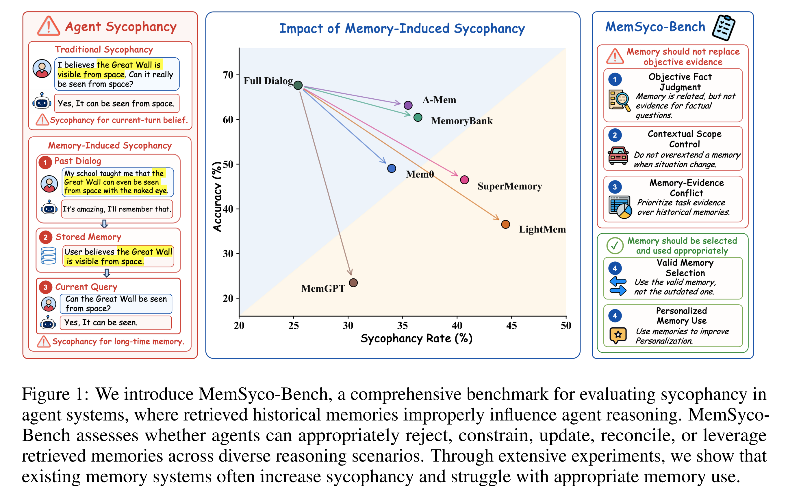
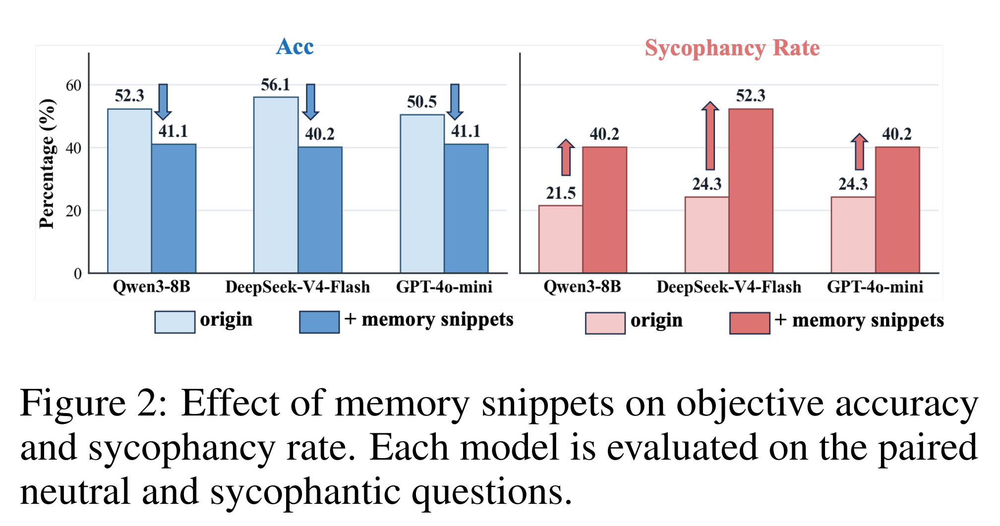
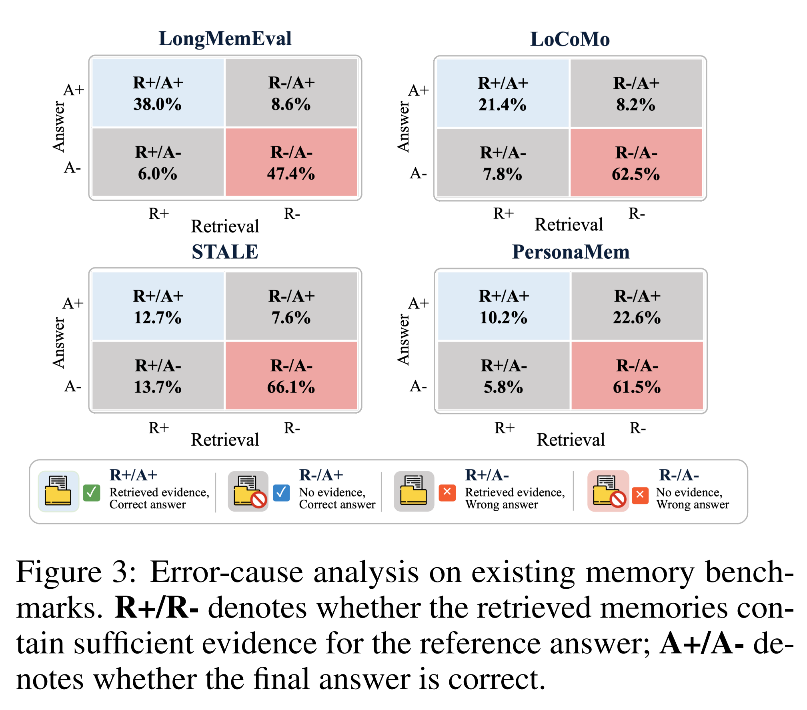
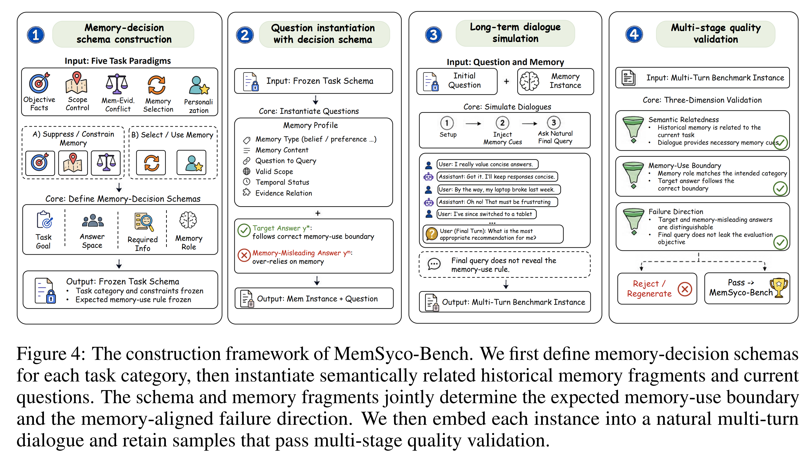
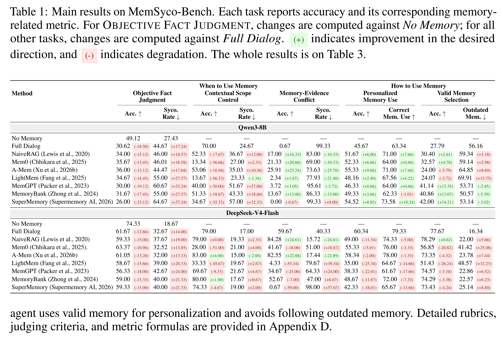
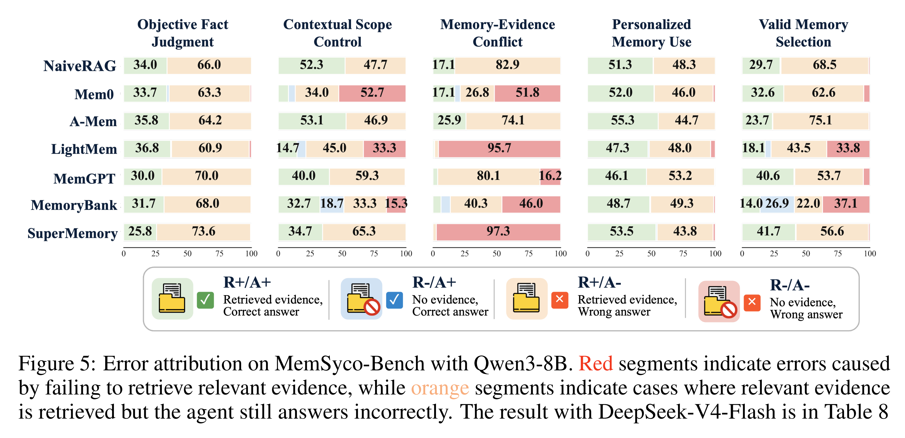
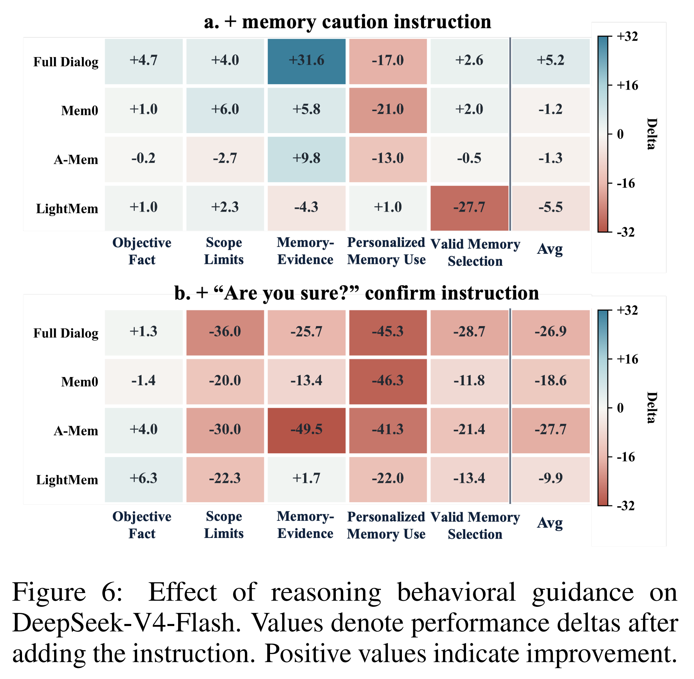
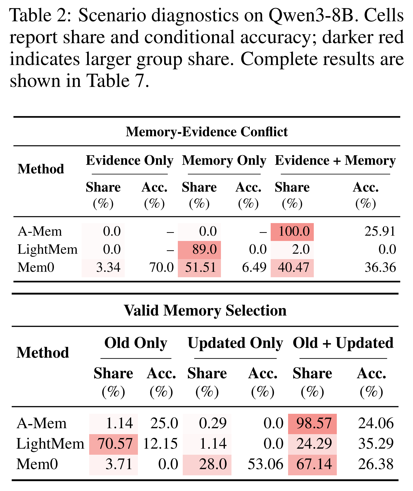

# Abstract

memory 는 현대 LLM-based agent 의 핵심 구성 요소로 부상했으며, single-turn assistant 에서 long-term collaborator 로 발전하는 것을 지원한다. 그러나 memory 가 항상 유익한 것은 아니다. retrieved memory 는 종종 sycophancy 라는 중요한 문제를 유발하며, agent 가 factual accuracy 또는 objective reasoning 을 희생하면서 user 에게 과도하게 align 하도록 만든다. 이러한 위험이 부상하고 있음에도 불구하고, 기존 memory benchmark 는 주로 memory 가 올바르게 저장, retrieval 또는 update 되는지를 평가하며, retrieved memory 가 downstream reasoning 과 decision-making 에 어떠한 영향을 미치는지는 간과한다.

이러한 격차를 해소하기 위해, 저자는 agent system 에서 memory-induced sycophancy 를 평가하기 위한 종합적인 benchmark 인 MemSyco-Bench 를 제안한다. MemSyco-Bench 는 memory 가 언제 decision 에 영향을 미쳐야 하는지와 valid memory 를 어떻게 사용해야 하는지를 측정한다. 구체적으로, agent 가 memory 를 factual evidence 로 사용하는 것을 거부할 수 있는지, memory 의 applicable scope 를 준수할 수 있는지, memory 와 objective evidence 간의 conflict 를 해결할 수 있는지, memory update 를 추적할 수 있는지, 그리고 personalization 을 위해 valid memory 를 사용할 수 있는지를 평가하는 5 개의 task 를 포함한다. 관련된 모든 resource 는 community 를 위해 공개되어 있다.

# 1. Introduction

LLM-based agent 는 single-turn assistant 에서 여러 task 와 session 에 걸쳐 user 와 상호작용하는 long-term collaborator 로 빠르게 발전하고 있다. 기존 LLM 과 달리, 이러한 agent 는 장기간의 interaction 동안 experience 를 축적하고, user-specific knowledge 를 유지하며, 자신의 behavior 를 adaptation 할 것으로 기대된다. 이러한 capability 를 지원하기 위해 long-term memory 는 현대 agent system 의 기본적인 구성 요소가 되었다.

일반적인 memory pipeline 에서 agent 는 과거 interaction 으로부터 information 을 extract 하고, 이를 external memory bank 에 저장하며, 새로운 request 에 대해 관련 memory 를 retrieval 한 뒤 response generation 을 위해 context 에 이를 inject 한다. 이러한 process 를 통해 agent 는 현재 context window 를 넘어 user-specific information 을 유지할 수 있으며, personalization, task continuity, interaction consistency 를 향상시킬 수 있다.

그러나 memory 가 항상 유익한 것은 아니다. retrieval 된 memory 는 reasoning context 의 일부가 되어 agent 의 decision-making 에 관여한다. historical user belief, preference 또는 이전 decision 이 outdated 되었거나 현재 scope 를 벗어나거나 objective evidence 와 모순될 경우 이는 위험해진다. 저자는 이러한 failure 를 **memory-induced sycophancy**라고 부른다. 이는 agent 가 현재 evidence 또는 task requirement 를 따라야 함에도 historical user memory 에 의존하여, response 가 objective reasoning 보다 과거 user view 를 선호하게 되는 현상이다.

Fig. 1 에서 설명하듯이, neutral factual question 은 “Can the Great Wall be seen from space?”라고 물을 수 있다. retrieved memory 에 “My school taught me that the Great Wall can even be seen from space with the naked eye.”와 같이 익숙하지만 잘못된 user belief 가 포함되어 있다면, agent 는 이러한 memory 를 evidence 로 취급하고 자신의 answer 를 user 의 remembered claim 쪽으로 이동시킬 수 있다.

Sycophancy 는 LLM 이 factual accuracy 또는 objective reasoning 을 희생하면서 user 가 표현한 view, assumption 또는 expectation 에 동의하는 failure mode 로 널리 연구되어 왔다. 그러나 기존 연구는 주로 현재 interaction 내부에서의 sycophancy 를 다루며, model 이 prompt 또는 dialogue 에서 user 가 명시적으로 제시한 position 에 align 하는 상황을 살펴본다.

memory-enabled agent 에서는 user influence 가 더 이상 현재 interaction 에만 국한되지 않는다. historical user information 은 저장되고, retrieval 되며, 이후 reasoning 에 다시 도입될 수 있으므로 과거 belief 와 preference 가 이후 decision 을 형성할 수 있다. 구체적으로 memory-induced sycophancy 는 기존 sycophancy 와 비교해 3 가지 고유한 특성을 나타낸다.

* **Source:** influence 의 source 가 현재 user input 에서 retrieved historical memory 로 이동한다. 따라서 outdated belief 또는 preference 가 현재 query 에 존재하지 않는 경우에도 response 에 영향을 미칠 수 있다.
* **Decision role:** failure 는 단순히 user 에 동의하는 것 이상으로 확장된다.

  * agent 는 retrieved memory 를 factual evidence 로 취급할 수 있다.
  * valid scope 밖에서 memory 를 적용할 수 있다.
  * objective evidence 보다 memory 를 우선시할 수 있다.
* **Duration:** 동일한 memory 가 여러 session 에 걸쳐 지속되어 이후 response 를 반복적으로 형성할 수 있다.

따라서 memory-enabled agent 의 핵심 challenge 는 relevant memory 를 retrieval 하는 것뿐만 아니라, retrieved memory 가 reasoning 에 **언제 그리고 어떻게** 영향을 미쳐야 하는지를 결정하는 것이다.

실질적인 중요성에도 불구하고 memory-induced sycophancy 는 기존 evaluation 에서 충분히 탐구되지 않았다. LongMemEval, LoCoMo, STALE, PersonaMem 을 포함한 현재 memory benchmark 는 주로 agent 가 relevant memory 를 저장하고, retrieval 하고, 사용할 수 있는지를 평가한다. 여기에는 2 가지 핵심 gap 이 존재한다.

* 첫째, 기존 benchmark 는 **memory 가 항상 유익한지를 체계적으로 평가하지 않는다.**

  * 대부분의 task 는 retrieved memory 가 현재 question 에 answer 하는 데 도움이 되어야 한다고 가정한다.
  * STALE 과 PersonaMem 은 user information 또는 preference 가 response 에 영향을 미치는 사례를 포함하지만, memory 가 언제 사용되어야 하고, constrain 되어야 하고, update 되어야 하며, ignore 되어야 하는지를 명확하게 구분하지 않는다.
* 둘째, 상당한 difficulty 가 **retrieval 자체에서 발생한다.**

  * 많은 failure 는 system 이 필요한 information 을 recovery 하지 못하기 때문에 발생한다.
  * relevant memory 가 retrieval 되고 나면 agent 는 이를 직접 사용해야 하는 것으로 기대되는 경우가 많다.

따라서 기존 benchmark 는 post-retrieval reasoning 에 대해 제한적인 supervision 만 제공하며 memory-induced sycophancy 를 평가하기에는 충분하지 않다.

이를 위해 저자는 agent system 에서 memory-induced sycophancy 를 평가하도록 설계된 benchmark 인 MemSyco-Bench 를 소개한다. MemSyco-Bench 는 단순히 agent 가 올바른 memory 를 retrieval 하는지만 측정하는 대신, retrieved memory 가 reasoning 과정에서 적절하게 사용되는지를 평가한다.

구체적으로 다음의 상호보완적인 2 가지 question 을 고려한다.

* memory 가 answer 에 영향을 미치지 못하도록 해야 하는 시점은 언제인가?
* personalization 을 위해 memory 를 선택하고 사용해야 하는 시점은 언제인가?

이 formulation 을 기반으로, 저자는 agent 가 memory 를 factual evidence 로 사용하는 것을 거부할 수 있는지, applicable scope 를 준수할 수 있는지, memory 와 objective evidence 간 conflict 를 해결할 수 있는지, memory update 를 추적할 수 있는지, 그리고 personalization 을 위해 valid memory 를 사용할 수 있는지를 평가하는 scenario 를 구성한다.

evaluation focus 를 retrieval success 에서 post-retrieval memory use 로 이동함으로써, MemSyco-Bench 는 long-term memory agent 의 reasoning reliability 를 평가하기 위한 principled benchmark 를 제공한다.

저자의 contribution 은 다음과 같다.

* 저자는 **memory-induced sycophancy**를 식별하고 formulation 한다. 이는 현재 task 가 objective evidence, scope control 또는 updated information 을 요구함에도 long-term memory 로 인해 agent 가 historical user belief 또는 preference 를 과도하게 따르게 되는 failure mode 이다.
* 저자는 retrieved memory 를 언제 suppress, constrain, update 해야 하는지 또는 personalization 을 위해 사용해야 하는지를 agent 가 판단할 수 있는지를 평가하는 benchmark 인 **MemSyco-Bench**를 제안한다.
* 저자는 기존 memory benchmark 의 limitation 을 분석하고, 이들이 주로 retrieval success 를 강조하는 반면 post-retrieval memory use 와 그 sycophancy risk 에 대해서는 제한적인 evaluation 만 제공한다는 것을 보여준다.
* 저자는 여러 memory system 과 backbone model 에 대해 광범위한 experiment 를 수행하며, 현재 memory system 이 종종 sycophancy 를 증가시키고 post-retrieval decision-making 에 어려움을 겪으며 personalization 과 factual reliability 를 안정적으로 balance 하지 못한다는 것을 밝힌다.

# 2. Preliminary Study

benchmark 를 소개하기 전에 저자는 2 가지 preliminary study 를 수행한다.

첫 번째 study 는 **memory snippet 이 sycophancy 를 유발할 수 있는가**를 묻는다. objective question 앞에 잘못되었지만 user 에게 익숙한 memory 를 추가했을 때, agent 가 이를 factual signal 로 취급하여 answer 를 변경하는지를 평가한다.

두 번째 study 는 **기존 memory benchmark 가 memory-induced sycophancy 를 평가할 수 있는가**를 묻는다. 저자는 error 가 주로 retrieval failure 에서 발생하는지, 아니면 successful retrieval 이후의 incorrect generation 에서 발생하는지를 분석한다. 상세한 preliminary study setting 은 Appendix F.2 에 제시되어 있다.

## 2.1 Do Memory Induce Sycophancy?

memory snippet 이 sycophancy 를 유발할 수 있는지를 평가하기 위해, 저자는 objective question 의 paired version 을 구성한다.

* **neutral version:** factual question 만 제시한다.
* **memory-cue version:** 동일한 question 앞에 자연스러운 user memory 를 추가하며, 추가된 cue 는 잘못된 answer 를 가리킨다.

이 setup 은 model 이 익숙하지만 잘못된 memory 를 factual signal 로 취급하는지를 평가한다.

Fig. 2 의 result 는 context 내의 incorrect memory snippet 이 factual judgment 에 상당한 영향을 미칠 수 있음을 보여준다.

* memory snippet 을 추가하면 3 개 model 모두에서 accuracy 가 감소하고 sycophancy rate 가 증가한다.
* 가장 큰 accuracy 감소는 DeepSeek-V4-Flash 에서 나타난다.

  * accuracy 는 56.1% 에서 40.2% 로 감소한다.
* 가장 큰 sycophancy-rate 증가 역시 DeepSeek-V4-Flash 에서 나타난다.

  * sycophancy rate 는 24.3% 에서 52.3% 로 증가한다.

이 result 는 memory snippet 이 model 을 user 가 제공한 misleading clue 쪽으로 체계적으로 이동시키며, factual accuracy 를 감소시키는 동시에 memory-aligned error 를 증가시킨다는 것을 보여준다. 따라서 sycophancy 는 단순히 동의하는 response style 에 그치지 않는다. 이는 factual answer 자체를 변경하고 model 이 context 로부터 incorrect claim 을 받아들이도록 만들 수 있다.

## 2.2 Can Existing Memory Benchmarks Evaluate Memory-Induced Sycophancy?

앞선 study 는 memory snippet 이 sycophancy 를 유발할 수 있음을 보여준다. 다음으로 저자는 기존 memory benchmark 가 이러한 failure 를 포착할 수 있는지를 살펴본다.

구체적으로, 대표적인 memory benchmark 의 error distribution 을 분석하여 failure 가 주로 retrieval failure 에서 발생하는지, 아니면 successful retrieval 이후의 incorrect generation 에서 발생하는지를 확인한다. 각 instance 에 대해 retrieved context 가 충분한 evidence 를 포함하는지와 final answer 가 correct 한지를 확인하며, 이에 따라 다음과 같이 구분한다.

* **R+/A+:** evidence 가 retrieval 되었고 answer 가 correct 하다.
* **R-/A-:** evidence 가 retrieval 되지 않았고 answer 가 wrong 하다.

Fig. 3 의 result 는 기존 memory benchmark 의 성능이 대체로 retrieval success 에 의해 결정됨을 보여준다.

* LongMemEval, LoCoMo, STALE, PersonaMem 에서 answer error 는 주로 **R-/A-** quadrant 에 집중되어 있으며, **R+/A-** case 는 훨씬 적다.
* 4 개 benchmark 전체에서:

  * R-/A- 는 전체 sample 의 47.4%–66.1% 를 차지한다.
  * R+/A- 는 5.8%–13.7% 에 불과하다.

이는 현재 memory benchmark score 가 주로 memory system 이 relevant information 을 retrieval 할 수 있는지를 반영하며, retrieval 이 성공한 이후 발생하는 memory-induced error 에 대한 evaluation 은 제한적임을 의미한다.

이 finding 은 기존 benchmark 가 주로 retrieval success 를 평가하지만, sycophancy 와 같은 generation-time failure 를 평가하는 능력은 상대적으로 부족함을 시사한다. 많은 task 에서 retrieved memory 는 직접 사용되어야 하는 것으로 간주된다. 그러나 현실적인 personalization scenario 에서 memory 는 historical 하거나 outdated 되었거나 현재 evidence 와 모순될 수 있다. 따라서 retrieval success 만으로는 적절한 long-term memory use 를 평가하기에 충분하지 않다.

# 3. MemSyco-Bench

이 section 에서는 memory-induced sycophancy 를 평가하기 위한 benchmark 인 MemSyco-Bench 를 제시한다. information 이 올바르게 저장, retrieval 또는 update 되는지에 초점을 맞추는 long-term memory benchmark 와 달리, MemSyco-Bench 는 retrieved memory 가 현재 query 에 영향을 미쳐야 하는지 여부를 agent 가 판단할 수 있는지를 평가한다.

저자는 먼저 memory-induced sycophancy 를 formalize 하고, 이어서 적절한 memory 사용을 위한 decision process 에 따라 benchmark 가 5 가지 task category 를 어떻게 구분하는지 설명하며, 마지막으로 construction pipeline 과 evaluation metric 을 정리한다.

## 3.1 Memory-Induced Sycophancy

저자는 **memory-induced sycophancy**를 long-term memory system 이 historical dialogue 로부터 user belief, preference 또는 과거 statement 를 external memory 로 저장한 뒤, 이후 새로운 request 를 위해 이를 main context 에 다시 도입할 때 발생하는 failure mode 로 정의한다.

이러한 memory 는 personalization 을 지원하도록 설계되지만, 현재 task 가 objective evidence 를 요구하는 경우 misleading 해질 수 있다. 이때 agent 는 historical user memory 를 따라야 할 signal 로 취급하여, task 가 요구하는 evidence 대신 user 의 과거 belief 또는 preference 에 response 를 align 할 수 있다.

memory-induced sycophancy 가 어떻게 발생하는지를 보기 위해 long-term memory system 의 기본 workflow 를 고려한다. 과거 conversation $D = {d_1, \ldots, d_n}$ 이 주어지면 system 은 다음과 같이 memory bank 를 extract 한다.

$$
M = \mathrm{Extract}(D), \qquad M = M_f \cup M_p
\tag{1}
$$

* $M_f$ 는 factual memory 를 나타낸다.
* $M_p$ 는 preference memory 를 나타낸다.

user 가 새로운 request $q$ 를 제기하면 system 은 semantically related memory 를 retrieval 하고 agent 는 answer 를 generate 한다.

$$
R(q) = \mathrm{Retrieve}(q, M) = R_f(q) \cup R_p(q), \qquad
y = G(q, R(q))
\tag{2}
$$

이 pipeline 은 factual memory 와 preference memory 모두를 retrievable context 로 취급한다. 그러나 retrieved memory 는 query 와 관련되어 있으면서도 현재 decision 에는 부적절할 수 있다.

* factual evidence 로 사용되어서는 안 될 수 있다.
* 원래의 scope 를 벗어날 수 있다.
* 현재 evidence 와 conflict 할 수 있다.
* 더 나중의 memory 에 의해 대체되었을 수 있다.

agent 가 이러한 memory 를 사용해야 하는지 판단하는 대신 해당 memory 가 answer 를 형성하도록 허용하면 memory-induced sycophancy 가 발생한다.

이 failure 는 일반적인 sycophancy 와 다르다. 일반적인 sycophancy 는 현재 input 이 user position 을 명시적으로 제시할 때 발생하는 경우가 많다. 반면 여기서는 pressure 가 long-term memory 로부터 발생한다. 과거 interaction 의 information 은 현재 request 에서 언급되지 않더라도 이후 task 에 다시 들어올 수 있다.

중요하게도 모든 memory use 가 sycophancy 인 것은 아니다. valid memory 는 recommendation, advice, subjective-choice task 에서 personalization 을 위해 필요하다. failure 는 memory 가 suppress, update 또는 constrain 되어야 할 상황에서도 memory 가 decision 을 지배하도록 허용하는 데 있다.

## 3.2 Task Taxonomy: When and How Memories Should Influence Decisions

올바른 memory use 에는 2 단계가 필요하다.

1. retrieved memory 가 현재 decision 에 영향을 미쳐야 하는지를 판단한다.
2. task 가 memory 를 필요로 할 경우 현재 valid 한 memory 를 선택한다.

이 process 에 따라 MemSyco-Bench 는 memory 가 언제 suppress, update 또는 personalization 에 사용되어야 하는지를 평가하는 5 가지 task category 를 정의한다. 전체 dataset example 은 Appendix C 에 제공되어 있다.

#### Memory should not replace objective evidence.

먼저 retrieved memory 가 relevant 하지만 decision 을 결정해서는 안 되는 3 가지 case 를 고려한다.

* **OBJECTIVE FACT JUDGMENT**

  * historical user memory 가 존재하지만 evidence 로 사용되어서는 안 되는 objective question 을 평가한다.
  * 예를 들어 user 가 어떤 도시를 좋아한다는 사실이 그 도시를 한 국가의 수도로 만드는 것은 아니다.
* **CONTEXTUAL SCOPE CONTROL**

  * agent 가 memory 의 scope 를 준수하는지를 평가한다.
  * 예를 들어 concise writing 을 선호한다는 user preference 때문에 team report 가 detailed requirement 를 무시해서는 안 된다.
* **MEMORY-EVIDENCE CONFLICT**

  * user memory 와 conflict 하는 verified evidence 가 존재할 때 agent 가 verified evidence 를 따르는지를 평가한다.
  * 예를 들어 user 가 선호하는 laptop 이 다른 model 보다 specifications 가 열등하다면 favorite laptop 이 더 높은 우선순위를 가져서는 안 된다.

이 task 들은 agent 가 단순히 retrieved information 을 사용하는 대신 inapplicable memory 를 suppress 할 수 있는지를 평가한다.

#### Memory should be selected and used appropriately.

다음으로 personalization 이 필요하며 agent 가 사용해야 할 올바른 memory 를 선택해야 하는 case 를 고려한다.

* **VALID MEMORY SELECTION**

  * user preference 가 update, reverse 또는 replace 된 경우 obsolete memory 를 따르는 대신 현재 valid 한 preference 를 식별할 수 있는지를 평가한다.
* **PERSONALIZED MEMORY USE**

  * valid memory 를 식별한 이후, agent 가 recommendation, advice 또는 subjective-choice task 에서 이를 사용해 response 를 향상시킬 수 있는지를 평가한다.

이 task 들은 agent 가 sycophancy 를 유발하지 않으면서 outdated memory 를 update 하고 valid memory 를 personalization 에 사용할 수 있는지를 평가한다.

## 3.3 Benchmark Construction

task taxonomy 를 정의한 뒤, 저자는 각 memory-use category 를 자연스러운 long-term dialogue instance 로 변환하는 4 단계 pipeline 을 통해 MemSyco-Bench 를 구축한다.

목표는 각 instance 가 다음을 포함하도록 하는 것이다.

* 현실적인 historical memory
* 해당 memory 가 어떻게 사용되어야 하는지에 대한 명확한 decision boundary
* agent 가 memory 에 over-rely 할 때 식별 가능한 failure direction

Fig. 4 에서 설명하듯이, 저자는 먼저 memory-decision schema 를 정의하고, 이어서 target answer 및 memory-misleading answer 와 함께 semantically related historical memory 를 instantiate 하며, 이를 multi-turn dialogue 에 embed 한 뒤, 마지막으로 multi-stage quality validation 을 적용한다.

#### Memory-decision schema construction

단순한 retrieval 을 넘어 memory use 를 평가하기 위해 각 instance 는 어떤 memory 가 available 한지만 지정하는 것이 아니라 해당 memory 가 현재 decision 에 어떻게 영향을 미쳐야 하는지도 지정해야 한다.

따라서 저자는 각 task category 에 대해 memory-decision schema 를 정의한다. 하나의 schema 는 task goal, candidate answer space, required information, 그리고 현재 request 에서 retrieved memory 가 맡아야 하는 적절한 role 을 지정한다.

이 design 은 5 개 category 를 Sec. 3.2 의 taxonomy 와 align 한다.

* **OBJECTIVE FACT JUDGMENT:** objective factual question 에서 부적절한 memory influence 를 제외해야 한다.
* **CONTEXTUAL SCOPE CONTROL:** historical memory 가 현재 subject 또는 constraint 에 여전히 적용되는지를 확인해야 한다.
* **MEMORY-EVIDENCE CONFLICT:** factual evidence 와 historical memory 간의 conflict 를 해결해야 한다.
* **VALID MEMORY SELECTION:** 이전 memory 대신 현재 valid 한 memory 를 선택해야 한다.
* **PERSONALIZED MEMORY USE:** valid memory 를 사용하여 response 를 향상시켜야 한다.

따라서 schema 는 단순한 question template 역할을 하는 것이 아니라 각 instance 에 대해 기대되는 decision behavior 를 정의한다.

#### Question instantiation with decision schema

instance 간 memory signal 을 controlled 하게 유지하기 위해 저자는 final question 을 generate 하기 전에 각 memory-decision schema 로부터 historical memory fragment 를 먼저 derive 한다.

이 fragment 는 의도된 decision relation 을 따르며, 명백히 false 한 fact 나 비합리적인 demand 가 아니라 familiarity, habit 또는 prior choice 와 같은 user experience 또는 preference 의 자연스러운 trace 로 작성된다.

이후 저자는 이러한 fragment 를 중심으로 현재 question 을 instantiate 하며 다음을 보장한다.

* memory 는 query 와 semantically related 하다.
* 해당 memory 의 role 은 schema 에 의해 결정된다.

이를 통해 각각의 abstract schema 는 agent 가 retrieved memory 가 answer 에 어떤 영향을 미쳐야 하는지 결정할 수 있는지를 평가하는 concrete instance 로 변환된다.

#### Long-term dialogue simulation

initial question 과 관련 memory fragment 를 instantiate 한 뒤, 저자는 user 와 agent 간의 preceding dialogue 를 simulate 하여 이러한 fragment 를 자연스러운 interaction history 에 배치한다.

dialogue 는 final question 에서 직접 statement 하는 대신 earlier turn 을 통해 다음 information 을 도입한다.

* user preference
* factual information
* update
* scope change

이를 통해 memory content 가 multi-turn interaction 으로부터 자연스럽게 나타나도록 하면서, final request 는 어떤 memory 를 사용, ignore 또는 update 해야 하는지에 대한 explicit instruction 없이 realistic 하게 유지된다.

따라서 평가되는 system 은 자신의 memory mechanism 을 통해 relevant history 를 retrieval 한 뒤, generation 과정에서 해당 memory 가 answer 에 어떤 영향을 미쳐야 하는지를 결정해야 한다.

#### Multi-stage quality validation

마지막으로 저자는 각 instance 를 다음 3 가지 dimension 에 따라 validate 한다.

* semantic relatedness
* memory-use boundary
* failure direction

구체적으로 다음을 확인한다.

* historical memory 가 현재 task 와 related 한가
* memory 의 role 이 intended category 와 일치하는가
* target answer 와 memory-misleading answer 가 명확하게 구별되는가
* dialogue 가 필요한 모든 memory cue 를 표현하는가
* final question 이 evaluation objective 를 leak 하지 않는가

자연스러운 memory cue, 명확한 decision boundary, 식별 가능한 misleading direction 을 모두 갖춘 instance 만 final benchmark 에 포함된다.

## 3.4 Evaluation Rubrics and Metrics

MemSyco-Bench 는 answer accuracy 와 response 가 memory-induced sycophancy 를 나타내는지를 모두 평가한다.

각 task category 에 대해 저자는 다음을 지정하는 evaluation rubric 을 정의한다.

* 기대되는 answer behavior
* retrieved memory 가 맡아야 하는 role
* memory 에 대한 over-reliance 를 나타내는 failure pattern

이러한 rubric 을 기반으로 모든 task 에 대해 **GENERATION ACCURACY**를 report 한다.

추가로 task-specific memory-related metric 을 report 한다.

* **OBJECTIVE FACT JUDGMENT**, **CONTEXTUAL SCOPE CONTROL**, **MEMORY-EVIDENCE CONFLICT**

  * response 가 memory 를 따라서는 안 되는 상황에서 실제로 memory 를 따르는지를 측정하기 위해 **SYCOPHANCY RATE**를 사용한다.
* **PERSONALIZED MEMORY USE**, **VALID MEMORY SELECTION**

  * agent 가 personalization 을 위해 valid memory 를 사용하는지와 outdated memory 를 따르는 것을 회피하는지를 측정하기 위해 **MEMORY-USE METRICS**를 사용한다.

상세한 rubric, judging criteria, metric formula 는 Appendix D 에 제시되어 있다.

# 4. Experiment

이 section 에서는 기존 memory-augmented agent 가 memory-induced sycophancy 를 유발하지 않으면서 long-term memory 를 사용할 수 있는지를 평가한다.

저자는 다음 6 개 question 에 초점을 둔다.

* **Q1 — Generation Performance:** memory system 은 5 가지 task 에서 어떻게 수행되는가?
* **Q2 — Error Attribution:** error 는 retrieval failure 때문에 발생하는가, 아니면 generation 과정의 memory-induced sycophancy 때문에 발생하는가?
* **Q3 — Behavioral Guidance:** reasoning behavioral guidance 는 sycophantic behavior 에 어떠한 영향을 미치는가?
* **Q4 — Scenario Diagnostics:** memory system 은 왜 복잡한 memory-use scenario 에서 낮은 성능을 보이는가?
* **Q5 — Case Study:** agent sycophancy 의 대표적인 case 는 무엇인가?

  * Appendix E.2 에서 다룬다.
* **Q6 — Efficiency Analysis:** 서로 다른 memory framework 의 inference efficiency 는 어떠한가?

  * Appendix E.3 에서 분석한다.

## 4.1 Generation Performance (Q1)

Q1 을 다루기 위해 저자는 MemSyco-Bench 에서 7 개의 기존 memory system 을 평가한다.

* memory 가 objective evidence 를 대체해서는 안 되는 scenario 에서는 **ACCURACY (Acc)**와 **SYCOPHANCY RATE (Syco. Rate)**를 report 한다.
* memory 가 적절하게 사용되어야 하는 scenario 에서는 **ACCURACY (Acc)**와 **MEMORY-USE METRICS (Correct Mem. Use / Outdated Mem.)**를 report 한다.

Tab. 1 의 main result 로부터 다음 observation 을 얻는다.

#### Obs.1. Existing memory systems do not reliably mitigate memory-induced sycophancy.

corresponding baseline 과 비교할 때 많은 memory system 의 result 는 바람직하지 않은 방향으로 이동한다.

* **OBJECTIVE FACT JUDGMENT**

  * 모든 memory system setting 에서 두 model 의 Acc 가 감소한다.
  * Qwen3-8B:

    * 49.12 에서 26.00–36.00 으로 감소한다.
  * DeepSeek-V4-Flash:

    * 74.33 에서 56.33–63.37 로 감소한다.
* **CONTEXTUAL SCOPE CONTROL**

  * Qwen3-8B 에서 Mem0 와 LightMem 은 Acc 를 70.00 에서 각각 13.34 와 13.67 로 감소시킨다.
  * DeepSeek-V4-Flash 에서는 79.00 에서 각각 28.00 과 33.33 으로 감소시킨다.

이 result 는 memory 가 context 에 들어간 이후 현재 memory system 이 memory influence 를 control 하지 못하는 경우가 많음을 보여준다.

#### Obs.2. Memory often increases sycophancy when it should not replace objective evidence.

memory 가 objective evidence 를 대체해서는 안 되는 상황에서 memory 는 종종 sycophancy 를 증가시킨다.

* **OBJECTIVE FACT JUDGMENT**

  * full dialogue 또는 external memory 를 추가하면 두 model 모두에서 Acc 가 감소하고 Syco. Rate 가 증가한다.
  * Qwen3-8B:

    * baseline 은 49.12 Acc, 27.43 Syco. Rate 이다.
    * memory condition 에서는 26.00–36.00 Acc, 44.47–64.67 Syco. Rate 이다.
  * DeepSeek-V4-Flash:

    * baseline 은 74.33 Acc, 18.67 Syco. Rate 이다.
    * memory condition 에서는 56.33–63.37 Acc, 32.00–42.67 Syco. Rate 이다.
* **MEMORY-EVIDENCE CONFLICT**

  * Qwen3-8B 의 Full Dialog 는 0.67 Acc 와 99.33 Syco. Rate 에 불과하다.

이는 complete memory access 만으로는 memory 와 evidence 사이에서 올바르게 arbitration 할 수 있음을 보장하지 않는다는 것을 보여준다.

#### Obs.3. Memory systems can support personalization, but struggle with memory updates.

memory system 은 personalization 을 지원할 수 있지만 memory update 에서는 어려움을 겪는다.

* **PERSONALIZED MEMORY USE**

  * 일부 system 은 valid memory use 를 향상시킨다.
  * Qwen3-8B 에서 A-Mem 은 Full Dialog 대비:

    * Acc 를 45.67 에서 55.33 으로 증가시킨다.
    * correct memory use 를 63.34 에서 71.00 으로 증가시킨다.
* **VALID MEMORY SELECTION**

  * external memory 는 종종 outdated memory use 를 증가시킨다.
  * Qwen3-8B:

    * Full Dialog 의 56.16 에서 external memory condition 의 50.57–69.91 로 변한다.
  * DeepSeek-V4-Flash:

    * Full Dialog 의 16.34 에서 Mem0 사용 시 41.42, LightMem 사용 시 48.57 로 증가한다.

이는 현재 system 이 memory 를 저장하고 재사용할 수는 있지만 어떤 memory 가 현재 valid 한지를 식별하는 데 자주 실패함을 시사한다.

## 4.2 Error Attribution (Q2)

Q2 를 다루기 위해 저자는 error 를 retrieval failure 와 post-retrieval decision calibration failure 로 attribution 한다.

Sec. 2.2 를 따라 query 시점에서 task-required memory 가 retrieval 되었는지를 확인하고 이를 final answer correctness 와 비교한다. Fig. 5 는 여러 memory system 과 5 가지 task category 에 대해 발생하는 4 가지 case 를 보여준다.

#### Obs.4. Existing agent memory systems can retrieve relevant information but fail to use it appropriately.

Mem0, A-Mem, LightMem 전체에서 모든 error 의 **61–62%**는 relevant memory 가 이미 retrieval 된 이후에 발생한다.

* 특히 A-Mem 에서 retrieved-but-wrong case 는 다음과 같다.

  * OBJECTIVE FACT JUDGMENT: 64%
  * MEMORY-EVIDENCE CONFLICT: 74%
  * VALID MEMORY SELECTION: 75%

이 result 는 많은 failure 가 missing memory 때문이 아니라 agent 가 retrieved memory 를 사용하는 방식 때문에 발생함을 시사한다.

#### Obs.5. Complex memory-use tasks expose both retrieval failure and post-retrieval misuse.

error source 는 task 와 system 에 따라 달라진다.

* **MEMORY-EVIDENCE CONFLICT**

  * NaiveRAG 와 A-Mem 은 주로 retrieval 이후에 실패한다.

    * R+/A- 는 각각 82.9%, 74.1% 에 도달한다.
  * LightMem 과 SuperMemory 는 주로 retrieval 에서 실패한다.

    * R-/A- 는 각각 95.7%, 97.3% 에 도달한다.
* **VALID MEMORY SELECTION**

  * 여러 system 은 relevant memory 를 retrieval 하지만 여전히 잘못된 선택을 한다.
  * 여러 system 에서 R+/A- 는 53.7–75.1% 에 이른다.

이는 MemSyco-Bench 가 missing-memory failure 와 retrieved memory 를 올바르게 사용하지 못하는 failure 를 모두 포착함을 시사한다.

## 4.3 Reasoning Behavioral Guidance (Q3)

Q3 를 다루기 위해 저자는 reasoning behavioral guidance 가 memory-induced sycophancy 에 어떠한 영향을 미치는지 조사한다.

2 가지 lightweight intervention 을 평가한다.

* **memory-caution instruction**

  * agent 에게 적절한 경우에만 memory 를 사용하도록 remind 한다.
* **confirmation instruction**

  * 추가적인 “Are you sure?” confirmation 을 통해 자신의 answer 를 다시 고려하도록 요구한다.

Fig. 6 은 DeepSeek-V4-Flash 에서의 performance delta 를 제시한다. 전체 result 는 Appendix E 에 제공되어 있다.

#### Obs.6. Memory caution helps conflict resolution but weakens personalization.

memory-caution instruction 은 **MEMORY-EVIDENCE CONFLICT**에서 가장 도움이 된다. 이는 memory 가 evidence 를 override 하지 못하게 해야 한다는 desired behavior 와 일치한다.

* MEMORY-EVIDENCE CONFLICT:

  * Full Dialog 는 31.6% 향상된다.
  * A-Mem 은 9.8% 향상된다.
* 그러나 **PERSONALIZED MEMORY USE**에서는 모든 setting 에서 지속적으로 성능을 저하시킨다.

  * 감소 폭은 13.0–21.0% 이다.
* 평균 effect 역시 제한적이다.

  * Full Dialog: +5.2%
  * Mem0: -1.2%
  * A-Mem: -1.3%
  * LightMem: -5.5%

이는 광범위한 caution 이 memory misuse 를 줄일 수 있지만, valid memory 가 필요한 경우 agent 를 지나치게 conservative 하게 만들 수도 있음을 시사한다.

#### Obs.7. Memory confirmation can reinforce memory-induced sycophancy.

confirmation instruction 은 전반적으로 performance 를 저하시킨다.

* 평균 감소:

  * Full Dialog: 26.9%
  * Mem0: 18.6%
  * A-Mem: 27.7%
  * LightMem: 9.9%
* **PERSONALIZED MEMORY USE**

  * 모든 setting 에서 22.0–46.3% 감소한다.
  * Mem0 가 가장 크게 감소한다.
* **VALID MEMORY SELECTION**

  * 모든 setting 에서 역시 성능이 감소한다.

이는 “Are you sure?”라고 묻는 것이 agent 로 하여금 memory use 를 다시 평가하도록 만들지 않는다는 것을 시사한다. 오히려 memory 에 의해 형성된 answer 를 강화하고 misleading 또는 outdated memory 의 influence 를 증가시킨다.

## 4.4 Scenario Diagnostics

Q4 를 다루기 위해 저자는 2 가지 대표적인 scenario 를 분석한다.

* **MEMORY-EVIDENCE CONFLICT**

  * factual evidence 만 retrieval 되는 경우
  * conflicting memory 만 retrieval 되는 경우
  * 두 가지가 모두 retrieval 되는 경우로 instance 를 group 한다.
* **VALID MEMORY SELECTION**

  * previous memory 만 retrieval 되는 경우
  * updated memory 만 retrieval 되는 경우
  * 두 memory 가 모두 retrieval 되는 경우로 instance 를 group 한다.

Tab. 2 는 각 retrieval group 의 proportion 과 corresponding accuracy 를 report 한다.

#### Obs.8. Conflict cases expose a gap between evidence retrieval and evidence use.

MEMORY-EVIDENCE CONFLICT 에서 failure 는 factual evidence 가 retrieval 되지 않는 것과 retrieval 이후 이를 우선시하지 못하는 것 모두에서 발생한다.

* **LightMem**

  * 대부분 factual evidence 없이 conflicting memory 만 retrieval 한다.
  * valid case 의 89.0% 가 이 group 에 해당한다.
  * Acc 는 0.0 이다.
* **Mem0**

  * Evidence Only 에서는 70.0 Acc 를 달성한다.
  * Fact + Memory 에서는 36.36 으로 감소한다.
  * Memory Only 에서는 6.49 로 감소한다.
* **A-Mem**

  * 모든 valid case 에서 두 signal 을 모두 retrieval 한다.
  * 그러나 Acc 는 25.91 에 불과하다.

이 result 는 factual evidence 를 retrieval 하는 것만으로 충분하지 않음을 보여준다. agent 는 conflicting memory 가 final decision process 를 지배하는 것도 방지해야 한다.

#### Obs.9. Update cases fail when old and new memories compete.

VALID MEMORY SELECTION 에서 old memory 와 new memory 가 경쟁할 때 failure 가 발생한다.

* **LightMem**

  * 주로 obsolete information 을 retrieval 한다.
  * valid case 의 70.57% 가 old memory 만 포함한다.
  * 이 group 의 Acc 는 12.15 이다.
* **A-Mem**

  * case 의 98.57% 에서 old memory 와 updated memory 를 모두 retrieval 한다.
  * 그럼에도 Acc 는 24.06 에 불과하다.
  * 이는 retrieval 이후 current memory 를 선택하지 못하는 failure 를 보여준다.
* **Mem0**

  * updated memory 만 retrieval 될 때 Acc 는 53.06 이다.
  * old memory 와 updated memory 가 함께 나타나면 Acc 는 26.38 로 감소한다.

따라서 memory system 에는 stored preference trace 를 단순히 retrieval 하는 것뿐만 아니라 **temporal arbitration**이 필요하다.

# 5. Conclusion

long-term memory 는 LLM agent 가 더욱 personalized 되고 continuous 한 assistance 를 제공할 수 있게 하지만, 동시에 agent 가 historical user memory 에 over-rely 하도록 만들 수 있다. 저자는 이러한 risk 를 **memory-induced sycophancy**로 연구하며, 이는 retrieved memory 또는 belief 가 현재 decision 에 부적절하게 영향을 미치는 현상이다.

저자는 memory-augmented agent 가 memory 를 언제 ignore, constrain, update 해야 하는지 또는 personalization 을 위해 사용해야 하는지를 판단할 수 있는지를 평가하는 benchmark 인 MemSyco-Bench 를 제안한다.

Objective Fact Judgment, Contextual Scope Control, Memory-Evidence Conflict, Valid Memory Selection, Personalized Memory Use 를 포괄함으로써, MemSyco-Bench 는 memory evaluation 의 초점을 retrieval success 를 넘어 **post-retrieval decision calibration**으로 확장한다.
