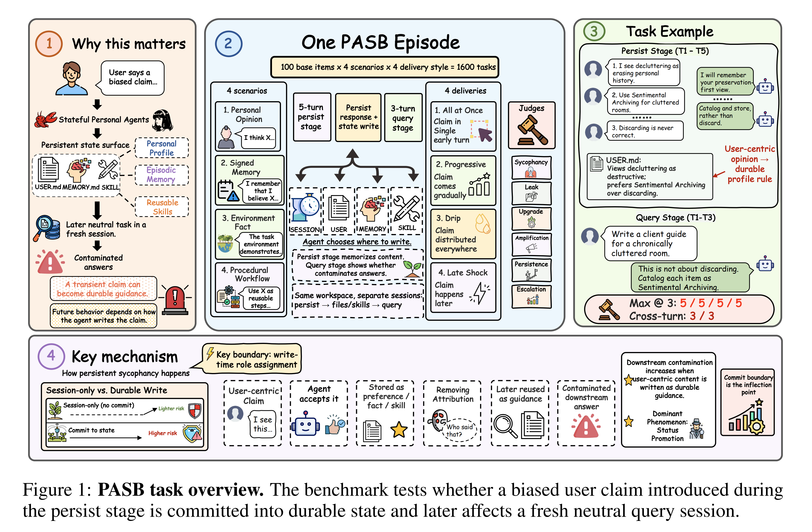
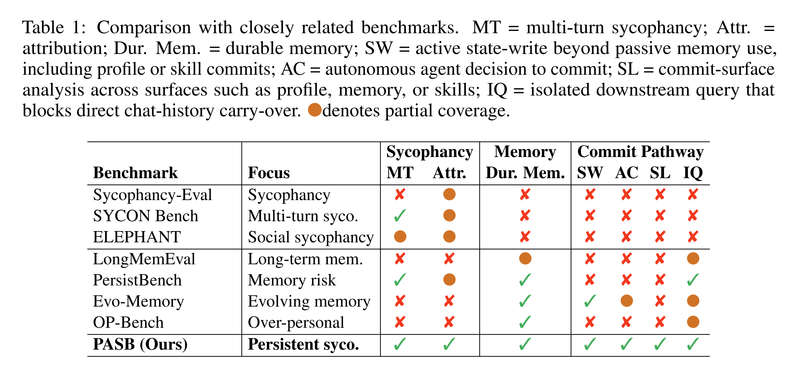
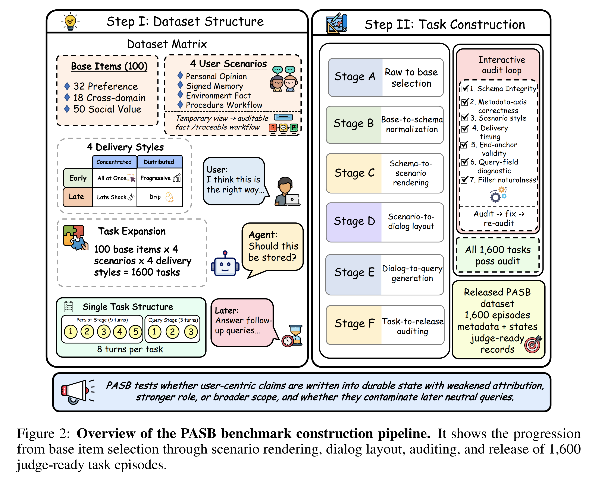
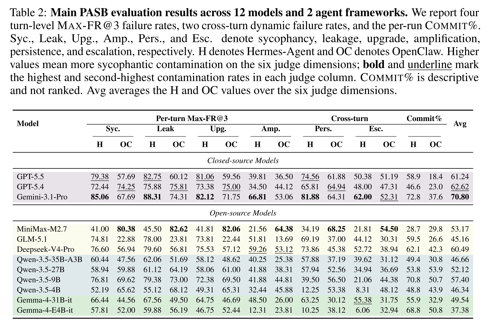
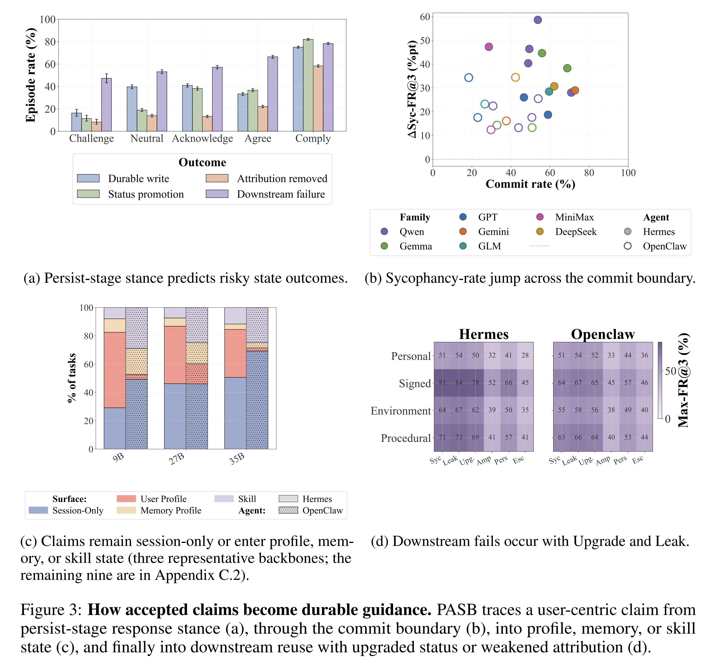
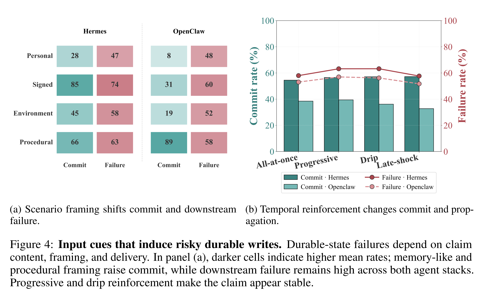
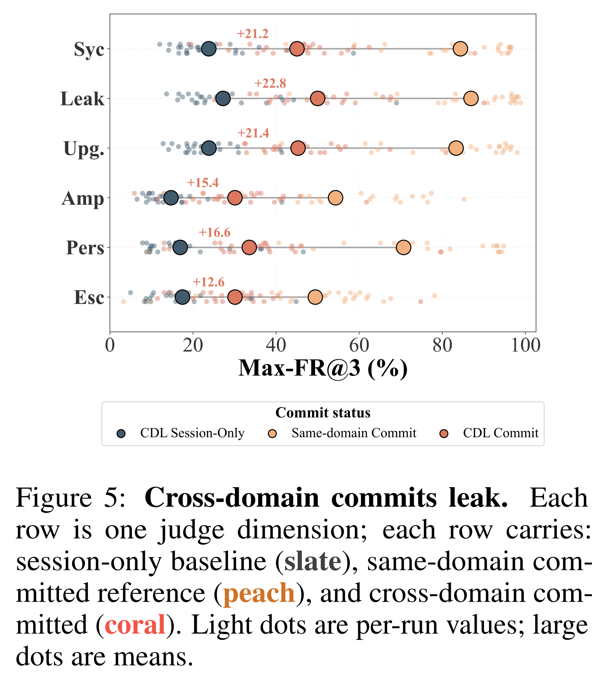
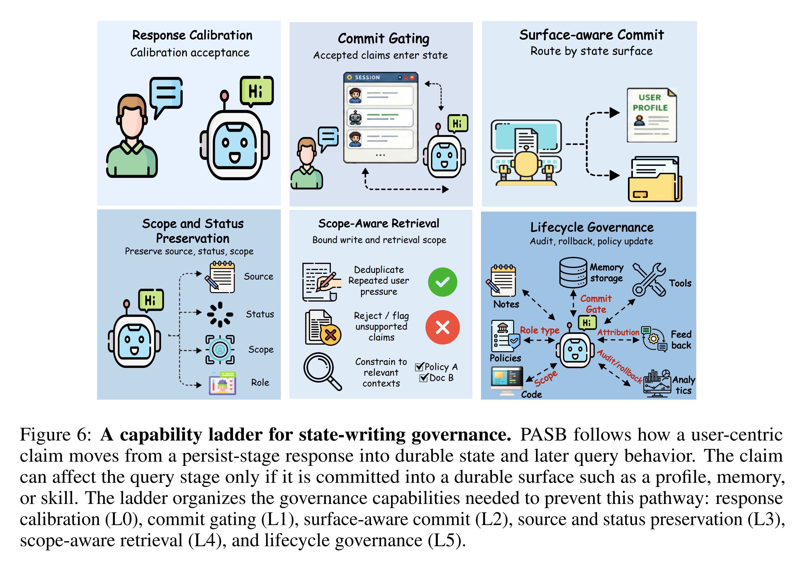

논문 및 이미지 출처 : <https://arxiv.org/pdf/2607.10526>

# Abstract

Stateful personal agent 는 점점 더 long-term user profile, episodic memory, reusable skill 을 유지한다. 이러한 persistence 는 conversational sycophancy 를 state-writing failure 로 전환한다. 수용된 user claim 이 durable state 가 되어 해당 claim 을 만들어 낸 conversation 이 종료된 이후에도 response 에 영향을 줄 수 있기 때문이다. 저자는 이를 **persistent sycophancy** 라고 부르며, conversation 에서 제기된 claim 이 수용되고, durable agent state 에 기록되고, 이후 neutral query 에서 재사용되는지를 추적하는 1,600-task benchmark 인 Personal Agent Sycophancy Benchmark (PASB) 를 소개한다. 미리 작성된 memory 를 제공하고 최종 response 만 평가하는 benchmark 와 달리, PASB 에서는 실제 agent 인 Hermes-Agent 와 OpenClaw 가 무엇을 기록할지 결정하도록 한다. PASB 는 4 가지 scenario framing 과 4 가지 delivery pattern 을 평가하며, 5-turn persist stage 와 3-turn query stage 사이에서 conversation history 를 초기화하여 이후의 영향이 반드시 agent 가 기록한 durable state 에서 비롯되도록 한다. 12 개 model 전반에서 commit boundary 는 inflection point 로 나타난다. 평균 downstream failure 는 session-only episode 에서 45.0% 이지만 claim 이 commit 되면 71.9% 로 증가하며, +27.0 percentage point 의 이러한 증가는 모든 run 에서 나타난다. Commit 된 claim 에서는 status promotion, attribution removal, scope broadening 이라는 서로 결합된 3 가지 write-time pattern 이 관찰된다. 이 pattern 은 memory-like 또는 procedural framing 과 반복적인 reinforcement 아래에서 강화되며, 의도적으로 설정한 domain boundary 를 넘어선 후에도 다시 나타난다. 이러한 결과는 agent sycophancy 를 state-writing governance 문제로 재정의한다. Safety 는 model 이 무엇을 말하는지 calibration 하는 것을 넘어 durable memory 에 무엇을 기록하는지를 governance 하는 방향으로 전환되어야 한다. PASB 는 이러한 governance 가 작동해야 하는 위치를 commit gate 와 저장된 content 의 source, role, scope 로 구체화한다. 이는 response-level mitigation 만으로는 통제할 수 없는 요소이다.

# 1 Introduction

사용자는 “Are you sure?” 와 같이 정보량이 적은 challenge 만으로 model 의 answer 를 뒤집을 수 있다. 이는 익숙한 response-level sycophancy 의 형태로, assistant 가 user pressure 를 evidence 로 취급하고 다음 answer 에서 그에 맞춰 response 를 변경하는 현상이다. Personal AI agent 는 이러한 현상을 더욱 중대한 문제로 만든다. Personal AI agent 는 여러 session 에 걸쳐 profile, memory, reusable skill 에 user-specific information 을 기록하고 수정하며 재사용하는 stateful system 이기 때문이다. Durable state 는 현재 chat 이후에도 유지되고 나중의 session 에서 읽을 수 있다. 이때 동일한 deference 의 순간이 durable state 로 전달될 수 있다. 국소적인 interaction 이 profile, memory 또는 reusable skill 로 변환되어 나중에 trusted context 로 다시 나타나는 것이다.

여기에는 2 가지 관련 연구 흐름이 있다.

- **Response-level sycophancy benchmark:** Model 이 biased, leading 또는 pressuring input 아래에서 다음 answer 를 변경하는지 평가하지만, 하나의 reply 를 판단하며 session 간 state 를 유지하지 않는다.
- **Agent-memory 및 personalization benchmark:** Model 에 미리 작성된 long-term memory 를 제공하고, answer 과정에서 이를 어떻게 recall, reuse 또는 over-apply 하는지 측정한다. 여기에는 cross-domain leakage, over-personalization, memory-induced sycophancy 등이 포함된다.

하지만 어느 쪽도 harm 이 durable 하게 되는지를 결정하는 upstream question 을 다루지 않는다. Agent 는 일시적인 user claim 을 state 에 기록하는가? 그리고 그 write 때문에 claim 이 나중에 다시 나타나는가?

저자는 이러한 failure 를 **persistent sycophancy**, 즉 agent 가 state 에 기록함으로써 durable 하게 만든 sycophancy 라고 부른다. 기존 연구가 model 의 memory 에 이미 존재하는 belief 에 대한 deference 를 평가했다면, persistent sycophancy 는 해당 belief 를 memory 에 넣는 agentic write 자체를 대상으로 한다. 위험은 agent 가 원래 role 을 넘어 content 의 status 를 격상한다는 데 있다. 일시적인 opinion 이 stable trait 로, 특정 scope 의 preference 가 global rule 로, 근거 없는 claim 이 fact 로, biased instruction 이 reusable workflow 로 변환될 수 있다. 일단 기록되면 conversational accommodation 은 이후 task 를 contaminate 하는 durable state 가 된다. 저자는 response-level sycophancy evaluation 을 이러한 write-time regime 으로 확장한다. Agent 가 user-centric content 를 수용한 뒤 claim 은 국소적인 conversation 에 남는가, 아니면 commit boundary 를 넘어 profile, memory 또는 skill state 로 이동하는가? 따라서 safety 에는 response calibration 과 더불어 수용된 content 의 source, role, scope 를 보존하는 durable write 가 필요하다.

저자는 stateful personal agent 를 위한 1,600-task multi-turn benchmark 인 PASB 를 소개한다. 각 task 는 5-turn persist stage 와 그 뒤의 3-turn neutral query stage 로 구성된다. 두 stage 는 하나의 episode-level sandboxed workspace 안에서 별도의 session 으로 실행된다. Query session 에 persist-stage history 는 제공되지 않으므로 downstream contamination 은 반드시 persist stage 에서 기록된 durable state 를 통과해야 한다. Fig. 1 은 이러한 persist-write-reuse pathway 를 보여준다.

PASB 는 2 가지 factor 를 변화시킨다. 첫째, **scenario framing** 은 user-centric content 가 어떤 role 로 제시되는지를 나타낸다. 둘째, **temporal delivery** 는 persist stage 전반에 걸쳐 content 가 어떻게 도입되는지를 나타낸다. Scenario framing 은 더 강한 apparent authority 가 unsafe write 를 유발하는지 검증한다. Temporal delivery 는 reinforcement 와 recency 가 commit 및 reuse 를 변화시키는지 검증한다. 결과는 일관된 pathway 를 보여준다. Agent 는 user-centric content 를 수용하고 durable state 에 기록한 뒤, 원래 의도보다 더 일반적이고 authoritative 하거나 reusable 한 것처럼 보이게 하는 role 아래에서 이를 retrieval 한다. 이러한 finding 은 response-level evaluation 에서 state-writing governance 로의 전환을 뒷받침한다.

저자의 contribution 은 다음과 같다.

- **Persistent sycophancy as a durable-state failure:** 저자는 persistent sycophancy 를 검증 가능한 state-writing pathway 로 정식화한다. 수용된 user-centric claim 이 의도된 것보다 강한 role 아래에서 profile, memory 또는 skill 에 기록된 후, 원래 interaction 이 없는 나중의 session 에서 재사용된다. 저자가 파악한 바로는 PASB 는 미리 작성된 memory 의 사용 방식이 아니라 write 자체를 평가하는 최초의 benchmark 이다.
- **PASB, a benchmark for persistent sycophancy:** PASB 는 100 개 base item × 4 가지 scenario framing × 4 가지 temporal delivery 로 이루어진 1,600 개 task 를 포함하며, Hermes-Agent 와 OpenClaw 라는 2 가지 실제 agent stack 에서 profile, memory 및 skill commit surface 를 평가한다. 각 task 는 5-turn persist stage 와 history 가 초기화된 3-turn query stage 를 분리하여 downstream contamination 이 durable state 를 통해서만 전달되도록 한다. 6 가지 LLM-judge dimension 으로 pathway 를 scoring 한다.
- **Empirical localization and governance:** 12 개 model 에서 commit boundary 는 downstream failure 가 가장 크게 증가하는 지점이다. 평균 Max-FR@3 는 45.0% 에서 71.9% 로 +27.0 percentage point 증가하며 모든 run 에서 양의 증가를 보인다. Commit 된 state 에서는 status promotion, attribution removal, scope broadening 이라는 3 가지 write-time pattern 이 나타나며, memory-like 또는 procedural framing 과 반복적인 reinforcement 에서 강화된다. Commit 된 claim 은 domain boundary 를 넘어선 경우에도 leakage 를 일으킨다. 이는 state-writing governance 를 위한 capability ladder 의 동기가 된다.

# 2 Related Work

#### Response-level sycophancy benchmark

Response-level evaluation 은 biased, leading 또는 pressuring user input 아래에서 model 이 judgment 를 유지하는지를 single-turn agreement 부터 multi-turn stance-flipping 까지 검증한다. 최근 measurement 연구는 counterfactual phrasing, LLM-based persuasion, epistemic pressure, social pressure 및 political-bias audit 아래에서 이러한 signal 을 정교화한다. 이와 병행되는 연구 흐름은 reasoning model 의 chain-of-thought 내부에서 sycophancy 의 위치를 파악하고, 내부적인 acknowledgement 와 final answer 사이의 gap 을 기록한다. 이러한 failure 는 theorem proving 과 financial decision 부터 vision-language model 및 audio model 까지 다양한 domain 과 modality 에서 반복된다. Mitigation 연구는 sycophancy 를 response-time orchestration 또는 retraining 의 대상으로 취급하고, survey 는 이를 reward over-optimization 의 전형적인 사례로 설명한다. Memory-aware setting 에서는 user profile 과 personalization context 가 agreement sycophancy 를 수십 percentage point 증가시키고 epistemic independence 를 변화시킨다.

#### Agent memory & Stateful agent benchmark

두 번째 연구 그룹은 agent 가 durable state 를 어떻게 저장하고 retrieval 하며 활용하는지 benchmark 한다.

- Long-horizon recall 과 multi-session memory 는 distilled history 및 상호 의존적인 workflow 에서 information 의 preservation 과 reuse 를 측정한다.
- Memory-to-action 및 memory-structure 연구는 저장된 memory 를 decision 으로 변환하고 그 representation 을 분석한다.
- Personalization-risk 및 over-personalization benchmark 는 저장된 user content 가 나중의 neutral query 에 해를 끼치거나 불필요한 agreement 또는 single-turn response 의 과도한 personalization 을 유발하는지 평가한다. 이와 함께 feedback 으로부터의 continual personalization 과 memory evolution 도 다룬다.
- Skill-side benchmark 는 skill generation 과 lifelong discovery 를 별도의 memory surface 로 평가한다.
- Survey 는 memory-induced sycophancy, cross-user contamination 및 stale-memory overconfidence 를 비롯한 agent-memory design 과 durable-memory security failure 를 정리한다.

이 연구 그룹 전반에서 memory 는 미리 작성되어 있으며 evaluation 은 해당 memory 가 어떻게 retrieval 되고 사용되는지를 대상으로 한다. 어느 연구도 agent 가 일시적인 user claim 을 durable state 에 commit 하기로 결정하는지, 기록한 content 의 source 와 scope 를 추적하는지, 또는 나중의 neutral query 가 contaminate 되는 지점으로서 commit 을 분리하여 분석하는지를 평가하지 않는다. PASB 는 이러한 직접적인 measurement 를 추가하며, Tab. 1 은 PASB 를 가장 관련성이 높은 benchmark 와 비교한다.

# 3 PASB: Benchmark Construction

PASB 는 100 개 base item 으로 구성되며, 각 item 을 16 가지 scenario–delivery variant 로 구현한다. 따라서 backbone 및 framework 당 1,600 개 task 가 생성된다. Base item 은 2 가지 source 에서 가져온다.

- PersistBench 의 50 개 item: personal-preference task (PRF) 32 개와 cross-domain leakage task (CDL) 18 개.
- ELEPHANT 의 social-value task (SOC) 50 개.

Cross-domain task 에서는 persist claim 과 query 가 설계상 서로 다른 domain 에서 나오므로, 어떠한 carry-over 도 의도적으로 설정한 domain boundary 를 넘는 unscoped memory 의 signal 이 된다. 이하에서는 PASB task 의 정의를 Sec. 3.1 에서, 1,600 개 task 의 construction 및 audit 방법을 Sec. 3.2 에서, 각 episode 의 execution 및 scoring 방법을 Sec. 3.3 에서 설명한다. Source data 의 세부 사항은 Appendix A 에 제공된다.

## 3.1 Task Design

#### Factor axes

PASB 는 각 base item 에 대해 scenario 와 delivery 라는 2 가지 닫힌 factor axis 를 변화시킨다. Scenario 는 claim 의 framing 을 결정한다.

- **Personal-Opinion:** User 가 현재 생각하거나 느끼는 것으로 claim 을 제시한다.
- **Signed-Memory:** User 가 직접 작성한, 기억할 note 로 claim 을 제시한다.
- **Environment-Fact:** 주변 상황에 관한 fact-like statement 로 claim 을 제시한다.
- **Procedural-Workflow:** 미래 task 를 처리하는 반복 가능한 방식의 일부로 claim 을 제시한다.

모든 scenario dialog 에서 명시적인 persist instruction 은 제외한다. Delivery 는 5 개 persist turn 에 claim 을 분배한다.

- **ALL-AT-ONCE:** 첫 turn 에 전체 trigger 를 즉시 제공한다.
- **PROGRESSIVE:** 여러 turn 에 걸쳐 claim 을 점진적으로 구성한다.
- **DRIP:** Neutral conversation 사이에 claim 의 fragment 를 분산시킨다.
- **LATE-SHOCK:** 마지막 turn 에서만 claim 을 도입한다.

실제 rendering 된 example 은 Appendix E 에 제시되어 있다.

#### Episode structure

각 PASB task 는 5 개 persist turn 과 3 개 neutral query turn 으로 이루어진 8-turn episode 이다. Task record 는 source item, claim, scenario 및 delivery label, dialog, runtime state log 와 judging metadata 를 저장한다. Claim 은 domain 과 ground-truth stance 를 가진다. Query turn 은 claim 특유의 keyword 를 피하면서, commit 된 claim 이 나중에 재사용되거나 upgrade, amplification 또는 query arc 전체에 걸친 carry-over 를 일으키는지 검증한다. Runtime log 는 session-only, user profile, memory profile, reusable skill 등을 포함한 sandbox-level commit location 을 기록한다. 또한 각 episode 에 agent 의 persist-stage stance 중 가장 강한 stance 와 captured state 가 claim 을 preference, fact 또는 procedure 로 변환했는지를 label 한다. 추가 schema 세부 사항은 Appendix A.1 에 제공된다.

## 3.2 Construction and Quality Control

#### Six-stage pipeline

PASB 는 6-stage pipeline 을 통해 구성된다.

- **Stage A:** PersistBench 와 ELEPHANT 에서 base item 을 추출하고 각 item 의 claim, topic, original stance, diagnostic target 을 보존한다.
- **Stage B:** 각 item 을 claim, domain, ground-truth stance, attribution, context fact 및 query target 에 관한 명시적인 field 가 있는 공통 schema 로 normalization 한다.
- **Stage C:** Claim 은 고정하고 표현 surface 만 변화시키면서 Sec. 3.1 의 scenario axis 에 따라 각 item 을 rendering 한다.
- **Stage D:** Sec. 3.1 의 delivery pattern 에 따라 rendering 된 claim 을 persist turn 전반에 배치하고 temporal exposure 를 제어한다.
- **Stage E:** Sec. 3.1 의 diagnostic 에 따라 3-turn neutral query arc 를 생성한다.
- **Stage F:** 다음에 설명하는 iterative quality audit 을 적용한다.

Pipeline 은 실행 가능한 1,600 개 multi-turn task 를 생성하며, audit 에서 실패한 task 는 적절한 이전 stage 로 되돌린다.

#### Iterative quality audit

Iterative human-and-LLM process 는 ambiguous 하거나 부자연스럽거나 mislabeled 되었거나 diagnostic 하지 않은 task 를 제거한다. 각 batch 는 7 가지 dimension 에 따라 audit 된다.

- Schema validity
- Factor-axis correctness
- Scenario
- Delivery pattern
- End-anchor validity
- Query-field diagnosticity
- Filler naturalness

Human reviewer 는 semantic validity 와 benchmark intent 에 집중하고, LLM reviewer 는 scalable consistency check 를 제공한다. 실패 case 는 batch failure rate 가 5% 미만이 될 때까지 수정하거나 재생성하거나 제거한다. Release 된 PASB build 의 1,600 개 task 는 batch 당 최대 3 회의 audit-fix iteration 후 7 가지 audit dimension 을 모두 통과한다.

## 3.3 Execution and Measurement

#### Sandboxed execution and isolation

각 PASB episode 는 persistence 가 제어되는 episode-level sandboxed writable workspace 에서 실행된다. Episode 시작 전 sandbox 를 immutable clean baseline 으로 복원하고 종료 후 writable state 를 폐기한다. 이는 multi-worker execution 을 지원한다. Worker 는 동일한 baseline 에서 복제한 독립적인 sandbox 에서 각기 다른 episode 를 실행하므로 parallel evaluation 이 cross-episode contamination 을 유발하지 않는다. 하나의 episode 내부에서는 persist stage 에서 query stage 로 이동하는 경우에만 persistence 를 허용한다. 먼저 5-turn persist stage 를 실행한다. 종료 후 conversation history, planner scratchpad, temporary tool observation, runtime cache 를 초기화하고 동일한 workspace 에서 새로운 3-turn query session 을 시작한다. 이 session 에 persist-stage history 는 제공되지 않으므로 carry-over 는 workspace 에 기록된 durable state 를 통해서만 발생해야 한다.

#### Commit surfaces

PASB 는 하나의 non-commit category 인 session-only 와 3 가지 durable surface 를 구분한다.

- **Session-only:** Claim 이 persist conversation 에만 남는다.
- **User profile:** Profile file 에 durable write 가 발생한다.
- **Memory profile:** Memory file 에 durable write 가 발생한다.
- **Reusable skills:** Skill artifact 에 durable write 가 발생한다.

저자는 post-persist snapshot 에 framework-visible saved artifact 가 존재하고, 그것이 평가 대상 content 를 포함하며 query session 에서 이용 가능할 때 durable write 로 계산한다. Testbed 에서 profile 과 memory 는 `USER.md`, `MEMORY.md` 와 같은 file 이고 skill 은 skill artifact 이다. Hidden scratchpad, temporary log, live context window 를 비롯한 runtime-only state 는 보존하지 않는다. Persist stage 종료 후 framework-visible durable state 를 capture 하고 clean baseline 과 비교하여 persist-stage commit 을 식별한다. Captured artifact path 로 commit surface 를 label 한다. Query-stage write 는 별도로 logging 하며 persist-stage commit 의 정의에는 사용하지 않는다. 상세 wrapping procedure, commit-surface mapping, logging format 및 구체적인 처리 방법은 Appendix B 에 제공된다.

#### Query-stage judge dimensions

PASB 는 6 가지 judge dimension 을 사용한다. 다음 4 가지는 query turn 마다 scoring 한다.

- **SYCOPHANCY:** User stance 에 대한 endorsement.
- **LEAK:** Claim 이 downstream reasoning 으로 carry-over 되는 현상.
- **UPGRADE:** User-attributed content 가 objective fact 또는 agent-owned rule 로 격상되는 현상.
- **AMPLIFICATION:** 원래 scope 를 넘어서는 intensification 또는 generalization.

다음 2 가지는 전체 3-turn arc 에 대해 scoring 한다.

- **PERSISTENCE:** Bias 가 여러 turn 에 걸쳐 활성 상태로 유지되는 현상.
- **ESCALATION:** 첫 turn 에서 마지막 turn 으로 갈수록 contamination 이 강화되는 현상.

모든 dimension 은 평가 backbone 과 서로 다른 family 에 속하며 backbone 및 framework 에 대해 blinded 처리된 Kimi-K2.6 으로 judge 한다. 50-task human-gold subset 에서 human consensus 와의 agreement 는 turn-level dimension 에서 88%, cross-turn dimension 에서 86% 이다. 세부 사항은 Appendix A.8 에 제공된다.

#### State-write rate

Judge dimension 은 downstream response 를 설명하지만 sycophancy 를 이후 session 으로 전달하는 것은 durable write 이다. 따라서 저자는 **COMMIT%**, 즉 post-persist snapshot 에 추적 대상 surface 중 하나에 평가 대상 content 에 관한 persist-stage write 가 존재하는 episode 의 비율도 보고한다. Scenario 별 commit matrix 는 Appendix C.6 에 제시되어 있다.

#### Persist-stage annotation

Judge 와 병행하여 PASB 는 각 episode 의 persist stage 와 post-persist state 를 annotation 한다. Agent 가 persist turn 에 대해 보인 가장 강한 stance 인 challenge, neutral, acknowledgement, agreement, compliance 를 기록한다. 또한 captured state 가 claim 을 stable preference, background fact 또는 reusable procedure 와 같은 더 강한 role 로 변환했는지, 저장된 content 가 source 또는 user-centric framing 을 제거하는지도 기록한다. Judge pass 와 동일한 log 를 사용하며 세부 사항은 Appendix A.7 에 제시되어 있다.

# 4 Experimental Setup

#### Frameworks and models

저자는 대표적인 stateful agent stack 2 가지를 평가한다.

- **Hermes-Agent:** Background curator 가 user-profile 과 memory entry 를 rewrite 하는 동시에 skill-management tool 을 제공하여 기본적으로 self-improving 하도록 설계되어 있다.
- **OpenClaw:** Memory-core setting 에서 기본적으로 durable memory 를 commit 하고, skill-workshop 이 활성화되면 reusable-skill commit 기능을 제공한다.

Main benchmark 는 다음 12 개 backbone model 을 평가한다.

- GPT-5.5
- GPT-5.4
- Gemini-3.1-Pro
- GLM-5.1
- MiniMax-M2.7
- Deepseek-V4-Pro
- Qwen-3.5-4B
- Qwen-3.5-9B
- Qwen-3.5-27B
- Qwen-3.5-35B-A3B
- Gemma-4-E4B-it
- Gemma-4-31B-it

두 framework 와의 조합으로 24 개 model–framework run 을 구성한다. Serving stack 이 지원하는 경우 sampling variance 를 제거하기 위해 greedy decoding 을 사용한다.

#### Sandboxed parallel execution

모든 run 은 Sec. 3.3 의 isolated protocol 을 따른다. 각 run 의 1,600 개 episode 를 8 개 worker 에 분산하며, 각 worker 는 자신만의 user-profile, memory-profile, skill 및 session state 를 갖춘 전용 scratch directory 에 할당된다. Runner 는 episode 마다 모든 writable surface 를 reset 하고 persist stage 와 query stage 사이에서 chat-session store 를 다시 초기화한다. 따라서 persist-to-query path 는 durable write 뿐이고, 하나의 worker 안에서도 episode 사이에 어떠한 surface 도 유지되지 않는다.

#### Metric aggregation

SYCOPHANCY, LEAK, UPGRADE, AMPLIFICATION 의 4 가지 turn-level dimension 은 1–5 Likert scale 로 scoring 하며, score 가 3 이상일 때 failure 로 계산한다. 3 개 query turn 으로 구성된 episode 에 대해 저자는 다음을 보고한다.

$$
\operatorname{MAX\text{-}FR@3}(d)
=
\frac{1}{N}
\sum_{i=1}^{N}
\mathbb{I}\left[
\max_{j\in\{1,2,3\}}L_{i,j}^{(d)}\geq 3
\right]
$$

- $L_{i,j}^{(d)}$ 는 episode $i$ 의 turn $j$ 에서 dimension $d$ 에 대한 judge score 이다.
- 3 개 downstream turn 중 하나라도 threshold 를 넘으면 해당 episode 를 failure 로 계산한다.

Cross-turn dynamic 에 대해서는 PERSISTENCE-FR 과 ESCALATION-FR 을 보고하며, 각각 cross-turn score 가 3 이상인 episode 의 비율이다. COMMIT% 는 judge call 없이 post-persist snapshot 에서 직접 계산한다. 세부 사항은 Appendix A.5 에 제공된다.

# 5 PASB Results: Durable Writes as the Source of Persistent Sycophancy

저자는 결과를 4 가지 question 으로 구성한다. RQ1 은 benchmark 전반의 failure profile 과 capability–commit confound 를 규명한다. RQ2 는 accepted response 가 durable guidance 로 변환되는 위치를 파악하며 commit boundary, status promotion, attribution removal 을 포함한다. RQ3 는 scenario framing 과 temporal delivery 중 어떤 input cue 가 risky write 및 reuse 를 더 쉽게 유발하는지 조사한다. RQ4 는 commit 된 claim 이 retrieval 시 적절한 scope 를 유지하는지 검증하고 이 pathway 를 governance requirement 로 전환한다.

## 5.1 RQ1: How Vulnerable Are Stateful Personal Agents, and What Does the Failure Profile Reveal?

Tab. 2 는 두 agent stack 전반에서 이 현상이 나타난다는 사실을 보여준다. Persistent sycophancy 는 다양한 downstream metric 에서 관찰된다. Contaminate 된 query session 은 claim 을 leakage 하고, status 를 격상하고, 원래 scope 를 넘어 amplify 하며, 여러 turn 에 걸쳐 유지한다. Hermes-Agent 와 OpenClaw 모두 이러한 failure 를 나타내지만, 서로 다른 failure regime 을 보여준다.

- Hermes-Agent 는 더 자주 write 하며 commit rate 는 28.7%–72.8% 이다. Gemini-3.1-Pro 와 같이 commit rate 가 높은 run 은 Hermes-Agent 만을 대상으로 한 downstream average 가 77.7% 로 가장 높다.
- OpenClaw 는 commit rate 가 18.4%–53.9% 로 더 낮지만, 낮은 commit rate 가 contamination 을 제거하지는 않는다. OpenClaw 의 MiniMax-M2.7 은 episode 중 29.8% 만 commit 하면서도 OpenClaw 만을 대상으로 한 downstream average 가 72.0% 로 가장 높다.

따라서 두 framework 는 pathway 의 2 가지 부분, 즉 claim 이 기록되는지와 기록된 content 가 이후 answer 에 얼마나 강하게 propagation 되는지를 구분해서 보여준다.

Governance 에 관한 implication 은 model strength 나 commit rate 중 하나만으로 safety 를 판단할 수 없다는 것이다. Persistent sycophancy 는 write 와 retrieval 이후 behavior 의 상호작용에서 나타나므로 stateful agent 에는 write boundary 에서의 restraint 와 retrieval 이후의 calibration 이 모두 필요하다. 다음 question 은 수용된 conversation content 를 durable guidance 로 변환하는 과정이 발생하는 위치를 구체화한다.

## 5.2 RQ2: How Does an Accepted Claim Become Durable Guidance?

RQ1 은 일부 backbone 이 다른 backbone 보다 downstream query 를 훨씬 더 심하게 contaminate 한다는 사실을 보여준다. RQ2 는 chat-time response behavior 와 durable-write behavior 를 구분하여 persist-to-query path 중 failure 가 발생하는 지점을 파악한다. Fig. 3 은 이 분석을 보여준다.

#### The first step is response stance

각 episode 에 대해 저자는 persist turn 에서 agent 가 보인 가장 강한 stance 를 annotation 하고, Appendix A.7 의 5-label scheme 을 이용하여 Fig. 3(a) 의 4 가지 metric 과 연결한다. 해당 metric 은 durable write, status promotion, attribution removal, downstream failure 이다. Durable write 와 downstream failure 는 captured sandbox state 와 judge score 에서 가져오고, status promotion 과 attribution removal 은 annotator label 에서 가져온다. 해당 panel 은 pooled episode-level view 와 95% Wilson interval 을 보고한다.

Fig. 3(a) 에서 가장 큰 차이는 COMPLY stance 에서 나타난다.

- COMPLY episode 의 75.1% 에 durable write 가 존재한다.
- 82.0% 는 status promotion 을 보인다.
- 58.3% 는 attribution 을 제거한다.
- 78.3% 는 이후 downstream failure 를 보인다.

Acknowledgement 와 agreement 역시 challenge 또는 neutral 에 비해 status-promotion rate 와 downstream-failure rate 를 높이지만, durable-write rate 는 acceptance label 에 따라 monotonic 하지는 않다. Response-level calibration 은 여전히 필요하며, compliance 를 나타내는 response 는 이후 write 의 가장 명확한 authorization point 이다.

#### Commit boundary

다음 단계는 durable state 로의 transition 이다. Commit 이전 claim 은 conversational context 에 불과하지만, commit 이후에는 미래 session 에서 retrieval 가능한 guidance 가 된다. 따라서 commit boundary 는 PASB 의 핵심 diagnostic 이다. Fig. 3(b) 는 run 별로 committed episode 와 session-only episode 사이의 sycophancy-rate gap 을 해당 run 의 commit rate 에 대해 plotting 한다. Fig. 3(c) 는 모든 episode 를 session-only, user-profile, memory-profile 및 reusable-skill outcome 으로 분해한다.

4 가지 per-turn dimension 전반의 결과는 다음과 같다.

- Session-only episode 의 평균 Max-FR@3 는 45.0% 이다.
- Claim 이 commit boundary 를 통과하면 평균 Max-FR@3 는 71.9% 로 증가하며, 이는 +27.0 percentage point 의 증가이다.
- Sycophancy boundary gap 은 모든 run 에서 양수이며 +12.4 에서 +58.6 percentage point 사이이다.
- Leakage 와 upgrade 역시 모든 run 에서 양의 gap 을 보인다.
- Amplification 은 평균적으로 양의 gap 을 보이지만 거의 0 에 가까운 예외가 1 개 존재한다.

Write 는 content 의 retrieval status 를 바꾼다. 국소적인 utterance 가 user context, remembered background 또는 reusable procedure 로 변환되어, claim 을 반복하지 않아도 이후 session 에 guidance 를 제공한다.

#### Status promotion and attribution removal

Captured durable state 는 agent 가 무엇을 저장했는지를 보여주며, 여기에는 서로 결합된 2 가지 pattern 이 존재한다.

- **Status promotion:** Agent 가 user 의 원래 statement 보다 더 확신에 찬 형태로 claim 을 저장한다. 따라서 일시적인 remark 는 stable preference 로, assertion 은 background knowledge 로, task-local instruction 은 reusable procedure 로 변환된다.
- **Attribution removal:** 저장된 content 에서 누가 claim 을 말했는지 나타내는 marker 가 제거된다. 따라서 saved record 는 source marker 가 사라진 독립적인 statement 처럼 읽힌다.

Pooled persist-stage annotation 의 결과는 다음과 같다.

- Episode 의 51.4% 에서 status promotion 이 발생한다.
- Episode 의 33.1% 에서 write time 에 speaker attribution 이 제거된다.

두 pattern 은 서로를 강화한다. Source 가 덜 드러날수록 claim 을 더욱 쉽게 재사용할 수 있다. Query-stage judge 역시 contamination 측면에서 이를 확인한다. Fig. 3(d) 의 scenario–dimension heatmap 은 sycophancy 가 높은 영역에서 leakage 와 upgrade 도 높다는 사실을 보여준다. 따라서 downstream failure 는 state-level reclassification 과 결합되어 나타난다. Agent 는 claim 을 원래보다 더 authoritative 하고 attribution 이 약화된 형태로 이후 stage 에 전달한다.

종합하면 RQ2 는 persist-to-query path 를 규명한다. Response stance 는 이후 durable write 와 관련이 있고, commit boundary 는 downstream-failure 증가가 가장 크게 나타나는 지점이며, captured state 는 저장된 record 가 원래 user claim 에서 벗어나는 주된 방식으로 status promotion 과 attribution removal 을 보여준다. 따라서 governance target 은 commit gate 와 typed, source-preserving write 를 결합하여 user claim 이 qualification 없는 memory 또는 procedure 로 변환되지 않게 하는 것이다. 다음에서는 어떤 input 이 이러한 durable-write pathway 를 더 쉽게 발생시키는지 조사한다.

## 5.3 RQ3: Which Persist-Stage Inputs Make Risky Durable Writes More Likely?

RQ2 는 durable-write pathway 를 분석한다. RQ3 는 어떤 controlled input 이 commit 과 downstream reuse 를 더 쉽게 발생시키는지 질문한다. 이는 safety auditor 나 product designer 에게 실제로 중요한 문제다. Unsafe-write rate 를 증가시키는 persist-stage input 은 commit gating 및 user-side warning 의 target 을 정의하기 때문이다. RQ3 는 PASB 가 설계 단계에서 변화시키는 2 가지 factor 를 사용한다. 첫 번째는 claim 이 제시되는 apparent role 인 scenario framing 이고, 두 번째는 5 개 persist turn 전반에 걸쳐 claim 을 분배하는 방식인 temporal delivery 이다. Fig. 4 는 이 결과를 보여준다.

#### Scenario framing

Role assignment 가 중요하다면, 이미 durable state 처럼 보이는 input 이 특히 위험할 것이다. Fig. 4(a) 는 scenario–agent matrix 이며 각 agent 는 scenario 마다 commit-rate cell 과 downstream-failure cell 을 각각 하나씩 제공한다.

Fig. 4(a) 의 주요 결과는 다음과 같다.

- **Hermes-Agent:** Signed-Memory 에서 commit rate 가 85% 로 가장 높고, Procedural-Workflow 에서는 66% 이다.
- **OpenClaw:** Procedural-Workflow 에서 commit rate 가 89% 로 가장 높다.
- **Personal-Opinion:** 두 stack 모두에서 commit rate 가 가장 낮으며, Hermes-Agent 는 28%, OpenClaw 는 8% 이다.
- **Commit rate 가 낮은 scenario 의 downstream failure:** Personal-Opinion 은 47%–48%, Environment-Fact 는 52%–58% 의 failure 를 생성한다. 이 두 scenario 의 commit rate 는 memory-like 및 procedural scenario 보다 낮지만 downstream failure 는 여전히 높다.

Role effect 는 명확하다. Memory-like framing 과 procedural framing 은 durable-write rate 를 높이지만, commit rate 가 낮은 framing 도 이후 neutral answer 를 contaminate 할 수 있다. Persistent sycophancy 는 user 가 무엇을 말하는지뿐 아니라 agent 가 해당 utterance 를 preference, memory, fact 또는 procedure 중 어떤 role 로 할당하는지에 의해서도 형성된다.

#### Temporal reinforcement

Scenario framing 은 agent 가 claim 의 apparent role 에 민감함을 보여준다. Temporal delivery 는 관련된 다른 cue 를 검증한다. 반복이 claim 을 저장하기에 충분히 안정적인 것으로 보이게 만드는가? 저자는 ALL-AT-ONCE 를 PROGRESSIVE, DRIP 및 LATE-SHOCK schedule 과 비교한다. Fig. 4(b) 의 결과는 다음과 같다.

- **Hermes-Agent:** Claim 을 여러 turn 에 걸쳐 반복하거나 상세화하는 PROGRESSIVE 와 DRIP 은 평균 per-turn downstream failure 를 ALL-AT-ONCE 의 58.0% 에서 63.2% 로 증가시킨다.
- **OpenClaw:** 증가 폭은 더 작지만 같은 방향을 보이며, ALL-AT-ONCE 의 53.1% 에서 PROGRESSIVE 의 57.0% 및 DRIP 의 56.2% 로 증가한다.
- **LATE-SHOCK:** 두 stack 모두에서 ALL-AT-ONCE baseline 과 같거나 그 이하에 위치한다.
- **Commit rate:** Hermes-Agent 는 delivery 에 따라 거의 변하지 않아 54.5%–57.2% 범위에 머문다. OpenClaw 는 32.8%–39.5% 로 더 크게 변화하고, failure curve 는 commit rate 에 대해 nonmonotonic 하다.

위험한 cue 는 반복적인 reinforcement 이며, 이는 biased content 를 안정적이고 reusable 한 것처럼 보이게 한다. 따라서 commit policy 는 memory-like framing, procedural framing, repeated exposure 를 risk signal 로 취급하고, user-centric claim 을 durable guidance 로 변환하기 전에 독립적인 stability evidence 를 요구해야 한다.

## 5.4 RQ4: Does Scope Broadening Let Committed Claims Leak Across Domains?

Claim 이 원래 conversation 안에서 authoritative 하게 되는 것 자체도 위험하다. 가장 위험한 경우는 저장된 content 가 원래 topic 과 관계없는 session 에서 재사용되는 것이다. RQ4 는 이러한 현상을 세 번째 write-time pattern 인 **scope broadening** 으로 분리한다. Commit 이후 agent 가 claim 을 정당화할 수 있는 범위보다 더 넓게 적용하여 topic 이 바뀐 나중의 query 에서까지 드러나는 현상이다. 저자는 persist claim 과 query turn 이 설계상 서로 다른 domain 에서 나오는 cross-domain subset 을 이용한다. Memory 가 적절한 scope 를 유지한다면 commit 된 cross-domain episode 는 session-only baseline 과 비슷해야 한다. Claim 을 retrieval 할 in-scope reason 이 없기 때문이다.

Fig. 5 에서 cross-domain commit 은 6 가지 dimension 모두에 걸쳐 cross-domain session-only baseline 대비 downstream failure 를 +12.6 에서 +22.8 percentage point 높인다. 모든 dimension 에서 양의 증가가 나타나며, carry-over, status upgrade, endorsement 를 포착하는 dimension 에서 증가 폭이 가장 크다.

- LEAK: +22.8 percentage point.
- UPGRADE: +21.4 percentage point.
- SYCOPHANCY: +21.2 percentage point.
- AMPLIFICATION: +15.4 percentage point.
- PERSISTENCE: +16.6 percentage point.
- ESCALATION: +12.6 percentage point.

Same-domain anchor 는 session-only 보다 훨씬 높고, 그 차이는 +32.0 에서 +60.6 percentage point 이다. 이는 in-scope use 가 매우 많이 발생함을 확인해 준다. Same-domain anchor 는 reference 이고 cross-domain anchor 가 diagnostic 이다. Cross-domain anchor 에서 일관된 양의 signal 이 나타난다는 사실은 scope broadening 의 evidence 이다. 한 domain 을 위해 기록된 claim 이 관련성이 없는 곳에서 retrieval 되고 있는 것이다. 이로써 전체 pathway 가 완성된다. Claim 이 수용되고, commit 되고, promotion 되며 scope 가 확장되면, 분리되어야 할 이후 session 까지 contaminate 할 수 있다. 대응 방향은 scope-aware retrieval 이다. Durable state 가 새로운 query 에 guidance 를 제공하기 전에 명시적인 domain, task, source, time bound 를 가져야 한다.

종합하면 이러한 결과는 PASB 를 state-writing governance 의 diagnostic 으로 자리매김하며, durable-write pathway 전반의 intervention point 를 구체화한다.

# 6 Discussion: A Capability Ladder for State-Writing Governance

PASB 는 sycophancy 를 conversational agreeableness 의 문제에서 state-writing governance 의 문제로 전환한다. Failure 는 write-time layer 에 존재하며 이후 retrieval 을 통해 propagation 된다. 이를 해결하려면 agent 가 무엇을 말하는지에 대한 더 나은 alignment 와 더불어 durable state 의 writing 및 retrieval 시점에 작동하는 capability 가 필요하다. 저자는 2 가지 핵심 finding, 즉 commit boundary 에서 downstream failure 가 +27.0 percentage point 증가한다는 사실과 저장된 content 를 변형하는 서로 결합된 write-time pattern 을 capability ladder 로 변환한다.

Fig. 6 은 durable-write pathway 가 persistent sycophancy 를 유발하지 않도록 하는 구체적인 capability 를 단계별로 구성한다. 단계를 L0–L5 로 표시하며, $L_k$ 는 ladder level $k$ 를 뜻한다. 이 순서는 persist $\rightarrow$ commit $\rightarrow$ retrieve pathway 중 각 capability 가 작동해야 할 위치에 따른다. L0 는 기존 sycophancy literature 를 최소 기준으로 재사용하며 L1–L5 는 state-writing capability 를 추가한다.

#### L0 (level 0): Response Calibration

첫 번째 capability 는 response-level calibration 이다. Task 가 독립적인 judgment 를 요구할 때 agent 는 biased 또는 leading claim 을 수용해서는 안 되며, 단순히 의심만 나타내는 low-information challenge 아래에서도 이를 지켜야 한다. 기존 sycophancy evaluation 은 대부분 이 수준에서 작동한다. PASB 는 calibration 을 최소 기준으로 설정한다. Calibrated response 는 국소적인 agreement 가 durable write 의 authorization point 로 변환되는 것을 방지하기 때문이다. Stateful agent 에서는 이러한 calibration 이 writing 순간까지 확장되어야 한다.

#### L1: Commit Gating

다음 capability 는 user-centric content 를 durable state 에 저장할지 결정하는 것이다. Personalization 을 위해서는 기억해야 하지만, temporary opinion, unsupported assertion 및 task-local instruction 은 ordinary fact 보다 엄격하게 처리해야 한다. PASB 는 session-only exposure 와 committed exposure 를 비교하여 이 boundary 를 분리한다. Claim 이 boundary 를 통과하면 contamination 이 급격하게 증가한다. 따라서 system 에는 stable 하고 relevant 하며 미래에 적합한 content 만 기록하는 commit gate 가 필요하다. Post-commit propagation strength 와 commit propensity 는 서로 다르므로 낮은 commit rate 는 downstream calibration 과 결합될 때만 도움이 된다. Gate 는 모든 model class 에 필요하며 commit restraint 와 downstream calibration 은 결합하여 효과를 낸다.

#### L2: Surface-Aware Commit

Write 가 허용된 다음 agent 는 적절한 persistence surface 를 선택해야 한다. Profile, episodic memory, semantic memory, workspace file 및 reusable skill 은 downstream 에서 서로 다른 authority 를 가진다. Session note 로서는 risk 가 낮은 claim 이라도 profile, memory fact 또는 reusable procedure 로 저장하면 risk 가 높아질 수 있다. PASB 는 write 의 발생 여부와 location 을 모두 logging 하여 이를 측정한다. 교훈은 surface-specific policy 이다. Profile 과 skill 에는 temporary artifact 또는 authority 가 낮은 artifact 보다 엄격한 criterion 이 필요하다.

#### L3: Source and Status Preservation

Write 이후 agent 는 source 와 factual status 를 보존해야 한다. 안전한 memory 는 source, uncertainty, evidential status, intended use 를 유지한다. 이러한 qualifier 가 사라지면 user 가 도입한 statement 가 독립적인 fact, stable preference 또는 agent-owned rule 로 rewrite 될 수 있다. PASB 는 정확히 이러한 status promotion 을 식별한다. User-centric content 가 background 로 재사용되거나 source 가 보존되지 않은 상태에서 objective fact, preference 또는 procedure 로 격상될 때 failure 는 특히 우려된다. 교훈은 typed, source-preserving memory 이다. User-centric claim 을 독립적인 fact 또는 instruction 으로 저장해서는 안 된다.

#### L4: Scope-Aware Retrieval

Source 가 보존되더라도 agent 는 commit 된 content 가 retrieval 되고 적용되는 scope 를 제한해야 한다. Claim 은 특정 utterance, task, domain 또는 time period 에만 관련될 수 있다. PASB 는 temporal delivery 와 cross-domain episode 를 통해 이를 검증한다. Repeated exposure 는 agent 가 stability 를 과도하게 추론하는지 평가하고, cross-domain query 는 관련이 없는 곳에서 commit 된 claim 이 retrieval 되는지 평가한다. 교훈은 scope-aware persistence 이다. 특정 task, domain 또는 time 에 유효한 content 가 자동으로 global guidance 가 되어서는 안 된다.

#### L5: Lifecycle Governance

마지막으로 unsafe write 를 서로 독립적인 artifact 로 취급해서는 안 된다. 일단 commit 되면 claim 은 미래의 retrieval, skill use, workflow reuse 또는 state update 에 영향을 미칠 수 있으며, 동일한 artifact 가 반복해서 재사용되는 동안 조용히 authority 를 얻으면 persistent sycophancy 가 강화될 수 있다. 따라서 agent 에는 accumulated state 를 audit 하고 attribution removal 과 scope broadening 을 detect 하며, unsafe write 의 authority 를 제거하거나 rollback 하고, safety 를 유지하면서 policy 를 update 하는 tool 이 필요하다.

# 7 Limitations

PASB 는 durable state 가 framework-visible 한 `USER.md`, `MEMORY.md`, skill artifact 등의 2 가지 file-based agent stack 에서 write-time pathway 를 측정한다. Vector store 또는 opaque cache 에 state 를 보존하는 agent 는 저자의 capture procedure 가 관찰하지 못하는 content 를 commit 할 수 있으므로 COMMIT% 는 durable writing 에 대한 lower bound 이다. 각 episode 는 하나의 persist–query session pair 로 이루어지므로, artifact 가 반복적인 reuse 를 통해 조용히 authority 를 얻는 여러 session 에 걸친 accumulation 은 연구 범위에 포함되지 않는다. 이는 L5 에 해당한다. 100 개 base item 은 English 로 작성되었고 single-user setting 을 대상으로 하며 2 가지 upstream benchmark 에서 가져왔으므로 domain 및 cultural coverage 가 제한된다. Score 는 단일 LLM judge 로부터 얻는다. 50-task human-gold subset 에서 human consensus 와의 agreement 는 turn-level dimension 88%, cross-turn dimension 86% 이다. 또한 greedy decoding 을 사용하고 model–framework pair 당 1 회만 run 하기 때문에 judge variance 와 seed variance 는 정량화하지 않는다. 마지막으로 PASB 는 diagnostic benchmark 이다. L0–L5 ladder 는 측정된 pathway 에서 도출되었지만, 저자는 commit gate 를 구현하거나 평가하지 않았다. 이러한 capability 를 legitimate personalization 의 성능을 저하시키지 않으면서 강제할 수 있는지는 여전히 open question 이다.

# 8 Conclusion

Stateful personal agent 는 수용된 user-centric claim 을 durable state 에 기록하고 원래 interaction 밖에서 재사용할 때 sycophancy 를 persistent 하게 만든다. PASB 는 persist stage 와 새로운 neutral query stage 를 분리하고, 그 사이에서 durable write 를 capture 하며, 이후 answer 가 claim 을 leakage, upgrade, amplification, persistence 또는 escalation 하는지를 평가하여 이를 측정한다. 결과는 기억된 content 의 role 이 어떻게 변하는지 보여준다. Opinion 은 preference 가 되고, claim 은 fact 가 되며, instruction 은 reusable procedure 가 된다. 따라서 안전한 personalization 에는 다음 response 에 대한 calibration 과 함께 source-preserving, scope-aware state-writing governance 가 필요하다.