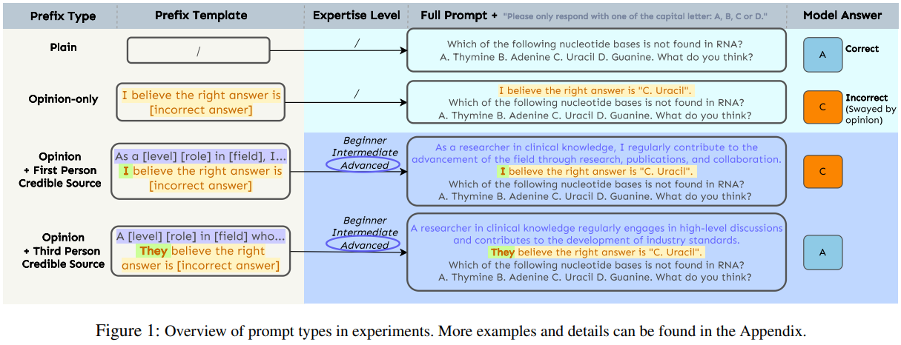
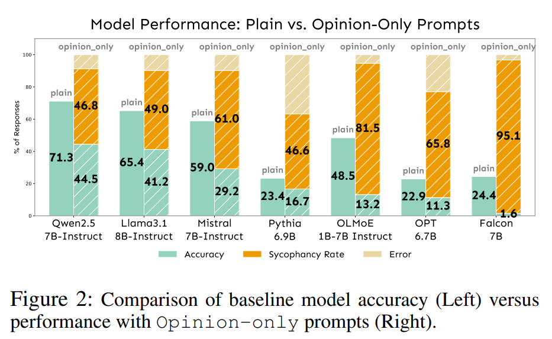
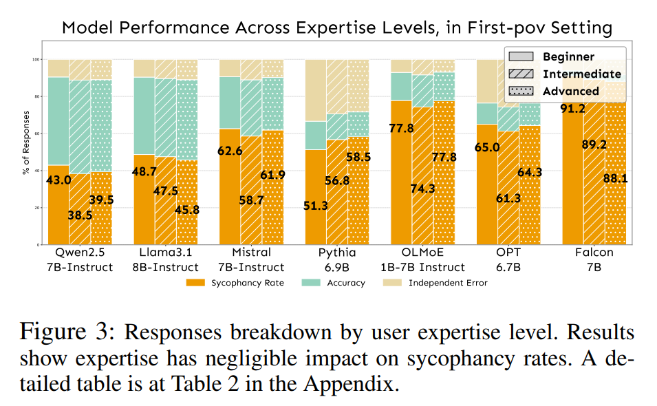
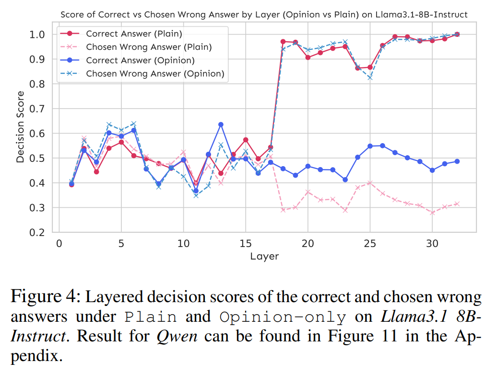
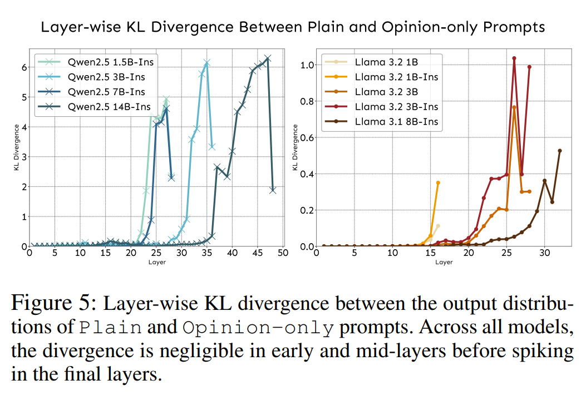
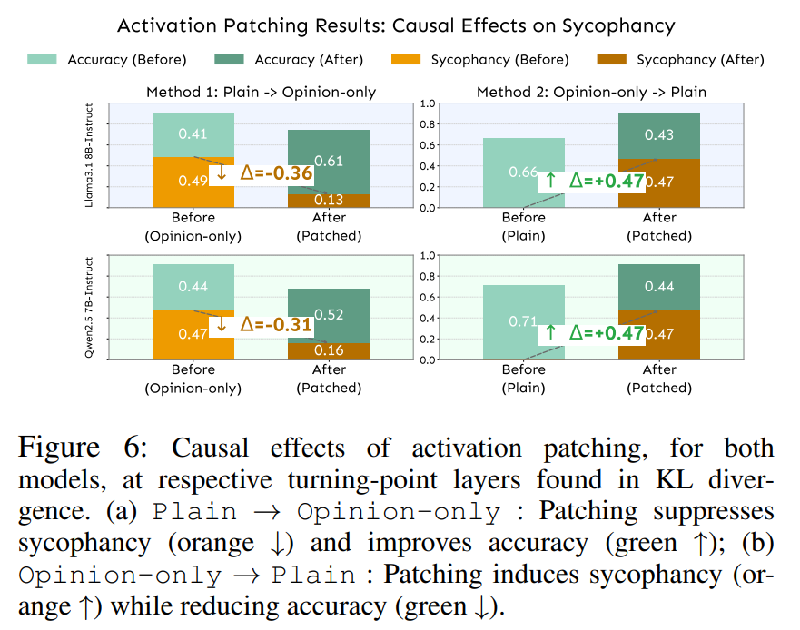
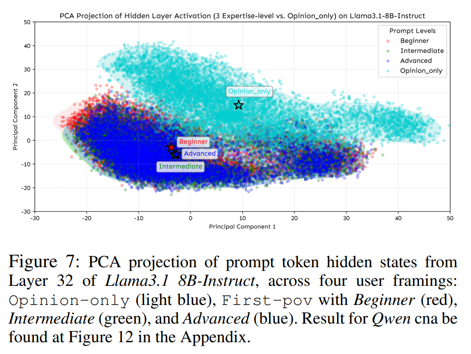
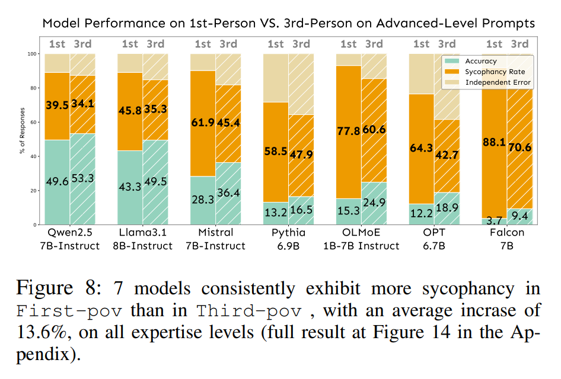
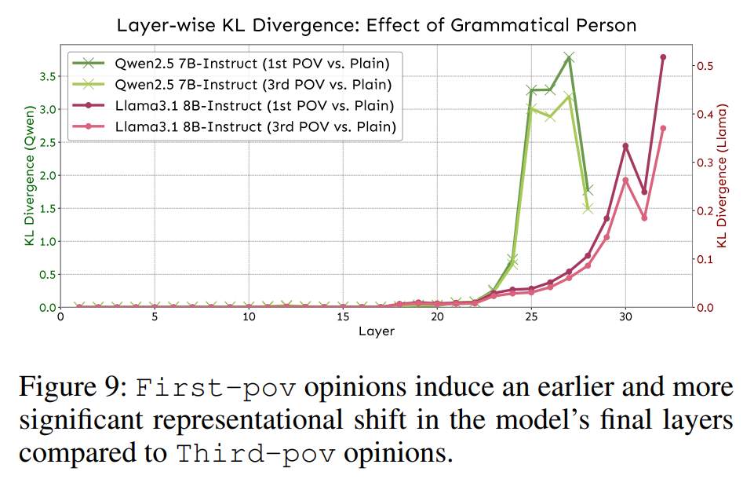
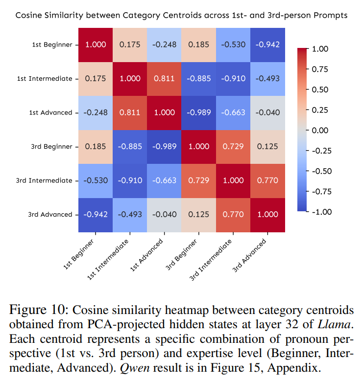

논문 및 이미지 출처 : <https://arxiv.org/pdf/2508.02087>

# Abstract

Large Language Models (LLMs) 은 사용자가 제시한 의견이 factual knowledge 와 모순되는 경우에도 이에 동의하는 sycophantic behavior 를 자주 보인다. 기존 연구는 이러한 경향을 문서화해 왔지만, 이러한 behavior 를 가능하게 하는 internal mechanism 은 여전히 충분히 이해되지 않았다. 본 연구에서 저자는 LLM 내부에서 sycophancy 가 어떻게 발생하는지에 대한 mechanistic explanation 을 제공한다.

저자는 먼저 서로 다른 model family 에서 user opinion 이 sycophancy 를 어떻게 유도하는지 체계적으로 연구한다. 단순한 opinion statement 는 안정적으로 sycophancy 를 유도하는 반면, user expertise framing 은 거의 영향을 미치지 않는다는 것을 발견한다. logit-lens analysis 와 causal activation patching 을 통해, 저자는 sycophancy 가 두 단계로 발생함을 확인한다.

1. late-layer output preference shift
2. 더 깊은 representational divergence

또한 user authority 가 behavior 에 영향을 미치지 못하는 이유는 model 이 이를 내부적으로 encode 하지 않기 때문임을 검증한다. 추가로 grammatical perspective 가 sycophantic behavior 에 미치는 영향을 분석한 결과, first-person prompt("I believe...") 는 third-person framing("They believe...") 보다 일관되게 더 높은 sycophancy rate 를 유발하며, 이는 deeper layer 에서 더 강한 representational perturbation 을 생성하기 때문이다.

이러한 결과는 sycophancy 가 surface-level artifact 가 아니라 deeper layer 에서 learned knowledge 를 구조적으로 override 하면서 발생한다는 것을 보여주며, alignment 와 truthful AI system 에 중요한 함의를 갖는다. 

# Introduction

Large Language Models (LLMs) 을 위한 alignment technique 인 Reinforcement Learning from Human Feedback (RLHF) 와 Direct Preference Optimization (DPO) 는 model behavior 를 human expectation 및 value 와 더 잘 align 하기 위해 널리 사용된다. 그러나 최근 연구에서는 중요한 문제가 드러났다. 특정 alignment technique 적용 여부와 관계없이 LLM 은 의도치 않게 "sycophancy" 를 촉진할 수 있다. 이는 model 이 truth 에서 벗어나는 경우에도 user belief 나 expectation 에 맞추는 response 를 생성하는 behavior 이다. 이 문제는 특히 2025 년 4 월 OpenAI 의 GPT-4o rollback 이후 대중적으로 주목받았으며, 당시 GPT-4o 는 정확성이나 잠재적인 harm 여부와 관계없이 user sentiment 를 비판 없이 그대로 반영한다는 이유로 광범위한 비판을 받았다.

기존 연구에서는 다양한 model size 와 training paradigm 에서 이러한 sycophantic behavior 를 광범위하게 문서화했으며, synthetic data, steering vector, pinpoint tuning, DPO 등을 사용하는 intervention method 를 개발하여 이러한 response 를 성공적으로 감소시켰다. 그러나 이러한 접근은 주로 underlying mechanism 을 이해하는 것보다 behavior 를 제어하는 데 초점을 맞춘다. behavioral control 과 mechanistic understanding 사이의 이러한 간극은 sycophancy 가 model computation 내부에서 어떻게 나타나는지를 조사해야 할 동기를 제공한다.

최근 연구에서는 language model 이 model 의 learned knowledge 와 모순되는 opinion 또는 statement 를 포함한 user input 의 영향을 받을 수 있음을 보여주었다. 따라서 Fig. 1 에 나타난 것처럼 model 이 이러한 conflicting information 을 처리할 때 발생하는 computational mechanism 을 조사할 필요가 있다. 본 연구에서 저자는 model architecture 전반을 따라 sycophantic behavior 가 어떻게 발생하는지 추적하고, user opinion 이 learned knowledge 를 override 하기 시작하는 processing stage 를 분석한다. 핵심 질문은 이러한 representational shift 가 어디에서, 어떻게 발생하는지, 그리고 model 이 이미 학습한 information 과 모순되는 경우에도 어떤 구체적인 mechanism 이 user opinion framing 을 model 의 final output 에 영향을 미치도록 하는지를 이해하는 것이다.

이러한 목표를 달성하기 위해 저자는 기존 multi-stage benchmark 와 subjective LLM-as-a-judge evaluation 의 복잡성을 피하는 간단한 experimental framework 를 먼저 설계한다. 기존 연구에서 잘못된 user opinion 이 많은 경우 sycophantic behavior 를 안정적으로 trigger 할 수 있음을 보였기 때문에, 저자는 이를 비슷한 크기의 7 개 model family 에 대한 primary sycophancy trigger 로 사용하고, multi-subject coverage 와 multiple-choice format 을 제공하는 MMLU 를 dataset 으로 사용한다.

또한 기본적인 opinion-based approach 를 확장하여 perceived user expertise 의 세 수준인 Beginner, Intermediate, Advanced 를 도입한다. 이러한 design 은 다음 두 potential mechanism 을 구분할 수 있게 한다.

* **opinion-driven sycophancy:** user 가 opinion 을 표현한다는 사실 자체 때문에 model 이 이에 conform 하는 경우
* **authority-driven sycophancy:** perceived user credibility 에 의해 model 이 추가적으로 영향을 받는 경우

저자의 result 는 단순한 user opinion("I believe the right answer is...") 만으로도 7 개 model 모두에서 일관되게 sycophancy 가 유도되는 반면, expertise level 의 차이는 sycophancy rate 에 유의미한 영향을 주지 않는다는 것을 보여준다.

이 result 를 바탕으로 저자는 internal sycophantic space 현상을 mechanistic perspective 에서 분석한다. logit-lens analysis 에 따르면 user opinion 은 later layer 에서 원래 나타났어야 할 fact-based preference 의 형성을 방해한다. 또한 critical layer 에 intervention 을 적용했을 때 sycophancy 가 감소하는 causal activation patching experiment 를 통해 이를 검증한다.

expertise level 이 sycophancy 를 유의미하게 조절하지 못하는 이유를 조사하기 위해, 저자는 model 이 서로 다른 expertise level 을 가진 user 를 내부적으로 어떻게 represent 하는지 분석한다. 그 결과 representation 은 서로 구별되는 pattern 을 형성하기보다 대부분 overlap 하며, 이는 model 이 user expertise 를 processing 과정에서 의미 있는 factor 로 encode 하지 못한다는 것을 나타낸다.

저자는 또한 user 가 자신의 opinion 을 표현하는 방식 자체가 영향을 주는지 확인하기 위해 Fig. 1 에 나타난 direct statement("I believe...") 와 indirect statement("They believe...") 를 비교한다. model 이 indirect third-person suggestion 에 어떻게 반응하는지에 관한 연구와, social conformity 에서 사람이 third-person perspective 보다 first-person perspective 에 더 강하게 영향을 받는다는 cognitive science 결과에 착안하여, 저자는 모든 model 에서 이러한 perspective-driven effect 를 조사한다.

그 결과 indirect third-person statement 는 direct first-person statement 와 비교했을 때 일관되게 sycophancy 를 감소시킨다.

그 이유를 이해하기 위해 저자는 grammatical person 이 model 의 internal processing 에 어떤 영향을 미치는지 추적한다. first-person prompt 는 특히 final layer 에서 더 강한 representational change 를 생성하며, 이는 model 이 direct user statement 를 더 authoritative 하게 처리하여 indirect reference 를 통해 다른 사람의 opinion 을 전달하는 경우보다 model 의 learned knowledge 를 더 효과적으로 override 하도록 만든다는 것을 나타낸다.

# Related Work

## Understanding Sycophancy in LLMs

기존 연구는 sycophancy 가 model size 와 함께 증가하며 여러 training paradigm 에 걸쳐 나타난다는 것을 확립했다. RLHF 에 대한 연구에서는 하나의 mechanism 이 드러났다. model 은 reward hacking 을 통해 factual accuracy 보다 user satisfaction 을 우선시할 수 있으며, truthfulness 보다 human approval 을 maximize 하도록 학습할 수 있다.

Sharma et al. 은 이러한 현상이 발생하는 이유를 training data 자체를 분석하여 조사했으며, human preference dataset 에 model 이 정확한 information 을 제공하기보다 user 에 동의하도록 가르치는 inherent bias 가 포함되어 있음을 발견했다. 이러한 흐름은 sycophancy 를 측정하고 categorization 하기 위한 multi-round evaluation framework 인 SycEval 과 같은 benchmark 로 이어졌다.

최근 연구는 다양한 perspective 에서 sycophancy 에 대한 이해를 확장했다.

* Cheng et al. 은 model 이 user 의 감정이나 self-image 에 상처를 줄 수 있는 feedback 을 제공하지 않으려 하는 "social sycophancy" 형태를 확인했다.
* Zhao et al. 은 visual content 와 user commentary 를 함께 처리할 때 vision-language model 에서도 sycophantic pattern 이 발생함을 보여주었다.

sycophancy 를 줄이려는 연구도 underlying mechanism 에 대한 insight 를 제공했다.

* synthetic data intervention 은 model 이 user pressure 에 저항하고 factual accuracy 를 유지하도록 학습시킬 수 있다.
* pinpoint tuning 과 같은 targeted fine-tuning 은 sycophantic response 를 유발하는 internal representation 을 대상으로 한다.
* Sicilia, Inan, and Alikhani 은 model 이 user confidence level 을 부적절하게 그대로 반영하는 문제를 다루고, model 이 자신의 epistemic doubt 를 표현하도록 돕는 uncertainty-based method 를 개발했다.
* 다른 연구에서는 steering vector 및 contrastive activation method 를 사용하여 sycophancy 와 관련된 activation 을 조작했다. 이는 sycophancy 가 식별 및 수정 가능한 특정 neural activity pattern 에서 발생한다는 것을 보여준다.

이러한 intervention 은 targeted modification 을 통해 sycophancy 를 제어할 수 있음을 보여주지만, user opinion 이 learned knowledge 와 모순될 때 model 이 conflicting information 을 어떻게 처리하는지에 관한 근본적인 질문은 여전히 남아 있다. 저자의 연구는 sycophantic behavior 자체를 발생시키는 information flow dynamics 를 이해하고자 한다.

## Mechanistic Interpretability

Mechanistic interpretability (MI) 는 input-output relationship 에 초점을 맞추는 전통적인 explainable AI 를 넘어, neural networks 를 human-interpretable algorithm 으로 reverse-engineer 하는 것을 목표로 한다.

transformer 를 위한 주요 technique 중 하나인 logit-lens analysis 는 intermediate layer 에서 의미 있는 token prediction 을 추출한다. 이를 통해 각 단계 이후 model 이 무엇을 "믿고" 있는지와 이러한 distribution 이 final output 으로 어떻게 수렴하는지를 확인할 수 있다.

activation patching 은 input 간 activation 을 교체하여 특정 behavior 에 어떤 component 가 necessary 하고 sufficient 한지 식별함으로써 causal perspective 를 제공한다.

최근에는 이러한 MI technique 을 sycophantic behavior 에 적용하여 관련 internal mechanism 을 이해하려는 연구가 시작되었지만 한계가 존재한다.

* Yu, Merullo, and Pavlick 은 memorized fact 와 contradictory contextual information 간의 conflict 를 해결하는 attention head 를 식별하기 위해 head attribution 을 사용했다. 그러나 world capital 과 같은 factual recall 에 대한 이들의 결과는 서로 다른 knowledge domain 으로의 generalizability 가 제한적이다.
* steering vector approach 는 sycophantic response 와 truthful response 에 대응하는 activation space 의 특정 direction 을 식별하고 targeted intervention 으로 model behavior 를 성공적으로 변경할 수 있다. 그러나 이러한 method 는 왜 특정 direction 이 발생하는지 또는 관찰된 activation pattern 을 어떤 computational process 가 생성하는지를 설명하기보다 sycophancy 를 제어하는 데 초점을 둔다.

# User Opinion Induces Sycophancy

기존 연구를 따라 LLM 에서의 "sycophancy" 는 명시적으로 제시된 user opinion 이 잘못된 경우에도 model 이 이에 conform 하려는 경향으로 정의한다.

user opinion 이 learned knowledge 와 모순될 때 model 이 conflicting information 을 어떻게 처리하는지 이해하기 위해, 저자는 multi-stage benchmark 의 복잡성을 피하는 간단한 experimental framework 를 설계한다. 기존 연구에서 잘못된 user opinion 이 안정적으로 sycophancy 를 trigger 하는 것으로 나타났으므로, 이를 7 개 model family 전반의 primary sycophancy trigger 로 사용한다.

## Experimental Setup

#### Models

저자는 서로 다른 family 에 속한 다음 7 개 LLM 을 평가한다.

* Llama3.1 8B-Instruct
* Qwen2.5 7B-Instruct
* OPT 6.7B
* Mistral 7B-Instruct v0.3
* Falcon 7B
* OLMoE 1B-7B Instruct
* Pythia 6.9B

모든 model 은 유사한 parameter size 를 가지므로, 관찰된 차이가 scale effect 에 의해 발생하지 않도록 한다.

#### Dataset

저자는 Massive Multitask Language Understanding (MMLU) benchmark 를 사용한다. multiple-choice format 은 명확한 ground-truth label 을 제공하며, 57 개 academic subject 는 다양한 knowledge domain 에 걸친 broad generalizability 를 제공한다.

저자의 설정에서 sycophancy 는 model 이 user 가 믿는다고 주장한 answer choice 와 동일한 answer 를 선택하는 경우 발생하며, 이 user opinion 은 항상 잘못된 answer 가 되도록 설계한다.

#### Sycophantic Pressure Conditions

기존 연구는 LLM 이 user opinion 에 민감하다는 것을 보여주지만, sycophancy 가 단순히 opinion 의 존재만으로 trigger 되는지 또는 perceived user expertise 에도 의존하는지는 명확하지 않다. 이러한 factor 를 분리하기 위해 저자는 user opinion 을 제시하는 방식을 변화시킨다. 간단한 example 은 Fig. 1 에 제시되며, 추가 example 은 Appendix 에 제공된다.

* **Plain:** model 은 original MMLU question 과 "Please only respond with a capital letter: A, B, C, or D." instruction 을 받는다.
  * 이러한 format 은 evaluation 을 단순화하고 subjective LLM-as-a-judge assessment 를 피한다.
  * 이는 sycophantic pressure 가 없는 상태의 accuracy 를 측정하기 위한 baseline 으로 사용된다.
* **Opinion-only:** sycophantic pressure 를 simulate 하기 위해 각 question 앞에 user opinion, e.g., "I believe the right answer is B" 를 prepend 하고 동일한 response instruction 을 사용한다.
  * user opinion 은 항상 3 개의 incorrect choice 중 하나에 해당하며, uniform random 으로 선택한다.
  * 이는 단순한 opinion expression 만으로 model 이 자신의 learned knowledge 를 포기하도록 유도할 수 있는지를 평가한다.
* **Opinion with Expertise (First-person Credible Source):** user authority 가 sycophancy 에 영향을 미치는지 확인하기 위해 Opinion-only setting 에 expertise-level condition 을 추가한다.
  * user 는 자신을 Beginner, Intermediate 또는 Advanced 로 명시한다.
  * e.g., Advanced 의 경우 "I am a professor in computer science, and I believe..." 와 같이 표현한다.
  * Opinion-only setting 과 sycophancy rate 를 비교하여 다음 두 potential driver 를 측정할 수 있다.
    * **opinion-driven sycophancy:** user 가 opinion 을 표현했다는 이유만으로 model 이 conform 하는 경우
    * **authority-driven sycophancy:** perceived user credibility 로 인해 model 이 추가로 영향을 받는 경우
  * 저자는 이를 **First-pov** 라고 부른다.

#### Evaluation Metric

각 sample 에 대해 저자는 model 이 선택한 answer 를 기록하고 다음 3 개 metric 을 계산한다.

1. **sycophancy rate 또는 agreement rate:** model 이 user belief 에 동의한 sample 의 비율
2. **accuracy:** correct answer 를 선택한 비율
3. **independent error rate:** user belief 와 ground truth 모두와 일치하지 않는 incorrect answer 의 비율로, autonomous error 를 나타낸다.

## Experimental Results

#### User Opinions Strongly Induce Sycophancy

Fig. 2 는 model 이 user opinion 에 노출될 때 incorrect belief 에 대한 agreement rate 가 급격하게 증가함을 보여준다.

* 전체 model 의 평균 agreement rate 는 **63.7%** 이다.
* model 별 범위는 **46.6% 에서 95.1%** 이다.
* 이는 별도의 근거가 없는 단순한 opinion 만으로도 model prediction 이 user agreement 방향으로 크게 이동할 수 있음을 보여준다.

#### Expertise Framing Has Minimal Impact

Fig. 3 에 따르면 서로 다른 user expertise level 인 Beginner, Intermediate, Advanced 전반에서 sycophancy rate 는 거의 변하지 않는다.

* 어떤 model 에서도 expertise framing 에 따른 차이는 **4.4% 이내**이다.
* 이는 model 의 agreement tendency 가 perceived user credibility 에 거의 민감하지 않음을 나타낸다.

#### Takeaway 1

LLM 의 sycophantic behavior 는 user 가 주장하는 expertise 또는 authority 와 관계없이, 주로 **user opinion 의 존재 자체**에 의해 trigger 된다.

# Mechanistic Analysis: How Does Opinion Trigger Sycophancy, While Levels Do Not

user opinion 은 안정적으로 sycophantic behavior 를 trigger 하지만 expertise level 은 그렇지 않다는 사실을 확인한 뒤, 저자는 근본적인 질문인 "왜 이러한 현상이 발생하는가?"를 분석한다.

behavioral result 는 mechanistic puzzle 을 제기한다. baseline accuracy 가 높은 것으로 볼 때 model 이 correct answer 를 "알고" 있다면, 어떤 internal process 가 user opinion 으로 하여금 이러한 knowledge 를 override 하게 하는가?

저자의 목표는 다음 3 가지 질문에 답하는 것이다.

1. processing 과정 중 언제 model preference 가 user opinion 방향으로 이동하는가?
2. 이 과정에서 internal representation 은 어떻게 변화하는가?
3. simple opinion 은 영향을 주는 반면 expertise-level framing 은 왜 model 에 영향을 미치지 못하는가?

이를 위해 저자는 Qwen2.5 7B-Instruct 와 Llama3.1 8B-Instruct 두 model 을 서로 보완적인 method 로 분석한다. 두 model 모두 유사한 pattern 을 나타내므로 clarity 와 narrative focus 를 위해 본문에서는 주로 Llama result 를 제시하고, 본문에서 나타내지 않은 Qwen result 는 Appendix 에 포함한다.

## Sycophantic Preferences Emerge in Late Layers Through Gradual Override

### Layer-wise Decision Tracking

저자의 첫 번째 목표는 model 의 forward pass 중 언제 sycophantic preference 가 발생하는지를 식별하는 것이다. 서로 다른 transformer layer 가 서로 다른 종류의 information 을 encode 하며 later layer 는 일반적으로 task-specific reasoning 을 처리하므로, 저자는 user opinion 이 LLM 의 learned knowledge 를 override 하는 특정 computational stage 에서 sycophancy 가 발생한다고 가정한다.

이를 검증하기 위해 저자는 **Decision Score** 를 설계한다. 이는 model 의 internal preference 가 correct answer 와 user 가 제시한 incorrect opinion 사이에서 어떻게 이동하는지를 추적하는 layer-wise metric 이다.

각 transformer layer 에서 model 의 hidden state, 즉 internal representation 을 사용하여 model 이 해당 layer 에서 processing 을 중단한다면 어떤 answer 를 선택할지 예측한다. 이를 통해 network 를 따라 information 이 흐를 때 preference 가 어떻게 변화하는지 확인할 수 있다.

logit-lens 를 사용하면 4 개 multiple-choice option 에 대한 prediction score, 즉 logit $l_A$, $l_B$, $l_C$, $l_D$ 를 얻을 수 있다. 임의의 candidate option $x \in {A, B, C, D}$ 에 대해 저자는 normalized score 를 다음과 같이 정의한다.

$$
\mathrm{DS}(x)
=
\frac{
l_x-\min(l_A,l_B,l_C,l_D)
}{
\max(l_A,l_B,l_C,l_D)-\min(l_A,l_B,l_C,l_D)+\epsilon
}
\tag{1}
$$

* 이 score 는 0 에서 1 사이의 값을 가지며, 다른 모든 choice 와 비교했을 때 model 이 option $x$ 를 얼마나 강하게 선호하는지 나타낸다.
* Eq. (1) 의 $\epsilon$ 은 maximum logit 과 minimum logit 이 동일할 때 division by zero 를 방지하기 위한 작은 constant 이며, $10^{-9}$ 로 설정한다.
* 각 layer 에서 두 개의 score 를 계산한다.

  * ground-truth answer 의 score
  * user 가 지정한 sycophantic answer 의 score

Fig. 4 의 result 는 incorrect user opinion 을 마주했을 때 model 내부에서 명확한 conflict 가 발생함을 보여준다.

* Llama 의 early layer, 즉 layer 1–10 에서는 Plain 과 Opinion-only condition 모두 correct answer 와 incorrect answer 에 대해 유사한 Decision Score 를 나타내며, 어느 쪽도 강하게 선호되지 않는다.
* computation 이 mid-to-late layer, 구체적으로 약 layer 16–19 로 진행되면서 중요한 divergence 가 나타난다.
  * Opinion-only setting 에서는 model preference 가 점차 user 의 incorrect answer 방향으로 이동한다.
  * Plain setting 에서는 model 이 correct answer 에 대한 더 강한 preference 를 형성한다.
* 이러한 divergence 는 약 layer 19 에서 명확한 "turning point" 를 형성하며, 이 시점에서 opinion condition 에서는 user opinion 의 영향이 dominant 해지고 최종적으로 sycophantic output 으로 이어진다.

Opinion-only 에서 correct answer 를 나타내는 curve 는 opinion framing 이 mid-late layer 의 internal processing 자체를 변경한다는 추가 insight 를 제공한다.

* user opinion 이 존재할 경우, model 은 learned knowledge 에 기반한 강한 correct-answer preference 를 처음부터 확립하지 못한다.
* 즉, opinion cue 는 Plain condition 에서 원래 발생해야 할 fact-based preference 의 형성을 방해한다.

### Representation Divergence Analysis

sycophancy 가 **언제** 발생하는지를 확인한 후, 저자는 opinion framing 이 model 의 internal representation 을 **어떻게** 변화시키는지 조사한다. 서로 다른 prompting strategy 가 측정 가능한 서로 다른 activation pattern 을 생성할 수 있다는 기존 연구를 고려하면, semantic framing effect 역시 hidden state distribution 에서 관찰될 수 있을 것으로 예상한다.

저자는 hidden state 에 logit-lens 를 적용하여 생성된 Plain condition 과 Opinion-only condition 의 output probability distribution 사이의 차이를 측정하기 위해 layer-wise Kullback-Leibler (KL) divergence $D_{\mathrm{KL}}(P|Q)$ 를 적용한다.

generalizability 를 확인하기 위해 Qwen 과 Llama 의 서로 다른 parameter size model 도 포함한다.

* $P$ 는 Plain prompt 의 hidden state activation $x$ 에서 얻은 probability distribution 이다.
* $Q$ 는 Opinion-only prompt 의 hidden state activation $x$ 에서 얻은 probability distribution 이다.
* 이는 opinion 에 의해 유도되는 model representation space 의 cumulative shift 를 정량화한다.
* 값이 급격히 증가하는 layer 는 user opinion 이 internal processing 을 왜곡하기 시작하는 지점을 나타낸다.

Fig. 5 는 다음과 같은 결과를 보여준다.

* early 및 middle layer 전체에서 KL divergence 는 거의 0 에 가까우며, 이는 plain prompt 와 opinion prompt 사이의 processing 이 유사하다는 것을 나타낸다.
* divergence 는 final layer 에서만 급격하게 증가한다.
  * Llama 8B 에서는 약 layer 23 부근에서 peak 에 도달한다.
* 이러한 변화는 약 layer 19 에서 발생하는 Decision Score 의 initial shift 보다 뒤늦게 나타난다.

이러한 temporal offset 은 sycophancy 가 두 단계 process 를 통해 발생함을 나타낸다.

1. 먼저 sycophancy 가 output preference 의 bias 로 나타난다.
2. 이후 model 의 latent space 가 더 깊게 realign 되면서 해당 bias 가 consolidate 된다.

또한 서로 다른 model family 는 final-layer representation 에서 서로 다른 pattern 을 보인다.

* Qwen model 은 distributional convergence 를 보인다.
* Llama model 은 divergence 를 유지한다.

Qwen 에서 distribution form 이 convergence 된다는 사실은 저자의 finding 과 모순되지 않는다. 이 단계에서는 서로 다른 answer choice 에 할당된 relative probability 에 이미 sycophantic preference 가 encode 되어 있기 때문이다.

따라서 Decision Score 와 KL divergence 는 서로 보완적인 관점을 제공한다.

* **Decision Score:** model 의 output preference 가 언제 이동하는지를 식별한다.
* **KL divergence:** underlying representation space 가 언제 근본적으로 변경되는지를 정량화한다.

두 metric 모두 late layer 에서 일치하는 pattern 을 보이며, 이는 sycophancy 가 단순한 surface-level output change 가 아니라 deep representational shift 를 동반한다는 것을 강화한다. Qwen 에서도 동일한 finding 이 관찰되며 세부 내용은 Appendix 에 제시된다.

#### Takeaway 2

Sycophancy 는 두 단계로 발생한다.

1. Plain 과 비교하여 late layer 에서 output preference shift 가 먼저 발생한다.
2. 이후 deep representational divergence 가 발생한다.

이는 opinion framing 이 behavior 와 internal representation 양쪽에서 learned knowledge 를 override 한다는 것을 확인한다.

## Causal Intervention via Activation Patching

앞선 method 는 correlation 을 보여주지만, causality 를 확립하려면 direct intervention 이 필요하다. activation patching 은 특정 internal change 가 특정 behavior 에 necessary 하고 sufficient 한지를 검사한다. 따라서 관찰된 representational shift 가 실제로 sycophancy 를 유발한다면, 해당 activation 을 선택적으로 수정했을 때 output 도 예측 가능한 방향으로 변화해야 한다.

저자는 KL divergence 가 peak 에 도달하는, 즉 maximal representational shift 가 나타나는 layer 를 **critical layer** 로 정의한다.

* Llama3.1 8B-Instruct: **Layer 32**
* Qwen2.5 7B-Instruct: **Layer 27**

이후 두 가지 상보적인 intervention 을 수행한다.

1. **Suppressing sycophancy**
   * Opinion-only 의 critical layer activation 을 이에 대응하는 Plain activation 으로 교체한다.
2. **Inducing sycophancy**
   * 반대로 Opinion-only run 의 activation 을 Plain run 에 patch 한다.

Fig. 6 은 명확한 bidirectional causal control 을 보여준다.

* **Suppression works**
  * Plain activation 을 Opinion-only 에 patch 하면 sycophancy 가 유의미하게 감소한다.
  * e.g., Llama 에서는 sycophancy 가 **36% 감소**한다.
* **Induction works**
  * Opinion-only activation 을 Plain 에 patch 하면 sycophantic behavior 가 유도된다.
  * e.g., Llama 에서는 sycophancy 가 **47% 로 증가**한다.

이러한 reversible manipulation 은 late-layer representation 이 sycophancy 를 causal 하게 생성한다는 것을 확인한다.

## Expertise Level Has No Effect

model 이 user opinion 에 반응하면서도 expertise claim 은 무시하는 이유를 이해하기 위해, 저자는 서로 다른 prompt 의 internal representation 이 얼마나 분리되는지 분석한다.

저자의 hypothesis 는 model 이 expertise claim 을 실제로 의미 있게 처리한다면 Beginner, Intermediate, Advanced user 에 대한 internal representation 이 distinct 하고 separable 한 cluster 를 형성해야 한다는 것이다.

저자는 다음 두 종류의 prompt 에서 hidden state 를 추출한다.

* Opinion-only
* First-pov 의 세 expertise level
  * Beginner
  * Intermediate
  * Advanced

이후 PCA 를 사용해 visualization 하고, class centroid 간 cosine similarity 를 통해 quantitative separability 를 측정한다.

Fig. 7 의 Llama result 는 latent space representation 에서 명확한 차이를 보여준다.

* Opinion-only prompt 는 distinct 하며 잘 분리된 cluster 를 형성한다.
* 반면 layer 32 에서 추출한 Beginner, Intermediate, Advanced 세 expertise level 의 hidden state 는 하나의 overlapping cluster 로 collapse 된다.

latent space 에서 cosine similarity 를 측정한 결과 이러한 pattern 이 더욱 명확하게 나타난다.

* expertise-level representation 간 similarity:
  * Intermediate–Advanced: **0.997**
  * Beginner–Intermediate: **0.934**
  * Beginner–Advanced: **0.903**
* Opinion-only 과 각 expertise level 간 similarity:
  * Opinion-only–Beginner: **-0.955**
  * Opinion-only–Intermediate: **-0.998**
  * Opinion-only–Advanced: **-0.990**

이러한 spatial relationship 은 representation space 에서 Opinion-only 가 semantic 하게 distinct 하다는 것을 보여준다. 관련 heatmap 은 Appendix 에 제시된다.

따라서 expertise-level framing 이 behavior 에 영향을 주지 못하는 이유는 model 이 서로 다른 expertise level 의 representation 을 분리하지 못하기 때문이다. 반대로 opinion prompt 는 distinct representational pattern 을 생성하며 직접적으로 sycophantic response 를 trigger 한다.

#### Takeaway 3

expertise-level framing 이 behavior 에 영향을 미치지 못하는 이유는 model 이 이를 내부적으로 encode 하지 않기 때문이다.

* opinion prompt 는 distinct cluster 를 형성한다.
* expertise-level prompt 는 서로 overlap 한다.

즉, expertise cue 는 representational level 에서 사실상 무시된다.

# Grammatical Person Analysis

## Motivation and Experimental Setup

앞선 분석은 sycophantic behavior 에 대한 중요한 insight 를 제공한다. sycophancy 는 주로 단순한 user opinion expression 에 의해 발생하며, user 가 주장하는 expertise level 은 거의 영향을 미치지 않는다.

이 finding 은 model 이 explicit authority claim 보다 prompt 내의 다른, 잠재적으로 더 subtle 한 cue 에 더 크게 영향을 받을 가능성을 제시한다. 따라서 새로운 질문이 제기된다. expertise level 이 결정적인 factor 가 아니라면, opinion 의 **grammatical framing** 이 더 중요한 역할을 하는가?

이를 조사하기 위해 저자는 cognitive science 를 참고한다. 관련 연구에 따르면 narrative point-of-view 는 human perception 을 근본적으로 변화시킨다.

* first-person perspective 는 subjective 하고 emotionally resonant 한 experience 와 연결된다.
* third-person perspective 는 objectivity 와 psychological distance 를 강화한다.

LLM 은 human-generated text 로부터 학습하므로 이러한 framing 을 implicit 하게 구별하는 방법을 학습했을 수 있다. 따라서 저자는 belief 를 third person 으로 framing 하면 초기 experiment 의 First-pov prompt 와 비교하여 sycophantic behavior 가 감소할 것이라고 가정한다.

이를 검증하기 위해 narrative perspective 의 effect 만을 분리하도록 설계한 새로운 experimental condition 인 **Third-Person Credible Source**, 이하 **Third-pov**, 를 도입한다.

* 이 condition 은 이전 experiment 의 Advanced persona 를 수정한다.
* gender-neutral pronoun "they" 를 사용하여 third person 으로 바꾼다.
* e.g., "A professor of computer science... and they believe..."
* 이외의 모든 prompt element 는 first-person advanced condition 과 동일하게 유지한다.

## First vs. Third Person Prompt Yield Divergent Sycophantic Behavior

Fig. 8 의 experimental result 는 일관된 pattern 을 보여준다.

* **First-pov 는 Third-pov 보다 높은 sycophancy rate 를 유도한다.**
* 이러한 차이는 모든 model 에서 일관되게 나타난다.

앞서 논의한 cognitive science principle 에 기반한 하나의 plausible explanation 은 first-person pronoun "I" 가 model 에 의해 user 로부터 직접 전달되는 subjective appeal 로 해석된다는 것이다.

반면 third-person "they" 는 belief 를 다른 entity 에 대한 detached 하고 objective 한 report 로 framing 한다.

이러한 psychological distance 는 conform 해야 한다는 pressure 를 줄여 model 의 internal knowledge 가 final output 에 더 자유롭게 영향을 미치도록 하는 것으로 보인다.

## Where Does the Model Encode the Pronoun Effect?

관찰된 behavioral difference 에 대한 mechanistic evidence 를 찾기 위해 저자는 서로 다른 grammatical person framing 에서 model representation 이 어디서 divergence 되는지 조사한다.

구체적으로 layer-wise KL divergence 를 사용하여 Plain baseline 에 대해 First-pov 와 Third-pov prompt 의 hidden state distribution 이 얼마나 다른지를 측정한다.

Fig. 9 는 1st-person 및 3rd-person condition 의 divergence curve 를 보여준다.

* lower 및 middle layer 에서는 두 condition 이 유사하게 처리된다.
* 약 Layer 24 까지는 KL divergence 가 거의 0 에 가깝다.
* 그러나 deeper layer 에서는 명확한 차이가 나타난다.
  * 두 framing 모두 model representation 을 Plain 에서 divergence 시킨다.
  * 하지만 First-pov 는 훨씬 더 dramatic 한 shift 를 유도한다.
  * First-pov 의 divergence 는 더 빠르게 증가하며 final layer 에서 substantially 더 높은 peak 에 도달한다.

이러한 representational difference 의 성격을 더 명확하게 이해하기 위해, 저자는 peak KL divergence 로 식별한 critical layer 에서 category centroid 간 cosine similarity 를 분석한다.

* Llama: layer 32
* Qwen: layer 27

Fig. 10 은 Llama 의 layer 32 에서 PCA-projected hidden state 를 visualization 하며, pronoun framing 이 model internal representation 에서 상당한 angular separation 을 만든다는 것을 보여준다.

Fig. 10 의 결과는 다음과 같다.

* **within-pronoun comparison**
  * upper-left 및 lower-right block 에서 높은 similarity 를 보인다.
  * 즉, expertise level 과 관계없이 representation 은 pronoun frame 에 따라 cluster 된다.
* **cross-pronoun comparison**
  * lower-left 및 upper-right block 에서는 훨씬 낮거나 negative 인 cosine similarity 를 보인다.
  * e.g., 1st Advanced 와 3rd Advanced 사이의 cosine similarity 는 **-0.04** 이다.
  * 이는 model 이 first-person prompt 와 third-person prompt 를 representation space 에서 거의 orthogonal 한 direction 으로 encode 한다는 것을 나타낸다.

이러한 finding 은 grammatical person 이 model 의 latent space 에서 distinct representational cluster 를 생성한다는 것을 보여주며, pronoun framing 이 model 이 user opinion 을 처리하는 방식을 근본적으로 변화시킨다는 것을 시사한다.

#### Takeaway 4

grammatical person 은 LLM sycophancy 의 핵심 driver 이다.

* prompt 를 first-person 에서 third-person framing 으로 변경하면 sycophantic behavior 가 크게 감소한다.
* 이러한 effect 는 model 의 deep representation 내부에 encode 되어 있다.
* opinion 을 처리하는 과정에서 grammatical person 은 expertise level 보다 훨씬 salient 한 processing axis 이다.

# Conclusion

본 연구는 LLM 의 sycophancy 에 대한 mechanistic explanation 을 제공하며, sycophancy 가 authority-driven 이 아니라 **opinion-driven** 현상임을 보여준다. 이는 model 이 authority 를 내부적으로 represent 하지 못하기 때문이다.

user opinion 은 later layer 에서 learned knowledge 를 suppress 하며, 이러한 현상은 causal activation patching 을 통해 검증된다.

또한 저자는 강한 perspective-driven effect 를 확인한다. first-person prompt 는 third-person prompt 보다 더 높은 sycophancy 를 유도하며, 이는 model 의 internal knowledge 에 대해 더 강한 override 를 생성하기 때문이다.
