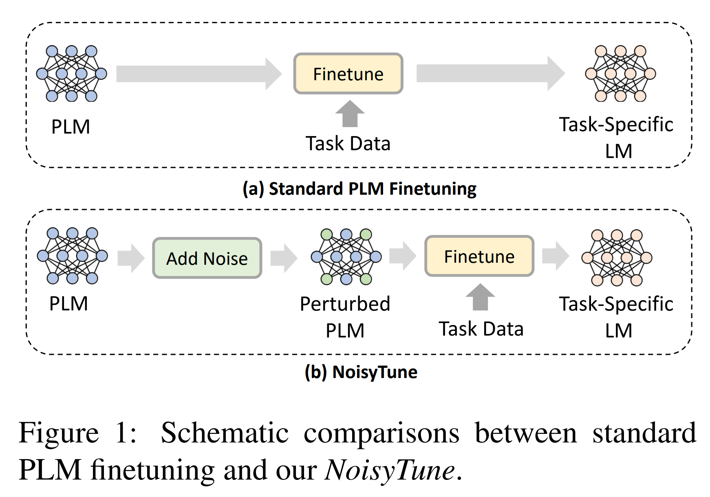

논문 및 이미지 출처 : <https://arxiv.org/pdf/2202.12024>

# Abstract

Pretrained language models (PLMs) 의 효과적인 finetuning 은 downstream task 의 성공에 매우 중요하다. 그러나 PLM 은 pretraining task 와 data 에 overfitting 될 위험이 있으며, 이는 보통 target downstream task 와 간극을 가진다. 이러한 간극은 기존의 PLM finetuning 방법으로는 극복하기 어렵고 최적 이하의 성능으로 이어질 수 있다. 

본 논문에서는 PLM 을 downstream task 에 더 잘 finetuning 할 수 있도록 finetuning 전에 PLM 의 parameter 에 노이즈를 추가하는 간단하지만 효과적인 방법인 ***NoisyTune*** 을 제안한다. 

* 구체적으로, 저자는 matrix-wise perturbation 방법을 제안하며, 이는 parameter matrix 별 표준편차에 기반해 서로 다른 uniform noise 를 추가한다. 
* 이를 통해 PLM 내 다양한 유형의 parameter 가 가지는 상이한 특성을 고려할 수 있다. 

GLUE English benchmark 와 XTREME multilingual benchmark 모두에서 광범위한 실험을 수행한 결과, *NoisyTune* 은 다양한 PLM 과 downstream task 에서 일관되게 finetuning 성능을 향상시킬 수 있음을 보여준다.

# 1 Introduction

최근 몇 년 동안 pretrained language models (PLMs) 은 NLP 에서 큰 성공을 거두었다. BERT, RoBERTa, UniLM 과 같은 많은 PLM 은 large-scale unlabeled corpus 로부터 self-supervised 방식으로 pretraining 되어, reading comprehension, machine translation, text classification, dialog, recommendation 과 같은 다양한 downstream task 에서 finetuning 을 통해 성능을 크게 향상시켰다.

PLM 을 효과적으로 finetuning 하여 downstream task 를 더 잘 지원하는 것은 중요한 연구 문제이다. 기존의 많은 NLP 방법들은 일반적으로 downstream task 의 labeled data 로 PLM 을 직접 finetuning 한다. 소수의 연구만이 더 효과적이고 robust PLM finetuning 방법을 탐구하였다. 

* 예를 들어, Chen et al 은 RecAdam 을 제안하였는데, 이는 finetuned model 과 pretrained model 간의 L2 distance 를 최소화하는 penalty term 을 추가하며, penalty 강도는 finetuning 동안 시간에 따라 변한다. 
* Lee et al 은 Mixout 을 제안하였는데, 이는 finetuned model 의 일부 parameter 를 PLM 의 original weight 로 무작위 교체하는 방법이다. 
* 이러한 PLM finetuning 방법들은 주로 downstream task 의 제한된 labeled data 에 대한 overfitting 을 방지하는 데 초점을 맞추었다.

그러나 downstream task data 의 overfitting 외에도 거의 연구되지 않은 또 다른 문제는, PLM 이 보통 pretraining task 와 data 에 overfitting 된다는 점이다. 이는 downstream task 및 data 와 큰 간극을 가질 수 있으며, 기존의 PLM finetuning 방법으로는 이러한 간극을 극복하기 어렵다. 이는 특히 downstream task 의 labeled data 가 부족할 때 최적 이하의 성능으로 이어질 수 있다.



이 문제를 다루기 위해, 본 논문에서는 downstream task 에 대해 PLM 을 더 잘 finetuning 할 수 있도록 돕는 간단하면서도 효과적인 방법인 ***NoisyTune*** 을 제안한다. 

* 기존의 finetuning 패러다임 (Fig. 1 (a)) 은 downstream task data 에 대해 PLM 을 직접 finetuning 하는 반면, *NoisyTune* 의 핵심 아이디어는 finetuning 전에 PLM 의 parameter 를 작은 양의 noise 로 perturbation 하는 것이다 (Fig. 1 (b)). 
  * 이는 PLM 이 pretraining 단계의 task 와 data 에 overfitting 되는 것을 방지하고, pretraining 과 downstream task 사이의 간극을 줄이는 데 도움이 된다.
* 또한 PLM 은 다양한 특성을 가진 여러 유형의 parameter 를 포함하고 있으므로, *NoisyTune* 에서는 각 parameter matrix 의 표준편차에 따라 서로 다른 강도의 uniform noise 를 추가하는 matrix-wise perturbation 방법을 사용하여 더 나은 적응을 도모한다. 

저자는 영어 언어 이해를 위한 GLUE benchmark 와 다국어 언어 이해를 위한 XTREME benchmark 라는 두 가지 널리 사용되는 NLP benchmark 에 대해 광범위한 실험을 수행하였다. 그 결과, *NoisyTune* 은 다양한 PLM 과 여러 downstream NLP task 의 finetuning 을 일관되게 강화하여 더 나은 성능을 달성할 수 있음을 보였다.

추가적으로, 결과는 *NoisyTune* 이 기존의 다양한 PLM finetuning 방법과 쉽게 결합할 수 있으며, 이들의 성능을 더욱 향상시킬 수 있음을 보여준다.

# 2 *NoisyTune*

*NoisyTune* 의 목표는 PLM 을 downstream task 에 대해 더 효과적으로 finetuning 하는 것이다. *NoisyTune* 의 동기는 PLM 이 일부 unlabeled corpus 에 대해 self-supervision task 로 pretraining 되어 있으며, 이러한 pretraining data 와 task 에 overfitting 될 수 있다는 점에 있다. 이는 보통 downstream task 와 data 와 간극을 가지며, 특히 downstream task 의 labeled data 가 제한적인 경우 PLM 이 효과적으로 downstream task 에 적응하기 어렵게 만든다.

이 문제에서 착안하여, dueling bandits mechanism 이 exploration 을 위해 model 에 randomness 를 추가하는 것처럼, 저자는 downstream task 에 대해 finetuning 하기 전에 PLM 의 parameter 에 일부 noise 를 추가하여 parameter space 에서 일종의 "exploration" 을 수행하고 pretraining task 와 data 에 대한 overfitting risk 를 줄이는 방법을 제안한다 (Fig. 1).

PLM 은 보통 query, key, value, feed-forward network matrix 와 같은 다양한 종류의 parameter matrix 를 가진다. PLM 의 서로 다른 parameter matrix 는 일반적으로 서로 다른 특성과 scale 을 가진다. 예를 들어, 일부 연구에서는 Transformer 에서 self-attention parameter 와 feed-forward network parameter 가 rank 와 density 와 같은 매우 다른 속성을 가진다는 것을 발견하였다. 따라서 PLM 의 모든 parameter matrix 에 동일한 noise 를 추가하는 것은 model utility 를 유지하는 데 최적이 아닐 수 있다.

이 문제를 해결하기 위해, 저자는 각 parameter matrix 의 variance 에 따라 서로 다른 강도의 noise 를 추가하는 matrix-wise perturbation 방법을 제안한다. PLM 내의 parameter matrix (or scalar/vector) 를 $[W_1, W_2, ..., W_N]$ 이라 하자. 여기서 $N$ 은 parameter matrix 의 개수이다. Parameter matrix $W_i$ 의 perturbation 버전 $\tilde{W}_i$ 는 다음과 같이 계산된다.

$$
\tilde{W}_i = W_i + U\left(-\frac{\lambda}{2}, \frac{\lambda}{2}\right) \ast \text{std}(W_i), \tag{1}
$$

* 여기서 std 는 standard deviation 을 의미한다. 
* function $U(a, b)$ 는 구간 $[a, b]$ 에서 uniform distribution noise 를 나타내며, 
* $\lambda$ 는 relative noise intensity 를 제어하는 hyperparameter 이다. 
* 따라서 *NoisyTune* 은 variance 가 큰 parameter 일수록 stronger noise 가 추가된다.

또한 일부 PLM 에는 RoBERTa 의 token type embedding 과 같이 constant matrix 가 존재한다. 이들은 standard deviation 이 0 이므로 perturbation 되지 않으며, 이를 통해 이러한 constant matrix 가 noise 로 인해 우발적으로 활성화되는 것을 방지할 수 있다.

*NoisyTune* 은 간단하고 범용적인 plug-and-play 기법으로, 어떤 PLM 의 어떤 task finetuning 에도 적용될 수 있다. 단순히 finetuning 전에 다음과 같은 PyTorch-style 코드를 삽입하면 된다.

```python
for name, para in model.named_parameters():
    model.state_dict()[name][:] += \
        (torch.rand(para.size()) - 0.5) \
        * noise_lambda * torch.std(para)
```

# 3 Experiments

## 3.1 Datasets and Experimental Settings

저자는 PLM 평가를 위해 널리 사용되는 두 개의 benchmark 에 대해 광범위한 실험을 수행하였다. 

* 첫 번째는 GLUE 로, 이는 English language understanding benchmark 이며, natural language inference, sentiment analysis, sentence similarity evaluation 과 같은 다양한 task 를 포함한다. 
* 두 번째는 XTREME 으로, multilingual language understanding benchmark 이다. 이는 40 개 언어를 다루며 sentence classification, structured prediction, sentence retrieval, question answering 의 네 가지 task 그룹을 포함한다.

이 benchmark 들에 대한 세부 사항은 원 논문과 공식 웹사이트를 참조할 수 있다. GLUE 의 test label 은 공개되지 않았으므로, 저자는 기존 연구를 따라 GLUE 의 dev set 결과를 보고하였다. XTREME 의 경우 test set 에 대해 평가하였다. Hyperparameter $\lambda$ 는 GLUE 에서는 0.15, XTREME 에서는 0.1 로 설정하였다. Hyperparameter 탐색 범위는 Tab. 1 에 제시된다.


Sentence retrieval task 의 경우, 기존 연구를 따라 XNLI dataset 에서 model 을 먼저 학습시키고, 가장 좋은 성능을 보이는 hidden layer 가 생성한 token representation 의 평균을 사용하였다. 서로 다른 언어 간 token embedding alignment 를 해치지 않기 위해, multilingual PLM 의 token embedding 에는 noise 를 추가하지 않았다. 실험은 서로 다른 random seed 로 5 회 반복하였으며 평균 점수를 보고하였다.

## 3.2 Performance Evaluation

GLUE benchmark 에서는 BERT, XLNET, RoBERTa, ELECTRA 의 base version 을 직접 finetuning 한 결과와, *NoisyTune* 을 적용한 후 finetuning 한 결과를 비교하였다. XTREME benchmark 에서는 XLM-R 의 base 및 large version 을 직접 finetuning 한 결과와, *NoisyTune* 을 적용한 변형된 결과를 비교하였다. 두 benchmark 의 결과는 각각 Tab. 2 와 Tab. 3 에 제시된다. XTREME dataset 에 대해서는 두 가지 유형의 결과를 보고하였다. 첫 번째는 English 에서 다른 언어로의 zero-shot cross-lingual transfer 이며, 두 번째는 English 와 번역된 data 모두에서 학습된 model 결과이다.


* 이 결과에 따르면, *NoisyTune* 은 English 및 multilingual setting 모두에서 다양한 PLM 의 성능을 일관되게 향상시킬 수 있었다. 
* 또한 *NoisyTune* 에 의한 성능 향상은 상대적으로 작은 dataset (e.g., RTE, CoLA, WNLI) 에서 더 크게 나타났다. 
  * 이는 downstream task 의 labeled data 가 부족할 때, 보통 pretraining task 와 data 에 overfitting 된 original parameter 로부터 효과적으로 PLM 을 finetuning 하기 어렵다는 것을 보여준다.
* 실험 결과는 *NoisyTune* 이 PLM 에 소량의 noise 를 적절히 추가하여 서로 다른 parameter space 를 탐색하고 overfitting 문제를 줄임으로써, PLM 이 downstream task 에 더 쉽게 적응할 수 있도록 한다는 것을 검증하였다.

## 3.3 Which Noise to Use and How?

이 절에서는 *NoisyTune* 에 어떤 종류의 noise 가 더 적합한지 연구한다. 또한, 저자가 제안한 matrix-wise perturbation 방법이 PLM 의 모든 parameter 에 대해 동일한 global noise 를 사용하는 것보다 더 좋은지 탐구한다. 저자는 다섯 가지 방법을 비교하였다.

1. noise 를 사용하지 않는 *NoisyTune*
2. global Gaussian noise 를 사용하는 *NoisyTune*
3. global uniform noise 를 사용하는 *NoisyTune*
4. matrix-wise Gaussian noise 를 사용하는 *NoisyTune*
5. matrix-wise uniform noise 를 사용하는 *NoisyTune*

GLUE 의 결과는 Fig. 2 에 제시되어 있으며, XTREME 의 결과도 유사한 패턴을 보인다. 분석 결과, 모든 PLM parameter 에 동일한 분포의 global noise 를 추가하면 model 성능이 저하됨을 확인하였다. 이는 PLM 내 서로 다른 parameter matrix 가 매우 다른 분포와 특성을 가지기 때문이다. 단순히 모든 parameter matrix 에 동일한 global noise 를 추가하는 것은 최적이 아니다.


* 실험 결과, matrix-wise noise 가 훨씬 더 나은 선택임을 보여주었으며, 이는 서로 다른 parameter matrix 의 특성을 고려할 수 있기 때문이다. 
* 또한 uniform noise 가 Gaussian noise 보다 더 효과적임을 발견하였다. 이는 Gaussian noise 가 더 넓은 범위를 가지며, 일부 extreme value 가 model 성능에 영향을 미칠 수 있기 때문일 수 있다. 따라서 *NoisyTune* 에서는 matrix-wise uniform noise 를 사용한다.

## 3.4 Combination with Existing PLM Finetuning Methods

Fig. 1 에서 볼 수 있듯이, *NoisyTune* 은 특정 PLM finetuning 방법과 무관하다. 이는 downstream task-specific data 에 대해 finetuning 하기 전에 적용되므로, 기존의 어떤 PLM finetuning 방법과도 쉽게 결합될 수 있다.

이 절에서는 *NoisyTune* 이 기존의 PLM finetuning 기법을 보완하여 더 나은 성능을 달성할 수 있는지를 탐구한다. 여기서 저자는 두 가지 잘 알려진 PLM finetuning 기법을 선택하여 실험하였다: RecAdam 과 Mixout.


실험 결과는 Fig. 3 에 요약되어 있다. 

* *NoisyTune* 과 기존 PLM finetuning 기법을 결합하면 성능이 더욱 향상됨을 확인하였다. 
  * 이는 *NoisyTune* 은 pretraining signal 의 overfitting 을 다루는 데 목적이 있으며, 
* 반면 기존 기법들은 downstream task 의 overfitting 을 방지하는 데 초점을 맞추기 때문이다. 따라서 *NoisyTune* 과 기존 PLM finetuning 방법은 상호 보완적이며, *NoisyTune* 을 통해 강화될 수 있다.

## 3.5 Empirical Analysis of *NoisyTune*

다음으로, *NoisyTune* 이 왜 PLM finetuning 에 도움이 되는지를 경험적으로 분석한다. 저자는 MRPC dataset 에 대해 BERT 를 *NoisyTune* 적용 여부 및 서로 다른 학습 데이터 비율에서 finetuning 한 정확도를 비교하였다. 결과는 Fig. 4 에 제시되어 있다.


* 실험에서 *NoisyTune* 은 데이터 양이 달라져도 일관되게 PLM 성능을 향상시켰으며, 특히 학습 데이터가 적을 때 더 큰 효과를 보였다. 
* 이는 perturbation 된 PLM 이 pretraining task 에 overfitting 될 위험이 낮고, 더 나은 generalization 능력을 가지기 때문이며, 이는 데이터가 제한된 downstream task finetuning 에 특히 유리하다.

추가적으로, *NoisyTune* 이 PLM finetuning 에 미치는 영향을 더 자세히 살펴보기 위해, 저자는 MRPC dataset 에 대해 BERT finetuning 동안 다양한 종류의 parameter 의 L1-norm 변화량을 비교하였다 (Fig. 5).


* *NoisyTune* 에 추가된 noise 는 zero-mean uniform noise 이므로, 절대적 parameter L1-norm 은 크게 변하지 않는다. 그러나 *NoisyTune* 을 적용하면 L1-norm 의 상대적 변화가 더 작아지는 것을 확인할 수 있다. 
  * 이는 PLM 이 downstream task 에 적합한 (sub)optimal parameter 를 더 쉽게 찾을 수 있음을 의미한다. 
* 결과적으로, 기존의 direct finetuning 은 downstream task 에 적응하기 위해 더 많은 update 가 필요하지만, 이는 pretraining task 의 overfitting 때문이며, *NoisyTune* 은 이 문제를 단순하게 완화하고 PLM 의 효과적인 finetuning 을 돕는 방법을 제공한다.

## 3.6 Hyperparameter Analysis

저자는 *NoisyTune* 의 가장 중요한 hyperparameter 인 $\lambda$ (relative noise intensity) 의 영향을 분석하였다. 다양한 $\lambda$ 값에 따른 GLUE 평균 점수는 Fig. 6 에 제시되어 있다.


* $\lambda$ 가 너무 작거나 너무 크면 성능이 최적이 아님을 확인하였다. 
* $\lambda$ 가 너무 작은 경우, PLM 이 parameter space exploration 을 수행하기 어렵고 overfitting 문제를 극복하기 힘들다. 
* 반면 $\lambda$ 가 너무 큰 경우, PLM 의 유용한 pretrained knowledge 가 random noise 에 의해 압도될 수 있다. 
* GLUE dataset 에서는 0.1 \~ 0.15 사이의 값이 *NoisyTune* 에 더 적합하다.

# 4 Conclusion

본 논문에서는 PLM 을 downstream task 에 더 효과적으로 finetuning 할 수 있도록, finetuning 전에 소량의 noise 를 추가하는 간단하지만 효과적인 방법인 ***NoisyTune*** 을 제안하였다. *NoisyTune* 은 PLM 의 각 parameter matrix 의 분산에 따라 서로 다른 강도의 noise 를 추가하는 matrix-wise perturbation 방법을 사용한다.

*NoisyTune* 은 매우 일반적인 방법으로, PLM model 에 독립적이고, downstream task 에 독립적이며, finetuning 방법에도 독립적이다.

Monolingual benchmark 인 GLUE 와 multilingual benchmark 인 XTREME 에 대한 광범위한 실험 결과, *NoisyTune* 은 다양한 PLM 과 downstream task 의 finetuning 을 일관되게 강화하여 더 나은 성능을 달성할 수 있음을 입증하였다.

