논문 및 이미지 출처 : <https://arxiv.org/pdf/2310.05914>

# Abstract

저자는 language model finetuning 이 단순한 augmentation 을 통해, 때로는 극적으로 개선될 수 있음을 보인다. 

`NEFTune` 은 training 동안 embedding vector 에 noise 를 추가한다. Alpaca 를 사용한 LLaMA-2-7B 의 standard finetuning 은 AlpacaEval 에서 29.79% 를 달성하지만, noisy embedding 을 사용하면 64.69% 로 상승한다. 

`NEFTune` 은 또한 최신 instruction dataset 에서 강력한 baseline 보다 성능을 향상시킨다. Evol-Instruct 로 학습된 model 은 10% 개선, ShareGPT 는 8% 개선, OpenPlatypus 는 8% 개선을 보인다. 심지어 RLHF 로 추가적으로 refinement 된 강력한 model 인 LLaMA-2-Chat 역시 `NEFTune` 을 사용한 추가 training 으로부터 이점을 얻는다.

# 1 Introduction

LLM 의 상세한 instruction 을 따르는 능력은 그 유용성에 필수적이다. Generative language model 은 일반적으로 raw web data 로 학습된 후, 상대적으로 작은 규모지만 신중하게 선별된 instruction data 로 finetuning 된다. Instruction finetuning 은 LLM 의 능력을 제어하는 데 핵심적이며, model 의 유용성은 작은 instruction dataset 에서 최대한 성능을 이끌어낼 수 있는 능력에 의해 크게 좌우된다.

이 논문에서는 finetuning 의 forward pass 동안 training data 의 embedding vector 에 random noise 를 추가하는 방법을 제안한다. 저자는 이 단순한 trick 이 instruction finetuning 의 결과를, 종종 큰 폭으로, 추가적인 compute 나 data overhead 없이 개선할 수 있음을 보인다. **Noisy Embedding Instruction Fine Tuning (`NEFTune`)** 은 단순하지만, downstream 대화 품질에 강력한 영향을 미친다. 

LLaMA-2-7B 와 같은 raw LLM 이 noisy embedding 으로 finetuning 될 때, AlpacaEval 에서의 성능은 29.8% 에서 64.7% 로 향상되며 (Fig. 1), 이는 약 35 퍼센트 포인트의 인상적인 향상이다. `NEFTune` 은 대화 task 에서 놀랍고도 큰 성능 향상을 이끌어내며, factual question answering baseline 에서의 성능은 유지한다. 이 기법은 LLM finetuning 을 위한 "free lunch" 와도 같다.

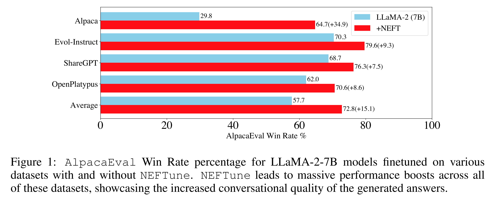

## 1.1 Related Work

가장 초기의 instruction finetuning 은 FLAN 과 T0 로, cross-task generalization 에 초점을 맞췄다. Encoder-decoder language model 은 약 100 개의 다양한 NLP task 로 finetuning 되었고, 이후 다른 task 에 대해 평가되었다. 이후 수천 개의 task 로 확장되며 original FLAN 보다 더 나은 성능을 보였다. 이러한 연구들은 LLM 이 단순하고 고전적인 NLP task 에 쉽게 적응할 수 있음을 보여주었지만, 실제 세계의 시나리오에서는 LLM 이 open-ended query 에 대해 자유 형식의 답변을 제공할 수 있어야 한다.

InstructGPT 는 처음으로 open-ended query 를 인상적으로 처리한 model 이었다. OpenAI 는 GPT-3 을 human feedback 기반의 reinforcement learning (RLHF) 으로 추가 학습하여 model 을 alignment 시켰다. 이 과정은 대중의 상상력을 사로잡고 InstructGPT 이전보다 더 길고 일관된 텍스트를 생성하는 매우 인기 있는 model 인 ChatGPT 를 탄생시켰다.

* 이후 Wang et al. (Self-Instruct) 은 InstructGPT (Text-Davinci-003) 를 이용해 instruction-output pair 를 생성하고, 이를 LLaMA 와 같은 foundation model 을 instruction following variant (e.g., Alpaca) 로 finetuning 하는 방법을 제안했다. 
* Taori et al. 은 distilled model 의 인기에 힘입어, ChatGPT 등 다른 model 로부터 특정 방식으로 distillation 한 dataset 을 구축했고, Xu et al. 또한 이와 유사한 dataset 을 만들었다. 
* 또 다른 접근으로, ShareGPT 는 ChatGPT 사용자들의 실제 대화를 crowdsourcing 으로 수집하여 구성되었다. 
* Lee et al. 은 STEM question answering 과 logical reasoning 같은 특정 능력을 향상시키기 위해 dataset 을 구축했다. AlpaGasus 는 GPT-4 로 평가된 data quality 를 기준으로 filtering 하여 성능을 개선했다.

한편, noisy input 은 다양한 방식으로 model 을 개선하는 데 사용되어 왔다. 

* Language model 개선을 위해 noise 가 사용된 최초의 사례는 Zhu et al. 의 FreeLB 방법으로, adversarial perturbation 이 MLM model 의 성능을 향상시킨다는 것을 관찰했다. 
* 이 경우 noise 는 random 이 아니라, embedding 에 작은 Gaussian perturbation 을 추가한 후, model 성능을 최대한 변화시키는 방향으로 gradient step 을 통해 계산된다. 
* 이러한 adversarial augmentation 접근법은 graph model 성능 향상에도 기여했다. 

저자의 방식은 non-adversarial 이지만, 이러한 연구의 noise scaling rule 을 채택한다. Noisy input 으로 학습하는 방법은 image captioning system 을 개선하거나, 초기 differential privacy mechanism 의 공통 요소로도 사용되었다.

# 2 `NEFTune`: Noisy Embedding Instruction Finetuning

Instruction model 은 instruction 과 response 의 pair 로 구성된 dataset 에 대해 학습된다. `NEFTune` 의 각 step 은 dataset 에서 하나의 instruction 을 sampling 하고, 이를 token 에서 embedding vector 로 변환하는 것에서 시작된다. `NEFTune` 은 이후 standard training 과 달리 embedding 에 random noise vector 를 추가한다. 이 noise 는 $[-1, 1]$ 범위에서 iid uniform sampling 하여 생성되며, 전체 noise vector 는 $\alpha / \sqrt{Ld}$ 로 scaling 된다. 여기서 $L$ 은 sequence length, $d$ 는 embedding dimension, $\alpha$ 는 tunable parameter 이다.

이 scaling rule 은 adversarial ML 연구에서 차용되었으며, 결과적으로 기대되는 Euclidean magnitude 가 대략 $\alpha / \sqrt{3}$ 인 random vector 를 생성한다. Algorithm 1 은 저자의 방법을 자세히 설명한다.

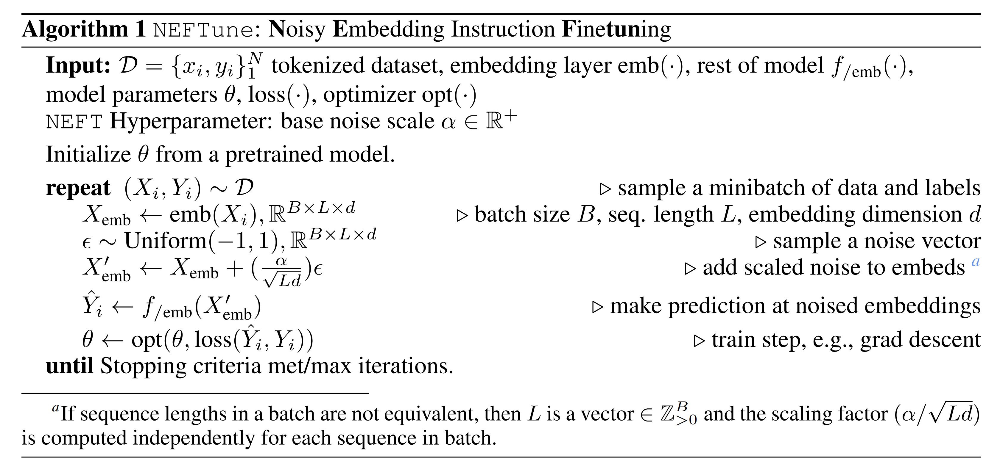

# 3 Experimental Set-up

## 3.1 Models

저자는 주로 7B parameter LLM 을 사용하여 실험을 수행한다. 구체적으로 LLaMA-1, LLaMA-2, OPT-6.7B 를 사용한다. 이들 transformer 는 구조적으로 유사하나, training 중에 본 token 의 수에서 차이가 있다. OPT, LLaMA-1, LLaMA-2 는 각각 180B, 1T, 2T token 으로 학습되었다. 이 차이는 MMLU 와 같은 benchmark 에서 성능 차이로 나타나며, LLaMA-2 가 가장 우수하고 OPT 가 가장 낮은 성능을 보인다. 13B 및 70B parameter model 의 경우 LLaMA-2 를 학습시킨다. 추가적으로, 저자는 LLaMA-2-Chat (7B) 과 같이 RLHF 로 refinement 된 model 을 `NEFTune` 으로 finetuning 하여 개선한다.

## 3.2 Instruction Finetuning Datasets

저자는 널리 사용되었거나 최근 SOTA 결과를 낸 finetuning dataset 에 집중한다. 하드웨어 제약으로 인해 single-turn dataset 만 사용한다.

* **Alpaca**: Self-Instruct 방법과 Text-Davinci-003 model 을 사용하여 구축되었다. Self-Instruct 는 작은 seed task set 을 사용해 새로운 instruction tuning task 를 생성하고, 부적절한 task 를 제거한다.
* **Evol-Instruct**: 70k 개의 single-turn instruction 으로 구성되며 Alpaca 보다 더 복잡하다. Alpaca dataset 을 기반으로 ChatGPT 를 사용하여 초기 instruction 을 진화시켜 생성되었다.
* **Open-Platypus**: 11 개의 open-source dataset 을 결합하여 만든 curated dataset 으로, STEM 및 논리적 reasoning domain 에서 LLM 성능 향상을 목적으로 한다. 약 25k 개의 질문을 포함하며, 이 중 약 10% 는 LLM 이 생성한 것이고 나머지는 사람이 작성했다.
* **ShareGPT**: 70k 개의 자발적으로 공유된 ChatGPT 대화로 구성되었다. ShareGPT 는 multiturn 이지만, Vicuna v1.1 dataset version 을 사용하여 multi-turn 대화를 single-turn 형식에 가깝게 분할하여 사용한다.

모든 model 은 Alpaca system prompt 로 finetuning 하되, ShareGPT 의 경우 Vicuna system prompt 를 사용한다. 저자는 LLaMA-1 (7B) 를 Alpaca dataset 으로 학습하며 coarse sweep 을 통해 hyperparameter 를 설정했고, standard Alpaca model 대비 6% 의 성능 향상을 확인했다. 이 값을 모든 model 에 대해 default 로 사용한다.

## 3.3 Evaluation

저자는 주로 single-turn data 로 학습하므로, model 의 대화 능력을 AlpacaEval 로 평가한다. 또한 OpenLLM Leaderboard 의 task 를 평가하여 `NEFTune` augmentation 이 standard multiple choice task 성능을 저해하지 않는지 확인한다.

* **AlpacaEval**: AlpacaEval dataset 은 generation 의 전반적 품질을 평가하기 위해 사용된다. 
  * AlpacaEval 은 automatic model-based evaluation 으로, 805 개 instruction 에 대해 Text-Davinci-003 과 model 의 출력을 비교하고 Win Rate 를 산출한다. 
  * Win Rate 는 GPT-4 evaluator 가 판단했을 때 Text-Davinci-003 보다 선호된 비율이다. 
  * 805 개의 test prompt 는 Vicuna, Koala, Anthropic’s hh-rlhf 등에서 수집되어 포괄적이고 다양한 평가를 제공한다. 
  * 또한 AlpacaEval 은 사람 평가와 높은 일치도를 보인다 (20k annotation 검증). 
  * 저자는 7B 및 13B scale 에서 이 평가가 충분히 합리적이라고 본다. Evaluator 로 GPT-4 와 ChatGPT 를 모두 사용하며, 비용과 API 제한 문제로 사전 test 는 ChatGPT 로 수행하고, GPT-4 평가 여부를 결정한다.
* **Hugging Face OpenLLM Leaderboard**: Leaderboard 에 사용되는 평가 dataset 은 ARC, HellaSwag, MMLU, TruthfulQA 로, 이는 LLM 이 factual question 및 reasoning challenge 에 응답할 수 있는 능력을 폭넓게 평가한다. 
  * 저자는 이 dataset 으로 평가하여 `NEFTune` 이 model 의 능력을 저해하지 않는지 확인한다.

# 4 Results

#### NEFTune` Improves Text Quality.

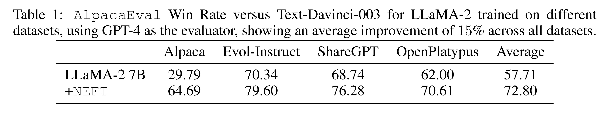

Tab. 1 에서 보듯, 7B scale 에서 모든 dataset 에 대해 평균 15.1% 의 향상이 나타났으며, 이는 AlpacaEval 로 측정한 대화 능력 및 답변 품질이 NEFT 학습을 통해 크게 개선됨을 보여준다. 

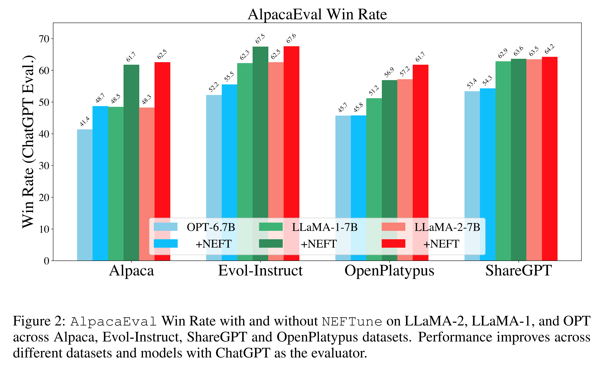

또한 Fig. 2 에서 보듯, LLaMA-1 및 OPT 와 같은 구형 model 에서도 성능 향상이 나타난다. 흥미롭게도, ChatGPT 평가 기준에서는 ShareGPT dataset 에서 다른 dataset 보다 향상이 덜한 것으로 나타난다. 그러나 GPT-4 평가에서는 이러한 차이가 반영되지 않는다.

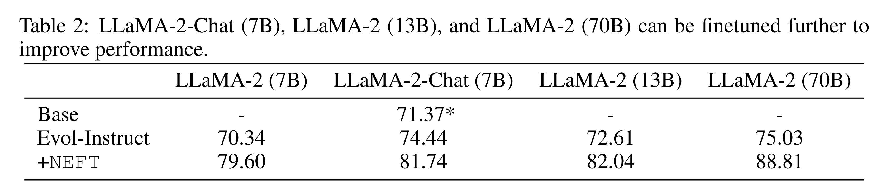

Tab. 2 에 따르면, Evol-Instruct 로 학습된 70B parameter model 에 `NEFTune` 을 적용할 경우 Win Rate 가 75.03% 에서 88.81% 로 상승하며 (+13.78%), 세부 hyperparameter 는 Appendix A.1 에 기술되어 있다.

#### NEFTune` Can Improve Chat Models.

Tab. 2 에서 보듯, Evol-Instruct 로 LLaMA-2-Chat (7B) 을 추가 instruction finetuning 할 경우, 이미 다단계 RLHF 로 광범위하게 조정된 model 임에도 불구하고 성능이 3% 향상된다. 더 나아가, `NEFTune` 을 적용하면 추가로 10% 의 성능 향상이 나타난다. 다만, 해당 checkpoint model 의 특정 능력, 예를 들어 toxic behavior 출력을 회피하는 능력은 영향을 받을 수 있다. 그럼에도 불구하고, 이미 정교하게 조정된 chat model 의 대화 품질이 이처럼 극적으로 개선된다는 것은 놀라운 결과이다.

#### Effect on Capabilities.

한 가지 잠재적 우려는 `NEFTune` 이 대화 능력을 향상시키는 대신 기존의 classical skill 을 저해할 수 있다는 점이다. 이를 검증하기 위해, 저자는 OpenLLM Leaderboard task (MMLU, ARC, HellaSwag, TruthfulQA) 를 LMEval Harness implementation 으로 평가한다. 이 benchmark 는 model 의 knowledge, reasoning, truthfulness 를 평가한다. Fig. 3 은 score 가 안정적으로 유지되며, `NEFTune` 이 model 의 capability 를 보존함을 보여준다.

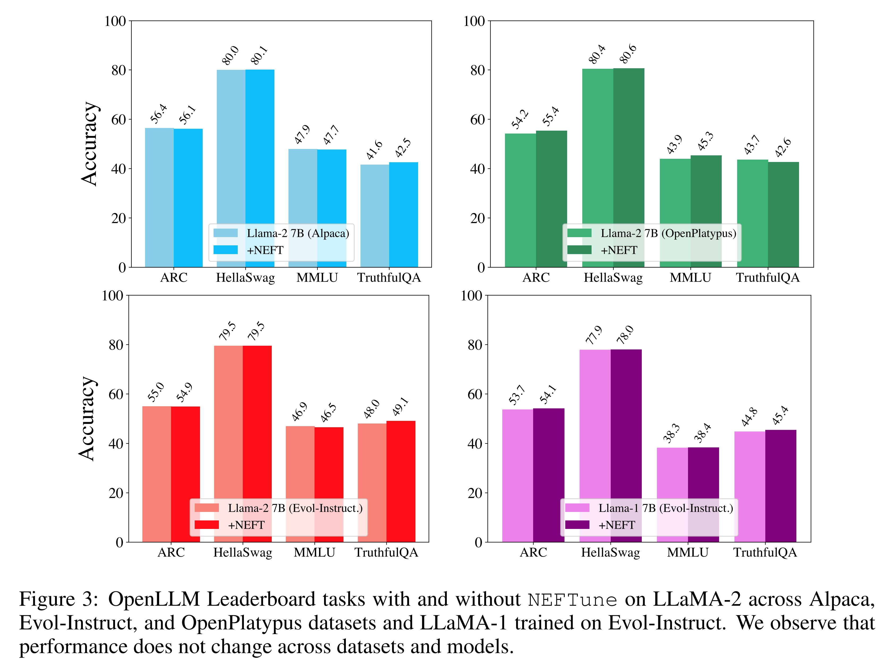

#### NEFTune` Works with QLORA.

저자는 `NEFTune` 이 제한된 자원 환경에서도 성능을 개선함을 보인다. 이를 위해 Quantized Low Rank Adapters (QLORA) 로 학습을 진행한다. Dettmers et al. 의 implementation 을 사용하고, 모든 model weight 에 대해 기본 training hyperparameter 를 적용하며 단 1 epoch 학습한다. 30B 의 경우, effective batch size 를 2 배로 늘리고 learning rate 를 절반으로 줄인다. 

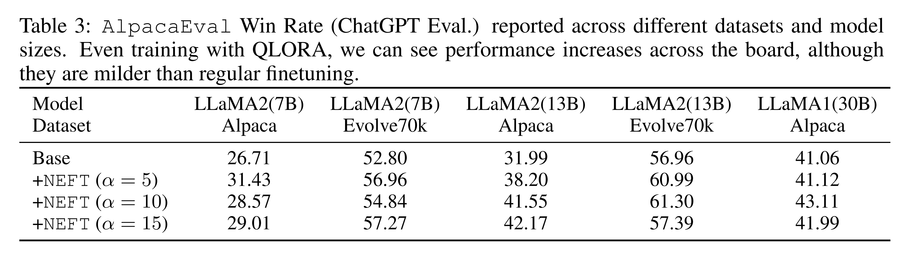

* Tab. 3 에 따르면 QLORA 로 학습할 때도 AlpacaEval 성능은 모든 model scale 및 dataset 에서 증가한다. 
* 다만 full-scale finetuning 과 비교했을 때 성능 향상 폭은 크지 않은데, 이는 finetuning epoch 수와 같은 hyperparameter 가 달라야 하거나, 4-bit 로 강하게 quantization 했기 때문일 수 있다.

#### A Qualitative Example.

저자는 Alpaca dataset 으로 학습된 LLaMA-2 model 에서 NEFT 적용 전후의 예시를 제시한다. 

* Vicuna Eval subset 의 AlpacaEval instruction 중 quantum computing prompt 를 선택했다. 
* Alpaca model 의 응답은 단순히 quantum computing 의 기본 정의를 간략히 제시하며, qubit, superposition, entanglement, 복잡한 계산 능력 증가 등을 짧게 언급하는 수준이다. 
* 반면, Alpaca-NEFT model 의 응답은 보다 유창하고, superposition 과 quantum entanglement 에 대해 더 명확히 설명하며, 잠재적 응용 가능성까지 언급한다. 

저자는 이 예시가 NEFT 가 유도하는 변화의 전형적인 사례라고 본다.

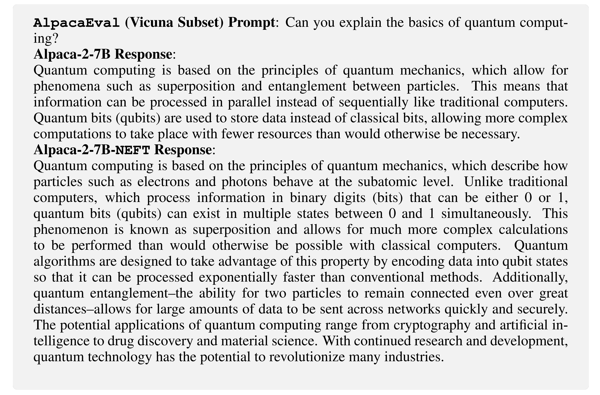

# 5 Analysis

저자는 training 시 embedding 에 noise 를 추가함으로써, model 이 instruction-tuning dataset 의 세부 요소들—e.g., formatting detail, exact wording, text length—에 과적합하는 현상이 줄어든다고 가정한다. 즉, model 이 특정 instruction 분포에 그대로 수렴하는 대신, pretrained base model 의 knowledge 와 behavior 를 더 잘 활용한 응답을 생성할 수 있게 된다.

즉각적으로 관찰되는 부수 효과는 model 이 더 일관되고 긴 completion 을 생성한다는 점이다. 대부분의 dataset 에서 human 과 machine evaluator 는 더 길고 verbose 한 completion 을 선호한다. 그러나 저자는 이러한 verbosity 증가는 instruction 분포에 대한 과적합 감소에서 나타나는 가장 눈에 띄는 부산물일 뿐이며, 성능 향상을 전적으로 설명할 수는 없다고 본다.

## 5.1 Overfitting

이 분석에서는 Alpaca dataset 으로 학습된 LLaMA-2-7B model 을 `NEFTune` 적용 여부에 따라 비교한다. 두 model 모두 Alpaca dataset 에 대해 noise 없이 training loss 를 측정하고, Evol-Instruct dataset 에 대해 “testing” loss 를 측정한다. 

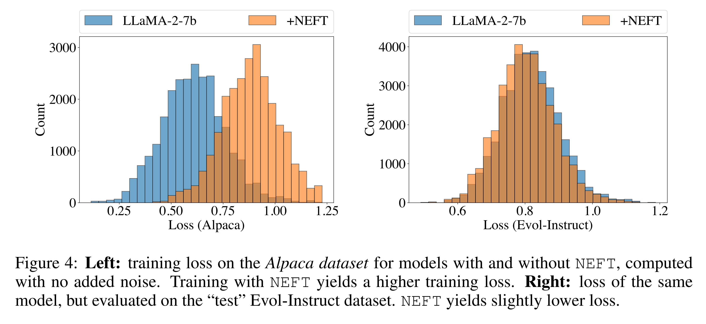

* Fig. 4 에 따르면, `NEFTune` model 은 base model (`NEFTune` 미적용) 대비 training loss 는 현저히 높지만 testing loss 는 약간 더 낮다. 
* 이는 `NEFTune` 을 사용할 때 과적합이 줄어들고 일반화가 더 잘 이루어짐을 시사한다.

과적합 가설을 더 검증하기 위해, 저자는 greedy decoding 으로 training prompt 에 대한 응답을 생성한다. 생성된 응답을 dataset 의 ground truth response 와 비교하고, 그 결과를 Fig. 5 에 제시한다. 

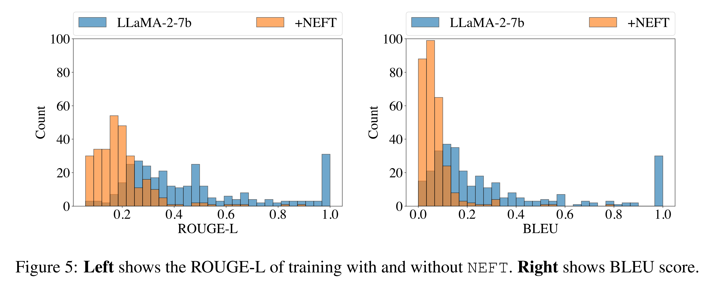

* 응답 간 유사도 측정을 위해 ROUGE-L 과 BLEU (n-gram order 4 까지) 를 사용한다. 
* Fig. 5 에 따르면, `NEFTune` 으로 학습된 model 의 응답은 ROUGE-L 과 BLEU score 가 유의미하게 낮다. 
* ROUGE-L 은 단어의 longest common subsequence 기반이고, BLEU 는 응답 간 common n-gram 기반이므로, `NEFTune` 없이 학습된 model 이 더 높은 score 를 보인다는 것은 그 응답이 ground truth response 와 동일한 단어 순서를 훨씬 더 많이 포함한다는 것을 의미한다.

이러한 관찰을 종합하면, standard finetuning recipe 는 최대 성능을 위해 조정되었지만 instruction dataset 에 과도하게 과적합하여 일부 응답을 거의 그대로 재현하게 된다. 반면 `NEFTune` model 은 test set 성능을 저해하지 않으면서 과적합을 줄이고, instruction data 의 exact wording 에 “lock-in” 되지 않음을 ROUGE-L metric 을 통해 확인할 수 있다.

## 5.2 Length Versus Token Diversity

저자는 AlpacaEval task 에서 length 증가와 성능 향상 간의 강한 상관관계(저자의 실험 및 public leaderboard 제출 사례에서 모두 확인됨)를 고려하여, `NEFTune` 으로 관찰된 length 증가가 text 다양성 감소를 초래하는지 여부를 조사했다. 이를 위해, `NEFTune` 적용 여부에 따라 서로 다른 finetuning dataset 으로 학습된 LLaMA-2 에 대해 n-gram repetition rate 를 계산했다.

일반적으로 긴 passage 에서는 n-gram 이 더 자주 반복되므로, passage length 를 통제해야 한다. 저자는 각 sample 의 시작 부분에서 고정 길이 chunk 를 사용하여 repetition 과 diversity score 를 계산했다. cutoff 는 Alpaca 학습 model 의 경우 50, Evol-Instruct 는 100, ShareGPT 는 150, OpenPlatypus 는 150 으로 설정했다. 이 길이는 최소 절반 이상의 generation 이 cutoff 보다 길도록 선택했으며, 길이가 부족한 sequence 는 제거했다. Diversity score 는 2-, 3-, 4-gram repetition rate 의 요약 지표인 log-diversity 로 계산했으며, 이는 Kirchenbauer et al. 및 Li et al. 의 정의를 따른다.

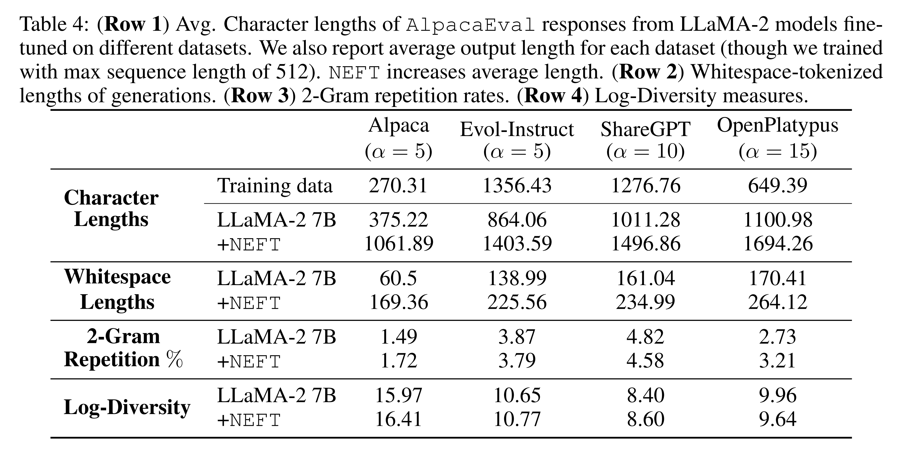

* Tab. 4 와 Tab. 6 에 따르면, NEFT model 은 대응 model 보다 더 긴 출력을 생성한다. 
* 그러나 2-gram repetition rate 및 token log-diversity 는 NEFT 적용 여부와 거의 동일하여, 더 긴 응답이 단순한 반복 증가로 인한 것이 아니라 추가적인 세부 정보 제공 때문임을 보여준다.

## 5.3 Length is (Not) All You Need Length

저자는 length–leaderboard 상관관계를 더 면밀히 분석하기 위해, 단순히 model 의 출력을 길게 유도하는 것만으로 NEFT 학습 model 의 성능 향상을 재현할 수 있는지 실험했다 (Tab. 5).

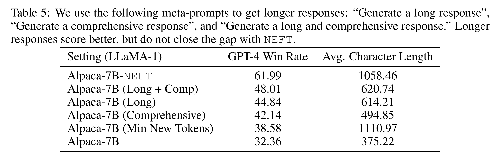

* 먼저, 명시적으로 긴 답변을 요청하는 prompt 를 주었다. 흥미롭게도, 이 경우 AlpacaEval score 가 16% 상승했다. 
* 또 다른 방법으로, [EOS] token 을 250 token 길이에 도달할 때까지 차단하여, standard model 이 NEFT 와 동일한 길이의 답변을 강제로 생성하게 했다. 이 경우 standard finetuning 대비 소폭의 개선만 나타났다.

마지막으로, NEFT algorithm 에서 uniform noise 대신 Gaussian noise 를 사용하는 ablation 을 수행했다. Gaussian noise 는 더 긴 출력을 유도했지만 성능 향상은 나타나지 않았다 (Tab. 6).

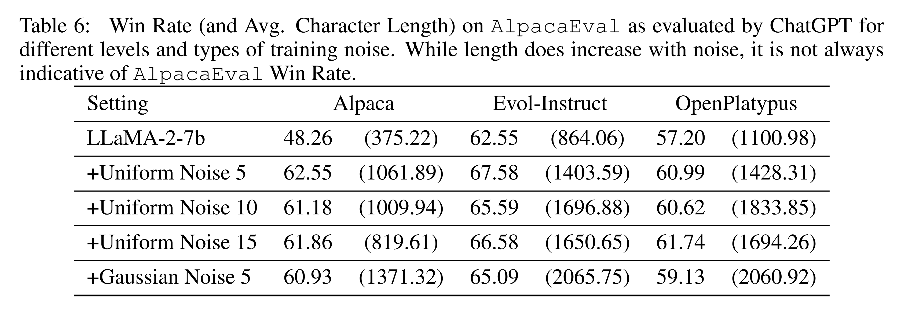

즉, 더 긴 generation 이 성능 향상에 기여할 수는 있지만, 어떤 generation-time 전략도 `NEFTune` model 의 성능에는 미치지 못했다.

## 5.4 Human Study

저자의 주요 결과는 LLM 기반 평가 지표인 AlpacaEval 에 기초하고 있으므로, 저자는 소규모 human study 도 수행했다. AlpacaEval 에서 140 개 instruction 을 추출하여, annotator 에게 Alpaca data 로 finetuning 된 LLaMA-2 model 의 두 응답(NEFT 적용/미적용)을 무작위 순서로 제시했다.

Human annotator 는 88 개 instance 에서 NEFT 응답을 선호했고, 22 개 instance 는 무승부였다. 이는 AlpacaEval 공식(88 / (140 − 22))을 적용하면 NEFT 가 74.6% win score 를 얻는다는 의미다. 이어서 저자는 AlpacaEval 을 변형하여, evaluator (GPT-4) 가 Text-Davinci-003 과의 비교 대신 standard finetuned model 과 동일 model 의 NEFT 버전 출력을 비교하도록 했다. 이 경우, win score 는 92.80% 로 나타났다.

# 6 Conclusions and Limitations

`NEFTune` 의 성공은 LLM training 에서 종종 간과되는 algorithm 및 regularizer 의 중요성을 시사한다. Computer vision 분야에서는 regularization 과 overfitting 이 오랫동안 연구되어 왔지만, LLM 분야에서는 일반화보다는 optimizer stability 를 목표로 설계된 표준화된 training loop 가 주로 사용되어 왔다. 이런 환경에서 LLM 연구자들은 dataset 과 model scaling 에 지나치게 집중해왔다. 그러나 `NEFTune` 의 일관된 성능 향상과, 작은 instruction dataset 에서 나타나는 과적합 경향을 고려할 때, LLM setting 에서 regularization 연구가 다시 주목받을 필요가 있다.

저자의 연구에는 몇 가지 한계가 있다. 첫째, 저자는 LLM 의 instruction-following 능력을 측정하는 주요 지표로 AlpacaEval 을 사용했는데, 이는 단일 evaluator (GPT-4) 의 편향에 영향을 받을 수 있다. 둘째, 제한된 compute 자원으로 인해, 저자는 70B variant 를 여러 dataset 에서 검증하지 못했으며, 대부분의 `NEFTune` run 에서 sweeping 대신 고정된 hyperparameter 에 의존해야 했다. 마지막으로, 경험적 연구 결과에도 불구하고 `NEFTune` 이 작동하는 이유에 대해서는 여전히 확정적인 이해에 도달하지 못했다.
