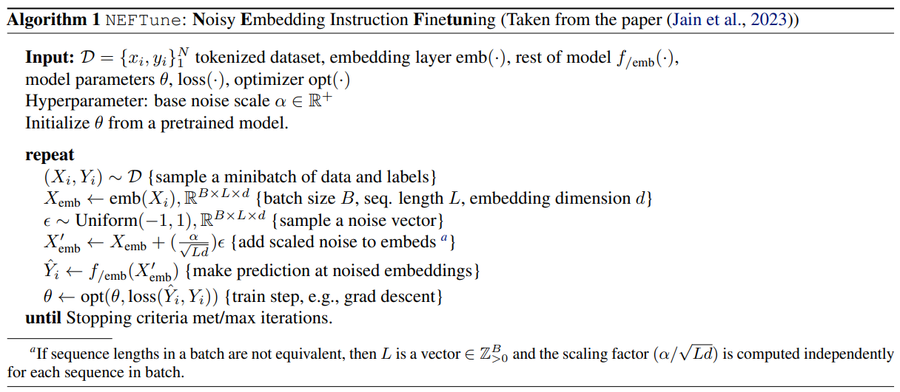
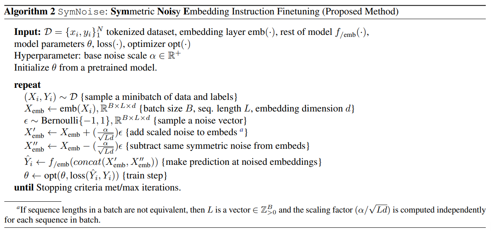
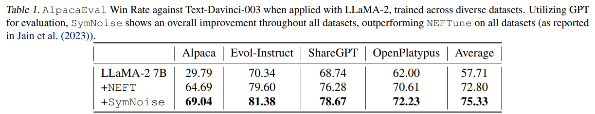
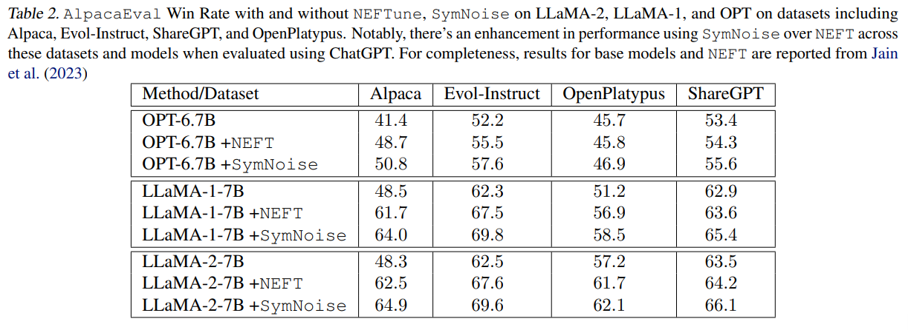
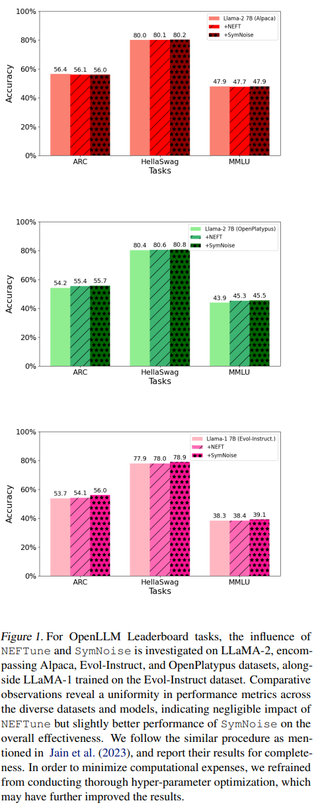
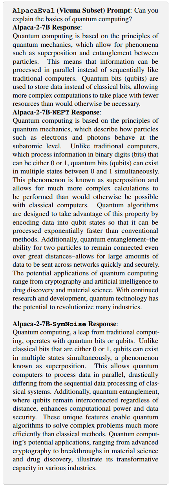
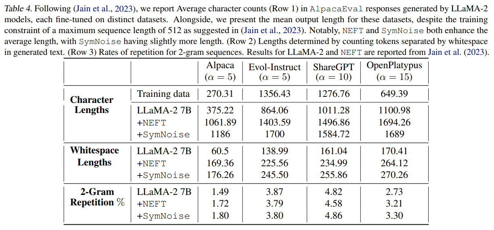
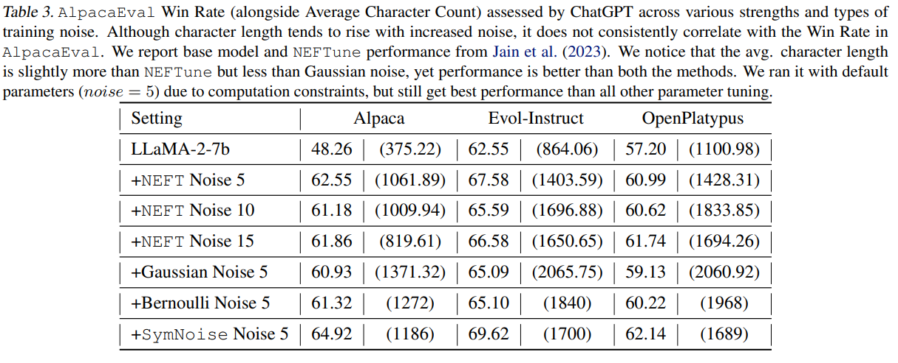

논문 및 이미지 출처 : <https://arxiv.org/pdf/2310.05914>

# Abstract

이 논문은 language model 의 fine-tuning 을 위한 새로운 기법을 제안한다. 제안하는 방법은 embedding 과정에 **symmetric noise** 를 도입하는 것으로, model 의 local curvature 를 보다 엄격하게 규제하여 function 을 향상시키는 것을 목표로 한다. 

* 이 방법은 기존 기법인 `NEFTune` 대비 우수한 성능을 보인다. LLaMA-2-7B model 을 Alpaca 로 fine-tuning 할 때, 표준 기법은 AlpacaEval 에서 29.79% 점수를 얻는다. 
  * 그러나 제안하는 `SymNoise` 는 symmetric noisy embedding 을 사용하여 이 점수를 69.04% 로 크게 향상시킨다. 
  * 이는 최신 기법인 `NEFTune` (64.69%) 대비 6.7% 개선된 결과이다. 
* 또한 Evol-Instruct, ShareGPT, OpenPlatypus 와 같은 다양한 model 및 stronger baseline instruction dataset 에서도 `SymNoise` 는 일관되게 `NEFTune` 을 능가한다. 
* 기존 문헌, 특히 `NEFTune` 은 language model 의 fine-tuning 에서 noise 기반 전략의 적용에 대한 심층 연구의 중요성을 강조해왔다. 
  * 저자의 접근 방식인 `SymNoise` 는 이 방향에서 또 다른 중요한 진전을 이루며, 기존 SOTA 기법 대비 뚜렷한 개선을 보여준다.

# 1. Introduction

Large Language Model (LLM) 이 효과적으로 활용되기 위해서는 specific instruction 을 수행하는 능력이 매우 중요하다. 이러한 model 은 보통 방대한 양의 비정제 웹 데이터를 기반으로 training 을 시작한 후, 더 작고 선별된 instruction data 를 사용한 fine-tuning 단계를 거친다. instruction 중심의 fine-tuning 단계는 LLM 의 잠재적 능력을 발현하고 제어하는 데 핵심적인 역할을 한다. 이러한 model 의 실질적 가치는 얼마나 효율적으로 소규모 instruction dataset 을 활용하여 최적의 성능을 낼 수 있는가에 달려 있다.

최근 computer vision 분야에서는 noise injection 기법에 대한 연구가 활발히 진행되었으며, 이 접근법들은 성능 향상에 있어 단순하면서도 효과적인 장점 때문에 LLM 의 fine-tuning 에서도 주목받고 있다. 대표적인 예로 uniform random noise 를 도입한 `NEFTune` 방법이 있다. `NEFTune` 은 기존의 표준 fine-tuning 방법보다 성능 면에서 크게 앞서지만, 그 작동 원리는 여전히 다소 불분명하다. 본 논문에서는 `NEFTune` 및 기존 방법들을 뛰어넘는 성능을 보여줄 뿐 아니라 직관적으로 이해 가능한 새로운 noise injection 기법을 제안한다.

저자가 제안하는 새로운 noise 유형은 성능적 우위뿐 아니라 더 심층적인 이해를 기반으로 한다. 연구의 목표는 training 과정에서 learned function 의 curvature 를 regularization 하는 것이다. 

* curvature regularization 은 computer vision, graph embedding, deep neural networks 등 다양한 분야에서 사용된 바 있다. 
* 특히, input 이 noise 에 의해 미세하게 변형되었을 때 function 의 출력 변화가 점진적으로 이루어지도록 하는 것을 목표로 한다. 
* 기술적으로는, input 이 아주 작게 변형되었을 때 gradient 가 0 에 수렴하도록 하는 것을 지향한다. 
  * 이는 단순히 Hessian 이나 gradient 값이 작도록 요구하는 것보다 더 엄격한 조건이다. 
  * 그러나 계산 효율성을 고려하여 gradient 나 Hessian 을 직접 계산하지 않고, 이 엄격한 조건을 간접적으로 적용한다. 
  * 실제 benchmark dataset 실험을 통해 이 접근법이 실질적으로 효과적임을 확인한다.

본 논문은 **Symmetric Noise Fine Tuning (`SymNoise`)** 을 제안한다. 

* 이는 fine-tuning 단계에서 training data 의 embedding vector 에 symmetric Bernoulli distribution 기반 noise 를 주입하는 기법이다. 
  * 각 noise 성분은 −1 과 1 값을 1/2 의 확률로 가진다. 
* 이 방법은 추가적인 계산 자원이나 data 자원 없이도 instruction fine-tuning 성능을 크게 향상시키며, downstream conversational output 품질에도 깊은 영향을 미친다. 
  * 예를 들어 LLaMA-2-7B model 을 `SymNoise` 로 fine-tuning 할 경우 `AlpacaEval` 성능이 29.79% 에서 69.04% 로 상승하며, 이는 약 39.25 퍼센트포인트의 큰 개선을 보여준다.
* 특히, 기존의 random uniform noise 를 사용하는 `NEFTune` 과 비교했을 때, `SymNoise` 는 약 6.7% 더 우수한 성능을 보인다. 
* 따라서 `SymNoise` 는 기존 fine-tuning 방법보다 중요한 발전일 뿐 아니라, LLM fine-tuning 에서 효율성과 효과성 모두에 새로운 기준을 제시한다.

# 2. Background and Related Work

Large Language Model (LLM) 의 instruction fine-tuning 연구는 FLAN 과 T0 와 같은 초기 시도로부터 시작되었으며, 이들은 cross-task generalization 의 기반을 마련하였다. 이러한 model 은 encoder-decoder language architecture 를 기반으로 하여 수천 개의 다양한 NLP task 에 대해 fine-tuning 되었으며, Chung et al. 과 Xu et al. 의 연구는 LLM 이 여러 표준 NLP task 에 적응할 수 있음을 보여주었다.

이 흐름을 이어 OpenAI 의 InstructGPT 는 open-ended question 처리에 매우 효과적인 model 로 등장하였다. GPT-3 의 변형으로서 InstructGPT 는 reinforcement learning from human feedback (RLHF) 를 도입하였고, 이를 기반으로 ChatGPT 와 같은 고도화된 model 이 개발되었다. 특히 ChatGPT 는 InstructGPT 보다 더 일관되고 확장된 text 를 생성할 수 있어 큰 주목을 받았다.

* 이러한 발전을 바탕으로 Wang et al. 은 Self-Instruct 접근법을 제안하였으며, InstructGPT 를 활용해 instruction pair 를 생성하고 이를 통해 LLaMA 와 같은 foundational model 을 Alpaca 와 같은 특화된 변형으로 fine-tuning 하였다. 
* 동시에 distilled model 연구가 활발히 진행되었으며, Xu et al. 및 Lee et al. 의 연구는 STEM 질문 응답이나 논리적 추론과 같은 특정 능력 향상에 초점을 둔 dataset 을 구축하였다. 
* Chen et al. 은 GPT-4 평가를 기반으로 한 quality-filtering 메커니즘을 도입한 AlpaGasus 를 제안하여 model 성능을 강화하였다. 
* 한편, Chiang et al. 은 ShareGPT 를 제안하였는데, 이는 ChatGPT 로부터 얻은 실제 사용자 상호작용 데이터를 crowd-sourcing 하여 개발되었다.

---

* model training 과정에 noise 를 도입하는 연구로는 Zhu et al. 의 FreeLB 방법이 선구적이다. 
* FreeLB 는 embedding 에 정교하게 계산된 Gaussian perturbation 을 주입하고 이를 최적화하여 MLM model 의 성능을 향상시켰다. 
* 이후 유사한 전략은 image captioning, point cloud 처리, graph, privacy mechanism 등 다양한 분야에 적용되었다. 
* curvature regularization 또한 computer vision, graph embedding, deep neural networks 등 여러 영역에서 활용된 바 있다.

한편, Gaussian 또는 Uniform noise 와 달리 Bernoulli distribution 기반 noise 가 사용된 사례도 존재한다. Spall 은 각 결과값이 −1 또는 1 이 될 확률이 동일하게 1/2 로 주어지는 방식을 제안하였다.

# 3. Proposed Method: `SymNoise`

이상의 이상적인 시나리오에서 저자의 목표는 **curvature regularization** 을 구현하는 것이다. 

* curvature regularization 은 computer vision, graph embedding, deep neural networks 등 다양한 분야에서 널리 사용되어왔다. 
* 그러나 이러한 방법은 계산 비용이 매우 크기 때문에, 저자는 더 엄격한 조건을 따르면서도 계산 효율적인 대안을 탐구하고자 한다. 
* 이 접근법은 실제로 기존 SOTA 방법들을 능가하는 성능을 보여준다.

구체적으로, 저자는 input 근처에서 gradient ($\Delta f$) 가 0 에 수렴하도록 function 을 설계하고자 한다. 즉, $x, \epsilon \in \mathbb{R}^d$ 에 대해 다음이 성립한다.

$$
\nabla f = \frac{\left| \frac{f(x - \epsilon) - f(x + \epsilon)}{\epsilon} \right|}{2} \leq \delta, \ \text{when}\ \delta = 0,\ \text{ we have } f(x + \epsilon) = f(x - \epsilon).
$$

저자의 접근법은 직관적으로 Bernoulli vector 의 정반대되는 noise vector 를 도입하여, network 가 input vector 주변의 symmetric perturbation 두 지점에서 동일한 function 을 학습하도록 강제한다. 이 formulation 에서 noise 는 Gaussian 혹은 Uniform noise 와는 달리 Bernoulli distribution 을 기반으로 한다. 이때 각 결과값은 −1 과 1 이 동일한 확률 1/2 로 발생한다. 이러한 선택은 network 의 학습 과정에 보다 균형적이고 예측 가능한 영향을 주기 위함이다.

Jain et al. 의 접근법을 따른 instruction-based model training 은 instruction 과 이에 대응하는 response 로 이루어진 dataset 을 사용한다. `NEFTune` 은 instruction 을 sampling 한 뒤 token 을 embedding vector 로 변환하고, 여기에 uniform random noise 를 주입하는 방식이다. 그러나 저자의 방법은 noise scaling factor 를 동일하게 유지한다. 즉, $\epsilon = \frac{\alpha}{\sqrt{L d}}$. 여기서 $L$ 은 sequence length, $d$ 는 embedding dimension, $\alpha$ 는 tunable parameter 이다.

하지만 noise 적용 과정에서 저자의 방법은 `NEFTune` 과 달리 symmetric opposing Bernoulli noise 를 사용한다. 저자가 제안하는 `SymNoise` 의 구체적 방법은 Algorithm 2 에, 비교를 위해 `NEFTune` 은 Algorithm 1 에 제시된다.

# 4. Experiments

본 장에서는 다양한 model 과 benchmark 에 대해 실험을 수행하여 제안하는 `SymNoise` 방법의 효율성을 검증하고, 기존의 NEFT 를 포함한 기법들과 비교한다.

## 4.1. Datasets

이 절에서는 널리 활용되거나 최근 SOTA 성능을 달성한 fine-tuning dataset 들을 다룬다. 저자의 hardware 환경의 memory 제약으로 인해, Jain et al. 이 사용한 프로토콜과 유사하게 single-turn dataset 에만 집중한다. 선택된 dataset 은 다음과 같다.

* **Alpaca (Taori et al., 2023)**: Wang et al. 의 Self-Instruct 방법과 Text-Davinci-003 model 을 기반으로 개발된 dataset 이다. 소규모 seed task 를 활용하여 새로운 instruction tuning task 를 생성하고, 효과가 떨어지는 task 를 제거한다. instruction 기반 학습을 발전시키는 데 중요한 역할을 했다.
* **ShareGPT (Chiang et al., 2023)**: 약 70k 개의 자발적으로 공유된 ChatGPT 대화로 구성된 dataset 이다. 실제 상호작용 데이터의 풍부한 원천을 제공한다. 원래는 multi-turn dataset 이지만, 저자의 실험 설정과 일관성을 위해 Vicuna v1.1 dataset 버전을 사용하여 single-turn 형식으로 변환하였다.
* **Evol-Instruct (Xu et al., 2023)**: 70k 개의 single-turn instruction 으로 구성되며, Alpaca 보다 더 복잡한 dataset 으로 간주된다. Alpaca dataset 을 기반으로 ChatGPT 를 활용해 instruction 을 정제하고 진화시켜 task 의 범위와 복잡성을 확장하였다.
* **Open-Platypus (Lee et al., 2023)**: 11 개의 open-source dataset 을 결합하여 만들어진 dataset 으로, STEM 및 논리적 추론 분야에서 LLM 성능을 강화하는 데 초점을 맞춘다. 약 25k 개의 질문을 포함하며, 이 중 약 10% 는 LLM 이 생성한 것이고 나머지는 전문가가 제작하였다. 다양한 질문 형식과 복잡성의 중요성을 강조한다.

fine-tuning 단계에서, ShareGPT 를 제외한 모든 model 은 Alpaca system 의 prompt 를 사용한다. 반면, ShareGPT 는 Vicuna system 의 prompt 를 사용하여 fine-tuning 된다.

# 4.2. Models

Jain et al. 의 실험 설정을 따라, 저자의 실험은 주로 7 billion parameter 규모의 Large Language Model (LLM) 을 활용한다. 구체적으로는 LLaMA-1, LLaMA-2, OPT-6.7B 와 같은 model 에 초점을 맞춘다. 이들 transformer 기반 model 은 주로 training data 의 양에서 차이를 보인다. OPT-6.7B, LLaMA-1, LLaMA-2 는 각각 180 billion, 1 trillion, 2 trillion token 으로 학습되었다. 이러한 training data 규모의 차이는 MMLU 와 같은 benchmark 에서 성능 차이로 나타나며, 일반적으로 LLaMA-2 가 다른 model 들보다 우수한 성능을 보인다. 또한 13B 및 70B parameter 규모의 model 에 대해서는 LLaMA-2 training 에 집중한다.

# 4.3. Evaluation Protocols

저자의 실험적 framework 는 `NEFTune` 설정을 기반으로 하며, 주로 single-turn data 를 사용하여 training 한다. model 의 대화 능력은 `AlpacaEval` 을 통해 평가하고, OpenLLM Leaderboard 의 task 들을 통해 성능을 추가적으로 검증한다. 이를 통해 제안하는 `SymNoise` augmentation 이 표준 multiple-choice task 에서 성능 저하를 일으키지 않는지를 확인한다. 결과적으로 `SymNoise` 를 적용한 model 은 원래의 `NEFTune` model 보다 일관되게 우수한 성능을 보였으며, 그 차이는 다소 제한적이지만 확실하다.

* **`AlpacaEval`**: Dubois et al. 에 의해 도입된 benchmark 로, generative quality 평가에 중요한 역할을 한다. Text-Davinci-003 의 생성 결과와 저자의 model 의 출력을 805 개의 prompt 에 대해 비교하며, Win Rate 를 측정한다. Win Rate 는 model evaluator (GPT-4, ChatGPT 등) 가 Text-Davinci-003 대비 저자의 model 을 더 선호한 비율을 의미한다. dataset 의 805 개 test prompt 는 다양한 출처에서 수집되어 폭넓은 평가 범위를 보장한다. 또한 `AlpacaEval` 은 20K 개 이상의 human annotation 을 기반으로 높은 human agreement rate 를 보여 평가의 신뢰성을 입증한다. 저자는 GPT-4 와 ChatGPT 를 evaluator 로 활용하였으며, GPT-4 API 의 비용 및 제한 때문에 초기에는 ChatGPT 를 사용하였다.
* **Hugging Face OpenLLM Leaderboard**: leaderboard 평가를 위해 ARC, HellaSwag, MMLU 등의 dataset 을 활용한다. 이들 verbalized multiclass classification dataset 은 LLM 의 사실적 질문 처리 및 reasoning 능력을 측정한다. 저자의 평가 결과 `SymNoise` 방법은 이러한 분야에서 model 의 성능을 저해하지 않음을 확인하였다.

## 4.4. Results

### 4.4.1. Improvement in Generated Text Quality

저자의 결과는 생성된 text quality 측면에서 `NEFTune` 대비 향상된 성능을 보여준다. 

* Tab. 1 에서 확인할 수 있듯이, 7B 규모 model 의 모든 dataset 에서 두드러진 개선이 나타났으며, 평균 17.6% 의 향상을 기록하였다 (`NEFTune` 은 15.1% 향상). 이는 `SymNoise` 적용이 대화 능력과 답변 품질을 크게 향상시킴을 의미한다.

`AlpacaEval` 평가 결과에서도 `SymNoise` 가 `NEFTune` 을 뚜렷하게 능가하였다. 

* 또한 Tab. 2 에서 확인할 수 있듯이, LLaMA-1 및 OPT-6.7B 와 같은 이전 세대 model 에서도 `SymNoise` 는 일관되게 `NEFTune` 을 능가하였다.
* 흥미로운 점은 ShareGPT dataset 에서 `NEFTune` 의 성능 향상이 상대적으로 작게 나타났다는 것이다. 
* ChatGPT 의 평가에서는 이 현상이 뚜렷했지만, GPT-4 의 평가에서는 동일하게 나타나지 않았다. 그러나 `SymNoise` 는 GPT-4 와 ChatGPT 모두의 평가에서 ShareGPT 에 대해 `NEFTune` 을 꾸준히 능가하였다.
* 특히 Tab. 1 에서 Alpaca dataset 의 Win Rate 는 29.79% 에서 69.04% 로 크게 증가하여, SOTA 방법인 `NEFTune` 대비 6.7% 의 개선을 보여주었다.

## 4.4.2. Improvement in OpenLLM Leaderboard Tasks

`SymNoise` 가 대화 능력을 강화하는 대신 전통적인 능력을 희생할 가능성을 점검하기 위해, OpenLLM Leaderboard 의 task 로 평가를 수행하였다. LM-Eval Harness framework 을 활용하여 MMLU, ARC, HellaSwag benchmark 에서 model 성능을 측정하였다.

이 평가들은 model 의 knowledge base, reasoning capability, 사실적 정보 유지 능력을 드러낸다. 

* Fig. 1 에서 확인할 수 있듯이, `SymNoise` 는 단순히 성능을 유지하는 수준을 넘어 일부 영역에서는 능력을 적극적으로 강화하였다. 
* 특히 `SymNoise` 는 `NEFTune` 대비 일관되게 더 높은 성능을 보이며, 대화 능력과 전통적 계산 능력 간의 균형을 효과적으로 달성한다는 점을 보여준다.

## 4.4.3. A Qualitative Example

본 절에서는 Alpaca dataset 으로 학습된 LLaMA-2 model 의 구체적 예시를 제시하여 `SymNoise` 및 `NEFTune` 적용 전후의 결과를 비교한다. 객관성을 위해, Jain et al. 이 `NEFTune` 논문에서 사용한 동일한 예시를 채택하였다. 즉, `AlpacaEval` framework 의 Vicuna Eval subset 에 포함된 quantum computing prompt 를 선택하였다.

기본 Alpaca model 은 qubit, superposition, entanglement 및 복잡한 연산에서의 중요성과 같은 핵심 요소들을 간략히 요약한 응답을 제공한다. 반면 `SymNoise` 로 강화된 model 은 superposition 과 quantum entanglement 의 원리에 대해 더 깊이 있는 설명을 제공하며, 잠재적 실제 응용 가능성까지 탐구한다.

흥미롭게도 `SymNoise` 로 생성된 응답은 `NEFTune` 과 매우 유사하지만, 더 간결하고 문자 수도 적게 사용한다. 이 예시는 `SymNoise` 가 가져오는 정성적·정량적 개선을 잘 보여주며, 다양한 fine-tuning dataset 에서 관찰된 전반적 향상과 일치한다.

## 4.5. Analysis

여러 연구에서 강조된 바와 같이, `NEFTune` 을 포함한 접근법은 training 과정에서 embedding 에 noise 를 주입함으로써 instruction-tuning dataset 의 특이적 형식, 특정 단어 선택, text 길이 등에 과적합되는 경향을 줄일 수 있다. 이는 model 이 instruction 의 분포를 단순히 복제하는 것에서 벗어나, 사전 학습된 base model 의 지식과 능력을 활용한 응답 생성을 유도한다.

이 전략의 즉각적이고 분명한 결과는 model 이 더 일관되고 동시에 더 긴 응답을 산출하기 시작한다는 점이다. 대체로 human evaluator 와 자동 평가 시스템은 대부분의 dataset 에서 더 길고 자세한 응답을 선호하며, Dubois et al. 의 결과에서도 이 현상이 뒷받침된다. 그러나 저자의 분석에 따르면 `SymNoise` 의 개선 효과는 단순히 verbose 한 응답 증가만으로 설명되지 않는다. `SymNoise` 적용은 응답의 양뿐 아니라 질적 측면에서도 `NEFTune` 을 뛰어넘는 향상을 보여준다. 특히 `SymNoise` 는 `NEFTune` 대비 평균 응답 길이가 더 길다.

`SymNoise` 는 instruction set 의 여러 noisy 변형에 대해 non-zero probability 를 부여하는 것으로 개념화할 수 있다. 따라서 model 은 학습 dataset 에 과적합된 좁고 뾰족한 분포나 그 변형 하나에 치우치지 않고, 보다 일반화되고 균일한 확률 분포를 학습하게 된다. 이는 instruction set 에 대한 보다 포괄적 이해와 적용을 촉진하며, 과적합의 위험을 크게 줄인다.

### 4.5.1. Longer Responses vs Repetition

이 절에서는 `SymNoise` 로 생성된 긴 응답이 단순히 반복 증가 때문인지, 아니면 더 다양한 세부 내용을 담고 있는지를 분석한다.

Jain et al. 과 leaderboard 성능 평가에서 확인된 것처럼, 응답 길이의 증가와 `AlpacaEval` 성능 향상 사이에는 뚜렷한 상관관계가 존재한다. 이는 `SymNoise` 로 인한 응답 길이 증가가 text 다양성과 품질을 저해할 가능성을 제기한다.

이를 검증하기 위해, 저자는 `SymNoise` 적용 여부에 따라 LLaMA-2 로 생성된 응답에서 N-gram 반복 빈도를 분석하였다. Jain et al. 의 방법을 따라, 각 응답의 앞부분만 분석 대상으로 제한하였다. Alpaca 학습 model 은 처음 50 단어, Evol-Instruct 는 100 단어, ShareGPT 는 150 단어, OpenPlatypus 는 150 단어까지 분석하였으며, 전체 응답의 절반 이상이 이 기준을 초과하도록 설정하였다. 이 기준보다 짧은 응답은 분석에서 제외하였다.

text 다양성을 평가하기 위해, Kirchenbauer et al. 및 Li et al. 에서 제시된 log-diversity 지표를 사용하여 2-, 3-, 4-gram 반복률을 분석하였다. 

* Tab. 4 에서 확인할 수 있듯이, `SymNoise` 는 일반적으로 더 긴 응답을 생성하지만, 2-gram 반복 빈도나 전체 token log-diversity 는 `NEFTune` 과 큰 차이가 없다. 
* 이는 `SymNoise` 로 인한 응답 길이 증가가 단순 반복 때문이 아니라, 관련된 새로운 정보를 포함하여 응답의 깊이와 가치를 높인다는 것을 의미한다.

### 4.5.2. Ablation Study with Different Strength of Noise

마지막 분석 단계에서는 `SymNoise` 내부에서 uniform (`NEFTune`), Gaussian, Bernoulli noise 의 분포 차이를 검토하였다. 

* Tab. 3 의 결과에 따르면 Gaussian noise 는 더 긴 출력물을 생성하는 경향이 있으나, 성능 향상과는 직접적으로 연결되지 않았다. 
* 일반적으로 긴 응답이 높은 점수와 연관되지만, generation-time 전략 중 어느 것도 `SymNoise` 학습 model 의 효과성을 뛰어넘지는 못했다.
* 흥미롭게도 `SymNoise` 는 benchmark 결과에서 약 6.7% 의 성능 향상을 보여 `NEFTune` 기반 model 보다 우수하였다. 
* 또한 Bernoulli noise 와의 비교를 통해 `SymNoise` 의 핵심인 symmetric opposing noise component 가 성능 향상에 중요한 역할을 한다는 점을 확인하였다.

# 5. Conclusions and Limitations

`SymNoise` 가 보여준 성과는 LLM training 에서 혁신적인 알고리즘 전략과 regularization 기법의 중요성을 부각시킨다. Jain et al. 이 언급했듯이, computer vision 과 달리 LLM 분야는 주로 model scaling 과 dataset 확장에 의존하는 표준화된 training 방법을 선호해왔다. 그러나 `SymNoise` 는 제한된 instruction dataset 에 과적합될 위험이 있는 상황에서 fine-tuning 기법이 model 성능을 크게 향상시킬 수 있음을 보여준다.

저자의 연구는 embedding 과정에 symmetric noise 를 적용하여 LLM training 에 새로운 관점을 제시한다. 이 기법은 과적합을 방지할 뿐 아니라, `AlpacaEval` 점수에서 눈에 띄는 향상으로 입증된 것처럼 model 성능을 크게 개선한다. LLaMA-2-7B model 을 Alpaca dataset 으로 fine-tuning 할 때, 표준 방법은 29.79% 의 점수를 얻는 반면 `SymNoise` 는 이를 69.04% 로 끌어올렸으며, 이는 `NEFTune` 대비 6.7% 의 개선이다.

결론적으로, `NEFTune` 은 regularization 기반 fine-tuning 을 통해 LLM 분야에서 큰 진전을 이루었으나, 그 작동 메커니즘은 완전히 직관적이지 않았다. 이에 비해 `SymNoise` 는 `NEFTune` 보다 더 직관적이고 해석 가능할 뿐 아니라, 다양한 benchmark 에서 우수한 성능을 보여준다. `SymNoise` 는 LLM fine-tuning 의 중요한 진전을 의미하며, 새로운 training 방법론 탐구의 필요성을 강조한다.

저자의 연구는 regularization 기법에 대한 이해를 심화시키는 동시에, LLM 을 더 다재다능하고 정교하게 발전시키는 데 기여하며, 이 분야의 미래 연구를 위한 토대를 마련한다.

그러나 한계도 존재한다. `AlpacaEval` 에 과도하게 의존한 평가 방식과 제한된 computational resource 로 인해, `SymNoise` 의 효과를 다양한 model 크기와 dataset 에서 충분히 검증하지 못했다. 이러한 한계는 `SymNoise` 와 그 응용 가능성을 더 깊이 탐구하기 위한 추가 연구의 필요성을 시사한다.
