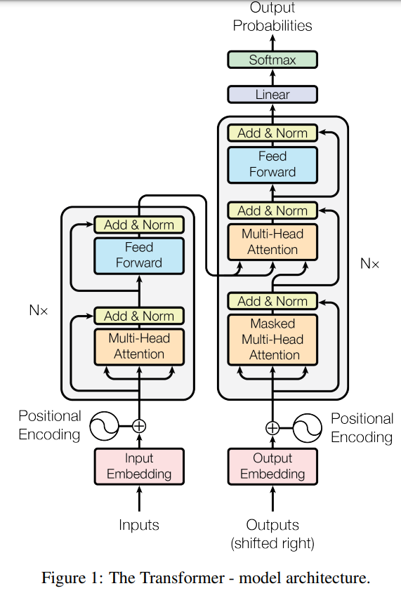
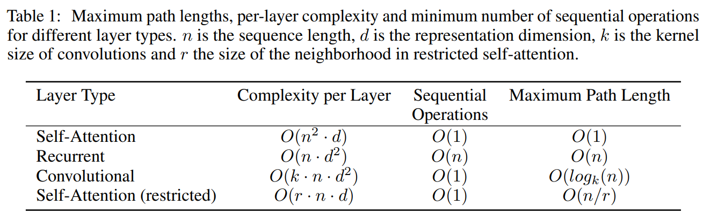

논문 및 이미지 출처 : <https://arxiv.org/pdf/1706.03762.pdf>

# Abstract

우세한 sequence transduction 은 encoder 및 decoder 를 포함한 RNN, CNN 기반으로 한다. 

이를 **attention mechanism** 만 사용하는 **Transformer** 를 제안

- 두 기계번역 task 에서 뛰어난 퀄리티를 보여주는데, 더욱 병렬적이면서도 훈련 시간을 크게 줄임
- WMT 2014 에서 SOTA (ensemble) 보다 2 points 높은 28.4 BLEU 달성 (single model)
- Transformer 가 다른 task 에서도 잘 일반화되는 것을 보여줌

# 1. Introduction

RNN 은 LSTM 및 Gated RNN 등 많은 노력으로 encoder-decoder 아키텍쳐의 경계로 계속 넓혀져 왔다.

- 일반적으로 input 및 output sequences 의 symbol positions 에 따라 계산을 분해
- hidden state $h_t$ 는 이전 $h_{t-1}$ 및 position $t$ 의 input 으로 생성
  - 순차적인 특성으로 인해 병렬화 불가능
  - sequence 길이가 길어질수록 메모리 제약으로 배치 제한

Attention mechanism 은 input 및 output 거리를 고려하지 않고 종속성을 모델링할 수 있게 해주어 다양한 task 에서 필수적이게 되었지만, 대부분 RNN 과 함께 사용한다.

본 연구에서는 RNN 을 배제하고 완전히 attention mechanism 에만 의존하여 input 과 output 사이의 global dependencies 를 도출하는 **Transformer** 제안

- 병렬화를 허용
- 8개 P100 GPU 에서 12시간 훈련만으로 SOTA

# 2. Background

순차 계산을 줄이기 위해 CNN 을 사용한 연구 [Extended Neural GPU, ByteNet, ConvS2S]가 있었으며, input 및 output position 에 대해 병렬로 hidden representation 을 계산하지만, 필요한 연산 수가 위치 간의 거리에 따라 증가한다.

- ConvS2S 의 경우 선형적으로, ByteNet 의 경우 로그함수적으로 증가
- Transformer 는 이를 일정 수 감소시키지만, averaging attention-weighted positions 로 인해 resolution 이 감소하는 효과가 있는데, 이는 Multi-head Attention 으로 상쇄시킨다.

Self-attention 은 서로 다른 위치를 관련시켜 sequence 의 representation 을 계산하는 attention mechanism

- reading comprehension, abstractive summarization, textual entailment 및 tkas-independent sentence representation 등 다양한 task 에서 성공

End-to-End memory networks 는 sequence-aligned recurrence 대신 recurrent attention mechanism 을 기반으로하며, simple-language question answering 과 language modeling task 에서 잘 수행한다.

하지만 Transformer 는 sequence-aligned RNN 및 CNN 을 사용하지 않고 input 및 output representation 계산을 완전히 self-attention 에만 의존하는 최초의 transduction model

# 3. Model Architecture

경쟁력 있는 sequence transduction model 은 encoder-decoder 구조를 갖고 있다.

- encoder : symbol representations input sequence $(x_1, \dots, x_n)$ 을 continuous representations sequence $z = (z_1, \dots, z_n)$ 로 매핑
- decoder : 각 단계에 하나씩 symbol output sequence $(y_1, \dots, y_m)$ 생성
- 각 단계에서 model 은 auto-regressive 하며, 다음 생성 때 이전에 생성된 symbols 를 추가 입력으로 사용
- Transformer 는 위 아키텍처를 따르며, encoder 및 decoder 에 stacked self-attention 및 point-wise, fully connected layer 를 사용

# 3.1 Encoder and Decoder Stacks

### Encoder

encoder 는 $N = 6$ 의 동일한 layer stack 으로 구성된다.

- 각 layer 는 두 개의 sub-layers 로 구성
  1. **multi-head self-attention**
  2. **position-wise fully connected feed-forward network**
- 각 sub-layer 에 **residual connection** 사용하고, 그 다음 **layer normalization** 수행
- 각 sub-layer 의 출력은 $\text{LayerNorm}(x + \text{Sublayer}(x))$
  - $\text{Sublayer}(x)$ : sub-layer
- residual connection 을 용이하게 하기 위해 모델 내의 all sub-layers 및 embedding layers 는 output dimension $d_{\text{model}} = 512$ 생성

### Decoder

decoder 또한 $N = 6$ 의 동일한 layer stack 으로 구성된다.

- encoder layer 와 같은 two sub-layers 에 추가 third sub-layer 삽입
  - 이는 encoder stack 의 output 에 대해 **multi-head attention** 수행
  - encoder 와 유사하게, 각 sub-layer 에 residual connection 및 layer normalization 사용
  - decoder stack 의 self-attention 을 수정하여 position 이 subsequent position 에 attending 하는 것을 방지
    - 이 masking 은 output embedding 이 한 위치 만큼만 offset 되어, position $i$ 에 대한 예측을 $i$ 보다 적은 이전 position 정보만 사용할 수 있도록 보장

## 3.2 Attention

Attention function 은 query 및 key-value 쌍들을 output 으로 mapping 하는 함수다.

- query, key, value : 모두 vector
- output : weighted sum of values
- 각 value 에 할당된 weight 는 상응하는 key 와의 호환성 함수 (compatibility function)에 의해 계산됨

### 3.2.1 Scaled Dot-Product Attention

저자는 이 특정 attention 을 **Scaled Dot-Product Attention** 이라 한다. (Fig. 2)

- input 은 dimension $d_k$ 의 queries 및 keys, dimension $d_v$ 의 values 로 이루어짐
- all keys 와 query 에 dot product 를 계산하고, 각각 $\sqrt{d_k}$ 로 나누고 softmax 함수를 적용하여 values 에 대한 weight 를 얻는다.

저자는 queries 를 하나의 matrix $Q$ 로 묶어 attention function 계산한다.

keys 및 values 또한 matrix $K$ 및 $V$ 로 묶어서 계산한다.

다음 output matrix 를 계산한다.

$$
\begin{equation}
  \text{Attention}(Q, K, V) = \text{softmax}(\frac{QK^T}{\sqrt{d_k}})V
\end{equation}
$$

일반적으로 사용되는 attention functions 은 additive attention 과 dot-product (multi-plicative) attention 이다.

- Dot-product attention : 저자의 알고리즘과 동일하지만, scailing 인자 $\frac{1}{\sqrt{d_k}}$ 가 다르다
- Additive attention : single hidden layer 인 feed-forward network 를 사용하여 compatibility function 계산

위 두 메커니즘은 이론적 복잡성은 비슷하지만, dot-product attention 은 고도로 최적화된 matrix multiuplication code 를 사용하여 구현되기 때문에 훨씬 더 빠르고 공간 효율적이다.

small values $d_k$ 에 대한 두 메커니즘은 유사한 성능을 발휘하지만, larger valuyes $d_k$ 에 대한 scaling 없이 사용하는 additive attention 은 dot-product 보다 우월하다.

저자는 large values $d_k$ 에 대해 dot-product 가 매우 큰값을 갖게되어, softmax function 을 extremely small gradients 를 갖도록 하기 위해 dot-product 를 $\frac{1}{\sqrt{d_k}}$ 로 scaling 한다.

### 3.2.2 Multi-Head Attention

$d_{\text{model}}$ dimensional keys, values, queries 로 single attension function 을 수행하는 대신, 저자는 learned linear projections 을 사용하여 $d_k$, $d_k$ 및 $d_v$ dimensions 으로 queries, keys 및 values 를 $h$ 번 linearly project 하는 것이 유익한 것을 발견

이러한 projected queries, keys 및 values 각각에 대해 병렬로 attention function 을 수행하여 $d_v$ dimensional output values 를 얻는다.

이후 이들을 연결(concatenated)하고 다시 한 번 project 하여 Fig. 2 처럼 최종값을 얻는다.

Multi-head attention 은 서로 다른 representation subspaces 에서 서로 다른 position 에서 정보를 공동으로 attend 하도록 한다.

single attention head 의 경우, 평균화로 이를 억제한다.

$$
\begin{align*}
  \text{MultiHead}(Q,K,V) &= \text{Concat}(\text{head}_1, \dots, \text{head}_h) W^O \\
  \text{where} \ \text{head}_i &= \text{Attention}(QW^Q_i, KW^K_i, VW^V_i)
\end{align*}
$$

- projections 은 parameter matrices $W_i^Q \in \mathbb{R}^{d_\text{model} \times d_k}, W_i^K \in \mathbb{R}^{d_\text{model} \times d_k}, W_i^V \in \mathbb{R}^{d_\text{model} \times d_v}$
- 본 연구에선 parallel attention layer 또는 heads 로 $h = 8$ 을 사용
- 각 head 는 $d_k = d_v = d_{\text{model}}/h = 64$ 를 사용
- 각 head 의 차원이 축소되었기 때문에, 총 계산 비용은 전체 차원의 single-head attention 과 유사

### 3.2.3 Applications of Attention in our Model

Transformer 는 multi-head attention 을 세 가지의 다른 방식을 사용

- encoder-decoder attention layers 에서, query 는 previous decoder layer 에서 가져오고, memory key 와 value encoder 의 output 에서 가져온다. 이를 통해 decoder 의 각 position 이 input sequence 의 all positions 에 attend 를 줄 수 있다. 이는 sequence-to-sequence 의 전형적인 encoder-decoder attention machanism 을 모방한다.
- encoder 는 self-attention layer 를 포함한다. self-attention layer 에서 모든 keys, values 및 queries 는 동일한 위치를 가져온다. 이 경우엔 이전 encoder layer 의 output 이다. encoder 의 각 위치는 이전 encoder layer 의 모든 위치에 attend 할 수 있다.
- decoder 의 self-attention layer 는 decoder 의 각 위치가 해당 위치를 포함한 decoder 의 모든 위치에 attend 할 수 있다. self-attention 의 leftward information flow 를 방지하여 auto-regressive 속성을 보존해야 한다. 저자는 scaled dot-product attention 내부에서 softmax 의 입력에 대한 모든 값 중 잘못된 연결에 해당하는 값을 masking out ($-\infin$ 로 설정)하여 이를 구현. (Fig. 2)

## 3.3 Position-wise Feed-Forward Networks

attention sub-layers 외에도 encoder 및 decoder 의 각 레이어는 각 위치에 대해 별도로 동일하게 적용되는 fully connected feed-forward network 를 포함

이는 two linear transformations 과, 사이에 ReLU activation 을 사용한다.

$$
\begin{equation}
  \text{FFN}(x) = \max(0, xW_1 + b_1)W_2 + b_2
\end{equation}
$$

- linear transformations 는 여러 position 에서 동일하지만 layer 마다 서로 다른 parameters 를 사용
  - 이를 설명할 방법으로, kernel size 1 인 two convolution 으로 표현할 수 있다.
- input 및 output 차원은 $d_\text{model} = 512$ 이며, inner-layer 의 차원은 $d_{ff} = 2048$

## 3.4 Embedding and Softmax

- 다른 sequence transduction model 과 유사히게, input tokens 을 차원 $d_\text{model}$ 인 vector 로 변환하기 위해 learned embedding 사용
- 또한 decoder output 을 predicted next-token 확률로 변환하기 위해 learned linear transformation 과 softmax function 사용
- 이 모델에선, two embedding layers 와 pre-softmax linear transformation 사이에 same weight matrix 를 공유한다.
  - embedding layers 에서는 해당 weights 를 $\sqrt{d_\text{model}}$ 로 곱한다.

## 3.5 Positional Encoding

이 모델에는 recurrence 와 convolution 이 없기 때문에 sequence 의 순서를 사용하기 위해 sequence 내의 토큰의 상대적 또는 절대적 위치에 대한 정보를 주입해야 한다.

이를 위해 encoder 와 decoder stacks 의 아래쪽에 **positional encodings** 를 추가한다.

positional encodings 의 차원은 embedding $d_\text{model}$ 과 동일하므로 두 값을 합할 수 있다.

learned 및 fixed 여러 positional encodings 선택지가 있다.

$$
\begin{align*}
  PE(pos, 2i) &= sin(pos / 10000^{2i / d_\text{model}}) \\
  PE(pos, 2i + 1) &= cos(pos / 10000^{2i / d_\text{model}})
\end{align*}
$$

- $pos$ : position, $i$ : dimension
  - 즉 positional encoding 의 각 차원은 사인 함수에 해당
  - 파장은 $2\pi$ 에서 $10000 \cdot 2\pi$ 까지 기하급수적 진행을 형성
  - fixed offset $k$ 에 대해 $PE_{pos + k}$ 를 $PE_{pos}$ 의 linear function 으로 표현할 수 있기 때문에 모델이 상대적 위치를 쉽게 attention 할 수 있다는 가설을 세움
  - 또한 learned positional encoding 을 사용하여 실험했으며, 두 버전이 거의 동일한 결과를 내는 것을 발견 (Table 3. E)
  - 저자는 사인 함수 버전을 택했는데, 이는 모델이 학습 중 long sequence 를 추론할 수 있기 때

# 4. Why Self-Attention

symbol representations 의 한 variable-length sequence $(x_1, \dots, x_n)$ 를 다른 같은 길이의 sequence $(z_1, \dots, z_n)$ 로 매핑하는데 사용되는 recurrent 및 convolutional layers 와 self-attention layers 를 다양한 측면에서 비교

이러한 sequence 는 sequence transduction encoder 또는 decoder 의 hidden layer 같은 것으로, $x_i, z_i \in \mathbb{R}^d$

self-attention 은 다음 세 가지 요구 사항을 고려

- layer 당 총 계산 복잡성
- 병렬화할 수 있는 계산 양
- network 내의 long-range dependencies 사이의 path length

long-range dependencies 를 학습하는 것은 sequence transduction tasks 에서 어려운 과제다.

- 이러한 dependencies 를 학습할 수 있는 능력에 미치는 요소 중 하나는 network 에 forward 및 backward signals 가 이동하는 path length 이다.
- input 및 output sequences 의 모든 positions combination 간의 이러한 path 가 짧을수록 long-range dependencies 를 학습하기가 쉽다.
- 따라서 저자는 서로 다른 layer 유형으로 구성된 network 내에 two input 및 output position 간의 maximum path length 도 비교한다.

Table 1 과 같이, self-attention layer 는 모든 position 을 일정한 수의 sequential operations 로 연결하는 반면, recurrent layer 는 $O(n)$ 의 sequential operations 이 필요

- 계산 복잡성 측면에서, sequence length $n$ 이 representation dimension $d$ 보다 작은 경우 recurrent layers 보다 빠르다.
- very long sequence 를 처리하는 tasks 의 계산 성능을 향상시키기 위해 self-attention 을 input sequence 의 해당 output position 을 중심으로 size $r$ 의 이웃만 고려하도록 제한 가능
  - 이렇게 하면 maximum path length $O(n/r)$ 로 증가
- kernel $k < n$ 인 single convolutional layer 는 input 및 output 의 all paies 를 연결하지 않는다.
  - contiguous kernels 의 경우 $O(n/k)$ 개 convolution layers
  - dilated convolution 의 경우  $O(log_k(n))$ 개 스택 필요
  - 이는 network 내의 two positions 간의 longest path 를 증가시킴
  - convolutional layers 는 일반적으로 recurrent layer 보다 비용이 크며, $k$ 의 배수
  - separable convolution 은 복잡성을 $O(k \cdot n \cdot d + n \cdot d^2)$ 으로 상당히 줄이지만, $k = n$ 인 경우에 복잡성은 self-attention 과 point-wise feed-forward layers 의 복잡성과 동일

추가로, self-attention 은 해석 가능한 모델을 제공하며, attention distribution 을 조사(appendix 참고)하고 개별 attention heads 는 명확히 서로 다른 작업을 수행하는 것으로 나타나며 많은 attention head 가 문장의 문법 및 의미적 구조와 관련된 동작을 보인다.

# 5. Training

## 5.1 Training Data and Batching

약 4.5M 의 sentence pairs 를 가진 WMT 2014 English-German dataset 에서 훈련

- 문장은 byte-pair encoding 을 사용하여 인코딩되어 있으며, 약 37000 tokens 의 source-target vocabulary 를 갖는다.
- English-French 의 경우, 36M 문장의 더 큰 2014 English-French dataset 사용, 32000 word-piece vocabulary 의 token 으로 분할
- sentence pairs 은 sequence length 별로 배치됨
- 각 training batch 에는 약 25000 source tokens 및 25000 target tokens 이 포함

## 5.2 Hardware and Schedule

- 8 NVIDIA P100 GPUs 로 모델 훈련
- 각 훈련 단계는 약 0.4초 소요
- 100,000 steps 또는 12 시간 훈련
- 대형 모델의 경우, step 당 1.0 초 소요되며, 300,000 steps (3.5일) 흔련

## 5.3 Optimizer

- Adam optimizer 를 사용했으며, $\beta_1 = 0.9, \beta_2 = 0.98$ 및 $\epsilon = 10^{-9}$ 설정
- 훈련 동안 learning rate 를 조정했으며, 다음 수식에 따라 조정

$$
\begin{equation}
  lrate = d_{\text{model}}^{-0.5}\cdot \min (step\_ num^{-0.5},step\_ num\cdot warmup\_ steps^{-1.5})
\end{equation}
$$

- 첫 $warmup\_ steps$ training steps 에 대한 learning rate 를 linear 하게 증가시키고, step number 의 역 제곱근에 비례하여 감소시킨다.
- $warmup\_ steps = 4000$

## 5.4 Regularization

training 중 세 가지 regularization 사용

#### Residual Dropout

각 sub-layer 의 output 에 dropout 적용

input 에 추가되기 전에 normalize 진행

또한 encoder-decoder stacks 의 embedding 및 positional embedding 의 합에도 dropout 적용

base model 에 $P_{drop} = 0.1$ 사용

#### Label Smoothing

training 중 label smoothing value $\epsilon_{ls} = 0.1$ 사용

이는 더 불확실해지도록 학습되기 때문에 perplexity 에 해를 끼친다.

하지만 accuracy 와 BLEU score 는 향상시킨다.

# 6. Results

## 6.1 Machine Translation

- WMT 2014 English-to-German task 의 경우
  - big transformer model (Table 2) 은 이전의 모든 모델 (앙상블 포함)보다 2.0 BLEU 이상의 성능 및 SOTA 성능의 BLEU 28.4 달성
  - 훈련은 8 P100 GPUs 에서 3.5 일 걸림
  - base model 도 이전 모든 모델 및 앙상블을 능가하며, 경쟁 모델 중 어느 것보다 적은 훈련 비용을 이룸
- WMT 2014 English-to-French task 의 경우
  - big model 이 BLEU 41.0 을 달성하여 모든 single model 보다 우수한 성능을 보여줌
  - 이전 SOTA 의 훈련 비용 1/4 에 불과
  - 해당 task 를 위해 훈련된 Transformer (big) 은 dropout rate $P_{drop} = 0.1$ 사용
- base model 의 경우
  - 마지막 5개의 checkpoint 를 평균화하여 single model 을 사용했으며, 10분 간격으로 기록됨
- big model 의 경우
  - 마지막 20개의 checkpoint 를 평균화
  - beam size 4
  - length penalty $\alpha = 0.6$
  - 추론 중 input length + 50 을 설정했지만, 가능한 경우 early stop
- Table 2 에서 결과를 요약하며, 번역 품질 및 훈련 비용을 비교
  - 저자의 모델이 훈련 시간, 사용 GPU 수 및 각 GPU 의 floating-point capacity 의 추정치를 곱하여 계산

## 6.2 Model Variations

Transformer 의 다양한 components 의 중요성을 평가하기 위해, 다양한 방식으로 변형하고, nettest2013 의 English-to-German dev set 에서 성능 변화 측정

- beam search 를 사용했지만 checkpoint 펻균화는 사용하지 않음
- (A) 행에서 attention head 수와 attention key 및 value dimensions 를 변화시키며 계산 양을 일정하게 유지했다.
  - single-head attention 은 best setting 보다 BLEU 0.9 더 나쁘지만, many head 또한 품질을 저하시킨다.
- (B) 에선 attention key 크기를 줄이면 모델 품질이 저하된다.
  - 이는 호환성을 결정하는 것이 쉽지 않으며, dop product 보다 더 정교한 호환성 함수가 유익할 수 있음을 시사
- (C) 및 (D) 행에선 큰 모델이 더 좋으며, dropout 이 과적합을 피하는데 도움이 됨을 관찰
- (E) 행에선 저자의 sinusodial encoding 을 learned positional embedding 으로 대체하여 base model 과 거의 동일한 결과를 관찰

## 6.3 English Constituency Parsing

Transformer 가 다른 tasks 에 대해 일반화될 수 있는지 평가하기 위해 영어로 구성된 parsing tasks 에 실험 수행

이 task 는 specific challenge 를 제공: output 은 strong structural contraints 를 따르며 input 훨씬 길기 때문. 게다가 RNN sequence-to-sequence model 은 small-data 체제에서 SOTA 를 얻지 못함

- Penn Treebank 의 WSJ 부분에서 40K training sentences 를 사용하여 $d_{model} = 1024$ 인 4-layer transformer 를 훈련
- 약 17M sentences 가 있는 larger high-confidence 및 BerkleyParser corpora 를 사용한 semi-supervised setting 도 훈련
- WSJ 을 대상으로 하는 설정에선 16K tokens 의 vocabulary 를 사용했으며, semi-supervised setting 에서는 32K tokens 의 vocabulary 사용

저자는 22 dev set 에서 dropout, attention 및 residual, learning rate 및 beam search 를 선택하기 위해 일부 실험한 수행

다른 모델 매개변수는 English-to-German base translation model 과 동일하게 유지

inference 중 maximum output length + 300 으로 증가시키고, WSJ 만 대상으로 하는 설정과 semi-supervised learning 설정 모두 beam search 21 및 $\alpha = 0.3$ 사용

- task-specific tuning 없는 경우에도 잘 수행되어, 이전의 모든 모델보다 우수한 결과를 얻었다.
- RNN sequence-to-sequence model 과 달리, transformer 는 40K setences 만 훈련시켰을 때도 BerkeleyParser 를 능가

# 7. Conclusion

본 연구에선 **Transformer** 제안

- 완전히 attention 에 기반한 sequence transduction model 로, encoder-decoder 아키텍처에서 가장 일반적인 recurrent layers 를 multi-head attention 으로 대체
- translation tasks 에서 Transformer 는 recurrent 또는 convolutional layers 아키텍처보다 훨씬 빠르게 훈련될 수 있다.
- WMT 2014 English-to-German 및 WMT 2014 English-French translation task 에서 SOTA 달성. 심지어, 앙상블도 능가

# Appendix

**Attention Visualizations**

