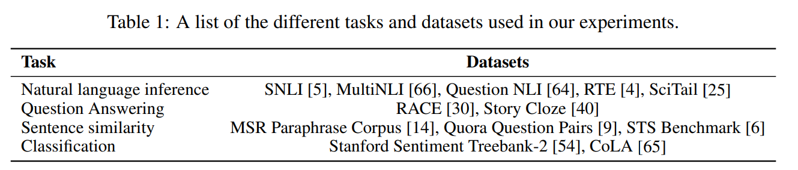
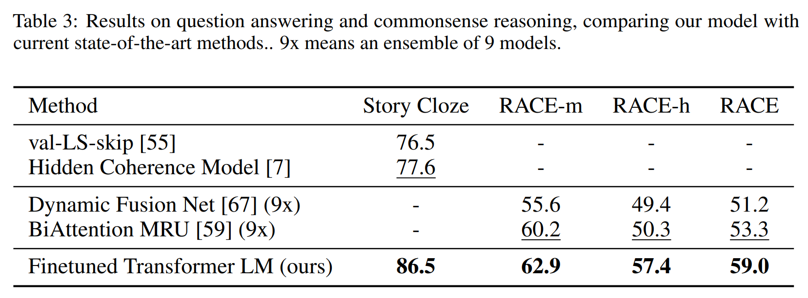

논문 및 이미지 출처 : <https://www.mikecaptain.com/resources/pdf/GPT-1.pdf>

# Abstract

Natural language understanding (NLU) 은 textual entailment, question answering, semantic similarity assessment 및 document classification 등으로 구성

large unlabeled text corpora 는 풍부하지만, 학습하기 위한 labeled data 는 희소하다. 이는 개별 trained model 이 적절하게 수행하기 어렵게 한다.

저자는 unlabeled text 의 다양한 corpus 에 대한 _generative pre-training_ 을 통해 큰 이득을 얻음을 보여주며, 각 specific task 에 대한 _discriminative fine-tuning_ 을 수행한다.

- 이전 방식과 달리, fine-tuning 중 task 에 대한 task-aware input transformation 을 활용하여 effective transfer 을 달성하며 model architecture 를 최소한으로 변경
- NLU benchmarks 에 대한 저자의 접근법의 효과를 입증
- 저자의 general task-agnostic model 은 각 task 데 특화된 아키텍처를 사용하는 학습된 모델보다 우수한 성능을 보임
- 결과, 12 tasks 중 9 tasks 에서 SOTA 보다 크게 개선
  - commonsense reasoning (Stories Cloze Test) 8.9%, question answering (RACE) 5.7%, textual entailment (MultiNLI) 1.5% 향상 달성

# 1. Introduction

raw text 에서 효과적인 학습은 NLP 에서 supervised learning 의존을 완화하는 데 중요하지만, 상당한 양의 manual labeled data 가 필요하며, 이는 부족한 domain 적용을 제한하게 된다.

이에 unlabeled data 에서 linguistic information 을 활용할 수 있는 모델은 추가 주석 수집이 대안이지만, 시간 소모와 비용이 발생한다. 게다가 상당한 supervision 이 제공되는 경우에도 unlabeled 방식으로 좋은 표현을 학습하는 것이 성능 향상에 도움이 될 수 있다. 이런 증거는 pre-trained word embedding 을 사용하여 다양한 NLP task 의 성능을 개선한 것이다.

하지만 unlabeled text 의 word-level information 을 활용하는 것은 두 이유로 어렵다.

- 어떤 유형의 optimization objectives 가 transfer 에 효과적인지 명확하지 않음
  - 최근 language modeling, machine translation 및 discourse coherence 같은 다양한 objectives 를 고려하며, 각 방법은 서로 다른 task 에서 outperforming 함
- learned representations 를 target task 로 transfer 하는 효과적인 방법에 대한 일치된 의견이 없음
  - 기존 기술은 모델 아키텍처에 대한 task-specific changes, intricate learning schemes 및 adding auxiliary learning 을 결합한다. 이런 불확실성으로 언어 처리를 위한 효과적인 semi-supervised learning 개발이 어려워짐

본 논문은 unsupervised pre-training 및 supervised fine-tuning 의 조합을 사용하여 language understanding tasks 에 대한 semi-supervised approach 를 탐구

- 목표는 넓은 범위의 task 에 대해 little adaptation 을 transfer 하는 universal representration 을 학습하는 것
  - unlabeled text 의 large corpus 및 수동 주석이 있는 training examples 가 포함된 여러 데이터셋 (target tasks)에 접근
  - 이 설정은 target task 가 unlabeled corpus 와 동일한 domain 에 있어야 하는 것을 요구하지 않음
- 저자는 two-stage training procedure 사용
  1. unlabeled data 에 대한 language modeling objective 를 사용하여 neural network model 의 initial parameters 를 학습
  2. 이후 supervised objective 를 사용하여 target task 에 맞게 parameter adapting

저자는 _Transformer_ 를 사용

- Transformer 는 machine translation, document generation 및 syntactic parsing 과 같은 다양한 task 에서 강력한 성능 발휘
- 이 모델은 text 의 long-term dependencies 를 처리하기 위해 structured memory 를 제공하여 recurrent 과 비교하여 다양한 task 에서 robust transfer 제공
- transfer 중, traversal-style approches 에서 파생된 task-specific input adaptations 를 활용하며, 이러한 adaptations 는 structured text input 을 tokens 의 contiguous sequence 로 처리
- 실험에서 증명하며, 이러한 adaptations 는 pre-trained model 의 아키텍처를 minimal changes 로 효과적인 fine-tuning 을 가능케함

language understanding tasks 의 네 가지 유형 - natural language inference, question answering, semantic similarity 및 text classification 에서 평가

- general task-agnostic model 은 각 task 의 특별히 설계된 아키텍처를 사용한 trained model 보다 우수한 성능 보임
- 연구 결과, 12 tasks 에서 9 tasks 에서 SOTA 를 크게 개선
  - commonsense reasoning (Stories Cloze Test) 8.9%, question answering (RACE) 5.7%, textual entailment (MultiNLI) 1.5% 향상 달성
  - GLUE benchmark 5.5% 개선 달성
  - pre-trained model 의 zero-shot 동작을 분석하고, 다른 네 가지 설정에서 linguistic knowledge 를 획득함을 보여줌

# 2. Related Work

#### Semi-supervised learning for NLP

저자의 연구는 natural language 에 대한 semi-supervised 범주에 넓게 속함

- 이는 sequence labeling 또는 text  classification 같은 task 에 응용
- 초기 접근법ㅇ은 unlabeled data 를 사용하여 word-level 또는 phrase-level statistics 를 계산한 다음 이를 supervised model 의 특성으로 사용
- 몇 년간 unlabeled corpora 에서 훈련된 word embedding 을 사용하여 다양한 task 의 성능을 개선하는 이점을 입증
- 이는 word-level 의 information 을 transfer 하지만, 저자는 higher-level emantics 의 의미를 포착하는 것이 목표

최근 unlabeled data 에서 word-level semantics 이상의 의미를 학습하고 활용하는 것을 조사. Phrase-level 또는 sentence-level embeddings 는 다양한 target tasks 를 위해 text 를 suitable vector representations 로 인코딩하는 데 사용

#### Unsupervised pre-training

good initialization point 를 찾는 것을 목표로하는 semi-supervised learning 의 경우.

이는 image classification 및 regression tasks 에 사용되었으며, 이후 pre-training 이 deep neural network 에서 더 나은 generalization 을 가능하게 하는 정규화 체계로 작용하는 것을 입증했다.

저자의 연구와 가까운 연구는 language modeling objective 를 사용하여 neural network 를 pre-training 한 후 supervision 이 있는 target task 에 fine-tuning. 하지만 pre-training 단계가 linguistic information 을 일부 포착하는 것을 도와주더라도, LSTM model 의 사용은 예측 능력의 범위를 짧게 제한된다.

반면, Transformer 는 longer-range linguistic structure 를 포착할 수 있도록 해준다. 나아가, natural language inference, paraphrase detection 및 story completion 을 포함한 넓은 범위의 task 에서 효과를 발휘

#### Auxiliary training objectives

auxiliary unsupervised training objectives 를 추가하는 것은 alternative form 이다.

- 초기 연구에 Collobert 및 Weston 은 semantic role labeling 개선을 위해 POS tagging, chunking, named entity recognition 및 language modeling 같은 다양한 auxiliary NLP task 를 사용 
- 최근, Rei 는 target task objective 에 auxiliary language modeling objective 를 추가했으며, sequence labeling task 에서 성능 향상을 보여줌

저자의 실험도 auxiliary objective 를 사용하지만, unsupervised pre-training 은 target tasks 에 관련된 여러 linguistic 측면을 학습

# 3. Framework

저자의 training procedure 는 two stages

1. large corpus 에서 high-capacity language model 을 학습
2. labeled data 로 discriminative task 에 adapting 시키는 fine-tuning stage

## 3.1 Unsupervised pre-training

unsupervised corpus tokens $\mathcal{U} = \{u_1, \dots, u_n\}$ 가 주어졌을 때, standard language modeling objective 를 사용하여 다음과 같이 likelihood 를 maximize

$$
\begin{equation}
    L_1(\mathcal{U}) = \sum_i \log P(u_i|u_{i-k},\dots, u_{i-1};\Theta)
\end{equation}
$$

- $k$ : context window size
- conditional probability $P$ : parameters $\Theta$ 가 있는 neural network 를 사용하여 modeling
  - 이러한 parameters 는 stochastic gradient descent 를 사용하여 훈련

저자의 실험에서는 language modeling 에 대해 multi-layer _Transformer decoder_ 사용

- 이는 Transformer 의 변형
- input context tokens 에 대해 mutli-headed self-attention 연산을 적용한 다음 position-wise feedforward layers 를 통해 target tokens 에 대한 output distribution 생성

$$
\begin{equation}
    \begin{align*}
        h_0 &= UW_e + W_p \\
        h_l &= \text{transformer\_block}(h_{l-1}) \forall i \in [1, n] \\
        P(u) &= \text{softmax}(h_nW_e^T)
    \end{align*}
\end{equation}
$$

- $U = (u_{-k}, \dots, u_{-1})$ : tokens 의 context vector
- $n$ : layers 수
- $W_e$ : token embedding matrix
- $W_p$ : position embedding matrix

## 3.2 Supervised fine-tuning

Eq. 1 의 objective 로 model 을 training 한 후, supervised target task 에 parameters 를 adapting 한다.

각 instance 가 input tokens sequence $x^1, \dots, x^m$ 와 label $t$ 로 구성된 labeled dataset $\mathcal{C}$ 를 가정

input 은 pre-trained model 을 통해 final transformer block 의 activation $h_l^m$ 을 얻고, 이는 $y$ 예측을 위해 추가된 linear output layer $W_y$ 에 주입

$$
\begin{equation}
  P(y|x^1,\dots,x^m) = \text{softmax}(h_l^mW_y).
\end{equation}
$$

그리고 다음과 같은 objective 를 maximize

$$
\begin{equation}
  L_2(\mathcal{C}) = \sum_{(x,y)}\log P(y|x^1,\dots,x^m).
\end{equation}
$$

저자는 fine-tuning 에 language modeling 에 auxiliary objective 을 포함하는 것이 학습에 도움이 되는 것을 발견. 이는 (a) supervised model 의 generalization 을 개선하고 (b) 수렴을 가속도화함으로써 학습을 돕는다.

구체적으로, 다음과 같은 objective 를 optimizing (with weight $\lambda$)

$$
\begin{equation}
  L_3(\mathcal{C}) = L_2(\mathcal{C}) + \lambda * L_1(\mathcal{C})
\end{equation}
$$

전체적으로, fine-tuning 중 필요한 extra parameters 는 $W_y$ 와 delimiter token 의 embeddings 뿐이다.

## 3.3 Task-specific input transformations

- text classification 같은 일부 task 의 경우 위에서 설명한 대로 directly fine-tuning 가능
- question answering 또는 textual entailment 같은 특정 task 는 ordered sentence pairs 나 document, question 및 answer 의 triplets 같은 structured inputs 을 갖는다.
- 저자의 pre-trained model 이 text contiguous sequence 에서 훈련되어, 이러한 tasks 에 적용하려면 일부 수정이 필요
  - 이전 연구에서는 transferred representations 위에 task specific architecture 를 학습하는 것을 제안. 이러한 방식은 상당한 양의 task-specific customization 을 재도입하여 additional architectural components 에 대해 transfer learning 을 사용하지 않는다.
- 저자는 대신에 traversal-style approach 를 사용
  - structured inputs 를 pre-trained model 이 처리할 수 있는 ordered sequence 로 변환
  - 이러한 입력 변환으로 task 간의 architecture 를 광범위하게 변경하지 않고도 task 에 적용할 수 있음 (Fig. 1)
  - all transformations 에는 randomly initialized start 및 end token $<s>, <e>$ 추가

#### Textual entailment

entailment tasks 의 경우, premise $p$ 와 hypothesis $h$ token sequence 를 연결하고, 그 사이에 delimiter token ($) 를 넣는다.

#### Similarity

similarity task 의 경우, 비교되는 두 sentences 의 순서가 별도로 표현되지 않음. 이를 반영하기 위해 input sequence 를 both possible sentence ordering (사이에 delimiter 삽입) 을 포함하도록 수정하고 각각 독립적으로 처리하여 linear output layer 에 주입되기 전에 element-wise 로 추가된 two sequence representations $h_l^m$ 생성

#### Question Answering and Commonsense Reasoning

이러한 tasks 의 경우, context document $z$, question $q$ 및 possible answer set $\{a_k\}$ 가 제공되는데, 각각 추가하여 $[z;q;\$;a_k]$ 를 얻는다.

각 sequence 는 저자의 모델에 독립적으로 처리되고 이후 possible answers 에 대한 output distribution 을 생성하기 위해 softmax layer 를 통해 normalize

# 4. Experiments

## 4.1 Setup

#### Unsupervised pre-training

- 저자는 훈련을 위해 BooksCorpus dataset 사용
  - 어드벤처, 판타지, 로맨스 등 7,000 개의 고유한 미게시 도서 포함
  - 이는 long contiguous text 를 포함하고 있어, generative model 이 long-range information 에 대한 condition 을 학습할 수 있다.
- 비슷한 방식인 ELMo 는 거의 동일한 크기지만, sentence level 에서 섞여 있어 long-range structure 을 파괴한다.
- 저자의 모델은 이러한 corpus 에서 very low token level 의 perplexity 18.4 달성

#### Model specifications

모델은 기존 transformer work 를 따른다.

- masked self-attention heads (768 dimensional states 및 12 attention heads) 가 있는 12-layer decoder-only transformer 를 훈련
- position-wise feed-forward networks 의 경우, 3072 dimensional innter states 사용
- Adam optimization 체계를 사용하며 max learning rate 2.5e-5
  - learning rate 는 처음 2000 updates 동안 linearly increase, cosine schedule 을 사용하여 0 으로 annealing
- contiguous sequences 512 tokens 의 randomly sampled minibatches 64개에서 100 epochs training
- layernorm 이 사용되므로 $N(0, 0.02)$ 의 간단한 weight initialization 로도 충분
- 40,000 개의 병합이 있는 bytepair encoding (BPE) vocabulary 를 사용
- regularization 은 residual, embedding 및 attention drops 0.1 rate
- [Fixing weight decay regularization in adam] 에서 제안된 L2 regularization 의 수정된 버전을 사용하여 all non bias or gain weights 에 대해 $w=0.01$ 설정
- activation function 은 Gaussian Linear Unit (GELU) 사용
- 기존 연구에서 제안된 sinusoidal 버전 대신 learned position embedding 사용
- BooksCorpus 에서 raw text 를 정리하고 일부 punctuation 과 whitespace 를 표준화하고 _spaCy_ tokenizer 를 사용하기 위해 _ftfy_ 라이브러리 사용

#### Fine-tuning details

특정한 명시사항이 없ㅇ면 unsupervised pre-training 의 hyperparameter setting 을 재사용

- classifier 에는 dropout rate 0.1 추가
- 대부분 tasks 에선, learning rate 6.25e-5 및 batch size 32 사용
- 빠르게 fine-tuning 되어 대부분의 경우 3 epoch training 이 충분
- 0.2% training 을 위한 warmup 을 사용하는 linear learning rate decay schedule 사용
- $\lambda$ 는 0.5 설정

## 4.2 Supervised fine-tuning

저자는 natural language inference, question answering, semantic similarity 및 text classification 등 다양한 supervised tasks 에서 실험 수행

이러한 작업은 GLUE 를 사용할 수 있으며, Table 1 에 all tasks 및 dataset 제공

#### Natural Language Inference

natural language inference (NLI) task 은 sentence pair 을 읽고 그 사이의 _entailment_, _contradiction_ 및 _neutral_ 관계를 추론하는 것

이는 여러가지 현상 (어휘적 함축, 공통 참조, 어휘 및 문법적 모호성 등)이 있어 어렵다.

저자는 image captions (SNLI), transcribed speech, popular fiction 및 government reports (MNLI), Wikipedia articles (QNLI), science exames (SciTail) 및 news articles (RTE) 에서 평가

- 5 dataset 중 4 가지에서 baseline 능가
  - MNLI 1.5%, SciTail 5%, QNLI 5.8% 및 SNLI 0.6%
- RTE (2490 example) 에서 59% 달성했으며
- larger NLI dataset 에서 저자의 성능을 고려하면, multi-task training 에서도 이점이 될 것으로 보임

#### Question answering and commonsense reasoning

single 및 multi-sentence reasoning 측면을 필요로 하는 또 다른 task 는 question answering

- 중고등학교 시험의 영어 단락과 관련 질문이 포함된 RACE dataset 을 사용
  - 이 corpus 는 CCN 및 SQuAD 같은 dataset 보다 추론 유형의 질문이 많아 훈련을 통해 long-range contexts 처리를 할 수 있게 한다.
- Story Cloze Test 에서도 평가
  - 이 task 는 두 옵션 중 multi-sentence stories 의 correct ending 을 선택
- 위 작업에서 이전의 SOTA 보다 큰 폭으로 능가
- Story Cloze 8.9%, RACE 5.7% 향상

이로서 long-range contexts 를 효과적으로 처리하는 능력을 보여줌

#### Semantic Similarity

Semaintic similarity (or paraphrase detection) task 는 two sentences 가 의미적으로 동등한지 여부를 예측

이 task 의 어려움은 개념적 표현을 인식하고 부정의 이해, 그리고 구문적 모호성 처리에 있다.

- 3 dataset 인 Microsoft Paraphrase corpus (MRPC), Quora Question Pairs (QQP) 및 Semantic Textual Similarity (STS-B)
- STS-B 1% 향상
- QQP 에서는 성능 차이가 상당
- Single-task BiLSTM + ELMo + Attn 에 비해 4.2% 향상

#### Classification

classification task 에 대한 두 가지에 평가 

- Corpus of Linguistic Acceptability (CoLA) : sentence 가 문법적인지 아닌지 평가하며 고유한 언어적 편견을 테스트
- Stanford Sentiment Treebank (SST-2) : standard binary classification task
- 이전 SOTA 인 35.0 을 큰 폭으로 45.4 기록
- SST-2 에서 91.3% 달성하여 SOTA 와 competitive
- GLUE 에서 전체 score 72.8 달성하여 이전 SOTA 인 68.9 보다 훨씬 우수
- 전반적으로, 12 dataset 중 9개 에서 SOTA 달성하며 앙상블도 능가
- small STS-B (약 5.7K training examples) 및 large SNLI (약 550K training examples) 까지 다양하게 잘 작동

# 5. Analysis

#### Impact of number of layers transferred

저자는 unsupervised pre-training 에서 supervised task 로 다양한 수의 layer 를 transferring 하는 영향 관찰

- Fig. 2 left : MultiNLI 및 RACE 에서 저자의 성능을 transferred layers function 으로 나타낸다.
  - transferring embedding 이 성능을 향상시키고 각 transformer layer 가 MultiNLI 에서 full transfer 에 대해 9% 까지 추가 이점을 제공
  - 이는 pre-trained model 의 각 layer 가 target tasks 해결에 유용하다는 것

#### Zero-shot Behaviors

transformers 의 pre-training 효과를 이해해보자. 기본 generative model 이 language modeling 능력 향상을 위해 평가한 많은 task 를 수행하는 것을 배우며 이는 transformer 의 structured attention memory 가 LSTM 보다 더 transferring 을 지원한다는 가설을 세운다.

저자는 supervised fine-tuning 없이 task 를 수행하는 generative model 의 heuristic solutions 설계하고, generative pre-training 의 heuristic solutions 의 효과를 시각화한다. (Fig. 2 right)

- 이러한 heuristic 의 성능은 안정적이며 꾸준히 향상되는 것이 관찰되며, generative pretraining 이 다양한 task 의 기능을 학습하는 데 도움이 됨을 시사
- LSTM 의 zero-shot 성능이 더 높은 분산을 나타내며 transfer 에서 transformer architecture 의 inductive bias 가 도움이 되는 것을 관찰
- COLA 의 경우 (linguistic acceptability), examples 는 generative model 이 할당하는 average token log-probability 로 점수를 매기며 predictions 는 임계값을 기준으로 함
- SST-2 의 경우 (sentiment analysis),  각 examples 에 token _very_ 를 추가하고 model 의 output distribution 에 _positive_ 와 _negative_ word 로 제한하고 higher probability 를 할당하는 token 을 예측
- RACE (question answering) 의 경우, 문서와 질문을 조건으로 할 때 model 이 average token log-probability 가 가장 높은 답변을 선택
- DPRD (winograd schemas) 의 경우, 정해진 대명사를 두 가지 positive referrents 로 대체하고 예측. 대체 후 sequence 의 나머지에 higher average token log-probability 할당

#### Ablation studies

세 가지 ablation study 수행 

1. fine-tuning 중 auxiliary LM objective 없이 저자의 방법의 성능 조사
   - auxiliary objective 가 NLI 및 QQP task 에 도움이 됨을 관찰
   - 전반적으로 larger dataset 이 auxiliary objective 에서 이득을 얻지만 smaller dataset 에서는 그렇지 않음을 시사
2. 동일한 프레임워크를 사용하여 Transformer 와 single layer 2048 unit LSTM 과 비교하여 transformer 의 효과 분석
   - LSTM 사용 시, 5.6 average score drop 을 관찰
   - LSTM 은 MRPC 에서만 transformer 능가
3. pre-training 없이 supervised target tasks 에 직접 transformer 비교
   - pre-training 부재가 all tasks 에 성능을 해치는 것을 관찰했으며, full model 과 비교하여 14.8% 감소

# 6. Conclusion

저자는 single task-agnostic model 을 generative pre-training 및 discriminative fine-tuning 을 통해 strong natural language 이해를 달성하기 위한 프레임워크 소개

- contiguous text 의 긴 텍스트로 pre-training 수행함으로써 모델은 world knowledge 와 long-range dependencies 처리 능력을 습득하고 이를 해결하기 위해 효과적으로 transfer
- question answering, semantic similarity assessment, entailment determination 및 text classification 같은 discriminative task 를 해결하는 데 성공
- 12 dataset 중 9개에서 SOTA 달성
- 성능 향상이 가능했으며, Transformer 와 dataset (long range dependencies text)가 잘 작동하는지에 대한 힌트 제공
- unsupervised learning 이 어떻게 작동하는지에 대한 이해를 더욱 개선