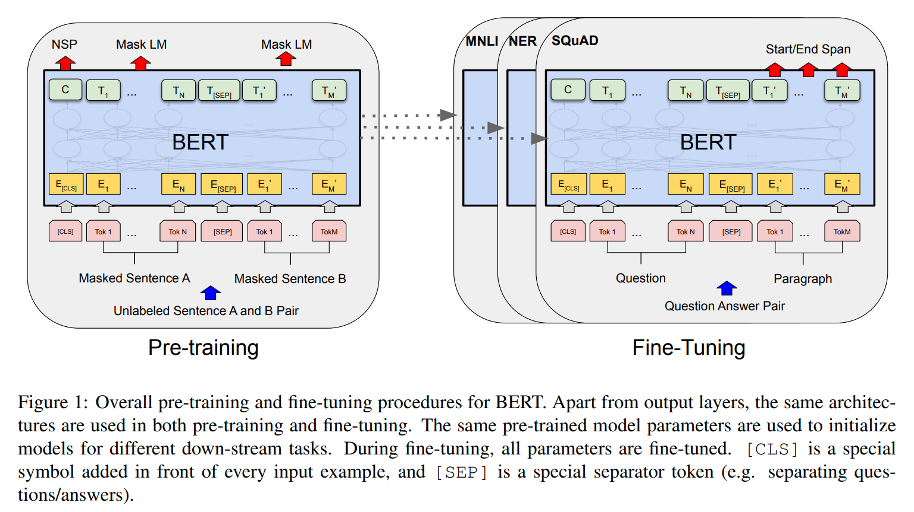
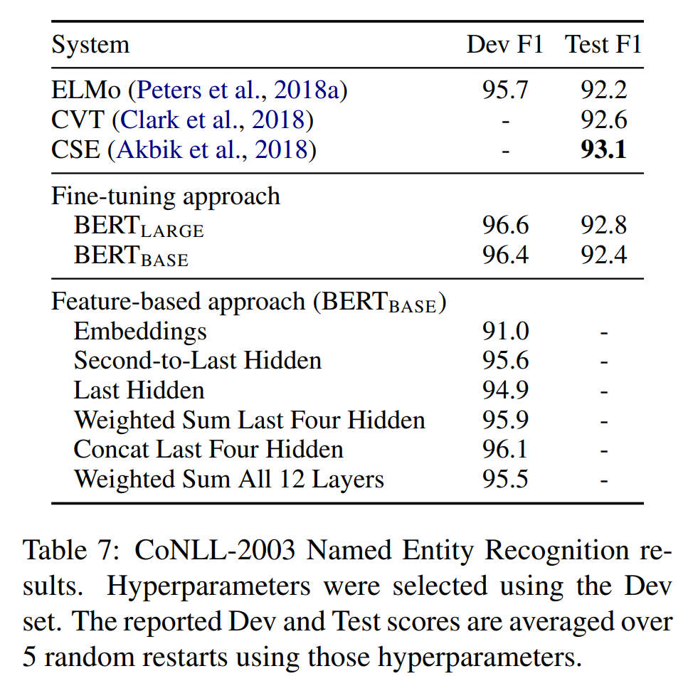

논문 이미지 및 출처 : <https://arxiv.org/pdf/1810.04805.pdf>

# Abstract

저자는 **B**idirectional **E**ncoder **R**epresentations from **T**ransformers 의 약자 **BERT** 라는 new language representation model 을 소개

최근 language representation model 과 달리, BERT 는 all layer 에서 left 와 right context 를 모두 공동으로 conditioning 함으로써 unlabeled text 로부터 deep bidirectional representations 를 pre-training 하기 위해 설계

결과, pre-trained BERT 는 additional output layer 하나만으로도 question answering 및 language inference 같은 다양한 task 에 대해 SOTA model 을 만들기 위해 특정 아키텍처 수정 없이 fine-tuning 이 가능하다.

- BERT 는 개념적으로 간단하면서 경험적으로 강력
- GLUE score 80.5% (7.7% point 향상)
- MultiNLI accuracy 86.7% (4.6% point 향상)
- SQuAD v1.1 question answering test F1 93.2% (1.5% point 향상)
- SQuAD v2.0 test F1 83.1% (5.1% 향상)

11 가지의 NLP task 에서 SOTA 달성

# 1. Introduction

Language model pre-training 은 다양한 NLP tasks 의 향상에 효과적임을 입증. 이에는 sentence-level tasks 인 natural language inference 및 paraphrasing 같은 task 뿐만 아니라, named entity recognition 및 question answering 같은 token-level task 도 포함

pre-trained language representations 를 적용하는 데는 두 전략이 있다: _feature-based_ 및 _fine-tuning_

- ELMo 같은 feature-based approach 는 pre-trained representations 를 additional features 로 포함하는 task-specific architectures 를 도입
- Generative Pre-trained Transformer (OpenAI GPT) 같은 fine-tuning approach 는 minimal task-specific parameters 를 도입하고 all pre-trained parameter 를 fine-tuning 하여 downstream tasks 에 훈련

위 두 방식은 pre-training 중 동일한 objective function 를 공유하는데, 여기서 unidirectional language mask 를 사용하여 general language representations 를 학습

---

저자는 최근 기술이 fine-tuning 방식에 대한 pre-trained representations 의 능력을 제한한다고 주장.

- 주요 한계는 standard language model 이 unidirectional 하다는 점이고, 이는 pre-training 중 사용 가능한 아키텍처 선택을 제한
  - 예로 GPT 는 모든 token 이 Transformer 의 self-attention layer 에서 previous token 에만 attend 하는 left-to-right architecture 를 사용한다.
  - 이러한 제한은 sentence-level tasks 에 최적이 아니며, fine-tuning 을 token-level 에 적용할 때 해로울 수 있다. 
  - 이는 question answering 같은 task 에서 both directons 의 context 를 효과적으로 통합하는 것이 중요하기 때문

본 논문에서 BERT: **B**idirectional **E**ncoder **R**epresentations from **T**ransformers 을 제안하여 fine-tuning 방식을 개선한다.

- BERT 는 "masked language model" (MLM) pre-training objective 를 사용하여 이전의 unidirectionality constraint 를 완화 (Cloze task 에서 영감 받)
  - masked language model 은 input 의 tokens 를 randomly masking 하고, objective 는 context 에만 기반하여 masked word 의 original vocabulary id 를 예측
- left-to-right language model pre-training 과 달리, MLM objective 는 representation 이 left 및 right context 를 융합할 수 있도록 하여, deep bidirectional Transformer 를 pre-training 할 수 있도록 함
- masked language model 외에도, text-pair representations 를 공동으로 pre-training 하는 "next sentence prediction" task 도 사용

논문의 기여는 다음과 같다.

- language representations 를 위한 bidirectional pre-training 의 중요성 입증
  - Radford et al. (2018) 은 pre-training 에 unidirectional language models 를 사용하는 반면, BERT 는 deep bidirectional representations 를 가능하게 하는 masked language models 를 사용
  - 이는 Peters et al. (2018a)의 독립적으로 훈련된 left-to-right 및 right-to-left LMs 의 얕은 결합을 사용하는 것과는 대조적
- pre-trained representation 이 heavily-engineered task-specific architectures 의 필요성을 줄인다는 것을 보여줌
  - BERT 는 많은 task-specific architectures 를 능가하는 first fine-tuning based representation model 로, sentence-level 및 token-level tasks 에서 SOTA 달성
- BERT 는 11 가지 NLP task 에 SOTA 를 선도

# 2. Related Work

## 2.1 Unsupervised Feature-based Approaches

words representation learning 은 수년 간 연구되어 왔으며, 이에 non-neural 및 neural 방법이 포함

- Pre-trained word embedding 은 NLP 에서 중요하며, scratch learned embedding 보다 개선을 제공
- word embedding vector 를 pre-training 하기 위해 left-to-right language modeling objectives 와 left-to-right context 에서 incorrect words 를 구별하는 objective 가 사용

위 방식은 sentence embedding 또는 paragraph embedding 같은 무거운 것들로 일반화. sentence representations 훈련을 위해, previous sentence representation 을 사용하여 next sentence words 의 left-to-right generation 또는 denoising auto-encoder derived objectives 를 사용

---

ELMo 와 그 이전 model 은 word embedding 을 다른 차원으로 일반화

- left-to-right 및 right-to-left language model 로부터 _context-sensitive_ feature 를 추출
- 각 token 의 contextual representation 은 left-to-right 및 right-to-left representation 의 연결
- contextual word representation 을 기존 task-specific architectures 와 통합할 때, ELMo 는 여러 NLP 에서 SOTA 제공 (question answering, sentiment analysis 및 named entity recognition)

Melamud et al. (2016)는 좌우 문맥에서 왼쪽과 오른쪽 문맥에서 single 단어를 예측하는 작업을 통해 문맥적 표현을 학습하는 것을 제안했습니다. 그들의 model 은 ELMo와 유사하게 특성 기반이며 깊게 bidirectional 적이지 않습니다. Fedus et al. (2018)은 클로즈 작업이 text generation model 의 견고성을 향상시키는 데 사용될 수 있다는 것을 보여줍니다.

## 2.2 Unsupervised Fine-tuning Approaches

feature-based approach 와 마찬가지로, 이 방향에서의 초기 연구들은 unlabeled text 의 word embedding parameters 만 pre-training 했다.

최근에는 sentence 또는 document encoder 들이 unlabeled text 에서 pre-training 후, supervision learning 을 위한 downstream task 에 fine-tuning 되어 사용되었다.

이러한 접근법의 장점은 parameters 를 scratch learning 할 필요가 없다는 점이다.

이러한 장점 덕분에, OpenAI GPT 는 GLUE benchmark 의 여러 sentence-level tasks 에서 SOTA 를 달성할 수 있었다.

이 model 들은 pre-training 을 위해 Left-to-right language modeling 및 auto-encoder objectives 를 사용했다.

## 2.3 Transfer Learning from Supervised Data

또한, large-scale dataset 을 가진 supervision learning task 로부터의 효과적인 transfer learning 이 이루어졌다는 연구도 있다.

예로, natural language infernece 나 machine translation task 가 그렇다.

CV 연구에서도 large-scale pre-trained model 로부터의 transfer learning 의 중요성이 입증되었으며, 그 중에서 ImageNet pre-trained model 을 fine-tuning 하는 것이 효과적인 방법으로 알려져 있다.

# 3. BERT

이 섹션에선 BERT 와 그 구현 세부 사항을 소개한다.

저자의 framework 는 크게 two steps 로 구성: _pre-training_ 및 _fine-tuning_

- pre-training : model 이 different pre-training tasks 에 대해 unlabeled data 를 학습한다.
- fine-tuning : BERT 가 먼저 pre-trained parameter 로 초기화된 후, downstream task 의 labeled data 를 사용하여 all parameters 를 fine-tuning 한다.

각 downstream task 은 동일한 pre-trained parameters 로 초기화되지만, 각각 별도의 fine-tuned model 을 갖는다.

#### Model Architecture

BERT 의 model architecture 는 multi-layer bidirectional Transformer encoder 로, `tensor2tensor`` library 에서 제공된다.

Transformer 의 사용이 일반화되었고, 저자의 구현도 원본과 거의 동일하기 때문에 model architecture 에 대한 상세한 설명은 생략하고, "The Annotated Transformer" 와 같은 훌륭한 가이드를 참고하도록 한다.

이 논문에서는 layer 수 (i.e., Transformer blocks)를 $L$, hidden size 를 $H$, 그리고 self-attention head 수를 $A$ 로 표기한다.

저자는 주로 두 가지 model sizes 에 대한 결과를 보고하는데, 이는 BERT$_\text{BASE}$ ($L=12$, $H=768$, $A=12$, Total parameters=110M) 와 BERT$_\text{LARGE}$ ($L=24$, $H=1024$, $A=16$, Total parameters=340M) 이다.

BERT$_\text{BASE}$ 는 OpenAI GPT 와의 비교를 위해 동일한 model size 로 선택되었다. 그러나 중요한 점은 BERT Transformer 가 bidirectional self-attention 을 사용하는 반면, GPT Transformer 는 각 token 이 left context 에만 집중할 수 있는 제한된 self-attention 을 사용한다는 점이다.

#### Input/Output Representations

BERT 가 다양한 downstream task 을 처리할 수 있도록 하기 위해, 저자의 input representation 은 single sentence 와 sentence pair (e.g., $<\text{Question, Answer}>$) 를 하나의 token sequence 로 명확하게 표현할 수 있도록 설계되었다.

이 논문 전반에 걸쳐 "sentence" 은 actual linguistic sentence 가 아니라, continuous text 의 임의의 범위를 의미할 수 있다.

"sequence" 는 BERT 의 input token sequence 를 의미하며, 이는 single sentence 일 수도 있고, 두 개의 sentence 이 함께 포함된 것일 수도 있다.

--- 

- 저자는 30,000 token vocabulary 를 가진 WordPiece embedding 를 사용한다. 
- 모든 sequence 의 first token 은 항상 special classification token ([`CLS`]) 이다.
  - 이 token 에 해당하는 final  hidden state 는 classification task 를 위한 aggregate sequence representation 으로 사용된다.
- sentence pairs 는 하나의 sequence 로 묶인다.
  - 저자는 두 가지 방법으로 sentences 를 구분한다.
  - (1) special token ([`SEP`])으로 sentence 들을 분리하는 것이고,
  - (2) 각 token에 learned embedding 을 추가하여 해당 token 이 sentence `A` 에 속하는지, sentence `B` 에 속하는지를 나타내는 것이다.
  - Fig. 1 에서 볼 수 있듯이, input embedding 을 $E$, special [`CLS`] token 의 final hidden vector 를 $C \in \mathbb{R}^H$, 그리고 $i$-th input token 의 final hidden vector 를 $T_i \in \mathbb{R}^H$ 로 표기한다.

주어진 token 의 input representation 은 해당 token embedding, segment embedding, position embedding 을 합산하여 구성된다.

이 구조에 대한 시각적 표현은 Fig. 2 에서 확인할 수 있다.

## 3.1 BERT의 Pre-training

Peters et al. (2018a) 와 Radford et al. (2018) 와는 달리, 저자는 BERT 를 pre-training 할 때 전통적인 left-to-right 또는 right-to-left language modeling 을 사용하지 않는다.

대신, 이 섹션에서 설명하는 두 가지 unsupervised tasks 를 사용하여 BERT 를 pre-training 한다.

이 step 은 Fig. 1 의 왼쪽 부분에 표시되어 있다.

#### Task #1: Masked LM

직관적으로, deep bidirectional model 이 left-to-right model 또는 left-to-right 와 right-to-left model 을 shallow concatenation 보다 더 강력하다고 믿는 것이 합리적이다.

불행히도, standard conditional language models 은 bidirectional conditioning 이 각 단어가 간접적으로 '자신을 볼 수' 있게 만들어 multi-layered context 에서 target word 를 쉽게 예측할 수 있기 때문에, left-to-right 또는 right-to-left 로만 학습될 수 있다.

deep bidirectional representation 을 학습하기 위해, 저자는 단순히 input token 의 일정 비율을 randomly masking 후, 이러한 masked token 을 예측한다.

저자는 이 절차를 "masked LM" (MLM)이라고 부르지만, 문헌에서는 종종 이를 Cloze task 라고 한다.

이 경우, mask token 에 해당하는 final hidden vector 는 standard LM 에서와 같이 vocabulary 에 대한 output softmax function 에 input된다.

모든 실험에서, 저자는 각 sequence 에서 all WordPiece token 의 15% 를 무작위로 masking 한다.

denoising auto-encoder 와는 달리, 저자는 entire input 을 재구성하는 것이 아니라 masked words 만 예측한다.

---

이렇게 하면 bidirectional pre-training model 을 얻을 수 있지만, pre-training 과 fine-tuning 간에 불일치를 초래한다는 단점이 있다.

왜냐하면 [`MASK`] token 은 fine-tuning 동안 나타나지 않기 때문이다. 이를 완화하기 위해, 저자는 'masked' word 를 항상 실제 [`MASK`] token 으로 대체하지 않는다.

training data generator 는 예측을 위해 무작위로 token positions 의 15% 를 선택한다.

만약 $i$-th token 이 선택되면, 저자는 다음과 같이 대체한다:

1. 80% 의 확률로 [`MASK`] token 으로 대체
2. 10% 의 확률로 random token 으로 대체
3. 10% 의 확률로 변경 없이 유지

그런 다음, $T_i$ 는 cross-entropy loss 로 original token 을 예측하는 데 사용된다.

#### Task #2: Next Sentence Prediction (NSP)

Question Answering (QA)과 Natural Language Inference (NLI) 같은 중요한 downstream task 은 두 sentence 간의 관계를 이해하는 것에 기반을 두고 있으며, 이는 language modeling 으로는 직접적으로 캡처되지 않는다.

sentence relationships 를 이해하는 model 을 학습하기 위해, 저자는 monolingual corpus 에서 쉽게 생성할 수 있는 binarized _next sentence prediction_ task 를 pre-training 한다.

구체적으로, 

- 각 pre-training example 에 대해 sentence `A` 와 `B` 를 선택할 때, 50% 의 확률로 `B` 는 `A` 다음에 실제로 따라오는 sentence 으로 선택되고(`IsNext`), 
- 나머지 50% 의 경우 `B` 는 corpus 에서 무작위로 선택된 sentence 다(`NotNext`).
- Fig. 1 에서 보여지듯이, $C$ 는 next sentence prediction (NSP)에서 사용된다.
- 이 task 는 단순하지만, Sec. 5.1 에서 보여주듯이, 이 task 에 대한 pre-training 이 QA와 NLI 모두에 매우 유익하다는 것을 입증한다.
- NSP task 는 Jernite et al. (2017)과 Logeswaran and Lee (2018) 에서 사용된 representation learning objectives 와 밀접한 관련이 있다.
- 그러나 이전 연구에서는 sentence embedding 만 downstream task 으로 전이되었지만, BERT 는 all parameters 를 전이하여 end-task model parameters 를 초기화한다.

#### Pre-training data

pre-training 절차는 language model pre-training 에 대한 기존 문헌을 주로 따른다.

pre-training corpus 로는 BooksCorpus (800M words) 와 English Wikipedia(2,500M words)를 사용한다.

Wikipedia 에서는 text 본문만 추출하고 목록, 표, 헤더는 무시한다.

long continuous sequence 를 추출하기 위해서는 shuffled sentence-level corpus (e.g., Billion Word Benchmark)보다는 document-level corpus 를 사용하는 것이 중요하다.

## 3.2 Fine-tuning BERT

Fine-tuning 은 간단한데, Transformer 의 self-attention 메커니즘이 single text 또는 text pair 를 포함하는 많은 downstream task 을 적절한 input 과 output 을 교체함으로써 modeling 할 수 있게 해주기 때문이다.

text pair 을 포함하는 applications 의 경우, 일반적으로 Parikh et al. (2016) 및 Seo et al. (2017) 와 같이 text pair 을 independently encoding 후 bidirectional cross attention 을 적용하는 것이 일반적이다.

그러나 BERT 는 self-attention 메커니즘을 사용하여 이 두 단계를 통합하는데, self-attention 을 사용하여 연결된 text pair 을 encoding 하는 것은 두 sentence 간의 bidirectional cross attention 을 효과적으로 포함하기 때문이다.

각 task 에 대해, 저자는 단순히 task-specific inputs 와 outputs 을 BERT 에 연결하고 all parameters 를 end-to-end 로 fine-tuning 한다.

input 에서, pre-training 의 sentence `A` 와 sentence `B` 는 (1) paraphrasing 의 sentence pair, (2) entailment 의 hypothesis-premise pairs, (3) question answering 에서의 question-passage pair, (4) text classification 또는 sequence tagging 의 퇴화된(degenerate) text-∅ pair 에 해당한다.

output 에서, token representation 은 sequence tagging 또는 qeustion-answering 같은 token-level tasks 를 위해 output layer 에 전달되며, [`CLS`] representation 은 entailment 또는 sentiment analysis 같은 classification task 을 위해 output layer 에 전달된다.

pre-training 과 비교할 때, fine-tuning 은 상대적으로 비용이 적게 든다.

이 논문에 있는 모든 결과는 동일한 pre-trained model 을 시작으로 single Cloud TPU 에서 최대 1시간, 또는 GPU 에서 몇 시간 내에 복제할 수 있다.

# 4. Experiments

이 섹션에서는 11 NLP tasks 에 대한 BERT 의 fine-tuning 결과를 제시한다.

## 4.1 GLUE

General Language Understanding Evaluation (GLUE) benchmark 는 다양한 natural language task 들로 구성된 dataset 이다.

GLUE 에서 fine-tuning 하기 위해, Sec. 3 에서 설명한 대로 single sentence 또는 sentence pair 의 input sequence 를 표현하고, first input token ([`CLS`])에 해당하는 final hidden vector $C \in \mathbb{R}^H$ 를 aggregate representation 으로 사용한다.

Fine-tuning 동안 도입되는 유일한 new parameters 는 classification layer 의 weight $W \in \mathbb{R}^{K \times H}$ 이다.

여기서 $K$ 는 label 수를 나타낸다. $C$ 와 $W$ 를 사용해 standard classification loss 를 계산하는데, 이는 $\text{log}(\text{softmax}(C W^T))$ 와 같다.

all GLUE tasks 에 대해

- batch size 32
- data 를 3 epochs 에 걸쳐 fine-tuning
- 각 task 에 대해 Dev set 에서 best fine-tuning learning rate(5e-5, 4e-5, 3e-5, 2e-5 중)을 선택했다.
- 추가적으로, BERT$_\text{LARGE}$ 의 경우 small dataset 에서 fine-tuning 이 때때로 불안정하다는 것을 발견했기 때문에, 여러 번의 무작위 재시작을 수행하고 Dev set 에서 best model 을 선택했다.
  - 무작위 재시작 시, 동일한 pre-trained checkpoint 를 사용하지만, 다른 fine-tuning data shuffling 과 classification layer initialization 을 수행한다.

결과는 Tab. 1 에 제시되어 있다.

- BERT$_\text{BASE}$ 와 BERT$_\text{LARGE}$ 는 all tasks 에서 모든 시스템을 상당한 차이로 능가하며, 이전 SOTA 대비 각각 4.5% 와 7.0% 의 평균 정확도 향상을 달성했다.
- MNLI 와 같은 가장 크고 널리 보고된 GLUE task 에서 BERT 는 절대적으로 4.6%의 정확도 향상을 달성했다.
- 공식 GLUE 리더보드에서 BERT$_\text{LARGE}$ 는 80.5점을 기록한 반면, OpenAI GPT 는 작성 당시 72.8점을 기록했다.
- BERT$_\text{LARGE}$ 는 all tasks 에서 BERT$_\text{BASE}$ 보다 상당히 더 나은 성능을 보이며, 특히 training data 가 매우 적은 task 에서 더 큰 차이를 보였다.

## 4.2 SQuAD v1.1

Stanford Question Answering Dataset (SQuAD v1.1)은 100k crowd-sourced question/answer pair 으로 구성된 dataset 이다.

주어진 qeustion 과 answer 가 포함된 Wikipedia 의 문단을 기반으로 answer text span 을 문단 내에서 예측하는 것이 이 task 의 objective 이다.

Fig. 1 에서 볼 수 있듯이, question answering task 에서 input question 과 passage 을 single packed sequence 로 표현하며, question 에는 `A` embedding 을, passage 에는 `B` embedding 을 사용한다.

Fine-tuning 동안에는 start vector $S \in \mathbb{R}^H$ 와 end vector $E \in \mathbb{R}^H$ 만을 새로 도입한다.

word $i$ 가 answer span 의 start 일 확률은 $T_i$ 와 $S$ 사이의 dot product 를 구한 후 paragraph 내 all words 에 대해 softmax 를 취해 계산된다: $P_i = \frac{e^{S \cdot T_i}}{\sum_j e^{S \cdot T_j}}$. end answer span 의 확률은 유사한 방식으로 계산된다. 

position $i$ 에서 position $j$ 까지의 candidate span 의 score 는 $S \cdot T_i + E \cdot T_j$ 로 정의되며, $j \geq i$ 일 때 maximum scoring 을 가진 span 이 prediction 으로 사용된다.

learning objective 는 correct start 및 end 의 log-likelihood 의 합으로 설정된다.

저자는 learning rate 5e-5 와 batch size 32 로 3 epochs 동안 fine-tuning 했다.

Tab. 2 는 SQuAD 리더보드 상위 항목 및 상위 출판 시스템들의 결과를 보여준다.

SQuAD 리더보드의 상위 결과는 최신 공개 시스템 설명을 포함하지 않으며, 시스템을 훈련할 때 공개된 데이터를 사용할 수 있다.

따라서 저자는 SQuAD 에서 fine-tuning 하기 전에 TriviaQA 에서 먼저 fine-tuning 을 수행함으로써 시스템에서 적당한 data augmentation 을 사용했다.

- 저자의 최상의 성능을 보이는 시스템은 ensemble 에서 F1 을 +1.5, single 시스템에서 F1 을 +1.3 만큼 상위 리더보드 시스템보다 능가했다.
- 사실, 저자의 single BERT model 은 F1 score 면에서 상위 ensemble 시스템보다 더 나은 성능을 보였다.
- TriviaQA fine-tuning 데이터를 사용하지 않은 경우, F1 score 가 0.1-0.4 만큼 감소했지만 여전히 모든 기존 시스템을 큰 차이로 능가했다.

## 4.3 SQuAD v2.0

SQuAD 2.0 task 는 제공된 문단에 short answer 이 존재하지 않을 가능성을 허용함으로써 SQuAD 1.1 문제 정의를 확장하여 문제를 보다 현실적으로 만든다.

이 task 에 대해 SQuAD v1.1 BERT model 을 확장하기 위해 간단한 approach 를 사용한다.

asnwer 가 없는 question 은 [`CLS`] token 에서 start 와 end 를 갖는 answer span 을 가진 것으로 간주한다.

answer span 의 start 와 end position 에 대한 probability space 는 [`CLS`] token 의 position 을 포함하도록 확장된다.

prediction 시, no-answer span 의 score $s_{null} = S \cdot C + E \cdot C$ 와 best non-null span 의 score $\hat{s}_{i,j} = \max_{j \geq i} (S \cdot T_i + E \cdot T_j)$ 를 비교한다.

$\hat{s}_{i,j} > s_{null} + \tau$ 일 때, non-null answer 을 예측하며, 이때의 threshold $\tau$ 는 Dev set 에서 F1 을 maximizing 하기 위해 선택한다.

이 model 에는 TriviaQA data 를 사용하지 않았으며, learning rate 5e-5 와 batch size 48 로 2 epochs 동안 fine-tuning 했다.

Tab. 3 은 이전의 리더보드 항목들과 상위 출판된 연구들과의 비교 결과를 보여준다.

- BERT 를 구성 요소로 사용하는 시스템들은 제외하였으며, 이전 최고 시스템보다 F1 score 에서 +5.1 의 개선을 확인할 수 있었다.

## 4.4 SWAG

Situations With Adversarial Generations (SWAG) dataset 은 113k sentence pair completion example 을 포함하며, 현실적 상식을 평가하는 task 이다. 

주어진 sentence 을 바탕으로 4 choices 중 가장 그럴듯한 후속 sentence 을 선택하는 것이 이 작업의 목표이다.

SWAG dataset 에서 fine-tuning 할 때, 주어진 sentence(sentence `A`)와 possible continuation sentence(sentence `B`)의 concatenation 을 포함하는 4 input sequence 를 구성한다.

도입되는 task-specific parameters 는 [`CLS`] token representation $C$ 와의 dot product 를 통해 각 choices 의 score 를 나타내는 vector 이며, 이는 softmax layer 로 normalizing 된다.

model 은 learning rate 2e-5 와 batch size 16 으로 3 epochs 동안 fine-tuning 되었다.

결과는 Tab. 4 에 제시되어 있다.

- BERT$_\text{LARGE}$ 는 저자들이 제시한 기준 ESIM+ELMo 시스템보다 27.1%, OpenAI GPT 보다 8.3% 높은 성능을 보여주었다.

# 5. Ablation Studies

이 섹션에서는 BERT 의 다양한 측면의 상대적 중요성을 더 잘 이해하기 위해 ablation study 를 수행한다.

## 5.1 Effect of Pre-training Tasks

BERT 의 deep bidirectionality 의 중요성을 two pre-training objectives 를 평가하여 입증하는데, 동일한 pre-training data, fine-tuning scheme, hyper-parameters 를 BERT$_\text{BASE}$ 와 동일하게 사용한다:

#### No NSP

"next sentence prediction" (NSP) task 없이 "masked LM" (MLM) 을 사용해 훈련된 bidirectional model 이다.

#### LTR & No NSP

MLM 대신 standard Left-to-Right (LTR) LM 을 사용해 훈련된 left-context-only model 이다.

이를 제거하면 downstream 성능이 저하되는 pre-train/fine-tune mismatch 가 발생하므로 fine-tuning 시에도 left-only constraint 를 적용한다. 추가로, 이 model 은 NLP tasks 도 없이 pre-training 된다.

이는 OpenAI GPT 와 직접적으로 비교 가능하지만, 저자는 larger training dataset, input representation, 그리고 fine-tuning 방식을 사용했다.

우선 NSP task 가 가져오는 영향을 살펴본다.

- Tab. 5 에서 NSP 를 제거하면 QNLI, MNLI, 그리고 SQuAD 1.1 에서 성능이 크게 저하되는 것을 보여준다.
- 다음으로, "No NSP" 와 "LTR & No NSP" 를 비교하여 bidirectional representation training 의 영향을 평가한다.
  - LTR model 은 all tasks 에서 MLM model 보다 성능이 저조하며, 특히 MRPC와 SQuAD 에서 큰 성능 저하를 보인다.
- SQuAD의 경우, LTR model 이 token prediction 에서 성능이 저조할 것임은 직관적으로 명백하다. 왜냐하면 token-level hidden state 는 right-side context 가 없기 때문이다.
  - LTR 시스템을 강화하려는 선의의 시도로, 상단에 무작위로 초기화된 BiLSTM 을 추가했으며, 이로 인해 SQuAD 성능이 상당히 개선되었지만, 여전히 pre-trained bidirectional model 보다 훨씬 낮은 성능을 보였다. 
  - BiLSTM 은 GLUE task 에서 성능을 저하시켰다.
- LTR 및 RTL model 을 별도로 훈련시키고 각 token 을 두 model 의 concatenation 으로 표현하는 것이 가능하지만, 다음과 같은 이유로 비효율적이다:
  - (a) single bidirectional model 보다 두 배의 비용이 든다; 
  - (b) QA 같은 task 에는 직관적이지 않다, 왜냐하면 RTL model 은 question 에 따라 answer 을 conditioning 할 수 없기 때문이다; 
  - (c) 이는 every layer 에서 left 및 right context 를 모두 사용할 수 있는 deep bidirectional model 보다 엄격히 덜 강력하다.

## 5.2 Effect of Model Size

이 섹션에서는 fine-tuning task accuracy 에 대한 model size 의 영향을 탐구한다.

저자는 layer 수, hidden unit 수, attention head 수가 다른 여러 BERT model 을 훈련시켰으며, 이외의 hyper-parameters 와 training procedure 는 이전에 설명한 것과 동일하게 사용했다.

선택된 GLUE task 에 대한 결과는 Tab. 6 에 제시되어 있다.

- 이 표에서는 fine-tuning 의 5 무작위 재시작에서 얻은 평균 Dev set accuracy 를 보고한다.
- larger model 이 MRPC 같은 pre-training task 와 상당히 다른 작업에서도 모든 4 dataset 에서 엄격한 정확도 향상을 가져오는 것을 확인할 수 있다.
- 또한, 저자는 이미 기존 문헌에 비해 상당히 큰 model 에 대해 이러한 중요한 개선을 달성할 수 있었다는 점에서 놀라운 일이다.
  - 예로, Vaswani et al. (2017) 에서 탐구된 largest Transformer는 encoder 의 경우 100M parameters 를 가지며, ($L=6$, $H=1024$, $A=16$) structure 를 가지며,
  - 문헌에서 발견된 largest Transformer 는 ($L=64$, $H=512$, $A=2$)로 235M parameters 를 가진다.
  - 이에 비해 BERT$_\text{BASE}$ 는 110M parameters 를 가지고, BERT$_\text{LARGE}$ 는 340M parameters 를 가진다.
  - model size 를 증가시키면 machine translation 과 language modeling 같은 large-scale task 에서 지속적인 개선을 가져올 것이라는 것은 오래전부터 알려진 사실이다.
  - 이는 Tab. 6 에서 보여지는 유지된 training data 의 language model perplexity 로 입증된다.
  - 그러나 저자는 극단적인 model size 로 확장하는 것이 매우 작은 규모의 task 에서도 큰 개선을 가져온다는 것을 설득력 있게 입증한 최초의 연구라고 믿는다.
- Peters et al. (2018b)은 pre-trained bi-LM 크기를 두 개에서 네 개의 layer 로 늘리는 것이 downstream task 에 미치는 영향을 혼합된 결과로 제시했으며, Melamud et al. (2016) 은 hidden dimension 크기를 200 에서 600 으로 늘리는 것이 도움이 되지만, 1,000 으로 더 늘려도 추가적인 개선은 없다고 언급했다.
  - 이 두 가지 이전 연구 모두 feature-based 접근 방식을 사용했으며, 저자는 model 이 downstream task 에서 직접 fine-tuning 되고 소수의 무작위 초기화된 additional parameters 만 사용하는 경우, downstream task data 가 매우 적더라도 더 크고 표현력 있는 pre-trained representation 으로부터 이득을 얻을 수 있다고 가정한다.

## 5.3 Feature-based Approach with BERT

지금까지 제시된 모든 BERT 결과는 pre-trained model 에 간단한 classification layer 를 추가하고, all parameters 를 downstream task 에 맞춰 함께 fine-tuning 하는 방식을 사용했다.

그러나, 고정된 특징을 pre-trained model 에서 추출하는 feature-based approach 에는 몇 가지 장점이 있다.

1. all tasks 가 Transformer encoder 아키텍처로 쉽게 표현될 수 있는 것은 아니며, 따라서 task-specific model architecture 를 추가해야 할 수 있다.
2. 고비용의 representation 을 한 번 미리 계산하고 나서 이 representation 위에 저비용의 model 들을 여러 번 실험하는 것은 큰 계산 이점을 제공한다.

이 섹션에서는 CoNLL-2003 Named Entity Recognition (NER) task 에 BERT를 적용하여 두 접근 방식을 비교한다.

BERT input 에는 case-preserving WordPiece model 을 사용하고, data 에서 제공하는 minimal document context 를 포함시킨다.

표준 관행에 따라 이 task 을 tagging task 로 공식화하지만, output 에 CRF layer 를 사용하지 않는다.

first sub-token 의 representation 을 NER label set 에 대한 token-level classifier 에 대한 input 으로 사용한다.

fine-tuning 접근 방식을 소거하기 위해, BERT 의 어떤 parameter 도 fine-tuning 하지 않고 한 layer 또는 여러 layers 에서 activation 을 추출하는 feature-based approach 를 적용한다. 

이러한 contextual embedding 은 classification layer 이전에 무작위로 초기화된 768-dimensional BiLSTM 에 대한 input 으로 사용된다.

결과는 Tab. 7 에 제시되어 있다.

- **BERT$_\text{LARGE}$** 는 SOTA 와 비교해 경쟁력 있는 성능을 보인다.
- 가장 성능이 좋은 방법은 pre-trained Transformer 의 top-4 hidden layer 에서 token representation 을 연결하는 방식이며, 이는 model 전체를 fine-tuning 하는 것보다 F1 score 에서 단지 0.3점 뒤처진다.
- 이는 BERT 가 fine-tuning 및 feature-based approach 모두에서 효과적임을 보여준다.

### 6 결론

language model 을 사용한 transfer learning 으로 인한 최근의 실증적 개선은 풍부한 unsupervised pre-training 이 많은 language understanding systems 의 필수적인 부분임을 입증했다.

특히, 이러한 결과는 low-resource tasks 조차 deep unidirectional architecture 의 혜택을 받을 수 있게 한다.

저자의 주요 기여는 이러한 발견을 deep bidirectional architecture 로 더욱 일반화하여, 동일한 pre-trained model 이 광범위한 NLP tasks 를 성공적으로 처리할 수 있도록 하는 것이다.