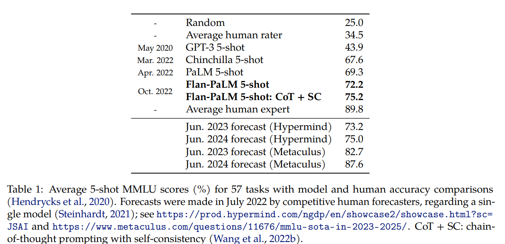
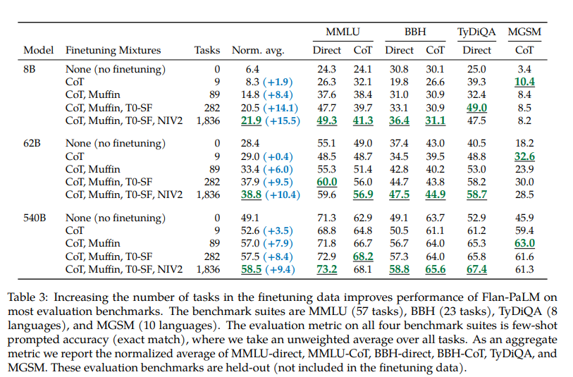
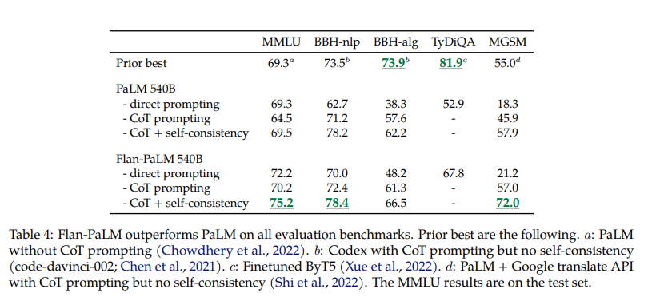
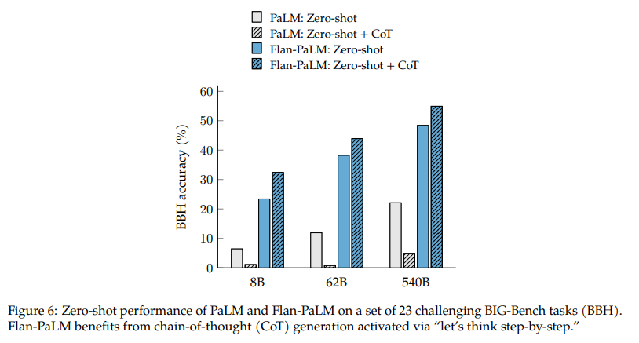
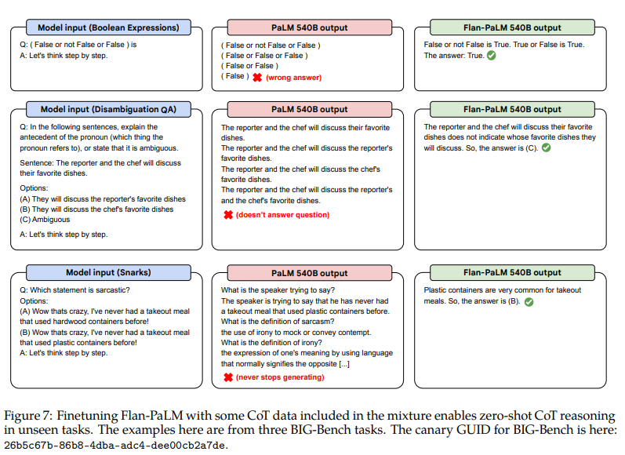

# Abstract

instruction 으로 finetuning 한 모델은 모델 성능이나 unseen task 에 대한 생성 능력을 향상 시킨다.

저자는 다음 **instruction finetuning** 을 탐구

1. scailing the number of tasks
2. scailing the model size
3. finetuning on chain-of-thought data

저자는 **다양한 모델**(PaLM, T5, U-PaLM), **prompt setups**(zero/few-shot, CoT), **evaluation benchmarks** 에 대해, 극정인 성능 향상을 보이는 것을 발견

# 1. Introduction

저자는 instruction finetuning 의 두 가지를 접근

1. instruction finetuning 의 scaling 영향
    - task 수와 model size 가 함께 잘 확장 되는 것 발견
2. instruction finetuning 의 추론 작업 수행 능력
    - CoT (chain-of-thought) 를 포함하지 않은 instruction finetuning 은 CoT 평가에 저하를 일으킴
    - 9개의 CoT dataset 을 추가하니 모든 평가에 대해 더 나은 성능을 보임

540B 의 Flan-PaLM 을 훈련(1.8K Tasks, CoT data)한 결과 

- Massive Multi-task Language Understanding (MMLU) 에 대해 75.2% 달성
- PaLM 과 비교하여 TyDiQA 에 one-shot 으로 14.9% 향상
- instruction finetuning Flan-T5 모델은 zero-shot, few-shot 및 CoT 능력이 T5 보다 뛰어남
- Flan-T5 11B 는 T5 11B 보다 십의 자리 더 뛰어나며 BIG-Bench task 에서 PaLM 62B 보다 뛰어남

전체적으로 instruction tuning 는 model, prompting, evaluation 전역에서 성능이 향상

# 2. Flan Finetuning

Fig 2 와 같은 데이터 소스를 모아 Fig 3 과 같은 여러 instruction template 으로 instruction finetuning

이 프로세스는 **_Flan_** 이며 이러한 과정으로 finetuning 된 모델 앞에 "Flan" 을 붙인다. (e.g. Flan-T5)

## 2.1. Finetuning Data

### Task mixtures.

**[Finetuned Language Models Are Zero-Shot Learners]** 은 instruction 과 함께 finetuning 의 task 수를 늘려 unseen task 에 대한 일반화를 향상 시켰다.

본 논문에선, 이전 연구의 Muffin (80 tasks), T0-SF (193 tasks), NIV2 (1554 tasks) 및 CoT 를 결합하여 1,836 task 로 확장

### Chain-of-thought finetuning mixture.

CoT annotation 을 포함하여, CoT 에 대한 finetuning 이  unseen task 에 대한 추론 성능 향상시키는지 조사

9 가지 데이터셋의 혼합을 만들며, 이에 arithmetic reasoning, multi-hop reasoning, natural language inference 등을 포함한다.

### Templates and formatting.

- Muffin, T0-SF 및 NIV2 의 경우, 데이터셋 창작자가 만든 instructional template 을 사용
- CoT 의 경우, 9 가지 데이터셋 각각에 10 개의 instruction template 수동 작성
- few-shot template 생성에는, "Q:/""A" 같이 다양한 examplar 구분을 작성하며, 이를 무작위 example level 로 적용 (Fig 3)

## 2.2. Finetuning procedure

T5, PaLM, U-PaLM 등 다양한 모델에 instruction finetuning 을 적용

각 모델들의 학습 절차는 learning rate, batch size, dropout, finetuning step 등 일부 hyperparameter 를 제외하고 동일하게 적용

일정한 schedule 및 Adafactor optimizer 사용

multiple training example 을 single sequence 에 결합하기 위해 **[T5]** 의 packing 을 사용했으며, input 과 target 을 eos sequence token 을 사용하여 분리한다.

optimal step 은 held-out-tasks 의 periodic evaluation (모델 크기에 따라 2k ~ 10k step 마다) 를 기반으로 선택됨.

### 2.3. Evaluation Protocol

### Evaluation benchmarks.

Flan-PaLM 의 world knowledge 및 reasoning task 성능 평가를 위해 finetuning 에 포함하지 않은 held-out-task 에 평가

1. MMLU : mathematics, history, medicine 등 57 task 의 exam question 포함
2. BBH : BIG-Bench 로부터 23 challenging task 포함
3. TyDiQA : QA benchmark 로, 8 typologically language 포함
4. MGSM : math 단어 문제로 10 languages 포함

### Evaluation mathods and metrics.

- MMLU (five-shot), BBH (three-shot) : direct prompting 을 통한 answer 예측 및 CoT prompting 을 통한 추론 능력 모두 평가 
- TyDiQA (one-shot) : 복잡한 추론을 요구하지 않아, direct prompting exact-match 점수를 측정
- MGSM (8-shot) : direct prompting 성능이 낮아, CoT prompting 정확도만 측정

또한 BIG-Bench 에 따른 **normalized average** metric (macro-average) 을 보고.

# 3. Scaling to 540B parameters and 1.8K tasks

1. 모델 사이즈 및 finetuning task 수에 대한 scaling 효과 검토
    - PaLM 모델 8B, 62B 및 540B 에 대해 실험
    - CoT, Muffin, T0-SF 및 NIV2 를 순차적으로 추가하여 mixture
    - multi-task instruction fietuning 및 no finetuning 을 비교하여 9.4% ~ 15.5% 의 성능 향상
2. finetuning task 를 늘리면 성능 향상이 있지만, 최대 282 tasks 에서 나타나며, 여기엔 두 가지 이유가 있음
    - 추가 task 가 특별히 다양하지 않아 새로운 knowledge 를 제공할 수 없음
    - 이미 pretraining 에서 알고 있던 knowledge 라서 큰 도움이 되지 않음
3. 모델 사이즈를 한 단계씩 확장하는 것 (8B → 62B or 62B → 540B)이 finetuning 및 non-finetuning 모두 성능 향상

# 4. Finetuning with chain-of-thought annotations

instruction finetuning mixture 에 CoT 를 포함한 효과를 탐구

1. 여러 벤치마크에서 이전 모델을 능가하는 Flan-PaLM 의 향상된 추론 능력
2. CoT finetuning data 를 제거하고 CoT 없이 finetuning 수행 시 실제로 추론 능력 하락
3. CoT finetuning 가 어려운 BIG-Bench task 에서 "let's think step-by-step" 으로 zero-shot 추론이 가능한 것을 보여줌

## 4.1. Finetuning on chain-of-thought improves reasoning on held-out tasks

저자는 CoT annotation 을 9 개의 데이터셋 finetuning mixture 에 포함시키는 것이 추론 능력을 향상시켜 주는 것을 보여준다.

- CoT prompting 이 **[self-consistency]** 와 결합하여 여러 벤치마크에서 SOTA 를 달성
  - MMLU 에서 Flan-PaLM 540B 은 75.2% 달성
  - 다국어 math problem 인 MGSM 에서 CoT + SC 로 크게 개선하여 SOTA 달성
  - GSM8K 에서 Flan-PaLM + CoT + SC 가 83.9% 로 SOTA 달성
- 저자는 특정 특화된 모델과 비교하여 Flan-PaLM 이 SOTA 를 달성하지 않은 점도 주목
  - symbolic 조작만 요구되는 BBH-algo 의 경우, CoT + SC 로도 능가하지 못함
  - one-shot TyDiQA 에서 PaLM 보다 성능은 높지만 SOTA 모델과는 비교할 수준이 아님

## 4.2. Some chain-of-thought data is needed to maintain reasoning ability

다음으로는, instruction finetuning 에 9개의 CoT 데이터셋을 제거해 본다.

CoT 및 non-CoT fintuning 을 결합한 것이 이 CoT 만 finetuning 한 것 보다 성능이 좋았다. 이를 통해 non-CoT task 에서의 성능을 저하시키지 않음을 확인

Fig 5-왼쪽 에서 중요한 점은 CoT 에 대한 finetuning 이 추론 능력 유지에 중요하단 것을 보여준다.
  - Non-CoT 만 finetuning 하는 것은 CoT 성능을 상당히 저하
  - unseen task 가 finetuning task 와 동일한 **_prompting paradigm_** (i.e. non-CoT, CoT)에 속할 때, instruction tuning 이 효과적으로 성능 향상
  - 즉, non-CoT 및 CoT 데이터 모두 모델 향상에 필요

## 4.3. Unlocking zero-shot reasoning

exemplar 를 포함하거나 포함하지 않은 CoT 데이터에 대한 instruction finetuning 의 최종 이점은 모델이 zero-shot 세팅에 대한 CoT 추론을 수행하는 것이다.

Fig 6 에서 23개의 unseen challenging 인 BBH 벤치마크에서 Flan-PaLM 이 "let's think step-by-step" 구문을 사용하여 CoT 추론 수행 성능을 향상시켰다.

Fig 7 에서 PaLM 및 Flan-PaLM 의 zero-shot 을 보여준다.

# 5. Putting it all together

instruction finetuning 의 일반화를 다양한 사이즈, 아키텍처 및 training objective 의 여러 모델을 적용하여 보여준다.

- decoder-only 아키텍처인 PaLM 에 대항하여 encoder-decoder 아키텍처인 **T5** 를 instruction finetuning
- PaLM 62B 모델에 500B token 을 pretraining 한 **cont-PaLM** 을 instruction tuning
- PaLM 540B 에 UL2 objective 로 20k 추가적인 step 으로 pretraining 한 U-PaLM

instruction finetuning 은 모든 model 에 비해 큰 마진으로 normalized average 가 향상

- instruction finetuning 하지 않은 T5 의 경우
  - LM-adapted model 을 사용하여 standard language modeling objective 로 100B 추가 토큰으로 훈련
  - T5 는 non-finetuned 모델과 비교하여 instruction- finetuning 은 이점을 얻음
  - 위 결과로 다음을 얻음
    - 3B 의 Flan-T5-XL : MMLU 52.4% score

- instruction finetuning 및 UL2 continued pre-training 을 결합한 U-PaLM model 사용
  - instruction 및 UL2 continued pre-training 은 model scale 을 증가시키지 않고 성능을 향상시키는 compute-efficient method

# 6. Usability evaluation of open-ended generation

190개 예제로 구성된 평가 생성
- 5가지 카테고리 (creativity, reasoning over contexts, complex reasoning, planning 및 explanation) 각각 20개 question 포함
  - 60개 examples (complex reasoning, planning 및 explanation) 에는 CoT 구문 (e.g. "let's think step-by-step") 생성하여 CoT zero-shot 가능 여부 평가
  - 160개 zero-shot input 에 instruction finetuning 없이 잘 수행되는 30개 few-shot 을 포함

1. temperature sampling 은 $\tau = 0.7$ 로 설정하여 5개의 response 를 랜덤으로 선택
2. length normalization 없이 log probability score 로 rank 매김
3. score 절반 위로만 선택하는 filtering step 후, best score 선택
   - 이 단계로, 원치 않는 반복 생성을 제거
   - 예로 5개의 생성의 log probability 가 -20 이면, -3 은 반복 생성일 확률이 높아 제거

- 결과, 평가자들은 PaLM 및 Flan-PaLM 의 190개 examples 에 대해, Fla-PaLM 생성이 79% 의 선호도를 보임
- 모든 zero-shot 에 대해선 Flan-PaLM 이 큰 폭으로 선호도가 높음
- CoT 구문을 사용한 경우, Flan-PaLM 이 10% 정도 증가
- few-shot 의 경우, 비교할만한 성능은 없었다.

instruction finetuning 된 모델이 open-ended zero-shot input 에 더 좋은 응답을 할 수 있는 능력은 [Training language models to follow instructions with human feedback, InstructGPT] 에서 finetuning LM 이 human feedback 으로 강화학습하여 human evaluation 을 개선시키는 것과 일관성 있다.

또한 PaLM 의 생성을 보면, pretraining on next-token prediction objective 만으로 강력한 성능을 보이지만 좋은 zero-shot 을 충분히 활용하지 못함을 볼 수 있다.

PaLM 으로 만들어진 불필요한 행동은 다음을 포함한다.
- 질문에 답변하는 대신 관련된 텍스트 계속 생성
- 입력 질문을 약간 수정하여 반복
- 텍스트 생성을 멈추는 시점을 모름

# 7. Discussion

본 연구는 instruction finetuning 을 확장

1. finetuning task 수 확장
2. 모델 사이즈 확장
3. CoT 데이터에 finetuning

instruction-finetuned model 결과 few-shot, zero-shot 및 CoT 등 전역에 성능 향상

다음은 논문 요약이다.

## Scaling curves for instruction finetuning

instruction finetuning 의 핵심 키는 모델 사이즈 및 finetuning task 수 확장이 성능 향상으로 이어진다는 것

저자는 scaling curve 를 그렸을 때, 모델 사이즈 및 task 수를 모두 확장하면 계속 성능이 향상될 것이라 예상 했지만, 앞서 282 task 와 1,836 task 가 큰 차이가 없는 것으로 보아, 누적 수를 더할 수록 이득이 줄어드는 경향이 있다.  

instruction finetuning 을 하지 않은 모델 대비하여 수행한 모델은 개선 폭이 감소하지 않는 것으로 보아 의미있은 역할을 계속 할 것으로 보임.

## CoT finetuning is critical for reasoning abilities

CoT finetuning 은 추론 능력에 중요한데, 이전 연구에선 unseen non-CoT task 에 대한 non-CoT finetuning 이 성능 향상되는 것을 보였지만, 본 논문에선 이로 인해 CoT task 에 성능 저하가 발생하는 것을 발견

해결책으로 non-Cot 및 CoT 데이터에 jointly finetuning 을 수행
- non-CoT 성능을 유지하며 더 나은 CoT 성능을 가능케 함
- 큰 모델에 대한 CoT finetuning 이 held-out task 에서의 성능을 개선하며 non-CoT 작업의 성능 향상 유지

## Instruction finetuning generalizes across models

다양한 모델 (decoder-only, encoder-decoder), 사이즈 (T5-80M ~ PaLM-540B) 및 pre-training objectives (causal LM, span corruption 및 prefix LM + span corruption)에 instruction finetuning 을 적용하여, 일반화를 관찰

이는 decoder-only 및 encoder-decoder 에 효과적임을 보여줌.

또한 instruction finetuning 이 UL2R 과 결합하여 강력한 모델 (Flan-U-PaLM)을 만드는 데 잘 결합되는 것을 보여줌

## Instruction finetuning improves usability and mitigates some potential harms

pre-trained checkpoint 직접사용하면 non-experts 에 challeng
- next token prediction objective 만으로 언제 생성을 멈출지 모름
- 사용자 입력에 계속 생성하는 실수를 저지름

Flan-PaLM 출력은 human evaluation 에서 상당한 결과를 보임 (complex reasoning, planning 등의 CoT).

유해한 언어 피해를 측정하는 벤치마크에서도 PaLM 보다 우수한 결과를 보임

이를 통해 instruction finetuning 이 인간의 선호와 일치하는 출력을 생성하는 것을 발견

## Instruction finetuning is relatively compute-efficient

LM 크기 확장은 성능 향상에 신뢰적이지만, 상당한 계산량이 필요

instruction finetuning 은 상대적으로 적은 양의 컴퓨팅으로 성능을 개선시킨다.
- PaLM 540B 의 경우, instruction finetuning 은 pre-training 의 0.2% 만 필요, 전반에 걸쳐 평균 9.4% 향상
- instruction finetuning 은 작은 모델로도 우수한 성능을 냄

# 9. Conclusions

**instruction finetuning** 으로 확장하여 **_Flan-PaLM_** 을 을 훈련

1. 540B parameter 로 확장
2. 1.8K finetuning task 로 확장
3. chain-of-thought (CoT) 포함

실험 결과 모델 성능이 크게 향상

이전 연구에선 instruction finetuning 이 CoT task 에 성능 저하를 일으키지만, CoT 를 포함하여 jointly finetuning 한 결과 CoT 및 전체 평가에 성능 향상
