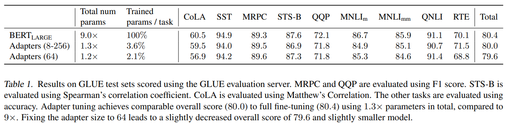
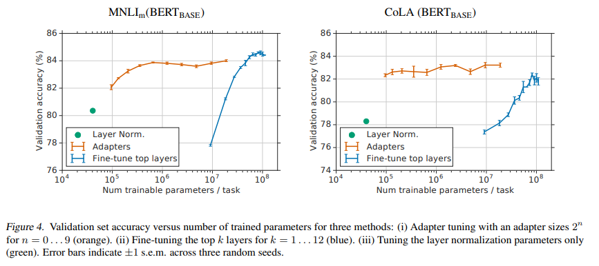

# Abstract

pre-trained model fine-tuning 은 NLP 에서 효과적인 transfer mechanism 이다.

하지만, downstream task 가 많을 경우, 모든 task 마다 entire new model 이 요구되어 비효율적이다.

이 대안으로 저자는 **adapter module** 을 사용한 transfer 제안

- 모델이 간결하고 확장 가능
- task 당 few trainable parameters 만 추가 및 이전 작업 수정 없이 new task 에 추가 가능
- 기존 모델의 parameter 는 고정하며, 고도의 parameter sharing 이 가능

Adapter 효과성 입증을 위해 BERT 를 26 task 를 포함한 GLUE 에서 transfer

- task 당 few parameter 만으로, 거의 SOTA 에 가까운 성능을 얻음
- GLUE 에서 task 당 3.6% parameter 만 추가하여 full fine-tuning 성능 0.4% 안으로 차이남
- 반면 full fine-tuning 은 parameter 100% 훈련

# 1. Introduction

pre-trained model transfer 은 NLP task 에서 강력한 성능을 내며, 특히 unsupervised loss 로 large text corpora 를 학습한 Transformer network 인 BERT 는 text classification 및 extractive question answering 에서 SOTA 성능을 달성한다.

본 논문은 oneline setting (tasks arrive in a stream) 에 대처

- 목적은 모든 new task 에 entire new model 을 훈련하지 않고 잘 수행하는 시스템 구축
- 클라우드 서비스같은 응용 분야에서 task 간 고도의 sharing 이 필요한데, 순차적으로 오는 여러 task 해결

이를 위해 _compact_ 하고 _extensible_ 한 downstream model 을 생성하는 transfer learning 전략 제안

- Compact Model : task 당 small number additional parameter 를 사용하여 많은 task 해결
- Extensible Model : 이전 작업을 잊지 않고 new task 를 해결할 수 있도록 점진적으로 훈련될 수 있음

저자의 모델은 성능을 희생하지 않고 모델 생성

---

NLP 에서 일반적인 transfer learning 은 feature-based transfer 및 fine-tuning 이다. 대신, 저자는 adapter 에 기반한 대안법 제시 (Rebuffi et al. 2017)

- Feature-based transfer : real-valued embedding vector 를 pre-training
  - 이런 embedding vector 는 word (Mikolov et al. 2013), sentence (Cer et al. 2019) or paragraph (Le & Mikolov, 2014) level 에서 이루어질 수 있음
  - 이후 embedding 은 custom downstream model 에 주입
- Fine-tuning : pre-trained network 의 weight 를 복사하고 해당 weight 를 downstream task 에 맞게 tuning
  - 최근 연구에 따르면 fine-tuning 은 종종 feature-based transfer 보다 나은 성능 (Howard & Ruder, 2018)

---

feature-based transfer 및 fine-tuning 모두 각 task 에 대한 new weight set 필요

network lower layer 이 task 간에 공유되면 fine-tuning 는 parameter-efficient 하지만, 저자의 adapter tuning 은 더욱 parameter-efficient

Fig. 1 에서 trade-off 를 보여줌

- $x$-axis 는 task 당 trained parameter 수 나타냄
- Adapter-based tuning 은 fine-tuning 에 비해 fewer parameters 를 두 자릿수 더 적게 요구하며 비슷한 성능 달성

---

Adapter 는 pre-trained network 사이에 추가된 new modules

Adapter-based tuning 과 feature-based network 에는 다음과 같은 차이가 있다.

parameter $w$ 를 가진 function (neural network) $\phi_w(x)$ 를 고려하자.

- Feature-based transfer 은 $\phi_w(x)$ 와 new function $\mathcal{X}_v$ 을 결합하여 $ $\mathcal{X}_v(\phi_w(w))$ 생성
  - 이후 new task-specific parameters $v$ 만 훈련
- Fine-tuning 은 각 new task 에 대해 original parameter $w$ 를 조정하며 수행. 이는 간결성에 제한됨
- Adapter Tuning 의 경우, new function $\psi_{w,v}(x)$ 정의
  - parameter $w$ : pre-training 에서 복사
  - initial parameter $v_0$ : new function 이 original 과 유사하도록 설정: $\psi_{w, v_0}(x) \approx \phi_w(x)$
  - 훈련 중, $v$ 만 tuning
- deep network 의 경우, $\psi_{w,v}$ 는 일반적으로 original network $\phi_w$ 에 new layer 를 추가하는 것을 포함
  - $|v| \ll |w|$ 를 선택하면 많은 task 에 parameter $(\sim |w|)$  가 필요한 모델이 생성됨
  - $w$ 는 고정되어 있어, model 은 이전 task 에 영향을 미치지 않고 새로운 작업으로 확장 가능

---

Adapter-based tuning 은 _multi-task_ 및 _continual_ learning 과 관련 있다.

- Multi-task learning 또한 compact model 결과로 가져옴
  - 하지만 모든 task 에 동시 액세스가 필요하여 Adapter tuning 에서는 불필요
- Continual learning 은 endless stream task 학습을 목표
  - 이는 network 가 re-training 후 이전 task 를 forget 하기 때문에 어려움이 있음
  - Adapter 는 task 가 상호작용하지 않고 shared parameter 는 freezing 되어 있어 다르다.
  - 이는 small task-specific parameter 를 사용하여 이전 task 에 대한 완전한 기억을 갖고 있는 특징이 있다.

---

저자는 adapter 가 NLP 에 parameter-efficient tuning 임을, 크고 다양한 text classification task 에서 입증

핵심은  effective adapter module 과 base model 의 통합하는 설계이다.

- GLUE 에서 fully fine-tuned BERT 성능과 일치하지만 task-specific parameter 는 3% 에 불과 (fine-tuning 은 100%)
- 17 dataset 및 SQuAD extractive questiuon answer 에서 유사한 결과 관찰. 요약하여, adapter tuning 은 single, extensible model 을 제공 가능하며 text classification 에서 SOTA 달성

# 2. Adapter tuning for NLP

저자는 여러 downstream task 에서 large text model tuning 전략 제안. 이에는 세 가지 주요 특성이 존재

- 좋은 성능 달성
- task 를 순차적으로 훈련. 즉, 모든 데이터셋을 동시에 액세스할 필요가 없음
- task 당 추가 파라미터 수를 적음. 

이러한 특성은 클라우스 서비스에서 유용하며, 많은 downstream task 을 훈련해야 하므로 고도의 공유가 바람직하다.

이 특성에 달성하기 위해, 저자는 **new bottleneck adapter module** 을 제안

- apdater module 을 사용한 tuning 은 new parameter 를 추가하는 것으로 이루어지며, downstream task 에 훈련
- adapter module 은 pre-trained network 를 downstream task 용으로 재사용되기 위해 architectual 수정
  - 특히, adapter tuning 전략은 원래 네트워크에 new layer 주입을 포함
- original network 의 weight 는 건드리지 않은 채로, new adapter layer 는 random initialize
  - fine-tuning 에선 new top-layer 및 original weight 을 공동 훈련
  - 반면 adapter tuning 은 original network 는 freezing 하므로 많은 task 에서 공유될 수 있음

---

Adapter module 은 두 특징이 있다.

- small parameter
  - adapter module 은 original network 의 layer 에 비해 작아야 함
  - 이는 많은 task 가 추가될 때 total model size 가 상대적으로 천천히 증가함을 의미
- near-identity initialization
  - adapted model 의 안정적인 훈련을 위해 필요
  - 경험적 실험으로, adapter 를 near-identity function 으로 초기화 시 훈련 시작 때 original network 에 영향을 주지 않음
  - 훈련 중, adapter 는 network 를 통해 activation distribution 을 바꾸기 위해 활성화될 수 있다
  - adapter module 은 필요하지 않은 경우 무시될 수 있음
  - 어느 adapter 가 많은 영향을 미치는지 관찰하여, 초기화가 far-identity function 이면 훈련에 실패할 수 있다.

## 2.1 Instantiation for Transformer Networks

Transformer 에 대한 adapter-based tuning 을 인스턴스화

이 모델은 다양한 task 의 NLP 에 SOTA 달성. 저자는 standard Transformer architecture 고려한다.

Adapter module 은 많은 architectural 선택지를 제공한다.

- 저자는 좋은 성능을 달성하는 간단한 설계를 제공
- 복잡한 설계 여러 가지를 실험해보았지만, 다음 전략이 다양한 dataset 에서 다른 방법들과 마찬가지로 잘 수행됨을 발견

Fig. 2 는 adapter architecture 및 Transformer 에 적용을 보여줌

Transformer 의 각 layer 는 two primary sub-layers 포함: attention layer 및 feedforward layer
 
- 두 layer 모두 input layer size 로 매핑하는 projection
- 각 sub-layer 는 skip-connection 적용
- 각 sub-layer 의 output 은 layer normalization 에 주입
- 저자는 이 sub-layer 각각 뒤에 two serial adapter 삽입
- adapter 는 항상 skip-connection 다음에 바고 적용
- projection 을 통해 input size 로 돌아간 후 적용되지만 skip-connection 다음에 삽입
- adapter output 은 그 다음 layer normalization 에 직접 전달

parameter 수를 제한하기 위해 bottleneck architecture 제안

- adapter 는 먼저 original $d$-dimensional feature 를 smaller dimension $m$ 으로 projection 한 다음 nonlinearity 적용하고 다시 $d$ dimension 으로 projection
- layer 당 추가되는 파라미터는 biases 포함하여 총 $2md+d+m$
- $m \ll d$ 로 설정하여, task 당 추가되는 parameter 수를 제한
  - 실제로 model parameter 중 약 $0.5 - 8\%$ 사용
- bottleneck dimension $m$ 은 성능을 parameter-efficient 와 trade-off 하는 간단한 수단
- adapter module 자체에 내부적으로 skip-connection
  - skip-connection 을 사용하면, projection layer parameter 가 near-zero 로 초기화된 경우 module 이 approximate identity function 으로 초기화된다.

adapter module 의 layer 와 함께 각 task 에 대해 new layer normalization parameter 를 훈련

- 이는 conditional batch normalization (De Vries et al. 2017), FiLM (Perez et al. 2018) 및 self-modulation (Chen et al. 2019) 와 유사
- layer 당 $2d$ parameters 만 사용하여 network 의 parameter-efficient adaptation 제공
- 단순히 layer normalization parameter 만을 훈련하는 것은 좋은 성능을 얻기에 충분치 않

# 3. Experiments

저자는 adapter 가 text task 에 대해 parameter-efficient transfer 달성을 보여줌

GLUE 벤치마크에서 BERT 의 fine-tuning 과 0.4% 차이만 나지만, fine-tuning 의 parameter 3% 만 추가

이 결과로 17 classification task 와 SQuAD question answering 에 대해 확인

분석 결과 adapter-based tuning 이 network higher layer 에 자동으로 집중하는 것을 보져여

## 3.1 Experiments Settings

public pre-trained BERT Transformer 를 base model 로 사용

- BERT 사용으로 classification 수행을 위해 Devlin et al (2018) 을 따른다.
- 각 sequence 의 first token 은 special "classification token" 이다
  - 이 token 의 embedding 에 linear layer 을 연결하여 class label 을 예측
- 훈련 절차도 Devlin et al (2018) 을 따름
  - optimizer Adam 사용
  - Adam 의 learning rate 는 처음 $10\%$ 를 선형적으로 증가. 그 후 선형적으로 감소하여 0 으로 줆
  - 4개의 Google Cloud TPUs 에서 32 batch size
- hyperparameter sweep 하고 validation set 에 정확도에 따라 best model 선택

BERT 의 fine-tuning 과 비교하며, $N$ 개 task 에 대한 fine-tuning 은 pre-trained model parameter 의 $N$ 배 필요

저자는 fine-tuning 보다 적은 parameter 로 동등한 성능 달성을 목표로 한다.

이상적으로는 $1\times$ 에 가까운 수준이다.

## 3.2 GLUE benchmark

GLUE 에서 평가를 진행

- 300M parameter 및 24 layers 를 포함한 pre-trained BERT$_{\text{LARGE}}$ 에서 transfer
- hyperparameter sweep 수행
  - learning rate $\{3 \cdot 10^{-5}, 3 \cdot 10^{-4}, 3 \cdot 10^{-3}\}$
  - epochs $\{3, 20\}$
  - fixed adapter size (bottleneck 수) 및 $\{8,64,256\}$ 를 task 당 best size 선택
- adapter size 는 tuning 한 adapter-specific hyperparameter
- 훈련 불안정성을 위해 서로 다른 random seed 5번 re-run 후 validation set 에 대한 best model 선택

- Adapter 는 GLUE score 평균 80.0 달성. full fine-tuning 은 80.4
- optimal adapter size 는 dataset 당 다양함
  - MNLI 의 경우 256
  - RTE 의 경우 8
  - size 를 64 로 제안하면 평균 79.6 으로 약간 감소
- fine-tuning 은 BERT 의 $9\times$, Adapter 는 $1.3\times$만 필요하다.

## 3.3 Additional Classification Tasks

Adapter 의 간결함과 우수한 모델 생성의 검증을 더 하기 위해, text classification task 를 추가 진행

- example 이 900 ~ 330k 까지, class 는 2 ~ 157 까지, 평균 text length 는 57 ~ 1.9k
- 32 batch size 사용
- 데이터셋이 다양하여 learning rate 범위를 넓게 sweep: $\{1\cdot10^{-5},3\cdot10^{-5},1\cdot10^{-4},3\cdot10^{-3}\}$
- 데이터 수가 많아 epochs sweep: $\{20, 50, 100\}$
- fine-tuning 과 adapter 의 optimal value 선택
- adapter size $\{2, 4, 8, 16, 32, 64\}$
- 일부 dataset 은 작으므로, fine-tuning 하는 것이 optimal 하지 않을 수 있으므로, 추가적인 base model 실행
  - 이를 위해 top $n$ layer 만 fine-tuning 하고 나머지는 freezing
  - $n \in \{1,2,3,5,7,9,11,12\}$
- 이 실험에선 BERT$_\text{BASE}$ model 및 12 layers 사용

---

GLUE task 와 달리 적절한 SOTA set 이 없어, BERT-based model 이 경쟁력있는지 확인을 위해 벤치마크 성능 수집 

- 표준 모델에 large-scale hyperparameter 수행
- Zoph & Le (2017); Wong et al (2018) 과 유사한 single-task Neural AutoML algorithm 실행
- 이는 TensorFlow Hub 로 공개된 pre-trained text embedding module 위에 샇인 feedforward 및 convolutional network space 에서 search
- 각 task 에 대해 30대 machines 로 CPU 에서 일주일간 AutoML 실행
- 평균적으로 task 당 10k 개 이상의 모델 탐색
- 검증셋의 정확도에 따라 best model 선택

Auto 벤치마크 에 대한 fine-tuning, variable fine-tuning, adapter-tuning 을 Table 2 에 보고

- AutoML baseline 은 BERT 가 경쟁력 있음. 수천 개의 model 을 탐색하여, BERT 가 평균적으로 나은 성능 발휘
- GLUE 와 유사한 결과 패턴 보임
- adapter tuning 의 성능이 fine-tuning 과 거의 비슷 (0.4%)
- fine-tuning 은 BERT_$_\text{BASE}$ parameter 의 17배 필요
- variable fine-tuning 은 조금 더 나은 성능 발휘하며, fewer layer 로 훈련. 
- variable fine-tuning 의 optimal set 은 평균 52% 훈련, 총 9.9배 줄음
- adapter 는 훨씬 더 간결하며, task 당 1.14% new parameter 만 도입하여 모든 17개 task 에 대해 1.19배 parameter 생성

## 3.4 Parameter/Performance trade-off

adapter size 는 parameter-efficient 를 제어

smaller adapter 는 fewer parameter 를 도입하지만 성능 손실 발생할 수 있음

이러한 trade-off 를 연구하기 위해 다양한 adapter size 를 고려하고 두 가지 baseline 비교:

- BERT_$_\text{BASE}$ 의 top $k$ layers 만 fine-tuning
- layer normalization parameters 만 tuning

Fig. 3 은 각 sweep 의 모든 classification task 를 통합한 parameter/performance trade-off 를 보여줌

- GLUE 에선 fewer layers 가 fine-tuning 될 때 성능 급격히 감소. additional task 중 일부는 fewer layers 훈련이 이점을 줌. 따라서 fine-tuning 의 성능 감소는 훨씬 적다
- adapter 는 두 가지 범위의 크기에서 매우 좋은 성능 제공

Fig. 4 는 두 GLUE task, MNLI$_m$ 및 CoLA 에 대해 더 자세히 조사

- top layers 를 tuning 하며 all $k > 2$ 에 대해 더 많은 task-specific parameter 를 훈련
- 비슷한 수의 task-specific 을 사용하여 fine-tuning 할 때 성능 크게 감소
- 약 trainable parameter 9M 의 top-layer 만 fine-tuning 하여 MNLI$_m$ 에 $77.8\% \pm 0.1\%$ validation accuracy 달성
- 반면 64 size 인 adapter tuning 은 약 trainable parameter 2M 으로 $83.7\% \pm 0.1\%$ validation accuracy 달성
- full fine-tuning 은 $84.4\% \pm 0.02\%$ 달성
- CoLA 에서도 유사한 추게 관찰

---

나아가 비교를 위해, layer normalization 의 parameter 를 tuning

- 이 layer 는 point-wise addition 및 multiplication 만 포함하므로 매우 적은 trainable parameter 도입
  - BERT$_\text{BASE}$ 의 경우 40k
  - 하지만 성능 저하 발생
- CoLA 에서 약 3.5%, MNLI$_m$ 에서 약 4% 성능 감소

요약하여 adapter tuning 은 parameter-efficient 가 높고 강력한 성능을 가진 compact model 생성

full fine-tuning 과 비교하여 성능이 $1\%$ 내외로 유지

original model 의 $0.5\% - 5\%$ size 로 adapter 를 훈련시키면, BERT$_\text{LARGE}$ 의 경쟁력 있는 결과에 근접

## 3.5 SQuAD Extractive Question Answering

마지막으로, adapter 를 classification 외의 task 에서도 작동하는지 확인을 위해 SQuAD v1.1 에서 실행

Fig. 5 는 SQuAD validation set 에서 fine-tuning 및 adapter parameter/performance trade-off 를 보여줌

- question 및 Wikipedia paragraph 이 주어지면, 이에 대한 answer span 을 선택
- Fine-tuning 의 경우, trained layers 수를 sweep: 
  - learning rate $\{3\cdot10^{-5},5\cdot10^{-5},1\cdot10^{-4}\}$
  - epochs $\{2,3,5\}$
- adapter 의 sweep:
  - learning rate $\{3\cdot10^{-5},1\cdot10^{-4},3\cdot10^{-4},1\cdot10^{-3}\}$
  - epochs $\{3,10,20\}$
- classification 처럼, adapter 는 fewer parameter 를 사용하면서도 full fine tuning 과 유사한 성능 달성
  - adapter size 64 (2% parameter) 는 F1 90.4% 얻음
  - fine-tuning 은 90.7% 달성
- SQuAD 는 small adapter (0.1% parameter) 로도 잘 작동. F1 89.9% 얻음

## 3.6 Analysis and Discussion

저자는 adapter 의 영향을 관찰하기 위해 ablation 실험 수행

이를 위해 일부 trained adapters 를 제거하고 validation set 에서 model 재평가 (재훈련 없이)

Fig. 6 은 MNLI 및 CoLA 에서 adapter size 64 로 BERT$_\text{BASE}$ 에서 all continuous layer span 에서 adapter 제거했을 때의 변화를 보여줌

- single layer adapter 제거는 성능 영향을 주지 않음을 관찰
  - heatmap 의 대각선 요소는 single layer 에서 adapter 제거의 성능
  - 가장 큰 성능 하락은 2%
  - 대조적으로, all adapter 제거하면 성능 크게 감소
  - MNLI 37%, CoLA 는 69% 로 감소
  - 위 결과는 각 adapter 가 전체 network 에 미치는 영향은 작지만, 전체적인 영향이 큼을 나타냄
- Fig. 6 은 lower layer 가 top layer 보다 적은 영향을 미침을 시사
  - MNLI 의 0-4 layer 에서 adapter 제거해도 성능 영향을 거의 미치지 않음
  - 이는 adapter 가 자동으로 top layer 를 우선 처리하여 adapter 가 잘 작동함을 시사
  - 실제 top layer 에 집중하는 것은 fine-tuning 에서 널리 사용되는 전략 (Howard & Ruder, 2018)
    - top layer 는 공유되는 lower-level feature 를 추출하고, top layer 는 다른 task 의 고유 feature 를 구축
    - 이는 일부 task 에서는 top layer 만 fine-tuning 하는 것이 full fine-tuning 보다 우수한 결과를 얻음과 관련 있다 (Table 2 참조)
- initialization scale 에 대한 robustness 조사
  - 메인 실험에서 adapter module weight 의 표준편차가 $10^{-2}$ 인 zero-mean Gaussian 으로 추출
  - initialization scale 의 영향 분석을 위해 표준 편차를 $[10^{-7}, 1]$ 구간으로 테스트
  - 두 데이터셋 모두 adapter 성능이 $10^{-2}$ 이하의 표준 편차에 robust
  - initialization scale 이 너무 크면 성능 저하. 특히 CoLA
- adapter module 의 뉴런 수에 대한 robustness 조사
  - all task 에 대해 일정한 adapter size 를 선택할 때 모델 품질이 안정적임을 발견
  - 각 adapter size 에 대해 최적의 학습률과 에폭을 선택하여 8 classification task 에서 평균 검증 정확도 계산
  - 어댑터 크기 8, 64 및 256 에 대한 평균 검증 정확도는 각각 86.2%, 85.8% 및 85.7% 
  - 이는 Fig. 4, 5 의 안정적인 성능을 보여주는 것임
- 마지막으로, adapter architecture 의 여러 확장을 했지만 성능 향상은 미미
  - adapter 에 batch/layer normalization 추가
  - adapter 당 layer 수 증가
  - tanh 같은 다양한 activation function
  - attention layer 내부에만 adapter 삽입
  - main layer 와 병렬로 adapter 추가
  - multiplicative interaction 이 있는 경우도 가능 
  - 모든 경우가 [Section 2.1](#21-instantiation-for-transformer-networks) 의 bottleneck 과 유사한 성능
  - 따라서 간단함과 강력한 성능을 감안할 때, 원래의 adapter architecture 권장

# 4. Related Work