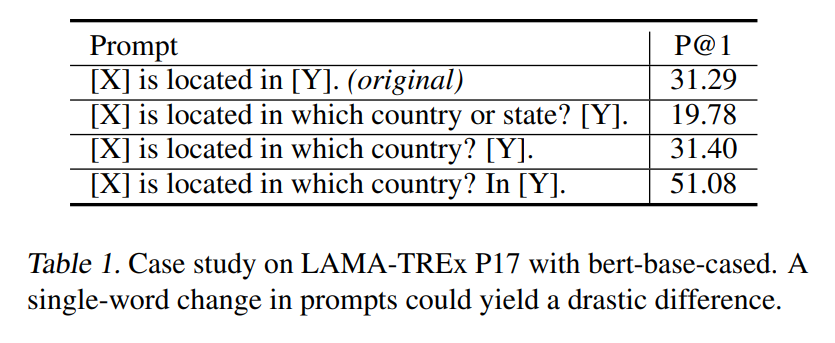
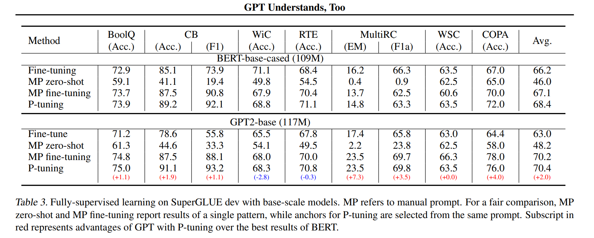

논문 및 이미지 출처 : <https://arxiv.org/pdf/2103.10385.pdf>

# Abstract

전통적인 fine-tuning 으로는 GPT model 의 natural language understanding (NLU) task 에 좋은 결과를 달성하지 못하는 반면,

저자는 trainable continuous prompt embeddings 를 사용한 **_P-tuning_** 을 통해 나은 결과를 얻을 수 있었다.

- knowledge probing (LAMA) 벤치마크에서 최고인 GPT 는 테스트할 때 additional text 없이 64% (P@1) 복구 (이전 best 의 +20%)
- SuperGlue 벤치마크에서 GPT 모델은 supervised learning 에서, 유사한 크기인 BERT 와 비슷하거나 더 나은 성능 달성
- P-tuning 이 prompt engineering 의 필요성을 줄여, BERT 모델의 성능도 향상시킨다는 것

결과적으로 P-tuning 이 few-shot SuperGlue 벤치마크에서 SOTA 능가

# 1. Introduction

이전 연구들은 pre-training 과정에 text 표현 뿐 아니라 문법, 구문, 상식 및 세계 지식 등의 요소를 학습한다는 증거를 제시하기도 한다.

training objectives 에 따라 pre-trained language model (LM) 은 세 가지 범주로 나눌 수 있다.

- **unidirectional language models** for natural language generation (NLG) (e.g. GPT)
- **bidirectional language models** for natural language understanding (NLU) (e.g. BERT)
- **hybrid language models** for combining the first two paradigms (e.g. XLNet, UniLM)

GPT 스타일의 모델이 fine-tuning 으로 NLU task 에 대한 성능이 좋지않아, language undetstanding 에 적합하지 않다고 가정해왔다.

하지만 manual prompt 사용으로 흥미로운 성능을 보여, large unidirectional model 와 manual prompt 가 NLU 에 적합하게 작용할 수 있음을 시사

그러나 best-performing prompt 란 사막에서 바늘찾기 이며, 현실적으로 불가능한 매우 큰 검증 데이터셋이 필요하다.

많은 케이스에서도, prompt engineering 은 테스트셋에 overfitting 하며, 큰 성능 하락을 일으키는 prompt 를 만들 가능성도 있다.

이러한 연구들을 통해 저자는 discrete prompts 를 자동으로 검색하고, 효과를 입증하는데 초점을 둔다. 하지만 neural networks 는 continuous 하므로 discrete prompts 는 sub-optimal 일 수 있다.

---

본 연구는 **_P-tuning_** 으로 GPT 와 NLU 간의 간격을 좁히기 위해 continuous space 에서 prompt 를 자동으로 검색하는 방법을 연구

- few continuous free parameters 를 활용하여 pre-trained LM 에 입력으로 제공되는 prompt 역할
- continuous prompt 를 discrete prompt searching 대신 gradient descent 를 활용하여 최적화

간단한 P-tuning 으로 GPT 에 상당한 개선을 가져왔다.

저자는 P-tuning 기반 GPT 을 두 가지 NLU 벤치마크에 검토

- LAMA knowledge probing
  - 64.2% 달성하여 이전 SOPTA prompt searching 방법인 45.2% 를 크게 능가
- SuperGLUE
  - few-shot 및 fine-tuning 을 함께 진행
  - 동일한 규모의 BERT 와 유사한 성능이거나 일부 데이터셋에선 능가
  - BERT 스타일 모델에도 P-tuning 이 이점을 얻을 수 있음을 관찰
  - ALBERT 의 P-tuning 은 성능 크게 능가하고 few-shot SuperGLUE 에서 SOTA

위 방법은 GPT 는 언어를 이해하지 못한다는 고정관념을 부쉈다.

P-tuning 은 pre-trained LM 을 downstream task 에 최상의 성능을 위해 fine-tuning 에도 작동한다.

본 논문의 기여는 다음과 같다.

- P-tuning 으로 GPT 의 NLU 가 BERT 와 comparable (때론 더 나음)하여, pre-trained LM 의 성능을 향상 시킴
- P-tuning 은 few-shot 및 fine-tuning 설정에서도 GPT 및 BERT 를 모두 개선
  - LAMA knowledge probing 및 few-shot SuperGLUE 에서 SOTA 능가
  - LM 이 pre-training 중 생각보다 더 많은 지식을 습득했음을 시사

# 2. Motivation

GPT-3 및 DALL-E 는 LLM 이 만병통치약임을 시사하지만, transferability 가 낮다는 것.

downstream task 의 fine-tuning 은 trillion-scale model 에는 거의 작동하지 않는다.

many-shot fine-tuning 에서도 빠르게 fine-tuning sample 을 메모리에 저장하기엔 너무 크다.

대안으로 GPT-3 와 DALL-E 는 downstream 을 위해 model fine-tuning 을 위해 manual prompt 를 활용하는 것이 보고 되었다.

그러나 manual prompt searching 은 큰 검증셋에 지나치게 의존하며 성능도 불안정하다.

최근 discrete prompts searching 을 자동으로 하는 것에 집중하며, 

- training corpus 를 mining
- gradient searching
- separate model 

저자의 목적은 미분하여 최적화될 수 있는 continuous prompt 를 찾는 것

# 3. Method: P-tuning

discrete prompt 와 유사하게 P-tuning 은 input 에 비침범적인 (noninvasive) 수정만 적용

pre-trained input embeddings 을 differential (미분계수) output embeddings 로 대체

## 3.1 Architecture

pre-trained LM $\mathcal{M}$ 이 주어졌을 경우

- discrete input token 의 sequence $\text{x}_{1:n} = \{ x_0, x_1, \dots, x_n \}$
  - pre-trained embedding layer $e \in \mathcal{M}$ 에 의해 input embeddings $\{ e(x_0), e(x_1), \dots, e(x_n) \}$ 으로 매핑
- 특정 시나리오에선 context $\text{x}$ 에 대해, downstream 처리를 위해 target token $\text{y}$ 의 output embeddings 사용이 일반적
  - pre-training 에선, $\text{x}$ 는 unmasked tokens 을 나타내며, $\text{y}$ 는 [MASK] 를 나타냄
  - sentence classification 에선, $\text{x}$ 는 sentence token 을 나타내며, $\text{y}$ 는 [CLS] 를 나타냄

prompt $\bold{p}$ 의 역할은 context $\text{x}$, target $\text{y}$ 및 template $T$ 로 구성하는 것

예로, 국가 수도를 예측하는 작업 (LAMA-TREx P36)

- template "The capital of Britain is [MASK]."
- prompt "The capital of ... is ... ."
- context "Britain"
- target "[MASK]"

prompt 는 context 또는 target 로 삽입할 수 있는 유연성을 지닐 수 있다.

LM $\mathcal{M}$ 의 vocabulary 를 $\mathcal{V}$, template $T$ 의 $i^{th}$ prompt token 을 $[\text{P}_i]$ 라 하자.

간단하게, $T = \{ [\text{P}_{0:i}], \text{x}, [\text{P}_{i+1:m}],\text{y} \}$ 가 주어졌다고 하자. 

traditional discrete prompts 와 비교하며, 이는 $[\text{P}_i] \in \mathcal{V}$ 를 만족시키고 $T$ 를 다음과 같이 매핑

$$
\begin{equation}
    \{ e([\text{P}_{0:i}]), e(\text{x}), e([\text{P}_{i+1:m}]), e(\text{y}) \}
\end{equation}
$$

반면, P-tuning 은 $[\text{P}_i]$ 를 pseudo tokens 로 간주하고 template 를 다음과 같이 매핑

$$
\begin{equation}
    \{ h_0, \dots h_i, e(\text{x}), h_{i+1}, \dots h_m, e(\text{y}) \}
\end{equation}
$$

- $h_i (0 \leq i \leq m)$ : trainable embedding tensors
  - 이를 통해 $\mathcal{M}$ 의 original vocabulary $\mathcal{V}$ 를 넘어 더 나은 continuous prompts 를 찾을 수 있게 됨

downstream loss function $\mathcal{L}$ 를 사용하여 continuous prompt $h_i (0 \leq i \leq m)$ 를 미분으로 최적화할 수 있다.

$$
\begin{equation}
    \hat{h}_{0:m} = \underset{h}{\text{arg} \min}\  \mathcal{L} (\mathcal{M}(\text{x}, \text{y}))
\end{equation}
$$

## 3.2 Optimization

continuous prompts 의 training idea 는 간단하지만 실제로 두 가지 최적화 문제를 직면

1. Discreteness
    - $\mathcal{M}$ 의 original word embedding $e$ 은 pre-training 후 높은 discrete 성질을 가짐
    - $h$ 가 random distribution 된 후 stochastic gradient descent (SGD) 로 최적화될 경우, small neighborhood 의 parameter 만 변경될 수 있음
    - 위 optimizer 는 쉽게 local minima 에 빠질 수 있음
2. Association
    - prompt embeddings $h_i$ 의 값이 독립적이 아닌 서로 종속되어야 한다는 것. prompt embeddings 를 서로 연관시키기 위한 매커니즘 필요

위 어려움을 대응하여 P-tuning 에선 $h_i$ 를 **_서로 종속적인 시퀀스로 모델링_** 하는 것을 제안

- 이를 위해 매우 가벼운 신경망으로 구성된 prompt encoder 를 사용하여 discreteness 및 association 해결
- 양방향 LSTM 을 선택하고 ReLU activated two-layer MLP 를 사용하여 discreteness 촉진

LM $\mathcal{M}$ 에 대한 실제 input embeddings $h_i'$ 는 다음과 같이 유도

$$
\begin{equation}
    \begin{align*}
        h_i & = \text{MLP}([\overrightarrow{h}_i \ : \ \overleftarrow{h}_i]) \\
        & = \text{MLP}([\text{LSTM}(h_{0:i}) \ : \ \text{LSTM}(h_{i:m})])
    \end{align*}
\end{equation}
$$

LSTM head 사용은 continuous prompts 의 training 에 일부 파라미터를 추가하지만, LSTM head 는 pre-training 보다 훨씬 작으며, inference 에서는 output embedding $h$ 만 필요하므로 LSTM head 를 폐기할 수 있다.

또한 몇 개의 anchor tokens 추가하는 것이 SuperGLUE 의 일부 NLU task 에 도움되는 것을 발견

- RTE task 의 경우, prompt template "[PRE][prompt tokens][HYP]?[prompt tokens][MASK]" 내의 "?" token 은 anchor token 으로 특별히 추가되어 성능에 큰 영향을 미친다.
- 이러한 anchor tokens 는 각 구성 요소를 나타내며, 이 경우 "?" 는 "[HYP]" 가 의문문 부분으로 작용

# 4. Experiments

NLU 벤치마크인 LAMA knowledge probing 및 SuperGLUE 에 포괄적으로 실험

결과, P-tuning 이 GPT 의 NLU 능력을 향상시키고 BERT 스타일 모델에도 이점이 있음을 보여줌

## 4.1 Knowledge Probing

knowledge probing 또는 fact retrieval 은 LM 이 pre-training 에서 얼마나 세계 지식을 습득했는지 평가

LAMA dataset 은 knoledge base 에서 선택한 triple 에서 생성된 cloze test 로 평가

예로 triple 을 "Dante was born in [MASK]." 라는 handcraft prompt 로 변환한 다음 LM 에게 추론하도록 요청

pre-trained model 의 parameter 는 고정되어 있으므로, pre-training 에서 얻은 지식으로 평가

### 4.1.1 Datasets And Formulation

#### Datasets

LAMA 의 모든 answers 를 single-token 으로 강제함

41개의 Wikidata relations 및 34,039개의 texting triples (즉, LAMA-34K) 로 구성된 original LAMA-TREx dataset 채택 (모두 BERT vocabulary 에 포함)

GPT 와 BERT 의 vocabulary 가 서로 다르므로 교집합을 포함하는 다른 버전의 LAMA 를 설정

이 subset 은 약 29,000 tasting triples 를 추가하고, 이를 LAMA-29K 라고 명명

training 에 대해선 all prompt searching approaches 가 prompt 를 훈련하거나 찾기 위해 일부 추가 데이터가 필요.

저자는 AutoPrompt 설정을 따르며, original TRE-x dataset 에 training set 구축.

이 training set 은 test set 과 유사하지만 약간 다른 answer distribution 을 가지고 있다.

#### Evaluation

원래, LAMA 는 Table 1 처럼 각 관계에 대한 handcraft prompt 를 제공했으며 이러한 prompt 는 효과적이지만 sub-optimal 이다.

bidirectional masked language models 의 경우, "[X]" 를 subject entity 로, "[Y]" 를 [MASK] token 으로 데체

GPT 같은 unidirectional language model 의 경우, LAMA 의 원래 설정에 따라 Transformer-XL 에서 target position 앞의 network output 을 사용

P-tuning 진행 시, bidirectional models 에는 (3, sub, 3, obj, 3) template 을 사용

unidirectional models 에는 (3, sub, 3, obj) 을 사용

숫자는 prompt tokens 수를 나타낸다.

이 knowledge probing task 에서는 어떠한 anchor token 도 사용하지 않으며, training 중 learning rate 1e-5 및 Adam optimizer 사용

### 4.1.2 Results

#### General performance

- P-tuning 은 LAMA-34K 에서 43.3% 를 50.6% 로 끌어 올림
- LAMA-29K 에서 45.2% 를 64.2% 까지 향상
- AutoPrompt 및 LPAQA 같은 discrete prompt searching approach 보다 뛰어남

위 결과는 prompt 를 개선하고 fine-tuning 없이 단순히 더 나은 prompt 를 찾음으로써, LM 이 생각보다 훨씬 더 많은 knowledge 를 capture 했다는 것을 시사

#### P-tuning v.s. Fine-tuning

저자는 pre-training 중 LM 이 얼마나 많은 지식을 습득하는지 평가

주요 연구는 GPT 같은 unidirectional model 에서 P-tuning 과 fine-tuning 을 비교하는 것

하지만 다음 질문이 발생할 수 있다. "unidirectional 및 bidirectional model 은 P-tuning 에서 유사한 개선을 얻을까?"

기존의 tuning 방법을 포괄적으로 검토하고자 다음 approach 포함

1. Manual Prompt (MP) : LAMA 의 original manual prompt 사용
2. Fine-tuning (FT) : subject 를 제시하고 object 를 예측하기 위해 모델을 FT
3. Manual Prompt with Fine-tuning (MP + FT) : manual prompt 로 LM 을 FT
4. P-tuning : continuous prompt 를 사용하면서 LM parameter freezing

LAMA-29K 에서 네 가지 전략을 구현 (Table 2 오른쪽)

- 놀라운 점은 FT 가 LM 의 all parameter 를 tuning 하지만, P-tuning 은 그렇지 않으니 더 강력해야 한다는 것. 하지만 P-tuning 이 FT 기반 방법과 비슷하거나 더 나은 결과
  - knowledge probing 에선 reasoning 보다는 hard-coding 이 되야하는 경우가 많아, FT 는 치명적인 망각을 초래할 수 있음
  - 반면 P-tuning 은 pre-trained LM's parameter 를 변경하지 않고, continuous prompt 로 저장된 knowledge 활용
- BERT 와 GPT 의 P-tuning 에 대한 개선 사항 사이에 명확한 격차가 있다는 놀라운 점
  - high-quality MP + FT 를 사용한 fine-tuning 의 효과가 관찰되지만, GPT 는 BERT 만큼 MP+FT 에서 이점을 얻지 못함
  - P-tuning 은 unidirectional LM 과 더 어울린다는 것을 시사
  - 11B 의 큰 모델인 MegatronLM2 의 경우, FT 가 거의 작동하지 않는 반면, P-tuning 은 여전히 적용 가능하여 SOTA 달성

## 4.2 SuperGLUE

P-tuning 평가를 위해 SuperGLUE 에서 실험 수행

- SuperGLUE 는 총 8개의 NLU task 를 지님
- ReCoRD 는 prompt 가 없으므로 P-tuning 이 불가능하여 포함하지 않아 7개의 task 를 다룸
  - question answering
  - MultiRC
  - textual entailment
  - RTE
  - co-reference resolution
  - causal reasoning
  - word sense disambiguation

실험 설정에서 fully-supervised 및 few-shot 모두 고려

- fully-supervised 에선 전체 훈련셋 ($\mathcal{D}_{train}$) 사용하고 모델 선택 및 hyperparameter tuning 을 위해 개발셋 ($\mathcal{D}_{dev}$) 사용
- few-shot 에선 SuperGLUE 의 few-shot 버전 (FewGlue) 채택
  - SuperGLUE 의 subset, 각 task 는 32개의 훈련 데이터 ($\mathcal{D}_{train32}$) 및 크기가 400~20000 까지 다양한 unlabeled 구성 ($\mathcal{D}_{unlabeled}$)

이전 연구에서 개발셋이 없고 고정된 hyperparameter 를 채택하여 테스트셋에 과적합되었음.

저자는 적절한 few-dev set ($\mathcal{D}_{dev32}$) 구성. 더 큰 개발셋은 추가적인 이점을 제공한다는 것이 입증되었기 때문

$\mathcal{D}_{dev32}$ 는 사용되지 않은 훈련셋에서 random sample 로 선택하여 구성되며, few-training set 의 크기보다 크지 않도록 제한

[Small language models are also few-shot learners] 와 동일한 matric 사용

---

저자는 NLU task 를 blank filling task 로 재구성.

[Small language models are also few-shot learners] 와 달리 P-tuning 은 initial prompt embeddings 을 패턴 내의 다른 position 에 배치한 후 pre-trained model 과 함께 prompt embedding 을 FT

- fully-supervised 설정
  - linearly decayed learning rate 를 사용하는 AdamW optimizer 사용
  - hyperparameter 에 대해 greedy search 를 수행하고 $\mathcal{D}_{dev}$ 또는 $\mathcal{D}_{dev32}$ 에서 최상의 조합 선택
  - 구체적으로 learning rate 1e-5, 2e-5, 3e-5 선택하고 batch size 16, 32
- small datasets 의 경우
  - pre-trained model 을 20 epoch fine-tuning
  - larger datasets 의 경우, 모델의 빠른 수렴을 위해 training epoch 을 10 으로 줄임.
  - overfitting 피하기 위해 early stop 사용
- few-shot learning 의 경우
  - 동일한 hyperparameter
  - prompt embeddings 의 FT 에 더 많은 단계가 필요하여 3500 으로 확장
  - 

---

P-tuning 은 bidirectional 및 unidirectional model 에 사용 가능

공정한 비교를 위해 연산량이 유사한 BERT-base 3 과 GPT2-base, BERT-large 와 GPT2-medium 비교

few-shot learning 을 위해 albert-xxlarge-v2 모델도 실험

각 사전 훈련 모델에 대한 결과로 표준 FT (즉, [CLS] 임베딩을 사용한 분류), PET FT [Small language models are also few-shot learners], PET zero-shot 및 P-tuning의 성능을 보고

### 4.2.1 Fully-Supervised Learning

- bert-base-cased 및 bert-large-cased model 모두 P-tuning 으로 7개 task 중 5개 task 가 우수한 결과
- WiC 및 MultiRC 는 큰 훈련셋을 가져, FT 가 더 큰 이점을 취함
- gpt2-base 및 gpt2-medium model 에 대해 P-tuning 은 모든 gpt2-base 중 가장 유망한 결과

위 결과로 bert 및 gpt 기반 모델의 NLU 성능 효과적으로 향상

- gpt2-base with P-tuning 은 7개 task 중 6개에서 BERT-base 의 best 결과 능가하고 WiC task 에서 comparable
- BERT-large 와 비교하면 P-tuning 을 사용한 GPT2-medium 은 7개 task 중 4개에서 우위, RTE 와 WSC task 에선 comparable, 유일한 예외는 WiC
- WiC task 에선 FT 가 우수하며, 이는 word sense disambiguation task 가 prompt-based MLM prediction 에 적합하지 않음을 추측

모두 종합하여 P-tuning 을 사용하면 GPT2 가 BERT-based model 과 comparable 하거나 더 나은 성능 달성

이는 BERT 같은 bidirectional model 이 NLU task 에서 항상 GPT2 와 같은 unidirectional model 보다 더 우수하다는 것을 뒤엎음

### 4.2.2 Few-Shot Learning

#### Sub-optimal and Sensitive Manual Prompts

PEFT/iPET 는 manual prompt 로 SuperGLUE few-shot learning task 에 SOTA 달성

이 prompt 는 효과적이지만 sub-optimal 이며 노동이 필요하다.

manual prompt 의 종합적 이해를 위해 비교 실험 진행

다양한 manual prompt 와 P-tuning 을 사용한 결과 (Table 6)

1. 결과는 prompt 의 의미, 형식, 문법과 few-shot learning 성능 간에 명확한 상관 관계가 없음
   - 합리적으로 여기는 prompt 가 LM 에 효과적이지 않을 수 있음
2. manual prompt 의 작은 변경 사항이 큰 성능 차이 일으킴
   - pre-trained LM 은 prompt 선택에 있어 민감
   - manual prompt 는 복잡하다 결론
   - Table 6 에서 $\mathcal{D}_{dev32}$ 사용으로 best manual prompt 찾는 것은 불가능
   - few-shot 환경에서도 optimal manual prompt 선택은 어려움
   - 반면 P-tuning 은 훨씬 적은 수동 작업으로 더 나은 prompt 를 자동으로 검색하는 데 유망

#### Updated SOTA for SuperGLUE Few-shot Learning

- P-tuning 에 의해 SuperGLUE few-shot SOTA 달성함을 보여줌
- 유의할 점은  PET 는 manual prompt fine-tuning 외에도 데이터 증강, 앙상블 및 distillation 으로 성능 향상하고 있으며, 모델 선택 및 hyperparameter tuning 을 테스트셋에 overfitting 하여 수행
  - 공정성을 위해 $\mathcal{D}_{dev32}$ 에서 재실험하며 모든 보조 기술 제거
- Table 5 는 P-tuning 이 모든 작업에서 manual prompt 로 비교하여 PET 및 PET-best 보다 우수한 성능
  - P-tuning 이 manual prompt 보다 훨씬 우수한 prompt 검색 및 few-shot task 성능 크게 향상함을 입증
- CB, WiC, RTE 및 WSC 등의 task 에서 P-tuning 은 데이터 증강, 앙상블 및 distillation 등 보조 기술로 PET/iPET 보다 우수한 성능

위 결과는 P-tuning 이 few-shot NLU task 의 이점 입증

### 4.2.3 Finetuning v.s. MP Finetuning v.s. P-tuning

Table 3, 4 는 NLU 성능 향상을 위해 세 가지 tuning-based paradigm 제시

P-tuning 은 BERT-based model 에서 평균적으로 약 2 point, GPT-based model 에선 5 points 이상 우수한 성능

구체적으로, P-tuning 은 대부분 task 에서 best results 를 달성하였지만, WiC 에선 cloze questions 로 정식화하기 어려워, FT 가 우수한 성능 달성

P-tuning 과 MP+FT 를 비교하면 P-tuning 이 평균적으로 MP+FT 보다 큰 이점을 보여주며, 이는 MP+FT 가 좋은 manual prompt 찾기엔 어렵기 때문이다.

반면 P-tuning 은 자동으로 더 나은 prompt 를 검색 가능

P-tuning 은 fine-tuned model 의 parameter 를 tuning 하면서 광범위한 prompt space 탐색 가능하여 새로운 tuning paradigm 으로, fine-tuning 이 어려운 LLM 을 유도하는 데 경쟁력 있는 잠재력 입증

# 5. Related Work

# 6. Conclusion

본 연구에서 **_P-tuning_** 제안

- continuous space 에서 더 나은 prompt 를 자동으로 탐색하여 pre-trained model 의 NLU 능력 강화
- 큰 검증셋에 덜 의존적이며, adversarial prompt 로부터의 피해를 덜 입고, overfitting 완화
- test 동안 추가 text 를 제공하지 않고도 LLM 의 세계 지식의 64% (P@1) 복구
- SuperGLUE 에서 GPT 스타일 모델에게 NLU 능력을 BERT 와 comparable 한 성능 부여 (과거엔 불가능하다 여김)
- bidirectional model 에 도움되며, SuperGLUE 에서 SOTA 성능 발휘
- 위 결과는 LM 이 pre-training 중 생각보다 더 많은 세계 지식을 습득한 것을 입증