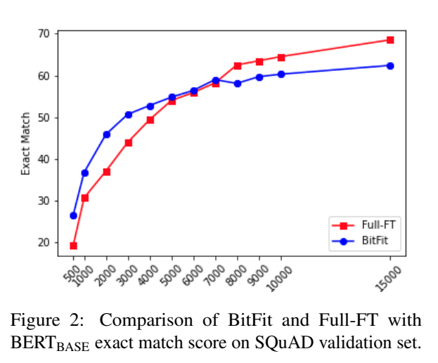

논문 및 이미지 출처 : <https://aclanthology.org/2022.acl-short.1.pdf>

# Abstract

저자는 **BitFit** 이라는 **sparse-finetuning** 도입

- 이 방법은 모델의 bias-terms 만 (or subset of them) 수정
- small-to-medium training data 에서, pre-trained BERT 에 BitFit 을 적용하면 full fine-tuning 과 competitive (때론 더 좋음)
- large data 에선, 다른 sparse fine-tuining methods 와 competitive
- 위 결과는 유용성 외에도, fine-tuning 이 new task-speciifc knowledge 학습이 아닌, language-modeling training 에 의해 유도된 knowledge 를 노출시키는 것이라는 가설을 지원하는 것과도 관련 있다.

# 1. Introduction

BERT 계열의 bidirectional masked language model 은 많은 NLP task 에서 성과를 이끌어내고 있다.

이런 모델은 일반적으로 corpora 에서 LM objective 로 pre-training 된 후 task-specific supervised data 에 _fine-tuning_ 된다.

이런 모델은 크기가 상당하기 때문에 훈련 비용 및 배포 비용도 상당하며, fine-tuning 이 original model 을 얼마나 변화시켜야 하는지도 문제다.

이로 인해 최근 model parameter subset 만 식별하여 end-tasks 에서 성능을 유지하며 나머지는 유지하는 변형을 고려하고 있다.

이에 저자는 fine-tuning 에 대한 간단하고 효과적인 접근법 제시. 이점은 다음과 같다.

- fine-tuned task 당 very few parameters 변경
- 모든 tasks 에 대해 동일한 parameter set 변경 (task-invariance)
- 변경된 parameter 는 all parameter space 에 걸쳐 isolate 및 localize
- small-to-medium training data 의 경우, 이러한 parameter 변경으로 fine-tuning 의 정확도에 도달하거나 때론 향상

---

구체적으로,

- 대부분의 network 를 freezing 하고 **bias-term 만 fine-tuning** 하는 것이 효과적임을 보여줌
- 성능이 약간 저하되게 되면, two bias components ("query" 및 "middle-of-MLP" bias-terms) 만 fine-tuning 할 수 있으며, 이는 bias parameter 중 절반에 해당하여, all model parameter 의 0.04% 에 해당

위 결과는 메모리 제한적인 환경에서 multi-task fine-tuned model 을 배포하는 데 실용성이 있으며, 대부분의 parameter 가 fix 된 채 학습할 수 있는 길을 열어줌

또한 pre-trained network 에서 bias-terms 의 역할과 fine-tuning 과정의 원동력에 관한 연구 방향을 열어줌

# 2. Background: fine-tuning and parameter-efficient fine-tuning

fine-tuning 을 통한 transfer learning 에서, pre-trained encoder network 는 input 을 받아 contextualized representations 를 생성

이후 task-specific classification layer (여기선 linear classifier 고려)가 encoder top 에 추가되고 전체 network (encoder + task specific classifiers)는 task loss 를 최소화하기 위해 end-to-end 훈련

#### Desired properties

task 당 fine-tuning 은 매우 효과적이지만, 각 pre-trained task 마다 큰 모델을 생성하므로 fine-tuning processd 에서 무엇이 변경되는지 이해하기 어렵고, 특히 task 수가 증가함에 따라 배포가 어렵다.

이상적인 fine-tuning 은 다음과 같아야 한다.

(i) fully fine-tuned model 의 결과와 일치
(ii) model parameter 의 small portion 만 변경
(iii) all dataset 에 동시에 access 하는 대신, task 가 순차적으로 오게 함
(iv) 효율적인 hardware 기반 배포를 위해 변경된 값의 parameter set 이 여러 task 에 걸쳐 일관되야 함

#### Learning vs. Exposing

위 요구 사항을 충족할 가능성은 large pre-trained LM 의 fine-tuning process 의 근본적인 질문이 생길 수 있다:

fine-tuning process 가 _new capabilities learning_, vs. pre-training process 에서 학습된 _existing capabilities exposing_. 둘의 정도가 무엇인가?

#### Existing approaches

위 두 연구는 parameter small subset 만 변경하여 다양한 end-tasks 에 adaptation 이 가능함을 보여줌

- Adapter (Houlsby et al. 2019) : pre-trained model layers 사이에 trainable task-specific "adapter" modules 삽입
  - original parameters 는 task 간에 공유됨
- Diff-Pruning (Guo et al. 2020) : original parameters 에 task-specific difference-vector 추가
  - difference-vector 는 sparse 하게 정규화
- 위 두 방법 모두 task 당 trainable small parameter 만 추가 가능하며 (ii), 각 task 는 이전 task 에 방문하지 않고 추가 (iii)
- 또한 (i) 을 부분적으로 충족시키며, full fine-tuning 과 비교하여 성능이 약간 감소
  - Adapter 는 Diff-Pruning 보다 parameter-efficiency 이 떨어지지만 (특히 new parameter 추가하지 않음), task score 도 더 높게 달성
  - experiments section 에서 Diff-Pruning 및 Adapter 를 비교하고 (iv) 를 충족시키며, 많은 task 에서 우수한 성과 보여줌

# 3. Bias-terms Fine-tuning (BitFit)

저자는 BitFit (BIas-Term FIne-Tuning) 을 제안

- 대부분의 transformer-encoder parameters 를 freezing 하고 bias-terms 및 task-specific classification layer 만 훈련
- 핵심 속성은 다음과 같다.
  - (i) fully fine-tuned model 결과와 동일
  - (ii) task 를 순차적으로 오는 것이 가능하며, 이 방법은 all dataset 을 동시에 access 할 필요가 없는 방법
  - (iii) model small parameter 만 fine-tuning
- 이 접근법은 parameter-efficient
  - 각 new task 는 bias terms parameter vectors 및 task-specific final linear classifer layer 만 저장하면 됨 (전체 parameter 의 약 0.1% 보다 적음)

구체적으로, BERT encoder 는 $L$ layer 로 구성

- 각 layer $\ell$ 은 $M$ self-attention heads 로 시작
  - self-attention head $(m, \ell)$ 은 _key_, _query_ 및 _value_ encoder 를 가짐
  - 각각 linear layer 형태를 취함

$$
\begin{align*}
    Q^{m, \ell}(x) = {\color{blue}{W^{m, \ell}_q}x} + {\color{red}{b^{m, \ell}}_q} \\
    K^{m, \ell}(x) = {\color{blue}{W^{m, \ell}_q}x} + {\color{red}{b^{m, \ell}}_q} \\
    V^{m, \ell}(x) = {\color{blue}{W^{m, \ell}_q}x} + {\color{red}{b^{m, \ell}}_q}
\end{align*}
$$

- $x$ : 이전 encoder layer 의 output (first encoder layer $x$ 는 embedding layer 의 output)
- 이들은 new parameter 를 사용하지 않는 attention mechanism 을 사용하여 결합

$$
h^\ell_1 = att(Q^{1, \ell}, K^{1, \ell}, V^{1, \ell}, .., Q^{m, \ell}, K^{m, \ell}, V^{m, \ell})
$$

이후 MLP with layer-norm (LM) 이 주입

$$
\begin{align}
    h^\ell_2 &= &\text{Dropout}(&{\color{blue}{W^\ell_{m1}}} \cdot h^\ell_1 &+ &&{\color{red}{b^\ell_{m1}}}) \\
    h^\ell_3 &= & {\color{blue}{g^\ell_{LN_1}}} \odot &\frac{(h^\ell_2 + x) - \mu}{\sigma} &+ &&{\color{red}{b^\ell_{LN_1}}}\\
    h^\ell_4 &= &\text{GELU}&({\color{blue}{W^\ell_{m2}}} \cdot h^\ell_3 &+ &&{\color{red}{b^\ell_{m2}}})\\
    h^\ell_5 &= &\text{Dropout}&({\color{blue}{W^\ell_{m3}}} \cdot h^\ell_4 &+ &&{\color{red}{b^\ell_{m3}}})\\
    \text{out}^\ell &= &{\color{blue}{g^\ell_{LN_2}}} \odot &\frac{(h^\ell_5 + h^\ell_3) - \mu}{\sigma} &+ &&{\color{red}{b^\ell_{LN_2}}}
\end{align}
$$

- all matrices collection ${\color{blue}{W^{\ell,(\cdot)}_{(\cdot)}}}$ 및 vectors ${\color{blue}{g^\ell_{(\cdot)}}}, {\color{red}{b^{\ell, (\cdot)}_{(\cdot)}}}$ : network _parameters_ $\Theta$
- vectors subset ${\color{red}{b^{\ell, (\cdot)}_{(\cdot)}}}$ : _bias terms_
  - bias terms 은 덧셈 연산
  - BERT$_\text{BASE}$ 및 BERT$_\text{LARGE}$ 의 bias parameter 는 각각 총 parameter 중 0.09% 및 0.08% 차지
- all parameter ${\color{blue}{W^{(\cdot)}}}$ 및 ${\color{blue}{g^{(\cdot)}}}$ 를 freezing 하고 additive bias terms ${\color{red}{b^{(\cdot)}}}$ 만 fine-tuning 하여, full fine-tuning 과 comparable 한 transfer learning 성능을 달성할 수 있다. (때론 능가)
- 저자는 또한 bias parameter subset 만 fine-tuning 할 수 있음을 보여줌
  - 즉, _query_ 와 _second MLP layer_ (only ${\color{red}{b^{(\cdot)}_q}}$ 및 ${\color{red}{b^{(\cdot)}_{m2}}}$) 만 fine-tuning 하여 full fine-tuning 과 필적한 성능

# 4. Experiments and Results

#### Datasets

BitFit 을 GLUE 에서 평가

이전 연구 (Houlsby et al. 2019; Guo et al. 2020) 를 따라, WNLI task 는 제외한다 (BERT 대부분이 능가하지 못함).

#### Models and Optimization

저자는 Huggingface 를 사용하여 pre-trained BERT$_\text{BASE}$, BERT$_\text{LARGE}$ 및 RoBERTa$_\text{BASE}$ 사용

#### Comparison to Diff-Pruning and Adapters (Table 1)

- 먼저 BitFit 을 Diff-Pruning 및 Adapter 와 비교. 이때 fewer parameter 를 사용
- Table 1 에서 Diff-Pruning 및 Adapter 와 비교한 dev-set 및 test-set performance report
  - 이 실험에서 BERT$_\text{LARGE}$ 사용
  - validation set 에서 BitFit 은 9 tasks 중 4 개에서 Diff-Pruning 능가
  - trainable parameter 를 6x 적게 사용
  - text-set 결과는 Diff-Pruning 과 비교하여 2개 능가
  - Adapter 와 비교하여 4개에서 능가 및 45x fewer trainable parameter 

#### Different Base-models (Table 2)

다양한 base-models (smaller BERT$_\text{BASE}$ 및 better performing RoBERTa$_\text{BASE}$) 와 BERT$_\text{LARGE}$ 결과를 반복

Table 2 결과는 일관된 추세를 보임

#### Are bias parameters special?

편향 매개변수는 특별한가요? 아니면 임의의 부분 집합이면 괜찮은 건가요? 우리는 BitFit에서와 동일한 수의 매개변수를 전체 모델에서 무작위로 추출하고 그것만을 미세조정했습니다 ("rand uniform" 표 3의 줄). 모든 작업에서 결과는 상당히 나빴습니다. 매개변수를 매트릭스의 완전한 행/열로 무작위로 추출할 때 비슷한 패턴이 관찰되었습니다 ("rand row/col" 표 3의 줄).

#### Fewer bias parameters (Table 3)

bias-parameter subset 만 fine-tuning 할 수 있을까?

저자는 bias vector $b$ 의 변화량을 $\frac{1}{\dim(b)}\parallel b_0 - b_F \parallel_1$ 로 정의하며, 즉 initial LM values $b_0$ 와 fine-tuned values $b_F$ 간의 dimension 간 평균 절대 변화량이다.

Fig. 1 은 RTE task 에 대한 bias term 및 layer 의 변화를 보여준다. 

- 'key' bias ${\color{red}{b_k}}$ 는 변화가 없으며, 이는 Cordonnier et al. 2020 의 관찰과 일치
- 반면 'query' bias ${\color{red}{b_q}}$ 및 intermediate MLP layer bias ${\color{red}{b_m2}}$ 는 가장 많이 변화했다.

Table 3 은 BERT$_\text{BASE}$ 에서 ${\color{red}{b^{(\cdot)}_q}}$ 및 ${\color{red}{b^{(\cdot)}_{m2}}}$ bias term 만 fine-tuning 했을 때의 devset results report

- 결과는 all bias parameter 를 조정할 때보다 약간 낮을 뿐이다.
- ${\color{red}{b^{(\cdot)}_q}}$ 및 ${\color{red}{b^{(\cdot)}_{m2}}}$ 중 하나만 tuning 하면 현저히 나쁜 결과를 얻었으며, 이는 두 bias type 이 필수임을 나타냄
- 기대대로, frozen BERT$_\text{BASE}$ 를 사용하면 훨씬 나쁜 결과를 얻음

#### Generalization gap

대부분의 경우 full fine-tuning 은 거의 100% train accuracy 에 도달하는 반면, BitFit 은 generalization gap (Shalev-Shwartz and Ben-David, 2014) - training error 와 test error 간의 차이가 현저히 작다

#### Token-level tasks

GLUE task 는 모두 sentence level 이다.

저자는 token-level PTB POS-tagging 에서도 실험 진행

BERT$_\text{BASE}$, BERT$_\text{LARGE}$ 및 RoBERTa$_\text{BASE}$ 에 대한 Fyll-FT 결과는 97.2, 97.4, 97.2 이며 BitFit 결과는 97.2, 97.4, 97.1 이다.

#### Size of training data

GLUE 결과는 BitFit 이 Full-FT 성능에 달성하는 능력과 training set size 간의 역상관 관계를 시사

- 이를 테스트하기 위해 SQuAD v1.0 크기가 점점 커지는 subset 에 훈련 (Rajpurkar et al. 2016a)
- Fig. 2 에서 명확한 추세가 보여짐: BitFit 은 smaller-data 에서 Full-FT 를 압도하며, training data 가 많아지면서 추세가 반전된다.
- 저자는 BitFit 이 small-to-medium data 에서 targetted fine-tuning method 라는 결론을 내림

# 5. Related Work

good performance 를 위해 fine-tuning 해야하는 최소한의 parameter set 을 식별하는 문제는 model compression 의 실용성과 함께 pre-training 및 fine-tuning process, 각각에 유도된 "linguistic knowledge" 및 "generalization" 과 관련 있다.

#### Over-parameterization

Large LM 은 _over-parameterized_ 임을 입증

- inference 에 필요한 것보다 more parameter 를 포함하고 있음을 보여줌 (Buciluaˇ et al., 2006; Hinton et al., 2015; Urban et al., 2017; Karnin, 1990; Reed, 1993; Augasta and Kathirvalavakumar, 2013; Liu et al., 2014; Han et al., 2015; Molchanov et al., 2017)
- Gordon et al (2020) 은 overparameterization 이 fine-tuning 에 활용될 수 있음을 입증
  - 다시 말해, pruned network 가 transfer setting 에서 잘 수행된다는 것을 보여줌

저자는 모델 전체는 유지하되 일부 파라미터만 업데이트하는 보완적인 환경에서 작업

이런 작업은 lottery-ticket hypothesis (Frankle and Carbin. 2019; Chen et al. 2020; Prasanna et al. 2020) 에 흥미를 일으킴

- 이 가설은 pre-trained Large model 이 필요한 이유는 (높은 확률로) correct inductive bias 로 초기화된 subnetwork 의 존재를 유도하기 위해서이다.
- 이런 sparse networks 가 종종 여러 task 에 잘 transfer 되는 결과를 제공

#### Bias terms

Bias terms 과 그 중요성은 거의 논의되지 않음

- Zhao et al (2020) 은 masking-based fine-tuning 을 설명하고 bias term 을 무시하는 것이 "성능에 긍정적인 효과를 관찰하지 못했다"고 언급
- Wang et al. (2019) 는 예외로, attribution method 관점에서 bias term 분석
  - last layer bias values 가 predicted class 에 초래하며, 이 중요성을 back-propagation 하는 방법을 제안
- Michel and Neubig (2018) 은 NMT system 에서 output softmax 의 bias 를 fine-tuning 하여 output vocabulary 를 personalize
- Frankle et al. (2020) 은 batch-norm layer 만 훈련 후에도 randomly-initialized CNN 이 합리적인 정확도 달성을 입증
- 저자의 작업과 유사한 Cai et al. (2020) 은 bias 만 fine-tuning 하는 것이 pre-trained vision model 의 adaptation 에 효과적임을 입증

저자의 작업은 bias parameter 의 중요성과 힘을 실험적으로 보여줌

# 6. Conclusion

저자는 **BitFit** 이란 localizing 에 대한 새로운 방법 제안

- 이는 pre-trained transformers 를 end-task 에 대해 fast fine-tuning 가능
- fine-tuning 으로 mode parameter 중 특정 부분인 bias 에 집중시키고, GLUE 에서 좋은 성능 유지
- parameter small group 을 수정하는 데 중점을 두고, NLP task 간에 모델 대다수 parameter 를 공유하여 배포도 용이
- pre-trained weight 로 대부분의 network computation 을 hardware 에 지원하며, inference 시 일부 변형만 허용
- 효과적인 bias 만 fine-tuning 하는 방법은 pre-trained transformer 의 fine-tuning dynamic 과 bias term 및 LM 과 new task 간의 transfer 에 대한 흥미를 불러옴
