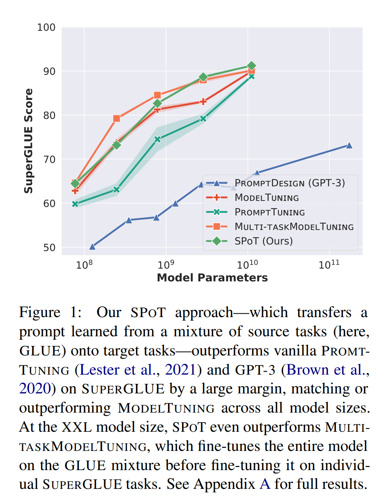

논문 및 이미지 출처 : <https://aclanthology.org/2022.acl-long.346.pdf>

# Abstract

Pre-trained Language Models (PLMs) 를 downstream task 에 적용하기 위한 peft method 에 관심이 커지고 있다.

Lester et al. (2021) 의 Prompt Tuning 은 다양한 task 수행을 위해 frzen PLMs 에 task-specific soft prompts 를 학습 시킨다.

저자는 **SPoT**: **S**oft **P**r**o**mpt **T**ransfer 접근법으로 새로운 prompt-based transfer learning 을 제안한다.

1. 먼저 하나 또는 그 이상의 source task 에 prompt 를 학습
2. 이후 target task 에 prompt 를 초기화하여 사용

- 많은 task 에서 Prompt Tuning 의 성능을 촉진
- SuperGLUE 에서 모든 모델 사이즈에서 model tuning (full fine-tuning) 을 비슷하거나 능가하고 27,000x 적은 파라미터 사용
- SPoT 이 가장 효과적인 지점을 이해하기 위해, 26 NLP task 에서 large-scale study 수행하고, 많은 task 가 서로 prompt transfer 을 통해 이익을 얻음을 보여준다.

마지막으로, task prompts 를 task embeddings 로 해석하여 유사한 tasks 를 식별하고, novel target task 에 대해 가장 transferable source task 를 예측하는 효율적인 retrieval approach 를 제안

# 1. Introduction

Large PLMs 가 과거부터 빠르게 개발되며 사이즈 또한 증가하며 best performacnce 를 보여준다.

이런 트렌드는 다양한 NLP 벤치마크에 대한 가능성 경계를 부수지만, 응용하는데는 어려움이 있다.

- fine-tuning 의 불가능을 우회하기 위해, Brown et al. (2020) Prompt Design 을 제안하여, 모든 downstream task 를 language modeling task 로 변환하고, frozen PLMs 은 추론 시 제공된 manual text prompts 로 다양한 task 수행
  - single frozen GPT-3 으로 few-shot 에 인상적인 성능을 보여주지만, prompt 선택에 의존하여 여전히 SOTA fine-tuning 에 못미침
- 최근 soft prompts 학습이 탐구되어, additional learnable parameter 를 모델에 주입
  - Lester et al. (2021) Prompt Tuning 을 제안하여, 각 downstream task 에 대해 adaption 중 small task-specific 을 학습하여 frozen model 을 conditioning
  - Prompt Tuning 은 model tuning 과 comparable 하지만, 모델 크기가 작을 때 (< 11B), gap 이 존재

본 논문에서, **SPoT**: **S**oft **P**r**o**mpt **T**ransfer 을 제안

1. 먼저 하나 또는 그 이상의 source task 에 prompt 를 학습
2. 이후 target task 에 prompt 를 초기화하여 사용

실험에서 task 및 model size 전역에서 prompt tuning 을 넘어선 향상을 제공

- SuperGLUE 에서, T5-Base (220M) 및 T5-XXL (11B) 에서 +10.1 및 +2.4 average accuracy 향상
- model size 전역에서 model tuning 과 comparable 하거나 outperform

위 결과에 동기부여받아, soft prompts lens 를 통해 task 간의 transferability 를 조사한다.

그리고 다음 질문이 발생할 수 있다.

- target task 가 주어졌을 때, source task prompt 를 언제 초기화하는 것이 성능을 촉진시키는가?
  - source 및 target task 로, 160 조합의 26 NLP 를 사용하여 T5-model 연구
  - 이 결과로 많은 task 는 prompt transfer 를 통해 서로 이득이 되는 것을 표시
- task prompts 를 사용하여 어느 source tasks 가 novel target task 로 잘 transfer 할 지 효율적으로 예측할 수 있을까?
  - task 의 semantic space 수행을 위해 learned task prompts 를 _task embeddings_ 로 해석하고 task 간의 유사성을 공식화
  - 저자는 task embedding simiarity 를 측정하여 positive transfer 할 가능성이 있는 source tasks 를 구별할 수 있는 retrieval algorithm 설계

**summarization**

- novel prompt-based transfer learning 인 SPoT 제안, model tuning 의 성능과 맞먹기 위해 prompt tuning 의 scalining 을 필요로 하지 않음을 보여줌
- task transferability 에 large-scale 및 systematic study 를 수행하여, tasks 가 서로 prompt transfer 되어 이득을 얻음을 입증
- task 의 semantic space 수행을 위해 task prompts 를 task embeddings 로 해석하고 서로 이득될 수 있는 task 를 식별하도록 task embedding simiarity 를 측정하는 효율적인 retrieval method 제안

# 2. Improving Prompt Tuning with SPoT

target task 에 대한 Prompt Tuning 성능 향상을 위해, SPoT 은 language model pre-trainng 및 target prompt tuning 사이에 중간 training stage 로 _source prompt tuning_ 을 도입 (Fig. 2, left)

- 하나 또는 그 이상의 source tasks 에 prompt 학습 (with frozen model) 시킨 후, target task 에 대한 prompt 를 초기화하여 사용
- Prompt Tuning 의 계산적 이득을 유지하며, target task 에 대해 small task-specific prompt 저장만 요구하여, 모든 task 에 single frozen PLMs 를 재사용 가능

all target tasks 에 대해 single transferred prompt 를 재사용하는 것을 **_generic_ SPoT** 로 표시

## 2.1 Experimental setup

SMALL, BASE, LARGE, XL, XXL with 60M, 220M, 770M, 3B, 11B parameter 의 모든 T5 사이즈를 frozen model 로 사용

### 2.1.1 Baselines

SPoT 과 다음 baselines 비교

#### Prompt Tuning

Lester et al. (2021) 의 vanilla prompt tuning 을 사용하며, 각 target task 에 prompt 를 독립적으로 직접 사용

#### Model Tuning & Multi-Task Model Tuning

prompt tuning 을 standard fine-tuning (Devlin et al. 2019; Raffel et al. 2020;) 인 model tuning 과 비교

공정한 비교를 위해, 개별적으로 target task 에 fine-tuning 하기 전에 SPoT 에 사용된 source tasks mixture 를 사용한  Multi-Task Model Tuning 을 포함하며

### 2.1.2 Evaluation datasets

GLUE 및 SuperGLUE 로부터의 다양한 set 에 downstream performance 연구

고정된 수의 step 으로 훈련하고 각 dataset 의 validation set 에 대한 결과를 report

### 2.1.3 Data for source prompt tuning

training data 의 선택은 성공적인 prompt transfer 에 중요하다.

source training data 의 영향을 조사하기 위해, 다양한 set 의 source tasks 비교

#### A single unsupervised learning task:

먼저 C4 (Colossal Clean Crawled Corpus) dataset 의 일부를 prompt 로 훈련하는 것을 고려

이 훈련은 (Raffel et al. 2020) 의 "prefix LM: 을 목적으로 수행

이미 frozen T5 model 을 pre-train 에 사용된 task 이지만, 여전히 일반적인 목적의 prompt 를 학습하는 데 도움이 될 수 있다.

#### A single supervised learning task:

대체로, supervised task 를 사용하여 prompt 를 훈련할 수도 있다.

MNLI 또는 SQuAD 를 single source task 로 사용

- MNLI : sentence-level classification task 에 도움이 된다.
- SQuAD : QA task 에 잘 일반화할 수 있음

#### A multi-task mixture:

T5 는 단순히 서로 다른 dataset 을 mixing 하였다.

저자는 GLUE, SuperGLUE, natural language inference (NLI), paraphrasing/semantic similarity, sentiment analysis, MRQA 의 question answering (QA), RAINBOW 의 commonsense reasoning, machine translation, summarization 및 GEM 의 natural language generation 등의 벤치마크를 섞는다.

위 tasks 에서 source task mixture 를 만들고, Raffel et al. (2020) 의 examples-proportional mixing strategy 을 사용하여 모든 데이터셋 (C4 + 55 labeled dataset) 으로 구성된 mixture 을 만든다.

artificial dataset size limit $\mathcal{K} = 2^{19}$ examples 사용

### 2.1.4 Training details

저자는 Lester et al. (2021) 의 훈련 과정을 밀접하게 따름.

- source 와 target prompt tuning 중 도입되는 new parameters 는 각 (embedded) input sequence 에 prepend 된 shared prompt $\rho \in \mathcal{R}^{\mathcal{L} \times \mathcal{E}}$
  - $\mathcal{L}, \mathcal{E}$ : prompt length 및 embedding size
  - 모든 케이스에서 $\mathcal{L} = 100$ tokens 설정 및 고정된 수의 step $\mathcal{S}$ tuning
  - Lester et al. (2021) 에선 $\mathcal{S}$ 가 30K 였지만, 저자는 large dataset 에서는 Raffel et al. (2020) 을 따라 예외적으로 $\mathcal{S} = s^{18} = 262,144$ 사용
- source prompt tuning 에선 prompt token embeddings 는 sampled vocabulary (흔한 tokens 5,000개) 에서 초기화
- 500 steps 마다 checkpoint 저장하고 validation 성능 중 우수한 checkpoint 에서 결과를 report

## 2.2 Effect of SPoT

#### SPoT significantly improves performance and stability of Prompt Tuning

T5 BASE 로 GLUE 및 SuperGLUE 벤치마크의 결과는 prompt transfer 이 Prompt Tuning 에 대한 성능 향상에 효과적이란 것을 시사

- GLUE 및 SuperGLUE 에서 SPoT 는 vanilla Prompt Tuning 보다 +4.4 및 +10.1 point average accuracy 향상
- ablation study 에선 longer tuning 이 best 성능을 위해 중요한 구성 요소인 것, prompt transfer 과 상호보완적임을 나타냄
- longer tuning 이 생략되면, SPoT 이 실행 간의 안전성을 향상시키는 것 관찰

---

SPoT 내의 다양한 source mixture 의 효과를 비교

- GLUE 의 source prompt tuning 이 GLUE 와 SuperGLUE 모두에서 best 성능을 얻어, 82.8 및 73.2 달성
- 흥미롭게, C4 에서의 unsupervised source prompt tuning 도 상당한 개선이 나타나며, SuperGLUE 를 사용한 것보다 SuperGLUE task 에서 우수한 성능 보임. MNLI 또는 SQuAD 를 single source dataset 으로 사용하는 것도 특히 target task 에 도움이 됨
  - 다른 source mixture 은 일부 task 가 다른 것보다 더 많은 혜택을 보이는 이득도 가져올 수 있다.
  - 모든 dataset 을 섞어도 best 성능을 달성하지 못할 수 있으며, 이는 interference/negative transfer 문제일 수 있다.
  - 즉, 하나 또는 이상의 source task 에서 좋은 성능을 달성하면 target task 성능에 해를 끼칠 수 있다.

#### SPoT helps close the gap with Model Tuning across all model sizes

- Lester et al. (2021) 에서 Prompt Tuning 이 XXL size 에서 model tuning 성능과 가깝게 일치했다. 하지만 작은 사이즈 모델에선 큰 gap 이 발생한다.
- 저자는 이 gap 을 줄이는데 도움을 주고, prompt tuning 의 계산적 이익을 유지하며 model tuning 의 성능을 넘어서 다양한 모델 사이즈에서도 큰 폭으로 넘었다.
- XXL size 에서, task-specific parameter 가 27,000x 더 적음에도 불구하고 SPoT 는 best average score 91.2 에 달성하여 multi-task model tuning 보다 +1.1 넘어 섰다.
- SPoT 효과 검증을 위해, XXL 모델의 예측을 SuperGLUE 리더보드에 제출하여, 89.2 score 달성
  - 파라미터 효율적 adaptation 에서 이전 모든 submissions (GPT-3, 71.8) 보다 뛰어나며, 27,000x 적은 파라미터를 튜닝하였는데도 full fine-tuned T5-XXL (89.3) 과 맞먹는다

# 3. Predicting task transferability

