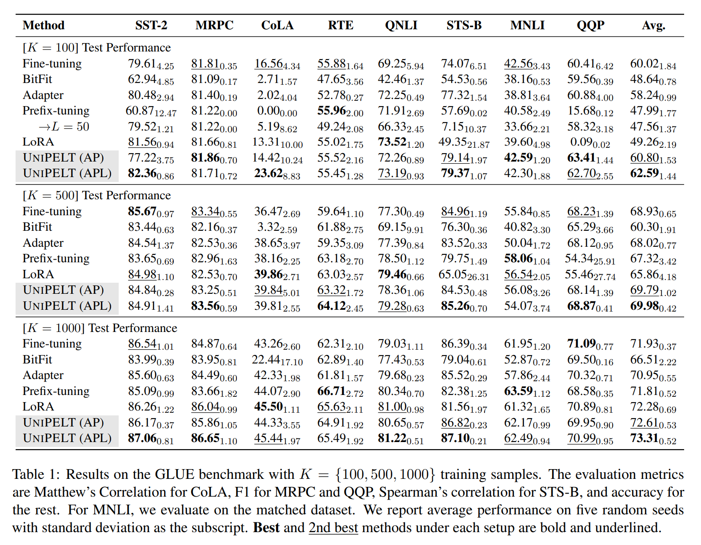
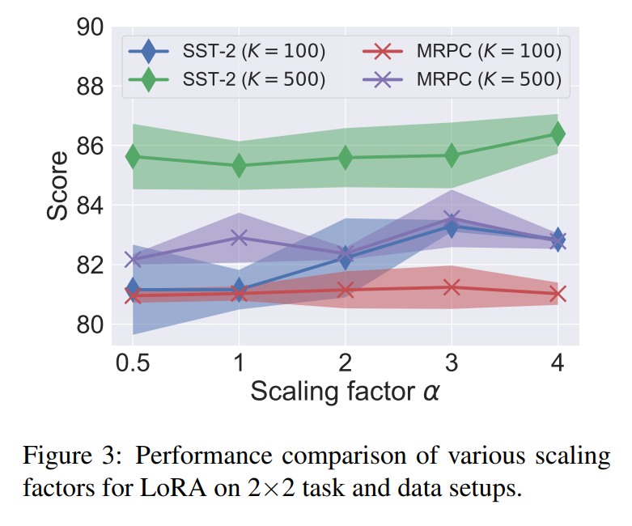
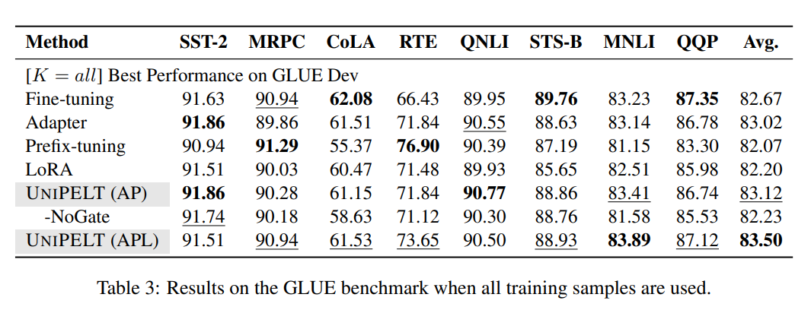

논문 및 이미지 출처 : <https://aclanthology.org/2022.acl-long.433.pdf>

# Abstract

최근 parameter-efficient language model tuning (PELT) 으로 적은 trainable parameter 로 fine-tuning 성능과 맞먹거나 적은 training data 에서 성능이 좋은 방법 등장

하지만 다양한 PELT methods 는 동일한 task 에 상당히 다른 성능을 보이며, 특정 task 에 대해 적절한 method 를 선택하는 것은 쉽지 않다.

특히 new PELT methods 외 task 가 늘어나고 있는 상황을 고려하면 더 어렵다.

모델의 다양성과 선택의 어려움을 고려하여, 저자는 **UNIPELT** 를 제안

- 다양한 PELT 방법을 submodeuls 로 포함하고, 현재 data 나 task setup 에 적합한 방법들을 활성화시키기 위한 **gating mechanism** 을 통해 학습
- GLUE 에서 UNIPELT 는 일관성 있게 개별 PELT 보다 1~4% 성능 향상, 다양한 설정에서 fine-tuning 능가
- 일반적으로 submodules 를 개별 사용했을 때의 각 task 에 대한 best performance 를 취합산 상한선을 넘어서는 경향이 있어, 여러 PELT mixture 가 single 보다 효과적임을 시사

# 1. Introduction

pre-trained language models (PLMs) 는 커져감에 따라, task 당 model parameter 개별적 복제를 수정하는 fine-tuning 은 점점 불가능해지고 있다.

이를 해결하기 위해, 최근 **p**arameter-**e**fficient **l**anguage model **t**uning (PELT) 연구가 급증하고 있다.

기존 PELT 는 few trainable parameter 로 fine-tuning 과 comparable perforance 를 목표로 한다.

최근 방법의 parameter 는 PLM 의 total parameter 에 비해 무시할 수 있을 수준 (< 1%) 으로 줄었다.

더 어려우며 덜 연구된 문제는 fewer parameter 로 fine-tuning 보다 좋은 성능을 달성하는지 여부다.

최근은 training data 가 제한된 경우 PELT 가 overfitting 의 위험을 줄여 특정 task 에서 fine-tuning 보다 효과적임을 입증했다. 하지만 저자의 실험에서 발견한 것과 같이 (Table 1), 다양한 PELT 는 동일한 task 에 다양한 특성을 보이며, 특히 새로운 PELT 와 task 가 늘어나고 있어 가장 적합한 방법을 선택하기란 어렵다.

---

PLET 간의 성능 차이와 최적의 방법을 선택하는 비용을 고려하여, 통합 PELT 인 UNIPELT 제안

- 다양한 PELT 를 submodule 로 통합하고, data or task 에 가장 적합한 submodule 또는 그 조합을 동적으로 활성화하여 학습
- 모델 선택이 필요하지 않으며, 다양한 설정에서 일관된 성능 향상을 보여줌
- 각 submodule 의 activation 은 _gating mechanism_ 으로 제어되며, 주어진 task 에 긍정적으로 기여하는 submodule 을 학습 (가중치를 더욱 할당)
- 각 submodule 의 parameter 수가 일반적으로 적어, 여러 방법을 결합해도 효율성 유지

---

저자는 네 가지 PELT 를 택하였다.

- Adapter (Houlsby et al. 2019)
- Prefix-Tuning (Li and Liang. 2021)
- LoRA (Hu et al. 2021)
- BitFit (Ben Zaken et al. 2021)

저자는 _PELT 개별 특성_과 여러 설정의 UNIPELT 가 조화를 이룰 때의 효과성을 검토하는 두 가지 분석 셋 수행

- GLUE 에서의 실험 결과 (32 setup - 8 tasks x 4 data sizes, 1,000+ runs) PELT 의 다양한 행동을 보여주며, 각 방법의 개별 사용보다 UNIPELT 다 효과적이며 견고함을 보여줌
- 일관되게 best submodule 을 1~4 points 개선하며, 때론 fine-tuning을 능가하여 최상의 평균 성능 달성
- 일반적으로 각 task 에서 개별적으로 사용된 모든 submodule 의 최고 성능 초과
  - 아는 다양한 설정에서 최적의 성능을 유지한다는 것을 시사
- 상한선을 능가한다는 사실은 PLM architecture 의 다양한 부분을 포함하는 PELT 방법이 mixture 이 single 보다 내재적으로 더 효과적임을 나타냄

**Contributions**

1. PELT 에 대한 포괄적인 연구를 수행하고 성능 및 특성 측면에서 차이와 공통점을 검토
2. 기존 PELT 를 submodule 로 포함하고 주어진 task 에 적합한 submodule 을 자동으로 활성화할 수 있는 통합 PELT 제안
3. UNIPELT 는 다양한 설정에서 fine-tuning 및 PELT 보다 우수한 평균 성능 달성, 종종 best 성능을 발휘하고 결코 worst 성능은 되지 않으며 모델 효율성도 좋다. 

# 2. Preliminaries

## 2.1 PELT Methods without Additional Parameters

PLM 은 top layers 또는 prediction head 만 additional parameter 없이 fine-tuning 될 수 있다.

하지만 fine-tuning 은 일반적으로 all parameter tuning 보다 훨씬 나쁜 성능을 내는 경우가 많다.

최근 BitFir 은 PLM 의 bias 만 tuning 하여, limited training data 에서 일부 task 에서 fine-tuning 과 유사한 성능을 달성할 수 있는 것을 실험적으로 보여줬다.

따라서 저자는 이 카테고리를 대표하는 분석을 위해 BitFir 을 선택했다.

## 2.2 PELT Methods with Additional Parameters

대안으로 all PLM 을 고정하고 new trainable parameter 를 도입할 수 있다.

이 카테고리의 예시로 Adapter, Prefix-Tuning 등이 있다.

#### Adapter

PLM 의 각 Transformer layer 의 feedforward network 뒤에 trainable _bottleneck layer_ 를 추가

bottleneck layer 은 token hidden states size 를 축소하고 복구하는 down+up projection pair 으로 구성된다.

수학적으로, 

- feedforward network 후 residual connection 과 layer normalization 을 거친 output : $h_{FN}$
- hidden size : $D_{\text{hidden}}$
- bottleneck size : $D_{\text{mid}}$
- bottleneck layer $h_A$ 의 output 은 다음과 같다.

$$
\begin{equation}
    h_A = W^\top_\text{up} \phi (W^\top_\text{down}h_{FN}),
\end{equation}
$$

- $W_{\text{down}} \in \mathbb{R}^{D_\text{hidden} \times D_{\text{mid}}}$, $W_{\text{up}} \in \mathbb{R}^{D_\text{mid} \times D_{\text{hidden}}}$, $\phi$ : nonlinear activation function. 간결성을 위해 bias 는 제거
- layer normalization 및 final prediction head parameter 도 특정 adapter 에 따라 fine-tuning

Adapter 는 fine-tining 과 비슷한 성능이거나 low-resource 에서 더 효과적인 것으로 나타났다.

#### Prefix-Tuning

Prefix-Tuning 은 각 transformer layer 의 multi-head attention 의 input 앞에 task-specific trainable vectors 를 붙인다.

구체적으로, 

- original sequence length : $L_0$
- trainable vectors number (i.e. prefix length) : $L$
- Transformer layer input : $h_\text{in} \in \mathbb{R}^{D_{\text{hidden}} \times L_0}$

1. three linear projections $W_Q$, $W_K$, $W_V \in \mathbb{R}^{D_{\text{hidden}} \times D_{\text{hidden}}}$ 는 $h_\text{in}$ 을 Query $Q$, Key $K$ 및 Value $V$ 로 변환
2. two prefix matrices $P_K$, $P_V \in \mathbb{R}^{D_{\text{hidden}} \times L}$ 는 $K$ 및 $V$ 앞에 붙임
3. optimization 안정화를 위해, prefix matrix $P$ 는 feedforward network 를 통해 reparameterize

$$
\begin{equation}
  P' = W^\top_\text{up} \phi (W^\top_\text{down}P),
\end{equation}
$$

- $W_\text{down} \in \mathbb{R}^{D_{\text{hidden}} \times D_{\text{mid}}}$, $W_\text{up} \in \mathbb{R}^{D_{\text{mid}} \times 2N_\text{layer}D_{\text{hidden}}}$
  - $N_\text{layer}$ : Transformer layers 수
  - 위 두 network 는 training 후 폐기할 수 있으며, $2N_{\text{layer}}$ prefix matrices $\in \mathbb{R}^{D_\text{hidden} \times L}$ 만 필요

Prefix-tuning 은 원래 NLG 에서 평과되며, 저자는 이를 적용함.

prompt-tuning (Lester et al. 2021) 이란 후속 방법은 prefix 를 첫 번째 layer 로 제한하여 task-specific parameters 를 더 줄이지만, 모델이 큰 경우에만 competitive performance 유지

#### Additive Methods

Additive PELT 는 fine-tuning 후의 model parameter 를 pre-trained parameters $\theta_\text{pre-trained}$ 와 task-specific differences $\delta_\text{task}$ 의 합으로 취급

- $\theta_\text{pre-trained}$ fixed
- new (sub)set : $\theta_\text{task} = \theta_\text{pre-trained} + \delta_\text{task}$ 추가
- $\delta_\text{task}$ 를 parameterize 하는 다양한 방법 : LoRA, diff pruning 및 side-tuning 존재

저자는 LoRA 를 대표적인 방법으로 채택하여 이를 UNIPELT 에 통합

- LoRA 는 trainable low-rank matrices 도입 및 이를 multi-head attention 의 original matrices 에 결합
- 특히, two matrices $W_\text{down} \in \mathbb{R}^{D_\text{hidden} \times D_\text{mid}}$ 및 $W_\text{up} \in \mathbb{R}^{D_\text{mid} \times D_\text{hidden}}$ 은 original matrix $W_Q$ 및 $W_K \in \mathbb{R}^{D_\text{hidden} \times D_\text{hidden}}$ 인 query 및 key projection 에 추가된다:

$$
\begin{equation}
  Q = (W^\top_Q + \alpha W^\top_\text{up}W^\top_\text{down})h_\text{in}
\end{equation}
$$

- $\alpha$ : task-specific differences 를 조절하기 위한 fixed scalar hyperparameter
- LoRA 의 trainable matrices 형태는 Adapter 나 Prefix-Tuning 과 유사하지만, 이들은 activation function $\phi$ 가 없음

# 3. Unifying PELT Methods

## 3.1 Task Formulation

size $|\mathcal{M}|$ 인 PLM $\mathcal{M}$ 이 비용 또는 저장 문제로 fine-tuning 이 불가할 경우, PELT 목록 $\{m_i\}$ 이 있을 때 (i.e. $\sum_i |m_i| \ll |\mathcal{M}|$), 각각이 submodule 로 포함되어 $\{m_i\}$ 를 동적으로 활성화 (upweight)하고 적절한 시나리오에 따라 다양한 submodules 을 활성화하는 통합 PELT 를 설계하는 것이 목표.

이렇게 하여 모든 method x task x data 조합을 순열하는 번거로움 없이 효과성과 견고성 양측을 만족시킬 수 있다.

## 3.2 Proposed Method

#### Motivation & Intuition

개별적으로 PELT 분석 중 저자는 다양한 특성과 same task 에 대해 다른 수행을 하는 PELT 들 관찰

- Prefix-Tuning 은 training data 와 관계없이 NLG task 에 잘 수행
- Fig. 1 과 같이, 다양한 PELT 방법들을 PLM 의 각기 다른 부분에 포함 (e.g. prefix-tuning 은 multi-head attention 이전 및 adapter 는 feedforward layer 이후)
  - 이는 서로 직접 간섭하지 않고 여러 PELT 방법을 결합하는 것이 가능

위 두 가지 관찰을 고려하여, PELT 방법을 submodules 로 포함하는 hybrid 방식을 채용한 unified PELT framework 인 **UNIEPLT** 제안

- high level 에서, UNIPELT 는 여러 이유로 single PELT 보다 성능 개선
  - UNIPELT 는 current task 나 specific data sample 에 가장 적합한 submodule 을 활성화 (upweight)하고 나머지는 비활성화 (downweight)하는 방식으로 학습
  - UNIPELT 가 일반적으로 각 task 에 개별적으로 사용된 submodule 의 best performance 보다 더 나은 성능을 보이는 경향 발견
  - (PLM 의 다른 부분을 수정하는) multiple PELT 이 사용되면 모델 효과성을 향상시키는 일부 누적 효과가 있을 수 있음을 시사

#### Gating Mechanism

submodule (de)activation 의 fine-grained 달성을 위해, 저자는 모든 Transformer layer 의 submodule $m_i \in \{\text{A, P, L}\}$ 마다 trainable gate $\mathcal{G}_{m_i}$ 추가 (Fig. 1 참고)

- A, P, L : Adapter, Prefix-tuning, LoRA
- $m_i$ 가 data x task (or instance) 에 유용하면, $m_i$ 에 대한 gate output 은 높아져 더 중요한 역할을 함. 하지만 실제 submodule 의 상호작용은 submodule 간의 종속성과 multiple layer 의 누적 효과로 인해 더 복잡하다.
- adapter 의 경우, feedforward network 와 adapter submodule 간에 residual connection 존재하며, 이는 adapter input (before normalization) $h_F$ 및 output $h_A$ 의 합을 final output $h'_A = h_A + h_F$ 를 생성
  - adapter 의 importance 를 sigmoid activation 을 사용하는 feedforward network 를 사용하여 직접 input $h_{FN}$ 을 통해 추정하는 gating function $\mathcal{G} \in (0, 1)$ 을 설계하고, output $h'_A = \mathcal{G}_A h_A + h_F$ 를 scaling
  - adapter submodule 은 $\mathcal{G} \approx 0$ 일 경우 효과적으로 우회
- ​prefix-tuning 의 경우도 유사하게, original tokens ($K$, $V$) 의 representation 은 유지한채 prefix vectors ($P_K$, $P_V$) 에 적용하는 gating function $\mathcal{G}_P \in (0, 1)$
  - 이 방식을 통해 prefix 의 영향은 prefix-tuning submodule 의 gating function output 이 낮은 경우 감소
  - gating function $\mathcal{G}_P$ 는 다른 feedforward network 를 사용하여 Transformer layer input $h_\text{in}$ 로 추정
- LoRA 의 경우, 기존 설계에서 이미 _constant_ scaling factor $\alpha$ 가 있다. 그래서 저자는 단순하게 이 factor 를 layer 마다 learnable 하게 변경
  - 이를 위해 $\alpha$ 대신 $h_\text{in}$ 을 input 으로 사용하는 third feedforward network $\theta_\text{task} = \theta_\text{pre-trained} + \mathcal{G}_L \delta_\text{task}$ 사용

UNIPELT 는 다양한 시나리오에서 효과적으로 작동하도록 구현하는 것은 쉽지 않다.

다양한 PELT 를 hybrid 방식으로 결합하는 것은 개별 사용보다 더 나쁜 성능을 초래할 수도 있다.

# 4. Experiments

세팅 당 8 tasks x 4 data sizes x 7 methods x 5 runs 에서 실험

## 4.1 Experiment Setup

#### Task Setup

linguistic acceptability (CoLA), sentiment analysis (SST-2), similarity and paraphrase tasks (MRPCNLU, QNLI, RTE) 를 포함하는 NLU task 인 GLUE 에서 실험 수행

Adapter 및 BERT 실험에 따라 WNLI dataset 도 포함

#### Data Setup

저자는 주로 training data 가 제한적이며 다양한 방법의 성능이 크게 다를 low-resource 고려

- 각 task size $K = \{ 100, 500, 1000 \}$ 의 small training subset 을 sampling
- 1,000 sample 을 training set 으로 사용하여 development set 에서 best checkpoint 선택하고 original development set 을 test set 으로 사용
- variance 를 줄이기 위해 5 random seed 를 섞고 평균 성능을 report
- whole training set 을 사용하고 GLUE development set 의 best 성능을 report 하는 high-resource 도 고려

#### Compared Methods

주로 UNIPELT 와 fine-tuning 및 PELT (prefix-tuning, BitFit, LoRA) 비교

2 및 3 PELT methods 를 통합한 UNIPELT (AP) 및 UNIPELT (APL) 도 비교

#### Implementation Details

BERT$_\text{base}$ 를 base model 로 실험에 사용

일관성 실험을 위해 BERT$_\text{large}$ 사용

공정한 비교를 위해 동일한 코드에서 모든 방법을 구현 및 평가

- methods 의 default hyperparameter 를 따름
- prefix length $L = 10$
- adapter bottleneck size $D_\text{mid} = 48$
- LoRA rank $D_\text{mid} = 8$

## 4.2 Analysis of Individual PELT Methods

여러 training data size 에서 GLUE 성능을 보여준다.

- 8 tasks 에서 여러 방법의 평균 성능이 때론 비슷하지만, task 간의 차이는 특정 셋팅에서 상당히 다르며 특정 task (e.g. STS-B 및 MNLI, $K = 500$) 에서 5~9 points 더 높았다.

#### Analysis of Adapter

adapter 의 성능은 비교적 안정적

- 다양한 task or training data size 에서 fine-tuning 보다 좋거나 나쁜 것이 없음
- 일반적으로 대부분 case 에서 fine-tuning 보다 약간 성능이 안좋음
- He et al. (2021) 처럼 각 task 에 대한 model hyperparameter 를 조정하지 않는 한, low-resource 환경에서 fine-tuning 보다 일관되게 성능이 높은 것을 관찰하진 못함.
- 이는 많은 task 가 있을 경우 계산적으로 불가능할 수 있음
  - 그들은 $\{ 64, 128, 256 \}$ 에서 bottleneck size $D_\text{mid}$ 를 선택한 반면, 저자는 $D_\text{mid} = 48$ 로 고정하고 모든 task 에서 실험
  - 저자는 Pfeiffer et al. (2021) 를 따라 각 Transformer layer 에 one adapter 만 추가
  - 위 두 차이로 인해, 저자의 Adapter 는 He et al. (2021) 에서 사용된 Adapter 보다 62.4% ~ 90.5% fewer parameter 를 가짐

Adapter 의 bottleneck size $D_\text{mid}$에 대해 더 조사

$D_\text{mid}$ 를 증가시키고 Adapter 의 성능이 좋지 않던 setup (CoLA, $K=100$) 을 재평가

- Fig. 2 와 같이, Adapter 성능은 점진적으로 향상
  - $D_\text{mid} = 256$ 일 때 뚜렷하게 향상
  - 기존 Adapter ($D_\text{mid} = 48$) 보다 5.3x trainable parameters 를 포함.
  - UNIPELT (AP) 보다 4.3 x, UNIPELT (APL) 보다 3.4x 많음
  - 위는 Adapter 가 비효과적인 학습을 할 때, 더 큰 bottleneck size 가 유용함을 시사
- 반면 Adapter 가 다른 PELT 보다 우월한 성능을 보이는 specific task (e.g. STS-B)이 있음
  - 이는 training data size 에 관계없이 Adapter 를 선호해야하는 상황이 있음을 시사

#### Analysis of Prefix-tuning

- prefix-tuning 은 $K = \{100, 500\}$ 에서 수행
- K$ 가 1000 에 달하면 fine-tuning 과 동등해짐
- training data 가 제한적일 때 특정 task (e.g. $K=100$ on SST-2 및 $K = 500$ on QQP) 에서 효율적인 학습이 실패한다.
  - 불만족스러운 성능 및 large variance 초래
  - 이런 현사아은 few-shot prompt-tuning 에서도 관찰됨
- prefix-tuning 의 안좋은 성능은 fewer trainable parameters 때문은 아니다.
  - adapter 와 comparable 한 trainable parameter 가 되도록 prefix length $L = 50$ 으로 증가시키고 $K = 100$ 의 8 tasks 에서 평가
  - 4 tasks ($L = 10$ 로, SST2, CoLA, STS-B 및 QQP 에서 안 좋았던 성능) 의 경우, 3 tasks 가 상당히 향상. 다른 task (STS-B) 는 성능 크게 저하
  - 이는 low-resource 에서의 훈련 불안전성이 있음을 시사. more trainable parameter 를 사용해도 여전히 문제
  - prefix-tuning $L=50$ 은 4 task 중 3개에서 여전히 Adapter 나 UNIPELT (AP) 보다 성능 좋지 않음
  - $L = 50$ 의 prefix-tuning 8 task 에 대한 평균 성능은 $L = 10$ 일 때보다 더 나쁘며, 이는 prefix length 증가가 만병통치약이 아님을 시사
  - large $L$ 은 training/inference 에도 고비용의 multi-head attention 으로 저하를 일으킴

반면, prefix-tuning은 specific task (RTE 및 MNLI)에서는 좋은 성능을 보이며, 이는 특정 경우에는 prefix-tuning 을 선호해야 한다는 것을 나타냄.

#### Analysis of BitFit & LoRA

저자의 실험에선 model bias 조정만으로는 만족스러운 결과를 얻지 못함

- BitFit 은 저자의 실험에서 좋은 결과를 내지 못하며 다양한 data 및 task 에서 최악의 성능을 보임
- 따라서 이후 실험에서 BitFit 은 고려하지 않고, UNIPELT 의 submodule 에서 BitFit 제외

---

- LoRA 의 경우 STS-B 및 QQP ($K = \{100, 500\}$) 에서 효과적으로 학습하지 못하여, 실행 간 variance 가 높다.
  - 그 외에는 fewer trainable parameter 를 사용해도 Adapter 같은 competitive 성능을 나타난다.
  - $ㅏ = 1000$ 일 때 8 asks 중 4 tasks 에서 최고 또는 2위 성능 달성
- LoRA 는 저자의 static gating function 으로 볼 수 있는 scaling factor $\alpha$ 존재. 저자는 다양한 $\alpha$ 로 LoRA 를 평가하여 중요성 조사
  - Fig. 3 처럼, LoRA 는 scaling factor 에 민감.
  - 여러 task 와 data setup 에 잘 작동하는 최적값이 보이지 않음.
  - $\alpha$ 를 증가시키면 일관되게 빠른 수렴이 이뤄지는 것을 발견. 이는 큰 $\alpha$ 로 인해 trainable parameter 가 더 큰 gradient update 를 받기 때문

## 4.3 Analysis of UNIPELT

#### Low-Resource Performance

UNIPELT (APL) 및 UNIPELT (AP) 를 training sample 수에 관계없이 development 및 test set 에서 일관되게 best 및 second best average performance 달성

- 이 결과는 hybrid 방식이 모델의 효과성 및 일반화에 이점을 줌
- 각 per-task level 에서 UNIPELT (APL) 및 UNIPELT (AP) 는 100/500/1,000 sample 로 훈련시켰을 때, 8 tasks 중 7/6/7 tasks 에서 best 및 second best performance 발휘. 어떤 설정에서도 worst performance 를 내지 않음
- 두 변형 모델을 비교할 때, UNIPELT (APL) 은 100/500/1,000 sample 에서 8 tasks 중 4/6/8 tasks 에서 UNIPELT (AP) 능가
  - 이 결과는 UNIPELT 가 견고하며 다양한 상황에서 신뢰 가능한 성능을 발휘함을 나타냄
- UNIPELT 의 개선은 일반적으로 fewer training sample 일 때 더 크다.
  - 이는 UNIPELT 가 low-resource 에서 특히 잘 수행됨을 시사
  - 특히, CoLA 및 QQP task ($K = 100$) 에서 다른 PELT 는 효과적으로 학습하지 못할 때, UNIPELT 는 fine-tuning 보다 우수한 성능 달성

#### UNIPELT vs. Upper Bound

Table 2 에서 UNIPELT 와 각 task 에서의 submodule 의 best performance 를 고려한 상황 비교

- UNIFPELT (AP) 및 UNIPELT (APL) 이 상한과 유사하거나 나은 성능 발휘
  - 이는 UNIPELT 가 서로 다른 submodules 를 활용하고 다양한 설정에서 (거의) best performance 를 유지하는데 성공함을 시사
- UNIPELT 가 상한을 능가할 수 있는 사실은 PELT 의 혼합이 본질적으로 효과적임을 시사

UNIPELT가 상한을 능가할 수 있는 사실은 PELT 방법의 혼합이(PLM 아키텍처의 제한된 범위를 갖는 단일 방법보다) 본질적으로 효과적일 수 있다는 가능성을 시사합니다.

#### High-Resource Performance

Table 3 에서 all training samples 를 사용했을 때의 성능을 나열

- UNIPELT 가 다시 best performance 달성
  - 이러한 향상이 low-resource 보다는 덜 중요하다고 언급했다. 기존 PELT 방법은 일반적으로 충분한 데이터가 있을 때 fine-tuning 과 유사한 성능을 발휘하며 향상 잠재력이 그리 높지 않기 때문
  - 그럼에도 UNIPELT 는 8 task 모두에서 best 거나 second 이며, 개별로 submodule best performance 와 대체로 유사
  - 여러 PELT 를 누적하여 사용하는 것이 gating 없이는 high-resource 에서 잘 작동하지 않는데, UNIPELT-NoGate 는 각 task 에서 best performance 를 내지는 않지만, 그 평균 성능이 만족스럽지 않다. (-0.89 vs UNIPELT)

## 4.4 Efficiency of PELT Methods

Table 4 에 trainable parameter 및 training/inference time 을 fine-tuning 과 비교

#### Parameter Efficiency

PELT 의 trainable parameter 는 무시할 정도로 작아서 여러 방법을 결합해도 효율성에 손실을 초래하지 않는다.

- UNIPELT 는 fine-tuning 과 비교하여 여전히 few trainable parameter 를 가진다. (0.99% ~ 1.26%)
  - 이런 parameter 는 더 효율적인 변형을 사용하면 기본 버전과도 쉽게 교체 가능
  - more parameter-efficient 가 항상 더 나은 성능으로 이어지진 않음. 이는 저자의 실험과 이전 연구 (He et al. 2021; Pfeiffer et al. 2021) 에서 나타났음

#### Training and Inference Efficiency

parameter efficiency 로 인해 모든 PELT 는 fine-tuning 보다 30% ~ 50% 빠르게 학습하며, 이들을 통합한다고 해서 학습 속도가 느려지지 않는 반면, PELT inference time 은 더 오래 걸렸음

- 이는 더 많은 FLOPs 를 포함하기 때문
- UNIPELT 는 약간 더 큰 inference overhead (가장 느린 submodule 대비 4% ~ 11%)를 가지고 있음
  - 하지만 저자는 이를 무시 가능할 정도라 주장. 유사한 성능 향상을 달성할 수 있는 더 큰 모델 (e.g. BERT$_\text{large}$)은 약 300% 의 inference time 이 필요하기 때문

# 5. Related Work

#### Parameter-Efficient Tuning of PLMs

다양한 downstream task 를 위해 large PLM 전체를 copy 하고 훈련 및 저장하는 것이 현실적으로 점점 어려워져, few trainable parameters 를 사용하여 효율적으로 튜닝하는 것이 중요해짐

기존 PELT 는 new trainable parameter 의 도입 여부로 크게 두 가지로 나눌 수 있다.

- training model subset parameter (i.e. prediction head, bias terms)
- PLM 의 여러 부분에 task-specific parameter 도입 (i.e. multi-head attention 이전, feedforward layer 이후)

PELT methods 수의 증가로 UNIPELT 의 목적은 새로운 방법의 차이를 잘 이해하고 활용하는 것

#### Mixture-of-Experts

UNIPELT 는 다양한 input 에 따라 다양한 부분을 활성화시키는 방법과 관련 있다.

그 중 하나는 Mixture-of-Experts (MoE) (Jacobs et al. 1991; Shazeer et al. 2017) 이다.

- MoE 는 experts (neural networks) set 과 각 input 에 특화된 experts 의 조합을 선택하는, 하나 이상의 trainable gates 를 유지
- 개념적으로 유사하지만 UNIPELT 와 MoE 는 다르다.
  - UNIPELT 의 submodules 는 MoE 처럼 명시적으로 합산되지 않고 순차적으로 영향을 미침
  - UNIPELT 의 "experts" 는 일반적으로 MoE 의 동질적이거나 동일한 것과 달리 다양함

# 6. Conclusion

본 논문에서 저자는 parameter-efficient language model tuning (PELT) 에 대해 포괄적인 연구 및 unified framework 로 여러 PELT 를 submodules 로 통합하고 task / data 에 대해 적절한 submodules 를 활성화하여 학습하는 **UNIPELT** 제안

- UNIPELT 는 다양한 설정에서 fine-tuning 및 submodules 보다 일관된 우수한 성능을 보임
- 개별 submodules 의 best performance 가 취하는 상한선을 일반적으로 능가
- 연구 결과 PELT 혼합이 모델 효과성과 견고성에서 선호될 수 있음을 시사