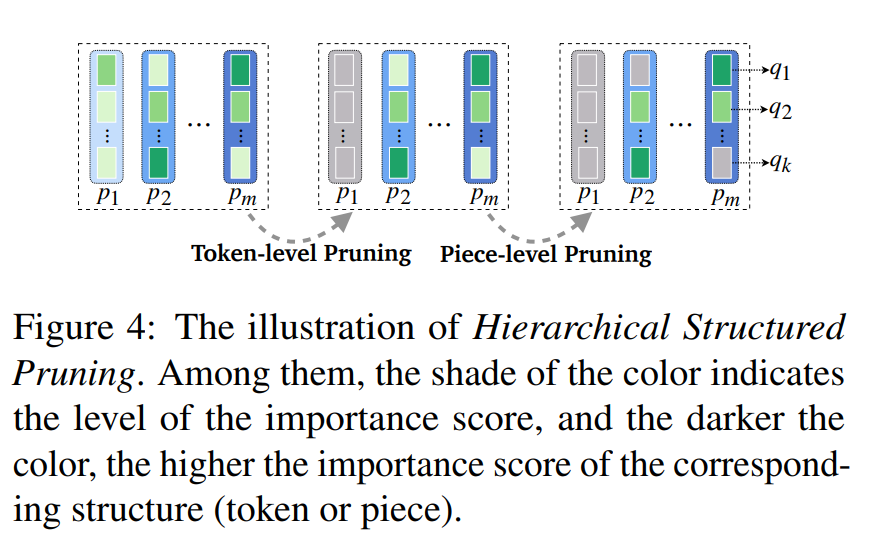
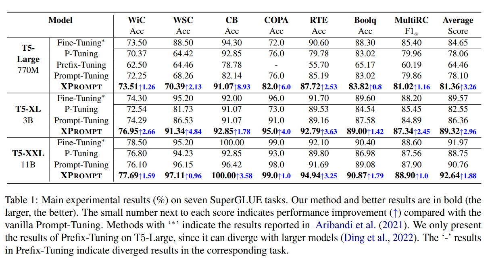
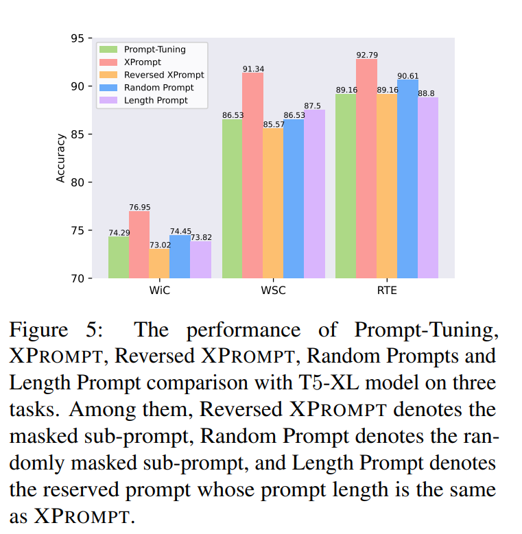
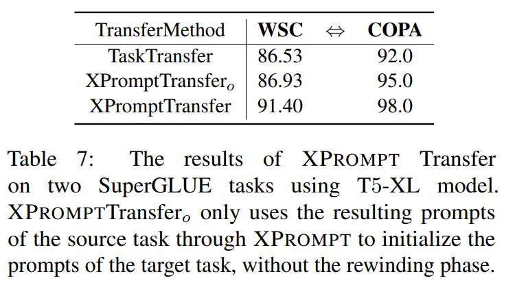
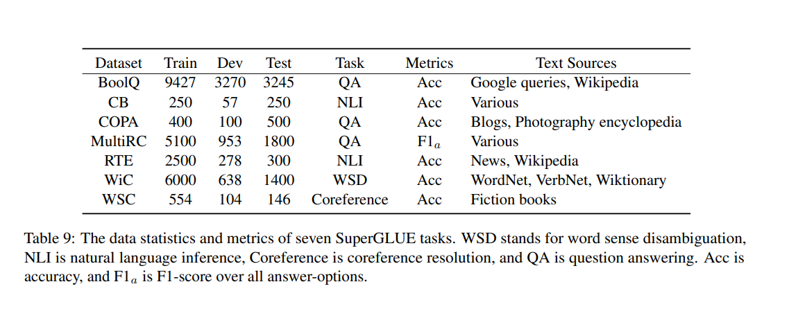

논문 및 이미지 출처 : <https://aclanthology.org/2022.emnlp-main.758.pdf>

# Abstract

Prompt tuning 은 frozen Pre-trained Language Models (PLMs) 를 conditioning 하기 위해 soft prompts 를 학습한다.

모델 규모가 커짐에 따라 prompt tuning 은 점차 fine-tuning 수준에 도달하지만, moderate 및 small scales (< 11B) 에선 여전히 성능 차이가 발생한다.

본 논문에서 저자는 trained prompt tokens 는 downstream task 에 negative 영향을 줄 수 있으며 성능 저하를 일으킬 것이라는 것을 경험적으로 보여준다.

- gap 을 줄이기 위해, 저자는 lottery tickets hypothesis 하에, **Prompt** tuning model with an e**X**tremely small scale (**XPrompt**) 를 제안
- 구체적으로, XPrompt 는 hierarchical structured pruning 을 통해 다양한 granularity levels 에서 negative prompt tokens 를 제거하여 더욱 parameter-efficient prompt 를 생성하여 competitive 성능 달성
- SuperGLUE task 에서 포괄적 실험으로, smaller model scales 에서 성능 gap 을 줄여줌

# 1. Introduction

PLMs 는 _pretrain-then-finetune_ 을 통해 널리 사용되어 큰 성공을 거두지만, memory 공간에 gradient 및 optimizer 저장을 위해 trainable parameter 가 크게 차지하고 있어 fine-tuning 이 parameter-inefficient 하다.

---

최근 Prompt-Tuning (Lester et al. 2021) 으로 input 에 _soft prompt_ 를 앞에 붙이고 훈련 중 prompt parameter 만 업데이트하여 위 이슈를 해결하는 것을 제안하였다.

- fine-tuning 대체제로, soft prompt scale 은 수만배 적음
- 더 간단하고 다른 peft (Adapter) 보다 유연하여 transformer layers 에 직관적으로 수정 가능
- 적은 tunable parameter 로 fine-tuning 성능과 competitive

---

위 gap 을 채우기 위해, 본 논문은 lottery tickets hypothesis (LTH) 관점에서 작성한다.

특정 task 에서 all prompt tokens 이 task 성능에 동등하게 기여하지 않는 관찰에 동기를 받아, 특정 prompt tokens 은 때론 negative 영향을 미칠 수 있다는 것이다.

Fig. 2 에서 관찰 결과를 보여준다.

- _negative prompt tokens_ 는 LTH 로 피할 수 있다.
  - LTH 는 sub-network 를 포함한 over-parameterized network 가 독립적으로 훈련 및 초기화되면 original network 의 정확도와 맞먹거나 능가
  - 이 sub-network 를 **Lottery Ticket** 이라 하며, PLMs 에서 이러한 ticket set 을 **winning tickets** 이라 한다.
- prompt tuning 에서 저자는 전체 prompt 사용의 성능과 동일하게 달성할 수 있는 **positive prompt tokens** 을 **winning tickets** 으로, **negative prompt tokens** 는 **losing tickets** 로 참조
  - 그래서 핵심은 winning tickets 은 식별하고 losing tickets 은 제거하는 것
- hierachical structed pruning 을 통해 losing tickets 을 제거하는 것 제안
  - **token-level** 에서 negative tokens 을 제거하고 **granularity level (i.e. piece-level)** 에서 남은 것들을 pruning
- LTH 와 일치하도록, 식별된 positive soft prompts 를 재훈련하기 위해 **weight rewinding** 채택

위 과정으로 negative prompt tokens 이 제거되어 parameter-efficient small scale prompt (XPrompt) 를 얻을 수 있다.

---

XPrompt 의 효과성 검증을 위해, high-resource 및 low-resource 상황의 SuperGLUE 에서 실험 진행

Fig. 1 및 Table. 1 에서 모든 task 및 model scale 에서 prompt-tuning 의 향상을 볼 수 있다.

- moderate scale 의 모델의 경우, XPrompt 로 fine-tuning 과 comparable 한 성능 달성 및 gap 줄임
- large scale 의 모델의 경우, XPrompt 가 Prompt-Tuning 을 넘은 성능을 얻었고, 대부분의 task 에서 fine-tuning 도 넘어섰다.

# 2. Related Work

## 2.1 Pre-trained Language Models

PLMs 는 NLP task 에서 큰 성공을 거두었다. 

- BERT 및 RoBERTa 는 masked language model (MLM) 으로 context representation 을 학습하는 것을 개척
- GPT-2, GPT-3 , ELECTRA, XLNet, BART 및 T5 같은 large PLMs 도 생겨남

하지만 parameter 수가 폭발적으로 커지며, fine-tuning model 은 parameter-inefficient 및 computationally expensive 하게 됨

게다가 다양한 task 에 대해 fine-tuning 하고 각각 저장하기까지 해야 한다.

## 2.2 Prompt Learning in NLP

GPT-3 의 개발과 함께, input 에 여러 _prompt tokens_ 를 추가하여 효율적인 학습을 하는 prompt tuning 이 관심을 받고 있다.

이는 다양한 downstream task 에서 효과적임을 입증했다.

- 최근 discrete tokens (token in the vocabularies) 에서 continuous tokens (trainable embedding) 으로 확장
  - 예로 (Lester et al. 2021), soft prompt 만 tuning 하고 PLMs 는 freezing 하는 효율적인 prompt tuning 제안
  - 하지만 여전히 moderate scale 에서는 fine-tuning 과의 gap 이 존재
- 더 최근 (Vu et al. 2021) prompt-based transfer learning 인 SPoT 은 source task 에 prompt 를 학습하여 target task prompt 에 초기화하여 적용해 성능을 향상시킴
- 가장 최근 (He et al. 2022) HyperPrompt 는 hyper-prompts 를 생성하기 위해 hypernetwork 를 사용하여 우수한 성능 얻음

위는 all parameter 를 조정해야 하며, task-conditioned parameter 만 튜닝하는 것이 multi-task learning 에 대한 fine-tuning 과 competitive 결과를 얻는데 충분치 않다는 것을 보여줌

## 2.3 Lottery Ticket Hypothesis

lottery ticket hypothesis 는 over-parameterized network 는, 초기화되어 독립적으로 학습하면 기존 network 의 정확도와 일치하거나 능가할 수 있는 subnetwork 를 가진 다는 것을 발견

- 이 subnetwork 를 **lottery ticket** 이라 함
- NLP 에서의 lottery ticket set 은 winning ticket 이라 함
- 이러한 winning ticket 은 task 및 dataset 간의 transerability 를 입증
- 최근 Chen et al. (2021) 에서 PLM 이 lottery ticket 의 존재를 보여줌
- Liang et al. (2021) 에선 winning ticket 의 일반화 성능이 full model 을 능가할 수 있음을 관찰

# 3. Preliminary

T5 의 text-to-text 기반으로 한 prompt tuning 은 all task 를 text generation 으로 고려하며 additional $l$ tunable soft prompt token 을 input 에 추가하고, inserted soft prompt token 의 parameter 만 업데이트 수행

구체적으로, $n$ 개의 input token $X = \{ x_1, x_2, \dots, x_n\}$ 이 있을 때, T5 는 먼저 token embeddings $X_e \in \mathbb{R}^{n \times e}$ 을 생성한다.

- $e$ : embedding space dimension

soft prompt embedding $P_e = \{ p_1, p_2, \dots, p_m \} \in \mathbb{R}^{m \times e}$ 생성

- $m$ : soft prompt length 

이후 soft prompts 는 $[P_e; X_e] \in \mathbb{R}^{(m+n) \times e}$ 형태로 input sequence 앞에 추가

prompt tuning 목표는 $P_e$ 를 optimizing 하여 label $Y$ 의 likelihood 를 최대화 하는 것

$$
\begin{equation}
    \underset{P_e}{\arg \max} \log p(Y|[P_e; X_e])
\end{equation}
$$

model scale 이 커짐에 따라 prompt tuning 은 더욱 효과적으로 작동한다.

하지만 small 및 moderate scale 에 대해서는 fine-tuning 과 성능 gap 이 존재한다.

저자의 가설은 target task 에 훈련 후 all soft prompt tokens 가 동등하게 성능에 기여하지 않을 것이라는 것이다.

특정 soft prompt tokens 은 task 에 negative impacts 를 줄 수 있다. 따라서 lottery ticket hypothesis 의 아이디어를 결합하여 저자는 XPrompt 를 제안한다.

이는 hierarchical structured pruning 을 사용하여 optimal soft prompts 를 식별하고 성능 차이를 줄인다.

# 4. XPrompt

Fig. 3 은 XPrompt 은 전체 과정이며 세 가지 main stages 를 포함한다.

- **_Prompt-Tuning_**
- **_Hierarchical Structured Pruning_**
- **_Rewinding_**

## 4.1 Prompt Tuning

input 에 soft prompt tokens 을 붙여 PLM 은 fixing 한 채 soft prompt 만 tuning

Prompt tuning 은 다양한 downstream task 에 효과적이다.

저자의 prompt tuning 은 Liang et al. (2021) 에 따르며, all soft prompt tokens 에 대한 embeddings 을 얻기 위해 target task 에 완전히 tuning

위의 trained soft prompts 는 hierarchical structured pruning 에 초기화되어 사용됨

## 4.2 Hierarchical Structured Pruning

Hierarchical Structured Pruning 은 trained prompt tokens 으로 부터 negative prompt tokens 을 분리하도록 설계하며 optimal soft prompt set 을 식별한다.

Fig. 4 에서 접근법을 보여준다.

- token-level pruning : negative prompt tokens 을 식별하기 위해 먼저 사용
  - 하지만, 남은 prompt tokens 에 nagative pieces 가 여전히 남아 있을 수 있다.
- piece-level pruning : 그래서, 각 prompt token 의 fine-grained negative prompt pieces 를 식별하기 위해 적용

두 pruning 을 통해 효과성과 효율성 간의 균형을 더욱 잡아 준다.

### 4.2.1 Token-level Pruning

trained prompt tokens 의 negative prompt token 을 식별하기 위해, soft prompt token vector $p_i$ 에 **mask variable $\gamma_i$** 을 연결

$$
\begin{equation}
    \hat{P}_e = \gamma \cdot P_e
\end{equation}
$$

- $\gamma = \{\gamma_1, \gamma_2, \dots, \gamma_m\}$
- $\gamma_i \in \{0,1\}$
- 0 value : soft prompt token 이 제거된 것을 나타냄

이후, negative prompt tokens 을 구별하기 위해 각 token 의 importance score 계산

importance score 는 mask variables 에 대한 model output 의 예상 민감도로 정의된다.

공식화 하면, soft prompt token $p_i$ 의 importance score $I_{p_i}$ 는 다음과 같이 계산된다.

$$
\begin{equation}
    I_{p_i} = \mathbb{E}_{x \sim D_x} \ |\frac{\partial \mathcal{L}(x)}{\partial \gamma_i}|
\end{equation}
$$

- $\mathcal{L}$ : loss function
- $D_x$ : training data distribution

본질적으로, 각 soft prompt token 의 importance score 는 해당 token 이 model performance 에 개별적으로 기여하는 정도를 나타낸다.

낮은 score 는 모델에 small 또는 negative 기여를 나타낸다. 다시 말해, 해당 soft prompt token 은 output 생성에 무시할 만한 prompt information 을 포함하는 것을 의미한다.

반대로, 높은 score 는 의미 있는 prompt information 을 가진 주요 기여를 나타낸다.

따라서 importance score 가 낮은 prompt 는 negative prompt token 일 수 있으므로, token-level pruning 에서 제거된다.

### 4.2.2 Piece-level Pruning

Token-level pruning 은 soft prompt token 을 찾지만, 각 soft prompt token 의 embedding 에 여전히 negative prompt pieces 가 남아 충분하지 않을 수 있다.

embedding pieces 는 downstream task 에 다른 영향을 미칠 수 있으므로, 각 token 내의 negative prompt pieces 를 제거하기 위해 Piece-level pruning 을 수행한다.

특히, 각 soft prompt token 의 embedding vector $p_{i_e}$ 를 $k$ pieces 로 나누어 $q_e = \{ q_{1_e}, q_{2_e}, \dots, q_{k_e}\}$ 로 만들고 각 piece 를 gradient updates 로 optimize 가능한 독립적인 단위로 취급

각 soft prompt token 의 piece 에는 negative prompt pieces 식별을 위한 mask variable $\zeta_i$ 가 연결된다

$$
\hat{q}_e = \zeta \cdot q_e
$$

- $\zeta = \{\zeta_1, \zeta_2, \dots, \zeta_k\}$
- $\zeta_i \in \{0,1\}$
- 0 value : soft prompt token 이 제거된 것을 나타냄

이후, low-imortance pieces 제거를 위해 모든 prompt token embedding 의 각 piece 의 importance score $I_{q_i}$ 를 계산한다.

$$
\begin{equation}
    I_{q_i} = \mathbb{E}_{x \sim D_x} \ |\frac{\partial \mathcal{L}(x)}{\partial \gamma_i}|
\end{equation}
$$

token-level importance score 와 유사하게, piece 가 모델 성능에 small 또는 negative 기여를 나타낸다.

저자는 서로 다른 compression ratio 로 sub-prompt tokens 와 pieces 를 얻기 위해 token-level 및 piece-level pruning 을 반복 수행한다.

## 4.3 Rewinding

LTH 에선 sparse subnetworks (unoruned prompts) 가 original network (all prompt) 와 동일한 정확도로 독립적으로 훈련될 수 있다 하며, pruning 후 unpruned weights 를 rewinding 하는 것을 제안

- LTH 에 따르면, 두 단계의 hierarchical structured pruning 후 soft prompt 를 재훈련하기 위해 weight rewinding 을 채택
- 구체적으로, optimal soft prompt 의 parameter 를 prompt tuning 후의 value 로 리셋
  - 다른 soft prompt 는 해당 mask values 를 0 으로 설정하여 pruning 된다.
- 마지막으로 prompt tuning 에서 사용된 original learning 전략을 사용하여 soft prompt 를 다시 훈련

구체적으로 선택된 최적의 소프트 프롬프트의 매개 변수를 프롬프트 튜닝 단계 후의 값으로 재설정합니다. 다른 소프트 프롬프트는 해당 마스크 변수를 0으로 설정하여 가지 치기됩니다. 마지막으로 우리는 프롬프트 튜닝에서 사용된 원래 학습 전략을 사용하여 소프트 프롬프트를 다시 훈련합니다.

# 5. Experiments

## 5.1 Datasets

저자는 NLP 에서 high-resource 및 low-resource 에서 SuperGLUE 의 다양한 데이터셋으로 평가

- 제한된 SuperGLUE testset 으로 인해 (Lester et al. 2-21; Ding et al 2021) 에 따라, training set 에서 고정된 steps 으로 prompt tuning 후 best checkpoint 를 사용하여 validation set 을 report

## 5.2 Baselines

#### Fine-Tuning

T5 의 standard fine-tuning (Raffel et al. 2020; Aribandi et al. 2021) 와 비교.

all pre-trained parameter 를 각각의 target task 에 개별적으로 fine-tuning

#### Prompt-Tuning

(Lester et al. 2021) 의 vanilla prompt tuning 는 frozen PLMs 를 downstream task 에 adapting 하기 위한 competitive 기술

#### P-Tuning

(Liu et al. 2021c) 의 P-tuning 은 target task 를 cloze problem 으로 변환하깅 위해 masked PLM 을 사용하는 prompt-based 방법이다.

이는 soft prompting 기술로 continuous space 에서 prompt 를 최적화. 또한 P-Tuning 의 두 번째 버전 P-TuningV2 와도 비교

#### Prefix-Tuning

(Li and Liang. 2021) 은 자연어 생성 작업에 대한 대안으로, small continuous task-specific vector (called prefix) 를 최적화

prefix 를 각 transformer layer 의 input 에 독립적으로 추가

## 5.3 Implementation

- 저자는 prompt learning을 위한 툴킷인 OnePrompt library 를 사용하여 구현
- 각 SuperGLUE dataset 을 text-to-text 형식으로 변환
  - 단, 어느 task 속했는지를 나타내는 task name 은 input
- XPrompt 는 pre-trained T5 checkpoint (Large, XL, XXL) 에서 구축
  - Lester et al. 2021; Ding et al. 2021. 에 따라 훈련 설정 
    - learning rate 0.3
    - batch size 16
    - epoch 100
    - token length 20
    - sampled vocabulary
  - token pieces 16
  - pruning frequencies $\{10\%, 20\%, 30\%, 40\%, 50\%, 60\%, 70\%, 80\%, 90\%\}$ 에서 linearly search
  - weight rewinding 은 한 번만적용되어 pruned soft prompt 를 re-train
  - best checkpoint 는 dev set 에서 early stopping 으로 선택
  - Adafactor optimizer 를 사용하여 weight decay $1e-5$ 훈

# 6. Results

## 6.1 Results on High-resource Scenarios

#### Xprompt 는 all model scales 에서 prompt tuning 성능을 향상시키고 fine-tuning 과의 gap 을 줄이는데 도움을 줌

Table 1 및 Table 8 (appendix) 는 SuperGLUE 의 main results

- XPRompt 는 Prompt-Tuning, Prefix-Tuning, P-Tuning 및 P-TuningV2 와 비교
  - vanilla Prompt-Tuning 을 all tasks 및 model scales 에서 능가
  - T5-Large, T5-XL 및 T5-XXL 의 average score 각각 3.26%, 2.96% 및 1.88% 의 개선을 보임
  - P-TuningV2 가 Prompt-Tuning 및 P-Tuning 을 능가하는데, XPrompt 는 P-TuningV2 보다 탁월한 성과를 거두어 효과적임을 입증
  - Prefix-Tuning 은 NLG task 를 위해 설계되어, 대부분의 NLU 에선 성능을 덜 발휘
- Table 1 에서 보이듯, XPrompt 는 T5-XL 의 all tasks 에서 fine-tuning 과 맞먹고, T5-XXL 에서의 대부분 task 에서 fine-tuning 을 능가
  - T5-XXL 의 경우 WSC, CB, RTE, Boolq, MultiRC 에서 각각 97.11%, 100.00%, 94.94%, 90.87% 및 88.90% 의 best score 달성하여 fine-tuning 대비 +1.91%, +0.0%, +2.84%, +0.47%, +0.30% 개선
  - prompt tuning 과 fine-tuning 사이에 small 및 moderate scales 모델에서 일부 gap 이 있는 것을 볼 수 있다. (Fig. 1) 하지만 XPrompt 는 all model scales 에서 이 gap 을 줄이고, downstream task adapting 에 도움을 주는 효율적인 것을 볼 수 있다.

## 6.2 Results on Low-resource Scenarios

#### XPrompt 는 low resource scenarios 에서 더 좋은 성능

각 task 에 대해 고정된 random seed 를 사용하여 새로운 training set 으로 32 개의 example 을 무작위로 선택

저자는 32-shot 에서 prompt model 을 tuning 하고 best checkpoint 를 사용하여 report

- Table 2 에서 보이듯, XPrompt 는 prompt tuning 의 성능을 더욱 향상시키고 Boolq, WiC 및 RTE 에서 동일한 규모의 baseline 을 능가
  - WiC 에서 62.85% 의 best score 달성하여 Prompt-Tuning 대비 +2.04% 개선
  - 이 k-shot 결과는 제한된 데이터로 훈련할 때 overfitting 이 심하더라도, XPrompt 가 일관되게 prompt tuning 의 성능을 향상시킨다는 것을 시사

# 7. Analysis and Discussion

XPrompt 효과성을 이해하고 다양한 요소의 영향을 탐구하기 위해, ablation 연구 및 분석

## 7.1 Do Positive Prompts and Negative Prompts Exist?

#### hierarchical structured pruning 을 통한 positive 및 negative prompts 을 식별

- positive prompt 에 대한 첫 번째 증거는 XPrompt 가 all task 및 model scales 에서 vanilla prompt tuning 에 비해 큰 성능 향상을 보여주어 효과를 입증
- 다른 증거는 pruning 의 high sparsities. appendix D 의 Fig. 9 와 Fig. 10 에서 WSC task 에 대한 importance score 의 original 과 pruned gradient saliency maps 를 보여준다.
  - 즉, Fig. 10 의 회색 요소는 low importance score 로 인해 prompt tokens 나 pieces 가 pruning 되었다는 것을 나타내며, 남은 부분이 winning ticket 이라 할 수 있다.
- 15% positive sub-prompt 를 사용한 XPrompt 의 성능은 full prompt tuning 보다 4.8% 높다.

#### negative prompts 는 Prompt Tuning 및 XPrompt 보다 낮은 성능

negative prompt 의 존재와 효과를 더 조사하기 위해 다른 구성으로 prompt tuning 성능과 비교

- vanilla Prompt-Tuning (all prompts) 와 XPrompt 외에도 세 가지 변형 소개
  - Reversed XPrompt : XPrompt 의 masked sub-prompt structures 를 반전시켜 low score prompt tokens 및 pieces 를 사용
  - Random Prompt : rewind stage 에서 tokens 및 pieces 를 무작위로 masking
  - Length Prompt : XPrompt results 와 동일한 promptl ength 로 re-train

- XPrompt 가 best performance 달성을 보여준다.
- Reversed XPrompt 가 Random Prompt 및 Length Prompt 를 포함한 all prompt tuning 변형보다 현저히 나쁜 성능을 보여줌
  - 이는 저자의 기대와 일치하며 negative prompt 의 존재를 더욱 확증
- Length Prompt 는 평균적으로 Random Prompt 및 Prompt Tuning 보다 성능이 떨어짐
  - 이는 저자의 hierarchical structured pruning 효과를 나타냄

## 7.2 Parameter Efficiency

#### XPrompt 는 Prompt-Tuning 보다 parameter-efficient

Table 3 에서 tunable parameter 수를 비교한다.

- Prompt-Tuning 은 이미 parameter-efficient 이며, full model fine-tuning 에 비해 0.0014% 의 parameter 만을 tuning
- XPrompt 는 hierarchical structured pruning 을 통해 Prompt-Tuning 의 tunable parameter 수를 더욱 감소 시킨다.
  - 예로, XPrompt 는 Prompt-Tuning 에 비해 parameter 의 15% 및 37.18% 만 tuning

## 7.3 Granularity of Pruning

#### Token-level pruning 및 fine-grained piece-level pruning 모두 중요

two-level pruning 의 효과 조사를 위해 Table 4 에 네 가지 SuperGLUE task 에서 포괄적인 pruning 실험 수행

- two level 의 pruning 은 vanilla Prompt-Tuning 보다 뛰어나며, toke-level 및 piece-level pruning 의 효과 입증
- 결과 최적화할 수 있는 trained prompts 의 sub-prompt structures 의 존재를 보여줌
- XPrompt 는 개별적인 pruning 보다 우수한 성능을 보이며, 이는 two-level 의 structured pruning 을 결합하는 것이 더 많은 이점을 준다는 것을 시사

## 7.4 Prompt Length

#### Prompt Length (20 초과) 늘리면 XPrompt  제한적인 이득만 얻는다.

Prompt Length 가 XPrompt 에 미치는 영향을 조사하기 위해 T5-XL 모델에 다양한 Prompt Length $\{10, 20, 100\}$ 으로 XPrompt 훈련

결과는 Table 5 에서 report 

- 결과에서 볼 수 있듯, Prompt Length 가 XPrompt 및 Prompt-Tuning 에 중요한 역할을 한다.
- 20 tokens 이상으로 늘리면 개선이 제한되는 것을 볼 수 있다.
- 이는 Lester et al. 2021 의 발견과 일치하며, 이는 모든 실험에서 20 tokens 으로 설정하는 이유

## 7.5 Prompt Initialization and Transfer

soft prompt transfer 접근법인 SPoT 에 영감을 받아 task transfer 및 다양한 prompt initialization 효과를 탐구하여, XPrompt Transer 을 도입

- 먼저 source task 에서 XPrompt 를 통해 prompt 훈련
- learned prompts 를 target task 의 prompt 로 초기화

#### Prompt initialization 은 XPrompt 에서 중요한 역할을 하며, XPrompt Transfer 은 성능 향상을 이끌어 냄

XPrompt 의 two sample initialization 을 비교하며, 이는 random uniform 및 sampled vocabulary 를 포함하여 Table 6 에 결과가 있다.

- sampled vocabulary 성능이 가장 좋은 것을 관찰
- XPrompt 는 random uniform initialization 에 대한 성능 향상을 이끌어냄

Task Transfer 과 XPrompt Transfer 을 비교하여, Task Transfer 은 source task prompt 만으로 target prompt 로 초기화하며 Table 7 에 결과가 있다.

- XPrompt Transfer 이 rewinding stage 없이 Task Transfer 보다 우수한 성능 보임
- pruning 과 rewinding 을 통해 큰 성능 향상 이끌어냄

# 8. Conclusions

본 논문은 small, moderate scales model 에 대한 prompt tuning 과 fine-tuning 간의 큰 성능 차이를 줄이는 것을 목표

- LTH 가설을 탐구하여, novel hierarchical structured pruning 방법인 XPrompt 제안
- 이 방법은 token-level 및 piece-level 에서의 positive prompt 와 negative prompt 분리
- SuperGLUE 실험에서 small parameter-efficient 를 제공하며 성능 유지

# Limitations

다양한 단계에서 negative prompt token 제거를 위해선 hierarchical structured pruning을 통해 pruned model 을 다양한 압축 비율로 rewinding 해야 한다.

다음 질문들에 대해선 아직 해결할 것들이 남아 있다.

- training 없이 optimal compression ratio 찾는 법
  - training process 를 자동화하고 효율성 향상시킬 수 있는 주요한 문제
- 다양한 시나리오를 추가하여 조사 필요
  - multitask learning 시나리오, out-of-domain (domain shift) 시나리오, 그리고 prompt ensembling 시나리오

# Appendix

## A. More Results of P-TuningV2

## B. Token and Piece Importance Score

위는 WSC task 에서의 prompt tokens 및 prompt token pieces 분포의 importance scores 를 보여준다.

대부분의 prompt token 이 importance score 를 가지고 있으며, 일부 prompt token 만이 높은 importance score 를 가지고 있는 것이 명확하다.

위 결과는 negative prompt 의 존재와 이들의 안정성에 대한 우리의 가설을 더욱 입증

## C. XPrompt Transfer

Fig. 8 처럼, source task 와 target task 가 주어지면 XPrompt Transfer 은 먼저 source task 에서 XPrompt 를 사용하여 prompt 훈련 후 얻은 prompt 를 target task 의 prompt 로 초기화하기 위해 사용하며, 이후 target task 에서 XPrompt 를 훈련

SPoT 와 달리, learned prompt 를 target task 의 prompt 초기화하는 데 사용하지 않고, 저자의 방법은 prompt 에 more cross tasks information 을 제공할 수 있다.

다양한 prompt initialization 결과는 Table 6 에 있으며, XPrompt Transfer 결과는 Table 7 에 있다.

## D. Importance Scores Visualization

Fig. 9 및 Fig. 10 에서 WSC task 에서의 importance scores original 및 pruned gradient saliency maps 을 보여준다.

Fig. 10 에서 회색 셀은 importance score 가 낮아 prompt token 및 piece 를 잘라내고 나머지는 winning ticket 을 의미한다.

## E. SuperGLUE Statistics, Metrics and Soft Prompt Templates

#### SuperGLUE benchmark

이전 연구에 따라 ReCoRD task 를 제외하고 7개 task 에 중점을 둔다.

ReCoRD 는 question answering 이기 때문이다.

