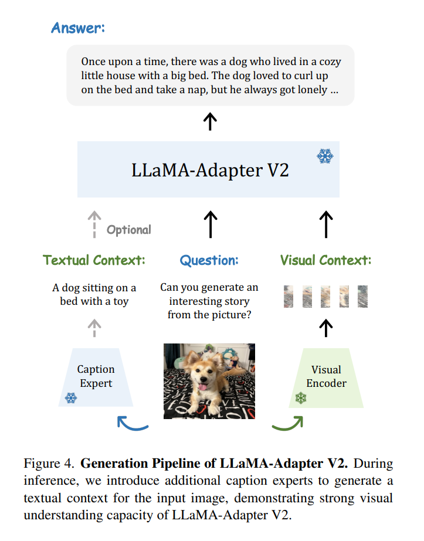
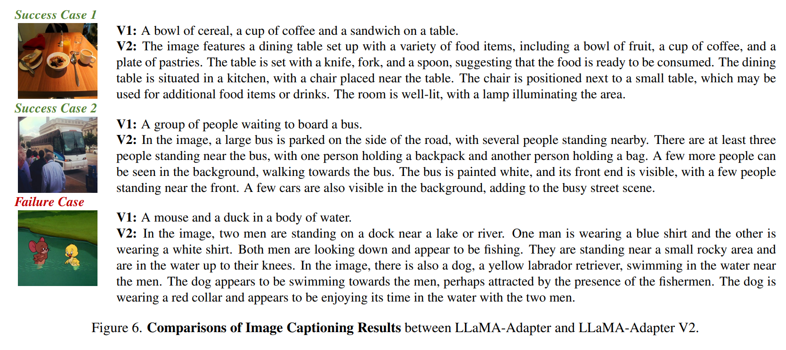
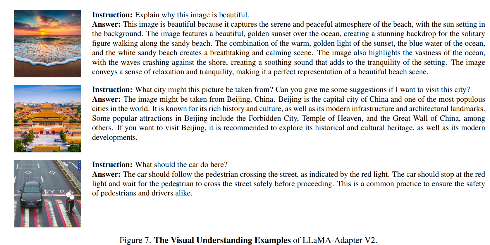
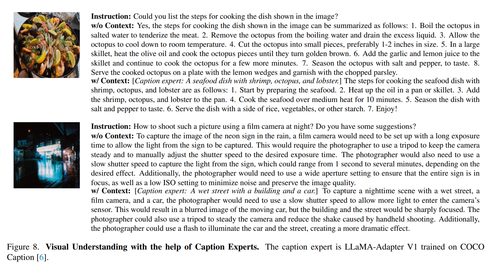

논문 및 이미지 출처 : <https://arxiv.org/pdf/2304.15010.pdf>

# Abstract

최근 LLaMA-Adapter 가 LLMs 와 visual input 을 다루는 잠재력을 보여주지만 여전히 open-ended visual instruction 은 잘 처리하지 못하며 GPT-4 에 뒤쳐지고 있다.

본 논문에서는 parameter-efficient visual instruction model 인 **LLaMA-Adapter V2** 제안

- LLaMA-Adapter 를 더 많은 learnable parameter (norm, bias 및 scale 등) 을 활용하여 보강
  - Adapter 외의 전체 LLaMA model 의 instruction-following 능력을 분산
- visual token 을 early LLM layer 에만 주입하는 early fusion 전략을 제안
  - visual knowledge incorporation 개선
- image-text pair 및 instruction-following data 의 joint training paradigm 을 도입
  - learnable parameter 의 분리된 그룹을 최적화
  - image-text alignment 및 instruction-following 두 작업 간의 간섭을 효과적으로 완화
  - 소규모 image-text 및 instruction-following dataset 만으로 강력한 multi-modal reasoning 달성

inference 단계

- LLaMA-Adapter 에 추가적인 expert models (e.g. captioning/OCR) 을 통합
- training cost 발생하지 않고 image understanding 능력 더욱 향상

기존 LLaMA-Adapter 와 비교하여 LLaMA-Adapter V2 는 LLaMA 에 14M parameter 추가만으로 open-ended multi-modal instruction 수행ㅅ 가능

그리고 이 설계는 language-only instruction-following 을 더욱 강화시키며 채팅 상호작용에도 뛰어난 성능을 보임

# 1. Introduction

최근 LLM 을 instruction-following model 로 변환하는 연구가 진행

Stanford Alpaca 는 InstructGPT model 로 생성된 instruction examples 를 사용하여 LLaMA 를 instruction-following model 로 fine-tuning 한다.

LLaMA-Adapter 는 가벼운 Adapter 와 zero-initialized attention 의 도입으로 frozen LLaMA 에게 parameter-efficient fine-tuning 으로 multi-modal knowledge 를 주입한다.

가장 최근은 MiniGPT-4 및 LLaVA 같은 연구로, language-only instruction model 을 multi-modal 로 확장하여 visual reasoning 능력을 부여하는 새로운 연구 파동을 일으켰다.

본 논문은 parameter-efficient visual instruction model 설계를 목표로 한다.

- LLaMA-Adapter 기반의 새로운 method 인 **_LLaMA-Adapter V2_** 개발
  - LLaMA-Adapter 는 instruction-following model
  - visual feature 를 adaptation prompts 로 주입하여 visual instruction model 로 변환
  - multi-modal instruction tuning data 의 부족으로 전통적인 vision-language model 로 제한됨
  - 예로, COCO Caption 에서 훈련된 LLaMA-Adapter 는 "“Generate caption for this image" 같은 prompt 에 대해 짧은 caption 만 생성 가능
  - 복잡한 visual reasoning 및 QA task 같은 open-ended multi-modal instruction 에는 adaptation 이 불가능
- frozen LLaMA-Adapter 를 사용하여 image-text pairs 에서 visual projection layer 를 최적화하여 vision-language alignment 를 보장하도록 개선
  - visual feature 가 adaptation prompts 에 두드러지며 instruction-following 능력이 빠르게 저하되는 것 관찰
- 이를 대응하기 위해 image-text alignment 와 language instruction funing 두 가지 task 간의 간섭을 해결하는 간단한 **_early fusion of visual knowledge_** 제안
  - LLaMA-Adapter 의 dynamic visual prompts 는 last $L$ layer 의 static adaptation prompts 에 통합
  - LLaMA-Adapter V2 에서는 dynamic visual prompt 를 처음 $K$ layer 에만 분배
    - $K < N - L$
    - $N$ : total number of Transformer layers
  - 이를 통해 image-text alignment 가 model 의 instruction-following 능력 방해하지 않음
- **_joint training with disjoint parameter_**
  - 고품질의 multi-modal instruction data 없이, image caption 및 instruction-following data 로 분리된 parameter 를 joint training 하여 우수한 visual instruction learning 가능
- **_bias tuning of linear layers_**
  - LLaMA-Adapter 를 normalization, layer bias 및 scale 같은 learnable parameter 를 unlocking 하여 보완
  - tunable capacity 를 증가시켜 instruction-following knowledge 를 LLM 전체에 분산
  - 이러한 parameter 는 모델 전체의 약 0.04% 만 차지
  - 이를 통해 parameter-efficient approach 유지
- **_additional expert models_** (captioning, detection 및 OCR system)
  - expert model 과 협력하여 LLaMA-Adapter V2 는 대규모 image-text pair 불필요
  - 다양한 expert 를 plugging 가능하여 유연성 얻음

다음은 주요 기여 요약

- Stronger Language Instruction Model
  - parameter-efficient tuning 및 high-quality language instruction data 사용하여 LLaMA-Adapter 능가
- Balanced Visual Instruction Tuning
  - image-text alignment 와 instruction-following object 간의 간섭 해결을 위해 early fusion 전략 사용
  - multi-modal instruction training data 없이 captioning data 및 instruction-following data 의 분리된 parameter 를 joint training
- Integration of Expert Systems
  - 다양한 expert model 통합

# 2. Related Work

# 3. A Revisit of LLaMA-Adapter

### Zero-initialized Attention

- instruction-following 능력 습득을 위한 parameter-efficient fine-tuning
- LLaMA-Adapter 는 LLaMA 를 freezing 하고 1.2M 추가 adapter module 만 도입
- adapter layer 는 LLaMA 의 Transformer layer 상단에 사용
- leanable soft prompt set 을 word token 의 prefix 에 연결
- new adapting knowledge 를 LLaMA 에 통합하기 위해 zero-initialized attention 사용
- 이를 통해 adaptation prompt word token 에 대한 기여를 학습 초기에 0으로 초기화된 gating factor 를 학습하여 조절
- 훈련 중 gating 크기는 점진적으로 커지며 LLaMA 에 주입

이 전략은 훈련 초기, LLaMA 의 언어 생성 능력을 보존하며 새로운 지식을 지속적으로 통합하여 강력한 instruction-following 능력을 만든다.

### Simple Multi-modal Variant

- multi-modal reasoning 을 위해 image 및 video 통합 가능
- pre-trained visual encoder 를 지닌 CLIP 으로 multi-scale visual feature 추출
- learnable projection layer 를 통과하여 visual semantics 를 language embedding space 와 alignment
- 이후 visual feature 는 Transformer layer 상단에서 element-wisely added

위 과정으로 LLaMA-Adapter 는 text 및 visual input 을 기반으로 response 생성 가능하여 ScienceQA 에서 comparable

### Open-ended Multi-modal Reasoning

LLaMA-Adapter 를 사용하여 COCO Caption dataset 에서 adapter module 및 visual projection layer 를 fine-tuning 하는 실험 수행

새로운 visual 단서가 adaptation prompt 를 간섭하는 경향이 나타나 instruction-following feature 를 덮어버림.

따라서 LLaMA-Adapter V2 를 제안하여, multi-modal 잠재력을 완전히 발휘하도록 함

# 4. LLaMA-Adapter V2

## 4.1 Bias Tuning of Linear Layers

LLaMA-Adapter 는 zero-initialized attention 으로 adaptation prompt 를 frozen LLaMA 에 사용

이는 new knowledge 를 통합하지만 LLM 내부 parameter 를 수정하지 않고는 parameter update 가 adaptation prompt 및 gating factor 로 제한됨

이 때문에 deep fine-tuning 수행 능력이 제한된다.

이를 고려하여 더욱 효과적인 통합을 위해 **_bias tuning_** 전략 제안

- instruction-following data 를 adaptively handle 하기 위해 LLaMA 의 모든 normalization layers 를 unfreezing
- Transformer 의 각 linear layer 에 대해 learnable parameter 로 bias 및 scale factor 추가
- 특정 linear layer 및 pre-trained weights 를 $\text{x}$ 및 $W$ 로 표시
- LLaMA-Adapter V2 에선, bias $b$ 및 scale $s$ 를 사용하여 linear layer 수정

$$
\begin{align}
    y = W \cdot \text{x} \rightarrow y = s \cdot (W \cdot \text{x} + b), \tag{1}  \\
    \text{where} \ b = \text{Init}(0),\  s = \text{Init}(1). \tag{2}
\end{align}
$$

- bias 와 scale factor 는 각각 0 과 1 로 초기화하여 초기 단계에 안정화
- bias tuning 및 high-quality instruction data 를 통합하여 우수한 instruction-following 능력을 얻음
- 특히, newly added parameter 는 전체 LLaMA 의 0.04% (약 5M) 만 차지
- LLaMA-Adapter V2 는 여전히 highly parameter-efficient approach

### Discussion

bias tuning 은 이전 parameter-efficient method 와 유사

BERT fine-tuning 을 위한 BitFit 및 visual prompt tuning 을 위한 SSF 가 있음

- BitFit 및 SSF 는 80M parameter scale 을 가진 comprehension task 를 위해 설계
- 저자의 approach 는 70B - 650B parameter scale 의 LLM 에서 효율성 나타냄
- bias tuning 은 input 에 독립적이며, row-rank 를 사용하여 input 에 의존적인 bias 를 추가하는 LoRA 와는 달리, fine-tuning 비용을 더 줄임

## 4.2 Joint Training with Disjoint Parameters

저자의 목표는 LLaMA-Adapter V2 에게 long language response 를 생성하는 능력과 multi-modal understanding 을 동시에 부여하는 것

저자는 LLaMA-Adapter V2 를 위해 image-text captioning data 및 language-only instruction examples 를 활용하기 위한 **_joint training paradigm_** 제안

- 500K image-text pairs 및 50K instruction data 사이의 데이터양 차이로 인해, instruction-following 능력에 피해가 갈 수 있음
- 따라서 **_이질적인 (disjoint) parameter groups_** 를 최적화
  - image-text captioning data : visual projection layer 및 초기 zero-initialized gating 과 관련된 부분만 학습
  - language instruction data : late adaptation prompts 와 zero gating, unfrozen norm 및 newly added bias 및 scale factor (선택적으로 low-rank adaptation) 가 사용

이를 통해 image-text understanding 과 instruction-following 간의 간섭 문제를 자연스럽게 해결

### Discussion

joint training 전략 덕에 MiniGPT-4 와 LLaVA 같은 high-quality multi-modal instruction data 가 불필요

대신 image-text pairs 및 instruction-following 데이터만 요구 (Fig. 1 에서 비교)

captioning data 는 Fig. 2 에서 처럼 short answers 를 포함하여 image understanding 에 대한 LLM 을 확장하는 역할을 해준다.

한편 language-only instruction data 는 long detailed sentences 를 생성할 능력을 보존하기 위해 사용한다.

위와 같은 상호보완적으로 조합하여 LLaMA-Adapter V2 는 high-quality instruction data 없이 소규모의 image-text 및 instruction-following data 만으로 우수한 multi-modal reasoning 을 달성

## 4.3 Early Fusion of Visual Knowledge

vision 및 language fine-tuning 간의 간섭을 피하기 위해, visual prompts 와 adaptation prompts 간의 직접적인 상호작용 방지를 위해 **_early fusion_** 제안

LLaMA-Adapter 에선 visual prompt input 이 frozen visual encoder 에 의해 순차적으로 encoding 되고 learnable visual projection layer 에 의해 추가되어 각 inserted layer 에 adaptation prompt 결합

- LLaMA-Adapter V2 는 encoded visual tokens 와 adaptation prompt 를 서로다른 Transformer layer 에 fusing 하지 않고 삽입
  - dataset-shared adaptation prompts : LLaMA-Adapter 를 따라, last $L$ layers (e.g. $L=30$) 에 삽입
  - input visual prompts : first Transformer layer with zero-initialized attention 에서의 word token 에 직접 연결

이 early fusion 으로 두 가지 fine-tuning target 간의 충돌을 효과적으로 해결하는데 도움되며, proposed joint training 과 함께 사용하여 우수한 multi-modal reasoning 능력을 가짐

## 4.4 Integration with Experts

MiniGPT4 및 LLaVA 모델들은 visual model 과 LLM 연결을 위해 대규모 image-text 훈련이 필요

이에 반해, LLaMA-Adapter V2 는 작은 규모의 image captioning data 에 fine-tuning 하여 높은 data-efficient

하지만 이 방법의 image understanding 능력이 비교적 약하여 때로 부정확하거나 관련 없은 응답을 유발

더 많은 image-text data 수집 및 강력한 multi-modal module 도입 대신, caption, OCR 및 search engines 같은 expert system 을 통합하여 **_additional visual reasoning proficiency_** 을 부여하는 것을 제안

- 저자는 caption, detection 및 OCR 같은 expert system 으로 visual instruction-following 능력 향상
- input image 를 고려하여 pre-trained visual encoder 를 사용하여 visual context 를 encoding 하고 expert system 에게 textual context 의 caption 을 생성하도록 요청
- COCO Caption 에 pre-trainig 된 LLaMA-Adapter 를 expert system 으로 채택
- 어떠한 image 및 text model 또는 search engine 을 이 expert system 으로 사용할 수 있음을 주목

위 approach 는 특정 downstream task 에 따라 다양한 expert system 간에 쉽게 전환 가능

# 5. Experiments

## 5.1 Experimental Setups

### Training Data

LLaMA-Adapter V2 는 52K single-turn instruction data from GPT-4-LLM 및 567K captioning data from COCO Caption 에 훈련

MiniGPT-4 및 LLaVA 와 달리 어떠한 visual instruction data 도 사용하지 않음

또한 ShareGPT 의 80K conversation data 를 사용하여 chatbot system 훈련

### Implementation Details

32 Transformer layers 를 사용한 LLaMA-7B model 의 경우

static adaptation prompts 를 last 31 layers 에 삽입

dynamic visual prompts 는 prompt length 를 20으로 설정하고, 첫 번째 layer 에 삽입

normalization layers, linear layer bias 및 scalie 의 모든 parameter 는 training 중 update 되며, LLaMA 의 나머지 parameter 는 freezing 유지

## 5.2 Stronger Language Instruction Model

bias tuning 및 high-quality instruction data 를 사용한 LLaMA-Adapter V2 는 LLaMA 의 instruction-following 능력을 향상

Table 1 의 결과에서 처럼, LLaMA-Adapter V2 는 인간의 지시에 포괄적인 답변과 상세한 설명 제공

knowledge updating 을 위해 bias tuning 에 더 많은 learnable parameter 를 수반했을 때, language context 에 대한 깊은 이해가 필요한 chatbot system 도 구축이 가능했다.

80K conversation data 를 훈련시키면, 더 강력한 chatbot model 개발

Fig. 11 은 7B 의 chatbot examples 이며,

시스템은 질문에 대답하지만 문맥 이해는 그리 정확하진 않다.

모델을 65B 으로 확장하면 (Fig. 10), chatbot 은 더욱 강력하고 대답도 잘 한다.

Fig. 5 에서는 GPT-4 를 사용하여 response quality 평가.

LLaMA-Adapter V2 는 total score 및 50/80 qustions 에 대해 ChatGPT 를 이기는 성능 보임

## 5.3 Visual Instruction Model

LLaMA-Adapter 는 주로 language instruction model / close-set vision-language model 인 반면, LLaMA-Adapter V2 는 caption 및 language-only instruction data 에 joinly training 한 강력한 vision instruction model.

이번 섹션에서 LLaMA-Adapter V2 의 image captioning 능력 및 어떻게 GPT-4 같은 일반적인 목적의 multi-modal understanding 시스템으로 확장하는지 보여줌.

또한 expert system 을 통합하여 instruction-following 능력을 더욱 향상

### Image Captioning

LLaMA-Adapter 는 단순히 adaptation prompts 에 visual feature 를 추가하여 multi-modal input 을 지원.

COCO Caption dataset 에 fine-tuning 후, 강력한 image captioning model 로 변했다.

위 결과에서 LLaMA-Adapter 가 대규모 image-text pretraining 없이 BLIP 과 comparable 결과 달성하는 것 관찰.

하지만 LLM 능력을 재사용 불가능 및 특정 prompt (e.g. Generate caption for this image) 에는 민감하게 된다.

---

early fusion 및 joint training 사용으로, LLaMA-Adapter V2 는 language instruction-following 및 image captioning 이 동시에 수행 가능한 강력한 visual instruction model 이 됐다.

위에서 LLaMA-Adapter 및 LLaMA-Adapter V2 의 image captioning 결과를 비교한다.

LLaMA-Adatper 는 대답이 짧은 반면 LLaMA-Adatper V2 는 natural 하고 detail 한 설명을 생성한다.

Failure Case 를 보면, 의도적으로 분포 밖의 예제 (카툰풍)을 선택했을 때 항상 정확한 이미지 설명을 생성하진 않음을 볼 수 있다.

이는 image-text alignment stage 가 부족한 것일 수 있다.

### Visual Understanding

Fig. 7 에서 보이듯, image content 에 대한 prompt 를 "why is ..." 및 "what should ..." 같은 형태로 질문했을 경우, 모델은 visual information 을 language context 와 통합하여 더 복잡한 reasoning 및 decision 을 하는 것을 볼 수 있다.

image 에서 question 이 참조하는 객체나 특징을 식별하고 설명하며, context 기반으로 관련 정보나 제안을 해준다.

이는 image-text pairs 와 instruction data 간의 간섭을 해결하는 효과를 보여주며, language 및 vision understanding 이 모두 필요한 현실 세계 응용에 대한 잠재력을 보여준다.

### Integration with Experts

visual understanding 향상을 위해, inference 중 visual expert models 를 통합하여 추가적인 textual contexts 를 제공

Fig. 8 에서 caption expert 를 포함한 LLaMA-Adapter V2 를 보여준다.

image 의 visual contents 에 대한 정확하고 상세한 설명을 생성한다.

Fig. 9 에서 DocVQA 의 OCR expert 를 사용한 예제를 볼 수 있다.

image 에서 감지된 text 를 활용하여 안경의 가격 같은 구체적인 단서로 질문에 대한 정확한 답변을 생성.

# 6. Conclusion

본 연구는 parameter-efficient visual instructions tuning system 인 **_LLaMA-Adapter V2_** 제안

- joint training on image-text pairs 및 instruction-following data
  - 이를 통해, pre-trained LLM 을 zero-shot visual instruction model 로 변환
  - zero-shot visual instruction-following 은 image-text pairs 와 instruction-following data 간의 간섭을 줄여 더욱 향상
- chatbot 과 같이 강력한 multi-turn dialog 능력을 보유
- 부정확한 이미지 설명 문제 해결을 위해 expert system 과 통합
  - expert 통합으로 zero-shot instruction-following 은 수행
  - understanding 은 LLaVA 보다 뒤쳐지며, expert 로부터의 부정확한 정보 영향을 받을 수 있음

이후 visual-following 향상을 위해 multi-modal instruction dataset 또는 다른 PEFT 방법을 통한 fine-tuning 방법 탐구