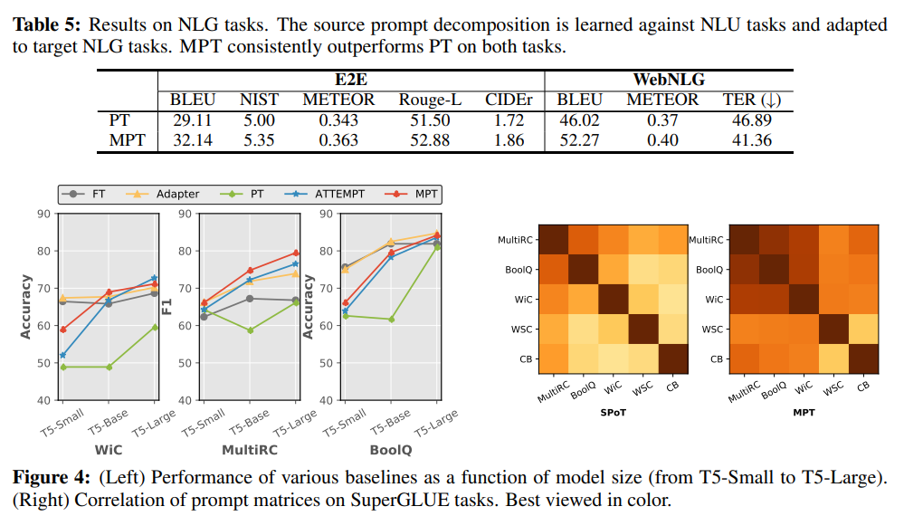

논문 및 이미지 출처 : <https://arxiv.org/pdf/2303.02861.pdf>

# Abstract

**Prompt tuning** : pre-trained model 을 각 task 에 맞게 adapt 하는 방법.

학습된 prompt vector 에 의존하여 Large Language Model (LLM) 을 다양한 downstream task 에 효율적으로 adapt 하는 approach 로 등장.

- 기존 방법은 처음부터 soft prompt vectors 를 학습
- multitask 에서 풍부한 cross-task knowledge 를 어떻게 활용해야 하는지 명확하지 않음

이에 저자는 다음을 제안

- **multitask prompt tuning (_MPT_)**
  - multiple task-specific source prompt 로 distilling knowledge 를 하여, single transferable prompt 를 학습
  - 각 downstream target task 에 효율적으로 adapt 하기 위해 shared prompt 에 multiplicative low rank updates 를 학습

23개 데이터셋에 실험 결과, 최근 approach / method 와 비교하여 우수한 성능 보여줌

특정 경우엔, task-specific parameter 의 0.035% 만 tuning 하여, full finetuning baseline 을 능가

# 1. Introduction

Finetuning pretrained language models (PLMs) 은 downstream task 에 큰 성능 향상을 이끌어 냄

하지만, full task-specific finetuning (FT) 은 현재 PLM 이 수십억 개의 파라미터로 인해 적용하기 어려워지고 있어, 효율적인 방법에 관심이 늘어나고 있다.

본 연구는 task 당 추가 파라미터를 적은 수로만 학습하여 full finetuning 과 비슷한 성능 달성을 목표

---

Prompt tuning (PT) 는 tunable continuous prompt vectors 를 앞에 덧붙여, PLM 에 parameter-efficient transfer learning 하는 approach 가 등장

PT 는 PLM 파라미터를 고정하고 task-specific prompt vectors 만 학습

- 여전히 full finetuning 과 큰 격차라 존재
- 초기화에 민감하며 때로는 full finetuning 보다 많은 훈련 시간 필요

최근 이 문제를 해결하기 위해 다양한 tasks 에 _transferring_ prompt vectors 를 제안

1. multiple source tasks 에 soft prompt 훈련
2. 이 pre-trained prompt 를 사용하여, similarity measure 를 기반으로 target task 에 더 많이 finetuning 하기 위해 prompt 를 초기화 (Fig 1. Top)

본 논문에선 이 연구 방향을 확장하여 _multitask prompt tuning_  (MPT) 소개

- multitask data 를 사용하여 target task 에 효율적으로 transfer 할 수 있는 _single_ prompt 학습
- shared prompt space 학습은 서로 다른 task 간의 공통점을 학습하고 간섭 최소화가 필요하여 힘듬
  - 저자는 각 task 의 soft prompt (prompt matrix) 를 shared matrix 와 low-rank task-specific matrix 의 곱으로 분해
  - 이 분해는 shared prompt matrix 보다 효과적임을 발견
- 이 분해는 일반적인 prompt tuning 에서 얻은 soft prompt 로 부터 knowledge distillation 을 통해 학습
- new task 에 transfer 하기 위해, shared prompt matrix 에 low-rank multiplicative updates 수행 (Fig. Bottom)

---

- 23 task 에 실험 결과, 저자의 approach 가 SOTA prompt transfer 보다 효과적임을 입증
- SuperGLUE 에 T5-Base 를 사용한 MPT 는 vanilla PT 를 16.3% 개선
- multitask prompt transfer baseline (ATTEMPT) 보다 훨씬 적은 task-specific prompt parameter (77.6K vs 232K) 로 더 나은 성능
- 일부 벤치마크에 MPT 가 full finetuning 을 능가하는 경우 존재하며, task 당 0.035% 의 tunable parameter 만 필요
- MPT 가 각 target task 에 4-32 label 로 수행하는 few-shot learning 에 효과적임을 발견

# 2. Related Work

## Parameter-efficient transfer learning

- adapter 및 그 변형들은 trainable layers 를 삽입
- BitFit 은 bias parameter 만 업데이트
- Diff pruning 및 FISH 은 original PLM 와 sparse update 하게 학습
- prompt tuning 은 input 앞에 붙인 soft prompt vectors 만 업데이트
- generation task 에 대한 continuous prompts 최적화인 Prefix-tuning
- UNIPELT 는 gating 메커니즘으로 다양한 tuning 방법을 결합하여 학습
- HyperPrompt 는 task-specific information 을 조건부화하여 prompt 생성
- LST 는 ladder side network 로 parameter-efficient tuning 의 training memory 를 줄인다
- Discrete prompt 는 많은 케이스에서 효율성을 보인다

저자는 **prompt 의 transferability** 에 더 관련 (Transprompt, SPoT, [On transferability of prompt tuning for natural language
processing]) 있으며, 많은 task 에 걸친 prompt tuning 의 성능을 향상시키는데 중점 둠

- Spot 는 similarity measure 을 통해 하나의 prompt 를 선택
- ATTEMP 는 target task 데 대한 prompt 초기화를 위해 source prompt 에 대한 attention 메커니즘
- 

저자는 위와 달리, source prompt 를 분해하여, knowledge distillation 으로 다양한 target task 에 효율적으로 adaptation 하기 위해 single shared prompt 학습

## Multitask learning

_Multitask learning_ : single model 로 multiple related tasks 를 동시에 해결하는데 초점 둠

- multiple source tasks 에서 finetuned model 을 다른 target task 로 transfer
- massive multitask learning 을 통해 LM 의 zero-shot 및 few-shot 능력 보여줌
- specific parameter-sharing 전략을 설계하는 것 또한 multitask learning 의 최근 동향

저자의 approach 는 LM 의 parameter-efficient adaption 을 위한 multitask prompt transfer 에 중점

## Knowledge distillation

knowledge distillation 은 많은 task 에서 성능 및 효율성 향상에 사용

model compression, transfer learning, machine translation, question answering 및 document retrieval 등 포함

- PANDA 는 similarity measure 로 하나의 source task 에서 target task 로 transfer 하는데 초점

저자의 MPT approach 는 prompt transfer 을 위해 multitask learning 을 활용하여 task 간의 cross-task knowledge 를 활용

# 3. Approach

Given:

source tasks &emsp;$\pmb{\mathcal{S}} = \{ \mathcal{S}_1, \mathcal{S}_2, \dots, \mathcal{S}_k \}$ 

target tasks &emsp; $\pmb{\mathcal{T}} = \{ \mathcal{T}_1, \mathcal{T}_2, \dots, \mathcal{T}_\mathcal{T} \}$

---

저자의 목표는 각 task $\mathcal{T}_i$ 가 adapt 될 수 있는 single soft prompt $\mathcal{S}$ 를 학습하는 것

- Simply, $\pmb{\mathcal{S}}$ 에서 single soft prompt 학습
- 그 후, 각 $\pmb{\mathcal{T}}_i$ 에 finetuning

하지만 finetuning 은 sub-optimal 이며, source task 의 공통적인 특징을 활용하지 못하면서, 동시에 간섭을 최고화하기 어렵기 때문

이를 위해, MPT 는 knowledge distillation 를 통해 $\pmb{\mathcal{S}}$ 의 task-shared knowledge 를 single prompt matrix $\pmb{\phi_\mathcal{S}}$ 로 압축하여, $\pmb{\mathcal{T}}$ 의 성능을 향상시키고 transfer learning 에 덜 유용한 task-specific information 걸러냄

### Prompt tuning

Given:

pre-trained LM with parameter $\theta$

one target task $\pmb{\mathcal{T}}$ with training data $(X,Y) = \{x_i, y_i\}^N_{i=1}$

---

standard approach

- 모든 parameter 를 바로 finetuning 하여 conditional probability $P(Y|X; \theta)$ 최대화
- target tasks $\pmb{\mathcal{T}}$ group 을 고려할 때, 이 방식은 효율적이지 않을 수 있음

더 parameter-efficient 한 방법은 prompt tuning

- model parameter $\theta$ 를 고정한 채, learnable prompt vectors (soft prompts) 의 소수를 무작위로 초기화하여 PLM 의 input embeddings 앞에 추가
- 공식화하면, token embedding 이 $d$ 차원인 input sequence $T = [t_1, t_2, \dots, t_n] \in \mathbb{R}^{n \times d}$ 일 때, PT 는 동일한 차원을 가진 learnable prompt matrix $P \in \mathbb{R}^{l \times d}$ ($l$ 은 hyperparameter) 를 input embeddings 에 추가
- 그 후, 다음과 같은 loss function 으로 $P$ 를 최적화

$$
\mathcal{L}_{PLM} = - \sum_i \log P (y_i |x_i \ ; \ \theta, P) \tag{1}
$$

- LM 의 input 은 $[P; T] \in \mathcal{R}^{(l+n) \times d}$

위 approach 는 일부 task 및 모델엔 성공적이지만, vanilla PT 엔 가끔 성능 저하 (특히 작은 PLM)

수렴 속도도 느리며 parameter 초기화에 높은 민감도 관찰

최근 이를 해결하기 위해 multiple source tasks 에 prompt 를 training 하고, similarity measure 로 target task 의 prompt 로 초기화하는 방식을 다룸.

저자는 이를 확장하여 transfering multiple knowledge 으로 downstream target tasks $\mathcal{T}$ 로의 transfer learning 을 더 효과적이고 parameter-efficient 를 가능케 하는 framework MPT 제안

## 3.1 Multitask prompt tuning

MPT framework 는 두 단계로 구성

1. _source training_
    - second stage 에 재사용될 _single_ soft prompt matrix 를 생성
    - 구체적으로, source task 를 위한 prompt matrix 는 task-shared matrix (shared across all tasks) 와 low-rank task-specific matrix (prompt decomposition) 로 분해
    - 분해된 task-shared/specific matrix 는 knowledge distillation 으로 학습
2. _target adaptation_
    - 학습 후, shared prompt matrix 는 low-rank multiplicative update 를 통해 downstream target task 에 adapt

### Prompt decomposition

**prompt decomposition** 목표 : source task $\mathcal{S}$ 간의 knowledge sharing 을 효율적으로 가능하게 하면서, 각 task 의 고유 parameters 를 유지하여 task-specific knowledge 를 인코딩할 수 있게 하는 것

- $k$-th task 를 위한 soft prompt $P_{k}$ 를 두 부분으로 나눔 (Fig 3 참고)
  - $P^* \in \mathbb{R}^{l \times d}$ : shared prompt across all tasks
  - $u_k \in \mathbb{R}^l, v_k \in \mathbb{R}^d$ : 각 task $k$ 에 대한 task-specific vectors
    - task-specific vectors 는 rank-one matrix $W_k = u_k \bigotimes v_k^T$ 으로 형성
    - $W_k$ 는 shared prompt $P^*$ 와 동일한 차원

$k$-th source task 에 대한 task prompt $\hat{P}$ 는 다음과 같이 매개변수화 함

$$
\hat{P} = P^* \circ W_k = P^* \circ (u_k \bigotimes v_k^T) \tag{2}
$$

- $\circ$ : hadamard product
- 위의 prompt decomposition 의 매개변수화는 low-rank method 에 영감을 받음
  - source task set 에 걸친 "slow" weight $P^*$ 로 일반적인 정보를 캡쳐
  - "fast" weight $W_k$ 는 low-rank subspace 에서의 $\mathcal{S}_k$ 에 대한 task-specific knowledge 를 인코딩

### Prompt distillation

multitask dataset $\mathcal{S}$ 에 직접 prompt decomposition 를 학습하면 shared component $P^*$ 가 큰 task 에 과적합하는 경향 있음

이에 좋은 decomposable prompt 를 학습하기 위해 효과적인 전략으로, 별도로 훈련된 source prompt 로 knowledge distillation 을 발견

1. 일반적인 prompt tuning 으로 $k$-th source task 에 대한 teacher prompt $P_k^{(teacher)}$ 을 얻음
2. 상응하는 student prompt $\hat{P}_k = P^* \circ (u_k \bigotimes v_k^T)$ 을 무작위로 초기화
    - 모든 student prompts 는 $P^*$ 를 공유하고 위에서 설명한 대로 task-specific vecotrs 를 가짐
3. distillation 을 사용하여 cross-task knowledge 를 shared prompt matrix 로 transfer

shared prompt matrix $P^*$ 및 task-specific parameters $u_k$ 와 $v_k$ 에 대한 KL-Divergence 를 최소화하여 student 와 teacher 의 output probability distributions 를 일치시키기 위한 _first loss_ 계산

$$
\mathcal{L}_{Logit} = \sum_{k \in \mathcal{S} |} \sum_{(x_i, y_i) \in \mathcal{S_k}} KL \ [ \  P ( y_i | x_i \  ; \  \theta, P_k^{(teacher)}) || P (y_i | x_i \ ; \ \theta, \hat{P}_k) \ ] \tag{3}
$$

- teacher 및 student model 의 output distribution 의 smoothness 를 제어하기 위해 temperature $T$ 사용
- $p_j = \frac{1}{Z} \exp (z_j/T)$
  - $z_i$ : class $j$ 에 대한 logit score
  - $Z$ : normalization 요소

또한 teacher model 의 hidden states 에 mean squared loss 추가

$$
\mathcal{L}_{Hidden} = \sum_{k \in \mathcal{S} |} \sum_{(x_i, y_i) \in \mathcal{S_k}} \ ( \  H_{k,i} - H_{k,i}^{(teacher)} \ )^2 \tag{4}
$$

- $H_{k,i}^{(teacher)}$ 및 $H_{k,i}$ ; 각각 teacher 및 student networks 의 hidden states
  - $i$-th input 에 대한 hidden vector 의 sequence 로 구성
- intermediate states 에서의 추가적인 distillation loss 은 PLMs 에 distilling 한 결과, 개선된 것을 보여줌

target 측면으로 transfer 할 single shared prompt 를 얻기 위한 student source prompts 를 training 하는 데 사용되는 total loss function 은 다음과 같다.

$$
\mathcal{L}_{Total} = \mathcal{L}_{PLM} + \lambda ( \mathcal{L}_{Logits} + \mathcal{L}_{Hidden} ) \tag{5}
$$

- $\mathcal{L}_{PLM} = \sum_{k \in |\mathcal{S}|} \mathcal{L}_{PLM}^k$ : all source tasks 에 대해 집계된 task losses
- $\lambda$ : distillation loss 의 영향을 균형잡기 위한 가중치

## 3.2 Source Training And Target Adaptation

target tasks 로의 transfer 할 single source prompt 의 training 에는 2 단계 필요

1. all source tasks 에 대한 teacher prompts 를 vanilla prompt tuning 으로 개별적 pre-training
2. $\mathcal{S} = \{S_1, \dots,S_k \}$ 에서 multitask training 수행하여 Eq 5 의 knowledge distillation loss function 으로 single shared prompt 를 공통적으로 학습 

- 간단한 stochastic tasks sampling 전략을 채용하여, batch 당 task 수를 동적으로 변경
  1. multitask samples 의 각 batch 에 대해, 먼저 $[2, k]$ 에서 $K$ 수를 무작위로 선택
  2. $\mathcal{S}$ 에서 $K$ 개의 tasks 를 무작위로 선택
  3. 해당 samples 를 mini-batches 로 구성

target adaptation 의 경우
- target task $\mathcal{T}_t$ 에 대한 target prompt 를 shared prompt matrix 와 task-specific low-rank prompt matrix 의 Hadamard product 로 초기화
  - i.e. $\hat{P}_t = P^* \circ (u_t \bigotimes v_t^T)$
  - $P^*$, $u_t$, $v_t$ 에 대한 Eq 1 의 regular task loss 를 최적화
  - $P^*$, $u_t$, $v_t$ 각각 별도의 learning rate 를 사용
- MPT 또한 target tasks $\pmb{\mathcal{T}} = \{ \mathcal{T}_1, \mathcal{T}_2, \dots, \mathcal{T}_{\mathcal{T}} \}$ 의 group 에서 multitask learning 에 사용될 수 있음
  - 이 경우 $P^*$ 는 $\mathcal{T}$ 전체에 공유됨

### Parameter-efficiency

각 task 에는 vanilla soft prompt 와 동일한 차원을 가지는 shared prompt $l \times d$ 와 더 적은 수의 task-specific vecotrs $(l \times d)$ 를 포함

→ single target task 에 대한 tunable parameters 의 total number 는 $(l \times d) + (l \times d)$

→ training 후, 이를 $l \times d^2$ 사이즈의 single matrix 로 압축 가능

target task group 의 경우

- tunable parameter 의 total number : $(l \times d) + (l \times d)\tau$
  - $\tau$ : target tasks number
- Table 1 에서 trainable parameter 의 수를 기준으로 비교

# 4. Experiments

다양한 범위의 NLP dataset 에서 MPT 가 강력한 baseline 을 이기는 것을 보여줌

- full-datset (Table 1, 2)
- few-shot (Table 3, 4)
- 기존 방법들보다 parameter-efficient

## 4.1 Experiemtal Setup

### Datasets and tasks

MPT 평가를 위해 100k 개 이상의 annotations 가 있는 6개 데이터셋을 _source task_ 로 사용
- MNLI
- QNLI
- QQP
- SST-2
- SQuAD
- ReCoRD

4개 벤치마크의 23개 데이터셋를 _target task_ 로 사용

- SuperGLUE : MultiRC, BoolQ, WiC, WSC 및 CB
- GLUE : RTE, CoLA, STS-B, MRPC, MNLI, QQP, QNLI 및 SST-2
- MRQA : Natural Questions, HotpotQA, NewsQA 및 SearchQA
- Others : WinoGrande, Yelp-2, SciTail 및 PAWS-Wiki
- generation task 의 adapting 을 위한 E2E 및 WebNLG

### Models

prompt tuning 의 standard approach 를 따라, 주로 220M parameters 를 가진 공개된 pretrained T5-Baase 를 사용.

모든 벤치마크에 대해 100개의 prompt vectors 사용 (따라서, $\hat{P}_k \in \mathbb{R}^{100 \times d}$)

저자의 ablation study 에서는 T5-Small (60M) 및 T5-Large (770M) 모델도 고려

### Baseline

MPT 를 다음 baselines 와 비교

1. Full finetuning (FT) : 모든 model parameters 를 각 downstream task 에 adaptation 하면서 tuning
2. Vanilla prompt tuning (PT) : target prompt vectors 는 top vocabularies 를 무작위로 sample 하여 초기화
3. SPoT 및 ATTEMPT 를 포함하는 prompt transfer method : source prompts 검색 또는 집계하여 target prompts 초기화
4. Adapters 및 BitFit 을 포함하는 parameter-efficient method

### Implementation details 

source training 의 경우

- examples-proportional mixing 전략 및 stochastic task sampling 을 사용하여 5 epochs 동안 MPT 를 source tasks 의 mixture 에서 훈련

prompt distillation 의 경우

- T5 의 encoder 및 decoder 의 hidden states 에 대한 loss 계산

target adaptation 의 경우

- MPT 의 shared prompt 를 재사용
- target task-specific vector 를 초기화하기 위해 MPT 의 source task-specific 평균을 사용

모든 실험을 서로 다른 seed 로 세 번 실행하고 평균과 표준편차 보고

few-shot 실험에서는, 각 shot 수 $k$ 에 대해 서로 다른 무작위 seed 로 training set 을 10번 샘플링하고 평균 성능 보고

## 4.2 Results and Analysis

### Full-dataset adaptation

- Table 1 (top)
  - MPT 는 parameter-efficient finetuning 에 대해 SOTA 결과 보여줌
- Table 1 (bottom)
  - 더욱 parameter-efficient 측면으로 매우 큰 잠재력을 보임
- Table 2
  - PT 에 비해 상당한 향상
  - 프롬프트 길이 100 에서 300 으로 증가시키면 Adapters 와의 성능 차이를 줄이고, parameter-efficient 결과를 보임

### Few-shot adaptation

few training examples ($k$ = 4, 16, 32) 만 사용 가능한 new tasks 에 어떻게 일반화되는지 측정하기 위해 BoolQ, CB 및 SciTail 에 few-shot 실험

- Table 3
  - MPT 는 PT 및 SPoT 모두 능가
  - 다른 method 들도 few-shot learning 에서 어려움을 겪고 있음
- Table 4
  - MPT 가 대부분의 dataset 에서 Vanilla PT 를 큰 폭으로 능가

위 결과는 source task 에서 target task 로 효과적으로 활용함을 보여줌

### Natural language generation tasks

NLU task 에서 학습한 prompt decomposition 이 target NLG task 로 일반화되는지 테스트

6가지의 source task 를 사용하여 pre-trained T5-Large prompt 를 두 가지 NLG task 인 E2E 및 WebNLG 에 transfer

- Table 5
  - MPT 가 모든 metric 에서 PT 보다 큰 폭으로 우수한 성능
  - NLU 및 NLG 양쪽에서 효과적임

이는 source task 가 NLU task 임에도 NLG task 로의 knowledge transfer 가 효과적임을 나타냄 

### Model scaling

3가지 SuperGLUE task 에서 pre-trained model 크기를 증가시키면서 MPT 성능 분석

- Figure 4 (왼쪽)
  - MPT 및 full finetuning (FT), Adapter, PT 및 ATTEMPT 를 사용한 세 가지 서로 다른 T5 model 의 성능을 보여줌
  - MPT 가 SOTA parameter-efficient 를 달성
  - 60M ~ 770M parameter 전 범위의 model scaling 에서 효과적임 

### Analyzing prompt metrices

MPT 를 사용하여 학습한 prompt 를 분석하고 cross-task knowledge 가 실제로 task-shared prompt 에 인코딩되어 target task 에 효과적으로 adapt 되는지, 자체 knowledge 를 인코딩하여 분석

- target task 의 모든 pairs 간의 cosine similarity 를 계산하기 위해 prompt metrices 사용
- 각 ㅅask 는 task-shared 및 task-specific prompt 의 조합으로 표현 (single vector 를 얻기 위해 평균화)

- Figure 4 (오른쪽)
  - SPoT 및 MPT 의 cosine similarity matrix 를 시각화
  - task embeddings 가 유사한 task 를 효과적으로 클러스터링 하는 것 발견

## 4.3 Ablation studies

### Prompt decomposition and distillation

모든 hyperparameter 를 고정하고 MPT source training 을 재실행하여 transfer 된 prompt 의 여러 버전을 실험

prompt decomposition 효과 측정을 위해 source prompt 를 task-shared 및 task-specific components 로 구성된 decomposable prompt 로 대체하고 prompt distillation 없이 훈련

- 첫 번째 행에 비해 3.5% 성능 향상
- MPT 의 prompt decomposition 의 중요성을 보여줌
- shared component 가 target downstream task 에 유용한 cross-task knowledge 를 효과적으로 캡쳐하는 것을 보여줌

prompt distillation 효과 측정을 위해 모든 source task 에서 동일한 training loss 를 갖는 일반적은 prompt 를 훈련

- 첫 번째 행에 비해 1.1% 향상
- prompt decomposition 과 결합하면 74.1% 성능 달성

따로 훈련된 source prompt 에서 knowledge 를 추출하는 것이 좋은 decomposable prompt 를 학습하기 위한 효과적인 전략임을 보여줌

### Distillation objective

prompt distillation 의 개별 component 를 조사하여 최종 성능에 미치는 영향 측정

- Eq 5 의 hidden state loss 를 제거하고 이로 인해 SuperGLUE 에서 73.7% 성능을 얻음을 확인
- logits 과 함께 hidden states 를 정규화하여 전체 성능에 도달하는 효과 검증

teacher 및 student prompt 간의 distance 최소화를 위해 loss 에 MSE loss 추가하여 두 prompt 를 일치시크는 distillation loss 변형

- distillation loss 를 distance loss 로 대체하여 SuperGLUE 에서 73.6% 도달
- logits 및 hidden state 기반의 distillation loss 보다 성능이 떨어짐

### Prompt length

논문의 실험들은 $l = 100$ prompt vectors 를 사용

Fig 5 에서 보이듯, 더 긴 prompt 를 사용하면 $l = 300$ 까지 개선 가능하며, 더 늘리면 정확도가 감소하게 되어 오버피팅이 발생

### Target adaptation strategy

source 에서 target task 로 shared prompt 를 transfer 할 때, task-shared component 만 업데이트하는 경우 (즉, task-specific vectors 제거) 또는 task-specific vectors 만 업데이트하는 경우 (즉, task-shared component 를 freezing) 결과가 부적절 (SuperGLUE 에 각각 62.5% 및 71.3%)

이는 target adaptation 을 위한 두 component 의 중요성을 보여줌

### Stochastic task sampling

stochastic task sampling 제거 시, SuperGLUE 에서 73.7% 결과 (낮은 성능)

이는 multitask training 전략에서 이점을 보임

### Number of source tasks for pretraining

주요 실험은 6 개의 NLP task 에 추가적인 다양한 source task 를 포함하여 총 12개의 source task 통합

- topic classification, multi-choice QA, OpenBookQA, ARC, adversarial NLI 및 commonsense reasoning 포함
- Table 7
  - 12 개의 task 를 사용하는 MPT 는 여전히 target adaptation 에 효과적
  - 6 개의 task 를 사용한 MPT 보다 약간 우수한 성능

# 5. Conclusion

Multitask Prompt Tuning 연구 결과 다음과 같다.

- multiple source task 및 task-specific source prompt 에서 knowledge 를 decomposition 하고 distillation 하여 single transferable prompt 를 학습
- task prompt 를 shared prompt matrix 와 rank-one task-specific matrix 를 Hadamard product 하여 decomposition
- shared component 가 target task 로 transfer 및 adapt 하여 tuning
- 실험 결과 다양한 NLP 벤치마크에서 target downstream task 로의 parameter-efficient transfer learning 이 가능
- 경우에 따라 훨씬 적은 task-specific parameter 로 tuning 하여 full finetuning 능가