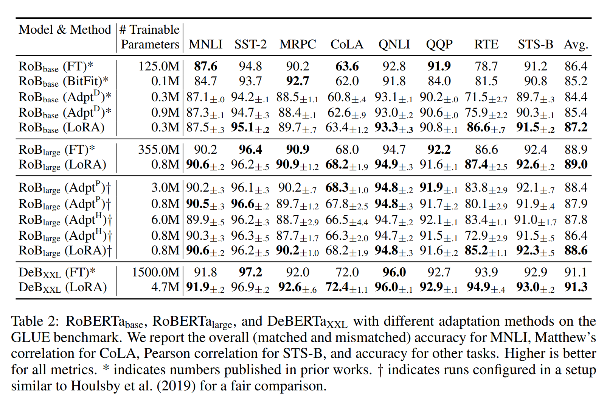
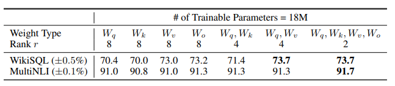

논문 및 이미지 출처 : <https://arxiv.org/pdf/2106.09685.pdf>

# Abstract

GPT-3 175B 의 파라미터를 fine-tuning 하기에는 매우 부담.

이에 저자는 **Lo**w-**R**ank **A**daptation, **LoRA** 제안

- pre-trained model weights 를 freeze
- Transformer layer 에 trainable rank decomposition 을 주입
- downstream task 에 대한 trainable parameter 를 매우 크게 줄임

Adam 으로 fine-tuning 한 GPT-3 175B 와 비교하여, LoRA 는 

- trainable parameter 수를 10,000배 줄이고
- GPU 메모리 요구사항 3배 줄임
- RoBERTa, DeBERTa, GPT-2 및 GPT-3 에서도 더 좋은 성능

- LoRA 는 adapter 와 달리, **추가적인 inference latency 없음**
- language model (LM) 의 adaptation 에서 rank-deficiency 에 대한 경험적 연구 제공하여 LoRA 의 효과 제공

# 1. Introduction

보통 multiple downstream 에 적응하기 위해 하나의 LLM 에 의존한다.

task 에 adaptation 할 때 일반적으로 _fine-tuning_ 을 하지만, 모든 파라미터를 훈련하는 것이 큰 단점이다.

이에, 몇몇 파라미터만 adapting 하거나 new task 를 위한 외부 모듈을 학습하는 시도도 있다.

task 마다 pre-trained model 에 적은 수의 task-specific parameter 를 저장하고 로드하여, 모델 사용 시 효율이 향상한다.

하지만, depth 확장이나 sequence 길이를 줄이는 등 모델 품질과 효율성간의 trade-off 설정이 힘들다.

저자는 이전 연구에서 learned over-parameterized models 이 사실은 low intrinsic dimension 에 존재한다는 것을 보고 영감을 받았다.

model adaptation 중 weight 의 변화가 낮은 "intrinsic rank" 를 가질 것이라는 가설을 기반으로 Low-Rank Adaptation (LoRA) approach 를 제안

- pre-trained weights 를 고정한 채, model adaptation 중 dense layer 의 변화에 대한 rank decomposition matrices 를 최적화하여 신경망의 일부 dense layer 를 간접적으로 학습하게 함
- 예로, GPT-3 175B 사용 시, LoRA 를 사용하면 low rank 는 full rank ($d$) 가 12,288 와 같아도 충분
- 이로써 LoRA 는 저장 및 계산 효율적

LoRA 핵심 이점

- pre-trained model 은 여러 task 에 대해, 매우 작은 LoRA 모듈을 구축하여 공유 및 사용 가능
  - shared model 을 freeze 하고 Fig 1 의 행렬 $A$ 와 $B$ 를 교체하여 task 를 효율적으로 전환
  - 저장 요구사항 및 task-switching overhead 크게 줄임
- LoRA 는 adaptive optimizer 를 사용할 때 더 효율적인 학습 가능 및 hardware barrier 3배 줄임
  - 대부분의 parameter 에 대한 optimizer states 를 유지하거나 gradient 계산 불필요
  - 주입된 smaller low-rank matrices 만 최적화
- 이 설계는 사용 시, trainable matrices 및 frozen weights 를 병합할 수 있게 함
  - full fine-tuned model 과 비교하여, _inference latency 가 없음_
- LoRA 는 이전 방법들과는 독립적 그리고 prefix-tuning 같은 다양한 방법과 결합 가능

## Terminologies and Conventions

Transformer 아키텍처를 빈번히 언급하니, 이 차원에 대한 용어 사용

Transformer layer 의 input 및 output dimensions : $d_{model}$

self-attention module query/key/value/output projection matrix : $W_q$, $W_k$, $W_v$, $W_o$

pre-trained weight matrix : $W$ 및 $W_O$

adaptation 중인 accumulated gradient update : $\triangle W$

LoRA Module : $r$

Transformer MLP feedforward dimension : $d_{ffn} = 4 \times d_{model}$

# 2. Problem Statement

LoRA 는 training objective 와 상관없이 모두 사용가능하지만, 본 논문은 LM 에 focus 하여 설명

GPT 같은 pre-trained autogressive LM $P\phi(y|x)$ 가 있다 가정

- downstreak task 는 context-target paris 데이터셋이 있다면, $\mathcal{Z} = \{ (x_i, y_i) \}_{i=1, \dots,N,}$ 로 표현
  - $x_i$ 및 $y_i$ : token sequence
- 기존 fine-tuning 은, pre-trained weight $\phi_0$ 로 초기화 후 objective 최대화를 위해 gradient 를 반복적으로 업데이트하여 $\phi_0 + \triangle \phi$

$$
\underset{\phi}{\max} \sum_{(x,y) \in \mathcal{Z}} \sum_{t=1}^{|y|} \log (P_{\phi}(y_t | x, y_{<t>})) \tag{1}
$$

full fine-tuning 의 단점은 각 downstream task 마다 차이가 있는 parameter set $\triangle \phi$ 을 학습한다는 것

- 이 parameter 의 dimension $|\triangle \phi|$ 는 $|\phi_0|$ 과 동일
- 따라서 pre-trained model 이 크면 fine-tuned model 을 저장하고 배포하기에 실용성 없음

본 논문은 parameter-efficient approach 를 채택

task-specific parameter 의 증가 $\triangle \phi = \triangle \phi (\theta)$ 는 더 적은 크기의 parameter set $\theta$ 로 적절히 인코딩 ($|\theta| \ll |\phi_0|$)

따라서 $\triangle \phi$ 를 찾는 것은 $\theta$ 의 최적화

$$
\underset{\theta}{\max} \sum_{(x,y) \in \mathcal{Z}} \sum_{t=1}^{|y|} \log (P_{\phi_0 + \triangle \phi(\theta)} (y_t | x, y_{<t>})) \tag{2}
$$

# 3. Aren't Existing Solutions Good Enough?

기존 연구에서도 PEFT 를 다루었다. adapter layer 추가 및 input layer 일부 형태를 최적화하는 등이 있었다.

하지만 large-scalie 및 latency 에 제한사항이 있었다.

### Adapter Layer Introduce Inference Latency

여러 adapter 가 있지만 다음 두 연구에 중점을 둠

- [Parameter-Efficient Transfer Learning for NLP.] : Transformer 블록당 두 개의 adapter layer
- [Exploring versatile generative language model via parameter-efficient transfer learning.] : 블록당 하나의 adapter layer 와 추가적인 LayerNorm

layer 및 multitask 에 활용하여 전체 latency 는 줄지만, adapter layer 의 추가 계산은 못피함.

adapter layer 는 작은 bottleneck dimension 을 가지고 있어 few parameter (모델의 < 1%) 를 가지도록 설계되어 추가 FLOPs 가 제한됨

하지만 Transformer 는 latency 를 낮추기 위해 하드웨어 병렬처리를 사용하지만 adapter layer 는 순차처리하게 되어 Table 1 을 보면 추가 작업이 증가한 것을 볼 수 있다.

### Directly Optimizing the Prompt is Hard

이 방법엔 대표적으로 prefix tuning 가 이쓴데, 최적화가 어렵고 성능이 단조적으로 증가하지 않고 진동하는 경우가 논문에서 관측된다.

근본적으로 sequence 의 일부를 adaptation 을 위해 보류해야 하여 downstream 처리 시 sequence 길이가 줄어들어 효과가 덜하다는 것이 한계

# 4. Out Method

본 논문은 Transformer 에 초점을 두지만, 다른 딥러닝에도 적용 가능

## 4.1 Low-Rank-Parameterized Update Matrices

많은 network 의 dense layers 는 행렬곱으로 이루어져 있다. 그리고 이 weight matrices 는 보통 full-rank 를 가진다.

기존 연구에서, specific task 에 adapting 중, pre-trained LM 이 "low instrisic dimension" 을 가지며 더 적은 subspace 으로의 random projection 에도 여전히 효과적인 학습을 하는 것을 보여준다.

pre-trained weight matrix $W_0 \in \mathbb{R}^{d \times k}$ 의 경우

- 이를 low-rank decomposition $W_0 + \triangle W = W_0 + BA$ 로 표현
  - 여기서 $B \in \mathbb{R}^{d \times r}$, $A \in \mathbb{R}^{r \times k}$
  - rank $r$ 은 $r \ll \min (d, k)$
- training 중
  - $W_0$ 는 freeze 및 gradient update 하지 않음
  - $A$ 및 $B$ 는 trainable parameter 를 포함
  - $W_0$ 및 $\triangle W = BA$ 는 동일한 input 과 곱해자며, 각 output vectors 는 coordinate-wise 로 합산

$h = W_0x$ 에 대한 forward pass 는 다음과 같다.

$$
h = W_0x + \triangle Wx = W_0x + BAx \tag{3}
$$

- $A$ 는 random Gaussian 및 $B$ 는 0 으로 초기화하여 $\triangle W = BA$ 는 training 에 0 으로 시작
- 이후 $\frac{\alpha}{r}$ 으로 $\triangle W$ 를 scaling
  - $\alpha$ 는 $r$ 에 대한 상수
- Adam 으로 최적화 시, $\alpha$ 를 tuning 하는 것은 초기화를 적절히 scaling 하는 것과 동일
  - 이 scaling 은 $r$ 을 변화시킬 때 hyperparameter 를 retuning 할 필요를 줄이는데 도움

### A Generalization of Full Fine-tuning

모든 weight matrices 및 bias 에 LoRA 적용하여 훈련 시, full-rank → r-rank 을 통해 효율적인 학습이 가능하다.

하지만 한계점으로, MLP 가 필요하며 prefix-tuning 기반 방법의 경우 long input sequence 가 있어야 한다.

### No Additional Inference Latency

다른 downstream task 에 적용할 시, $BA$ 대신 $B'A'$ 를 추가하여 빠른 작업 및 적은 메모리가 가능

이는 추가적인 inference latency 가 없음을 보장

## 4.2 Applying LoRA to Transformer

Transformer 에는 4 가지 weight matrix 가 있다.

- self-attention module ($W_q$, $W_k$, $W_v$, $W_o$)
- Encoder 및 Decoder 각각의 MLP module

simplicity 및 parameter-efficiency 를 위해서, 위 둘 중 **attention weight** 의 adapting 만 연구하는 것으로 제한하며 MLP 는 freeze 한다. (downstream task 에서 훈련되지 않도록)

### Practical Benefits and Limitations

가장 큰 이점은 메모리 및 저장 공간 사용량 감소

Large Transformer 를 Adam 으로 훈련하는 경우

- frozen parameter 에 대한 states 를 저장할 필요가 없어, $r \ll d_{model}$ 일 경우 최대 2/3 VRAM 사용량 감소
- GPT-3 175B 의 VRAM 소비를 1.2TB 에서 350B 로 줄임
- $r = 4$ 이고 $W_q$ 및 $W_v$ 만 adapting 하는 경우 checkpoint 크기가 10,000배 감소 (350GB → 35MB)
- 대부분의 parameter 에 gradient 계산이 필요 없어, GPT-3 175B 훈련 중 25% 속도 향상

LoRA 는 한계점 또한 존재

- 서로 다른 task 에 사용 시, $B'A'$ 를 동적으로 선택해야 함

# 5. Empirical Experiments

RoBERTa, DeBERTa 및 GPT-2 에도 LoRA 실험

task 또한 natural language understanding (NLU), generation (NLG), WikiSQL (SQL queries), SAMSum (conversation summarization) 등 다양하게 실험

## 5.1 Baselines

이전 연구의 설정을 재사용

### Fine-Tuning (FT)

일반적인 approach 이며, 마지막 두 layer 만 적응한 것을 $\text{FT}^{Top2}$ 로 표현

### Bias-only or BitFit

bias vectors 만 훈련하고 제외한 다른 것들은 freezing

### Prefix-embedding tuning (PreEmbed)

input token 사이에 special token 을 삽입하는 것으로, 어디에 배치할지에 따라 성능이 달라진다.

저자는 "prefixing" 및 "infixing" 에 중점을 두고 실험

trainable parameter 는 $|\theta| = d_{model} \times (l_p + l_i)$

- $l_p$ : prefix
- $l_i$ : infix

### Prefix-layer tuning (PreLayer)

prefix-embedding tuning 의 확장으로, word embedding 학습하는 대신 Transformer layer 이후의 activation 을 학습

이전 layer 로부터의 계산된 activation 은 학습 가능한 activation 으로 대체

trainable parameter 는 $|\theta| = L \times d_{model} \times + (l_p + l_i)$

- $L$ : Transformer layers number

### Adapter tuning

self-attention 과 residual connection 사이에 adapter layer 삽입

adapter layer 는 두 fully connected layer 와 bias 중간에 nonlinearity 로 구성되어 있다.

이 디자인을 $\text{Adapter}^H$ 라 부른다.

adapter layer 를 MLP module 이후와 LayerNorm 이후에만 적용한 디자인도 있으며, $\text{Adapter}^L$ 라 부른다.

다른 설계로 Adapter-fusion 이 있으며 이는 $\text{Adapter}^P$ 로 부른다.

더 큰 효율성을 위해 일부 adapter layer 를 제거한 $\text{Adapter}^D$ 도 있다.

위 모든 케이스에서, 실험에선 $|\theta| = \hat{L}_{Adpt} \times (2 \times d_{model} \times r + r + d_{model}) + 2 \times \hat{L}_{LN} \times d_{model}$ 를 가짐

- $\hat{L}_{Adpt}$ : adapter layer 수
- $\hat{L}_{LN}$ : trainable LayerNorms 수

### LoRA

기존 weight matrices 를 rank decomposition matrices 의 trainable pairs 를 추가

위에서 언급했듯이, 간단함을 위해 $W_q$ 와 $W_v$ 에만 LoRA 를 적용

trainable parameter : $|\theta| = 2 \times \hat{L}_{LoRA} \times d_{model} \times r$

- $\hat{L}_{LoRA}$ : LoRA 를 적용한 weight matrices 수

## 5.2 RoBERTa Base/Large

- RoBERTa 에서 LoRA 는 task 성능을 향상 시킴
- HuggingFace Transformers 의 pre-trained RoBERTa base (125M) 및 RoBERTa large (335M) 사용
- 모든 task 는 동일한 배치 크기 및 128 sequence length
- MRPC, RTE 및 STS-B 의 경우 MNLI 에 adapted model 이 아닌 pre-trained model

## 5.3 DeBERTa XXL

- DeBERTa 는 훨씬 큰 규모로 training 되어 GLUE 및 SuperGLUE 에 큰 성능 발휘
- LoRA 는 DeBERTa XXL 에서도 여전히 성능 향상

## 5.4 GPT-2 Medium/Large

- LoRA 가 NLU 에서 full fine-tuning 과 경쟁력있는 대안으로 보여, GPT-2 medium 및 large 에서도 우세한지 확인

## 5.5 Scaling up to GPT-3 175B

- GPT-3 175B parameter 로 확장
- Table 4 에서 보이듯, 3가지 데이터셋 모두 FT 와 비슷하거나 능가
- Fig 2 에서 보이듯, 일부 방법은 더 많은 special token (prefix-embedding tuning 은 256개 이상 또는 prefix-layer tuning 의 경우 32개 이상)을 사용 시 성능 저하

# 6. Related Works

# 7. Understanding the Low-Rank Updates

LoRA 에 대해 더 잘 이해할 수 있도록 경험적 실험들을 설명. 이에 대한 세 가지 질문이 있다.

1. pre-trained Transformer 의 어떠한 가중치 행렬에 LoRA 를 적용해야 가장 높은 성능을 얻을까?
2. 최적의 rank $r$ 는 무엇일까?
3. adaptation matrix $\triangle W$ 와 $W$ 간의 상관관계

## 7.1 Which Weight Matrices in Transformer Should We Apply LoRA To?

이전에, attention module 에만 고려했다고 언급했다.

GPT-3 175B 의 경우, 1개의 attention weight 만 adapting 하면 $r = 8$ 에 해당하는 18M (약 35MB 저장)의 parameter 를 설정하며, 2개의 attention weight 을 adapting 하면 $r = 4$ 에 해당하는 parameter 를 모든 96개 layer 에 적용하게 된다. (Table 5)

모든 parameter 를 $\triangle W_q$ 또는 $\triangle W_k$ 에 두면 성능이 크게 저하되지만, $W_q$ 및 $W_v$ 둘 다 adapting 하면 최상의 결과를 얻는다.

이를 통해 rank 를 4 로 두면 충분히 $\triangle W$ 의 정보를 담을 수 있음을 시사한다.

## 7.2 What is the Optimal Rank $r$ For LoRA?

놀랍게도 매우 작은 $r$ 에서도 LoRA 는 경쟁력있는 성능을 발휘했다. ($\{ W_q, W_v \}$ 보다 $W_q$ 에 더 많은 영향)

- 이는 update matrix $\triangle W$ 가 매우 작은 "intrinsic rank" 를 가질 수 있음을 시사

### Subspace similarity between different $r$

$A_{r=8}$ 및 $A_{r=64}$ 가 주어졌을 때, 동일한 pre-trained model 을 사용하여 singular value decomposition (SVD) 수행하고 right-singular unitary matrices $U_{A_{r=8}}$ 및 $U_{A_{r=64}}$ 를 얻음

이때 $U_{A_{r=8}}$ ($1 \leq i \leq 8$) 의 top $i$ singular vectors 로 구성된 subspace 중, $U_{A_{r=64}}$ ($1 \leq i \leq 64$) 의 top $j$ singular vectors 의 subspace 에 얼마나 포함되었을 까?

이를 Grassmann distance 기반으로 정규화된 subspace similarity 를 측정

$$
\phi (A_{r=8}, A_{r=64}, i, j) = \frac{|| U^{i\top}_{A_{r=8}} U^{j}_{A_{r=64}} ||^2_F}{\min (i, j)} \in [0,1] \tag{4}
$$

- $U^{i\top}_{A_{r=8}}$ : top-$i$ singular vectors 에 해당하는 $U_{A_{r=8}}$ 의 columns
- $\phi ( \cdot )$ 는 $[0,1]$ 범위
  - 1 은 subspace 에 완전한 중첩
  - 0 은 완전한 분리

$i$ 및 $j$ 를 변화시키면 $\phi$ 가 어떻게 변하는 지는 Fig 3 참고

위를 통해 다음 주요 관찰을 할 수 있다.

$A_{r=8}$ 의 $\triangle W_v$ (또는 $\triangle W_q$) 와 $A_{r=64}$ 의 $\triangle W_v$ (또는 $\triangle W_q$) 는 dimension 1 의 subspace 를 공유하며 normalized similarity $> 0.5$ 이며, 이것이 GPT-3 에 $r = 1$ 잘 동작하는 이유

### Subspace similarity between different random seeds

$r = 64$ 로 무작위 seed 로 실행된 두 normalized subspace similarity 를 Fig 4 에서 확인 

$\triangle W_q$ 는 $\triangle W_v$ 보다 높은 "intrinsic rank" 를 가질 것으로 보이며, $\triangle W_q$ 에 대한 두 실행 모두 학습된 common singular value direction 이 더 많이 있어, Table 6 의 관찰과 일치

## 7.3 How Does the Adaptation Matrix $\triangle W$ Compare To $W$?

저자는 $\triangle W$ 와 $W$ 간의 상관관계를 더욱 조사.

$ㅉ$ fmf $\triangle W$ 의 $r$-dimensional subspace 에 $U^{\top}WV^{\top}$ 를 계산하여 project

여기서 $U/V$ 는 $\triangle W$ 의 left/right singular-vector matrix 이다.

이후, $||U^{\top}WV^{\top}||_F$  와 $||W||$ 간의 Frobenius norm 비교

- 비교를 위해 $U, V$ 를 $W$ 의 top $r$ singular vectors 또는 random matrix 로 대체하여 $||U^{\top}WV^{\top}||_F$ 계산

위 Table 에서 다음 결론을 얻을 수 있음

1. $\triangle W$ 는 random matrix 와 비교하여, $W$ 와 더 강한 상관관계를 가지며, $\triangle W$ 는 이미 $W$ 에 있는 일부 기능을 강화
2. $W$ 의 top singular direction 을 반복하는 대신, $\triangle W$ 는 $W$ 의 강조되지 않은 direction 만을 강화
3. 증폭 계수가 매우 큼: $r = 4$ 에 대해, $21.5 \approx 6.91/0.32$

# 8. Conclusion And Future Work

LLM 을 fine-tuning 하는 것인 많은 비용 및 시간이 듬

본 연구의 LoRA 라는 방법을 통해 inference latency 을 줄이며 sequence length 를 줄이지 않는 전략

대부분의 model parameter 를 공유하여 배포도 용이

Future work

- LoRA 를 다른 adaptation method 와 결합하여 개선 가능
- fine-tuning 또는 LoRA 의 숨겨진 메커니즘
- LoRA 를 adapting 할 weight matrix 선택
- $\triangle W$ 의 rank 축소 가능한지 여부