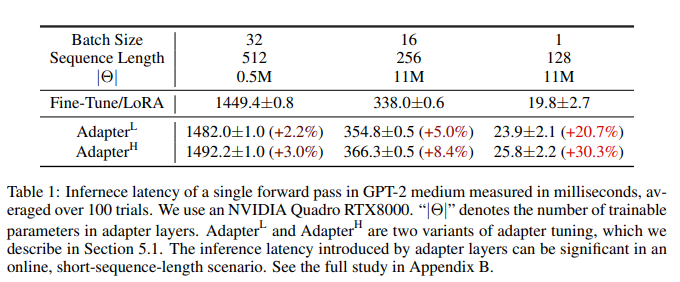

논문 및 이미지 출처 : <https://arxiv.org/pdf/2106.09685.pdf>

# Abstract

GPT-3 175B 의 파라미터를 fine-tuning 하기에는 매우 부담.

이에 저자는 **Lo**w-**R**ank **A**daptation, **LoRA** 제안

- pre-trained model weights 를 freeze
- Transformer layer 에 trainable rank decomposition 을 주입
- downstream task 에 대한 trainable parameter 를 매우 크게 줄임

Adam 으로 fine-tuning 한 GPT-3 175B 와 비교하여, LoRA 는 

- trainable parameter 수를 10,000배 줄이고
- GPU 메모리 요구사항 3배 줄임
- RoBERTa, DeBERTa, GPT-2 및 GPT-3 에서도 더 좋은 성능

- LoRA 는 adapter 와 달리, **추가적인 inference latency 없음**
- language model (LM) 의 adaptation 에서 rank-deficiency 에 대한 경험적 연구 제공하여 LoRA 의 효과 제공

# 1. Introduction

보통 multiple downstream 에 적응하기 위해 하나의 LLM 에 의존한다.

task 에 adaptation 할 때 일반적으로 _fine-tuning_ 을 하지만, 모든 파라미터를 훈련하는 것이 큰 단점이다.

이에, 몇몇 파라미터만 adapting 하거나 new task 를 위한 외부 모듈을 학습하는 시도도 있다.

task 마다 pre-trained model 에 적은 수의 task-specific parameter 를 저장하고 로드하여, 모델 사용 시 효율이 향상한다.

하지만, depth 확장이나 sequence 길이를 줄이는 등 모델 품질과 효율성간의 trade-off 설정이 힘들다.

저자는 이전 연구에서 learned over-parameterized models 이 사실은 low intrinsic dimension 에 존재한다는 것을 보고 영감을 받았다.

model adaptation 중 weight 의 변화가 낮은 "intrinsic rank" 를 가질 것이라는 가설을 기반으로 Low-Rank Adaptation (LoRA) approach 를 제안

- pre-trained weights 를 고정한 채, model adaptation 중 dense layer 의 변화에 대한 rank decomposition matrices 를 최적화하여 신경망의 일부 dense layer 를 간접적으로 학습하게 함
- 예로, GPT-3 175B 사용 시, LoRA 를 사용하면 low rank 는 full rank ($d$) 가 12,288 와 같아도 충분
- 이로써 LoRA 는 저장 및 계산 효율적

LoRA 핵심 이점

- pre-trained model 은 여러 task 에 대해, 매우 작은 LoRA 모듈을 구축하여 공유 및 사용 가능
  - shared model 을 freeze 하고 Fig 1 의 행렬 $A$ 와 $B$ 를 교체하여 task 를 효율적으로 전환
  - 저장 요구사항 및 task-switching overhead 크게 줄임
- LoRA 는 adaptive optimizer 를 사용할 때 더 효율적인 학습 가능 및 hardware barrier 3배 줄임
  - 대부분의 parameter 에 대한 optimizer states 를 유지하거나 gradient 계산 불필요
  - 주입된 smaller low-rank matrices 만 최적화
- 이 설계는 사용 시, trainable matrices 및 frozen weights 를 병합할 수 있게 함
  - full fine-tuned model 과 비교하여, _inference latency 가 없음_
- LoRA 는 이전 방법들과는 독립적 그리고 prefix-tuning 같은 다양한 방법과 결합 가능

## Terminologies and Conventions

Transformer 아키텍처를 빈번히 언급하니, 이 차원에 대한 용어 사용

Transformer layer 의 input 및 output dimensions : $d_{model}$

self-attention module query/key/value/output projection matrix : $W_q$, $W_k$, $W_v$, $W_o$

pre-trained weight matrix : $W$ 및 $W_O$

adaptation 중인 accumulated gradient update : $\triangle W$

LoRA Module : $r$

Transformer MLP feedforward dimension : $d_{ffn} = 4 \times d_{model}$

# 2. Problem Statement

LoRA 는 training objective 와 상관없이 모두 사용가능하지만, 본 논문은 LM 에 focus 하여 설명

GPT 같은 pre-trained autogressive LM $P\phi(y|x)$ 가 있다 가정

- downstreak task 는 context-target paris 데이터셋이 있다면, $\mathcal{Z} = \{ (x_i, y_i) \}_{i=1, \dots,N,}$ 로 표현
  - $x_i$ 및 $y_i$ : token sequence
- 기존 fine-tuning 은, pre-trained weight $\phi_0$ 로 초기화 후 objective 최대화를 위해 gradient 를 반복적으로 업데이트하여 $\phi_0 + \triangle \phi$

$$
\underset{\phi}{\max} \sum_{(x,y) \in \mathcal{Z}} \sum_{t=1}^{|y|} \log (P_{\phi}(y_t | x, y_{<t>})) \tag{1}
$$

full fine-tuning 의 단점은 각 downstream task 마다 차이가 있는 parameter set $\triangle \phi$ 을 학습한다는 것

- 이 parameter 의 dimension $|\triangle \phi|$ 는 $|\phi_0|$ 과 동일
- 따라서 pre-trained model 이 크면 fine-tuned model 을 저장하고 배포하기에 실용성 없음

본 논문은 parameter-efficient approach 를 채택

task-specific parameter 의 증가 $\triangle \phi = \triangle \phi (\theta)$ 는 더 적은 크기의 parameter set $\theta$ 로 적절히 인코딩 ($|\theta| \ll |\phi_0|$)

따라서 $\triangle \phi$ 를 찾는 것은 $\theta$ 의 최적화

$$
\underset{\theta}{\max} \sum_{(x,y) \in \mathcal{Z}} \sum_{t=1}^{|y|} \log (P_{\phi_0 + \triangle \phi(\theta)} (y_t | x, y_{<t>})) \tag{2}
$$

# 3. Aren't Existing Solutions Good Enough?

기존 연구에서도 PEFT 를 다루었다. adapter layer 추가 및 input layer 일부 형태를 최적화하는 등이 있었다.

하지만 large-scalie 및 latency 에 제한사항이 있었다.

### Adapter Layer Introduce Inference Latency

어댑터의 많은 변형이 있지만 우리는 Houlsby et al. (2019)의 원래 디자인과 Lin et al. (2020)의 최근 디자인에 초점을 맞추고 있습니다. Houlsby et al. (2019)의 디자인은 각 Transformer 블록당 두 개의 어댑터 레이어를 갖고 있으며 Lin et al. (2020)의 디자인은 블록당 하나의 어댑터 레이어와 추가적인 LayerNorm (Ba et al., 2016)을 가지고 있습니다. 레이어를 가지고 하거나 멀티 태스크 설정을 활용하여 전체 대기 시간을 줄일 수는 있지만, 어댑터 레이어의 추가 계산을 우회할 직접적인 방법은 없습니다. 어댑터 레이어는 작은 병목 차원을 가지고 있어 파라미터가 적게 필요하도록 설계되어 있어 보통 원래 모델의 <1%만 사용합니다. 그러나 대형 신경망은 대기 시간을 낮추기 위해 하드웨어 병렬 처리를 활용하며, 어댑터 레이어는 순차적으로 처리되어야 합니다. 이는 배치 크기가 일반적으로 하나처럼 작은 온라인 추론 환경에서 차이를 만듭니다. 단일 GPU에서 GPT-2 (Radford et al., b) 중단으로 추론을 실행하는 모델 병렬처리가 없는 일반적인 시나리오에서 어댑터를 사용할 때 대기 시간이 늘어난 것을 볼 수 있습니다.

이 문제는 Shoeybi et al. (2020); Lepikhin et al. (2020)에서 모델을 샤딩해야 할 때 더욱 악화됩니다. 왜냐하면 추가적인 깊이가 AllReduce 및 Broadcast와 같은 동기 GPU 작업을 더 많이 필요로 하기 때문입니다. 그렇지 않으면 어댑터 파라미터를 중복 저장해야 합니다.

### Directly Optimizing the Prompt is Hard

다른 방향에서, 접두사 튜닝 (Li & Liang, 2021)을 예로 들면 다른 도전 과제가 있습니다. 우리는 접두사 튜닝이 최적화하기 어려우며, 그 성능이 학습 가능한 파라미터에서 비단조적으로 변경되는 것을 관찰하고 원래 논문에서도 유사한 관측을 확인합니다. 더 근본적으로 일부 시퀀스 길이를 적응에 보류해야 하므로 하위 작업을 처리할 수 있는 시퀀스 길이가 줄어든다는 점은 프롬프트 튜닝을 다른 방법과 비교했을 때 덜 효과적으로 만들 수 있음을 의심합니다. 작업 성능 연구는 섹션 5로 연기됩니다.